# An interpretable artificial intelligence framework for defining the operational basin of full-scale membrane bioreactors in semiconductor wastewater treatment

## Abstract

- **Thách thức vận hành trong xử lý nước thải sản xuất bán dẫn**: Các hệ thống bể phản ứng sinh học màng quy mô thực tế (full-scale membrane bioreactors - MBR) xử lý nước thải sản xuất chất bán dẫn (semiconductor wastewater) vận hành dưới các điều kiện đặc thù mà các nghiên cứu quy mô phòng thí nghiệm (laboratory studies) hiếm khi tái tạo được:
  - Tải lượng hữu cơ và ion biến động (fluctuating organic and ionic loads) gắn liền với kế hoạch sản xuất.
  - Sự hiện diện của các dung môi đặc thù (specialty solvents) và tác nhân tạo phức (chelating agents) phát sinh từ các công đoạn bóc tách chất cản quang (photoresist stripping) và đánh bóng cơ hóa (CMP - chemical mechanical planarization).
  - Tuổi bùn kéo dài (extended sludge ages), nằm ngoài phạm vi các chế độ thời gian lưu bùn ngắn (short-SRT regimes) vốn là cơ sở của hầu hết các lý thuyết tắc nghẽn màng (fouling theory).
  - Người vận hành phải đồng thời kiểm soát áp suất xuyên màng ($TMP$ - transmembrane pressure), thông lượng nước sau lọc ($permeate\ throughput$) và cân bằng thủy lực ($hydraulic\ balance$), trong khi chưa có khung làm việc dựa trên dữ liệu ($data-driven\ framework$) nào xác định được các tổ hợp vận hành đạt được mục tiêu này một cách đáng tin cậy.

- **Khung học máy có thể giải thích để xác định lưu vực vận hành**: Khung học máy có thể giải thích được ($interpretable\ machine-learning\ framework$) được phát triển dựa trên $4593$ bản ghi SCADA theo giờ ($hourly\ SCADA\ records$) từ một hệ thống MBR công nghiệp công suất $1125\ \text{m}^3/\text{h}$ nhằm xác định lưu vực vận hành ($operational\ basin$):
  - Đánh giá đối chuẩn (benchmarked) $16$ thuật toán thuộc $6$ nhóm mô hình (families) cho $3$ biến mục tiêu: áp suất xuyên màng ($TMP$), lưu lượng nước sau lọc ($permeate\ flow$) và mức bể màng ($membrane-tank\ level$).

- **Hiệu năng và độ ổn định của mô hình Extra Trees**: Thuật toán Extra Trees đạt độ chính xác cao nhất cho tất cả các biến mục tiêu, với hệ số xác định lần lượt là $R^2 = 0.988$ (cho $TMP$), $R^2 = 0.933$ (cho $permeate\ flow$) và $R^2 = 0.908$ (cho $membrane-tank\ level$):
  - Duy trì vị trí thứ nhất (first rank) dưới các phương pháp kiểm định phân khối (blocked validation), kiểm định theo trình tự thời gian (chronological validation) và kiểm định chéo giữa các đơn nguyên (cross-train validation), bao gồm cả một chuỗi đơn nguyên vận hành song song độc lập (independent parallel train).
  - Khi được tái huấn luyện hàng ngày (refit daily), mô hình duy trì $R^2 = 0.871$ cho biến $TMP$ xuyên suốt giai đoạn kiểm tra ngoài khung thời gian (out-of-time period) kéo dài $4$ tháng.

- **Cơ chế tắc nghẽn màng qua phân tích khả năng giải thích SHAP**: Phân tích SHAP ($SHAP\ analysis$) xác định thời gian lưu bùn ($SRT$ - sludge retention time) là biến thúc đẩy chủ đạo ($dominant\ driver$):
  - Hiện tượng tắc nghẽn màng ($fouling$) gia tăng độ nghiêm trọng một cách đơn điệu ($worsening\ monotonically$) trên toàn bộ dải sục khí kéo dài ($extended-aeration\ range$) của nhà máy.

- **Bản đồ hóa tính khả thi vận hành và nâng cao tỷ lệ đạt mục tiêu**: Kỹ thuật lập bản đồ tính khả thi ($feasibility\ mapping$) bằng phương pháp tái lấy mẫu hiệp phương sai cục bộ ($local-covariance\ resampling$) được ràng buộc trên đa tạp vận hành đạt được ($attainable\ operating\ manifold$) của nhà máy xác định được $207,238$ trạng thái khả thi trong tổng số $500,000$ trạng thái được lấy mẫu:
  - Tính khả thi xác định từ mô hình bám sát độ đạt mục tiêu đo đạc thực tế qua $70$ phân nhóm (bins) với hệ số tương quan $r = 0.99$.
  - Vận hành bên trong các dải khuyến nghị (recommended bands) đáp ứng đồng thời cả $3$ mục tiêu trong $61\text{–}82\%$ thời gian vận hành, so với mức cơ sở chỉ đạt $37\%$ ($37\%\ \text{baseline}$).
  - Cửa sổ vận hành trích xuất từ $7$ tháng đầu tiên nâng tỷ lệ đạt mục tiêu lên $61.9\%$ trong $3$ tháng cuối cùng, tương ứng với tỷ số chênh ($odds\ ratio$) đạt $3.89$.

- **Giao thức kiểm soát thực thi và khả năng chuyển giao**: Khung làm việc thiết lập một giao thức điều khiển có tính thực thi ($actionable\ control\ protocol$) với các khoảng thông số vận hành khuyến nghị:
  - Thời gian lưu bùn ($SRT$): $43.2\text{–}72.2\ \text{ngày}$ ($43.2\text{–}72.2\ \text{days}$).
  - Thời gian lưu thủy lực ($HRT$): $5.9\text{–}6.4\ \text{h}$.
  - Nồng độ chất rắn lơ lửng trong bùn lỏng ($MLSS$): $5580\text{–}6138\ \text{mg/L}$.
  - Tỷ lệ thức ăn trên vi sinh vật ($F/M$): $0.023\text{–}0.025\ \text{day}^{-1}$.
  - Lưu lượng sục khí ($aeration$): $4868\text{–}5892\ \text{m}^3/\text{h}$.
  - Khung làm việc có khả năng chuyển giao ($transferable$) cho các hệ thống MBR công nghiệp khác thông qua việc tái huấn luyện đặc thù theo từng địa điểm ($site-specific\ retraining$).

## 1. Introduction

- Ngành sản xuất chất bán dẫn (semiconductor manufacturing industry) thuộc nhóm ngành tiêu thụ nước thâm dụng hàng đầu trên toàn cầu, tiêu tốn từ $1400$ đến $4200\text{ L}$ nước siêu tinh khiết (ultrapure water: UPW) trên mỗi $\text{cm}^2$ phiến bán dẫn (fabricated wafer):
  - Khi kích thước hình học của linh kiện thu nhỏ và sản lượng chế tạo gia tăng, việc bảo đảm nguồn cung nước đi đôi với kiểm soát dòng thải ô nhiễm trở thành yêu cầu thiết yếu; dòng nước thải đòi hỏi quy trình xử lý đa rào cản (multi-barrier treatment).
  - Quy trình đòi hỏi loại bỏ đồng thời các hợp chất hữu cơ từ công đoạn chất cản quang (photoresist processes), các ion gây ô nhiễm từ ăn mòn hóa học (etching) và làm sạch (cleaning), cùng các hạt keo từ mài mòn hóa cơ học (chemical–mechanical polishing: CMP), trong đó mỗi đơn vị xử lý phải vận hành ổn định để bảo vệ các công đoạn ở hạ lưu (downstream).
- Bể phản ứng sinh học màng (membrane bioreactor: MBR) là giải pháp được ưu tiên lựa chọn nhờ kết hợp phân hủy sinh học (biological degradation) với phân tách màng hiệu suất cao trong một quy trình gọn nhẹ:
  - Trong cấu hình ngập (submerged configuration), các màng siêu lọc (ultrafiltration: UF) đặt trực tiếp trong bể bùn hoạt tính (activated sludge bioreactor) thay thế hoàn toàn cho bể lắng thứ cấp (secondary clarifier), tạo ra dòng thấm (permeate) hầu như không chứa chất rắn lơ lửng, vi khuẩn và chất hữu cơ khối lượng phân tử lớn.
  - Cấu hình này mang lại chất lượng nước đầu ra độc lập với khả năng lắng của bùn (sludge settleability), giảm diện tích mặt bằng (footprint), cho phép vận hành ở nồng độ chất rắn lơ lửng trong bùn lỏng (mixed liquor suspended solids: MLSS) cao.
  - Quá trình tách rời thời gian lưu bùn (solids retention time: SRT) khỏi thời gian lưu thủy lực (hydraulic retention time: HRT), giúp làm giàu vi khuẩn nitrat hóa sinh trưởng chậm (slow-growing nitrifiers) và tăng cường hiệu quả khử chất dinh dưỡng.
- Trong quy trình thu hồi nước thải bán dẫn, MBR đóng vai trò rào cản tiền xử lý ở thượng nguồn trước công đoạn lọc tinh qua màng thẩm thấu ngược (reverse osmosis: RO), trong đó chất lượng dòng thấm UF quyết định trực tiếp quỹ đạo tắc nghẽn (fouling trajectory) của màng RO hạ lưu:
  - Hiện tượng tắc nghẽn màng (membrane fouling) là rào cản vận hành chi phối và diễn biến phức tạp hơn so với màng UF áp suất độc lập do màng tiếp xúc trực tiếp với bùn lỏng mang sinh khối (biomass), các chất polyme ngoại bào (extracellular polymeric substances: EPS), sản phẩm vi sinh hòa tan (soluble microbial products: SMP) và chất hữu cơ dạng keo.
  - Tốc độ tắc nghẽn màng chịu sự tương tác từ nhiều yếu tố vận hành: nồng độ MLSS và đặc tính lưu biến của bùn (sludge rheology) kiểm soát sự tạo bánh bùn (cake formation); tỷ lệ thức ăn trên vi sinh vật (food-to-microorganism: F/M) và SRT chi phối mức độ sản sinh EPS và SMP; sục khí (aeration) tạo lực cắt (shear stress) hạn chế tích tụ bánh bùn; và HRT điều tiết tải trọng hữu cơ nạp vào hệ thống.
- Nước thải bán dẫn tạo ra đặc tính tắc nghẽn (fouling signature) khác biệt với dòng thải đô thị ở ba khía cạnh cấu trúc:
  - Tải lượng hữu cơ không bị chi phối bởi cơ chất dễ phân hủy sinh học mà bởi các hóa chất bóc tách chất cản quang (photoresist strippers), chất hiện hình (developers), dung môi và chất tạo phức (chelating agents); phần khó phân hủy (recalcitrant fraction) trong số này hấp phụ ưu tiên lên màng PVDF, tạo thành lớp tắc nghẽn khó phục hồi (poorly reversible layer).
  - Quá trình mài mòn hóa cơ học (CMP) phát thải silica ($\text{SiO}_2$) và các hạt keo mài mòn kích thước dưới micron, đóng vai trò mầm kết tụ tạo nên lớp bánh bùn đặc quánh với độ xốp thấp.
  - Tải trọng nạp dao động theo lịch trình sản xuất theo lô (batch production calendar) của nhà máy thay vì chu kỳ nhật triều sinh hoạt của con người (diurnal human activity); các xung tải trọng hữu cơ và nitơ biến động dốc đứng và khó dự báo từ phía trạm xử lý.
  - Do nguồn cacbon cho quá trình khử nitrat (denitrification) thường thiếu hụt trong dòng thải giàu nitơ này, việc châm bổ sung glucose (glucose dosing) trở thành biện pháp điều khiển thường nhật, gắn kết trực tiếp tỷ lệ cân bằng cacbon trên nitơ ($C/N$) với động lực học tắc nghẽn màng.
  - Tổng hòa các đặc tính này đưa hệ thống vào chế độ vận hành sục khí kéo dài (extended-aeration) với SRT cao, khiến các nguyên lý kinh nghiệm ở dải SRT ngắn không thể áp dụng và thiết lập một trường quy trình phi tuyến tính (non-linear process landscape) vượt ngoài khả năng tối ưu hóa bằng tương quan giản đơn hay quy tắc cố định.
- Hệ thống cảm biến SCADA rộng khắp cùng sự phát triển của học máy (machine learning: ML) mở ra tiềm năng dự báo và tối ưu hóa vận hành MBR từ dữ liệu:
  - Mạng nơ-ron nhân tạo (artificial neural networks: ANN) đã được áp dụng để dự báo TMP từ MLSS, thông lượng (flux) và tốc độ sục khí.
  - Rừng ngẫu nhiên (random forest: RF) và tăng cường độ dốc (gradient boosting) dự báo tắc nghẽn màng ở quy mô pilot đạt hệ số xác định $R^2$ trên $0.90$.
  - Mạng bộ nhớ ngắn-dài (long short-term memory: LSTM) mô phỏng động lực học biến thiên theo thời gian của TMP.
  - Hồi quy vector hỗ trợ (support vector regression: SVR) và RF được ứng dụng dự báo chất lượng dòng thấm.
  - XGBoost liên kết điều kiện vận hành với tốc độ tắc nghẽn trong MBR nước thải đô thị với $R^2$ được báo cáo đạt từ $0.94\text{--}0.97$.
- Ba rào cản phương pháp luận cản trở việc chuyển giao học máy vào thực tiễn công nghiệp:
  - Phần lớn nghiên cứu thực hiện ở quy mô phòng thí nghiệm hoặc quy mô pilot với nước thải tổng hợp hoặc nước thải đô thị, không tái lập được tính phức tạp của quy mô công nghiệp thực tế (full-scale complexity), nơi thành phần nước nạp thay đổi theo kế hoạch sản xuất, hóa chất làm sạch tồn dư gây nhiễu loạn sinh học và sự xuống cấp của thiết bị tạo ra tính phi dừng (non-stationarity).
  - Đa số mô hình vận hành như hộp đen (black box), chỉ báo cáo độ chính xác dự báo mà không cung cấp cơ chế chi phối hiệu suất màng, khiến mô hình thiếu tính minh bạch để định hướng quyết định hoặc tạo dựng niềm tin cho người vận hành.
  - Hồ sơ dữ liệu theo giờ của nhà máy có tính tự tương quan chuỗi thời gian mạnh; các phép chia ngẫu nhiên (random train–test partitions) đưa các điểm đo gần như trùng lặp vào cả hai tập, dẫn đến độ chính xác báo cáo bị thổi phồng và không phản ánh đúng năng lực dự báo trong điều kiện vận hành thực sự chưa từng thấy.
- Hai khoảng trống nghiên cứu then chốt trong tối ưu hóa MBR đòi hỏi giải pháp mới:
  - Khoảng trống về tính có thể giải thích (interpretability gap): các kỹ thuật trí tuệ nhân tạo có thể giải thích (explainable artificial intelligence: XAI), chủ yếu là SHAP và biểu đồ phụ thuộc riêng phần (partial dependence plots: PDP), mới chỉ áp dụng cho các mô hình đơn lẻ và phạm vi tham số hẹp; việc thiếu phân tích giải thích đa mô hình (multi-model interpretability) ngăn cản việc nhận diện độ lệch phụ thuộc thuật toán (model-dependent bias) trong xếp hạng tầm quan trọng của đặc trưng khi các kiến trúc mô hình khác nhau đưa ra mức độ quan trọng mâu thuẫn cho cùng một biến số.
  - Khoảng trống từ dự báo đến định hướng vận hành (guidance gap): các phương pháp hiện tại hoặc tìm kiếm điểm tối ưu đơn lẻ (point optima) mà không xác định độ bền vững hay độ rộng của vùng khả thi (feasible envelope), hoặc chỉ rút ra định hướng định tính mà thiếu ranh giới định lượng cụ thể.
  - Cả hai cách tiếp cận đều bỏ qua mối quan hệ phụ thuộc lẫn nhau giữa các biến vận hành công nghiệp; vùng vận hành khả thi chỉ có giá trị khi được thiết lập trên không gian vận hành kết hợp (joint operating space) mà nhà máy thực tế có thể tiếp cận.
  - Hệ thống MBR xử lý nước thải bán dẫn đòi hỏi một khung phân tích thống nhất xử lý đồng thời cả ba mục tiêu gồm áp suất xuyên màng (TMP), lưu lượng dòng thấm (permeate flow) và mực nước bể màng (membrane tank water level), đồng thời chỉ lấy mẫu trên các trạng thái mà nhà máy có thể tiếp cận được.
- Nghiên cứu thiết lập khung trí tuệ nhân tạo có thể giải thích nhằm tối ưu hóa vận hành MBR từ $4593$ bản ghi đo đạc trung bình theo giờ thu thập liên tục trong $306$ ngày tại cơ sở công nghiệp quy mô thực tế ở thành phố Asan, Hàn Quốc (Asan City, Republic of Korea):
  - Hệ thống MBR gồm các màng siêu lọc PVDF ngập tích hợp quy trình sinh học nhiều giai đoạn A-O-A-O, đóng vai trò rào cản tiền xử lý trước công đoạn lọc RO trong dây chuyền thu hồi nước có công suất định mức $1125\text{ m}^3\text{/h}$.
  - Phân tích sử dụng dữ liệu SCADA công nghiệp thực tế phản ánh đầy đủ các biến động nạp tải hữu cơ từ sản xuất thượng nguồn, các sự kiện bảo dưỡng định kỳ và làm sạch phục hồi (cleaning-in-place: CIP), cùng sự lão hóa màng tiệm tiến theo thời gian.
- Khung phương pháp luận kết nối tuần tự từ tiếp nhận dữ liệu SCADA, định chuẩn mô hình, phân tích giải thích đến xác thực độc lập và thiết lập quy trình vận hành:
  - **Hình 1.** Quy trình khung học máy giải thích được trong vận hành công nghiệp
    - 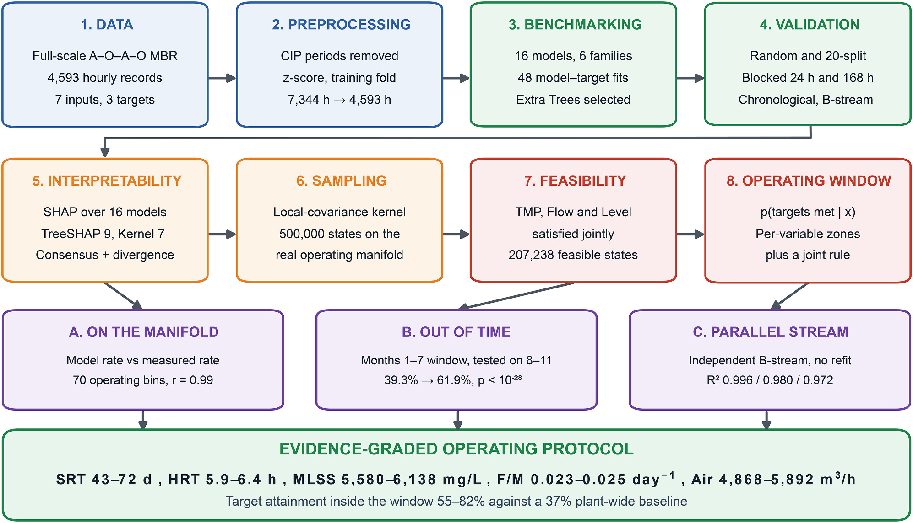
    - **Hình này chứng minh điều gì**
      - Thể hiện sự liên kết từ 8 giai đoạn phân tích tuần tự đến 3 kiểm định độc lập và dải vận hành tối ưu.
    - **Từ đâu mà thấy được**
      - Đọc từ trái sang phải, trên xuống dưới qua 8 khối số từ 1 (DATA) đến 8 (OPERATING WINDOW).
      - Ba khối tím (A, B, C) ở tầng dưới là 3 kiểm chứng độc lập dẫn vào thanh quy tắc vận hành màu xanh lá cây.
  - Đóng góp thứ nhất: cung cấp chuẩn so sánh (benchmarking) học máy quy mô lớn nhất cho MBR nước thải bán dẫn với 16 thuật toán thuộc 6 họ mô hình cùng lúc dự báo 3 biến mục tiêu (TMP, lưu lượng dòng thấm và mực nước bể màng) dưới 4 thiết kế kiểm định (ngẫu nhiên, chia 20 lần, phân khối theo thời gian, và ngoài thời gian / dòng độc lập) nhằm tách biệt năng lực dự báo thực sự khỏi ảnh hưởng của tự tương quan thời gian.
  - Đóng góp thứ hai: ứng dụng SHAP trên toàn bộ 16 mô hình giúp phân biệt các kết luận quy trình đạt đồng thuận chung với các sai lệch giả định do từng thuật toán cá biệt tạo ra.
  - Đóng góp thứ ba: lập bản đồ vùng vận hành khả thi bằng phương pháp tái lấy mẫu ràng buộc trên đa tạp (manifold-constrained resampling) thay vì lấy mẫu độc lập theo từng biến biên độ, xác thực cửa sổ vận hành thu được đối chiếu với tỷ lệ đạt mục tiêu thực tế của nhà máy và kiểm định ngoài thời gian trên các tháng chưa từng được học.
  - Khung phương pháp có khả năng chuyển giao trực tiếp về phương pháp luận cho các hệ thống MBR công nghiệp khác, trong khi các cửa sổ định lượng cụ thể mang tính đặc thù cho từng cơ sở và cần được huấn luyện lại trên dữ liệu riêng của cơ sở đó.

## 2. Models and methods

### 2.1. System description and data collection

- Hệ thống xử lý nước thải sản xuất chất bán dẫn tại thành phố Asan, Hàn Quốc (Asan City, Republic of Korea) vận hành theo cấu hình bể phản ứng sinh học màng ngập quy mô thực tế (full-scale submerged MBR) với công suất thiết kế $1125\text{ m}^3\text{/h}$:
  - Cấu hình sinh học sử dụng quy trình thiếu khí – hiếu khí – thiếu khí – hiếu khí (anoxic–oxic–anoxic–oxic: A-O-A-O) kết hợp màng siêu lọc ngập (submerged UF membranes), tích hợp đồng thời quá trình khử chất dinh dưỡng sinh học (biological nutrient removal) và phân tách rắn – lỏng (solid–liquid separation) trong một hệ thống duy nhất.
  - Nước thải sản xuất chất bán dẫn sau khi qua hệ thống MBR được dẫn sang hệ thống thẩm thấu ngược (reverse osmosis: RO) ở hạ lưu.
  - Hệ thống UF gồm $9700$ mô-đun màng sợi rỗng (hollow-fibre membrane modules) cấu tạo từ polyvinylidene fluoride (PVDF) do SUEZ sản xuất, cung cấp tổng diện tích màng $329{,}800\text{ m}^2$.
  - Thông số kỹ thuật chi tiết của hệ thống và thông tin cảm biến được trình bày tại Section S1 và Table S1 của tài liệu bổ sung (supplementary document).
- Thể tích làm việc của bể màng và các bể sinh học được công bố nhằm phục vụ tái lập các đại lượng thủy lực:
  - Bể phản ứng sinh học A-O-A-O có thể tích làm việc ở các vùng thiếu khí (anoxic zones) là $3841\text{ m}^3$ và ở các vùng hiếu khí (oxic zones) là $8604\text{ m}^3$.
  - Bể điều chỉnh pH (pH adjustment tank) có thể tích làm việc $376\text{ m}^3$, và bể màng (membrane tank) có thể tích làm việc $1437\text{ m}^3$.
  - Thời gian lưu thủy lực (hydraulic retention time: HRT) trong nghiên cứu này quy chiếu riêng cho các bể hiếu khí, được tính toán và ghi nhận tự động bởi hệ thống điều khiển nhà máy dưới dạng tham số ảo (virtual parameter: VP).
  - Giá trị HRT trung bình trong toàn bộ chu kỳ nghiên cứu đạt $7.33\text{ h}$.
- Dữ liệu vận hành được thu thập liên tục trong $306$ ngày vận hành liên tiếp (từ ngày $1$ tháng $1$ năm $2025$ đến ngày $3$ tháng $11$ năm $2025$), cung cấp $4593$ quan sát trung bình theo giờ:
  - Các tham số quy trình được hệ thống giám sát điều khiển và thu thập dữ liệu (SCADA) ghi nhận định kỳ $5\text{ phút}$ một lần và tổng hợp thành giá trị trung bình theo giờ (hourly averages).
  - Quá trình xử lý dữ liệu loại trừ các giai đoạn làm sạch hóa chất tại chỗ (cleaning-in-place: CIP), bao gồm các sự kiện làm sạch bảo trì (maintenance cleaning: MC) và làm sạch phục hồi (recovery cleaning: RC), do các giai đoạn này không đại diện cho hành vi tắc nghẽn màng thông thường (normal fouling behaviour).
- Nghiên cứu không áp dụng phân rã mùa vụ (seasonal decomposition) và không ghi nhận hiệu ứng mang tính mùa vụ đối với chuỗi số liệu:
  - Bản ghi dữ liệu kéo dài $10$ tháng liên tiếp thay vì trọn vẹn một chu kỳ năm, do đó biến thiên dài hạn không được xem là tín hiệu mang tính mùa vụ (seasonal signal).
  - Biến thiên ở thang thời gian dài được quy cho sự trôi dạt vận hành tiệm tiến (progressive operational drift), với hai động lực chính là hiện tượng lão hóa màng (membrane ageing) và diễn biến tích lũy của lịch sử làm sạch.

### 2.2. Process parameters and operating ranges

- Hệ thống giám sát liên tục (continuously monitored) ghi nhận $7$ thông số đầu vào (input parameters) mô tả điều kiện xử lý sinh học (biological treatment conditions) và trạng thái vận hành màng (membrane operating state):
  - Tốc độ châm glucose ($\text{Glu}$, glucose dosing rate): đại diện cho tải lượng hữu cơ bổ sung (surrogate for supplemental organic loading).
  - Nồng độ chất rắn lơ lửng trong bùn lỏng ($\text{MLSS}$, mixed liquor suspended solids).
  - Tốc độ sục khí ($\text{Air}$, aeration rate).
  - Tỷ lệ thức ăn trên vi sinh vật ($\text{F/M}$, food-to-microorganism ratio).
  - Tỷ lệ tổng cacbon hữu cơ trên tổng nitơ ($\text{C/N}$, ratio of total organic carbon to total nitrogen).
  - Thời gian lưu nước thủy lực ($\text{HRT}$, hydraulic retention time).
  - Thời gian lưu bùn ($\text{SRT}$, sludge retention time).
- Mô hình thực hiện dự báo $3$ biến mục tiêu đầu ra (target variables) đại diện cho các phương diện vận hành màng:
  - Áp suất xuyên màng ($\text{TMP}$, transmembrane pressure): chỉ thị chính cho hiện tượng nghẹt màng (primary fouling indicator).
  - Lưu lượng nước thấm qua màng ($\text{Flow}$, permeate flow rate): thước đo sản lượng làm việc (measure of productive output).
  - Mực nước trong bể màng ($\text{Level}$, membrane tank water level): chỉ số chỉ thị cân bằng thủy lực (indicator of hydraulic balance).
- Quy chuẩn đặt tên viết tắt và định nghĩa đại lượng thống nhất trong toàn bộ tài liệu:
  - Toàn bộ $10$ ký hiệu viết tắt ($\text{Glu}$, $\text{MLSS}$, $\text{Air}$, $\text{F/M}$, $\text{C/N}$, $\text{HRT}$, $\text{SRT}$, $\text{TMP}$, $\text{Flow}$ và $\text{Level}$) được sử dụng nhất quán xuyên suốt phần văn bản (text), bảng biểu (tables) và hình vẽ (figures), bao gồm cả phần tóm tắt (abstract) và từ khóa (keywords).
  - Tỷ lệ cacbon trên nitơ (carbon-to-nitrogen ratio) được đo lường dưới dạng $\text{TOC/TN}$; hai thuật ngữ này biểu thị cùng một đại lượng và chỉ ký hiệu $\text{C/N}$ được sử dụng từ đây về sau.
- Bảng đặc tính thống kê của tất cả các thông số đo lường (Table 1):
  - Bảng 1 (Table 1) tổng hợp các đặc tính thống kê (statistical characteristics) cho toàn bộ các thông số từ $4593$ bản ghi dữ liệu SCADA theo giờ:

| Đặc trưng (Feature) | Số lượng mẫu (Count) | Trung bình (Mean) | Độ lệch chuẩn (Std) | Nhỏ nhất (Min) | Lớn nhất (Max) |
| :--- | :---: | :---: | :---: | :---: | :---: |
| $\text{Glu}\ (\text{L/min})$ | $4593$ | $0.6775$ | $0.1807$ | $0.4027$ | $1.3515$ |
| $\text{MLSS}\ (\text{mg/L})$ | $4593$ | $4889.5$ | $1075.2$ | $1919.4$ | $7628.8$ |
| $\text{Air}\ (\text{m}^3/\text{h})$ | $4593$ | $5945.7$ | $534.5$ | $4469.1$ | $7268.3$ |
| $\text{F/M}\ (1/\text{day})$ | $4593$ | $0.0275$ | $0.0078$ | $0.0118$ | $0.0658$ |
| $\text{C/N ratio}$ | $4593$ | $9.4314$ | $2.2581$ | $4.8040$ | $17.5029$ |
| $\text{HRT}\ (\text{h})$ | $4593$ | $7.3346$ | $0.7947$ | $5.8738$ | $11.0411$ |
| $\text{SRT}\ (\text{day})$ | $4593$ | $87.828$ | $14.564$ | $43.323$ | $108.333$ |
| $\text{TMP}\ (\text{bar})$ | $4593$ | $-0.122$ | $0.090$ | $-0.462$ | $-0.034$ |
| $\text{Flow}\ (\text{m}^3/\text{min})$ | $4593$ | $1.817$ | $0.257$ | $0.618$ | $2.289$ |
| $\text{Level (lv)}\ (\%)$ | $4593$ | $65.774$ | $1.114$ | $64.005$ | $73.942$ |

  - Dải vận hành thực tế của các thông số đầu vào (operating ranges of input features):
    - Tốc độ châm glucose ($\text{Glu}$): biến thiên từ $0.4027$ đến $1.3515\ \text{L/min}$ (trung bình $0.6775 \pm 0.1807\ \text{L/min}$).
    - Nồng độ bùn hoạt tính ($\text{MLSS}$): dao động từ $1919.4$ đến $7628.8\ \text{mg/L}$ (trung bình $4889.5 \pm 1075.2\ \text{mg/L}$).
    - Tốc độ cấp khí sục màng ($\text{Air}$): dao động từ $4469.1$ đến $7268.3\ \text{m}^3/\text{h}$ (trung bình $5945.7 \pm 534.5\ \text{m}^3/\text{h}$).
    - Tỷ lệ dinh dưỡng trên vi sinh ($\text{F/M}$): dao động từ $0.0118$ đến $0.0658\ 1/\text{day}$ (trung bình $0.0275 \pm 0.0078\ 1/\text{day}$).
    - Tỷ lệ cacbon trên nitơ ($\text{C/N}$): dao động từ $4.8040$ đến $17.5029$ (trung bình $9.4314 \pm 2.2581$).
    - Thời gian lưu nước thủy lực ($\text{HRT}$): dao động từ $5.8738$ đến $11.0411\ \text{h}$ (trung bình $7.3346 \pm 0.7947\ \text{h}$).
    - Thời gian lưu bùn ($\text{SRT}$): dao động từ $43.323$ đến $108.333\ \text{day}$ (trung bình $87.828 \pm 14.564\ \text{day}$).
  - Dải biến thiên của các biến mục tiêu đầu ra (operating ranges of target variables):
    - Áp suất xuyên màng ($\text{TMP}$): dao động từ $-0.462$ đến $-0.034\ \text{bar}$ (trung bình $-0.122 \pm 0.090\ \text{bar}$).
    - Lưu lượng nước thấm qua màng ($\text{Flow}$): dao động từ $0.618$ đến $2.289\ \text{m}^3/\text{min}$ (trung bình $1.817 \pm 0.257\ \text{m}^3/\text{min}$).
    - Mực nước trong bể màng ($\text{Level}$): dao động từ $64.005$ đến $73.942\,\%$ (trung bình $65.774 \pm 1.114\,\%$).

### 2.3. Data preprocessing and standardisation

- Sau quy trình kiểm soát chất lượng (quality control), các đặc trưng đầu vào (input features) và biến mục tiêu đầu ra (output targets) được chuẩn hóa bằng phương pháp chuẩn hóa z-score (z-score normalization):
  - Chuẩn hóa z-score đảm bảo tất cả các biến đóng góp bình đẳng vào quá trình huấn luyện mô hình (model training), không phụ thuộc vào thang đo đo lường gốc (original measurement scales).
  - Quy trình giúp loại bỏ ảnh hưởng từ sự chênh lệch độ lớn giữa các thông số công nghệ khác nhau trong hệ thống xử lý nước thải bán dẫn.
- Các tham số chuẩn hóa được tính toán độc lập từ tập huấn luyện (training partition) nhằm loại bỏ rủi ro rò rỉ thông tin (information leakage):
  - Giá trị trung bình $\mu_{\text{train}}$ và độ lệch chuẩn $\sigma_{\text{train}}$ chỉ được xác định trên tập huấn luyện và áp dụng nhất quán sang tập kiểm tra (test set).
  - Công thức chuẩn hóa $z = \frac{x - \mu_{\text{train}}}{\sigma_{\text{train}}}$ được áp dụng theo mô tả tại Phần bổ sung S2 (Supplementary Section S2).
- Cấu trúc bản ghi dữ liệu vận hành gồm $4593$ mốc giờ ghi nhận đồng thời độ biến động ngắn hạn và sự dịch chuyển dài hạn trên $3$ biến mục tiêu đầu ra:
  - Chuỗi thời gian của lưu lượng thấm ($\text{Flow}$), áp suất chênh lệch qua màng ($\text{TMP}$) và mực nước bể màng ($\text{Level}$) bộc lộ độ biến thiên ngắn hạn đáng kể (substantial short-term variability) kết hợp cùng độ trôi dạt chậm (slower drift).
  - Hệ thống MBR thể hiện đồng thời cả sự dịch chuyển vận hành dần dần (gradual operational movement) và các biến đổi trạng thái đột ngột (abrupt transitions) trên toàn bộ $3$ biến đầu ra.
- Chuẩn hóa z-score bảo toàn nguyên vẹn hình thái phân bố thực nghiệm (empirical distribution) và đồng nhất thang đo (zero-mean, unit-variance scale):
  - Phép biến đổi giữ nguyên các đặc trưng phân bố gồm độ lệch (skewness), tính đa đỉnh (multimodality) và hành vi đuôi phân phối (tail behaviour).
  - Đưa tất cả các biến có phạm vi dải đo và đơn vị ban đầu khác biệt lớn về thang đo chuẩn hóa có giá trị trung bình bằng $0$ ($\mu = 0$) và phương sai bằng $1$ ($\sigma = 1$), cho phép so sánh trực tiếp độ lớn và mức độ biến thiên:
  - **Hình 2.** Chuỗi thời gian và phân bố của các biến trước và sau chuẩn hóa
    - 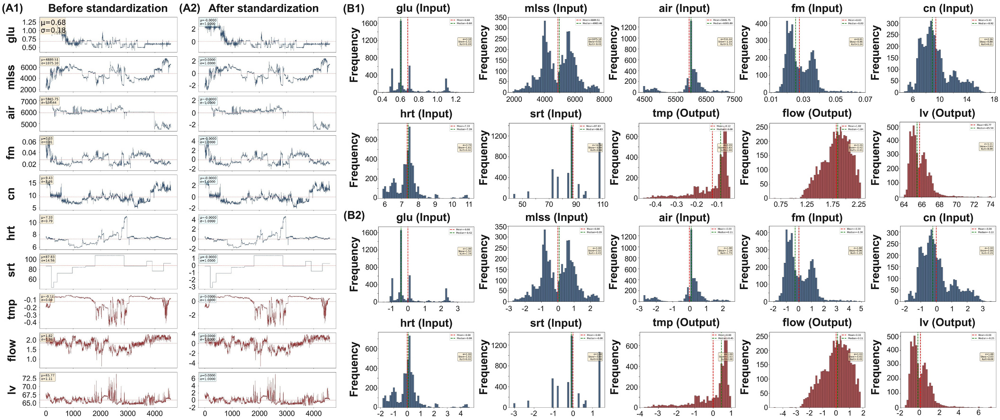
    - **Hình này chứng minh điều gì**
      - Chuẩn hóa z-score đưa toàn bộ biến về $\mu = 0.0000, \sigma = 1.0000$ mà không làm biến dạng hình học chuỗi thời gian và dạng phân bố.
    - **Từ đâu mà thấy được**
      - Bảng A: Trục hoành là thời gian ($0$ đến $4593\text{ h}$), trục tung là giá trị biến ($\text{L/min}$, $\text{mg/L}$, $\text{m}^3/\text{h}$, $\text{bar}$, $\text{m}^3/\text{min}$, $\%$, hoặc không thứ nguyên); A1 và A2 giữ nguyên đồ thị dao động.
      - Bảng B: Trục hoành là giá trị biến, trục tung là tần suất (`Frequency`); phân bố thô (B1) và chuẩn hóa (B2) giữ nguyên $\text{Skew}$ và $\text{Kurt}$.
- Ma trận hệ số tương quan Pearson (Pearson correlation matrices) trước và sau chuẩn hóa xác nhận các mối quan hệ tuyến tính giữa các biến được giữ nguyên vẹn:
  - Phép biến đổi chuẩn hóa z-score không làm thay đổi các mối quan hệ tuyến tính, bảo toàn toàn bộ cấu trúc phụ thuộc giữa các biến trong hệ thống:
    - Bảo toàn mối liên hệ âm (negative association) (hình ghi 0.31) giữa $\text{TMP}$ và $\text{Flow}$.
    - Bảo toàn sự ghép cặp giữa $\text{Level}$ và các biến liên quan đến tải trọng hữu cơ cùng nồng độ bùn gồm $\text{Glu}$ ($r = 0.14$), $\text{C/N}$ ($r = 0.18$) và $\text{SRT}$ ($r = 0.24$).
    - Bảo toàn các mối quan hệ thủy lực giữa thời gian lưu nước ($\text{HRT}$) và thời gian lưu bùn ($\text{SRT}$) trong việc đồng thời ràng buộc $\text{Flow}$ và $\text{Level}$ ($\text{SRT}$ tương quan với $\text{TMP}$ ở mức $r = -0.61$, với $\text{Flow}$ ở mức $r = -0.36$; $\text{HRT}$ tương quan với $\text{TMP}$ ở mức $r = -0.41$ và với $\text{Flow}$ ở mức $r = -0.30$).
  - **Hình 3.** Ma trận tương quan Pearson trước và sau chuẩn hóa
    - 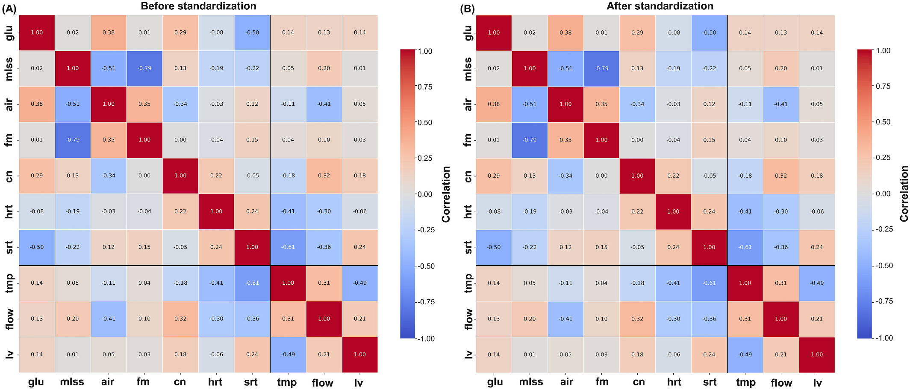
    - **Hình này chứng minh điều gì**
      - Chuẩn hóa bảo toàn tuyệt đối giá trị hệ số tương quan tuyến tính từng đôi giữa tất cả các thông số vận hành MBR.
    - **Từ đâu mà thấy được**
      - Trục $Ox, Oy$: $10$ biến vận hành ($7$ đầu vào, $3$ đầu ra, không thứ nguyên); thanh màu biểu thị hệ số tương quan $r \in [-1.00, 1.00]$.
      - Ma trận $10 \times 10$: Panel A (trước) và Panel B (sau) có các ô tương quan đồng nhất về màu sắc và giá trị số từ $-0.79$ ($\text{MLSS}$ - $\text{F/M}$) đến $+1.00$.
      - Lưu ý: hình ghi hệ số tương quan giữa TMP và Flow là 0.31, văn bản ghi mối liên hệ âm (negative association).
- Mực nước bể màng ($\text{Level}$) đóng vai trò là một biến trạng thái tích hợp (integrative state variable):
  - Các mối tương quan liên quan đến $\text{Level}$ phản ánh đồng thời cả điều kiện thủy lực (hydraulic conditions) và sự tích lũy sinh khối (biomass accumulation).
  - Biến $\text{Level}$ không phải là một biến mục tiêu độc lập thuần túy (purely independent target) mà là chỉ báo tổng hợp về cân bằng động bên trong hệ thống màng lọc sinh học.

### 2.4. Data split and robustness evaluation
- Quy trình đánh giá tính hợp lệ (validation) áp dụng bốn phương án phân chia bổ trợ lẫn nhau nhằm xử lý cấu trúc thời gian (temporal structure) vốn có của chuỗi dữ liệu đo theo giờ liên tục:
  - Dữ liệu ghi nhận liên tục theo giờ mang đặc tính phụ thuộc thời gian, khiến việc đánh giá qua một phân vùng đơn lẻ không đủ tin cậy.
  - Bốn phương án kiểm định được thiết lập để kiểm tra tính vững chắc và độ tin cậy của các mô hình trong các điều kiện tách biệt dữ liệu khác nhau.
- Phương án phân vùng ngẫu nhiên $70/30$ (random 70/30 partition) được duy trì để bảo đảm tính tương đồng và đối chiếu với các nghiên cứu công bố trước đó:
  - Tập huấn luyện (training set) gồm $3215$ mẫu.
  - Tập kiểm tra (test set) gồm $1378$ mẫu.
- Phân tích đa phân vùng (multi-split analysis) định lượng mức độ biến thiên phát sinh từ quá trình phân chia tập dữ liệu:
  - Phân tích thực hiện trên $20$ phân vùng ngẫu nhiên độc lập.
  - Toàn bộ $16$ mô hình học máy được huấn luyện lại hoàn toàn ở mỗi lượt phân chia.
- Phân vùng theo khối (blocked partitions) đánh giá trực tiếp khả năng tổng quát hóa từ ngày vận hành này sang ngày vận hành khác mà không làm mất tính bao phủ miền vận hành:
  - Chuỗi dữ liệu được chia thành các khối liên tục (contiguous blocks) với các khoảng thời gian gồm $1\text{ h}$, $6\text{ h}$, $24\text{ h}$, $72\text{ h}$, $168\text{ h}$, $336\text{ h}$ và $720\text{ h}$.
  - Toàn bộ từng khối dữ liệu được gán ngẫu nhiên vào các tập, giữ nguyên phạm vi bao phủ của miền vận hành (operating envelope) đồng thời tách biệt các giờ liền kề để loại bỏ rò rỉ tương quan ngắn hạn.
- Phân vùng theo trình tự thời gian (strictly chronological partition) và biến thể làm sạch (purged variant) kiểm định năng lực ngoại suy theo dòng thời gian thực tế:
  - Mô hình được huấn luyện trên $70\%$ khoảng thời gian đầu và kiểm tra trên $30\%$ khoảng thời gian cuối cùng.
  - Biến thể làm sạch loại bỏ một khoảng trống ranh giới kéo dài một tuần ($168\text{ h}$) giữa tập huấn luyện và tập kiểm tra để triệt tiêu hiệu ứng tương quan chuỗi tại điểm chuyển tiếp.
- Tập dữ liệu độc lập gồm $4593$ quan sát theo giờ từ nhánh B song song (parallel B stream) đánh giá khả năng chuyển giao không qua tái huấn luyện:
  - Dữ liệu thu thập từ nhánh B độc lập trong cùng một cơ sở xử lý nước thải bán dẫn để kiểm tra mức độ chuyển giao sang một hệ thống màng lọc tách biệt về mặt vật lý.
  - Mô hình được kiểm tra trực tiếp mà không thực hiện tái huấn luyện (without retraining).
- Quy trình chuẩn hóa và cấu trúc phụ thuộc dữ liệu tuân thủ kiểm soát rò rỉ thông tin chặt chẽ:
  - Các thống kê chuẩn hóa (standardisation statistics) chỉ được tính toán trên tập huấn luyện (training fold) của từng phương án thiết kế để tránh rò rỉ dữ liệu (data leakage).
  - Cấu trúc phụ thuộc của hồ sơ vận hành và kết quả chi tiết của từng thiết kế kiểm định được trình bày tại các Bảng bổ sung từ Bảng S9 đến Bảng S12 (Supplementary Tables S9 to S12).

### 2.5. Machine learning model selection and training

- Nghiên cứu đánh giá $16$ thuật toán hồi quy (regression algorithms) thuộc $6$ họ mô hình hóa (modelling families) nhằm dự báo $3$ biến mục tiêu (targets) từ $7$ thông số vận hành (operational parameters) (Bảng 2 / Table 2):
  - Danh mục mô hình được xây dựng như một phép kiểm định giả thuyết có cấu trúc (structured hypothesis test) thay vì một bài toán mô hình hóa không định hướng (undirected modelling exercise).
  - Mỗi họ mô hình kiểm định một giả thuyết có thể bác bỏ (falsifiable hypothesis) về cấu trúc của mối quan hệ sinh học – màng lọc (biology–membrane relationship).
- Sáu họ mô hình hóa và các giả thuyết kiểm định tương ứng:
  - Các mô hình tuyến tính và tuyến tính điều chuẩn (Linear and regularised linear models): kiểm định xem mối quan hệ có tính cộng tính (adequately additive) và đơn điệu (monotonic) thỏa đáng hay không, trong đó kỹ thuật điều chuẩn (regularisation) thăm dò thêm liệu tầm quan trọng biểu kiến (apparent importance) có phải là một hiện tượng giả tạo do cộng tuyến (artefact of collinearity) hay không.
  - Hồi quy vector hỗ trợ với nhân hàm bán kính cơ sở RBF (Support vector regression - SVR with an RBF kernel): kiểm định xem một mặt cong phi tuyến trơn toàn cục (smooth global non-linear surface) có đáp ứng đầy đủ hay không.
  - K láng giềng gần nhất (K-nearest neighbours - KNN): kiểm định xem hành vi tắc nghẽn màng (fouling behaviour) có tính đều cục bộ (locally regular) trong không gian vận hành hay không (tức các điều kiện tương đồng có tạo ra các phản hồi tương đồng một cách đáng tin cậy hay không) — giả định nền tảng cho mọi khuyến nghị về cửa sổ vận hành (operating-window recommendation).
  - Các mô hình tổ hợp dựa trên cây (Tree-based ensembles): kiểm định xem các hiệu ứng ngưỡng (threshold effects) và tương tác đặc trưng (feature interactions) có chi phối hay không, theo đúng dự đoán của lý thuyết tắc nghẽn màng cổ điển (classical fouling theory).
    - Phép đối chiếu giữa bagging và boosting (bagging-versus-boosting contrast) bên trong họ mô hình cây kiểm định xem giảm phương sai (variance reduction) hay giảm độ chệch tuần tự (sequential bias reduction) là giải pháp phản hồi tốt hơn đối với dữ liệu cảm biến công nghiệp chứa nhiễu (noisy industrial sensor data).
  - Mạng perceptron đa tầng với $2$ lớp ẩn (Multi-layer perceptron - MLP with two hidden layers): kiểm định xem các biểu diễn phân cấp (hierarchical representations) có đóng góp thêm giá trị nào vượt ngoài các mô hình trên hay không.
- Quy luật thành công và thất bại của các họ mô hình cung cấp bằng chứng thực nghiệm về cấu trúc tắc nghẽn màng trong hệ thống (được báo cáo tại Mục 3.1 / Section 3.1):
  - Một mô hình duy nhất (single model) được lựa chọn tiếp nối cho phân tích giải thích (interpretation) và tối ưu hóa (optimisation) nhằm duy trì tính nhất quán của khung phân tích trên cả $3$ biến mục tiêu.
- Cấu hình triển khai, siêu tham số và thư viện phần mềm:
  - Công thức toán học (formulations), siêu tham số (hyperparameters) và cấu hình huấn luyện (training configurations) cho toàn bộ $16$ thuật toán được cung cấp tại Mục S3 (Section S3) và Bảng S2 (Table S2).
  - Toàn bộ quy trình tính toán được thực hiện trong môi trường Python 3.10 sử dụng các thư viện NumPy, pandas, scikit-learn, XGBoost, LightGBM và SHAP.

### 2.6. Interpretability analysis through multi-model SHAP

- Phân tích SHAP (SHapley Additive exPlanations) được áp dụng trên toàn bộ $16$ mô hình và $3$ biến mục tiêu (targets), thiết lập $48$ hồ sơ khả năng diễn giải (interpretability profiles):
  - Khung phân tích đa mô hình (multi-model framework) làm sáng tỏ liệu các thuật toán khác nhau có đạt được sự đồng thuận về độ quan trọng của đặc trưng (feature importance) hay không.
  - Phân tích đa mô hình giúp phát hiện sai lệch phụ thuộc mô hình (model-dependent bias) mà các phân tích đơn mô hình (single-model analyses) không thể nhận diện được.
- Phân bổ thuật toán SHAP theo kiến trúc mô hình và các dạng đồ thị trực quan hóa:
  - TreeSHAP được áp dụng cho $9$ mô hình dựa trên cây (tree-based models).
  - KernelSHAP được áp dụng cho $7$ mô hình không dựa trên cây (non-tree models).
  - Biểu đồ bầy ong (beeswarm plots), giá trị SHAP tuyệt đối trung bình (mean absolute SHAP values) và biểu đồ phụ thuộc (dependence plots) được khởi tạo cho từng tổ hợp mô hình – mục tiêu (model–target combination).
- Bản chất thống kê của giá trị SHAP và giới hạn diễn giải cơ chế:
  - Do SHAP định lượng phần đóng góp của từng đặc trưng vào đầu ra dự báo của mô hình, giá trị này phản ánh mối liên hệ thống kê (association) bên trong phân phối dữ liệu huấn luyện (training distribution), chứ không phải quan hệ nhân quả vật lý đã được kiểm chứng (verified physical causation).
  - Các diễn giải cơ chế (mechanistic explanations) đưa ra tại Mục 3.2 là những diễn giải hợp lý về mặt vật lý (physically plausible) và nhất quán với y văn khoa học (literature-consistent interpretations), không phải các cơ chế đã được thực nghiệm chứng minh (demonstrated mechanisms).

### 2.7. Optimal operating condition identification

- Khung khả thi đa mục tiêu (multi-objective feasibility framework) xác định các vùng vận hành thỏa mãn đồng thời tiêu chuẩn mục tiêu cho cả 3 biến đầu ra (outputs).
  - 7 biến vận hành ($7$ operating variables) có tính phụ thuộc lẫn nhau trong thực tế, do đó các điểm ứng viên (candidates) được tạo lập nhằm tôn trọng cấu trúc liên kết đồng thời (joint structure) này.
  - Cơ sở lý thuyết và kết quả so sánh đối chứng với phương pháp lấy mẫu độc lập theo từng dải biên phân bố riêng lẻ (independent sampling of marginal ranges) được trình bày chi tiết tại Supplementary Section S5.
- Không gian khả thi được lập bản đồ bằng kỹ thuật tái lấy mẫu hạt nhân hiệp phương sai cục bộ bị ràng buộc trên đa tạp vận hành liên kết thực tế (local-covariance kernel resampling constrained to the plant's real joint operating manifold) của nhà máy:
  - Một giờ hạt giống (seed hour) được rút ngẫu nhiên đồng đều (drawn uniformly) từ $4593$ quan sát lưu trữ trong nhật ký vận hành SCADA.
  - Ma trận hiệp phương sai cục bộ (local covariance) được thiết lập từ $30$ láng giềng gần nhất (nearest neighbours) của điểm hạt giống trong không gian đầu vào đã chuẩn hóa (standardised input space).
  - Điểm hạt giống được gây nhiễu bằng một lượng gia phân phối chuẩn (Gaussian increment) nhân với hệ số độ rộng dải (bandwidth factor) $0.6$ áp dụng lên ma trận hiệp phương sai cục bộ.
  - Điểm ứng viên bị loại bỏ (rejected) nếu vượt ra ngoài dải biên quan sát (observed marginal range) của bất kỳ biến đầu vào nào, hoặc nếu khoảng cách láng giềng gần nhất tới tập dữ liệu thực tế vượt quá phân vị thứ 99 ($99\text{th percentile}$) của khoảng cách láng giềng gần nhất giữa các điểm dữ liệu thực ($0.539$ đơn vị chuẩn hóa).
  - Quá trình tạo mẫu thu được $500{,}000$ ứng viên với khoảng cách láng giềng gần nhất trung vị (median nearest-neighbour distance) đạt $0.121$, tương đương mức $0.119$ giữa các giờ vận hành thực tế.
  - Mẫu dữ liệu thám hiểm liên tục không gian xung quanh đa tạp mà không thoát ly khỏi cấu trúc đa tạp thực tế.
- Tiêu chí phân loại trạng thái khả thi (feasible) yêu cầu toàn bộ 3 giá trị dự báo phải đồng thời nằm trong dải mục tiêu kỹ thuật.
  - Độ bất định dự báo (predictive uncertainty) được xác định dựa trên độ phân tán (dispersion) của $100$ cây quyết định riêng lẻ (individual trees) trong mô hình Extra Trees.
- Cửa sổ vận hành khuyến nghị (operating windows) được xác định từ tỷ lệ khả thi có điều kiện (conditional feasibility rate) thay vì mật độ các điểm khả thi (density of feasible points):
  - Tỷ lệ khả thi có điều kiện phản ánh xác suất đáp ứng đồng thời cả 3 mục tiêu với một giá trị đầu vào cho trước ($p(\text{all three targets met} \mid \text{input})$).
  - Mật độ điểm khả thi thuần túy chỉ biểu thị tần suất nhà máy vận hành tại vùng đó, không phản ánh chất lượng vận hành đạt yêu cầu.
  - Mỗi biến đầu vào được chia thành 10 khoảng phân vị (deciles).
  - Dải khuyến nghị (recommended band) là chuỗi phân vị liên tục rộng nhất (widest contiguous run) có tỷ lệ đạt mục tiêu đo lường duy trì trong phạm vi $5$ điểm phần trăm ($5\text{ percentage points}$) so với mức tối đa.
  - Quy tắc xác định dải chịu ràng buộc bởi ngưỡng kích thước mẫu tối thiểu là $250\text{ giờ}$ ghi nhận ($250\text{ logged hours}$).
  - $4$ trong số $7$ dải thông số vận hành giữ nguyên không đổi theo tiêu chuẩn này, minh chứng cho các điểm tối ưu thực sự rõ nét (genuinely sharp optima).
- Phương pháp ước lượng mật độ hạt nhân (KDE - Kernel Density Estimation) tái tạo hàm mật độ phân bố liên tục cho các trạng thái vận hành:
  - KDE là phương pháp phi tham số (non-parametric method) tính tổng các hàm hạt nhân trơn đặt tại tâm mỗi điểm quan sát, loại bỏ sự phụ thuộc vào cách chia khoảng (bin-placement dependence) của biểu đồ phân bố (histogram).
  - Thuật toán sử dụng hàm hạt nhân Gaussian (Gaussian kernel) với độ rộng dải xác định theo quy tắc Scott (Scott's-rule bandwidth).
  - Các thuật toán tính toán chi tiết được trình bày trong Supplementary Section S5.

### 2.8. Evaluation metrics

- Độ chính xác dự đoán (prediction accuracy) được định lượng bằng 3 thước đo bổ trợ lẫn nhau (three complementary metrics):
  - Hệ số xác định (coefficient of determination - $R^2$).
  - Căn bậc hai của sai số bình phương trung bình (root mean squared error - $\text{RMSE}$).
  - Sai số tuyệt đối trung bình (mean absolute error - $\text{MAE}$).
- Các công thức toán học (mathematical formulations) của các thước đo được cung cấp trong Mục bổ sung S4 (Supplementary Section S4).

## 3. Results and discussion

### 3.1. ML model prediction performance

#### 3.1.1. Output prediction performance

- Hiệu suất dự đoán của toàn bộ $16$ mô hình học máy được đánh giá đối với $3$ biến mục tiêu gồm áp suất xuyên màng (transmembrane pressure: TMP), lưu lượng nước sau lọc (permeate flow) và mức nước bể màng (membrane tank water level).
- Bản đồ nhiệt $R^2$ và đồ thị phân tán giữa giá trị dự đoán so với giá trị thực tế thể hiện thứ bậc rõ ràng về năng lực mô hình và mức độ dự đoán được của các biến mục tiêu:
  - **Hình 4.** Bản đồ nhiệt $R^2$ và đồ thị phân tán dự đoán của Extra Trees
    - 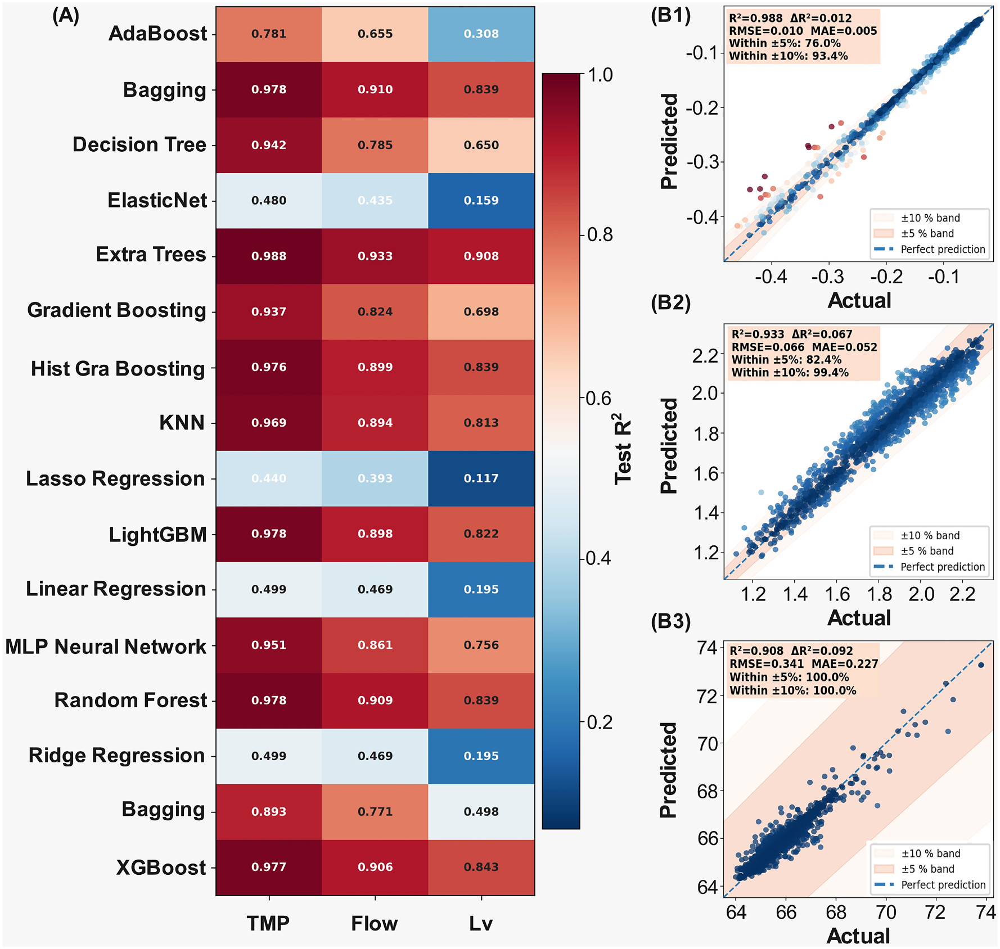
    - **Hình này chứng minh điều gì**
      - Thể hiện sự phân tầng hiệu suất rõ rệt: các mô hình họ cây tổ hợp chiếm ưu thế với Extra Trees đạt độ chính xác cao nhất trên cả ba biến mục tiêu theo thứ tự giảm dần từ TMP đến lưu lượng permeate và mức nước bể màng.
    - **Từ đâu mà thấy được**
      - Panel (A): Bản đồ nhiệt $16$ mô hình $\times$ $3$ biến mục tiêu; dải màu đỏ sẫm ($R^2 > 0.9$) chiếm trọn hàng Extra Trees và cột TMP, giảm dần sang màu xanh dương ở các mô hình tuyến tính ($R^2 < 0.5$).
      - Panel (B1)–(B3): Đồ thị phân tán của Extra Trees; các điểm dữ liệu phân bố bám sát đường lý tưởng $1:1$ (nét đứt) với $93.4\%$ điểm TMP và $99.4\%$ điểm lưu lượng nằm trong dải sai số $\pm 10\%$, và $100.0\%$ điểm mức nước nằm trong dải $\pm 5\%$.
  - TMP đạt độ chính xác dự đoán cao nhất, tiếp theo là lưu lượng permeate và sau đó là mức nước bể màng.
- Chất lượng nước sau xử lý (effluent quality) được chủ động loại trừ khỏi danh sách biến mục tiêu dự đoán:
  - Hàm lượng tổng cacbon hữu cơ trong nước sau lọc (permeate TOC) được đo bằng máy phân tích trực tuyến (online analyser) có dải đo $0.03\text{--}1000\text{ ppb}$, khiến giá trị đo nằm gần giới hạn phát hiện (detection limit) trong phần lớn chuỗi dữ liệu.
  - Màng siêu lọc (ultrafiltration: UF) giữ lại hầu như toàn bộ các chất rắn lơ lửng và vật liệu có khối lượng phân tử cao, do đó tín hiệu đo TOC bị chi phối bởi nhiễu máy phân tích (analyser noise).
  - Về mặt bản chất, chất lượng nước sau lọc UF trong hệ MBR ngập bị chi phối bởi tính toàn vẹn của màng (membrane integrity) — một hiện tượng thay đổi đột ngột (step-change phenomenon) liên quan đến sự đứt gãy sợi màng (fibre breakage) thay vì là hàm liên tục theo các biến vận hành, biến đây thành bài toán giám sát tính toàn vẹn (integrity-monitoring problem) thay vì mục tiêu hồi quy (regression target).
  - Ba biến mục tiêu được lựa chọn đại diện cho các thông số mà người vận hành có thể chủ động điều chỉnh và đánh đổi (trade against one another) theo từng giờ.
- Bảng 2 tóm tắt cấu trúc của $16$ thuật toán học máy thuộc $6$ họ mô hình (model families):
  - Tuyến tính (Linear, $1$ thuật toán): Hồi quy tuyến tính (Linear Regression).
  - Tuyến tính điều chuẩn (Regularised Linear, $3$ thuật toán): Ridge, Lasso, Elastic Net.
  - Máy vector hỗ trợ (Support Vector Machine: SVM, $1$ thuật toán): SVR với hàm nhân RBF (RBF kernel).
  - Dựa trên cá thể (Instance-based, $1$ thuật toán): $k$ láng giềng gần nhất (K-Nearest Neighbours: KNN).
  - Cây tổ hợp (Ensemble Tree, $9$ thuật toán): Cây quyết định (Decision Tree), Rừng ngẫu nhiên (Random Forest), Extra Trees, Bagging, AdaBoost, Gradient Boosting, Hist Gradient Boosting, XGBoost, LightGBM.
  - Mạng nơ-ron (Neural Network, $1$ thuật toán): Perceptron đa lớp (Multi-Layer Perceptron: MLP).
- Đối với áp suất xuyên màng (TMP), các mô hình học kết hợp dạng cây chiếm ưu thế rõ rệt:
  - Extra Trees đạt độ chính xác cao nhất với $R^2 = 0.988$, $\text{RMSE} = 0.010\text{ bar}$, và $\text{MAE} = 0.005\text{ bar}$.
  - Nhóm các mô hình bám sát phía sau gồm Bagging, Random Forest và LightGBM (cùng đạt $R^2 = 0.978$), và XGBoost ($R^2 = 0.977$), cả $5$ mô hình dẫn đầu đều có $R^2 > 0.97$ (Hình 4, Hình S1).
  - Khả năng dự đoán mạnh mẽ của TMP có cơ sở diễn giải vật lý trực tiếp: trong các hệ thống màng ngập, TMP bị chi phối bởi trở lực tắc nghẽn (fouling resistance) tích lũy tiệm tiến theo nồng độ chất rắn lơ lửng trong bùn lỏng (mixed liquor suspended solids: MLSS), cường độ sục khí làm sạch màng (aeration scouring intensity) và các đặc tính bùn phụ thuộc vào thời gian lưu bùn (sludge retention time: SRT).
  - Toàn bộ các thông số chi phối này đều được cung cấp trực tiếp làm biến đầu vào cho mô hình.
  - TMP được đo lường dưới dạng áp suất hút (suction pressure) ở phía nước sau lọc (permeate side), mang lại tín hiệu ổn định hơn và có tỷ số tín hiệu trên nhiễu (signal-to-noise ratio: SNR) cao hơn so với các cấu hình màng điều áp (pressurised configurations).
- Dự đoán lưu lượng permeate duy trì thứ tự xếp hạng mô hình tương tự nhưng có giá trị $R^2$ thấp hơn một mức vừa phải:
  - Extra Trees tiếp tục dẫn đầu với $R^2 = 0.933$, $\text{RMSE} = 0.066\text{ m}^3\text{/min}$, và $\text{MAE} = 0.052\text{ m}^3\text{/min}$.
  - Top 5 mô hình hoàn thiện với Bagging ($R^2 = 0.910$), Random Forest ($R^2 = 0.909$), XGBoost ($R^2 = 0.906$), và Hist Gradient Boosting ($R^2 = 0.899$) (Hình 4, Hình S2).
  - Độ chính xác giảm so với TMP phù hợp với cơ chế vận hành của hệ thống MBR:
    - Lưu lượng permeate không chỉ chịu tác động từ trạng thái tắc nghẽn màng mà còn phụ thuộc vào các điểm đặt do người vận hành kiểm soát (operator-controlled setpoints), chu kỳ rửa ngược (backwash cycling) và các nhiễu động thủy lực tức thời (transient hydraulic disturbances) vốn không được phản ánh trọn vẹn qua các biến đầu vào lấy trung bình theo giờ (hourly-averaged input parameters).
    - Tác động của chế độ sục khí gián đoạn (intermittent aeration scouring) lên lưu lượng permeate tức thời gây ra độ biến thiên mà các mô hình độ trung thực cao không thể nắm bắt đầy đủ nếu chỉ dựa thuần túy vào các đặc trưng sinh học và vận hành sẵn có.
- Mức nước bể màng là mục tiêu thách thức nhất trong ba biến đầu ra:
  - Mô hình đạt hiệu quả cao nhất là Extra Trees với $R^2 = 0.908$, $\text{RMSE} = 0.341\%$, và $\text{MAE} = 0.227\%$ dưới phép phân chia ngẫu nhiên (random partition).
  - Các mô hình tổ hợp hàng đầu đạt $R^2$ dao động trong khoảng từ $0.82$ đến $0.91$, trong khi toàn bộ các họ mô hình khác đều thấp hơn đáng kể.
- Thứ bậc độ chính xác giữa ba biến mục tiêu phản ánh cơ chế vật lý trực tiếp:
  - TMP dễ dự đoán nhất do đại lượng này tích phân trở lực tắc nghẽn qua nhiều giờ đến nhiều ngày; các biến chi phối sự tích lũy này (chủ yếu là SRT và MLSS) biến thiên chậm và được đo đạc trực tiếp.
  - Lưu lượng permeate nằm ở mức trung gian vì chỉ phản ánh một phần đặc tính của màng, phần còn lại bị quy định bởi nhu cầu lưu lượng xử lý (throughput demand), chu kỳ rửa ngược và các biến động thủy lực ngắn hạn mà mức trung bình theo giờ không thể phân giải được.
  - Mức nước bể màng khó dự đoán nhất do là một trạng thái thủy lực biến thiên nhanh (fast hydraulic state), bị chi phối bởi cân bằng tức thời giữa lưu lượng đầu vào (influent), lưu lượng hút permeate, lưu lượng tuần hoàn nội bộ (internal recirculation), xả bùn dư (sludge wasting) và thuật toán logic điều khiển bơm theo mức nước — trong đó nhiều yếu tố diễn ra ở thang phút và không yếu tố nào trong số này là biến đầu vào của mô hình.
- Độ dốc khả năng dự đoán (predictability gradient) phân hạng các biến mục tiêu theo mức độ động học của chúng được định hình bởi trạng thái sinh học biến thiên chậm thay vì các hành động điều khiển tức thời:
  - Hoạch định vận hành dựa trên mô hình (model-based planning) có độ tin cậy cao nhất đối với TMP.
  - Mức nước bể màng thích hợp hơn khi được quản lý bằng các đòn bẩy điều khiển nhanh (fast levers) được xác định tại Mục 3.3.
  - Độ chính xác dự đoán mức nước vẫn duy trì giá trị hữu ích trong thực tế vận hành, với $\text{MAE} < 0.23\%$ so với biên độ kiểm soát $2\%$ (control window).

#### 3.1.2. Model comparison, consistency and independent validation

- Khoảng cách lớn và mang tính hệ thống (systematic gap) phân tách các mô hình tuyến tính khỏi các mô hình phi tuyến trên cả $3$ biến mục tiêu (Table 3):
  - Hồi quy tuyến tính (Linear Regression) và hồi quy Ridge (Ridge Regression) chỉ đạt $R^2 = 0.499$ cho TMP, $0.469$ cho lưu lượng (permeate flow) và $0.195$ cho mực nước (water level).
  - Các biến thể điều chuẩn (regularised variants) cho kết quả kém hơn một chút do kỹ thuật co hệ số mạnh (aggressive shrinkage) đã loại bỏ các hệ số nhỏ nhưng mang thông tin.
  - Các mô hình kết hợp tốt nhất (best ensemble models) đều đạt $R^2 > 0.90$ trên cả $3$ biến mục tiêu.
- Kiểm định giả thuyết có cấu trúc (structured hypothesis test) đối với cơ chế màng sinh học:
  - Sự thất bại của họ mô hình cộng tính (additive family) kết hợp cùng sự thành công của thuật toán phân vùng đệ quy (recursive partitioning) chứng minh mối quan hệ giữa sinh học và màng (biology–membrane relationship) bị chi phối bởi các ngưỡng (thresholds) và tương tác (interactions) thay vì các tác động tỷ lệ thuận tuyến tính.
  - Phù hợp với lý thuyết tắc nghẽn màng (fouling theory):
    - Trở lực lớp bánh lọc (cake resistance) gia tăng nhanh đột biến khi MLSS vượt qua nồng độ tới hạn (critical MLSS).
    - Tốc độ sục khí (aeration rate) bộc lộ hiệu suất giảm dần (diminishing returns) khi vượt trên vận tốc cọ rửa tới hạn (critical scouring velocity).
    - Tỷ lệ F/M và thời gian lưu bùn (SRT) tương tác phi cộng tính (interact non-additively) $[25, 29, 36, 38]$.
- So sánh hiệu năng nội bộ trong họ mô hình kết hợp (ensemble family):
  - Các biến thể đóng bao (bagging variants) liên tục đạt hiệu năng cao hơn phương pháp tăng cường tuần tự (sequential boosting).
  - Hai thuật toán tăng cường XGBoost ($R^2 = 0.977$) và LightGBM ($R^2 = 0.978$) đạt hiệu năng gần tương đương với bagging đối với biến mục tiêu TMP.
  - AdaBoost có hiệu năng kém rõ rệt trên mọi biến mục tiêu ($R^2$ lần lượt là $0.781$ cho TMP, $0.655$ cho lưu lượng và $0.308$ cho mực nước), phù hợp với độ nhạy cao của cơ chế tái gán trọng số thích ứng (adaptive reweighting) đối với các hiện tượng nhiễu cảm biến (sensor artefacts) trong dữ liệu SCADA công nghiệp.
  - Lợi thế về hiệu năng của Extra Trees so với Random Forest bắt nguồn từ việc ngẫu nhiên hóa bổ sung các ngưỡng phân chia (split thresholds).
- Hiệu năng của các mô hình phi tuyến không dựa trên cây (non-tree non-linear models):
  - KNN đạt hiệu năng cao với $R^2$ lần lượt là $0.969$ cho TMP, $0.894$ cho lưu lượng và $0.813$ cho mực nước.
  - Kết quả này chỉ ra rằng phản ứng của màng lọc có tính quy luật cục bộ (locally regular) trong không gian vận hành, là điều kiện tiên quyết giúp khuyến nghị cửa sổ vận hành (operating-window recommendation) mang lại ý nghĩa thực tế.
- Đánh giá hiện tượng quá khớp (overfitting) và độ ổn định mô hình:
  - Chỉ duy nhất cây quyết định (Decision Tree) đối với biến mục tiêu mực nước bộc lộ hiện tượng quá khớp đáng kể ($R^2 = 0.890$ trên tập huấn luyện so với $0.650$ trên tập kiểm tra).
  - Phân tích qua $20$ lần phân chia dữ liệu (20-split analysis, Table S3, Figs. S4–S6) xác nhận Extra Trees là mô hình tốt nhất với $R^2$ trung bình cao nhất cùng RMSE và MAE thấp nhất trên cả $3$ biến mục tiêu.
- Đánh giá khả năng chuyển giao sang hệ thống màng độc lập về mặt vật lý (parallel B stream):
  - Thử nghiệm được tiến hành trên tập dữ liệu độc lập gồm $4593$ quan sát theo giờ từ nhánh song song B (parallel B stream) trong cùng cơ sở xử lý, vận hành dưới điều kiện nước đầu vào khác biệt và có lịch sử tắc nghẽn màng độc lập (Fig. S7).
  - Mô hình Extra Trees được áp dụng trực tiếp mà không cần huấn luyện lại (without retraining), đạt $R^2 = 0.996$ (hình ghi $0.9764$) cho TMP, $0.980$ (hình ghi $0.9590$) cho lưu lượng và $0.972$ (hình ghi $0.9244$) cho mực nước (Table S4, Fig. 5A–C):
    - **Hình 5.** Đánh giá hiệu năng và sai số của Extra Trees trên tập độc lập
      - 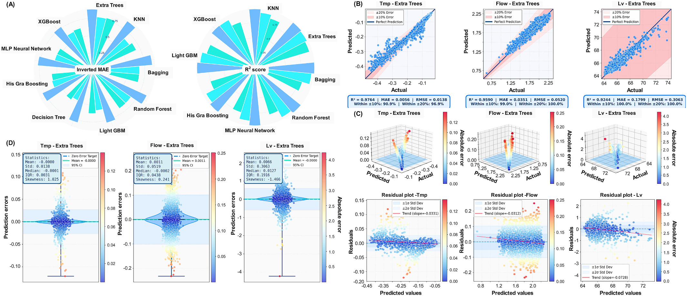
      - **Hình này chứng minh điều gì**
        - Điểm dự báo bám sát đường $1:1$ và phần dư phân bố đều quanh $0$, chứng minh mô hình chuyển giao sang nhánh độc lập không bị lệch hệ thống.
      - **Từ đâu mà thấy được**
        - Panel B: $90.9\%$ điểm TMP, $99.0\%$ điểm lưu lượng và $100.0\%$ điểm mực nước nằm trong dải dung sai $\pm 10\%$.
        - Panel C, D: đồ thị phần dư phẳng quanh $0$; phân phối sai số đối xứng với độ lệch chuẩn nhỏ ($0.0138\text{ bar}$, $0.0519\text{ m}^3\text{/min}$, $0.3063\,\%$).
        - Lưu ý: hình ghi $R^2$ lần lượt là $0.9764$, $0.9590$, $0.9244$; văn bản ghi $0.996$, $0.980$, $0.972$.
  - Sai số trung bình (mean errors) tiệm cận $0$ và độ lệch chuẩn sai số đạt $0.014\text{ bar}$ cho TMP, $0.052\text{ m}^3\text{/min}$ cho lưu lượng và $0.306\,\%$ cho mực nước (Fig. 5D).
  - Phân phối sai số TMP hơi lệch phải (độ lệch xiên / skewness đạt $1.025$), phản ánh xu hướng thỉnh thoảng đánh giá thấp TMP khi màng bị tắc nghẽn nghiêm trọng (extreme fouling):
    - Xu hướng này an toàn về mặt vận hành (conservative direction) do thúc đẩy tiến hành làm sạch màng sớm hơn thay vì muộn hơn.
  - Do nhánh B vận hành trong cùng khoảng thời gian và tiếp nhận cùng nguồn nước đầu vào, kết quả này xác lập khả năng chuyển giao giữa các chuỗi lọc màng (transfer across membrane trains) thay vì chuyển giao theo thời gian (temporal transfer).
- Tổng hợp lựa chọn mô hình và tính nhất quán của khung vận hành:
  - Hiệu năng trên tập kiểm tra chính, phân tích độ mạnh qua $20$ lần phân chia dữ liệu và kiểm định trên nhánh song song đồng thuận xác định Extra Trees là mô hình tốt nhất cho cả $3$ biến mục tiêu.
  - Extra Trees được lựa chọn để triển khai phân tích khả năng diễn giải tại Mục 3.2 và tối ưu hóa vận hành tại Mục 3.3.
  - Sử dụng đồng nhất một mô hình cho cả $3$ biến mục tiêu duy trì tính nhất quán của khung vận hành (operational framework) và việc diễn giải độ quan trọng của đặc trưng (feature-importance interpretation) trên cả $3$ chỉ số hiệu năng.

#### 3.1.3. Robustness of the model selection to the validation design

- Đánh giá tính vững chắc của quy trình lựa chọn mô hình qua bốn thiết kế kiểm định độc lập (four independent validation designs):
  - Quyết định lựa chọn mô hình cho hồ sơ vận hành nhà máy quy mô đầy đủ (full-scale plant record) không thể chỉ dựa trên một phương án phân chia đơn lẻ, do đó Extra Trees được kiểm chứng qua $4$ thiết kế độc lập:
    - Phân chia ngẫu nhiên truyền thống $70/30$ (conventional random $70/30$ partition).
    - Thiết kế phân khối (blocked design): các khối thời gian liên tục được phân bổ thành từng đơn vị nguyên vẹn để bảo toàn phạm vi bao phủ của miền vận hành (operating envelope) trong khi vẫn tách biệt các giờ liền kề.
    - Phân chia tuần tự theo thời gian nghiêm ngặt (strictly chronological partition).
    - Phân tích kiểm định trên nhánh song song B độc lập (independent parallel B stream).
  - Extra Trees thể hiện tính ổn định cao và giữ vị trí dẫn đầu trong hầu hết các kịch bản thử nghiệm:
    - Extra Trees xếp hạng nhất ở $8$ trong số $9$ tổ hợp mô hình – thiết kế – mục tiêu (model–design–target combinations).
    - Xếp hạng nhất cho mọi biến mục tiêu dưới cả thiết kế phân chia ngẫu nhiên và thiết kế phân khối $24\text{ h}$ (24-h blocked designs) (Table S10).
  - Độ chính xác dưới thiết kế phân khối $24\text{ h}$ duy trì ở mức cao đối với hệ thống công nghiệp quy mô đầy đủ:
    - Đối với biến TMP: đạt $R^2 = 0.830$, tương ứng với $\text{RMSE} = 0.036\text{ bar}$ trên dải vận hành $0.43\text{ bar}$.
    - Sai số tuyệt đối trung bình ($\text{MAE}$) bằng $16.3\%$ khoảng tứ phân vị (interquartile range - IQR) của chuỗi đo thực tế.
- Đặc tính tự tương quan (autocorrelation) và tính ổn định của các kết luận công nghệ:
  - Do hồ sơ dữ liệu là chuỗi ghi nhận liên tục theo từng giờ nên có cấu trúc tự tương quan tự nhiên theo bản chất thu thập (autocorrelated by construction).
  - Các giá trị hiệu năng theo thiết kế phân khối (blocked) và ngẫu nhiên (random) được báo cáo song song xuyên suốt.
  - Cấu trúc phụ thuộc (dependence structure), kết quả chi tiết theo từng mô hình và hiện tượng phân kỳ giữa $R^2$ cùng sai số tuyệt đối khi kéo dài kích thước khối phân vùng được trình bày chi tiết tại Supplementary Section S6 và Fig. S17.
  - Tính ổn định của các kết luận công nghệ có ý nghĩa then chốt hơn độ chính xác tuyệt đối:
    - Thời gian lưu bùn (SRT) duy trì vị trí nhân tố tác động hàng đầu (first-ranked driver) đối với TMP và mực nước bể màng dưới cả $4$ phương thức huấn luyện: ngẫu nhiên, phân khối $24\text{ h}$, phân khối $168\text{ h}$ (168-h blocked) và tuần tự theo thời gian (chronological training).
    - Các kết luận về cơ chế quá trình công nghệ là đặc tính cố hữu của hồ sơ dữ liệu nhà máy (properties of the plant record) thay vì phụ thuộc vào bất kỳ phương án phân chia dữ liệu cụ thể nào.
- Phân tích phân chia theo thời gian (chronological partition) và lợi ích của cơ chế tái khớp định kỳ (periodic refitting):
  - Phương thức phân chia tuần tự theo thời gian thông thường phản ánh một kịch bản triển khai không thực tế trong vận hành: khớp mô hình một lần duy nhất trên $7$ tháng đầu tiên và giữ cố định (frozen model) để dự báo cho $4$ tháng tiếp theo.
  - Trong thực tế nhà máy, dữ liệu quan trắc mới theo từng giờ đều truyền về hệ thống lưu trữ (historian) trong vòng $1\text{ giờ}$, và việc khớp lại mô hình Extra Trees trên toàn bộ hồ sơ dữ liệu chỉ mất khoảng $1\text{ giây}$ ($~1\text{ s}$).
  - Khớp lại mô hình theo chu kỳ cố định trên toàn bộ dữ liệu tích lũy đến thời điểm đó, với mọi dự báo đều được thực hiện nghiêm ngặt trước mốc dữ liệu dùng để huấn luyện, giúp giải quyết triệt để vấn đề trôi dạt hiệu năng.
  - Độ chính xác ngoài thời gian (out-of-time accuracy) cải thiện đơn điệu khi chu kỳ làm mới mô hình được rút ngắn:
    - Khi khớp lại hàng ngày (daily refit), giá trị $R^2$ trên $30\%$ dữ liệu thời gian cuối cùng được giữ lại đạt $0.871$ cho TMP, $0.580$ cho mực nước và $0.574$ cho lưu lượng thấm (permeate flow).
    - TMP được dự đoán với sai số đạt $0.008\text{ bar}$, tương ứng mức giảm $80\%$ sai số so với mô hình cố định (Fig. S17D, Table S12).
  - Khả năng tổng quát hóa theo thời gian (temporal generalisation) được quyết định bởi lịch trình làm mới mô hình (refresh schedule) thay vì giới hạn nội tại của thuật toán.
  - Khuyến nghị triển khai công nghiệp cụ thể: thực hiện khớp lại mô hình trên dữ liệu tích lũy tối thiểu hàng tuần (weekly), và hàng ngày (daily) khi hệ thống kết nối historian cho phép tự động hóa mà không phát sinh chi phí tính toán.
- Bảng 3 (Table 3) tổng hợp hiệu năng trên tập kiểm tra (test set performance) của $16$ mô hình học máy trên ba biến mục tiêu (TMP, lưu lượng permeate flow, mực nước bể màng membrane tank water level), xếp hạng theo giá trị $R^2$ trung bình trên các mục tiêu (các giá trị tốt nhất trong từng cột được gạch chân trong tài liệu gốc):

| Mô hình (Model) | TMP $R^2$ | TMP RMSE (bar) | TMP MAE (bar) | TMP $\Delta R^2$ | Flow $R^2$ | Flow RMSE ($\text{m}^3/\text{min}$) | Flow MAE ($\text{m}^3/\text{min}$) | Flow $\Delta R^2$ | Level $R^2$ | Level RMSE (%) | Level MAE (%) | Level $\Delta R^2$ |
| :--- | :--- | :--- | :--- | :--- | :--- | :--- | :--- | :--- | :--- | :--- | :--- | :--- |
| Extra Trees | 0.988 | 0.010 | 0.005 | 0.012 | 0.933 | 0.066 | 0.052 | 0.067 | 0.908 | 0.341 | 0.227 | 0.092 |
| Bagging | 0.978 | 0.014 | 0.006 | 0.019 | 0.910 | 0.076 | 0.059 | 0.076 | 0.839 | 0.450 | 0.282 | 0.140 |
| Random Forest | 0.978 | 0.014 | 0.006 | 0.019 | 0.909 | 0.077 | 0.059 | 0.076 | 0.839 | 0.450 | 0.282 | 0.140 |
| XGBoost | 0.977 | 0.014 | 0.007 | 0.022 | 0.906 | 0.078 | 0.061 | 0.081 | 0.843 | 0.444 | 0.292 | 0.143 |
| LightGBM | 0.978 | 0.014 | 0.008 | 0.015 | 0.898 | 0.081 | 0.063 | 0.048 | 0.822 | 0.473 | 0.321 | 0.109 |
| Hist Grad. Boost. | 0.976 | 0.014 | 0.008 | 0.016 | 0.899 | 0.081 | 0.064 | 0.048 | 0.839 | 0.450 | 0.312 | 0.094 |
| KNN | 0.969 | 0.016 | 0.007 | 0.011 | 0.894 | 0.083 | 0.063 | 0.036 | 0.813 | 0.485 | 0.298 | 0.062 |
| MLP Neural Net. | 0.951 | 0.020 | 0.011 | 0.003 | 0.861 | 0.095 | 0.074 | 0.022 | 0.756 | 0.554 | 0.387 | 0.015 |
| Decision Tree | 0.942 | 0.022 | 0.010 | 0.042 | 0.785 | 0.118 | 0.086 | 0.096 | 0.650 | 0.663 | 0.383 | 0.240 |
| GBoosting | 0.937 | 0.023 | 0.014 | 0.011 | 0.824 | 0.107 | 0.084 | 0.024 | 0.698 | 0.616 | 0.437 | 0.059 |
| SVR | 0.893 | 0.030 | 0.016 | -0.005 | 0.771 | 0.122 | 0.092 | 0.004 | 0.498 | 0.794 | 0.458 | 0.034 |
| AdaBoost | 0.781 | 0.042 | 0.037 | 0.002 | 0.655 | 0.150 | 0.120 | 0.023 | 0.308 | 0.932 | 0.796 | -0.020 |
| Lin Regression | 0.499 | 0.064 | 0.045 | 0.015 | 0.469 | 0.185 | 0.147 | 0.010 | 0.195 | 1.006 | 0.696 | 0.001 |
| Rid Regression | 0.499 | 0.064 | 0.045 | 0.015 | 0.469 | 0.185 | 0.147 | 0.010 | 0.195 | 1.006 | 0.696 | 0.001 |
| ElasticNet | 0.480 | 0.065 | 0.046 | 0.005 | 0.435 | 0.192 | 0.151 | 0.008 | 0.159 | 1.028 | 0.735 | -0.001 |
| Las Regression | 0.440 | 0.068 | 0.049 | 0.000 | 0.393 | 0.199 | 0.158 | 0.007 | 0.117 | 1.053 | 0.767 | -0.002 |

### 3.2. Process interpretability analysis

#### 3.2.1. Cross-model feature importance consensus and divergence

- Phân tích SHAP (SHapley Additive exPlanations) áp dụng trên toàn bộ 16 mô hình và 3 biến mục tiêu tạo ra 48 hồ sơ tầm quan trọng đặc trưng (feature-importance profiles) (Hình 6A1--3; so sánh giữa TreeSHAP và KernelSHAP tại Hình S8A).
- Kết quả trung tâm thể hiện sự đồng thuận cao (consensus) giữa các mô hình học máy:
  - Bất chấp sự khác biệt trải rộng trên 6 họ thuật toán, toàn bộ 16 trên 16 mô hình đều xếp hạng thời gian lưu bùn (SRT, Sludge Retention Time) ở vị trí thứ nhất đối với áp suất xuyên màng (TMP, Transmembrane Pressure), đạt điểm số nhất quán (consistency score) là $1.00$.
  - 15 trên 16 mô hình xếp hạng SRT ở vị trí thứ nhất đối với mức nước bể màng (water level), với thứ hạng trung bình là $1.07 \pm 0.25$, trong đó mạng nơ-ron đa lớp (MLP, Multi-layer Perceptron) là ngoại lệ duy nhất:
  - **Hình 6.** Bản đồ nhiệt tầm quan trọng đặc trưng SHAP và biểu đồ beeswarm cho 16 mô hình
    - 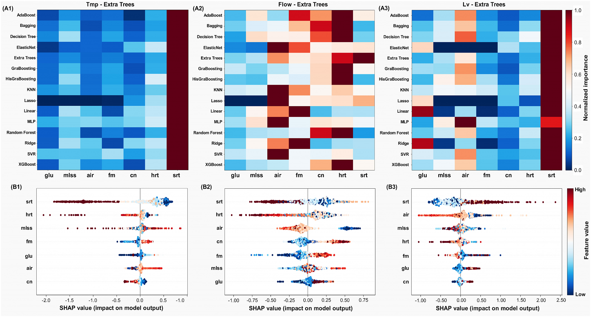
    - **Hình này chứng minh điều gì**
      - Cột SRT đồng nhất màu đỏ sẫm ($1.0$) trên toàn bộ 16 mô hình cho TMP và 15 mô hình cho mức nước bể màng.
      - Biểu đồ beeswarm thể hiện SRT cao kéo giảm mạnh giá trị SHAP của TMP (đạt $-2.0$), trong khi HRT tối ưu quanh dải trung bình.
    - **Từ đâu mà thấy được**
      - Panel (A1--A3): Trục hoành gồm 7 đặc trưng đầu vào, trục tung gồm 16 mô hình học máy; thang màu biểu thị Normalized importance không thứ nguyên từ $0.0$ (xanh lam) đến $1.0$ (đỏ sẫm).
      - Panel (B1--B3): Trục hoành đo SHAP value (tác động lên đầu ra mô hình, không thứ nguyên), trục tung liệt kê 7 đặc trưng; màu điểm từ xanh lam (giá trị thấp) đến đỏ sẫm (giá trị cao).
  - Đối với lưu lượng nước lọc (permeate flow), mức độ đồng thuận phân tán hơn: thời gian lưu thủy lực (HRT, Hydraulic Retention Time) xếp hạng thứ nhất ở 7 trên 16 mô hình (thứ hạng trung bình $2.28 \pm 1.39$), so với thứ hạng trung bình $4.67 \pm 1.89$ của SRT.
- Sự hội tụ này chứng minh tính chi phối của SRT là thuộc tính nội tại của dữ liệu thực tế thay vì là thiên kiến quy nạp (inductive bias) của một mô hình học máy riêng lẻ:
  - Phân tích đa mô hình giải quyết hạn chế của các nghiên cứu mô hình đơn lẻ vốn không thể phân biệt được nguồn gốc của thuộc tính.
  - Tính đồng thuận này vẫn được bảo toàn dưới các thiết kế kiểm định: SRT duy trì vị trí xếp hạng thứ nhất cho TMP và mức nước bể màng dưới điều kiện kiểm định chặn khối 24 h (blocked $24\ \text{h}$), chặn khối 168 h (blocked $168\ \text{h}$) và huấn luyện theo trình tự thời gian (chronological training), ngay cả khi độ chính xác dự đoán bị suy giảm.
  - Thứ hạng của lưu lượng dòng thấm ngoài hai đặc trưng hàng đầu có độ ổn định thấp hơn và nên xem là mang tính chỉ dẫn tham khảo.
- Sự phân kỳ giữa các mô hình mang tính hệ thống và bắt nguồn trực tiếp từ phương pháp giải thích (explainer):
  - Các mô hình tuyến tính xếp hạng tỷ lệ C/N ở vị trí thứ ba hoặc cao hơn đối với TMP, trong khi toàn bộ các mô hình dạng cây đều xếp C/N ở vị trí cuối cùng.
  - Tốc độ sục khí (aeration rate) xếp hạng thứ nhất đối với lưu lượng dòng thấm khi dùng KernelSHAP, nhưng xếp thứ tư khi dùng TreeSHAP.
  - KernelSHAP xấp xỉ giá trị Shapley thông qua các liên minh đặc trưng ngẫu nhiên nên làm nhập nhằng các đặc trưng có tương quan cao với nhau.
  - TreeSHAP khai thác cấu trúc phân nhánh chính xác của cây quyết định nên đạt độ tin cậy cao hơn khi các biến đầu vào tương quan với nhau.
  - Tốc độ sục khí (Air) và HRT đồng biến thiên trong vận hành thực tế (sục khí cao hơn được triển khai trong giai đoạn tải trọng cao vốn đồng thời nén ngắn HRT), dẫn đến KernelSHAP hấp thụ một phần đóng góp của HRT vào sục khí.
  - Toàn bộ các thảo luận cơ chế vận hành vật lý tiếp theo được xây dựng trên cơ sở các gán quyền quan trọng từ mô hình Extra Trees.

#### 3.2.2. Mechanistic interpretation of the dominant drivers

- Sự chi phối của SRT là phát hiện có khả năng diễn giải vật lý rõ ràng nhất trong toàn bộ phân tích:
  - SRT chi phối thành phần, hình thái và hoạt tính sinh học của quần xã bùn vi sinh.
  - Tại nhà máy này, SRT vận hành trong dải từ $43.3$ đến $108.3$ ngày (days), đặt toàn bộ phạm vi vận hành sâu trong chế độ sục khí kéo dài (extended-aeration regime).
- Dựa trên các biểu đồ phụ thuộc (dependence plot) và biểu đồ beeswarm của Extra Trees (Hình 6B1, Hình S9):
  - Giá trị SHAP mang giá trị dương ở dải $45\text{--}75$ ngày ($45\text{--}75\ \text{days}$).
  - Giá trị SHAP đi qua dải chuyển tiếp phân tán rộng ở $80\text{--}90$ ngày ($80\text{--}90\ \text{days}$), nơi tác động của SRT trở nên phụ thuộc mạnh vào các biến số đồng thời xuất hiện.
  - Giá trị SHAP suy giảm mạnh khi vượt qua $90$ ngày ($90\ \text{days}$), đạt mức $-0.3$ đến $-2.0$ tại khoảng $100\text{--}108$ ngày ($100\text{--}108\ \text{days}$).
- Hiện tượng tăng SRT làm xấu đi TMP thoạt nhìn dường như mâu thuẫn với nhận định truyền thống cho rằng tuổi bùn dài hơn sẽ giảm nghẹt màng thông qua hô hấp nội sinh và thủy phân các chất polymer ngoại bào (EPS, Extracellular Polymeric Substances) cùng các sản phẩm vi sinh vật hòa tan (SMP, Soluble Microbial Products):
  - Nhận định truyền thống nêu trên chỉ được thiết lập trong dải tuổi bùn dưới $30\text{--}40$ ngày ($30\text{--}40\ \text{days}$).
  - Tại cơ sở này, ngay cả mức SRT ngắn nhất cũng đã nằm sâu trong miền sục khí kéo dài, do đó lợi ích giảm thiểu EPS và SMP về cơ bản đã cạn kiệt.
  - Yếu tố biến đổi chủ yếu giữa $45$ và $108$ ngày ($45\ \text{and}\ 108\ \text{days}$) là sinh khối tích tụ: lượng bùn xả thải ít hơn làm nồng độ bùn hoạt tính (MLSS, Mixed Liquor Suspended Solids) tăng cao, đi kèm sự gia tăng độ nhớt bùn, độ dày bánh bùn và độ nén ép của bánh bùn, lấn át hoàn toàn lượng cắt giảm SMP còn sót lại.
  - Ở mức SRT rất dài, bông bùn bị chiếm ưu thế bởi các hạt trơ và khó phân hủy sinh học, tích tụ tạo thành lớp bánh bùn đặc quánh, khó hồi phục bằng cơ chế rửa ngược.
  - Cơ chế này tác động mạnh trong nước thải sản xuất bán dẫn, nơi các phân đoạn khó phân hủy sinh học từ chất cản quang (photoresist) và hóa chất tẩy rửa hấp phụ chọn lọc lên bề mặt màng PVDF.
- Logic cơ chế tương tự giải thích các biến mục tiêu khác:
  - Lưu lượng dòng thấm bị ức chế ở mức SRT dài nhất do độ nhớt bùn làm tăng trở lực thủy lực nội tại.
  - Mức nước bể màng tăng đơn điệu theo SRT.
- Dải chuyển tiếp $80\text{--}90$ ngày ($80\text{--}90\ \text{day}$) là vùng mà các quyết định vận hành quyết định kết quả hệ thống:
  - Tương tác giữa HRT và SRT ($0.056$; Hình S8B1) định lượng mối liên kết kép này.
  - Ở mức HRT ngắn, tổn thất do tăng SRT gây ra bởi sinh khối tích tụ được bù trừ một phần; ngược lại ở mức HRT dài, hai tác động tiêu cực này cộng dồn lên nhau.

#### 3.2.3. Hydraulic and aeration effects

- HRT xếp thứ hai đối với TMP ($2.33 \pm 0.47$) và xếp thứ nhất đối với lưu lượng dòng thấm trong số các mô hình dạng cây hàng đầu:
  - Kết quả này phản ánh vai trò kép của HRT vừa kiểm soát tải trọng hữu cơ vừa kiểm soát công suất thủy lực.
  - HRT ngắn trong dải $6\text{--}7\ \text{h}$ mang lại giá trị SHAP dương cho TMP và mức đóng góp giảm dần đều khi vượt trên $7\ \text{h}$, đạt mức $-1.3$ đến $-2.2$ tại $10\text{--}11\ \text{h}$.
- Kỳ vọng truyền thống thường cho kết quả ngược lại vì HRT ngắn sẽ để lại nhiều SMP dư thừa hơn, nhưng ba đặc điểm vận hành quy mô thực tế dung hòa mâu thuẫn này:
  - HRT ngắn tương ứng với lưu lượng xử lý cao, tại nhà máy này trùng hợp với giai đoạn sản xuất tích cực tạo ra nước thải loãng hơn.
  - Giai đoạn HRT dài trên $9\ \text{h}$ đồng xuất hiện với việc giảm xả bùn và do đó tích tụ nhiều sinh khối hơn.
  - Trong quá trình vận hành thông lượng cao, hệ thống điều khiển duy trì tần suất các chu kỳ rửa ngược (backwash) và nghỉ sục (relaxation) dày hơn.
- Đối với lưu lượng dòng thấm, mối quan hệ phụ thuộc diễn ra phi đơn điệu với điểm tối ưu nằm gần $6.5\text{--}7.5\ \text{h}$ trước khi chạm trần giới hạn thủy lực, theo nguyên lý $\text{HRT} = V/Q$ với thể tích bể $V$ cố định.
- Tốc độ sục khí (aeration rate) xếp thứ hai đối với mức nước bể màng (giá trị $0.216$) và thứ ba đối với lưu lượng dòng thấm, nhưng chỉ xếp thứ sáu đối với TMP (giá trị $0.063$):
  - Sự bất đối xứng này xuất phát từ cơ chế vận hành: sục khí tác động thông qua lực cắt thủy động lực học tại bề mặt màng, kiểm soát trực tiếp các đầu ra thủy lực hơn so với TMP vốn bị chi phối thêm bởi tắc nghẽn nội mao quản và hấp phụ mà lực cắt không thể đánh bật.
  - Đối với TMP, mối quan hệ phụ thuộc mang tính phi đơn điệu: sục khí không đủ dưới khoảng $5000\ \text{m}^3/\text{h}$ làm tắc nghẽn màng diễn ra không kiểm soát, và đáp ứng phân nhánh ở mức trên khoảng $6500\ \text{m}^3/\text{h}$ vì sục khí cao chỉ giảm nghẹt khi lớp bánh bùn còn chịu tác động của lực cắt, nhưng mất hiệu lực khi SRT dài và MLSS cao đã củng cố lớp bánh bùn thành khối đặc chắc.
  - Đối với mức nước bể màng, tương tác mạnh giữa sục khí và SRT ($\text{Air} \times \text{SRT}$ đạt $0.1318$, số hạng ngoài đường chéo lớn nhất trên tất cả các mục tiêu; Hình S8B3) cho thấy lợi ích của sục khí bổ sung được khuếch đại ở SRT thấp và suy giảm ở SRT cao.
- Tốc độ sục khí cũng thể hiện mối liên hệ âm biểu kiến đối với lưu lượng dòng thấm:
  - Đây không phải sự suy giảm cơ học đối với thông lượng màng: trong hệ thống MBR ngập nước vận hành bằng bơm hút, lưu lượng dòng thấm do bơm hút áp đặt.
  - Mối liên hệ âm phản ánh logic điều khiển vận hành: mức sục khí thấp xuất hiện trong giai đoạn tải trọng thấp khi màng chịu ứng suất thủy lực tối thiểu, trong khi sục khí cao được kích hoạt phản ứng trong giai đoạn tải trọng cao hoặc khi màng tắc nghẽn tích cực lúc lưu lượng đã bị hạn chế sẵn.
  - TreeSHAP giải quyết một phần hiện tượng nhiễu này, xếp hạng sục khí ở vị trí thứ tư đối với lưu lượng dòng thấm sau HRT, SRT và C/N, nhưng mối liên hệ dư thừa còn lại được truyền dẫn qua sự đồng biến thiên với HRT và SRT thay vì hiệu ứng thủy động trực tiếp.
  - Đây là ví dụ điển hình minh chứng tại sao biểu đồ phụ thuộc từ dữ liệu nhà máy quan sát chỉ ghi nhận mối liên hệ tương quan chứ không nhất thiết phản ánh cơ chế nhân quả.

#### 3.2.4. Secondary biological drivers

- Nồng độ bùn hoạt tính (MLSS) xếp thứ ba đối với TMP ($3.33 \pm 1.35$) và đối với mức nước bể màng ($3.87 \pm 1.15$):
  - Biểu đồ phụ thuộc TMP có dạng chữ U đảo ngược (inverted-U): đóng góp gần bằng 0 ở mức $2000\text{--}3000\ \text{mg/L}$, đạt cực đại gần $6000\text{--}6500\ \text{mg/L}$, sau đó sụt giảm mạnh xuống $-1.5$ ở mức $7000\text{--}7500\ \text{mg/L}$ do trở lực bánh bùn tăng phi tỷ lệ.
  - Xu hướng này phù hợp với định luật tỷ lệ gần bậc hai (near-quadratic scaling) được ghi nhận cho hệ thống màng sợi rỗng PVDF.
  - Tương tác $\text{MLSS} \times \text{SRT}$ ($0.042$) xác nhận hiệu ứng khuếch đại ở mức SRT ngắn hơn, nơi bùn giàu EPS làm tăng độ nén của bánh bùn.
- Tỷ lệ chất nền trên vi sinh vật (F/M, Food-to-Microorganism ratio) xếp thứ tư đối với TMP:
  - Mức đóng góp đạt cực đại gần $0.030\text{--}0.035\ \text{day}^{-1}$ và suy giảm ở các giá trị cao nhất, nơi sự tăng sinh quá mức SMP đẩy nhanh tốc độ tắc nghẽn lớp gel.
  - Đối với mức nước bể màng, F/M thể hiện dạng đường cong chữ U với mức tăng dốc đứng khi vượt trên $0.05\ \text{day}^{-1}$.
- Tốc độ châm glucose xếp thứ năm đối với TMP, thể hiện tác động khiêm tốn và phần lớn mang tính gián tiếp thông qua biến số MLSS và F/M.
- Tỷ lệ C/N (Carbon-to-Nitrogen ratio) xếp thứ bảy đối với TMP trong các mô hình dạng cây:
  - Giá trị đóng góp giảm đơn điệu từ mức dương ở $5\text{--}7$ xuống mức $-0.3$ ở $14\text{--}16$.
  - Điều kiện giàu cacbon thiếu nitơ thúc đẩy vi sinh vật tổng hợp EPS giàu carbohydrate và tạo điều kiện cho vi khuẩn dạng sợi phát triển làm giảm khả năng lọc.
  - Sự phân kỳ giữa các họ mô hình đối với biến C/N bắt nguồn từ tương quan với MLSS và F/M, minh họa thêm giá trị của việc so sánh đa mô hình.

#### 3.2.5. Interaction structure and methodological implications

- So sánh giữa TreeSHAP trên 9 mô hình dạng cây với KernelSHAP trên 7 mô hình không phải dạng cây bộc lộ độ lệch hướng nhất quán (Hình S8A):
  - Đối với TMP, cả hai phương pháp đều đồng thuận về sự thống trị của SRT (giá trị $0.530$ so với $0.458$) và vị trí thứ hai của HRT ($0.143$), trong đó MLSS phân kỳ nhiều nhất ($0.144$ so với $0.109$).
  - Đối với lưu lượng dòng thấm, sự phân kỳ lớn nhất xuất hiện ở tốc độ sục khí: xếp thứ nhất dưới KernelSHAP ($0.243$) và xếp thứ tư dưới TreeSHAP ($0.150$), đứng sau HRT ($0.318$), C/N ($0.230$) và F/M ($0.160$).
  - Đối với mức nước bể màng, hai phương pháp hoàn toàn đồng thuận.
- Quy luật hệ thống cho thấy KernelSHAP đánh giá quá cao đòn bẩy của các biến ngắn hạn dễ điều chỉnh và làm suy giảm tầm quan trọng của các biến sinh học biến thiên chậm vốn chi phối kết quả, củng cố việc sử dụng TreeSHAP cho hướng dẫn vận hành.
- Ma trận tương tác (Hình S8) xác định các cặp liên kết mạnh nhất:
  - $\text{HRT} \times \text{SRT}$ đối với TMP ($0.056$) và lưu lượng ($0.0510$).
  - $\text{MLSS} \times \text{SRT}$ đối với TMP ($0.042$).
  - $\text{Air} \times \text{SRT}$ đối với mức nước bể màng ($0.1318$).
- Các mối phụ thuộc phi cộng tính này cung cấp cơ sở định lượng để xử lý đồng thời 7 biến đầu vào trong Mục 3.3 thay vì tối ưu hóa đơn lẻ từng biến một.

### 3.3. Optimal operating conditions for semiconductor MBR wastewater

#### 3.3.1. From feature importance to viable operating space

- Phân tích khả năng giải thích (interpretability analysis) ở Mục 3.2 đạt đồng thuận qua 16 thuật toán (16 algorithms) về các biến chi phối và chiều hướng tác động lên từng chỉ số hiệu suất:
  - Tuổi bùn $\text{SRT}$ (sludge retention time) là nhân tố chi phối chính của áp suất xuyên màng $\text{TMP}$ (transmembrane pressure), làm gia tăng tắc nghẽn màng (fouling) một cách đơn điệu trên toàn dải sục khí kéo dài (extended-aeration range) thông qua tích lũy sinh khối (biomass accumulation), tăng độ nhớt (elevated viscosity) và nén ép lớp bánh lọc (cake compaction).
  - Thời gian lưu nước $\text{HRT}$ (hydraulic retention time) thiết lập giới hạn trần thủy lực (hydraulic ceiling) đối với lưu lượng dòng thấm (permeate flow).
  - Cường độ sục khí (aeration) tác động lên $\text{TMP}$ qua điểm tối ưu phi đơn điệu (non-monotonic optimum) với hiệu suất giảm dần (diminishing returns).
- Giới hạn cốt lõi của SHAP là không thể cung cấp tập hợp điều kiện đầu vào đồng thời thỏa mãn cả ba mục tiêu hiệu suất, cũng như không xác định được liệu chiều hướng cải thiện một mục tiêu có xung đột với các ràng buộc của mục tiêu khác hay không:
  - Mục 3.3 giải quyết khoảng trống này nhằm chuyển đổi tri thức mô hình thành hướng dẫn vận hành thực tế (operating guidance).
- Ánh xạ tính khả thi (feasibility mapping) được xây dựng bằng mô hình Extra Trees sử dụng cơ chế lấy mẫu lại ràng buộc trên đa tạp (manifold-constrained resampling scheme) theo Mục 2.7 dưới 3 ràng buộc hiệu suất đồng thời:
  - Áp suất xuyên màng $\text{TMP} \in [-0.09, -0.03]\ \text{bar}$.
  - Lưu lượng dòng thấm $\text{permeate flow} \in [1.5, 2.2]\ \text{m}^3/\text{min}$.
  - Mực nước bể màng $\text{water level} \in [65.0, 67.0]\ \%$ (Hình S12–S13).
- Trong số $500{,}000$ trạng thái ứng viên trên đa tạp vận hành, có $207{,}238$ trạng thái ($41.4\%$) thỏa mãn đồng thời cả ba tiêu chí ràng buộc:
  - Độ phân tán qua $100$ cây của mô hình ensemble cho khoảng dự đoán $95\%$ (95% prediction intervals) là $\pm 0.008\ \text{bar}$ đối với $\text{TMP}$, $\pm 0.17\ \text{m}^3/\text{min}$ đối với lưu lượng dòng thấm và $\pm 0.71\%$ đối với mực nước.
  - Vận hành hướng vào vùng lõi bên trong của biên bao khả thi (interior of the envelope) thay vì vùng rìa mép (edge) được khuyến nghị đặc biệt cho hai mục tiêu thủy lực.
- Hai đặc tính then chốt mang lại giá trị thực tiễn cho bản đồ tính khả thi:
  - Mọi trạng thái lấy mẫu đều nằm trên đa tạp thực nghiệm mà nhà máy đã trải qua: khoảng cách láng giềng gần nhất trung vị (median nearest-neighbour distance) từ mẫu lấy đến dữ liệu thực tế là $0.121$ đơn vị chuẩn hóa so với $0.119$ đơn vị chuẩn hóa giữa các mốc giờ thực tế, bảo đảm mọi dự đoán đều là phép nội suy giữa các điều kiện đã vận hành và các khuyến nghị đều khả thi về mặt vật lý (physically attainable).
  - Các cửa sổ vận hành được phân cấp dựa trên tỷ lệ khả thi có điều kiện (conditional feasibility rate) thay vì số lượng điểm khả thi tuyệt đối, giúp nhận diện vị trí nhà máy đạt hiệu suất tối ưu thay vì vị trí dành nhiều thời gian vận hành nhất và cho phép từng khuyến nghị trong Bảng 4 gắn liền với tần suất thực tế nhà máy đạt mục tiêu.
- Phân tách rõ rệt giữa mật độ điểm vận hành khả thi và tỷ lệ đạt mục tiêu thực tế xác lập cơ sở định hình vùng vận hành khuyến nghị:
  - **Hình 7.** Miền khả thi và tỷ lệ đạt mục tiêu của 7 biến
    - 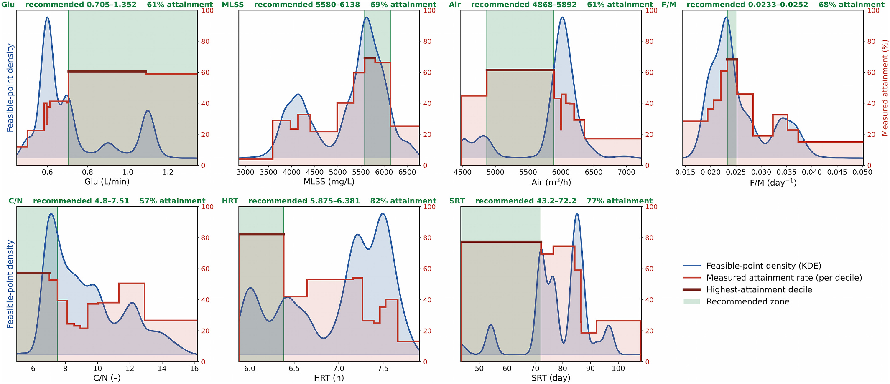
    - **Hình này chứng minh điều gì**
      - Vùng khuyến nghị (dải xanh lục) bám sát decile có tỷ lệ đạt mục tiêu cao nhất (đỏ sẫm), phân kỳ khỏi đỉnh mật độ thời gian vận hành (đường cong xanh lam).
      - Xác lập 7 dải khuyến nghị: $\text{HRT}$ ($82\%$), $\text{SRT}$ ($77\%$), $\text{MLSS}$ ($69\%$), $F/M$ ($68\%$), $\text{Air}$ ($61\%$), $\text{Glu}$ ($61\%$) và $C/N$ ($57\%$).
    - **Từ đâu mà thấy được**
      - 7 bảng đồ thị: trục hoành là miền giá trị biến, trục tung biểu diễn mật độ điểm khả thi KDE (trục trái) và tỷ lệ đạt thực tế $0\text{--}100\%$ (trục phải).
      - Đường bậc thang đỏ đạt cực đại tại decile đỏ sẫm trùng khớp vùng xanh lục; đường cong KDE ($15{,}000$ mẫu) lệch đỉnh rõ rệt ở $\text{Glu}$, $\text{HRT}$ và $\text{SRT}$.
- Không gian khả thi hình thành một tập hợp có cấu trúc tương quan cao (structured, correlated set) thay vì hình hộp chữ nhật độc lập:
  - Vùng xác suất cao tập trung thành dải hẹp (narrow ridge) ở hầu hết các cặp biến: cặp $\text{MLSS}$ so với tỷ lệ thức ăn trên vi sinh vật $F/M$ biểu hiện tính đối nghịch nghiêm ngặt (strict opposition), và cặp tỷ lệ $C/N$ so với $\text{HRT}$ phân bố theo một dải dốc tăng dần (rising band).
  - Việc xem xét 7 khuyến nghị như các điểm đặt điều chỉnh độc lập (independently adjustable set-points) sẽ phóng đại mức độ tự do vận hành thực tế.
- Giao điểm của hai dải khuyến nghị đơn biến nằm trọn trong vùng xác suất cao ở 20 trên 21 cặp biến với tỷ lệ khả thi đạt $60\text{--}100\%$ (so với mức nền toàn nhà máy khoảng $40\%$), chứng minh các khuyến nghị cấu thành mà không gây xung đột:
  - **Hình 8.** Xác suất đạt đồng thời ba mục tiêu trên từng cặp biến
    - 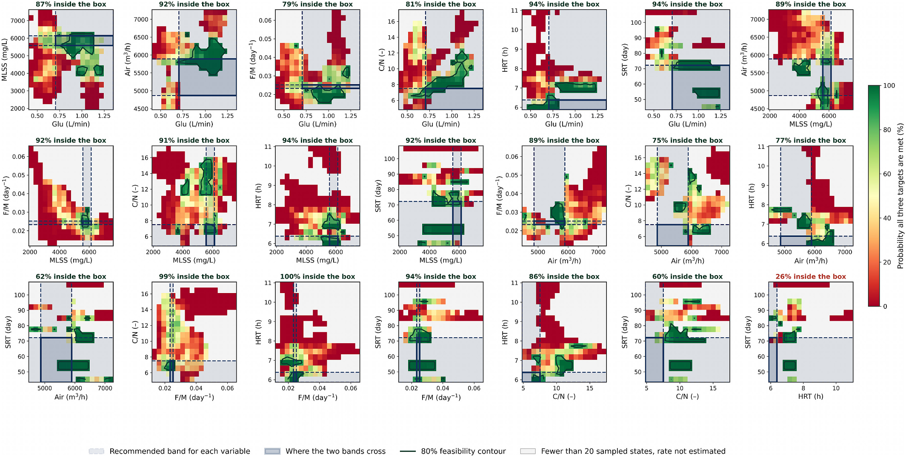
    - **Hình này chứng minh điều gì**
      - Giao điểm hai dải khuyến nghị (hộp chữ nhật) nằm trên vùng xanh lục xác suất cao ($60\text{--}100\%$) ở 20/21 cặp biến.
      - Cặp $\text{HRT}$ và $\text{SRT}$ là ngoại lệ duy nhất bị xung đột, xác suất khả thi bên trong hộp chỉ đạt $26\%$ (thấp hơn mức nền).
    - **Từ đâu mà thấy được**
      - 21 ô tương tác: thanh màu thể hiện xác suất $0\text{--}100\%$ (đỏ sang xanh lục), đường lục thẫm là đường đồng mức $80\%$, vùng xám có dưới $20$ mẫu.
      - Nhãn tỷ lệ trên từng ô: 20 ô đạt từ $60\%$ đến $100\%$; riêng ô góc phải dưới cùng ($\text{HRT}$ so với $\text{SRT}$) hiển thị $26\%$ màu đỏ.
- Hiện tượng tương tác phi cộng tính giữa $\text{SRT}$ và $\text{HRT}$ là ngoại lệ duy nhất mà phân tích đơn biến không thể phát hiện:
  - Khi xét riêng lẻ, dải $\text{SRT} \in [43.2, 72.2]\ \text{ngày}$ và $\text{HRT} \in [5.875, 6.381]\ \text{h}$ là hai đòn bẩy điều khiển mạnh nhất với tỷ lệ đạt mục tiêu đo đạc thực tế lần lượt là $77.0\%$ và $82.4\%$.
  - Khi kết hợp đồng thời cả hai điều kiện, chỉ có 35 giờ vận hành trong dữ liệu lịch sử hội tụ đủ cả hai biến và tỷ lệ đạt mục tiêu thực tế sụt giảm xuống $34.3\%$, thấp hơn mức nền $37.1\%$ của toàn nhà máy.
  - Cơ chế vận hành thực tế giải thích sự xung đột vật lý giữa hai thông số:
    - Khi $\text{SRT}$ duy trì ở $43.2\text{--}72.2\ \text{ngày}$, nhà máy thực tế vận hành tại $\text{HRT}$ từ $6.2\text{--}7.5\ \text{h}$.
    - Dải $\text{HRT}$ từ $5.9\text{--}6.4\ \text{h}$ chỉ xuất hiện trong lịch sử vận hành khi tuổi bùn $\text{SRT}$ nằm ở dải cao $72\text{--}108\ \text{ngày}$.
    - $\text{HRT}$ ngắn tương ứng với điều kiện lưu lượng thông lượng cao (high-throughput condition); việc duy trì thông lượng cao ở tuổi bùn thấp đòi hỏi tốc độ xả bùn (wasting rate) vượt ngoài ngưỡng nhà máy vận hành, đẩy hệ thống vào chế độ vận hành chưa từng trải qua.
  - Cấu trúc quy tắc vận hành chung (joint rule) theo thứ bậc ưu tiên:
    - Không thiết lập độc lập $\text{SRT}$ và $\text{HRT}$ ở các điểm tối ưu biên riêng lẻ.
    - Cố định tuổi bùn $\text{SRT}$ trước tiên do đây là biến biến thiên chậm hơn và là nhân tố chi phối chính của $\text{TMP}$.
    - Lựa chọn $\text{HRT}$ phụ thuộc có điều kiện theo $\text{SRT}$ đã chọn nhằm bảo đảm tính tương thích động học (cấu trúc quy tắc kết hợp được kiểm chứng tại Mục 3.3.4).

#### 3.3.2. Density structure of the feasible regions

- Cửa sổ vận hành khuyến nghị (recommended operating window) thiết lập không gian vận hành mục tiêu cho cụm bể MBR được lượng hóa chi tiết tại Table 4:
  - Mỗi hàng trong Bảng 4 đối chiếu song song tỷ lệ đạt đo đạc thực tế (measured attainment rate) trong nhật ký vận hành SCADA với tỷ lệ khả thi suy diễn từ mô hình (model-derived rate), đảm bảo không khuyến nghị nào phụ thuộc đơn lẻ vào mô hình.
  - Baseline đạt đồng thời cả 3 mục tiêu kỹ thuật trên toàn bộ nhà máy là $37.1\,\%$.
  - Khoảng giới hạn hiệu suất mục tiêu (target performance envelope) bao gồm: áp suất xuyên màng TMP từ $-0.09$ đến $-0.03\ \text{bar}$, lưu lượng thấm (permeate flow) $1.5\text{--}2.2\ \text{m}^3/\text{min}$, và mực nước bể màng (water level) $65.0\text{--}67.0\,\%$.
  - Các dải khuyến nghị đơn biến kết hợp không gây xung đột cho 20 trong tổng số 21 cặp biến vận hành (Fig. 8); đường viền xanh lá đậm biểu diễn đường mức khả thi $80\,\%$ ($80\,\%$ contour).
  - Ngoại lệ duy nhất là cặp SRT và HRT có hiện tượng tương tác phi tuyến, tuân theo quy tắc kiểm soát kết hợp tại Mục 3.3.4 để lựa chọn HRT khi độ tuổi bùn đã được cố định.
- Thời gian lưu thủy lực (HRT / Hydraulic Retention Time) là đòn bẩy nhạy nhất (sharpest lever) kiểm soát lưu lượng và trạng thái thủy lực:
  - Trong vùng khả thi, tỷ lệ khả thi có điều kiện đạt $82.8\,\%$ ở khoảng $5.88\text{--}6.38\ \text{h}$ và suy giảm đơn điệu ngay sau đó, chạm mức $0\,\%$ khi HRT vượt quá $7.95\ \text{h}$.
  - Tỷ lệ đạt đo đạc thực tế trong cùng các dải này ghi nhận tương ứng $82.4\,\%$ và $0\,\%$ (Fig. 7).
  - Hiện tượng này đại diện cho trần thủy lực (hydraulic ceiling) đã xác định ở Mục 3.2 biểu hiện dưới dạng một ràng buộc vận hành thực tế.
  - Ở thể tích bể cố định, HRT kéo dài trên khoảng $8\ \text{h}$ tương ứng với lưu lượng đầu vào quá thấp khiến mục tiêu lưu lượng thấm $1.5\ \text{m}^3/\text{min}$ không thể đạt được, bất kể tình trạng màng lọc.
  - Dải khuyến nghị vận hành HRT là $5.9\text{--}6.4\ \text{h}$ (chính xác $5.875\text{--}6.381\ \text{h}$ trên khoảng quan sát $5.875\text{--}11.042\ \text{h}$), ghi nhận tỷ lệ đạt bên trong / bên ngoài dải là $82.4\,\% / 32.1\,\%$.
- Cường độ sục khí (Air / aeration rate) thể hiện cấu trúc mục tiêu đối nghịch (opposing-target structure) đã chỉ ra ở Mục 3.2:
  - Tỷ lệ đạt đo đạc thực tế đạt đỉnh tại dải $4868\text{--}5892\ \text{m}^3/\text{h}$ ($61.1\,\%$) và giảm mạnh xuống $17.2\,\%$ ở trên $6356\ \text{m}^3/\text{h}$ (trên khoảng quan sát $4470\text{--}7272\ \text{m}^3/\text{h}$, tỷ lệ đạt trong / ngoài dải là $61.1\,\% / 34.4\,\%$) (Fig. 9C).
  - Điểm tối ưu TMP tập trung tại $5500\text{--}6000\ \text{m}^3/\text{h}$, nơi lực cắt thủy động đủ duy trì độ linh động của lớp bánh lọc (cake layer) mà không phát sinh thêm lợi ích khi tiếp tục tăng lưu lượng khí.
  - Hiện tượng sụt giảm lưu lượng thấm khi sục khí tăng bắt nguồn từ logic điều khiển tự động (control logic) thay vì ức chế thông lượng do thủy động lực học, do đó dải khuyến nghị đáp ứng yêu cầu thổi rửa màng mà không đẩy hệ thống vào chế độ sục khí cao phản ứng (reactive high-aeration regime).
  - Hệ số tương quan Pearson giữa Air và Flow đạt $-0.410$ trên tập dữ liệu thô, trong khi hai quan hệ tuyến tính mạnh hơn trong bộ dữ liệu là MLSS–F/M ($-0.791$) và SRT–TMP ($-0.606$).
  - **Hình 9.** Đáp ứng dự báo của biến đầu ra trên vùng khả thi
    - 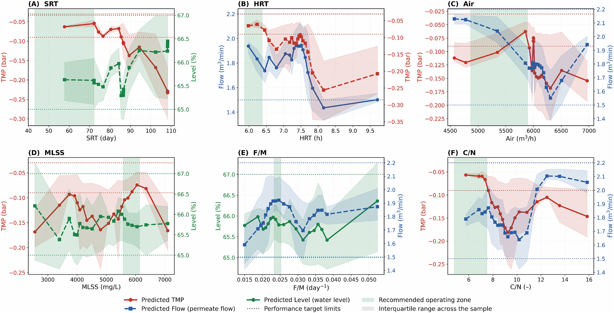
    - **Hình này chứng minh điều gì**
      - Biến đầu ra phản ứng phi tuyến với từng thông số vận hành; đường cong cắt qua đường giới hạn nét đứt đánh dấu vi phạm mục tiêu.
      - Dải màu xanh lục thể hiện vùng vận hành khuyến nghị dung hòa đồng thời hai biến đầu ra mục tiêu.
    - **Từ đâu mà thấy được**
      - Các ô (A)–(F): trục hoành là thông số đầu vào; trục tung đôi biểu diễn 2 biến đầu ra dự báo kèm dải phân vị xám, đường chấm ngang là ngưỡng mục tiêu.
      - Ô (C): đường TMP (đỏ) đạt tối ưu rồi bão hòa trong dải xanh, trong khi Flow (xanh lam) giảm từ $2.1$ xuống dưới $1.8\ \text{m}^3/\text{min}$.
      - Lưu ý: hình ghi ô (F) là C/N (-), văn bản chú thích ghi glucose dosing rate.
- Kiểm định tính hợp lệ của mặt độ khả thi mô hình (feasibility surface) dựa trên dữ liệu nhật ký thực tế:
  - Toàn bộ hồ sơ vận hành SCADA ghi nhận $1703$ trên $4593\ \text{h}$ ($37.1\,\%$) đạt đồng thời cả 3 mục tiêu hiệu suất.
  - Phân chia mỗi biến đầu vào thành các phân vị thập phân (deciles) mang lại 70 phép so sánh theo cặp (paired comparisons) giữa tỷ lệ khả thi dự báo và tỷ lệ đạt đo đạc thực tế trong cùng một bin.
  - Mức độ tương đồng đạt độ chuẩn xác định lượng cao mà không cần tinh chỉnh mô hình: hệ số tương quan Pearson $r = 0.988$ ($p = 9 \times 10^{-57}$), Spearman $\rho = 0.984$, độ lệch tuyệt đối trung bình $4.3$ điểm phần trăm và độ lệch lạc quan hệ thống chỉ $+4.2$ điểm phần trăm.
  - Hệ số tương quan của từng biến riêng lẻ dao động trong khoảng từ $0.96$ đến $0.998$ (Fig. 10).
  - Phép kiểm định này xác thực khả năng ứng dụng thực tế của mô hình để chỉ dẫn vận hành, đóng vai trò thực tiễn hơn so với việc dự báo chuỗi thời gian xuôi đơn thuần.
  - **Hình 10.** Tương đồng giữa tỷ lệ khả thi mô hình và tỷ lệ thực tế
    - 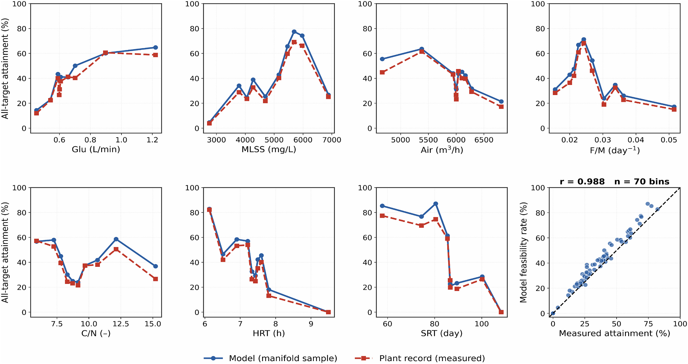
    - **Hình này chứng minh điều gì**
      - Mô hình học máy tái tạo chính xác tần suất đạt đồng thời cả 3 mục tiêu theo từng khoảng vận hành của nhà máy.
      - Tỷ lệ khả thi mô hình hóa không bị sai lệch có hệ thống so với số liệu ghi nhận thực tế.
    - **Từ đâu mà thấy được**
      - 7 ô đầu: đường mô hình (xanh lam) và đo đạc (đỏ) chồng khít qua 10 phân vị decile của từng biến đầu vào.
      - Ô cuối cùng: $70$ điểm đối chiếu cặp ($n = 70\ \text{bins}$) phân bố bám sát đường phân giác $1:1$ với $r = 0.988$.
- Thời gian lưu bùn (SRT / Sludge Retention Time) thể hiện mối quan hệ đáp ứng liều lượng (dose–response) mạnh nhất và đơn điệu nhất trong 7 thông số đầu vào:
  - Tỷ lệ đạt mục tiêu đo đạc thực tế suy giảm đều đặn từ $77.0\,\%$ tại $43.2\text{--}72.2\ \text{ngày}$, qua $74.5\,\%$ tại $77\text{--}84\ \text{ngày}$ và $59.0\,\%$ tại $84\text{--}86\ \text{ngày}$, xuống $18.7\,\%$ tại $87\text{--}92\ \text{ngày}$ và chạm mức $0\,\%$ ở trên $108\ \text{ngày}$.
  - Tỷ lệ khả thi suy diễn từ mô hình bám sát các giá trị thực tế này trong biên độ vài điểm phần trăm trên toàn bộ dải biến thiên.
  - Khuyến nghị vận hành yêu cầu giữ SRT dưới khoảng $85\ \text{ngày}$ và nhắm vào dải mục tiêu $43.2\text{--}72.2\ \text{ngày}$ (khoảng quan sát $43.3\text{--}108.4\ \text{ngày}$, tỷ lệ đạt trong / ngoài dải là $77.0\,\% / 32.3\,\%$), trong đó tỷ lệ đạt giảm đơn điệu xuống $<20\,\%$ khi vượt quá $87\ \text{ngày}$ và cho kết quả chuyển giao ngoài thời gian tăng $+22.7$ điểm phần trăm ($+22.7\ \text{pp}$).
  - Khuyến nghị này được đồng thuận bởi 3 luồng bằng chứng độc lập: phân tích SHAP liên mô hình (Fig. 6), mặt độ khả thi mô hình (Fig. 7), và dữ liệu đo đạc thực tế (Fig. 11A), cùng xác định vùng tối ưu nằm ở nửa dưới của dải vận hành.
- Nồng độ bùn hoạt tính (MLSS / Mixed Liquor Suspended Solids) phản ánh sự đánh đổi phi tuyến rõ rệt qua dạng đồ thị chữ U ngược (inverted-U):
  - Tỷ lệ đạt mục tiêu đo đạc tăng từ $3.9\,\%$ ở dưới $3590\ \text{mg/L}$ lên đỉnh rộng $67.6\,\%$ trong dải $5580\text{--}6138\ \text{mg/L}$, sau đó suy giảm xuống $25.1\,\%$ ở trên $6138\ \text{mg/L}$ (trên khoảng quan sát $1918\text{--}7630\ \text{mg/L}$, tỷ lệ đạt trong / ngoài dải là $67.6\,\% / 29.5\,\%$) (Fig. 7, Fig. 9D, Fig. 10).
  - Mô hình mô phỏng chính xác cấu trúc chữ U ngược này trong phạm vi sai số $4$ điểm phần trăm ở mọi phân vị decile.
  - Dải khuyến nghị $5580\text{--}6138\ \text{mg/L}$ bao phủ $918\ \text{giờ}$ vận hành thực tế, thể hiện điểm cân bằng giữa việc duy trì đủ sinh khối xử lý nước và ngăn ngừa gia tăng trở lực bánh lọc do độ nhớt lỏng chi phối ở nồng độ cao.
  - MLSS ghi nhận năng lực chuyển giao ngoài thời gian cao nhất trong mọi thông số với mức cải thiện $+30.9$ điểm phần trăm ($+30.9\ \text{pp}$).
- Tỷ lệ thức ăn trên vi sinh vật (F/M / Food-to-Microorganism ratio) biểu hiện xu hướng tương tự MLSS:
  - Tỷ lệ đạt mục tiêu đạt cực đại $68.3\,\%$ trong dải $0.0233\text{--}0.0252\ \text{day}^{-1}$ so với chỉ $15.0\,\%$ ở trên ngưỡng $0.0373\ \text{day}^{-1}$ (trên khoảng quan sát $0.0117\text{--}0.0658\ \text{day}^{-1}$, tỷ lệ đạt trong / ngoài dải là $68.3\,\% / 33.5\,\%$).
  - Hiện tượng suy giảm hiệu suất ở tải trọng hữu cơ cao phù hợp với cơ chế tăng sinh quá mức các chất vi sinh hòa tan (SMP - soluble microbial products) đẩy nhanh tốc độ tạo màng gel gây nghẽn màng.
  - Hướng dẫn thực hành: duy trì F/M dưới ngưỡng xấp xỉ $0.03\ \text{day}^{-1}$ và chủ động trích xuất xả bùn khi hệ thống quản lý sản xuất phát tín hiệu sắp có chu kỳ tải hữu cơ cao; mức chuyển giao ngoài thời gian tăng $+15.7$ điểm phần trăm ($+15.7\ \text{pp}$).
- Tỷ lệ cacbon trên nitơ (C/N) và lưu lượng châm glucose (Glu) đóng vai trò là các đòn bẩy điều chỉnh có điều kiện:
  - Tỷ lệ C/N (quan sát $4.80\text{--}17.52$, tỷ lệ đạt trong / ngoài dải là $55.0\,\% / 32.6\,\%$) là biến giám sát thay vì điểm đặt cố định, có dải thuận lợi $4.80\text{--}7.51$ ($55.0\,\%$) cùng một gờ phụ (secondary shoulder) tại $11.3\text{--}12.9$ ($50.5\,\%$).
  - Cấu trúc hai đỉnh (bimodal structure) này (Fig. 10) phản ánh 2 chế độ xả thải chủ đạo tại nhà máy bán dẫn: dòng thải giàu cacbon từ công đoạn bóc chất cản quang và rửa hóa chất, đối lập với nước rửa giàu nitơ từ các bước đánh bóng và ăn mòn hóa học.
  - Lưu lượng châm glucose (Glu, khoảng quan sát $0.402\text{--}1.352\ \text{L/min}$, khuyến nghị $0.705\text{--}1.352\ \text{L/min}$, tỷ lệ đạt trong / ngoài dải $59.8\,\% / 31.3\,\%$) được điều tiết để duy trì tỷ lệ C/N hơn là mục tiêu tối ưu hóa màng độc lập.
  - Tác động của liều lượng châm glucose tới mực nước bể màng trong vùng khả thi vận hành thông qua trạng thái tải trọng tổng thể thay vì qua F/M (vốn có tương quan rất yếu).
  - Mối liên hệ của C/N kém ổn định nhất trong 7 thông số qua các khoảng thời gian khác nhau, do đó chỉ dẫn C/N được diễn giải như một quan sát đặc thù theo từng thời kỳ hơn là điểm đặt có thể chuyển giao cố định (kết quả phân tích đối chiếu trên các trang 11 và 12 của tài liệu gốc).

#### 3.3.3. Validation of the operating window on a withheld period

- Phép kiểm chứng khắt khe nhất đối với các chỉ dẫn vận hành rút ra từ dữ liệu lịch sử (historical data) là kiểm tra khả năng cải thiện kết quả trong một giai đoạn sau đó hoàn toàn không tham gia vào quá trình xây dựng chỉ dẫn:
  - Phép thử này không sử dụng dự đoán của mô hình (model prediction), do đó hoàn toàn độc lập với việc đánh giá độ chính xác (accuracy assessment) của Mục 3.1.
- Dữ liệu vận hành được phân chia theo trình tự thời gian (chronological division), tái lập cửa sổ vận hành trên $70\,\%$ thời lượng đầu (7 tháng đầu) và đánh giá hiệu quả trên $30\,\%$ thời lượng còn lại (các tháng 8–11):
  - Cửa sổ vận hành từ 7 tháng đầu đặt điều kiện chính lên thời gian lưu bùn $\text{SRT}$ (solids retention time, $\le 84.5\text{ ngày}$) và điều kiện phụ lên thời gian lưu thủy lực $\text{HRT}$ (hydraulic retention time).
  - Trong giai đoạn giữ lại (withheld period), cửa sổ xác định được $415\text{ h}$ với tỷ lệ đạt đồng thời cả 3 mục tiêu là $61.9\,\%$ so với mức cơ sở (baseline) $39.3\,\%$ ($\text{odds ratio} = 3.89$, kiểm định Fisher exact $p = 3 \times 10^{-29}$):
    - **Hình 11.** Cửa sổ vận hành khuyến nghị và kiểm chứng trên giai đoạn giữ lại
      - 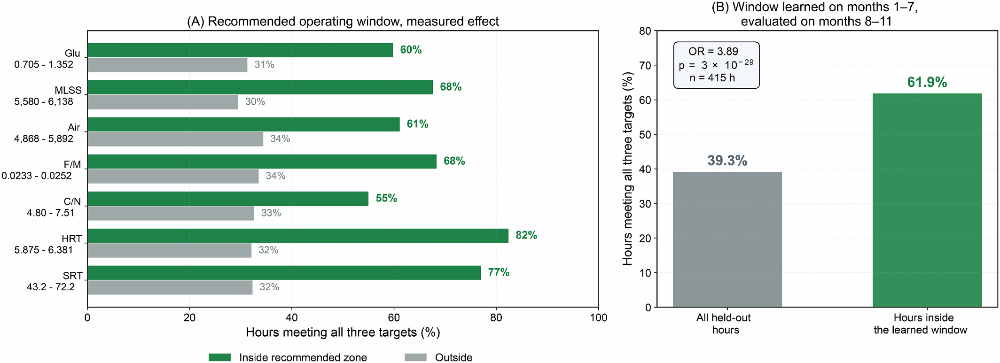
      - **Hình này chứng minh điều gì**
        - Tỷ lệ đạt đồng thời 3 mục tiêu trong giai đoạn giữ lại tăng từ $39.3\,\%$ lên $61.9\,\%$ khi vận hành trong cửa sổ suy ra từ 7 tháng đầu.
      - **Từ đâu mà thấy được**
        - Panel (B): Cột xám thể hiện toàn bộ giờ giữ lại ($39.3\,\%$); cột xanh lục thể hiện các giờ nằm trong cửa sổ học ($61.9\,\%$, hộp thông số ghi $n = 415\text{ h}$, $\text{OR} = 3.89$, $p = 3 \times 10^{-29}$).
        - Panel (A): Thanh xanh lục (trong dải khuyến nghị) dài hơn thanh xám (ngoài dải) ở cả 7 thông số, cao nhất ở $\text{HRT}$ ($82\,\%$ so với $32\,\%$) và $\text{SRT}$ ($77\,\%$ so với $32\,\%$).
- Từng đòn bẩy kiểm soát sinh học chính (principal biological controls) khi xét riêng rẽ cũng duy trì hiệu quả chuyển giao trên giai đoạn giữ lại (Hình S18):
  - Nồng độ chất rắn lơ lửng trong hỗn dịch lỏng $\text{MLSS}$ (mixed liquor suspended solids) chuyển giao với mức tăng $30.9$ điểm phần trăm (percentage points).
  - Thời gian lưu bùn $\text{SRT}$ mang lại mức tăng $22.7$ điểm phần trăm.
  - Tỷ lệ thức ăn trên vi sinh vật $\text{F/M}$ (food-to-microorganism ratio) mang lại mức tăng $15.7$ điểm phần trăm.
- Tuổi bùn (sludge age), nồng độ sinh khối (biomass concentration) và tải trọng hữu cơ (organic loading) là ba biến số người vận hành có thể can thiệp trong khoảng thời gian từ vài giờ đến vài ngày:
  - Đây là các đòn bẩy có chỉ dẫn vận hành được xác lập vững chắc nhất trong nghiên cứu.
  - Quy trình vận hành (operating protocol) đặt ba biến số này làm trọng tâm cốt lõi.

#### 3.3.4. Feature importance shifts and real-time control implications

- Việc giới hạn phân tích SHAP (SHapley Additive exPlanations) trong phạm vi vùng khả thi (feasible region) làm thay đổi một số thứ hạng tầm quan trọng của các đặc trưng (importance rankings) theo hướng mang ý nghĩa vận hành thực tế rõ rệt (Bảng S5–S7 / Tables S5–S7).
  - Sự dịch chuyển thứ hạng không phải là sai số nhân tạo (artefacts): trong chế độ vận hành khả thi (viable regime), các điều kiện vận hành gây tổn hại nghiêm trọng nhất đã bị loại trừ hoàn toàn bởi các ràng buộc đầu ra (output constraints):
    - Thời gian lưu bùn (SRT / Sludge Retention Time) trên $100\ \text{ngày}$ (days).
    - Nồng độ chất rắn lơ lửng trong bùn lỏng (MLSS / Mixed Liquor Suspended Solids) trên $7500\ \text{mg/L}$.
    - Thời gian lưu thủy lực (HRT / Hydraulic Retention Time) trên $10\ \text{h}$.
  - Khi các điều kiện cực đoan bị loại trừ, các nguồn gây biến thiên ở thang thời gian ngắn hơn (shorter-timescale sources of variability) trở nên chiếm ưu thế chi phối hệ thống.
- Tỷ lệ thức ăn trên vi sinh vật (F/M / Food-to-Microorganism ratio) là trường hợp dịch chuyển thứ hạng rõ nét nhất, với tầm quan trọng đối với mực nước bể màng (membrane tank water level) tăng $87\,\%$, thăng từ hạng $5$ lên hạng $4$:
  - Trong toàn bộ tập dữ liệu (full dataset), các giá trị SRT cực đoan và MLSS ở mức cao chiếm ưu thế chi phối phương sai mực nước (level variance), làm che khuất hoàn toàn đóng góp ở thang thời gian ngắn của tải lượng chất hữu cơ (organic loading).
  - Trong vùng khả thi, khi cả hai thông số SRT và MLSS đều được duy trì ở mức vừa phải (moderate), F/M nổi lên thành động lực chính dẫn dắt biến động mực nước theo từng giờ (hour-to-hour level movement).
  - Biến động mực nước theo từng giờ diễn ra thuận theo tiến độ sản xuất theo mẻ (batch production schedule) của xưởng sản xuất bán dẫn (fab) thay vì phản ánh các thông số sinh học có chu kỳ điều chỉnh chậm.
- Sự gia tăng song song về tầm quan trọng của MLSS đối với mực nước cùng với F/M xác định $3$ đòn bẩy phản ứng nhanh (fast-acting levers) cho hoạt động kiểm soát mực nước bể màng:
  - Liều lượng châm glucose (glucose dosing rate), phản hồi nhanh trong thang thời gian tính bằng phút (minutes).
  - Tốc độ xả bùn (sludge extraction rate), phản hồi trong thang thời gian tính bằng giờ (hours).
  - Điều chỉnh F/M thông qua bể điều hòa (equalisation), phản hồi trong thang thời gian tính bằng giờ (hours) (Hình 9E / Fig. 9E).
  - Ba đòn bẩy phản ứng nhanh này cho phép người vận hành giữ mực nước bể màng dưới ngưỡng an toàn $67\,\%$ trong suốt các chu kỳ sản xuất tải lượng cao (high-loading production) mà không cần chờ đợi chu kỳ điều chỉnh SRT kéo dài hơn rất nhiều (much longer SRT adjustment cycle).
- Tỷ lệ cacbon trên nitơ (C/N / Carbon-to-nitrogen ratio) cũng tăng thứ hạng tầm quan trọng đối với cả áp suất xuyên màng TMP (transmembrane pressure) và lưu lượng thấm (permeate flow):
  - Dải giá trị thuận lợi của C/N được thiết lập bởi lịch trình xả thải của nhà máy bán dẫn (fab's discharge schedule) và liên tục dịch chuyển theo sự biến đổi của lịch trình này.
  - C/N được báo cáo như một biến giám sát (monitoring variable) cần được tái ước tính định kỳ (re-estimated periodically) thay vì áp dụng như một điểm cài đặt cố định (fixed set-point).
- Các khuyến nghị vận hành trong Bảng 4 (Table 4) được xây dựng dựa trên sự hội tụ của nhiều phương pháp phân tích độc lập thay vì chỉ dựa vào một phương pháp đơn lẻ:
  - Bằng chứng định hướng SHAP nhất quán giữa các mô hình (cross-model SHAP directional evidence) tại Mục 3.2 (Section 3.2) trên toàn bộ $16$ mô hình học máy.
  - Mặt cong khả thi có điều kiện (conditional feasibility surface) thu được từ mẫu lấy trên đa tạp ràng buộc (manifold-constrained sample).
  - Tỷ lệ đạt mục tiêu đo đạc thực tế (measured attainment rate) trong nhật ký vận hành của chính nhà máy, với các đòn bẩy cốt lõi được kiểm định bổ sung độc lập theo chuỗi thời gian ngoài mẫu (out-of-time validation).
- Sự hội tụ chặt chẽ giữa bằng chứng dựa trên mô hình (model-based evidence) và bằng chứng dựa trên đo đạc thực tế (measurement-based evidence) tạo nên điểm khác biệt căn bản so với các nghiên cứu tối ưu hóa MBR trước đây:
  - Các công trình trước đây thường chỉ báo cáo riêng lẻ thứ hạng tầm quan trọng (importance rankings), hiệu ứng định hướng (directional effects), hoặc một dải vận hành khả thi (feasible range).
  - Các nghiên cứu trước đây không đối chiếu và điều hòa đồng thời cả ba yếu tố trên với kết quả thực tế mà nhà máy đã ghi nhận đạt được trong thực tiễn vận hành.

### 3.4. Comparison and perspectives

#### 3.4.1. Predictive performance

- **Đặc điểm trọng tâm của các nghiên cứu tiền nhiệm trong y văn**:
  - Đa số các công trình trước đây tập trung vào xử lý nước thải đô thị hoặc nước thải sinh hoạt (municipal or domestic wastewater treatment), phần lớn tiến hành ở quy mô phòng thí nghiệm hoặc quy mô thử nghiệm (pilot or lab scales).
  - Các nghiên cứu trước thường chỉ cung cấp dự đoán đơn mục tiêu (single-target predictions), ví dụ như áp suất xuyên màng ($\text{TMP}$ - transmembrane pressure) hoặc các chỉ số tắc nghẽn màng (fouling indicators) như độ thấm (permeability) và lưu lượng dòng thấm nước (water flux) (Bảng S8).
  - Nghiên cứu [68] sử dụng mạng perceptron đa tầng (MLP - multilayer perceptron) và mạng bộ nhớ ngắn-dài (LSTM - long short-term memory) để dự đoán $\text{TMP}$ trong hệ thống màng phản ứng sinh học kỵ khí quy mô thử nghiệm lớn (large pilot-scale AnMBR) xử lý nước thải đô thị, đạt hệ số xác định $R^2 > 0.91$.
  - Nghiên cứu [69] sử dụng rừng ngẫu nhiên (random forest) để dự đoán hành vi tắc nghẽn màng trong $\text{AnMBR}$, đạt $R^2 = 0.906$.
  - Nghiên cứu [70] áp dụng hệ thống suy luận mờ thích ứng nơ-ron (ANFIS - adaptive neuro-fuzzy inference systems) để dự đoán lưu lượng dòng thấm trong $\text{MBR}$ thẩm thấu (osmotic MBRs), ghi nhận $R^2$ dao động trong khoảng từ $0.9755$ đến $0.9861$.
- **Hiệu suất dự đoán ba mục tiêu đồng thời tại quy mô công nghiệp thực tế của nghiên cứu hiện tại**:
  - Nghiên cứu áp dụng thuật toán hồi quy cây tăng cường ngẫu nhiên (Extra Trees regressor) ở quy mô thực tế đầy đủ (full scale) tại nhà máy xử lý nước thải sản xuất chất bán dẫn (semiconductor wastewater plant), nơi có biên độ dao động tải trọng lớn và các tiêu chuẩn xả thải nghiêm ngặt.
  - Dự đoán đồng thời ba biến đầu ra phụ thuộc lẫn nhau (interdependent outputs): $\text{TMP}$, lưu lượng dòng thấm (permeate flow), và mực nước bể màng (water level).
  - Dưới cơ chế chia tập ngẫu nhiên (random partition) tương đương với thiết kế kiểm định của các nghiên cứu tham chiếu:
    - $\text{TMP}$ đạt $R^2 = 0.988$.
    - Permeate flow đạt $R^2 = 0.933$.
    - Water level đạt $R^2 = 0.908$.
  - Dưới cơ chế chia tập phân khối $24\text{ giờ}$ ($24\text{-h}$ blocked partition) nhằm loại bỏ tương quan chuỗi giữa các điểm dữ liệu lân cận về mặt thời gian:
    - $\text{TMP}$ đạt $R^2 = 0.830$.
    - Permeate flow đạt $R^2 = 0.788$.
    - Water level đạt $R^2 = 0.564$.
- **Ý nghĩa phương pháp luận của việc đối sánh hiệu suất dự đoán**:
  - Cả hai cơ chế phân chia tập dữ liệu đều được công bố vì việc so sánh với các độ chính xác đơn mục tiêu trong y văn chỉ có ý nghĩa khi dựa trên cùng một nguyên tắc phân chia dữ liệu tương đồng, và các nghiên cứu được trích dẫn đều dùng phép chia ngẫu nhiên trên các chuỗi dữ liệu có tự tương quan tương tự.
  - Mục tiêu của công trình không nhằm tuyên bố mức độ chính xác cao nhất từng được công bố, mà nhằm chứng minh một mô hình học tập hợp đơn lẻ (single ensemble learner) đạt được độ chính xác cạnh tranh trên ba mục tiêu ràng buộc lẫn nhau tại quy mô công nghiệp đầy đủ.
  - Mô hình không chịu chi phí tính toán lớn (computational overhead) như các kiến trúc mạng hồi quy lặp (recurrent architectures).
  - Cấu trúc bài toán đa mục tiêu phản ánh đúng thực tế vận hành: động học thủy lực (hydraulic dynamics) và quá trình tắc nghẽn màng không thể được tối ưu hóa một cách độc lập rời rạc.

#### 3.4.2. Optimization approach

- **Khoảng trống về khả năng giải thích (interpretability) trong y văn so sánh**:
  - Khoảng trống lớn nhất trong các công trình nghiên cứu so sánh không nằm ở độ chính xác dự đoán mà ở tính khả giải (interpretability), khía cạnh mà hầu hết các nghiên cứu đối chuẩn không báo cáo.
  - Khung phương pháp kết hợp ước lượng mật độ nhân (KDE - kernel density estimation), phân tích vùng khả thi (feasible-region analysis), biểu đồ bầy ong SHAP (SHAP beeswarm), phân tích phụ thuộc SHAP (SHAP dependence analysis) và hệ số tương quan Pearson.
  - Khung phương pháp được áp dụng đồng thời trong hai ngữ cảnh phân tích: toàn bộ hồ sơ dữ liệu vận hành (Mục 3.2) và vùng vận hành khả thi (feasible operating region, Mục 3.3).
  - Phân tích hai ngữ cảnh (dual-context analysis) là một đóng góp mang tính phương pháp luận, vì thứ hạng độ quan trọng của nhiều biến số bị thay đổi đáng kể khi phân tích giới hạn trong phạm vi chế độ khả thi (viable regime).
  - Sự dịch chuyển thứ hạng mang lại các hàm ý trực tiếp cho điều khiển thời gian thực mà phân tích đơn ngữ cảnh không thể bộc lộ.
  - Mức tăng $87\%$ về độ quan trọng của tỷ số thức ăn trên vi sinh vật ($\text{F/M}$ - food-to-microorganism ratio) đối với mực nước bể màng trong vùng khả thi là minh chứng rõ nhất, xác định một đòn bẩy điều khiển gần thời gian thực (near-real-time control lever) mà phân tích SHAP trên toàn bộ tập dữ liệu đã che giấu phía sau các biến biến thiên chậm chiếm ưu thế (dominant slow variables).
- **Phân biệt bản chất thuật ngữ "tối ưu hóa" (optimization) giữa nghiên cứu và y văn**:
  - Điểm khác biệt rõ nét nhất nằm ở định nghĩa và phạm vi ứng dụng của thuật ngữ "tối ưu hóa".
  - Trong đa số các nghiên cứu so sánh có báo cáo hoạt động tối ưu hóa, thuật ngữ này chỉ việc tối ưu hóa mô hình (model optimization, Bảng S8), bao gồm tinh chỉnh siêu tham số (hyperparameter tuning), tìm kiếm kiến trúc mạng (architecture search), hoặc lựa chọn chiến lược huấn luyện (training strategy selection).
  - Chỉ duy nhất công trình [71] áp dụng tối ưu hóa cho các điều kiện vận hành (operating conditions) thay vì tham số mô hình, sử dụng thuật toán di truyền (GA - genetic algorithm) để xác định tổ hợp đầu vào nhằm cực tiểu hóa một mục tiêu tắc nghẽn đơn lẻ.
- **Tối ưu hóa điều kiện vận hành đa mục tiêu trên đa tạp khả thi (manifold-constrained feasible input space)**:
  - Đây là nghiên cứu đầu tiên trong y văn học máy ứng dụng cho $\text{MBR}$ thực hiện tối ưu hóa điều kiện vận hành đa mục tiêu trong không gian đầu vào khả thi chịu ràng buộc đa tạp.
  - Phương pháp thỏa mãn đồng thời ba ràng buộc hiệu suất màng và lập bản đồ cấu trúc liên kết của $207{,}238$ trạng thái đạt được yêu cầu này.
  - Khác biệt về mặt bản chất so với phương pháp tìm kiếm bằng thuật toán di truyền đơn mục tiêu: thay vì trả về một điểm tối ưu đơn lẻ, phân tích tạo ra một mặt xác suất có điều kiện (conditional probability surface) trên toàn bộ không gian vận hành có thể đạt tới.
  - Cho phép xác định các vùng mà hệ thống đạt độ bền vững cao nhất trước các nhiễu loạn thông thường (resilient to routine perturbation), phân biệt rõ với ranh giới khả thi thuần túy về mặt kỹ thuật.
  - Đóng góp luận điểm phương pháp luận có thể chuyển giao rộng rãi: vùng khả thi cần được lấy mẫu trên đa tạp vận hành liên kết (joint operating manifold) thay vì lấy mẫu độc lập theo các dải biên (marginal ranges), và các khuyến nghị vận hành phải được phân cấp theo tỷ lệ đạt có điều kiện (conditional attainment rate) thay vì theo mật độ các điểm khả thi (density of feasible points).
- **Đóng góp thực tiễn từ sự phân tách giữa vùng khả thi và vùng lõi đạt chuẩn cao (high-attainment core)**:
  - Sự phân biệt giữa biên khả thi và vùng lõi đạt chuẩn mang ý nghĩa thực tiễn quan trọng:
    - Đối với thời gian lưu bùn ($\text{SRT}$ - solids retention time): bao hình khả thi mở rộng vượt mức $95\text{ ngày}$, trong khi tỷ lệ đạt mục tiêu đo đạc thực tế khi $\text{SRT} > 87\text{ ngày}$ giảm xuống dưới $20\%$.
    - Đối với thời gian lưu nước thủy lực ($\text{HRT}$ - hydraulic retention time): bao hình khả thi đạt tới $7.65\text{ giờ}$, trong khi tỷ lệ đạt mục tiêu khi $\text{HRT} > 7.95\text{ giờ}$ bằng $0\%$.
    - Đối với tỷ số $\text{F/M}$: bao hình khả thi mở rộng tới $0.037\text{ ngày}^{-1}$, trong khi tỷ lệ đạt mục tiêu khi $\text{F/M} > 0.037\text{ ngày}^{-1}$ chỉ đạt $15\%$.
  - Người vận hành nếu chỉ dựa vào ranh giới khả thi từ phân tích thỏa mãn ràng buộc thông thường sẽ kết luận rằng các dải cận trên này là chấp nhận được, trong khi thực tế chúng tiềm ẩn xác suất cao vi phạm một hoặc nhiều mục tiêu hiệu suất.
  - Các mục tiêu vận hành được phân cấp theo tỷ lệ trong Bảng 4, xây dựng từ $207{,}238$ trạng thái khả thi được đánh giá và đối chiếu kiểm chứng qua $4593\text{ giờ}$ vận hành thực tế, cung cấp bằng chứng thực nghiệm vững chắc mà ranh giới khả thi đơn thuần không thể cung cấp.

#### 3.4.3. Perspectives and future strategies

- **Các đóng góp cấu trúc và ba lĩnh vực thúc đẩy thực tiễn vận hành**:
  - Năm đóng góp cấu trúc chính của công trình gồm:
    1. Triển khai ứng dụng quy mô thực tế tại nhà máy xử lý nước thải công nghiệp bán dẫn.
    2. Dự đoán đồng thời ba biến đầu ra phụ thuộc lẫn nhau.
    3. Đánh giá đối chuẩn 16 thuật toán thuộc sáu họ mô hình dưới bốn thiết kế kiểm định.
    4. Phân tích khả giải đa mô hình trong hai ngữ cảnh vận hành.
    5. Tối ưu hóa ràng buộc trên đa tạp được thẩm định bằng tỷ lệ đạt đo đạc thực tế và kiểm chứng trên dữ liệu tương lai ngoài khoảng thời gian (out of time).
  - Thúc đẩy thực tiễn vận hành trong ba lĩnh vực cụ thể:
    - Lĩnh vực 1: Các mô hình huấn luyện trên dữ liệu vận hành lịch sử của một hệ thống $\text{MBR}$ công nghiệp phức tạp có thể hỗ trợ định hướng vận hành mà không cần phân tích bổ sung trong phòng thí nghiệm, với điều kiện mô hình được đánh giá dưới dạng mặt đáp ứng (response surfaces) trên không gian vận hành có thể đạt tới và được thẩm định dựa trên kết quả đo đạc thực tế thay vì chỉ dựa vào năng lực dự báo đơn thuần.
    - Lĩnh vực 2: Phân tích khả giải thực hiện trong vùng khả thi thay vì trên toàn bộ bao hình lịch sử bộc lộ các dịch chuyển quan trọng về độ quan trọng của đặc trưng có ý nghĩa điều khiển, cung cấp khuôn mẫu có thể nhân rộng cho các mô hình quy trình công nghiệp đa đầu ra khác.
    - Lĩnh vực 3: Xây dựng quy trình vận hành được xếp hạng theo bằng chứng (evidence-graded operating protocol), trong đó mỗi khuyến nghị đều đi kèm tỷ lệ đạt mục tiêu đo đạc tường minh và khẳng định rõ khả năng chuyển giao trên khoảng thời gian kiểm chứng giữ lại độc lập.
- **Ba phương thức thẩm định độc lập cho vùng vận hành khuyến nghị**:
  - Vùng vận hành được kiểm chứng độc lập qua ba phương thức:
    - Đối soát với tỷ lệ đạt mục tiêu đo đạc thực tế của nhà máy trên toàn không gian vận hành.
    - Thẩm định trên giai đoạn dữ liệu ba tháng được giữ lại hoàn toàn khỏi quá trình phân tích.
    - Đánh giá trên một đơn nguyên màng lọc song song độc lập (independent parallel membrane train).
  - Cung cấp cơ sở bằng chứng thực nghiệm vững chắc hơn so với phương pháp phân tích chia tập đơn lẻ trên một chu kỳ thời gian đơn nhất.
- **Các ranh giới kỹ thuật và giới hạn của khung phương pháp**:
  - Kết quả kiểm chứng vẫn dựa trên dữ liệu lịch sử chứ chưa phải thử nghiệm đối chứng trực tiếp (controlled trial), do đó một phần mối liên hệ có thể chịu tác động từ các biến nằm ngoài mô hình, rõ nét nhất là tuổi thọ màng (membrane age) và lịch sử rửa màng (cleaning history).
  - Bước kế tiếp cần triển khai là tiến hành thử nghiệm tiến cứu (prospective trial) luân phiên áp dụng chiến lược khuyến nghị và chiến lược hiện hành giữa hai đơn nguyên siêu lọc ($\text{UF}$ - ultrafiltration) song song để chia sẻ chung điều kiện nước thải đầu vào.
  - Ba giới hạn kỹ thuật cụ thể cần lưu ý:
    - Các mô hình được huấn luyện trên một cơ sở duy nhất với cấu hình màng $\text{UF}$ bằng $\text{PVDF}$ đơn lẻ; phương pháp luận có thể chuyển giao nhưng các khoảng giá trị số mang tính đặc thù cho từng địa điểm (site-specific).
    - Khung phương pháp mô tả đa tạp mà nhà máy đã trải qua trong quá khứ và không được thiết kế để ngoại suy sang các chế độ vận hành chưa từng xuất hiện trong dữ liệu; tuổi thọ màng, tần suất rửa màng và độ dẫn điện của nước sau lọc là các biến đầu vào tiềm năng nhất cần bổ sung.
    - Quy gán SHAP chỉ định lượng mối liên kết thống kê trong phân phối dữ liệu huấn luyện chứ không chứng minh mối quan hệ nhân quả vật lý; việc khẳng định các cơ chế vật lý đề xuất đòi hỏi phải thực hiện khám nghiệm màng (membrane autopsy), đo thế zeta (zeta-potential) và phân đoạn chất hữu cơ trong dòng thấm (filtrate organic fractionation).

## 4. Conclusion

- **Khả năng cung cấp thông tin vận hành từ hồ sơ dữ liệu nhà máy quy mô công nghiệp thực tế**:
  - Hồ sơ dữ liệu vận hành của hệ thống màng phản ứng sinh học ngập quy mô thực tế đầy đủ ($\text{full-scale submerged MBR}$) xử lý nước thải sản xuất chất bán dẫn chứa đầy đủ thông tin để chỉ dẫn người vận hành về trạng thái vận hành nhà máy, với điều kiện các mô hình học máy được đánh giá và ứng dụng đúng phương pháp.
  - Kết luận này được củng cố và chứng minh bằng 3 phát hiện cốt lõi.

- **Phát hiện 1 — Thời gian lưu bùn ($\text{SRT}$) là yếu tố nền tảng chi phối hành vi màng lọc**:
  - Thời gian lưu bùn ($\text{SRT}$ - sludge retention time) là yếu tố quyết định nền tảng ($\text{foundational determinant}$) đối với hành vi của màng lọc với bằng chứng thực nghiệm đạt độ bền vững cao:
    - Toàn bộ $16$ thuật toán học máy đều xếp hạng $\text{SRT}$ ở vị trí thứ nhất ($1$) về mức độ ảnh hưởng đối với áp suất xuyên màng ($\text{TMP}$ - transmembrane pressure).
    - Thứ hạng số $1$ của $\text{SRT}$ được duy trì nhất quán qua các thiết kế kiểm định ($\text{validation designs}$) ngay cả khi độ chính xác dự đoán của bản thân mô hình bị suy giảm.
    - Tỷ lệ đạt mục tiêu đo đạc thực tế ($\text{measured attainment}$) suy giảm đơn điệu từ $77\%$ tại khoảng $43\text{--}72\text{ ngày}$ xuống dưới $20\%$ khi $\text{SRT}$ vượt quá $87\text{ ngày}$.
  - Cơ chế tắc nghẽn màng đảo ngược so với các hệ thống bùn hoạt tính truyền thống:
    - Do hệ thống vận hành hoàn toàn trong chế độ sục khí kéo dài ($\text{extended-aeration range}$), cơ chế tắc nghẽn chủ đạo là sự tích tụ sinh khối ($\text{biomass accumulation}$), độ nhớt chất lỏng gia tăng ($\text{elevated viscosity}$) và hiện tượng nén chặt lớp bánh bùn ($\text{cake compaction}$).
    - Cơ chế này thay thế cho động học của các chất cao phân tử ngoại bào ($\text{EPS}$ - extracellular polymeric substances) và các sản phẩm vi sinh hòa tan ($\text{SMP}$ - soluble microbial products) thường gặp trong các hệ thống tuổi bùn ngắn truyền thống ($\text{conventional short-sludge-age systems}$).
    - Do đó, kỳ vọng truyền thống cho rằng tuổi bùn dài hơn giúp giảm nhẹ tắc nghẽn màng ($\text{mitigates fouling}$) đã bị đảo ngược trong điều kiện vận hành này.

- **Phát hiện 2 — Nhận diện các trạng thái vận hành khả thi thỏa mãn ràng buộc hiệu suất**:
  - Bài toán mà hồ sơ dữ liệu vận hành nhà máy giải quyết hiệu quả không phải là dự báo diễn biến tiếp theo của nhà máy ($\text{what the plant will do next}$), mà là nhận diện những trạng thái vận hành có thể đạt tới ($\text{attainable operating states}$) thỏa mãn các ràng buộc hiệu suất kỹ thuật ($\text{performance constraints}$).
  - Cấu trúc mặt đáp ứng trên đa tạp vận hành liên kết thực tế:
    - Khi được ánh xạ trên đa tạp vận hành liên kết thực tế ($\text{real joint operating manifold}$) và phân cấp theo tỷ lệ đạt có điều kiện ($\text{conditional attainment rate}$), mặt đáp ứng tạo thành tái hiện tỷ lệ đạt đo đạc thực tế qua $70$ phân vùng vận hành ($70\text{ operating bins}$) với hệ số tương quan đạt $0.99$.
    - Phân tích xác lập một cửa sổ vận hành ($\text{operating window}$) hẹp hơn đáng kể so với bao hình khả thi về mặt kỹ thuật thuần túy ($\text{technically feasible envelope}$).

- **Phát hiện 3 — Giá trị thực tiễn và khả năng khái quát hóa theo thời gian của cửa sổ vận hành**:
  - Cửa sổ vận hành khuyến nghị mang lại giá trị thực tiễn vượt ra ngoài khoảng thời gian thu thập dữ liệu huấn luyện:
    - Các dải biên vận hành cố định dựa trên $7\text{ tháng}$ đầu tiên giúp nâng tỷ lệ đạt mục tiêu đồng thời ($\text{simultaneous attainment}$) từ $39.3\%$ lên $61.9\%$ trong $3\text{ tháng}$ vận hành kế tiếp.
    - Khi mô hình được tái khớp hàng ngày ($\text{refitted daily}$) trên hồ sơ dữ liệu tích lũy, mô hình dự đoán $\text{TMP}$ với sai số đạt $0.008\text{ bar}$ và hệ số xác định $R^2 = 0.871$ tại thời điểm $4\text{ tháng}$ vượt ngoài dữ liệu huấn luyện ban đầu.
    - Khả năng khái quát hóa theo thời gian ($\text{temporal generalisation}$) được quyết định bởi lịch trình làm mới dữ liệu ($\text{refresh schedule}$) thay vì bắt nguồn từ bất kỳ giới hạn nội tại nào của mô hình.

- **Ý nghĩa mở rộng về tiêu chí đánh giá mô hình học máy công nghiệp**:
  - Tính tự tương quan chuỗi và hạn chế của phương pháp chia tập ngẫu nhiên:
    - Các bản ghi dữ liệu công nghiệp theo giờ có tính tự tương quan chuỗi mạnh mẽ, khiến cho độ chính xác đo lường trên các phân vùng chia ngẫu nhiên ($\text{random partitions}$) thực chất phản ánh phép nội suy ($\text{interpolation}$) giữa các giờ lân cận thay vì khả năng khái quát hóa sang các điều kiện vận hành mới.
    - Ngược lại, quy gán độ quan trọng đặc trưng ($\text{feature attributions}$) chứng minh tính ổn định bền vững qua các sơ đồ phân chia dữ liệu khác nhau.
  - Tính khả giải giữ vai trò quyết định trong thực tiễn vận hành:
    - Khả năng giải thích mô hình ($\text{interpretability}$), chứ không phải độ chính xác danh nghĩa trên đầu đề ($\text{headline accuracy}$), mới là thuộc tính thực sự vượt qua kiểm chứng khắt khe và cần mang trọng số quyết định trong công tác vận hành.
    - Đầu ra hữu ích nhất không phải là một công cụ dự báo đơn thuần ($\text{predictor}$), mà là một bản đồ phân cấp không gian vận hành ($\text{graded map of the operating space}$), trong đó mỗi khuyến nghị vận hành đều gắn liền với tần suất mà nhà máy đã đạt được các mục tiêu hiệu suất trên thực tế.
  - Chuyển dịch từ quản lý thụ động sang chủ động thông qua thử nghiệm tiến cứu:
    - Bước chuyển dịch từ quản lý màng thụ động ($\text{reactive management}$) sang quản lý màng chủ động ($\text{proactive management}$) phụ thuộc ít hơn vào việc tiếp tục gia tăng độ chính xác dự đoán, mà phụ thuộc chủ yếu vào việc kiểm chứng các chỉ dẫn vận hành dựa trên những kết quả mà nhà máy có thể xác minh được.
    - Định hướng triển khai cuối cùng đòi hỏi các thử nghiệm tiến cứu ($\text{prospective trials}$) nhằm kiểm tra xem liệu việc tuân thủ các chỉ dẫn này có tạo ra sự cải thiện tương ứng như dữ liệu thực nghiệm đã liên kết hay không.

- **Đóng góp của các tác giả theo danh mục CRediT (CRediT authorship contribution statement)**:
  - Yujae Jeon: Viết bản thảo gốc ($\text{Writing – original draft}$), Thẩm định ($\text{Validation}$), Điều tra nghiên cứu ($\text{Investigation}$), Phân tích hình thức ($\text{Formal analysis}$), Khái niệm hóa ($\text{Conceptualization}$).
  - Duc Anh Nguyen: Phương pháp luận ($\text{Methodology}$), Phân tích hình thức ($\text{Formal analysis}$).
  - Kim Anh Nguyen Thi: Phần mềm ($\text{Software}$), Điều tra nghiên cứu ($\text{Investigation}$).
  - Quoc Thai Nong: Phần mềm ($\text{Software}$), Điều tra nghiên cứu ($\text{Investigation}$).
  - Am Jang: Viết – rà soát và chỉnh sửa ($\text{Writing – review \& editing}$), Thẩm định ($\text{Validation}$), Giám sát ($\text{Supervision}$), Thu xếp tài trợ ($\text{Funding acquisition}$), Phân tích hình thức ($\text{Formal analysis}$).

- **Tuyên bố về xung đột lợi ích (Declaration of competing interest)**:
  - Các tác giả tuyên bố không có bất kỳ xung đột lợi ích tài chính ($\text{competing financial interests}$) hoặc mối quan hệ cá nhân nào được biết có thể ảnh hưởng đến kết quả nghiên cứu được báo cáo trong bài báo.

- **Lời cảm ơn và nguồn kinh phí tài trợ (Acknowledgements)**:
  - Công trình nghiên cứu được hỗ trợ bởi Viện Công nghiệp & Công nghệ Môi trường Hàn Quốc ($\text{KEITI}$ - Korea Environmental Industry & Technology Institute) thông qua Dự án Phát triển Công nghệ Khử mặn Kỹ thuật số và Thu hồi Tài nguyên Nước muối ($\text{Digital Desalination and Brine Resource Recovery Technology Development Project}$), được tài trợ bởi Bộ Khí hậu, Năng lượng và Môi trường Hàn Quốc ($\text{MCEE}$ - Korea Ministry of Climate, Energy and Environment) theo mã số hợp đồng tài trợ $\text{RS-2025-02032971}$ ($2025$, $02032971$).

## Appendix A. Supplementary data

- Dữ liệu bổ trợ trực tuyến (Supplementary data):
  - Dữ liệu bổ trợ liên kết với bài báo được cung cấp trực tuyến tại địa chỉ định danh số: https://doi.org/10.1016/j.jwpe.2026.110865.

### Data availability

- Tính khả dụng của dữ liệu và mã nguồn nghiên cứu (Data availability):
  - Mã nguồn phân tích (analysis code), cấu hình mô hình đã huấn luyện (trained model configurations), kết quả đầu ra SHAP (SHAP outputs), các quy trình lấy mẫu khả thi (feasibility-sampling routines) và tất cả bảng kết quả phái sinh (all derived result tables) hỗ trợ nghiên cứu này được công khai trực tuyến (openly available) tại kho lưu trữ GitHub: `https://github.com/nguyenducanh97/ML-MBR-semiconductor.git`.
  - Kho lưu trữ tích hợp các đường ống quy trình hoàn chỉnh (complete pipelines) bao gồm:
    - Đường ống đối chuẩn đánh giá (benchmarking pipeline).
    - Đường ống kiểm chứng theo thời gian (temporal-validation pipeline).
    - Đường ống khả năng giải thích (interpretability pipeline).
    - Đường ống tính khả thi trên đa tạp (manifold-feasibility pipeline).

### References

- Tài liệu tham khảo (References):
  - Bài báo dẫn chiếu $71$ tài liệu tham khảo khoa học (scientific references) làm nền tảng lý thuyết và thực nghiệm cho mô hình hóa bể phản ứng sinh học màng MBR (Membrane Bioreactor), cơ chế tắc nghẽn màng, và các kỹ thuật trí tuệ nhân tạo có thể giải thích (Explainable Artificial Intelligence - XAI).
