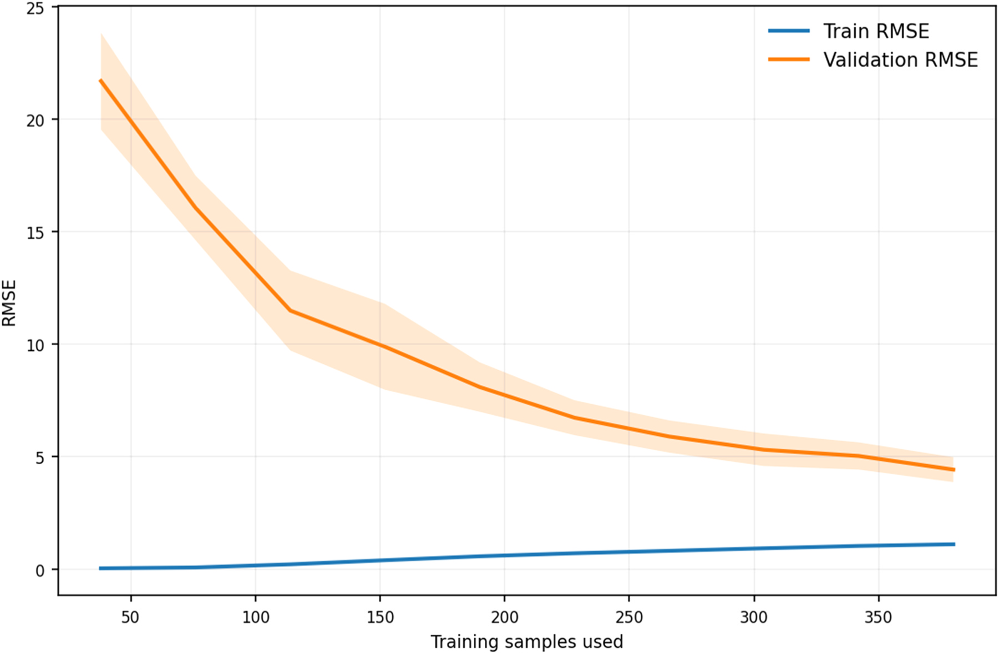
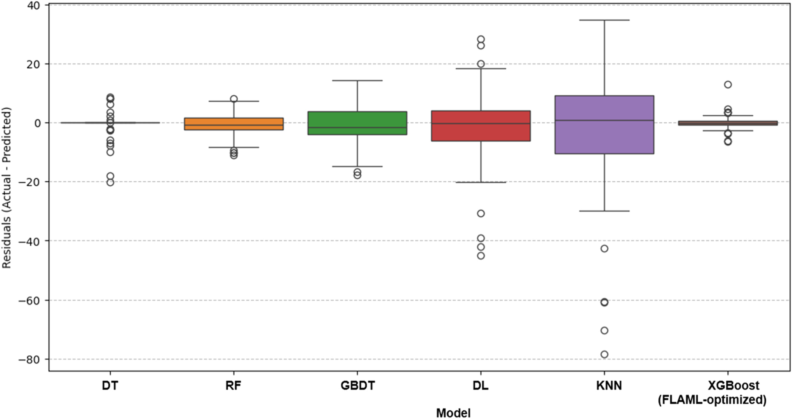
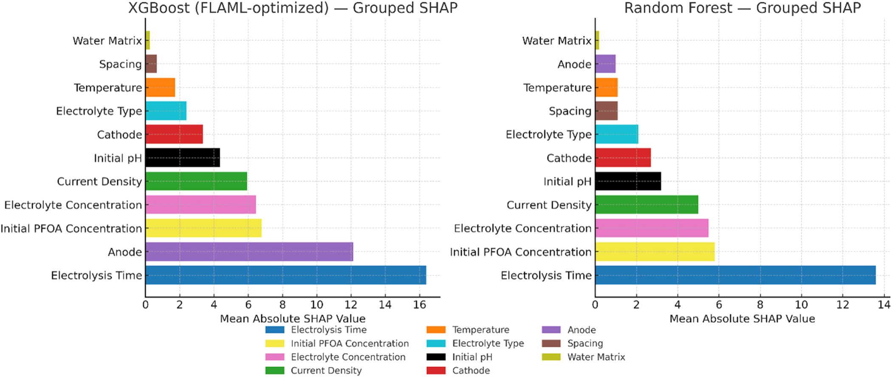
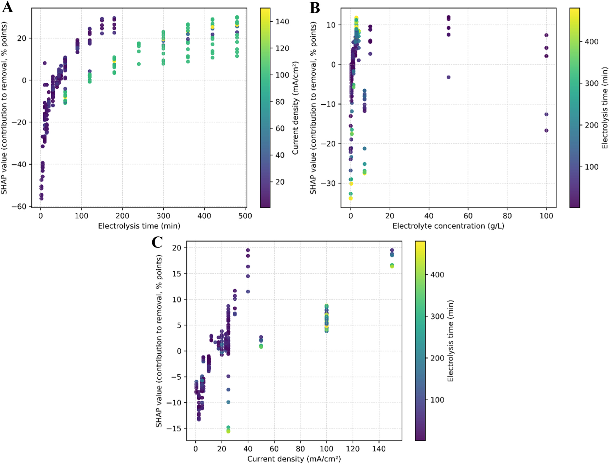

# Automated machine learning and SHAP-based interpretation of PFOA removal via electrochemical oxidation

## Abstract

- Quá trình electrochemical oxidation (oxy hóa điện hóa) của perfluorooctanoic acid (PFOA) đối mặt với độ phức tạp vận hành lớn do các tương tác phi tuyến giữa nhiều biến số quy trình.
  - PFOA là chất ô nhiễm môi trường bền vững và độc hại (persistent and toxic environmental pollutant).
- Nghiên cứu đề xuất một framework machine learning (ML - học máy) tự động hóa hoàn toàn và có độ ổn định cao dựa trên Fast Lightweight AutoML (FLAML), tích hợp với SHapley Additive exPlanations (SHAP) nhằm tối ưu hóa và diễn giải hiệu năng oxy hóa điện hóa PFOA.
- Mô hình XGBoost được FLAML tối ưu hóa đạt độ chính xác dự đoán cao với $\text{RMSE} = 3.97$ và $R^2 = 0.98$.
  - Hiệu năng của FLAML-optimized XGBoost cao hơn đáng kể so với các mô hình ML truyền thống được tinh chỉnh có hệ thống (systematically tuned traditional ML models) như Random Forest, Gradient Boosting và các kiến trúc Deep Learning.
  - Quy trình kiểm định thống kê nghiêm ngặt xác nhận tính khái quát hóa và độ ổn định cao hơn của mô hình được tối ưu hóa bằng FLAML.
- Phân tích khả năng diễn giải dựa trên SHAP xác định các biến số quy trình chi phối hiệu quả xử lý, nhất quán với động học phân hủy điện hóa đã được thiết lập:
  - Thời gian điện phân (electrolysis time) và vật liệu anode (anode material) là các yếu tố thúc đẩy chính (primary drivers).
  - Nồng độ chất điện phân (electrolyte concentration) và mật độ dòng điện (current density) tạo thành bậc ảnh hưởng tiếp theo (next tier).
- Mô hình XGBoost được FLAML tối ưu hóa đạt mức giảm $72\%$ chi phí tính toán ($\text{computational overhead}$) so với các mô hình được tinh chỉnh thủ công.
  - Kết quả này thiết lập một chuẩn đối sánh (benchmark) có khả năng tái lập (reproducible), có thể diễn giải (interpretable) và hiệu quả về mặt tính toán trong các ứng dụng ML môi trường.
- Framework cung cấp một phương pháp tiếp cận có hệ thống giúp cải thiện độ chính xác dự đoán, tăng cường khả năng diễn giải và củng cố tính ứng dụng thực tế để hỗ trợ tối ưu hóa công nghệ xử lý môi trường và ra quyết định môi trường.

## 1. Introduction

- Perfluorooctanoic acid ($\text{PFOA}$) thuộc họ hợp chất per- and polyfluoroalkyl substances ($\text{PFAS}$) là một trong những chất ô nhiễm môi trường bền bỉ nhất hiện nay.
  - Liên kết carbon–fluorine ($C\text{--}F$) bền vững tạo nên độ ổn định hóa học đặc biệt, dẫn đến sự phát tán ô nhiễm diện rộng trong các hệ sinh thái thủy sinh và trên cạn.
  - Khả năng tích lũy sinh học (bioaccumulation) của $\text{PFOA}$ gắn liền với các rủi ro sức khỏe nghiêm trọng:
    - Độc tính miễn dịch (immunotoxicity).
    - Rối loạn chức năng gan (liver dysfunction).
    - Bệnh tim mạch (cardiovascular disease).
    - Nguy cơ ung thư (cancer).
  - Các cơ quan quản lý gia tăng sự giám sát pháp lý đối với $\text{PFOA}$:
    - Cơ quan Nghiên cứu Ung thư Quốc tế (International Agency for Research on Cancer - $\text{IARC}$) phân loại $\text{PFOA}$ vào nhóm chất gây ung thư cho người ($\text{Group 1}$).
    - Cơ quan Bảo vệ Môi trường Hoa Kỳ (U.S. Environmental Protection Agency - $\text{EPA}$) thiết lập nồng độ ô nhiễm tối đa (maximum contaminant levels) ở mức thấp $4\text{ ng/L}$ trong nước uống.
  - Nhu cầu cấp thiết thúc đẩy việc tìm kiếm các công nghệ xử lý có thể mở rộng quy mô (scalable) và bền vững:
    - Yêu cầu không chỉ loại bỏ mà phải khoáng hóa hoàn toàn (fully mineralizing) $\text{PFOA}$ thành các sản phẩm vô hại như carbon dioxide ($\text{CO}_2$) và ion fluoride ($\text{F}^-$).
    - Định hướng này phản ánh xu thế chung trong xử lý nước thải nhằm tối ưu hóa các quy trình để phân hủy các chất ô nhiễm công nghiệp khó phân hủy.

- Electrochemical oxidation ($\text{EO}$ / oxy hóa điện hóa) là công nghệ phân hủy đầy tiềm năng để xử lý $\text{PFAS}$, có khả năng khoáng hóa $\text{PFOA}$ thành $\text{CO}_2$ và $\text{F}^-$.
  - Cơ chế phân hủy của quá trình $\text{EO}$ hoạt động qua hai con đường chính (principal degradation pathways):
    - Chuyển điện tử trực tiếp tại bề mặt cực dương (direct electron transfer at the anode surface), tạo gốc perfluoroalkyl radicals và khởi động các phản ứng cắt ngắn chuỗi (chain-shortening reactions).
    - Quá trình oxy hóa qua trung gian gốc hydroxyl (hydroxyl radical-mediated oxidation) từ điện phân nước (water electrolysis).
  - Quá trình tối ưu hóa hệ thống $\text{EO}$ đối mặt với nhiều thách thức do sự tương tác phức tạp giữa các thông số vận hành (operational parameters):
    - Mật độ dòng điện (current density).
    - Khoảng cách giữa các điện cực (electrode spacing).
    - Thành phần chất điện phân (electrolyte composition).
    - Độ $\text{pH}$.
    - Nhiệt độ (temperature).
    - Nồng độ $\text{PFOA}$ ban đầu (initial $\text{PFOA}$ concentration).
    - Thời gian điện phân (electrolysis time).
    - Đặc tính của nền nước xử lý (water matrix characteristics).
  - Không gian tham số có số chiều cao (high dimensionality) và các tương tác phi tuyến (nonlinear interactions) cản trở các phương pháp tối ưu hóa truyền thống:
    - Biến động của một thông số tác động đáng kể đến hiệu quả của các thông số còn lại.
    - Phương pháp tiếp cận truyền thống đòi hỏi nhiều thời gian và chi phí tài nguyên lớn.
    - Cần các phương pháp tính toán tiên tiến để định hướng không gian tham số đa chiều nhằm tìm điều kiện tối ưu cho phân hủy $\text{PFOA}$.

- Machine learning ($\text{ML}$ / học máy) thể hiện tiềm năng giải quyết bài toán tối ưu hóa trong hệ thống điện hóa xử lý nước.
  - Các thuật toán $\text{ML}$ được ứng dụng thành công để dự đoán hiệu suất quá trình điện hóa, từ oxy hóa điện hóa tổng quát đến các kịch bản xử lý $\text{PFAS}$ cụ thể.
  - Các khung làm việc $\text{ML}$ tiên tiến đạt độ chính xác dự đoán vượt ngưỡng $R^2 = 0.84$ ($R^2 > 0.84$), đồng thời cung cấp hiểu biết về cơ chế thông qua phân tích tầm quan trọng của đặc trưng (feature importance analysis).
  - Việc tích hợp công cụ giải thích $\text{SHAP}$ ($\text{SHapley Additive exPlanations}$) hỗ trợ trích xuất thông tin hữu ích từ các tập dữ liệu điện hóa phức tạp:
    - Làm sáng tỏ các mối quan hệ giữa các tham số then chốt.
    - Định hướng các chiến lược tối ưu hóa điều kiện vận hành.
  - Các ứng dụng $\text{ML}$ hiện hữu trong lĩnh vực này còn gặp nhiều hạn chế:
    - Phụ thuộc vào mô hình hóa truyền thống với quy trình tinh chỉnh siêu tham số thủ công (manual hyperparameter tuning) diện rộng.
    - Việc lựa chọn thuật toán đòi hỏi chuyên gia chuyên sâu (expert-driven algorithm selection).
    - Hạn chế khả năng tiếp cận và mở rộng quy mô đối với các kỹ sư môi trường.

- Automated machine learning ($\text{AutoML}$ / học máy tự động) mang lại phương thức tiếp cận chuyển đổi cho việc tối ưu hóa quy trình dựa trên dữ liệu.
  - $\text{AutoML}$ vận hành tự động mà không cần sự can thiệp của con người qua các khâu:
    - Lựa chọn thuật toán (algorithm selection).
    - Tối ưu hóa siêu tham số (hyperparameter optimization).
    - Kỹ thuật tạo đặc trưng (feature engineering).
  - Khung làm việc $\text{FLAML}$ ($\text{Fast Lightweight AutoML}$) do Microsoft Research phát triển áp dụng tối ưu hóa Bayesian nhận thức chi phí (cost-aware Bayesian optimization):
    - Tự động phân bổ linh hoạt tài nguyên tính toán.
    - Ưu tiên các mô hình có độ phức tạp thấp để tăng tốc độ hội tụ.
  - $\text{AutoML}$ trong mô hình hóa môi trường giúp tiết kiệm chi phí tính toán và mang lại hiệu suất dự đoán cao hơn các mô hình tinh chỉnh thủ công:
    - Thuật toán gradient boosting do $\text{AutoML}$ lựa chọn đạt sai số $\text{MSE} = 17.0$, tốt hơn so với mạng nơ-ron nhân tạo thông thường đạt $\text{MSE} = 58.0$ khi dự đoán ảnh hưởng của vi nhựa lên quá trình sinh khí methane trong phân hủy kỵ khí.
    - Mô hình $\text{AutoML}$ mô phỏng chính xác động học loại bỏ kháng sinh trong đất ngập nước kiến tạo (constructed wetlands) qua nhiều thời lượng huấn luyện khác nhau, đạt sai số $\text{MAE} = 9.94\text{--}13.68$ và hệ số xác định $R^2 = 0.780\text{--}0.877$.
  - Việc kết hợp giữa $\text{FLAML}$ và $\text{SHAP}$ đáp ứng hai yêu cầu thiết yếu trong kỹ thuật môi trường:
    - Cung cấp độ chính xác dự đoán cao.
    - Mang lại các hiểu biết minh bạch, có thể giải thích để hỗ trợ tuân thủ quy định pháp lý, tối ưu hóa vận hành và xây dựng niềm tin của các bên liên quan.

- Nghiên cứu thiết lập một quy trình $\text{AutoML}$ có khả năng tái lập (reproducible) và giải thích được (interpretable) cho hệ thống oxy hóa điện hóa $\text{PFOA}$.
  - Việc kết hợp tối ưu hóa tự động nhận thức chi phí ($\text{FLAML}$) cùng giải thích dựa trên $\text{SHAP}$ hướng đến ba mục tiêu cụ thể:
    - Đạt hiệu suất dự đoán đáng tin cậy.
    - Cung cấp sự quy kết minh bạch dựa trên mô hình về các yếu tố chi phối vận hành (model-based attribution of operational drivers).
    - Xây dựng đường ống xử lý có tính linh động cao (portable pipeline), giảm bớt các bước thử nghiệm thủ công.
  - Nghiên cứu sử dụng tập dữ liệu đã được xử lý chuẩn bị từ trước (previously curated dataset) để đảm bảo tính so sánh trực tiếp, đồng thời tách biệt đóng góp về mặt phương pháp luận giữa tự động hóa và khả năng diễn giải.
  - $\text{FLAML}$ được xem là khung làm việc tối ưu hóa tách biệt với thuật toán học máy dự đoán cuối cùng là $\text{XGBoost}$.
  - Hiệu suất tổng quát hóa (generalization) được kiểm định chặt chẽ thông qua:
    - Kiểm tra giữ lại lặp lại (repeated holdout).
    - Các kiểm định thống kê (statistical testing).
    - Chẩn đoán đường cong học tập (learning-curve diagnostics).

## 2. Methodology

### 2.1. Dataset characteristics and preprocessing
- Nghiên cứu kế thừa tập dữ liệu thực nghiệm do Alnaimat et al. [30] tuyển chọn, ghi nhận quá trình phân hủy điện hóa (electrochemical degradation) của axit perfluorooctanoic (PFOA) dưới nhiều điều kiện khác nhau.
  - Tập dữ liệu bao gồm các kịch bản xử lý riêng biệt, mỗi kịch bản được định nghĩa bởi sự kết hợp giữa các thông số vận hành (operational parameters) và bối cảnh môi trường (environmental contexts).
  - Các biến độc lập then chốt (key independent variables) bao gồm:
    - Thời gian điện phân (electrolysis duration).
    - Mật độ dòng điện (current density).
    - Chủng loại vật liệu cực dương (anode material type) và cực âm (cathode material type).
    - Nồng độ và thành phần chất điện phân (electrolyte concentration and composition).
    - Nền nước (water matrix).
- Các phân tích thăm dò (exploratory analyses) được tiến hành nhằm mô tả đặc tính của biến đầu vào và biến mục tiêu trước khi mô hình hóa:
  - Cấu trúc phụ thuộc giữa các biến dự đoán được thể hiện tại Hình S1 (bản đồ nhiệt tương quan thứ hạng Spearman - Spearman rank-correlation heatmap kèm ký hiệu mức ý nghĩa thống kê).
  - Mối quan hệ hai biến (bivariate relationships) được trực quan hóa tại Hình S2 (biểu đồ phân tán từng cặp với đường khớp LOWESS và chú giải hệ số Pearson/Spearman).
  - Phân phối của biến mục tiêu cùng chẩn đoán phân phối chuẩn tắc Shapiro–Wilk (Shapiro–Wilk normality diagnostic) được trình bày tại Hình S3.
  - Một số biến điện hóa thể hiện mức độ liên kết dương trung bình, điển hình như giữa thời gian điện phân và mật độ dòng điện ($|\rho| \approx 0.35\text{--}0.55$), phản ánh sự đồng biến thiên thực nghiệm điển hình (typical experimental co-variation).
- Quy trình tiền xử lý dữ liệu tuân thủ các quy ước phù hợp với từng thuật toán:
  - Các biến liên tục (continuous variables) được chuẩn hóa theo thang đo điểm chuẩn $z$ ($z\text{-score}$) đối với các mô hình đường cơ sở dựa trên khoảng cách (distance-based) và đạo hàm (gradient-based) nhằm đảm bảo độ ổn định số học và tỷ lệ tương thích.
  - Các mô hình học dựa trên cây (tree-based learners) được huấn luyện trên dữ liệu đầu vào không co giãn (unscaled inputs) nhờ đặc tính bất biến theo thang đo (scale-invariance) của các tiêu chí phân nhánh (split criteria).
  - Các biến mô tả phân loại (categorical descriptors) gồm cực dương (anode), cực âm (cathode), chất điện phân (electrolyte), và nền nước (water matrix) được mã hóa one-hot (one-hot encoded) để duy trì tính bình đẳng giữa các thuật toán đối chuẩn và cho phép tổng hợp lại theo đặc trưng gốc (parent feature) khi giải thích mô hình.
  - Lực lượng phần tử (cardinalities) của mỗi trường đặc trưng đều nhỏ ($\le 6$ giá trị trên mỗi trường), giúp hạn chế độ thưa (sparsity) và số chiều của dữ liệu.

### 2.2. Data splitting and evaluation protocol
- Quy trình đánh giá mô hình áp dụng phân chia giữ lại (holdout partition) theo tỷ lệ $80:20$ có phân tầng (stratified) theo loại cực dương (anode type):
  - Phân tầng theo cực dương nhằm giảm thiểu sự dịch chuyển đồng biến (covariate shift) phát sinh từ phân phối cực dương không đồng đều trên toàn tập dữ liệu.
  - Biến mục tiêu (hiệu suất loại bỏ PFOA, $\%$) không thực hiện phân tầng, phù hợp với bài toán hồi quy (regression setting).
  - Giá trị mầm ngẫu nhiên cố định ($\text{random seed} = 42$) được sử dụng xuyên suốt nhằm đảm bảo tính tái lập (reproducibility).
- Độ ổn định của giao thức phân chia được kiểm chứng qua các lượt chạy lặp lại và các cách thức phân chia dữ liệu thay thế:
  - Độ nhạy của việc phân tầng trên các phân chia thay thế được ghi nhận tại Hình S4 (độ nhạy phân tầng - stratification sensitivity).
  - Quy trình lựa chọn mô hình nội bộ và tính nhất quán về hiệu năng được tổng hợp tại Hình S5 (chẩn đoán kiểm định chéo lồng nhau - nested cross-validation diagnostics).

### 2.3. Automated model selection via FLAML
- Quá trình tự động hóa lựa chọn mô hình và siêu tham số được thực hiện bằng FLAML (Fast Lightweight AutoML):
  - FLAML là khung làm việc AutoML nhận biết chi phí (cost-aware AutoML framework), thay thế quy trình tinh chỉnh thủ công theo dạng lưới (manual grid-style tuning) bằng chiến lược tìm kiếm có giới hạn ngân sách và dừng sớm (budgeted, early-stopped search).
  - Ngân sách thời gian thực tế (wall-time budget) được ấn định cho quá trình tìm kiếm của FLAML là $300\text{ s}$.
  - Cơ chế tìm kiếm của FLAML bao gồm:
    - Khởi tạo với các cấu hình có chi phí tính toán thấp.
    - Phân bổ linh hoạt các lượt thử nghiệm (trials) về phía các vùng thuật toán và siêu tham số có triển vọng.
    - Cắt tỉa (pruning) các lượt chạy kém hiệu quả khi sai số kiểm thực đạt trạng thái bình nguyên (plateau) trong phạm vi ngân sách được cấp.
  - Hàm mục tiêu tối ưu hóa là chỉ số RMSE qua kiểm định chéo 5 lần ($5\text{-fold cross-validation RMSE}$).
  - Cơ chế dừng sớm (early stopping) được áp dụng ở cả hai cấp độ: cấp độ vòng lặp tăng cường (boosting-iteration level) đối với các mô hình học lặp và cấp độ lượt thử nghiệm (trial level) đối với các cấu hình không triển vọng.
  - Tiêu chí hội tụ (convergence) được xác định khi không ghi nhận cải thiện nào trong cửa sổ ngân sách và cấu hình tối ưu đương nhiệm (incumbent) giữ nguyên không đổi qua các đánh giá liên tiếp.
- Mô hình đạt hiệu năng cao nhất do FLAML lựa chọn là bộ hồi quy XGBoost (XGBoost regressor):
  - Tốc độ học ($\text{learning rate}$): $0.1403$.
  - Số lượng cây ($\text{n\_estimators}$): $379$.
  - Số lá tối đa trên mỗi cây ($\text{max\_leaves}$): $13$.
  - Hệ số điều chuẩn L1/L2 ($\text{L1/L2 regularization}$): $\alpha = 0.0995$, $\lambda = 0.0010$.
  - Tỷ lệ lấy mẫu con của quan sát ($\text{subsample}$): $0.85$.
  - Tỷ lệ lấy mẫu con của đặc trưng theo cây ($\text{colsample\_bytree}$): $0.83$.
  - Cấu hình này cân bằng giữa độ chệch và phương sai (bias–variance balance) bằng cách kết hợp tốc độ học vừa phải với độ phức tạp của cây bị ràng buộc và các số hạng điều chuẩn.
  - Toàn bộ không gian tìm kiếm và các siêu tham số được chọn cho XGBoost cùng tất cả các mô hình cơ sở được tổng hợp trong Bảng SI S1 (SI Table S1).

### 2.4. Comparative benchmarking and statistical validation
- Nhằm đối chiếu hiệu năng khách quan, mô hình XGBoost do FLAML tối ưu hóa được đối chuẩn so sánh (benchmarking) với $5$ mô hình hồi quy thông dụng:
  - Cây quyết định (Decision Trees - DT).
  - Rừng ngẫu nhiên (Random Forests - RF).
  - Cây quyết định tăng cường độ dốc (Gradient Boosting Decision Trees - GBDT).
  - Học sâu (Deep Learning - DL).
  - $k$ láng giềng gần nhất ($k\text{-Nearest Neighbors}$ - KNN).
  - Mỗi mô hình đều được đánh giá trên cùng tập dữ liệu mã hóa one-hot và chịu cùng các phân chia huấn luyện - kiểm tra phân tầng giống hệt nhau để đảm bảo tính tương đồng về mặt phương pháp (methodological parity).
- Quy trình đánh giá mô hình sử dụng $10$ lần lặp độc lập của phép phân chia phân tầng tỷ lệ $80:20$ nhằm định lượng độ ổn định qua các lần phân chia khác nhau:
  - Với mỗi lần lặp, $5$ chỉ số hiệu năng được tính toán chi tiết:
    - Sai số toàn phương trung bình (Root Mean Squared Error - RMSE).
    - Sai số tuyệt đối trung bình (Mean Absolute Error - MAE).
    - Sai số phần trăm tuyệt đối trung bình (Mean Absolute Percentage Error - MAPE).
    - Hệ số tương quan Pearson (Correlation Coefficient - CC, ký hiệu $r$).
    - Hệ số xác định (Coefficient of Determination - $R^2$).
  - Các chỉ số RMSE, MAE và MAPE định lượng độ lớn của sai số (error magnitude), trong khi CC ($r$) và $R^2$ tóm tắt mức độ liên kết cùng tỷ lệ phương sai giải thích được (explained variance).
- Kiểm định ý nghĩa thống kê của các khác biệt từng cặp mô hình:
  - Phép kiểm định $t$ ghép cặp hai đuôi (paired two-tailed $t\text{-tests}$) được thực hiện ở mức ý nghĩa $\alpha = 0.01$ trên $10$ lần lặp lại.
  - Hiệu chỉnh Bonferroni (Bonferroni correction) được sử dụng để kiểm soát tỷ lệ sai số trên toàn họ kiểm định (family-wise error rate).
  - Chỉ số kích thước hiệu ứng Cohen's $d$ ($d$ của Cohen) được báo cáo bổ sung để định lượng độ lớn của hiệu ứng (effect sizes).
  - Giao thức này cung cấp phép so sánh có độ ổn định cao trước sự biến động phân chia dữ liệu dưới cùng điều kiện dữ liệu và tiền xử lý, thống nhất với khung phân chia dữ liệu mô tả tại Mục 2.2.

### 2.5. Interpretability via SHAP analysis
- Khả năng diễn giải mô hình được đánh giá bằng SHapley Additive exPlanations (SHAP) dựa trên nền tảng lý thuyết trò chơi hợp tác:
  - SHAP phân bổ đóng góp biên (marginal contribution) của từng đặc trưng vào kết quả dự đoán của từng mẫu cá thể.
  - Các giá trị SHAP được tính toán cho mô hình XGBoost đã huấn luyện và được tổng hợp thành độ quan trọng theo nhóm (grouped importances) bằng cách cộng dồn giá trị tuyệt đối $|\text{SHAP}|$ trên các mức mã hóa one-hot của từng biến phân loại gốc (cực dương, cực âm, chất điện phân, nền nước).
- Đánh giá ảnh hưởng của tương quan đối với gán quyền số của TreeSHAP:
  - Do sự phụ thuộc lẫn nhau giữa các biến dự đoán điện hóa (Hình S1 và Hình S2), nguy cơ sai lệch gán quyền do tương quan được khảo sát bằng cách so sánh thứ hạng SHAP theo nhóm với phân tích độ quan trọng hoán vị có điều kiện (Conditional Permutation Importance - CPI) có nhận biết tương quan.
  - Độ quan trọng hoán vị có điều kiện (CPI) được tính toán bằng cách tái lấy mẫu có điều kiện (conditionally resampling) trong các tầng của các biến dự đoán tương quan để giảm thiểu độ lệch tương quan (correlation bias).
  - Mức độ đồng thuận giữa hai phương pháp xếp hạng được định lượng bằng hệ số hạng Kendall ($\tau$ của Kendall) kèm khoảng tin cậy $95\,\%$ trong Bảng S2 (Table S2).
  - Sự kết hợp này mang lại góc nhìn minh bạch, đặt trong bối cảnh tương quan về ảnh hưởng của các đặc trưng, phục vụ cho việc thiết kế quy trình xử lý và tối ưu hóa điện hóa.
- Hai phân tích bổ sung được triển khai nhằm khảo sát tính ổn định và hành vi liều - đáp ứng (dose–response behaviour):
  - Biểu đồ phụ thuộc SHAP (SHAP dependence plots):
    - Được thiết lập cho $3$ biến liên tục có ảnh hưởng lớn nhất: thời gian điện phân (electrolysis time), nồng độ chất điện phân (electrolyte concentration), và mật độ dòng điện (current density).
    - Màu sắc của các điểm dữ liệu biểu diễn mối quan hệ tương tác với một thông số điện hóa thứ cấp (secondary electrochemical parameter).
  - Kiểm tra độ ổn định loại trừ một biến (Leave-One-Out stability test - LOO):
    - Được tiến hành trên giá trị trung bình $|\text{SHAP}|$ theo nhóm.
    - Thứ hạng đặc trưng trước hết được xác định trên toàn bộ tập dữ liệu gốc, sau đó đặc trưng xếp hạng cao nhất (thời gian điện phân) bị loại bỏ và độ quan trọng SHAP được tính toán lại trên tập dữ liệu đã giản lược.
    - Mức độ đồng thuận giữa hai bảng thứ hạng được tóm tắt bằng hệ số hạng Kendall ($\tau$ của Kendall).

### 2.6. Reproducibility and deployment considerations
- Toàn bộ các phép tính toán được thực thi trên môi trường Python phiên bản $3.10$ với các gói phụ thuộc được kiểm soát phiên bản chặt chẽ:
  - Thư viện FLAML phiên bản $1.2.0$.
  - Thư viện SHAP phiên bản $0.44.0$.
  - Thư viện scikit-learn phiên bản $1.4.0$.
- Toàn bộ đường ống mô hình hóa (modeling pipeline) được đóng gói trong một bộ chứa Docker (Docker container):
  - Đóng gói container nhằm bảo đảm khả năng tái lập đa nền tảng (cross-platform reproducibility) và hỗ trợ thẩm định độc lập từ cộng đồng (peer validation).
  - Cách tiếp cận này tạo bước cải tiến rõ rệt về độ chuẩn hóa môi trường so với các môi trường kịch bản thiếu kiểm soát phiên bản trong các nghiên cứu học máy điện hóa trước đây.

### 2.7. Methodological contributions and distinctions
- Các đóng góp phương pháp luận và điểm khác biệt chính so với nghiên cứu của Alnaimat et al. [30]:
  - Giới thiệu quy trình lựa chọn mô hình tự động hoàn toàn, nhận biết chi phí bằng FLAML thay thế cho quy trình dò tìm lưới hoặc tinh chỉnh thủ công (Bảng S1 - Table S1).
  - Thiết lập giao thức so sánh đối chuẩn bền vững trước phân chia dữ liệu với các đánh giá lặp lại nhiều lần cùng các phép kiểm định ý nghĩa thống kê và kích thước hiệu ứng chính thức.
  - Triển khai lược đồ diễn giải đặt trong ngữ cảnh tương quan, kết hợp báo cáo TreeSHAP theo nhóm song song với độ quan trọng hoán vị có điều kiện (CPI) cùng các thống kê đồng thuận (Bảng S2 - Table S2).
  - Đóng gói toàn bộ đường ống xử lý trong container với các gói phụ thuộc được cố định phiên bản nhằm phục vụ khả năng tái lập từ đầu đến cuối (end-to-end reproducibility).
  - Tổng hòa các yếu tố này hình thành một phương pháp luận minh bạch, hiệu quả và có thể tái tạo dành riêng cho các tập dữ liệu xử lý điện hóa, làm rõ các mức cải thiện hiệu năng và khả năng diễn giải dưới các giả định và thiết lập kiểm định đã được lập thành tài liệu đầy đủ.

## 3. Results and discussion

### 3.1. Model performance and statistical validation

- Mô hình XGBoost được tối ưu hóa bằng FLAML (FLAML-optimized XGBoost) đạt hiệu suất dự đoán cao trong mô hình hóa hiệu quả oxy hóa điện hóa PFOA (PFOA electrochemical oxidation efficiency), đạt kết quả tốt hơn đáng kể so với tất cả các mô hình cơ sở (baseline models) trên mọi chỉ số đánh giá (Bảng 1 / Table 1):
  - Mô hình FLAML-optimized XGBoost đạt sai số $\text{RMSE} = 3.97 \pm 0.45$ và hệ số xác định $R^2 = 0.98 \pm 0.01$, tương ứng với mức giảm $51\,\%$ sai số dự đoán (prediction error) và cải thiện $7\,\%$ phương sai giải thích được (explained variance) so với mô hình cơ sở có hiệu suất cao nhất là Rừng ngẫu nhiên (Random Forest - RF: $\text{RMSE} = 8.05 \pm 1.02$, $R^2 = 0.91 \pm 0.02$).
  - Bảng 1 thống kê chi tiết các chỉ số đánh giá trung bình và độ lệch chuẩn ($\text{Mean} \pm \text{Std Dev}$) qua $10$ lần chạy độc lập:
    - FLAML-optimized XGBoost: $\text{RMSE} = 3.97 \pm 0.45$, $\text{MAE} = 2.93 \pm 0.31$, $\text{MAPE} = 10.02 \pm 3.08\,\%$, $\text{CC} = 0.99 \pm 0.0$, $R^2 = 0.98 \pm 0.01$.
    - Random Forest (RF): $\text{RMSE} = 8.05 \pm 1.02$, $\text{MAE} = 5.97 \pm 0.57$, $\text{MAPE} = 25.17 \pm 10.94\,\%$, $\text{CC} = 0.96 \pm 0.01$, $R^2 = 0.91 \pm 0.02$.
    - Cây tăng cường độ dốc (Gradient Boosting Decision Tree - GBDT): $\text{RMSE} = 9.35 \pm 0.77$, $\text{MAE} = 7.49 \pm 0.58$, $\text{MAPE} = 32.39 \pm 10.18\,\%$, $\text{CC} = 0.95 \pm 0.01$, $R^2 = 0.89 \pm 0.01$.
    - Cây quyết định (Decision Tree - DT): $\text{RMSE} = 10.31 \pm 2.17$, $\text{MAE} = 7.33 \pm 1.11$, $\text{MAPE} = 24.75 \pm 13.5\,\%$, $\text{CC} = 0.93 \pm 0.03$, $R^2 = 0.86 \pm 0.07$.
    - Học sâu (Deep Learning - DL): $\text{RMSE} = 12.41 \pm 1.46$, $\text{MAE} = 8.9 \pm 0.55$, $\text{MAPE} = 51.78 \pm 32.25\,\%$, $\text{CC} = 0.9 \pm 0.02$, $R^2 = 0.8 \pm 0.05$.
    - $k$ láng giềng gần nhất (k-Nearest Neighbors - KNN): $\text{RMSE} = 19.6 \pm 2.38$, $\text{MAE} = 14.35 \pm 1.38$, $\text{MAPE} = 101.09 \pm 51.01\,\%$, $\text{CC} = 0.71 \pm 0.06$, $R^2 = 0.49 \pm 0.11$.
- Ưu thế hiệu suất của FLAML-optimized XGBoost đạt ý nghĩa thống kê trên tất cả các chỉ số với $p < 10^{-5}$, được xác nhận qua các kiểm định $t$ theo cặp (paired t-tests) (Bảng 2 / Table 2):
  - Chênh lệch thể hiện rõ nét nhất khi so sánh với các mô hình cây quyết định tăng cường độ dốc ($p < 1.1 \times 10^{-8}$ đối với $\text{RMSE}$) và phương pháp tiếp cận học sâu ($p < 2.8 \times 10^{-9}$ đối với $\text{RMSE}$).
  - Bảng 2 ghi nhận chi tiết giá trị $p$ của kiểm định $t$ theo cặp khi so sánh FLAML-optimized XGBoost với từng mô hình cơ sở:
    - So với RF: $\text{RMSE}$ có $p = 9.616685 \times 10^{-7}$, $\text{MAE}$ có $p = 1.547798 \times 10^{-7}$, $\text{MAPE}$ có $p = 0.000610$, $\text{CC}$ có $p = 2.953061 \times 10^{-5}$, $R^2$ có $p = 1.260622 \times 10^{-5}$.
    - So với GBDT: $\text{RMSE}$ có $p = 1.106071 \times 10^{-8}$, $\text{MAE}$ có $p = 5.052537 \times 10^{-9}$, $\text{MAPE}$ có $p = 0.000009$, $\text{CC}$ có $p = 2.678730 \times 10^{-8}$, $R^2$ có $p = 1.228068 \times 10^{-8}$.
    - So với DT: $\text{RMSE}$ có $p = 3.20401610 \times 10^{-6}$, $\text{MAE}$ có $p = 3.111270 \times 10^{-7}$, $\text{MAPE}$ có $p = 0.004675$, $\text{CC}$ có $p = 1.247765 \times 10^{-4}$, $R^2$ có $p = 1.414884 \times 10^{-4}$.
    - So với DL: $\text{RMSE}$ có $p = 2.846609 \times 10^{-9}$, $\text{MAE}$ có $p = 3.311756 \times 10^{-11}$, $\text{MAPE}$ có $p = 0.001801$, $\text{CC}$ có $p = 3.080667 \times 10^{-7}$, $R^2$ có $p = 4.826925 \times 10^{-7}$.
    - So với KNN: $\text{RMSE}$ có $p = 6.734575 \times 10^{-9}$, $\text{MAE}$ có $p = 1.336126 \times 10^{-9}$, $\text{MAPE}$ có $p = 0.000225$, $\text{CC}$ có $p = 2.164031 \times 10^{-7}$, $R^2$ có $p = 1.738757 \times 10^{-7}$.
- Phân tích xếp hạng (ranking analysis) (Bảng 3 / Table 3) khẳng định vị thế dẫn đầu nhất quán của mô hình FLAML-optimized XGBoost trên tất cả các thước đo hiệu suất:
  - FLAML-optimized XGBoost giành vị trí số 1 trên toàn bộ các chỉ số ($\text{RMSE}$, $\text{MAE}$, $\text{MAPE}$, $\text{CC}$, $R^2$) với thứ hạng trung bình tuyệt đối là $1.0$.
  - Random Forest (RF) xếp thứ hai với thứ hạng trung bình là $2.2$ (xếp thứ $2.0$ ở $\text{RMSE}$, $\text{MAE}$, $\text{CC}$, $R^2$ và thứ $3.0$ ở $\text{MAPE}$).
  - Cây quyết định (DT) và GBDT cùng xếp thứ ba với thứ hạng trung bình là $3.4$.
  - Học sâu (DL) xếp thứ năm với thứ hạng trung bình là $5.0$ trên mọi chỉ số.
  - $k$ láng giềng gần nhất (KNN) xếp thứ sáu với thứ hạng trung bình là $6.0$ trên mọi chỉ số.
- FLAML chứng minh năng lực là công cụ hiệu quả cao trong mô hình hóa quá trình điện hóa, đạt mức độ chính xác từng đòi hỏi quá trình tinh chỉnh thủ công (manual tuning) quy mô lớn:
  - Hiệu suất mô hình phù hợp với các minh chứng gần đây về khả năng của AutoML trong việc cắt giảm chi phí tính toán (computational costs) nhưng vẫn duy trì độ chính xác cao trong các hệ thống môi trường phức tạp [28,29].
  - FLAML hoàn thành việc tối ưu hóa trong giới hạn ngân sách thời gian $300\text{ s}$ ($300\text{ giây}$).
  - Mức ngân sách $300\text{ s}$ đại diện cho mức giảm $72\,\%$ thời gian tinh chỉnh tham số so với các triển khai tìm kiếm lưới truyền thống (conventional grid search) được mô tả trong nghiên cứu gốc [30].
  - Hiệu quả tối ưu hóa này giải quyết rào cản tính toán trọng yếu trong nghiên cứu môi trường, nơi tài nguyên hạn chế thường gây khó khăn cho việc tối ưu hóa mô hình [23].
- Độ bền vững chống quá khớp được đánh giá qua $10$ lần lặp độc lập theo phân chia giữ lại phân tầng $80:20$ (stratified 80:20 holdout):
  - Hiệu suất ổn định trên tập kiểm tra qua $10$ lần lặp xác nhận khả năng tổng quát hóa đáng tin cậy.
  - Tính ổn định của quy trình được ghi nhận trong tài liệu bổ sung SI Figure S4 (độ nhạy phân tầng - stratification sensitivity) và quy trình chọn lọc nội bộ trong SI Figure S5 (chẩn đoán kiểm định chéo lồng nhau - nested CV diagnostics).
  - Đường cong học tập (Learning curves - Fig. 1) thể hiện giá trị validation $\text{RMSE}$ giảm đơn điệu theo quy luật hiệu suất cận biên giảm dần và duy trì khoảng cách train–validation khiêm tốn, ổn định ($\approx 3\text{--}4$ đơn vị $\text{RMSE}$ ở kích thước tập huấn luyện lớn nhất), cho thấy mô hình không gặp hiện tượng phân kỳ hoặc quá khớp dưới quy trình được báo cáo:
    - **Hình 1.** Đường cong học tập (train/validation RMSE theo kích thước tập huấn luyện) của FLAML-optimized XGBoost.
      - 
      - **Hình này chứng minh điều gì**
        - Quá trình huấn luyện hội tụ ổn định, không xuất hiện hiện tượng quá khớp (overfitting) hay phân kỳ khi tăng quy mô mẫu dữ liệu.
      - **Từ đâu mà thấy được**
        - Trục hoành biểu diễn số lượng mẫu huấn luyện ($40\text{--}380$ mẫu); trục tung thể hiện sai số $\text{RMSE}$ ($0\text{--}25$).
        - Validation $\text{RMSE}$ (đường màu cam) giảm đơn điệu từ $\approx 21.7$ xuống $\approx 4.4$, trong khi Train $\text{RMSE}$ (đường màu xanh dương) duy trì ở mức thấp từ $0$ đến $\approx 1.1$, giữ khoảng cách ổn định $\approx 3.3$ đơn vị $\text{RMSE}$ ($\approx 3\text{--}4$ đơn vị) tại $380$ mẫu.
- Phân tích phân phối phần dư (Residual distribution analysis - Fig. 2) thể hiện độ tin cậy và tính ổn định của mô hình:
  - FLAML thể hiện phần dư đối xứng nhất và phân bố tập trung chặt chẽ nhất với khoảng tứ phân vị $\text{IQR} \approx 6\,\%$, phản ánh độ chệch hệ thống tối thiểu (minimal systematic bias) và độ chính xác dự đoán nhất quán trên toàn bộ không gian tham số vận hành:
    - **Hình 2.** Biểu đồ hộp phân phối phần dư của từng mô hình dự đoán.
      - 
      - **Hình này chứng minh điều gì**
        - Mô hình FLAML-optimized XGBoost đạt độ phân tán phần dư hẹp nhất và hạn chế độ chệch hệ thống so với các thuật toán học máy cơ sở.
      - **Từ đâu mà thấy được**
        - Trục hoành thể hiện $6$ mô hình so sánh (DT, RF, GBDT, DL, KNN, XGBoost (FLAML-optimized)); trục tung thể hiện phần dư $\text{Residuals (Actual - Predicted)}$ từ $-80$ đến $40$.
        - Hộp phần dư của FLAML-optimized XGBoost tập trung hẹp quanh mốc $0$ ($\text{IQR} \approx 6\,\%$), trong khi KNN có nhiều ngoại lai âm cực đoan ($< -70\,\%$) và DL có xu hướng chệch dương với ngoại lai kéo dài từ $-45$ đến gần $30$.
  - Trái lại, các thuật toán truyền thống thể hiện phân phối phần dư rộng hơn kèm theo các điểm ngoại lai đáng kể:
    - Thuật toán $k$ láng giềng gần nhất (KNN) xuất hiện phần dư âm cực đoan ($< -70\,\%$).
    - Các phương pháp tiếp cận học sâu (DL) bộc lộ xu hướng chệch dương (positive bias tendencies).
  - Độ chính xác phần dư cao có ý nghĩa sống còn trong các ứng dụng thiết kế lò phản ứng, nơi độ bất định của dự đoán sẽ lan truyền qua các tính toán hiệu quả năng lượng [31,32].
  - Các đặc điểm phân phối phần dư quan sát được phù hợp với kỳ vọng lý thuyết dành cho các thuật toán tối ưu hóa nhận biết chi phí (cost-aware optimization algorithms), vốn có cơ chế giảm thiểu sai số kiểm định chéo một cách có hệ thống dưới điều kiện tài nguyên bị hạn chế [33].

### 3.2. Feature importance and electrochemical mechanisms

- Đánh giá độ quan trọng đặc trưng dựa trên SHAP (SHapley Additive exPlanations) cung cấp hiểu biết cơ chế định lượng về các yếu tố chi phối hiệu suất loại bỏ PFOA bằng quá trình oxy hóa điện hóa (electrochemical oxidation):
  - **Hình 3.** Độ quan trọng đặc trưng Grouped SHAP giữa XGBoost (FLAML-optimized) và Random Forest.
    - 
    - **Hình này chứng minh điều gì**
      - Cả hai mô hình đều xác định electrolysis time là yếu tố quan trọng nhất; XGBoost xếp anode ở vị trí thứ hai ($|\text{SHAP}| \approx 12{,}1$), trong khi Random Forest làm suy giảm bậc quan trọng của anode ($|\text{SHAP}| \approx 1{,}0\text{--}1{,}5$).
    - **Từ đâu mà thấy được**
      - Biểu đồ thanh bên trái (XGBoost) hiển thị Anode xếp thứ hai ngay sau Electrolysis Time; biểu đồ bên phải (Random Forest) hiển thị Anode tụt xuống vị trí áp chót (thứ 10/11 đặc trưng).
  - Cả hai khung mô hình học máy—XGBoost được tối ưu hóa bằng FLAML và Random Forest thông thường—đồng thuận xác định thời gian điện phân (electrolysis time) là yếu tố quyết định nhất, ghi nhận giá trị $|\text{SHAP}|$ trung bình lần lượt khoảng $16{,}4$ và $13{,}6$.
  - Sự chi phối của electrolysis time nhất quán với lý thuyết oxy hóa điện hóa nền tảng: hiệu quả phân hủy chất ô nhiễm phụ thuộc vào lượng điện tích tích lũy được cấp (cumulative applied charge), một đại lượng tỷ lệ thuận trực tiếp với thời lượng điện phân [34].
  - Thời gian điện phân điều khiển sự hình thành và tính sẵn có liên tục của các chất oxy hóa hoạt tính, chủ yếu là các gốc hydroxyl ($\text{•}\text{OH}$), tác nhân xúc tác quá trình khơi mào và duy trì khoáng hóa chất ô nhiễm có độ bền cao như PFOA [35, 36].
  - Việc diễn giải mô hình xem xét tương quan ghi nhận giữa các biến đầu vào (SI Figures S1–S2) cùng thống kê mức độ đồng thuận với độ quan trọng hoán vị có điều kiện (conditional permutation importance trong SI Table S2).
- Sự phân kỳ rõ nét xuất hiện ở yếu tố cực dương (anode) giữa hai cấu trúc mô hình:
  - Trong mô hình XGBoost tối ưu hóa bằng FLAML, Anode xếp vị trí thứ hai với giá trị $|\text{SHAP}|$ trung bình $\approx 12{,}1$ điểm phần trăm (percentage points), trong khi ảnh hưởng của anode thấp hơn đáng kể ở Random Forest tinh chỉnh với $|\text{SHAP}|$ trung bình $\approx 1{,}5\text{--}2{,}0$.
  - Tín hiệu cực dương nâng cao ở XGBoost phù hợp về mặt cơ chế điện hóa: các anode có thế quá áp sinh oxy cao (high-OER-overpotential anodes, ví dụ kim cương pha tạp boron - BDD) sản sinh mật độ gốc tự do cao hơn trong quá trình điện phân phân hủy PFAS.
  - Do cả hai bảng của Hình 3 đều sử dụng grouped TreeSHAP, sự khác biệt bắt nguồn từ năng lực biểu diễn của mô hình (model capacity) thay vì chỉ số đo lường độ quan trọng: XGBoost nắm bắt các hiệu ứng phi tuyến và hiệu ứng tương tác đa biến (ví dụ tương tác $\text{Anode} \times \text{Current Density}$) vốn bị làm loãng khi Random Forest lấy trung bình qua toàn bộ tập hợp cây (ensemble tree averaging).
  - Kết quả tương quan này giải thích lý do Alnaimat và cộng sự [30] ghi nhận độ quan trọng cực dương thấp khi sử dụng các độ đo Gini/permutation trên mô hình RF truyền thống, vốn là các thước đo có bản chất cấu trúc khác với SHAP.
  - Độ lớn giá trị quan trọng vẫn phụ thuộc vào cấu trúc mô hình và mức độ tương quan dữ liệu; số liệu đồng thuận với conditional permutation importance được trình bày trong SI Table S2.
- Nồng độ chất điện phân (Electrolyte Concentration) được mô hình XGBoost xếp ở bậc ưu tiên tiếp theo với giá trị SHAP trung bình $\approx 6{,}5$:
  - Nồng độ chất điện phân điều chỉnh trực tiếp độ dẫn điện của dung dịch, qua đó tác động đến hiệu suất tạo gốc tự do và tốc độ oxy hóa chất ô nhiễm [37].
  - Lực ion tối ưu (optimized ionic strength) đạt được qua điều chỉnh chính xác nồng độ chất điện phân giúp gia tăng hiệu suất sản sinh gốc hydroxyl ($\text{•}\text{OH}$) đồng thời ức chế các phản ứng phụ cạnh tranh như phản ứng thoát oxy (oxygen evolution reaction - OER) tại cực dương [38].
  - Sự ghi nhận này của XGBoost tương thích với các phân tích động học điện hóa chi tiết: hiệu suất phân hủy đạt mức tối ưu ở dải nồng độ chất điện phân vừa phải nhờ thiết lập trạng thái cân bằng giữa độ linh động ion (ionic mobility) và các phản ứng phụ bắt giữ gốc tự do (radical-scavenging side reactions) [39].
- Mô hình Random Forest nhấn mạnh nồng độ PFOA ban đầu (Initial PFOA Concentration) là biến số có ảnh hưởng lớn thứ hai sau thời gian điện phân (mean $|\text{SHAP}| \approx 5{,}8$ so với $\approx 6{,}8$ ở XGBoost):
  - Nồng độ ban đầu của chất ô nhiễm tác động đến hiệu quả phân hủy tổng thể chủ yếu qua động học phản ứng tuân theo quy luật giả bậc một (pseudo-first-order degradation kinetics) trong quá trình oxy hóa điện hóa [40].
  - Việc Random Forest xếp hạng cao nồng độ ban đầu phản ánh độ nhạy lớn hơn đối với các gradient nồng độ trực tiếp, trong khi mô hình cây tăng cường (boosted-tree) ưu tiên nắm bắt các tương tác liên quan đến đặc tính dung dịch điện ly.
  - Mô hình XGBoost tối ưu thể hiện độ nhạy đối với các tương tác giữa đặc tính chất điện phân và cơ chế phản ứng điện hóa.
- Cả hai mô hình đều gán mức độ ảnh hưởng đáng kể cho mật độ dòng điện (Current Density), với giá trị SHAP xấp xỉ $5{,}9$ ở XGBoost và $5{,}2$ ở Random Forest:
  - Mật độ dòng điện phù hợp duy trì tốc độ sinh các gốc phản ứng tại mặt phân giới điện cực [41].
  - Mật độ dòng điện quá cao làm tăng tiêu hao năng lượng và thúc đẩy các phản ứng phụ như phản ứng thoát oxy, làm giảm hiệu quả xử lý tổng thể [42].
  - Vai trò hai mặt này đòi hỏi sự tối ưu hóa chính xác điều kiện vận hành; cấu trúc boosted-tree có khả năng nắm bắt các tác động phi tuyến và hành vi ngưỡng (threshold behaviors) liên quan đến sự đánh đổi năng lượng - hiệu suất này [43].
- pH dung dịch ban đầu (Initial pH) và nhiệt độ (Temperature) thể hiện mức độ ảnh hưởng vừa phải nhưng có ý nghĩa:
  - Initial pH đạt giá trị $|\text{SHAP}|$ xấp xỉ $4{,}3$ ở XGBoost và $3{,}2$ ở Random Forest; thông số này tác động đến hóa học bề mặt điện cực và sự phân bố dạng tồn tại của gốc tự do (radical speciation), điều biến độ ổn định và khả năng phản ứng của gốc oxy hóa [34, 41].
  - Ảnh hưởng của Temperature (mean $|\text{SHAP}| \approx 1{,}7$ ở XGBoost và $\approx 1{,}1$ ở Random Forest) xác nhận rằng trong các khoảng vận hành thực tế, tác động của nhiệt độ lên quá trình oxy hóa điện hóa tương đối nhỏ so với các thông số điện hóa như nồng độ chất điện phân và mật độ dòng điện [44].
  - Các đặc trưng còn lại ghi nhận ảnh hưởng thứ yếu trong cả hai mô hình: vật liệu cực âm (Cathode, mean $|\text{SHAP}| \approx 3{,}3$ ở XGBoost, $\approx 2{,}7$ ở RF), loại chất điện phân (Electrolyte Type, $\approx 2{,}4$ ở XGBoost, $\approx 2{,}1$ ở RF), khoảng cách điện cực (Spacing, $\approx 0{,}7$ ở XGBoost, $\approx 1{,}1$ ở RF), và ma trận nước (Water Matrix, $\approx 0{,}25$ ở XGBoost, $\approx 0{,}2$ ở RF).
- Sự khác biệt về thứ hạng đặc trưng giữa FLAML-optimized XGBoost và Random Forest phản ánh sự khác biệt về kiến trúc thuật toán:
  - Thuật toán boosted-tree của XGBoost, thông qua cơ chế khớp mô hình lặp tuần hoàn (iterative fitting) và điều chuẩn hóa nghiêm ngặt (regularization), ưu tiên phát hiện các tương tác phi tuyến phức tạp và hiệu ứng ngưỡng cục bộ [43].
  - Random Forest tính giá trị trung bình trên toàn bộ tập hợp cây, dẫn đến hiện tượng làm loãng các khác biệt tinh tế về độ quan trọng và đánh giá thấp các mối quan hệ tương tác giữa các biến.
- Tối ưu hóa siêu tham số tự động bằng FLAML nâng cao độ chính xác dự đoán và khả năng diễn giải cơ chế của mô hình XGBoost:
  - FLAML tự động xác định các ràng buộc độ phức tạp tối ưu và các số hạng điều chuẩn, bảo đảm cấu hình mô hình đồng thời đạt hiệu năng dự đoán cao và khả năng khái quát hóa (generalizability) [27].
  - Quy trình này thu hẹp khoảng cách giữa mô hình hóa dự đoán và lý thuyết cơ chế điện hóa, cung cấp thông tin về động học phân hủy và các chiến lược tối ưu hóa vận hành.
  - Độ ổn định thứ bậc ở nhóm thứ hai (second-tier rank stability) duy trì tính nhất quán qua các lần chạy lặp lại trong quy trình đánh giá thực nghiệm (Mục 2.2).

### 3.3. Dose–response patterns and stability of SHAP explanations

- Hành vi liều–đáp ứng (dose–response behavior) trong tập dữ liệu của các biến liên tục chính phản ánh tác động phi tuyến rõ rệt lên độ đóng góp SHAP đối với độ loại bỏ PFOA:
  - **Hình 4.** Đồ thị phụ thuộc SHAP của các biến liên tục chính
    - 
    - **Hình này chứng minh điều gì**
      - Thể hiện sự phân tán giá trị đóng góp SHAP theo tương tác với biến thứ hai và điểm chuyển tiếp giữa mức đóng góp âm và dương.
    - **Từ đâu mà thấy được**
      - (A) Ox: electrolysis time ($min$, $0$–$500$), Oy: SHAP value ($%age points$, $-60$ đến $30$).
      - (B) Ox: electrolyte concentration ($g/L$, $0$–$100$), Oy: SHAP value ($%age points$, $-35$ đến $15$).
      - (C) Ox: current density ($mA/cm^2$, $0$–$150$), Oy: SHAP value ($%age points$, $-15$ đến $20$).
- Phụ thuộc SHAP đối với thời gian điện phân (electrolysis time, Fig. 4A) có tính đơn điệu mạnh (strongly monotonic):
  - Khoảng thời gian điện phân rất ngắn tạo ra mức đóng góp âm đối với độ loại bỏ PFOA.
  - Thời gian điện phân kéo dài hơn làm tăng lũy tiến mức đóng góp SHAP.
  - Mức đóng góp SHAP tiệm cận vùng bão hòa (plateau) ở khoảng 20–30 %age points ($20$–$30$ điểm phần trăm).
  - Xu thế bão hòa này phù hợp trực tiếp với tác động tích lũy điện tích (cumulative charge).
- Nồng độ chất điện phân (electrolyte concentration, Fig. 4B) thể hiện dạng quy luật ngưỡng (threshold pattern):
  - Các nồng độ dưới mức tối ưu (sub-optimal concentrations) liên kết với giá trị đóng góp âm.
  - Nồng độ vừa phải (moderate concentrations) chuyển dịch giá trị SHAP về mức trung hòa hoặc giá trị dương.
  - Mức nồng độ thử nghiệm cao nhất mang lại rất ít lợi ích bổ sung (little additional gain), đồng thời thỉnh thoảng xuất hiện các mức phạt (occasional penalties) làm suy giảm giá trị SHAP.
- Mật độ dòng điện (current density, Fig. 4C) có giá trị đóng góp SHAP tăng xấp xỉ đơn điệu (approximately monotonically):
  - Mật độ dòng điện thấp tạo ra mức đóng góp gần bằng $0$ hoặc giá trị âm.
  - Mật độ dòng điện cao hơn đem lại mức đóng góp ngày càng dương.
  - Xuất hiện dấu hiệu của hiệu suất giảm dần (diminishing returns) ở phần cận trên của dải giá trị khảo sát.
- Phân tích độ ổn định loại trừ từng biến (leave-one-out stability analysis) đối với giá trị trung bình nhóm $|SHAP|$ (grouped mean $|SHAP|$) được ghi nhận tại Figure S6:
  - Khi loại bỏ đặc trưng xếp hạng cao nhất là thời gian điện phân (electrolysis time) và tái huấn luyện mô hình (model refit):
    - Vật liệu cực dương (anode) và mật độ dòng điện (current density) tiếp tục duy trì vị trí ở nhóm dẫn đầu (leading tier).
    - Độ pH ban đầu (initial pH), vật liệu cực âm (cathode), nhiệt độ (temperature) và khoảng cách giữa hai điện cực (electrode spacing) tiếp tục duy trì ở nhóm có tầm quan trọng trung bình/thấp (mid-/low-importance tier).
- Hệ số tương quan hạng Kendall's $\tau$ giữa hai bảng xếp hạng trước và sau loại trừ đặc trưng đạt $0.600$ ($p = 0.136$):
  - Mức tương quan này biểu thị sự tương đồng mức độ vừa phải (moderate concordance) trong bối cảnh số lượng đặc trưng đầu vào nhỏ.
- Thứ bậc đặc trưng ổn định (stable feature hierarchy) khẳng định thời gian điện phân, vật liệu cực dương và mật độ dòng điện là các yếu tố chi phối chủ đạo (dominant drivers):
  - Mọi giá trị SHAP đều được giải thích rõ ràng là các quy kết dựa trên mô hình (model-based attributions), không phải là mối quan hệ nhân quả (causal effects).

### 3.4. Implications for PFAS treatment optimization

- Kết quả tầm quan trọng đặc trưng (feature importance) cung cấp hướng dẫn thực tiễn cho thiết kế bình phản ứng điện hóa (electrochemical reactor design):
  - Sự chi phối của thời gian điện phân (electrolysis time) chỉ ra rằng mức độ gia tăng hiệu quả loại bỏ chủ yếu do lượng điện tích truyền tích lũy (cumulative charge passage) quyết định.
  - Công tác lập kế hoạch vận hành (operational planning) cần ưu tiên bảo đảm đủ thời gian phản ứng trong phạm vi các ràng buộc về năng lượng và lưu lượng thông lượng xử lý (energy and throughput constraints).
  - Lựa chọn cực dương (anode selection) là một yếu tố có ảnh hưởng cao trong bảng xếp hạng mô hình XGBoost (Hình 3 / Fig. 3), phù hợp với các công bố trong y văn về cơ chế sinh gốc tự do phụ thuộc vào vật liệu (material-dependent radical generation).
    - Việc lựa chọn vật liệu cụ thể cần phải tương thích với chế độ mật độ dòng điện (current-density regime) mục tiêu và các ràng buộc về mặt chi phí.
    - Sự đánh đổi giữa hiệu năng và chi phí (performance–cost trade-offs) cần được đánh giá theo từng trường hợp cụ thể.
  - Các ảnh hưởng của nền nước (water-matrix effects) xếp thứ hạng thấp trong hồ sơ SHAP nhóm (grouped SHAP profile) (ví dụ: nhóm đặc trưng "Water Matrix" nằm gần đáy Hình 3 / Fig. 3).
    - Trong phạm vi khảo sát của nghiên cứu, việc chuyển giao công nghệ (technology transfer) sang các nền nước khác nhau có thể đòi hỏi ít nỗ lực tái tối ưu hóa hơn so với việc điều chỉnh các điểm đặt vận hành điện hóa (electrochemical setpoints) (với điều kiện cần được kiểm chứng trên các nền nước mới) $[45, 46]$.
- Độ chính xác dự đoán của FLAML hỗ trợ kiểm soát chặt chẽ hơn các điểm đặt vận hành (setpoint control, ví dụ: mật độ dòng điện và thời gian điện phân) nhằm phục vụ vận hành chú trọng tiết kiệm năng lượng (energy-aware operation) trong phạm vi miền khảo sát:
  - Các dự phóng năng lượng mang tính định lượng (quantitative energy projections, ví dụ: $\text{kWh}\cdot\text{m}^{-3}$) không được trích xuất từ các kết quả đầu ra của mô hình hiện tại.
  - Việc định lượng năng lượng đòi hỏi quy trình kiểm toán năng lượng điện chuyên biệt (dedicated electro-energy auditing) đi kèm kiểm chứng thực nghiệm.
- Khả năng tổng quát hóa (generalization capability) của mô hình trên các điều kiện vận hành trong tập dữ liệu gợi mở tiềm năng mở rộng học chuyển giao (transfer-learning extensions) sang các chất PFAS (per- and polyfluoroalkyl substances) liên quan (ví dụ: PFOS, GenX):
  - Khả năng mở rộng học chuyển giao phụ thuộc vào việc bao phủ các dải vận hành tương đương và cần có kiểm chứng độc lập từ bên ngoài (external validation) $[47]$.

### 3.5. Limitations and future directions

- Hiệu năng dự đoán và độ bền vững của FLAML trên tập dữ liệu do [30] thu thập vẫn còn các hạn chế và hướng mở rộng nghiên cứu trong tương lai:
  - Khả năng thích ứng của khung mô hình hóa cần được đánh giá trên các không gian thông số vận hành rộng hơn (broader operational parameter spaces).
  - Hiệu năng mô hình cần được kiểm định bằng các tập dữ liệu độc lập bên ngoài (external datasets) thu thập từ các thiết lập thực nghiệm (experimental setups) khác nhau.
  - Phổ hợp chất nghiên cứu cần mở rộng sang các hợp chất PFAS (per- and polyfluoroalkyl substances) khác, bao gồm PFOS (perfluorooctane sulfonate) và các chất đồng ô nhiễm (co-contaminants), nhằm xác định khả năng tổng quát hóa (generalizability) trên các hệ thống xử lý đa dạng.
  - Phương pháp học chuyển giao (transfer learning methodologies) là hướng tiếp cận tiềm năng để khai thác hiệu quả tri thức từ mô hình hiện tại nhằm đẩy nhanh năng lực dự đoán trên các hệ thống điện hóa liên quan.
- Mở rộng khung phân tích sang tối ưu hóa đa mục tiêu tích hợp (integrated multi-objective optimization) nhằm nâng cao khả năng ứng dụng thực tế ngoài mục tiêu đơn lẻ là hiệu suất loại bỏ chất ô nhiễm (removal efficiency):
  - Tích hợp các chỉ số hiệu năng vận hành then chốt, bao gồm:
    - Các thước đo tiêu thụ năng lượng (energy consumption metrics).
    - Sự hình thành sản phẩm phụ (byproduct formation).
    - Sự đánh đổi tính toán (computational trade-offs) giữa tốc độ tối ưu hóa và hiệu năng mô hình cuối cùng.
  - Phát triển kiểm soát quá trình thích ứng thời gian thực (real-time adaptive process control):
    - Tích hợp FLAML với các công nghệ cảm biến tại chỗ (in situ sensing technologies) để thực hiện tối ưu hóa quá trình động (dynamic process optimization).
    - Cho phép điều chỉnh tức thời các thông số vận hành dựa trên phản hồi theo thời gian thực (real-time feedback).
- Nâng cao khả năng diễn giải (interpretability) và tinh chỉnh phương pháp luận mô hình:
  - Phát triển các khung mô hình hóa lai (hybrid modeling frameworks) kết hợp FLAML với các mô hình điện hóa dựa trên quy luật vật lý (physics-based electrochemical models) nhằm đạt mức độ diễn giải sâu hơn so với phân tích SHAP (SHapley Additive exPlanations) ban đầu.
  - Khám phá cơ chế xử lý biến phân loại tự nhiên (native categorical handling) bên trong các mô hình dạng cây (tree-based models) như một giải pháp thay thế tiềm năng cho phương pháp mã hóa one-hot (one-hot encoding).
  - Các định hướng nghiên cứu này củng cố tiềm năng của AutoML như một cách tiếp cận mang tính chuyển đổi cho các công nghệ xử lý môi trường bằng phương pháp điện hóa (environmental electrochemical remediation technologies).

## 4. Conclusions

- Nghiên cứu chứng minh một quy trình làm việc dựa trên AutoML có khả năng tái lập (reproducible AutoML-based workflow) nhằm tích hợp học máy tự động (automated machine learning) với các quá trình oxy hóa điện hóa (electrochemical oxidation processes) để xử lý các chất ô nhiễm môi trường khó phân hủy (persistent environmental contaminants):
  - Mô hình XGBoost điều phối bởi FLAML (FLAML-driven XGBoost model) đạt hiệu năng cao hơn các phương pháp tiếp cận ML tối ưu hóa thủ công thông thường (conventional manually optimized ML approaches).
  - Cung cấp độ chính xác dự đoán (predictive accuracy) và khả năng giải thích (interpretability) được nâng cao rõ rệt, được minh chứng qua quá trình đánh giá đối chuẩn nghiêm ngặt (rigorous benchmarking) và kiểm định thống kê (statistical validation).
  - Nghiên cứu trực tiếp giải quyết các hạn chế phương pháp luận then chốt trong y văn hiện hành bằng cách chứng minh năng lực dự đoán cao cùng các hiểu biết cơ chế vững chắc về mặt khoa học (scientifically grounded mechanistic insights).
- Phân tích định danh thời gian điện phân (electrolysis time) và vật liệu cực dương (anode material) là các biến dẫn dắt vận hành chính (primary operational drivers):
  - Cung cấp các hiểu biết sâu sắc có thể hành động được (actionable insights) dựa trên các nguyên lý điện hóa cơ bản (fundamental electrochemical principles).
  - Hiểu biết cơ chế được kiểm chứng thông qua khả năng giải thích dựa trên SHAP (SHAP-based interpretability).
- Khung làm việc tự động FLAML cắt giảm đáng kể yêu cầu tài nguyên tính toán và bảo đảm tính minh bạch trong triển khai:
  - Giảm $72\,\%$ thời gian tinh chỉnh (72 % reduction in tuning time), qua đó nâng cao tính khả cận (accessibility) và khả năng tái lập (reproducibility) của các kỹ thuật ML tiên tiến đối với những người thực hành trong lĩnh vực môi trường (environmental practitioners).
  - Quy trình đường ống được đóng gói trong container (containerized) và ghim cố định phiên bản (version-pinned pipeline) bảo đảm tính tái lập và tính minh bạch (transparency), thúc đẩy việc áp dụng rộng rãi hơn và chuẩn hóa phương pháp luận (methodological standardization) trong xử lý môi trường (environmental remediation).
- Định hướng nghiên cứu tương lai nhằm nâng cao hiệu quả và tính linh hoạt (versatility) của quá trình xử lý điện hóa:
  - Tích hợp phương pháp luận đã phát triển với các mô hình lai dựa trên vật lý (hybrid physics-based models).
  - Áp dụng các hệ thống điều khiển quá trình thích ứng theo thời gian thực (real-time adaptive process controls).
  - Mở rộng đánh giá trên các kịch bản hợp chất PFAS rộng hơn (broader PFAS compound scenarios).
  - Công trình xác lập học máy tự động và có thể giải thích (automated and interpretable machine learning) như một trụ cột thiết yếu của đổi mới kỹ thuật môi trường (environmental engineering innovation), thúc đẩy nỗ lực toàn cầu hướng tới xử lý bền vững các chất ô nhiễm môi trường khó phân hủy.
- Tuyên bố đóng góp tác giả, lợi ích cạnh tranh và lời cảm ơn (Authorship, competing interests, and acknowledgments):
  - Đóng góp tác giả CRediT (CRediT authorship contribution statement): Haitham Elnakar đảm nhiệm viết – soát xét & biên tập (Writing – review & editing), viết – bản thảo gốc (Writing – original draft), trực quan hóa (Visualization), phương pháp luận (Methodology), phân tích chính thức (Formal analysis), và hình thành ý tưởng (Conceptualization).
  - Tuyên bố về lợi ích cạnh tranh (Declaration of Competing Interest): Tác giả tuyên bố không có bất kỳ xung đột lợi ích tài chính hoặc mối quan hệ cá nhân nào có thể ảnh hưởng đến công trình nghiên cứu được báo cáo.
  - Lời cảm ơn (Acknowledgment): Tác giả ghi nhận sự hỗ trợ của Đại học Dầu khí và Khoáng sản King Fahd (King Fahd University of Petroleum and Minerals - KFUPM) cho công bố này.

## Appendix A. Supporting information

- Dữ liệu bổ trợ (Supplementary data) liên kết với bài báo khoa học được lưu trữ và có thể truy cập tại phiên bản trực tuyến theo mã định danh đối tượng số: $\text{DOI}: 10.1016/\text{j.dwt}.2025.101598$.

### Data Availability

- Tính khả dụng của dữ liệu (Data Availability):
  - Tập dữ liệu (dataset) được sử dụng trong nghiên cứu này đã được trích dẫn chi tiết trong phần phương pháp luận (methodology section).
  - Nguồn dữ liệu thực nghiệm về quá trình oxy hóa điện hóa (electrochemical oxidation) phân hủy perfluorooctanoic acid (PFOA) kế thừa từ công trình công bố của Alnaimat et al. ($2024$) [30].

### References

- Danh mục tài liệu tham khảo (References) gồm $47$ công trình khoa học được trích dẫn trong bài báo:
  - Cung cấp cơ sở lý thuyết và bằng chứng thực nghiệm về tính chất ô nhiễm, cơ chế phân hủy các chất per- và polyfluoroalkyl (PFAS, PFOA) bằng các quá trình oxy hóa nâng cao và oxy hóa điện hóa [1–15, 30–32, 34–42, 44–46].
  - Cung cấp nền tảng thuật toán và phương pháp luận cho mô hình hóa học máy (Machine Learning), bao gồm thư viện học máy tự động Fast and Lightweight AutoML (FLAML) [27], mô hình tăng cường cây XGBoost [43], Random Forest, cùng phương pháp giải thích mô hình dựa trên giá trị SHapley Additive exPlanations (SHAP) [24, 33].
  - Cung cấp các tiêu chuẩn đối chuẩn và thực hành tốt nhất trong nghiên cứu ML môi trường cùng các tài liệu quy chuẩn kỹ thuật của EPA [3, 6, 22, 23, 47].
