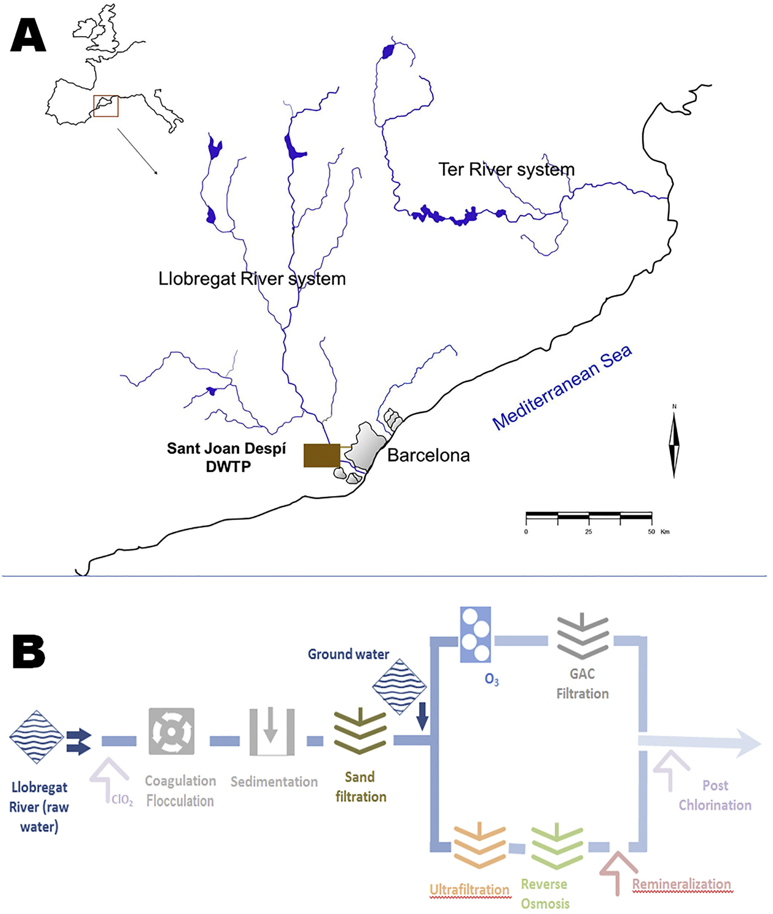
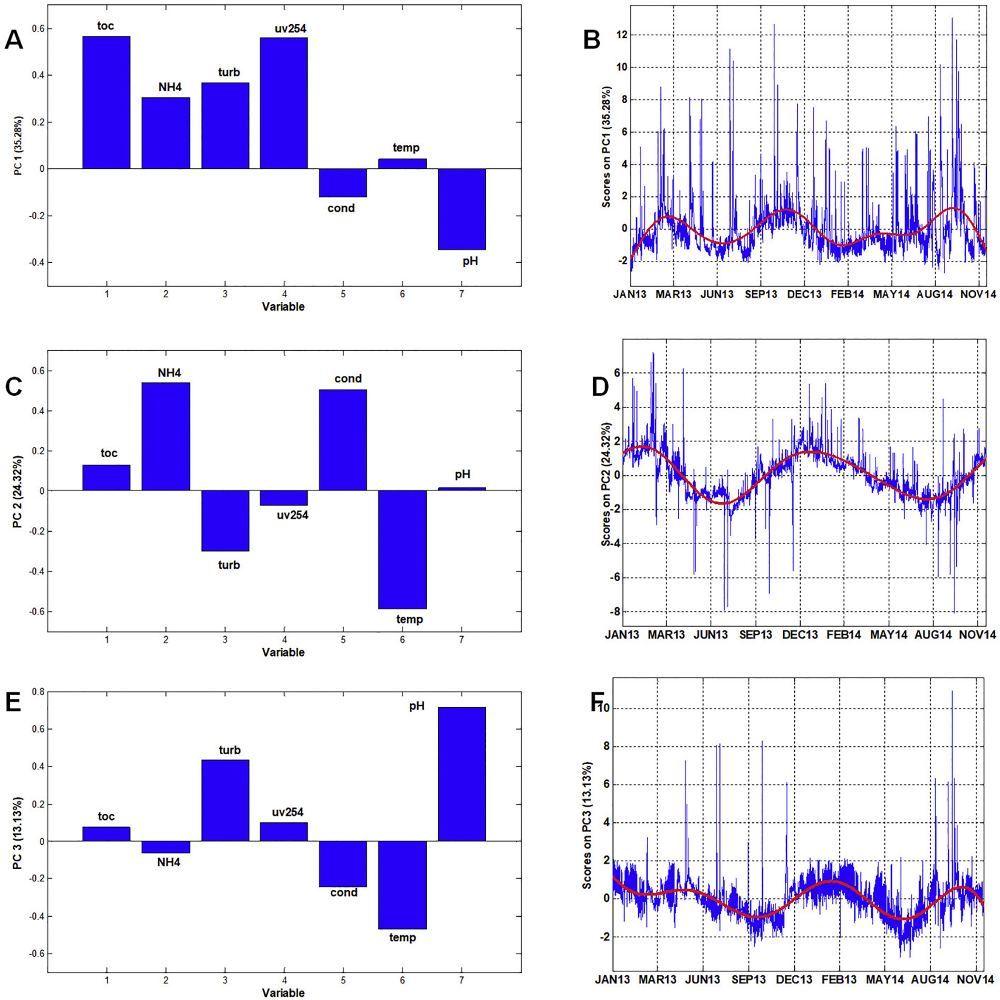
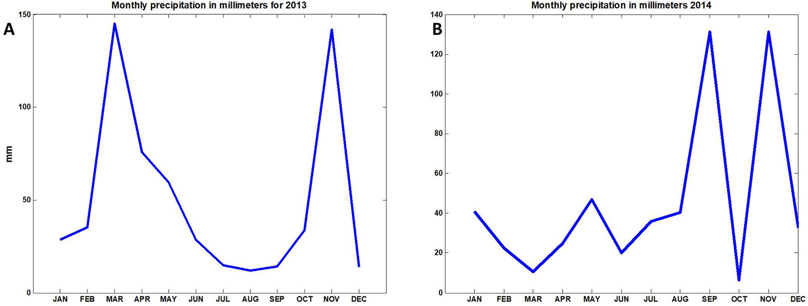
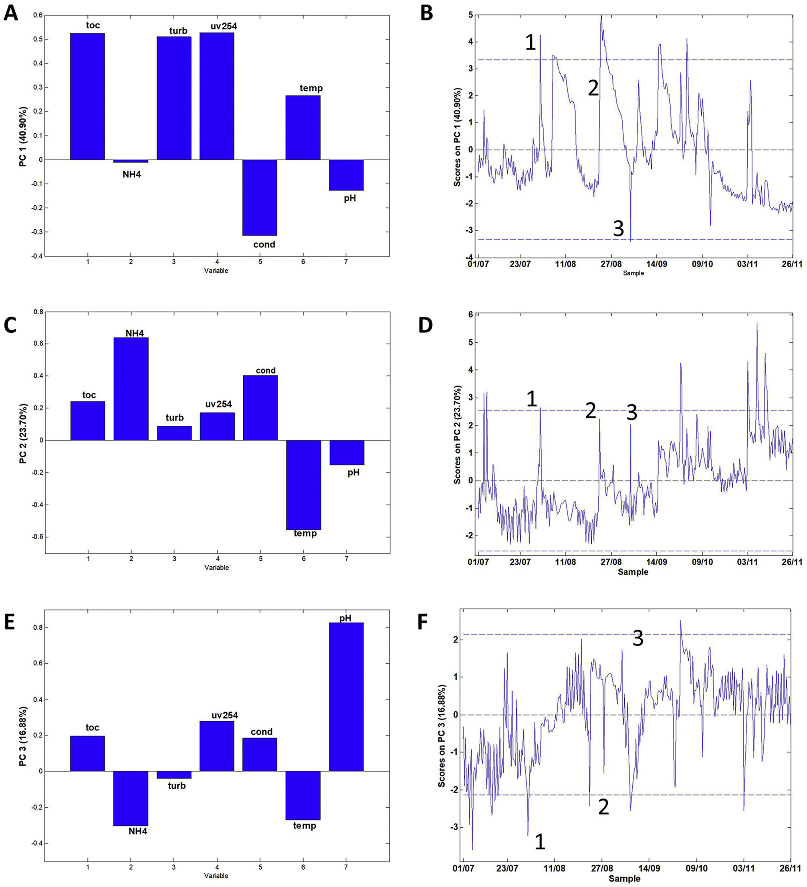
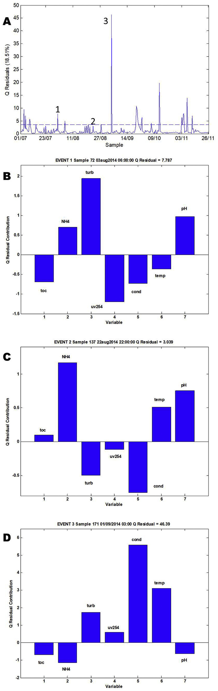
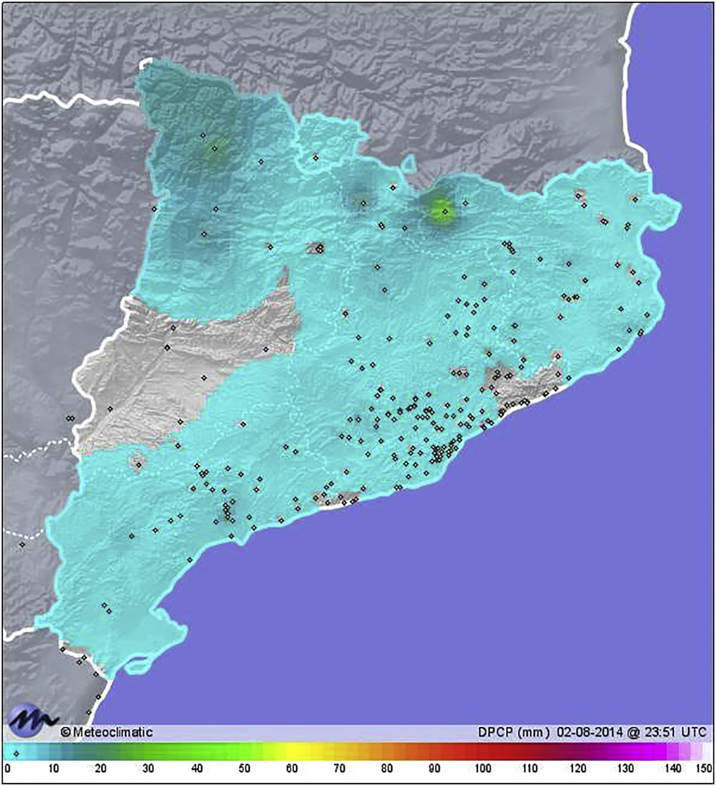
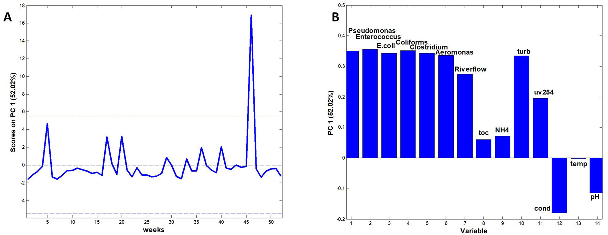

# Chemometric analysis for river water quality assessment at the intake of drinking water treatment plants

## Abstract

### Highlights
- Cách tiếp cận đa thông số mới (new multiparametric approach) được thiết lập để giám sát chất lượng nguồn nước sông tại cửa thu nước của nhà máy xử lý nước uống (DWTP - Drinking Water Treatment Plant).
- Mô hình hóa bằng Phân tích Thành phần Chính (PCA - Principal Component Analysis) phân tách được $3$ nhân tố chính chi phối chất lượng nước sông.
- Các nhân tố đại diện cho vật chất hữu cơ (organic matter) và vật chất vô cơ (inorganic matter) thể hiện rõ quy luật chuỗi thời gian (time-series patterns).
- Các sự kiện biến động chất lượng nước có nguồn gốc từ vật chất hữu cơ và vật chất vô cơ được phân tích và thảo luận.
- Các sự kiện vi sinh (microbiological events) và các biến động của vật chất hữu cơ xuất hiện đồng thời.

### Tóm tắt Nghiên cứu (Abstract Narrative)
- Thực trạng suy giảm tài nguyên nước tại các lưu vực sông Địa Trung Hải (Mediterranean rivers):
  - Phần lớn các con sông vùng Địa Trung Hải chịu tác động tích tụ từ nước thải công nghiệp (industrial discharges), đô thị (urban discharges) và hoạt động khai khoáng (mining discharges).
  - Tài nguyên nước suy giảm đồng thời cả về trữ lượng (water quantity) lẫn chất lượng (water quality).
  - Do đặc thù khí hậu Địa Trung Hải (Mediterranean climate), lượng nước tự nhiên sẵn có theo chu kỳ rơi vào mức thấp hơn nhu cầu dùng nước của khu vực.
- Yêu cầu kỹ thuật đối với hệ thống kiểm soát tại nhà máy nước (DWTPs):
  - Vận hành các nhà máy nước tại các khu vực này đòi hỏi các hệ thống kiểm soát quy trình nâng cao (advanced process control systems).
  - Các công cụ giám sát chất lượng nước theo thời gian thực (real-time) và trực tuyến trên dòng (in-line monitoring) đóng vai trò cấu phần trọng yếu.
- Ứng dụng công cụ hóa trắc học (Chemometrics) trên dữ liệu cảm biến và phòng thí nghiệm:
  - Tập dữ liệu đo lường từ cảm biến giám sát (monitoring sensors) kết hợp với phân tích phòng thí nghiệm (laboratory analysis) được sử dụng để xác định các yếu tố cốt lõi phản ánh chất lượng nước.
  - Công cụ hóa trắc học PCA được ứng dụng để thăm dò và phân tích tương quan giữa các thông số lý hóa (physico-chemical parameters) và vi sinh (microbiological parameters).
  - Mục tiêu nghiên cứu là đánh giá chất lượng nước sông ngay tại cửa thu nước thô (water intake) của nhà máy xử lý nước uống (DWTP).
- Các phát hiện chính từ mô hình phân tích:
  - Phân tích PCA làm rõ các xu hướng theo mùa rõ nét (strong seasonal trends) đối với hàm lượng chất hữu cơ và chất vô cơ tại cửa thu nước DWTP.
  - Nhận diện các sự kiện bất thường (unusual events) xuất hiện trong chất lượng nước sông thô tại cửa thu.
  - Các quy luật biến thiên của chất hữu cơ và chất vô cơ được liên kết trực tiếp với điều kiện khí hậu (climatological), khí tượng (meteorological) và bối cảnh ô nhiễm công nghiệp đặc thù của vùng nghiên cứu.
  - Phát hiện các sự kiện vi sinh tại cửa thu nước DWTP diễn ra đồng thời với sự gia tăng hàm lượng chất hữu cơ trong nước, đặc biệt vào thời điểm bắt đầu các đợt mưa (rainfall episodes).
- Giá trị ứng dụng trong công tác quản lý và chiến lược vận hành:
  - Việc triển khai mô hình PCA trên dữ liệu cảm biến tại cửa thu nước DWTP cung cấp khả năng nâng cấp các quy trình đảm bảo chất lượng và kiểm soát chất lượng (QA/QC - Quality Assurance / Quality Control).
  - Hỗ trợ công tác quản trị và hoạch định chiến lược vận hành cho nhà máy xử lý nước uống (DWTP).

### Thông tin Xuất bản và Từ khóa (Article Info & Keywords)
- Thông tin xuất bản (Publication details):
  - Tạp chí: *Science of the Total Environment*, Tập 667 (2019), trang 552–562.
  - Định danh số DOI: `https://doi.org/10.1016/j.scitotenv.2019.02.423`.
  - Mã nhận diện ISSN: 0048-9697.
  - Bản quyền: © 2019 Elsevier B.V. All rights reserved.
- Lịch sử bản thảo (Article history):
  - Tiếp nhận (Received): 20 tháng 12 năm 2018.
  - Nhận bản sửa đổi (Received in revised form): 14 tháng 02 năm 2019.
  - Chấp nhận đăng (Accepted): 27 tháng 02 năm 2019.
  - Phát hành trực tuyến (Available online): 28 tháng 02 năm 2019.
  - Biên tập viên (Editor): Paola Verlicchi.
- Thông tin tác giả:
  - Tác giả liên hệ (Corresponding author): Stefan Platikanov.
  - Địa chỉ thư điện tử: `stefan.platikanov@idaea.csic.es`.
  - Tuyên bố xung đột lợi ích: Không có (Declarations of interest: none).
- Từ khóa (Keywords):
  - River water (Nước sông)
  - Quality (Chất lượng nước)
  - Sensors (Cảm biến)
  - Chemometrics (Hóa trắc học)
  - DWTP (Nhà máy xử lý nước uống - Drinking Water Treatment Plant)

## 1. Introduction

- Quản lý tài nguyên nước (water resources management) là thành phần thiết yếu cho sự phát triển bền vững tại các khu vực đô thị có mạng lưới hạ tầng phức tạp.
  - Tầm quan trọng gia tăng tại các vùng bán khô hạn Địa Trung Hải (Mediterranean semiarid regions) với nguy cơ khan hiếm nước, nơi nguồn nước chịu ảnh hưởng bởi độ mặn cao (high salinity) và sự hiện diện của các vi chất ô nhiễm (micropollutants) (Köck-Schulmeyer et al., 2011; Kuzmanovic et al., 2015; Momblanch et al., 2015).
  - Hạ tầng cấp nước đô thị tiên tiến, đặc biệt là các nhà máy xử lý nước uống (drinking water plants), đòi hỏi chi phí đầu tư vốn (capital expenses - CAPEX) và chi phí vận hành (operational expenses - OPEX) gia tăng đáng kể (Aydin et al., 2015).
  - Việc xây dựng hạ tầng thông minh (smart infrastructure) đòi hỏi vốn đầu tư lớn, trong đó công nghệ xử lý hiệu suất cao và các công cụ quan trắc chất lượng nước trực tuyến trong dòng và theo thời gian thực (in-line and real-time water quality monitoring tools) giữ vai trò then chốt (Mustonen et al., 2008; Marlow et al., 2013; Behmel et al., 2016).
  - Quản lý nhà máy cấp nước hiệu quả đòi hỏi mục tiêu và định nghĩa rõ ràng, thang đo không gian - thời gian xác định, cùng các chỉ số có thể định lượng được (quantifiable indicators).

- Nhiều vùng đô thị trên thế giới phụ thuộc vào nguồn nước mặt suy giảm cả về trữ lượng lẫn chất lượng do các áp lực từ khí hậu, môi trường và hoạt động nhân sinh (McDonald et al., 2011; Rockström and Karlberg, 2010; Navarro-Ortega et al., 2015).
  - Các khu vực chịu áp lực gồm bang California và Arizona (Hoa Kỳ), Israel, Australia, dải duyên hải Địa Trung Hải tại Nam Âu và Bắc Phi, cùng các đô thị phía nam của Nam Phi.
  - Các giải pháp hạ tầng được triển khai nhằm cải thiện chất lượng nước uống và đảm bảo tính sẵn có lâu dài của nguồn nước, tập trung vào xu hướng tích hợp công nghệ với vai trò nền tảng của các công nghệ màng (membrane technologies) (Gibert et al., 2017; Raich-Montiu et al., 2014; Vera et al., 2017).
  - Các công nghệ xử lý màng chủ chốt tại các nhà máy xử lý nước uống (DWTPs - Drinking Water Treatment Plants) gồm lọc nano (nanofiltration), thẩm thấu ngược (reverse osmosis - RO), và thẩm tách điện đảo chiều (electrodialysis reversal - EDR) để giảm độ mặn và loại bỏ vi chất ô nhiễm; kết hợp công nghệ khử mặn nước biển (seawater desalination) khi tài nguyên nước mặt và nước ngầm bị thiếu hụt (Ferrer et al., 2016).

- Sông Llobregat là nguồn nước mặt trọng yếu của Vùng đô thị Barcelona (Barcelona Metropolitan Area - BMA, Catalonia, Tây Ban Nha) với $4.7$ triệu cư dân, cung cấp khoảng $40\%$ tổng nhu cầu nước uống (Devesa et al., 2007).
  - Nhà máy xử lý nước Sant Joan Despí (SJD DWTP) đại diện cho kịch bản xử lý nước mặt chịu áp lực cao, có hơn $50$ năm kinh nghiệm ($> 50$ năm) cung cấp nước uống cho vùng đô thị Barcelona.

- Nhà máy SJD DWTP nằm cách Barcelona $15\text{ km}$ về phía tây, tích hợp quy trình xử lý truyền thống với công nghệ màng gồm siêu lọc (ultrafiltration - UF) và thẩm thấu ngược (reverse osmosis - RO), đạt công suất sản xuất nước $5.5\text{ m}^3/\text{s}$ (López-Roldán et al., 2016).
  - **Hình 1.** Vị trí địa lý và sơ đồ công nghệ xử lý của nhà máy nước Sant Joan Despí (SJD DWTP)
    - 
    - **Hình này chứng minh điều gì**
      - Thể hiện vị trí nhà máy nước SJD DWTP trên lưu vực sông Llobregat và sơ đồ tích hợp công nghệ xử lý truyền thống với màng UF/RO.
    - **Từ đâu mà thấy được**
      - Sơ đồ dòng chảy công nghệ từ cửa thu nước sông Llobregat qua các bể lắng, lọc cát, EDR, màng RO/UF đến trạm bơm phân phối.

- Chất lượng nước sông Llobregat tại lưu vực thu nước bị suy giảm bởi các yếu tố địa chất, hoạt động công nghiệp, nông nghiệp và đô thị hóa.
  - Dòng chính của lưu vực sông tiếp nhận nước từ $3$ đập trữ nước ở thượng lưu và nhiều phụ lưu nhỏ (Marcé et al., 2012).
  - Thành phần khoáng chất ở vùng thượng lưu và trung lưu chịu ảnh hưởng mạnh từ các tầng đá trầm tích gồm đá vôi (limestone), đá marl, thạch cao (gypsum) và halite, tạo nên độ khoáng hóa rất cao với cặn khô (dry residue) xấp xỉ $900\text{ mg/L}$ (Fernandez-Turiel et al., 2003).
  - Ô nhiễm nguồn nước gia tăng do sự phát triển công nghiệp và nông nghiệp dọc lưu vực, các rào cản tài chính - công nghệ, và tình trạng không thực thi hoặc lách luật bảo vệ môi trường (Ginebreda et al., 2012).
  - Nguồn nước sông thường xuyên bị tác động bởi sự cố xả nước thải sinh hoạt (accidental sewage discharges), sự cố tràn hóa chất công nghiệp (industrial spills), cùng dòng chảy tràn ô nhiễm từ đất nông nghiệp và đô thị (agricultural and urban run-off) (Aguillera et al., 2012).
  - Ngành khai thác mỏ kali (potash mining industry) ở trung lưu lưu vực sông gây ô nhiễm mặn nghiêm trọng cho dòng nước trong các đợt mưa lớn (Ladrera et al., 2017).

- Biến đổi khí hậu trong khu vực gây trở ngại nghiêm trọng cho công tác quản trị và vận hành tại DWTP (Versini et al., 2016).
  - Lượng mưa và tuyết rơi thấp trong phần lớn các thời điểm của năm dẫn đến những đợt hạn hán kéo dài và gay gắt.
  - Các đợt mưa lớn hiếm hoi vào mùa xuân và mùa hè gây ngập lụt, cuốn theo chất ô nhiễm làm suy giảm chất lượng nước cấp vào nhà máy.

- Mục tiêu cốt lõi của nghiên cứu là chứng minh tiềm năng của các phương pháp hóa trắc học (chemometrics methods), cụ thể là phân tích thành phần chính (Principal Component Analysis - PCA), trong việc phân tích đồng thời nhiều thông số chất lượng nước để thiết lập chiến lược kiểm soát và giám sát mở rộng, giảm thời gian cùng chi phí vận hành quan trắc.
  - Việc thu thập dữ liệu từ các cảm biến kết nối thời gian thực kết hợp tài nguyên Internet và các công cụ phân tích dữ liệu đa biến (multivariate data analysis tools) hỗ trợ phát hiện và phân loại kịp thời các sự kiện cũng như mô hình ô nhiễm bất thường tại đầu vào DWTP.

## 2. Material and methods

### 2.1. Current water quality monitoring practices at the intake

- **Thực tiễn quan trắc chất lượng nước thô dựa trên thông số hóa lý đơn lẻ**: Hoạt động quan trắc chất lượng nước thô tại cửa lấy nước của nhà máy xử lý nước uống Sant Joan Despí (SJD DWTP - Sant Joan Despí Drinking Water Treatment Plant) dựa trên việc kiểm tra độc lập từng thông số hóa lý riêng lẻ.
  - Các thông số quan trắc chủ đạo bao gồm:
    - Độ hấp thụ tử ngoại tại bước sóng $254\text{ nm}$ ($\text{UV254}$ - UV absorption at $254\text{ nm}$).
    - Độ đục ($\text{TURB}$ - turbidity).
    - Tổng cacbon hữu cơ ($\text{TOC}$ - total organic carbon).
    - Độ kiềm/axit ($\text{pH}$).
    - Độ dẫn điện ($\text{COND}$ - conductivity).
    - Cùng các thông số chất lượng nước liên quan khác.
  - Nhân viên vận hành DWTP đưa ra các quyết định điều hành dựa trên giá trị của từng thông số riêng lẻ so với các ngưỡng được thiết lập từ trước (pre-established thresholds).
  - Quy trình quản lý DWTP đạt chứng nhận theo tiêu chuẩn ISO 22000 (ISO 22000 norm), nhằm đảm bảo việc tuân thủ liên tục các tiêu chuẩn chất lượng của nước sau xử lý (final treated water).

- **Phương thức thu thập dữ liệu và bản chất đơn biến của quy trình ra quyết định**: Dữ liệu phục vụ giám sát chất lượng nước tại SJD DWTP được thu thập từ ba nguồn chính:
  - Lấy mẫu đơn lẻ trực tiếp tại nguồn (grab sampling).
  - Phân tích mẫu định kỳ trong phòng thí nghiệm (laboratory analysis).
  - Dữ liệu đo đạc liên tục từ các cảm biến trực tuyến hoặc gắn trực tiếp trên đường ống (on-line/in-line sensors).
  - Quy trình ra quyết định phần lớn mang bản chất đơn biến (largely univariate in nature):
    - Phân tích thống kê được thực hiện bằng cách theo dõi tuần tự từng thông số hóa lý riêng biệt tại điểm thu nước.
    - Phần lớn các ngưỡng giá trị đơn lẻ được xây dựng dựa trên các chỉ thị pháp lý cụ thể (legislative directives) nhằm đáp ứng yêu cầu tuân thủ luật định.

- **Hạn chế cố hữu của chính sách giám sát dựa trên ngưỡng đơn lẻ**: Hoạt động quan trắc gặp phải những giới hạn nghiêm ngặt do phương pháp ngưỡng đơn lẻ không phản ánh được tính phức tạp của hệ thống nước tự nhiên.
  - Các ngưỡng đơn lẻ không phản ánh được điều kiện khí hậu cục bộ (local climate conditions) cũng như các hiện tượng đặc thù theo từng vị trí (site-specific events).
  - Chính sách sử dụng ngưỡng đơn lẻ bỏ qua nguyên lý cốt lõi: chất lượng nước trong hệ thống sông ngòi được quyết định bởi sự tương tác đồng thời giữa nhiều thông số.
  - Các thông tin ẩn hoặc tiềm ẩn (hidden/latent information) về các mối tương quan và mối quan hệ qua lại giữa nhiều thông số hoàn toàn không được tích hợp vào quy trình giám sát.
  - Biểu hiện đa biến của các hiện tượng thực tế:
    - Sự kiện lũ lụt (flooding event): được đặc trưng bởi tổ hợp biến động đồng thời gồm độ đục ($\text{TURB}$), tải lượng hữu cơ (organic load) và độ hấp thụ $\text{UV254}$ tăng cao rõ rệt trong các đợt mưa (theo Volk và cộng sự, 2002).
    - Sự kiện ô nhiễm hóa chất (chemical pollution event): được chỉ thị bởi tổ hợp giá trị gia tăng của độ dẫn điện ($\text{COND}$), nồng độ amoni ($\text{NH}_4^+$), các bất thường quang phổ (spectral abnormalities), cùng các dao động $\text{pH}$ bất thường.

- **Kiểm soát vi sinh thường trực và độ trễ phân tích trong phát hiện sự cố vi khuẩn**: Quy trình quan trắc chất lượng nước bao gồm kiểm soát vi sinh đối với nguồn nước thô, được duy trì thường trực tại điểm thu nước của DWTP.
  - Các tiêu chuẩn lập pháp về kiểm soát vi sinh đối với một số loài vi khuẩn yêu cầu phải giám sát thường trực (theo Chỉ thị Nước uống - Drinking Water Directive, DWD, 1998).
  - Tần suất và thời gian phân tích vi sinh tại SJD DWTP:
    - Phân tích vi sinh tại từng bước của quy trình xử lý được tiến hành với tần suất tối thiểu $1\text{ lần/tuần}$ (once per week at minimum).
    - Thời gian nuôi cấy tăng sinh vi khuẩn (proliferation time) thông thường kéo dài $1\text{--}2\text{ ngày}$.
    - Khuẩn lạc vi khuẩn (bacterial colonies) chỉ được định danh và định lượng sau khi hoàn tất thời gian nuôi cấy.
  - Sự hiện diện của vi khuẩn tại cửa lấy nước của DWTP mang tính thường trực/kinh niên (chronic).
  - Quy trình phân tích nuôi cấy truyền thống bộc lộ khiếm khuyết lớn: không thể nắm bắt kịp thời các xung gia tăng đột biến của mật độ vi khuẩn mang tính chất sự cố bất ngờ (sudden spikes with an accidental character).
  - Việc xác định các thông số hóa lý có tương quan thuận (positive correlations) với các đợt bùng phát vi sinh là cơ sở khoa học quan trọng để thiết kế các chiến lược giám sát và bảo vệ cửa lấy nước trong tương lai.

- **Lịch sử các đợt ô nhiễm công nghiệp tại SJD và vai trò của phương pháp thống kê đa biến**: Nhiều đợt ô nhiễm nguồn nước đã được ghi nhận tại SJD trong những năm qua, chủ yếu bắt nguồn từ các nguồn xả thải công nghiệp (industrial discharges).
  - Các tác nhân ô nhiễm công nghiệp tiêu biểu đã được ghi nhận bao gồm:
    - Dicyclopentadiene và các hợp chất dẫn xuất (theo Ventura và cộng sự, 1997).
    - Dioxane và dioxolane (theo Romero và cộng sự, 1998).
    - Creosote (theo Ventura và cộng sự, 1998).
    - Diacetyl và butanedione (theo Martin-Alonso và cộng sự, 2007).
  - Boleda và cộng sự (2007) tổng kết các sự kiện về mùi và vị (taste and odor events) được phát hiện trong giai đoạn từ năm $1990$ đến $2004$.
  - Các công trình nghiên cứu trước đây kết luận rằng ô nhiễm công nghiệp đã tạo ra số lượng đợt ô nhiễm nhiều hơn so với các tác nhân khác.
  - Quá trình quan trắc chất lượng thường trực tại trạm thu nước SJD DWTP qua nhiều năm đã tích lũy khối lượng dữ liệu lớn về chất lượng nước thô sông Llobregat (Llobregat River).
  - Việc phân tích các tập dữ liệu quan trắc lịch sử này bằng các phương pháp thống kê đa biến (multivariate statistical methods) giúp trích xuất các thông tin ẩn quan trọng, cải thiện chiến lược quản lý vận hành nhà máy và xây dựng các phương án bảo vệ SJD DWTP trước các sự cố ô nhiễm nước sông.

### 2.2. Data organization

- Dữ liệu lịch sử của $8$ thông số chất lượng hóa lý (physicochemical quality parameters), được quan trắc bằng các cảm biến trực tuyến (on-line sensors) tại cửa thu nước (water intake) từ sông Llobregat trong hai năm 2013–2014 ($2013\text{--}2014$) và lưu trữ trong Hệ thống Quản lý Thông tin Phòng thí nghiệm (LIMS - Laboratory Information Management System) của nhà máy xử lý nước uống Sant Joan Despí (SJD DWTP - Drinking Water Treatment Plant), đã được thu thập:
  - Bảy thông số chất lượng hóa lý trực tuyến cùng lưu lượng dòng chảy sông bao gồm:
    - Độ đục tính bằng đơn vị Formazin Nephelometric Unit ($\text{UNF}$) ($\text{TURB}$).
    - Ion amoni tính bằng $\text{mg/L}$ ($\text{NH}_4$).
    - Tổng cacbon hữu cơ (total organic carbon) tính bằng $\text{mg/L}$ ($\text{TOC}$).
    - Độ hấp thụ bức xạ tử ngoại tại bước sóng $254\text{ nm}$ tính bằng $\text{abs}/100\text{ cm}$ ($\text{UV254}$).
    - Độ dẫn điện tính bằng $\mu\text{S/cm}$ ($\text{COND}$).
    - Chỉ số $\text{pH}$.
    - Lưu lượng dòng chảy sông (river flow) tính bằng $\text{m}^3/\text{s}$.
  - Các thông số vi sinh (microbiological parameters) thu được từ các phân tích xét nghiệm phòng thí nghiệm (laboratory assays) cũng được đưa vào xem xét song song.
- Quy trình chuẩn bị các tập dữ liệu phân tích được định hình dựa trên hai khía cạnh trọng yếu:
  - Khía cạnh thứ nhất: Tính sẵn có của các thông số đo đạc tại nhà máy và các chương trình quan trắc định kỳ theo kế hoạch:
    - Phù hợp với các Quy định về Nước uống mới (Drinking Water Regulations), quy chế vận hành của DWTP, và tiêu chuẩn $\text{ISO 22000}$ ($\text{ISO22000}$) quy định sự cần thiết phải gia tăng số lượng các quy trình giám sát.
  - Khía cạnh thứ hai: Khả năng căn chỉnh trực tiếp (direct alignment) toàn bộ các thông số theo đúng thời gian ghi nhận (recording time):
    - Tránh thất thoát thông tin trong quá trình căn chỉnh thời gian và ngăn ngừa việc phát sinh các giá trị khuyết thiếu (missing values).
- Dữ liệu thu thập được sắp xếp thành ba tập dữ liệu (datasets) riêng biệt:
  - Tập dữ liệu 1 (Dataset 1): Các quan sát hóa lý được nội suy theo thời gian (Time interpolated physicochemical observations).
  - Tập dữ liệu 2 (Dataset 2): Các quan sát hóa lý thực nghiệm (Experimental physicochemical observations).
  - Tập dữ liệu 3 (Dataset 3): Các tập dữ liệu mở rộng bổ sung các thông số vi sinh (Augmented datasets including microbiological parameters).
- Quá trình xử lý sai lệch thời gian ghi nhận giữa các giai đoạn vận hành cảm biến:
  - Trong năm 2013, dù các thông số hóa lý được đo đạc hàng ngày, các mốc thời gian ghi nhận giữa các cảm biến không trùng khớp nhau:
    - Bảng dữ liệu ban đầu tồn tại một số lượng đáng kể các giá trị khuyết thiếu mang tính hệ thống (systematic missing values).
    - Một thuật toán nội suy (interpolation algorithm) được áp dụng để ước tính các giá trị khuyết thiếu, nhằm thu được bảng dữ liệu không còn giá trị trống.
    - Việc áp dụng thuật toán nội suy dẫn đến sự hình thành của Tập dữ liệu 1 (Dataset 1), đi kèm nhược điểm có thể làm mất mát một phần thông tin về các tương tác thực tế giữa các thông số do bước điền dữ liệu nhân tạo (artificial data filling step).
  - Đến giữa năm 2014 ($\text{mid 2014}$), toàn bộ các cảm biến hóa lý cần thiết tại cửa thu nước đã được đồng bộ hóa và căn chỉnh chuẩn xác theo thời gian ghi nhận:
    - Các tương tác thực tế giữa các thông số hóa lý có thể được phân tích trực tiếp trên Tập dữ liệu 2 (Dataset 2) mà không chịu sai số từ bước nội suy nhân tạo.
  - Tập dữ liệu 3 (Dataset 3) được thu thập bám sát lịch trình lấy mẫu vi sinh định kỳ tại DWTP:
    - Lấy mẫu vi sinh được thực hiện vào mỗi thứ Hai lúc $08:00\text{ AM}$ ($08:00$ sáng).
    - Cấu trúc dữ liệu này cho phép tìm ra mối tương quan giữa các kết quả vi sinh và các thông số hóa lý tương ứng tại cùng thời điểm.
- Đặc điểm cấu trúc và phạm vi ứng dụng của Tập dữ liệu 1 (Dataset 1):
  - Thuật toán nội suy tuyến tính (linear interpolation) bước đầu được áp dụng để căn chỉnh các thông số chất lượng nước theo từng giờ (hourly basis).
  - Bảng dữ liệu hoàn chỉnh bao gồm $16{,}333$ phép đo hàng giờ ($16,333$ hourly measurements) cho $7$ thông số hóa lý.
  - Tập dữ liệu này cho phép đánh giá các quy luật biến thiên theo thời gian (temporal variations) của chất lượng nước trong toàn bộ giai đoạn nghiên cứu hai năm 2013–2014 ($2013\text{--}2014$).
- Đặc điểm cấu trúc và phạm vi ứng dụng của Tập dữ liệu 2 (Dataset 2):
  - Chỉ xem xét và giữ lại các thông số hóa lý có quan sát thực nghiệm thực tế (real experimental observations) mà không can thiệp nội suy.
  - Tập dữ liệu chứa các quan sát của $7$ thông số hóa lý được ghi nhận tại chính xác cùng một thời điểm trong khoảng thời gian từ tháng 7 đến tháng 11 năm 2014 (July to November 2014).
  - Tổng số mẫu đạt $346$ quan sát thực nghiệm ($346$ experimental observations, gồm nhiều phép đo trong cùng một ngày) đồng bộ chuẩn xác về mốc thời gian cho cả $7$ thông số.
  - Tập dữ liệu này được sử dụng để đánh giá và kiểm chứng (evaluation and validation) những biến đổi trong xu hướng chất lượng nước, các sự kiện bất thường (events), và các mối quan hệ giữa các thông số ban đầu được phát hiện từ phân tích trên Tập dữ liệu 1.
- Đặc điểm cấu trúc và phạm vi ứng dụng của Tập dữ liệu 3 (Dataset 3):
  - Dữ liệu vi sinh được thu thập theo định kỳ hàng tuần (weekly basis) trong suốt năm 2014, đạt tổng cộng $52$ mẫu ($52\text{ samples}$, tương ứng $1$ mẫu mỗi tuần).
  - Thông tin vi sinh gồm số lượng đếm vi khuẩn (bacterial counts) của $6$ chỉ số vi sinh:
    - *Pseudomonas* sp.
    - *Enterococcus* sp. (nguồn ghi *Enterococus* sp.).
    - *Escherichia coli* sp. (nguồn ghi *Escheria coli* sp.).
    - Tổng vi khuẩn Coliform (*Total coliforms*).
    - *Clostridium* sp.
    - *Aeromonas* sp.
  - Dữ liệu vi sinh được sắp xếp lại để khớp nối chuẩn xác với các bản ghi dữ liệu hóa lý tương ứng tại cùng thời điểm lấy mẫu.
  - Phân tích mở rộng này tích hợp đồng thời cả thông tin về các thông số hóa lý và lưu lượng sông (river flow).
  - Ma trận dữ liệu tăng cường (augmented data matrix) tổng hợp bao gồm tổng cộng $52$ mẫu ($1$ mẫu mỗi tuần) và $14$ thông số ($6$ chỉ số vi sinh và $8$ thông số hóa lý/thủy văn).

### 2.3. Multivariate statistical analysis of water quality parameters at the intake of the SJD DWTP using principal component analysis

- Cấu trúc bảng dữ liệu hai chiều (two-dimensional data tables) tích hợp số liệu từ cảm biến trực tuyến (on-line sensors) và phân tích phòng thí nghiệm (laboratory assays) phục vụ phân tích đa biến:
  - Số lượng lớn các mẫu đo được tạo ra đồng thời từ hệ thống cảm biến và xét nghiệm hóa nghiệm, hỗ trợ đánh giá các quy luật chất lượng nước sông tự nhiên và nhận diện các sự kiện bất thường nhằm cải tiến quy trình xử lý tại các nhà máy nước uống (DWTP - Drinking Water Treatment Plant).
  - Dữ liệu được lưu trữ dưới dạng ma trận hai chiều $\mathbf{D}$ kích thước $I \times J$:
    - Các hàng đại diện cho các quan trắc hoặc phép đo (observations/measurements), sắp xếp theo thời gian hoặc theo số hiệu mẫu.
    - Các cột đại diện cho các thông số hoặc biến số được đo lường (measured parameters/variables).
  - Cấu trúc ma trận hai chiều tương thích với các thuật toán thống kê đa biến (multivariate statistical methods) và hóa trắc lượng (chemometrics).

- Phân tích thành phần chính (PCA - Principal Component Analysis) mô hình hóa cấu trúc phương sai và các yếu tố ẩn chi phối chất lượng nguồn nước:
  - Phương pháp PCA (theo Jolliffe, 2002) là công cụ thống kê đa biến phổ biến trong phân tích dữ liệu môi trường.
  - Giả định cốt lõi của PCA: trong tập dữ liệu gốc tồn tại một số lượng nhỏ các nhân tố chi phối có ảnh hưởng lớn (dominant factors / components) đóng vai trò là nguồn biến thiên chính của hệ thống.
  - Các nhân tố này được gọi là yếu tố ẩn (hidden factors) vì không thể đo lường trực tiếp bằng một cảm biến đơn lẻ hoặc quan sát thực nghiệm riêng biệt.
  - Năng lực phân tích của PCA đối với dữ liệu quan trắc chất lượng nước:
    - Điều tra các quy luật và xu hướng biến thiên theo thời gian và theo mùa (temporal/seasonal patterns/trends).
    - Phân tích tác động khí tượng (meteorological patterns) và các xu hướng ô nhiễm (pollution trends).
    - Mô hình hóa mối quan hệ và tương tác phức tạp giữa nhiều thông số môi trường và các quan trắc mẫu.
    - Làm sáng tỏ các tiến trình bản chất ẩn sâu bên dưới hệ thống giám sát chất lượng nước tại trạm thu nước thô của nhà máy DWTP.

- Mô hình phân tích song tuyến tính (bilinear model) phân rã ma trận dữ liệu thành ma trận điểm số (scores), tải trọng (loadings) và phần dư (residuals):
  - Ma trận dữ liệu thực nghiệm ban đầu $\mathbf{D}$ được phân rã theo Phương trình (1):
    $$\mathbf{D} = \mathbf{T}\mathbf{P}^T + \mathbf{E}$$
    trong đó:
    - $\mathbf{D}$ là ma trận dữ liệu thực nghiệm ban đầu kích thước $I \times J$ ($I$ mẫu đo, $J$ biến số).
    - $\mathbf{T}$ là ma trận điểm số (scores matrix, kích thước $I \times K$), thực hiện ánh xạ các mẫu quan sát lên các thành phần chính.
    - $\mathbf{P}^T$ là chuyển vị của ma trận tải trọng (loadings matrix, kích thước $K \times J$), thực hiện ánh xạ các biến đo lường lên các trục thành phần chính.
    - $\mathbf{E}$ là ma trận phần dư (residuals matrix, kích thước $I \times J$), biểu diễn phần phương sai không được giải thích bởi mô hình (unexplained variance).
  - Hai ma trận $\mathbf{T}$ và $\mathbf{P}$ là các ma trận trực giao (orthogonal matrices), liên hệ trực tiếp với phép phân tích giá trị kỳ dị (SVD - Singular Value Decomposition) trên ma trận dữ liệu đã chuẩn hóa.

- Tiêu chí lựa chọn số lượng thành phần chính ($K$) và ý nghĩa vật lý của điểm số và tải trọng:
  - Số lượng thành phần chính được giữ lại trong mô hình PCA (tương ứng với các cột của $\mathbf{T}$ và các hàng của $\mathbf{P}^T$) được xác định dựa trên hai tiêu chuẩn:
    - a) Kích thước của các giá trị riêng (eigenvalues) gắn liền với từng thành phần chính.
    - b) Khả năng giải thích có ý nghĩa thực tế về mặt môi trường (meaningful environmental explanation) của các hồ sơ điểm số và tải trọng.
  - Chức năng biểu diễn của ma trận tải trọng $\mathbf{P}^T$ và ma trận điểm số $\mathbf{T}$:
    - Tải trọng $\mathbf{P}^T$ thể hiện các hồ sơ hóa lý (physicochemical profiles) của các thành phần chính, phản ánh trọng số đóng góp của từng thông số chất lượng nước vào mỗi trục thành phần.
    - Điểm số $\mathbf{T}$ biểu diễn hình chiếu của các mẫu quan sát lên các thành phần chính, cung cấp thông tin về phân bố thời gian (temporal distribution / time distribution) của các phép đo.
    - Phân bố thời gian của các điểm số bộc lộ các xu hướng tiềm ẩn, làm cơ sở để tiến hành phân tích chuỗi thời gian (time series analysis).

- Đồ thị phần dư Q (Q residuals chart) phát hiện các sự kiện ô nhiễm và xáo trộn bất thường tại trạm thu nước thô:
  - Nghiên cứu áp dụng biểu đồ phần dư Q để phát hiện các sự kiện bất thường (unusual events) tại trạm thu nước thô của nhà máy nước Sant Joan Despí (SJD DWTP).
  - Phần dư Q đo lường sự khác biệt giữa các giá trị đo thực tế và hình chiếu của chúng lên $K$ thành phần chính được giữ lại trong mô hình PCA theo dòng thời gian:
    $$Q_i = \mathbf{e}_i \mathbf{e}_i^T = \sum_{j=1}^{J} e_{ij}^2$$
    trong đó $\mathbf{e}_i$ là vectơ hàng thứ $i$ của ma trận phần dư $\mathbf{E}$ cho mẫu thứ $i$.
  - Giá trị phần dư Q phản ánh mức độ phù hợp của một phép đo cụ thể đối với mô hình PCA:
    - Các mẫu có giá trị phần dư lớn biểu thị rằng thông tin của mẫu không được giải thích tốt bởi mô hình chuẩn, được định danh là các sự kiện bất thường (unusual events / outlying events).
    - Khi chất lượng nước tại trạm thu ở trạng thái ổn định và được kiểm soát, giá trị phần dư Q duy trì ở mức thấp.

- Biểu đồ đóng góp Q (Q contribution plot) định danh các thông số chất lượng nước đóng góp chính vào sự kiện bất thường:
  - Khi một phép đo được đánh dấu là sự kiện bất thường (flagged as an event), biểu đồ đóng góp Q (theo Wise và Gallagher, 1996) được sử dụng để phân tích nguyên nhân.
  - Biểu đồ đóng góp Q biểu diễn một hàng $\mathbf{e}_i$ của ma trận phần dư $\mathbf{E}$ ứng với mẫu sự kiện được xem xét:
    - Đồ thị thể hiện mức độ đóng góp của từng biến số hoặc thông số vào giá trị Q tổng thể của mẫu đó.
    - Đóng góp của từng biến số giữ nguyên dấu đại số (retaining the sign of the contribution), cho biết thông số tăng cao hay suy giảm so với tương quan thông thường.
  - Phân tích trực quan đóng góp Q giúp xác định chính xác thông số nào đóng góp nhiều nhất vào tổng bình phương sai số phần dư (sum-squared residual error) của mẫu sự kiện (theo Wise và cộng sự, 1989).

- Giới hạn tin cậy thống kê (confidence limits) thiết lập ngưỡng ranh giới phát hiện sai lệch:
  - Các giới hạn tin cậy được tính toán để cung cấp giá trị ngưỡng phân định giữa điều kiện vận hành bình thường và điều kiện bất thường ngoại lai (regular/outlying conditions).
  - Trạng thái kiểm soát bình thường (in-control): khi chất lượng nước tại trạm thu nằm trong tầm kiểm soát, các giá trị phần dư Q dao động ở mức nhỏ bên trong các giới hạn tin cậy ($Q \le Q_{\text{threshold}}$).
  - Trạng thái bất thường ngoại lai (outlying events): các sự kiện bất thường hiển thị với giá trị phần dư Q vượt ra ngoài giới hạn tin cậy ($Q > Q_{\text{threshold}}$), đóng vai trò như công cụ cảnh báo sớm cho công tác vận hành nhà máy xử lý nước.

### 2.4. Curve fitting of time series

- Phân tích thành phần chính (PCA - Principal Component Analysis) trên Dataset 1 thể hiện quy luật biến thiên có dạng chu kỳ (periodic form) đối với các giá trị điểm số (scores).
  - Các giá trị điểm số đại diện cho chất lượng nước tại các mốc thời gian khác nhau $t_i$ theo từng giờ (on hourly basis).
  - Dữ liệu chuỗi thời gian của các điểm số được giả định cấu thành từ hai thành phần:
    - Tín hiệu thời gian hữu ích $y$ (useful temporal signal): phản ánh xu hướng biến đổi chung (general trend) của chất lượng nước trong toàn bộ chu kỳ quan trắc đối với từng thành phần chính (principal components).
    - Thành phần nhiễu (noise): tương ứng với các sự kiện chất lượng nước không phụ thuộc vào chu kỳ thời gian (non-time dependent periodic events) hoặc các giá trị ngoại lai cực trị (extreme values) (Deng và Wang, 2017).
  - Tín hiệu hữu ích $y$ được biểu diễn toán học dưới dạng một hàm chu kỳ liên tục (continuous periodic function) xác định trên một khoảng thời gian cụ thể (certain time interval).
  - Các biến động giá trị chất lượng nước không được hàm chu kỳ liên tục này giải thích đều được xem là nhiễu (noise).
- Bản chất chu kỳ của các giá trị điểm số (được xem như tín hiệu chu kỳ $g(x)$) được mô hình hóa thông qua phương pháp xấp xỉ chuỗi Fourier (Fourier series approximation) (Mueller-Warrant et al., 2012).
  - Mô hình xấp xỉ chuỗi Fourier được thiết lập theo Phương trình (2):
    $$g(x) = a_0 + \sum_{i=1}^{n} \left( a_i \cdot \cos(i \cdot w \cdot x) + b_i \cdot \sin(i \cdot w \cdot x) \right) \tag{2}$$
  - Trong đó:
    - $a_0$: số hạng hằng số (hệ số chặn - intercept term) trong tập dữ liệu, tương ứng với số hạng cosin khi $i = 0$.
    - $w$: tần số cơ bản (fundamental frequency) của tín hiệu.
    - $n$: số lượng số hạng điều hòa (harmonics) trong chuỗi Fourier.
    - $x$: biến số thời gian biểu diễn chuỗi dữ liệu điểm số.
    - $a_i, b_i$: các hệ số Fourier của các số hạng điều hòa cosin và sin tương ứng tại bậc $i$.
    - Số lượng số hạng điều hòa bị giới hạn trong phạm vi $1 \le n \le 8$.
- Tiêu chí xác định mô hình khớp đường cong chuỗi thời gian tối ưu (best data fitting) kết hợp đánh giá trực quan và chỉ số thống kê.
  - Quá trình khớp dữ liệu tốt nhất đạt được thông qua quan sát trực quan (visual inspection).
  - Hệ số xác định ($R^2$ - determination coefficient) cao nhất được dùng làm thước đo đánh giá hiệu quả dự báo của phương trình đối với các giá trị điểm số.

## 3. Results and discussion

### 3.1. Seasonal variability of the Llobregat river water quality at the intake (PCA of dataset 1)

- Phân tích thành phần chính (PCA) áp dụng trên Dataset 1 đã chuẩn hóa (autoscaled Dataset 1, gồm $16{,}333$ phép đo hàng giờ của $7$ thông số chất lượng sau khi nội suy tuyến tính căn chỉnh thời gian) xác định $3$ thành phần chính (principal components - PCs) giải thích $72\%$ tổng phương sai dữ liệu thực nghiệm:
  - Thành phần chính thứ nhất (PC1) giải thích $35\%$ phương sai dữ liệu.
  - Thành phần chính thứ hai (PC2) giải thích $24\%$ phương sai dữ liệu.
  - Thành phần chính thứ ba (PC3) giải thích $13\%$ phương sai dữ liệu.
  - **Hình 2.** Đồ thị phân tích thành phần chính (PCA) của tập dữ liệu 1 đối với 7 thông số hóa lý
    - 
    - **Hình này chứng minh điều gì**
      - Làm rõ cấu trúc phân tán phương sai và tương quan giữa 7 thông số hóa lý đại diện cho chất lượng nước thô giai đoạn 2013-2014.
    - **Từ đâu mà thấy được**
      - Biểu đồ hệ số tải và điểm số trên hai thành phần chính PC1 và PC2, tách biệt rõ nhóm thông số hữu cơ (TOC, UV254) với nhóm khoáng hóa (COND).
- PC1 ($35\%$ phương sai) mô tả biến thiên của chất hữu cơ (organic matter) như yếu tố chủ đạo trong Dataset 1:
  - Hệ số tải (loadings) trên PC1 bị chi phối mạnh bởi tương quan thuận giữa tổng carbon hữu cơ (TOC) và độ hấp thụ tử ngoại $\text{UV}_{254}$ (UV absorbance at $254\text{ nm}$), cả hai đều sở hữu hệ số tải dương cao nhất (Fig. 2A).
  - Nồng độ ion amoni ($\text{NH}_4$) và độ đục (TURB) cũng có hệ số tải dương trên PC1, thể hiện tương quan thuận với hàm lượng chất hữu cơ.
  - Thông số pH mang hệ số tải âm và tương quan nghịch với bốn thông số trên ($\text{TOC}$, $\text{UV}_{254}$, $\text{NH}_4$, và $\text{TURB}$).
- Điểm số (scores) PC1 phản ánh tính biến thiên chu kỳ theo mùa (seasonal variability) và các dao động đột ngột ngắn hạn (sharp short-term fluctuations) của chất lượng nước trong toàn bộ thời gian quan trắc (Fig. 2B):
  - Điểm số PC1 mang giá trị dương vào mùa xuân và mùa thu, biểu thị nồng độ chất hữu cơ cao hơn mức trung bình (above average).
  - Điểm số PC1 mang giá trị âm vào mùa hè và mùa đông, biểu thị nồng độ chất hữu cơ thấp hơn mức trung bình (below average).
  - Các xung dao động ngắn hạn có giá trị điểm số dương xuất hiện khi lưu lượng nước lớn tràn về trạm xử lý do các đợt mưa trong lưu vực, kéo theo sự gia tăng đột ngột của hàm lượng chất hữu cơ ($\text{TOC}$, $\text{UV}_{254}$) cùng các thông số $\text{TURB}$ và $\text{NH}_4$.
  - Tương quan nghịch giữa các thông số này với pH xuất phát từ hiệu ứng pha loãng (dilution effect) tạo bởi lưu lượng dòng chảy sông tăng cao trong mùa xuân, mùa thu và các đợt mưa bão.
- Mô hình Fourier khớp với chuỗi điểm số PC1 đạt hệ số xác định $R^2 = 0.97$, ghi nhận đường xu hướng dạng sigmoidal với hai đỉnh cực đại trong năm 2013:
  - Chế độ thủy văn sông Llobregat thuộc kiểu Địa Trung Hải (chế độ mưa - tuyết nivo-pluvial) tạo ra hai đỉnh lưu lượng dòng chảy vào mùa xuân và mùa thu, trùng khớp với lượng mưa tích lũy hàng tháng năm 2013 (Fig. 3A).
  - Hàm lượng chất hữu cơ suy giảm đáng kể vào giữa mùa hè và giữa mùa đông năm 2013.
  - Chu kỳ hai đỉnh suy yếu rõ rệt trong năm 2014 do đợt hạn hán kéo dài (persistent drought) vào mùa xuân năm 2014 làm biến đổi chế độ thủy văn của sông Llobregat (Fig. 3B).
  - **Hình 3.** Lượng mưa tích lũy hàng tháng trong giai đoạn 2013 và 2014
    - 
    - **Hình này chứng minh điều gì**
      - Phản ánh tính chu kỳ và biến động khí tượng thủy văn của lượng mưa lưu vực sông Llobregat giữa các mùa trong năm.
    - **Từ đâu mà thấy được**
      - Biểu đồ cột biểu diễn lượng mưa tích lũy (mm) theo từng tháng tại các trạm đo khí tượng đại diện.
- PC2 ($24\%$ phương sai) mô tả biến thiên theo thời gian của hàm lượng chất vô cơ (inorganic matter content) như yếu tố quan trọng thứ hai:
  - Biểu đồ hệ số tải (Fig. 2C) ghi nhận ion amoni ($\text{NH}_4$) và độ dẫn điện (conductivity) có hệ số tải dương cao, trong khi tất cả các thông số còn lại đều mang hệ số tải âm.
  - Chuỗi điểm số PC2 khớp với mô hình Fourier đạt $R^2 = 0.91$ (đường màu đỏ trong Fig. 2D), khẳng định đặc tính chuỗi thời gian của yếu tố này.
  - Điểm số PC2 mang giá trị dương vào mùa đông và giá trị âm vào mùa hè.
  - Nước sông vào mùa đông đặc trưng bởi độ dẫn điện cao hơn và nồng độ $\text{NH}_4$ cao hơn mùa hè; nguyên nhân do lưu lượng dòng chảy sông Llobregat thấp vào mùa đông dẫn đến hàm lượng chất vô cơ tích tụ ở nồng độ cao hơn.
  - Vào mùa xuân và mùa thu, khi dòng chảy sông tăng lên, nồng độ chất vô cơ dao động quanh mức giá trị trung bình.
  - Các dao động đột biến ngắn hạn dọc theo đường xu hướng điểm số PC2 phản ánh các sự kiện biến đổi bất thường về hàm lượng chất vô cơ tại cửa thu nước, khi các giá trị độ dẫn điện và nồng độ amoni đo được đạt mức rất cao (Fig. 2D).
- PC3 ($13\%$ phương sai) giải thích sự biến thiên của pH trong nước sông (hệ số tải dương mạnh trên PC3, Fig. 2E):
  - Biến thiên pH khó quy về một chu kỳ mùa cụ thể, dù các dao động nhỏ theo thời gian có thể khớp với mô hình Fourier đạt $R^2 = 0.90$ cho giai đoạn quan trắc (đường màu đỏ trong Fig. 2F).
  - Trên PC3, độ đục ($\text{TURB}$) tương quan thuận với pH, cho thấy sự hiện diện của các phân đoạn vật chất lơ lửng (suspended material) trong điều kiện nước sông có giá trị pH kiềm (basic pH).
  - Ngược lại, trên PC1 ($35\%$ phương sai), độ đục tương quan nghịch với pH do hàm lượng chất hữu cơ và chất rắn lơ lửng gia tăng trong mùa xuân và mùa thu bởi mưa bão, đồng thời lưu lượng dòng chảy tăng gây hiệu ứng pha loãng làm giảm giá trị pH.

### 3.2. Event detection in the intake of the Llobregat River (PCA of dataset 2)

- **Trọng tâm nghiên cứu sự kiện ô nhiễm qua dao động ngắn hạn**: Trọng tâm của nghiên cứu hướng vào các dao động ngắn hạn, biên độ mạnh (short-term, strong fluctuations) có thể quy cho các sự kiện ô nhiễm tiềm ẩn (possible pollution events), được phát hiện trên các đồ thị điểm số (scores plots) của phân tích thành phần chính (PCA - Principal Component Analysis).
- **Mục tiêu phân tích Dataset 2 và kiểm chứng các nguồn biến thiên**: Bộ dữ liệu 2 (Dataset 2) gồm $346$ quan sát thực nghiệm thực tế ($346$ real experimental observations) cho 7 thông số hóa lý (khớp chính xác thời gian ghi nhận) được phân tích bằng PCA để điều tra sâu hơn và kiểm chứng bản chất của các sự kiện đã quan sát trước đó trong Dataset 1:
  - Kiểm chứng các nguồn thành phần liên quan đến chất hữu cơ (organic matter), chất vô cơ (inorganic matter) và độ $\text{pH}$.
  - Thời gian thu thập dữ liệu: trải dài qua 6 tháng quan trắc thực tế, từ tháng 7 đến tháng 11 năm 2014 (between July and November 2014).
- **Mô hình PCA 3 thành phần chính trên dữ liệu chuẩn hóa tự động**: PCA áp dụng trên dữ liệu chuẩn hóa tự động (autoscaled data) xác lập mô hình gồm 3 thành phần chính (three principal components), giải thích đến $81\%$ tổng phương sai dữ liệu ($\text{total data variance}$):
  - Tỷ lệ đóng góp phương sai riêng phần của các thành phần chính:
    - $\text{PC1}$ giải thích $40\%$ phương sai dữ liệu (trục tung đồ thị Hình 4A ghi $40.90\%$).
    - $\text{PC2}$ giải thích $25\%$ phương sai dữ liệu (trục tung đồ thị Hình 4C ghi $23.70\%$).
    - $\text{PC3}$ giải thích $16\%$ phương sai dữ liệu (trục tung đồ thị Hình 4E ghi $16.88\%$).
- **Bản chất của các thành phần chính qua đồ thị tải số $\text{PC1}\text{--}\text{PC3}$**: Phân tích đồ thị tải số (loading plots) $\text{PC1}\text{--}\text{PC3}$ khẳng định sự hiện diện của cùng ba yếu tố chất lượng nước tương tự như phân tích trên Dataset 1:
  - $\text{PC1}$ mô tả phương sai trong hàm lượng chất hữu cơ (organic matter content), phát hiện các sự kiện quan trọng hơn liên quan đến sự thay đổi đột ngột nồng độ chất hữu cơ.
  - $\text{PC2}$ mô tả phương sai trong hàm lượng chất vô cơ (inorganic matter) và các sự kiện liên quan đến sự biến đổi đột ngột nồng độ chất vô cơ.
  - $\text{PC3}$ liên quan trực tiếp đến các biến đổi độ $\text{pH}$ của nguồn nước sông.
- **So sánh vai trò bổ trợ chức năng giữa Dataset 1 và Dataset 2**: Khẳng định hành vi tương đồng giữa hai tập dữ liệu (Dataset 1 với dữ liệu nội suy và Dataset 2 với dữ liệu đo thực nghiệm thực tế trong cùng chu kỳ thời gian):
  - Dataset 1 đặc biệt hữu ích cho việc khám phá các xu hướng chất lượng nước chung (general water quality trends).
  - Dataset 2 hữu ích cho việc điều tra và so sánh các sự kiện ngắn hạn có tác động đáng kể đến chất lượng nước (short-term events with significant impact on water quality).
- **Nhận diện ba sự kiện liên tiếp trên đồ thị điểm số PCA**: Phân tích tập trung vào ba sự kiện liên tiếp quan sát được trên các đồ thị điểm số và được đánh số 1, 2 và 3:
  - **Hình 4.** Kết quả phân tích PCA đối với tập dữ liệu 2 (346 quan sát)
    - 
    - **Hình này chứng minh điều gì**
      - Xác định và phân lập 3 sự kiện ô nhiễm liên tiếp bất thường (Sự kiện 1, 2, 3) trên các thành phần chính PC1, PC2 và PC3.
    - **Từ đâu mà thấy được**
      - Khung hình A, C, E biểu diễn đồ thị hệ số tải PC1--PC3; khung hình B, D, F biểu diễn đồ thị điểm số mẫu với 3 sự kiện lệch chuẩn đánh số 1, 2, 3.
    - Đồ thị tải số $\text{PC1}\text{--}\text{PC3}$ (khung hình A, C, E) và đồ thị điểm số mẫu (khung hình B, D, F) từ tháng 7 đến tháng 11 năm 2014; ba sự kiện được đánh số 1, 2 và 3 trên các đồ thị điểm số.
  - Ba sự kiện được chọn xuất hiện đồng thời trên cả ba đồ thị điểm số $\text{PC1}$, $\text{PC2}$ và $\text{PC3}$, cho thấy ba thành phần chính này đóng góp độc lập vào từng sự kiện được nêu.
- **Phân tích phần dư $Q$ và đối chiếu nguồn dữ liệu khí tượng địa phương**: Cả ba sự kiện đều thể hiện phần dư $Q$ rất cao ($Q$ residuals), phản ánh các giá trị cực trị (extreme values) và phương sai chưa được giải thích:
  - **Hình 5.** Ba sự kiện ô nhiễm gắn liền với phần dư Q cao vượt ngưỡng thống kê
    - 
    - **Hình này chứng minh điều gì**
      - Chứng minh mức độ bất thường cực đoan của 3 sự kiện và chỉ ra nguyên nhân phân hóa của từng thông số đóng góp vào phần dư mô hình.
    - **Từ đâu mà thấy được**
      - Khung hình A thể hiện phần dư Q vượt ngưỡng; khung hình B, C, D phân rã đóng góp thông số: TURB ở Sự kiện 1, NH4+ ở Sự kiện 2, và COND ở Sự kiện 3.
    - Đồ thị phần dư $Q$ của mô hình PCA 3 thành phần chính vượt ngưỡng thống kê tại cả ba sự kiện (khung hình A); đóng góp thông số vào phần dư $Q$ phân hóa theo từng sự kiện: độ đục $\text{TURB}$ ở Sự kiện 1 (khung hình B), $\text{NH}_4^+$ ở Sự kiện 2 (khung hình C), và độ dẫn điện $\text{COND}$ ở Sự kiện 3 (khung hình D).
  - Phân tích đồ thị đóng góp của các thông số vào phần dư $Q$ ($Q$ parameter contributions plots) cho phép liên kết ba sự kiện với hiện tượng tự nhiên cụ thể (khí tượng) hoặc công nghiệp (sự cố tràn đổ/xả thải).
  - Nguồn dữ liệu khí tượng: Thông tin thời tiết từ nhiều trạm khí tượng phân bố trên toàn vùng Catalonia được cung cấp có hệ thống, lưu trữ theo trình tự thời gian và công khai trên trang web `meteoclimatic.com`, cho phép kiểm tra tương quan giữa việc phát hiện sự kiện và diễn biến thời tiết địa phương.
- **Phân tích chi tiết Sự kiện 1 (03/08/2014 lúc 06:00)**: Sự kiện 1 xảy ra tại cửa thu nước sông Llobregat vào lúc $06:00$ ngày 03/08/2014:
  - Các thông số cảm biến ghi nhận tại thời điểm sự kiện:
    - Tổng cacbon hữu cơ: $\text{TOC} = 7.1\text{ mg/L}$.
    - Amoni: $\text{NH}_4^+ = 1.91\text{ mg/L}$.
    - Độ đục: $\text{TURB} = 567\text{ UNF}$.
    - Độ hấp thụ tử ngoại tại $254\text{ nm}$: $\text{UV254} = 15.8\text{ abs/100}$ ($15.8\text{ abs/100 cm}$).
    - Độ dẫn điện: $\text{COND} = 784\ \mu\text{S/cm}$.
    - Nhiệt độ nước: $\text{TEMP} = 22.9\ ^\circ\text{C}$.
    - Độ $\text{pH}$: $\text{pH} = 7.6$.
  - Biểu hiện phần dư $Q$: Mô hình PCA ghi nhận phần dư $Q$ bất thường của mẫu với giá trị cực trị (phương sai chưa được giải thích) tập trung chủ yếu ở thông số độ đục $\text{TURB}$ (Hình 5B, giá trị phần dư $Q = 7.787$).
  - Đối chiếu lượng mưa khí tượng: Vào các ngày 01/08 và 02/08/2014, dữ liệu thời tiết ghi nhận nhiều đợt mưa lớn diễn ra trong $24\text{ h}$ với lượng mưa tích lũy lên tới $30\text{ mm}$:
    - **Hình 6.** Bản đồ lượng mưa tích lũy 24h ngày 02/08/2014 tại vùng Catalonia
      - 
      - **Hình này chứng minh điều gì**
        - Chứng minh Sự kiện 1 được kích hoạt trực tiếp bởi đợt mưa dông cực đoan cục bộ cuốn trôi chất hữu cơ tự nhiên vào sông.
      - **Từ đâu mà thấy được**
        - Dữ liệu lượng mưa tích lũy từ trạm meteoclimatic ghi nhận lượng mưa đạt 30 mm tại tâm mưa dông tương ứng thời điểm Sự kiện 1.
      - Bản đồ lượng mưa tích lũy trong $24\text{ h}$ ngày 02/08/2014 trên toàn vùng Catalonia từ cơ sở dữ liệu `meteoclimatic.com`, ghi nhận lượng mưa đạt tới $30\text{ mm}$ tại các tâm mưa dông tương ứng với Sự kiện 1.
  - Cơ chế thủy văn và hóa học của Sự kiện 1:
    - Sự kiện 1 là minh chứng điển hình cho tác động của sự gia tăng đột ngột chất hữu cơ tự nhiên bị cuốn trôi (washed out natural organic matter) vào dòng chảy của sông.
    - Khối lượng nước mưa lớn đồng thời gây ra hiệu ứng pha loãng mạnh (strong dilution effects) đối với các chất khoáng, dẫn đến sự suy giảm đáng kể của độ dẫn điện $\text{COND}$ và độ $\text{pH}$ (phù hợp với các tải số âm của $\text{COND}$ và $\text{pH}$ trên $\text{PC1}$).
    - Tất cả các đỉnh sự kiện còn lại có điểm số dương mạnh trên $\text{PC1}$ trong suốt 6 tháng nghiên cứu đều gắn liền với các đợt mưa lớn.
    - Không phát hiện bất kỳ sự kiện nào có hàm lượng hữu cơ cao liên quan đến hoạt động xả thải công nghiệp trên $\text{PC1}$.
- **Phân tích chi tiết Sự kiện 2 (22/08/2014 lúc 22:00)**: Sự kiện 2 đánh dấu sự khởi đầu của một đợt mưa lớn mới với sự gia tăng mạnh nồng độ chất hữu cơ được phát hiện trên $\text{PC1}$:
  - Diễn tiến theo thời gian: Đợt tăng nồng độ chất hữu cơ này suy giảm dần sau vài ngày trên đồ thị $\text{PC1}$, mở đầu cho Sự kiện 3 tiếp theo (quan sát thấy như một sự kiện biến động mạnh trên các đồ thị $\text{PC2}$ và $\text{PC3}$).
  - Thời gian và địa điểm: Xảy ra tại cửa thu nước của nhà máy xử lý nước uống (DWTP intake) vào lúc $22:00$ giờ địa phương ngày 22/08/2014.
  - Các thông số cảm biến ghi nhận tại thời điểm sự kiện:
    - Tổng cacbon hữu cơ: $\text{TOC} = 6\text{ mg/L}$.
    - Amoni: $\text{NH}_4^+ = 1.91\text{ mg/L}$.
    - Độ đục: $\text{TURB} = 180\text{ UNF}$.
    - Độ hấp thụ tử ngoại tại $254\text{ nm}$: $\text{UV254} = 13.9\text{ abs/100 cm}$.
    - Độ dẫn điện: $\text{COND} = 1045\ \mu\text{S/cm}$.
    - Nhiệt độ nước: $\text{TEMP} = 23.2\ ^\circ\text{C}$.
    - Độ $\text{pH}$: $\text{pH} = 7.8$.
  - Biểu hiện phần dư $Q$ và cơ chế nguồn thải:
    - Đóng góp thông số vào phần dư $Q$ của mô hình PCA cho thấy giá trị cao bất thường đối với $\text{NH}_4^+$ (đóng góp dương cao nhất, phần dư $Q = 3.039$) và ở mức độ thấp hơn đối với $\text{pH}$ cùng nhiệt độ nước (Hình 5C).
    - Đợt mưa này bắt đầu với sự tăng vọt của $\text{NH}_4^+$, gợi ý khả năng có hiện tượng rửa trôi / dòng chảy tràn (runoff) từ các nhà máy xử lý nước thải (WWTPs - wastewater treatment plants) nằm ở khu vực lân cận.
    - Sự kiện 2 ngày 22/08/2014 kết thúc và chuyển tiếp sang giai đoạn bắt đầu của Sự kiện 3.
- **Phân tích chi tiết Sự kiện 3 (01/09/2014 lúc 03:00)**: Đỉnh của Sự kiện 3 xảy ra vào lúc $03:00$ ngày 01/09/2014 tại cửa thu nước DWTP:
  - Các thông số cảm biến ghi nhận tại đỉnh sự kiện:
    - Tổng cacbon hữu cơ: $\text{TOC} = 2.6\text{ mg/L}$.
    - Amoni: $\text{NH}_4^+ = 0.24\text{ mg/L}$.
    - Độ đục: $\text{TURB} = 153.3\text{ UNF}$.
    - Độ hấp thụ tử ngoại tại $254\text{ nm}$: $\text{UV254} = 11.2\text{ abs/100 cm}$.
    - Độ dẫn điện: $\text{COND} = 3413\ \mu\text{S/cm}$.
    - Nhiệt độ nước: $\text{TEMP} = 24.8\ ^\circ\text{C}$.
    - Độ $\text{pH}$: $\text{pH} = 8.4$.
  - Biểu hiện phần dư $Q$ và khoáng hóa nguồn nước:
    - Sự kiện này thể hiện sự đóng góp thông số bất thường vào phần dư $Q$ (Hình 5D) chỉ đối với duy nhất thông số độ dẫn điện $\text{COND}$ (giá trị phần dư $Q$ đạt cực đại $46.39$).
    - Trái lại, các thông số hóa lý còn lại đều duy trì trong mức độ bình thường.
    - Sự kiện phát sinh do sự gia tăng bất thường nồng độ khoáng chất hòa tan trong nước (dissolved minerals in water).
  - Tác động vận hành bắt buộc đối với DWTP:
    - Giá trị độ dẫn điện ghi nhận vượt trên $3400\ \mu\text{S/cm}$ ($\text{COND} > 3400\ \mu\text{S/cm}$).
    - Do độ dẫn điện vượt ngưỡng quá cao, DWTP đã buộc phải ngừng hoạt động thu nước sông (close water intake).
  - Phân tích tổng hợp dữ liệu khí tượng và truy nguyên nguồn ô nhiễm công nghiệp:
    - Thông tin về điều kiện thời tiết trong Sự kiện 3 được truy xuất từ phân tích tổng hợp cơ sở dữ liệu khí tượng.
    - Trong các ngày 30/08/2014 và 31/08/2014, nhiều trận mưa dông lớn cục bộ (lượng mưa tích lũy lên tới $25\text{ mm}$ trong thời gian ngắn) đã được ghi nhận bởi các trạm khí tượng nằm trong bán kính $30\text{ km}$ gần các cơ sở khai thác mỏ kali (potash mining facilities) dọc lưu vực sông.
    - Nhận định nguyên nhân: Các trận mưa lớn cục bộ này đã tác động trực tiếp lên khu vực công nghiệp khai khoáng và gây ra các đợt rửa trôi / tràn khoáng sản nghiêm trọng (significant mineral spills), được hệ thống cảm biến cửa thu nước DWTP phát hiện như một sự kiện bất thường.

### 3.3. Correlating microbiological data with the physicochemical events in the water intake (Dataset 3)

- Tập dữ liệu Dataset 3 được thiết lập bằng cách tích hợp dữ liệu của $7$ thông số hóa lý đã nghiên cứu trước đó trong Dataset 2 với dữ liệu lưu lượng dòng chảy sông (river flow) và dữ liệu vi sinh vật (microbiological data) thu thập trong cùng $52$ ngày:
  - Tổng số $14$ biến được đưa vào phân tích, bao gồm $6$ chỉ số vi khuẩn (bacteriological parameters), lưu lượng dòng chảy sông và $7$ thông số hóa lý.
  - Tất cả $14$ biến trong Dataset 3 đều được chuẩn hóa theo tỷ lệ (autoscaled).
- Mô hình PCA với $3$ thành phần chính (PCs - Principal Components) giải thích $> 80\%$ ($N80\%$) tổng phương sai của tập dữ liệu thực nghiệm:
  - Thành phần chính thứ nhất (PC1) giải thích $> 50\%$ ($N50\%$, trên biểu đồ ghi nhận $52.02\%$) tổng phương sai dữ liệu.
  - PC1 nắm bắt hầu hết biến thiên của tất cả các phép đếm số lượng vi khuẩn (bacteria counts) cùng với một số thông số hóa lý như lưu lượng dòng chảy sông và độ đục ($\text{TURB}$).
- Phân tích điểm số (scores) và biểu đồ hệ số tải (loadings plot) của PC1 làm rõ các sự kiện ô nhiễm và mối tương quan đa biến giữa dữ liệu vi sinh với các thông số hóa lý tại cửa thu nước (Fig. 7A và Fig. 7B):
  - **Hình 7.** Kết quả phân tích PC1 trên tập dữ liệu tích hợp vi sinh và hóa lý
    - 
    - **Hình này chứng minh điều gì**
      - Làm rõ mối tương quan thuận mạnh giữa nồng độ vi khuẩn gây bệnh với độ đục, lưu lượng sông và độ hấp thụ UV254 trong các đợt mưa lớn.
    - **Từ đâu mà thấy được**
      - Khung hình A biểu diễn chuỗi điểm số PC1 phân định các sự kiện ô nhiễm theo tuần; khung hình B thể hiện toàn bộ vi khuẩn mang hệ số tải dương cao trên PC1.
  - Biểu đồ điểm số PC1 (PC1 scores, Fig. 7A) phát hiện và phân định các sự kiện ô nhiễm khác nhau diễn ra trong từng tuần cụ thể đối với chất lượng nước tại cửa thu.
  - Phân tích biểu đồ hệ số tải (loadings plot, Fig. 7B) ghi nhận nồng độ của toàn bộ các vi khuẩn (văn bản gốc nêu toàn bộ $7$ nồng độ vi khuẩn / $6$ nhóm vi khuẩn) cùng với lưu lượng dòng chảy sông, độ đục ($\text{TURB}$) và độ hấp thụ $\text{UV}_{254}$ đều có hệ số tải dương cao trên PC1, thể hiện mối tương quan thuận mạnh giữa chúng.
  - Ngược lại, quan sát thấy các tương quan nghịch giữa nồng độ vi khuẩn với độ dẫn điện ($\text{COND}$) và $\text{pH}$ trong nước sông (cả hai thông số đều mang hệ số tải âm trên PC1).
  - Tương quan nghịch chỉ ra rằng nồng độ vi khuẩn tăng cao liên kết trực tiếp với các giá trị độ dẫn điện và $\text{pH}$ thấp hơn trong nước sông.
- Các giá trị đỉnh (peak values) về nồng độ của toàn bộ vi khuẩn được giám sát xuất hiện đồng thời khi lưu lượng dòng chảy sông dâng cao, kèm theo độ đục lớn và giá trị độ hấp thụ $\text{UV}_{254}$ tăng vọt:
  - Trong các điều kiện này, các giá trị $\text{COND}$ và $\text{pH}$ suy giảm do các hiệu ứng pha loãng (dilution effects), dấu hiệu chỉ điểm cho các giai đoạn có mưa (rainy episodes).
  - Nước mưa rửa trôi các màng sinh học đáy sông (river biofilms) và tạo ra dòng chảy tràn từ khu vực nông nghiệp và đô thị (agricultural and urban runoffs) đổ vào lòng sông, đóng góp vào sự gia tăng đáng kể của các sự kiện vi sinh quan sát được.
  - Hiện tượng tràn nước thải từ các tuyến cống gom của các nhà máy xử lý nước thải (WWTPs - Wastewater Treatment Plants) dọc lưu vực sông Llobregat có khả năng xảy ra trong các sự kiện này.
- Ghi nhận $5$ sự kiện có sự xuất hiện vi khuẩn mạnh (strong bacterial occurrence) trong chu kỳ $52$ tuần quan trắc:
  - Sự kiện có cường độ mạnh nhất được phát hiện vào ngày thứ Hai của tuần/mẫu thứ $47$ (Monday - 47th week/sample).
  - Các sự kiện khác có cường độ thấp hơn xuất hiện trong tuần thứ $5$, tuần thứ $17$, tuần thứ $20$ và tuần thứ $40$ của thời gian giám sát.
  - Khảo sát các điều kiện khí tượng (qua website `www.meteoclimatic.com`) cho các ngày tương ứng khẳng định mối tương quan trực tiếp của các sự kiện ở tuần thứ $17$, tuần thứ $20$, tuần thứ $40$ và tuần thứ $47$ với các đợt mưa lớn.
  - Sự kiện xảy ra trong tuần thứ $5$ không gắn với các dị thường thời tiết (weather anomalies), nhưng nồng độ ion amoni ($\text{NH}_4$) tăng rất cao trong nước sông gợi ý khả năng xảy ra sự cố xả thải nước ô nhiễm từ nhà máy xử lý nước thải (WWTP).

### 3.4. Practical recommendations

- Phương pháp kiểm soát quá trình thống kê đa biến (MSPC - multivariate statistical process control) kết hợp phân tích thành phần chính (PCA - Principal Component Analysis) cung cấp giải pháp giám sát luồng dữ liệu cảm biến hóa lý liên tục theo thời gian thực (Ferrer, 2007):
  - Phục vụ phát hiện các sự kiện không mong muốn (detection of undesired events), đảm bảo chất lượng (quality assurance), tối ưu hóa quá trình (process optimization) và kiểm soát quá trình (process control).
- Đề xuất ứng dụng PCA vào kiểm soát theo thời gian thực các quá trình thu nước đầu vào tại nhà máy xử lý nước uống Sant Joan Despí (SJD DWTP - Sant Joan Despí drinking water treatment plant):
  - Thiết lập ngưỡng chất lượng mới được tính toán từ phần dư $Q$ ($Q$ residuals) của mô hình PCA (Kourti và MacGregor, 1996).
  - Nâng cao hiệu quả giám sát chất lượng nước sông so với phương pháp hiện hành tại DWTP vốn dựa trên việc theo dõi các ngưỡng tách biệt cho từng thông số riêng lẻ.
  - Ngưỡng mới tính đến các mối tương quan quan sát được giữa các thông số hóa lý khác nhau.
  - Hoạt động ra quyết định của DWTP tập trung đồng thời vào tất cả thông số có trong mô hình PCA thay vì chỉ một thông số đơn lẻ, cho phép phản ứng an toàn hơn và nhanh hơn khi phát hiện sự kiện bất thường.
- Biến động theo mùa (seasonal variability) quan sát được về chất lượng nước sông Llobregat làm cơ sở tham khảo cho việc thiết kế và lập kế hoạch điều chỉnh quy trình vận hành của DWTP:
  - Điều chỉnh quy trình vận hành liên quan đến sự chiếm ưu thế của hàm lượng chất hữu cơ (organic matter content) vào mùa xuân và mùa thu.
  - Điều chỉnh quy trình vận hành liên quan đến hàm lượng chất vô cơ cao hơn (higher inorganic content) vào mùa hè.

## 4. Conclusions

- Phương pháp phân tích thành phần chính ($\text{PCA}$ - Principal Component Analysis) đối với dữ liệu giám sát chất lượng nước sông là công cụ hóa trắc ($\text{chemometric tool}$) hiệu quả:
  - Cho phép phân tích và làm sáng tỏ các mối quan hệ phức tạp giữa các thông số chất lượng nước sông về mặt hóa lý ($\text{physicochemical parameters}$) và vi sinh ($\text{microbiological parameters}$).
  - Áp dụng hiệu quả đối với cả dữ liệu đo đạc liên tục từ các cảm biến ($\text{sensors}$) tại trạm thu nước lẫn dữ liệu phân tích chi tiết định kỳ trong phòng thí nghiệm của các nhà máy xử lý nước uống ($\text{DWTP}$ - Drinking Water Treatment Plant).
- Các sự kiện ô nhiễm hữu cơ và vô cơ được phân loại và đặc trưng hóa qua các tổ hợp thông số khác biệt:
  - Sự kiện mang đặc tính hữu cơ ($\text{organic matter events}$): được nhận diện thông qua sự gia tăng đồng thời của bộ ba thông số gồm tổng cacbon hữu cơ ($\text{TOC}$ - Total Organic Carbon), độ hấp thụ tia cực tím tại bước sóng $254\text{ nm}$ ($\text{UV}_{254}$), và độ đục ($\text{turbidity}$).
  - Sự kiện mang tính chất vô cơ ($\text{inorganic events}$): thể hiện sự gia tăng điển hình của nồng độ amoniac ($\text{ammonia}$ / $\text{NH}_4$), độ dẫn điện ($\text{conductivity}$), và $\text{pH}$.
  - Các sự kiện ô nhiễm có mối tương quan chặt chẽ với dữ liệu khí tượng ghi nhận tại khu vực.
- Hàm lượng vật chất hữu cơ và vô cơ là hai yếu tố cốt lõi chi phối sự biến thiên chất lượng nước sông, liên kết chặt chẽ với hoàn cảnh khí hậu và khí tượng:
  - Động lực của vật chất hữu cơ: thể hiện đặc tính biến thiên theo mùa bắt nguồn từ chế độ thủy văn tuyết - mưa ($\text{nivo-pluvial hydrological regime}$) của sông Llobregat, với mức độ đóng góp tăng cao rõ rệt vào thời điểm mở đầu các đợt mưa lớn.
  - Xu hướng của vật chất vô cơ: biểu hiện chu kỳ biến đổi hàng năm với giá trị cực đại tập trung vào mùa đông.
  - Các sự kiện làm tăng đột biến hàm lượng vô cơ cục bộ tại điểm thu nước:
    - Xảy ra vào đầu các đợt mưa: thể hiện qua sự tăng cao nồng độ amoniac ($\text{NH}_4$).
    - Xảy ra vào cuối các đợt mưa: thể hiện qua sự gia tăng đáng kể của độ dẫn điện.
- Chiến lược kiểm soát quá trình bằng thống kê đa biến ($\text{MSPC}$ - Multivariate Statistical Process Control) sử dụng $\text{PCA}$ nâng cao hiệu quả quản lý vận hành $\text{DWTP}$:
  - Thiết lập chiến lược mới nhằm cải thiện công tác quản lý $\text{DWTP}$ và tối ưu hóa các quy trình giám sát chất lượng nước hiện hành.
  - Đo đạc và phân tích đồng thời nhiều thông số khác nhau hỗ trợ nghiên cứu và đánh giá tác động của các dị thường khí hậu quy mô thời gian lớn (như hạn hán kéo dài).
  - Hỗ trợ giám sát và kiểm soát các biến cố bất thường ở quy mô thời gian ngắn, chẳng hạn như hiện tượng mưa lũ rửa trôi bề mặt ($\text{flush rains}$) và các sự cố tràn xả thải công nghiệp ($\text{industrial spills}$).
  - Rút ngắn thời gian phản ứng vận hành trước các dạng sự kiện ô nhiễm khác nhau, bảo vệ an toàn cho các công trình và thiết bị công nghệ của nhà máy nước.
- Định hướng quản lý vận hành và nhận diện nguồn ô nhiễm:
  - Hoạt động quản lý vận hành cần mở rộng việc giám sát biến động chất lượng nước theo mùa và kiểm soát chặt chẽ các đợt ô nhiễm định kỳ từ cả nguồn hữu cơ lẫn vô cơ.
  - Việc kiểm soát tốt hai nguồn phát thải này giúp kiểm soát thuận lợi hơn các sự kiện ô nhiễm vi sinh, do vi sinh vật có xu hướng xuất hiện chủ yếu vào giai đoạn đầu các đợt mưa.
  - Tổ hợp của tất cả các thông số khảo sát được sử dụng như các dấu vân tay đặc trưng ($\text{specific fingerprints}$) phục vụ việc phát hiện và định danh các sự kiện ô nhiễm nước sông.
