# Data-Driven Prediction of SAnMBR Performance under Phenolic Shock Loads: A Comparative Machine Learning Study

## Abstract

- Mục tiêu nghiên cứu và bối cảnh kỹ thuật
  - Nước thải chứa hợp chất phenolic (đặc biệt là 2,4-dichlorophenol, 2,4-DCP) gây ức chế vi sinh vật và làm mất ổn định các quá trình xử lý sinh học truyền thống
  - Nghiên cứu khảo sát hiệu suất của hệ thống bể phản ứng sinh học màng kỵ khí ngập nước (SAnMBR) quy mô pilot vận hành liên tục trong 189 ngày dưới các mức tải sốc 2,4-DCP tăng dần
  - Phát triển khung mô hình học máy (machine learning framework) dựa trên dữ liệu thực nghiệm để dự đoán hiệu suất loại bỏ nhu cầu oxy hóa học (COD removal efficiency)
- Cấu trúc tập dữ liệu và các thuật toán học máy đối sánh
  - Tập dữ liệu bao gồm 189 điểm quan sát thực nghiệm theo chuỗi thời gian liên tục
  - Sáu thông số vận hành đầu vào then chốt: COD đầu vào ($\text{COD}_{\text{in}}$), tải trọng hữu cơ (OLR), độ đục đầu vào ($\text{Turbidity}_{\text{in}}$), tổng chất rắn lơ lửng đầu vào ($\text{TSS}_{\text{in}}$), $\text{pH}_{\text{in}}$, và nồng độ $\text{2,4-DCP}_{\text{in}}$
  - Ba thuật toán học máy được huấn luyện và đối sánh: Hồi quy tuyến tính bội (MLR), Mạng nơ-ron nhân tạo (ANN), và Hồi quy vector hỗ trợ (SVR)
- Hiệu suất mô hình dự đoán tối ưu
  - Mô hình SVR đạt độ chính xác dự đoán cao nhất trên tập kiểm tra độc lập với hệ số xác định $R^2 = 0.952$
  - Sai số căn bậc hai trung bình (RMSE) của mô hình SVR trên tập kiểm tra đạt $2.96\%$
  - Mô hình SVR thể hiện khả năng tổng quát hóa cao và nắm bắt chính xác các mối quan hệ phi tuyến phức tạp giữa tải sốc ức chế và hiệu suất xử lý
- Cửa sổ vận hành tối ưu và ngưỡng ức chế sinh học
  - Hiệu suất loại bỏ COD tối đa diễn ra trong khoảng $\text{pH}$ hẹp từ 8 đến 9
  - Vùng tải sốc phenolic an toàn được xác định ở nồng độ 2,4-DCP thấp ($< 50\text{ mg/L}$)
  - Hiệu suất xử lý COD suy giảm nghiêm trọng khi nồng độ 2,4-DCP vượt ngưỡng ức chế ($> 150\text{ mg/L}$)
- Hiệu suất xử lý tổng thể của hệ thống SAnMBR
  - Hiệu suất loại bỏ tổng chất rắn lơ lửng (TSS) đạt trên $90\%$ nhờ màng lọc giữ lại sinh khối
  - Hiệu suất loại bỏ 2,4-DCP đạt trên $80\%$ qua cơ chế phân hủy kỵ khí kết hợp lưu giữ màng
  - Hiệu suất làm giảm độ đục (Turbidity) đạt trên $75\%$
- Đóng góp kỹ thuật và ứng dụng thực tiễn
  - Tích hợp dữ liệu vận hành dài hạn với các mô hình học máy có khả năng giải thích (interpretable ML)
  - Cung cấp cơ sở khoa học để thiết lập chiến lược kiểm soát thời gian thực và ngăn ngừa sự cố ức chế tải độc trong xử lý nước thải công nghiệp

## 1 Introduction

- Tóm tắt trực quan quy trình nghiên cứu tích hợp vận hành thực nghiệm và mô hình hóa dự đoán
  - **Hình 1-GA. Con đường trực quan liên kết vận hành thực nghiệm dài hạn và mô hình hóa dự đoán cho hệ SAnMBR**
    - 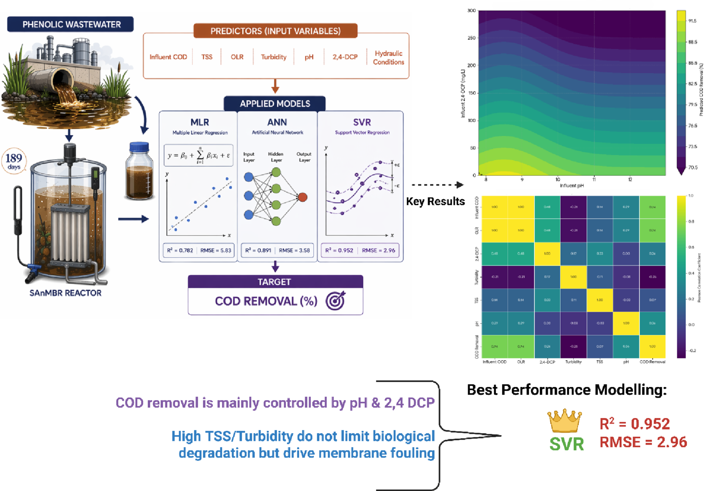
    - Phân đoạn 1 thể hiện hệ pilot SAnMBR vận hành 189 ngày với tải sốc 2,4-DCP tăng dần và 6 thông số đầu vào
    - Phân đoạn 2 trình bày khung tiền xử lý dữ liệu và so sánh ba thuật toán học máy MLR, ANN, SVR
    - Phân đoạn 3 xác lập cửa sổ vận hành tối ưu hẹp về pH và nồng độ 2,4-DCP đạt hiệu suất phân hủy COD cực đại
    - Phân định rõ ràng giữa động lực xử lý sinh học và rào cản tắc nghẽn màng do chất rắn lơ lửng
- Điểm nhấn nghiên cứu (Highlights)
  - Hệ thống pilot SAnMBR duy trì vận hành ổn định suốt chu kỳ 189 ngày dưới các đợt sốc nồng độ 2,4-DCP
  - Hiệu suất xử lý duy trì ở mức cao: loại bỏ COD ($80 - 95\%$), giữ lại TSS ($> 90\%$), và phân hủy 2,4-DCP ($> 80\%$)
  - Thuật toán SVR đạt kết quả cao hơn hẳn ANN và MLR về độ chính xác dự đoán với $R^2 = 0.952$ và $\text{RMSE} = 2.96$
  - Biến $\text{pH}$ ($8 - 9$) và nồng độ 2,4-DCP được nhận diện là các yếu tố chi phối phi tuyến chủ đạo
  - Cửa sổ vận hành tối ưu bị giới hạn nghiêm ngặt ở nồng độ 2,4-DCP thấp ($< 50\text{ mg/L}$) và dải pH kiềm nhẹ
- Đặc tính độc học và sự tồn lưu của hợp chất phenolic trong môi trường
  - Hợp chất phenolic có nguồn gốc từ nước thải hóa dầu, dược phẩm, dệt nhuộm và sản xuất bột giấy
  - Cấu trúc vòng benzen liên kết một hoặc nhiều nhóm hydroxyl tạo tính bền hóa học cao và độ tan đáng kể trong nước
  - Khả năng tích lũy sinh học gây quan ngại nghiêm trọng về độc tính sinh thái, biến đổi nội tiết và khả năng sinh ung thư
  - Độc tính cấp tính đối với sinh vật thủy sinh biểu hiện qua giá trị $\text{LC}_{50}$ trong khoảng từ $5\text{ mg/L}$ đến $25\text{ mg/L}$
  - Ở nồng độ dưới mức gây chết ($< 1\text{ mg/L}$), các hợp chất phenolic vẫn gây ức chế hoạt tính enzyme và gây stress oxy hóa
  - Phơi nhiễm kéo dài ở người gây độc tính thần kinh, tổn thương huyết học và hoại tử tế bào gan
- Cơ chế phụ thuộc pH của sự phân ly và độc tính 2,4-dichlorophenol (2,4-DCP)
  - Hợp chất 2,4-DCP mang tính acid yếu với hằng số phân ly acid $\text{p}K_a \approx 7.9$
  - Trạng thái tồn tại gồm dạng phân tử trung hòa (không ion hóa) và dạng anion (ion hóa) tùy thuộc vào giá trị pH dung dịch
  - Ở pH thấp ($\text{pH} < 7.9$), dạng không ion hóa chiếm ưu thế mang tính kỵ nước cao, dễ khuếch tán qua màng lipid kép của tế bào vi sinh vật
  - Sự khuếch tán dạng không ion hóa làm gia tăng độc tính nội bào và ức chế các con đường chuyển hóa sinh học kỵ khí
  - Ở điều kiện trung tính đến kiềm nhẹ ($\text{pH} > 7.9$), dạng ion hóa chiếm ưu thế làm giảm tính thấm qua màng tế bào vi khuẩn
- Ưu thế công nghệ và giới hạn vận hành của bể phản ứng màng kỵ khí ngập nước (SAnMBR)
  - Tích hợp quá trình phân hủy sinh học kỵ khí với tách lọc qua màng bán thấm, cho phép tách rời hoàn toàn thời gian lưu bùn (SRT) và thời gian lưu thủy lực (HRT)
  - Duy trì mật độ sinh khối cao và lưu giữ các nhóm vi sinh vật tăng trưởng chậm như vi khuẩn phân giải phenol và vi khuẩn sinh methane
  - Quần thể vi sinh vật cộng sinh bao gồm vi khuẩn chuyển hóa vòng thơm (*Syntrophus*, *Syntrophorhabdus*) và cổ khuẩn sinh methane (*Methanosaeta*, *Methanosarcina*)
  - Hệ thống màng ngập nước giúp tiết kiệm diện tích mặt bằng, giảm tiêu thụ năng lượng và cho phép thu hồi năng lượng dưới dạng khí sinh học ($\text{CH}_4$)
  - Thách thức lớn nhất là hiện tượng tắc nghẽn màng (membrane fouling) do tích tụ bánh bùn, nghẽn lỗ màng, và sự bám dính của chất ngoại bào (EPS) cùng sản phẩm vi sinh hòa tan (SMP)
- Nhu cầu áp dụng mô hình học máy (Machine Learning) trong điều khiển và tối ưu hóa SAnMBR
  - Tương tác giữa tải sốc hợp chất ức chế 2,4-DCP, động học bùn kỵ khí và các biến thủy lực mang tính phi tuyến cao
  - Các mô hình cơ chế truyền thống (deterministic/mechanistic models) gặp khó khăn khi mô tả sự suy giảm hiệu suất đột ngột tại các ngưỡng độc tính
  - Các nghiên cứu MBR trước đây (Zhong et al. 2022, Yaqub & Lee 2022, Zhuang et al. 2021) chủ yếu tập trung nâng cao chỉ số tương quan trên dữ liệu ổn định
  - Thiếu hụt các nghiên cứu đánh giá so sánh thuật toán phi tuyến kết hợp công cụ diễn giải mô hình trong điều kiện sốc tải hóa chất độc hại kéo dài
  - Nghiên cứu áp dụng biểu đồ phụ thuộc một phần (PDP) và phân tích độ nhạy (Sensitivity Analysis) để xác định ngưỡng vận hành kỹ thuật và hỗ trợ chiến lược điều khiển thời gian thực

## 2 Materials and Methods

### 2.1 Experimental Setup

- Cấu hình thiết bị và sơ đồ nguyên lý hệ thống SAnMBR
  - **Hình 1. Sơ đồ cấu hình thực nghiệm của hệ thống bể phản ứng sinh học màng kỵ khí ngập nước (SAnMBR)**
    - 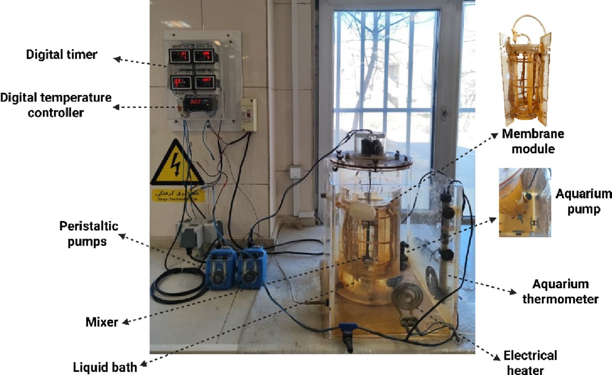
    - Thể tích hiệu dụng của bể phản ứng Plexiglas là $8\text{ L}$ trên tổng dung tích thiết kế $8.733\text{ L}$
    - Mô-đun màng sợi rỗng Polypropylene đặt chìm với diện tích bề mặt lọc danh định $0.1\text{ m}^2$
    - Hệ thống bơm nhu động đôi điều tiết chính xác lưu lượng dòng nạp và dòng dịch lọc thấm qua màng
    - Lớp áo nước bao quanh thành bể duy trì nhiệt độ kỵ khí ổn định ở $36 \pm 1^\circ\text{C}$ qua bể điều nhiệt tuần hoàn
- Thông số kỹ thuật của bể phản ứng và mô-đun màng
  - Thể tích chất lỏng làm việc thực tế $V_{\text{eff}} = 8\text{ L}$ với kết cấu vỏ bằng nhựa Plexiglas trong suốt
  - Màng sợi rỗng ngập nước (Hydrol, UK) chế tạo từ vật liệu Polypropylene kỵ nước cải tính
  - Tổng diện tích lọc hoạt động của bó màng sợi rỗng là $0.1\text{ m}^2$
  - Bể ổn nhiệt tuần hoàn nước sử dụng nước cất và được che phủ màng phim nhựa để hạn chế bay hơi và kết tinh muối
- Điều kiện vận hành dòng liên tục và chế độ kiểm soát nhiệt độ
  - Hệ thống SAnMBR vận hành theo chế độ dòng liên tục trong tổng thời gian 189 ngày
  - Nhiệt độ bể phản ứng được kiểm soát nghiêm ngặt ở chế độ kỵ khí ấm $36 \pm 1^\circ\text{C}$ để loại trừ biến động của môi trường ngoài
  - Hệ thống bơm nhu động song song (Shiva Amvaj, Iran) điều phối dòng nạp và dòng rút dịch lọc
  - Hoạt động của các bơm được đồng bộ hóa thông qua bộ điều khiển kỹ thuật số đa kênh (Shiva Amvaj, Isfahan, Iran)
- Chiến lược tải trọng hữu cơ và kịch bản sốc tải phenolic
  - Tải trọng hữu cơ (OLR) được điều chỉnh tăng dần từ $0.125\text{ kg COD/m}^3\cdot\text{day}$ đến $0.798\text{ kg COD/m}^3\cdot\text{day}$
  - Giai đoạn nạp nền kéo dài đến ngày thứ 117 nhằm đảm bảo hệ vi sinh vật kỵ khí thích nghi và đạt trạng thái cân bằng động
  - Quá trình châm nồng độ 2,4-DCP bắt đầu từ ngày thứ 118 để khảo sát phản ứng động học dưới tải sốc độc chất có kiểm soát

### 2.2 Experimental Procedure

- Nguồn gốc bùn cấy và đặc tính sinh khối ban đầu
  - Bể phản ứng được cấy với $2000\text{ mL}$ bùn kỵ khí đã phân hủy thu từ Nhà máy xử lý nước thải Nam Tehran
  - Bùn được rửa sạch cẩn thận bằng nước máy trước khi đưa vào bể để loại bỏ tạp chất và hạt vô cơ lơ lửng
  - Nồng độ tổng chất rắn lơ lửng của bùn cấy ban đầu đạt $\text{TSS} = 21,082\text{ mg/L}$
  - Nồng độ chất rắn lơ lửng bay hơi đạt $\text{VSS} = 12,937\text{ mg/L}$, tương ứng với tỷ lệ $\text{VSS}/\text{TSS} \approx 0.614$ phản ánh hoạt tính sinh học tốt
- Thành phần dinh dưỡng và nước thải tổng hợp nạp vào hệ thống
  - Nước thải tổng hợp được pha chế mới hàng ngày sử dụng glucose làm nguồn cơ chất carbon hữu cơ chính
  - Các nguyên tố dinh dưỡng đa lượng và vi lượng (Merck KGaA, Đức) được định lượng chuẩn xác theo tỷ lệ khối lượng trên mỗi gam COD nạp ($\text{mg/g COD}$)
  - Nguồn đạm và phospho nạp gồm $\text{NH}_4\text{Cl}$ ($76.45\text{ mg/g COD}$), $\text{KH}_2\text{PO}_4$ ($10.00\text{ mg/g COD}$) và $\text{K}_2\text{HPO}_4$ ($25.32\text{ mg/g COD}$)
  - Hỗn hợp vi lượng khoáng gồm $\text{FeCl}_3$ ($1.021\text{ mg/g COD}$), $\text{CaCl}_2\cdot 2\text{H}_2\text{O}$ ($2.06\text{ mg/g COD}$) và $\text{MgSO}_4\cdot 7\text{H}_2\text{O}$ ($2.14\text{ mg/g COD}$)
  - Các nguyên tố vi lượng đồng yếu tố enzyme gồm $\text{MnSO}_4\cdot \text{H}_2\text{O}$ ($0.355$), $\text{CoCl}_2\cdot 6\text{H}_2\text{O}$ ($0.092$), $\text{NiSO}_4\cdot 6\text{H}_2\text{O}$ ($0.0763$), $\text{ZnSO}_4$ ($0.1055$), $(\text{NH}_4)_6\text{Mo}_7\text{O}_{24}\cdot 4\text{H}_2\text{O}$ ($0.4198$), $\text{CuSO}_4\cdot 5\text{H}_2\text{O}$ ($0.0321$) và $\text{H}_3\text{BO}_3$ ($0.020\text{ mg/g COD}$)
- Quy trình gia tăng nồng độ tải sốc hợp chất phenolic
  - Sau giai đoạn thích nghi sinh học ban đầu, nồng độ 2,4-DCP trong dòng vào được tăng dần theo từng cấp nồng độ
  - Dải nồng độ 2,4-DCP khảo sát mở rộng liên tục từ mức khởi điểm $5\text{ mg/L}$ lên đến đỉnh điểm $300\text{ mg/L}$
  - Hệ thống duy trì chế độ đo đạc và giám sát liên tục hiệu suất loại bỏ COD và hiệu suất phân hủy 2,4-DCP qua các giai đoạn tải trọng động

### 2.3 Analytical Methods

- Danh mục các thông số lý hóa quan trắc định kỳ
  - Hệ thống theo dõi liên tục 9 chỉ tiêu lý hóa gồm nhiệt độ, $\text{pH}$, $\text{COD}$, độ đục (Turbidity), $\text{TSS}$, $\text{TDS}$, $\text{VSS}$, nồng độ $\text{2,4-DCP}$ và độ dẫn điện ($\text{EC}$)
  - Tất cả các phép thử phân tích phòng thí nghiệm được thực hiện lặp lại ba lần (in triplicate) và lấy giá trị trung bình số học để đảm bảo tính chuẩn xác
- Quy trình phân tích quang phổ xác định COD và hợp chất phenolic
  - Nồng độ $\text{COD}$ được đo bằng phương pháp so màu hồi lưu kín theo tiêu chuẩn APHA 5220D
  - Nồng độ phenol và $\text{2,4-DCP}$ được định lượng bằng phương pháp trắc quang trực tiếp theo tiêu chuẩn APHA 5530D
  - Cả hai phép phân tích quang phổ đều sử dụng máy quang phổ phân tích tử ngoại - khả kiến DR 6000 (Hach, Đức)
- Phương pháp đo độ đục và kiểm soát giá trị pH
  - Độ đục nước thải dòng vào và dòng thấm qua màng được đo bằng phương pháp tán xạ ánh sáng (nephelometric method) trên máy đo độ đục Hach 2100AN
  - Giá trị $\text{pH}$ được điều chỉnh bằng dung dịch acid $\text{H}_2\text{SO}_4\ 0.1\text{ N}$ và dung dịch kiềm $\text{NaOH}\ 0.1\text{ N}$
  - Đo đạc và kiểm tra $\text{pH}$ liên tục bằng thiết bị phân tích đa thông số điện hóa CONSORT C831 (Bỉ)
- Phương pháp trọng lượng tiêu chuẩn xác định các dạng chất rắn
  - Tổng chất rắn lơ lửng ($\text{TSS}$) xác định theo tiêu chuẩn APHA 2540D: lọc $25\text{ mL}$ mẫu qua giấy lọc sợi thủy tinh Whatman GF/C (UK), sấy khô tại $103 - 105^\circ\text{C}$ trong 24 giờ trong tủ sấy Memmert, làm nguội trong bình hút ẩm trước khi cân
  - Tổng chất rắn hòa tan ($\text{TDS}$) phân tích theo tiêu chuẩn APHA 2540C bằng cách làm bay hơi phần nước lọc $25\text{ mL}$ tại nhiệt độ $180^\circ\text{C}$ đến khối lượng không đổi
  - Chất rắn lơ lửng bay hơi ($\text{VSS}$) xác định theo tiêu chuẩn APHA 2540E bằng cách nung mẫu giấy lọc $\text{TSS}$ ở nhiệt độ $550^\circ\text{C}$ trong 30 phút trong lò nung múp Nabertherm (Đức)

### 2.4 Data Acquisition and Pre-processing

- Cấu trúc tập dữ liệu thực nghiệm thu thập từ hệ SAnMBR
  - Tập dữ liệu bao gồm chính xác 189 điểm đo thực nghiệm độc lập thu thập qua 189 ngày vận hành liên tục
  - Tập dữ liệu đạt tính toàn vẹn cao, không tồn tại bất kỳ giá trị khuyết thiếu (no missing entries) hay quan sát bị lỗi
- Phân loại không gian biến đầu vào và biến mục tiêu đầu ra
  - Sáu biến độc lập đầu vào ($X$) đại diện cho các điều kiện vận hành thủy lực, cơ chất và tải độc:
    - Nồng độ $\text{COD}$ dòng vào ($\text{COD}_{\text{in}}$, đơn vị $\text{mg/L}$)
    - Tải trọng nạp chất hữu cơ ($\text{OLR}$, đơn vị $\text{g COD/m}^3\cdot\text{day}$)
    - Nồng độ tải sốc phenolic dòng vào ($\text{2,4-DCP}_{\text{in}}$, đơn vị $\text{mg/L}$)
    - Độ đục dòng vào ($\text{Turbidity}_{\text{in}}$, đơn vị $\text{NTU}$)
    - Nồng độ tổng chất rắn lơ lửng dòng vào ($\text{TSS}_{\text{in}}$, đơn vị $\text{g/L}$)
    - Giá trị thế ion hydro dòng vào ($\text{pH}_{\text{in}}$)
  - Biến phụ thuộc mục tiêu ($Y$) duy nhất là hiệu suất loại bỏ nhu cầu oxy hóa học ($\text{COD removal efficiency}$, đơn vị $\%$)
- Chiến lược phân chia dữ liệu huấn luyện và kiểm tra độc lập
  - Tập dữ liệu được phân chia ngẫu nhiên theo tỷ lệ $70/30$ chuẩn mực
  - Tập huấn luyện (training set) chiếm $70\%$ quy mô dữ liệu (xấp xỉ 132 mẫu) dùng để tối ưu hóa trọng số mô hình
  - Tập kiểm tra (testing set) chiếm $30\%$ quy mô dữ liệu (xấp xỉ 56 mẫu) hoàn toàn độc lập dùng để đánh giá năng lực tổng quát hóa
- Quy trình chuẩn hóa Min-Max tránh rò rỉ thông tin
  - Phân tách tập huấn luyện và kiểm tra được tiến hành nghiêm ngặt trước bước chuẩn hóa dữ liệu nhằm loại trừ rò rỉ thông tin (data leakage)
  - Các tham số cực trị ($X_{\min}$, $X_{\max}$) được tính toán thuần túy trên tập huấn luyện rồi áp dụng biến đổi cho cả hai tập dữ liệu
  - Áp dụng phương pháp chuẩn hóa Min-Max để ánh xạ miền giá trị của từng đặc trưng về đoạn $[0, 1]$ theo công thức:
    $$X_{\text{norm}} = \frac{X - X_{\min}}{X_{\max} - X_{\min}}$$
  - Quá trình chuẩn hóa triệt tiêu sự chênh lệch độ lớn thang đo giữa các biến nồng độ ($\text{mg/L}$) và chỉ số $\text{pH}$, đảm bảo cân bằng trọng số khi tối ưu hóa

### 2.5 Predictive Machine Learning Model Implementation

- Tổng quan triển khai ba thuật toán học máy đối sánh
  - Ba thuật toán gồm Hồi quy tuyến tính bội (MLR), Mạng nơ-ron nhân tạo (ANN) và Hồi quy vector hỗ trợ (SVR) được triển khai độc lập
  - Mục tiêu cốt lõi là dự đoán chính xác hiệu suất loại bỏ COD dưới các điều kiện sốc tải hợp chất phenolic

#### 2.5.1 Multiple Linear Regression (MLR)

- Vai trò mô hình đường cơ sở (Baseline model)
  - Mô hình MLR được sử dụng để đánh giá mức độ tuyến tính nội tại của hệ thống phản ứng màng SAnMBR
  - Đóng vai trò mốc tham chiếu định lượng để xác định sự cải thiện độ chính xác của các thuật toán phi tuyến
- Công thức toán học hồi quy tuyến tính bình phương tối thiểu (OLS)
  - Phương trình hồi quy thiết lập mối tương quan tuyến tính giữa 6 biến đầu vào ($X_i$) và hiệu suất xử lý COD dự đoán ($\hat{Y}$):
    $$\hat{Y} = \beta_0 + \sum_{i=1}^6 \beta_i X_i$$
  - Trong đó $\hat{Y}$ là phần trăm loại bỏ COD dự đoán, $X_i$ là các thông số vận hành độc lập, $\beta_i$ là hệ số hồi quy trọng số, và $\beta_0$ là hệ số chặn (intercept)

#### 2.5.2 Support Vector Regression (SVR)

- Cơ chế ánh xạ không gian nhiều chiều và hàm nhân phi tuyến
  - SVR được lựa chọn làm công cụ dự đoán phi tuyến chính nhờ khả năng tổng quát hóa cao đối với dữ liệu môi trường phức tạp
  - Sử dụng hàm nhân (kernel function) ánh xạ không gian đầu vào 6 chiều lên không gian đặc trưng nhiều chiều để tuyến tính hóa bài toán hồi quy
- Lựa chọn hàm nhân RBF và tối ưu hóa siêu tham số
  - Hàm nhân cơ sở xuyên tâm (Radial Basis Function - RBF) được lựa chọn nhờ khả năng mô tả động học sinh học chính xác và tin cậy cao:
    $$K(x, x') = \exp(-\gamma ||x - x'||^2)$$
  - Hiệu suất mô hình được tinh chỉnh tỉ mỉ thông qua tối ưu hóa hai siêu tham số then chốt: tham số phạt $C$ (penalty parameter) và độ rộng hàm nhân $\gamma$ (kernel width)

#### 2.5.3 Artificial Neural Network (ANN)

- Kiến trúc mạng Perceptron đa tầng (MLP)
  - Mô hình ANN được xây dựng dựa trên cấu trúc mạng truyền thẳng nhiều lớp với thuật toán lan truyền ngược (backpropagation)
  - Cấu trúc mạng nơ-ron được tối ưu hóa theo mô hình 6-N-1 để cân bằng giữa độ phức tạp tính toán và nguy cơ quá khớp (overfitting)
- Kiến trúc cấu hình mạng nơ-ron nhân tạo MLP theo mô hình 6-N-1
  - **Hình 2. Kiến trúc mạng nơ-ron nhân tạo ANN với cấu trúc 6-N-1**
    - 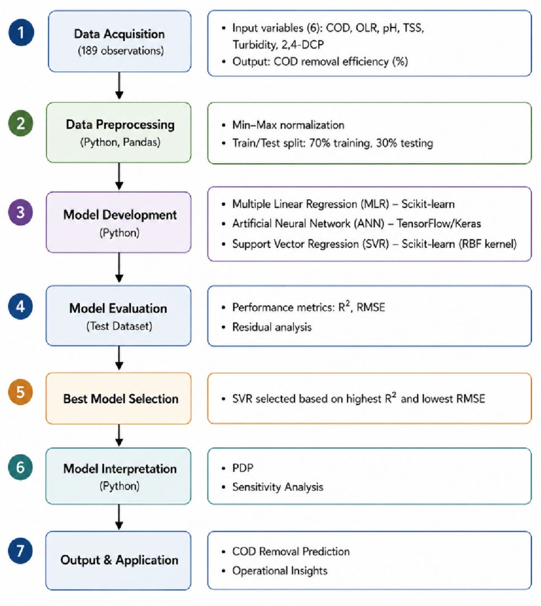
    - Lớp đầu vào gồm 6 neuron tiếp nhận các giá trị đặc trưng vận hành sau chuẩn hóa
    - Lớp ẩn đơn lẻ gồm N neuron áp dụng hàm kích hoạt phi tuyến tansig
    - Lớp đầu ra gồm 1 neuron đơn lẻ sử dụng hàm kích hoạt tuyến tính purelin
    - Thuật toán tối ưu hóa lan truyền ngược điều chỉnh ma trận trọng số và độ lệch
- Hàm truyền kích hoạt phi tuyến và cấu trúc dòng thông tin
  - Lớp ẩn áp dụng hàm tiếp tuyến sigmoid (tansig) nhằm đưa tính phi tuyến phức tạp vào quá trình biến đổi dữ liệu:
    $$f(z) = \frac{2}{1 + e^{-2z}} - 1$$
  - Lớp đầu ra sử dụng hàm tuyến tính (purelin) $f(z) = z$ để xuất giá trị dự đoán liên tục của hiệu suất xử lý COD

#### 2.5.4 Computational Tools and Environment

- Môi trường phần mềm và các thư viện tính toán khoa học
  - Tất cả các mô hình học máy và phân tích diễn giải được xây dựng trên ngôn ngữ Python phiên bản 3.10
  - Thư viện Scikit-learn (phiên bản 1.2.2) thực thi các thuật toán SVR, MLR và quy trình tiền xử lý
  - Framework TensorFlow/Keras hỗ trợ thiết kế, huấn luyện và tối ưu cấu trúc mạng nơ-ron nhân tạo ANN
  - Thư viện Pandas xử lý dữ liệu bảng, phân chia tập dữ liệu; Matplotlib và Seaborn phục vụ biểu diễn đồ họa
- Sơ đồ quy trình tổng thể từ thu thập dữ liệu đến diễn giải mô hình học máy
  - **Hình 3. Quy trình làm việc tổng thể của quá trình mô hình hóa học máy (ML)**
    - 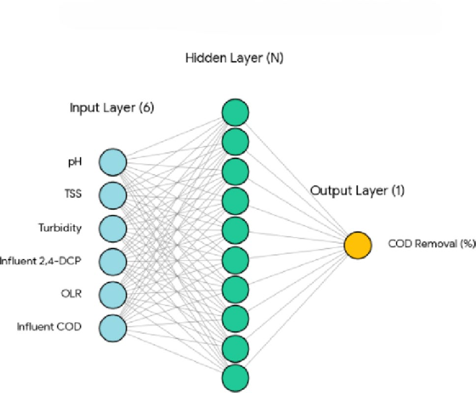
    - Thu thập 189 quan sát thực nghiệm và chuẩn hóa Min-Max theo tỷ lệ 70/30
    - Huấn luyện và tinh chỉnh siêu tham số độc lập cho ba thuật toán MLR, ANN và SVR
    - Đánh giá kiểm định mô hình qua các chỉ số $R^2$, RMSE và phân tích phần dư
    - Triển khai công cụ diễn giải đồ thị phụ thuộc một phần PDP và phân tích độ nhạy
- Chu trình triển khai mô hình và công cụ giải thích kỹ thuật
  - Chu trình gồm 4 pha tuần tự: thu thập dữ liệu, huấn luyện mô hình, kiểm định trên tập kiểm tra độc lập, và phân tích cơ chế
  - Đồ thị phụ thuộc một phần (PDP) kiểm tra tác động biên của từng biến vận hành lên hiệu suất loại bỏ COD
  - Phân tích độ nhạy lượng hóa tầm quan trọng tương đối của từng biến đầu vào trên toàn bộ dải vận hành quan sát

### 2.6 Model Evaluation Criteria

- Nguyên tắc đánh giá độ chính xác trên tập kiểm tra độc lập
  - Độ chính xác dự đoán và năng lực tổng quát hóa của ba mô hình MLR, ANN, SVR được kiểm định trên tập kiểm tra độc lập
  - Sử dụng hai chỉ số thống kê chuẩn mực quốc tế gồm hệ số xác định ($R^2$) và sai số căn bậc hai trung bình (RMSE)
- Định nghĩa toán học của hệ số xác định ($R^2$)
  - Hệ số xác định lượng hóa tỷ lệ phương sai của biến mục tiêu được giải thích bởi các biến đầu vào trong mô hình
  - Công thức tính toán $R^2$ theo phương trình (2):
    $$R^2 = 1 - \frac{\sum_{i=1}^n (y_i - \hat{y}_i)^2}{\sum_{i=1}^n (y_i - \bar{y})^2}$$
  - Trong đó $y_i$ là giá trị quan sát thực nghiệm thực tế, $\hat{y}_i$ là giá trị dự đoán từ mô hình, $\bar{y}$ là giá trị trung bình cộng của các giá trị thực nghiệm, và $n$ là tổng số mẫu thử nghiệm
  - Giá trị $R^2$ tiến gần đến $1.0$ thể hiện mức độ khớp hoàn hảo giữa dự đoán mô hình và thực nghiệm
- Định nghĩa toán học của sai số căn bậc hai trung bình (RMSE)
  - Chỉ số RMSE lượng hóa độ lệch chuẩn của các phần dư dự đoán, phản ánh độ lớn trung bình của sai số
  - Công thức tính toán RMSE theo phương trình (3):
    $$\text{RMSE} = \sqrt{\frac{1}{n} \sum_{i=1}^n (y_i - \hat{y}_i)^2}$$
  - Các ký hiệu $y_i$, $\hat{y}_i$ và $n$ giữ nguyên ý nghĩa như trong công thức tính $R^2$
  - Giá trị RMSE càng nhỏ phản ánh sai số ngẫu nhiên càng thấp và độ chuẩn xác dự đoán của thuật toán càng cao

## 3 Results and Discussion

### 3.1 SAnMBR Experimental Performance

- Động thái chuỗi thời gian 189 ngày của hiệu suất loại bỏ COD và biến thiên OLR
  - **Hình 4. Chuỗi thời gian nồng độ COD và hiệu suất loại bỏ xuyên suốt các giai đoạn vận hành**
    - 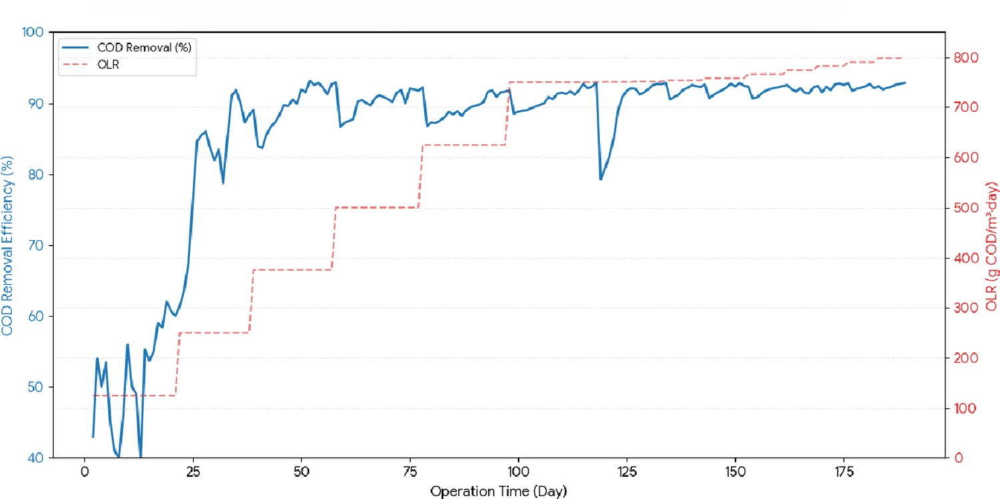
    - Hiệu suất xử lý COD tăng từ mức $\approx 43\%$ lên $85 - 90\%$ trong 50 ngày thích nghi đầu tiên
    - Duy trì độ ổn định cao trong dải $80 - 95\%$ khi OLR tăng từng bậc từ $125$ lên xấp xỉ $800\text{ g COD/m}^3\cdot\text{day}$
    - Ghi nhận sự sụt giảm ngắn hạn $5 - 8\%$ sau mỗi bước tăng OLR trước khi phục hồi nhanh chóng
    - Tách biệt SRT và HRT tạo điều kiện tích lũy sinh khối vi sinh vật kỵ khí sinh methane sinh trưởng chậm
- Cơ chế kiểm soát và ổn định động học phân hủy sinh học
  - Màng siêu lọc giữ lại toàn bộ sinh khối giúp tách rời hoàn toàn thời gian lưu bùn (SRT) khỏi thời gian lưu thủy lực (HRT)
  - Điều kiện nhiệt độ ổn định $36 \pm 1^\circ\text{C}$ kích hoạt các phản ứng enzyme thủy phân và methane hóa, giảm thiểu độ nhạy với dao động tải
  - Nồng độ bùn hoạt tính kỵ khí cao trong bể phản ứng duy trì tốc độ tiêu thụ cơ chất ổn định, triệt tiêu giới hạn động học khi OLR tăng
  - Biện pháp sục khí sinh học định kỳ (biogas sparging) và rửa ngược kiểm soát hiệu quả lớp bánh bùn trên bề mặt màng
- Động lực thích ứng của quần thể vi sinh vật kỵ khí
  - Áp lực chọn lọc từ nồng độ cơ chất khó phân hủy thúc đẩy sự gia tăng tỷ lệ vi khuẩn chuyển hóa hợp chất vòng thơm
  - Các chi vi khuẩn cộng sinh chủ chốt gồm *Syntrophus* và *Syntrophorhabdus* tham gia bẻ gãy cấu trúc vòng phenolic ban đầu
  - Cổ khuẩn sinh methane *Methanosaeta* và *Methanosarcina* đảm nhiệm chuyển hóa hoàn tất các sản phẩm trung gian thành khí $\text{CH}_4$
- Biến thiên thời gian của nồng độ và hiệu suất loại bỏ các chất ô nhiễm chính
  - **Hình 5. Biến thiên theo thời gian của nồng độ 2,4-DCP và các thông số vận hành**
    - 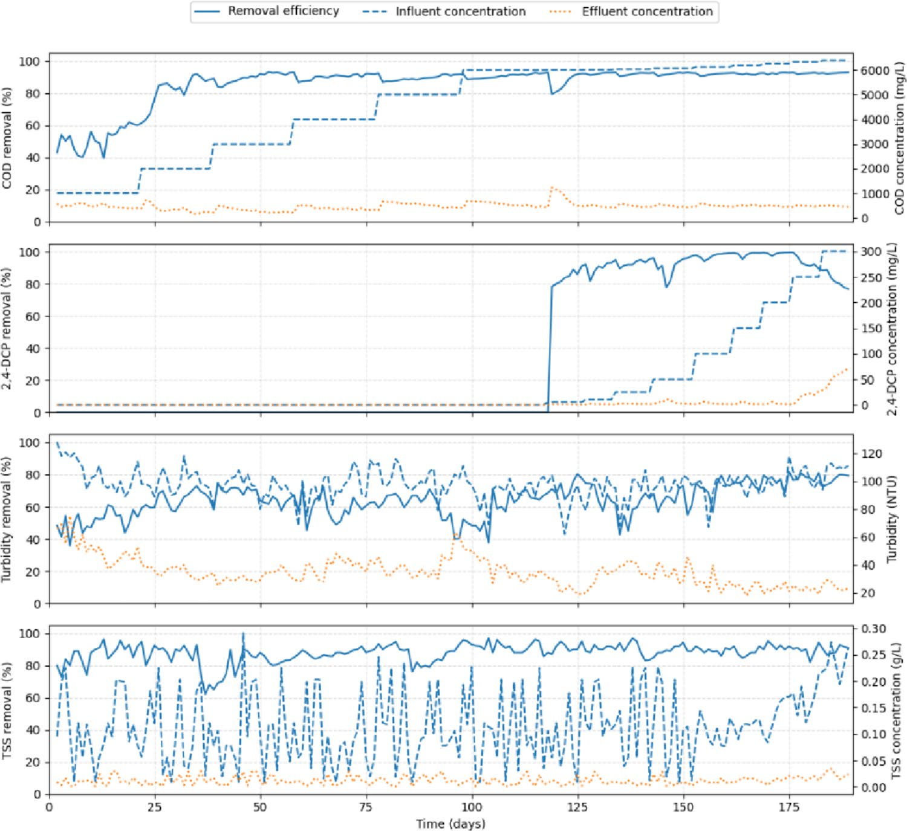
    - Hiệu suất phân hủy 2,4-DCP tăng từ mức dưới $20 - 30\%$ ban đầu lên trạng thái ổn định $80 - 95\%$
    - Hiệu suất loại bỏ tổng chất rắn lơ lửng TSS duy trì ổn định tuyệt đối trên $90 - 95\%$ nhờ màng lọc
    - Hiệu suất khử độ đục tăng tiến từ $60 - 65\%$ lên mức $75 - 80\%$ phản ánh sự hình thành bông bùn tốt
    - Hiện tượng tích tụ tạm thời EPS và SMP trên bề mặt màng xuất hiện trong các giai đoạn sốc tải
- Động thái suy giảm thoáng qua và tích lũy chất polyme ngoại bào (EPS/SMP)
  - Mỗi bước nhảy OLR tạo ra mức giảm hiệu suất tạm thời $5 - 8\%$ do vi sinh vật tiết ra các chất ngoại bào để tự bảo vệ
  - Sự tích tụ của polyme ngoại bào (EPS) và sản phẩm vi sinh hòa tan (SMP) làm gia tăng trở lực lọc và cản trở khuếch tán cơ chất
  - Hệ vi sinh vật thích nghi và tái lập trạng thái cân bằng trong vòng vài ngày vận hành
- Động học phân hủy 2,4-dichlorophenol và cơ chế giới hạn tốc độ
  - Hiệu suất phân hủy 2,4-DCP ban đầu thấp ($< 20 - 30\%$) do quá trình khử clo (dechlorination) và mở vòng thơm đòi hỏi thời gian thích nghi
  - Sau pha thích nghi, hiệu suất phân hủy đạt mức cao ổn định từ $80\%$ đến $95\%$
  - So sánh với y văn (Zhu et al. 2020), hệ thống đạt độ ổn định tương đương các công nghệ màng kỵ khí tiên tiến với hiệu suất khử phenolic đạt trên $90\%$

### 3.2 Correlation Analysis of Model Variables

- Đánh giá phụ thuộc tuyến tính qua hệ số tương quan Pearson
  - Ma trận tương quan được thiết lập để đo lường mức độ phụ thuộc tuyến tính giữa 6 biến vận hành đầu vào và hiệu suất loại bỏ COD
  - Phân tích tương quan là bước sàng lọc sơ bộ trước khi áp dụng các giải thuật học máy phi tuyến tính
- Ma trận tương quan Pearson giữa 6 biến đầu vào và hiệu suất loại bỏ COD
  - **Hình 7. Bản đồ nhiệt hệ số tương quan Pearson giữa các biến đầu vào và hiệu suất loại bỏ COD**
    - 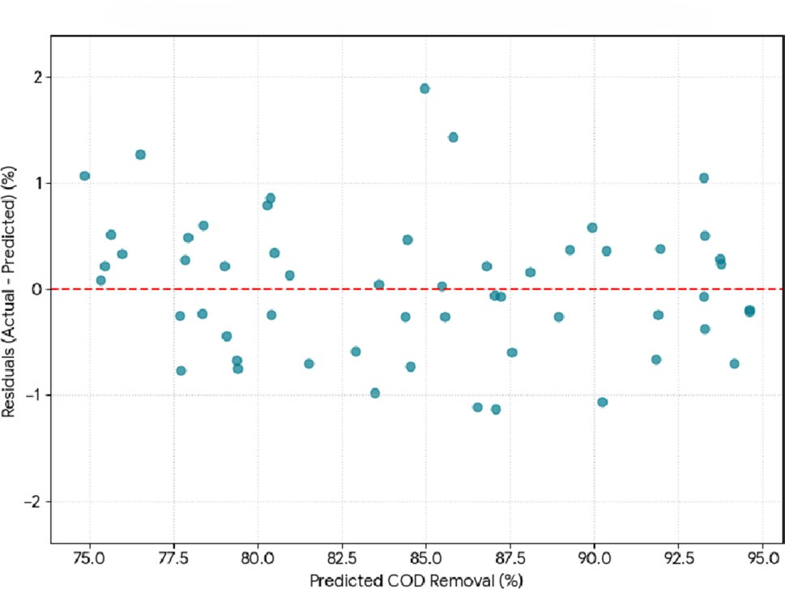
    - Tương quan dương tuyệt đối giữa nồng độ COD đầu vào và OLR đạt $r = 1.00$ do công thức tính toán tải
    - COD đầu vào và OLR đóng góp mối tương quan tuyến tính mạnh nhất với hiệu suất loại bỏ ($r = 0.74$)
    - Chỉ số pH dòng vào đạt tương quan dương vừa phải với biến mục tiêu ở mức $r = 0.36$
    - Hợp chất phenolic 2,4-DCP ($r = 0.26$) và TSS ($r = 0.07$) thể hiện liên kết tuyến tính rất thấp
- Hiện tượng đa cộng tuyến giữa COD dòng vào và tải trọng hữu cơ
  - Nồng độ COD dòng vào và OLR có hệ số tương quan tuyến tính tuyệt đối $r = 1.00$ do OLR được tính trực tiếp từ lưu lượng và nồng độ COD
  - Hiện tượng đa cộng tuyến (multicollinearity) này gây sai lệch nghiêm trọng đối với các mô hình tuyến tính cổ điển như MLR
  - Mô hình SVR vẫn giữ nguyên cả hai biến đầu vào để bảo toàn đầy đủ các chiều thông tin vận hành thực nghiệm
- Tương quan tuyến tính của các biến vận hành với hiệu suất xử lý
  - Nồng độ COD đầu vào và OLR có mối liên hệ tuyến tính dương mạnh nhất với hiệu suất loại bỏ COD ($r = 0.74$)
  - Giá trị $\text{pH}$ dòng vào có tương quan dương yếu hơn nhưng rõ nét với $r = 0.36$, phản ánh tầm quan trọng của môi trường kiềm nhẹ
  - Tổng chất rắn lơ lửng ($\text{TSS}$) có hệ số tương quan gần như triệt tiêu ($r = 0.07$), khẳng định sinh khối lơ lửng không phải động lực tuyến tính chi phối hiệu suất xử lý
  - Độ đục có tương quan nghịch yếu ($r = -0.26$), hàm ý độ đục tăng cao gắn liền với sự xáo trộn thủy lực làm giảm chất lượng nước sau xử lý
- Giới hạn của phân tích tương quan tuyến tính đối với chất độc phenolic
  - Nồng độ 2,4-DCP chỉ đạt hệ số tương quan tuyến tính yếu $r = 0.26$ với hiệu suất loại bỏ COD
  - Tác động ức chế sinh học của 2,4-DCP xảy ra theo các ngưỡng nồng độ đột ngột và tương tác phi tuyến với pH mà hệ số Pearson không thể nắm bắt
  - Kết quả đòi hỏi tất yếu việc sử dụng các mô hình phi tuyến và công cụ diễn giải đồ thị phụ thuộc một phần (PDP)

### 3.3 Model results for COD Removal Prediction

- So sánh định lượng hiệu suất dự đoán giữa các thuật toán
  - Hiệu suất dự đoán của ba mô hình (SVR, MLR, ANN) được đánh giá đối sánh qua chỉ số $R^2$ và RMSE trên tập huấn luyện và kiểm tra
  - Mô hình SVR thể hiện độ chính xác cao nhất với $R^2 = 0.975$, $\text{RMSE} = 1.97$ trên tập huấn luyện và $R^2 = 0.952$, $\text{RMSE} = 2.96$ trên tập kiểm tra
  - Mô hình MLR đạt mức trung bình với $R^2 = 0.734$, $\text{RMSE} = 6.45$ (huấn luyện) và $R^2 = 0.717$, $\text{RMSE} = 7.23$ (kiểm tra), bị hạn chế bởi giả định tuyến tính
  - Mô hình ANN bị hiện tượng quá khớp (overfitting) nghiêm trọng khi $R^2$ sụt giảm từ $0.603$ (huấn luyện, $\text{RMSE} = 7.89$) xuống $0.397$ (kiểm tra, $\text{RMSE} = 10.56$)
- Phân tích nguyên nhân chênh lệch hiệu suất giữa các cấu trúc mô hình
  - Sai số kiểm tra RMSE của SVR ($2.96$) thấp hơn $2.4$ lần so với MLR ($7.23$) và thấp hơn $3.5$ lần so với ANN ($10.56$)
  - Quy mô dữ liệu 189 mẫu thực nghiệm là tương đối nhỏ đối với mạng nơ-ron nhiều tham số, khiến thuật toán lan truyền ngược dễ rơi vào cực tiểu địa phương
  - Mô hình SVR áp dụng nguyên lý giảm thiểu rủi ro cấu trúc (Structural Risk Minimization), giúp duy trì năng lực tổng quát hóa cao và ngăn chặn hiệu quả hiện tượng quá khớp
  - Mô hình tuyến tính MLR không thể phản ánh các điểm uốn động học khi nồng độ chất độc vượt qua ngưỡng chịu đựng của vi sinh vật
- Đánh giá tính ngẫu nhiên của sai số qua phân tích phần dư
  - **Hình 8. Phân tích phần dư của mô hình SVR tối ưu trên tập kiểm tra**
    - 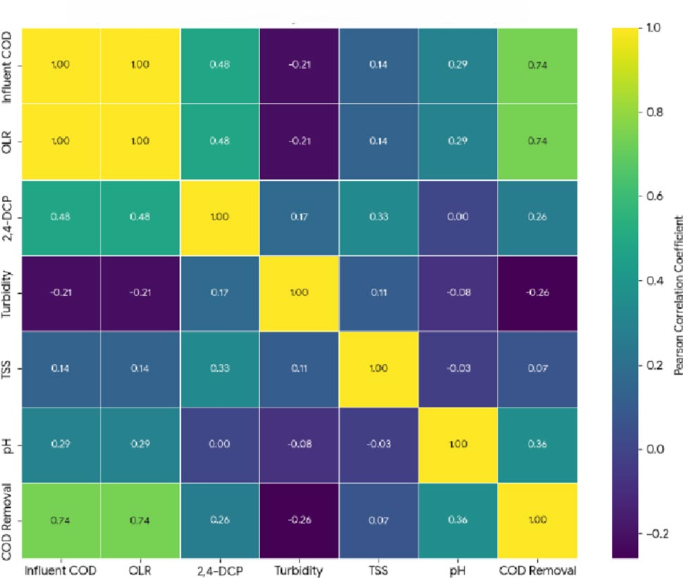
    - Các điểm phần dư phân tán ngẫu nhiên và đồng đều quanh trục hoành tham chiếu $y = 0$
    - Hoàn toàn triệt tiêu các mẫu hình có tính hệ thống như dạng hình nón hay xu hướng uốn cong
    - Xác nhận mô hình SVR đã giải thích toàn bộ các quy luật biến thiên có hệ thống của dữ liệu
    - Sai số dự đoán còn lại mang bản chất nhiễu ngẫu nhiên thuần túy của phép đo thực nghiệm
- Kiểm định độ hội tụ đường tương quan phân tán Parity Plot
  - **Hình 9. So sánh giá trị loại bỏ COD thực nghiệm và dự đoán giữa các mô hình**
    - 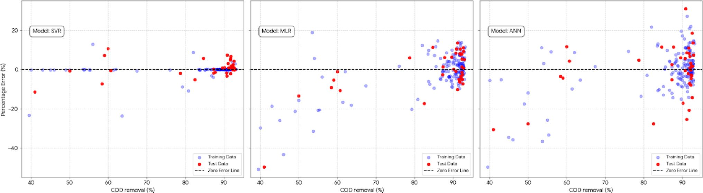
    - Dữ liệu kiểm tra độc lập (điểm đỏ) của SVR bám sát đường lý tưởng phân giác 1:1
    - Hầu như toàn bộ các điểm dự đoán của SVR nằm gọn trong dải biên sai số giới hạn 20%
    - Mô hình ANN thể hiện độ phân tán lớn với nhiều điểm văng ra ngoài dải sai số cho phép
    - Khẳng định khả năng tổng quát hóa của hàm nhân phi tuyến RBF
- Phân tích hiện tượng phương sai thay đổi qua đồ thị sai số phần trăm
  - **Hình 10. Phân bố sai số phần trăm so với hiệu suất loại bỏ COD thực tế**
    - 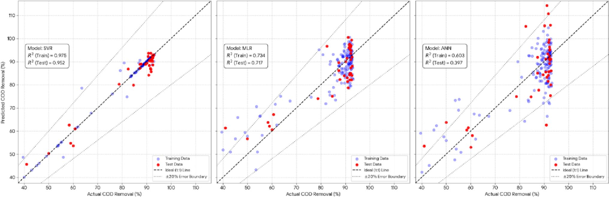
    - Điểm sai số phần trăm của SVR dao động biên độ hẹp sát đường sai số không
    - Mô hình ANN và MLR bộc lộ dải phân tán sai số rộng trên toàn dải hiệu suất COD
    - Mô hình ANN xuất hiện hiện tượng phương sai thay đổi (heteroscedasticity) rõ rệt
    - Minh chứng cấu trúc mạng nơ-ron đơn giản chưa thích ứng tốt với dữ liệu sốc tải kỵ khí
- Đánh giá dải biên sai số tương đối và độ tin cậy dự báo
  - Đường biên sai số $20\%$ đóng vai trò ngưỡng kiểm soát kỹ thuật cho các hệ thống điều khiển tự động
  - Điểm kiểm tra của mô hình SVR có độ lệch tuyệt đối so với thực nghiệm phần lớn nằm trong khoảng dưới $5\%$
  - Độ tin cậy dự báo ổn định ở cả dải hiệu suất thấp dưới tải sốc và dải hiệu suất cao ở điều kiện bình thường

#### 3.3.1 Partial Dependence Plots (PDPs)

- Cơ chế giải thích tương tác phi tuyến biên thông qua PDP
  - Phương pháp PDP cô lập tác động biên của từng biến vận hành độc lập lên hiệu suất loại bỏ COD trong khi giữ cố định các biến còn lại
  - Cung cấp cái nhìn trực quan sâu sắc về ngưỡng vận hành tới hạn và phản ứng phi tuyến của hệ thống sinh học
- Tương tác hai chiều giữa độ kiềm pH và nồng độ chất ức chế phenolic
  - **Hình 6. Đồ thị phụ thuộc một phần hai chiều (2D PDP) giữa pH và nồng độ 2,4-DCP**
    - 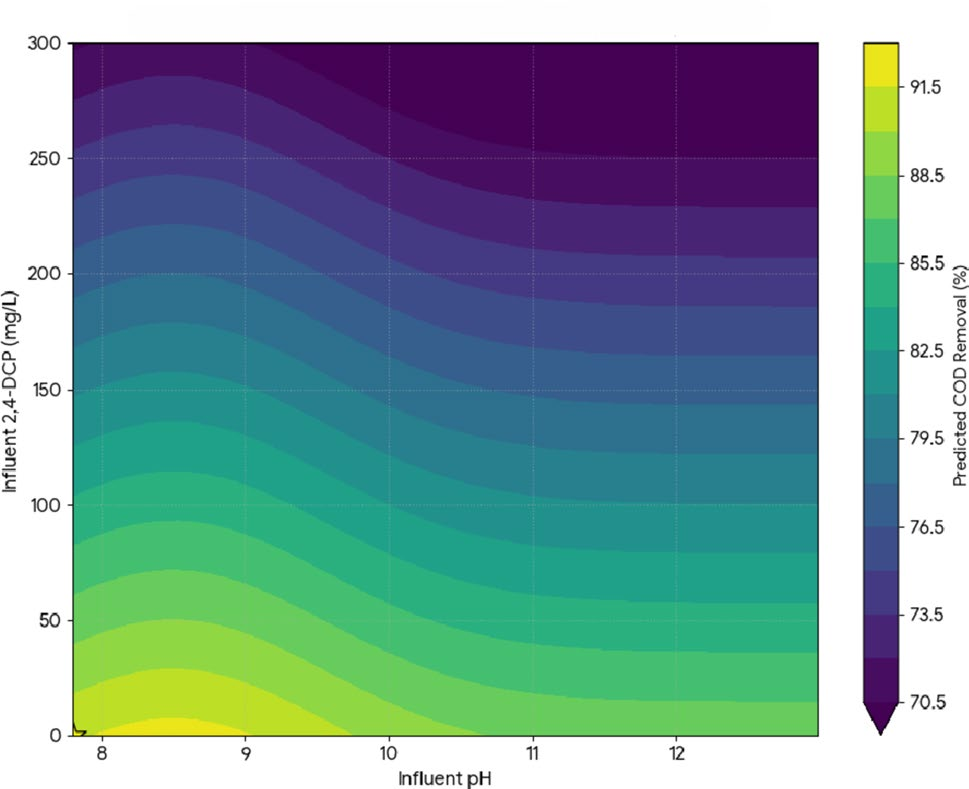
    - Hiệu suất loại bỏ COD đạt đỉnh 92-95% khi 2,4-DCP dưới 50 mg/L và pH trong dải 8-9
    - Hiệu suất sụt giảm nghiêm trọng khi nồng độ 2,4-DCP vượt ngưỡng ức chế 150 mg/L
    - Vùng pH acid làm gia tăng tỷ lệ 2,4-DCP không phân ly khuếch tán qua màng tế bào
    - Kiểm soát chặt chẽ giá trị pH đóng vai trò như hệ đệm bảo vệ chống lại các xung độc tố
- Đồ thị phụ thuộc một phần đơn biến cho sáu thông số vận hành then chốt
  - **Hình 11. Đồ thị phụ thuộc một phần (PDP) cho 6 thông số đầu vào chính**
    - 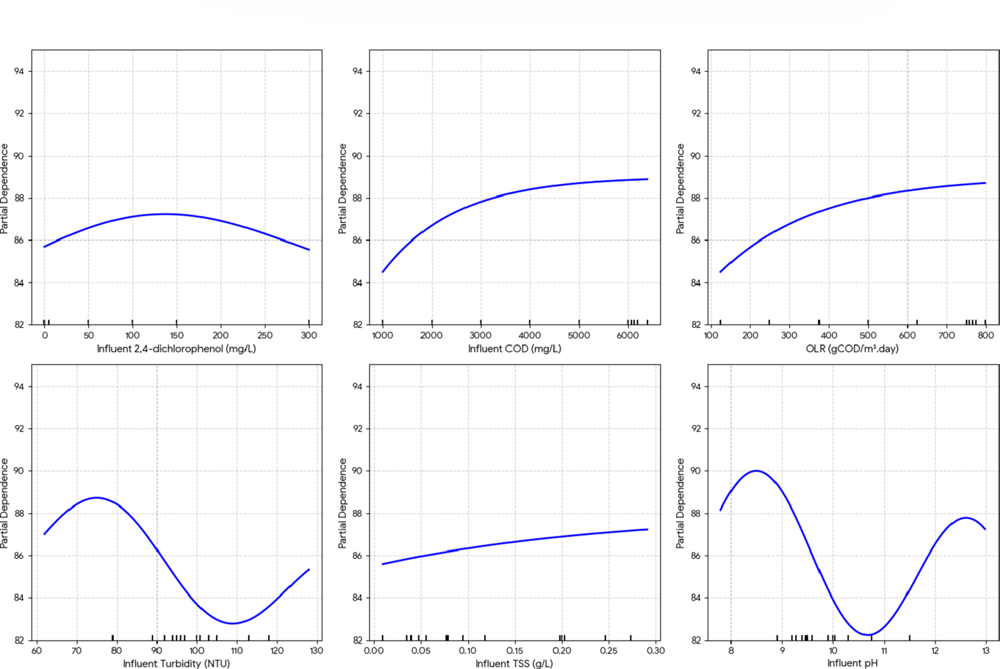
    - Nồng độ 2,4-DCP duy trì hiệu suất ổn định ở dải 0-150 mg/L trước khi suy giảm dốc
    - Đường cong pH đạt cực đại rõ rệt tại dải 8-9 và suy giảm khi chuyển sang vùng acid hoặc kiềm mạnh
    - Các biến COD dòng vào và OLR thể hiện đáp ứng bằng phẳng dưới ngưỡng tải tới hạn
    - Độ đục và TSS thể hiện độ dốc âm nhẹ do tốc độ thủy phân hạt chất rắn diễn ra chậm
- Ngưỡng ức chế sinh học và động thái của các biến tải trọng hữu cơ
  - Nồng độ 2,4-DCP bắt đầu gây ức chế rõ nét khi vượt quá $150\text{ mg/L}$, làm giảm hoạt tính của cổ khuẩn sinh methane
  - Đường cong của $\text{COD}$ đầu vào và OLR gần như nằm ngang trong dải khảo sát, chứng minh bể phản ứng hoạt động an toàn dưới giới hạn quá tải hữu cơ
  - Tác động âm nhẹ của $\text{TSS}$ và độ đục phù hợp với bản chất giới hạn tốc độ của quá trình thủy phân chất rắn hạt trong môi trường kỵ khí
- Cơ chế bảo vệ enzyme tại dải pH tối ưu
  - Vùng pH kiềm nhẹ từ 8 đến 9 tối đa hóa hoạt tính xúc tác của các hệ enzyme chuyển hóa methane kỵ khí
  - Môi trường pH này hạn chế sự phân ly của các acid béo bay hơi (VFA) tích tụ, ngăn ngừa hiện tượng toan hóa bể phản ứng (acidification)
  - Đồng thời ở pH kiềm nhẹ, hợp chất 2,4-DCP tồn tại phần lớn ở dạng anion phân ly, giảm thiểu tối đa khả năng xâm nhập qua màng lipid của vi khuẩn
  - Khi pH hạ xuống dưới 7, tỷ lệ dạng phân tử không phân ly tăng vọt (pKa $\approx 7.9$), gây độc tính tế bào tức thời và làm sụp đổ hiệu suất xử lý COD

#### 3.3.2 Sensitivity Analysis

- Khung phân tích độ nhạy độc lập cấu trúc mô hình (Model-Agnostic)
  - Phương pháp đo lường phản ứng của mô hình SVR bằng cách biến thiên từng biến đầu vào quanh giá trị trung bình nền
  - Chỉ số độ nhạy được xác định bằng độ lệch tuyệt đối trung bình giữa giá trị dự đoán sau biến thiên và giá trị dự đoán nền
- Lượng hóa thứ bậc tác động của các biến vận hành lên mô hình SVR
  - **Hình 12. Biểu đồ phân tích độ nhạy của các biến vận hành trong mô hình SVR**
    - 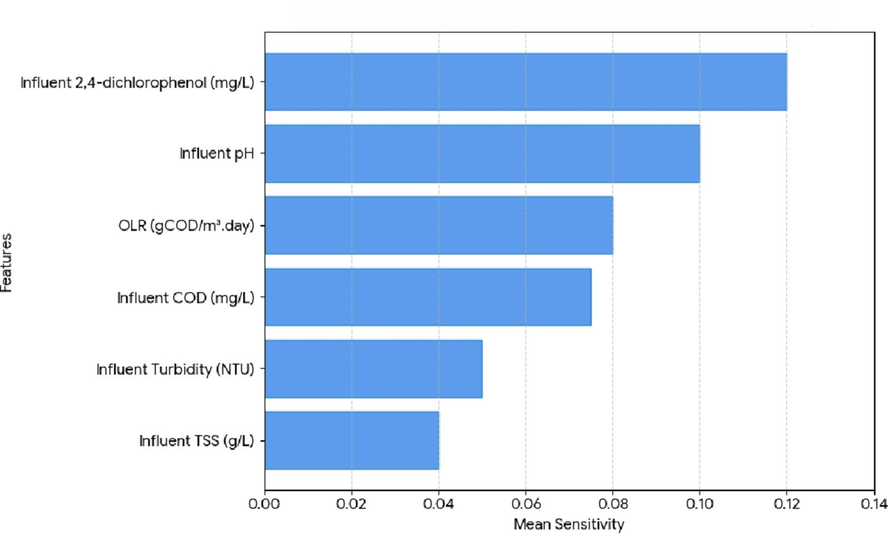
    - Nồng độ 2,4-DCP đạt chỉ số độ nhạy cao nhất, khẳng định là biến chi phối áp đảo
    - Chỉ số pH đứng vị trí thứ hai về mức độ ảnh hưởng đến dự đoán loại bỏ COD
    - Các thông số tải hữu cơ tổng thể gồm COD dòng vào và OLR có mức độ nhạy cảm trung bình
    - Tổng chất rắn lơ lửng TSS và độ đục ghi nhận điểm số độ nhạy thấp nhất trong mô hình
- Luận giải cơ chế sinh học đằng sau thứ bậc độ nhạy
  - Nồng độ 2,4-DCP là biến chi phối quan trọng nhất, khi biến thiên nồng độ có thể làm hiệu suất sụt giảm từ $90\%$ xuống dưới $70\%$
  - Giá trị pH đứng thứ hai phản ánh tính nhạy cảm nghiêm ngặt của hệ vi sinh vật methanogen đối với cân bằng acid - base
  - Các chỉ tiêu chất rắn lơ lửng có độ nhạy thấp nhất do quá trình lưu giữ màng đã tách biệt ảnh hưởng vật lý của hạt rắn khỏi động học sinh hóa hòa tan

### 3.4 Operational Implications and Fouling Risk Analysis

- Sự tách rời giữa hiệu suất xử lý sinh học và độ bền vững vận hành màng
  - Mô hình SVR chứng minh hiệu suất loại bỏ COD chịu sự chi phối chủ đạo của các yếu tố hóa sinh (pH và tải 2,4-DCP)
  - Biến tổng chất rắn lơ lửng (TSS) và độ đục thể hiện độ nhạy thấp trong mô hình dự đoán hiệu suất COD
  - Độ nhạy thấp của TSS trong dự đoán COD không đồng nghĩa với việc hạt chất rắn không quan trọng trong vận hành thực tế
  - Các thông số liên quan đến hạt chất rắn là tác nhân trực tiếp chi phối động lực tắc nghẽn màng và chi phí năng lượng
- Các cơ chế tuần tự và đan xen gây tắc nghẽn màng lọc trong hệ SAnMBR
  - **Hình 13. Sơ đồ cơ chế tắc nghẽn màng trong hệ SAnMBR dưới tải sốc phenolic**
    - 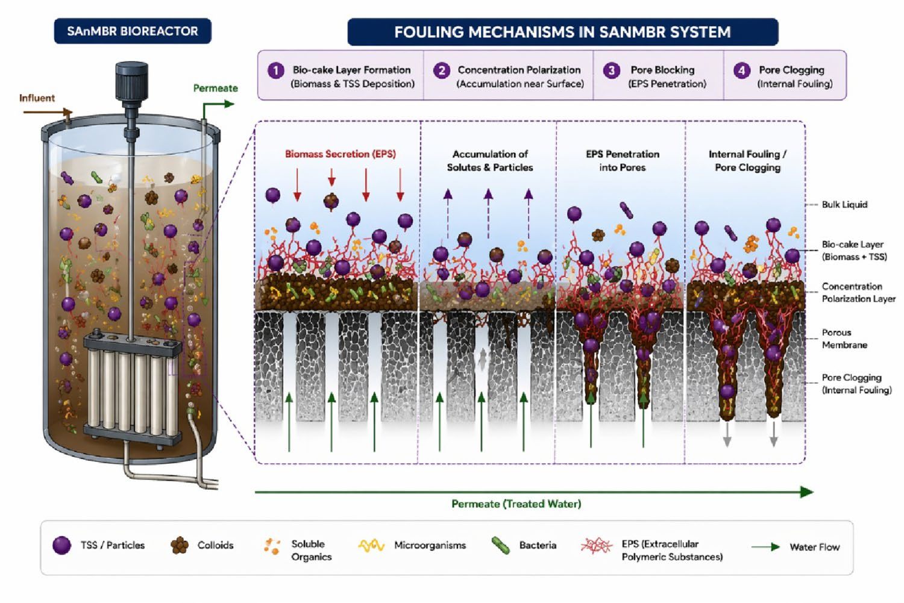
    - Tích tụ hạt lơ lửng và chất keo gây hiện tượng phân cực nồng độ trên bề mặt màng
    - Hình thành lớp bánh bùn sinh học ngoài gồm sinh khối vi sinh, TSS và mạng lưới polyme EPS
    - Các phân tử hữu cơ hòa tan thâm nhập gây bít tắc cục bộ và nghẽn sâu lòng lỗ màng
    - Gia tăng trở lực thủy lực dẫn tới leo thang áp suất qua màng TMP và rút ngắn chu kỳ rửa màng
- Động lực hình thành lớp bánh bùn và bít tắc lỗ màng (Pore Clogging)
  - Hiện tượng phân cực nồng độ ban đầu tạo điều kiện cho các hạt keo và sinh khối lắng đọng nhanh trên bề mặt sợi màng
  - Sự bài tiết chất polyme ngoại bào (EPS) dưới tác động của sốc độc phenolic gắn kết các hạt bùn tạo thành lớp bánh bùn sinh học đặc khít
  - Các phân tử chất vi sinh hòa tan (SMP) có kích thước nhỏ hơn đường kính lỗ màng thấm sâu gây nghẽn bên trong cấu trúc xốp
  - Sự gia tăng đột ngột trở lực lọc thủy lực buộc áp suất qua màng (TMP) tăng cao, làm tăng tần suất rửa ngược và tiêu hao hóa chất
- Yêu cầu chiến lược tối ưu hóa đa mục tiêu trong vận hành thực tế
  - Tối ưu hóa vận hành chỉ dựa trên chỉ số loại bỏ COD sẽ dẫn đến điểm vận hành rủi ro cao đối với tuổi thọ màng
  - Khi nồng độ hạt rắn vượt ngưỡng tới hạn, hệ thống chuyển dịch từ chế độ kiểm soát bằng hiệu suất sang chế độ kiểm soát bằng tắc nghẽn
  - Cần kiểm soát đồng thời tải trọng chất rắn lơ lửng và áp dụng sục khí sinh học phù hợp để duy trì tính bền vững kinh tế kỹ thuật

## 4 Conclusion

- Kết luận về năng lực mô hình hóa học máy dựa trên dữ liệu
  - Phương pháp mô hình hóa dựa trên dữ liệu đã nắm bắt chính xác các hành vi động học phi tuyến của hệ thống SAnMBR dưới các đợt sốc tải phenolic
  - Thuật toán SVR cung cấp công cụ dự đoán tin cậy về hiệu suất loại bỏ COD trong một quy trình sinh học kỵ khí có độ nhạy cảm cao
- Phát hiện bản chất cơ chế vận hành từ công cụ diễn giải mô hình
  - Hiệu suất xử lý chịu tác động tương hỗ mạnh mẽ giữa giá trị pH và nồng độ chất ức chế 2,4-DCP
  - Vận hành ổn định không chỉ phụ thuộc vào việc kiểm soát tải hữu cơ mà bắt buộc phải duy trì mức tích tụ độc chất dưới ngưỡng tới hạn
  - Sự suy giảm hiệu suất ở nồng độ 2,4-DCP cao gợi mở yêu cầu bắt buộc phải tiền xử lý, pha loãng hoặc thu hồi có chọn lọc hợp chất phenolic trước khi xử lý sinh học
- Phân tách cơ chế kiểm soát giữa phân hủy sinh học và vận hành màng
  - Quá trình phân hủy và loại bỏ COD chịu sự chi phối chủ yếu của các biến hóa sinh hòa tan trong bể
  - Động lực tắc nghẽn màng và độ ổn định cơ lý dài hạn chịu sự quyết định của các hạt chất rắn lơ lửng và sự tích tụ polyme ngoại bào
- Định hướng phát triển và triển khai kỹ thuật số trong tương lai
  - Tích hợp mô hình SVR vào hệ thống giám sát và điều khiển thời gian thực (real-time adaptive control) để tự động điều chỉnh độ kiềm pH và lưu lượng nạp chất độc
  - Bổ sung các chỉ số cảnh báo tắc nghẽn màng thực nghiệm gồm nồng độ EPS, SMP và độ chênh lệch áp suất qua màng (TMP)
  - Xây dựng khung tối ưu hóa đa mục tiêu cân bằng đồng thời giữa hiệu quả phân hủy sinh hóa và tuổi thọ vận hành kinh tế của màng lọc
- Đóng góp của các tác giả và tuyên bố nghiên cứu
  - Milad Mousazadehgavan chủ trì ý tưởng nghiên cứu, phương pháp luận, phát triển phần mềm và soạn thảo bản thảo ban đầu
  - B. Abdullhadi, Farideh Malekdar, Mahsa Shahi Jouneghani tham gia khảo sát thực nghiệm và phản biện chỉnh sửa
  - Milad Basirifard chịu trách nhiệm phân tích số liệu hình thức và phát triển phần mềm tính toán
  - Adel Kamyab Rudsari và Reza Ghanbari giám sát tổng thể dự án nghiên cứu và phê duyệt bản thảo cuối cùng
