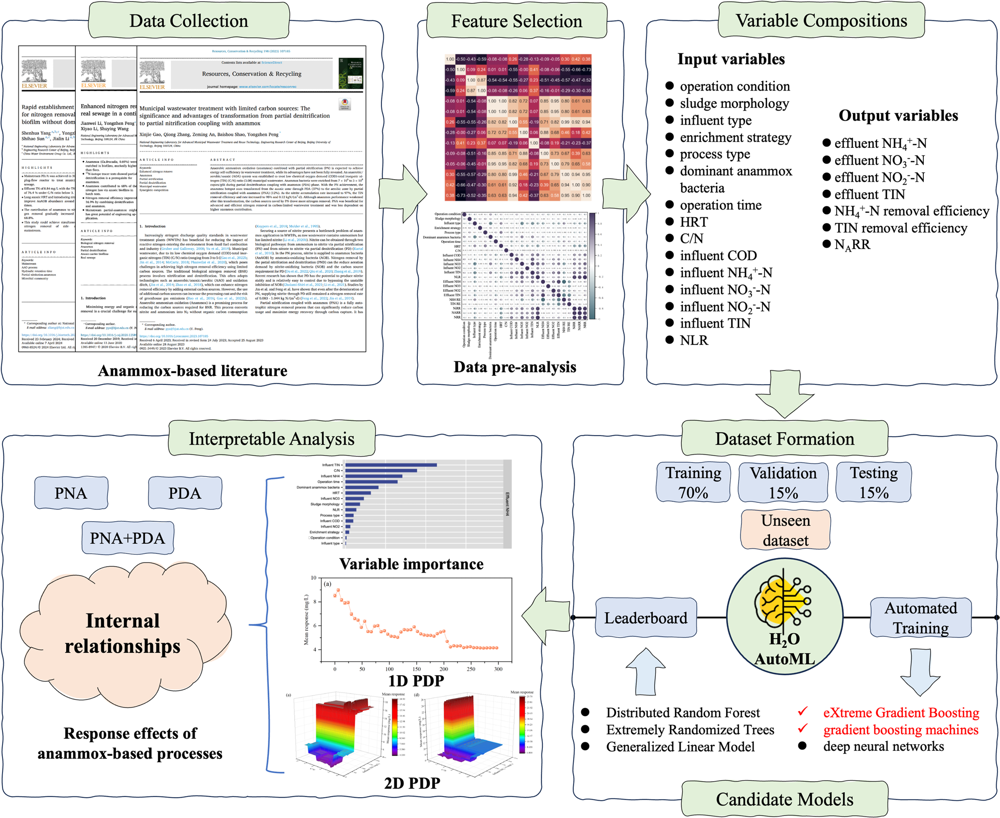
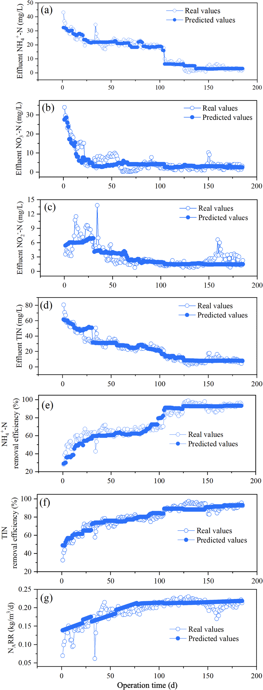
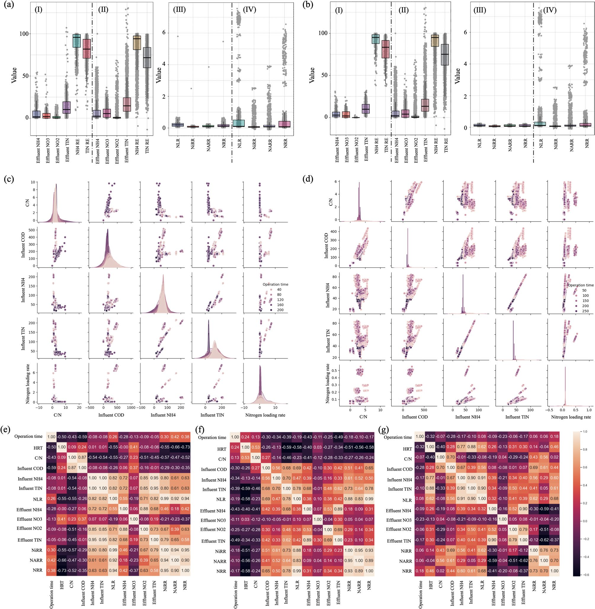
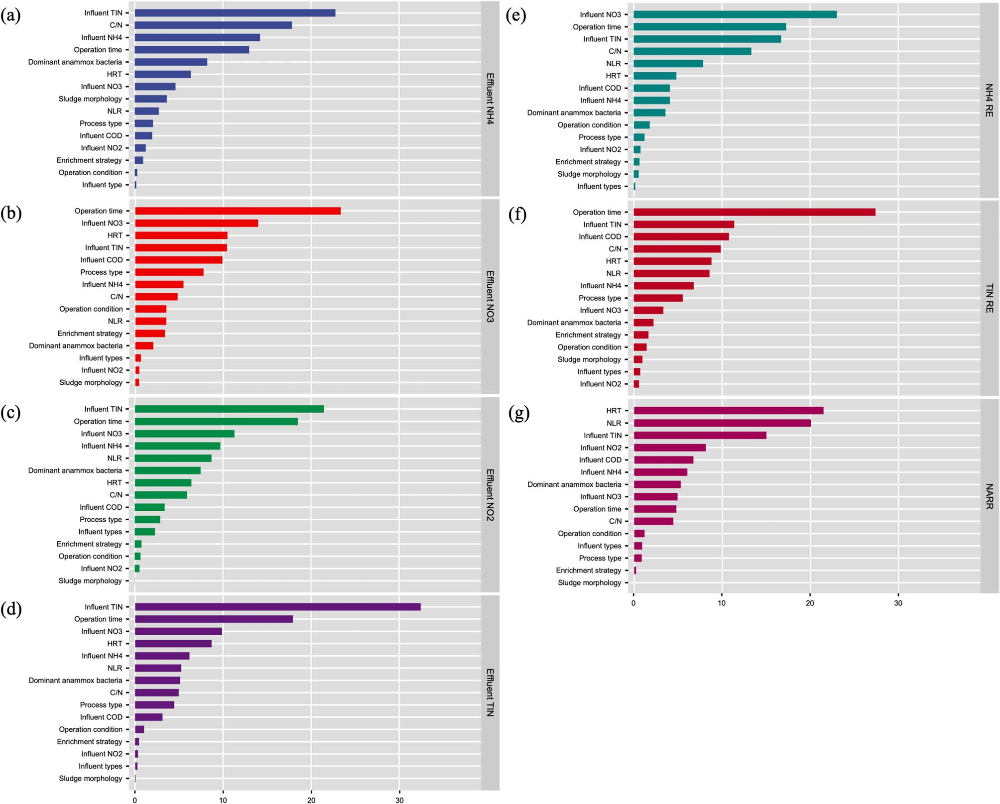
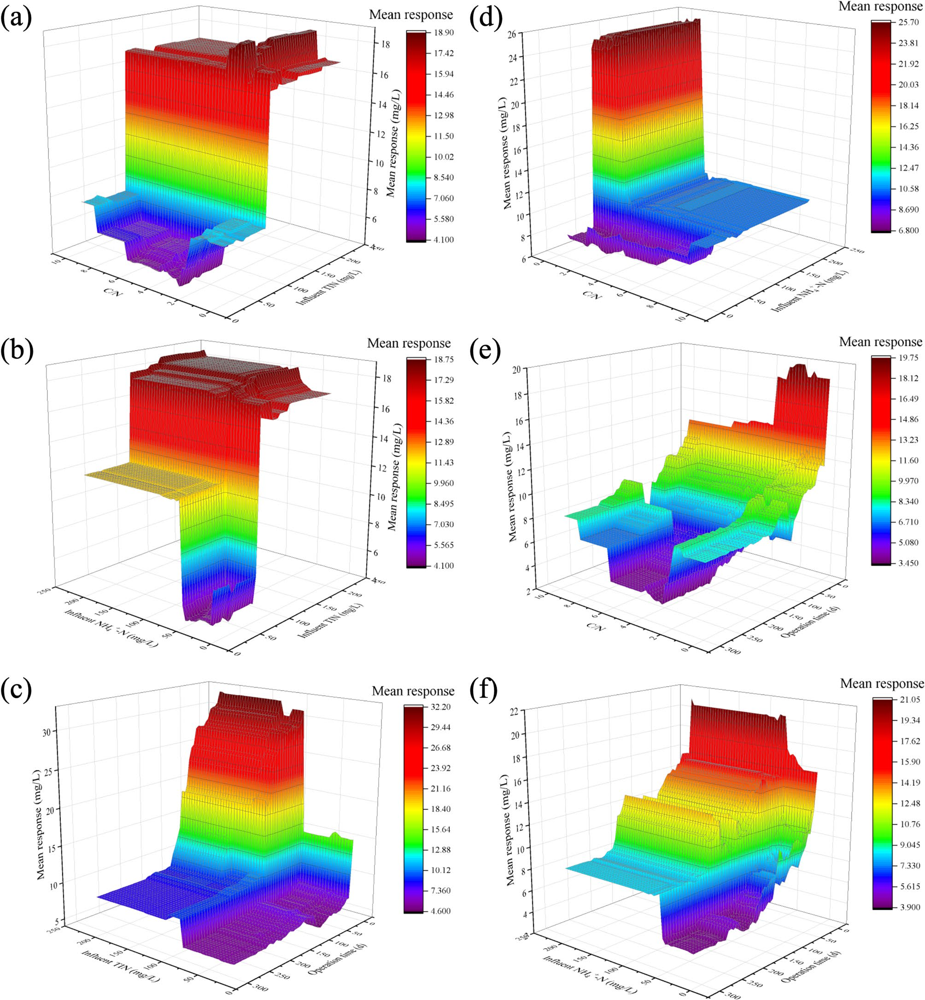

# Elucidating response effects of anammox-based nitrogen removal processes for municipal wastewater using big data analysis and automated machine learning

## Abstract

- Quy trình xử lý nước thải dựa trên công nghệ anammox (anammox-based processes) mang lại nhiều triển vọng trong việc cắt giảm phát thải carbon (reducing carbon emissions) và đang được nghiên cứu chuyên sâu:
  - Quá trình vận hành thực tế của các quy trình anammox dòng chính (mainstream anammox processes) vẫn còn gặp trở ngại do các chiến lược điều tiết bên ngoài (external regulation strategies) chưa rõ ràng.
- Nghiên cứu ứng dụng thuật toán học máy tự động (AutoML - automated machine learning) nền tảng H2O kết hợp phân tích có thể giải thích (interpretable analysis):
  - Khai phá các mối quan hệ nội tại (internal relationships) trong tập dữ liệu lớn (big dataset) thu thập từ các công trình nghiên cứu quy trình anammox xử lý nước thải đô thị (municipal wastewater).
  - Ứng dụng phân tích tổng hợp (meta-analysis) nhằm đánh giá hiệu quả loại bỏ nitơ (nitrogen removal efficiency).
- Các mô hình tăng cường độ dốc cực đại (XGBoost - eXtreme Gradient Boosting) và máy tăng cường độ dốc (GBM - gradient boosting machine) do thuật toán AutoML tự động thiết lập đạt độ chính xác dự đoán cao nhất:
  - Hệ số xác định đạt $R^2 = 0.814 - 0.993$.
  - Mô hình tối ưu thể hiện khả năng tổng quát hóa (generalization ability) tốt trên tập dữ liệu chưa từng thấy (unseen data) thu thập từ nghiên cứu này với $R^2 = 0.725 - 0.945$.
- Biểu đồ phụ thuộc một phần một chiều (1D-PDP - one-dimensional partial dependence plots) và hai chiều (2D-PDP - two-dimensional partial dependence plots) làm sáng tỏ khoảng thích hợp của các điều kiện vận hành và đặc tính dòng vào:
  - Xác định các khoảng thích hợp của điều kiện vận hành (operation conditions) và đặc tính nước thải đầu vào (influent characteristics).
  - Tương ứng với hiệu quả loại bỏ chất ô nhiễm nitơ cao (high removal efficiency of nitrogen pollutants) và tốc độ loại bỏ nitơ cao thông qua con đường phản ứng anammox (high nitrogen removal rate through the anammox reaction pathway).
- Nghiên cứu thúc đẩy hiểu biết khoa học về cách cải thiện quá trình vận hành thực tế của các quy trình khử nitơ dựa trên anammox dòng chính trong xử lý nước thải đô thị.

## Introduction

- Vấn đề eutrophication (phú dưỡng hóa nguồn nước) do phát thải quá mức $\text{N}$ (nitrogen / nitơ) và $\text{P}$ (phosphorus / phốt pho) là mối quan ngại toàn cầu trong thời gian dài.
- Conventional activated sludge (bùn hoạt tính truyền thống) là quy trình sinh học được sử dụng phổ biến nhất để loại bỏ nitrogen và phosphorus.
  - Quá trình loại bỏ nitơ thông qua nitrification (nitrat hóa) và denitrification (khử nitrat) bằng bùn hoạt tính truyền thống là quy trình tiêu tốn nhiều năng lượng (energy-intensive).
- Anammox (anaerobic ammonium oxidation / oxy hóa amoni kỵ khí) thu hút sự quan tâm ngày càng tăng nhờ các đặc tính vận hành:
  - Tiêu thụ năng lượng thấp (low energy consumption).
  - Tỷ lệ sinh bùn thấp (low sludge productivity).
  - Tốc độ loại bỏ nitơ cao (high nitrogen removal rate).
- Quy trình anammox sử dụng nitrite ($\text{NO}_2^-$) và ammonia ($\text{NH}_4^+$) làm cơ chất và oxy hóa trực tiếp thành $\text{N}_2$, khác biệt với quy trình nitrat hóa và khử nitrat hai bước truyền thống.
- Anammox là một trong những quy trình triển vọng nhất nhằm giảm chi phí vận hành cho các WWTPs (wastewater treatment plants / nhà máy xử lý nước thải):
  - Giảm $100\%$ nhu cầu carbon hữu cơ (organic carbon requirements).
  - Giảm khoảng $60\%$ năng lượng sục khí (aeration energy consumption).
  - Giảm khoảng $90\%$ sản lượng bùn sinh ra (sludge production).
- Nguồn cung cấp nitrite ổn định cho phản ứng anammox vẫn là một vấn đề cấp bách cần giải quyết.
  - Nhiều loại quy trình kết hợp đã được nghiên cứu sâu nhằm cung cấp nitrite ổn định:
    - Simultaneous nitrification, anammox and denitrification (nitrat hóa, anammox và khử nitrat đồng thời).
    - PNA (partial nitrification coupling with anammox / nitrit hóa từng phần kết hợp anammox).
    - PDA (partial denitrification coupling with anammox / khử nitrat từng phần kết hợp anammox).
    - Các quy trình phức hợp kết hợp đồng thời PNA và PDA.
- Việc ứng dụng các quy trình anammox cho mainstream wastewater (nước thải dòng chính) đối mặt với các nút thắt kỹ thuật:
  - Nồng độ nitơ thấp trong municipal wastewater (nước thải đô thị).
  - Nồng độ chất hữu cơ cao (high organic matter concentration).
  - Nhiệt độ nước thấp (low water temperature) vào mùa đông.
- Nhiều nỗ lực nghiên cứu đã được thực hiện để áp dụng anammox dòng chính thông qua điều chỉnh nhiều thông số vận hành:
  - Influent characteristics (đặc tính nước đầu vào).
  - Inoculation mode (phương thức cấy bùn vi sinh).
  - Temperature (nhiệt độ).
  - Reactor type (loại bể phản ứng).
  - Hydraulic retention time (thời gian lưu nước thủy lực / HRT).
- Khối lượng lớn dữ liệu thực nghiệm đã được tạo ra từ các nghiên cứu, nhưng tri thức nội tại (internal knowledge) về các quy trình loại bỏ nitơ sinh học dựa trên anammox vẫn cần được khai phá từ nguồn big data này.
- Thuật toán machine learning (học máy) nhận được sự chú ý ngày càng lớn nhờ năng lực nhận diện các mối quan hệ nội tại trong tập dữ liệu lớn và thiết lập các mô hình dự đoán.
  - Các phương pháp phân tích diễn giải và giải thích (explainable analysis and interpretable methods) được phát triển nhằm minh giải cơ chế hoạt động của mô hình học máy.
  - Các nghiên cứu tiền đề ứng dụng học máy vào quá trình xử lý dựa trên anammox:
    - Xu et al. (2022b) phân tích các hiệu ứng phản ứng của quá trình anammox trước các loại kháng sinh khác nhau thông qua mô hình học máy phổ quát ($R^2 > 0.9$).
    - Yang et al. (2023) tập trung nghiên cứu áp lực kim loại nặng (heavy metal stress) lên các quy trình anammox dựa trên mô hình học máy.
    - Liu et al. (2023a) khám phá phát thải $\text{N}_2\text{O}$ từ quy trình anammox, làm sáng tỏ mối quan hệ giữa phát thải $\text{N}_2\text{O}$ với các yếu tố vận hành và quần xã vi sinh vật (microbial communities) qua mô hình học máy và phân tích diễn giải.
  - Các công trình này chứng minh mô hình học máy đạt hiệu quả cao trong phân tích dữ liệu lớn cho các quy trình anammox.
- Hiệu ứng phản ứng (response effects) của hiệu suất xử lý nitơ đối với nhiều yếu tố vận hành trong các dạng quy trình anammox khác nhau vẫn chưa được làm rõ.
- Việc xây dựng mô hình học máy thủ công (manually) trong các nghiên cứu dữ liệu lớn trước đây về anammox tồn tại nhiều hạn chế:
  - Quá trình huấn luyện và tinh chỉnh (training and tuning) mô hình tiêu tốn chi phí thời gian đáng kể.
  - Độ chính xác của mô hình phụ thuộc nhiều vào kinh nghiệm của người thiết kế, dẫn đến tính reproducibility (khả năng tái lập) và độ ổn định (stability) kém.
- Thuật toán AutoML (automated machine learning / học máy tự động) được phát triển nhằm khắc phục các nhược điểm của phương pháp xây dựng mô hình thủ công.
- Nghiên cứu này ứng dụng thuật toán AutoML để dự đoán hiệu suất xử lý nitơ và diễn giải các response effects của quy trình anammox trước các yếu tố vận hành:
  - Dữ liệu từ các nghiên cứu anammox liên quan được phân tích để chọn lọc các biến đầu vào và biến đầu ra tiềm năng, cấu thành tập dữ liệu tích hợp phục vụ thuật toán H2O AutoML.
  - Các mô hình ứng viên do thuật toán H2O AutoML tạo ra cho $7$ biến đầu ra được so sánh và đánh giá.
  - Các thí nghiệm quy mô phòng thí nghiệm (lab-scale) được thực hiện để kiểm tra năng lực dự đoán của các mô hình ứng viên.
  - Phân tích diễn giải (interpretable analysis) được triển khai trên mô hình tối ưu nhằm làm rõ tác động của các biến đầu vào quan trọng lên các biến đầu ra.
  - Các phát hiện làm sáng tỏ những mối quan hệ quan trọng từng bị bỏ qua, tạo bước tiến cho việc cải thiện vận hành thực tế của các quy trình anammox dòng chính.

## Materials and methods

### Data sources and analysis methods
- Thu thập dữ liệu từ y văn thông qua tìm kiếm trên cơ sở dữ liệu Web of Science nhằm làm sáng tỏ các mối quan hệ nội tại giữa các yếu tố trong quy trình khử nitơ dựa trên anammox (anammox-based nitrogen removal processes):
  - Các từ khóa tìm kiếm bao gồm: "Anaerobic ammonia oxidation", "mainstream anammox", "municipal wastewater", "partial nitrification", và "partial denitrification".
  - Tuyển chọn được $28$ nghiên cứu đáp ứng tiêu chí chứa đầy đủ và nhất quán các biến số liên quan đến quy trình anammox (Table S9).
  - So sánh với nghiên cứu phân tích gộp (meta-analysis) của Liu et al. (2020) thu thập dữ liệu từ $62$ nghiên cứu nhưng chưa xét đến các thông số vận hành như thời gian lưu thủy lực ($\text{HRT}$) và tải trọng nạp nitơ ($\text{NLR}$) vốn được sử dụng làm biến đầu vào trong nghiên cứu này.
- Tập dữ liệu tổng hợp gồm $2940$ mẫu từ các loại quy trình anammox khác nhau được thu thập và số hóa bằng phần mềm Origin:
  - $1927$ mẫu thuộc quy trình khử nitrat một phần kết hợp anammox ($\text{PDA}$).
  - $282$ mẫu thuộc quy trình nitrat hóa một phần kết hợp anammox ($\text{PNA}$).
  - $731$ mẫu thuộc quy trình kết hợp cả $\text{PDA}$ và $\text{PNA}$.
- Hệ thống biến số then chốt được phân loại và quản lý (Table S1):
  - Điều kiện vận hành ($\text{operation condition}$): vận hành mẻ nối tiếp ($\text{sequencing batch}$) hoặc dòng liên tục ($\text{continuous flow}$).
  - Hình thái bùn ($\text{sludge morphology}$): bùn bông ($\text{floc}$) hoặc bùn hạt kết tụ ($\text{aggregates}$).
  - Loại nước thải đầu vào ($\text{influent type}$): nước thải tổng hợp ($\text{synthetic wastewater}$) hoặc nước thải sinh hoạt đô thị ($\text{municipal wastewater}$).
  - Chiến lược làm giàu vi sinh ($\text{enrichment strategy}$): tự làm giàu ($\text{self-enrichment}$) hoặc cấy giống vi sinh ($\text{inoculation}$).
  - Loại quy trình anammox ($\text{anammox-based process type}$): $\text{PNA}$, $\text{PDA}$, hoặc $\text{PNA}$ kết hợp $\text{PDA}$.
  - Chi vi khuẩn anammox chiếm ưu thế ($\text{genera of dominant anammox bacteria}$).
  - Thời gian vận hành ($\text{operation time}$): tính theo ngày ($\text{d}$).
  - Thời gian lưu thủy lực ($\text{HRT}$): tính theo giờ ($\text{h}$).
  - Tỷ lệ carbon trên nitơ ($\text{C/N}$).
  - Các chỉ tiêu nước thải đầu vào: nhu cầu oxy hóa học ($\text{COD}$, $\text{mg/L}$), $\text{NH}_4^+-\text{N}$ ($\text{mg/L}$), $\text{NO}_3^--\text{N}$ ($\text{mg/L}$), $\text{NO}_2^--\text{N}$ ($\text{mg/L}$), và tổng nitơ vô cơ ($\text{TIN}$, $\text{mg/L}$).
  - Các chỉ tiêu nước thải đầu ra: $\text{NH}_4^+-\text{N}$ ($\text{mg/L}$), $\text{NO}_3^--\text{N}$ ($\text{mg/L}$), $\text{NO}_2^--\text{N}$ ($\text{mg/L}$), và $\text{TIN}$ ($\text{mg/L}$).
- Tính toán $6$ chỉ số toán học mô tả hiệu năng xử lý theo các công thức quy định tại Supporting Information (Text S1 [25]):
  - Tải trọng nạp nitơ: $\text{NLR}$ ($\text{kg/m}^3/\text{d}$).
  - Hiệu suất loại bỏ amoni: $\text{NH}_4^+-\text{N}$ removal efficiency ($\%$).
  - Hiệu suất loại bỏ tổng nitơ vô cơ: $\text{TIN}$ removal efficiency ($\%$).
  - Tốc độ phản ứng nitrat hóa bởi vi khuẩn oxy hóa amoniac ($\text{AOB}$): $\text{NiRR}$ ($\text{nitrification reaction rate by ammonia oxidation bacteria}$).
  - Tốc độ loại bỏ nitơ qua con đường phản ứng anammox: $\text{NARR}$ ($\text{nitrogen removal rate through the anammox reaction pathway}$).
  - Tốc độ loại bỏ nitơ tổng thể: $\text{NRR}$ ($\text{nitrogen removal rate}$).
- Phân tích sơ bộ mối quan hệ giữa các biến số thông qua biểu đồ hộp ($\text{box plots}$), phân tích dữ liệu khám phá ($\text{EDA}$ - Exploratory Data Analysis), và hệ số tương quan tích - mômen Pearson ($\text{PPMC}$ - Pearson product-moment correlation coefficient [22]).

### Model development and optimization
- Tuyển chọn tổng cộng $24$ biến từ tài liệu để làm các biến đầu vào và biến đầu ra cho các mô hình học máy hồi quy (regression machine learning models):
  - $6$ biến định tính dạng phân loại ($\text{categorical objects}$, Table S1): điều kiện vận hành, hình thái bùn, loại nước thải đầu vào, chiến lược làm giàu vi sinh, loại quy trình anammox, và chi vi khuẩn anammox chiếm ưu thế.
  - $15$ biến đầu vào tùy chọn ($\text{optional input variables}$): điều kiện vận hành, hình thái bùn, loại nước thải đầu vào, chiến lược làm giàu, loại quy trình, vi khuẩn anammox chiếm ưu thế, thời gian vận hành, $\text{HRT}$, $\text{C/N}$, $\text{COD}$ đầu vào, $\text{NH}_4^+-\text{N}$ đầu vào, $\text{NO}_3^--\text{N}$ đầu vào, $\text{NO}_2^--\text{N}$ đầu vào, $\text{TIN}$ đầu vào, và $\text{NLR}$.
  - $7$ biến đầu ra mục tiêu được dự đoán độc lập nhằm xác định mối quan hệ riêng biệt giữa các biến đầu vào với từng biến đầu ra: $\text{NH}_4^+-\text{N}$ đầu ra, $\text{NO}_3^--\text{N}$ đầu ra, $\text{NO}_2^--\text{N}$ đầu ra, $\text{TIN}$ đầu ra, hiệu suất khử $\text{NH}_4^+-\text{N}$, hiệu suất khử $\text{TIN}$, và $\text{NARR}$.
  - Lựa chọn các biến đầu vào dựa trên kết quả phân tích tương quan $\text{PPMC}$ nhằm loại bỏ hiện tượng đa cộng tuyến (multicollinearity) và giữ lại các đặc trưng có tương quan cao với biến đầu ra (Fig. S1 [29]).
- Phân chia ngẫu nhiên $2940$ mẫu dữ liệu thành ba tập con nhằm giảm thiểu sai số dự đoán và tránh hiện tượng không hội tụ dữ liệu:
  - Tập huấn luyện ($\text{training dataset}$): chiếm $70\,\%$ ($2070$ mẫu).
  - Tập kiểm thực ($\text{validation dataset}$): chiếm $15\,\%$.
  - Tập kiểm tra ($\text{testing dataset}$): chiếm $15\,\%$.
  - Tỷ số giữa kích thước mẫu huấn luyện và số lượng đặc trưng ($\text{SFR}$ - sample-size to feature-size ratio) đạt $138$ ($2070$ mẫu huấn luyện chia cho $15$ biến đầu vào), thỏa mãn ngưỡng $\text{SFR} \ge 100$ đảm bảo độ tin cậy và tiềm năng học máy cao [19, 29].
  - Quá trình chuẩn hóa giá trị số (theo giá trị trung bình $\text{mean}$ và độ lệch chuẩn $\text{standard deviation}$) được tích hợp sẵn trong nền tảng H2O AutoML.
- Quy trình thiết lập mô hình tự động và tối ưu hóa trên nền tảng H2O AutoML (Text S2):
  - Tự động tối ưu hóa và so sánh nhiều thuật toán học máy gồm: Distributed Random Forest ($\text{DRF}$), Extremely Randomized Trees ($\text{XRT}$), Generalized Linear Model có chuẩn hóa ($\text{GLM with regularization}$), eXtreme Gradient Boosting ($\text{XGBoost}$), Gradient Boosting Machines ($\text{GBM}$), và mạng nơ-ron sâu ($\text{deep neural networks}$) để xây dựng bảng xếp hạng mô hình ($\text{modeling leaderboard}$) (Fig. 1).
    - **Hình 1.** Sơ đồ quy trình AutoML phân tích dữ liệu lớn hệ thống anammox
      - 
      - **Hình này chứng minh điều gì**
        - Khung tích hợp liên kết từ thu thập dữ liệu, phân chia tập mẫu ($70\,\%$, $15\,\%$, $15\,\%$), huấn luyện $6$ họ thuật toán đến giải thích mô hình qua PDP.
      - **Từ đâu mà thấy được**
        - Luồng mũi tên từ Data Collection qua Feature Selection, Variable Compositions sang Dataset Formation, nạp vào H2O AutoML để xuất Leaderboard và Interpretable Analysis.
        - Khối Candidate Models đánh dấu tích đỏ tại eXtreme Gradient Boosting và gradient boosting machines thể hiện hai thuật toán tối ưu được lựa chọn.
  - Ứng dụng kết hợp tìm kiếm ngẫu nhiên nhanh ($\text{fast random search}$) và kiểm thực chéo $5$ nếp ($\text{fivefold cross-validation}$) nhằm gia tăng tốc độ huấn luyện và nâng cao hiệu năng mô hình.
  - Cấu hình giới hạn tài nguyên của H2O AutoML: số lượng mô hình tối đa là $200$ và thời gian chạy tối đa là $900\text{ s}$ (tiến trình AutoML dừng lại ngay khi chạm một trong hai ngưỡng giới hạn).
  - Thiết lập $5$ giá trị hạt giống ngẫu nhiên ($\text{seeds}$) khác nhau cho việc phân chia dữ liệu nhằm kiểm soát sự chênh lệch hiệu năng dự báo phát sinh từ cách chia tập mẫu.
  - Đánh giá hiệu năng tốt nhất trên tập huấn luyện, kiểm thực và kiểm tra của các mô hình ứng viên thông qua sai số tuyệt đối trung bình ($\text{MAE}$ - Mean Absolute Error) và hệ số xác định ($R^2$ - Coefficient of Determination).

### Experimental validation of candidate models
- Kiểm chứng hiệu năng của các mô hình ứng viên bằng tập dữ liệu thực nghiệm độc lập chưa từng được học ($\text{unseen experimental dataset}$) gồm $185$ mẫu:
  - Các mô hình ứng viên gồm $\text{DRF}$, $\text{XRT}$, $\text{XGBoost}$, $\text{GBM}$, $\text{Generalized Linear Model}$, và $\text{deep neural networks}$ được huấn luyện trên cùng một tập dữ liệu huấn luyện ($2070$ mẫu) và cùng được kiểm tra trên tập thực nghiệm độc lập này.
- Thiết lập hệ thống thực nghiệm bể phản ứng dòng chảy ngược qua lớp bùn kỵ khí ($\text{UASB}$ - Up-flow Anaerobic Sludge Blanket) vận hành quy trình $\text{PDA}$ nhằm khảo sát hiệu năng $\text{PDA}$ dưới các tỷ lệ $\text{C/N}$ khác nhau:
  - Thể tích làm việc của bể phản ứng: $5.72\text{ L}$.
  - Hỗn hợp bùn cấy giống: phối trộn bùn bông $\text{PD}$ (từ bể phản ứng $\text{PD}$ vận hành dài hạn dùng glycerol) và bùn hạt anammox trưởng thành (từ bể phản ứng $\text{UASB anammox}$) theo tỷ lệ sinh khối $1:5$ rồi cấy vào bể $\text{PDA UASB}$.
  - Nước thải đầu vào: chuẩn bị bằng nước thải tổng hợp ($\text{synthetic wastewater}$).
  - Điều kiện vận hành: duy trì nhiệt độ phản ứng ở $35\,^\circ\text{C}$ bằng bể ổn nhiệt, thời gian lưu thủy lực ($\text{HRT}$) cố định ở $4\text{ h}$.
  - Các biến phân loại của thực nghiệm được tóm tắt tại Table S9.
- Bể phản ứng $\text{PDA UASB}$ vận hành liên tục trong $185\text{ d}$ qua $6$ giai đoạn với các điều kiện nước thải đầu vào biến thiên (Table S10):
  - Phương pháp đo đạc: nồng độ các dạng nitơ trong các mẫu nước được đo theo Tiêu chuẩn Phương pháp Thử nghiệm Chuẩn ($\text{Standard Methods}$).
  - Biến thiên hiệu năng xử lý của thực nghiệm gồm $\text{NH}_4^+-\text{N}$, $\text{NO}_3^--\text{N}$, $\text{NO}_2^--\text{N}$, $\text{TIN}$ dòng ra, hiệu suất khử $\text{NH}_4^+-\text{N}$, hiệu suất khử $\text{TIN}$ và $\text{NARR}$ được đối chiếu trực tiếp giữa giá trị thực tế và giá trị mô hình dự báo (Fig. 5).
    - **Hình 5.** So sánh giá trị dự báo và thực tế trên tập thực nghiệm
      - 
      - **Hình này chứng minh điều gì**
        - Các mô hình tối ưu theo sát diễn biến động học thực tế của $7$ chỉ tiêu nitơ xuyên suốt $185\text{ d}$ vận hành qua $6$ giai đoạn biến thiên điều kiện đầu vào.
      - **Từ đâu mà thấy được**
        - Trục hoành $Ox$: Operation time ($\text{d}$), từ $0$ đến $200\text{ d}$; điểm thực tế (vòng tròn rỗng) và dự báo (chấm đặc) bám sát nhau.
        - Bảng (a)-(d): Trục tung $Oy$ đo nồng độ dòng ra ($\text{mg/L}$) của $\text{NH}_4^+-\text{N}$ ($0-50$), $\text{NO}_3^--\text{N}$ ($0-35$), $\text{NO}_2^--\text{N}$ ($0-15$), $\text{TIN}$ ($0-80$).
        - Bảng (e)-(g): Trục tung $Oy$ đo hiệu suất khử $\text{NH}_4^+-\text{N}$ ($20-100\,\%$, e), hiệu suất khử $\text{TIN}$ ($20-100\,\%$, f) và $\text{NARR}$ ($0.05-0.25\text{ kg/m}^3/\text{d}$, g).

### Interpretable analysis
- Sử dụng các phương pháp giải thích mô hình (interpretable methods) gồm độ quan trọng của biến ($\text{variable importance}$), biểu đồ phụ thuộc một phần một chiều ($1\text{D PDP}$) và hai chiều ($2\text{D PDP}$) để phân tích các mô hình ứng viên tối ưu do thuật toán AutoML tạo ra cho từng biến đầu ra:
  - Độ quan trọng của biến ($\text{variable importance}$): tính toán tầm quan trọng của các đặc trưng mẫu và mô tả định lượng mức đóng góp của từng đặc trưng đối với bài toán phân loại hoặc hồi quy.
  - Biểu đồ phụ thuộc một phần ($\text{PDP}$): biểu diễn mối quan hệ hàm số giữa một hoặc hai biến đặc trưng ($1\text{D PDP}$ hoặc $2\text{D PDP}$) tác động lên kết quả dự đoán của mô hình.
  - Nguyên lý hoạt động của $2\text{D PDP}$: thay đổi đồng thời giá trị của hai đặc trưng được chọn trong khi cố định giá trị của tất cả các đặc trưng còn lại, sau đó tính toán kết quả dự đoán để thể hiện tác động kết hợp ($\text{combined effect}$) của hai biến lên đầu ra.
  - Nền tảng thực thi: các phân tích giải thích mô hình được thực hiện trực tiếp trên giao diện dòng chảy Flow UI của nền tảng H2O AutoML (`https://h2o-release.s3.amazonaws.com/h2o/rel-3.46.0/6/docs-website/h2o-docs/flow.html`).

## Results and discussion

### Statistical analysis of anammox-based nitrogen removal processes

- Phân tích thống kê bằng biểu đồ hộp (box plots), phân tích khám phá dữ liệu (Exploratory Data Analysis - EDA) và hệ số tương quan tích - mômen Pearson (Pearson product-moment correlation coefficient - PPMC) được áp dụng để làm rõ đặc tính dữ liệu thu thập từ các quy trình dựa trên anammox (anammox-based processes) (Fig. 2):
  - Bộ dữ liệu bao gồm $2940$ mẫu dữ liệu (samples) được thu thập từ $28$ nghiên cứu khảo sát các dạng quy trình dựa trên anammox khác nhau và áp dụng các điều kiện vận hành khác nhau.
  - Phân bố dữ liệu thể hiện qua biểu đồ hộp ghi nhận các giá trị ngoại lai (outliers) ở tất cả các nhóm, phản ánh sự sai lệch đáng kể đôi khi xuất hiện giữa các thí nghiệm khác nhau.
  - Các thí nghiệm theo mẻ nối tiếp (sequencing batch experiments) đạt hiệu quả khử nitơ vô cơ tổng (total inorganic nitrogen removal efficiency - TIN removal efficiency) với trung vị ($\text{median}$) là $78.18\,\%$, cao hơn so với mức $\text{median} = 74.81\,\%$ của các thí nghiệm dòng chảy liên tục (continuous flow experiments) (Fig. 2(a)).
  - Các thí nghiệm theo mẻ nối tiếp duy trì độ ổn định cao hơn đối với tốc độ tải nitơ (nitrogen loading rate - NLR), tốc độ phản ứng nitrit hóa bởi vi khuẩn oxy hóa amoniac (nitrification reaction rate by ammonia-oxidizing bacteria - NiRR), tốc độ khử nitơ qua con đường phản ứng anammox (nitrogen removal rate through anammox reaction pathway - NARR) và tốc độ khử nitơ (nitrogen removal rate - NRR).
  - Tải trọng và tốc độ phản ứng cực cao được ghi nhận trong nghiên cứu của Du et al. (2016) [35] và Wang et al. (2024b) [36], gồm $\text{NLR}$ đạt $2.91\text{--}7.55\,\text{kg N/m}^3\text{/d}$, $\text{NiRR}$ đạt $0.33\text{--}2.53\,\text{kg N/m}^3\text{/d}$, $\text{NARR}$ đạt $0.02\text{--}3.92\,\text{kg N/m}^3\text{/d}$ và $\text{NRR}$ đạt $2.63\text{--}6.55\,\text{kg N/m}^3\text{/d}$.
  - Nguyên nhân dẫn đến các giá trị tốc độ cực cao trên xuất phát từ nồng độ nitơ đầu vào cao và thời gian lưu thủy lực (hydraulic retention time - HRT) ngắn trong bể phản ứng kỵ khí dòng chảy ngược qua tầng bùn (upflow anaerobic sludge blanket reactor - UASB) và bể bùn hạt mở rộng (expanded granular sludge bed reactor) vận hành theo chế độ dòng chảy liên tục.
  - Xu hướng khác biệt tương tự về phân bố và hiệu suất cũng được ghi nhận khi so sánh giữa các thí nghiệm bùn dạng bông (floc experiments) và bùn hạt/kết tụ (aggregate experiments) (Fig. 2(b)).
  - Tốc độ tải nitơ $\text{NLR}$ cao trong các bể phản ứng dòng chảy liên tục vận hành bằng bùn hạt chứng minh tiềm năng lớn của cấu hình này trong xử lý nước thải chứa nồng độ nitơ cao [37,38].
  - **Hình 2.** Phân tích thống kê các quy trình khử nitơ dựa trên anammox
    - 
    - **Hình này chứng minh điều gì**
      - Trực quan hóa đặc tính phân bố dữ liệu theo chế độ vận hành (a, b), không gian biến đầu vào giữa nước thải tổng hợp và nước thải đô thị (c, d), cùng cấu trúc tương quan tuyến tính giữa ba công nghệ anammox (e, f, g).
    - **Từ đâu mà thấy được**
      - (a, b): Biểu đồ hộp so sánh hiệu quả khử $\text{TIN}$ và các tốc độ phản ứng ($\text{NLR}, \text{NiRR}, \text{NARR}, \text{NRR}$) giữa mẻ nối tiếp/dòng chảy liên tục và bùn bông/bùn hạt.
      - (c, d): Ma trận EDA $5$ biến ($\text{C/N}$, $\text{COD}$, $\text{NH}_4^+\text{-N}$, $\text{TIN}$, $\text{NLR}$) theo thời gian vận hành cho thấy nước thải đô thị phân tán rộng hơn nước thải tổng hợp.
      - (e, f, g): Bản đồ nhiệt PPMC thể hiện PNA có tương quan dương giữa thông số đầu vào và đầu ra mạnh nhất ($0.55\text{--}0.95$), cao hơn so với PDA và PNA kết hợp PDA.
- So sánh giữa nước thải tổng hợp (synthetic wastewater) và nước thải đô thị (municipal wastewater):
  - Đặc tính nước đầu ra (effluent properties) tương tự nhau giữa hai loại nước thải (Fig. S1(a)).
  - Các thí nghiệm sử dụng nước thải đô thị có các giá trị $\text{NLR}$, $\text{NiRR}$, $\text{NARR}$ và $\text{NRR}$ ổn định hơn (Fig. S1(b)), cho thấy đặc tính đầu vào của nước thải đô thị tương đồng giữa các nghiên cứu khác nhau [39-42].
  - Nước thải tổng hợp được sử dụng trong các nghiên cứu khác nhau có khoảng nồng độ đầu vào rộng hơn đối với $\text{COD}$, $\text{NH}_4^+\text{-N}$ và $\text{NO}_3^-\text{-N}$ [35,36,43,44].
  - Phân tích khám phá dữ liệu (EDA) về phân bố đặc tính đầu vào của hai loại nước thải (Fig. 2(c) và (d)):
    - Biểu đồ Fig. 2(d) thể hiện các điểm dữ liệu phân bố trên các vùng rộng hơn ở các tương quan giữa tỷ lệ $\text{C/N}$ với $\text{NH}_4^+\text{-N}$ đầu vào, $\text{C/N}$ với $\text{TIN}$ đầu vào, $\text{COD}$ đầu vào với $\text{NH}_4^+\text{-N}$ đầu vào, và $\text{COD}$ đầu vào với $\text{TIN}$ đầu vào.
    - Điều này chỉ ra rằng các biến đầu vào của nước thải tổng hợp tập trung hơn và ít biến động hơn (less flocculation) so với nước thải đô thị.
  - Trên thực tế, nồng độ các chất ô nhiễm trong nước thải thực tế thường biến động mạnh [45,46], do đó các nghiên cứu sử dụng nước thải tổng hợp cần xem xét thành phần thực và độ biến động thực tế của nước thải đô thị.
- Phân tích sai khác và tương quan theo ba cấu hình quy trình dựa trên anammox:
  - Dữ liệu giữa các dạng quy trình gồm nitrit hóa từng phần kết hợp anammox (partial nitritation/anammox - PNA), khử nitrat từng phần kết hợp anammox (partial denitrification/anammox - PDA), và quy trình kết hợp PNA với PDA thể hiện sự khác biệt rõ rệt (Fig. S2).
  - Hiệu quả khử $\text{TIN}$ trong các thí nghiệm PNA và PNA kết hợp PDA cao hơn so với các thí nghiệm chỉ áp dụng PDA (Fig. S2(a)).
  - Ở cả ba dạng quy trình, nồng độ đầu ra $\text{NH}_4^+\text{-N}$, $\text{NO}_2^-\text{-N}$ và $\text{TIN}$ đều có tương quan thuận với $\text{NH}_4^+\text{-N}$ đầu vào, $\text{TIN}$ đầu vào và $\text{NLR}$.
  - Mối tương quan thuận mạnh nhất, với hệ số trong khoảng $0.55\text{--}0.95$, được ghi nhận ở các thí nghiệm PNA (Fig. 2(e), (f) và (g)).
  - Khác với quy trình PDA, việc vận hành quy trình PNA đòi hỏi ức chế hoạt tính của vi khuẩn oxy hóa nitrit (nitrite-oxidizing bacteria - NOB) và tăng cường hoạt tính của vi khuẩn oxy hóa amoniac (ammonia-oxidizing bacteria - AOB) [47].
  - Hoạt tính của NOB và AOB chịu ảnh hưởng sâu sắc từ nồng độ các cơ chất như $\text{NO}_2^-\text{-N}$, $\text{NH}_4^+\text{-N}$ và $\text{COD}$ [48,49], giải thích nguyên nhân dẫn đến mối tương quan chặt chẽ hơn giữa các biến đầu vào và đầu ra trong PNA.
- Tương quan giữa các biến tốc độ phản ứng và thành phần nitơ đầu vào:
  - Các tốc độ $\text{NiRR}$, $\text{NARR}$ và $\text{NRR}$ có tương quan mạnh với các biến trực tiếp tham gia vào công thức tính toán của chúng (Text S1).
  - $\text{NH}_4^+\text{-N}$ đầu vào và $\text{TIN}$ đầu vào thể hiện mối quan hệ từng cặp rất tương đồng với các biến khác, do hàm lượng $\text{NH}_4^+\text{-N}$ ở mức rất cao trong cả nước thải tổng hợp lẫn nước thải đô thị.
  - Trong nước thải đô thị thực tế, $\text{NH}_4^+\text{-N}$ thường chiếm hơn $90\,\%$ tổng lượng $\text{TIN}$ đầu vào [42,50].
- Đánh giá hiện tượng đa cộng tuyến và lựa chọn biến đầu vào cho mô hình học máy:
  - Ma trận PPMC cho toàn bộ các biến định tính và định lượng trên toàn bộ tập dữ liệu (Fig. S3) ghi nhận mối quan hệ từng cặp mạnh giữa loại nước thải đầu vào với loài vi khuẩn anammox ưu thế, $\text{NO}_3^-\text{-N}$ đầu vào cũng như $\text{TIN}$ đầu vào, làm rõ sự khác biệt giữa hai loại nước thải.
  - Ngoại trừ cặp biến $\text{NH}_4^+\text{-N}$ đầu vào và $\text{TIN}$ đầu vào, không xuất hiện mối quan hệ tuyến tính mạnh nào khác giữa các biến đầu vào tiềm năng.
  - Các biến đầu vào này đủ điều kiện được sử dụng làm biến đặc trưng đầu vào để xây dựng các mô hình học máy (machine learning models) nhờ không tồn tại hiện tượng đa cộng tuyến tiềm ẩn (lack of potential multicollinearity) [19].
  - Mối quan hệ phức tạp giữa các biến tham gia vào quy trình khử nitơ dựa trên anammox cần được tiếp tục làm rõ thông qua các mô hình hướng dữ liệu (data-driven models) và các phương pháp giải thích được (interpretable methods).

### Predicting nitrogen removal performance in literature-based anammox processes

- Dựa trên phân tích tương quan từng cặp (pairwise correlation analysis, Fig. S3), toàn bộ $15$ biến bao gồm $6$ biến phân loại (categorical variables) và $9$ biến số trị (numerical variables) được lựa chọn làm các biến đầu vào để dự đoán độc lập từng biến trong số $7$ biến đầu ra của quy trình anammox:
  - Bảy biến mục tiêu đầu ra được mô hình hóa riêng biệt gồm: $\text{NH}_4^+ \text{-N}$ đầu ra (effluent $\text{NH}_4^+ \text{-N}$), $\text{NO}_3^- \text{-N}$ đầu ra (effluent $\text{NO}_3^- \text{-N}$), $\text{NO}_2^- \text{-N}$ đầu ra (effluent $\text{NO}_2^- \text{-N}$), tổng nitơ vô cơ đầu ra (effluent $\text{TIN}$), hiệu suất loại bỏ $\text{NH}_4^+ \text{-N}$ ($\text{NH}_4^+ \text{-N}$ removal efficiency), hiệu suất loại bỏ $\text{TIN}$ ($\text{TIN}$ removal efficiency), và tốc độ loại bỏ nitơ qua con đường anammox ($\text{NARR}$).
  - Tập $15$ biến đầu vào này được lựa chọn do không tồn tại đa cộng tuyến tiềm ẩn (lacked potential multicollinearity).
- Các mô hình dạng GBM (GBM-like models, bao gồm Gradient Boosting Machine: GBM và XGBoost) thể hiện lợi thế nổi bật trong việc dự đoán toàn bộ $7$ biến đầu ra:
  - Bảng 1 (Table 1) và phần Thông tin bổ sung (Supporting Information) tóm tắt hiệu suất tối ưu và cấu hình mô hình tốt nhất đối với từng biến mục tiêu qua thuật toán H2O AutoML với $5$ hạt phân chia dữ liệu (five data splitting seeds):
    - Đối với effluent $\text{NH}_4^+ \text{-N}$: Mô hình tối ưu là GBM, đạt Training $\text{MAE} = 0.171$, Training $R^2 = 0.994$, Validation $\text{MAE} = 1.951$, Validation $R^2 = 0.914$, Testing $\text{MAE} = 1.889$, Testing $R^2 = 0.928$.
    - Đối với effluent $\text{NO}_3^- \text{-N}$: Mô hình tối ưu là XGBoost, đạt Training $\text{MAE} = 0.048$, Training $R^2 = 0.998$, Validation $\text{MAE} = 1.677$, Validation $R^2 = 0.727$, Testing $\text{MAE} = 1.626$, Testing $R^2 = 0.824$.
    - Đối với effluent $\text{NO}_2^- \text{-N}$: Mô hình tối ưu là XGBoost, đạt Training $\text{MAE} = 0.004$, Training $R^2 = 0.999$, Validation $\text{MAE} = 0.546$, Validation $R^2 = 0.949$, Testing $\text{MAE} = 0.496$, Testing $R^2 = 0.962$.
    - Đối với effluent $\text{TIN}$: Mô hình tối ưu là XGBoost, đạt Training $\text{MAE} = 0.215$, Training $R^2 = 0.996$, Validation $\text{MAE} = 3.141$, Validation $R^2 = 0.916$, Testing $\text{MAE} = 3.366$, Testing $R^2 = 0.910$.
    - Đối với hiệu suất loại bỏ $\text{NH}_4^+ \text{-N}$ ($\text{NH}_4^+ \text{-N}$ removal efficiency): Mô hình tối ưu là XGBoost, đạt Training $\text{MAE} = 0.305$, Training $R^2 = 0.996$, Validation $\text{MAE} = 3.638$, Validation $R^2 = 0.832$, Testing $\text{MAE} = 3.975$, Testing $R^2 = 0.882$.
    - Đối với hiệu suất loại bỏ $\text{TIN}$ ($\text{TIN}$ removal efficiency): Mô hình tối ưu là XGBoost, đạt Training $\text{MAE} = 0.320$, Training $R^2 = 0.991$, Validation $\text{MAE} = 5.583$, Validation $R^2 = 0.731$, Testing $\text{MAE} = 5.252$, Testing $R^2 = 0.814$.
    - Đối với $\text{NARR}$: Mô hình tối ưu là XGBoost, đạt Training $\text{MAE} = 0.002$, Training $R^2 = 0.999$, Validation $\text{MAE} = 0.013$, Validation $R^2 = 0.981$, Testing $\text{MAE} = 0.014$, Testing $R^2 = 0.993$.

| Biến mục tiêu dự đoán (Predicted target) | Mô hình tối ưu (Optimized model) | Training MAE | Training $R^2$ | Validation MAE | Validation $R^2$ | Testing MAE | Testing $R^2$ |
| :--- | :--- | :---: | :---: | :---: | :---: | :---: | :---: |
| Effluent $\text{NH}_4^+ \text{-N}$ | GBM | $0.171$ | $0.994$ | $1.951$ | $0.914$ | $1.889$ | $0.928$ |
| Effluent $\text{NO}_3^- \text{-N}$ | XGBoost | $0.048$ | $0.998$ | $1.677$ | $0.727$ | $1.626$ | $0.824$ |
| Effluent $\text{NO}_2^- \text{-N}$ | XGBoost | $0.004$ | $0.999$ | $0.546$ | $0.949$ | $0.496$ | $0.962$ |
| Effluent $\text{TIN}$ | XGBoost | $0.215$ | $0.996$ | $3.141$ | $0.916$ | $3.366$ | $0.910$ |
| $\text{NH}_4^+ \text{-N}$ removal efficiency | XGBoost | $0.305$ | $0.996$ | $3.638$ | $0.832$ | $3.975$ | $0.882$ |
| $\text{TIN}$ removal efficiency | XGBoost | $0.320$ | $0.991$ | $5.583$ | $0.731$ | $5.252$ | $0.814$ |
| $\text{NARR}$ | XGBoost | $0.002$ | $0.999$ | $0.013$ | $0.981$ | $0.014$ | $0.993$ |

- GBM được công nhận là một thuật toán học máy có giám sát (supervised machine learning algorithm) mạnh mẽ theo phương thức học kết hợp (ensemble):
  - Lợi thế hiệu suất rõ nét của GBM bắt nguồn từ việc tích hợp các kỹ thuật điều chuẩn (regularization techniques) giúp ngăn ngừa hiện tượng quá khớp (overfitting) hiệu quả.
  - Thuật toán sở hữu tính năng tích hợp sẵn nhằm xử lý các giá trị khuyết thiếu (built-in handling of missing values), các thuật toán cắt tỉa cây hiệu quả (efficient tree-pruning algorithms) cùng khả năng xử lý tính toán song song (parallel processing capabilities).
  - GBM ứng dụng các phương pháp tiên tiến để giải quyết tình trạng dữ liệu mất cân bằng (imbalanced data).
  - Sự kết hợp đồng thời của các tính năng này giúp tăng cường tính hiệu quả (efficiency), độ chính xác (accuracy) và độ ổn định (stability) của mô hình khi đối mặt với các kịch bản dữ liệu phức tạp, đưa GBM trở thành lựa chọn lý tưởng cho nhiều bài toán học máy.
  - Trước đây, GBM cũng đã từng đạt hiệu suất dự đoán cao trong việc mô phỏng hàm lượng tổng nitơ (total nitrogen) trong nước thải đầu vào của các nhà máy xử lý nước thải (WWTPs) và mô phỏng mức tiêu thụ năng lượng của WWTPs.
- Hiệu suất mô hình trên các tập dữ liệu huấn luyện, kiểm định và kiểm tra phản ánh tính hữu ích của bộ dữ liệu lớn và cơ chế xếp hạng của AutoML:
  - Sai số $\text{MAE}$ tập huấn luyện ở mức thấp cùng giá trị $R^2$ tập huấn luyện rất cao ($0.991\text{--}0.999$) chứng minh rằng bộ dữ liệu lớn thu thập từ các quá trình anammox trong y văn (literature-based anammox processes) rất hữu ích cho công tác huấn luyện mô hình học máy.
  - Hiệu suất trên tập kiểm định (validation performance) thấp hơn so với tập huấn luyện nhưng vẫn đáp ứng tốt yêu cầu dự đoán với $R^2 = 0.727\text{--}0.981$.
  - Đáng chú ý, hiệu suất trên tập kiểm tra (testing performance) của các mô hình này đạt $R^2 = 0.814\text{--}0.993$, cao hơn hiệu suất trên tập kiểm định do bảng xếp hạng mô hình (modeling leaderboard) được sắp xếp dựa trên chính hiệu suất của tập kiểm tra.

### Testing candidate models by the experimental dataset

- Kiểm định các mô hình ứng viên (candidate models) bằng tập dữ liệu thực nghiệm chưa từng thấy (unseen experimental dataset) nhằm đánh giá độ tin cậy và năng lực tổng quát hóa của nền tảng H2O AutoML:
  - Các mô hình ứng viên sinh ra từ thuật toán H2O AutoML vốn được huấn luyện trên cùng một tập dữ liệu huấn luyện gồm $2070$ mẫu ($2070$ training samples) thu thập từ y văn.
  - Tập dữ liệu kiểm định độc lập gồm $185$ mẫu thực nghiệm chưa từng thấy ($185$ unseen experimental samples) được sử dụng để kiểm tra hiệu năng thực tế.
  - Các mô hình tối ưu hóa được lựa chọn để dự đoán $7$ biến đầu ra (output variables), kết quả chi tiết trình bày tại Bảng 2 (Table 2).
- Độ chính xác dự đoán cao ($R^2 = 0{,}725\text{–}0{,}945$) đạt được trên 5 biến đầu ra chủ chốt khi kiểm định bằng dữ liệu thực nghiệm:
  - $\text{NH}_4^+\text{-N}$ nước đầu ra (effluent $\text{NH}_4^+\text{-N}$, Fig. S15).
  - $\text{NO}_3^-\text{-N}$ nước đầu ra (effluent $\text{NO}_3^-\text{-N}$, Fig. S16).
  - TIN nước đầu ra (effluent TIN, Fig. S18).
  - Hiệu suất loại bỏ $\text{NH}_4^+\text{-N}$ ($\text{NH}_4^+\text{-N}$ removal efficiency, Fig. S19).
  - Hiệu suất loại bỏ TIN (TIN removal efficiency, Fig. S20).
- Hiệu năng của các mô hình tối ưu cho 7 biến đầu ra trên tập dữ liệu thực nghiệm chưa từng thấy theo Bảng 2 (Table 2):
  - Effluent $\text{NH}_4^+\text{-N}$: mô hình tối ưu là GBM (Gradient Boosting Machine) đạt sai số tuyệt đối trung bình $\text{MAE} = 1{,}686$ và hệ số xác định $R^2 = 0{,}945$.
  - Effluent $\text{NO}_3^-\text{-N}$: mô hình tối ưu là XGBoost đạt $\text{MAE} = 2{,}196$ và $R^2 = 0{,}725$.
  - Effluent $\text{NO}_2^-\text{-N}$: mô hình tối ưu là GBM đạt $\text{MAE} = 1{,}045$ và $R^2 = 0{,}563$.
  - Effluent TIN: mô hình tối ưu là GBM đạt $\text{MAE} = 3{,}407$ và $R^2 = 0{,}899$.
  - $\text{NH}_4^+\text{-N}$ removal efficiency: mô hình tối ưu là GBM đạt $\text{MAE} = 4{,}514$ và $R^2 = 0{,}867$.
  - TIN removal efficiency: mô hình tối ưu là GBM đạt $\text{MAE} = 3{,}375$ và $R^2 = 0{,}882$.
  - NARR (nitrogen removal rate through anammox): mô hình tối ưu là Deep learning đạt $\text{MAE} = 0{,}013$ và $R^2 = 0{,}677$.
- Đánh giá dự đoán đối với effluent $\text{NO}_2^-\text{-N}$ và NARR:
  - Mặc dù độ chính xác dự đoán ($R^2$) của effluent $\text{NO}_2^-\text{-N}$ ($R^2 = 0{,}563$) và NARR ($R^2 = 0{,}677$) thấp hơn so với các biến đầu ra khác, các giá trị dự đoán của effluent $\text{NO}_2^-\text{-N}$ (Fig. S17) và NARR (Fig. S21) vẫn nắm bắt và phản ánh phù hợp xu hướng biến thiên tổng thể của các giá trị thực nghiệm thực tế (Fig. 5).
  - Sai số $\text{MAE}$ dự đoán effluent $\text{NO}_2^-\text{-N}$ của mô hình GBM ($1{,}045$) vẫn thấp hơn đáng kể so với sai số $\text{MAE}$ ($3{,}428$) từ mô hình ensemble regression trees của Huang et al. (2023) [55].
    - Mô hình của Huang et al. (2023) [55] xây dựng dựa trên các biến đầu vào gồm: operating days (số ngày vận hành), influent $\text{NH}_4^+\text{-N}$, influent $\text{NO}_2^-\text{-N}$, effluent $\text{pH}$, và effluent $\text{DO}$.
- Phân tích nguyên nhân dẫn đến độ chính xác dự đoán thấp hơn của effluent $\text{NO}_2^-\text{-N}$ và NARR:
  - Hiện tượng biến động/keo tụ mạnh (high flocculation) của các giá trị này trong các thí nghiệm dựa trên anammox (Fig. 5(c) và Fig. 5(g)).
  - NARR được tính toán dựa trên sự kết hợp của nhiều biến số khác nhau (Text S1), dẫn đến tích lũy độ bất định cao (high uncertainty).
  - Sự thiếu hụt một số biến cơ chế (missing mechanistic variables) trong tập dữ liệu thu thập, cụ thể gồm:
    - $\text{pH}$.
    - $\text{DO}$ (dissolved oxygen / oxy hòa tan).
    - Các hợp chất hữu cơ ức chế đặc hiệu (specific inhibitory organic substances).
- Khả năng tổng quát hóa của các mô hình H2O AutoML:
  - Độ chính xác dự đoán cao của các mô hình đã huấn luyện đối với dữ liệu thực nghiệm chưa từng thấy ($185$ mẫu) khẳng định các mô hình ứng viên tạo ra từ nền tảng H2O AutoML sở hữu khả năng tổng quát hóa xuất sắc (excellent generalization ability) trong việc mô phỏng và dự đoán hiệu năng của các quá trình khử nitơ dựa trên anammox [19].
- Đối chiếu với hiệu năng tối ưu trên tập dữ liệu y văn phân chia theo 5 seed ngẫu nhiên (Table 1):
  - Bảng 1 (Table 1) tổng hợp hiệu năng tốt nhất của các mô hình sinh ra từ thuật toán H2O AutoML trên tập dữ liệu y văn qua 5 seed phân chia dữ liệu (data splitting seeds):
    - Effluent $\text{NH}_4^+\text{-N}$: mô hình tối ưu GBM; Training $\text{MAE} = 0{,}171$, Training $R^2 = 0{,}994$; Validation $\text{MAE} = 1{,}951$, Validation $R^2 = 0{,}914$; Testing $\text{MAE} = 1{,}889$, Testing $R^2 = 0{,}928$.
    - Effluent $\text{NO}_3^-\text{-N}$: mô hình tối ưu XGBoost; Training $\text{MAE} = 0{,}048$, Training $R^2 = 0{,}998$; Validation $\text{MAE} = 1{,}677$, Validation $R^2 = 0{,}727$; Testing $\text{MAE} = 1{,}626$, Testing $R^2 = 0{,}824$.
    - Effluent $\text{NO}_2^-\text{-N}$: mô hình tối ưu XGBoost; Training $\text{MAE} = 0{,}004$, Training $R^2 = 0{,}999$; Validation $\text{MAE} = 0{,}546$, Validation $R^2 = 0{,}949$; Testing $\text{MAE} = 0{,}496$, Testing $R^2 = 0{,}962$.
    - Effluent TIN: mô hình tối ưu XGBoost; Training $\text{MAE} = 0{,}215$, Training $R^2 = 0{,}996$; Validation $\text{MAE} = 3{,}141$, Validation $R^2 = 0{,}916$; Testing $\text{MAE} = 3{,}366$, Testing $R^2 = 0{,}910$.
    - $\text{NH}_4^+\text{-N}$ removal efficiency: mô hình tối ưu XGBoost; Training $\text{MAE} = 0{,}305$, Training $R^2 = 0{,}996$; Validation $\text{MAE} = 3{,}638$, Validation $R^2 = 0{,}832$; Testing $\text{MAE} = 3{,}975$, Testing $R^2 = 0{,}882$.
    - TIN removal efficiency: mô hình tối ưu XGBoost; Training $\text{MAE} = 0{,}320$, Training $R^2 = 0{,}991$; Validation $\text{MAE} = 5{,}583$, Validation $R^2 = 0{,}731$; Testing $\text{MAE} = 5{,}252$, Testing $R^2 = 0{,}814$.
    - NARR: mô hình tối ưu XGBoost; Training $\text{MAE} = 0{,}002$, Training $R^2 = 0{,}999$; Validation $\text{MAE} = 0{,}013$, Validation $R^2 = 0{,}981$; Testing $\text{MAE} = 0{,}014$, Testing $R^2 = 0{,}993$.

### Interpretable analysis of the optimized models for anammox-based nitrogen removal processes

#### Effluent NH4+-N

- Độ quan trọng của các biến đầu vào (variable importance) có sự phân hóa rõ nét giữa hai biến mục tiêu là nồng độ $\text{NH}_4^+\text{-N}$ dòng ra (effluent $\text{NH}_4^+\text{-N}$) và hiệu suất loại bỏ $\text{NH}_4^+\text{-N}$ ($\text{NH}_4^+\text{-N}$ removal efficiency):
  - Thứ tự độ quan trọng của $15$ biến đầu vào trong dự đoán effluent $\text{NH}_4^+\text{-N}$ giảm dần theo thứ tự: $\text{influent TIN} > \text{C/N} > \text{influent }\text{NH}_4^+\text{-N} > \text{operation time} > \text{dominant anammox bacteria} > \text{HRT} > \text{influent }\text{NO}_3^-\text{-N} > \text{sludge morphology} > \text{NLR} > \text{process type} > \text{influent COD} > \text{influent }\text{NO}_2^-\text{-N} > \text{enrichment strategy} > \text{operation condition} > \text{influent type}$ (Hình 3(a)).
  - Ngược lại, $\text{NO}_3^-\text{-N}$ dòng vào ($\text{influent }\text{NO}_3^-\text{-N}$) thể hiện độ quan trọng cao hơn khi dự đoán hiệu suất loại bỏ $\text{NH}_4^+\text{-N}$ (Hình 3(e)).
  - **Hình 3.** Độ quan trọng của 15 biến đầu vào đối với 9 biến đầu ra trong quy trình xử lý nitơ dựa trên anammox
    - 
    - **Hình này chứng minh điều gì**
      - Thể hiện sự phân hóa thứ bậc quan trọng của 15 biến đầu vào đối với effluent $\text{NH}_4^+\text{-N}$ và $\text{NH}_4^+\text{-N}$ removal efficiency: các biến thành phần cacbon và nitơ dòng vào chiếm ưu thế chi phối khả năng dự đoán, trong khi hình thái bùn và loại nước thải có ảnh hưởng thấp nhất.
    - **Từ đâu mà thấy được**
      - Panel (a): Biểu đồ thanh thể hiện $\text{influent TIN}$ dẫn đầu (~$22.5\%$), tiếp theo là $\text{C/N}$ (~$18\%$), $\text{influent }\text{NH}_4^+\text{-N}$ (~$14\%$), và thấp nhất là $\text{influent type}$ (< $1\%$).
      - Panel (e): $\text{influent }\text{NO}_3^-\text{-N}$ vươn lên vị trí quan trọng nhất (~$26\%$), kế tiếp là $\text{operation time}$ (~$21.5\%$) và $\text{influent TIN}$ (~$19.5\%$) trong dự đoán $\text{NH}_4^+\text{-N}$ removal efficiency.
- Các biến liên quan đến thành phần cacbon và nitơ của dòng vào ($\text{influent TIN}$, $\text{C/N}$, $\text{influent }\text{NH}_4^+\text{-N}$, và $\text{influent }\text{NO}_3^-\text{-N}$) được xác định là những biến quan trọng nhất để dự đoán các biến $\text{NH}_4^+\text{-N}$:
  - Khẳng định quá trình loại bỏ $\text{NH}_4^+\text{-N}$ trong các hệ thống khử nitơ dựa trên anammox bị chi phối chặt chẽ bởi thành phần chi tiết của cacbon và nitơ trong nước thải đầu vào.
  - Là cơ chất không thể thiếu cho các phản ứng anammox, hiệu quả loại bỏ $\text{NH}_4^+\text{-N}$ phụ thuộc trực tiếp vào hoạt tính anammox (anammox activity), vốn chịu tác động sâu sắc từ các thành phần dòng vào [56, 57].
- Loại nước thải đầu vào ($\text{influent type}$: nước thải tổng hợp - synthetic wastewater hoặc nước thải sinh hoạt đô thị - municipal wastewater) là đặc trưng có độ quan trọng thấp nhất trong dự đoán loại bỏ $\text{NH}_4^+\text{-N}$:
  - Trong phần lớn các nghiên cứu, thành phần của nước thải sinh hoạt đô thị thường được đơn giản hóa thành các nồng độ chất ô nhiễm cơ bản (như $\text{COD}$, $\text{NH}_4^+\text{-N}$ và $\text{TIN}$).
  - Sự khác biệt về thành phần thực tế giữa nước thải tổng hợp và nước thải sinh hoạt đô thị có thể đã bị bỏ qua (overlooked) trong tập dữ liệu thu thập, dẫn đến việc $\text{influent type}$ có độ quan trọng thấp nhất.
- Biểu đồ phụ thuộc một phần một chiều (1D PDP) của các biến số đầu vào quan trọng (Hình S4) làm sáng tỏ động học phụ thuộc số liệu của quá trình loại bỏ $\text{NH}_4^+\text{-N}$:
  - Phản ứng của effluent $\text{NH}_4^+\text{-N}$ thể hiện xu hướng giảm dần theo thời gian vận hành ($\text{operation time}$, Hình S4(a)), phù hợp với quan sát thực nghiệm phổ biến về hiệu suất xử lý ngày càng cải thiện ở các giai đoạn sau của thí nghiệm anammox [14, 58, 59].
  - Kết quả 1D PDP xác định dải tỷ lệ $\text{C/N}$ thích hợp là $2.72\text{--}6.32$, trong đó nồng độ effluent $\text{NH}_4^+\text{-N}$ đạt mức thấp hơn rõ rệt so với các vùng $\text{C/N} < 2.72$ và $\text{C/N} > 6.32$ (Hình S4(b)).
  - Các nghiên cứu trước đây đã xác nhận tỷ lệ $\text{C/N}$ quá thấp hoặc quá cao đều dẫn đến suy giảm tốc độ loại bỏ $\text{NH}_4^+\text{-N}$ trong quy trình anammox [60, 61], hoàn toàn đồng thuận với kết quả 1D PDP (Hình S4(b)).
  - Cụ thể, Miao và cộng sự (2018) [60] đã công bố rằng hiệu suất loại bỏ $\text{NH}_4^+\text{-N}$ trong quá trình anammox tăng dần khi tỷ lệ $\text{C/N}$ tăng từ $1.1$ lên $2.5$.
- Biểu đồ 1D PDP của $\text{influent }\text{NH}_4^+\text{-N}$ và $\text{influent TIN}$ thể hiện quy luật tương đồng (Hình S4(c) và (d)):
  - Nồng độ effluent $\text{NH}_4^+\text{-N}$ tăng vọt khi $\text{influent }\text{NH}_4^+\text{-N}$ và $\text{influent TIN}$ lần lượt đạt ngưỡng $62.32\text{ mg/L}$ và $91.08\text{ mg/L}$.
  - Nước thải sinh hoạt đô thị có nồng độ nitơ dưới các giá trị ngưỡng này sẽ thích hợp hơn để xử lý bằng các quy trình khử nitơ dựa trên anammox.
  - Trong thực tế, nồng độ $\text{NH}_4^+\text{-N}$ và $\text{TIN}$ dòng vào trong nước thải sinh hoạt đô thị thực tế thông thường đều nằm dưới các ngưỡng này [62, 63], đảm bảo mức đóng góp cao của quy trình anammox đối với nước thải đô thị.
- Các biến đầu vào dạng số có tác động tương hỗ lên effluent $\text{NH}_4^+\text{-N}$, được thể hiện qua các đỉnh (peaks) và thung lũng (valleys) rõ rệt trên biểu đồ phụ thuộc một phần hai chiều (2D PDP, Hình 4):
  - Sự xuất hiện của các đỉnh và thung lũng khẳng định effluent $\text{NH}_4^+\text{-N}$ có sự phụ thuộc phi tuyến mạnh vào các cặp biến đầu vào dạng số (Hình 4).
  - **Hình 4.** Biểu đồ 2D PDP về tương tác giữa các cặp biến đầu vào trong dự đoán effluent NH4+-N
    - 
    - **Hình này chứng minh điều gì**
      - Thể hiện sự phụ thuộc phi tuyến và tương tác đa biến của effluent $\text{NH}_4^+\text{-N}$: xác định vùng tối ưu để cực tiểu hóa amoni dòng ra tại $\text{C/N}$ trung bình kết hợp $\text{TIN}$ thấp, đồng thời phản ánh xu hướng giảm nồng độ amoni khi kéo dài thời gian vận hành.
    - **Từ đâu mà thấy được**
      - Panel (a), (d): Bề mặt đáp ứng hiển thị vùng thung lũng sâu (màu xanh tím, mean response $4.10\text{--}7.17\text{ mg/L}$) ở $\text{C/N} \approx 2.36\text{--}2.75$ và chuyển sang đỉnh cao (màu đỏ, $> 17\text{ mg/L}$) khi $\text{TIN}$ vượt $87.76\text{ mg/L}$.
      - Panel (b): Đáp ứng effluent $\text{NH}_4^+\text{-N}$ tăng mạnh từ $\approx 4.10\text{ mg/L}$ lên $> 18.75\text{ mg/L}$ khi cả $\text{influent TIN}$ và $\text{influent }\text{NH}_4^+\text{-N}$ cùng tăng cao.
      - Panel (c), (f): Nồng độ effluent $\text{NH}_4^+\text{-N}$ giảm dốc từ dải đỉnh đỏ ($20.46\text{--}32.16\text{ mg/L}$) xuống đáy xanh ($4.12\text{--}4.68\text{ mg/L}$) khi $\text{operation time}$ tăng dần từ $0$ lên $300\text{ ngày}$.
      - Panel (e): Địa hình phức tạp nhất với các đỉnh nhọn ở $\text{operation time}$ ngắn kết hợp $\text{C/N}$ cực trị, và vùng trũng ổn định tại $\text{C/N} = 2.75\text{--}6.48$.
- Tương tác giữa $\text{influent TIN}$ và tỷ lệ $\text{C/N}$ chi phối đáp ứng của effluent $\text{NH}_4^+\text{-N}$ (Hình 4(a)):
  - Đáp ứng thấp nhất của effluent $\text{NH}_4^+\text{-N}$ đạt được tại tỷ lệ $\text{C/N} = 2.75$ và $\text{influent TIN}$ từ $18.85\text{ mg/L}$ đến $87.76\text{ mg/L}$ (Hình 4(a)).
  - Khi $\text{influent TIN}$ tiếp tục tăng, đáp ứng của effluent $\text{NH}_4^+\text{-N}$ tăng mạnh từ $4.23\text{ mg/L}$ lên $17.0\text{ mg/L}$.
  - Ở cùng tỷ lệ $\text{C/N}$, sự gia tăng của $\text{influent TIN}$ dẫn đến sự gia tăng của $\text{influent COD}$, gây ra sự sinh sôi của vi khuẩn dị dưỡng (heterotrophic bacteria), chiếm đoạt không gian sống của vi khuẩn anammox và ức chế sự sinh trưởng của chúng [56].
- Biểu đồ 2D PDP của $\text{C/N}$ so với $\text{influent }\text{NH}_4^+\text{-N}$ thể hiện xu hướng tương tự như giữa $\text{C/N}$ và $\text{influent TIN}$ (Hình 4(d)):
  - Quan sát thấy dải tỷ lệ $\text{C/N}$ rộng hơn ($2.36\text{--}9.62$) và dải $\text{influent }\text{NH}_4^+\text{-N}$ ($13.83\text{--}213.84\text{ mg/L}$) đạt mức đáp ứng effluent $\text{NH}_4^+\text{-N}$ thấp ($7.17\text{--}10.74\text{ mg/L}$).
  - Sự khác biệt giữa $\text{influent }\text{NH}_4^+\text{-N}$ và $\text{influent TIN}$ có thể do $\text{influent TIN}$ còn bao gồm các dạng nitơ khác (ví dụ: $\text{NO}_3^-\text{-N}$ và $\text{NO}_2^-\text{-N}$).
  - Đáp ứng effluent $\text{NH}_4^+\text{-N}$ tăng rõ rệt khi tăng đồng thời $\text{influent }\text{NH}_4^+\text{-N}$ và $\text{influent TIN}$ (Hình 4(b)), hoàn toàn phù hợp với kết quả 1D PDP của $\text{influent }\text{NH}_4^+\text{-N}$ (Hình S4(c)) và $\text{influent TIN}$ (Hình S4(d)).
- Thời gian vận hành ($\text{operation time}$) có tác động tương hỗ tương tự khi kết hợp với $\text{influent TIN}$ (Hình 4(c)) và $\text{influent }\text{NH}_4^+\text{-N}$ (Hình 4(f)) lên effluent $\text{NH}_4^+\text{-N}$:
  - Ghi nhận sự suy giảm đáp ứng rõ rệt của effluent $\text{NH}_4^+\text{-N}$ từ $32.16\text{ mg/L}$ xuống $4.68\text{ mg/L}$ đối với cặp $\text{operation time}$ và $\text{influent TIN}$, và từ $20.46\text{ mg/L}$ xuống $4.12\text{ mg/L}$ đối với cặp $\text{operation time}$ và $\text{influent }\text{NH}_4^+\text{-N}$.
  - Biểu đồ 2D PDP giữa $\text{operation time}$ và $\text{C/N}$ thể hiện các đỉnh và thung lũng phức tạp nhất (Hình 4(e)).
  - Đáp ứng thấp của effluent $\text{NH}_4^+\text{-N}$ đạt được tại dải $\text{C/N} = 2.75\text{--}6.48$, hoàn toàn nhất quán với kết quả từ biểu đồ 1D PDP.
- Thời gian vận hành và chi của vi khuẩn anammox ưu thế ($\text{dominant anammox bacteria}$) đóng vai trò quan trọng thứ hai trong dự đoán loại bỏ $\text{NH}_4^+\text{-N}$:
  - Sự tiến hóa của các nhóm vi sinh vật (evolution of microbial groups) và quá trình làm giàu các chi anammox (enrichment of anammox genera) trong suốt thí nghiệm giữ vai trò quyết định trong việc tiêu thụ $\text{NH}_4^+\text{-N}$ ở các quy trình anammox.
- Các yếu tố gồm hình thái bùn ($\text{sludge morphology}$), loại quy trình ($\text{process type}$), chiến lược làm giàu ($\text{enrichment strategy}$), điều kiện vận hành ($\text{operation condition}$) và loại nước thải đầu vào ($\text{influent type}$) không thể hiện độ quan trọng cao trong dự đoán loại bỏ $\text{NH}_4^+\text{-N}$ (Hình 3(a) và (e)):
  - Kết quả này bắt nguồn từ các con đường khử nitơ tương đồng (similar nitrogen removal pathways) trong các quy trình xử lý dựa trên anammox bất kể sự khác biệt về hình thái bùn, loại quy trình, chiến lược làm giàu hay điều kiện vận hành.
  - Loại nước thải đầu vào ($\text{influent type}$) là biến ít quan trọng nhất trong việc dự đoán loại bỏ $\text{NH}_4^+\text{-N}$, hàm ý sự khác biệt giữa nước thải tổng hợp và nước thải sinh hoạt đô thị có thể được bỏ qua trong các quy trình khử $\text{NH}_4^+\text{-N}$.

#### Effluent NO3--N and NO2--N

- Thứ tự mức độ quan trọng của các biến đầu vào (variable importance) chi phối khả năng dự đoán nồng độ $\text{NO}_3^--\text{N}$ và $\text{NO}_2^--\text{N}$ dòng ra phản ánh các cơ chế động học khác nhau trong hệ thống xử lý nitơ:
  - Dự đoán nồng độ $\text{NO}_3^--\text{N}$ dòng ra (effluent $\text{NO}_3^--\text{N}$) chịu ảnh hưởng quan trọng nhất từ $6$ biến: operation time (thời gian vận hành), influent $\text{NO}_3^--\text{N}$ (nồng độ $\text{NO}_3^--\text{N}$ dòng vào), HRT (hydraulic retention time - thời gian lưu nước thủy lực), influent TIN (tổng nitơ vô cơ dòng vào), influent COD (nhu cầu oxy hóa học dòng vào) và process type (loại quy trình công nghệ) (Fig. 3(b)).
  - Dự đoán nồng độ $\text{NO}_2^--\text{N}$ dòng ra (effluent $\text{NO}_2^--\text{N}$) phụ thuộc chủ yếu vào $6$ biến: influent TIN, operation time, influent $\text{NO}_3^--\text{N}$, influent $\text{NH}_4^+-\text{N}$, NLR (nitrogen loading rate - tải trọng nạp nitơ) và dominant anammox bacteria (chủng vi khuẩn anammox chiếm ưu thế) (Fig. 3(c)).
- Động học đáp ứng 1D PDP (one-dimensional partial dependence plot) của effluent $\text{NO}_3^--\text{N}$ và effluent $\text{NO}_2^--\text{N}$ theo thời gian vận hành (operation time) phản ánh sự mất cân bằng giữa quá trình sinh và tiêu thụ nitrite ở giai đoạn khởi động hệ thống (Fig. S5(a) và S7(a)):
  - Một đỉnh nồng độ rõ rệt (clear peak) xuất hiện tại thời điểm operation time $30\text{ d}$ đối với effluent $\text{NO}_2^--\text{N}$ (Fig. S7(a)), sau đó đáp ứng của effluent $\text{NO}_2^--\text{N}$ theo thời gian vận hành diễn biến tương tự như effluent $\text{NO}_3^--\text{N}$.
  - Kết quả này chứng minh tốc độ sinh $\text{NO}_2^--\text{N}$ vượt quá tốc độ tiêu thụ $\text{NO}_2^--\text{N}$ trong các quy trình loại bỏ nitơ dựa trên anammox ở giai đoạn đầu vận hành.
  - Trong các quy trình anammox dòng chính (mainstream anammox processes) xử lý nước thải sinh hoạt đô thị (municipal wastewater), $\text{NO}_2^--\text{N}$ thường được tạo ra thông qua các con đường nitrat hóa một phần (PN - partial nitrification) hoặc khử nitrat một phần (PD - partial denitrification).
  - Ở giai đoạn khởi động, sinh khối vi khuẩn anammox chưa trưởng thành (unmatured anammox bacteria) không đủ khả năng tiêu thụ hết lượng $\text{NO}_2^--\text{N}$ sinh ra từ các quá trình PN hoặc PD.
  - Bằng chứng thực nghiệm từ Yang et al. (2024): anammox chỉ đóng góp $13.8\,\%$ vào tổng lượng nitơ được loại bỏ ở giai đoạn vận hành $36\text{–}75\text{ d}$, nhưng tỷ lệ đóng góp này tăng vọt lên $67.1\,\%$ khi vận hành đạt $216\text{–}258\text{ d}$.
- Ảnh hưởng đơn biến 1D PDP của HRT lên effluent $\text{NO}_3^--\text{N}$ ghi nhận một vùng dao động đỉnh và đáy mạnh trong khoảng $10.47\text{–}15.13\text{ h}$ (Fig. S5(b)):
  - Mức HRT $10\text{ h}$ không giúp cải thiện các quy trình mainstream anammox mà còn làm trầm trọng thêm vấn đề thiếu hụt nguồn cacbon hữu cơ (insufficient carbon sources).
  - Khi tăng HRT lên $17\text{ h}$, HRT của vùng thiếu khí (anoxic zone) tăng từ $5.67\text{ h}$ lên $8.50\text{ h}$, kéo theo nồng độ effluent $\text{NO}_3^--\text{N}$ trung bình giảm từ $14.46\text{ mg/L}$ xuống còn $9.79\text{ mg/L}$.
  - Việc kéo dài HRT làm thay đổi sự cạnh tranh nitrite giữa quá trình khử nitrat (denitrification) và phản ứng anammox, tác động lớn đến nồng độ effluent $\text{NO}_3^--\text{N}$.
  - Ảnh hưởng của HRT cần được xem xét kết hợp đồng thời với các yếu tố cơ chất như influent COD và influent TIN - những thông số quyết định nồng độ cơ chất sẵn có cho cả quá trình khử nitrat và anammox.
- Nồng độ influent COD tác động mạnh mẽ đến effluent $\text{NO}_3^--\text{N}$ theo hai cơ chế giới hạn sinh học trái ngược tại các ngưỡng nồng độ khác nhau (Fig. S5(c)):
  - Nồng độ COD dòng vào thấp ($< 189.87\text{ mg/L}$) có thể hạn chế hoạt tính của vi khuẩn khử nitrat dị dưỡng (heterotrophic denitrification activities), gây tích lũy $\text{NO}_3^--\text{N}$ và làm tăng giá trị đáp ứng của effluent $\text{NO}_3^--\text{N}$.
  - Nồng độ COD dòng vào cao ($> 316.46\text{ mg/L}$) gây ức chế hoạt tính của vi khuẩn anammox, làm suy giảm hiệu suất loại bỏ nitơ của các quy trình dựa trên anammox.
- Xu hướng đáp ứng đơn biến 1D PDP của effluent $\text{NO}_3^--\text{N}$ và effluent $\text{NO}_2^--\text{N}$ trước các thông số dinh dưỡng dòng vào và tải nạp nitơ (Fig. S5(d), (e) và S7(b)-(e)):
  - Đáp ứng của effluent $\text{NO}_3^--\text{N}$ đối với influent $\text{NO}_3^--\text{N}$ và influent TIN có xu hướng khác biệt ở giai đoạn nồng độ bắt đầu gia tăng: influent TIN thấp ($< 55.33\text{ mg/L}$) dẫn đến đáp ứng effluent $\text{NO}_3^--\text{N}$ cao ($6.85\text{–}7.82\text{ mg/L}$); sau đó, đáp ứng effluent $\text{NO}_3^--\text{N}$ tăng dần từ $4.41\text{ mg/L}$ lên $7.42\text{ mg/L}$ theo influent $\text{NO}_3^--\text{N}$ và từ $4.45\text{ mg/L}$ lên $5.81\text{ mg/L}$ theo influent TIN (Fig. S5(d) và (e)).
  - Đáp ứng của effluent $\text{NO}_2^--\text{N}$ thể hiện xu hướng tăng đồng thuận theo sự gia tăng của $3$ biến nồng độ nitơ dòng vào gồm influent $\text{NH}_4^+-\text{N}$, influent $\text{NO}_3^--\text{N}$ và influent TIN (Fig. S7(b), (c) và (d)).
  - Tải trọng nạp nitơ thấp (NLR $< 0.95\text{ kg/m}^3\text{/d}$) dẫn đến đáp ứng effluent $\text{NO}_2^--\text{N}$ ở mức cao ($4.57\text{ mg/L}$); khi tăng dần NLR, đáp ứng effluent $\text{NO}_2^--\text{N}$ giảm xuống $2.51\text{ mg/L}$ và duy trì ở trạng thái ổn định (Fig. S7(e)).
- Tương tác hai biến 2D PDP (two-dimensional partial dependence plot) chi phối đáp ứng của effluent $\text{NO}_3^--\text{N}$ qua các cặp thông số vận hành và cơ chất (Fig. S6):
  - Tương tác giữa operation time và influent $\text{NO}_3^--\text{N}$ (Fig. S6(a)):
    - Giá trị đáp ứng effluent $\text{NO}_3^--\text{N}$ cao nhất xuất hiện ở giai đoạn khởi động vận hành kết hợp với nồng độ influent $\text{NO}_3^--\text{N}$ cao.
    - Cùng với sự gia tăng của thời gian vận hành, hệ thống anammox nâng cao dần năng lực loại bỏ $\text{NO}_3^--\text{N}$.
    - Cơ chế chuyển hóa: $\text{NO}_3^--\text{N}$ có thể bị tiêu thụ qua con đường khử nitrat thành amoni (nitrate reduction to ammonium pathway / DNRA), trong đó $\text{NO}_3^--\text{N}$ bị khử thành $\text{NO}_2^--\text{N}$ và $\text{NH}_4^+-\text{N}$; sau đó $\text{NO}_2^--\text{N}$ và $\text{NH}_4^+-\text{N}$ tiếp tục được chuyển hóa thành $\text{N}_2$ thông qua phản ứng anammox.
  - Tương tác giữa HRT và operation time (Fig. S6(b)):
    - Một đỉnh nồng độ effluent $\text{NO}_3^--\text{N}$ xuất hiện tại khoảng HRT $10.47\text{–}10.98\text{ h}$ xuyên suốt toàn bộ thời gian vận hành, hoàn toàn nhất quán với biểu đồ 1D PDP của HRT (Fig. S5(b)).
    - Vùng HRT thấp ($< 9.95\text{ h}$) tỏ ra phù hợp hơn cho việc loại bỏ và kiểm soát tích lũy $\text{NO}_3^--\text{N}$.
  - Tương tác giữa operation time với influent TIN và influent COD (Fig. S6(c) và (d)):
    - Các vùng đáy trũng đáp ứng (response valleys) rõ rệt của effluent $\text{NO}_3^--\text{N}$ được ghi nhận ở các dải giá trị hẹp của influent TIN ($59.38\text{–}87.76\text{ mg/L}$) và influent COD ($0\text{–}137.13\text{ mg/L}$).
  - Tương tác phức tạp giữa HRT với các thông số dinh dưỡng dòng vào (Fig. S6(e), (h), và (i)):
    - Mức HRT thấp ($< 9.95\text{ h}$) duy trì ưu thế hạn chế tích lũy $\text{NO}_3^--\text{N}$ trên toàn bộ các dải nồng độ influent $\text{NO}_3^--\text{N}$ (Fig. S6(e)), phù hợp với tương tác giữa HRT và operation time (Fig. S6(b)).
    - Đáp ứng effluent $\text{NO}_3^--\text{N}$ đạt mức thấp khi kết hợp giữa HRT cao ($> 15.64\text{ h}$) với influent TIN cao, hoặc giữa HRT thấp ($< 9.95\text{ h}$) với influent TIN thấp; điều này ngụ ý rằng HRT cao có thể thúc đẩy sự tích lũy $\text{NO}_3^--\text{N}$ trong điều kiện tải nạp TIN thấp (Fig. S6(h)).
    - Cặp tương tác giữa influent COD và HRT thể hiện tính chất phi tuyến phức tạp nhất (Fig. S6(i)): hai vùng đáy đáp ứng xuất hiện trong khoảng influent COD $200.42\text{–}305.91\text{ mg/L}$ kết hợp với các mức HRT $< 9.95\text{ h}$ hoặc $11.50\text{–}12.54\text{ h}$.
  - Tương tác giữa các thành phần dinh dưỡng dòng vào (Fig. S6(f), (g), và (j)):
    - Tương quan thuận giữa nồng độ influent $\text{NO}_3^--\text{N}$ và đáp ứng effluent $\text{NO}_3^--\text{N}$ được khẳng định rõ nét (Fig. S6(f) và (g)).
    - Đáp ứng effluent $\text{NO}_3^--\text{N}$ cao hơn khi nồng độ influent TIN ở mức thấp trên toàn bộ dải influent COD (Fig. S6(j)), nguyên nhân xuất phát từ tỷ lệ phần trăm $\text{NH}_4^+-\text{N}$ cao trong tổng TIN dòng vào.
    - Cửa sổ phối hợp giữa influent TIN từ $59.38\text{–}87.76\text{ mg/L}$ và influent COD từ $200.42\text{–}305.91\text{ mg/L}$ giúp đạt được giá trị đáp ứng effluent $\text{NO}_3^--\text{N}$ thấp nhất ($1.39\text{–}1.64\text{ mg/L}$).
- Tương tác hai chiều 2D PDP đối với effluent $\text{NO}_2^--\text{N}$ xác nhận vai trò quyết định của thời gian thích nghi vi sinh và tải nạp nitơ (Fig. S8):
  - Đáp ứng của effluent $\text{NO}_2^--\text{N}$ thể hiện xu hướng suy giảm đồng nhất trên biểu đồ 2D PDP khi kết hợp giữa operation time với: influent $\text{NH}_4^+-\text{N}$ (Fig. S8(a)), influent $\text{NO}_3^--\text{N}$ (Fig. S8(b)), influent TIN (Fig. S8(c)), và NLR (Fig. S8(d)).
  - Thời gian vận hành dài hạn làm suy giảm cực mạnh nồng độ $\text{NO}_2^--\text{N}$ dòng ra, cho thấy rất ít $\text{NO}_2^--\text{N}$ còn sót lại trong dòng thải của các hệ thống anammox vận hành thành công và ổn định.
  - Các biểu đồ 2D PDP giữa các dạng nitơ dòng vào và NLR thể hiện các xu hướng rõ rệt (Fig. S8(e)-(j)), chứng minh effluent $\text{NO}_2^--\text{N}$ liên kết chặt chẽ với tải nạp nitơ của hệ thống.
  - Về mặt bản chất sinh hóa: các quá trình PD và PN là nguồn sinh $\text{NO}_2^--\text{N}$ chính trong hệ thống anammox, trong khi phản ứng anammox tiêu thụ phần lớn lượng $\text{NO}_2^--\text{N}$ này.
  - Tải nạp nitơ dòng vào quá cao có thể dẫn đến hiện tượng tích lũy $\text{NO}_2^--\text{N}$ trong dòng ra do hoạt tính của vi khuẩn anammox chưa đủ đáp ứng để xử lý kịp thời lượng cơ chất gia tăng.

#### Effluent TIN

- Biến đầu vào $\text{influent TIN}$ và $\text{operation time}$ giữ vai trò quan trọng nhất trong việc dự đoán đồng thời $\text{effluent TIN}$ và $\text{TIN removal efficiency}$:
  - Đối với dự đoán $\text{effluent TIN}$: các biến đầu vào gồm $\text{influent }\text{NO}_3^-\text{-N}$, $\text{HRT}$, $\text{influent }\text{NH}_4^+\text{-N}$ và $\text{NLR}$ đóng vai trò quan trọng hơn (Fig. 2(d)).
  - Đối với dự đoán $\text{TIN removal efficiency}$: các biến liên quan đến $\text{COD}$ (gồm $\text{influent COD}$ và $\text{C/N}$), $\text{HRT}$ và $\text{NLR}$ có mức độ quan trọng cao hơn (Fig. 2(f)).
- Động thái đáp ứng 1D PDP theo $\text{operation time}$ thể hiện sự thuần thục ($\text{maturity}$) của các quy trình khử nitơ dựa trên anammox:
  - Phản hồi của $\text{effluent TIN}$ suy giảm theo thời gian vận hành (Fig. S9(a)).
  - Phản hồi của $\text{TIN removal efficiency}$ gia tăng theo thời gian vận hành (Fig. S11(a)).
- Thời gian lưu nước thủy lực ngắn ($\text{HRT} < 6.84\text{ h}$) và $\text{HRT}$ dài ($> 24.45\text{ h}$) mang lại hiệu năng loại bỏ $\text{TIN}$ tốt hơn (Fig. S9(b) và Fig. S11(e)).
- Các dạng nitơ đầu vào gồm $\text{influent }\text{NH}_4^+\text{-N}$, $\text{influent }\text{NO}_3^-\text{-N}$ và $\text{influent TIN}$ tạo ra xu hướng đáp ứng 1D PDP đồng nhất đối với $\text{effluent TIN}$ (Fig. S9(c), (d) và (e)):
  - Đáp ứng của $\text{effluent TIN}$ gia tăng mạnh tại ngưỡng nồng độ $181.18\text{ mg/L}$ đối với $\text{influent }\text{NH}_4^+\text{-N}$.
  - Đáp ứng của $\text{effluent TIN}$ gia tăng mạnh tại ngưỡng nồng độ $50.07\text{ mg/L}$ đối với $\text{influent }\text{NO}_3^-\text{-N}$.
  - Đáp ứng của $\text{effluent TIN}$ gia tăng mạnh tại ngưỡng nồng độ $95.87\text{ mg/L}$ đối với $\text{influent TIN}$.
- Tải nạp nitơ ($\text{NLR}$) gia tăng không dẫn đến việc gia tăng đáp ứng của $\text{effluent TIN}$ (Fig. S9(f)):
  - Biến $\text{NLR}$ chịu tác động từ sự tương tác qua lại giữa $\text{influent TIN}$ và $\text{HRT}$.
- Đồ thị 1D PDP của $\text{influent TIN}$ (Fig. S11(b)), $\text{influent COD}$ (Fig. S11(c)), $\text{C/N}$ (Fig. S11(d)) và $\text{NLR}$ (Fig. S11(f)) ghi nhận xu hướng đáp ứng tương đồng đối với $\text{TIN removal efficiency}$:
  - Đỉnh đáp ứng cao nhất của $\text{TIN removal efficiency}$ đạt được tại $\text{influent TIN} = 87.76\text{ mg/L}$.
  - Đỉnh đáp ứng cao nhất của $\text{TIN removal efficiency}$ đạt được tại $\text{influent COD} = 179.33\text{ mg/L}$.
  - Đỉnh đáp ứng cao nhất của $\text{TIN removal efficiency}$ đạt được tại tỷ lệ $\text{C/N} = 2.95$.
  - Đỉnh đáp ứng cao nhất của $\text{TIN removal efficiency}$ đạt được tại $\text{NLR} = 0.49\text{ kg/m}^3/\text{d}$.
- Tương tác 2D PDP giữa $\text{operation time}$ và các thông số vận hành tác động phân hóa lên $\text{effluent TIN}$:
  - Tương tác giữa $\text{operation time}$ với $\text{HRT}$ (Fig. S10(a)) và với $\text{NLR}$ (Fig. S10(e)) biểu hiện xu hướng giảm nồng độ $\text{effluent TIN}$ khi thời gian vận hành giảm.
  - Tương tác giữa $\text{operation time}$ với $\text{influent }\text{NH}_4^+\text{-N}$, $\text{influent }\text{NO}_3^-\text{-N}$ và $\text{influent TIN}$ xác định đáp ứng $\text{effluent TIN}$ tăng lên khi nồng độ các dạng nitơ đầu vào này tăng (Fig. S10(b), (c) và (d)).
- Biểu đồ tương tác 2D PDP giữa $\text{HRT}$ và các dạng nitơ dòng vào ($\text{influent }\text{NH}_4^+\text{-N}$, $\text{influent }\text{NO}_3^-\text{-N}$, $\text{influent TIN}$) hình thành các vùng trũng cực tiểu ($\text{low valleys}$) của $\text{effluent TIN}$ tại các ngưỡng $\text{HRT}$ xác định (Fig. S10(f), (g) và (h)):
  - $\text{HRT} < 8.91\text{ h}$.
  - $\text{HRT} = 11.50\text{--}12.54\text{ h}$.
  - $\text{HRT} = 15.64\text{--}17.20\text{ h}$.
  - $\text{HRT} > 24.45\text{ h}$.
- Tương tác 2D PDP giữa $\text{HRT}$ và $\text{NLR}$ xác nhận mức $\text{effluent TIN}$ thấp nhất ở các mức $\text{NLR}$ cao đạt được khi $\text{HRT}$ ở hai vùng cực trị (Fig. S10(i)):
  - Mức $\text{HRT}$ cao: $\text{HRT} > 24.45\text{ h}$.
  - Mức $\text{HRT}$ thấp: $\text{HRT} < 2.18\text{ h}$.
- Phân tích tương tác 2D PDP đối với $\text{TIN removal efficiency}$ theo $\text{operation time}$ cho thấy hiệu suất tăng rõ rệt khi thời gian vận hành gia tăng:
  - Tương tác của $\text{operation time}$ với $\text{influent TIN}$ (Fig. S12(a)), $\text{influent COD}$ (Fig. S12(b)), $\text{C/N}$ (Fig. S12(c)), $\text{HRT}$ (Fig. S12(d)) và $\text{NLR}$ (Fig. S12(e)) đều thể hiện sự gia tăng đáp ứng hiệu suất khi tăng $\text{operation time}$.
  - Mức thấp của $\text{influent TIN}$, $\text{influent COD}$, $\text{C/N}$ và $\text{NLR}$ dẫn đến các đỉnh hiệu suất ($\text{peaks}$) của $\text{TIN removal efficiency}$.
- Tương tác 2D PDP giữa $\text{influent TIN}$ với $\text{influent COD}$, $\text{HRT}$ và $\text{NLR}$ thể hiện các quy luật tối ưu đa biến đối với $\text{TIN removal efficiency}$:
  - Tương tác giữa $\text{influent TIN}$ và $\text{influent COD}$ đạt đáp ứng $\text{TIN removal efficiency}$ cao nhất tại $\text{influent TIN} = 71.54\text{--}87.76\text{ mg/L}$ và $\text{influent COD} = 200.42\text{--}221.52\text{ mg/L}$ (Fig. S12(f)).
  - Tương tác giữa $\text{influent TIN}$ và $\text{HRT}$ đạt đáp ứng $\text{TIN removal efficiency}$ cao nhất tại hai miền vận hành: $\text{influent TIN} = 71.54\text{--}87.76\text{ mg/L}$ kết hợp $\text{HRT} = 0.63\text{--}6.84\text{ h}$, cùng với $\text{influent TIN} > 108.03\text{ mg/L}$ kết hợp $\text{HRT} = 24.45\text{--}26\text{ h}$ (Fig. S12(g)).
  - Tương tác giữa $\text{influent TIN}$ và $\text{NLR}$ đạt đáp ứng $\text{TIN removal efficiency}$ cao nhất tại khoảng $\text{influent TIN} = 71.54\text{--}87.76\text{ mg/L}$ (Fig. S12(h)).
- Tương tác 2D PDP giữa $\text{influent COD}$ với $\text{HRT}$ và $\text{NLR}$ củng cố dải nồng độ hữu cơ tối ưu:
  - Tương tác giữa $\text{influent COD}$ và $\text{HRT}$ đạt $\text{TIN removal efficiency}$ cao nhất tại $\text{HRT} = 0.63\text{--}6.84\text{ h}$ và $\text{HRT} = 24.45\text{--}26\text{ h}$ với $\text{influent COD} = 168.78\text{--}200.42\text{ mg/L}$ (Fig. S12(i)).
  - Tương tác giữa $\text{influent COD}$ và $\text{NLR}$ mang lại đáp ứng $\text{TIN removal efficiency}$ cao nhất tại khoảng $\text{influent COD} = 168.78\text{--}200.42\text{ mg/L}$ (Fig. S12(j)).
- Ý nghĩa công nghệ đối với xử lý nước thải sinh hoạt đô thị ($\text{municipal wastewater}$):
  - Dải $\text{influent COD}$ tối ưu hóa ($168.78\text{--}221.52\text{ mg/L}$) tương thích với nồng độ $\text{COD}$ thông thường trong nước thải sinh hoạt đô thị.
  - Nồng độ $\text{TIN}$ đầu vào đòi hỏi phải cao hơn nồng độ trong nước thải sinh hoạt đô thị để các quy trình anammox đạt được hiệu suất cao.
  - Các kết quả phản hồi cung cấp cơ sở xác lập dải thông số lý tưởng cho việc lựa chọn các điều kiện vận hành kỹ thuật (như $\text{HRT}$ và $\text{NLR}$) trong các quy trình khử nitơ anammox.

#### NARR

- $\text{NARR}$ (nitrogen removal rate through anammox pathway - tốc độ khử nitơ qua con đường anammox), một biến số tính toán quan trọng đối với tốc độ khử nitơ dựa trên anammox, chịu ảnh hưởng mạnh bởi các biến đầu vào gồm $\text{HRT}$ (hydraulic retention time - thời gian lưu nước thủy lực), $\text{NLR}$ (nitrogen loading rate - tải trọng nitơ dòng vào), influent $\text{TIN}$ (total inorganic nitrogen - tổng nitơ vô cơ), influent $\text{NO}_2^-\text{-N}$, influent $\text{COD}$ (chemical oxygen demand - nhu cầu oxy hóa học) và influent $\text{NH}_4^+\text{-N}$ (Fig. 2(g)).
- Đáp ứng của $\text{NARR}$ thể hiện xu hướng giảm trong 1D PDP (one-dimensional partial dependence plot - biểu đồ phụ thuộc một phần một chiều) của $\text{HRT}$ (Fig. S13(a)).
  - Nguyên nhân do $\text{HRT}$ là mẫu số trong phương trình tính toán $\text{NARR}$ (Text S1).
- Đáp ứng của $\text{NARR}$ tăng lên tương ứng với các biến tải lượng nitơ (nitrogen loading variables) gồm $\text{NLR}$, influent $\text{TIN}$, influent $\text{NO}_2^-\text{-N}$ và influent $\text{NH}_4^+\text{-N}$ (Fig. S13(b), (c), (d) và (f)).
  - Sự gia tăng này cho thấy sự đóng góp của các quá trình anammox được nâng cao khi tải lượng nitơ lớn hơn.
- Ngoại trừ khoảng giá trị influent $\text{COD} > 506.33\text{ mg/L}$, không quan sát thấy sự biến thiên rõ rệt nào trong 1D PDP của influent $\text{COD}$ đối với đáp ứng của $\text{NARR}$ (Fig. S13(e)).
  - Biểu đồ 2D PDP (two-dimensional partial dependence plot - biểu đồ phụ thuộc một phần hai chiều) giữa influent $\text{COD}$ với $\text{NLR}$ (Fig. S14(a)), influent $\text{TIN}$ (Fig. S14(b)), influent $\text{NO}_2^-\text{-N}$ (Fig. S14(c)) và influent $\text{NH}_4^+\text{-N}$ (Fig. S14(d)) xác nhận sự gia tăng mạnh của đáp ứng $\text{NARR}$ diễn ra tại ngưỡng influent $\text{COD} > 506.33\text{ mg/L}$.
- Đáp ứng của $\text{NARR}$ tăng vọt cực mạnh khi các biến tải trọng và nồng độ nitơ vượt các ngưỡng:
  - $\text{NLR} > 1.28\text{ kg/m}^3\text{/d}$.
  - Influent $\text{TIN} > 176.89\text{ mg/L}$.
  - Influent $\text{NO}_2^-\text{-N} > 18.78\text{ mg/L}$.
  - Influent $\text{NH}_4^+\text{-N} > 152.61\text{ mg/L}$.
- Sự kết hợp đồng thời giữa influent $\text{TIN} > 176.94\text{ mg/L}$ và influent $\text{NO}_2^-\text{-N} > 18.78\text{ mg/L}$ dẫn đến đáp ứng $\text{NARR}$ đạt mức cao nhất (Fig. S14(e)).
- Đối với tương tác giữa $\text{HRT}$ và các biến nitơ, cacbon dòng vào (Fig. S14(f), (g), (h), (i) và (j)), xu hướng tăng của đáp ứng $\text{NARR}$ được ghi nhận khi $\text{HRT}$ giảm ($< 7.36\text{ h}$).
  - Giá trị $\text{NARR}$ cao hơn xuất hiện tại mức $\text{NLR}$ cao ($> 2.18\text{ kg/m}^3\text{/d}$) và influent $\text{NH}_4^+\text{-N}$ cao ($> 148.53\text{ kg/m}^3\text{/d}$) (Fig. S14(f) và (j)).
- Tổng thể, mức $\text{NARR}$ cao được ghi nhận tại điều kiện tải lượng nitơ cao và $\text{HRT}$ thấp, hàm ý rằng các quá trình khử nitơ dựa trên anammox có năng lực thích ứng với áp lực xử lý cao trong các nhà máy xử lý nước thải hiện đại.

### Practical implications and limitations

- Dự báo độ ổn định và hiệu năng vận hành của các quá trình khử nitơ dựa trên anammox ($anammox\text{-}based\ nitrogen\ removal\ processes$) giữ vai trò thiết yếu đối với các vận hành kỹ thuật công trình, đặc biệt trong xử lý nước thải đô thị ($municipal\ wastewater$) vốn thường kém ổn định trong thực tế:
  - Phân tích và so sánh dữ liệu lớn ($big\ data$) thu thập từ các nghiên cứu anammox khác nhau làm sáng tỏ sự khác biệt về đặc tính dữ liệu giữa các điều kiện thực nghiệm:
    - Bể phản ứng sinh học theo mẻ nối tiếp ($SBR$ - Sequencing Batch Reactor) so với bể phản ứng dòng chảy liên tục ($continuous\ flow\ reactor$).
    - Bùn dạng bông ($floc$) so với hạt bùn vi sinh ($microbial\ aggregates$).
    - Nước thải tổng hợp ($synthetic\ wastewater$) so với nước thải đô thị ($municipal\ wastewater$).
    - Các kiểu quy trình công nghệ anammox khác nhau.
  - Bể phản ứng dòng chảy liên tục vận hành bằng hạt vi sinh thể hiện tiềm năng lớn trong việc xử lý tải lượng chất ô nhiễm nitơ nồng độ cao.
  - Sự khác biệt đáng kể giữa các đặc tính của nước thải tổng hợp và nước thải đô thị trong các thí nghiệm hiện thời làm suy giảm nghiêm trọng ý nghĩa thực tiễn của các nghiên cứu anammox dùng nước thải tổng hợp.
  - Thí nghiệm quy trình $PNA$ (Partial Nitrification coupling with Anammox - nitrat hóa một phần kết hợp anammox) và thí nghiệm $PNA$ kết hợp $PDA$ (Partial Denitrification coupling with Anammox - khử nitrat một phần kết hợp anammox) đạt hiệu suất loại bỏ $TIN$ (Total Inorganic Nitrogen - tổng nitơ vô cơ) cao hơn so với thí nghiệm quy trình $PDA$ đơn lẻ.
  - Mối tương quan thuận mạnh hơn ($0.55\text{--}0.95$) giữa nồng độ nitơ đầu vào ($influent\ nitrogen$) và nồng độ nitơ đầu ra ($effluent\ nitrogen$) được ghi nhận ở các thí nghiệm $PNA$, cho thấy độ nhạy cảm cao hơn của quy trình $PNA$ trước các đặc tính của dòng vào.
- Thuật toán $AutoML$ ($Automated\ Machine\ Learning$ - học máy tự động) mở ra góc nhìn mới với tốc độ triển khai nhanh và độ chính xác cao đối với các biến đầu ra quan trọng:
  - Bảy biến mục tiêu đầu ra then chốt được mô hình hóa gồm:
    - $\text{NH}_4^+\text{-N}$ nước đầu ra ($effluent\ \text{NH}_4^+\text{-N}$).
    - $\text{NO}_3^-\text{-N}$ nước đầu ra ($effluent\ \text{NO}_3^-\text{-N}$).
    - $\text{NO}_2^-\text{-N}$ nước đầu ra ($effluent\ \text{NO}_2^-\text{-N}$).
    - $TIN$ nước đầu ra ($effluent\ TIN$).
    - Hiệu suất loại bỏ $\text{NH}_4^+\text{-N}$ ($\text{NH}_4^+\text{-N}\ removal\ efficiency$).
    - Hiệu suất loại bỏ $TIN$ ($TIN\ removal\ efficiency$).
    - Tốc độ khử nitơ qua con đường anammox ($NARR$ - nitrogen removal rate through the anammox reaction pathway).
  - Thuật toán $AutoML$ trở thành công cụ đắc lực để khai phá thông tin bên trong các tập dữ liệu anammox và dự báo vận hành thực tế của các quá trình khử nitơ bằng anammox.
  - Mô hình $GBM$ (Gradient Boosting Machine) và mô hình $XGBoost$ (eXtreme Gradient Boosting) được xác định là hai mô hình học máy đạt độ chính xác cao nhất trong việc dự đoán các biến nước đầu ra của quá trình anammox ($R^2 = 0.814\text{--}0.993$).
  - Độ chính xác cao của các mô hình không chỉ đạt được trên dữ liệu thu thập từ y văn mà còn được kiểm chứng độc lập trên tập dữ liệu chưa từng thấy ($unseen\ data$) từ thí nghiệm anammox của nghiên cứu, khẳng định khả năng tổng quát hóa ($generalization\ ability$) tốt trong dự báo hiệu năng quá trình khử nitơ dựa trên anammox.
- Các chiến lược cải tiến tiềm năng ($potential\ improvement\ strategies$) cho các quá trình dựa trên anammox được đề xuất dựa trên kết quả giải thích mô hình tối ưu sinh bởi thuật toán $AutoML$:
  - Kết quả biểu đồ phụ thuộc một phần 1D và 2D ($1D\ and\ 2D\ PDP$ - Partial Dependence Plots) xác định các dải thông số vận hành then chốt thích hợp gồm: tỷ lệ cacbon trên nitơ ($C/N$), $\text{NH}_4^+\text{-N}$ đầu vào, $TIN$ đầu vào, $COD$ (Chemical Oxygen Demand - nhu cầu oxy hóa học) đầu vào, thời gian lưu nước thủy lực ($HRT$ - Hydraulic Retention Time), và tải nạp nitơ ($NLR$ - Nitrogen Loading Rate).
  - Điều kiện khuyến nghị nhằm giảm nồng độ $\text{NH}_4^+\text{-N}$ nước đầu ra:
    - Duy trì tỷ lệ $C/N$ trong khoảng $2.72\text{--}6.32$.
    - Duy trì $TIN$ đầu vào trong khoảng $18.85\text{--}87.76\text{ mg/L}$.
  - Điều kiện kiểm soát nhằm giảm nồng độ $\text{NO}_3^-\text{-N}$ nước đầu ra:
    - $\text{NO}_3^-\text{-N}$ là sản phẩm phụ sinh ra từ quá trình trao đổi chất của vi khuẩn anammox và chiếm phần lớn lượng $TIN$ trong nước đầu ra của các quá trình khử nitơ dựa trên anammox.
    - Mức nồng độ $\text{NO}_3^-\text{-N}$ đầu ra thấp đạt được tại các điều kiện vận hành cụ thể:
      - $COD$ trong dải $200.42\text{--}305.91\text{ mg/L}$.
      - $HRT < 9.95\text{ h}$ và $11.50\text{--}12.54\text{ h}$.
      - $TIN$ đầu vào trong dải $59.38\text{--}87.76\text{ mg/L}$.
      - $NLR > 0.95\text{ kg/m}^3\text{/d}$.
  - Quy luật đáp ứng của $TIN$ nước đầu ra và hiệu suất loại bỏ $TIN$:
    - Thể hiện hình thái tương tự nhưng có tính chất đặc thù hơn so với $\text{NO}_3^-\text{-N}$ đầu ra.
    - Nồng độ $TIN$ đầu ra thấp hơn cùng hiệu suất loại bỏ $TIN$ cao hơn đạt được thông qua hai tổ hợp thông số vận hành ăn khớp:
      - Tổ hợp $TIN$ đầu vào thấp ($71.54\text{--}87.76\text{ mg/L}$) kết hợp với $HRT$ thấp ($0.63\text{--}6.84\text{ h}$).
      - Tổ hợp $TIN$ đầu vào cao ($> 108.03\text{ mg/L}$) kết hợp với $HRT$ cao ($24.45\text{--}26\text{ h}$).
    - Việc lựa chọn cặp thông số $HRT$ và nồng độ $TIN$ đầu vào tương thích là điều kiện then chốt để nâng cao hiệu năng của các quy trình dựa trên anammox.
    - Mức nồng độ $COD$ đầu vào thấp hơn trong khoảng $168.78\text{--}200.42\text{ mg/L}$ đóng vai trò quyết định trong việc đạt hiệu suất loại bỏ $TIN$ cao.
  - Quy luật đáp ứng của tốc độ khử nitơ qua con đường anammox ($NARR$):
    - $NARR$ là chỉ số quan trọng phản ánh hoạt tính của vi khuẩn anammox, biểu hiện xu hướng tăng rõ rệt khi tải nạp nitơ gia tăng và $HRT$ giảm xuống.
    - Giá trị $NARR$ cao đạt được đồng thời tại các ngưỡng điều kiện:
      - $HRT < 7.36\text{ h}$.
      - $NLR > 1.28\text{ kg/m}^3\text{/d}$.
      - $TIN$ đầu vào $> 176.89\text{ mg/L}$.
      - $\text{NO}_2^-\text{-N}$ đầu vào $> 18.78\text{ mg/L}$.
      - $\text{NH}_4^+\text{-N}$ đầu vào $> 152.61\text{ mg/L}$.
    - Mặc dù mức tải nạp nitơ cao này không phổ biến trong nước thải đô thị thông thường, việc phối trộn hợp lý giữa nước thải đô thị và nước thải công nghiệp ($industrial\ wastewater$) có thể hỗ trợ đạt mức $NARR$ cao trong các quy trình anammox dòng chính ($mainstream\ anammox\ processes$).
  - Tích hợp các đặc tính dữ liệu nội tại trong tập dữ liệu lớn giúp làm sâu sắc thêm hiểu biết về quá trình khử nitơ anammox, đồng thời giảm thiểu đáng kể độ khó trong công tác quản lý và vận hành kỹ thuật.
- Hạn chế thứ nhất của nghiên cứu liên quan đến sự suy giảm nhẹ độ chính xác dự báo ở một số biến đầu ra cụ thể:
  - Độ chính xác dự đoán của các mô hình tối ưu sinh bởi thuật toán $AutoML$ bị giảm nhẹ đối với $\text{NO}_2^-\text{-N}$ nước đầu ra, $\text{NO}_3^-\text{-N}$ nước đầu ra và chỉ số $NARR$.
  - Sự suy giảm khả năng tổng quát hóa này có thể xuất phát từ sự khác biệt về điều kiện vận hành và thành phần vi sinh vật ($microbial\ compositions$) giữa tập dữ liệu huấn luyện thu thập từ y văn và tập dữ liệu chưa từng thấy từ thực nghiệm độc lập của nghiên cứu.
  - Các biến đầu ra gồm $\text{NO}_2^-\text{-N}$ đầu ra, $\text{NO}_3^-\text{-N}$ đầu ra và $NARR$ có độ nhạy cảm cao hơn trước các thay đổi về điều kiện vận hành và thành phần cộng đồng vi sinh vật trong hệ thống anammox.
  - Khả năng tổng quát hóa của các mô hình ứng viên tạo bởi thuật toán $AutoML$ có thể được cải thiện thông qua việc bổ sung thêm các biến đầu vào thiết yếu có liên quan trực tiếp đến các biến đầu ra này vào tập dữ liệu huấn luyện.
- Hạn chế thứ hai liên quan đến sự đa dạng và phức tạp của các hợp chất hữu cơ trong nước thải đô thị:
  - Nước thải đô thị chứa nhiều loại hợp chất hữu cơ có cấu trúc hóa học phức tạp và mang các nhóm thế chức năng khác nhau:
    - Các nhóm thế như nhóm metyl ($-\text{CH}_3$) và nhóm hydroxyl ($-\text{OH}$) tác động đến khả năng khuếch tán cơ chất ($substrate\ diffusion$) và độ ổn định màng tế bào ($membrane\ stability$) do làm biến đổi tính kỵ nước ($hydrophobicity$).
    - Các nhóm thế mang tính độc sinh học ($biotoxicity$) như clo ($-\text{Cl}$) và flo ($-\text{F}$) có khả năng ức chế trực tiếp hoạt tính của vi khuẩn anammox.
  - Chỉ số $COD$ được sử dụng làm đại diện gộp cho tất cả các loại chất hữu cơ này trong hầu hết các thí nghiệm anammox xử lý nước thải đô thị.
  - Việc thiếu hụt dữ liệu về nồng độ định lượng của từng nhóm hợp chất hữu cơ nhạy cảm trong bộ dữ liệu làm giới hạn khả năng của mô hình máy học trong việc nhận biết và phân tích tác động đặc thù của các chất hữu cơ khác nhau lên quá trình khử nitơ dựa trên anammox.
- Hạn chế và tiềm năng trong việc khai thác dữ liệu cộng đồng vi sinh vật:
  - Mặc dù nghiên cứu đã tích hợp các chi anammox chiếm ưu thế ($dominant\ anammox\ genera$) vào bộ dữ liệu dưới dạng biến phân loại ($categorical\ variable$), các biến số liên quan đến vi sinh vật cần được xem xét sâu rộng hơn trong các nghiên cứu tương lai.
  - Quy mô dữ liệu vi sinh vật trong các thí nghiệm hiện thời nhỏ hơn rất nhiều so với quy mô dữ liệu của các biến đo đạc dòng vào và dòng ra.
  - Cần nghiên cứu phát triển các phương pháp phù hợp để thu thập và khai thác dữ liệu vi sinh vật nhằm khắc phục tình trạng dung lượng dữ liệu không đầy đủ ($insufficient\ data\ volume$).
  - Việc áp dụng các thuật toán máy học để phân tích sâu các tập dữ liệu vi sinh vật không chỉ thúc đẩy hiểu biết sâu sắc hơn về các vi sinh vật tham gia quá trình anammox, mà còn cung cấp các hiểu biết giá trị giúp nâng cao hiệu suất loại bỏ nitơ của các hệ thống anammox thực tế trong xử lý nước thải đô thị.
  - Định hướng phát triển chiến lược tối ưu hóa đa yếu tố ($multifactor\ optimization\ strategies$) cho xử lý bằng anammox cần tăng cường khai thác nguồn thông tin giá trị ẩn chứa trong dữ liệu vi sinh vật.
  - Sự hợp nhất giữa dữ liệu dấu vân tay cộng đồng vi sinh vật đa chiều ($high\text{-}dimensional\ microbial\ community\ fingerprints$) và các biến số vận hành quy trình sẽ tạo tiền đề xây dựng các bản sao kỹ thuật số tích hợp sinh học ($biology\text{-}informed\ digital\ twins$), thúc đẩy chuyển dịch mô thức tối ưu hóa anammox từ kiểm soát thủy lực theo kinh nghiệm ($empirical\ hydraulic\ control$) sang quản lý hệ vi sinh vật chính xác ($precision\ microbiome\ management$).

## Conclusions

- Nghiên cứu khảo sát các hiệu ứng đáp ứng ($\text{response effects}$) của các biến dòng ra ($\text{effluent variables}$) quan trọng đối với các điều kiện vận hành ($\text{operation conditions}$) và đặc tính dòng vào ($\text{influent characteristics}$) trong các quy trình khử nitơ dựa trên anammox ($\text{anammox-based nitrogen removal processes}$):
  - Phương pháp tiếp cận kết hợp phân tích dữ liệu lớn ($\text{big data analysis}$) và thuật toán học máy tự động ($\text{AutoML algorithm}$).
- Phân tích dữ liệu lớn thu thập từ y văn ($\text{literature}$) xác định ưu thế cấu hình bể phản ứng đối với nước thải sinh hoạt đô thị ($\text{municipal wastewater}$):
  - Các bể phản ứng dòng chảy liên tục ($\text{continuous flow reactors}$) sử dụng bùn hạt/cụm kết tụ anammox ($\text{anammox aggregates}$) có khả năng tiếp nhận và xử lý mức tải nạp nitơ ($\text{nitrogen loadings}$) cao hơn.
- Thuật toán $\text{AutoML}$ khởi tạo các mô hình ứng viên ($\text{candidate models}$) đạt độ chính xác cao ($\text{high accuracy}$) cho các biến đầu ra quan trọng:
  - Độ chính xác cao đạt được đồng thời trên dữ liệu thu thập từ y văn và tập dữ liệu thực nghiệm độc lập chưa từng thấy trước đó ($\text{unseen experiments}$).
- Phân tích khả năng diễn giải ($\text{interpretable analysis}$) trên các mô hình tối ưu ($\text{optimal models}$) làm sáng tỏ các mối quan hệ đáp ứng giữa biến đầu vào và biến đầu ra:
  - Làm rõ các hiệu ứng đáp ứng một chiều ($1\text{D}$) và hai chiều ($2\text{D}$) giữa các biến đầu vào ($\text{input variables}$) và biến đầu ra ($\text{output variables}$).
  - Xác định các khoảng giá trị phù hợp ($\text{appropriate ranges}$) cho các đặc tính và thông số vận hành then chốt:
    - Tỷ lệ carbon trên nitơ ($\text{C/N}$).
    - Nồng độ amoni dòng vào ($\text{influent }\text{NH}_4^+\text{-N}$).
    - Tổng nitơ vô cơ dòng vào ($\text{influent TIN}$).
    - Nhu cầu oxy hóa học dòng vào ($\text{influent COD}$).
    - Thời gian lưu nước thủy lực ($\text{HRT}$).
    - Tải nạp nitơ dòng vào ($\text{NLR}$).
- Ý nghĩa thực tiễn và định hướng ứng dụng công nghệ:
  - Các phát hiện này giúp làm sâu sắc hiểu biết về các quá trình sinh học và hỗ trợ trực tiếp công tác vận hành thực tiễn ($\text{practical operation}$) của các quy trình dựa trên anammox trong xử lý nước thải sinh hoạt đô thị.
- Tính sẵn có của dữ liệu ($\text{Data availability}$):
  - Toàn bộ dữ liệu hỗ trợ các kết quả của nghiên cứu này có sẵn trong bài báo và phần thông tin bổ sung ($\text{Supplementary Information}$).
