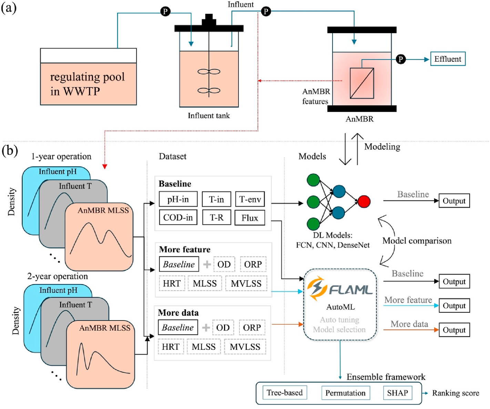
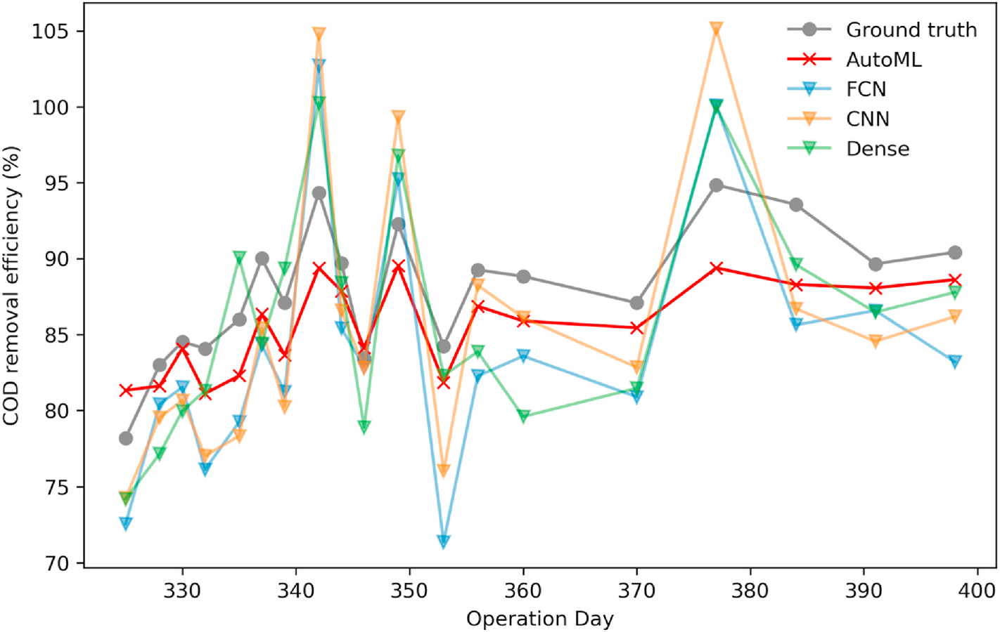
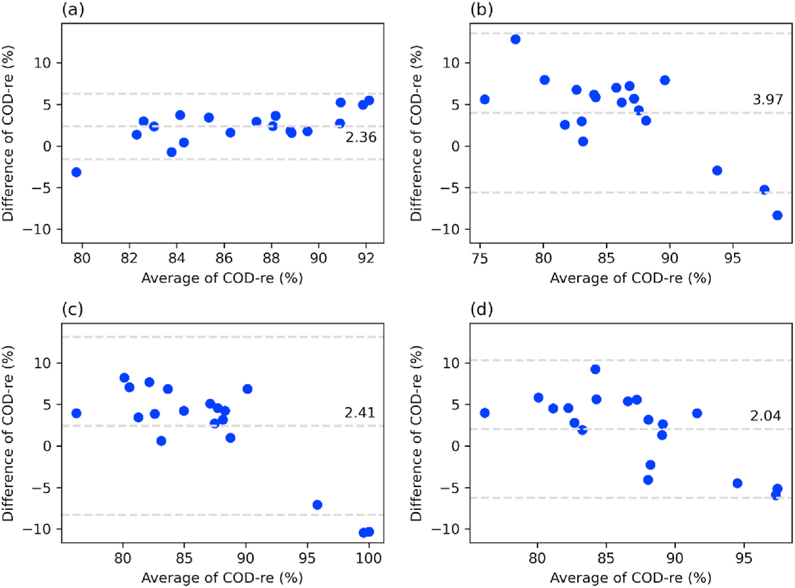
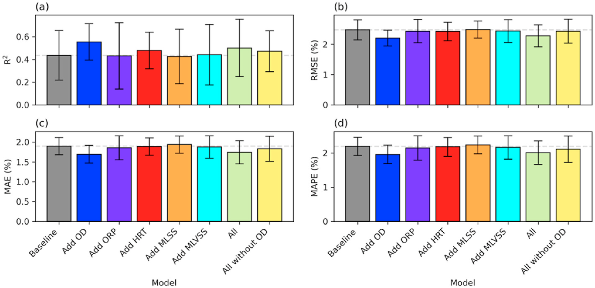
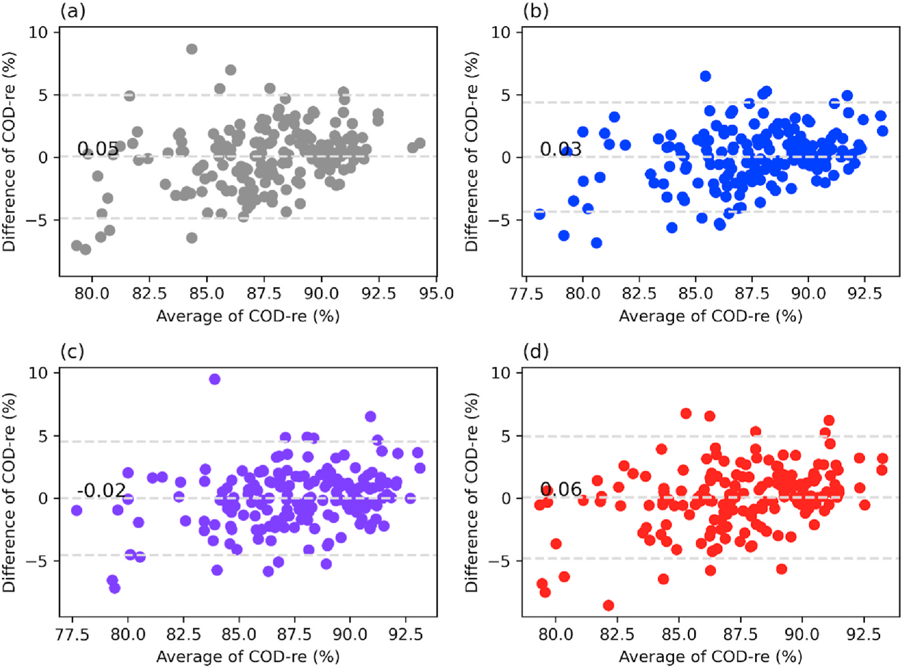
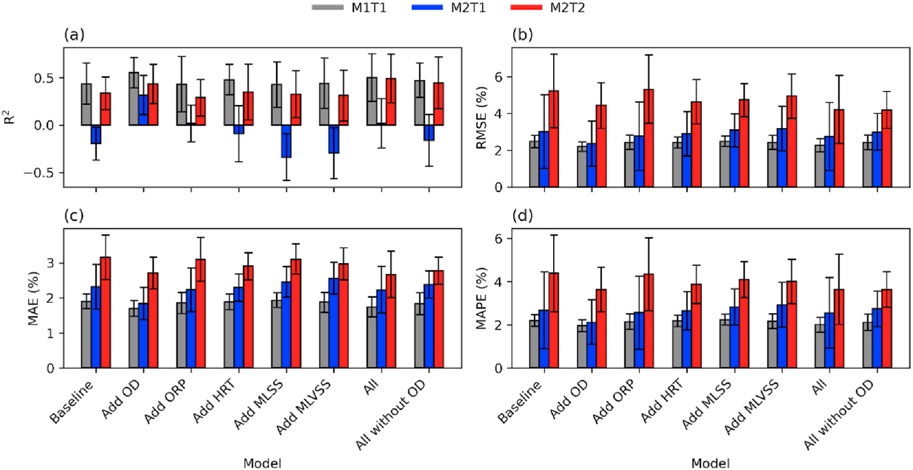
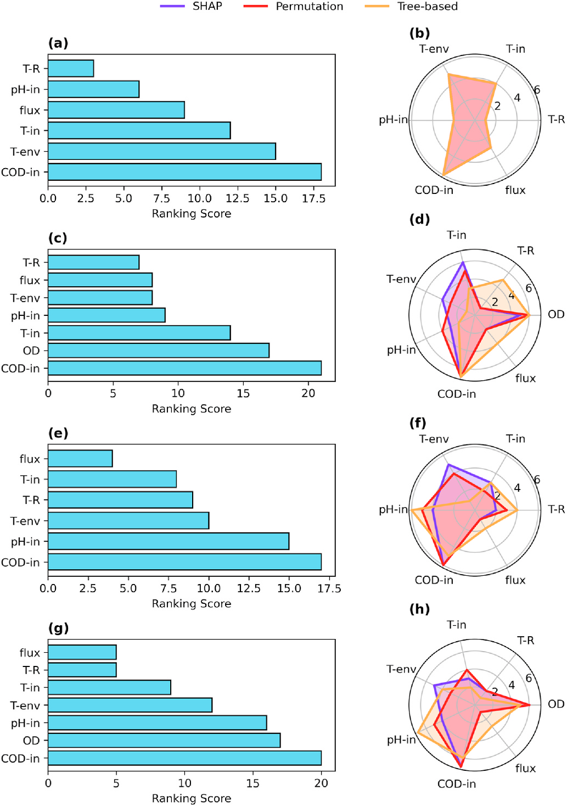

# Empowerment of accurate modeling of anaerobic membrane bioreactors by automated machine learning

## Abstract

- Học máy (ML - machine learning) là hướng tiếp cận tiềm năng cho mô hình hóa bể phản ứng sinh học màng kỵ khí (AnMBR - anaerobic membrane bioreactor), nhưng độ phức tạp kỹ thuật gây khó khăn cho các nhà nghiên cứu thiếu chuyên môn ML sâu:
  - Thách thức cốt lõi nằm ở khâu lựa chọn mô hình (model selection) và tối ưu hóa siêu tham số (hyperparameter optimization).
- Nghiên cứu ứng dụng học máy tự động (AutoML - automated machine learning) để mô hình hóa quá trình loại bỏ nhu cầu oxy hóa học (COD - chemical oxygen demand) trong AnMBR xử lý nước thải đô thị (municipal wastewater).
- Mô hình AutoML đạt hiệu suất dự đoán cao hơn các mô hình mạng nơ-ron sâu (deep neural models) từng được công bố trước đó:
  - Sai số phần trăm tuyệt đối trung bình (MAPE - mean absolute percentage error) đạt $3.11\,\%$.
- Đánh giá tác động của việc mở rộng tập đặc trưng (feature set expansion) và gia tăng lượng dữ liệu đối với hiệu suất mô hình:
  - Các đặc trưng về thời gian vận hành (operation time) giúp cải thiện hiệu suất mô hình hóa.
  - Việc bổ sung thêm dữ liệu không đóng góp đáng kể vào hiệu quả mô hình hóa bằng ML.
- Phân tích độ quan trọng đặc trưng dạng tổ hợp (ensemble feature importance) xác định nồng độ COD trong dòng vào (influent COD concentration) là biến quan trọng nhất để dự đoán hiệu quả loại bỏ COD.
- Kết quả khẳng định hiệu quả thực tế của AutoML trong mô hình hóa AnMBR và cung cấp cơ sở phương pháp luận cho việc xây dựng mô hình các quy trình xử lý nước thải dựa trên các tập dữ liệu nhỏ (small datasets).

## 1. Introduction

- **Nguy cơ khan hiếm nước ngọt (freshwater scarcity) đe dọa an ninh tài nguyên và hệ sinh thái**:
  - Trong tương lai gần, nhu cầu sử dụng và mức độ gây ô nhiễm nước ngọt của con người có thể đạt ngưỡng làm hạn chế sản xuất lương thực, suy giảm chức năng hệ sinh thái và gián đoạn nguồn cấp nước đô thị (Jury and Vaux, 2007).
  - Ngành công nghiệp nước đã xác định nước thải (wastewater) là nguồn tài nguyên khả thi và bền vững để thu hồi tài nguyên (resource recovery) (Winkler and van Loosdrecht, 2022).
  - Bùn hoạt tính (activated sludge) đóng vai trò nền tảng cốt lõi trong các công nghệ xử lý nước thải hiện nay (van Loosdrecht and Brdjanovic, 2014).
- **Bể phản ứng sinh học màng kỵ khí (AnMBR - Anaerobic Membrane Bioreactor) là giải pháp tiềm năng cho xử lý nước thải và thu hồi tài nguyên**:
  - AnMBR sở hữu ba ưu thế vận hành nổi bật so với các công nghệ truyền thống (Ho and Sung, 2010; Pretel et al., 2015; Robles et al., 2022):
    - Chi phí vận hành thấp (low operational cost).
    - Giảm thiểu khối lượng bùn thải phát sinh (reduced waste sludge production).
    - Tiềm năng thu hồi năng lượng cao (high potential for energy recovery).
  - Tích hợp quá trình phân hủy kỵ khí (anaerobic digestion) với lọc màng (membrane filtration) giúp AnMBR vừa xử lý nước thải hiệu quả, vừa tạo điều kiện thu hồi tài nguyên như sản xuất khí sinh học (biogas), phục vụ mô hình kinh tế tuần hoàn (circular economy) và phát triển bền vững (Krzeminski et al., 2017; Moideen et al., 2023).
  - Công nghệ AnMBR cung cấp thời gian khởi động nhanh (fast start-up) và diện tích lắp đặt nhỏ gọn (smaller footprint) cho các công trình xử lý nước thải (Robles et al., 2018).
- **Nghiên cứu và phát triển công nghệ AnMBR chịu nhiều rào cản nghiêm ngặt từ phương pháp thực nghiệm truyền thống**:
  - Quy trình phát triển AnMBR chủ yếu phụ thuộc vào các thử nghiệm trong phòng thí nghiệm (laboratory experiments), sau đó tiếp tục qua các thử nghiệm quy mô pilot (pilot-scale trial) (Q. Li et al., 2024; Z. Li et al., 2024; Ren et al., 2024).
  - Quá trình vận hành các hệ thống thử nghiệm tiêu hao lượng lớn hóa chất thí nghiệm (chemical reagents), đòi hỏi sự hỗ trợ của trang thiết bị chuyên dụng (Li et al., 2022).
  - Thời gian vận hành thử nghiệm kéo dài từ hàng tháng đến hàng năm, tiêu tốn nhiều thời gian và tài nguyên (time- and resource-intensive).
  - Các hạn chế về tài nguyên và không gian phòng thí nghiệm tiếp tục giới hạn số lượng cũng như thời gian của các đợt chạy bể phản ứng, cản trở tiến độ phát triển của công nghệ AnMBR.
- **Mô hình hóa theo dữ liệu (Data-driven modeling) và học máy (ML - Machine Learning) là hướng tiếp cận bổ trợ cho thực nghiệm AnMBR**:
  - Mô hình ML mô phỏng hiệu suất bể phản ứng bằng cách thiết lập tương quan giữa các thông số đầu vào và đầu ra (Li et al., 2022; Mahanna et al., 2024; Pal et al., 2024):
    - Biến đầu vào (inputs): Các thông số vận hành (operational parameters) và chất lượng nước đầu vào (influent water quality).
    - Biến đầu ra (outputs): Chất lượng nước đầu ra (effluent water quality).
  - Mô hình ML phân tích các mối quan hệ phức tạp giữa đặc tính nước đầu vào và nước đầu ra, cung cấp thông tin hữu ích cho việc vận hành bể phản ứng và tối ưu hóa hiệu suất.
  - Các mô phỏng dựa trên ML cung cấp giải pháp thay thế hiệu quả về chi phí so với phương pháp thực nghiệm truyền thống, cho phép đánh giá nhiều kịch bản vận hành tiềm năng với mức tiêu hao tài nguyên tối thiểu.
  - Khả năng mô phỏng giúp định hướng thiết kế và vận hành các hệ thống AnMBR, đặc biệt trong các điều kiện thực nghiệm thực tế không khả thi hoặc bị giới hạn tài nguyên (Li et al., 2022; Robles et al., 2018; Wang and Li, 2024).
- **Ứng dụng ML trong mô hình hóa AnMBR đối mặt với thách thức lớn từ tính không đồng nhất của hệ thống (System heterogeneity)**:
  - Tính không đồng nhất cao của các hệ thống AnMBR xuất phát từ ba yếu tố biến thiên chính:
    - Cấu trúc quần xã vi sinh vật (microbial community structures).
    - Cấu hình vật lý của thiết bị (physical configurations).
    - Chất lượng nước đầu vào (influent water quality).
  - Các yếu tố trên ảnh hưởng căn bản đến hiệu suất của bể phản ứng và hiệu quả thu hồi tài nguyên.
  - Bằng chứng thực nghiệm từ Ji et al. (2020) chỉ ra rằng kích thước lỗ màng (membrane pore size) trong AnMBR ảnh hưởng đến nồng độ nhu cầu oxy hóa học đầu ra ($\text{COD}$ - chemical oxygen demand) và thành phần vi sinh vật trong bể phản ứng, làm thay đổi chất lượng nước đầu ra và hiệu suất thu hồi tài nguyên.
  - Sự biến thiên này làm hạn chế khả năng áp dụng của các mô hình ML khái quát hóa (generalized ML models) khi chuyển giao giữa các bể phản ứng và điều kiện môi trường khác nhau.
  - Mô hình ML đòi hỏi phải được tùy biến theo từng cấu hình riêng biệt của bể phản ứng, đặt ra nhu cầu về phương pháp mô hình hóa tùy biến (tailored modeling) linh hoạt và thích ứng.
- **Quy trình phát triển mô hình ML truyền thống cho AnMBR gặp rào cản về độ phức tạp kỹ thuật và yêu cầu chuyên môn cao**:
  - Việc phát triển mô hình ML hiệu quả cho AnMBR bao gồm chuỗi tác vụ phức tạp gồm lựa chọn thuật toán ML (ML algorithm selection) và tối ưu hóa siêu tham số (hyperparameter optimization), đòi hỏi chuyên môn sâu về học máy (He et al., 2021; Karmaker (“Santu”) et al., 2021).
  - Rào cản chuyên môn khiến mức độ ứng dụng thực tế của mô hình ML trong các hệ thống MBR vẫn còn hạn chế.
- **Học máy tự động (AutoML - Automated Machine Learning) giải quyết các rào cản kỹ thuật và thúc đẩy triển khai thực tế**:
  - AutoML làm giảm độ phức tạp của các tác vụ lặp lại trong quy trình học máy (ML pipelines) (Truong et al., 2019).
  - AutoML tự động hóa các bước then chốt như lựa chọn thuật toán ML và tối ưu hóa siêu tham số, giúp cắt giảm thời gian và độ phức tạp kỹ thuật khi xây dựng mô hình ML hiệu năng cao (Lai et al., 2024).
  - AutoML phổ cập hóa khả năng tiếp cận (democratizing access) các kỹ thuật ML cho nhiều nhóm người dùng, mở rộng khả năng tiếp cận hướng tiếp cận theo dữ liệu trong nghiên cứu AnMBR và thúc đẩy đổi mới công nghệ (Li et al., 2021).
- **Mục tiêu nghiên cứu và các đóng góp cốt lõi của bài báo**:
  - Khai thác khung làm việc AutoML để mô hình hóa nhanh (rapid modeling) các động học phi tuyến phức tạp (complex nonlinear dynamics) của AnMBR trong quá trình xử lý nước thải.
  - Khảo sát ảnh hưởng của việc mở rộng số lượng biến dự đoán (features) và quy mô tập dữ liệu huấn luyện (training dataset size) lên hiệu năng mô hình.
  - So sánh đối chứng kết quả của mô hình AutoML với các kiến trúc mạng nơ-ron hiện hữu (neural networks: FCN, CNN, DenseNet).
  - Đề xuất khung diễn giải học kết hợp (ensemble learning interpretation framework) nhằm giải thích cơ chế đưa ra quyết định của mô hình dựa trên AutoML.
  - Cung cấp định hướng kỹ thuật cho việc xây dựng mô hình hiệu quả trong các hệ thống AnMBR và thúc đẩy ứng dụng của AutoML trong mô hình hóa các bể phản ứng xử lý nước thải.

## 2. Methods

* Quy trình tổng thể (overall workflow) bao gồm thu thập dữ liệu (data collection) từ các thí nghiệm quy mô phòng thí nghiệm tại hiện trường (on-site lab-scale experiments), phát triển mô hình AutoML (AutoML model development) với các tập đầu vào khác nhau, và phân tích thứ hạng tổ hợp (ensemble ranking analysis) về độ quan trọng của đặc trưng (feature importance).
    * Công đoạn thu thập dữ liệu (data collection) được mô tả chi tiết tại Section $2.1$.
    * Quy trình phát triển mô hình AutoML (AutoML model development) được trình bày chi tiết tại Section $2.2$ và $2.3$.
    * Các phép tính và phân tích độ quan trọng của đặc trưng (feature importance calculations and analyses) được trình bày tại Section $2.4$.

### 2.1. Data

- Dữ liệu nghiên cứu được thu thập từ hai hệ phản ứng sinh học màng kỵ khí (AnMBR - Anaerobic Membrane Bioreactor) vận hành liên tục trong các thí nghiệm dài hạn xử lý nước thải sinh hoạt đô thị (municipal sewage) (Ji et al., 2020, 2021a, 2021b).
  - Thể tích mỗi bể phản ứng là $20\text{ L}$, được lắp đặt tại một nhà máy xử lý nước thải (WWTP - Wastewater Treatment Plant) nhằm tiếp cận trực tiếp nguồn nước thải sinh hoạt đô thị thô.
  - Cả hai hệ AnMBR đều sử dụng màng sợi rỗng polyvinylidene difluoride (PVDF - hollow fiber polyvinylidene difluoride membranes), với kích thước lỗ màng lần lượt là $0.4\ \mu\text{m}$ và $0.05\ \mu\text{m}$.
  - Nhiệt độ vận hành bể phản ứng được duy trì ổn định trong khoảng $20\ ^{\circ}\text{C}\text{--}25\ ^{\circ}\text{C}$ bằng bể ổn nhiệt (water bath NTT-20S, EYELA, Nhật Bản).
  - Thời gian lưu nước thủy lực (HRT - hydraulic retention time) được áp dụng ở mức $4\text{--}24\text{ h}$ cho AnMBR1 và $10\text{--}24\text{ h}$ cho AnMBR2.
- Quy trình đo đạc và tiền xử lý dữ liệu chất lượng nước cùng bùn hoạt tính tuân theo các tiêu chuẩn thực nghiệm:
  - Nhu cầu oxy hóa học (COD - chemical oxygen demand), nồng độ chất rắn lơ lửng trong bùn lỏng (MLSS - mixed liquor suspended solids) và nồng độ chất rắn lơ lửng bay hơi trong bùn lỏng (MLVSS - mixed liquor volatile suspended solids) được đo đạc theo các phương pháp tiêu chuẩn (Bridgewater et al., 2017).
  - Dữ liệu MLSS và MLVSS được lấy mẫu định kỳ hàng tuần, sau đó được lấp đầy bằng phương pháp nội suy tuyến tính (linear interpolation) để khớp với tần suất đo đạc của dữ liệu COD.
  - Thế oxy hóa - khử (ORP - oxidation-reduction potential) của bùn hoạt tính kỵ khí được đo đạc bằng máy đo ORP (TOADKK, RM-30P, Nhật Bản).
- Không gian dữ liệu mô hình hóa bao gồm $11$ biến đặc trưng đầu vào và $1$ biến đầu ra mục tiêu:
  - Các biến đặc trưng đầu vào gồm:
    - Thời gian vận hành bể phản ứng ($\text{OD}$ - operation days, đơn vị: $\text{day}$).
    - Nhiệt độ vận hành bể phản ứng ($\text{T-R}$ - reactor operation temperature, đơn vị: $^{\circ}\text{C}$).
    - Nhiệt độ nước thải đầu vào ($\text{T-in}$ - influent temperature, đơn vị: $^{\circ}\text{C}$).
    - Nhiệt độ môi trường xung quanh ($\text{T-env}$ - environment temperature, đơn vị: $^{\circ}\text{C}$).
    - Độ pH dòng vào ($\text{pH-in}$ - influent pH, không thứ nguyên).
    - COD dòng vào ($\text{COD-in}$ - influent chemical oxygen demand, đơn vị: $\text{mg/L}$).
    - Thông lượng màng (flux, đơn vị: $\text{m/day}$).
    - Thế oxy hóa - khử ($\text{ORP}$, đơn vị: $\text{mV}$).
    - Thời gian lưu nước thủy lực ($\text{HRT}$, đơn vị: $\text{hour}$).
    - Nồng độ chất rắn lơ lửng trong bùn lỏng ($\text{MLSS}$, đơn vị: $\text{mg/L}$).
    - Nồng độ chất rắn lơ lửng bay hơi trong bùn lỏng ($\text{MLVSS}$, đơn vị: $\text{mg/L}$).
  - Biến đầu ra mục tiêu là tỷ lệ loại bỏ COD ($\text{COD-re}$ - COD removal rate, đơn vị: $\%$).
  - Dung lượng mẫu ban đầu gồm $185$ quan trắc, thu được từ quá trình vận hành hệ phản ứng trong khoảng $50\text{--}414\text{ days}$.
  - Tập dữ liệu $185$ mẫu được phân chia thành tập huấn luyện và tập kiểm tra theo tỷ lệ $9:1$ ($166:19$) kế thừa từ nghiên cứu của Li et al. (2022).
- Thiết kế nghiên cứu so sánh khảo sát ba khía cạnh chính gồm hiệu năng của AutoML, tác động của việc lựa chọn đặc trưng và ảnh hưởng của quy mô dữ liệu vận hành:
  - **Hình 1. Tổng quan quy trình thực nghiệm AnMBR và khung mô hình hóa**
    - 
    - **Hình này chứng minh điều gì**
      - Thiết lập cấu trúc thực nghiệm AnMBR và khung mô hình hóa AutoML với ba kịch bản (Baseline, More feature, More data) cùng cơ chế xếp hạng đặc trưng ensemble ranking.
    - **Từ đâu mà thấy được**
      - Bảng (a): sơ đồ dòng AnMBR nối tiếp từ bể điều hòa WWTP qua bể nạp đến bể màng AnMBR sinh dòng thấm (Effluent).
      - Bảng (b): dữ liệu vận hành phân nhánh vào 3 kịch bản (Baseline, More feature, More data) đưa vào DL Models và AutoML (FLAML), kết hợp bộ giải thích ensemble (Tree-based, Permutation, SHAP).
  - Thiết kế kịch bản đường cơ sở (Baseline) đối chuẩn với các mô hình học sâu trước đây:
    - Kế thừa tập huấn luyện và kiểm tra từ Li et al. (2022) với $6$ biến đầu vào gồm $\text{T-R}$, $\text{T-in}$, $\text{T-env}$, $\text{pH-in}$, $\text{COD-in}$ và flux, nhãn mục tiêu là $\text{COD-re}$.
    - Ba mô hình học sâu gồm mạng kết nối đầy đủ (FCN - fully connected network), mạng nơ-ron tích chập (CNN - convolutional neural network) và mạng tích chập kết nối dày đặc (DenseNet - densely connected convolutional network) đóng vai trò làm mô hình đối chuẩn đường cơ sở.
  - Kịch bản khảo sát đóng góp của đặc trưng (More feature modeling experiment):
    - Tích hợp thêm $5$ biến gồm $\text{OD}$, $\text{ORP}$, $\text{HRT}$, $\text{MLSS}$ và $\text{MLVSS}$ vào tập biến đường cơ sở.
    - Đánh giá các biến này thông qua cả phương thức bổ sung đơn lẻ và tích hợp kết hợp để làm rõ ảnh hưởng đối với hiệu suất mô hình hóa.
  - Kịch bản mở rộng dung lượng dữ liệu (More data modeling experiment):
    - Thu thập thêm $135$ mẫu dữ liệu từ thời gian vận hành kéo dài hơn của chính các hệ AnMBR trong khoảng $7\text{--}546\text{ days}$.
    - Tập dữ liệu mở rộng nhằm kiểm chứng khả năng nâng cao hiệu năng của các mô hình học máy khi gia tăng kích thước tập huấn luyện.
  - Giao thức kiểm định chéo đánh giá độ ổn định của mô hình:
    - Áp dụng kiểm định chéo 10 lần (10-fold cross-validation) để thẩm định các mô hình AutoML ngoài việc đối chuẩn với Li et al. (2022).
    - Quy trình 10-fold cross-validation huấn luyện $10$ mô hình độc lập, mỗi lượt sử dụng một phân tách $90\%$ huấn luyện và $10\%$ kiểm tra riêng biệt nhằm đo lường phương sai hiệu năng và bảo đảm kết quả ổn định trước các biến động dữ liệu.

### 2.2. Modeling

- Mô hình hóa hệ phản ứng màng sinh học kỵ khí (AnMBR - Anaerobic Membrane Bioreactor) được thiết lập dưới dạng hàm toán học tổng quát:
  $$Y = f_{\theta}(X)$$
  - $Y$ đại diện cho hiệu suất loại bỏ COD ($\text{COD-re}$ - COD removal rate).
  - $X$ biểu diễn ma trận các đặc trưng đầu vào (matrix of input features).
  - $f_{\theta}$ là mô hình được tham số hóa với tập tham số $\theta$ (model parameterized with $\theta$).
  - Mục tiêu của mô hình hóa dựa trên dữ liệu (data-driven modeling) là ước tính tập tham số tối ưu $\theta$ phản ánh chuẩn xác nhất dữ liệu thực nghiệm đã cho.
- Việc xác định các tham số mô hình phù hợp phụ thuộc trực tiếp vào việc cấu hình chuẩn xác các siêu tham số (hyperparameters) nhằm định hướng quá trình học:
  - Khái niệm siêu tham số: là các thiết lập cấu hình ảnh hưởng đến quá trình huấn luyện và hiệu năng của mô hình, nhưng không được học thông qua quá trình huấn luyện (settings that influence the training process and model performance but are not learned through the training process).
  - Ví dụ về siêu tham số trên mạng nơ-ron (neural networks): tốc độ học (learning rate), kích thước lô (batch size), và số lượng chu kỳ huấn luyện (epochs).
  - Ví dụ về siêu tham số trên các mô hình dựa trên cây (tree-based models): số lượng bộ ước lượng (estimator number), tốc độ học (learning rate), và độ sâu tối đa của cây (maximum depth of tree).
- Tinh chỉnh siêu tham số (hyperparameter tuning) là bước thiết yếu trong tối ưu hóa hiệu năng mô hình nhưng gặp rào cản về chuyên môn và tài nguyên:
  - Các phương pháp tối ưu hóa siêu tham số phổ biến bao gồm: tìm kiếm dạng lưới (grid search), tìm kiếm ngẫu nhiên (random search), tối ưu hóa Bayes (Bayesian optimization), và thuật toán di truyền (genetic algorithms).
  - Rào cản tiếp cận: các phương pháp truyền thống đòi hỏi chuyên môn học máy chuyên sâu (substantial ML expertise) và tài nguyên tính toán lớn (computational resources), gây hạn chế khả năng ứng dụng.
  - Học máy tự động (AutoML - Automated Machine Learning) được phát triển nhằm hợp lý hóa quy trình tinh chỉnh siêu tham số và giúp công nghệ này dễ tiếp cận hơn.
- Nghiên cứu ứng dụng thư viện FLAML (Fast Library for AutoML and tuning) hỗ trợ tinh chỉnh tự động nhanh và tiết kiệm chi phí cho học máy (Wang et al., 2021b):
  - Cơ chế tìm kiếm của FLAML lựa chọn thứ tự tìm kiếm được tối ưu hóa đồng thời cho cả chi phí tính toán (computational cost) và sai số mô hình (model error).
  - Quy trình lựa chọn lặp (iterative selection) tự động xác định: thuật toán mô hình (models), siêu tham số (hyperparameters), kích thước mẫu (sample size), và chiến lược tái lấy mẫu (resampling strategy).
  - Khả năng cạnh tranh của FLAML: thể hiện hiệu năng cao, vượt trên các thư viện AutoML hàng đầu khác như Auto-sklearn, H2O AutoML, và Alpine Meadow (Wang et al., 2021b).
  - Khả năng ứng dụng liên ngành: mang lại lợi ích rõ rệt cho các nghiên cứu trong khoa học môi trường (environmental sciences), khoa học khí quyển (atmospheric sciences), và khoa học khí hậu (climate sciences) (Dong et al., 2025; Xia et al., 2023; Zheng et al., 2023).
- Các mô hình học máy dựa trên cây (tree-based models) được lựa chọn làm tập ứng viên cơ sở (base candidates) cho quy trình tuyển chọn mô hình của FLAML do tính tương thích cao với dữ liệu dạng bảng (tabular data):
  - Rừng ngẫu nhiên (Random Forests - RF) (Breiman, 2001).
  - Cây cực kỳ ngẫu nhiên (Extremely Randomized Trees / Extra Trees) (Geurts et al., 2006).
  - XGBoost: hệ thống tăng cường cây mở rộng từ đầu đến cuối (a scalable end-to-end tree boosting system) (Chen and Guestrin, 2016).
  - LightGBM: cây quyết định tăng cường độ dốc hiệu quả cao (a highly efficient gradient boosting decision tree) (Ke et al., 2017).
  - CatBoost: tăng cường độ dốc hỗ trợ xử lý đặc trưng phân loại (gradient boosting with categorical features support) (Dorogush et al., 2018).
- Chiến lược Tối ưu hóa Tiết kiệm Chi phí (CFO - Cost-Frugal Optimization) và thuật toán BlendSearch kiểm soát hiệu quả chi phí tính toán trong quá trình tối ưu hóa:
  - Nguyên lý hoạt động của CFO (Wu et al., 2021): khởi đầu với cấu hình chi phí thấp (low-cost configuration, ví dụ: kích thước mô hình nhỏ) và chuyển dần qua các bước lặp sang các cấu hình phức tạp hơn chỉ khi mức cải thiện hiệu năng bù đắp thỏa đáng cho chi phí tính toán bổ sung.
  - Lợi thế của CFO: kiểm soát hiệu quả chi phí trong suốt quá trình tối ưu hóa so với các quy trình tối ưu hóa siêu tham số truyền thống.
  - Thuật toán BlendSearch (Wang et al., 2021a): thuật toán tìm kiếm phân cấp được áp dụng mặc định, kết hợp giữa thăm dò toàn cục (global exploration) và tối ưu hóa cục bộ (local optimization) nhằm giảm thiểu tổng chi phí tiêu tốn để tìm ra các cấu hình tốt.
- Ràng buộc ngân sách thời gian, giao thức kiểm định và không gian tìm kiếm siêu tham số của quy trình AutoML:
  - Ngân sách thời gian toàn cục (global time budget) được ấn định ở mức $300\text{ s}$; quá trình tối ưu hóa sẽ chấm dứt khi ngân sách thời gian cạn kiệt.
  - Giao thức chống quá khớp: áp dụng chiến lược kiểm định chéo 5 lần ($5\text{-fold cross-validation}$) với tiêu chí sai số bình phương trung bình ($\text{MSE}$ - Mean Squared Error) trong mỗi chu trình tối ưu hóa AutoML.
  - Không gian tìm kiếm (search spaces) của các thuật toán được đưa vào động, bao gồm: số lượng bộ ước lượng (number of estimators), số lượng lá (number of leaves), tốc độ học (learning rate), và các tham số điều chuẩn (regularization parameters).
  - Phạm vi tìm kiếm cụ thể (specific search ranges) được chiến lược CFO xác định dựa trên kích thước của tập dữ liệu huấn luyện (training dataset size).
  - Tập siêu tham số tối ưu và các thiết lập chi tiết của tất cả các mô hình được cung cấp trong Tài liệu Hỗ trợ (Supporting Information).

### 2.3. Evaluation

- Các chỉ số đánh giá (evaluation metrics) hiệu năng dự đoán được sử dụng trong nghiên cứu bao gồm 5 thước đo:
  - Sai số bình phương trung bình ($\text{MSE}$ - mean squared error).
  - Sai số tuyệt đối trung bình ($\text{MAE}$ - mean absolute error).
  - Căn bậc hai của sai số bình phương trung bình ($\text{RMSE}$ - root mean squared error).
  - Sai số phần trăm tuyệt đối trung bình ($\text{MAPE}$ - mean absolute percentage error).
  - Hệ số xác định ($R^2$ - coefficient of determination).
  - Định nghĩa biến trong các công thức: $y_i$ là giá trị quan sát thực tế (observations), $\hat{y}_i$ là giá trị dự đoán của mô hình (model predictions), $n$ là số lượng mẫu (number of samples), và $\bar{y}$ là giá trị trung bình của các quan sát thực tế.
- Công thức xác định sai số tuyệt đối trung bình ($\text{MAE}$):
  $$\text{MAE} = \frac{1}{n} \sum_{i=1}^{n} |y_i - \hat{y}_i| \tag{2}$$
  - $\text{MAE}$ là giá trị trung bình của các chênh lệch tuyệt đối giữa quan sát thực tế $y_i$ và giá trị dự đoán $\hat{y}_i$.
  - Cùng với $\text{RMSE}$, $\text{MAE}$ đại diện cho độ chụm/độ chính xác (precision) của các dự đoán mô hình.
  - Đơn vị đo của $\text{MAE}$ trong nghiên cứu này là phần trăm ($\%$) (đồng nhất với đơn vị của biến đầu ra).
- Công thức xác định căn bậc hai của sai số bình phương trung bình ($\text{RMSE}$):
  $$\text{RMSE} = \sqrt{\text{MSE}} = \sqrt{\frac{1}{n} \sum_{i=1}^{n} (y_i - \hat{y}_i)^2} \tag{3}$$
  - $\text{RMSE}$ là căn bậc hai của giá trị trung bình các sai số bình phương giữa $y_i$ và $\hat{y}_i$.
  - $\text{RMSE}$ gán trọng số cao hơn cho các sai số lớn do cơ chế bình phương sai số so với $\text{MAE}$.
  - Cùng với $\text{MAE}$, $\text{RMSE}$ đại diện cho độ chính xác (precision) của dự đoán mô hình.
  - Đơn vị đo của $\text{RMSE}$ trong nghiên cứu này là phần trăm ($\%$) (đồng nhất với đơn vị của biến đầu ra).
- Công thức xác định sai số phần trăm tuyệt đối trung bình ($\text{MAPE}$):
  $$\text{MAPE} = \frac{1}{n} \sum_{i=1}^{n} \left| \frac{y_i - \hat{y}_i}{y_i} \right| \times 100 \tag{4}$$
  - $\text{MAPE}$ là độ lệch phần trăm trung bình giữa giá trị quan sát $y_i$ và giá trị dự đoán $\hat{y}_i$.
  - Đơn vị đo của $\text{MAPE}$ là phần trăm ($\%$) (sai số tương đối tính theo phương trình (4)).
- Công thức xác định hệ số xác định ($R^2$):
  $$R^2 = 1 - \frac{\sum_{i=1}^{n} (y_i - \hat{y}_i)^2}{\sum_{i=1}^{n} (y_i - \bar{y})^2} \tag{5}$$
  - Giá trị $R^2 = 1$ biểu thị sự khớp hoàn hảo (perfect fit) của mô hình đối với dữ liệu.
  - Giá trị $R^2$ tiến gần về $0$ chỉ ra rằng mô hình có năng lực giải thích tối thiểu (minimal explanatory power) đối với biến mục tiêu.
  - Giá trị $R^2$ âm ($R^2 < 0$) chỉ ra rằng sai số dự đoán vượt quá phương sai nội tại (inherent variance) của tập dữ liệu.
  - Nhìn chung, giá trị $R^2$ càng tiến gần đến $1$ thì mô hình càng tốt.
- Phân tích Bland-Altman (Bland-Altman analysis) được thực hiện nhằm đánh giá mức độ tương đồng (concordance) giữa hiệu suất loại bỏ COD (COD removal efficiency) dự đoán và giá trị thực nghiệm:
  - Các thước đo sai số (chẳng hạn như $\text{RMSE}$) chỉ đánh giá hiệu năng dự đoán tổng thể (overall predictive performance), không định lượng rõ ràng mức độ phù hợp (agreement) giữa giá trị dự đoán và giá trị thực nghiệm (ground truth) (Martin Bland and Altman, 1986).
  - Phương pháp Bland-Altman phân tích sai khác giữa hai phương pháp so với giá trị trung bình của chúng (Martin Bland and Altman, 1986).
  - Trong nghiên cứu này, sai khác được tính bằng giá trị thực nghiệm trừ đi giá trị dự đoán: $\text{difference} = \text{ground truth} - \text{prediction}$.
  - Sai khác khác 0 (non-zero difference) phản ánh xu hướng của mô hình: giá trị sai khác âm ($\text{difference} < 0$) cho thấy mô hình nhìn chung đánh giá cao hơn thực tế (overestimates), trong khi giá trị sai khác dương ($\text{difference} > 0$) cho thấy mô hình đánh giá thấp hơn thực tế (underestimates) so với phép đo.
- Tiêu chí đánh giá tính nhất quán tốt (good consistency) giữa hai phương pháp (Li et al., 2022):
  - Các giới hạn phù hợp (limits of agreement) không vượt quá phạm vi giá trị có thể chấp nhận được về mặt chuyên môn (professionally acceptable value range).
  - Có $95\%$ các điểm sai khác nằm trong các giới hạn phù hợp $95\%$ ($95\%$ limits of agreement).
  - Giới hạn phù hợp $95\%$ ($95\%$ limits of agreement) được xác định bằng cách cộng và trừ $1.96$ lần độ lệch chuẩn (standard deviations) vào giá trị sai khác trung bình (mean difference):
    $$\text{limits of agreement } 95\% = \text{mean difference} \pm 1.96 \times \text{standard deviation}$$

### 2.4. Ablation studies

* Nghiên cứu cắt bỏ (ablation studies) được tiến hành nhằm đánh giá mức độ đóng góp của các đặc trưng (features) khác nhau đối với hiệu suất dự đoán của các mô hình học máy (ML models - Machine Learning models).
    * Kỹ thuật ablation study đánh giá tác động của các thành phần cụ thể (chẳng hạn như đặc trưng, tham số, hoặc dữ liệu) bằng cách loại bỏ hoặc thay đổi chúng, sau đó quan sát các biến đổi tương ứng về hiệu suất mô hình.
    * Việc so sánh hiệu suất giữa các mô hình có và không có những đặc trưng cụ thể cho phép suy luận mức độ ảnh hưởng của từng đặc trưng lên quá trình mô hình hóa.
* Nghiên cứu đánh giá cụ thể tác động của $5$ đặc trưng vận hành và hóa sinh lên hiệu suất mô hình:
    * $\text{OD}$ (operation days - số ngày vận hành).
    * $\text{ORP}$ (oxidation-reduction potential - thế oxy hóa - khử).
    * $\text{HRT}$ (hydraulic retention time - thời gian lưu nước thủy lực).
    * $\text{MLSS}$ (mixed liquor suspended solids - nồng độ chất rắn lơ lửng trong bùn lỏng).
    * $\text{MLVSS}$ (mixed liquor volatile suspended solids - nồng độ chất rắn lơ lửng bay hơi trong bùn lỏng).
* Tác động của việc mở rộng quy mô dữ liệu được khảo sát thông qua tập dữ liệu mở rộng (extended dataset), do nghiên cứu thu thập được lượng dữ liệu lớn hơn so với nghiên cứu trước đây.
* Toàn bộ dữ liệu huấn luyện (training data), dữ liệu kiểm tra (testing data) cũng như các tham số huấn luyện mô hình (model training parameters) được duy trì nhất quán với thiết lập trước đó xuyên suốt quá trình thực hiện ablation studies.

### 2.5. Feature ranking score

- Khung ensemble (ensemble framework) sử dụng điểm xếp hạng (ranking score) được thiết kế riêng cho các tác vụ AutoML nhằm đánh giá độ quan trọng của đặc trưng (feature importance).
  - Khung làm việc kết hợp ba phương pháp đánh giá độ quan trọng:
    - Độ quan trọng đặc trưng dựa trên cây (tree-based feature importance).
    - Độ quan trọng đặc trưng dựa trên hoán vị (permutation feature importance).
    - Giá trị SHAP (Shapley Additive exPlanations values) (Schreck et al., 2023; Yu et al., 2025; Zheng et al., 2023).
  - Khung tạo ra điểm số ensemble (ensemble score) đi kèm thứ hạng quan trọng của đặc trưng (feature importance ranking).
  - Cách tiếp cận này cung cấp đánh giá cân bằng hơn thông qua việc kết hợp nhiều góc nhìn (multiple perspectives), thay vì phụ thuộc vào một phương pháp đơn lẻ.
- Độ quan trọng đặc trưng trong các mô hình dựa trên cây (tree-based models) được suy ra trực tiếp từ cấu trúc của mô hình.
  - Trong mô hình Random Forest (RF), độ quan trọng được tính bằng độ quan trọng Gini (Gini importance).
  - Chỉ số Gini importance đo lường mức suy giảm chuẩn hóa của tiêu chí Gini (normalized reduction in the Gini criterion) do từng đặc trưng đóng góp.
  - Phương pháp này được gọi là phương pháp dựa trên cây (tree-based method).
- Phương pháp hoán vị (permutation method) tính toán độ quan trọng đặc trưng bằng cách đánh giá sự thay đổi hiệu năng mô hình khi các giá trị của một đặc trưng bị xáo trộn ngẫu nhiên (Breiman, 2001).
  - Phương pháp hoán vị áp dụng được cho bất kỳ mô hình nào sử dụng dữ liệu dạng bảng (tabular data).
  - Độ quan trọng $i_j$ của đặc trưng $j$ được xác định theo công thức:
    $$i_j = s - \frac{1}{K} \sum_{k=1}^{K} s_{k,j} \tag{6}$$
  - Các tham số và ký hiệu trong công thức gồm:
    - $i_j$: độ quan trọng của đặc trưng $j$ (importance of feature $j$).
    - $s$: điểm số mô hình tham chiếu (reference model score), tính theo sai số căn bậc hai trung bình (RMSE - Root Mean Squared Error).
    - $s_{k,j}$: điểm số mô hình sau khi xáo trộn đặc trưng $j$ ở lần lặp thứ $k$.
    - $K$: tổng số lần lặp thực hiện, với $K = 30$.
- Khung làm việc SHAP (Shapley Additive exPlanations) là phương pháp độc lập với mô hình (model-agnostic framework) nhằm giải thích các dự đoán dựa trên giá trị Shapley (Lundberg et al., 2018; Lundberg and Lee, 2017).
  - Phương pháp SHAP tính toán mức đóng góp của từng đặc trưng vào đầu ra của mô hình (giá trị SHAP) theo công thức:
    $$\phi_i(f, x) = \sum_{S \subseteq S_{\text{all}} \setminus \{i\}} \frac{|S|!(M - |S| - 1)!}{M!} [f_x(S \cup \{i\}) - f_x(S)] \tag{7}$$
  - Các tham số và ký hiệu trong công thức gồm:
    - $\phi_i(f, x)$: giá trị SHAP của đặc trưng $i$.
    - $f(S)$ (hoặc $f_x(S)$): đầu ra của mô hình đối với tập con đặc trưng $S$, với $S \subseteq (0, 1)^M$.
    - $M$: tập hợp gồm toàn bộ $M$ biến đầu vào (the set of all $M$ input variables).
    - $|S|$: số lượng phần tử khác không (nonzero entries) trong tập hợp $S$.
    - $\sum_{S \subseteq S_{\text{all}} \setminus \{i\}}$: phép lấy tổng duyệt qua tất cả các tập con đặc trưng khả dĩ.
  - Mức đóng góp của đặc trưng $i$ được xác định bằng cách so sánh đầu ra mô hình khi có và khi không có đặc trưng này, được gán trọng số theo kích thước tập con đặc trưng (weighted by the subset size).
- Thước đo điểm xếp hạng ("ranking score" metric) chuẩn hóa việc so sánh độ quan trọng đặc trưng giữa các phương pháp khác nhau (Zheng et al., 2023).
  - Các chỉ số feature importance thu được từ các phương pháp trên khó so sánh trực tiếp do khác biệt về các nguyên lý cơ bản nền tảng.
  - Các giá trị feature importance thu được từ mỗi phương pháp được sắp xếp theo thứ tự tăng dần (ascending order).
  - Mỗi đặc trưng nhận một thứ hạng tương ứng với vị trí của nó trong danh sách có thứ tự:
    - Đặc trưng ít quan trọng nhất nhận điểm thấp nhất là $1$.
    - Đặc trưng ít quan trọng thứ hai nhận điểm là $2$.
    - Các điểm số cao hơn được gán tăng dần cho các đặc trưng có mức độ quan trọng cao hơn.
  - Quy trình này đảm bảo giá trị ranking score nằm trong khoảng từ $1$ (chỉ đặc trưng ít quan trọng nhất) đến tổng số đặc trưng (chỉ đặc trưng quan trọng nhất).
  - Chuẩn hóa các giá trị feature importance theo cơ chế xếp hạng mang lại tính nhất quán giữa các phương pháp, tạo điều kiện thuận lợi cho việc so sánh trực tiếp.

## 3. Results and discussion

### 3.1. AutoML for efficient AnMBR modeling

- Mô hình AutoML được xây dựng trên cùng tập dữ liệu (bao gồm các đặc trưng đầu vào và mục tiêu) từ nghiên cứu của Li et al. (2022) nhằm đối chuẩn hiệu suất trực tiếp với các kết quả đã công bố:
  - Kết quả cho thấy AutoML đạt hiệu suất cạnh tranh khi so sánh với các kết quả đã báo cáo của các mô hình học sâu trước đó gồm FCN, CNN và DenseNet (Bảng 1 và Hình 2):
    - **Hình 2. Kết quả dự đoán của các mô hình và so sánh với giá trị đo thực tế**
      - 
      - **Hình này chứng minh điều gì**
        - Mô hình AutoML bám sát giá trị thực tế của hiệu suất loại bỏ COD với dao động ổn định hơn các mô hình học sâu.
      - **Từ đâu mà thấy được**
        - Trục $Ox$: Thời gian vận hành ($325\text{--}398\text{ ngày}$); Trục $Oy$: Hiệu suất loại bỏ COD ($70\text{--}105\,\%$).
        - Đường AutoML (đỏ) dao động ổn định trong phạm vi $81.3\,\%\text{--}89.5\,\%$, trong khi FCN, CNN và Dense biến động mạnh, từng vượt $100\,\%$ hoặc tụt xuống $\approx 71.3\,\%$.
  - Bảng 1 thống kê chi tiết các chỉ số đánh giá hiệu suất mô hình giữa AutoML và các kiến trúc học sâu cơ sở:
    - AutoML (kiểm định chéo $10$ phần - $10\text{-fold CV}$): $\text{RMSE} = 2.47\,\%$ [$2.14\,\%$, $2.81\,\%$], $\text{MAE} = 1.90\,\%$ [$1.68\,\%$, $2.11\,\%$], $\text{MAPE} = 2.19\,\%$ [$1.93\,\%$, $2.46\,\%$], $R^2 = 0.44$ [$0.22$, $0.65$] (các chỉ số sai số được báo cáo dưới dạng giá trị trung bình kèm khoảng tin cậy $95\,\%$ dựa trên phân phối Student's $t$).
    - AutoML (đánh giá theo phân chia dữ liệu của Li et al. (2022)): $\text{RMSE} = 3.09\,\%$, $\text{MAE} = 2.76\,\%$, $\text{MAPE} = 3.11\,\%$, $R^2 = 0.47$.
    - Mô hình FCN (Li et al., 2022): $\text{RMSE} = 6.29\,\%$, $\text{MAE} = 5.71\,\%$, $\text{MAPE} = 6.49\,\%$, $R^2 = -1.19$.
    - Mô hình CNN (Li et al., 2022): $\text{RMSE} = 5.98\,\%$, $\text{MAE} = 5.34\,\%$, $\text{MAPE} = 6.02\,\%$, $R^2 = -0.97$.
    - Mô hình DenseNet / Dense (Li et al., 2022): $\text{RMSE} = 4.69\,\%$, $\text{MAE} = 4.34\,\%$, $\text{MAPE} = 4.93\,\%$, $R^2 = -0.21$.
    - Đơn vị của $\text{RMSE}$ và $\text{MAE}$ tương đương với hiệu suất loại bỏ $\text{COD}$ ($\text{COD-re}$, $\%$); $\text{MAPE}$ tính theo tỷ lệ phần trăm theo phương trình (4).
- Ứng dụng AutoML giúp chuyển đổi hệ số xác định $R^2$ từ giá trị âm sang giá trị dương, đánh dấu bước cải thiện rõ rệt về hiệu suất mô hình:
  - Giá trị $R^2$ âm từng ghi nhận ở các kiến trúc học sâu trước đây có thể xuất phát từ hiện tượng quá khớp (overfitting), kích thước tập dữ liệu hạn chế, sự thiếu hụt các đặc trưng liên quan và mức độ phù hợp của mô hình đối với tác vụ (Jiang et al., 2025).
  - Đánh giá AutoML qua kiểm định chéo $10$ phần ($10\text{-fold cross-validation}$) cho khoảng tin cậy $\text{RMSE}$ hẹp ($\pm 0.33\,\%$), khẳng định tính ổn định cao của AutoML.
- Các mô hình dựa trên cây (tree-based models) được sử dụng làm bộ học cơ sở (base learners) cho các tác vụ AutoML:
  - Các mô hình này thể hiện sự khác biệt đáng kể so với mạng nơ-ron (neural networks), đặc biệt trong xử lý dữ liệu dạng bảng (tabular data) (Grinsztajn et al., 2022; Shwartz-Ziv and Armon, 2022).
  - Các thuật toán dựa trên cây thường đạt hiệu quả cao hơn các phương pháp học sâu khi áp dụng cho dữ liệu bảng có cấu trúc và không yêu cầu tiền xử lý dữ liệu phức tạp (McElfresh et al., 2023).
  - Việc ứng dụng AutoML dựa trên cây vừa nâng cao độ chính xác mô hình vừa cải thiện hiệu quả của quy trình mô hình hóa AnMBR.
- Phân tích Bland-Altman (Bland-Altman analysis) được sử dụng để đánh giá tính nhất quán giữa giá trị dự đoán và quan sát thực tế (ground truth), cung cấp thông tin về độ chính xác dự đoán và tính ổn định của mô hình:
  - Phân tích thể hiện độ sai khác trung bình (bias) và tính toán các giới hạn thỏa thuận (limits of agreement) phản ánh phạm vi kỳ vọng cho phần lớn các mức sai biệt; ranh giới thỏa thuận càng rộng biểu thị tính nhất quán càng kém giữa mô hình và quan sát thực tế.
  - Kết quả AutoML phân bố trong dải giới hạn thỏa thuận hẹp hơn so với các mô hình học sâu, với phân phối sai số đồng đều hơn (Hình 3):
    - **Hình 3. Phân tích Bland-Altman về độ sai khác dự đoán COD-re**
      - 
      - **Hình này chứng minh điều gì**
        - AutoML đạt dải giới hạn thỏa thuận hẹp nhất và sai số phân bố đồng đều, không bị suy giảm theo giá trị trung bình như các mô hình học sâu.
      - **Từ đâu mà thấy được**
        - Trục $Ox$: Giá trị COD-re trung bình ($\%$); Trục $Oy$: Độ sai khác COD-re ($\%$, thực tế trừ dự đoán).
        - Panel (a) AutoML có dải thỏa thuận hẹp nhất (khoảng $-1.5\,\%$ đến $+6.3\,\%$), sai số trung bình $2.36\,\%$, các điểm phân tán đồng đều.
        - Panel (b) FCN, (c) CNN, (d) Dense có dải thỏa thuận rộng hơn (sai số trung bình lần lượt là $3.97\,\%$, $2.41\,\%$, $2.04\,\%$) và độ sai khác giảm mạnh về giá trị âm (đến $-10.5\,\%$) khi COD-re trung bình tăng cao.
  - Đa số các điểm dữ liệu của AutoML nằm trong khoảng tin cậy $95\,\%$, chứng minh mức độ tương đồng cao giữa giá trị quan sát và dự đoán của mô hình.
- Phân phối độ sai khác phản ánh đặc tính ổn định của AutoML so với sự phụ thuộc giá trị ở mô hình học sâu:
  - Đối với các mô hình học sâu, độ sai khác giữa giá trị dự đoán và quan sát có xu hướng giảm khi giá trị trung bình tăng lên.
  - Ngược lại, kết quả AutoML không xuất hiện quy luật phụ thuộc này, độ sai khác phân bố đồng đều trên toàn bộ dải giá trị trung bình, làm nổi bật tính ổn định của AutoML.
- Tất cả kết quả phân tích Bland-Altman đều cho độ sai khác trung bình dương ($\text{mean difference} > 0$) (Hình 3):
  - Giá trị dương chỉ ra xu hướng có hệ thống là các mô hình đều đánh giá thấp hơn thực tế (underestimate) tỷ lệ loại bỏ COD.
  - Hiện tượng đánh giá thấp này có thể do phân phối dữ liệu mất cân bằng giữa tập huấn luyện và tập kiểm tra.
  - Các mô hình dựa trên dữ liệu có xu hướng làm mịn (smooth out) nhiễu do độ bất định đo lường và tính chất biến động động học của quá trình sinh học.
- AutoML đạt sai số $\text{RMSE} = 3.09\,\%$, thấp hơn độ lệch chuẩn của hiệu suất loại bỏ COD thực nghiệm được ghi nhận trong các hệ thống AnMBR vận hành dài hạn (Robles et al., 2022; Uman et al., 2021):
  - Kết quả chứng minh độ chính xác tổng thể của mô hình đủ đáp ứng yêu cầu mô tả động học của quá trình AnMBR.
  - Hiện tượng quá khớp, kích thước tập dữ liệu hạn chế, mức độ phù hợp của mô hình và phương pháp kiểm thử đều ảnh hưởng đến hiệu suất, do đó các kết quả so sánh mang tính định hướng thay vì khẳng định tuyệt đối.

### 3.2. Improved ML performance with operation time as a feature

- Hiệu suất xử lý của hệ thống màng sinh học kỵ khí (anaerobic membrane bioreactor - AnMBR) không chỉ chịu tác động từ các biến vận hành cơ sở mà còn bị chi phối bởi các điều kiện động học bên trong bể phản ứng:
  - Các biến đầu vào trong tập đặc trưng cơ sở (baseline feature set) gồm nhiệt độ bể phản ứng ($\text{T-R}$), nhiệt độ dòng vào ($\text{T-in}$), nhiệt độ môi trường ($\text{T-env}$), $\text{pH}$ dòng vào ($\text{pH-in}$), $\text{COD}$ dòng vào ($\text{COD-in}$) và thông lượng qua màng ($\text{flux}$).
  - Cấu trúc và hoạt tính của quần xã vi sinh vật (microbial community structure and activity) trong $\text{AnMBR}$ là những nhân tố then chốt quyết định hiệu suất xử lý (Hu et al., 2017; Xie et al., 2014).
  - Phép đo cấu trúc quần xã vi sinh vật gặp nhiều trở ngại do quy trình phân tích kéo dài và chi phí cao, dẫn đến sự khan hiếm của nguồn dữ liệu này trong thực tế vận hành.
  - Sự thiếu hụt dữ liệu cấu trúc quần xã vi sinh vật cản trở mô hình hóa $\text{AnMBR}$ theo định hướng dữ liệu (data-driven modeling) trong việc phát hiện các cơ chế vận hành tiềm ẩn bên dưới.
- Xuất phát từ giả thuyết thông tin bổ sung có thể tương quan với thời gian vận hành, nghiên cứu đưa số ngày vận hành (operation days - $\text{OD}$) vào mô hình như một biến đại diện (potential proxy) cho động học vi sinh vật:
  - Việc tích hợp $\text{OD}$ cải thiện đáng kể hiệu năng mô hình so với tập đặc trưng cơ sở ($\text{T-R}$, $\text{T-in}$, $\text{T-env}$, $\text{pH-in}$, $\text{COD-in}$ và $\text{flux}$), làm tăng giá trị trung bình $R^2$ từ $0.44$ lên $0.55$ và giảm giá trị trung bình $\text{RMSE}$ từ $2.47$ xuống $2.20$ ($\text{Fig. 4}$ và $\text{Fig. S1}$):
    - **Hình 4. Hiệu năng mô hình với các tập đặc trưng đầu vào khác nhau**
      - 
      - **Hình này chứng minh điều gì**
        - Bổ sung $\text{OD}$ (Add OD) đơn lẻ đem lại mức cải thiện hiệu năng rõ rệt nhất trên cả 4 chỉ số đánh giá so với Baseline, trong khi thêm các biến đơn lẻ khác ($\text{ORP}$, $\text{HRT}$, $\text{MLSS}$, $\text{MLVSS}$) hầu như không tạo ra biến chuyển đáng kể.
      - **Từ đâu mà thấy được**
        - Panel (a) $R^2$: Cột Add OD đạt giá trị trung bình cao nhất $\sim 0.55$, vượt mức cơ sở nét đứt ($0.44$); các cột thêm biến đơn lẻ khác chỉ dao động quanh mức $0.43\text{--}0.48$.
        - Panel (b) $\text{RMSE}$, (c) $\text{MAE}$, (d) $\text{MAPE}$: Cột Add OD ghi nhận mức sai số thấp nhất (lần lượt $\sim 2.20$, $\sim 1.70\,\%$, $\sim 1.96\,\%$); thanh sai số biểu thị khoảng tin cậy $95\%$ từ kiểm định chéo 10 lần ($10\text{-fold CV}$).
  - Phân tích tương quan Spearman (Spearman correlation analysis) cho thấy mối liên hệ yếu giữa $\text{OD}$ và biến mục tiêu ($\text{COD-re}$), chỉ ra xác suất rò rỉ dữ liệu (data leakage) ở mức thấp (xem tài liệu bổ sung).
  - Sự cải thiện này xác nhận thông tin bổ sung hàm chứa trong $\text{OD}$ đã được mô hình học máy tiếp nhận và học tập hiệu quả.
- Biến $\text{OD}$ đóng vai trò là biến thay thế (surrogate variable) thu nhận động học thời gian chưa được đo đạc nội tại trong quy trình $\text{AnMBR}$, thay vì là một tham số nhân quả trực tiếp (direct causal parameter):
  - Động học thời gian phản ánh quá trình thích nghi dần của quần xã vi sinh vật (gradual acclimatization of the microbial community, như sự phát triển của màng sinh học - biofilm development).
  - Động học thời gian đồng thời ghi nhận những biến đổi tích lũy theo thời gian về các đặc tính trên bề mặt màng lọc (cumulative changes in membrane surface properties over time).
  - Việc đưa chiều thời gian (temporal dimension) vào đầu vào giúp mô hình học được các hành vi phi dừng (non-stationary behaviors) của bể phản ứng trong quá trình vận hành dài hạn.
  - Việc bổ sung $\text{OD}$ đặt ra thách thức đối với khả năng ngoại suy (extrapolation) của mô hình:
    - Mặc dù đạt hiệu năng quan sát tốt trong nghiên cứu, các mô hình dạng cây (tree-based models) thường gặp khó khăn khi thực hiện dự đoán ngoài phạm vi phân bố của dữ liệu huấn luyện (training data range).
- Việc đưa thêm các dữ liệu thông số vận hành truyền thống gồm $\text{ORP}$, $\text{HRT}$, $\text{MLSS}$ và $\text{MLVSS}$ không đóng góp đáng kể vào việc nâng cao hiệu năng mô hình:
  - Khi sử dụng đồng thời $\text{OD}$, $\text{ORP}$, $\text{HRT}$, $\text{MLSS}$ và $\text{MLVSS}$ để huấn luyện mô hình, hiệu quả tổng thể thu được chỉ tương đương với kịch bản chỉ bổ sung riêng lẻ biến $\text{OD}$.
  - Phân tích Bland-Altman chứng minh việc tích hợp $\text{OD}$ vào mô hình làm giảm độ lệch giữa giá trị dự đoán và giá trị thực tế, giúp sai số phân bố đồng đều hơn quanh mốc 0 so với các mô hình không chứa thời gian vận hành ($\text{Fig. 5}$ và $\text{Fig. S2}$):
    - **Hình 5. Phân tích Bland-Altman của các mô hình AutoML**
      - 
      - **Hình này chứng minh điều gì**
        - Bổ sung $\text{OD}$ thu hẹp biên độ phân tán của sai số và đưa độ lệch trung bình về sát mức $0$, trong khi các cấu hình thiếu $\text{OD}$ có độ phân tán rộng hơn và độ lệch lớn hơn.
      - **Từ đâu mà thấy được**
        - Trục tọa độ: Trục hoành là giá trị trung bình $\text{COD-re}$ ($\%$); trục tung là độ lệch $\text{COD-re}$ ($\%$) (giá trị thực tế trừ giá trị dự đoán).
        - Panel (b) Add OD và (c) Add OD, ORP, HRT, MLSS, MLVSS: Đường chênh lệch trung bình (nét đứt giữa) nằm ở $0.03$ và $-0.02$; các điểm phân tán tập trung chặt chẽ hơn quanh đường $0$.
        - Panel (a) Baseline và (d) All without OD: Đường chênh lệch trung bình lệch xa hơn ($0.05$ và $0.06$); dải giới hạn đồng thuận ($\pm 1.96 \times \text{SD}$) mở rộng hơn.
  - Kết quả phân tích khẳng định sự hiện diện của biến thời gian vận hành giúp nâng cao hiệu năng mô hình, trong khi bổ sung thêm các thông số đầu vào khác chỉ mang lại sự cải thiện giới hạn.
- Sự đóng góp hạn chế của các thông số điển hình ($\text{ORP}$, $\text{HRT}$, $\text{MLSS}$ và $\text{MLVSS}$) bắt nguồn từ các giới hạn dữ liệu đặc thù của nghiên cứu thay vì sự thiếu hụt ý nghĩa vật lý hay sinh học:
  - Những ràng buộc dữ liệu bao gồm tần suất đo đạc (measurement frequency) và tỷ số tín hiệu trên nhiễu (signal-to-noise ratio).
  - Hiện tượng cộng tuyến đặc trưng (feature collinearity) có thể đã che khuất tầm quan trọng của các thông số này, do mô hình có thể trích xuất đầy đủ thông tin từ các biến dự đoán tương quan khác.
  - Các kết quả trên nhấn mạnh tầm quan trọng cốt lõi của công tác lựa chọn đặc trưng (feature selection) đối với quá trình mô hình hóa học máy.

### 3.3. Impact of data volume on predictive performance

- Mô hình hóa dựa trên học máy (ML-based modeling) là phương pháp tiếp cận định hướng bởi dữ liệu (data-driven approach), có hiệu năng phụ thuộc chủ yếu vào chất lượng và số lượng của dữ liệu (Fan and Shi, 2022; Liu et al., 2023):
  - Khi áp dụng vào các tập dữ liệu thực nghiệm, học máy gặp phải các thách thức cố hữu liên quan đến tính khả dụng (data availability) và độ tin cậy của dữ liệu (data reliability).
  - Các thí nghiệm trong phòng thí nghiệm thường chỉ thu được kích thước mẫu nhỏ do những rào cản về thời gian, chi phí và không gian khả dụng.
  - Dữ liệu thực nghiệm dễ bị ảnh hưởng bởi nhiều nguồn sai số khác nhau, bao gồm sai số do con người (human errors) và sai số thiết bị đo (instrumental errors), làm tăng độ khó khăn cho việc áp dụng hiệu quả mô hình học máy.
  - Khả năng một tập dữ liệu nhỏ nhưng chất lượng cao mang lại kết quả suy luận tốt hơn so với một tập dữ liệu lớn nhưng chất lượng thấp vẫn là vấn đề thường gây tranh luận (Faraway and Augustin, 2018; Kokol et al., 2022).
- Thiết lập thực nghiệm khảo sát tác động của việc gia tăng dữ liệu đối với mô hình hóa AnMBR sử dụng cùng tập kiểm tra để bảo đảm tính đồng nhất khi đánh giá:
  - Dữ liệu bổ sung được thu thập từ cùng các bể phản ứng AnMBR nhưng trong một khoảng thời gian vận hành khác biệt.
  - Nghiên cứu kết hợp tập dữ liệu gốc ($\text{M1}$, $50\text{--}414\text{ d}$) và tập dữ liệu mở rộng ($\text{M2}$, $7\text{--}546\text{ d}$) để thiết lập $3$ lược đồ kiểm định (validation schemes) dựa trên kiểm định chéo $10$ phần ($10\text{-fold cross-validation}$):
    - $\text{M1T1}$: đại diện cho hiệu năng đường cơ sở (baseline) sử dụng kiểm định chéo tiêu chuẩn trên $\text{M1}$, trong đó tập kiểm tra $\text{T1}$ được phân chia từ $\text{M1}$.
    - $\text{M2T1}$: dữ liệu bổ sung chỉ được tích hợp vào các phần huấn luyện (training folds), cho phép mô hình học hỏi từ phạm vi rộng hơn ($\text{M2}$) trong khi kiểm tra trên tập $\text{T1}$.
    - $\text{M2T2}$: áp dụng kiểm định chéo tiêu chuẩn trên toàn bộ tập dữ liệu $\text{M2}$, trong đó tập kiểm tra $\text{T2}$ được phân chia từ $\text{M2}$.
- Việc bổ sung thêm dữ liệu làm suy giảm hệ số $R^2$ và làm tăng các chỉ số sai số dự đoán $\text{RMSE}$, $\text{MAE}$, $\text{MAPE}$, cho thấy việc thêm dữ liệu không nhất thiết mang lại lợi ích cho mô hình hóa:
  - So sánh giữa nhóm $\text{M1T1}$ và $\text{M2T1}$ chỉ ra rằng việc đưa thêm dữ liệu vào tập huấn luyện làm giảm giá trị $R^2$ và làm tăng đồng thời $\text{RMSE}$, $\text{MAE}$ cùng $\text{MAPE}$.
  - So sánh giữa nhóm $\text{M1T1}$ và $\text{M2T2}$ cho thấy việc mở rộng tập dữ liệu làm tăng sai số dự đoán, trong đó $\text{M2T2}$ thể hiện hiệu năng mô hình hóa kém nhất.
  - **Hình 6. Tác động của kích thước tập dữ liệu lên hiệu năng mô hình**
    - 
    - **Hình này chứng minh điều gì**
      - Tích hợp thêm dữ liệu mở rộng $\text{M2}$ làm giảm $R^2$ và làm gia tăng sai số dự đoán trên toàn bộ $8$ cấu hình đặc trưng.
    - **Từ đâu mà thấy được**
      - Bảng (a): Trục $Oy$ biểu thị $R^2$; nhóm $\text{M1T1}$ (cột xám) đạt giá trị cao nhất ($0.45\text{--}0.55$), $\text{M2T1}$ (cột xanh lam) sụt giảm mạnh xuống giá trị âm ở nhiều cấu hình, $\text{M2T2}$ (cột đỏ) dao động trong khoảng $0.3\text{--}0.5$.
      - Bảng (b), (c), (d): Trục $Oy$ lần lượt là $\text{RMSE}$ ($0\text{--}7\%$), $\text{MAE}$ ($0\text{--}3.7\%$) và $\text{MAPE}$ ($0\text{--}6\%$); sai số tăng dần từ $\text{M1T1}$ (thấp nhất) qua $\text{M2T1}$ đến $\text{M2T2}$ (cao nhất); thanh sai số là khoảng tin cậy $95\%$.
- Nguyên nhân suy giảm hiệu năng mô hình khi tăng kích thước dữ liệu được quy cho sự biến thiên điều kiện thực nghiệm và độ lệch phân phối:
  - Dữ liệu thu thập dưới các điều kiện thực nghiệm biến động đưa vào sự biến thiên (variability), độ lệch (biases), và các sai số đặc thù, cùng tác động làm suy giảm hiệu năng mô hình.
  - Phân tích tương quan Spearman (Spearman's correlation analysis) giữa $\text{M1}$ và $\text{M2}$ chỉ ra rằng các đặc trưng trong $\text{M2}$ có mức độ tương quan với hiệu suất loại bỏ COD thấp hơn so với các đặc trưng trong $\text{M1}$ (Figure S3 và Figure S4).
  - Mức độ liên quan của dữ liệu (relevance of data) đóng vai trò then chốt; sự thiếu liên quan có thể bắt nguồn từ sự dịch chuyển phân phối (distribution shift) trong trạng thái nước thải đầu vào/bể phản ứng AnMBR hoặc từ các nhiễu loạn không đo lường được (unmeasured disturbances).
  - Các yếu tố không liên quan đưa vào độ nhiễu (noise) lấn át lợi ích của kích thước mẫu lớn hơn, do đó hiệu năng suy giảm phản ánh tín hiệu của việc đưa dữ liệu không liên quan vào mô hình.
  - Kết quả này nhấn mạnh yêu cầu tuyển chọn dữ liệu (data curation), ưu tiên dữ liệu chất lượng cao và đặc thù theo ngữ cảnh hơn là việc gộp dữ liệu quy mô rộng nhưng bừa bãi không phân biệt (indiscriminate data aggregation).
- Định hướng áp dụng học máy trên các tập dữ liệu thực nghiệm quy mô nhỏ đòi hỏi đánh giá khắt khe nguồn gốc và tính phù hợp của dữ liệu:
  - Việc tăng thể lượng dữ liệu mà không tính đến tính không đồng nhất (heterogeneity) hoặc mức độ liên quan có thể làm giảm độ chính xác và tính ổn định của mô hình.
  - Các nghiên cứu tương lai cần tập trung vào các phương pháp tích hợp hiệu quả dữ liệu đa nguồn (multi-source data) đồng thời giảm thiểu các độ lệch tiềm ẩn, bảo đảm độ tin cậy và độ chuẩn xác của mô hình học máy trong các ứng dụng thực nghiệm.

### 3.4. Ensemble feature-based importance analysis

- Đánh giá bằng phương pháp điểm xếp hạng (ranking score approach, Section 2.4) từ ba kỹ thuật giải thích xác định $\text{COD-in}$ là đặc trưng quan trọng nhất trên mọi mô hình:
  - **Hình 7. Điểm xếp hạng tầm quan trọng đặc trưng của các mô hình**
    - 
    - **Hình này chứng minh điều gì**
      - $\text{COD-in}$ giữ vị trí chi phối cao nhất trên toàn bộ các cấu hình mô hình; $\text{OD}$ trở thành đặc trưng quan trọng thứ hai khi được đưa vào; các phương pháp giải thích đơn lẻ thể hiện sự phân kỳ thứ bậc đối với các đặc trưng phụ.
    - **Từ đâu mà thấy được**
      - Panel (a), (c), (e), (g): Biểu đồ thanh xếp hạng tổng hợp (Ranking Score); thanh $\text{COD-in}$ đạt giá trị cao nhất ($17\text{--}21$); khi có $\text{OD}$ ((c), (g)), $\text{OD}$ luôn xếp thứ hai ($17$).
      - Panel (b), (d), (f), (h): Biểu đồ radar phân rã thành phần từ 3 phương pháp (Tree-based, Permutation, SHAP) trên thang điểm $0\text{--}6$, thể hiện sự phân tán thứ bậc ở các biến môi trường phụ.
  - Thứ hạng các đặc trưng tiếp theo phụ thuộc vào sự hiện diện của thời gian vận hành ($\text{OD}$) và việc bổ sung dữ liệu:
    - Đối với mô hình không chứa $\text{OD}$ và huấn luyện trên dữ liệu gốc, nhiệt độ môi trường ($\text{T-env}$) là đặc trưng quan trọng thứ hai (Hình 7(a)).
    - Đối với mô hình không chứa $\text{OD}$ nhưng huấn luyện với dữ liệu bổ sung, $\text{pH}$ dòng vào ($\text{pH-in}$) trở thành đặc trưng quan trọng thứ hai (Hình 7(e)).
    - Khi $\text{OD}$ được đưa vào tập đặc trưng, $\text{OD}$ trở thành đặc trưng quan trọng thứ hai trong cả hai trường hợp dữ liệu, khẳng định vai trò cốt lõi của thời gian vận hành trong quá trình mô hình hóa (Hình 7(c–g)).
  - $\text{COD-in}$ giữ vai trò hợp lý là biến quan trọng nhất để dự đoán hiệu suất loại bỏ $\text{COD}$ ($\text{COD-re}$) của $\text{AnMBR}$ vì đây là chỉ thị trực tiếp cho tải trọng nạp của bể phản ứng (reactor loading).
  - Các thông số môi trường gồm nhiệt độ môi trường ($\text{T-env}$), nhiệt độ dòng vào ($\text{T-in}$) và $\text{pH}$ thể hiện độ quan trọng thấp hơn, cho thấy các thông số môi trường này có tác động hạn chế đến hiệu suất của $\text{AnMBR}$.
- Các phương pháp giải thích ghi nhận sự phân kỳ đáng kể về thứ bậc quan trọng đặc trưng, đòi hỏi phải áp dụng phương pháp điểm xếp hạng tổ hợp:
  - Theo Hình 7(b–d, f, h), thứ hạng đặc trưng khác biệt rõ rệt giữa ba phương pháp giải thích (Tree-based, Permutation và SHAP).
  - Mô hình huấn luyện với dữ liệu bổ sung bộc lộ sự bất đồng lớn giữa các phương pháp giải thích đối với $\text{T-env}$, $\text{flux}$ và $\text{pH-in}$.
  - Do việc xác định một phương pháp giải thích tối ưu duy nhất là rất khó khăn, nghiên cứu khuyến nghị sử dụng điểm xếp hạng (ranking score) tích hợp kết quả từ nhiều phương pháp nhằm bảo đảm tính ổn định và độ tin cậy.
- Việc bổ sung thêm dữ liệu làm thay đổi đáng kể thứ hạng tầm quan trọng của đặc trưng do đưa thêm nhiễu vào mô hình:
  - Thứ hạng tầm quan trọng của đặc trưng thay đổi đáng kể khi bổ sung dữ liệu, sai lệch rõ rệt so với mô hình dữ liệu gốc.
  - Kết quả giải thích của mô hình huấn luyện với dữ liệu bổ sung (Hình 7(h)) không đồng nhất với kết quả của mô hình gốc (Hình 7(f)).
  - Các phương pháp giải thích được lựa chọn dựa trên cấu trúc và dự đoán của mô hình, do đó sự sai lệch bắt nguồn từ việc dữ liệu bổ sung đưa nhiễu vào mô hình, có khả năng làm giảm hiệu suất dự đoán.
  - Kết quả này củng cố các phát hiện tại Section 3.3 rằng dữ liệu bổ sung không đóng góp vào việc phát triển một mô hình học máy $\text{AnMBR}$ có độ tin cậy và tính ổn định cao.
- Sự biến thiên của độ quan trọng đặc trưng phản ánh độ bất định toán học, nhưng các đặc trưng nhóm đầu ($\text{COD-in}$ và $\text{OD}$) duy trì thứ hạng nhất quán cao nhất:
  - Sự dao động trong độ quan trọng phản ánh tính bất định gắn liền với các công thức toán học khác nhau dùng để tính toán mức độ đóng góp của biến.
  - Bất chấp các biến động ở biến thứ cấp, các đặc trưng nhóm đầu ($\text{COD-in}$ và/hoặc $\text{OD}$) luôn đạt thứ hạng cao nhất một cách nhất quán trên mọi phương pháp và mọi mô hình.
  - Tính nhất quán này khẳng định rằng dù các biến thứ cấp mang tính bất định, việc nhận diện các đặc trưng cốt lõi vẫn đạt độ tin cậy và tính ổn định cao.
- Mức độ quan trọng chi phối của $\text{COD-in}$ và $\text{OD}$ mang ý nghĩa cơ chế vận hành và định hướng chiến lược giám sát thực tiễn:
  - Sự áp đảo của $\text{COD-in}$ làm nổi bật độ nhạy cảm của hệ thống đối với tải trọng $\text{COD}$, cho phép $\text{COD-in}$ đóng vai trò như một tín hiệu cảnh báo sớm để dự báo $\text{COD-re}$.
    - Khi phát hiện tải trọng $\text{COD}$ cao, hệ thống có thể tự động giảm lưu lượng dòng vào (inflow rate) nhằm kéo dài thời gian cho quá trình sinh học xử lý nước.
  - Mức độ quan trọng của $\text{OD}$ nhấn mạnh bản chất phi dừng (non-stationary nature) của quá trình $\text{AnMBR}$ (ví dụ: hiện tượng tắc nghẽn màng và sự trưởng thành của sinh khối).
  - Bản chất phi dừng ngụ ý rằng công tác giám sát quá trình không thể chỉ dựa vào các chỉ số cảm biến tức thời (instantaneous sensor readings), mà bắt buộc phải kết hợp các kế hoạch bảo dưỡng định kỳ phụ thuộc vào thời gian (time-dependent maintenance schedules).

### 3.5. Limitations and future perspectives

- AutoML thể hiện tiềm năng là một công cụ mô hình hóa hiệu quả cho hệ thống màng sinh học kỵ khí (anaerobic membrane bioreactor - AnMBR) trong điều kiện dữ liệu hạn chế, tuy nhiên nghiên cứu tồn tại một số hạn chế cần lưu ý:
  - Khả năng khái quát hóa của mô hình phụ thuộc vào thiết lập thực nghiệm cụ thể:
    - Mặc dù AutoML đạt hiệu năng cao hơn các mô hình trước đây theo cùng chiến lược phân chia dữ liệu cố định (identical fixed data split strategy), các kết quả này chỉ mang tính biểu thị (indicative) trong phạm vi thiết lập thực nghiệm riêng biệt.
    - Kết quả không khẳng định ưu thế tuyệt đối (not definitively superior) trên mọi mô hình và mọi kịch bản vận hành.
  - Giới hạn diễn giải về mức độ đóng góp của đặc trưng:
    - Việc một số đặc trưng nhất định như $\text{MLSS}$ (mixed liquor suspended solids) và $\text{MLVSS}$ (mixed liquor volatile suspended solids) đóng góp ít hơn vào mô hình phản ánh kết quả mô hình hóa, không phản ánh bản chất vật lý hay sinh học.
    - Các kết quả này đại diện cho độ quan trọng đặc trưng mang tính thống kê (statistical feature importance), không phải mối quan hệ nhân quả theo cơ chế (mechanistic causality).
  - Tác động của chất lượng dữ liệu và hiện tượng dịch chuyển phân phối:
    - Việc hiệu năng không cải thiện khi mở rộng sang tập dữ liệu lớn hơn không đồng nghĩa với việc dung lượng dữ liệu (data volume) là vô ích.
    - Kết quả nhấn mạnh tầm quan trọng cốt lõi của tính nhất quán (data consistency) và chất lượng dữ liệu thay vì số lượng đơn thuần.
    - Sự thay đổi hiệu năng phản ánh tác động của hiện tượng dịch chuyển phân phối (distribution shifts) trong các quá trình động học của AnMBR khi xử lý nước thải.
  - Bản chất tiền định của mô hình và định hướng tiếp cận xác suất:
    - Nghiên cứu hiện tại chỉ cung cấp các ước lượng điểm mang tính xác định (deterministic point estimates).
    - Các nghiên cứu tương lai có thể tích hợp các phương pháp tiếp cận xác suất (probabilistic approaches) nhằm hỗ trợ tốt hơn cho việc ra quyết định vận hành (operational decision-making).
    - Phương pháp xác suất cho phép thiết lập các khoảng dự đoán (prediction intervals) và định lượng độ bất định (uncertainty quantification), cung cấp thông tin bao quát hơn cho công tác mô hình hóa xử lý nước thải bằng phương pháp sinh học.

## 4. Conclusions

- Bối cảnh và mục tiêu ứng dụng AutoML trong mô hình hóa quá trình xử lý nước thải:
  - Mô hình hóa các quá trình xử lý nước thải (modeling wastewater treatment processes) làm sâu sắc thêm hiểu biết cơ chế (mechanisms insight) và giảm thiểu tài nguyên thực nghiệm (experimental resources).
  - Những người thực hành thiếu chuyên môn sâu về phương pháp tiếp cận dựa trên dữ liệu (data-driven expertise) thường gặp khó khăn trong việc lựa chọn mô hình (model selection) và tinh chỉnh mô hình (tuning), tạo ra rào cản hạn chế ứng dụng thực tế của học máy (machine learning - ML).
  - Nghiên cứu áp dụng quy trình học máy tự động (automated machine learning - AutoML) vào mô hình hóa hệ thống bể phản ứng sinh học màng kỵ khí (anaerobic membrane bioreactor - AnMBR) trong xử lý nước thải để giải quyết thách thức này.
- Hiệu năng mô hình hóa và ảnh hưởng của các đặc trưng đầu vào:
  - Kết quả thực nghiệm chứng minh AutoML cải thiện hiệu năng mô hình hóa so với nghiên cứu trước đó (improved modeling performance compared to the previous study).
  - Khảo sát chuyên sâu về các đặc trưng đầu vào (input features) và khối lượng dữ liệu (data volume) chỉ ra rằng các đặc trưng được lựa chọn thông qua mô hình hóa cải thiện đáng kể năng lực mô phỏng quá trình AnMBR của ML.
  - Khi bổ sung đặc trưng ngày vận hành của bể phản ứng (reactor operation days - OD), giá trị hệ số xác định $R^2$ tiếp tục tăng lên.
- Vai trò của chất lượng dữ liệu so với khối lượng dữ liệu:
  - Việc gia tăng khối lượng dữ liệu (increasing data volume) không cải thiện hiệu năng mô hình một cách nhất quán (did not consistently enhance model performance).
  - Kết quả này nhấn mạnh tầm quan trọng hàng đầu của chất lượng dữ liệu (data quality) trong các bài toán mô hình hóa xử lý nước thải.
- Đóng góp phương pháp luận và tiềm năng ứng dụng:
  - Thông qua trường hợp nghiên cứu điển hình về mô hình hóa AnMBR, nghiên cứu chứng minh tính hiệu quả (efficiency) và sự thuận tiện (convenience) của AutoML trong mô hình hóa với tập mẫu nhỏ (small-sample modeling) và phân tích loại trừ (ablation analysis).
  - Nghiên cứu đề xuất phương pháp phân tích độ quan trọng đặc trưng tích hợp (integrated feature importance analysis method) để đánh giá độ quan trọng của đặc trưng đối với các ứng dụng mô hình AutoML.
  - Cung cấp các góc nhìn và tài liệu tham chiếu mới nhằm thúc đẩy ứng dụng của AutoML trong xử lý nước thải, đặc biệt trong các kịch bản khan hiếm dữ liệu (data-scarce scenarios) như các thí nghiệm quy mô phòng thí nghiệm (laboratory-scale) và quy mô thử nghiệm bán công nghiệp (pilot-scale experiments).
