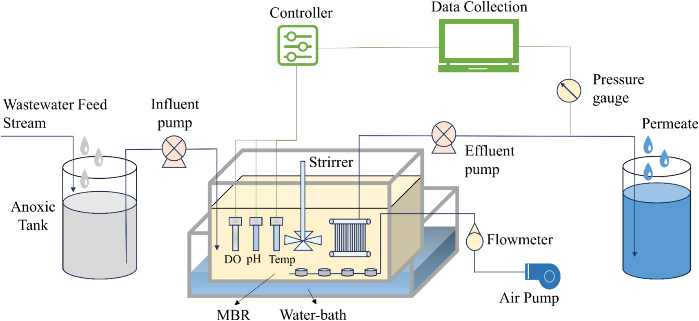
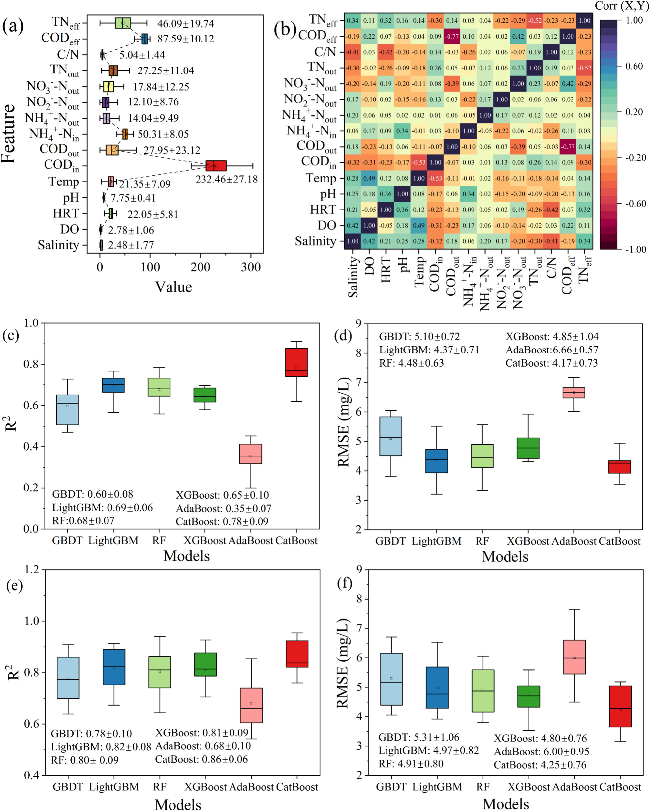
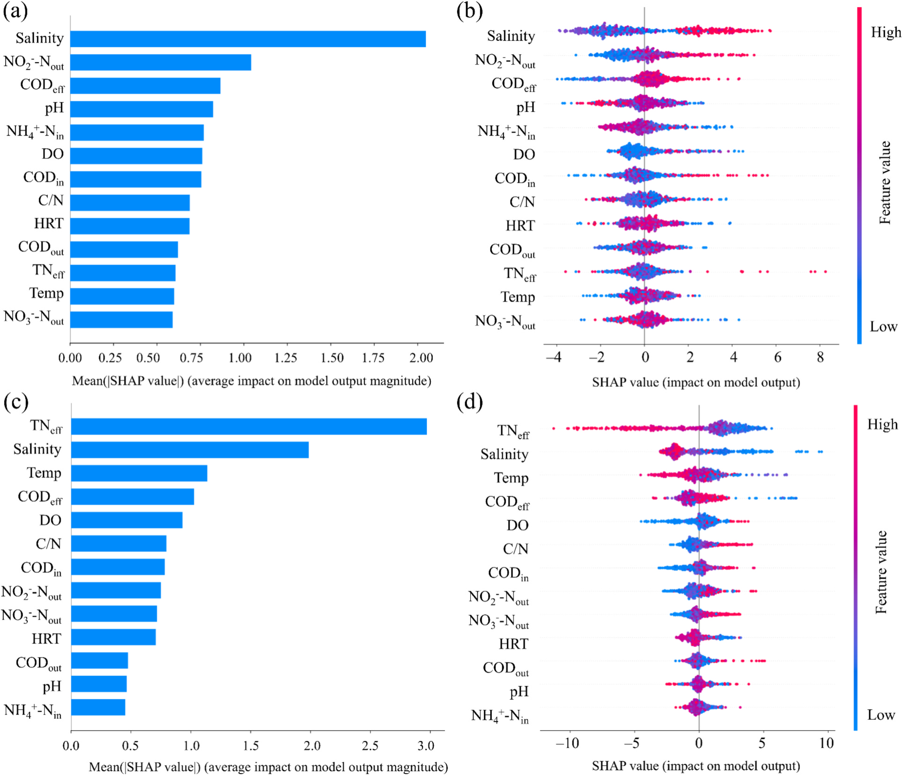
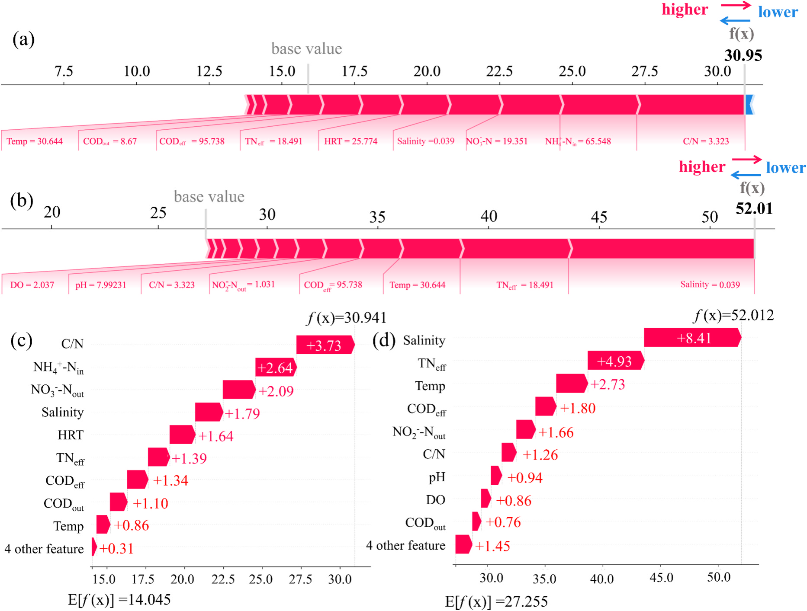
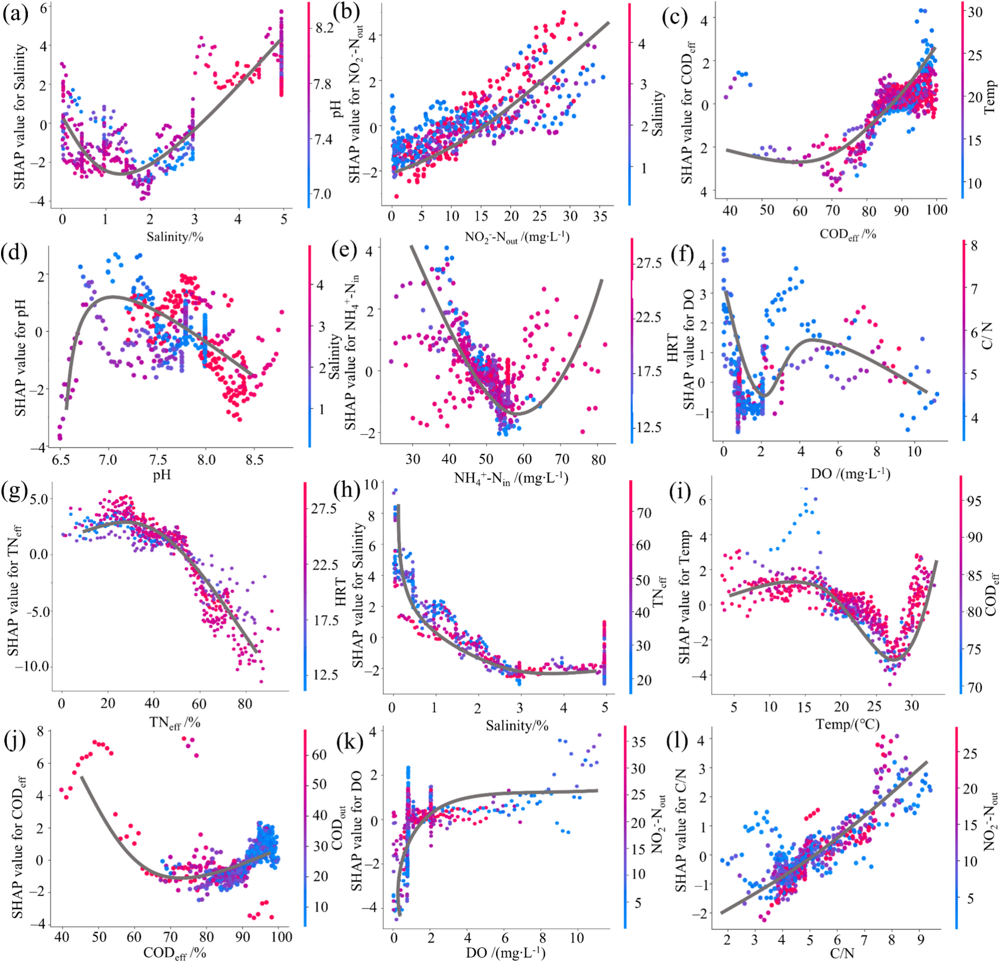

# Enhanced nitrogen prediction and mechanistic process analysis in high-salinity wastewater treatment using interpretable machine learning approach

## Abstract

- Khung học máy có thể giải thích (interpretable machine learning) dự đoán quá trình khử nitơ trong bể phản ứng sinh học màng (MBR) xử lý nước thải độ mặn cao:
  - Nghiên cứu tích hợp phương pháp giải thích Shapley (SHAP) với thuật toán tăng cường độ dốc CatBoost (Categorical Boosting).
  - Mô hình giải quyết khoảng trống then chốt giữa độ chính xác dự đoán và việc ra quyết định điều khiển vận hành hệ thống xử lý nước mặn.
  - CatBoost đạt hiệu năng cao nhất trên tập kiểm tra độc lập cho cả hai chỉ tiêu nitơ đầu ra:
    - Đối với amoni đầu ra ($NH_4^+\text{-N}_{out}$): hệ số xác định $R^2 = 0.88$ và sai số căn bậc hai trung bình bình phương $RMSE = 4.27\ \text{mg/L}$.
    - Đối với tổng nitơ đầu ra ($TN_{out}$): hệ số xác định $R^2 = 0.91$ và sai số $RMSE = 4.35\ \text{mg/L}$.
- Phân tích SHAP làm sáng tỏ vai trò kép của nồng độ muối hòa tan trong hệ vi sinh vật bùn hoạt tính:
  - Độ mặn cao đồng thời ức chế các enzyme nitrat hóa và làm gián đoạn quá trình chuyển hóa nguồn cơ chất cacbon.
  - Nồng độ oxy hòa tan ($DO$), độ $pH$ và hiệu suất khử nhu cầu oxy hóa học ($COD_{eff}$) đóng vai trò là các yếu tố điều hòa then chốt.
  - Nhiệt độ dòng vào và tỷ lệ cacbon trên nitơ ($C/N$) điều tiết động học chuyển hóa tổng nitơ thông qua mức độ sẵn có của chất cho electron.
  - Mô hình kết hợp SHAP và CatBoost liên kết mô hình hóa dự đoán với việc kiểm soát cơ chế sinh hóa thực tế trong các trạm xử lý.

## 1 Introduction

- Thách thức từ nước thải độ mặn cao và hạn chế vận hành của công nghệ MBR:
  - Nước thải từ sản xuất hóa chất, chế biến thực phẩm, dược phẩm và khử mặn nước biển chứa nồng độ muối hòa tan rất cao.
  - Nồng độ muối cao làm suy giảm tính thấm của đất và gây độc hại trực tiếp cho các hệ sinh thái thủy sinh.
  - Bể phản ứng sinh học màng (MBR) tích hợp quá trình phân tách màng với xử lý sinh học để lọc bỏ các chất ô nhiễm.
  - Khi nồng độ $NaCl > 1\%$, hoạt tính sinh học của vi khuẩn oxy hóa amoniac ($AOB$) bị ức chế nghiêm trọng.
  - Vi sinh vật chịu áp lực thẩm thấu ưu tiên tổng hợp các chất bảo vệ thẩm thấu ($osmoprotectants$) thay vì thực hiện phản ứng khử nitrat.
  - Các cảm biến truyền thống không thể phát hiện kịp thời sự thay đổi quần xã vi sinh vật theo thời gian thực.
  - Sự chậm trễ trong việc điều chỉnh chế độ sục khí làm tiêu hao năng lượng và đẩy chi phí vận hành tăng thêm từ $18\%\text{–}25\%$.
- Giới hạn của các phương pháp mô hình hóa truyền thống trong môi trường mặn:
  - Các mô hình cơ chế (mechanistic models) và bùn hoạt tính (ASM) gặp hiện tượng trôi dạt tham số động học ($kinetic\ parameter\ drift$).
  - Mô hình lai ghép ASM với thủy động lực học tính toán (ASM-CFD) dự đoán quá mức tốc độ nitrat hóa khi nồng độ muối tăng cao.
  - Các mô hình thực nghiệm hồi quy thất bại trên các dải độ mặn biến đổi do áp suất thẩm thấu làm rối loạn các con đường chuyển hóa $C/N$.
- Tiến bộ và khoảng trống ứng dụng của học máy trong xử lý nước thải:
  - Các mạng nơ-ron nhân tạo ($ANN$), $LSTM$, $XGBoost$ và $Random\ Forest$ đã được áp dụng để dự đoán nồng độ $TN$, $COD$ và kim loại nặng.
  - Hầu hết các nghiên cứu hiện tại chỉ tập trung vào hiện tượng nghẹt màng ($membrane\ fouling$) mà bỏ qua con đường biến dưỡng của vi sinh vật.
  - Chưa có nghiên cứu nào sử dụng biểu đồ lực SHAP force plots hoặc đồ thị PDP để khảo sát sự đánh đổi giữa enzyme nitrat hóa và phân bổ cacbon.
- Ba mục tiêu nghiên cứu cụ thể của bài báo:
  - Thiết lập khung học máy có thể giải thích để giải mã các điểm nghẽn chuyển hóa nitơ do độ mặn gây ra trong hệ thống MBR.
  - Định lượng các tương tác đa quy mô giữa thông số vận hành và chức năng nitrat hóa–khử nitrat của vi sinh vật chịu mặn.
  - Xây dựng các công cụ trực quan hóa hỗ trợ ra quyết định để chuyển đổi dự đoán của mô hình thành chiến lược vận hành thực tế.

## 2 Materials and methods

### 2.1 Membrane reactor equipment

- Thiết lập hệ thống thực nghiệm mô phỏng điều kiện áp lực chuyển hóa do nồng độ muối cao trong MBR:
  - Nước thải tổng hợp điều chế từ glucose ($C_6H_{12}O_6$), kali đihydro photphat ($KH_2PO_4$), amoni clorua ($NH_4Cl$) và natri clorua ($NaCl$).
  - Bổ sung các nguyên tố vi lượng theo tỷ lệ chuẩn để đảm bảo dinh dưỡng nền cho vi sinh vật bùn hoạt tính.
  - Vận hành $5$ mẻ phản ứng độc lập với thể tích làm việc hữu dụng mỗi bể là $10\ \text{L}$.
  - Nồng độ độ mặn nuôi cấy vi sinh vật được thiết lập trải rộng từ $0\%$ đến $5\%$.
  - Nhiệt độ bể phản ứng duy trì trong khoảng từ $5^\circ\text{C}$ đến $35^\circ\text{C}$ nhờ hệ thống ổn nhiệt cách thủy.
  - Nồng độ chất rắn lơ lửng ($SS$) trong hỗn hợp bùn hoạt tính được kiểm soát trong khoảng từ $3$ đến $8\ \text{g/L}$.
  - Chỉ số $pH$ của nước trong bể phản ứng duy trì ổn định trong phạm vi từ $7.0$ đến $8.5$.
  - Bơm nhu động thực hiện cấp nước đầu vào và rút nước đầu ra liên tục theo chu trình định sẵn.
  - Thời gian lưu nước thủy lực ($HRT$) được điều chỉnh linh hoạt trong khoảng từ $19$ đến $30\ \text{h}$.
  - Nồng độ oxy hòa tan ($DO$) trong bể được sục khí duy trì trong phạm vi từ $0.1$ đến $3.5\ \text{mg/L}$.
  - Tổng nitơ đầu vào ($TN_{in}$) cấu thành từ amoni ($NH_4^+\text{-N}_{in}$) với nồng độ biến thiên từ $20$ đến $90\ \text{mg/L}$.
  - Nồng độ nguồn cacbon ban đầu tính theo đương lượng $COD$ dao động trong khoảng từ $180$ đến $300\ \text{mg/L}$.
  - Quá trình phân hủy chất hữu cơ diễn ra thông qua phản ứng khử nitrat và quá trình bùn hoạt tính lơ lửng.
- Nước thải sau xử lý sinh học được xả ra ngoài thông qua các mô-đun màng lọc sợi rỗng:
  - **Hình 1. Sơ đồ hệ thống thiết bị thực nghiệm bể phản ứng sinh học màng (MBR) xử lý nước thải độ mặn cao**
    - 
    - Minh họa sơ đồ cấu tạo hệ thống thực nghiệm MBR xử lý nước thải có độ mặn từ $0\%$ đến $5\%$.
    - Sơ đồ thể hiện hệ thống sục khí khuấy trộn, bơm nhu động cấp dịch và thiết bị ổn nhiệt cách thủy.
    - Cụm mô-đun màng sợi rỗng ngập nước được giám sát hiện tượng nghẹt màng bằng đồng hồ đo áp suất xuyên màng.

### 2.2 Data collection and processing

- Thu thập dữ liệu chất lượng nước và xác định các biến đặc trưng hệ thống:
  - Chất lượng nước sau xử lý được đo đạc theo các quy trình tiêu chuẩn cho các hợp chất nitơ và hàm lượng hữu cơ.
  - Các thông số hiện trường như $DO$ và $pH$ được đo bằng thiết bị đo cầm tay HI98191 (Hanna Instruments, Ý).
  - Lưu lượng bơm nhu động được điều chỉnh để kiểm soát chính xác thời gian lưu nước thủy lực ($HRT$).
  - Bộ dữ liệu quan trắc hoàn chỉnh gồm $15$ thông số đặc trưng then chốt:
    - Hai biến mục tiêu đầu ra: amoni đầu ra ($NH_4^+\text{-N}_{out}$) và tổng nitơ đầu ra ($TN_{out}$).
    - Mười ba biến đầu vào: độ mặn ($salinity$), $DO$, $HRT$, $pH$, nhiệt độ ($Temp$), $COD_{in}$, $COD_{out}$, $NH_4^+\text{-N}_{in}$, $NO_2^-\text{-N}_{out}$, $NO_3^-\text{-N}_{out}$, tỷ lệ $C/N$, hiệu suất $COD_{eff}$ và hiệu suất $TN_{eff}$.
- Tiền xử lý dữ liệu thực nghiệm và phân chia tập dữ liệu huấn luyện:
  - Loại bỏ các mẫu trùng lặp và làm sạch tập dữ liệu để ngăn ngừa hiện tượng rò rỉ dữ liệu ($data\ leakage$).
  - Chuẩn hóa các biến đặc trưng đầu vào bằng các kỹ thuật biến đổi chuẩn của thư viện Scikit-learn.
  - Sử dụng phương pháp điểm Z ($Z\text{-score}$) để phát hiện điểm dị biệt và loại bỏ các giá trị ngoại lai vượt ngưỡng $3$.
  - Áp dụng kỹ thuật phân vị Winsor ($winsorization$) để chặn các giá trị nằm ngoài bách phân vị thứ $1$ và thứ $99$.
  - Tập dữ liệu tinh chế cuối cùng thu được tổng cộng $570$ mẫu thực nghiệm hoàn chỉnh.
  - Phân chia ngẫu nhiên dữ liệu với tỷ lệ $80\%$ dành cho tập huấn luyện và $20\%$ dành cho tập kiểm tra độc lập.
- Đánh giá tương quan Pearson tuyến tính giữa các biến:
  - Hệ số tương quan Pearson đối với $NH_4^+\text{-N}_{out}$ dao động trong dải hẹp từ $-0.05$ đến $0.22$.
  - Hệ số tương quan Pearson đối với $TN_{out}$ phân bố trong khoảng từ $-0.52$ đến $0.26$.
  - Mối liên hệ tuyến tính yếu giữa nồng độ nitơ đầu ra và các biến vận hành đòi hỏi phải sử dụng các thuật toán học máy phi tuyến.

### 2.3 Model construction and optimization

- Quy trình xây dựng, cấu hình không gian tham số và kiểm định các thuật toán học máy:
  - Nghiên cứu thiết lập hệ thống mô hình hóa học máy gồm sáu thuật toán để dự đoán hai chỉ tiêu nitơ đầu ra trong MBR.
  - Sử dụng mười ba biến vận hành thực nghiệm đầu vào để huấn luyện và đánh giá đối chuẩn các thuật toán.

#### 2.3.1 Machine learning algorithms

- Sáu thuật toán học máy học có giám sát được ứng dụng để mô phỏng chất lượng nước thải:
  - Gradient Boosting Decision Trees ($GBDT$): phương pháp học kết hợp xây dựng tuần tự các cây quyết định để sửa lỗi cây trước.
  - Light Gradient Boosting Machine ($LightGBM$): biến thể tối ưu của GBDT sử dụng thuật toán phân chia dựa trên biểu đồ tần số ($histogram$).
  - Random Forest ($RF$): phương pháp kết hợp xây dựng nhiều cây quyết định độc lập trên các tập con ngẫu nhiên của mẫu và đặc trưng.
  - XGBoost: thuật toán tăng cường độ dốc kết hợp kỹ thuật chính quy hóa ($regularization$) và tính toán song song hóa tốc độ cao.
  - Adaptive Boosting ($AdaBoost$): thuật toán gán trọng số lớn hơn cho các mẫu phân loại sai ở các vòng lặp trước để tạo bộ phân loại mạnh.
  - Categorical Boosting ($CatBoost$): thuật toán tăng cường độ dốc sử dụng cấu trúc cây đối xứng và xử lý biến phân loại hiệu quả.

#### 2.3.2 Bayesian optimization

- Tối ưu hóa siêu tham số bằng suy luận Bayes trên mô hình quá trình Gaussian ($Gaussian\ Process$):
  - Phương pháp xây dựng mô hình phân phối xác suất để cân bằng giữa khám phá vùng mới ($exploration$) và khai thác vùng tối ưu ($exploitation$).
  - Không gian tìm kiếm bao gồm tốc độ học ($learning\ rate$), độ sâu cây ($tree\ depth$) và số vòng lặp tối đa.
  - Tối ưu hóa Bayes đạt kết quả tốt hơn tìm kiếm lưới ($grid\ search$) và tìm kiếm ngẫu nhiên ($random\ search$) với số lần thử nghiệm ít hơn.
  - Mối quan hệ giữa dữ liệu quan trắc $D$ và hàm mục tiêu $f$ được mô hình hóa qua hệ phương trình toán học:
    - Tập dữ liệu quan trắc: $D = \{(x_1, y_1), (x_2, y_2), \dots, (x_n, y_n)\}$
    - Quan hệ quan trắc có sai số: $y_i = f(x_i) + \epsilon_i$, với $x_i$ là véc-tơ quyết định và $\epsilon_i$ là sai số quan trắc.
    - Phân phối xác suất hậu nghiệm theo định lý Bayes: $p(f|D) = \frac{p(D|f) \cdot p(f)}{p(D)}$
    - Trong đó $p(D|f)$ là phân phối hợp lý, $p(f)$ là phân phối tiền nghiệm và $p(D)$ là hợp lý biên.

#### 2.3.3 K-fold cross-validation

- Đánh giá độ ổn định và giảm thiểu độ lệch mô hình bằng kiểm định chéo $10\text{-fold}$:
  - Toàn bộ tập dữ liệu huấn luyện được chia đều thành $k = 10$ tập con có kích thước bằng nhau.
  - Trong mỗi vòng lặp, chín tập con được dùng để huấn luyện và một tập con đóng vai trò tập kiểm định chéo độc lập.
  - Quy trình lặp lại đúng $10$ lần để mỗi mẫu dữ liệu đều được kiểm định đúng một lần.
  - Giá trị trung bình trên các tập gấp phản ánh năng lực khái quát hóa khách quan và giảm thiểu hiện tượng quá khớp ($overfitting$).

#### 2.3.4 Implementation of machine learning models

- Triển khai lập trình mô hình trên ngôn ngữ Python 3.11.4 và thư viện scikit-learn:
  - Môi trường thực thi sử dụng ngôn ngữ Python 3.11.4 kết hợp các gói tính toán khoa học chuẩn.
  - Dữ liệu đầu vào được tiền xử lý qua các bước co giãn tỷ lệ (scaling) và mã hóa số học tương thích với từng mô hình.
  - Cấu hình siêu tham số tối ưu thu được từ quá trình tối ưu hóa Bayes được nạp trực tiếp vào từng mô hình.
  - Thuật toán CatBoost tự động chuyển đổi các đặc trưng phân loại thành đại diện số học trong quá trình huấn luyện.
  - Cấu trúc cây đối xứng của CatBoost giúp nâng cao tốc độ tính toán và kiểm soát nhiễu dữ liệu nồng độ muối cao.
  - Kiểm định chéo 10-fold bảo đảm tính nhất quán trong đánh giá hiệu năng giữa các vòng huấn luyện độc lập.
  - Kết quả kiểm định chéo $10\text{-fold}$ xác nhận CatBoost đạt độ tin cậy cao nhất với $R^2 = 0.78 \pm 0.09$ cho $NH_4^+\text{-N}$ và $0.86 \pm 0.06$ cho $TN$:
  - **Hình 2. Dải giá trị đặc trưng và kết quả kiểm định chéo 10-fold cho 6 thuật toán học máy**
    - 
    - Minh họa phân bố dải giá trị đặc trưng (a) và bản đồ nhiệt ma trận tương quan giữa các thông số (b).
    - Biểu đồ thanh hiển thị kết quả kiểm định chéo $10\text{-fold}$ về hệ số $R^2$ và sai số $RMSE$ cho $NH_4^+\text{-N}_{out}$ (c, d) và $TN_{out}$ (e, f).
    - Kết quả kiểm định xác nhận CatBoost đạt giá trị $R^2$ trung bình cao nhất và độ lệch chuẩn thấp nhất so với 5 mô hình còn lại.

### 2.4 Model performance evaluation

- Các chỉ số thống kê định lượng đánh giá hiệu năng mô hình dự đoán:
  - Hiệu năng của từng mô hình học máy được đánh giá bằng hệ số xác định ($R^2$) và sai số căn bậc hai trung bình bình phương ($RMSE$).
  - Công thức tính toán hệ số xác định $R^2$:
    - $R^2 = 1 - \frac{\sum_{i=1}^n (\hat{y}_i - y_i)^2}{\sum_{i=1}^n (\bar{y} - y_i)^2}$ (Phương trình 4)
    - Thang điểm $R^2$ đo lường tỷ lệ phương sai của biến mục tiêu được giải thích bởi các biến đặc trưng đầu vào.
  - Công thức tính toán sai số $RMSE$:
    - $RMSE = \sqrt{\frac{1}{n} \sum_{i=1}^n (\hat{y}_i - y_i)^2}$ (Phương trình 5)
    - Chỉ số $RMSE$ định lượng độ lệch tuyệt đối trung bình giữa giá trị dự đoán và giá trị thực tế theo đơn vị $\text{mg/L}$.
  - Ý nghĩa các ký hiệu toán học trong các phương trình đánh giá:
    - Ký hiệu $n$ đại diện cho tổng số lượng mẫu quan trắc trong tập kiểm tra độc lập.
    - Đại lượng $y_i$ và $\hat{y}_i$ lần lượt là nồng độ nitơ đo đạc thực nghiệm và giá trị nồng độ do mô hình dự đoán.
    - Giá trị $\bar{y}$ biểu thị nồng độ trung bình cộng của toàn bộ các mẫu đo thực nghiệm.
  - Cả hai chỉ số được tính toán trên tập dữ liệu kiểm tra sau khi hoàn thành kiểm định chéo để đảm bảo tính khách quan.

### 2.5 Model interpretation

- Phương pháp lý thuyết trò chơi Shapley Additive Explanations (SHAP) nâng cao khả năng diễn giải mô hình:
  - Giá trị SHAP định lượng đóng góp biên của từng đặc trưng đầu vào bằng cách xét tất cả các tổ hợp đặc trưng có thể có.
  - Mô hình diễn giải tuyến tính cục bộ được xác định bởi công thức toán học:
    - $g(z') = \phi_0 + \sum_{i=1}^M \phi_i z'_i$ (Phương trình 6)
    - Ký hiệu $g(z')$ là hàm giải thích xấp xỉ; $M$ là tổng số lượng biến đặc trưng đầu vào ($M = 13$).
    - Đại lượng $\phi_i$ là giá trị Shapley đại diện cho mức độ đóng góp của đặc trưng thứ $i$.
    - Biến nhị phân $z'_i \in \{0, 1\}$ thể hiện trạng thái xuất hiện hoặc vắng mặt của đặc trưng trong phép tính tổ hợp.
- Bốn công cụ trực quan hóa bổ trợ nhau cung cấp góc nhìn toàn cục và cục bộ:
  - Biểu đồ tổng quan SHAP summary plot: xếp hạng thứ bậc tầm quan trọng toàn cục của các biến dựa trên độ lớn giá trị SHAP trung bình.
  - Biểu đồ lực SHAP force plot: minh họa trực quan sự hội tụ của từng biến kéo giá trị dự đoán cao hơn hoặc thấp hơn mức kỳ vọng nền.
  - Biểu đồ thác nước SHAP waterfall plot: phân rã chi tiết mức độ đóng góp lũy tích từng bước của từng biến cho một mẫu dự đoán cụ thể.
  - Đồ thị phụ thuộc một phần (PDP): mô tả hàm đáp ứng phi tuyến giữa một hoặc hai biến quan tâm và biến mục tiêu khi cố định các biến còn lại.
  - Việc kết hợp đồng thời bốn công cụ này cho phép giải mã các cơ chế phản ứng sinh hóa ẩn sâu trong mô hình hộp đen.

## 3 Results and discussions

### 3.1 Model training and optimization

- Quy trình huấn luyện, tối ưu siêu tham số và so sánh đối chuẩn hiệu năng sáu thuật toán:
  - Khảo sát chi tiết năng lực mô phỏng động học nitơ của các mô hình trên tập dữ liệu thực nghiệm nước thải có độ mặn cao.
  - Sử dụng quá trình Gaussian kết hợp hàm tiếp thu để tìm kiếm điểm cấu hình tối ưu cho từng thuật toán.

#### 3.1.1 Hyperparameter optimization

- Tối ưu hóa siêu tham số bằng quá trình Gaussian thông qua hàm tiếp thu biên tin cậy dưới ($LCB$):
  - Hàm $LCB$ ($Lower\ Confidence\ Bound$) tối đa hóa mức cải thiện kỳ vọng của sai số $RMSE$ trong kiểm định chéo $10\text{-fold}$.
  - Không gian tìm kiếm được giới hạn theo các ràng buộc hóa lý và tính toán:
    - Tốc độ học ($learning\ rate$) trong khoảng $0.01\text{–}0.30$ để cân bằng tốc độ hội tụ và độ ổn định mô hình.
    - Độ sâu cây quyết định ($tree\ depth$) trong khoảng $3\text{–}20$ để kiểm soát độ phức tạp và chống quá khớp.
    - Hệ số chính quy hóa L2 trong khoảng $1\text{–}10$ nhằm triệt tiêu nhiễu dữ liệu do nồng độ muối cao.
  - Cấu hình tối ưu của CatBoost hội tụ tại độ sâu cây `depth = 8` và hệ số chính quy hóa `L2 = 3`.
  - Cấu hình tối ưu của LightGBM xác lập số lượng lá cây trong khoảng $20\text{–}50$, trong khi Random Forest chọn độ sâu từ $5\text{–}20$.
  - Thuật toán XGBoost sử dụng tỷ lệ lấy mẫu nhánh con ($subsampling$) từ $0.50\text{–}1.00$ để tăng độ bền vững trước dữ liệu thưa do lực ion.
  - Các cấu hình tối ưu hóa Bayes giúp giảm sai số $RMSE$ kiểm định từ $12\%\text{–}18\%$ so với cấu hình mặc định ban đầu.

#### 3.1.2 Model performance comparison

- Kết quả so sánh đối chuẩn hiệu năng của sáu thuật toán học máy trên tập kiểm tra độc lập:
  - Thuật toán CatBoost đạt hiệu năng cao nhất trên toàn bộ các chỉ tiêu đánh giá thống kê:
    - Dự đoán $NH_4^+\text{-N}_{out}$: đạt hệ số xác định $R^2 = 0.88$ và sai số $RMSE = 4.27\ \text{mg/L}$.
    - Dự đoán $TN_{out}$: đạt hệ số xác định $R^2 = 0.91$ và sai số $RMSE = 4.35\ \text{mg/L}$.
    - Điểm kiểm định chéo $10\text{-fold}$ của CatBoost đạt $R^2 = 0.78 \pm 0.09$ cho $NH_4^+\text{-N}$ và $0.86 \pm 0.06$ cho $TN$.
  - Thuật toán LightGBM xếp vị trí thứ hai:
    - Đạt $R^2 = 0.81$ và $RMSE = 4.97\ \text{mg/L}$ cho $NH_4^+\text{-N}_{out}$.
    - Đạt $R^2 = 0.82$ và $RMSE = 5.17\ \text{mg/L}$ cho $TN_{out}$.
  - So với LightGBM, mô hình CatBoost tăng chỉ số $R^2$ thêm $9\%$ đối với $NH_4^+\text{-N}$ và $10\%$ đối với $TN$.
  - CatBoost giảm sai số $RMSE$ tương ứng $14\%$ đối với $NH_4^+\text{-N}$ và $16\%$ đối với $TN$.
  - Bốn thuật toán còn lại cho hiệu năng thấp hơn (Bảng 1):
    - Random Forest ($RF$): $R^2 = 0.79$, $RMSE = 5.48\ \text{mg/L}$ ($NH_4^+$); $R^2 = 0.80$, $RMSE = 5.25\ \text{mg/L}$ ($TN$).
    - XGBoost: $R^2 = 0.71$, $RMSE = 5.85\ \text{mg/L}$ ($NH_4^+$); $R^2 = 0.76$, $RMSE = 5.20\ \text{mg/L}$ ($TN$).
    - GBDT: $R^2 = 0.68$, $RMSE = 6.10\ \text{mg/L}$ ($NH_4^+$); $R^2 = 0.71$, $RMSE = 5.71\ \text{mg/L}$ ($TN$).
    - AdaBoost: $R^2 = 0.54$, $RMSE = 7.66\ \text{mg/L}$ ($NH_4^+$); $R^2 = 0.63$, $RMSE = 6.50\ \text{mg/L}$ ($TN$).
  - Các kết quả định lượng khẳng định tính chuẩn xác và sự phù hợp của CatBoost trong mô phỏng động học nitơ nước thải mặn.

### 3.2 Feature importance ranking

- Đánh giá thứ bậc tầm quan trọng toàn cục của các biến đặc trưng qua phân tích SHAP:
  - Sáu đặc trưng hàng đầu cho từng biến mục tiêu được lựa chọn dựa trên sự kết hợp giữa xếp hạng SHAP và cơ chế sinh hóa thực tế.
- Các đặc trưng chi phối dự đoán amoni đầu ra ($NH_4^+\text{-N}_{out}$) và cơ chế sinh học tương ứng:
  - Độ mặn ($salinity$) là biến có tầm ảnh hưởng lớn nhất, với giá trị SHAP cao gần gấp đôi biến xếp thứ hai là $NO_2^-\text{-N}_{out}$.
  - Nồng độ muối cao làm suy giảm thế chênh proton qua màng vi khuẩn AOB, ức chế enzyme ammonia monooxygenase ($AMO$) và hydroxylamine oxidoreductase ($HAO$).
  - Sự tích tụ nitrit ($NO_2^-\text{-N}_{out}$) gây hiện tượng ức chế phản hồi do cạnh tranh vị trí hoạt động trên enzyme $AMO$.
  - Hiệu suất $COD_{eff}$ phản ánh sự cạnh tranh cơ chất: hiệu suất khử $COD$ cao chứng tỏ vi khuẩn dị dưỡng chiếm ưu thế và cạnh tranh chất dinh dưỡng của vi khuẩn nitrat hóa.
  - Giá trị $pH$ dao động ngoài vùng tối ưu $7.5\text{–}8.5$ làm mất cân bằng bơm proton dưới tác động của lực ion muối cao.
  - Tải lượng $NH_4^+\text{-N}_{in}$ đầu vào vượt quá năng lực nitrat hóa của hệ thống sẽ dẫn tới sự gia tăng tỷ lệ thuận của amoni đầu ra.
  - Nồng độ $DO$ thể hiện tác động phi tuyến: quá trình nitrat hóa cần $DO > 2\ \text{mg/L}$, nhưng độ mặn làm giảm độ tan của oxy và dễ gây thiếu khí cục bộ.
  - Các biến $TN_{eff}$, nhiệt độ và $NO_3^-\text{-N}_{out}$ có ảnh hưởng rất nhỏ đến dự đoán $NH_4^+\text{-N}_{out}$.
- Các đặc trưng chi phối dự đoán tổng nitơ đầu ra ($TN_{out}$) và cơ chế sinh học tương ứng:
  - Hiệu suất $TN_{eff}$ là biến dự đoán mạnh nhất, phản ánh trực tiếp hiệu quả loại bỏ nitơ tổng thể của toàn bộ hệ thống.
  - Độ mặn là yếu tố quan trọng thứ hai với giá trị SHAP bằng khoảng $2/3$ giá trị của $TN_{eff}$.
  - Độ mặn gây ức chế kép: ngăn cản chuyển hóa amoni và ức chế enzyme nitrate reductase ($Nar$) cùng nitrite reductase ($Nir$) của vi khuẩn khử nitrat.
  - Vi sinh vật chịu mặn phân bổ nguồn cơ chất cacbon để tổng hợp glycine betaine nhằm chống áp suất thẩm thấu thay vì cấp electron khử nitrat.
  - Nhiệt độ ảnh hưởng rõ nét do tính chất ưa nhiệt của vi khuẩn khử nitrat (khoảng tối ưu $20\text{–}40^\circ\text{C}$); nhiệt độ $< 15^\circ\text{C}$ làm bất hoạt enzyme $Nar$.
  - Hiệu suất $COD_{eff}$ và tỷ lệ $C/N$ cùng kiểm soát chất cho electron: tỷ lệ $C/N < 5$ gây thiếu hụt nguồn cacbon hữu cơ để khử hoàn toàn nitrat.
  - Oxy hòa tan $DO > 0.5\ \text{mg/L}$ thâm nhập vào vùng thiếu khí sẽ ức chế hoạt tính của enzyme $Nar$.
  - Các biến $COD_{out}$, $pH$ và $NH_4^+\text{-N}_{in}$ có mức độ ảnh hưởng hạn chế đến dự đoán nồng độ $TN_{out}$.
- Phân tích SHAP toàn cục xác định thứ bậc tầm quan trọng và cơ chế tác động của các biến đặc trưng then chốt:
  - **Hình 3. Phân tích khả năng diễn giải tầm quan trọng đặc trưng toàn cục SHAP cho mô hình CatBoost**
    - 
    - Biểu đồ phân tích tầm quan trọng toàn cục SHAP cho dự đoán $NH_4^+\text{-N}_{out}$ (a, b) và $TN_{out}$ (c, d).
    - Độ mặn là yếu tố chi phối hàng đầu đối với $NH_4^+\text{-N}_{out}$, trong khi $TN_{eff}$ và độ mặn kiểm soát dự đoán $TN_{out}$.
    - Minh họa phân bố giá trị SHAP trung bình tuyệt đối kết hợp màu sắc giá trị đặc trưng từ thấp (xanh) đến cao (đỏ).

### 3.3 Local feature contributions

- Phân tích đóng góp cục bộ của từng biến đặc trưng cho từng trường hợp dự đoán cụ thể:
  - Sử dụng biểu đồ lực ($force\ plot$) và biểu đồ thác nước ($waterfall\ plot$) để làm rõ hướng tác động và độ lớn của từng biến.
- Đóng góp cục bộ đối với dự đoán nồng độ amoni đầu ra ($NH_4^+\text{-N}_{out}$):
  - Biểu đồ lực thể hiện tác động lũy tích của các yếu tố kéo giá trị dự đoán về kết quả cuối cùng.
  - Tỷ lệ $C/N$, nồng độ $NH_4^+\text{-N}_{in}$, $NO_3^-\text{-N}_{out}$, độ mặn, $HRT$ và $TN_{eff}$ là những thông số có ảnh hưởng mạnh nhất.
  - Các biến $COD_{eff}$, $COD_{out}$ và nhiệt độ đóng góp đáng kể vào việc đẩy giá trị dự đoán amoni lên cao.
  - Biểu đồ thác nước phân rã chi tiết đóng góp từng biến: tỷ lệ $C/N$, $NH_4^+\text{-N}_{in}$, $NO_3^-\text{-N}_{out}$ và độ mặn cùng đóng góp dương.
  - Nồng độ amoni đầu vào cao kết hợp nồng độ muối lớn tạo tương quan trực tiếp làm tăng nồng độ amoni tồn dư trong nước sau xử lý.
  - Các thông số vận hành như $HRT$, $TN_{eff}$ và $COD_{eff}$ đóng góp giá trị dương ở mức độ thấp hơn, phản ánh hiệu suất phản ứng nitrat hóa.
- Đóng góp cục bộ đối với dự đoán nồng độ tổng nitơ đầu ra ($TN_{out}$):
  - Biểu đồ lực xác định độ mặn, $TN_{eff}$, nhiệt độ, $COD_{eff}$, $NO_2^-\text{-N}_{out}$ và tỷ lệ $C/N$ là các nhân tố điều khiển chính.
  - Chỉ số $DO$ và $pH$ làm tăng nhẹ giá trị dự đoán $TN$, trong khi độ mặn và $TN_{eff}$ thể hiện tác động mạnh mẽ hơn rõ rệt.
  - Đóng góp đáng kể của tỷ lệ $C/N$ và $NO_2^-\text{-N}_{out}$ nhấn mạnh độ nhạy cảm của quá trình khử nitrat trước nồng độ cơ chất.
  - Biểu đồ thác nước chỉ ra rằng độ mặn, $TN_{eff}$ và nhiệt độ là các nhân tố chủ đạo làm gia tăng giá trị dự đoán tổng nitơ.
  - Tác động chi phối của độ mặn làm nổi bật cơ chế ức chế sinh học: nồng độ muối cao hạn chế nghiêm ngặt hoạt tính của vi khuẩn khử nitrat.
- Phân tích diễn giải cục bộ bằng biểu đồ lực và biểu đồ thác nước SHAP làm rõ sự hội tụ và phân rã đóng góp của từng biến:
  - **Hình 4. Phân tích diễn giải cục bộ bằng SHAP cho mô hình CatBoost: Force plots (a-b) và Waterfall plots (c-d) đối với NH4+-N và TN**
    - 
    - Biểu đồ lực SHAP force plots (a, b) mô tả các véc-tơ lực đẩy giá trị dự đoán lệch khỏi mốc cơ sở cho $NH_4^+\text{-N}_{out}$ và $TN_{out}$.
    - Biểu đồ thác nước SHAP waterfall plots (c, d) phân rã định lượng từng bước đóng góp của các biến đối với một quan trắc thực tế.
    - Nồng độ muối cao và dòng vào gia tăng tích tụ đóng góp dương đẩy nồng độ nitơ đầu ra tăng cao.

### 3.4 Partial dependence analysis

- Phân tích đáp ứng biên phi tuyến của các đặc trưng thông qua đồ thị phụ thuộc một phần (PDP):
  - Đồ thị PDP mô tả chiều hướng và cường độ tác động của từng thông số khi giữ cố định giá trị của các biến khác.
  - Mã màu sắc thể hiện hiệu ứng tương tác: màu đỏ tương ứng giá trị biến tương tác cao, màu xanh tương ứng giá trị thấp.
- Hàm đáp ứng phi tuyến đối với nồng độ amoni đầu ra ($NH_4^+\text{-N}_{out}$):
  - Độ mặn thể hiện xu hướng giảm khi dưới $2\%$, nhưng tăng mạnh phi tuyến khi vượt qua mốc $2\%$ do ức chế vi sinh vật.
  - Nồng độ $NO_2^-\text{-N}_{out}$ thể hiện xu hướng tăng tuyến tính nhất quán, chứng tỏ tích tụ nitrit là dấu hiệu của quá trình nitrat hóa bị gián đoạn.
  - Hiệu suất $COD_{eff}$ có tác động tối thiểu khi dưới $70\%$, nhưng khi vượt qua $70\%$ thì nồng độ amoni đầu ra tăng vọt do cạn kiệt cơ chất năng lượng.
  - Giá trị $pH$ tăng nhanh khi tiếp cận $7.0$ và bắt đầu giảm khi vượt qua $7.5$; giá trị SHAP chuyển sang âm khi $pH > 7.5$.
  - Hiệu ứng tương tác giữa $pH$ và độ mặn trở nên rõ rệt nhất khi giá trị $pH > 8.0$.
  - Nồng độ $NH_4^+\text{-N}_{in}$ đầu vào duy trì giá trị SHAP dương khi dưới $55\ \text{mg/L}$ và tăng nhanh trở lại khi vượt mốc $60\ \text{mg/L}$.
  - Nồng độ $DO$ giảm nhanh trong dải $0\text{–}2\ \text{mg/L}$, tăng trong dải $2\text{–}6\ \text{mg/L}$ và giảm dần khi $DO > 6\ \text{mg/L}$.
- Hàm đáp ứng phi tuyến đối với nồng độ tổng nitơ đầu ra ($TN_{out}$):
  - Hiệu suất $TN_{eff}$ tương quan nghịch rõ rệt với $TN_{out}$, đặc biệt khi hiệu suất vượt ngưỡng $40\%$.
  - Tương tác giữa $TN_{eff}$ và $HRT$ thể hiện rõ nét nhất trong phạm vi hiệu suất khử từ $20\%$ đến $60\%$.
  - Độ mặn từ $0\%$ đến $2\%$ dẫn đến sự suy giảm rõ rệt của $TN_{out}$, nhưng khi vượt quá $2\%$ thì giá trị SHAP đi vào trạng thái bão hòa ổn định.
  - Nhiệt độ có tác động rất nhỏ trong khoảng từ $0^\circ\text{C}$ đến $20^\circ\text{C}$, giảm dần từ $20^\circ\text{C}$ đến $25^\circ\text{C}$ và tăng vọt khi vượt quá $30^\circ\text{C}$.
  - Khoảng nhiệt độ từ $25^\circ\text{C}$ đến $30^\circ\text{C}$ là vùng tối ưu cho hoạt động trao đổi chất của vi khuẩn nitrat hóa và khử nitrat.
  - Tương tác giữa nhiệt độ và $COD_{eff}$ đặc biệt rõ rệt trong dải $15\text{–}30^\circ\text{C}$.
  - Khi $COD_{eff} < 70\%$, tồn tại tương quan nghịch tuyến tính với $TN_{out}$; nhưng khi $COD_{eff} > 70\%$, giá trị SHAP tăng do thiếu hụt nguồn cacbon hữu cơ.
  - Nồng độ $DO$ từ $0$ đến $2\ \text{mg/L}$ làm tăng giá trị SHAP của $TN_{out}$ và đạt trạng thái ổn định khi vượt quá $2\ \text{mg/L}$.
  - Tương tác giữa $NO_2^-\text{-N}_{out}$ và $DO$ thể hiện rõ nhất khi $DO$ nằm trong khoảng $0\text{–}4\ \text{mg/L}$.
  - Tỷ lệ $C/N$ tương quan thuận với $TN_{out}$ do tỷ lệ quá cao gây ức chế phản ứng khử nitrat; khoảng $C/N$ từ $3$ đến $8$ là thuận lợi nhất.
- Đồ thị phụ thuộc một phần PDP xác định rõ các ngưỡng chuyển đổi phi tuyến và vùng vận hành tối ưu cho các phản ứng sinh hóa:
  - **Hình 5. Đồ thị phụ thuộc một phần (PDP) của các đặc trưng then chốt đối với hiệu quả chuyển hóa nitơ**
    - 
    - Đồ thị PDP cho 6 biến hàng đầu dự đoán $NH_4^+\text{-N}_{out}$ (a–f) và $TN_{out}$ (g–l).
    - Đường cong phản ứng xác lập ngưỡng chuyển tiếp độ mặn $2\%$, ngưỡng $COD_{eff} = 70\%$ và dải nhiệt độ tối ưu $25\text{–}30^\circ\text{C}$.
    - Màu sắc biểu thị hiệu ứng tương tác đa biến giữa các thông số công nghệ vận hành trong MBR.

### 3.5 Underlying mechanisms and processes

- Cơ chế sinh hóa học chi phối sự cản trở quá trình oxy hóa amoniac trong môi trường mặn:
  - Áp suất thẩm thấu do nồng độ muối cao phá vỡ gradien proton qua màng tế bào của vi khuẩn oxy hóa amoni ($AOB$) và nitrit ($NOB$).
  - Sự suy giảm thế điện hóa màng làm bất hoạt hai enzyme chủ đạo là ammonia monooxygenase ($AMO$) và hydroxylamine oxidoreductase ($HAO$).
  - Phản ứng nitrat hóa bị đình trệ làm tích tụ nồng độ amoni cao trong dòng nước sau xử lý.
  - Điều kiện độ mặn cao tạo ưu thế sinh thái cho các chủng vi khuẩn ưa mặn (ví dụ *Halomonas*), vốn không có năng lực nitrat hóa hiệu quả.
  - Vi sinh vật chuyển hướng sử dụng cơ chất cacbon để tổng hợp các chất tương thích thẩm thấu như glycine betaine nhằm tự bảo vệ.
  - Quá trình này làm chuyển hướng dòng cacbon khỏi các chức năng chuyển hóa nitơ thiết yếu.
  - Tỷ lệ $C/N$ cao phá vỡ sự cân bằng giữa vi sinh vật tự dưỡng nitrat hóa và vi sinh vật dị dưỡng.
  - Độ mặn làm suy giảm độ hòa tan của oxy và tạo các vi vùng thiếu khí ($hypoxic\ zones$), cản trở phản ứng nitrat hóa hiếu khí.
- Cơ chế phân tử gây suy giảm hiệu quả khử tổng nitơ ($TN$):
  - Muối nồng độ cao ức chế trực tiếp hoạt tính xúc tác của enzyme nitrate reductase ($Nar$) và nitrite reductase ($Nir$).
  - Muối làm biến tính cấu trúc không gian của phức hợp cytochrome c trong chuỗi truyền electron, làm giảm hiệu suất vận chuyển điện tử.
  - Các bước khử nitrat từ $NO_3^-$ và $NO_2^-$ về khí $N_2$ bị tắc nghẽn, dẫn tới tích lũy các oxit nitơ ($NO_x^-$).
  - Tình trạng thiếu hụt chất cho electron do phân bổ cacbon cho việc chống sốc thẩm thấu làm giảm tốc độ khử nitrat.
  - Sự tích lũy nitrit ($NO_2^-$) sinh ra ức chế ngược đối với vi khuẩn AOB, tạo vòng lặp tiêu cực làm suy giảm khả năng làm sạch nước thải.
  - Các tương tác đồng thời giữa oxy hòa tan, nhiệt độ và độ đệm $pH$ quyết định hiệu quả khôi phục hoạt tính sinh học của hệ bùn hoạt tính.

### 3.6 Implications and outlook

- Ý nghĩa thực tiễn đối với điều khiển quy trình công nghệ và tối ưu hóa vận hành nhà máy xử lý nước thải:
  - Khung mô hình CatBoost cải thiện đáng kể độ chính xác so với mô hình tốt thứ hai LightGBM ($9\%$ hệ số $R^2$ và $14\%$ sai số $RMSE$).
  - Phân tích SHAP phát hiện sự cạnh tranh cơ chất cacbon gay gắt khi hiệu suất khử $COD$ tăng cao, làm bỏ đói vi sinh vật tự dưỡng.
  - Phân tích thác nước SHAP chỉ ra rằng ở nhiệt độ dưới $20^\circ\text{C}$, hoạt tính enzyme Nar suy giảm mạnh theo quy luật Arrhenius.
  - Tác động suy giảm động học này giảm bớt khi nhiệt độ vượt mốc $25^\circ\text{C}$ nhờ quán tính nhiệt của sinh khối bùn hoạt tính.
  - Nghiên cứu đề xuất ngưỡng kiểm soát oxy hòa tan chính xác trong khoảng $0.5\text{–}1.2\ \text{mg/L}$ để cân bằng nitrat hóa và khử nitrat.
  - Mức khuyến nghị này tối ưu hơn các hướng dẫn sục khí chung chung trước đây, giúp tiết kiệm đáng kể chi phí điện năng máy thổi khí.
- Các giới hạn nghiên cứu hiện tại và định hướng phát triển trong tương lai:
  - Mô hình yêu cầu quy trình hiệu chuẩn mở rộng khi áp dụng cho các nguồn nước thải có thành phần hữu cơ phức tạp hoặc biến động độ mặn lớn.
  - Cần duy trì hệ thống quan trắc tự động liên tục các thông số môi trường để cung cấp dữ liệu đầu vào ổn định cho mô hình dự báo.
  - Nghiên cứu hiện tại tập trung chủ yếu vào nước thải mặn tổng hợp và cần kiểm chứng trên các hệ thống quy mô công nghiệp thực tế.
  - Các nghiên cứu tiếp theo cần tích hợp tác động đồng thời của các yếu tố gây độc hại khác như kim loại nặng hoặc chất ô nhiễm hữu cơ khó phân hủy.
  - Việc đưa thêm các thông số áp suất màng, chất hấp phụ và tốc độ bám bẩn màng sẽ giúp hoàn thiện chiến lược điều khiển tự động hóa.

## 4 Conclusion

- Kết luận tổng quan về hiệu quả của khung học máy có thể giải thích trong xử lý nước thải mặn bằng MBR:
  - Nghiên cứu ứng dụng thành công khung học máy kết hợp giải thích SHAP để dự đoán nồng độ nitơ đầu ra trong hệ thống MBR.
  - Thuật toán CatBoost đạt hiệu năng cao nhất với $R^2 = 0.88$ ($RMSE = 4.27\ \text{mg/L}$) cho $NH_4^+\text{-N}_{out}$ và $R^2 = 0.91$ ($RMSE = 4.35\ \text{mg/L}$) cho $TN_{out}$.
  - So với mô hình LightGBM tốt thứ hai, CatBoost tăng hệ số $R^2$ thêm $9\%\text{–}10\%$ và giảm sai số $RMSE$ từ $14\%\text{–}16\%$.
- Khám phá cơ chế sinh hóa học và xây dựng giải pháp điều khiển quy trình thực tế:
  - Phân tích SHAP xác nhận độ mặn là yếu tố chi phối mạnh mẽ nhất làm suy giảm hiệu quả xử lý sinh học.
  - Nồng độ muối cao làm bất hoạt các enzyme nitrat hóa đồng thời gây gián đoạn quá trình khử nitrat qua cạnh tranh chuyển hóa cacbon.
  - Hiệu suất khử $COD_{eff}$ và nồng độ $DO$ giữ vai trò điều hòa chính đối với quần xã vi sinh vật bùn hoạt tính.
  - Nhiệt độ dòng vào trực tiếp điều biến động học enzyme của các chủng vi khuẩn khử nitrat ưa nhiệt.
  - Đồ thị phụ thuộc một phần PDP xác định các ngưỡng chuyển đổi phi tuyến quan trọng của độ mặn và tỷ lệ $C/N$.
  - Kết quả cung cấp căn cứ định lượng để thiết lập các biện pháp can thiệp kỹ thuật như kiểm soát độ mặn, châm bổ sung nguồn cacbon và tối ưu sục khí.
  - Mô hình học máy có thể giải thích tạo cầu nối giữa dự đoán định lượng và hiểu biết cơ chế, hỗ trợ vận hành thông minh và giảm chi phí xử lý.
