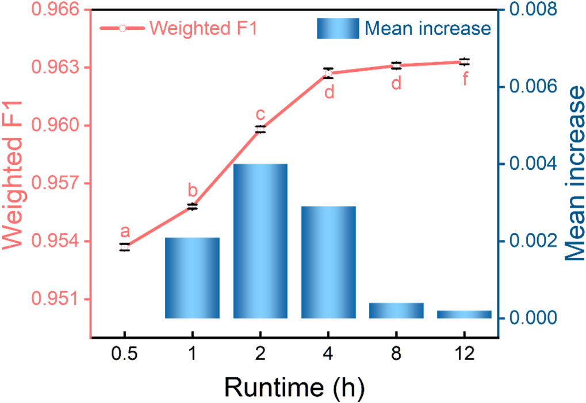
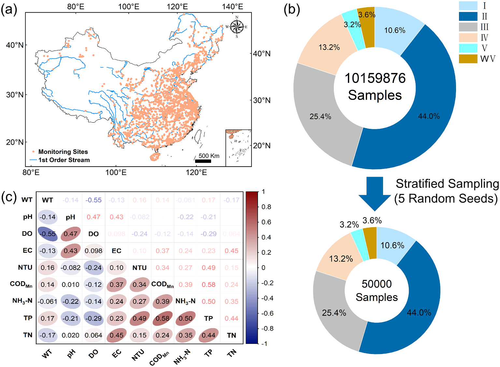
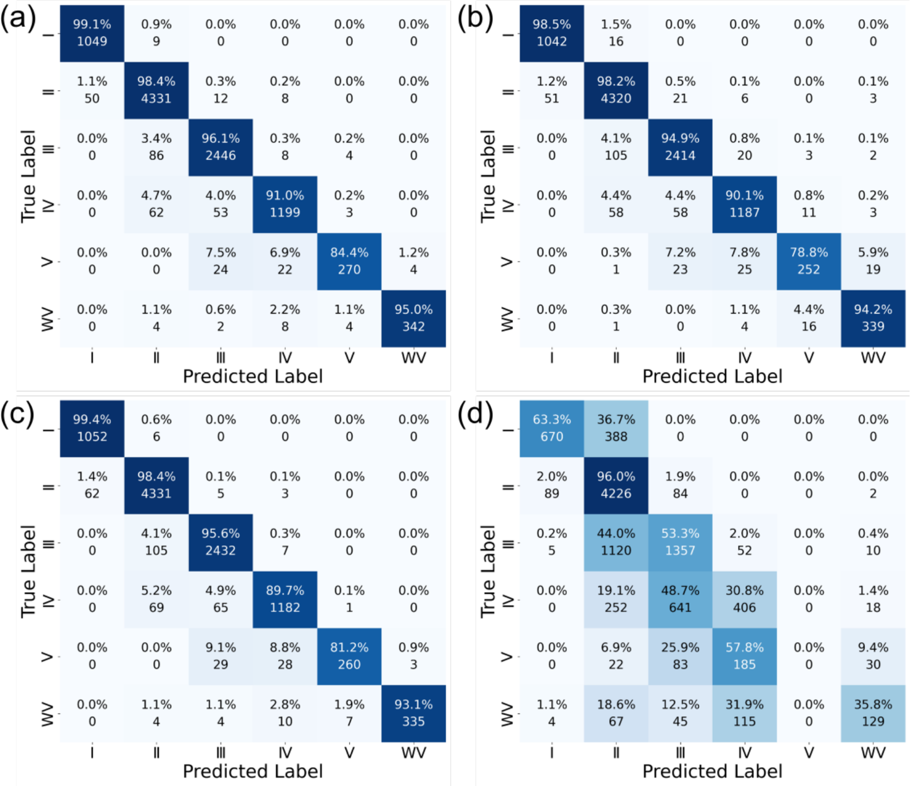
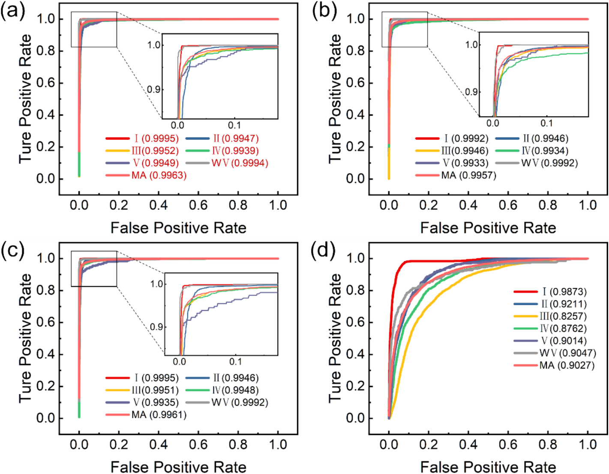
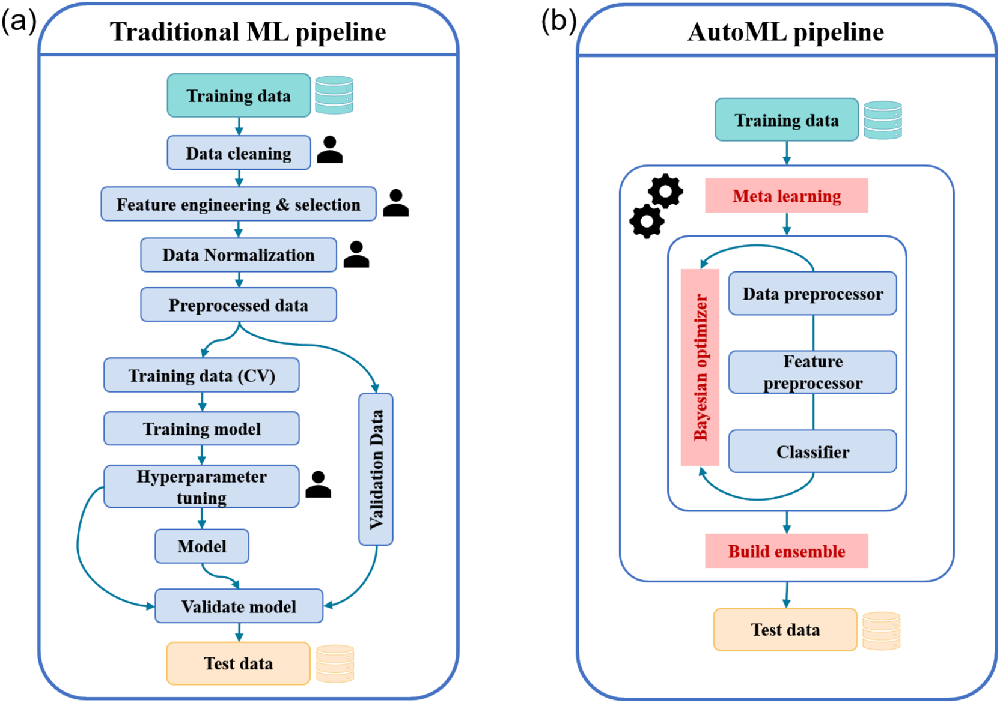
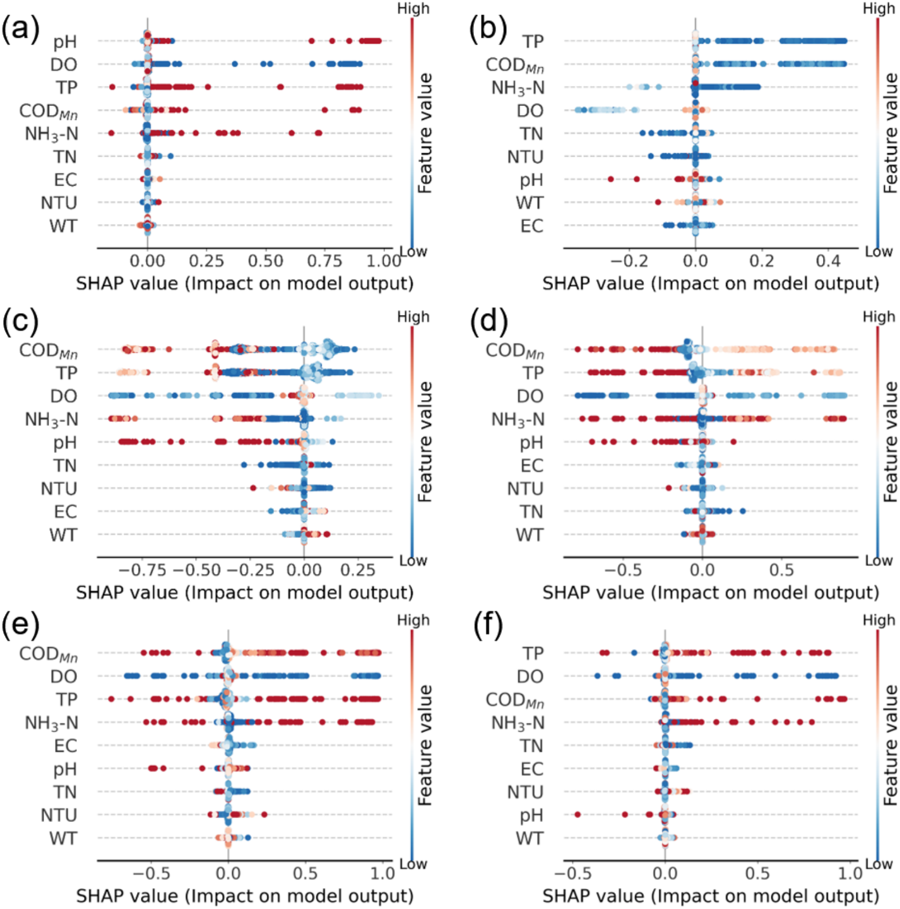
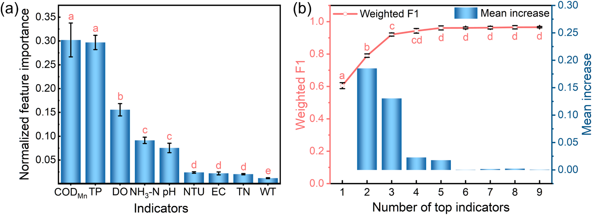
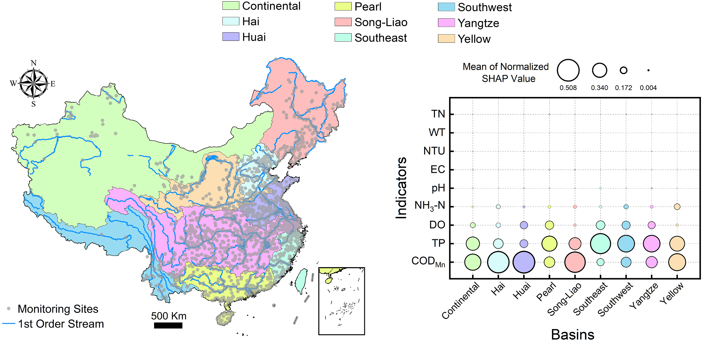

# Explainable AutoML-driven surface water quality classification with key indicators identification

## Abstract

- **Thách thức kép trong quan trắc và phân loại chất lượng nước mặt**:
  - Chi phí quan trắc cao khi đo đạc đầy đủ các chỉ tiêu theo quy chuẩn.
  - Quy trình xây dựng học máy truyền thống tốn nhiều thời gian và công sức chuyên gia.
- **Khung làm việc tự động và có thể giải thích (Explainable AutoML)**:
  - Khung làm việc Auto-sklearn tự động hóa toàn bộ quy trình lựa chọn mô hình và tối ưu siêu tham số.
  - Phân tích SHAP định lượng mức độ đóng góp của từng chỉ tiêu để giảm thiểu số lượng thông số cần đo.
- **Hiệu năng phân loại vượt bậc của Auto-sklearn**:
  - Dữ liệu thu thập từ các lưu vực sông chính tại Trung Quốc.
  - Auto-sklearn đạt hiệu năng trung bình cao nhất với chỉ số Weighted $\text{F1} = 0.9633 \pm 0.0027$ nhờ cấu trúc ensemble tối ưu.
  - Mô hình duy trì độ ổn định cao qua hai sơ đồ kiểm định nghiêm ngặt theo thời gian và không gian.
- **Sàng lọc bộ chỉ số then chốt bằng Kernel SHAP**:
  - Xác định $3$ chỉ số then chốt trên quy mô toàn quốc gồm $\text{COD}_{\text{Mn}}$, $\text{TP}$ và $\text{DO}$.
  - Mô hình Auto-sklearn sử dụng $3$ chỉ số này đạt Weighted $\text{F1} = 0.9205 \pm 0.0097$.
  - Mô hình $3$ chỉ số thể hiện độ chính xác cao hơn rõ rệt so với phương pháp đánh giá đơn nhân tố truyền thống trên tất cả các cấp nước.
  - Hiệu năng cải thiện tương đối $18.9\%$ đối với nước ô nhiễm nghiêm trọng (Cấp WV).
- **Tính dị biệt theo không gian giữa các lưu vực**:
  - Phần lớn lưu vực đồng nhất với bộ $3$ chỉ số toàn quốc ($\text{COD}_{\text{Mn}}$, $\text{TP}$, $\text{DO}$).
  - Hai lưu vực phía Bắc (Tùng Liêu và Hoàng Hà) đòi hỏi bổ sung thêm chỉ số $\text{NH}_3\text{-N}$.

## 1 Introduction

- **Tầm quan trọng và thách thức của hệ thống quan trắc chất lượng nước mặt**:
  - Hệ thống giám sát và cảnh báo sớm chất lượng nước mặt bảo vệ sức khỏe cộng đồng và môi trường sinh thái theo mục tiêu phát triển bền vững SDG 6 và SDG 14.
  - Các quốc gia đang phát triển đối mặt với rào cản lớn về nguồn lực và chi phí vận hành hệ thống đo đạc liên tục.
- **Bất cập từ phương pháp đánh giá đơn nhân tố (Single-factor evaluation)**:
  - Mạng lưới quan trắc tự động tại Trung Quốc triển khai từ năm 1999 áp dụng quy tắc đơn nhân tố theo tiêu chuẩn môi trường.
  - Quy chuẩn đòi hỏi quan trắc đến $24$ chỉ tiêu hóa lý, bao gồm kim loại nặng (thủy ngân, chì) và các hợp chất hữu cơ đặc thù (phenol bay hơi).
  - Cảm biến đo kim loại nặng và chất hữu cơ đắt tiền, dễ hỏng hóc trong điều kiện hiện trường, dẫn đến gián đoạn chuỗi số liệu.
  - Mạng lưới quan trắc quốc gia trên thực tế phải thu gọn về nhóm chỉ tiêu khả thi hơn để đảm bảo vận hành ổn định.
- **Rào cản khi áp dụng học máy truyền thống trong thủy văn**:
  - Phương pháp thống kê truyền thống như phân tích thành phần chính (PCA) và tương quan Pearson hạn chế trước các mối quan hệ phi tuyến phức tạp.
  - Học máy truyền thống đòi hỏi quy trình đa tầng thủ công: tiền xử lý dữ liệu, kỹ thuật trích xuất đặc trưng, lựa chọn thuật toán và tối ưu hóa siêu tham số (HPO).
  - Quá trình HPO phải duyệt hàng trăm đến hàng nghìn cấu hình, tiêu tốn nhiều tài nguyên tính toán và phụ thuộc kinh nghiệm chuyên gia.
- **Giải pháp học máy tự động hóa (AutoML)**:
  - AutoML tự động hóa hoàn toàn quy trình từ tiền xử lý, chọn mô hình đến tối ưu siêu tham số.
  - Khung làm việc Auto-sklearn tích hợp tối ưu hóa Bayesian, học siêu dữ liệu (meta-learning) và kỹ thuật tạo cụm mô hình (ensemble construction).
  - Hiệu năng tối ưu hóa tự động của Auto-sklearn đã được chứng minh là tương đương hoặc vượt qua việc tinh chỉnh tham số thủ công của các chuyên gia khoa học dữ liệu.
- **Nhu cầu giải thích mô hình bằng Kernel SHAP**:
  - Cấu trúc tích hợp nhiều thuật toán phức tạp của AutoML gia tăng tính chất hộp đen (black-box), gây khó khăn cho công tác giám sát môi trường.
  - Kernel SHAP kết hợp phương pháp giải thích cục bộ phi mô hình (LIME) với giá trị Shapley từ lý thuyết trò chơi hợp tác.
  - Phân tích SHAP thay thế phương pháp vét cạn tập con tốt nhất (best subset selection) vốn có độ phức tạp tính toán tăng theo cấp số nhân.
- **Mục tiêu nghiên cứu cụ thể**:
  - Phân loại chất lượng nước mặt thành $6$ cấp (Cấp I đến Cấp V và Cấp kém V - WV) dựa trên $9$ chỉ tiêu nòng cốt từ Trung tâm Giám sát Môi trường Quốc gia Trung Quốc (CNEMC).
  - So sánh Auto-sklearn với các mô hình học máy truyền thống và các thuật toán ensemble hiện đại qua các chỉ số Precision, Recall, Weighted F1, Macro F1, ma trận nhầm lẫn và đường cong ROC-AUC.
  - Giải thích mô hình Auto-sklearn bằng Kernel SHAP để định lượng mức độ đóng góp của từng chỉ số.
  - Xác định tập chỉ số tối thiểu nhằm tối ưu hóa chi phí quan trắc và hỗ trợ ra quyết định môi trường.

## 2 Materials and methods

### 2.1 Study area and water quality dataset

- **Nguồn dữ liệu và phạm vi không gian**:
  - Dữ liệu thu thập từ Trung tâm Giám sát Môi trường Quốc gia Trung Quốc (CNEMC).
  - Phạm vi gồm $9$ lưu vực sông lớn: Nội địa (Continental), Hải Hà (Hai), Hoài Hà (Huai), Châu Giang (Pearl), Tùng Liêu (Song-Liao), Đông Nam (Southeast), Tây Nam (Southwest), Trường Giang (Yangtze) và Hoàng Hà (Yellow).
  - Thu thập từ khoảng $1900$ trạm quan trắc tự động trong giai đoạn từ tháng 1 năm 2021 đến tháng 6 năm 2024 với tần suất đo $4\text{ h/lần}$.
- **Lựa chọn $9$ chỉ tiêu chất lượng nước then chốt**:
  - Mạng lưới quan trắc online theo dõi $11$ chỉ tiêu thông dụng ban đầu.
  - Loại bỏ hai chỉ tiêu gồm diệp lục a ($\text{Chl-a}$) và mật độ tảo do tỷ lệ khuyết thiếu dữ liệu vượt quá $70\%$.
  - Giữ lại $9$ chỉ tiêu đo đạc ổn định: nhiệt độ nước ($\text{WT}$, $^\circ\text{C}$), $\text{pH}$, oxy hòa tan ($\text{DO}$, $\text{mg/L}$), độ dẫn điện ($\text{EC}$, $\mu\text{S/cm}$), nhu cầu oxy hóa học theo pemanganat ($\text{COD}_{\text{Mn}}$, $\text{mg/L}$), nitơ amoni ($\text{NH}_3\text{-N}$, $\text{mg/L}$), tổng photpho ($\text{TP}$, $\text{mg/L}$), tổng nitơ ($\text{TN}$, $\text{mg/L}$) và độ đục ($\text{NTU}$).
- **Quy chuẩn phân loại chất lượng nước mặt**:
  - Áp dụng Tiêu chuẩn Chất lượng Môi trường Nước mặt Quốc gia Trung Quốc (GB3838-2002).
  - Nước được xếp vào $6$ cấp từ tốt đến xấu nhất: Cấp I, Cấp II, Cấp III, Cấp IV, Cấp V và Cấp kém V ($\text{WV}$).
  - Cấp chất lượng nước chính thức được xác định bằng phương pháp đánh giá đơn nhân tố (Single-factor evaluation method).
- **Chiến lược lấy mẫu phân tầng (Stratified Sampling)**:
  - Tập dữ liệu sạch quy mô lớn có tổng cộng $n = 10,159,876$ bản ghi quan trắc.
  - Trích xuất tập con gồm $50,000$ mẫu bằng phương pháp lấy mẫu ngẫu nhiên phân tầng để tối ưu tốc độ tính toán và kiểm soát phương sai mô hình.
  - Lặp lại quy trình lấy mẫu $5$ lần độc lập với các hạt ngẫu nhiên (random seeds): 42, 123, 777, 1024 và 2048.
  - Phân tích tương quan Spearman khẳng định không có hiện tượng đa cộng tuyến nghiêm trọng giữa $9$ chỉ tiêu.

### 2.2 Model development and validation strategies

- **Đầu vào và đầu ra của mô hình**:
  - Đầu vào gồm $9$ biến đặc trưng hóa lý ($\text{WT}$, $\text{pH}$, $\text{DO}$, $\text{EC}$, $\text{COD}_{\text{Mn}}$, $\text{NH}_3\text{-N}$, $\text{TP}$, $\text{TN}$, $\text{NTU}$).
  - Đầu ra là biến mục tiêu phân loại đa lớp gồm $6$ cấp nước ($\text{I}$ đến $\text{WV}$).
- **Ba sơ đồ kiểm định hiệu năng nghiêm ngặt**:
  - *Kiểm định phân chia ngẫu nhiên phân tầng (Stratified random split)*: Chia tập $50,000$ mẫu thành $80\%$ tập huấn luyện ($n = 40,000$) và $20\%$ tập kiểm thử ($n = 10,000$), lặp lại $5$ lần độc lập.
  - *Kiểm định giữ lại theo thời gian (Temporal hold-out validation)*: Phân tách toàn bộ dữ liệu dựa trên mốc thời điểm $\text{2024-01-01 00:00:00}$; tập huấn luyện ($n = 40,000$) lấy trước mốc thời gian và tập kiểm thử ($n = 10,000$) lấy sau mốc thời gian.
  - *Kiểm định giữ lại theo không gian (Spatial hold-out validation)*: Áp dụng phương pháp loại từng lưu vực (leave-one-basin-out) qua $9$ vòng lặp; mỗi vòng lấy $8$ lưu vực để huấn luyện ($n = 40,000$) và lưu vực còn lại để kiểm thử ($n = 10,000$).
- **Nguyên tắc báo cáo số liệu**:
  - Mọi chỉ số định lượng đều được trình bày dưới dạng giá trị trung bình kèm độ lệch chuẩn ($\text{mean} \pm \text{SD}$).

### 2.3 Traditional and automated machine learning

- **Quy trình học máy truyền thống**:
  - Chuẩn hóa các biến đặc trưng đầu vào bằng phương pháp chuẩn hóa Z-score ($\mu = 0, \sigma = 1$).
  - Sử dụng tối ưu hóa Bayesian dựa trên quá trình Gaussian (Gaussian process-based Bayesian optimization) để dò tìm siêu tham số.
- **Khung làm việc AutoML (Auto-sklearn 0.15.0)**:
  - Tiếp nhận dữ liệu thô trực tiếp mà không cần can thiệp tiền xử lý thủ công.
  - Kết hợp ba cơ chế: học siêu dữ liệu (meta-learning) để khởi tạo không gian tìm kiếm, tối ưu hóa Bayesian để tìm pipeline tối ưu, và xây dựng mô hình ensemble sau tìm kiếm.
  - Áp dụng kiểm định chéo $5$ lớp phân tầng ($5\text{-fold stratified cross-validation}$) trong suốt quá trình huấn luyện nhằm chống mất cân bằng lớp.
- **Danh mục thuật toán đối chứng**:
  - Các mô hình học máy truyền thống: Hồi quy Logistic ($\text{LR}$), k láng giềng gần nhất ($\text{KNN}$), Cây quyết định ($\text{DT}$), Rừng ngẫu nhiên ($\text{RF}$).
  - Các mô hình ensemble tiên tiến: $\text{CatBoost}$ ($\text{CatB}$), $\text{LightGBM}$ ($\text{LGBM}$), $\text{XGBoost}$ ($\text{XGB}$).
  - Nền tảng thực thi xây dựng trên ngôn ngữ Python phiên bản 3.8.13.

### 2.4 Model evaluation metrics

- **Bộ tiêu chí đánh giá đa chiều**:
  - Sử dụng các chỉ số phân loại đa lớp: Độ chính xác ($\text{Precision}$), Độ thu hồi ($\text{Recall}$), và Điểm F1 có trọng số ($\text{Weighted F1}$).
  - Chỉ số $\text{Weighted F1}$ đóng vai trò tiêu chí chính để phản ánh trung thực hiệu năng khi dữ liệu bị mất cân bằng lớp.
  - Sử dụng ma trận nhầm lẫn ($\text{confusion matrix}$) để quan sát chi tiết tỷ lệ phân loại đúng và nhầm lẫn giữa từng cặp cấp nước.
  - Đường cong đặc trưng hoạt động của bộ thu ($\text{ROC}$) và diện tích dưới đường cong ($\text{AUC}$) đánh giá năng lực phân biệt tổng thể.

### 2.5 Explanation of Auto-sklearn

- **Nguyên lý giải thích mô hình bằng Kernel SHAP**:
  - Áp dụng phương pháp giá trị giải thích phụ gia Shapley ($\text{SHAP}$) dựa trên lý thuyết trò chơi hợp tác.
  - Độ chính xác dự đoán cao của mô hình là điều kiện tiên quyết để việc giải thích đặc trưng mang ý nghĩa tin cậy.
  - Kernel SHAP là phương pháp phi mô hình (model-agnostic), đặc biệt thích hợp cho các mô hình ensemble không đồng nhất được tạo ra bởi Auto-sklearn.
- **Công thức toán học tính giá trị Shapley**:
  - Giá trị Shapley $\phi_i$ của chỉ số thứ $i$ được tính theo công thức:
    $$\phi_i = \sum_{S \subseteq F \setminus \{i\}} \frac{|S|!(M - |S| - 1)!}{M!} [f_x(S \cup \{i\}) - f_x(S)]$$
  - Trong đó $F$ là tập hợp tất cả các đặc trưng, $M$ là tổng số lượng đặc trưng ($M = 9$).
  - $S$ là tập con các đặc trưng không chứa đặc trưng $i$.
  - Biểu thức $f_x(S) = \mathbb{E}[f(x)|x_S]$ biểu thị giá trị dự đoán kỳ vọng của mô hình khi chỉ biết tập đặc trưng $S$.
  - Kernel SHAP ước lượng các giá trị này thông qua hồi quy tuyến tính cục bộ có trọng số trên các liên minh đặc trưng được lấy mẫu.

## 3 Results

### 3.1 Runtime optimization and ensemble configuration of Auto-sklearn

- **Tối ưu hóa thời gian chạy thực nghiệm của Auto-sklearn**:
  - Khảo sát các khoảng thời gian huấn luyện từ $0.5\text{ h}$ đến $12\text{ h}$ với tỷ lệ phân chia cố định $80\%$ tập huấn luyện ($n = 40,000$) và $20\%$ tập kiểm thử ($n = 10,000$).
  - Lựa chọn Weighted $\text{F1}$ làm chỉ số đánh giá trọng tâm vì kết hợp hài hòa giữa Precision và Recall trên tập dữ liệu mất cân bằng.
  - Nền tảng hiệu năng ban đầu đã ở mức cao nhờ mối liên hệ trực tiếp giữa $9$ chỉ tiêu đầu vào và các cấp chất lượng nước theo tiêu chuẩn quốc gia.
- **Quy luật suy giảm hiệu suất cận biên và điểm tối ưu hóa 4 giờ**:
  - Thời gian huấn luyện $4\text{ h}$ đạt Weighted $\text{F1} = 0.9627 \pm 0.0002$, tăng có ý nghĩa thống kê so với $0.5\text{ h}$ ($0.9537 \pm 0.0002$).
  - **Hình 3.** Diễn biến chỉ số Weighted F1 theo thời gian huấn luyện Auto-sklearn
    - 
    - **Hình này chứng minh điều gì**
      - Hiệu năng phân loại tăng nhanh trong $4\text{ h}$ đầu và đạt trạng thái bão hòa sau $8\text{ h}$ với mức tăng cận biên chỉ đạt $0.0004$.
    - **Từ đâu mà thấy được**
      - Đường màu đỏ biểu diễn Weighted $\text{F1}$; các cột màu xanh thể hiện mức gia tăng trung bình so với mốc thời gian liền trước với ký hiệu kiểm định Tukey.
- **Phân tích phương sai thống kê một chiều (One-way ANOVA)**:
  - Kiểm định Tukey HSD ($p < 0.05$) khẳng định sự khác biệt có ý nghĩa thống kê giữa các mốc $0.5\text{ h}$, $1\text{ h}$, $2\text{ h}$ và $4\text{ h}$.
  - Mức tăng Weighted $\text{F1}$ trung bình giảm dần từ $0.0040$ ($1\text{--}2\text{ h}$) xuống $0.0029$ ($2\text{--}4\text{ h}$) và chỉ còn $0.0004$ ($4\text{--}8\text{ h}$).
  - Mốc $8\text{ h}$ đạt Weighted $\text{F1} = 0.9631 \pm 0.0002$ nhưng không khác biệt có ý nghĩa thống kê so với $4\text{ h}$ ($p > 0.05$).
  - Mốc $4\text{ h}$ được chọn làm tham số tối ưu cân bằng giữa chi phí điện toán và độ chính xác phân loại.
- **Cấu hình mô hình tổ hợp (Ensemble Configuration)**:
  - Auto-sklearn tự động tìm kiếm và hợp nhất thành cụm mô hình gồm $7$ đường ống học máy (pipelines).
  - Thuật toán Rừng ngẫu nhiên ($\text{RF}$) được hệ thống tự động lựa chọn làm bộ phân loại tối ưu trên cả $7$ pipeline.
  - Hệ thống tích hợp các kỹ thuật tiền xử lý dữ liệu và cân bằng phân phối lớp khác nhau cho từng nhánh trong ensemble.
  - Sự ưu tiên tuyệt đối cho $\text{RF}$ chứng minh các mô hình học cây quyết định có độ phức tạp vừa phải rất phù hợp với bài toán phân loại nước mặt.

### 3.2 Water quality classification performance and generalization

#### 3.2.1 Comparative performance of models

- **Đặc trưng phân bố không gian và tính đại diện của tập mẫu**:
  - Tập dữ liệu quan trắc phân tầng bảo toàn tỷ lệ giữa các cấp chất lượng nước và cơ cấu lưu vực so với tổng thể $10,159,876$ bản ghi.
  - **Hình 1.** Phân bố trạm quan trắc và cơ cấu dữ liệu phân tầng
    - 
    - **Hình này chứng minh điều gì**
      - Mạng lưới quan trắc bao phủ $9$ lưu vực sông lớn và tập mẫu phân tầng phản ánh trung thực phân bố cấp nước thực tế.
    - **Từ đâu mà thấy được**
      - Bản đồ (a) hiển thị vị trí các trạm quan trắc; biểu đồ (b) so sánh tần suất cấp nước trước và sau lấy mẫu; ma trận (c) biểu thị tương quan Spearman.
- **Phân tầng thứ bậc hiệu năng giữa các nhóm thuật toán**:
  - Dựa trên $5$ lượt chạy độc lập với phân chia ngẫu nhiên phân tầng, kiểm định Tukey HSD ($p < 0.05$) phân tách các mô hình thành các nhóm rõ rệt.
  - Nhóm dẫn đầu gồm Auto-sklearn, Rừng ngẫu nhiên ($\text{RF}$) và $\text{CatBoost}$ ($\text{CatB}$) không có sự khác biệt có ý nghĩa thống kê về mặt hiệu năng.
  - Auto-sklearn đạt giá trị trung bình cao nhất trên mọi tiêu chí với Precision đạt $0.9636 \pm 0.0027$, Recall đạt $0.9635 \pm 0.0027$, và Weighted $\text{F1}$ đạt $0.9633 \pm 0.0027$.
  - Phân tích chi tiết theo từng lớp (Table S7) chứng minh Auto-sklearn đạt điểm Macro F1 cao nhất trong toàn bộ các thuật toán thử nghiệm.
  - Độ lệch chuẩn rất nhỏ ($\pm 0.0027$) phản ánh tính hội tụ ổn định của quy trình tối ưu hóa Bayesian qua các lượt lấy mẫu độc lập.
  - Nhóm kế tiếp gồm Cây quyết định ($\text{DT}$ với Weighted $\text{F1} = 0.9566$), $\text{LightGBM}$ ($\text{LGBM}$ với Weighted $\text{F1} = 0.9560$) và $\text{XGBoost}$ ($\text{XGB}$ với Weighted $\text{F1} = 0.9545$).
  - Nhóm cuối bảng gồm $\text{KNN}$ (Weighted $\text{F1} = 0.8492 \pm 0.0023$) và Hồi quy Logistic ($\text{LR}$ với Weighted $\text{F1} = 0.6457 \pm 0.0026$), cho thấy mô hình tuyến tính không thể mô tả tốt dữ liệu này.
  - Khoảng cách hiệu năng lớn giữa nhóm mô hình cấu trúc cây và mô hình khoảng cách như KNN khẳng định tính phi tuyến cao của các ranh giới thủy hóa.
- **Độ chính xác phân loại cao trên các cấp nước trung gian**:
  - Auto-sklearn đạt độ chính xác $99.1\%$ cho Cấp I, $98.4\%$ cho Cấp II, đồng thời duy trì độ chính xác cao trên các cấp chuyển tiếp khó phân loại gồm Cấp III ($96.1\%$), Cấp IV ($91.0\%$) và Cấp V ($84.4\%$).
  - **Hình 4.** Ma trận nhầm lẫn so sánh giữa các thuật toán phân loại
    - 
    - **Hình này chứng minh điều gì**
      - Auto-sklearn phân loại đồng đều và chính xác trên mọi cấp nước, trong khi mô hình tuyến tính (LR) suy giảm mạnh ở các cấp nước ô nhiễm.
    - **Từ đâu mà thấy được**
      - So sánh đường chéo chính giữa Auto-sklearn (a) và LR (d), trong đó LR rơi xuống $53.3\%$ ở Cấp III, $30.8\%$ ở Cấp IV và $0\%$ ở Cấp V.
- **Sự sụp đổ hiệu năng của các mô hình tuyến tính trên các cấp ô nhiễm**:
  - Mô hình Hồi quy Logistic (LR) hoàn toàn bất lực trong việc nhận diện nguồn nước ô nhiễm Cấp V với độ chính xác rơi về mức $0\%$.
  - Hạn chế cấu trúc của các siêu phẳng tuyến tính khiến mô hình đơn giản không thể phân tách các vùng biên giới nồng độ đan xen phức tạp.
- **Năng lực phân biệt tổng thể qua diện tích dưới đường cong ROC**:
  - Auto-sklearn đạt diện tích dưới đường cong trung bình vĩ mô cao nhất $\text{MA-AUC} = 0.9963$, xếp trên RF ($\text{MA-AUC} = 0.9961$) và CatB ($\text{MA-AUC} = 0.9960$).
  - **Hình 5.** Đường cong ROC và giá trị AUC của các thuật toán
    - 
    - **Hình này chứng minh điều gì**
      - Cụm mô hình Auto-sklearn đạt năng lực phân biệt tối đa trên tất cả các lớp ranh giới so với các mô hình đơn lẻ.
    - **Từ đâu mà thấy được**
      - Đồ thị (a) của Auto-sklearn có đường cong áp sát góc trên bên trái cho mọi cấp nước; đồ thị (d) của LR suy giảm rõ rệt ở Cấp III ($\text{AUC} = 0.8257$) và Cấp IV ($\text{AUC} = 0.8762$).
- **Độ suy giảm phân biệt của mô hình cơ sở tại vùng ranh giới**:
  - Mô hình LR biểu hiện điểm yếu lớn nhất tại Cấp III ($\text{AUC} = 0.8257$) và Cấp IV ($\text{AUC} = 0.8762$), làm suy giảm giá trị MA-AUC xuống mức $0.9027$.
  - Kết quả so sánh đối chuẩn chứng minh AutoML tự động tạo lập giải pháp tối ưu mà không phụ thuộc vào kinh nghiệm thủ công của chuyên viên.

#### 3.2.2 Generalization assessment with temporal and spatial validation

- **Đánh giá độ ổn định dự báo theo thời gian (Temporal Validation)**:
  - Kiểm định trên chuỗi dữ liệu chưa từng thấy sau mốc ngày 01 tháng 01 năm 2024 nhằm ngăn ngừa rò rỉ dữ liệu chuỗi thời gian.
  - Điểm Weighted $\text{F1}$ của Auto-sklearn đạt $0.9627 \pm 0.0005$, không suy giảm có ý nghĩa thống kê so với phân chia ngẫu nhiên ($0.9633 \pm 0.0027$).
  - Kết quả khẳng định các mô hình học được quy luật chất lượng nước ổn định, bền vững qua các chu kỳ mùa và thời gian.
- **Đánh giá năng lực tổng quát hóa theo không gian (Spatial Validation)**:
  - Áp dụng kỹ thuật kiểm định chéo loại từng lưu vực (leave-one-basin-out) trên $9$ lưu vực thủy văn độc lập.
  - Điểm Weighted $\text{F1}$ trung bình của Auto-sklearn vẫn duy trì ở mức cao $0.9675 \pm 0.0154$.
  - Độ lệch chuẩn tăng đáng kể từ $0.0027$ lên $0.0154$ là bằng chứng định lượng rõ nét cho tính dị biệt theo vùng miền của môi trường nước.
  - Thứ bậc tương đối giữa các thuật toán không hề thay đổi: Auto-sklearn và các mô hình ensemble luôn duy trì vị trí dẫn đầu tại tất cả các lưu vực kiểm định.

### 3.3 Screening of key water quality indicators based on SHAP importance

- **Quy trình tự động hóa AutoML hỗ trợ giải thích đặc trưng**:
  - Khung làm việc AutoML tự động hóa các bước tiền xử lý, lựa chọn thuật toán và tối ưu hóa siêu tham số để tạo ra mô hình nền tảng có độ chính xác cao trước khi phân tích SHAP.
  - **Hình 2.** So sánh quy trình học máy truyền thống và AutoML
    - 
    - **Hình này chứng minh điều gì**
      - AutoML chuyển đổi chuỗi thao tác thủ công phân mảnh thành một quy trình tích hợp khép kín với tối ưu hóa Bayesian và meta-learning.
    - **Từ đâu mà thấy được**
      - Sơ đồ (a) thể hiện sự can thiệp thủ công ở nhiều bước; sơ đồ (b) mô tả luồng tự động khép kín của Auto-sklearn.
- **Phương pháp luận phân tích giải thích bằng Kernel SHAP**:
  - Lựa chọn lượt chạy đại diện có điểm Weighted $\text{F1}$ gần nhất với giá trị trung bình $5$ lượt để bóc tách đóng góp của từng chỉ tiêu.
  - Giá trị Shapley định lượng mức độ tác động biên của từng thông số hóa lý lên xác suất phân loại của từng cấp chất lượng nước.
- **Phân tích đóng góp đặc trưng đa lớp qua giá trị Shapley**:
  - Phân tích SHAP bóc tách cơ chế quyết định của mô hình Auto-sklearn đối với từng cấp chất lượng nước từ Cấp I đến Cấp WV.
  - **Hình 6.** Biểu đồ tầm quan trọng SHAP phân bổ theo 6 cấp chất lượng nước
    - 
    - **Hình này chứng minh điều gì**
      - $\text{pH}$ chi phối Cấp I, $\text{TP}$ chi phối Cấp II, trong khi $\text{COD}_{\text{Mn}}$ cùng $\text{DO}$ và $\text{TP}$ đóng vai trò nhân tố quyết định các cấp nước ô nhiễm (Cấp V và WV).
    - **Từ đâu mà thấy được**
      - Tọa độ các điểm trên $6$ biểu đồ (a đến f) biểu thị độ lớn giá trị Shapley; dải màu từ xanh đến đỏ thể hiện nồng độ chỉ tiêu từ thấp đến cao.
- **Đóng góp chi tiết của từng chỉ tiêu theo từng cấp nước**:
  - Đối với Cấp I, $\text{pH}$ thể hiện tầm quan trọng cao nhất, theo sau bởi $\text{DO}$ và $\text{TP}$; giá trị $\text{pH}$ cao đóng góp tích cực vào việc nhận diện nguồn nước sạch.
  - Đối với Cấp II, $\text{TP}$ trở thành chỉ số chiếm ưu thế nhất, với $\text{COD}_{\text{Mn}}$ và $\text{NH}_3\text{-N}$ đóng vai trò thứ yếu.
  - Đối với các cấp trung gian (Cấp III và IV), $\text{COD}_{\text{Mn}}$ chi phối mạnh mẽ nhất; nồng độ cao của chất ô nhiễm hữu cơ dẫn đến giá trị SHAP âm rõ rệt.
  - Đối với Cấp V và Cấp kém V ($\text{WV}$), quyết định phân loại được dẫn dắt bởi $\text{COD}_{\text{Mn}}$, $\text{DO}$ và $\text{TP}$; các giá trị cực đoan của nhóm chỉ số này phản ánh tình trạng suy thoái nghiêm trọng của nguồn nước.
  - Các chỉ tiêu như nhiệt độ nước ($\text{WT}$), độ đục ($\text{NTU}$) và độ dẫn điện ($\text{EC}$) chỉ đóng góp thứ yếu trên toàn bộ các lớp phân loại.
  - Thứ hạng SHAP giải thích định lượng chỉ tiêu nào thường xuyên đóng vai trò là nhân tố giới hạn (limiting factor) trong quy tắc đánh giá đơn nhân tố quốc gia.
  - Biểu đồ tầm quan trọng tích lũy theo từng lớp (Fig. S6) chứng minh $\text{COD}_{\text{Mn}}$ và $\text{TP}$ chiếm phần lớn tỷ trọng giải thích tổng thể.
- **Xếp hạng tầm quan trọng tổng thể của 9 chỉ số**:
  - Tính toán giá trị SHAP tuyệt đối trung bình cho từng chỉ tiêu qua $5$ lượt chạy độc lập, sau đó chuẩn hóa tổng trọng số bằng $1$.
  - Phân tích phương sai một chiều ANOVA kết hợp kiểm định Tukey HSD ($p < 0.05$) xác định $\text{COD}_{\text{Mn}}$ và $\text{TP}$ là hai chỉ số có ảnh hưởng lớn nhất; tầm quan trọng của chúng không khác biệt nhau nhưng cao hơn rõ rệt so với tất cả chỉ số còn lại.
  - Chỉ số $\text{DO}$ xếp thứ ba, tạo thành bậc ý nghĩa thống kê độc lập tiếp theo.
- **Xác định ngưỡng bão hòa hiệu năng với bộ ba chỉ số then chốt**:
  - Mô hình Auto-sklearn đạt Weighted $\text{F1} = 0.9205 \pm 0.0097$ khi chỉ sử dụng $3$ chỉ số hàng đầu ($\text{COD}_{\text{Mn}}$, $\text{TP}$, $\text{DO}$), trong khi việc bổ sung chỉ số thứ tư ($\text{NH}_3\text{-N}$) không mang lại cải thiện có ý nghĩa thống kê ($p > 0.05$).
  - **Hình 7.** Xếp hạng tầm quan trọng và diễn biến hiệu năng khi tích lũy chỉ số
    - 
    - **Hình này chứng minh điều gì**
      - Bộ $3$ chỉ số ($\text{COD}_{\text{Mn}}$, $\text{TP}$, $\text{DO}$) nắm giữ phần lớn năng lực phân loại, khẳng định tính khả thi của việc tinh giản mạng lưới quan trắc.
    - **Từ đâu mà thấy được**
      - Biểu đồ cột (a) thể hiện điểm SHAP chuẩn hóa với phân nhóm chữ cái Tukey; đồ thị (b) minh họa mức tăng F1 nhảy vọt ở chỉ số thứ hai ($0.1851$) và thứ ba ($0.1305$).
- **Quy luật gia tăng hiệu năng cận biên khi bổ sung biến**:
  - Mức tăng điểm F1 trung bình đạt giá trị lớn nhất khi bổ sung chỉ số thứ hai ($0.1851$) và chỉ số thứ ba ($0.1305$).
  - Việc bổ sung thêm các chỉ số từ thứ tư trở đi cho mức tăng biên không đáng kể, chứng minh bộ ba chỉ số cốt lõi đã đủ khả năng thay thế bộ chỉ số mở rộng trên quy mô toàn quốc.

### 3.4 Regional variations in key water quality indicators across major basins

- **Đặc tính phân hóa địa lý của các chỉ tiêu ô nhiễm then chốt**:
  - Phân tích SHAP theo lưu vực xác nhận sự đồng thuận rộng rãi ở $7$ lưu vực phía Nam và nội địa, đồng thời phát hiện tính đặc thù rõ rệt tại $2$ lưu vực phía Bắc.
  - **Hình 8.** Biến thiên theo khu vực của các chỉ số chất lượng nước trên 9 lưu vực
    - 
    - **Hình này chứng minh điều gì**
      - Kích thước bong bóng biểu thị tầm quan trọng của chỉ số, cho thấy $\text{NH}_3\text{-N}$ trở thành chỉ số cốt lõi thay thế $\text{DO}$ tại lưu vực Tùng Liêu và Hoàng Hà.
    - **Từ đâu mà thấy được**
      - Quan sát các cột lưu vực Tùng Liêu (Song-Liao) và Hoàng Hà (Yellow) với bong bóng $\text{NH}_3\text{-N}$ có kích thước lớn hơn rõ rệt so với các lưu vực còn lại.
- **Sự đồng thuận cao trên phần lớn lãnh thổ Trung Quốc**:
  - Bảy trong số chín lưu vực sông lớn—gồm Nội địa, Hải Hà, Hoài Hà, Châu Giang, Đông Nam, Tây Nam và Trường Giang—đều giữ nguyên $\text{COD}_{\text{Mn}}$, $\text{TP}$ và $\text{DO}$ trong nhóm ba chỉ tiêu quan trọng nhất.
  - Sự thống nhất giữa các vùng địa lý đa dạng củng cố vững chắc vai trò cốt lõi của bộ ba chỉ số này trong việc đánh giá phẩm chất nước mặt.
- **Dị biệt thủy văn và áp lực ô nhiễm tại hai lưu vực phía Bắc**:
  - Tại lưu vực Tùng Liêu và lưu vực Hoàng Hà, chỉ số nitơ amoni ($\text{NH}_3\text{-N}$) vươn lên thay thế oxy hòa tan ($\text{DO}$) để lọt vào nhóm ba chỉ tiêu chi phối hàng đầu.
  - Kết quả chứng minh rằng bên cạnh bộ chỉ số tối thiểu trên quy mô quốc gia, các chính sách quan trắc địa phương cần linh hoạt điều chỉnh theo áp lực nhân sinh đặc thù của từng lưu vực.

## 4 Discussion

### 4.1 Advantages of Auto-sklearn in water quality classification

- **Ưu thế cấu trúc và hiệu năng của Auto-sklearn**:
  - Auto-sklearn đạt hiệu năng dẫn đầu so với các mô hình học máy truyền thống trên nhiều chỉ số đánh giá thực nghiệm (Bảng 1).
  - Tự động hóa việc dò tìm và tích hợp $7$ đường ống học máy (pipelines) bổ trợ lẫn nhau thành cụm mô hình ensemble thống nhất.
  - Về mặt lý thuyết, các mô hình học máy truyền thống đơn lẻ không thể vượt qua AutoML vì chúng chính là các thuật toán con nằm trong không gian tìm kiếm của Auto-sklearn.
  - Kết quả phù hợp với các cuộc thi AutoML quốc tế, nơi việc tinh chỉnh tham số thủ công của các nhà khoa học dữ liệu không thể vượt qua tối ưu hóa tự động.
- **Vai trò then chốt của thuật toán Rừng ngẫu nhiên (RF)**:
  - Mức độ cải thiện hiệu năng của Auto-sklearn so với mô hình RF đơn lẻ là tương đối khiêm tốn do cả $7$ pipeline trong ensemble đều tự động chọn RF làm bộ phân loại cốt lõi.
  - Việc hệ thống tự động ưu tiên RF khẳng định hiệu quả của cơ chế tìm kiếm và chứng minh các mô hình họ cây quyết định với độ phức tạp vừa phải rất tối ưu cho dữ liệu phân loại nước mặt.
- **Ý nghĩa thực tiễn đối với quản lý môi trường**:
  - Đề xuất ứng dụng trực tiếp các khung làm việc AutoML trong giám sát môi trường thay vì tốn công sức thử nghiệm thủ công từng thuật toán đơn lẻ.
  - Giúp các cơ quan quản lý tiết kiệm đáng kể thời gian và nhân lực chuyên gia trong khâu tiền xử lý và tối ưu hóa siêu tham số.
  - Rào cản về tài nguyên tính toán đang giảm dần nhờ sự phát triển của hạ tầng điện toán đám mây và máy tính hiệu năng cao.

### 4.2 Rationality and practicality of key water quality indicators screening

#### 4.2.1 A cost-effective nationwide indicator set

- **Giải pháp tối ưu hóa chi phí cho hệ thống quan trắc quốc gia**:
  - Tiêu chuẩn quốc gia GB3838-2002 yêu cầu quan trắc đến $24$ chỉ tiêu cơ bản, gây áp lực tài chính và kỹ thuật rất lớn cho việc vận hành thực địa.
  - Phân tích SHAP xác định bộ ba chỉ số ($\text{COD}_{\text{Mn}}$, $\text{TP}$, $\text{DO}$) nắm giữ phần lớn thông tin cần thiết, đạt Weighted $\text{F1} = 0.9205 \pm 0.0097$.
- **Hiệu năng cao hơn quy tắc đánh giá đơn nhân tố truyền thống (Rule-Based Baseline)**:
  - So sánh trực tiếp giữa Auto-sklearn và quy tắc đơn nhân tố cứng nhắc trên cùng tập $3$ chỉ số (Bảng 3).
  - Auto-sklearn đạt điểm Weighted $\text{F1}$ cao hơn có ý nghĩa thống kê ($0.9205 \pm 0.0097$ so với $0.8976 \pm 0.0038$).
  - Năng lực phân loại chính xác hơn trên toàn bộ các cấp nước, đặc biệt đối với Cấp kém V ($\text{WV}$) khi điểm F1 đạt $0.8285$ so với $0.6968$ của quy tắc chuẩn (mức cải thiện tương đối $18.9\%$).
  - Khả năng mô hình hóa các tương tác phi tuyến phức tạp giúp mô hình thông minh nhận diện chính xác các nguồn nước ô nhiễm nặng mà quy tắc cứng nhắc bỏ sót.
- **Giá trị kinh tế và khả năng nhân rộng tại các nước đang phát triển**:
  - Việc thu gọn mạng lưới quan trắc về $3$ chỉ tiêu then chốt giúp cắt giảm đáng kể chi phí đầu tư thiết bị và hóa chất phân tích trong phòng thí nghiệm.
  - Phương pháp tinh giản này mở ra khả năng triển khai hệ thống giám sát tự động rộng khắp tại các vùng có nguồn lực hạn chế.

#### 4.2.2 Regional heterogeneity

- **Nguyên nhân phân hóa áp lực ô nhiễm giữa các lưu vực**:
  - Tại hai lưu vực phía Bắc (Tùng Liêu và Hoàng Hà), chỉ số amoni ($\text{NH}_3\text{-N}$) thay thế oxy hòa tan ($\text{DO}$) do tải lượng ô nhiễm nitơ nhân sinh đặc biệt nghiêm trọng.
  - Lưu vực Tùng Liêu ghi nhận lượng phát thải nitơ nhân sinh ròng (NANI) lên tới $9453\text{ kg N km}^{-2}\text{ yr}^{-1}$, cao hơn nhiều so với các lưu vực phía Nam.
  - Lưu vực Hoàng Hà chịu áp lực ô nhiễm nguồn phân tán nông nghiệp nặng nề nhất Trung Quốc, đóng góp tới $42.67\%$ tổng lượng phát thải tổng nitơ ($\text{TN}$) nông nghiệp toàn quốc.
- **Cơ chế thủy văn 'tải lượng cao, dòng chảy thấp' (High load, low flow)**:
  - Dòng chảy mặt hàng năm của sông Liêu Hà ($36.7\text{ km}^3$) và sông Hoàng Hà ($52.1\text{ km}^3$) thấp hơn một bậc độ lớn so với sông Trường Giang và Châu Giang (đều vượt quá $300\text{ km}^3$).
  - Sông Hoàng Hà phải tưới tiêu cho $13\%$ diện tích đất canh tác cả nước nhưng chỉ chiếm $3\%$ tổng lượng dòng chảy sông ngòi quốc gia.
  - Nguồn nước hạn chế khiến chất ô nhiễm nitơ bị cô đặc với nồng độ cực cao mà không có đủ dung tích pha loãng như các dòng sông phía Nam.
  - Nồng độ chất ô nhiễm nguyên phát như $\text{NH}_3\text{-N}$ phản ánh sự suy thoái nguồn nước nhạy bén và trực tiếp hơn so với các phản ứng sinh thái thứ cấp như $\text{DO}$.

### 4.3 Limitations and future perspectives

- **Giới hạn về phạm vi chỉ tiêu và dữ liệu sinh học**:
  - Nghiên cứu chỉ tập trung vào $9$ chỉ tiêu thông dụng, chưa bao quát toàn bộ $24$ chỉ tiêu theo quy chuẩn quốc gia.
  - Các thông số ô nhiễm đặc thù như kim loại nặng, phenol bay hơi và dầu mỏ chưa được đưa vào mô hình do thiếu dữ liệu quan trắc tự động liên tục.
  - Các chỉ tiêu sinh học như diệp lục a và mật độ tảo bị loại trừ do tỷ lệ khuyết thiếu dữ liệu vượt quá $70\%$.
  - Nghiên cứu tương lai cần mở rộng thu thập dữ liệu đa tầng để đánh giá đầy đủ các khía cạnh sinh thái nguồn nước.
- **Thách thức khi khuyết thiếu dữ liệu thời gian thực**:
  - Mô hình yêu cầu phải có đầy đủ bộ $3$ chỉ số then chốt ($\text{COD}_{\text{Mn}}$, $\text{TP}$, $\text{DO}$) để thực hiện phân loại.
  - Sự cố hỏng hóc cảm biến hoặc mất kết nối truyền dữ liệu có thể làm gián đoạn khả năng dự báo của hệ thống.
  - Hướng nghiên cứu tiếp theo là kết hợp mô hình chuỗi thời gian (như RNN, Transformer) để bù khuyết số liệu lịch sử trước khi đưa vào bộ phân loại AutoML (mô hình hai giai đoạn).
- **Khả năng nhân rộng và định hướng chính sách**:
  - Cung cấp giải pháp định hướng dữ liệu giúp các cơ quan quản lý thiết kế mạng lưới quan trắc tối ưu về mặt kinh tế.
  - Tính linh hoạt cao khi cho phép điều chỉnh chỉ tiêu theo đặc thù lưu vực (như bổ sung $\text{NH}_3\text{-N}$ tại miền Bắc).
  - Khung làm việc hạ thấp rào cản kỹ thuật thuật toán, tạo tiền đề xây dựng hệ thống quản lý môi trường nước thông minh.

## 5 Conclusion

- **Khẳng định tính hiệu quả của khung làm việc AutoML giải thích được**:
  - Tích hợp thành công Auto-sklearn với kỹ thuật giải thích mô hình Kernel SHAP phục vụ giám sát và phân loại chất lượng nước mặt quy mô lớn.
  - Auto-sklearn đạt hiệu năng dẫn đầu với Weighted $\text{F1} = 0.9633 \pm 0.0027$, vượt qua các mô hình học máy truyền thống và các thuật toán ensemble độc lập.
  - Mô hình duy trì độ ổn định vững chắc qua các sơ đồ kiểm định nghiêm ngặt theo thời gian và theo không gian địa lý.
- **Sàng lọc thành công bộ ba chỉ số quan trắc then chốt toàn quốc**:
  - Phân tích SHAP xác định $\text{COD}_{\text{Mn}}$, $\text{TP}$ và $\text{DO}$ là ba chỉ số quan trọng hàng đầu trong việc phân định các cấp chất lượng nước.
  - Mô hình Auto-sklearn sử dụng $3$ chỉ số đạt Weighted $\text{F1} = 0.9205 \pm 0.0097$, chính xác hơn nhiều so với phương pháp đánh giá đơn nhân tố truyền thống.
  - Mức cải thiện tương đối đạt $18.9\%$ đối với nguồn nước ô nhiễm nghiêm trọng (Cấp WV), giải quyết triệt để bài toán nhận diện nguy cơ ô nhiễm nặng.
- **Tính dị biệt theo không gian và bài học thực tiễn**:
  - Bảy trong số chín lưu vực sông lớn hoàn toàn tương thích với bộ chỉ số cốt lõi toàn quốc.
  - Hai lưu vực phía Bắc (Tùng Liêu và Hoàng Hà) đòi hỏi bổ sung $\text{NH}_3\text{-N}$ để phản ánh chính xác áp lực ô nhiễm nitơ do điều kiện thủy văn tải lượng cao và dòng chảy thấp.
  - Khung làm việc giải quyết đồng thời hai trở ngại lớn: loại bỏ sự phụ thuộc vào chuyên gia khi tinh chỉnh mô hình học máy, đồng thời cắt giảm chi phí vận hành mạng lưới quan trắc môi trường tại các quốc gia đang phát triển.

## Data availability

- **Khả năng tiếp cận dữ liệu nghiên cứu**:
  - Dữ liệu quan trắc chất lượng nước mặt được cung cấp theo yêu cầu hợp lý gửi tới nhóm tác giả liên hệ.
  - Tài liệu bổ trợ và các bảng phân tích chi tiết (Supplementary Material) có thể truy cập trực tuyến thông qua định danh DOI của bài báo tại Journal of Hydrology.
- **Nguồn tài trợ và hỗ trợ tính toán**:
  - Nghiên cứu được tài trợ bởi Quỹ Khoa học Tự nhiên Quốc gia Trung Quốc (NSFC các mã số 52170134, 52222006 và 52070083).
  - Chương trình Nghiên cứu và Phát triển Trọng điểm Quốc gia Trung Quốc (mã số 2023YFC3902802) và các đề tài cấp tỉnh Hồ Bắc.
  - Hỗ trợ cơ sở hạ tầng tính toán từ Nền tảng Điện toán Hiệu năng cao tại Đại học Khoa học và Công nghệ Hoa Trung (HUST).
