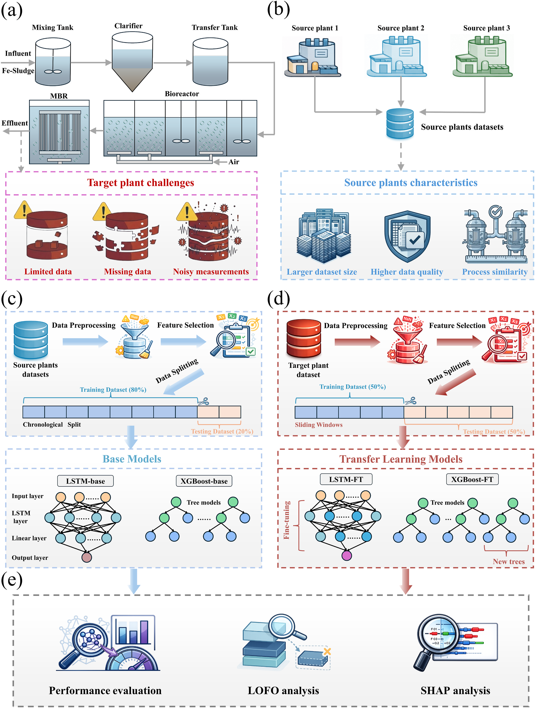
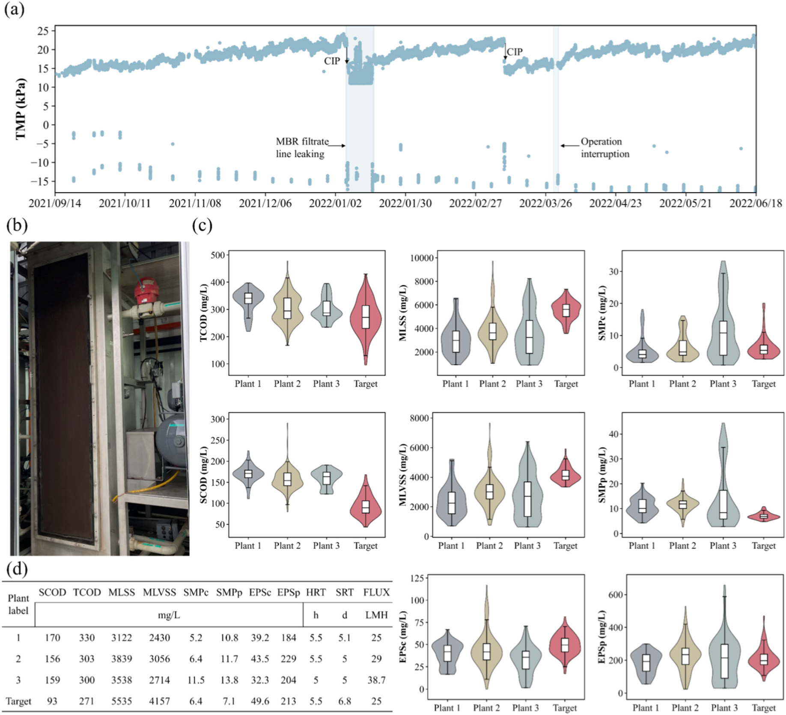
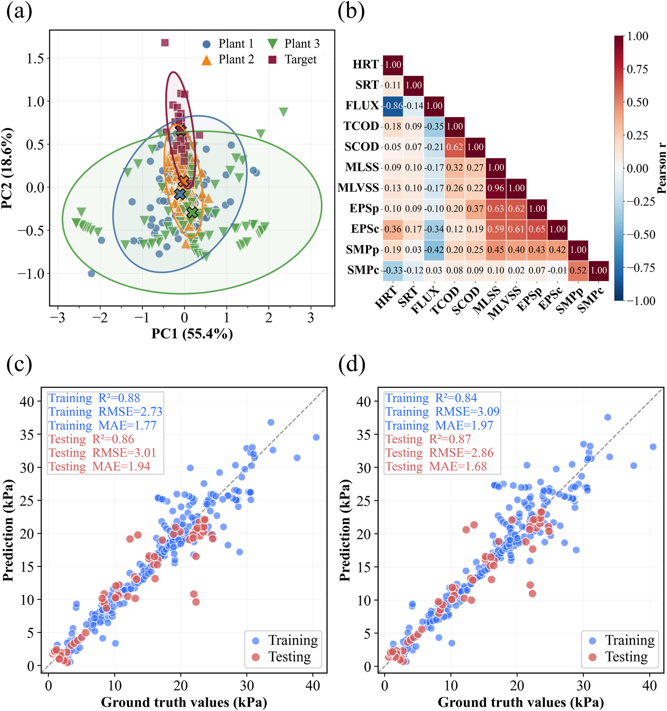
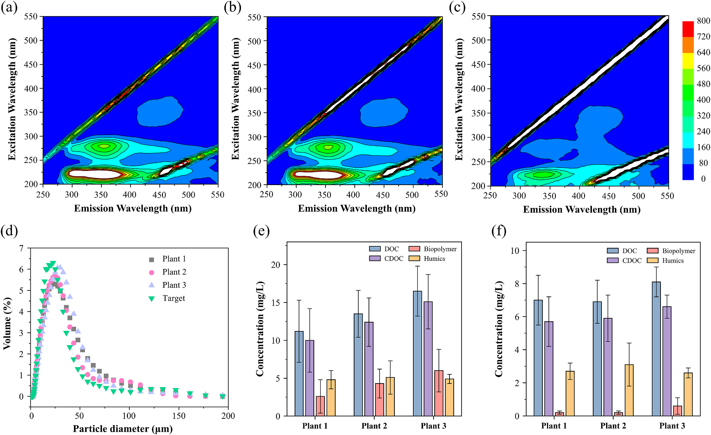
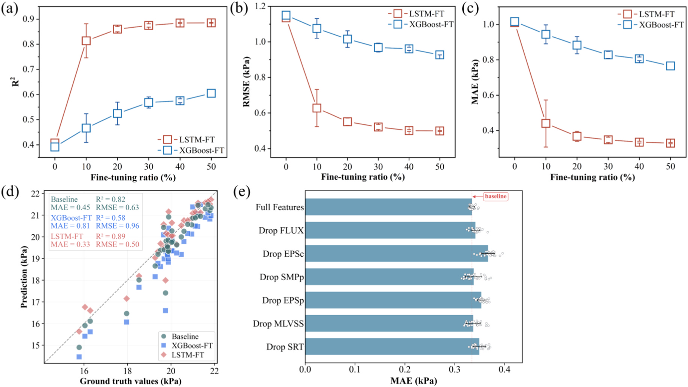
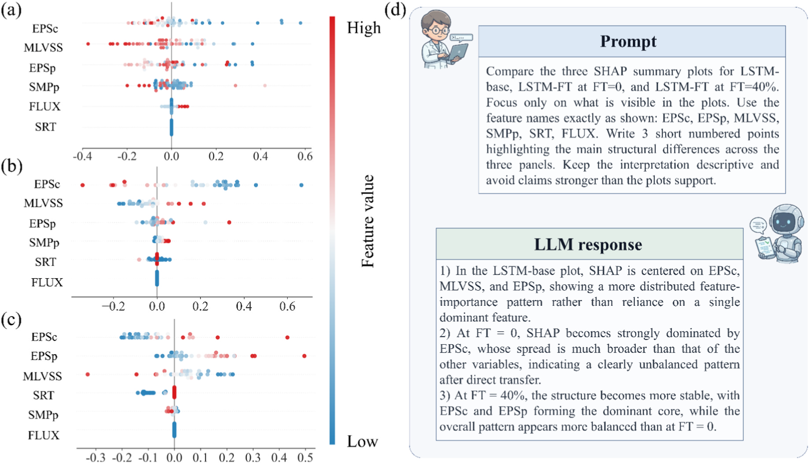
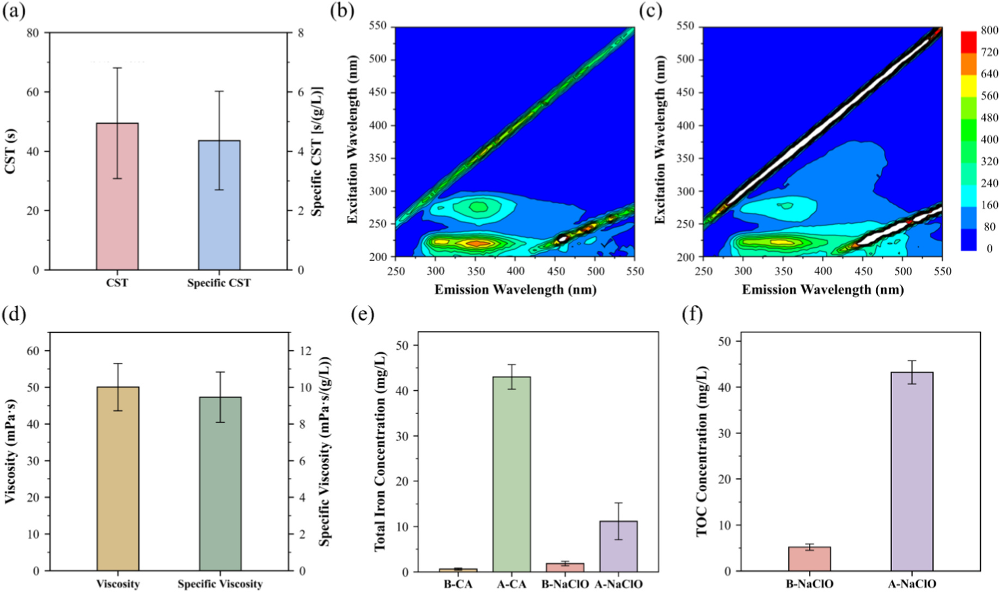
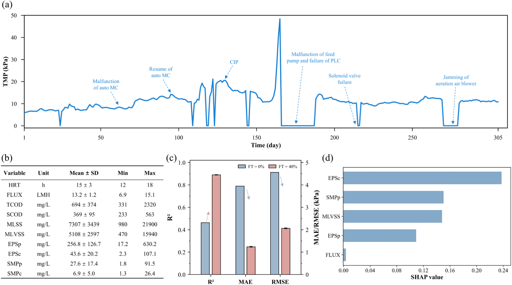

# Explainable cross-plant transfer learning for fouling prediction in data-limited pilot-scale membrane bioreactors

## Abstract

- **Tầm quan trọng của dự đoán tắc nghẽn màng và thách thức dữ liệu thưa thớt**: Dự đoán chính xác hiện tượng tắc nghẽn màng ($membrane\ fouling\ prediction$) là yêu cầu thiết yếu cho điều khiển tiến dung ($feedforward\ control$) và vận hành tiêu thụ năng lượng thấp ($low-energy\ operation$) trong các bể phản ứng sinh học màng ($membrane\ bioreactors$ - MBR):
  - Việc phát triển mô hình tin cậy cho các nhà máy bị giới hạn dữ liệu ($data-limited\ plants$) gặp khó khăn do sự thưa thớt của các phép đo ($sparse\ measurements$) về chất polyme ngoại bào ($extracellular\ polymeric\ substances$ - EPS) và sản phẩm vi sinh vật hòa tan ($soluble\ microbial\ products$ - SMP) mang thông tin cơ chế ($mechanistically\ informative$).

- **Khung học chuyển giao liên nhà máy có khả năng giải thích**: Nhóm nghiên cứu thiết lập khung học chuyển giao liên nhà máy có khả năng giải thích ($explainable\ cross-plant\ transfer\ learning\ framework$) để dự đoán áp suất xuyên màng ($transmembrane\ pressure$ - TMP) cho các hệ thống MBR quy mô pilot bị giới hạn dữ liệu:
  - Các mô hình cơ sở ($base\ models$) gồm mạng bộ nhớ ngắn-dài ($Long\ short-term\ memory$ - LSTM) và tăng cường độ dốc cực đại ($extreme\ gradient\ boosting$ - XGBoost) được tiền huấn luyện ($pretrained$) trên ba nhà máy MBR nguồn ($three\ data-richer\ source\ MBRs$) xử lý nước thải sinh hoạt ($domestic\ wastewater$) có dung lượng dữ liệu lớn hơn.
  - Các mô hình cơ sở được tinh chỉnh ($fine-tuned$) bằng tập dữ liệu giới hạn từ một nhà máy mục tiêu xử lý nước thải sinh hoạt ($domestic\ target\ plant$).

- **Hiệu năng tiền huấn luyện trên miền nguồn và các động lực tắc nghẽn chủ đạo**: Các mô hình cơ sở đạt độ chính xác dự đoán TMP trên miền nguồn ($source-domain\ TMP$) với hệ số xác định lần lượt là $R^2 = 0.87$ (với LSTM) và $R^2 = 0.86$ (với XGBoost):
  - Phương pháp giải thích cộng tính SHapley ($SHapley\ Additive\ exPlanations$ - SHAP) xác định carbohydrate trong EPS ($\text{EPS}_c$), protein trong EPS ($\text{EPS}_p$) và protein trong SMP ($\text{SMP}_p$) là các động lực chi phối hiện tượng tắc nghẽn ($dominant\ fouling-related\ drivers$).

- **Giới hạn của chuyển giao trực tiếp và hiệu quả cải thiện qua tinh chỉnh**: Chuyển giao trực tiếp ($direct\ transfer$) mô hình từ nhà máy nguồn sang nhà máy mục tiêu mang lại độ chính xác hạn chế với $R^2 = 0.39\text{–}0.41$:
  - Kết quả này phản ánh rằng các mô hình cơ sở chưa thu nhận đầy đủ hành vi tắc nghẽn đặc thù của nhà máy mục tiêu.
  - Ngược lại, quá trình tinh chỉnh ($fine-tuning$) nâng cao độ chính xác dự đoán; mô hình LSTM sau tinh chỉnh (LSTM-FT) đạt $R^2 = 0.89$ ở tỷ lệ dữ liệu tinh chỉnh $40\%$ ($40\%\ fine-tuning\ ratio$).

- **Cơ chế chuyển dịch đặc trưng do dòng vào giàu sắt**: Phân tích SHAP và loại trừ từng đặc trưng ($leave-one-feature-out$ - LOFO) chỉ ra cơ chế tương tác:
  - $\text{EPS}_c$ duy trì vai trò là tín hiệu tắc nghẽn chuyển giao cốt lõi ($critical\ transferable\ fouling\ signal$).
  - $\text{EPS}_p$ gia tăng mức độ quan trọng sau quá trình tinh chỉnh ($fine-tuning$).
  - Sự chuyển dịch vai trò này phản ánh con đường tắc nghẽn liên quan đến $\text{EPS}_p$ bắt nguồn từ dòng vào giàu sắt ($\text{Fe}-enriched\ influent$) của trạm xử lý.

- **Kiểm chứng độc lập trên hệ thống MBR xử lý nước thải công nghiệp**: Khung làm việc được kiểm chứng trên một MBR quy mô pilot xử lý nước thải công nghiệp ($industrial\ wastewater$):
  - Mô hình LSTM-FT đạt hệ số xác định $R^2 \approx 0.9$ trên hệ thống MBR công nghiệp.
  - Protein trong SMP ($\text{SMP}_p$) xuất hiện dưới vai trò đặc trưng quan trọng ($critical\ feature$) đối với động học tắc nghẽn.

- **Khả năng tổng quát hóa và bảo toàn tri thức cơ chế**: Khung phương pháp bảo toàn thông tin tắc nghẽn chung xoay quanh EPS ($shared\ EPS-centered\ fouling\ information$), đồng thời tái hiệu chuẩn thích ứng các động lực đặc thù theo từng nhà máy ($adaptively\ recalibrating\ plant-specific\ drivers$):
  - Phương pháp cung cấp giải pháp khả thi cho bài toán dự đoán tắc nghẽn màng kết hợp tri thức cơ chế ($mechanism-informed\ fouling\ prediction$) trong các hệ thống MBR hạn chế dữ liệu.

## 1. Introduction

- Đô thị hóa và các yêu cầu tái sử dụng nước thải ngày càng tăng thúc đẩy quá trình xử lý nước thải hướng tới các quy trình tăng cường (intensified processes).
  - Các quy trình tăng cường đòi hỏi cung cấp nước đầu ra ổn định, chất lượng cao trong điều kiện diện tích hạ tầng bị giới hạn (constrained infrastructure footprints).
- MBR (membrane bioreactors - bể phản ứng sinh học màng) tích hợp xử lý sinh học với phân tách màng được ứng dụng rộng rãi cho xử lý nước thải sinh hoạt và công nghiệp.
  - MBR sở hữu cấu hình nhỏ gọn (compact configuration) và mang lại chất lượng nước đầu ra cao.
  - Membrane fouling (hiện tượng tắc nghẽn màng) là rào cản chính cản trở việc phát huy đầy đủ các lợi thế của MBR.
- Dưới chế độ vận hành lưu lượng không đổi (constant-flux operation), tắc nghẽn màng làm tăng dần trở lực lọc (filtration resistance), thể hiện qua sự gia tăng của $\text{TMP}$ (transmembrane pressure - áp suất xuyên màng).
  - Sự gia tăng $\text{TMP}$ làm tăng nhu cầu sục khí (aeration) và nhu cầu bơm (pumping).
  - Tắc nghẽn màng làm tăng tần suất làm sạch bằng hóa chất (chemical cleaning), thúc đẩy quá trình lão hóa màng (membrane aging) và làm tăng chi phí vòng đời (lifecycle costs).
- MBR tiêu thụ nhiều năng lượng hơn so với các quy trình bùn hoạt tính truyền thống (conventional activated sludge processes):
  - Mức tiêu thụ năng lượng điển hình của MBR đạt $0.4\text{--}1.6\text{ kWh}\cdot\text{m}^{-3}$, cao hơn mức $0.3\text{--}0.8\text{ kWh}\cdot\text{m}^{-3}$ của bùn hoạt tính truyền thống.
- Dự đoán chính xác diễn tiến tắc nghẽn màng và $\text{TMP}$ là điều kiện thiết yếu để thực hiện kiểm soát tắc nghẽn cấp tiến (feedforward fouling control) và vận hành MBR tiết kiệm năng lượng.
  - Quản lý tắc nghẽn chủ động (proactive fouling management) trong MBR vẫn gặp nhiều khó khăn dù đã có nhiều tiến bộ trong đặc tính hóa và giảm thiểu tắc nghẽn.
- Cả hai cách tiếp cận dựa trên cơ chế (mechanistic) và dựa trên dữ liệu (data-driven) đều được nghiên cứu để dự đoán diễn tiến tắc nghẽn màng:
  - Các mô hình cơ chế và mô hình lai sinh học - vật lý (hybrid biological–physical models) giúp tăng cường tính giải thích được (interpretability), nhưng khó tham số hóa (parameterize) và khó hiệu chuẩn lại (recalibrate) trong các nhà máy thực tế.
  - Các mô hình học máy (ML - machine learning) và học sâu (DL - deep learning) là các giải pháp thay thế tiềm năng nhờ khả năng nắm bắt mối quan hệ phi tuyến giữa các biến vận hành, chất lượng nước và sinh khối.
- Các kiến trúc mô hình học máy và học sâu sở hữu những đặc tính tương thích riêng với bản chất dữ liệu tắc nghẽn màng:
  - Các mô hình ML dạng cây (tree-based ML models, ví dụ như XGBoost - Extreme Gradient Boosting) thích hợp cho dữ liệu quy trình dạng bảng (tabular process data).
  - Các kiến trúc DL hồi quy (recurrent DL architectures, ví dụ như mạng LSTM - long short-term memory) đặc biệt phù hợp cho dự đoán tắc nghẽn màng:
    - Tắc nghẽn màng là một quá trình tích lũy nội tại (intrinsically cumulative) và phụ thuộc vào quỹ đạo thời gian (path-dependent).
    - Diễn tiến tắc nghẽn được chi phối bởi những biến đổi theo thời gian của đặc tính bùn và các điều kiện thủy động lực học (hydrodynamic conditions).
- Việc thiết kế các biến đầu vào hợp lý và đầy đủ là yếu tố then chốt để đạt được mô hình AI chính xác.
  - Nhiều mô hình dự đoán $\text{TMP}$ hiện hữu, đặc biệt là các mô hình tại các MBR quy mô pilot hoặc quy mô thực tế (full-scale MBRs), chủ yếu dựa trên các biến truyền thống được quan trắc thường quy:
    - Các biến truyền thống bao gồm: $\text{MLSS}$ (mixed liquor suspended solids - chất rắn lơ lửng trong hỗn hợp bùn lỏng), $\text{MLVSS}$ (mixed liquor volatile suspended solids - chất rắn lơ lửng bay hơi trong hỗn hợp bùn lỏng), $\text{HRT}$ (hydraulic retention time - thời gian lưu nước) và $\text{SRT}$ (sludge retention time - thời gian lưu bùn).
    - Các phương pháp hiện tại nhằm theo dõi động học tắc nghẽn trong MBR thường không đủ hiệu quả khi chỉ dựa trên các biến này.
- Các chỉ số mô tả sinh hóa chứa thông tin cơ chế như $\text{EPS}$ (extracellular polymeric substances - các chất polyme ngoại bào) và $\text{SMP}$ (soluble microbial products - các sản phẩm vi sinh hòa tan) thường bị thiếu hoặc thu thập không đủ mẫu tại các MBR quy mô pilot và quy mô thực tế.
  - Đây là một hạn chế nghiêm trọng vì $\text{EPS}$ và $\text{SMP}$ ảnh hưởng mạnh đến xu hướng tắc nghẽn màng:
    - Phân đoạn protein và polysaccharide trong $\text{EPS}$ và $\text{SMP}$ định hình sự hình thành lớp bánh bùn (cake formation), độ nén (compressibility) và hành vi tắc nghẽn lỗ màng (pore-blocking behavior).
    - Axit humic (humic acid) và axit fulvic (fulvic acid) cũng tham gia đóng góp vào quá trình tắc nghẽn màng.
  - Việc đưa trực tiếp $\text{EPS}$ và $\text{SMP}$ vào làm đầu vào mô hình vừa có căn cứ khoa học, vừa là hướng đi triển vọng để cải thiện độ chính xác dự đoán $\text{TMP}$ và nâng cao tính giải thích được cho các nhà máy MBR.
- Dữ liệu tại các MBR quy mô pilot hoặc quy mô thực tế thường không đủ để xây dựng các mô hình dự đoán tắc nghẽn mạnh mẽ riêng biệt cho từng địa điểm (site-specific models):
  - Các phép đo phân đoạn $\text{EPS}$ và $\text{SMP}$ trong thực tế thường thưa thớt và không định kỳ do phụ thuộc vào các phân tích phòng thí nghiệm tốn nhiều công sức thay vì cảm biến trực tuyến (online sensing).
  - Dữ liệu vận hành thường quy và dữ liệu sinh hóa thường gặp tình trạng khuyết giá trị (missing values), lỗi cảm biến (sensor errors) và điểm ngoại lai (outliers).
  - Các hạn chế về dữ liệu khiến một nhà máy MBR đơn lẻ bị hạn chế dữ liệu gặp khó khăn trong việc tự huấn luyện độc lập một mô hình dự đoán chất lượng cao.
- Phần lớn các mô hình ML dự đoán tắc nghẽn MBR hiện nay được phát triển và xác thực trên các chuỗi dữ liệu lịch sử dài hoặc dày đặc của riêng từng nhà máy:
  - Khả năng tổng quát hóa xuyên nhà máy (cross-plant generalizability) của các mô hình này trong điều kiện dữ liệu hạn chế chưa được xác lập đầy đủ.
- Các nhà máy MBR khác nhau chia sẻ các cơ chế tắc nghẽn tương đồng, tạo cơ sở cho sự tồn tại của các mô hình có thể chuyển giao (transferable models) giữa các cơ sở xử lý:
  - Các cơ chế tương đồng bao gồm: tích tụ lớp bánh bùn (cake-layer accumulation), tắc nghẽn lỗ màng (pore blocking) và sự đóng góp của các sản phẩm vi sinh vật vào tắc nghẽn màng.
- Học chuyển giao (Transfer learning) cung cấp chiến lược giải quyết đồng thời sự khan hiếm dữ liệu (data scarcity) và tình trạng cô lập dữ liệu (data silos) trong dự đoán tắc nghẽn MBR:
  - Một mô hình gốc (base model) có thể được tiền huấn luyện (pretrained) trên tập dữ liệu đa nguồn từ nhiều nhà máy MBR khác nhau để học các mối quan hệ khái quát giữa điều kiện vận hành, đặc trưng $\text{EPS}$/$\text{SMP}$ và diễn tiến $\text{TMP}$.
  - Sau đó, mô hình gốc được tinh chỉnh (fine-tuned) bằng một lượng nhỏ dữ liệu từ nhà máy MBR mục tiêu để học các yếu tố thúc đẩy tắc nghẽn đặc thù của nhà máy đó (plant-specific fouling drivers).
- Học chuyển giao xuyên nhà máy cho dự đoán tắc nghẽn MBR không phải là một bài toán chuyển đổi mô hình đơn thuần (model-porting problem):
  - Nhà máy nguồn và nhà máy mục tiêu có thể khác biệt rõ rệt về thành phần nước thải đầu vào, đặc tính hóa lý của bùn, hồ sơ $\text{EPS}$/$\text{SMP}$, tương tác hữu cơ - kim loại (metal–organic interactions) và điều kiện vận hành.
  - Ngay cả sau khi tinh chỉnh, dữ liệu hạn chế tại nhà máy mục tiêu vẫn có thể không đủ để mô hình nắm bắt đầy đủ các yếu tố thúc đẩy tắc nghẽn mới chiếm ưu thế (newly dominant fouling drivers) mà vốn yếu hoặc không hiện diện ở các nhà máy nguồn.
- Đánh giá sự thành công của học chuyển giao không thể chỉ dựa vào độ chính xác dự đoán, mà cần đánh giá cách thức và nguyên nhân các tín hiệu tắc nghẽn có ý nghĩa vật lý được giữ lại, loại bỏ hoặc tái định trọng số trong quá trình chuyển giao:
  - Các phân tích giải thích được như $\text{SHAP}$ (SHapley Additive exPlanations) và $\text{LOFO}$ (leave-one-feature-out) là cần thiết để xác định cách các chỉ số liên quan đến $\text{EPS}$/$\text{SMP}$ hoạt động như những yếu tố thúc đẩy chuyển giao được hay các tín hiệu được hiệu chuẩn lại theo từng nhà máy.
  - Các ứng dụng trước đây của các phương pháp giải thích trong dự đoán tắc nghẽn màng chủ yếu tập trung vào việc xếp hạng tầm quan trọng đặc trưng ở cấp độ mô hình (model-level feature ranking).
  - Các thuộc tính gán của $\text{SHAP}$ phụ thuộc vào mô hình và thiếu giá trị thực nghiệm chuẩn (ground truth) để kiểm chứng, do đó độ chính xác dự đoán cao không đảm bảo rằng các đặc trưng được mô hình nhấn mạnh phản ánh đúng hành vi tắc nghẽn vật lý thực tế.
- Đặc tính hóa lý độc lập là điều kiện cần để đánh giá tính hợp lý của các thay đổi thuộc tính gán (attribution shifts) và cung cấp cơ sở giải thích cơ chế:
  - Các phân tích hóa lý độc lập bao gồm: $\text{EEM}$ (excitation–emission matrix - ma trận kích thích - phát xạ), $\text{LC-OCD}$ (liquid chromatography–organic carbon detection - sắc ký lỏng phát hiện cacbon hữu cơ) và phân tích chất gây tắc nghẽn (foulant analysis).
- Nghiên cứu đề xuất chiến lược học chuyển giao có thể giải thích được để dự đoán tắc nghẽn màng trong các MBR quy mô pilot dưới điều kiện dữ liệu hạn chế, bao gồm $4$ nội dung cụ thể:
  - $(1)$ Tiền huấn luyện mô hình gốc: Các mô hình gốc (dựa trên $\text{LSTM}$ và $\text{XGBoost}$) được tiền huấn luyện trên các tập dữ liệu đa nguồn thu thập từ $3$ nhà máy MBR quy mô pilot nguồn xử lý nước thải sinh hoạt, bao gồm nhiều điều kiện vận hành khác nhau, các đặc tính sinh hóa thường quy và các thành phần then chốt trong $\text{EPS}$ và $\text{SMP}$.
  - $(2)$ Tinh chỉnh mô hình trên nhà máy mục tiêu: Tinh chỉnh các mô hình gốc bằng tập dữ liệu của nhà máy mục tiêu (xử lý nước thải sinh hoạt) để thiết lập mô hình dự đoán tắc nghẽn cho nhà máy bị hạn chế dữ liệu; định lượng mối quan hệ giữa tỷ lệ tinh chỉnh (fine-tuning ratio) và hiệu suất dự đoán; đánh giá ảnh hưởng của kiến trúc $\text{LSTM}$ và $\text{XGBoost}$ đến hiệu suất chuyển giao sau tinh chỉnh.
  - $(3)$ Phân tích hành vi chuyển giao và kiểm chứng cơ chế: Hành vi chuyển giao và thông tin tắc nghẽn có thể chuyển giao được phân tích thông qua các phương pháp giải thích ($\text{SHAP}$ và $\text{LOFO}$) kết hợp với đặc tính hóa lý độc lập bằng $\text{EEM}$, $\text{LC-OCD}$ và phân tích chất gây tắc nghẽn; các phân tích này làm rõ cách các chỉ số then chốt (đặc biệt là $\text{EPS}$ và $\text{SMP}$) được giữ lại hoặc tái định trọng số trong quá trình tiền huấn luyện và tinh chỉnh, cung cấp bằng chứng cơ chế cho các thay đổi này.
  - $(4)$ Kiểm chứng trên nền nước thải công nghiệp: Khung học chuyển giao được đánh giá mở rộng trên một MBR quy mô pilot xử lý nước thải công nghiệp nhằm kiểm tra tính khả thi của học chuyển giao xuyên nhà máy dưới nền nước thải có đặc tính khác biệt rõ rệt.
- Nghiên cứu cung cấp một lộ trình thực tiễn và có thể giải thích được để xây dựng các mô hình dự đoán tắc nghẽn màng tại các cơ sở MBR bị hạn chế dữ liệu thông qua học chuyển giao xuyên nhà máy.

## 2. Materials and methods

## 2.1. Data collection

- Nhà máy quy mô pilot xử lý nước thải sinh hoạt tại Singapore được lựa chọn làm nhà máy đích (target plant) với nước thải đầu vào giàu sắt ($\text{Fe}$):
  - Nồng độ liều lượng $\text{Fe}$ bổ sung vào nước thải đầu vào xấp xỉ $10\text{--}30\text{ mg/L}$.
  - Công suất xử lý của hệ thống đạt $24\text{ m}^3\text{/d}$.
  - Cấu hình công nghệ bao gồm công đoạn tiền xử lý (pretreatment), bể phản ứng sinh học nạp chia dòng 5 bậc (five-pass step-feed bioreactor) phân chia các vùng kỵ khí/hiếu khí (anaerobic/oxic zonation), và bể màng (membrane tank) (Fig. 1(a)).
  - Khung chuyển giao học tập (cross-plant transfer learning framework) được xây dựng nhằm giải quyết các thách thức dự báo đặc thù của nhà máy đích gồm dữ liệu hạn chế, thiếu hụt dữ liệu và nhiễu đo đạc:
    - **Hình 1.** Khung học chuyển giao dự báo TMP trong các hệ thống MBR
      - 
      - **Hình này chứng minh điều gì**
        - Thể hiện kiến trúc chuyển giao từ 3 nhà máy nguồn sang nhà máy đích nhằm giải quyết hạn chế thiếu hụt dữ liệu.
      - **Từ đâu mà thấy được**
        - Bảng (a), (b): chuỗi xử lý nhà máy đích gặp thách thức dữ liệu ít và nhiễu, được bù đắp bởi dữ liệu quy mô lớn hơn từ 3 nhà máy nguồn.
        - Bảng (c), (d), (e): tiền huấn luyện LSTM-base và XGBoost-base ($80\%$ train, $20\%$ test), tinh chỉnh ($50\%$ train, $50\%$ test), và giải thích bằng LOFO và SHAP.
- Hồ sơ áp suất xuyên màng (TMP) và đặc tính vận hành thực tế của nhà máy đích phản ánh các ràng buộc quan trắc công nghiệp:
  - Tập dữ liệu nhà máy đích bao phủ chu kỳ giám sát từ tháng 9 năm 2021 đến tháng 6 năm 2022 ($2021\text{/}09\text{/}14\text{--}2022\text{/}06\text{/}18$).
  - Diễn biến TMP vận hành thực tế dao động chủ yếu trong khoảng $13\text{--}25\text{ kPa}$, ghi nhận các mốc làm sạch tại chỗ (CIP), giai đoạn rò rỉ đường lọc MBR ($2022\text{/}01\text{/}02\text{--}2022\text{/}01\text{/}30$), và gián đoạn vận hành ($2022\text{/}03\text{/}26$) (Fig. 2(a)).
  - Cấu tạo mô-đun màng lọc ngập tại nhà máy đích được ghi nhận qua hình ảnh thực địa (Fig. 2(b)), với các thông số quy trình và vận hành chi tiết được tóm lược tại Text S1.
  - Do tần suất phân tích các chất cao phân tử ngoại bào (EPS) và sản phẩm vi sinh hòa tan (SMP) chỉ đạt $2\text{ lần/tuần}$ (twice-weekly), mô hình chỉ được phát triển trên các ngày có đầy đủ phép đo đồng bộ cho tất cả biến đầu vào và TMP, thu được $71\text{ bản ghi}$ hợp lệ khớp thời gian (71 valid temporally matched records).
  - Thiết lập thực nghiệm giới hạn dữ liệu tại nhà máy đích phản ánh đúng các ràng buộc giám sát thực tế trong vận hành MBR quy mô pilot, cung cấp kịch bản thực tế để đánh giá khung học chuyển giao liên nhà máy.
  - **Hình 2.** Bối cảnh vận hành nhà máy đích và đặc tính dữ liệu nguồn–đích
    - 
    - **Hình này chứng minh điều gì**
      - Thể hiện biến động TMP thực tế cùng sự tương đồng và khác biệt về phân phối 11 biến số giữa 4 nhà máy.
    - **Từ đâu mà thấy được**
      - Bảng (a), (b): diễn biến TMP ($13\text{--}25\text{ kPa}$) từ 2021/09/14 đến 2022/06/18 với các mốc CIP, rò rỉ đường lọc và gián đoạn; ảnh mô-đun màng.
      - Bảng (c), (d): biểu đồ phân phối và bảng giá trị trung bình 11 biến (nhà máy đích có MLSS $5535\text{ mg/L}$, cao hơn Plant 1–3 từ $3122\text{--}3839\text{ mg/L}$).
- Ba nhà máy MBR ngập quy mô pilot xử lý nước thải sinh hoạt tại Singapore được lựa chọn làm các nhà máy nguồn (source plants), cung cấp tổng cộng $332\text{ bản ghi}$ dữ liệu:
  - Số lượng bản ghi đóng góp từ từng nhà máy nguồn:
    - Plant 1: $100\text{ bản ghi}$.
    - Plant 2: $132\text{ bản ghi}$.
    - Plant 3: $100\text{ bản ghi}$ (Fig. 1(b)).
  - Hình ảnh thực địa của 3 nhà máy nguồn được cung cấp tại Fig. S1, và hồ sơ TMP trong chu kỳ giám sát tương ứng được thể hiện tại Fig. S2.
  - Cấu hình công nghệ của các nhà máy nguồn tương đồng với nhà máy đích, bao gồm xử lý sinh học thiếu khí/hiếu khí (anoxic/oxic biological treatment) kết hợp phân tách màng ngập (immersed membrane separation), với tuần hoàn bùn truyền thống (conventional sludge recirculation) và xả bùn thải (sludge wasting).
  - Các đặc tính kỹ thuật chi tiết của hệ thống màng và thiết lập vận hành được tổng hợp tại Table S1.
- Cơ sở vật lý và hóa lý hỗ trợ áp dụng học chuyển giao giữa các nhà máy nguồn và nhà máy đích:
  - Mặc dù nhà máy đích có sự khác biệt về thành phần nước thải đầu vào do bổ sung $\text{Fe}$ ở thượng nguồn ($10\text{--}30\text{ mg/L}$), cấu hình xử lý tổng thể vẫn tương đồng với các nhà máy nguồn.
  - Cơ chế tắc nghẽn màng (MBR fouling mechanisms) giữa nhà máy đích và các nhà máy nguồn tương đồng trên diện rộng, tạo tiền đề khoa học cho việc chuyển giao tri thức mô hình.
- Tập dữ liệu của mỗi nhà máy bao gồm 11 biến đầu vào kết hợp cùng biến mục tiêu TMP:
  - Danh mục 11 biến số đầu vào phục vụ mô hình hóa:
    - Nhóm thông số vận hành thủy lực: Thời gian lưu thủy lực (HRT - hydraulic retention time), thời gian lưu bùn (SRT - solids retention time), và thông lượng màng (membrane flux - $\text{FLUX}$).
    - Nhóm thông số hóa lý chất lượng nước và bùn lỏng: Nhu cầu oxy hóa học tổng số (TCOD - total chemical oxygen demand), nhu cầu oxy hóa học hòa tan (SCOD - soluble chemical oxygen demand), nồng độ chất rắn lơ lửng trong bùn lỏng (MLSS - mixed liquor suspended solids), và nồng độ chất rắn lơ lửng bay hơi trong bùn lỏng (MLVSS - mixed liquor volatile suspended solids).
    - Nhóm thành phần sinh học màng: Protein trong chất cao phân tử ngoại bào ($\text{EPS}_\text{p}$), carbohydrate trong chất cao phân tử ngoại bào ($\text{EPS}_\text{c}$), protein trong sản phẩm vi sinh hòa tan ($\text{SMP}_\text{p}$), và carbohydrate trong sản phẩm vi sinh hòa tan ($\text{SMP}_\text{c}$).
  - Biến mục tiêu: Áp suất xuyên màng (TMP) thu nhận từ hệ thống giám sát trực tuyến thường quy (routine online monitoring), được khớp theo từng ngày lấy mẫu để phân tích.
  - Phân phối và giá trị trung bình của các thông số đầu vào tại 4 nhà máy (Fig. 2(c), (d)):
    - Plant 1: $\text{SCOD} = 170\text{ mg/L}$, $\text{TCOD} = 330\text{ mg/L}$, $\text{MLSS} = 3122\text{ mg/L}$, $\text{MLVSS} = 2430\text{ mg/L}$, $\text{SMP}_\text{c} = 5.2\text{ mg/L}$, $\text{SMP}_\text{p} = 10.8\text{ mg/L}$, $\text{EPS}_\text{c} = 39.2\text{ mg/L}$, $\text{EPS}_\text{p} = 184\text{ mg/L}$, $\text{HRT} = 5.5\text{ h}$, $\text{SRT} = 5.1\text{ d}$, $\text{FLUX} = 25\text{ LMH}$.
    - Plant 2: $\text{SCOD} = 156\text{ mg/L}$, $\text{TCOD} = 303\text{ mg/L}$, $\text{MLSS} = 3839\text{ mg/L}$, $\text{MLVSS} = 3056\text{ mg/L}$, $\text{SMP}_\text{c} = 6.4\text{ mg/L}$, $\text{SMP}_\text{p} = 11.7\text{ mg/L}$, $\text{EPS}_\text{c} = 43.5\text{ mg/L}$, $\text{EPS}_\text{p} = 229\text{ mg/L}$, $\text{HRT} = 5.5\text{ h}$, $\text{SRT} = 5\text{ d}$, $\text{FLUX} = 29\text{ LMH}$.
    - Plant 3: $\text{SCOD} = 159\text{ mg/L}$, $\text{TCOD} = 300\text{ mg/L}$, $\text{MLSS} = 3538\text{ mg/L}$, $\text{MLVSS} = 2714\text{ mg/L}$, $\text{SMP}_\text{c} = 11.5\text{ mg/L}$, $\text{SMP}_\text{p} = 13.8\text{ mg/L}$, $\text{EPS}_\text{c} = 32.3\text{ mg/L}$, $\text{EPS}_\text{p} = 204\text{ mg/L}$, $\text{HRT} = 5\text{ h}$, $\text{SRT} = 5\text{ d}$, $\text{FLUX} = 38.7\text{ LMH}$.
    - Nhà máy đích (Target plant): $\text{SCOD} = 93\text{ mg/L}$, $\text{TCOD} = 271\text{ mg/L}$, $\text{MLSS} = 5535\text{ mg/L}$, $\text{MLVSS} = 4157\text{ mg/L}$, $\text{SMP}_\text{c} = 6.4\text{ mg/L}$, $\text{SMP}_\text{p} = 7.1\text{ mg/L}$, $\text{EPS}_\text{c} = 49.6\text{ mg/L}$, $\text{EPS}_\text{p} = 213\text{ mg/L}$, $\text{HRT} = 5.5\text{ h}$, $\text{SRT} = 6.8\text{ d}$, $\text{FLUX} = 25\text{ LMH}$.

## 2.2. Physicochemical analytical methods

- Các thông số vận hành thường quy (routine operational parameters) được ghi nhận bao gồm $HRT$, $SRT$ và $\text{FLUX}$.
  - Thời gian lưu nước thủy lực ($HRT$ - hydraulic retention time), thời gian lưu bùn ($SRT$ - sludge retention time) và thông lượng màng ($\text{FLUX}$) được ghi chép làm các thông số vận hành cơ sở của hệ thống.
- Các chỉ số nhu cầu oxy hóa học ($TCOD$, $SCOD$) và hàm lượng bùn ($MLSS$, $MLVSS$) được xác định theo quy trình chuẩn:
  - Nhu cầu oxy hóa học tổng số ($TCOD$ - total chemical oxygen demand) và nhu cầu oxy hóa học hòa tan ($SCOD$ - soluble chemical oxygen demand) được xác định bằng phương pháp so màu hồi lưu kín APHA 5220D (APHA 5220D closed reflux colorimetric method).
  - Chất rắn lơ lửng trong hỗn dịch bùn ($MLSS$ - mixed liquor suspended solids) và chất rắn lơ lửng bay hơi trong hỗn dịch bùn ($MLVSS$ - mixed liquor volatile suspended solids) được đo theo Tiêu chuẩn Phương pháp (Standard Methods) [28].
- Quy trình phân lập và trích ly các sản phẩm vi sinh vật hòa tan ($SMP$) và chất polyme ngoại bào ($EPS$) được xác định rõ:
  - $SMP$ (soluble microbial products) được định nghĩa là phần hòa tan (dissolved fraction) của dịch nổi (supernatant) sau khi lọc qua màng kích thước lỗ $0.45\ \mu\text{m}$.
  - $EPS$ (extracellular polymeric substances) được trích ly từ phần sinh khối còn lại (residual biomass) bằng phương pháp nhiệt (heat method) [29].
- Hàm lượng protein và polysaccharide trong $SMP$ và $EPS$ ($SMP_p$, $SMP_c$, $EPS_p$, $EPS_c$) được định lượng bằng hai phương pháp hóa nghiệm riêng biệt [30]:
  - Protein trong $SMP$ ($SMP_p$) và protein trong $EPS$ ($EPS_p$) được định lượng bằng phương pháp thử protein Lowry cải tiến (Modified Lowry Protein Assay).
  - Polysaccharide trong $SMP$ ($SMP_c$) và polysaccharide trong $EPS$ ($EPS_c$) được định lượng bằng phương pháp Dubois (Dubois Method).
- Phương pháp sắc ký lỏng – phát hiện cacbon hữu cơ ($\text{LC-OCD}$ - Liquid chromatography–organic carbon detection) được sử dụng để xác định đặc tính của chất hữu cơ hòa tan (dissolved organic matter):
  - Phân tích bao gồm các polymer sinh học (biopolymers) có khối lượng phân tử ($MW$ - molecular weight) lớn hơn $20\ \text{kDa}$ ($MW > 20\ \text{kDa}$).
  - Phân tích bao gồm các hợp chất có khối lượng phân tử thấp ($LMW$ - low-molecular-weight compounds) có $MW$ nhỏ hơn $1000\ \text{Da}$ ($MW < 1000\ \text{Da}$).
  - Các hợp chất $LMW$ được phân loại bao gồm chất humic (humics), các khối kiến tạo (building blocks), axit $LMW$ (LMW acids), và các chất trung tính $LMW$ (LMW neutrals).
- Đặc tính vật lý và khả năng lọc của hỗn dịch bùn được đánh giá qua phân bố kích thước hạt ($PSD$) và thời gian hút mao quản ($CST$):
  - Phân bố kích thước hạt ($PSD$ - particle size distribution) của hỗn dịch bùn (mixed liquor) được phân tích bằng thiết bị phân tích kích thước hạt nhiễu xạ laser (laser diffraction particle analyzer).
  - Thời gian hút mao quản ($CST$ - capillary suction time) được đo bằng thiết bị đo $CST$ (CST apparatus) [31].
- Các chỉ tiêu hóa lý bổ sung về cacbon hữu cơ, phổ huỳnh quang và kim loại được định lượng bằng các phương pháp phân tích:
  - Tổng cacbon hữu cơ ($TOC$ - total organic carbon) được đo bằng máy phân tích $TOC$ ($\text{TOC-V}_{\text{CSH}}$, Shimadzu, Japan).
  - Phổ ma trận kích thích – phát xạ ($EEM$ - excitation–emission matrix spectra) được đo bằng máy quang phổ huỳnh quang (fluorescence spectrophotometer) [32].
  - Sắt tổng số (Total iron) được đo bằng phương pháp quang phổ phát xạ quang học plasma ghép cặp cảm ứng ($\text{ICP-OES}$ - inductively coupled plasma optical emission spectroscopy).

### 2.3. Data preprocessing and feature selection

- Dữ liệu thô được tiền xử lý tuần tự qua các bước xử lý ngoại lai (outlier treatment), nội suy giá trị thiếu (missing-value imputation) và chuẩn hóa điểm z (z-score standardization) nhằm bảo đảm phát triển mô hình tin cậy:
  - Xử lý ngoại lai và nội suy giá trị thiếu được thực hiện đầu tiên trên các tập dữ liệu thô (Text S2).
  - Chuẩn hóa điểm z ($z$-score standardization) được áp dụng trong quá trình tiền xử lý để đưa các biến về thang đo có thể so sánh được và ngăn các biến có khoảng giá trị số lớn hơn chi phối quá trình huấn luyện mô hình (Text S3).
  - Bộ chuẩn hóa ($scaler$) chỉ được khớp (fitted) trên tập dữ liệu huấn luyện (training data), và đầu ra của mô hình được biến đổi ngược (inverse-transformed) về thang đo gốc sau khi hoàn thành huấn luyện.
- Áp suất xuyên màng ngày tiếp theo (next-day $TMP$) là mục tiêu dự đoán cuối cùng của nghiên cứu, trong khi vi sai $TMP$ ($\text{d}TMP$) chỉ được dùng làm mục tiêu huấn luyện trung gian:
  - Biến $\text{d}TMP$ đóng vai trò mục tiêu huấn luyện trung gian (intermediate training target) nhằm giảm thiểu tính không dừng (non-stationarity) và cải thiện khả năng so sánh kết quả đầu ra giữa các nhà máy $[33, 34]$.
  - So với các giá trị $TMP$ thô, biến $\text{d}TMP$ làm giảm sự khác biệt về mức độ $TMP$ giữa các nhà máy và tạo ra các phân phối tập trung quanh giá trị $0$ hơn (Hình S3 / Fig. S3).
  - Các giá trị $\text{d}TMP$ dự đoán sau đó được cộng vào $TMP$ ngày hiện tại (current-day $TMP$) để tái cấu trúc $TMP$ ngày tiếp theo (next-day $TMP$) phục vụ đánh giá mô hình và trình bày kết quả.
- Phân tích thành phần chính liên hợp (joint principal component analysis - joint $PCA$) được tiến hành để đánh giá độ sai lệch phân phối và vùng chồng lấn giữa miền nguồn và miền đích:
  - Joint $PCA$ được thực hiện bằng cách sử dụng tập hợp các biến đầu vào kết hợp cùng với $\text{d}TMP$ nhằm đánh giá sự sai khác phân phối (distribution discrepancy) và độ chồng lấn (overlap) giữa nguồn và đích liên quan đến học chuyển giao (transfer learning).
  - Khối biến đầu vào (input block) và khối biến đầu ra (output block) được chuẩn hóa riêng biệt và được gán trọng số tổng thể bằng nhau (Text S4).
- Phân tích tương quan Pearson (Pearson correlation analysis) đóng vai trò bước sàng lọc sơ bộ thô (coarse pre-screening step) để kiểm soát số chiều thực dụng dựa trên tỷ lệ kích thước mẫu trên số đặc trưng:
  - Tỷ lệ kích thước mẫu trên số đặc trưng (sample-size-to-feature ratio - $SFR$) là chỉ số quan trọng phản ánh mức độ phù hợp của độ phức tạp mô hình đối với kích thước tập dữ liệu cho trước.
  - Trong mô hình hóa với tập mẫu nhỏ (small-sample modeling), tỷ lệ $SFR > 10$ thường được coi là ngưỡng mong muốn $[35]$.
  - Bước sàng lọc ban đầu bằng phân tích tương quan Pearson (Text S5) được thực hiện đối chiếu với $TMP$ thay vì $\text{d}TMP$ do mục tiêu dự đoán cuối cùng vẫn là next-day $TMP$.
  - Quy trình này đồng thời xem xét mối liên kết giữa đặc trưng với biến mục tiêu (feature–target association) và tính cộng tuyến giữa các đặc trưng (inter-feature collinearity).
  - Phân tích tương quan này chỉ đóng vai trò quy trình kiểm soát số chiều mang tính thực dụng (pragmatic dimensionality-control procedure), không phải là đánh giá dứt khoát về mức độ liên quan dự đoán phi tuyến (nonlinear predictive relevance).

### 2.4. Construction of base models based on source plants
- Các tập dữ liệu nguồn (source datasets) được phân chia theo trình tự thời gian (chronological order) bên trong từng nhà máy thay vì phân chia ngẫu nhiên (randomly):
  - Phương pháp phân chia này bắt nguồn từ bản chất chuỗi thời gian (time-series nature) của dữ liệu quan trắc.
  - Phân chia theo trình tự thời gian giúp giảm thiểu nguy cơ rò rỉ thông tin (information leakage) giữa các mẫu quan trắc kế cận nhau theo thời gian (temporally adjacent samples).
- Kiến trúc LSTM (Long Short-Term Memory) được lựa chọn làm mô hình hồi quy gọn nhẹ (compact recurrent architecture) cho tác vụ học chuỗi (sequence learning) $[36]$:
  - Lựa chọn này xuất phát từ đặc điểm kích thước mẫu hạn chế (limited sample sizes) và cửa sổ đầu vào ngắn (short input window) của tập dữ liệu.
  - Các kiến trúc dựa trên Transformer và TCN (Temporal Convolutional Network) có thể mang lại lợi thế khi có sẵn các tập dữ liệu MBR quy mô lớn hơn hoặc ngữ cảnh thời gian dài hơn (longer temporal contexts).
  - Việc đánh giá đối chuẩn có hệ thống (systematic benchmarking) đối với các mô hình Transformer và TCN trong những điều kiện đó được định hướng cho các nghiên cứu tiếp theo $[37, 38]$.
- Hai mô hình cơ sở (base models) được xây dựng nhằm phục vụ học chuyển giao gồm LSTM-base cho học chuỗi hồi quy và XGBoost-base cho học dựa trên cây (Fig. 1(c)):
  - Mô hình LSTM-base sử dụng các chuỗi đặc trưng chuẩn hóa (standardized feature sequences) với độ dài chuỗi cố định là $3$ bước thời gian (time steps).
  - Mô hình XGBoost-base sử dụng cùng một lượng thông tin lịch sử $3$ bước thời gian được mã hóa dưới dạng các đặc trưng trễ (lagged features).
  - Thiết kế cấu trúc đầu vào tương đương đảm bảo cả hai mô hình cơ sở khai thác cùng một lượng thông tin quá khứ, cho phép so sánh công bằng về hiệu năng dự đoán (predictive performance).
  - Các chi tiết kỹ thuật triển khai bổ sung của hai mô hình cơ sở được trình bày trong Text S6.
- Quy trình tối ưu hóa siêu tham số (hyperparameter optimization) cho cả hai mô hình cơ sở được thực hiện trên phần phân chia huấn luyện (training split) của các nhà máy nguồn:
  - Do tính chất dữ liệu được sắp xếp theo thời gian, phương pháp kiểm định chéo chuỗi thời gian $5$ nếp (five-fold time-series cross-validation) được kết hợp với thuật toán tìm kiếm siêu tham số dựa trên Optuna (Optuna-based hyperparameter search).
  - Quy trình kết hợp này nhằm ngăn ngừa hiện tượng rò rỉ từ các mẫu dữ liệu tương lai (leakage from future samples) và nâng cao tính ổn định tin cậy của quá trình lựa chọn mô hình.
- Cả hai mô hình cơ sở sau khi tối ưu hóa được huấn luyện hoàn chỉnh trên cùng tập phân chia huấn luyện và lưu trữ để khởi tạo các mô hình học chuyển giao (transfer learning models):
  - Việc lưu trữ trọng số và cấu trúc mô hình đã huấn luyện tạo tiền đề tham số khởi tạo cho các mô hình học chuyển giao sang nhà máy mục tiêu.
  - Không gian tìm kiếm siêu tham số (hyperparameter search spaces), các thiết lập tối ưu cuối cùng (final settings) cùng chi tiết huấn luyện cụ thể được cung cấp tại Bảng S2–S3 (Table S2–S3) và Text S7.

### 2.5. Construction of the baseline model for the target plant
- Mô hình cơ sở (baseline model) được thiết lập chỉ sử dụng tập dữ liệu của nhà máy mục tiêu (target plant dataset) nhằm so sánh hiệu năng với các mô hình học chuyển giao (transfer learning models):
  - Mô hình cơ sở được xây dựng trước khi thiết lập các mô hình học chuyển giao.
  - Hiệu năng của mô hình này đóng vai trò mốc tham chiếu trực tiếp để đối chiếu hiệu quả dự báo với các mô hình học chuyển giao.
- Tập dữ liệu nhà máy mục tiêu được phân chia theo trình tự thời gian (chronological order) với tỷ lệ $50:50$ để đảm bảo tính so sánh (comparability):
  - $50\%$ dữ liệu đầu tiên theo dòng thời gian được sử dụng cho huấn luyện mô hình (model training).
  - $50\%$ dữ liệu cuối cùng được giữ lại làm tập kiểm tra (testing).
  - Phương án phân chia theo tỷ lệ này khiến lượng dữ liệu nhà máy mục tiêu khả dụng cho huấn luyện mô hình chỉ ở mức giới hạn.
- Mô hình XGBoost độc lập (independent XGBoost model) được lựa chọn làm đường cơ sở thay cho mô hình LSTM huấn luyện độc lập trên nhà máy mục tiêu (standalone target-trained LSTM):
  - Với tập huấn luyện hạn chế về kích thước, mô hình LSTM độc lập dễ rơi vào trạng thái khớp không ổn định (unstable fitting) và quá khớp (overfitting), làm suy giảm độ tin cậy của các kết quả đối chiếu $[39]$.
  - Thuật toán XGBoost được triển khai độc lập nhằm đảm bảo độ tin cậy cho phép đo so sánh đối chuẩn.
- Quy trình huấn luyện mô hình cơ sở duy trì tính nhất quán về không gian đặc trưng và độc lập trong chuẩn hóa:
  - Mô hình XGBoost được huấn luyện trên phần dữ liệu huấn luyện của nhà máy mục tiêu với cùng không gian đặc trưng (feature set) như các mô hình học chuyển giao.
  - Bộ chuẩn hóa tỷ lệ (scaler) cho biến mục tiêu (target variable) được khớp (fitted) độc lập chỉ trên phần dữ liệu huấn luyện này nhằm tránh rò rỉ thông tin.
  - Cấu hình thiết lập chi tiết của mô hình cơ sở được trình bày tại Bảng S4 (Table S4).

### 2.6. Construction of transfer learning models

- Tập dữ liệu của nhà máy mục tiêu (target plant dataset) được phân chia theo trình tự thời gian (chronologically) theo cùng tỷ lệ $50:50$ phục vụ xây dựng mô hình học chuyển giao (transfer learning):
  - $50\%$ dữ liệu đầu tiên theo dòng thời gian được phân bổ làm nhóm mẫu dùng cho tinh chỉnh (fine-tuning pool).
  - $50\%$ dữ liệu cuối cùng được giữ kín hoàn toàn (unseen) trong suốt quá trình tinh chỉnh và dành riêng làm tập kiểm tra độc lập (independent testing set) (Fig. 1(d)).
  - Chiến lược phân chia theo trình tự thời gian giúp giảm thiểu rủi ro rò rỉ thông tin theo chuỗi thời gian (temporal information leakage).
- Tỷ lệ tinh chỉnh ($\text{FT}$ - fine-tuning ratio) được định nghĩa là tỷ lệ phần trăm của tổng tập dữ liệu nhà máy mục tiêu được sử dụng cho quá trình tinh chỉnh:
  - Tỷ lệ $\text{FT}$ được khảo sát tại các mức giá trị: $0$, $10\%$, $20\%$, $30\%$, $40\%$ và $50\%$.
  - Số lượng bản ghi dữ liệu cụ thể của nhà máy mục tiêu trong nhóm tinh chỉnh (fine-tuning pool), tập kiểm tra (testing set) và tại từng thiết lập $\text{FT}$ được tóm tắt trong Bảng S5 (Table S5).
- Các mô hình học chuyển giao thu được được ký hiệu là LSTM-FT và XGBoost-FT:
  - Tại mốc $\text{FT} = 0$, không có mẫu dữ liệu nào của nhà máy mục tiêu được sử dụng cho việc tinh chỉnh mô hình.
  - Tại điều kiện $\text{FT} = 0$, hai mô hình tương ứng với phương thức chuyển giao trực tiếp (direct transfer) mà không qua quá trình thích ứng với nhà máy mục tiêu (without target plant adaptation).
- Quá trình tinh chỉnh với các thiết lập $\text{FT}$ khác không áp dụng phương pháp lấy mẫu phân đoạn nhằm triệt tiêu sự phụ thuộc vào chuỗi lịch sử cục bộ:
  - Đối với mỗi mức thiết lập $\text{FT}$ khác không ($\text{FT} \neq 0$), nhiều phân đoạn tinh chỉnh (fine-tuning segments) với độ dài tương ứng được lấy mẫu từ nhóm tinh chỉnh (fine-tuning pool) nhằm giảm sự phụ thuộc vào bất kỳ một chuỗi lịch sử cục bộ đơn lẻ nào (Text S8).
  - Mỗi thử nghiệm ở cấp độ phân đoạn (segment-level experiment) được lặp lại với $5$ hạt giống ngẫu nhiên (random seeds).
  - Hiệu năng dự báo của mô hình được báo cáo dưới dạng giá trị trung bình $\pm$ độ lệch chuẩn ($\text{mean} \pm \text{standard deviation}$) trên toàn bộ các phân đoạn tinh chỉnh và các lượt chạy lặp lại.
- Mô hình LSTM-FT và XGBoost-FT được tinh chỉnh theo các chiến lược cập nhật (update strategies) phân hóa riêng biệt:
  - Chi tiết triển khai kỹ thuật và các thiết lập siêu tham số (hyperparameter settings) của hai mô hình được trình bày trong Bảng S6–S7 (Table S6–S7) và Text S9.
- Môi trường phần mềm và cấu hình phần cứng phục vụ tính toán:
  - Toàn bộ các thử nghiệm được lập trình thực thi bằng ngôn ngữ Python $3.10.18$ cùng các thư viện bên thứ ba liên quan.
  - Các mô hình học sâu (deep-learning models) được xây dựng và huấn luyện bằng thư viện PyTorch $2.7.0$.
  - Hệ thống tính toán (computing environment) trang bị bộ vi xử lý Intel Core i7-14700KF ($28$ nhân logic / logical cores), bộ nhớ RAM $32\text{ GB}$, và bộ xử lý đồ họa NVIDIA GeForce RTX 5060 Ti GPU.

### 2.7. Evaluation of model performance

- **Hiệu năng của mô hình được đánh giá thông qua các chỉ số $R^2$, $\text{RMSE}$ và $\text{MAE}$**:
  - Các thước đo hiệu năng mô hình (model performance) bao gồm hệ số xác định ($R^2$), căn bậc hai sai số toàn phương trung bình ($\text{RMSE}$ - root mean square error), và sai số tuyệt đối trung bình ($\text{MAE}$ - mean absolute error).
  - Chi tiết về các chỉ số đánh giá được trình bày tại Text S10.
- **Khả năng diễn giải mô hình (model interpretability) được kiểm tra thông qua các phân tích $\text{LOFO}$ và $\text{SHAP}$ (Fig. 1(e))**:
  - Phân tích loại trừ từng đặc trưng ($\text{LOFO}$ - leave-one-feature-out) và phân tích giải thích cộng tính Shapley ($\text{SHAP}$ - SHapley Additive exPlanations) được áp dụng để làm rõ cơ chế dự đoán và vai trò của các đặc trưng (Fig. 1(e)).
  - Chi tiết về phân tích $\text{LOFO}$ được trình bày trong Text S11.
  - Chi tiết về phân tích $\text{SHAP}$ được trình bày trong Text S12.

### 2.8. Model adaptability under cross-scenario conditions
- Đánh giá kiểm chứng bổ sung (additional validation) được thực hiện trên hệ thống MBR quy mô pilot (pilot-scale MBR) xử lý nước thải công nghiệp tại Singapore:
  - Hệ thống xử lý hỗn hợp nước thải công nghiệp ngành hóa dầu và dược phẩm (mixed petrochemical and pharmaceutical industrial wastewater).
  - Cấu hình quy trình công nghệ và các thông số vận hành chi tiết được cung cấp tại Bảng S8 (Table S8).
  - Thử nghiệm nhằm đánh giá khả năng duy trì hiệu quả của quy trình đã thiết lập (established workflow) trong điều kiện nước thải công nghiệp mà không cần tối ưu hóa mô hình bổ sung (additional model optimization).
- Đánh giá kiểm chứng được tiến hành bằng mô hình LSTM-FT dưới hai điều kiện tinh chỉnh (fine-tuning conditions) gồm $\text{FT} = 0$ và $\text{FT} = 40\%$:
  - Nhằm duy trì tính nhất quán với phân tích chính, toàn bộ các cấu phần kỹ thuật được giữ nguyên:
    - Mô hình tiền huấn luyện (pretrained model).
    - Logic tinh chỉnh và kiểm tra theo trình tự thời gian (chronological fine-tuning/testing logic).
    - Quy trình tiền xử lý dữ liệu (data preprocessing procedure).
    - Các thiết lập cấu hình của mô hình (model settings).

## 3. Results and discussion

### 3.1. Source–target distribution and PCA analysis

- Phân bố và giá trị trung bình của các biến đo đạc tại các nhà máy nguồn và nhà máy đích:
  - Phân bố của các biến đo lường trên các nhà máy nguồn (source plants) và nhà máy đích (target plant) được thể hiện ở Fig. 2(c).
  - Các giá trị trung bình tương ứng của các biến được tóm tắt ở Fig. 2(d).
- Ở cấp độ các biến vận hành cốt lõi (core operating variables), nhà máy đích duy trì trong hoặc sát với phạm vi của các nhà máy nguồn:
  - $\text{HRT}$ (hydraulic retention time - thời gian lưu thủy lực): nhà máy đích đạt $5.5\text{ h}$ so với $5.0\text{–}5.5\text{ h}$ ở các nhà máy nguồn.
  - $\text{SRT}$ (solids retention time - thời gian lưu bùn): nhà máy đích đạt $6.8\text{ d}$ so với $5.0\text{–}7.0\text{ d}$ ở các nhà máy nguồn.
  - $\text{FLUX}$ (thông lượng màng): nhà máy đích vận hành ở mức $25\text{ LMH}$ so với $25\text{–}44\text{ LMH}$ ở các nhà máy nguồn.
- Trên các nhà máy nguồn, các biến đo đạc bao phủ phạm vi biến thiên rộng của các đặc tính liên quan đến sinh khối và tắc nghẽn màng (biomass-related and fouling-related properties):
  - $\text{MLSS}$ (mixed liquor suspended solids - nồng độ chất rắn lơ lửng trong bùn lỏng): $900\text{–}9730\text{ mg/L}$.
  - $\text{MLVSS}$ (mixed liquor volatile suspended solids - nồng độ chất rắn lơ lửng bay hơi trong bùn lỏng): $639\text{–}7671\text{ mg/L}$.
  - $\text{EPS}_\text{p}$ (extracellular polymeric substance proteins - protein của chất polyme ngoại bào): $25.0\text{–}658.8\text{ mg/L}$.
  - $\text{EPS}_\text{c}$ (extracellular polymeric substance carbohydrates - carbohydrate của chất polyme ngoại bào): $0.0\text{–}117.1\text{ mg/L}$.
  - $\text{SMP}_\text{c}$ (soluble microbial product carbohydrates - carbohydrate của sản phẩm vi sinh hòa tan): $0.8\text{–}33.3\text{ mg/L}$.
  - $\text{SMP}_\text{p}$ (soluble microbial product proteins - protein của sản phẩm vi sinh hòa tan): $2.7\text{–}44.5\text{ mg/L}$.
- Ngược lại, nhà máy đích thể hiện các phân bố hẹp hơn tương đối đối với các biến liên quan đến sinh khối và tắc nghẽn màng:
  - $\text{MLSS}$: $3580\text{–}7340\text{ mg/L}$.
  - $\text{MLVSS}$: $3340\text{–}5920\text{ mg/L}$.
  - $\text{EPS}_\text{p}$: $73.5\text{–}469.9\text{ mg/L}$.
  - $\text{EPS}_\text{c}$: $17.1\text{–}81.3\text{ mg/L}$.
  - $\text{SMP}_\text{c}$: $2.6\text{–}20.1\text{ mg/L}$ (từ $2.6$ đến $20.1\text{ mg/L}$).
  - $\text{SMP}_\text{p}$: $4.8\text{–}10.8\text{ mg/L}$.
- Mối quan hệ phân bố dữ liệu giữa các nhà máy được kiểm tra sâu hơn thông qua phân tích thành phần chính $\text{PCA}$ (principal component analysis):
  - Hai thành phần chính đầu tiên giải thích $74.0\%$ tổng phương sai, xác nhận phần lớn độ biến thiên trong tập dữ liệu được thu nhận trọn vẹn trong phép chiếu không gian hai chiều.
  - Các tập dữ liệu nhà máy nguồn có sự chồng lấn đáng kể (substantial overlap), phản ánh các hình mẫu biến liên quan đến tắc nghẽn nhìn chung tương đồng giữa các nhà máy nguồn.
  - Tập dữ liệu nhà máy đích tạo thành một cụm co cụm đặc hơn (more compact cluster) với sự tách biệt một phần khỏi các nhà máy nguồn, chỉ ra một mức độ dịch chuyển phân bố đo lường được (measurable distribution shift).
  - Vùng chồng lấn rõ ràng giữa tập dữ liệu nguồn và đích vẫn được duy trì:
    - Vùng chồng lấn tạo cơ sở hợp lý cho việc phát triển các mô hình gốc (base models) dựa trên tập dữ liệu của các nhà máy nguồn.
    - Củng cố tính khả thi cho việc ứng dụng kỹ thuật học chuyển giao (transfer learning) ở các bước tiếp theo.
  - **Hình 3.** Phân bố dữ liệu nguồn–đích, cộng tuyến đặc trưng và hiệu năng mô hình gốc
    - 
    - **Hình này chứng minh điều gì**
      - Trực quan hóa vùng giao thoa phân bố giữa nhà máy đích và ba nhà máy nguồn qua $\text{PCA}$, kèm theo cấu trúc cộng tuyến và hiệu năng dự đoán của mô hình gốc.
    - **Từ đâu mà thấy được**
      - Panel (a): Trục $Ox$ là $\text{PC1}$ ($55.4\%$), trục $Oy$ là $\text{PC2}$ ($18.6\%$); elip Target co cụm hẹp theo phương đứng và nằm giao thoa trong ba elip rộng của Plant 1–3.
      - Panel (b)–(d): Ma trận Pearson $r$ giữa 11 đặc trưng cùng đồ thị phân tán dự đoán $\text{TMP}$ trên tập kiểm tra của XGBoost-base ($R^2 = 0.86$, $\text{RMSE} = 3.01\text{ kPa}$) và LSTM-base ($R^2 = 0.87$, $\text{RMSE} = 2.86\text{ kPa}$).

### 3.2. Construction and evaluation of base models

#### 3.2.1. Correlation-based feature selection

- **Phân tích tương quan Pearson giữa đặc trưng và biến mục tiêu ($X\text{–}y$) để sàng lọc sơ bộ không gian đầu vào (Hình S4)**:
  - Phân tích tương quan xếp hạng chỉ ra FLUX, $\text{EPS}_c$, HRT và $\text{SMP}_p$ có tương quan tương đối mạnh với áp suất xuyên màng (transmembrane pressure - TMP), với các giá trị tuyệt đối $|r_{x,y}|$ lần lượt là $0.471$, $0.462$, $0.440$ và $0.347$.
  - Ngược lại, SCOD, $\text{SMP}_c$ và TCOD thể hiện tương quan yếu với TMP khi tất cả các giá trị tuyệt đối hệ số tương quan đều dưới $0.1$ ($|r_{x,y}| < 0.1$).
  - Ba biến SCOD, $\text{SMP}_c$ và TCOD bị loại bỏ khỏi tập biến đầu vào rút gọn dùng cho mô hình hóa tiếp theo, các biến còn lại được giữ lại để tiếp tục sàng lọc đa cộng tuyến.
- **Phân tích tương quan Pearson liên đặc trưng ($X\text{–}X$) nhằm kiểm soát hiện tượng đa cộng tuyến (Hình 3(b))**:
  - Thời gian lưu thủy lực (hydraulic retention time - HRT) tương quan nghịch mạnh với thông lượng lọc (permeate flux - FLUX) với hệ số tương quan $r_{x_j, x_k} = -0.86$, phản ánh mối ràng buộc vận hành (operational coupling) khi HRT tỷ lệ nghịch với lưu lượng dòng xử lý còn FLUX đại diện cho lưu lượng nước sau lọc trên một đơn vị diện tích màng $[8]$.
  - Nồng độ chất rắn lơ lửng trong bùn lỏng (mixed liquor suspended solids - MLSS) và chất rắn lơ lửng bay hơi trong bùn lỏng (mixed liquor volatile suspended solids - MLVSS) có tương quan thuận rất mạnh với hệ số tương quan $r_{x_j, x_k} = 0.96$, phù hợp với bản chất MLVSS là phần sinh khối dễ bay hơi cấu thành MLSS $[40]$.
  - Trong hai cặp đặc trưng cộng tuyến trên, FLUX và MLVSS sở hữu giá trị $|r_{x,y}|$ với TMP cao hơn so với HRT và MLSS nên được ưu tiên giữ lại.
- **Tập biến đầu vào rút gọn (reduced input set) được thiết lập cho việc phát triển các mô hình cơ sở**:
  - Sáu biến đặc trưng cuối cùng được giữ lại gồm FLUX, thời gian lưu bùn (solids retention time - SRT), MLVSS, carbohydrate trong chất polyme ngoại bào ($\text{EPS}_c$), protein trong chất polyme ngoại bào ($\text{EPS}_p$) và protein trong sản phẩm vi sinh vật hòa tan ($\text{SMP}_p$).

#### 3.2.2. Performance evaluation of base models

- **Đồ thị phân tán dự đoán thể hiện sự tương đồng cao giữa giá trị TMP dự đoán và thực nghiệm ở các nhà máy nguồn**:
  - Phần lớn các điểm dữ liệu trên cả tập huấn luyện và kiểm tra đều phân bố bám sát đường đẳng trị (line of equality), cho thấy độ chính xác tin cậy của mô hình trên miền nguồn.
  - Cả hai mô hình cơ sở đều nắm bắt thành công các biến thiên TMP chủ đạo trong các tập dữ liệu nguồn.
- **Hiệu năng dự đoán định lượng của các mô hình cơ sở trên tập kiểm tra (testing set)**:
  - Mô hình cây quyết định tăng cường độ dốc cực đại cơ sở (XGBoost-base) đạt hệ số xác định $R^2 = 0.86$, sai số căn bậc hai trung bình $\text{RMSE} = 3.01\text{ kPa}$ và sai số tuyệt đối trung bình $\text{MAE} = 1.94\text{ kPa}$ (Hình 3(c)).
  - Mô hình mạng bộ nhớ ngắn-dài cơ sở (LSTM-base) đạt hiệu năng tốt hơn một chút, với $R^2 = 0.87$, $\text{RMSE} = 2.86\text{ kPa}$ và $\text{MAE} = 1.68\text{ kPa}$ (Hình 3(d)).
  - LSTM-base duy trì lợi thế nhỏ nhưng nhất quán so với XGBoost-base trên dữ liệu nhà máy nguồn.
- **Độ lệch dự đoán gia tăng ở các dải giá trị TMP cao do cơ chế tắc nghẽn phi tuyến**:
  - Cả hai mô hình đều xuất hiện sai số phân tán lớn hơn khi giá trị TMP tiến lên các mức cao.
  - Hiện tượng này chỉ ra việc dự đoán TMP trở nên khó khăn hơn trong điều kiện tắc nghẽn nghiêm trọng, nhiều khả năng bắt nguồn từ sự nén ép mạnh của lớp bánh bùn (fouling-layer compression) và trở lực tắc nghẽn phi tuyến (nonlinear fouling resistance) khi mức TMP dâng cao $[41]$.

#### 3.2.3. SHAP interpretation of base models and physicochemical characterization

- **Phân tích quy kết đặc trưng SHAP chỉ ra sự khác biệt về cấu trúc dự báo giữa hai mô hình cơ sở**:
  - Công cụ ChatGPT-5.4 chỉ được sử dụng làm phương tiện phụ trợ hỗ trợ tóm tắt các mẫu quy kết, trong khi việc diễn giải kết quả cuối cùng do các tác giả thực hiện dựa trên đồ thị SHAP và kết quả gán mức độ quan trọng đặc trưng tương ứng (Hình 6(d)).
  - Đối với LSTM-base, các đồ thị tóm tắt SHAP cho thấy $\text{EPS}_c$, MLVSS, $\text{EPS}_p$ và $\text{SMP}_p$ đóng góp lớn nhất (Hình 6(a); Hình S5), trong khi FLUX và SRT có ảnh hưởng tương đối thấp hơn.
  - Đối với XGBoost-base, mẫu quy kết tập trung hơn rõ rệt, trong đó FLUX chi phối toàn bộ quy kết SHAP và đóng góp vượt lên trên các biến đầu vào khác (Hình S6(a); Hình S6(b)).
  - Hai mô hình cơ sở đạt hiệu năng dự đoán tương đương nhau nhưng dựa trên hai cấu trúc dự báo khác biệt trong giai đoạn tiền huấn luyện trên các nhà máy nguồn.
  - Sự phụ thuộc rộng của LSTM-base vào $\text{EPS}_c$, MLVSS, $\text{EPS}_p$ và $\text{SMP}_p$ phản ánh tính tương thích của kiến trúc học chuỗi (sequence-learning) đối với các biến có tính liên tục theo thời gian và biến thiên từ từ $[42]$.
  - Mẫu quy kết phụ thuộc chủ đạo vào FLUX của XGBoost-base nhất quán với phân tích tương quan $X\text{–}y$ và phản ánh xu hướng của các mô hình dựa trên cây (tree-based) phụ thuộc nhiều vào một tín hiệu dự báo chiếm ưu thế $[43, 44]$.
  - Cấu trúc dự báo khác biệt này hoàn toàn nhất quán với kết quả học chuyển giao tiếp theo, khi mô hình XGBoost tinh chỉnh (XGBoost-FT) chỉ đạt sự cải thiện giới hạn so với LSTM tinh chỉnh (LSTM-FT).
- **Khảo sát đặc trưng hóa lý của sinh khối ở các nhà máy nguồn nhằm kiểm chứng tính hợp lý cơ chế của LSTM-base**:
  - Do LSTM-base đạt hiệu năng dự báo nguồn mạnh và nhiều triển vọng trong học chuyển giao, các đặc tính hóa lý của sinh khối ở ba nhà máy nguồn được phân tích để xác định xem cấu trúc quy kết mô hình học được có phù hợp với cơ chế tắc nghẽn thực tế hay không.
  - Hai thông số EPS và SMP được chú trọng đặc biệt vì đóng vai trò quan trọng trong phân tích SHAP, trong đó EPS liên kết chặt chẽ với bông bùn và tắc nghẽn bề mặt màng $[45]$, còn SMP đại diện chủ yếu cho chất hữu cơ hòa tan $[46]$.
- **Đặc trưng hóa lý liên quan đến EPS và phân bố kích thước hạt bùn củng cố mẫu quy kết của LSTM-base**:
  - Ba nhà máy nguồn thể hiện dấu ấn đặc trưng EPS nhất quán, gồm đỉnh phổ ma trận kích thích - phát xạ huỳnh quang (excitation-emission matrix - EEM) của EPS tương tự protein thơm chung tại $\text{Ex}/\text{Em} \approx 220\text{–}225 / 325\text{–}355\text{ nm}$ (Hình 4(a)–(c)) và kích thước hạt bùn chủ yếu tập trung ở dải $20\text{–}40\ \mu\text{m}$ (Hình 4(d)).
  - Các đặc tính này gợi ý cấu trúc bùn dễ lắng đọng, tạo điều kiện thuận lợi cho sự hình thành lớp bánh bùn (cake-layer formation) trong các bể MBR $[47]$.
  - Phân đoạn protein đại diện bởi $\text{EPS}_p$ nhiều khả năng gồm các thành phần giống protein thơm, liên quan mật thiết đến sự kết tụ bông bùn và bám dính ban đầu của chất bẩn lên bề mặt màng $[48]$.
  - Phân đoạn carbohydrate đại diện bởi $\text{EPS}_c$ liên quan trực tiếp đến hiệu ứng tạo gel và tăng trở lực của khung nền polysaccharide, làm gia tăng trở lực thủy lực của lớp tắc nghẽn $[49]$.
  - Mức quy kết SHAP tương đối cao của MLVSS có cơ sở vật lý rõ ràng vì MLVSS đại diện cho phân đoạn sinh khối mang EPS và tham gia trực tiếp vào quá trình lắng đọng bùn lên bề mặt màng $[3]$.
  - **Hình 4.** Bằng chứng hóa lý củng cố mẫu quy kết của LSTM-base
    - 
    - **Hình này chứng minh điều gì**
      - Ba nhà máy nguồn thể hiện dấu ấn hóa lý nhất quán về đỉnh protein thơm trong EPS, bùn dễ lắng đọng và độ lưu giữ biopolymer của SMP đạt $90.0\text{–}95.3\%$.
    - **Từ đâu mà thấy được**
      - Bảng (a)–(c): Đỉnh EEM tập trung ở $\text{Ex}/\text{Em} \approx 220\text{–}225 / 325\text{–}355\text{ nm}$ với cường độ phát xạ trên $720$.
      - Bảng (d): Phân bố thể tích hạt bùn đạt đỉnh tại $20\text{–}40\ \mu\text{m}$ trên cả ba nhà máy nguồn và nhà máy mục tiêu.
      - Bảng (e)–(f): Biopolymer giảm từ $2.5\text{–}6.0\text{ mg/L}$ ở SMP xuống $0.2\text{–}0.6\text{ mg/L}$ ở nước sau lọc.
- **Đặc trưng hóa lý liên quan đến SMP và cơ chế lưu giữ biopolymer qua phân tích LC-OCD**:
  - SMP từ ba nhà máy nguồn thể hiện các đặc trưng phổ EEM tương đồng với đỉnh huỳnh quang protein thơm chung tại $\text{Ex}/\text{Em} \approx 220\text{–}230 / 330\text{–}350\text{ nm}$ (Hình S7(a)–(c)).
  - Các hợp chất SMP giống protein thơm này có thể đóng góp vào quá trình phát triển tắc nghẽn thông qua hấp phụ bề mặt màng hoặc bị lưu giữ bên trong lớp tắc nghẽn đang hình thành, đặc biệt trong giai đoạn tắc nghẽn ban đầu $[50, 51]$.
  - Phân tích sắc ký lỏng loại trừ kích thước kết hợp phát hiện cacbon hữu cơ (liquid chromatography–organic carbon detection - LC-OCD) chỉ ra SMP ở ba nhà máy nguồn bị chi phối bởi cacbon hữu cơ hòa tan (dissolved organic carbon - DOC) ưa nước, trong đó chất humic và biopolymer là các phân đoạn chủ đạo (Hình 4(e) và (f); Bảng S9).
  - Tỷ lệ lưu giữ của từng phân đoạn LC-OCD được tính bằng phần trăm suy giảm nồng độ từ SMP sang nước sau lọc tương ứng so với nồng độ ban đầu trong SMP.
  - Phân đoạn biopolymer thể hiện tỷ lệ lưu giữ cao nhất trên cả ba nhà máy nguồn, dao động từ $90.0\%$ đến $95.3\%$.
  - Kết quả này gợi ý rằng $\text{SMP}_p$ chủ yếu phản ánh thành phần giống protein thơm nằm trong nhóm biopolymer bị màng giữ lại ưu tiên và trực tiếp tham gia vào quá trình tắc nghẽn màng hữu cơ $[52]$.
- **Ý nghĩa cơ chế và độ tin cậy của mô hình tiền huấn luyện LSTM-base**:
  - Các đặc tính hóa lý chung giữa ba nhà máy nguồn cung cấp bằng chứng cơ chế rõ ràng hỗ trợ mẫu quy kết liên quan đến EPS và SMP mà LSTM-base học được.
  - Cấu trúc tri thức mà mô hình học được không đơn thuần mang tính thống kê thuần túy mà gắn liền với các đặc tính tắc nghẽn vật lý thực tế.
  - Kết quả khẳng định việc sử dụng LSTM-base làm mô hình tiền huấn luyện đáng tin cậy cho các bước học chuyển giao tiếp theo.

### 3.3. Transfer learning performance and interpretation

#### 3.3.1. Effect of fine-tuning ratio on transfer learning performance

- Khảo sát ảnh hưởng của tỷ lệ tinh chỉnh $\text{FT}$ (fine-tuning ratio) đối với hiệu suất học chuyển giao:
  - Xác định lượng dữ liệu cần thiết từ nhà máy mục tiêu (target-plant data) để quá trình thích ứng (adaptation) đạt hiệu quả.
- Giới hạn dự đoán dưới điều kiện chuyển giao không cần mẫu (zero-shot transfer) tại mốc $\text{FT} = 0$:
  - Mức $\text{FT} = 0$ đại diện cho kịch bản chuyển giao trực tiếp (direct transfer) không thực hiện thích ứng với nhà máy mục tiêu.
  - Cả hai mô hình tiền huấn luyện $\text{LSTM}$ và $\text{XGBoost}$ đều ghi nhận hệ số xác định $R^2$ ở mức thấp tương đương nhau, lần lượt đạt $0.41$ và $0.39$.
  - Kết hợp với kết quả phân tích thành phần chính $\text{PCA}$ (principal component analysis) cho thấy sự dịch chuyển phân phối có thể đo lường giữa nguồn và mục tiêu (source–target distribution shift), kết quả này khẳng định chuyển giao trực tiếp đơn thuần không đủ để dự đoán tin cậy áp suất qua màng $\text{TMP}$ (transmembrane pressure) tại nhà máy mục tiêu [53].
- Hiệu suất mô hình $\text{LSTM-FT}$ tăng mạnh nhất ở khoảng tinh chỉnh ban đầu và tiệm cận mức bão hòa tại $\text{FT} = 40\,\%$:
  - Bước nhảy hiệu suất lớn nhất diễn ra trong khoảng từ $\text{FT} = 0$ đến $\text{FT} = 10\,\%$, với $R^2$ tăng từ $0.41$ lên $0.81$ (Hình 5(a)).
  - Khi $\text{FT}$ tiếp tục tăng, hiệu suất cải thiện với tốc độ chậm dần, lần lượt đạt $R^2 = 0.89$, $\text{RMSE} = 0.50\text{ kPa}$ và $\text{MAE} = 0.33\text{ kPa}$ tại $\text{FT} = 40\,\%$ (Hình 5(b) và (c)).
  - Tại mốc $\text{FT} = 50\,\%$, mức cải thiện hiệu suất so với $\text{FT} = 40\,\%$ chỉ ở mức biên (marginal).
  - **Hình 5.** Ảnh hưởng của tỷ lệ tinh chỉnh lên hiệu suất mô hình
    - 
    - **Hình này chứng minh điều gì**
      - $\text{LSTM-FT}$ giảm sai số nhanh hơn $\text{XGBoost-FT}$ ở dải $\text{FT}$ thấp; thanh sai số thu hẹp đáng kể khi đạt $\text{FT} = 40\,\%$.
    - **Từ đâu mà thấy được**
      - Bảng (a)–(c): Trục hoành là $\text{FT}$ ($0\text{--}50\,\%$); trục tung hiển thị $R^2$, $\text{RMSE}\text{ (kPa)}$ và $\text{MAE}\text{ (kPa)}$.
      - Đường đỏ ($\text{LSTM-FT}$) dốc đứng từ $0\text{--}10\,\%$, duy trì sai số thấp hơn đường xanh ($\text{XGBoost-FT}$).
      - Bảng (d), (e): Đối chiếu giá trị dự đoán với thực tế và phân tích $\text{LOFO}$ tại $\text{FT} = 40\,\%$.
- Hiệu suất mô hình $\text{XGBoost-FT}$ cải thiện với biên độ nhỏ hơn và tốc độ chậm hơn theo $\text{FT}$:
  - Giá trị $R^2$ tăng từ $0.39$ tại $\text{FT} = 0$ lên $0.58$ tại $\text{FT} = 40\,\%$, và chỉ tăng thêm một lượng nhỏ lên $0.61$ tại $\text{FT} = 50\,\%$.
  - Mức độ cải thiện các chỉ số của $\text{XGBoost-FT}$ diễn ra dần dần hơn qua các mức $\text{FT}$.
- So sánh phản ứng hiệu suất tổng thể giữa hai mô hình chuyển giao:
  - $\text{LSTM-FT}$ ghi nhận mức tăng hiệu suất lớn hơn ở các tỷ lệ $\text{FT}$ thấp so với $\text{XGBoost-FT}$.
  - Tăng tỷ lệ $\text{FT}$ vượt quá $40\,\%$ mang lại mức cải thiện bổ sung rất hạn chế cho cả hai mô hình.
- Bản chất của sự cải thiện hiệu suất trong điều kiện giới hạn dữ liệu thực tế:
  - Cả hai mô hình chuyển giao đều được thích ứng từ các mô hình đã tiền huấn luyện trên tập dữ liệu của ba nhà máy nguồn.
  - Các bước cải thiện hiệu suất phản ánh quá trình thích ứng với nhà máy mục tiêu thông qua học chuyển giao trong điều kiện hạn chế dữ liệu thực tế (realistic data-limited conditions).
  - Không diễn giải kết quả này như quy trình phát triển mô hình truyền thống (conventional model development) chỉ dựa trên $71$ bản ghi dữ liệu của nhà máy mục tiêu.
- Mối liên hệ giữa quy mô dữ liệu tinh chỉnh và tính ổn định của quá trình thích ứng:
  - Độ lệch chuẩn ($\text{standard deviation}$) giữa các phân đoạn tinh chỉnh và các lần chạy lặp lại đạt mức lớn nhất tại $\text{FT} = 10\,\%$ cho cả hai mô hình chuyển giao.
  - Độ lệch chuẩn giảm dần ở các mức $\text{FT}$ cao hơn và trở nên nhỏ khi đạt $\text{FT} = 40\,\%$.
  - Số lượng bản ghi mục tiêu quá ít làm giảm độ bền vững của quá trình thích ứng, trong khi lượng dữ liệu mục tiêu vừa phải là đủ để bảo đảm hiệu suất ổn định.
- Lựa chọn điều kiện tinh chỉnh đại diện và quy trình đánh giá thống kê:
  - Tỷ lệ $\text{FT} = 40\,\%$ được lựa chọn làm điều kiện tinh chỉnh đại diện (representative fine-tuning condition) cho các phân tích tiếp theo.
  - Đối với từng thiết lập $\text{FT} > 0$ trong Hình 5(a)–(c), hiệu suất được báo cáo dưới dạng giá trị trung bình kèm độ lệch chuẩn ($\text{mean} \pm \text{standard deviation}$) qua tất cả các phân đoạn tinh chỉnh và các lần chạy lặp lại.
  - Quy trình sử dụng tối đa $6$ phân đoạn liên tiếp (contiguous segments) lấy mẫu từ tập dữ liệu tinh chỉnh và $5$ hạt giống ngẫu nhiên (random seeds) cho mỗi phân đoạn được giữ lại.

#### 3.3.2. Performance comparison of baseline model and transfer learning models

- **Thiết lập đánh giá đối chứng hiệu suất dự đoán trên nhà máy mục tiêu**: Hiệu suất dự đoán trên nhà máy mục tiêu (target plant) được đánh giá đối chứng giữa mô hình đường cơ sở (baseline model - được huấn luyện đặc thù chỉ dựa trên các tập dữ liệu thu thập tại chính nhà máy mục tiêu) cùng hai mô hình học chuyển giao (transfer learning) gồm LSTM-FT và XGBoost-FT (Hình 5(d)):
  - Cả hai mô hình chuyển giao đều áp dụng quy trình tinh chỉnh (fine-tuning) dựa trên tập dữ liệu hạn chế từ nhà máy mục tiêu sau khi đã được huấn luyện trước (pretrained) trên ba nhà máy nguồn.

- **Đặc điểm phân bố của tập mẫu kiểm tra theo các dải áp suất xuyên màng**: Các mẫu kiểm tra (testing samples) của nhà máy mục tiêu phân bố tập trung chủ yếu trong dải TMP (transmembrane pressure - áp suất xuyên màng) từ khoảng $19\text{--}21.5\text{ kPa}$:
  - Số lượng mẫu kiểm tra xuất hiện ít hơn ở dải giá trị TMP thấp hơn, dao động trong khoảng $15.5\text{--}18\text{ kPa}$.

- **Mức độ hội tụ quanh đường bình đẳng giữa các mô hình trên đồ thị phân tán**: Trong dải TMP hoạt động chính ($19\text{--}21.5\text{ kPa}$), mô hình LSTM-FT thể hiện sự phân cụm chặt chẽ nhất xung quanh đường bình đẳng (line of equality), phản ánh mức độ tương đồng cao nhất giữa các giá trị TMP dự đoán và giá trị TMP quan sát thực nghiệm:
  - Mô hình baseline ghi nhận các độ lệch ở mức vừa phải (moderate deviations) so với đường bình đẳng.
  - Ngược lại, XGBoost-FT thể hiện mức độ phân tán lớn nhất (largest scatter) và độ lệch rõ rệt nhất khỏi đường bình đẳng.
  - Sự phân bố phân tán này cho thấy học chuyển giao giúp cải thiện khả năng dự đoán tại nhà máy mục tiêu khi được triển khai với mạng nơ-ron hồi quy LSTM, trong khi cấu trúc XGBoost-FT không mang lại lợi thế hiệu suất nào trong thiết lập thực nghiệm hiện tại.

- **Định lượng cải thiện hiệu suất của mô hình LSTM-FT so với baseline model**: Các chỉ số sai số và độ chính xác định lượng phản ánh cùng xu hướng tương tự như biểu hiện trực quan trên đồ thị phân tán:
  - So với mô hình baseline, mô hình LSTM-FT giảm sai số căn quân phương (RMSE - Root Mean Square Error) từ $0.63\text{ kPa}$ xuống còn $0.50\text{ kPa}$, tương ứng với mức giảm $20.6\%$.
  - LSTM-FT giảm sai số tuyệt đối trung bình (MAE - Mean Absolute Error) từ $0.45\text{ kPa}$ xuống còn $0.33\text{ kPa}$, tương ứng với mức giảm $26.7\%$.
  - LSTM-FT nâng cao hệ số xác định ($R^2$) từ $0.82$ lên $0.89$.

- **Sự suy giảm hiệu suất dự đoán của mô hình XGBoost-FT so với baseline model**: Cấu trúc cây quyết định tăng cường gradient tinh chỉnh (XGBoost-FT) ghi nhận sự suy giảm chất lượng dự đoán rõ rệt so với mô hình đường cơ sở:
  - RMSE của XGBoost-FT tăng lên mức $0.96\text{ kPa}$ (so với $0.63\text{ kPa}$ của baseline).
  - MAE của XGBoost-FT tăng lên mức $0.81\text{ kPa}$ (so với $0.45\text{ kPa}$ của baseline).
  - Hệ số xác định $R^2$ của XGBoost-FT giảm xuống còn $0.58$ (so với $0.82$ của baseline).

- **Kết luận so sánh và định hướng nghiên cứu cơ chế tiếp theo**: Tổng hợp các kết quả thực nghiệm chỉ ra rằng mô hình LSTM-FT đạt hiệu suất dự đoán cao nhất trong điều kiện dữ liệu hạn chế tại nhà máy mục tiêu, cho kết quả tốt hơn cả mô hình baseline lẫn XGBoost-FT:
  - Do LSTM-FT thể hiện khả năng học chuyển giao hiệu quả nhất, các nội dung tiếp theo của nghiên cứu tập trung chuyên sâu vào mô hình LSTM-FT để phân tích và diễn giải cơ chế chuyển giao thông qua hai phương pháp LOFO (Leave-One-Feature-Out) và SHAP (SHapley Additive exPlanations).

#### 3.3.3. LOFO and SHAP interpretation of feature contributions during transfer

- Phân tích LOFO và SHAP được sử dụng để xác định các biến duy trì hiệu năng chuyển giao trong mô hình LSTM-FT:
  - Phân tích loại bỏ từng đặc trưng (Leave-One-Feature-Out - LOFO) trước hết được thực hiện để đánh giá ảnh hưởng của từng biến đầu vào đối với hiệu năng mô hình LSTM-FT tại tỷ lệ tinh chỉnh $\text{FT} = 40\%$ (Fig. 5(e)).
  - Mô hình tham chiếu (reference model) là mô hình LSTM-FT được huấn luyện với đầy đủ tất cả các biến đầu vào, đạt sai số tuyệt đối trung bình $\text{MAE} = 0.33\text{ kPa}$.
  - Mỗi biến đầu vào sau đó được loại bỏ riêng lẻ, và giá trị $\text{MAE}$ thu được được so sánh với mô hình tham chiếu bằng các kiểm định dấu hạng Wilcoxon hai phía theo cặp (paired two-sided Wilcoxon signed-rank tests) (Table S10).
  - Loại bỏ biến carbohydrate trong chất polyme ngoại bào ($\text{EPSc}$) gây ra sự suy giảm hiệu năng lớn nhất, làm tăng $\text{MAE}$ lên $0.37\text{ kPa}$ ($p \le 0.001$), chứng minh $\text{EPSc}$ là biến quan trọng nhất để duy trì hiệu năng của LSTM-FT.
  - Loại bỏ protein trong chất polyme ngoại bào ($\text{EPSp}$) hoặc thời gian lưu bùn ($\text{SRT}$) cũng làm tăng $\text{MAE}$ lên $0.35\text{ kPa}$ (cả hai biến đều có $p \le 0.001$).
  - Loại bỏ thông lượng màng ($\text{FLUX}$) gây ra mức tăng sai số nhỏ hơn nhưng vẫn có ý nghĩa thống kê ($p \le 0.01$).
  - Nhìn chung, kết quả LOFO xác nhận các biến liên quan đến EPS, đặc biệt là $\text{EPSc}$ và $\text{EPSp}$, giữ vai trò quan trọng đối với hiệu năng của LSTM-FT, trong khi $\text{SRT}$ và $\text{FLUX}$ cũng thể hiện các tác động nhỏ hơn nhưng có ý nghĩa thống kê.
- Phân tích SHAP khảo sát sự tiến hóa của cấu trúc phân bổ đóng góp đặc trưng khi gia tăng tỷ lệ tinh chỉnh $\text{FT}$:
  - Dưới chế độ chuyển giao không cần mẫu (zero-shot transfer, $\text{FT} = 0$), $\text{EPSc}$ là đặc trưng xếp hạng cao nhất, đóng góp tỷ phần lớn nhất vào tổng mức phân bổ gán giá trị, cao hơn đáng kể so với chất rắn lơ lửng bay hơi trong bùn lỏng ($\text{MLVSS}$) và $\text{EPSp}$ (Fig. 6(b); Fig. S8(a)).
  - Điều này chỉ ra rằng dưới chế độ chuyển giao zero-shot, mô hình chuyển giao duy trì cấu trúc phân bổ tập trung mạnh vào $\text{EPSc}$, phản ánh mức độ tái hiệu chuẩn (recalibration) hạn chế trước khi tinh chỉnh.
  - Từ $\text{FT} = 10\%$ đến $30\%$, cấu trúc phân bổ đóng góp trở nên phân tán hơn, với mức độ gán đóng góp gia tăng cho $\text{EPSp}$ cùng sự đóng góp tương đương hơn giữa $\text{EPSc}$, $\text{SRT}$ và $\text{MLVSS}$ (Fig. S9–S10).
- Cấu trúc phân bổ đặc trưng đạt trạng thái cân bằng xoay quanh lõi EPS tại $\text{FT} = 40\%$ và duy trì ổn định khi tăng lên $\text{FT} = 50\%$:
  - Tại tỷ lệ $\text{FT} = 40\%$, $\text{EPSc}$ và $\text{EPSp}$ là hai đặc trưng xếp hạng cao nhất và cùng nhau chiếm hơn một nửa (hơn $50\%$) tổng mức phân bổ đóng góp (Fig. 6(c); Fig. S8(b)), thể hiện cấu trúc phân bổ tập trung vào EPS cân bằng hơn sau khi tinh chỉnh:
    - **Hình 6.** Phân bổ SHAP và tóm tắt LLM cho LSTM-base và LSTM-FT
      - 
      - **Hình này chứng minh điều gì**
        - Quá trình tinh chỉnh chuyển dịch cấu trúc gán giá trị từ trạng thái mất cân bằng phụ thuộc lệch vào $\text{EPSc}$ ở $\text{FT} = 0$ sang cấu trúc ổn định với lõi chi phối kép gồm $\text{EPSc}$ và $\text{EPSp}$ ở $\text{FT} = 40\%$.
      - **Từ đâu mà thấy được**
        - Panel (a), (b), (c): Trục hoành $\text{Ox}$ đo giá trị SHAP (không thứ nguyên, thang đo lần lượt từ $-0.4$ đến $0.6$, $-0.2$ đến $0.6$, và $-0.3$ đến $0.5$); trục tung $\text{Oy}$ liệt kê các đặc trưng đầu vào xếp hạng từ trên xuống; thang màu biểu thị giá trị đặc trưng từ thấp (xanh lam) đến cao (đỏ).
        - Panel (d): Bản tóm tắt của LLM xác nhận LSTM-base có phân bổ gán giá trị trải đều giữa $\text{EPSc}$, $\text{MLVSS}$ và $\text{EPSp}$; $\text{FT} = 0$ bị chi phối bởi độ phân tán rộng của $\text{EPSc}$; $\text{FT} = 40\%$ hình thành lõi chi phối ổn định của $\text{EPSc}$ và $\text{EPSp}$.
  - Thứ hạng đặc trưng và cấu trúc phân bổ gán giá trị tại $\text{FT} = 50\%$ duy trì sự tương đồng lớn so với tại $\text{FT} = 40\%$ (Fig. S11), nhất quán với mức cải thiện hiệu năng bổ sung hạn chế khi tỷ lệ tinh chỉnh vượt quá mốc $\text{FT} = 40\%$.
  - Cùng với các kết quả LOFO, những phát hiện này chỉ ra rằng hiệu năng của LSTM-FT chủ yếu được duy trì bởi các biến liên quan đến EPS, trong đó $\text{EPSc}$ tiếp tục giữ vị trí xếp hạng cao nhất và $\text{EPSp}$ trở nên nổi bật hơn sau khi tinh chỉnh.

#### 3.3.4. Why did transfer learning enable accurate membrane fouling prediction in the target plant?

- Do SHAP và LOFO chỉ xác định các biến có mức độ liên quan tới mô hình ($model-relevant\ variables$) thay vì cơ chế nhân quả ($causal\ mechanisms$), sự thay đổi phân bổ trọng số ($attribution\ changes$) được diễn giải đối chiếu với các bằng chứng hóa lý độc lập ($independent\ physicochemical\ evidence$) từ nhà máy mục tiêu:
  - Việc đối chiếu độc lập giúp làm sáng tỏ bản chất vật lý của các tín hiệu dự báo thu nhận được qua quá trình học chuyển giao.

- Bằng chứng hóa lý độc lập xác nhận mô hình phân bổ đặc trưng lấy EPS làm trung tâm và phản ánh ma trận bùn gắn kết với sắt tại nhà máy mục tiêu:
  - **Hình 7.** Bằng chứng hóa lý củng cố phân bổ đặc trưng xoay quanh EPS
    - 
    - **Hình này chứng minh điều gì**
      - Sự tích lũy sắt gắn liền với bùn cản trở tách nước, tăng độ nhớt và tạo lớp bánh tắc nghẽn hữu cơ chứa sắt khó rửa trôi.
    - **Từ đâu mà thấy được**
      - Tính chất bùn (a, d): trục $y$ ghi $\text{CST}$ ($0\text{--}80\text{ s}$), $\text{CST}$ riêng ($0\text{--}8\text{ s/(g/L)}$), độ nhớt ($0\text{--}60\text{ mPa}\cdot\text{s}$), độ nhớt riêng ($0\text{--}12\text{ mPa}\cdot\text{s/(g/L)}$).
      - Phổ huỳnh quang (b, c): trục tung $\text{Ex}$ ($200\text{--}550\text{ nm}$), trục hoành $\text{Em}$ ($250\text{--}550\text{ nm}$); vùng protein thơm của EPS đạt cường độ huỳnh quang cao nhất.
      - Rửa CIP (e, f): trục tung nồng độ $\text{Fe}$ ($0\text{--}50\text{ mg/L}$) và $\text{TOC}$ ($0\text{--}50\text{ mg/L}$); nồng độ tăng mạnh ở dung dịch sau rửa axit và sau rửa kiềm.

- Tại $\text{FT} = 0$, mô hình phân bổ đặc trưng vẫn bị chi phối bởi $\text{EPS}_c$ và mô hình giữ lại hiệu năng dự báo ở mức trung bình ($R^2 = 0.41$):
  - Cấu trúc dự báo lấy $\text{EPS}_c$ làm trung tâm do mô hình cơ sở học được vẫn có khả năng áp dụng một phần ($partially\ applicable$) cho nhà máy mục tiêu.
  - Nồng độ $\text{EPS}_c$ tại nhà máy mục tiêu tương đối cao ($49.6\text{ mg/L}$), khẳng định hiện tượng tắc nghẽn liên quan đến polysaccharide tiếp tục đóng vai trò quan trọng.
  - Hàm lượng polysaccharide gia tăng nâng cao khả năng giữ nước ($water\ retention$) và làm giảm khả năng tách nước của bùn ($sludge\ dewaterability$), thúc đẩy sự hình thành lớp bánh bùn có độ hydrat hóa cao ($highly\ hydrated$), dễ bị nén ($compressible$) và có trở lực cao ($high-resistance\ fouling\ layer$).
  - Diễn giải này nhất quán với giá trị thời gian hút mao dẫn tương đối cao ($\text{CST} = 49.45\text{ s}$) và $\text{CST}$ riêng đạt $4.36\text{ s/(g/L)}$ ghi nhận tại nhà máy mục tiêu (Fig. 7(a)).
  - $\text{EPS}_c$ đại diện cho đặc tính ma trận tắc nghẽn màng dùng chung giữa các nhà máy ($shared\ membrane-fouling\ matrix\ characteristic\ across\ plants$), duy trì lượng thông tin ổn định trong dự báo chuyển giao.

- Khi tỷ lệ tinh chỉnh tăng lên $\text{FT} = 40\%$, hiệu năng mô hình cải thiện đạt $R^2 = 0.89$ và $\text{EPS}_p$ vươn lên thành đặc trưng quan trọng thứ hai:
  - Quá trình tinh chỉnh gia tăng độ nhạy của mô hình đối với các đặc tính EPS liên quan đến protein tại nhà máy mục tiêu.
  - Phổ huỳnh quang EEM của EPS tại nhà máy mục tiêu xuất hiện đỉnh nổi trội tương tự protein thơm ($dominant\ aromatic\ protein-like\ peak$) (Fig. 7(b)), đồng nhất với dấu ấn EPS liên quan đến protein ở các nhà máy nguồn.
  - Sự gia tăng tầm quan trọng của $\text{EPS}_p$ (protein thơm) được giả thuyết là do dòng vào giàu sắt ($\text{Fe}-enriched\ influent$) trong hệ thống MBR $[54]$.
  - Hai giai đoạn châm $\text{Fe}$ thượng nguồn vào bể trộn dòng vào trước tiền xử lý với liều lượng mục tiêu $9\text{ mg/L}$ và $26\text{ mg/L}$ (Table S11) xác nhận quá trình tích lũy $\text{Fe}$ và đáp ứng thành phần EPS.
  - Khi liều lượng $\text{Fe}$ tăng, hàm lượng $\text{Fe}$ liên kết với bùn tăng từ $45$ lên $101\text{ mg/g-MLVSS}$, đồng thời $\text{EPS}_p$ tăng từ $47.96$ lên $62.30\text{ mg/g-MLVSS}$.
  - Điều kiện giàu $\text{Fe}$ tạo nên thành phần EPS giàu protein hơn, lý giải sự gia tăng mức độ phân bổ trọng số của $\text{EPS}_p$ sau khi tinh chỉnh.
  - Hàm lượng protein trong EPS cao hơn làm gia tăng tính kỵ nước ($stronger\ hydrophobicity$) và khả năng kết tụ bông bùn ($greater\ floc\ aggregation$), tạo điều kiện thuận lợi cho sự bám dính bề mặt màng và làm cô đặc lớp bánh bùn ($cake-layer\ densification$) $[46,55]$.
  - Cơ chế này phù hợp với độ nhớt bùn tương đối cao ($50.03\text{ mPa}\cdot\text{s}$) và độ nhớt riêng đạt $9.46\text{ mPa}\cdot\text{s/(g/L)}$ tại nhà máy mục tiêu (Fig. 7(d)).
  - Sự gia tăng phân bổ SHAP của $\text{EPS}_p$ phản ánh quá trình tinh chỉnh đã tái hiệu chuẩn mô hình hướng về các đặc tính EPS liên quan đến protein vốn biểu hiện rõ nét dưới điều kiện giàu sắt của nhà máy mục tiêu.

- Kết quả quy trình làm sạch tại chỗ ($\text{CIP}$) hai bước xác nhận mối liên hệ giữa đáp ứng EPS liên quan đến sắt và thành phần lớp tắc nghẽn tích tụ:
  - Trước khi thực hiện CIP, cụm màng được tháo cạn và rửa sạch bằng nước thấm qua ($filtrate$).
  - Quy trình CIP hai bước gồm rửa bằng axit citric ($15\text{ g/L}$, $\text{pH} = 2.5$) tiếp theo là rửa bằng natri hypoclorit ($1\text{ g/L}$, $\text{pH} = 10$), với các mẫu thu thập ngay trước và sau mỗi bước rửa (ký hiệu tương ứng là B-CA, A-CA, B-NaClO, A-NaClO).
  - Trong giai đoạn rửa bằng axit citric (CA), nồng độ tổng $\text{Fe}$ tăng mạnh từ $0.62$ lên $43.02\text{ mg/L}$ (Fig. 7(e)), chỉ ra sự giải phóng lượng lớn các hợp phần chứa sắt khỏi lớp tắc nghẽn.
  - Trong giai đoạn rửa bằng $\text{NaClO}$ tiếp theo, nồng độ $\text{TOC}$ tăng từ $5.19$ lên $43.22\text{ mg/L}$ (Fig. 7(f)), đồng thời tổng $\text{Fe}$ cũng tăng từ $1.85$ lên $11.16\text{ mg/L}$, phản ánh sự giải phóng của chất hữu cơ có thể oxy hóa cùng các thành phần chứa sắt.
  - Nồng độ $\text{SCOD}$ thấp hơn đáng kể so với $\text{TCOD}$ tại nhà máy mục tiêu ($93$ so với $271\text{ mg/L}$), khẳng định lớp tắc nghẽn chủ đạo không do các chất hữu cơ hòa tan đơn thuần tạo thành mà liên kết chặt chẽ với ma trận hữu cơ gắn với bùn chứa các hợp phần liên quan đến sắt.

- Sự suy giảm phân bổ trọng số của $\text{SMP}_p$ sau tinh chỉnh phản ánh việc mô hình giảm bớt nhấn mạnh vào thông tin protein hòa tan:
  - Phổ EEM của SMP tại nhà máy mục tiêu xuất hiện đặc trưng protein thơm kích thích thấp rõ rệt ($pronounced\ low-excitation\ aromatic\ protein-like\ feature$) (Fig. 7(c)).
  - Phổ EEM của dòng nước đầu ra ($effluent\ EEM$) biểu hiện các vùng huỳnh quang rộng hơn với $\text{Ex/Em} \approx 220\text{–}250 / 300\text{–}460\text{ nm}$ chồng lấn một phần với vùng tương tự protein kích thích thấp trong SMP (Fig. S12).
  - Vùng phổ chồng lấn này chỉ ra một phần tín hiệu chất hữu cơ hòa tan dạng protein kích thích thấp không bị hệ thống màng giữ lại hoàn toàn.
  - Sự sụt giảm phân bổ trọng số của $\text{SMP}_p$ sau tinh chỉnh không loại trừ đóng góp của nó vào hiện tượng tắc nghẽn, nhưng chứng minh $\text{SMP}_p$ ít liên kết với lớp chất tắc nghẽn chủ đạo tích tụ trên màng tại nhà máy mục tiêu so với các biến liên quan đến EPS.

- Quá trình tinh chỉnh mô hình LSTM đạt được cơ chế thích ứng chọn lọc đối với các đặc tính tắc nghẽn màng:
  - Tinh chỉnh bảo toàn thông tin tắc nghẽn có khả năng chuyển giao liên quan đến $\text{EPS}_c$ tại nhà máy MBR mục tiêu.
  - Mô hình tái hiệu chuẩn tín hiệu đặc thù theo nhà máy liên quan đến $\text{EPS}_p$.
  - Mô hình giảm nhấn mạnh vào $\text{SMP}_p$ do thành phần này ít đại diện cho lớp tắc nghẽn chủ đạo bị giữ lại trên bề mặt màng.

#### 3.3.5. Cross-scenario adaptability to an MBR treating industrial wastewater

- **Kiểm chứng bổ sung quy trình transfer learning trên kịch bản nước thải công nghiệp phức tạp**: Nghiên cứu thực hiện kiểm chứng bổ sung trên hệ MBR quy mô pilot xử lý nước thải công nghiệp hỗn hợp hóa dầu và dược phẩm (mixed petrochemical and pharmaceutical industrial wastewater) để đánh giá tính thích ứng của quy trình chuyển giao trong nền nước thải dị biệt.
  - So với nhà máy đích xử lý nước thải sinh hoạt (domestic target plant), kịch bản MBR công nghiệp đặt ra thách thức lớn hơn do thành phần nước đầu vào phức tạp, tải lượng hữu cơ cao và động học sinh khối chịu sự chi phối mạnh của các biến động vận hành (disturbance-driven biomass dynamics).
  - Biên dạng áp suất xuyên màng TMP (transmembrane pressure) trong chu kỳ $305\ \text{ngày}$ thể hiện xu hướng tăng dài hạn cùng nhiều xung đột biến đột ngột gắn liền với các sự cố kỹ thuật thực tế (lỗi hệ thống kiểm soát tự động MC, hư hỏng bơm cấp liệu và PLC, hỏng van điện từ, kẹt máy thổi khí), phản ánh hành vi nghẹt màng phức tạp trong điều kiện kỹ thuật thực tế:
    - **Hình 8.** Đánh giá xác thực khung transfer learning trên MBR công nghiệp
      - 
      - **Hình này chứng minh điều gì**
        - Mô hình LSTM tiền huấn luyện thích ứng hiệu quả khi chuyển giao sang nền nước thải công nghiệp và nâng $R^2$ từ $0.46$ lên $0.89$ ở $\text{FT} = 40\%$.
        - $\text{EPSc}$ tiếp tục đóng góp cao nhất trong khi $\text{SMPp}$ trở thành tín hiệu nổi trội thứ hai sau tinh chỉnh.
      - **Từ đâu mà thấy được**
        - Panel (a), (b): Trục Ox thời gian $1\text{--}305\ \text{ngày}$, Oy TMP $0\text{--}50\ \text{kPa}$; bảng số liệu ghi nhận $\text{MLSS}$ ($7307 \pm 3439\ \text{mg/L}$) và $\text{TCOD}$ ($694 \pm 374\ \text{mg/L}$) cao hơn hẳn nguồn.
        - Panel (c), (d): Trục tung kép thể hiện $R^2$ tăng lên $0.89$, MAE và RMSE giảm lần lượt $68.6\%$ và $54.7\%$; biểu đồ thanh ngang SHAP xác nhận $\text{EPSc}$ (~$0.238$) và $\text{SMPp}$ (~$0.150$).
- **Sự khác biệt đặc tính bùn và nước thải nhưng bảo tồn các phân đoạn polyme ngoại bào có thể chuyển giao**: MBR công nghiệp có các chỉ số $\text{TCOD}$, $\text{SCOD}$, $\text{MLSS}$ và $\text{MLVSS}$ cao hơn rõ rệt so với các nhà máy nguồn, song vẫn chia sẻ những đặc tính $\text{EPS}$ và $\text{SMP}$ cốt lõi:
  - $\text{EPSc}$ (carbohydrate ngoại bào) đạt $43.6 \pm 20.2\ \text{mg/L}$ (dải $2.3\text{--}107.1\ \text{mg/L}$), duy trì mức gần sát với khoảng nồng độ của các nhà máy nguồn ($32.3\text{--}43.5\ \text{mg/L}$), cho thấy thông tin nghẹt màng liên quan đến $\text{EPSc}$ tiếp tục được chia sẻ xuyên kịch bản.
  - $\text{EPSp}$ (protein ngoại bào) đạt $256.8 \pm 126.7\ \text{mg/L}$ (dải $17.2\text{--}630.2\ \text{mg/L}$), có cùng bậc độ lớn với các nhà máy nguồn ($184\text{--}229\ \text{mg/L}$).
  - $\text{SMPc}$ (carbohydrate vi sinh hòa tan) đạt $6.9 \pm 5.0\ \text{mg/L}$ (dải $1.3\text{--}26.4\ \text{mg/L}$), nằm trọn trong dải giá trị của các nhà máy nguồn ($5.2\text{--}11.5\ \text{mg/L}$).
  - Các thông số thủy lực vận hành của hệ thống gồm thời gian lưu thủy lực $\text{HRT} = 15 \pm 3\ \text{h}$ (dải $12\text{--}18\ \text{h}$) và thông lượng màng $\text{FLUX} = 13.2 \pm 1.2\ \text{LMH}$ (dải $6.9\text{--}15.1\ \text{LMH}$).
  - Sự giao thoa về dải nồng độ của $\text{EPSc}$, $\text{EPSp}$ và $\text{SMPc}$ chứng minh một phần tri thức nghẹt màng học từ các nhà máy nguồn vẫn có thể chuyển giao sang MBR công nghiệp dù nền nước thải khác biệt đáng kể.
- **Hiệu năng chuyển giao từ zero-shot đến tinh chỉnh thích ứng của mô hình LSTM**: Quá trình tinh chỉnh với dữ liệu MBR công nghiệp giúp mô hình thích ứng nhanh chóng mà không cần tái tối ưu hóa cấu trúc:
  - Ở chế độ chuyển giao không tinh chỉnh (zero-shot transfer, $\text{FT} = 0$), mô hình cơ sở đạt hiệu năng trung bình với $R^2 = 0.46$ ($\text{MAE} \approx 3.95\ \text{kPa}$, $\text{RMSE} \approx 4.56\ \text{kPa}$), cho thấy tri thức nghẹt màng từ các nhà máy nguồn áp dụng được một phần nhưng chưa đủ để nắm bắt trọn vẹn động học TMP công nghiệp.
  - Quá trình xác thực áp dụng cùng quy tắc phân chia thời gian (chronological logic), cùng mô hình tiền huấn luyện, cùng quy trình tiền xử lý và thiết lập tham số như phân tích nhà máy đích chính.
  - Khi tinh chỉnh với tỷ lệ $\text{FT} = 40\%$, $R^2$ tăng lên $0.89$, đồng thời sai số $\text{MAE}$ giảm $68.6\%$ (về mức $1.24\ \text{kPa}$) và $\text{RMSE}$ giảm $54.7\%$ (về mức $2.07\ \text{kPa}$) so với mốc $\text{FT} = 0$.
  - Mức cải thiện hiệu năng tại $\text{FT} = 40\%$ xác nhận quy trình chuyển giao có thể thích ứng trực tiếp với nền nước thải công nghiệp mà không cần điều chỉnh hay tối ưu hóa mô hình bổ sung.
- **Tái chuẩn hóa cấu trúc đóng góp SHAP hướng về tín hiệu protein hòa tan**: Phân tích SHAP của mô hình LSTM-FT tại $\text{FT} = 40\%$ làm sáng tỏ sự dịch chuyển trong cơ chế thích ứng:
  - $\text{EPSc}$ giữ mức đóng góp cao nhất sau tinh chỉnh (giá trị SHAP đạt ~$0.238$), trong khi $\text{SMPp}$ tăng lên mức đóng góp cao thứ hai (~$0.150$), kế tiếp là $\text{MLVSS}$ (~$0.148$), $\text{EPSp}$ (~$0.109$) và $\text{FLUX}$ (~$0.005$).
  - Quy luật này phân hóa so với nhà máy đích xử lý nước thải sinh hoạt (nơi việc tinh chỉnh chủ yếu gia tăng mức độ đóng góp của $\text{EPSp}$ dưới điều kiện tích tụ sắt).
  - Cả hai kịch bản đích đều chia sẻ thông tin nghẹt màng ổn định liên quan đến $\text{EPSc}$, nhưng khác biệt ở đặc trưng cần tái chuẩn hóa theo từng đối tượng cụ thể (target-specific recalibration): $\text{EPSp}$ ở MBR sinh hoạt giàu sắt và $\text{SMPp}$ ở MBR công nghiệp.
  - Sự gia tăng đóng góp của $\text{SMPp}$ chỉ ra rằng việc tinh chỉnh đã tái định chuẩn mô hình hướng về tín hiệu protein hòa tan nổi trội trong môi trường nước thải công nghiệp.
- **Cơ chế sinh hóa giải thích sự gia tăng đóng góp của $\text{SMPp}$ dưới tác động của các xáo trộn vận hành**: Sự gia tăng tầm quan trọng của $\text{SMPp}$ có cơ sở cơ chế rõ ràng trong hệ MBR công nghiệp (được ghi nhận tại trang 11 của bài báo [56]):
  - Nồng độ $\text{SMPp}$ trong MBR công nghiệp đạt $27.6 \pm 17.4\ \text{mg/L}$ (dải $1.8\text{--}91.5\ \text{mg/L}$), cao hơn rõ rệt so với các nhà máy nguồn ($10.8\text{--}13.8\ \text{mg/L}$), phản ánh nền chất hữu cơ hòa tan dạng protein đậm đặc.
  - Thành phần $\text{SMP}$ trong MBR này bị chi phối chủ đạo bởi protein thay vì carbohydrate ($\text{SMPp} = 27.6 \pm 17.4\ \text{mg/L}$ so với $\text{SMPc} = 6.9 \pm 5.0\ \text{mg/L}$).
  - Các nghiên cứu đặc tính trước đây cho thấy các đỉnh nồng độ protein SMP xuất hiện rõ rệt trong các đợt xáo trộn vận hành, đi kèm với sự suy giảm nồng độ $\text{MLSS}$ và $\text{MLVSS}$, phù hợp với hiện tượng mất sinh khối (biomass loss), phân rã tế bào (cell decay) và giải phóng proteinaceous SMP vào hỗn dịch bùn.
  - Lượng proteinaceous SMP giải phóng do xáo trộn tham gia trực tiếp vào quá trình phát triển nghẹt màng, giải thích thỏa đáng nguyên nhân mô hình tự động nâng cao mức đóng góp của $\text{SMPp}$ sau khi tinh chỉnh.
- **Khả năng dung hòa giữa bảo tồn thông tin chuyển giao và thích ứng đặc thù nhà máy**: Kiểm chứng thực nghiệm khẳng định quy trình transfer learning đề xuất áp dụng hiệu quả cho MBR công nghiệp không phải vì cơ chế nghẹt màng đồng nhất hoàn toàn giữa các kịch bản, mà vì mô hình lưu giữ được thông tin nghẹt màng chuyển giao từ $\text{EPSc}$ song song với việc tái cấu trúc đóng góp đặc trưng hướng về tín hiệu chủ đạo của từng hệ thống:
  - Ở MBR sinh hoạt đích: sự tái chuẩn hóa thể hiện qua mức đóng góp tăng lên của $\text{EPSp}$ trong điều kiện giàu sắt.
  - Ở MBR công nghiệp: sự tái chuẩn hóa thể hiện qua mức đóng góp tăng lên của $\text{SMPp}$ gắn với protein hòa tan giải phóng khi xáo trộn vận hành.
  - Kết quả chứng minh năng lực của khung transfer learning trong việc bảo tồn các thông tin nghẹt màng có thể chuyển giao, đồng thời thích ứng linh hoạt với các tín hiệu nghẹt đặc thù giữa những nền nước thải khác biệt.

## 4. Implications and outlook

- Nghiên cứu đặt nền tảng cho phương pháp dự đoán tắc nghẽn màng (fouling prediction) dựa trên thông tin cơ chế (mechanism-informed prediction) tại các nhà máy xử lý bị giới hạn dữ liệu (data-limited plants):
  - Nghiên cứu không chỉ nâng cao hiệu quả dự đoán tắc nghẽn màng cho một bể phản ứng sinh học màng quy mô pilot (pilot-scale MBR - Membrane Bioreactor) đơn lẻ, mà còn mở rộng khả năng ứng dụng sang các hệ thống thiếu hụt dữ liệu.
  - Bằng việc chuyển giao tri thức học được từ các nhà máy nguồn có dữ liệu phong phú hơn (data-richer source plants), mô hình LSTM (Long Short-Term Memory) đạt được khả năng dự đoán đáng tin cậy tại một nhà máy đích bị giới hạn dữ liệu (data-limited target plant).
  - Kết quả chứng minh các nhà máy có dữ liệu hạn chế không nhất thiết phải xây dựng hệ thống dự đoán tắc nghẽn màng hoàn toàn từ đầu (entirely from scratch).
- Khung lựa chọn chỉ số dự đoán (indicator selection) cần khởi đầu bằng việc nhận diện các quá trình tắc nghẽn chủ đạo và trích xuất dấu vân tay tắc nghẽn đại diện:
  - Chiến lược lựa chọn chỉ số cho bài toán dự đoán tắc nghẽn màng nên bắt đầu từ việc xác định các quá trình tắc nghẽn chi phối (dominant fouling processes), sau đó tiến hành trích xuất các dấu vân tay tắc nghẽn mang tính đại diện (representative fouling fingerprints) phục vụ mô hình dự đoán.
  - Các chỉ số chất polyme ngoại bào gồm $\text{EPS}_{\text{c}}$ (extracellular polymeric substances carbohydrates - carbohydrate trong chất polyme ngoại bào) và $\text{EPS}_{\text{p}}$ (extracellular polymeric substances proteins - protein trong chất polyme ngoại bào) chứa đựng thông tin tắc nghẽn có khả năng chuyển giao (transferable fouling information) qua các nhà máy MBR khác nhau.
  - Các rào cản thực tiễn của việc giám sát trực tiếp $\text{EPS}_{\text{c}}$ và $\text{EPS}_{\text{p}}$:
    - Việc đo lường các biến số $\text{EPS}_{\text{c}}$ và $\text{EPS}_{\text{p}}$ có chi phí cao (expensive), tốn nhiều nhân công (labor-intensive), và khó theo dõi định kỳ thường quy (difficult to monitor routinely), làm hạn chế tính ứng dụng trực tiếp trong thực tế vận hành.
  - Hướng phát triển khả thi thông qua các dấu vân tay thay thế có thể giám sát trực tuyến (monitorable surrogate fingerprints):
    - Chuyển dịch các đặc tính tắc nghẽn then chốt thành các dấu vân tay đại diện có thể đo đạc giám sát trực tiếp.
    - Các tín hiệu quang phổ trực tuyến (online spectral signals), chẳng hạn như phổ hấp thụ UV–vis và dấu vân tay huỳnh quang (fluorescence fingerprints), cung cấp cơ sở thực tiễn cho dự đoán thích ứng nhà máy (plant-adaptive prediction) và kiểm soát tắc nghẽn chủ động (proactive fouling control) [57].
- Hạn chế của các mô hình phát triển từ quy mô pilot và thách thức khi mở rộng lên quy mô thực tế đầy đủ (full-scale):
  - Mô hình hiện tại mới được phát triển từ một số lượng hạn chế các hệ MBR quy mô pilot có bối cảnh vận hành tương đối tương đồng:
    - Ở quy mô thực tế đầy đủ (full scale), hiện tượng tắc nghẽn màng chịu tác động phức tạp bởi các yếu tố thủy động lực học phụ thuộc quy mô (scale-dependent hydrodynamics) và quá trình sục khí (aeration), đồng thời chịu mức độ biến thiên vận hành lớn hơn đáng kể so với hệ thống pilot [58].
    - Các mối quan hệ đã học từ giai đoạn tiền huấn luyện (pretrained relationships) có thể không trực tiếp nắm bắt được toàn bộ động học tắc nghẽn ở quy mô thực tế.
  - Thách thức khi áp dụng cho các hệ thống có chất lượng nước đầu vào và điều kiện vận hành khác biệt:
    - Sự thay đổi lớn về đặc tính nước thải đầu vào (influent) hoặc điều kiện vận hành sẽ làm biến đổi thành phần của bùn hoạt tính cùng tỷ lệ $\text{EPS}/\text{SMP}$ (extracellular polymeric substances / soluble microbial products) và các chất gây tắc nghẽn chủ đạo (dominant foulants).
    - Sự biến đổi này làm suy giảm tín hiệu tắc nghẽn tập trung vào EPS có khả năng chuyển giao (transferable EPS-centered signal), đòi hỏi phải bổ sung các chỉ số đặc thù của từng nhà máy (plant-specific indicators) để đảm bảo khả năng thích ứng tin cậy.
  - Yêu cầu kiểm chứng mở rộng trên các tập dữ liệu đa dạng:
    - Khung phương pháp cần được tiếp tục kiểm chứng trên các tập dữ liệu có quy mô lớn hơn và mở rộng sang các nhà máy quy mô đầy đủ, phân bố tại các khu vực địa lý đa dạng (geographically diverse plants) nhằm xác lập tính ổn định lâu dài và khả năng tổng quát hóa (generalizability).
- Tính chưa đầy đủ của tập chỉ số hiện tại và nhu cầu tích hợp các yếu tố gây tắc nghẽn vô cơ:
  - Độ chính xác dự đoán của mô hình chưa tiệm cận mức tuyệt đối ($1$, did not approach unity), cho thấy tập hợp các chỉ số đầu vào hiện tại vẫn chưa hoàn chỉnh.
  - Sự hiện diện của các chất gây tắc nghẽn vô cơ (inorganic foulants) bên cạnh các chất gây tắc nghẽn hữu cơ (organic foulants):
    - Nhà máy đích ghi nhận bằng chứng về sự đóng góp của các thành phần vô cơ, đặc biệt là hiện tượng tắc nghẽn liên quan đến sắt (iron-associated fouling) được phát hiện thông qua kết quả của quy trình làm sạch tại chỗ CIP (clean-in-place).
    - Tắc nghẽn do sắt có thể chưa được nắm bắt đầy đủ bởi các biến đầu vào hiện có của mô hình.
  - Lợi ích của việc xác định các chỉ số bao quát hơn phản ánh đồng thời tác động kết hợp của chất gây tắc nghẽn hữu cơ và vô cơ:
    - Hỗ trợ đưa ra cảnh báo tắc nghẽn màng sớm hơn (earlier fouling warning).
    - Tối ưu hóa thời điểm điều chỉnh vận hành và thực hiện quy trình làm sạch màng (better timing of operational adjustment and membrane cleaning).
    - Giảm thiểu lượng điện năng tiêu thụ và hóa chất sử dụng (reduced energy and chemical consumption).
    - Nâng cao tính ổn định của toàn bộ quy trình vận hành (improved process stability) (Hình S13 - Fig. S13).

## 5. Conclusions

- Mô hình cơ sở tiền huấn luyện ($\text{LSTM-base}$) cung cấp nền tảng dự đoán bám bẩn màng ($\text{membrane fouling}$) tin cậy và có khả năng giải thích cơ chế ($\text{mechanistically interpretable}$):
  - Mô hình được phát triển thông qua tiền huấn luyện ($\text{pretraining}$) trên dữ liệu thu thập từ 3 nhà máy nguồn giàu dữ liệu hơn ($\text{three data-richer source plants}$).
  - Phân tích $\text{SHAP}$ ($\text{SHapley Additive exPlanations}$) chỉ ra $\text{LSTM-base}$ học được các quy luật bám bẩn mang ý nghĩa vật lý thông qua các đặc trưng sinh hóa chủ đạo:
    - Carbohydrate của chất polyme ngoại bào ($\text{EPSc}$ - $\text{EPS carbohydrates}$).
    - Protein của chất polyme ngoại bào ($\text{EPSp}$ - $\text{EPS proteins}$).
    - Protein của sản phẩm vi sinh hòa tan ($\text{SMPp}$ - $\text{SMP proteins}$).
  - Mô hình không bị phụ thuộc vào một tín hiệu vận hành chi phối đơn lẻ ($\text{single dominant operational signal}$).
  - Các phát hiện được hỗ trợ bởi các đặc tính chung giữa các nhà máy nguồn:
    - Tín hiệu huỳnh quang dạng protein thơm của $\text{EPS}$ ($\text{EPS aromatic protein-like fluorescence}$).
    - Phân bố kích thước hạt bùn bông kết tụ ($\text{flocculated sludge particle-size distributions}$).
    - Xu hướng giữ lại ưu tiên $\text{SMP}$ của màng lọc ($\text{preferential retention of SMP by the membrane}$).
  - Kết quả khẳng định $\text{LSTM-base}$ cung cấp cơ sở tiền huấn luyện tin cậy và có thể diễn giải cơ chế cho quá trình học chuyển giao liên trạm ($\text{cross-plant transfer}$) tiếp theo.

- Quá trình tinh chỉnh ($\text{fine-tuning}$) nâng cao hiệu quả dự đoán áp suất xuyên màng ($\text{TMP}$ - $\text{Transmembrane Pressure}$) tại nhà máy đích xử lý nước thải sinh hoạt ($\text{domestic wastewater}$):
  - Mô hình LSTM tinh chỉnh ($\text{LSTM-FT}$) đạt hệ số xác định $R^2 = 0.89$ tại tỷ lệ tinh chỉnh $40\,\%$ ($\text{FT} = 40\,\%$).
  - Phân tích $\text{SHAP}$ và $\text{LOFO}$ ($\text{Leave-One-Feature-Out}$) chứng minh $\text{EPSc}$ tiếp tục duy trì vai trò chi phối, trong khi tầm quan trọng của $\text{EPSp}$ gia tăng sau khi tinh chỉnh.
  - Dưới điều kiện nước thải giàu sắt ($\text{Fe-enriched condition}$) tại nhà máy $\text{MBR}$ đích, sự gia tăng tầm quan trọng của $\text{EPSp}$ liên quan trực tiếp đến sự chuyển dịch sang các đặc tính $\text{EPS}$ giàu protein.
  - Cơ chế giải thích sự cải thiện độ chính xác dự đoán của quá trình tinh chỉnh:
    - Giữ lại nền tảng bám bẩn có thể chuyển giao lấy $\text{EPSc}$ làm trung tâm ($\text{transferable EPSc-centered fouling basis}$).
    - Tái hiệu chuẩn mô hình hướng tới các đặc tính $\text{EPS}$ giàu protein liên kết với sắt ($\text{Fe-associated, protein-enriched EPS characteristics}$) vốn liên kết mật thiết hơn với hiện tượng bám bẩn tại nhà máy đích.

- Thử nghiệm kiểm thực trên hệ thống $\text{MBR}$ xử lý nước thải công nghiệp ($\text{industrial wastewater MBR}$) khẳng định tính hiệu quả và độ ổn định xuyên kịch bản ($\text{cross-scenario stability}$):
  - Khung phương pháp luận duy trì tính hiệu quả dưới một bối cảnh bám bẩn màng khác biệt rõ rệt.
  - Khác với nhà máy đích xử lý nước thải sinh hoạt, $\text{SMPp}$ trở thành đặc trưng quan trọng thứ hai trong hệ thống $\text{MBR}$ công nghiệp.
  - Sự gia tăng đóng góp của $\text{SMPp}$ phản ánh tín hiệu $\text{SMP}$ dạng protein rõ nét hơn, gắn liền với các xáo trộn vận hành ($\text{operational disturbances}$) và hiện tượng phân hủy sinh khối ($\text{biomass decay}$).
  - Vị thế chi phối liên tục của $\text{EPSc}$ trong $\text{MBR}$ công nghiệp củng cố tính ổn định xuyên kịch bản của nền tảng bám bẩn có thể chuyển giao.
  - Mức phân bổ đóng góp tăng lên của $\text{SMPp}$ chứng minh quá trình tinh chỉnh có khả năng tái cân bằng trọng số thích ứng ($\text{adaptively reweight}$) đối với các tác nhân thúc đẩy bám bẩn đặc thù theo từng nhà máy.

- Khung học chuyển giao có khả năng giải thích thiết lập nền tảng thực tiễn cho dự đoán $\text{TMP}$ và hỗ trợ ra quyết định:
  - Nghiên cứu chứng minh thông tin bám bẩn chia sẻ có thể chuyển giao giữa các nhà máy $\text{MBR}$ và được tái hiệu chuẩn chọn lọc bằng lượng dữ liệu giới hạn từ nhà máy đích.
  - Bằng chứng hóa lý độc lập mang lại khả năng giải thích khoa học ($\text{scientifically interpretable}$) cho quá trình thích ứng mô hình.
  - Khung làm việc cung cấp nền tảng ứng dụng thực tiễn cho việc dự đoán $\text{TMP}$ tin cậy và hỗ trợ ra quyết định kiểm soát bám bẩn thích ứng theo nhà máy tại các hệ thống $\text{MBR}$ bị hạn chế dữ liệu ($\text{data-limited MBRs}$).

- Tuyên bố đóng góp của các tác giả ($\text{CRediT authorship contribution statement}$):
  - Xiaohang Han: Hình thành ý tưởng ($\text{Conceptualization}$), quản lý dữ liệu ($\text{Data curation}$), phân tích chính thức ($\text{Formal analysis}$), điều tra thực nghiệm ($\text{Investigation}$), phương pháp luận ($\text{Methodology}$), phần mềm ($\text{Software}$), kiểm thực ($\text{Validation}$), trực quan hóa ($\text{Visualization}$), soạn thảo bản thảo gốc ($\text{Writing – original draft}$).
  - Liu Yang: Hình thành ý tưởng ($\text{Conceptualization}$), quản lý dữ liệu ($\text{Data curation}$), phân tích chính thức ($\text{Formal analysis}$), điều tra thực nghiệm ($\text{Investigation}$), phương pháp luận ($\text{Methodology}$), phần mềm ($\text{Software}$), kiểm thực ($\text{Validation}$), trực quan hóa ($\text{Visualization}$), soạn thảo bản thảo gốc ($\text{Writing – original draft}$).
  - Huan Qin: Quản lý dữ liệu ($\text{Data curation}$), điều tra thực nghiệm ($\text{Investigation}$).
  - Shujuan Huang: Quản lý dữ liệu ($\text{Data curation}$), điều tra thực nghiệm ($\text{Investigation}$).
  - Han Zhang: Quản lý dữ liệu ($\text{Data curation}$), điều tra thực nghiệm ($\text{Investigation}$).
  - Boyan Xu: Hình thành ý tưởng ($\text{Conceptualization}$), huy động tài trợ ($\text{Funding acquisition}$), quản trị dự án ($\text{Project administration}$), giám sát ($\text{Supervision}$), viết – rà soát và chỉnh sửa ($\text{Writing – review \& editing}$).
  - How Yong Ng: Hình thành ý tưởng ($\text{Conceptualization}$), huy động tài trợ ($\text{Funding acquisition}$), giám sát ($\text{Supervision}$), viết – rà soát và chỉnh sửa ($\text{Writing – review \& editing}$).

- Tuyên bố về xung đột lợi ích ($\text{Declaration of competing interests}$):
  - Các tác giả tuyên bố không có xung đột lợi ích tài chính hoặc mối quan hệ cá nhân nào có thể ảnh hưởng đến công trình nghiên cứu được báo cáo trong bài báo.

- Lời cảm ơn và nguồn tài trợ nghiên cứu ($\text{Acknowledgement}$):
  - Nghiên cứu nhận hỗ trợ tài chính từ Quỹ Học giả Thái Sơn tỉnh Sơn Đông ($\text{Taishan Scholar Foundation of Shandong Province}$) theo mã tài trợ số $\text{tsqn202312222}$.
  - Nghiên cứu được hỗ trợ bởi Quỹ Khoa học Tự nhiên Quốc gia Trung Quốc ($\text{National Natural Science Foundation of China}$) theo mã tài trợ $42406133$.
  - Nghiên cứu được tài trợ bởi Quỹ Nghiên cứu Cơ bản và Nghiên cứu Cơ bản Ứng dụng tỉnh Quảng Đông ($\text{Basic and Applied Basic Research Foundation of Guangdong Province}$) theo mã tài trợ $\text{2023A1515110786}$.
  - Các tác giả cảm ơn các thành viên trong nhóm nghiên cứu của Giáo sư How Yong Ng tại Singapore (như Wei Hao Loh, David Imanuel Tanaka, và các cộng sự) vì sự hỗ trợ giá trị trong việc thu thập dữ liệu vận hành từ các nhà máy $\text{MBR}$ quy mô pilot (ghi nhận tại trang 12 của bài báo).
  - Dữ liệu được sử dụng độc quyền cho mô hình hóa và mô phỏng dựa trên $\text{AI}$ trong nghiên cứu này; tất cả thông tin nhạy cảm, bảo mật hoặc nhận dạng đều đã được ẩn danh hoặc che giấu trước khi phân tích.

- Dữ liệu bổ sung và tính khả dụng của dữ liệu ($\text{Supplementary data and data availability}$):
  - Dữ liệu bổ sung trực tuyến của bài báo được cung cấp tại liên kết DOI: $\text{https://doi.org/10.1016/j.memsci.2026.126065}$.
  - Dữ liệu nghiên cứu sẵn sàng được cung cấp khi có yêu cầu hợp lý gửi đến tác giả ($\text{Data will be made available on request}$).
