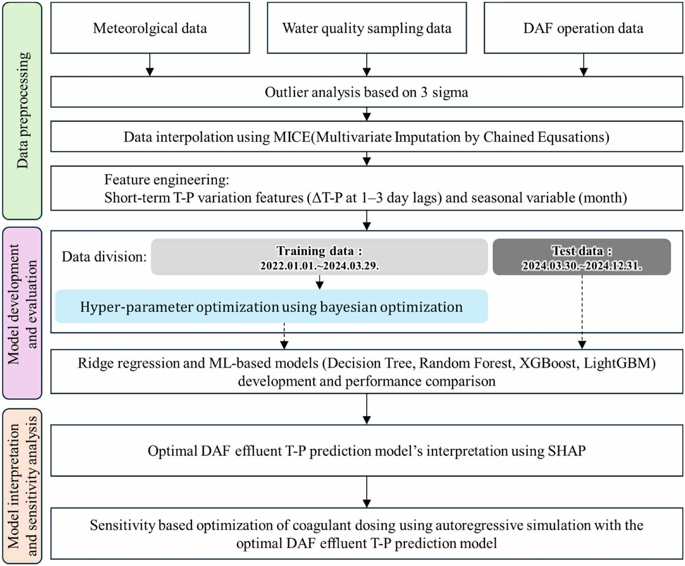
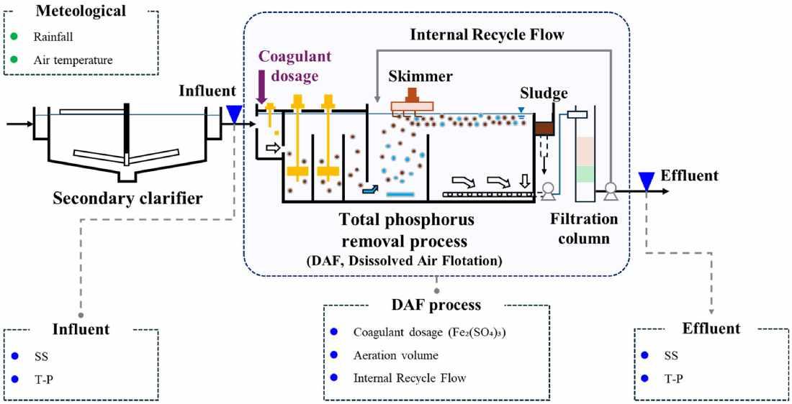
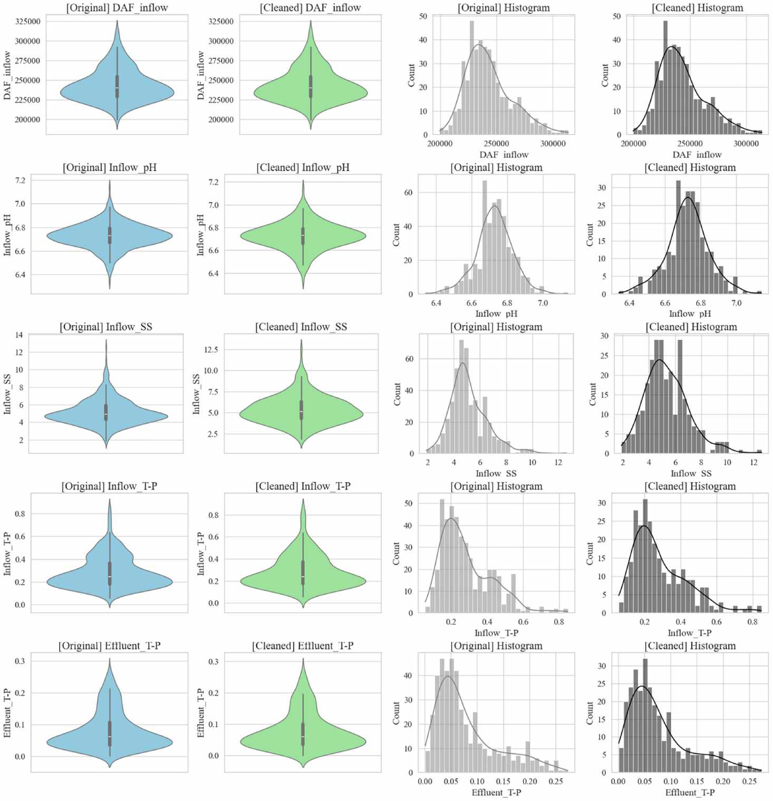
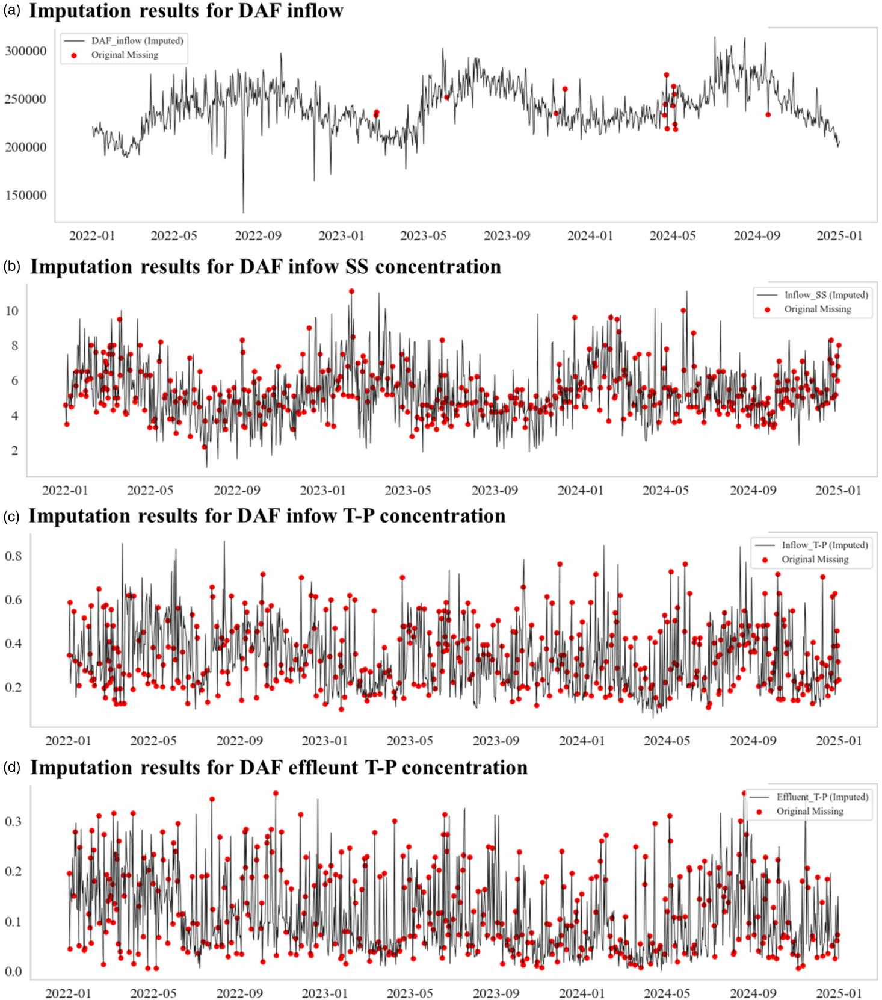
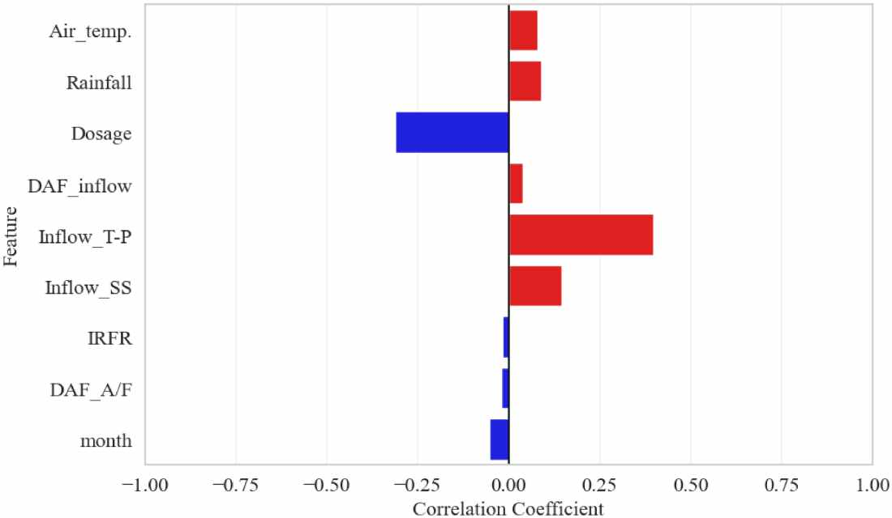
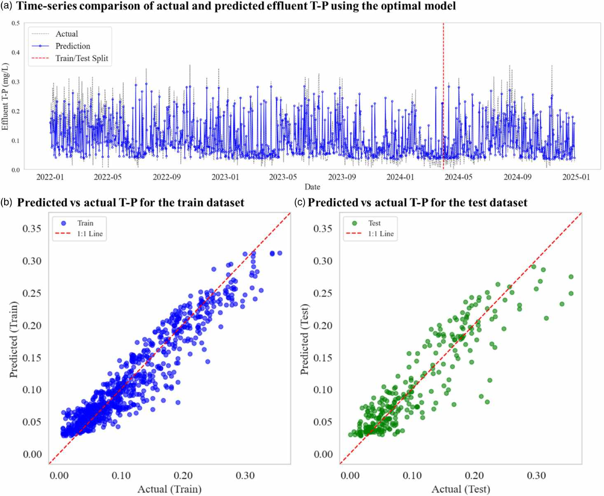
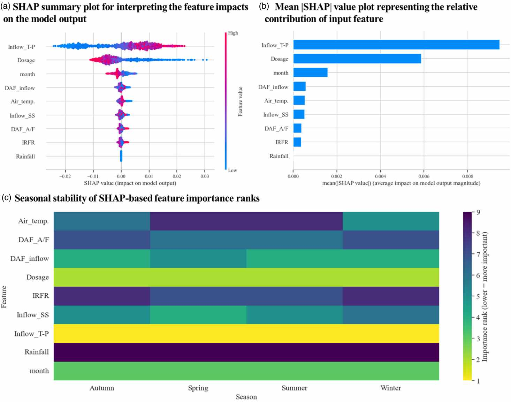
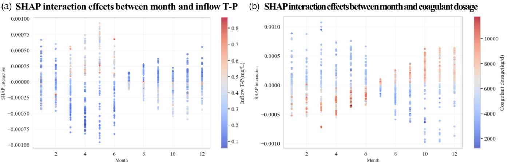
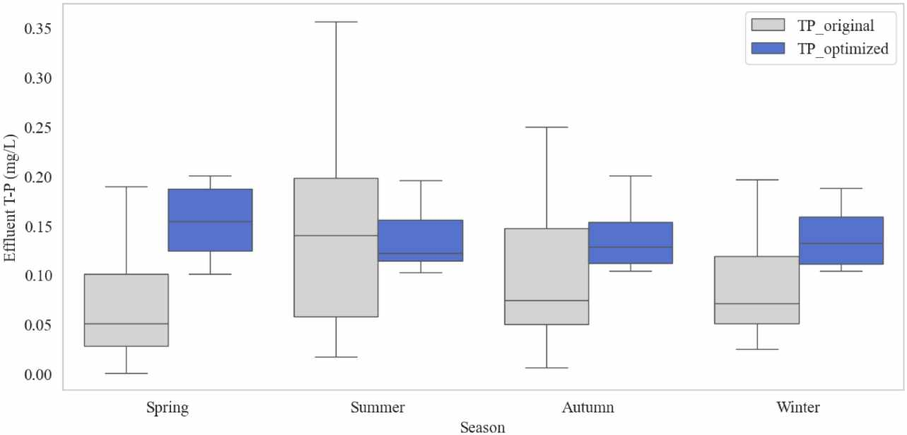

# Feature-engineered machine learning for daily-scale prediction of effluent total phosphorus and coagulant dosing optimization in full-scale DAF systems

## Abstract

- Kiểm soát nồng độ photpho tổng ($T\text{-}P$) trong hệ thống tuyển nổi khí hòa tan (DAF) là điều kiện bắt buộc để tuân thủ quy chuẩn xả thải tại trạm xử lý nước thải đô thị ($410{,}000\ \text{m}^3/\text{ngày}$):
  - Quyết định vận hành thực tế thường bị giới hạn theo chu kỳ ngày do thiếu hụt hệ thống cảm biến đo trực tuyến liên tục.
  - Nghiên cứu đề xuất khung học máy kỹ nghệ đặc trưng có khả năng giải thích để dự đoán nồng độ $T\text{-}P$ đầu ra theo thang ngày và tối ưu hóa liều lượng châm chất keo tụ phèn sắt $Fe_2(SO_4)_3$.
- Bộ dữ liệu quan trắc dài hạn $1{,}096\ \text{ngày}$ bao gồm các thông số vận hành thủy lực, chất lượng nước và khí tượng:
  - Dữ liệu ngoại lai được xử lý bằng quy tắc ba độ lệch chuẩn ($3\sigma$).
  - Dữ liệu khuyết thiếu được làm đầy bằng thuật toán hồi quy chuỗi đa biến MICE (Multivariate Imputation by Chained Equations).
- Kỹ nghệ đặc trưng tích hợp tri thức cơ chế thủy lực và động học hóa học:
  - Đặc trưng tải lượng đầu vào kết hợp lưu lượng và nồng độ chất ô nhiễm.
  - Đặc trưng biến động ngắn hạn nắm bắt quán tính hệ thống qua sai phân nồng độ $T\text{-}P$ đầu ra từ 1 đến 3 ngày trước.
  - Biến theo mùa tích hợp để thích ứng với biến động nhiệt độ và thời tiết.
- Mô hình Random Forest (RF) đạt hiệu năng dự đoán cao nhất trong số các thuật toán được thử nghiệm:
  - Hệ số xác định trên tập kiểm tra đạt $R^2 = 0.818$ ($0.8175$).
  - Sai số căn phương trung bình $\text{RMSE} = 0.032\ \text{mg/L}$.
  - Sai số dự báo nằm trong phạm vi $20\%$ so với ngưỡng giới hạn xả thải tiêu chuẩn ($0.2\ \text{mg/L}$).
- Phân tích giải thích SHAP (SHapley Additive exPlanations) làm rõ các nhân tố chi phối chính:
  - Nồng độ $T\text{-}P$ đầu vào, liều lượng châm chất keo tụ $Fe_2(SO_4)_3$ và biến động ngắn hạn là ba yếu tố ảnh hưởng mạnh nhất xuyên suốt các mùa.
- Tối ưu hóa liều lượng châm phèn sắt dựa trên mô phỏng độ nhạy tự hồi quy:
  - Giảm lượng hóa chất keo tụ tiêu thụ từ $32\%$ đến $51\%$.
  - Tiết kiệm chi phí vận hành ước tính khoảng $1.53$ tỷ KRW mỗi năm.
  - Duy trì nồng độ $T\text{-}P$ nước sau xử lý luôn ổn định dưới ngưỡng tiêu chuẩn xả thải.

## 1 INTRODUCTION

- Phú dưỡng hóa nguồn nước tiếp nhận và quy chuẩn xả thải photpho tổng ($T\text{-}P$) tại Hàn Quốc:
  - Xả thải photpho dư thừa từ các trạm xử lý nước thải đô thị (WWTP) là nguyên nhân hàng đầu gây phú dưỡng hóa thủy vực tiếp nhận.
  - Hàn Quốc đưa chỉ tiêu photpho tổng ($T\text{-}P$) vào quy chuẩn nước thải quốc gia từ năm 1996.
  - Quy chuẩn vùng tiếp tục siết chặt giới hạn nồng độ $T\text{-}P$ xả thải xuống $0.2\text{--}0.5\ \text{mg/L}$ từ năm 2012 trở đi.
  - Áp lực pháp lý gia tăng buộc các trạm xử lý nước thải phải bảo đảm tuân thủ quy chuẩn xả thải ổn định và liên tục.
- Ứng dụng công nghệ tuyển nổi khí hòa tan DAF (Dissolved Air Flotation) trong xử lý bậc ba:
  - Quá trình loại bỏ photpho bằng sinh học dinh dưỡng đơn thuần không thể đáp ứng tiêu chuẩn nghiêm ngặt dưới các biến động tải trọng lớn.
  - DAF được ứng dụng rộng rãi làm công đoạn xử lý bậc ba (tertiary treatment) nhờ hiệu suất làm trong cao, diện tích xây dựng nhỏ gọn và khả năng cải tạo các trạm hạn chế diện tích.
  - Các nghiên cứu quy mô thử nghiệm (pilot) và quy mô thực tế (full-scale) xác nhận DAF duy trì nồng độ $T\text{-}P$ đầu ra thấp khi duy trì các điều kiện keo tụ và tuyển nổi phù hợp.
- Thách thức tối ưu hóa liều lượng châm chất keo tụ trong vận hành DAF:
  - Hiệu quả vận hành DAF rất nhạy cảm với biến động chất lượng nước đầu vào và liều lượng hóa chất keo tụ phèn sắt $Fe_2(SO_4)_3$.
  - Thiếu hụt liều lượng keo tụ dẫn đến nồng độ $T\text{-}P$ đầu ra vượt ngưỡng quy chuẩn xả thải.
  - Dư thừa liều lượng keo tụ làm tăng lượng hóa chất tiêu thụ không cần thiết và gia tăng thể tích bùn thải hóa lý phát sinh.
  - Phần lớn các nhà máy xử lý vẫn vận hành dựa trên kinh nghiệm như châm theo tỷ lệ cố định hoặc tỷ lệ theo lưu lượng, dẫn đến sai lệch khi nồng độ photpho, độ đục và tải trọng thủy lực biến động nhanh.
- Rào cản kỹ thuật của hệ thống kiểm soát thời gian thực và tính khả thi của mô hình thang ngày:
  - Triển khai hệ thống kiểm soát tự động theo phút hoặc giờ gặp trở ngại lớn do cảm biến đo photpho trực tuyến (online sensors) thường xuyên lỗi, chi phí bảo trì cao và khó tích hợp vào hạ tầng điều khiển hiện hữu.
  - Các trạm xử lý nước thải quy mô thực tế chủ yếu dựa trên số liệu phân tích phòng thí nghiệm theo ngày và nhật ký vận hành thường nhật.
  - Quyết định điều chỉnh liều lượng châm hóa chất thường được đưa ra theo thang thời gian ngày hoặc theo ca vận hành.
  - Mô hình dự đoán thang ngày (daily-scale prediction) là giải pháp thực tế và có giá trị vận hành cao đối với các trạm chưa có cảm biến trực tuyến.
- Hạn chế của các mô hình hộp đen và mục tiêu phát triển khung học máy có thể giải thích:
  - Nhiều mô hình dự đoán thang ngày hiện hành hoạt động theo cơ chế hộp đen (black-box), thiếu tính minh bạch nên khó áp dụng vào quy trình ra quyết định vận hành thực tế.
  - Nghiên cứu phát triển khung học máy có khả năng giải thích (interpretable ML) dự đoán nồng độ $T\text{-}P$ đầu ra của DAF theo ngày.
  - Khung mô hình tích hợp dữ liệu chất lượng nước, thông số vận hành DAF, dữ liệu khí tượng kết hợp kỹ nghệ đặc trưng nắm bắt động học ngắn hạn (1–3 ngày) và xu hướng mùa.
  - Ứng dụng giá trị SHAP để phân tích đóng góp của từng đặc trưng và chạy mô phỏng độ nhạy nhằm cắt giảm liều lượng chất keo tụ mà vẫn đảm bảo nồng độ $T\text{-}P$ nằm trong giới hạn an toàn.

## 2 METHODS

- Khung phương pháp nghiên cứu dự đoán nồng độ $T\text{-}P$ đầu ra theo thang ngày và tối ưu hóa vận hành hệ thống DAF gồm 3 giai đoạn kế tiếp:
  - Giai đoạn 1 (Tiền xử lý và kỹ nghệ đặc trưng): Thu thập dữ liệu đa nguồn, sàng lọc ngoại lai theo $3\sigma$, điền khuyết dữ liệu chuỗi thời gian bằng thuật toán MICE và kỹ nghệ đặc trưng tích hợp cơ chế thủy lực, động học ngắn hạn cùng biến đổi theo mùa.
  - Giai đoạn 2 (Phát triển và đánh giá mô hình): Huấn luyện 4 thuật toán học máy hồi quy trên tập đặc trưng kỹ nghệ, tối ưu hóa siêu tham số bằng kỹ thuật Bayesian Optimization và đánh giá độ chính xác qua các chỉ số thống kê tiêu chuẩn ($R^2$, $\text{RMSE}$, $\text{MAE}$).
  - Giai đoạn 3 (Giải thích mô hình và tối ưu hóa vận hành): Áp dụng phương pháp SHAP định lượng tầm quan trọng và tương tác giữa các đặc trưng, thiết lập mô phỏng tự hồi quy theo kịch bản để phân tích độ nhạy của $T\text{-}P$ đầu ra trước các mức điều chỉnh liều lượng phèn sắt $Fe_2(SO_4)_3$.

### 2.1 Data acquisition

- Quy mô và cấu hình công nghệ của trạm xử lý nước thải đô thị mục tiêu:
  - Công suất thiết kế của trạm đạt $410{,}000\ \text{m}^3/\text{ngày}$ với 2 dây chuyền xử lý song song.
  - Dây chuyền xử lý sinh học chính vận hành theo quy trình Modified Ludzack–Ettinger (MLE) loại bỏ chất hữu cơ và nitơ.
  - Nước sau bể lắng thứ cấp được phân lưu sang hai công đoạn xử lý bậc ba vận hành song song gồm hệ thống lọc đĩa vi lọc (MDF) và hệ thống tuyển nổi khí hòa tan (DAF).
- Cơ chế phân tách pha và loại bỏ photpho trong hệ thống DAF quy mô thực:
  - DAF thực hiện phân tách pha rắn - lỏng dựa trên nguyên lý hòa tan không khí vào nước dưới áp suất cao và giải áp đột ngột để tạo bọt khí siêu mịn (microbubbles) tuân theo định luật Henry.
  - Chất keo tụ sử dụng là muối sắt ferric sulfate $Fe_2(SO_4)_3$ giúp làm mất ổn định các hạt keo và tạo bông cặn photpho không tan.
  - Các bọt khí siêu mịn gắn bám vào bông cặn keo tụ tạo thành phức hợp bọt-bông có khối lượng riêng nhỏ hơn nước, nổi lên bề mặt để thanh cào bùn thu gom và loại bỏ.
- Khung phương pháp nghiên cứu 3 giai đoạn kết nối dữ liệu quan trắc và tối ưu hóa vận hành:
  - **Hình 2.** Quy trình nghiên cứu gồm tiền xử lý dữ liệu, phát triển mô hình và giải thích
    - 
    - **Hình này chứng minh điều gì**
      - Khung phương pháp chuẩn hóa tuần tự từ dữ liệu đa nguồn đến mô phỏng tự hồi quy
      - Tích hợp kỹ nghệ đặc trưng và tối ưu hóa siêu tham số Bayes cho 4 mô hình học máy
    - **Từ đâu mà thấy được**
      - Sơ đồ từ trên xuống: Tiền xử lý (3-sigma, MICE) đến Huấn luyện (chia tập 2022-2024, Bayes)
      - Khối cuối cùng biểu diễn phân tích SHAP và mô phỏng tối ưu hóa liều lượng châm phèn sắt
- Ba nguồn dữ liệu độc lập thu thập trong giai đoạn 3 năm từ tháng 01/2022 đến tháng 12/2024 ($N = 1{,}096\ \text{ngày}$):
  - Dữ liệu khí tượng: Thu nhận từ Hệ thống quan trắc bề mặt tự động ASOS của Cục Khí tượng Hàn Quốc (KMA) gồm nhiệt độ không khí, lượng mưa, độ ẩm và tốc độ gió.
  - Dữ liệu chất lượng nước: Phân tích mẫu định kỳ hàng ngày tại phòng thí nghiệm gồm $T\text{-}P$ đầu vào, $T\text{-}P$ đầu ra, chất rắn lơ lửng ($\text{SS}$), $\text{pH}$ và lưu lượng tuần hoàn nội bộ (IRFR).
  - Dữ liệu vận hành DAF: Trích xuất từ hệ thống giám sát SCADA nhà máy gồm lưu lượng nước vào DAF, liều lượng châm chất keo tụ $Fe_2(SO_4)_3$, cường độ khuấy trộn, tỷ lệ dòng tuần hoàn và tỷ lệ khí trên chất rắn (A/S).

### 2.2 Data preprocessing

- Sàng lọc và loại bỏ dữ liệu ngoại lai bằng quy tắc ba độ lệch chuẩn ($3\sigma$):
  - Áp dụng trên toàn bộ các thông số vận hành và chỉ tiêu chất lượng nước trước khi huấn luyện mô hình.
  - Các bản ghi nằm ngoài khoảng $\pm 3\sigma$ quanh giá trị trung bình đại diện cho lỗi cảm biến, sự cố thiết bị hoặc xáo trộn vận hành cực đoan được loại bỏ để bảo đảm tính ổn định.
- Điền khuyết dữ liệu chuỗi thời gian bằng thuật toán MICE (Multivariate Imputation by Chained Equations):
  - Thuật toán mô hình hóa có điều kiện từng biến chứa giá trị khuyết $X_j$ dựa trên phân phối hồi quy phụ thuộc vào tất cả các biến còn lại $X_{-j}$:
    $$X_j^{\text{mis}} \sim f_j(X_{-j}; \theta_j)$$
  - Quá trình điền khuyết cập nhật lặp qua chuỗi phương trình liên hoàn:
    $$\hat{X}^{(t)} = F(\hat{X}^{(t-1)})$$
    trong đó $\hat{X}^{(t)}$ là ma trận dữ liệu được làm đầy tại vòng lặp $t$.
  - Thuật toán lặp đến khi hội tụ nhằm bảo toàn cấu trúc tương quan đa biến phức tạp giữa các yếu tố khí tượng, thủy lực và chất lượng nước.
- Đặc trưng thiết kế và vận hành trạm xử lý DAF quy mô thực:
  - Công suất thiết kế đạt $410{,}000\ \text{m}^3/\text{ngày}$ với quy trình sinh học Modified Ludzack–Ettinger (MLE).
  - Hệ thống tuyển nổi DAF đóng vai trò công đoạn xử lý hóa lý bậc ba cốt lõi nhằm khử photpho.
  - Hóa chất keo tụ sử dụng là phèn sắt ferric sulfate $Fe_2(SO_4)_3$.
  - Chu kỳ ra quyết định điều chỉnh hóa chất thực hiện theo ngày dựa trên kết quả phân tích phòng thí nghiệm trong chuỗi dữ liệu 3 năm ($N = 1{,}096\ \text{ngày}$).
- Chiến lược kỹ nghệ đặc trưng tích hợp tri thức cơ chế và động học vận hành thực tế:
  - Đặc trưng biến động ngắn hạn (short-term variation metrics): Tính toán sai phân nồng độ $T\text{-}P$ đầu ra tại các độ trễ 1 ngày ($\Delta T\text{-}P_{t-1}$), 2 ngày ($\Delta T\text{-}P_{t-2}$) và 3 ngày ($\Delta T\text{-}P_{t-3}$).
  - Các biến sai phân nắm bắt kịp thời chiều hướng và biên độ dao động nhanh do mưa rửa trôi, châm thiếu phèn cục bộ hoặc biến đổi đặc tính hạt bông cặn.
  - Nguyên tắc phòng ngừa rò rỉ dữ liệu (data leakage): Toàn bộ biến trễ và sai phân chỉ tính toán từ dữ liệu sẵn có trước thời điểm dự báo.
  - Đặc trưng cơ chế vận hành DAF: Tỷ lệ cấp khí trên lưu lượng nước vào ($\text{DAF\_A/F}$), lưu lượng châm phèn sắt $Fe_2(SO_4)_3$, lưu lượng vào DAF và lưu lượng tuần hoàn nội bộ (IRFR).
  - Đặc trưng môi trường và khí hậu bên ngoài: Nhiệt độ không khí, lượng mưa tích lũy và chỉ số tháng phản ánh biến thiên nhiệt độ ảnh hưởng tới động học keo tụ.
  - Đặc trưng chất lượng nước đầu vào: Nồng độ $T\text{-}P$ đầu vào và chất rắn lơ lửng ($\text{SS}$) đầu vào trực tiếp quyết định nhu cầu tiêu hao chất keo tụ.

### 2.3 Development of ML-based models for DAF effluent T-P prediction model

- Lựa chọn bốn thuật toán học máy đại diện dựa trên cây (tree-based models) để so sánh các cơ chế học khác nhau:
  - Cây quyết định (Decision Tree - DT): Cấu trúc cây đơn lẻ mang tính diễn giải trực tiếp.
  - Rừng ngẫu nhiên (Random Forest - RF): Mô hình kết hợp tập hợp theo cơ chế lấy mẫu lặp có hoàn lại (bootstrap aggregation / bagging) giúp giảm phương sai.
  - XGBoost: Khung tăng cường độ dốc (gradient boosting) kết hợp cơ chế phạt điều chuẩn để kiểm soát độ phức tạp mô hình và tránh quá khớp.
  - LightGBM: Thuật toán tăng cường độ dốc dựa trên phân rã biểu đồ tần số (histogram-based) tối ưu hóa tốc độ huấn luyện cho dữ liệu dạng bảng.
- Quy trình tinh chỉnh siêu tham số bằng tối ưu hóa Bayes (Bayesian Optimization):
  - Tối ưu hóa Bayes thăm dò không gian tham số đa chiều nhằm tìm kiếm cấu hình tối ưu với chi phí tính toán thấp nhất.
  - Hàm mục tiêu xác định là cực tiểu hóa sai số bình phương trung bình ($\text{MSE}$) giữa nồng độ $T\text{-}P$ đầu ra thực nghiệm và nồng độ dự đoán.

### 2.4 Model’s performance evaluation

- Ba chỉ số thống kê tiêu chuẩn đánh giá độ chính xác và tính ổn định của mô hình dự đoán:
  - Hệ số xác định ($R^2$): Đo lường tỷ lệ phương sai của nồng độ $T\text{-}P$ quan sát được mô hình giải thích, phản ánh năng lực khớp dữ liệu tổng quát:
    $$R^2 = 1 - \frac{\sum_{i=1}^{n} (y_i - \hat{y}_i)^2}{\sum_{i=1}^{n} (y_i - \bar{y})^2}$$
  - Sai số căn phương trung bình ($\text{RMSE}$): Định lượng độ lớn sai số dự báo tổng thể, đặc biệt nhạy cảm với các sai lệch lớn nhằm đánh giá nguy cơ dự báo thiếu hoặc thừa nghiêm trọng:
    $$\text{RMSE} = \sqrt{\frac{1}{n} \sum_{i=1}^{n} (y_i - \hat{y}_i)^2}$$
  - Sai số tuyệt đối trung bình ($\text{MAE}$): Đo khoảng cách tuyệt đối trung bình giữa giá trị thực nghiệm và dự báo, thể hiện tính ổn định trước các điểm dị biệt:
    $$\text{MAE} = \frac{1}{n} \sum_{i=1}^{n} |y_i - \hat{y}_i|$$
- Định nghĩa các biến số trong công thức định lượng:
  - $y_i$: Nồng độ $T\text{-}P$ đầu ra thực nghiệm quan trắc tại ngày thứ $i$.
  - $\hat{y}_i$: Nồng độ $T\text{-}P$ đầu ra dự đoán từ mô hình học máy tại ngày thứ $i$.
  - $\bar{y}$: Giá trị trung bình số học của các quan sát thực nghiệm trong tập mẫu.
  - $n$: Tổng số lượng mẫu dữ liệu đánh giá.

### 2.5 Feature contribution and interaction analysis using SHAP

- Cơ sở lý thuyết trò chơi hợp tác của phương pháp SHapley Additive exPlanations (SHAP):
  - SHAP định lượng đóng góp biên của từng đặc trưng đầu vào $i$ thông qua giá trị Shapley trung bình trên mọi tập con đặc trưng khả dĩ:
    $$\phi_i = \sum_{S \subseteq F \setminus \{i\}} \frac{|S|!(|F| - |S| - 1)!}{|F|!} [f(S \cup \{i\}) - f(S)]$$
  - $F$: Tập hợp toàn bộ các đặc trưng đầu vào của mô hình.
  - $S$: Tập con đặc trưng bất kỳ trích xuất từ $F$ không bao gồm đặc trưng $i$.
  - $f(\cdot)$: Đầu ra dự báo nồng độ $T\text{-}P$ của mô hình ứng với tập đặc trưng khảo sát.
- Hai phương thức phân tích giải thích chuyên sâu áp dụng cho mô hình tối ưu:
  - Đóng góp đặc trưng toàn cục (global feature contribution): Xếp hạng mức độ chi phối dựa trên giá trị tuyệt đối trung bình Shapley ($\text{mean } |\text{SHAP value}|$) qua toàn bộ tập dữ liệu quan trắc.
  - Mẫu hình tương tác đặc trưng cặp đôi (pairwise feature interactions): Tính toán giá trị tương tác SHAP để khám phá các mối phụ thuộc phi tuyến giữa các điều kiện vận hành thủy lực và liều lượng hóa chất.
- Không gian tìm kiếm siêu tham số tối ưu hóa Bayes cho các mô hình học máy:
  - Độ sâu cây tối đa (`max_depth`): Phạm vi tìm kiếm từ $2$ đến $10$ cho cả Decision Tree, Random Forest, XGBoost và LightGBM.
  - Số lượng cây (`n_estimators`): Tìm kiếm từ $100$ đến $2{,}000$ cây đối với các mô hình ensemble (RF, XGBoost, LightGBM).
  - Tốc độ học (`learning_rate`): Thiết lập trong khoảng $0.001$ đến $0.1$ cho các mô hình tăng cường độ dốc.
  - Tỷ lệ lấy mẫu con (`subsample` và `colsample_bytree`): Khảo sát từ $0.6$ đến $1.0$ nhằm nâng cao khả năng khái quát hóa.

### 2.6 Sensitivity-based optimization of coagulant dosing

- Mục tiêu của khung tối ưu hóa liều lượng châm chất keo tụ phèn sắt $Fe_2(SO_4)_3$ theo độ nhạy:
  - Đánh giá phản ứng động học của nồng độ photpho tổng ($T\text{-}P$) đầu ra khi thay đổi liều lượng châm hóa chất keo tụ.
  - Xác định ngưỡng liều lượng châm tối thiểu nhằm duy trì nồng độ photpho đầu ra luôn tuân thủ quy chuẩn xả thải khắt khe ($0.2\ \text{mg/L}$).
- Thiết lập kịch bản mô phỏng động học bằng hệ số nhân liều lượng ($m$):
  - Áp dụng hệ số nhân $m$ lên liều lượng châm phèn sắt cơ sở tại từng thời điểm $t$ để thiết lập các kịch bản vận hành thử nghiệm.
  - Tích hợp cấu trúc tự hồi quy (autoregressive simulation) để truyền lan tác động của việc điều chỉnh hóa chất qua chuỗi thời gian liên tục.
- Cơ chế cập nhật đệ quy các đặc trưng biến động ngắn hạn trong mô phỏng:
  - Các đặc trưng sai phân ngắn hạn ($\Delta T\text{-}P$) được tính toán lại tại mỗi bước dự báo dựa trên chính các giá trị dự đoán của mô hình ở các bước trước đó, thay vì dùng dữ liệu quan sát thực nghiệm.
  - Sơ đồ cập nhật đệ quy nắm bắt các phản hồi phi tuyến và tác động tích lũy dài hạn của hệ thống khi liều lượng hóa chất chệch khỏi trạng thái vận hành ban đầu.
  - Lượng hóa độ nhạy của chất lượng nước đầu ra trước từng mức độ châm phèn, phân định rõ vùng định lượng tối ưu giữa tiết kiệm hóa chất và an toàn xả thải.

## 3 RESULTS AND DISCUSSION

### 3.1 Statistical analysis of characteristics of the target DAF system

- Sơ đồ cấu tạo công nghệ DAF và các điểm thu thập dữ liệu quan trắc chất lượng nước:
  - **Hình 3.** Sơ đồ chi tiết công nghệ DAF và các vị trí lấy mẫu quan trắc
    - 
    - **Hình này chứng minh điều gì**
      - Hệ thống DAF kết hợp keo tụ tạo bông với tuyển nổi bọt khí hòa tan và cột lọc
      - Điểm châm phèn sắt $Fe_2(SO_4)_3$ trước bể trộn nhanh quyết định hiệu quả khử photpho
    - **Từ đâu mà thấy được**
      - Dòng chảy từ bể lắng thứ cấp qua ngăn châm phèn $Fe_2(SO_4)_3$ vào buồng tuyển nổi DAF
      - Dòng khí hòa tan tuần hoàn tạo bọt mịn đưa bông cặn lên bề mặt cho gạt bùn thu hồi
- Hiệu quả sàng lọc ngoại lai bằng quy tắc ba độ lệch chuẩn ($3\sigma$):
  - Phân tích thống kê áp dụng trên toàn bộ các chuỗi số liệu thủy lực và chất lượng nước (DAF inflow, influent pH, influent $\text{SS}$, influent $T\text{-}P$ và effluent $T\text{-}P$).
  - Dữ liệu sau xử lý giảm thiểu các giá trị cực đoan dị biệt và làm mượt hàm mật độ xác suất mà không làm méo mó cấu trúc dữ liệu nguyên bản.
  - Phân phối lưu lượng DAF inflow biến đổi không đáng kể sau làm sạch, bảo toàn biến thiên thủy lực tự nhiên của trạm xử lý.
  - Các biến nồng độ có đuôi dài (influent $\text{SS}$, influent $T\text{-}P$ và effluent $T\text{-}P$) chuyển biến đối xứng và tập trung hơn quanh giá trị trung tâm.
- Phân phối xác suất của các thông số vận hành và chất lượng nước sau lọc ngoại lai $3\sigma$:
  - **Hình 4.** Phân phối violin và histogram các thông số chính trước và sau lọc $3\sigma$
    - 
    - **Hình này chứng minh điều gì**
      - Quy tắc $3\sigma$ loại bỏ các gai nhọn bất thường mà không làm méo mó phân phối gốc
      - Đuôi phân phối nồng độ $\text{SS}$, $T\text{-}P$ đầu vào và $T\text{-}P$ đầu ra trở nên thu gọn hơn
    - **Từ đâu mà thấy được**
      - Cột violin màu xanh lam (Original) chuyển sang xanh lục (Cleaned) giảm các điểm cực đoan
      - Biểu đồ histogram cho thấy tần suất phân bố dữ liệu mượt mà và tập trung quanh trung vị
- Thống kê tỷ lệ khuyết thiếu và dữ liệu ngoại lai bị loại bỏ theo Bảng 3:
  - Tỷ lệ ngoại lai nhìn chung rất thấp trên toàn bộ các biến (dưới $0.82\%$), cho thấy các giá trị cực đoan xuất hiện hiếm hoi.
  - Dữ liệu khuyết thiếu tập trung chủ yếu ở biến pH đầu vào ($43.70\%$, 479 mẫu khuyết) do cảm biến đo gặp sự cố kỹ thuật định kỳ.
  - Lưu lượng DAF chỉ khuyết 4 mẫu ($0.36\%$) và loại 2 mẫu ngoại lai ($0.18\%$).
  - Lưu lượng tuần hoàn nội bộ IRFR khuyết 6 mẫu ($0.55\%$) và loại 4 mẫu ngoại lai ($0.36\%$).
  - Chất rắn lơ lửng đầu vào ($\text{SS}$) khuyết 68 mẫu ($6.20\%$) và loại 6 mẫu ngoại lai ($0.55\%$).
  - $T\text{-}P$ đầu vào khuyết 59 mẫu ($5.38\%$) và loại 6 mẫu ngoại lai ($0.55\%$).
  - $T\text{-}P$ đầu ra khuyết 74 mẫu ($6.75\%$) và loại 9 mẫu ngoại lai ($0.82\%$).
  - Liều lượng châm phèn sắt không có mẫu khuyết ($0.00\%$) và chỉ có 1 mẫu ngoại lai ($0.09\%$).
- Thống kê mô tả các nhóm biến đầu vào sau tiền xử lý theo Bảng 4:
  - Nhóm tải lượng thủy lực: Lưu lượng nước vào DAF có giá trị trung bình $240{,}671\ \text{m}^3/\text{ngày}$ ($\text{std} = 23{,}394\ \text{m}^3/\text{ngày}$, phạm vi $131{,}176\text{--}313{,}936\ \text{m}^3/\text{ngày}$).
  - Tỷ lệ tuần hoàn nội bộ IRFR có giá trị trung bình $36.09\%$ ($\text{std} = 4.86\%$, trung vị $35.63\%$) duy trì áp suất bão hòa khí ổn định.
  - Nhóm chất lượng nước đầu vào: $\text{SS}$ đầu vào có giá trị trung bình $5.26\ \text{mg/L}$ ($\text{std} = 1.74\ \text{mg/L}$), $T\text{-}P$ đầu vào trung bình $0.32\ \text{mg/L}$ ($\text{std} = 0.15\ \text{mg/L}$).
  - Loại trừ biến pH đầu vào: Mặc dù phân bố trong dải hẹp $6.34\text{--}7.14$ (trung bình $6.73$), nhưng tỷ lệ khuyết thiếu quá cao ($> 43\%$) và phương sai nhỏ nên bị loại để tránh gây nhiễu mô hình.
  - Chất lượng nước sau DAF: Nồng độ $T\text{-}P$ đầu ra trung bình $0.10\ \text{mg/L}$ ($\text{std} = 0.07\ \text{mg/L}$, trung vị $0.08\ \text{mg/L}$), $75\%$ mẫu dưới $0.14\ \text{mg/L}$, giá trị cực đại đạt $0.36\ \text{mg/L}$.
  - Nhóm thông số vận hành: Tỷ lệ khí trên nước $\text{DAF A/F}$ giữ ổn định ở mức $0.01$, liều lượng châm phèn sắt $Fe_2(SO_4)_3$ đạt trung bình $6{,}267\ \text{kg/ngày}$ ($\text{IQR} = 4{,}760\text{--}7{,}680\ \text{kg/ngày}$).
  - Nhóm khí tượng: Lượng mưa đạt cực đại $122.5\ \text{mm/ngày}$, nhiệt độ không khí biến động từ $-14.7\ ^\circ\text{C}$ đến $31.8\ ^\circ\text{C}$ phản ánh rõ nét biến đổi theo mùa.

### 3.2 MICE-based interpolation of input and target features

- Cơ chế hồi quy lặp chuỗi đa biến của thuật toán MICE áp dụng cho chuỗi dữ liệu công nghệ môi trường:
  - MICE ước lượng tuần tự các giá trị khuyết thiếu qua các mô hình hồi quy lặp, cho phép từng biến chứa điểm khuyết được dự đoán tối ưu từ tất cả các biến quan sát còn lại.
  - Thuật toán thích ứng tối ưu với đặc tính phi tuyến và phụ thuộc lẫn nhau phức tạp giữa tải lượng thủy lực, nồng độ ô nhiễm đầu vào và điều kiện vận hành DAF.
- Tái tạo chuỗi dữ liệu chất lượng nước bảo đảm tính liên tục thời gian và động học quá trình:
  - Điểm khuyết thiếu ở $\text{SS}$ đầu vào và $T\text{-}P$ đầu vào (thường phát sinh trong các đợt đỉnh tải hoặc gián đoạn đo đạc phòng thí nghiệm) được khôi phục đồng nhất với phương sai của các mẫu lân cận.
  - Nồng độ $T\text{-}P$ đầu ra bị khuyết được làm đầy mượt mà dọc theo biến thiên chu kỳ ngày và mùa, không gây ra bước nhảy đột ngột hay mất cân bằng dữ liệu mục tiêu.
- Cơ sở khoa học và ưu thế của MICE so với các phương pháp nội suy truyền thống:
  - Phù hợp với các nghiên cứu quan trắc chất lượng nước (Dixneuf et al. 2021; Wang et al. 2024), xác nhận phương pháp đa biến duy trì tương quan hệ số cao hơn các kỹ thuật nội suy đơn biến cục bộ.
  - Khắc phục hạn chế của phương pháp điền giá trị trung bình hoặc nội suy tuyến tính vốn làm suy giảm phương sai và bóp méo phân phối xác suất.
  - Cung cấp tập dữ liệu đầu vào hoàn chỉnh, sạch và nhất quán thời gian cho các bước kỹ nghệ đặc trưng và huấn luyện mô hình học máy tiếp theo.

### 3.3 Development of the optimal DAF effluent T-P prediction model

- Kết quả điền khuyết dữ liệu chuỗi thời gian MICE cho các biến thủy lực và chất lượng nước:
  - **Hình 5.** Kết quả điền khuyết dữ liệu bằng thuật toán MICE cho 4 thông số cốt lõi
    - 
    - **Hình này chứng minh điều gì**
      - Thuật toán MICE khôi phục các điểm khuyết thiếu liên tục theo biến động chuỗi thời gian
      - Đảm bảo tính toàn vẹn của tập dữ liệu huấn luyện cho mô hình Random Forest
    - **Từ đâu mà thấy được**
      - Bốn đồ thị (a)-(d) từ trên xuống biểu diễn lưu lượng, $\text{SS}$ vào, $T\text{-}P$ vào và $T\text{-}P$ ra
      - Các điểm tròn đỏ biểu diễn vị trí khuyết thiếu được làm đầy mượt mà trên đường đen
- Phân tích hệ số tương quan tuyến tính Pearson giữa các đặc trưng đầu vào và photpho đầu ra:
  - **Hình 6.** Hệ số tương quan Pearson giữa các đặc trưng ứng viên và $T\text{-}P$ đầu ra
    - 
    - **Hình này chứng minh điều gì**
      - Nồng độ $T\text{-}P$ đầu vào có tương quan dương mạnh nhất với $T\text{-}P$ đầu ra của DAF
      - Liều lượng châm phèn sắt $Fe_2(SO_4)_3$ tương quan âm rõ rệt với $T\text{-}P$ nước sau xử lý
    - **Từ đâu mà thấy được**
      - Trục hoành biểu diễn hệ số tương quan từ -1.00 đến 1.00 qua các thanh ngang
      - Thanh Inflow_T-P màu đỏ vươn sang phải (+0.40), thanh Dosage màu xanh vươn sang trái (-0.31)
- Đánh giá cơ chế tương quan của từng nhóm đặc trưng đối với $T\text{-}P$ đầu ra:
  - Nồng độ $T\text{-}P$ đầu vào thể hiện tương quan dương mạnh nhất, xác nhận tải lượng photpho ban đầu là động lực chính chi phối lượng photpho tồn dư.
  - Chất rắn lơ lửng đầu vào ($\text{SS}$) có tương quan dương mức độ vừa, phản ánh vai trò của hạt cặn đóng vai trò hạt mang photpho liên kết.
  - Liều lượng châm phèn sắt $Fe_2(SO_4)_3$ thể hiện tương quan âm rõ nét, minh chứng cơ chế kết tủa hóa lý khử photpho hiệu quả khi tăng hóa chất.
  - Các thông số thủy lực (lưu lượng DAF, lưu lượng tuần hoàn IRFR, tỷ lệ khí nước $\text{DAF\_A/F}$) có tương quan tuyến tính rất yếu trong điều kiện vận hành chuẩn.
  - Các biến khí tượng (nhiệt độ không khí, lượng mưa) tương quan dương yếu phản ánh hiện tượng rửa trôi bề mặt và động học phản ứng theo mùa.
- So sánh hiệu năng thực nghiệm giữa mô hình tuyến tính Ridge và các mô hình học máy phi tuyến theo Bảng 5:
  - Hồi quy tuyến tính Ridge kém hiệu quả trên tập kiểm tra ($\text{Test } R^2 = 0.5599$, $\text{RMSE} = 0.0504\ \text{mg/L}$, $\text{MAE} = 0.0380\ \text{mg/L}$), khẳng định tính chất phi tuyến phức tạp của hệ thống DAF.
  - Decision Tree cải thiện độ chính xác nhưng dễ quá khớp ($\text{Train } R^2 = 0.9048$, $\text{Test } R^2 = 0.7578$, $\text{Test RMSE} = 0.0374\ \text{mg/L}$).
  - XGBoost và LightGBM đạt độ chính xác kiểm tra cao ($\text{Test } R^2 = 0.7924$ và $0.7960$, $\text{Test RMSE} = 0.0346$ và $0.0343\ \text{mg/L}$).
  - Random Forest (RF) đạt hiệu năng tối ưu nhất trên toàn bộ các chỉ số: $\text{Train } R^2 = 0.8678$, $\text{Test } R^2 = 0.8175$, $\text{Test RMSE} = 0.0324\ \text{mg/L}$ và $\text{Test MAE} = 0.0235\ \text{mg/L}$.
- Đánh giá sai số dự đoán so với giới hạn xả thải tiêu chuẩn $0.2\ \text{mg/L}$:
  - Sai số $\text{RMSE} = 0.0324\ \text{mg/L}$ và $\text{MAE} = 0.0235\ \text{mg/L}$ của mô hình Random Forest chỉ chiếm lần lượt khoảng $16\%$ và $12\%$ ngưỡng quy chuẩn xả thải $0.2\ \text{mg/L}$.
  - Độ chính xác hiệu dụng đạt trên $80\%$ phạm vi nồng độ cho phép, cung cấp độ tin cậy vận hành cao khi nồng độ tiệm cận ngưỡng xả thải.
  - Sai khác sai số nhỏ ($0.01\text{--}0.02\ \text{mg/L}$) mang tính quyết định thực tiễn để kịp thời kích hoạt châm phèn phòng ngừa trước khi phát sinh vi phạm.
- Đánh giá phân tầng theo chế độ nồng độ (regime-based performance evaluation):
  - Chế độ nồng độ thấp (tứ phân vị thứ nhất, $N = 281$ mẫu): Mô hình đạt $\text{RMSE} = 0.0214\ \text{mg/L}$ và $\text{MAE} = 0.0167\ \text{mg/L}$.
  - Chế độ nồng độ cao (tứ phân vị thứ ba, $N = 275$ mẫu): Mô hình ghi nhận $\text{RMSE} = 0.0424\ \text{mg/L}$ và $\text{MAE} = 0.0328\ \text{mg/L}$.
  - Mức tăng sai số ở vùng nồng độ cao phản ánh đúng biên độ dao động mạnh của các đợt đỉnh tải, không xuất hiện hiện tượng phóng đại sai số bất thường ở đuôi phân phối.
- Chẩn đoán phần dư trên tập kiểm tra độc lập khẳng định không có độ lệch hệ thống theo Bảng 6:
  - Hệ số góc đường hồi quy giữa giá trị dự đoán và thực tế đạt $0.835$, phản ánh quan hệ tuyến tính đồng nhất chặt chẽ.
  - Điểm cắt trục tung (intercept) đạt $0.0175\ \text{mg/L}$, thể hiện mức dịch chuyển cực nhỏ ở vùng nồng độ tiệm cận 0.
  - Sai số có dấu trung bình (mean signed error) đạt $0.0002\ \text{mg/L}$, chứng minh mô hình hoàn toàn không bị thiên lệch (bias) dự báo thừa hay thiếu.

### 3.4 Interpretation of the developed model using explainability methods

- Hiệu năng dự báo chuỗi thời gian và đồ thị phân tán thực tế - dự đoán của mô hình Random Forest:
  - **Hình 7.** Đánh giá hiệu năng dự báo của mô hình Random Forest tối ưu
    - 
    - **Hình này chứng minh điều gì**
      - Mô hình Random Forest bám sát các biến động ngắn hạn thực tế qua chuỗi 1,096 ngày
      - Sai số phân bố đều và các điểm dữ liệu tập trung chặt chẽ quanh đường chuẩn phân giác 1:1
    - **Từ đâu mà thấy được**
      - Đồ thị (a) chuỗi thời gian cho thấy đường dự đoán xanh dương khớp đường thực nghiệm xám
      - Đồ thị (b) tập huấn luyện và (c) tập kiểm tra thể hiện các điểm gom chặt quanh đường 1:1
- Định lượng tầm quan trọng toàn cục và tính ổn định thứ hạng của các đặc trưng bằng SHAP:
  - **Hình 8.** Phân tích tầm quan trọng và tính ổn định thứ hạng đặc trưng bằng SHAP
    - 
    - **Hình này chứng minh điều gì**
      - $T\text{-}P$ đầu vào và liều lượng châm phèn sắt $Fe_2(SO_4)_3$ là hai yếu tố chi phối mạnh nhất
      - Thứ hạng đóng góp của các đặc trưng chính giữ vững tính ổn định xuyên suốt 4 mùa
    - **Từ đâu mà thấy được**
      - Biểu đồ (b) ghi nhận $|\text{SHAP}|$ của Inflow_T-P đạt cao nhất, theo sau là Dosage và month
      - Bản đồ nhiệt (c) thể hiện Inflow_T-P và Dosage giữ vị trí xếp hạng 1 và 2 quanh năm
- Phân tích chi tiết mức độ đóng góp toàn cục của từng đặc trưng đầu vào:
  - Nồng độ $T\text{-}P$ đầu vào là nhân tố quan trọng nhất với giá trị tuyệt đối SHAP trung bình lớn nhất ($\text{mean } |\text{SHAP}| = 0.009\text{--}0.010\ \text{mg/L}$), khẳng định tải lượng photpho ban đầu là nguồn phát sinh biến động chính.
  - Liều lượng châm chất keo tụ phèn sắt $Fe_2(SO_4)_3$ xếp vị trí thứ hai với $\text{mean } |\text{SHAP}| \approx 0.005\text{--}0.006\ \text{mg/L}$, chứng minh vai trò điều khiển quyết định của hóa chất đối với hiệu suất tạo bông kết tủa photpho.
  - Yếu tố chu kỳ mùa (Month) giữ vị trí thứ ba với $\text{mean } |\text{SHAP}| \approx 0.0015\text{--}0.002\ \text{mg/L}$, đại diện cho ảnh hưởng của nhiệt độ môi trường đến động học keo tụ và hòa tan khí.
  - Các chỉ số vận hành và khí tượng phụ trợ (lưu lượng DAF, nhiệt độ không khí, $\text{SS}$ đầu vào, tỷ lệ $\text{DAF\_A/F}$) có đóng góp nhỏ hơn ($\text{mean } |\text{SHAP}| < 0.001\ \text{mg/L}$).
  - Tỷ lệ tuần hoàn IRFR và lượng mưa có ảnh hưởng gián tiếp và đóng góp biên thấp nhất trong phạm vi dữ liệu vận hành.
- Chiều hướng tác động của các biến giải thích và tính hợp lý về cơ chế hóa lý:
  - Nồng độ $T\text{-}P$ đầu vào cao làm tăng giá trị dự đoán $T\text{-}P$ đầu ra; ngược lại, tăng liều lượng châm phèn sắt liên tục kéo giảm nồng độ photpho dư sau lắng.
  - Thứ hạng tầm quan trọng của các biến ổn định xuyên suốt 4 mùa trong năm, không phụ thuộc vào trạng thái thời tiết ngắn hạn.
  - Các biến tháng và nhiệt độ không khí phản ánh động học keo tụ và hiệu suất tuyển nổi phụ thuộc vào nhiệt độ môi trường thực tế.
  - Lưu lượng DAF và tỷ lệ khí nước $\text{DAF\_A/F}$ nắm bắt tải trọng thủy lực và điều kiện tiếp xúc khí-lỏng điều biến hiệu quả xử lý tổng thể.
- Khám phá các mối tương tác cặp đôi giữa các biến chủ chốt:
  - Tương tác giữa $T\text{-}P$ đầu vào và tháng trong năm cho thấy đóng góp SHAP luôn dương quanh năm, nhưng độ nhạy tăng cao rõ rệt vào mùa lạnh do nhiệt độ thấp cản trở tốc độ tạo bông.
  - Tương tác giữa liều lượng châm phèn sắt và tháng trong năm thể hiện đóng góp SHAP âm mạnh mẽ vào mùa hè và thu (tháng 5–tháng 9), thời điểm nhiệt độ nước ấm tạo điều kiện tối ưu cho phản ứng keo tụ và tạo bọt mịn.
  - Biến đổi khí hậu theo mùa đóng vai trò điều biến (modulate) phản ứng hóa lý chứ không làm đảo ngược tác động cốt lõi của tải lượng photpho và liều lượng hóa chất.
  - Mẫu hình tương tác định hướng phù hợp với cơ chế loại bỏ photpho trong hệ thống DAF, củng cố tính thực tế của các mối quan hệ được mô hình học máy tiếp thu.

### 3.5 Sensitivity-based optimization of coagulant dosing determination

- Phân tích tương tác đặc trưng phi tuyến theo mùa giữa tải lượng đầu vào và liều lượng châm phèn sắt:
  - **Hình 9.** Phân tích tương tác đặc trưng phi tuyến theo mùa bằng giá trị tương tác SHAP
    - 
    - **Hình này chứng minh điều gì**
      - Độ nhạy của nồng độ photpho đầu vào gia tăng rõ rệt vào các tháng mùa đông nhiệt độ thấp
      - Tác động khử photpho của việc tăng liều lượng phèn sắt phát huy mạnh nhất vào mùa ấm
    - **Từ đâu mà thấy được**
      - Đồ thị (a) thể hiện giá trị tương tác SHAP của Inflow T-P phân bố dương cao trong mùa lạnh
      - Đồ thị (b) cho thấy tương tác âm của Dosage tập trung mạnh ở các tháng giữa năm (5 đến 9)
- Hiệu quả cắt giảm lượng phèn sắt $Fe_2(SO_4)_3$ theo các mùa trong năm theo Bảng 7:
  - Mùa xuân: Giảm nhu cầu hóa chất $32\%$ (từ $254{,}355\ \text{kg/mùa}$ xuống $173{,}331\ \text{kg/mùa}$).
  - Mùa hè: Giảm nhu cầu hóa chất $49\%$ (từ $206{,}827\ \text{kg/mùa}$ xuống $105{,}859\ \text{kg/mùa}$).
  - Mùa thu: Giảm nhu cầu hóa chất $51\%$ (từ $233{,}273\ \text{kg/mùa}$ xuống $113{,}628\ \text{kg/mùa}$).
  - Mùa đông: Giảm nhu cầu hóa chất $44\%$ (từ $222{,}780\ \text{kg/mùa}$ xuống $123{,}716\ \text{kg/mùa}$).
- Lợi ích kinh tế trực tiếp từ việc tối ưu hóa liều lượng châm hóa chất:
  - Tổng lượng hóa chất tiết kiệm quy đổi tương đương cắt giảm khoảng $1.53$ tỷ KRW chi phí mua phèn sắt mỗi năm.
  - Đơn giá tính toán dựa trên hợp đồng mua sắm thực tế của nhà máy: $24{,}840\ \text{KRW}$ cho bao $20\ \text{kg}$ (tương đương $1{,}242\ \text{KRW/kg}$).
  - Mức tiết kiệm này chưa bao gồm các lợi ích kinh tế gián tiếp như giảm chi phí xử lý bùn hóa lý và giảm hao mòn thiết bị.
- So sánh phân phối nồng độ photpho tổng đầu ra theo mùa giữa chế độ vận hành gốc và tối ưu hóa:
  - **Hình 10.** So sánh nồng độ $T\text{-}P$ đầu ra theo mùa giữa chế độ vận hành gốc và tối ưu
    - 
    - **Hình này chứng minh điều gì**
      - Chiến lược tối ưu hóa thu hẹp đáng kể độ phân tán của nồng độ $T\text{-}P$ đầu ra theo mùa
      - Loại bỏ hoàn toàn các giá trị vượt ngưỡng cực đoan và đưa chất lượng nước về vùng an toàn
    - **Từ đâu mà thấy được**
      - Trục hoành 4 mùa: hộp màu xanh (TP_optimized) có chiều cao hẹp hơn nhiều hộp xám (TP_original)
      - Râu trên của hộp xanh không vượt quá $0.20\ \text{mg/L}$, kiểm soát ổn định dưới hạn mức xả thải
- Cải thiện tính ổn định chất lượng nước sau tuyển nổi DAF và tuân thủ giới hạn quy chuẩn:
  - Chiến lược tối ưu nén hẹp dải phân bố nồng độ $T\text{-}P$ đầu ra trong toàn bộ 4 mùa so với chế độ vận hành ban đầu.
  - Triệt tiêu hoàn toàn hiện tượng phân tán đuôi dài và các điểm dị biệt vượt chuẩn thường gặp trong vận hành theo kinh nghiệm.
  - Các giá trị dự đoán hội tụ ổn định trong dải nồng độ mục tiêu $0.10\text{--}0.20\ \text{mg/L}$, ngăn ngừa nguy cơ vi phạm pháp lý.
  - Hiệu quả kiểm soát thể hiện rõ nhất vào mùa hè khi tải lượng hữu cơ và cặn lơ lửng ở mức cao nhất trong năm.
  - Vào mùa đông, mặc dù nhiệt độ nước thấp làm suy giảm hiệu suất keo tụ, thuật toán vẫn duy trì dải nồng độ hẹp và kiểm soát rủi ro vượt ngưỡng.

## 4 CONCLUSIONS

- Khung học máy kỹ nghệ đặc trưng và có khả năng giải thích chứng minh tính khả thi trên hệ thống DAF quy mô thực:
  - Tích hợp thành công chuỗi dữ liệu vận hành dài hạn 3 năm, kỹ nghệ đặc trưng dựa trên tri thức cơ chế và các thuật toán học máy có khả năng giải thích vào quản lý quy trình xử lý nước thải thực tế.
  - Cung cấp công cụ hỗ trợ ra quyết định thực tiễn cho trạm xử lý nước thải đô thị công suất $410{,}000\ \text{m}^3/\text{ngày}$ trong điều kiện thiếu cảm biến trực tuyến.
- Đánh giá năng lực dự báo chính xác và độ tin cậy của mô hình Random Forest:
  - Đạt hệ số xác định trên tập kiểm tra độc lập $R^2 = 0.82$ và sai số căn phương trung bình $\text{RMSE} = 0.032\ \text{mg/L}$.
  - Sai số dự báo được kiểm soát chặt chẽ trong phạm vi dưới $20\%$ so với quy chuẩn xả thải nghiêm ngặt ($0.2\ \text{mg/L}$).
  - Nhận diện kịp thời các nguy cơ rủi ro vượt chuẩn photpho trên chu kỳ ra quyết định vận hành theo ngày.
- Cơ chế vận hành sáng tỏ qua phương pháp phân tích giải thích SHAP:
  - Xác nhận nồng độ $T\text{-}P$ đầu vào và liều lượng châm phèn sắt $Fe_2(SO_4)_3$ là hai động lực vật lý - hóa học chi phối hàng đầu.
  - Các đặc trưng sai phân ngắn hạn (1–3 ngày) và chỉ số mùa đóng vai trò điều biến phản ứng động học dưới biến động tải lượng thực tế.
  - Tính nhất quán của thứ hạng đóng góp đặc trưng qua các mùa củng cố độ tin cậy và tính minh bạch cho người vận hành trạm.
- Hiệu quả kinh tế và kỹ thuật của chiến lược tối ưu hóa liều lượng châm phèn sắt theo độ nhạy:
  - Cắt giảm tiêu thụ phèn sắt từ $32\%$ đến $51\%$ xuyên suốt các mùa trong năm.
  - Tiết kiệm chi phí mua hóa chất ước tính đạt khoảng $1.53$ tỷ KRW mỗi năm.
  - Thu hẹp biên độ phân tán nồng độ $T\text{-}P$ đầu ra, loại bỏ triệt để các đột biến nồng độ cao và ổn định nước sau xử lý trong dải tiêu chuẩn.
- Định hướng phát triển ứng dụng công nghệ trong tương lai:
  - Mở rộng xác thực thực địa trên các dây chuyền xử lý nước thải liên tục.
  - Tích hợp mô hình dự báo với các phản ứng tương tác giữa công đoạn sinh học phía trước và lọc màng phía sau.
  - Nâng cấp khung thuật toán thành hệ thống bản sao số (digital twin) và điều khiển tối ưu hóa tự động bằng học tăng cường (reinforcement learning).

## DATA AVAILABILITY STATEMENT

- Tuyên bố về tính khả dụng của dữ liệu nghiên cứu và xung đột lợi ích:
  - Dữ liệu vận hành nhà máy và quan trắc chất lượng nước không được công khai trực tuyến vì lý do bảo mật vận hành hạ tầng công cộng; độc giả quan tâm có thể liên hệ trực tiếp với tác giả liên hệ để biết thêm chi tiết.
  - Các tác giả khẳng định không có bất kỳ xung đột lợi ích tài chính hoặc học thuật nào liên quan đến công trình nghiên cứu.
- Nguồn tài trợ nghiên cứu và mạng lưới tài liệu tham khảo:
  - Công trình được tài trợ bởi Quỹ Nghiên cứu năm 2025 của Đại học Seoul (University of Seoul), Hàn Quốc.
  - Hệ thống tài liệu tham khảo bao gồm các nghiên cứu tiêu biểu về công nghệ tuyển nổi khí hòa tan DAF (Edzwald 2010; Kwak & Lee 2015), ứng dụng học máy trong xử lý nước thải (Ly et al. 2022; Sun et al. 2024), kỹ thuật giải thích mô hình SHAP và thuật toán điền khuyết chuỗi thời gian MICE (Dixneuf et al. 2021; Wang et al. 2024).
