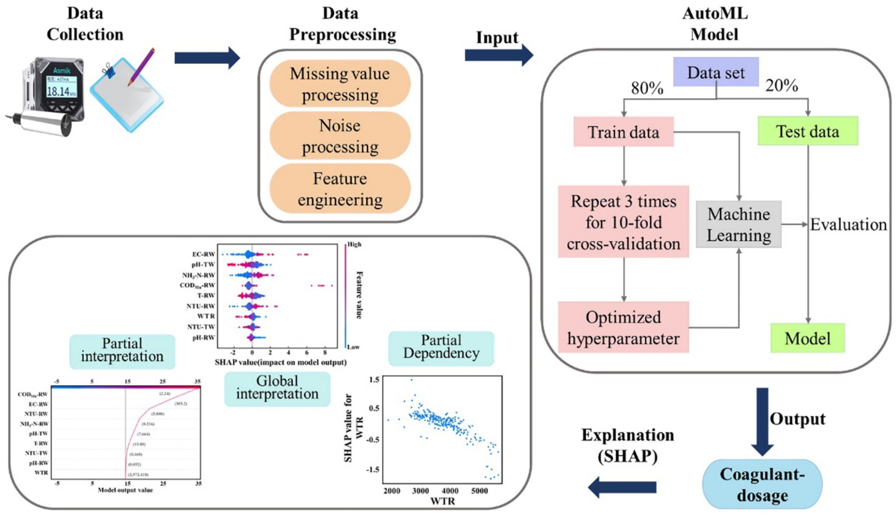
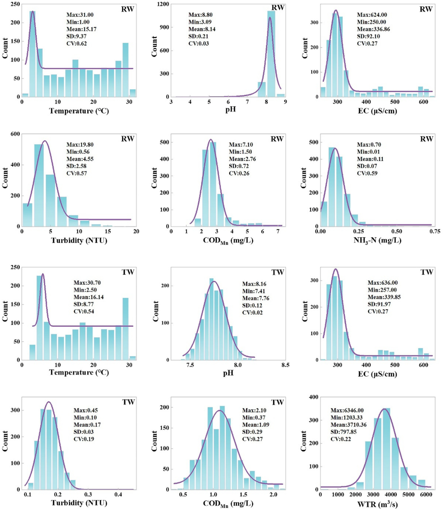
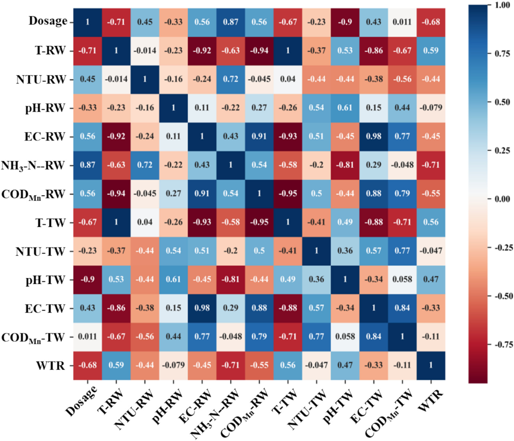
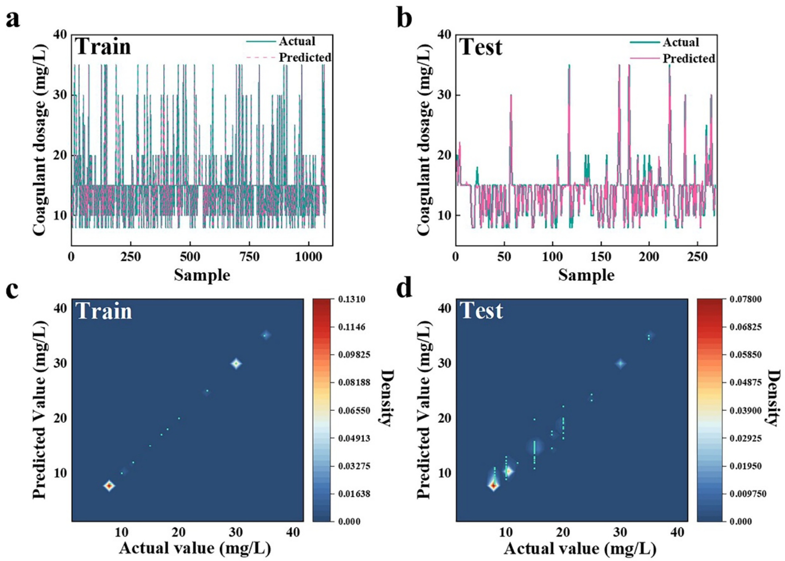
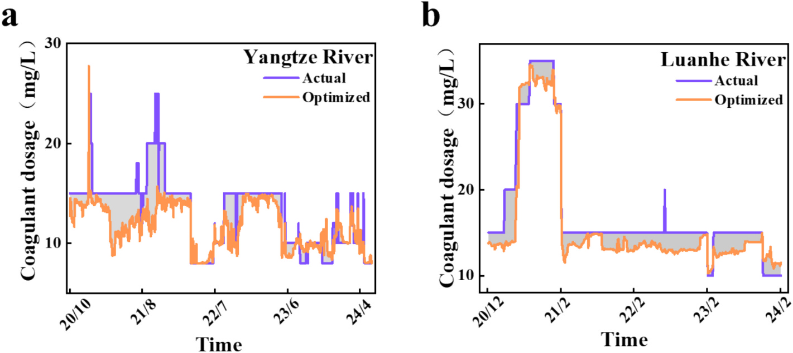
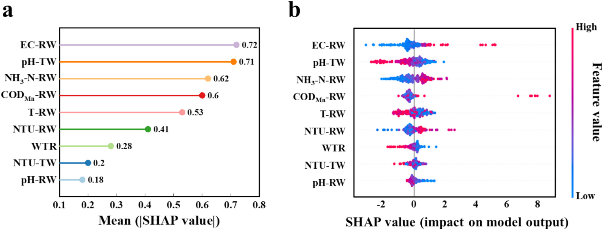
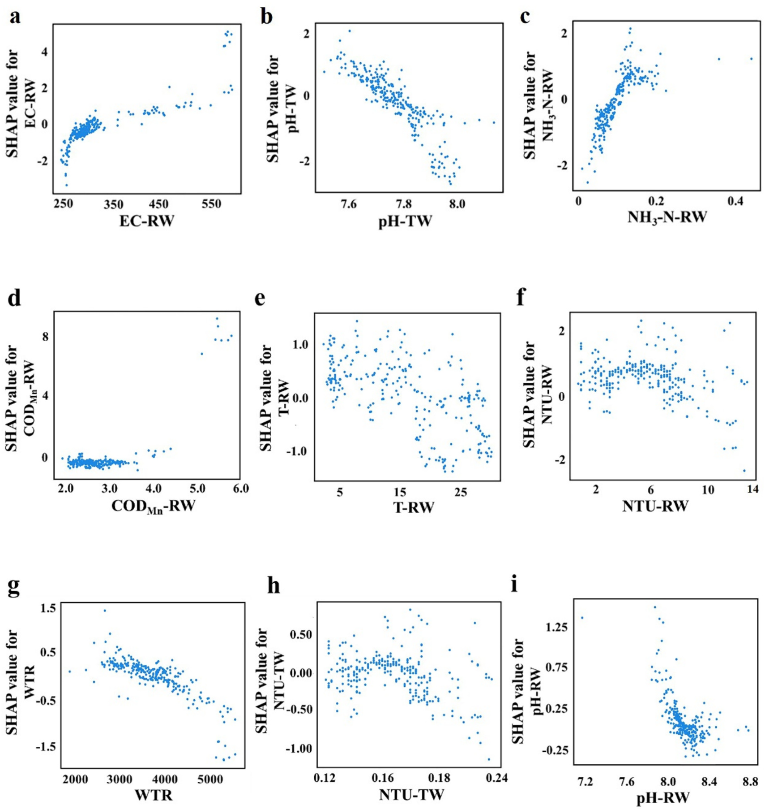
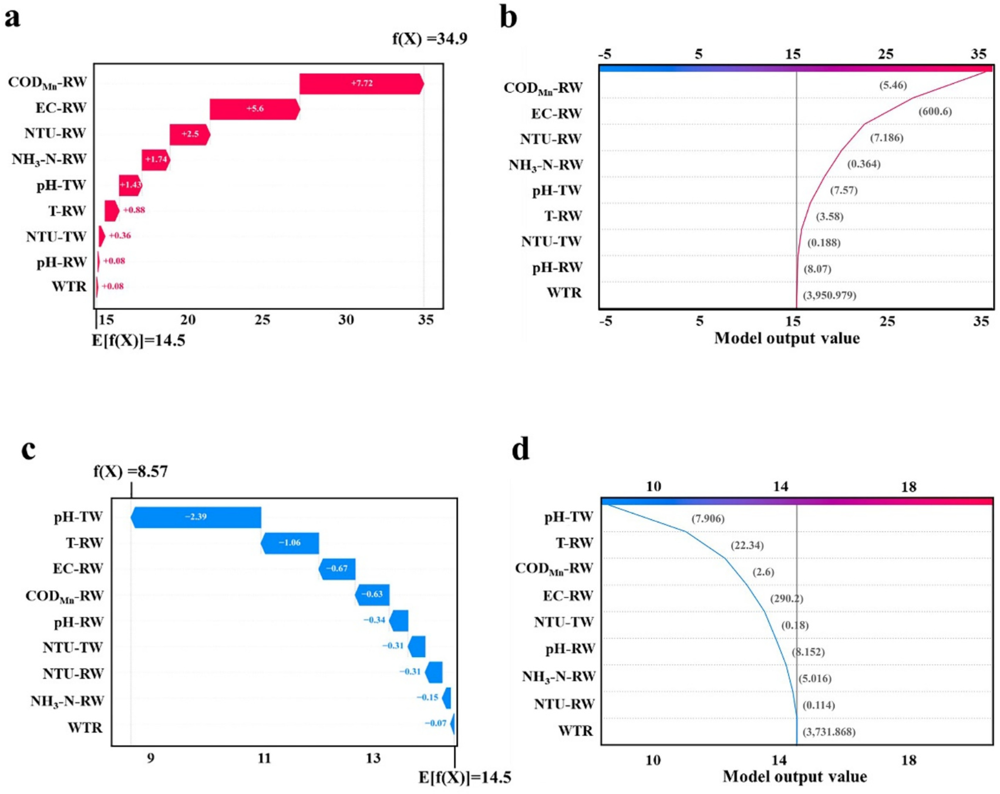

# Interpretable prediction of coagulant dosage in drinking water treatment plant based on automated machine learning and SHAP method

## Abstract

- Dự đoán chính xác liều lượng châm chất keo tụ (coagulant dosing) đóng vai trò thiết yếu để bảo đảm hiệu quả kỹ thuật và hiệu quả chi phí của quy trình xử lý nước.
- Nghiên cứu phát triển mô hình dự đoán chính xác liều lượng chất keo tụ trong nhà máy xử lý nước uống (drinking water treatment plants) bằng học máy tự động (AutoML - automated machine learning):
  - Phương pháp SHAP (Shapley Additive explanation - giải thích cộng tính Shapley) được áp dụng để nâng cao tính minh bạch của mô hình.
- Mô hình Random Forest (RF - rừng ngẫu nhiên) do AutoML xây dựng đạt hiệu suất cao hơn rõ rệt so với mô hình đơn Gradient Boosting Tree (cây tăng cường độ dốc) tốt nhất:
  - Sai số $\text{RMSE}$ (Root Mean Square Error) đạt $0.89$, thấp hơn $37\,\%$.
  - Sai số $\text{MAE}$ (Mean Absolute Error) đạt $0.47$, thấp hơn $52\,\%$.
  - Hệ số xác định $R^2$ (Coefficient of Determination) đạt $0.96$, cao hơn $5\,\%$.
- Mô hình RF có tiềm năng tiết kiệm $10.25\,\%$ liều lượng chất keo tụ mỗi năm, đồng thời bảo đảm chất lượng nước sau xử lý ổn định hơn:
  - Nguồn nước sông Dương Tử (Yangtze River): Tiết kiệm $222\,\text{kg/d}$ chất keo tụ PACl (polyaluminum chloride), tương đương chi phí $180.7\,\text{yuan/d}$.
  - Nguồn nước sông Loan (Luan River): Tiết kiệm $225\,\text{kg/d}$ PACl, tương đương chi phí $183.2\,\text{yuan/d}$.
- Phân tích SHAP xác định độ dẫn điện (conductivity), nitơ amoniac (ammonia nitrogen), nhu cầu oxy hóa học (chemical oxygen demand) và nhiệt độ (temperature) của nước thô là các yếu tố then chốt ảnh hưởng đến liều lượng PACl:
  - Liều lượng PACl tác động đáng kể đến độ $\text{pH}$ của nước sau xử lý.
- Việc kết hợp AutoML và phương pháp SHAP trong quản lý nước thông minh (intelligent water management) nâng cao hiệu quả xử lý nước và thực hành quản lý, đem lại các lợi ích lớn về môi trường, kinh tế và xã hội.

## 1 Introduction

- Sự phát triển nhanh của công nghệ xử lý nước làm gia tăng vấn đề tiêu thụ năng lượng và phát thải carbon.
  - Các quy trình truyền thống được liên tục tối ưu hóa nhưng vẫn gặp các rào cản kỹ thuật và kinh tế:
    - Adsorption technology (công nghệ hấp phụ) khó tái sinh chất hấp phụ.
    - Photocatalytic deep mineralization (khoáng hóa sâu quang xúc tác) bị giới hạn bởi hiệu suất chuyển hóa.
    - Microwave catalytic (xúc tác vi sóng) đạt hiệu suất cao nhưng có chi phí thiết bị đắt đỏ.
- Coagulation (quá trình keo tụ) chiếm tỷ trọng vận hành lớn trong tổng chi phí của các nhà máy nước.
  - Quá trình keo tụ đòi hỏi độ chính xác cao khi châm hóa chất xử lý.
  - Traditional empirical models (mô hình kinh nghiệm truyền thống) không thể cân bằng giữa độ chính xác định lượng và hiệu quả năng lượng do ba yếu tố:
    - Phản ứng động phi tuyến (nonlinear dynamic response).
    - Biến động đa biến (multivariate) của các thông số như nhiệt độ nước và $\text{pH}$.
    - Nhiễu động thời gian thực (real-time disturbances).
- Việc xác định coagulant dosage (liều lượng chất keo tụ) tối ưu là điều kiện then chốt để đảm bảo hiệu quả xử lý nước và lợi ích kinh tế lẫn môi trường.
  - Việc tối ưu hóa liều lượng dựa trên raw water quality (chất lượng nước thô) và treated water quality criteria (tiêu chuẩn chất lượng nước sau xử lý).
- Traditional manual dosing (định lượng thủ công truyền thống) bộc lộ nhiều điểm hạn chế trong vận hành:
  - Phương pháp mang tính chủ quan cao.
  - Lượng hóa chất tiêu hao lớn.
  - Khó thích ứng với quy mô sản xuất lớn.
  - Khả năng kiểm soát độ ổn định của nước kém và xảy ra hiện tượng regulatory lag (trễ điều tiết).
- Mechanistic models (mô hình cơ chế) khó nắm bắt các phản ứng phức tạp và mối quan hệ phi tuyến, làm giảm khả năng ứng dụng thực tế.
- Data-driven models (mô hình theo dữ liệu) dùng học máy có thể xây dựng black-box models (mô hình hộp đen) cho hệ động lực phi tuyến đa biến từ tập dữ liệu giới hạn.
  - Các mô hình học máy hiện tại vẫn gặp hạn chế về tính generalizability (khái quát hóa) và độ hội tụ (convergence) khi dự đoán liều lượng chất keo tụ.
- Các phương pháp dự đoán liều lượng keo tụ hiện hữu bộc lộ các nhược điểm kỹ thuật cụ thể:
  - DL-MV (Deep Learning - Multi-Variable / Học sâu đa biến) phụ thuộc vào tinh chỉnh tham số để đạt độ chính xác cao.
  - PSO-SVR (Particle Swarm Optimization - Support Vector Regression / Tối ưu hóa bầy đàn - Hồi quy vector hỗ trợ) đòi hỏi thiết lập tham số ban đầu thủ công.
  - GA-RF (Genetic Algorithm - Random Forest / Thuật toán di truyền - Rừng ngẫu nhiên) có cấu trúc bị cố định và đòi hỏi tài nguyên tính toán cao.
- Các phương pháp dự đoán hiện hữu chia sẻ hai hạn chế cốt lõi:
  - Sự phụ thuộc vào can thiệp thủ công cản trở việc tự động điều chỉnh quan hệ phi tuyến phức tạp của các chỉ số chất lượng nước.
  - Sự gắn chặt với một mô hình tối ưu hóa đơn lẻ và thiếu cơ chế phối hợp động làm giảm hiệu quả dự đoán và tính khái quát hóa.
- AutoML (Automated Machine Learning / Học máy tự động) xây dựng các pipeline ML (đường ống học máy) hiệu quả bằng cách tự động hóa toàn bộ quy trình.
  - Các khung làm việc phân tán như TPOT (Tree-based Pipeline Optimization Tool) hỗ trợ sàng lọc mô hình hoàn toàn tự động, giúp giảm chi phí phát triển và giảm phụ thuộc vào nhân lực.
  - AutoML xử lý hiệu quả hyperparameter optimization (tối ưu hóa siêu tham số) và giải quyết các bài toán ràng buộc phức tạp.
- AutoML đã chứng minh hiệu quả cao trong nhiều tác vụ xử lý chất lượng nước:
  - TPOT cải thiện độ chính xác thêm $15\text{--}20\%$ mà không cần giảm chiều đặc trưng trên dữ liệu chất lượng nước $50$ chiều ($50\text{-dimensional}$).
  - Khung làm việc H2O dự đoán chính xác quá trình loại bỏ chất dinh dưỡng sinh học trong nước thải.
  - TPOT đạt kết quả cao hơn ML truyền thống $1.4\%$ trong tác vụ phân loại chất lượng nước hồ.
- Các nghiên cứu hiện tại chưa khám phá và ứng dụng sâu rộng AutoML vào bài toán dự đoán liều lượng chất keo tụ.
- Bản chất hộp đen của các mô hình học máy tiên tiến làm giảm tính interpretability (khả năng giải thích), gây cản trở ứng dụng thực tế tại nhà máy nước.
  - Nhà máy nước yêu cầu tính minh bạch vận hành nghiêm ngặt để đưa ra quyết định xử lý.
- Phương pháp SHAP (SHapley Additive exPlanations / Giải thích cộng tính Shapley) của Lundberg và Lee nâng cao tính minh bạch, độ tin cậy và chất lượng ra quyết định của mô hình.
  - SHAP lượng hóa marginal contribution (đóng góp biên) của từng đặc trưng vào giá trị dự đoán.
  - SHAP xác định các biến ảnh hưởng chính và hiệu ứng tương tác qua phân tích toàn cục và cục bộ.
  - SHAP đã được áp dụng trong nhiều lĩnh vực và dự đoán chất lượng nước mặt với độ chính xác cao.
  - Phương pháp SHAP chưa từng được áp dụng để giải thích bài toán dự đoán liều lượng chất keo tụ.
- Nghiên cứu này lần đầu tiên ứng dụng khung làm việc AutoML có thể giải thích cho bài toán dự đoán liều lượng chất keo tụ.
  - Hệ thống dự đoán được xây dựng thông qua quy trình tự động lựa chọn mô hình và tối ưu hóa siêu tham số.
  - Phương pháp SHAP được tích hợp để trích xuất độ quan trọng đặc trưng toàn cục và diễn giải quyết định cục bộ của mô hình hộp đen.
  - Việc kết hợp dữ liệu thời gian thực và thông tin lịch sử đảm bảo kiểm soát chính xác quá trình keo tụ và duy trì tiêu chuẩn chất lượng nước sau xử lý.
  - Giải pháp này hỗ trợ các tiến bộ kỹ thuật và nâng cấp công nghệ cho ngành xử lý nước trong tương lai.

## 2 Materials and methods

### 2.1 Data acquisition and preprocessing
- Dữ liệu nghiên cứu thu thập từ nhà máy xử lý nước uống (DWTP - Drinking Water Treatment Plant) tại Thiên Tân (Tianjin), Trung Quốc.
  - Nhà máy tiếp nhận nguồn nước thô từ hai nguồn chính theo chu kỳ hàng năm:
    - Sông Loan Hà (Luanhe River): cấp nước vào tháng 12, tháng 1 và tháng 2 hàng năm, chuyển dòng từ tỉnh Hà Bắc (Hebei).
    - Sông Dương Tử (Yangtze River): cấp nước từ tháng 3 đến tháng 11 hàng năm, bắt nguồn từ hồ chứa Đan Giang Khẩu (Danjiangkou Reservoir) thuộc tỉnh Hồ Bắc (Hubei).
  - Quy trình công nghệ xử lý nước gồm tiền xử lý (pre-treatment), xử lý truyền thống tăng cường (enhanced conventional treatment), và khử trùng kết hợp tia cực tím (ultraviolet - UV) cùng clo (chlorine disinfection).
  - Công suất xử lý nước danh định hàng ngày của nhà máy đạt $17.5\text{ wt/d}$ ($17.5 \times 10^4\,\text{m}^3/\text{d}$).
  - Thời gian lưu nước thủy lực (hydraulic retention time - HRT) vận hành tương đối ổn định ở mức $25.56\text{ min}$.
  - Nhà máy sử dụng hai loại hóa chất keo tụ trong dây chuyền:
    - Sắt(III) clorua (ferric chloride) châm tại giai đoạn tiền xử lý.
    - Polyaluminum chloride (PACl) châm tại giai đoạn hòa trộn (blending stage).
- Tập dữ liệu quan trắc gồm $1339$ điểm dữ liệu được thu thập hàng ngày trong giai đoạn từ tháng 10 năm 2022 (October 2022) đến tháng 5 năm 2024 (May 2024).
  - Dữ liệu được phân chia ngẫu nhiên thành tập huấn luyện (training set) gồm $1071$ mẫu và tập kiểm tra (test set) gồm $268$ mẫu theo tỷ lệ $8:2$.
  - Tập biến đặc trưng đầu vào gồm lưu lượng dòng vào (WTR - water treatment rate) cùng các chỉ số chất lượng nước thô (RW - raw water) và nước sau xử lý (TW - treated water):
    - Nhiệt độ nước ($T$).
    - Độ kiềm/axit ($\text{pH}$).
    - Độ đục ($\text{NTU}$).
    - Độ dẫn điện ($\text{EC}$).
    - Nhu cầu oxy hóa học permanganat ($\text{COD}_{\text{Mn}}$).
    - Nitơ amoni ($\text{NH}_3\text{-N}$) chỉ thu thập riêng cho nguồn nước thô (RW).
  - Lượng hóa chất châm thực tế của hai chất keo tụ tương đương nhau với mức sai lệch tối đa không vượt quá $5\text{ mg/L}$.
  - Nghiên cứu chọn PACl làm biến mục tiêu duy nhất để mô phỏng chính xác quá trình định lượng chất keo tụ.
- Tiền xử lý dữ liệu loại bỏ sai số đo đạc và sự cố hệ thống châm hóa chất để nâng cao độ tin cậy.
  - Mô hình ước lượng K láng giềng gần nhất (KNN - K-nearest neighbor) với $k = 4$ xử lý các giá trị khuyết thiếu (missing values).
    - Thuật toán KNN cân bằng giữa độ ổn định nội suy và tính đại diện toàn cục.
    - Thuật toán bảo toàn dữ liệu hiệu quả cho các thông số khuyết không ngẫu nhiên như nhiệt độ nước và nitơ amoni.
    - Quá trình tìm kiếm lưới (grid search) trong dải $k = 1\text{--}10$ sử dụng sai số toàn phương trung bình (MSE - mean square error) làm tiêu chí tối ưu.
    - Kết quả đánh giá cho thấy chỉ số MSE đạt giá trị nhỏ nhất trên tập kiểm tra tại cấu hình $k = 4$.
  - Bộ lọc trung bình trượt (moving average filter) với kích thước cửa sổ $n = 5$ làm giảm nhiễu và sai số ngẫu nhiên.
    - Tham số $n = 5$ được xác định thông qua phân tích hàm tự tương quan (ACF - autocorrelation function).
    - Cửa sổ này bắt trọn các biến động ngắn hạn của chỉ số chất lượng nước, đồng thời tránh hiện tượng làm mịn quá mức gây suy giảm đỉnh dữ liệu.
- Phương pháp hệ số tương quan thứ hạng Spearman ($r_s$) đánh giá mối liên hệ giữa các biến đặc trưng và liều lượng châm chất keo tụ.
  - Hệ số tương quan Spearman có độ nhạy thấp đối với quan hệ phi tuyến và các điểm dị biệt (outliers).
  - Loại bỏ các đặc trưng có tương quan thấp giúp giảm chiều dữ liệu đầu vào, nâng cao hiệu quả vận hành và năng lực tổng quát hóa của mô hình qua quy trình tích hợp gồm tiền xử lý, AutoML và giải thích SHAP.
  - **Hình 1.** Sơ đồ phương pháp luận mô hình hóa hoàn chỉnh.
    - 
    - **Hình này chứng minh điều gì**
      - Kỹ thuật đặc trưng (Feature engineering) kết nối dữ liệu tiền xử lý vào quy trình huấn luyện AutoML và hậu giải thích SHAP.
    - **Từ đâu mà thấy được**
      - Luồng chính từ trái qua phải: Data Collection $\rightarrow$ Data Preprocessing $\rightarrow$ AutoML Model ($80\,\%$ Train, $20\,\%$ Test, $3$ lần 10-fold CV) $\rightarrow$ Output (Coagulant-dosage).
      - Khối giải thích phía dưới: mũi tên từ Coagulant-dosage dẫn sang Explanation (SHAP) gồm Global interpretation, Partial interpretation và Partial Dependency.

### 2.2 Automated machine learning
- Học máy tự động (AutoML - Automated Machine Learning) tự động hóa quy trình xây dựng mô hình thuật toán.
  - AutoML thực hiện kỹ thuật tạo đặc trưng (feature engineering), lựa chọn thuật toán (algorithm selection), và tối ưu hóa siêu tham số (hyperparameter optimization).
  - Mục tiêu cốt lõi của AutoML là giảm can thiệp thủ công của con người và cải thiện hiệu suất mô hình.
- Công cụ tối ưu hóa đường ống dựa trên cây (TPOT - Tree-based Pipeline Optimization Tool) tự động xây dựng mô hình.
  - TPOT là thư viện AutoML mã nguồn mở bằng Python (phiên bản 0.11.7) vận hành dựa trên thuật toán lập trình di truyền (genetic programming).
  - TPOT phụ thuộc vào các thư viện nền tảng gồm Scikit-Learn (phiên bản 1.0.2), DEAP (Distributed Evolutionary Algorithms Framework), và các mở rộng như XGBoost.
  - Mô hình thực thi trong môi trường Python 3.8 với toàn bộ mã nguồn cấu hình mở.
- Khung làm việc TPOT áp dụng ba cơ chế cốt lõi để tối ưu hóa pipeline học máy:
  - Tối ưu hóa lặp dựa trên mã hóa cấu trúc cây của giải thuật lập trình di truyền.
  - Tích hợp đa thuật toán của Scikit-Learn cùng không gian siêu tham số xác định trước để cân bằng hiệu quả tìm kiếm.
  - Sàng lọc pipeline tối ưu Pareto (Pareto-optimal pipeline) bằng kiểm định chéo 10 lần (10-fold cross-validation), lặp lại độc lập $3$ lần để bảo đảm khả năng tổng quát hóa.

### 2.3 SHAP interpretability method
- Hệ phương pháp SHAP (Shapley Additive exPlanations) gồm ba nhánh chính: Kernel SHAP, Deep SHAP, và Tree SHAP.
- Nghiên cứu sử dụng gói Tree SHAP trong môi trường Python 3.9 để phân tích tầm quan trọng, sự phụ thuộc và tương tác giữa các đặc trưng.
  - Các thư viện Python và chức năng tương ứng được tổng hợp tại Bảng 1:
    - Sklearn (phiên bản 1.5.0): xử lý dữ liệu, phân chia tập mẫu, đánh giá mô hình và kiểm định chéo.
    - Scipy (phiên bản 1.13.1): phân tích tương quan Spearman.
    - Seaborn (phiên bản 0.13.2): trực quan hóa thống kê dữ liệu.
    - TPOT (phiên bản 0.11.7 / 0.12.2): thiết lập mô hình hồi quy TPOT Regressor.
    - SHAP (phiên bản 0.45.1): diễn giải mô hình và trực quan hóa dữ liệu.
    - Matplotlib (phiên bản 3.9.0): vẽ đồ thị kỹ thuật.
- Giá trị SHAP tuyệt đối trung bình định lượng tầm quan trọng của các yếu tố ảnh hưởng đến liều lượng châm chất keo tụ.
  - Tổng các giá trị SHAP tuyệt đối trung bình của toàn bộ thông số môi trường đo lường tác động kết hợp của chúng lên chiến lược châm hóa chất.
  - Biểu đồ phụ thuộc SHAP (SHAP dependency plots) thể hiện tương tác giữa các đặc trưng và đóng góp chung vào dự đoán liều lượng keo tụ.
  - Hai mẫu điển hình được chọn để lập biểu đồ giải thích cục bộ, biểu đồ thác nước (waterfall plots) và biểu đồ quyết định (decision plots) nhằm làm sáng tỏ cơ chế ra quyết định của mô hình.

### 2.4 Model evaluation
- Ba chỉ số đánh giá gồm RMSE, MAE và $R^2$ kiểm tra độ tin cậy và độ chính xác của các mô hình dự đoán.
- Sai số căn bậc hai trung bình (RMSE - Root Mean Square Error) đo lường độ chênh lệch giữa giá trị dự đoán và giá trị thực tế:
  $$\text{RMSE} = \sqrt{\frac{1}{n} \sum_{i=1}^{n} (y_i - \hat{y}_i)^2}$$
  - Chỉ số RMSE nhạy cảm với các điểm dị biệt (outliers) và định lượng quy mô trung bình của sai số dự đoán.
- Sai số tuyệt đối trung bình (MAE - Mean Absolute Error) phản ánh khoảng cách sai số trung bình giữa dự đoán và thực tế:
  $$\text{MAE} = \frac{1}{n} \sum_{i=1}^{n} |y_i - \hat{y}_i|$$
  - Giá trị MAE càng tiến gần $0$ thể hiện hiệu suất mô hình càng tốt.
- Hệ số xác định ($R^2$ - Coefficient of Determination) định lượng mức độ phù hợp giữa mô hình dự đoán và dữ liệu thực nghiệm:
  $$R^2 = 1 - \frac{\sum_{i=1}^{n} (y_i - \hat{y}_i)^2}{\sum_{i=1}^{n} (y_i - \bar{y})^2}$$
  - Giá trị $R^2$ tiến gần $1$ chứng minh tương quan chặt chẽ giữa biến phụ thuộc và các biến độc lập, sai số dự đoán nhỏ và mô hình đạt độ vững chắc cao.

## 3 Results and discussion

### 3.1 Analysis of water quality data and feature selection

- Hệ số biến thiên $\text{CV}$ (coefficient of variation - hệ số biến thiên) dùng làm chỉ số định lượng độ biến thiên trong tập dữ liệu:
  - Giá trị $\text{CV}$ càng lớn phản ánh độ biến động của dữ liệu càng cao.
  - Các đặc trưng có sự biến động đáng kể nhất gồm nhiệt độ nước thô $T\text{-RW}$ ($\text{SD} = 9.37$, $\text{CV} = 62\,\%$), nitơ amoniac nước thô $\text{NH}_3\text{-N-RW}$ ($\text{SD} = 0.07$, $\text{CV} = 59\,\%$), độ đục nước thô $\text{NTU-RW}$ ($\text{SD} = 2.58$, $\text{CV} = 57\,\%$) và nhiệt độ nước sau xử lý $T\text{-TW}$ ($\text{SD} = 8.77$, $\text{CV} = 54\,\%$).
  - Hầu hết các đặc trưng khác duy trì tương đối ổn định trong suốt quy trình xử lý nước.
- Biểu đồ phân bố tần suất làm rõ sự phân tán và độ biến động thực tế của các thông số chất lượng nước:
  - **Hình 2.** Phân bố histogram và các chỉ số thống kê của các biến
    - 
    - **Hình này chứng minh điều gì**
      - Đường tần suất màu tím trực quan hóa độ phân tán: $T$ trải rộng toàn dải đo, còn $\text{pH}$ tập trung đỉnh nhọn quanh trung bình.
    - **Từ đâu mà thấy được**
      - Trục hoành: khoảng giá trị mẫu ($^\circ\text{C}$, $\text{NTU}$, $\text{mg/L}$, $\mu\text{S/cm}$, $\text{m}^3\text{/s}$); trục tung: tần suất xuất hiện (`Count`).
      - Hộp thông số ghi $\text{SD}, \text{CV}$: $T\text{-RW}$, $\text{NH}_3\text{-N-RW}$, $\text{NTU-RW}$ trải rộng; $\text{pH-RW}$ ($8.14$) và $\text{pH-TW}$ ($7.76$) có đỉnh nhọn đứng.
      - Lưu ý: hình ghi CV dạng số thập phân ($0.62$, $0.03$), văn bản ghi phần trăm ($62\,\%$, $3\,\%$).
- Chất lượng nước thô (raw water quality) tác động trực tiếp đến độ an toàn, độ tin cậy của nguồn cấp nước thành phẩm và nhu cầu chất keo tụ (coagulant requirements).
- Các chỉ số chất lượng nước thô tại nhà máy, gồm $\text{COD}_{\text{Mn}}$ (permanganate index - chỉ số pemanganat) và $\text{NH}_3\text{-N}$ (ammonia nitrogen - nitơ amoniac), thể hiện các xu hướng biến động theo mùa (seasonal trends) rõ rệt:
  - Cơ chế tác động vào mùa hè:
    - Nhiệt độ tăng cao và lượng mưa tăng kích thích sự phát triển của tảo trong các nguồn nước, làm gia tăng chỉ số $\text{COD}_{\text{Mn}}$ trong thủy vực và ảnh hưởng đến chất lượng nước thô.
    - Nhiệt độ tăng làm giảm độ nhớt của nước (water viscosity), thúc đẩy chuyển động của các ion trong dung dịch và làm giảm nhu cầu chất keo tụ.
  - Cơ chế tác động vào mùa đông:
    - Nhiệt độ thấp làm giảm độ hòa tan (solubility) và độ khuếch tán (diffusivity) của chất keo tụ, dẫn đến làm chậm tốc độ của các phản ứng hóa học.
    - Nhà máy bắt buộc phải châm liều lượng chất keo tụ cao hơn để bảo đảm hiệu quả xử lý nước.
  - Tính toán chính xác liều lượng chất keo tụ dựa trên dữ liệu chất lượng nước thô theo thời gian thực (real-time data) và thông tin biến động lịch sử đóng vai trò then chốt để duy trì hiệu quả quy trình, ổn định chất lượng nước đầu ra và tối ưu lượng hóa chất.
- Ma trận tương quan hạng Spearman ($r_s$ - Spearman rank correlation coefficient matrix) thể hiện các mối quan hệ giữa thông số đầu vào và biến mục tiêu liều lượng chất keo tụ PACl (polyaluminum chloride):
  - Xem: 2.1 Data acquisition and preprocessing
  - Nhóm thông số có tương quan mạnh với liều lượng PACl gồm: $T\text{-RW}$ ($r_s = -0.71$), $\text{NH}_3\text{-N-RW}$ ($r_s = 0.87$), $\text{pH-RW}$ ($r_s = -0.9$), $T\text{-RW}$ ($r_s = -0.67$) và công suất xử lý nước $\text{WTR}$ ($r_s = -0.68$).
  - Nhóm thông số có tương quan trung bình gồm: $\text{NTU-RW}$ ($r_s = 0.45$), độ dẫn điện nước thô $\text{EC-RW}$ ($r_s = 0.56$), $\text{pH-RW}$ ($r_s = -0.33$), $\text{COD}_{\text{Mn}}\text{-RW}$ ($r_s = 0.56$), độ dẫn điện nước sau xử lý $\text{EC-TW}$ ($r_s = 0.43$) và độ đục nước sau xử lý $\text{NTU-TW}$ ($r_s = -0.23$).
- Biểu đồ nhiệt ma trận Spearman trực quan hóa toàn bộ mức độ tương quan thuận nghịch giữa các thông số với liều lượng hóa chất keo tụ:
  - **Hình 3.** Ma trận hệ số tương quan Spearman với liều lượng PACl
    - 
    - **Hình này chứng minh điều gì**
      - Minh họa tương quan đa chiều giữa 13 biến; bổ sung mức tương quan vừa của $\text{EC-RW}$, $\text{COD}_{\text{Mn}}\text{-RW}$ ($0.56$) và $\text{NTU-RW}$ ($0.45$) với liều lượng.
    - **Từ đâu mà thấy được**
      - Trục $Ox, Oy$: 13 biến chất lượng nước và vận hành (`Dosage`, hậu tố `-RW`, `-TW`, không thứ nguyên); thanh màu $r_s \in [-1.0, 1.0]$.
      - Hàng/cột `Dosage`: ô đỏ sẫm nhất tại $\text{pH-TW}$ ($-0.90$), xanh sẫm nhất tại $\text{NH}_3\text{-N-RW}$ ($0.87$), nhạt nhất tại $\text{COD}_{\text{Mn}}\text{-TW}$ ($0.011$).
      - Lưu ý: hình ghi pH-TW (-0.9) và T-TW (-0.67), văn bản ghi pH-RW và T-RW.
- Hiện tượng cộng tuyến mạnh (strong linear correlation) xuất hiện giữa một số cặp biến chất lượng nước:
  - $\text{EC-RW}$ và $\text{EC-TW}$ có tương quan tuyến tính rất cao với nhau ($r_s = 0.98$).
  - $\text{COD}_{\text{Mn}}\text{-RW}$ và $\text{EC-RW}$ có tương quan tuyến tính cao với $T\text{-TW}$ (hệ số $r_s$ lần lượt là $0.91$ và $-0.95$).
- Quy trình loại bỏ biến dư thừa nhằm tránh hiện tượng đa cộng tuyến (redundancy avoidance):
  - Chỉ giữ lại một đặc trưng đại diện từ mỗi cặp đặc trưng có tương quan cao.
  - Các đặc trưng $\text{EC-RW}$ và $\text{COD}_{\text{Mn}}\text{-RW}$ được giữ lại, trong khi loại bỏ các đặc trưng nước sau xử lý tương ứng bị cộng tuyến cao.
- Tập đặc trưng cuối cùng phục vụ huấn luyện mô hình dự đoán liều lượng chất keo tụ:
  - Bao gồm 9 đặc trưng đầu vào: $T\text{-RW}$, $\text{pH-RW}$, $\text{NH}_3\text{-N-RW}$, $\text{NTU-RW}$, $\text{EC-RW}$, $\text{COD}_{\text{Mn}}\text{-RW}$, $\text{pH-TW}$, $\text{NTU-TW}$ và $\text{WTR}$.
  - Biến mục tiêu là liều lượng chất keo tụ PACl.
  - Mô hình học máy thiết lập thành công mối liên kết và tương tác phức tạp giữa chất lượng nước thô, liều lượng châm chất keo tụ và chất lượng nước sau xử lý.

### 3.2 Model comparison and optimization

- Nghiên cứu so sánh TPOT AutoML với các thuật toán học máy điển hình để xây dựng mô hình dự đoán liều lượng PACl:
  - Xem: 2.2 Automated machine learning
  - Các thuật toán so sánh gồm Cây quyết định (Decision Tree - DT), Hồi quy vector hỗ trợ (Support Vector Regression - SVR), $k$ láng giềng gần nhất (K-Nearest Neighbors - KNN), Hồi quy tuyến tính (Linear Regression - LR) và Cây tăng cường độ dốc (Gradient Boosting Tree - GBT).
  - Bảng 2 liệt kê cấu hình siêu tham số (hyperparameters) tối ưu hóa của các mô hình:
    - DT: $\text{max\_depth} = 8$, $\text{min\_samples\_split} = 10$, $\text{min\_samples\_leaf} = 5$, $\text{max\_features} = 0.5$, $\text{random\_state} = 42$.
    - SVR: $c = 1$, $\epsilon = 10$, $\gamma = \text{scale}$.
    - KNN: $n\text{\_neighbors} = 15$, $p = 1$, $\text{metric} = \text{minkowski}$.
    - LR: $\text{fit\_intercept} = \text{True}$, $\text{normalize} = \text{True}$, $\text{positive} = \text{False}$.
    - GBT: $n\text{\_estimators} = 150$, $\text{learning\_rate} = 0.1$, $\text{max\_depth} = 5$, $\text{min\_samples\_split} = 8$, $\text{subsample} = 0.8$, $\text{max\_features} = \text{sqrt}$.
  - Bảng 3 so sánh các chỉ số hiệu suất đánh giá giữa các mô hình học máy:
    - Xem: 2.4 Model evaluation
    - AutoML: RF: Tập huấn luyện (training set) đạt $\text{RMSE} = 0.07$, $\text{MAE} = 0.02$, $R^2 = 1.00$; tập kiểm tra (testing set) đạt $\text{RMSE} = 0.89$, $\text{MAE} = 0.47$, $R^2 = 0.96$.
    - GBT: Tập huấn luyện đạt $\text{RMSE} = 1.06$, $\text{MAE} = 0.74$, $R^2 = 0.96$; tập kiểm tra đạt $\text{RMSE} = 1.41$, $\text{MAE} = 0.97$, $R^2 = 0.91$.
    - LR: Tập huấn luyện đạt $\text{RMSE} = 1.68$, $\text{MAE} = 1.21$, $R^2 = 0.89$; tập kiểm tra đạt $\text{RMSE} = 1.81$, $\text{MAE} = 1.34$, $R^2 = 0.84$.
    - DT: Tập huấn luyện đạt $\text{RMSE} = 0.00$, $\text{MAE} = 0.00$, $R^2 = 1.00$; tập kiểm tra đạt $\text{RMSE} = 2.07$, $\text{MAE} = 0.66$, $R^2 = 0.80$.
    - KNN: Tập huấn luyện đạt $\text{RMSE} = 2.90$, $\text{MAE} = 1.91$, $R^2 = 0.68$; tập kiểm tra đạt $\text{RMSE} = 3.46$, $\text{MAE} = 2.55$, $R^2 = 0.43$.
    - SVR: Tập huấn luyện đạt $\text{RMSE} = 4.81$, $\text{MAE} = 2.85$, $R^2 = 0.13$; tập kiểm tra đạt $\text{RMSE} = 4.45$, $\text{MAE} = 2.89$, $R^2 = 0.06$.
- Thuật toán tối ưu do AutoML lựa chọn là Rừng ngẫu nhiên (Random Forest - RF), đem lại độ chính xác cao và độ bền vững cao hơn so với các thuật toán khác:
  - Giá trị $R^2$ của mô hình RF đạt $1.00$ trên tập huấn luyện và $0.96$ trên tập kiểm tra.
  - Mô hình RF ghi nhận sai số thấp nhất tương ứng với $\text{RMSE} = 0.95 \pm 0.11\,\text{mg/L}$ và $\text{MAE} = 0.47 \pm 0.83\,\text{mg/L}$.
  - Nghiên cứu của Kim và cộng sự dự đoán liều PAC bằng mạng nơ-ron tích chập (CNN) và đơn vị tuần hoàn cổng (GRU) đạt $R^2 > 0.8$ trên cả hai tập.
    - Mô hình CNN và GRU dùng để trích xuất đặc trưng không-thời gian, nhưng các động lực chính dự đoán liều PAC là thông số chất lượng nước tĩnh thay vì chuỗi thời gian hay mẫu không gian.
    - Việc trích xuất không-thời gian đưa vào độ phức tạp không cần thiết và dẫn đến dư thừa thông tin.
  - Nghiên cứu của Lin và cộng sự dùng học sâu (deep learning) dự đoán PAC và sulfate đạt $\text{RMSE} = 3.55$ và $R^2 = 0.94$, trong khi AutoML đạt sai số thấp hơn.
  - Quy hoạch di truyền (genetic programming) của TPOT ưu tiên các phương pháp học kết hợp (ensemble methods), thích hợp cho dữ liệu quy mô vừa và nhỏ nhờ cân bằng tốt độ chệch và phương sai (bias-variance).
  - Thuật toán SVR cho hiệu suất kém nhất với $R^2$ chỉ đạt $0.13$ trên tập huấn luyện và $0.06$ trên tập kiểm tra.
    - SVR nhạy cảm cao với việc chọn siêu tham số và thiếu giải pháp xác định chính xác các tham số cấu hình.
  - Thuật toán DT đạt $R^2 = 1.00$ trên tập huấn luyện nhưng thể hiện kém trên tập kiểm tra ($R^2 = 0.80$, $\text{RMSE} = 2.07$).
    - DT có xu hướng xây dựng mô hình phức tạp bắt giữ nhiễu và chi tiết thay vì quy luật phân phối dữ liệu thực, làm giảm hiệu suất trên dữ liệu mới.
- Kết quả khớp và biểu đồ mật độ phân tán chứng minh mô hình AutoML: RF đạt độ chính xác cao và độ chệch tiềm ẩn tối thiểu:
  - **Hình 4.** Kết quả khớp và mật độ phân tán của AutoML: RF
    - 
    - **Hình này chứng minh điều gì**
      - Đường dự đoán bám sát biến thiên thực tế theo từng mẫu trong dải liều lượng $8\text{ mg/L}$ đến $35\text{ mg/L}$.
    - **Từ đâu mà thấy được**
      - Panel (khung hình) (a), (b): Đồ thị chuỗi mẫu (Oy: $8\text{ mg/L}$ đến $35\text{ mg/L}$); đường dự đoán nét đứt (Predicted) bám khít đường thực tế (Actual).
      - Panel (c), (d): Biểu đồ mật độ phân tán (Ox: thực tế, Oy: dự đoán từ $0\text{ mg/L}$ đến $40\text{ mg/L}$); các điểm hội tụ dọc đường chéo với mật độ cao nhất tại $8\text{ mg/L}$ và $30\text{ mg/L}$.
  - Nồng độ thấp của chất rắn lơ lửng, chất keo và chất ô nhiễm trong nước thô tạo ra nước chất lượng cao.
  - Ảnh hưởng tối thiểu của $\text{pH-RW}$ và $\text{NTU-RW}$ đến quá trình keo tụ giữ cho sai số trên tập kiểm tra chủ yếu dưới $20\,\text{mg/L}$.
  - Biểu đồ mật độ phân tán chỉ ra các điểm liều lượng PACl thực tế và dự đoán phân bố bám sát đường chéo trên cả hai tập, phản ánh độ chệch tiềm ẩn ở mức tối thiểu.
- Tối ưu hóa liều lượng PACl bằng mô hình AutoML: RF giúp cắt giảm dư thừa hóa chất theo kinh nghiệm thủ công, tiết kiệm trung bình trọng số $10.25\,\%$ liều lượng hàng năm cho toàn nhà máy:
  - **Hình 5.** Kết quả tối ưu hóa liều lượng PACl bằng AutoML: RF.
    - 
    - **Hình này chứng minh điều gì**
      - Đường dự báo tối ưu (`Optimized`) liên tục bám dưới mức châm thủ công (`Actual`), trực quan hóa lượng hóa chất dư thừa được cắt giảm qua vùng tô xám.
    - **Từ đâu mà thấy được**
      - (a) Nguồn sông Dương Tử (Yangtze River): Ox Thời gian (`Time`), Oy Liều lượng ($5\text{--}30\,\text{mg/L}$); khoảng xám giữa đường tím `Actual` và cam `Optimized` thể hiện mức cắt giảm trong dải liều $8\text{--}30\,\text{mg/L}$.
      - (b) Nguồn sông Loan (Luanhe River): Ox Thời gian (`Time`), Oy Liều lượng ($10\text{--}40\,\text{mg/L}$); khoảng xám rõ nhất ở đỉnh liều mùa đông ($10\text{--}35\,\text{mg/L}$) do nhiệt độ thấp.
  - Mô hình RF dự đoán liều lượng PACl tối ưu từ dữ liệu nước thô thực tế và các mục tiêu chất lượng nước sau xử lý:
    - Mục tiêu chất lượng nước sau xử lý cho nguồn sông Dương Tử: $\text{NTU-TW}: 0.2\,\text{NTU}$, $\text{COD}_{\text{Mn}}\text{-TW}: 1.2\,\text{mg/L}$, $\text{pH-TW}: 8$, $\text{NH}_3\text{-N-TW}: 0.01\,\text{mg/L}$.
    - Mục tiêu chất lượng nước sau xử lý cho nguồn sông Loan: $\text{NTU-TW}: 0.3\,\text{NTU}$, $\text{COD}_{\text{Mn}}\text{-TW}: 1.5\,\text{mg/L}$, $\text{pH-TW}: 8$, $\text{NH}_3\text{-N-TW}: 0.01\,\text{mg/L}$.
  - Cơ chế tối ưu hóa cho nguồn nước sông Dương Tử (Yangtze River):
    - Xem: 2.1 Data acquisition and preprocessing
    - Vào mùa xuân và mùa hè, nhiệt độ nước sông Dương Tử cao làm PACl thủy phân nhanh, đồng thời tảo tích điện âm sinh sôi mạnh đòi hỏi nhiều PACl để trung hòa điện tích.
    - Điều chỉnh chính xác liều lượng giúp tránh dư thừa theo kinh nghiệm ở nhiệt độ cao, giảm $222\,\text{kg/d}$ hóa chất, tiết kiệm $180.7\,\text{RMB/day}$ và giảm tiêu thụ PACl $11\,\%$ mỗi năm.
    - Nhà máy dùng nước sông Dương Tử làm nguồn duy nhất từ tháng 3 đến tháng 11 hàng năm, với liều PACl thủ công dao động từ $8$ đến $30\,\text{mg/L}$.
  - Cơ chế tối ưu hóa cho nguồn nước sông Loan (Luanhe River):
    - Xem: 2.1 Data acquisition and preprocessing
    - Vào mùa đông, nhiệt độ nước sông Loan thấp làm $\text{Al}^{3+}$ thủy phân không hoàn toàn, tạo bông chậm, hình thành các khối bông kích thước nhỏ, tỷ trọng thấp và chịu ảnh hưởng ô nhiễm nông nghiệp thượng nguồn, đòi hỏi bù thêm PACl.
    - Dự đoán tối ưu giúp giảm châm quá liều bù trừ do nhiệt độ thấp, giảm $225\,\text{kg/d}$ hóa chất, tiết kiệm $183.2\,\text{RMB/day}$ và tiết kiệm $8\,\%$ lượng hóa chất mỗi năm.
    - Trong các tháng nhiệt độ thấp từ tháng 12 đến tháng 2 hàng năm, liều thủ công cho sông Loan cao hơn từ $10$ đến $35\,\text{mg/L}$, cho phép lượng tiết kiệm tuyệt đối cao hơn dù tỷ lệ phần trăm thấp hơn.
  - Tính toán theo bình quân trọng số thời gian, mô hình có tiềm năng tiết kiệm $10.25\,\%$ tổng liều lượng PACl hàng năm cho nhà máy.
- Mô hình hóa AutoML khắc phục triệt để các nhược điểm của phán đoán cảm tính thủ công trong vận hành xử lý nước:
  - Phương pháp dự đoán chính xác liều lượng tối ưu để đáp ứng liên tục quy chuẩn nước sau xử lý dưới các điều kiện nước thô biến thiên, tiết kiệm $10.25\,\%$ chất keo tụ mỗi năm.
  - Phán đoán thủ công thường dẫn đến châm quá liều khi chất lượng nước thô vượt ngưỡng nhất định.
  - Dự đoán bằng mô hình bảo đảm liều lượng chính xác trong khi duy trì quy chuẩn nước sau xử lý, giảm chi phí hóa chất và ổn định chất lượng nước đầu ra.

### 3.3 SHAP interpretation

- Thứ hạng tầm quan trọng đặc trưng toàn cục (SHAP feature importance ranking) trên tập kiểm tra xếp theo thứ tự giảm dần: EC-RW ($0.72$), pH-TW ($0.71$), $\text{NH}_3\text{-N-RW}$ ($0.62$), $\text{COD}_{\text{Mn}}\text{-RW}$ ($0.6$), T-RW ($0.53$), NTU-RW ($0.41$), WTR ($0.28$), NTU-TW ($0.2$) và pH-RW ($0.18$).
  - **Hình 6.** Tầm quan trọng đặc trưng SHAP và biểu đồ summary plot
    - 
    - **Hình này chứng minh điều gì**
      - Giá trị $\text{Mean}(|\text{SHAP value}|)$ định lượng mức đóng góp giảm dần từ $0.72$ (EC-RW) đến $0.18$ (pH-RW).
      - EC-RW ($0.72$) và pH-TW ($0.71$) có mức tác động lớn nhất lên dự đoán của mô hình.
    - **Từ đâu mà thấy được**
      - Panel (a): Trục hoành đo $\text{Mean}(|\text{SHAP value}|)$ từ $0.1$ đến $0.8$. Đầu mỗi thanh ghi giá trị số của đặc trưng.
      - Panel (b): Trục hoành đo SHAP value từ $-2$ đến $8$. Thang màu bên phải biểu thị giá trị đặc trưng từ thấp (xanh dương) đến cao (đỏ).
  - Dữ liệu giám sát từ nhà máy xử lý nước tuân thủ nguyên tắc điều chỉnh liều châm liên tục theo chất lượng nước thô để giữ nước sau xử lý đạt chuẩn ổn định.
  - Quan hệ giữa liều lượng châm hóa chất và chất lượng nước sau xử lý thể hiện mối liên hệ nhân quả trực tiếp.
    - Liều lượng vượt quá một ngưỡng nhất định chỉ tạo ra tác động rất nhỏ lên chất lượng nước sau xử lý.
  - Quan hệ giữa liều lượng và chất lượng nước thô phản ánh kinh nghiệm thực tế của người vận hành.
    - Người vận hành căn cứ vào kinh nghiệm và các chỉ số nước thô để cài đặt liều lượng hóa chất đáp ứng tiêu chuẩn nước sạch.
  - Các chỉ số nước thô nhìn chung quan trọng hơn các chỉ số nước sau xử lý trong mô hình.
    - Chất lượng nước thô biến thiên trong biên độ rộng, trong khi chất lượng nước sau xử lý luôn được kiểm soát ổn định.
  - Chiều hướng đóng góp của các đặc trưng vào kết quả dự đoán thể hiện qua biểu đồ tóm tắt (summary plot):
    - Các đặc trưng EC-RW, $\text{NH}_3\text{-N-RW}$, $\text{COD}_{\text{Mn}}\text{-RW}$ và NTU-RW có giá trị đặc trưng tăng đồng thuận với giá trị SHAP, tạo tác động dương làm tăng liều lượng chất keo tụ.
    - Các đặc trưng pH-RW, T-RW và WTR có chiều hướng ngược lại, tạo tác động âm làm giảm liều lượng châm chất keo tụ.
    - EC-RW cao phản ánh độ tinh khiết của nước thấp, chứa hàm lượng muối hòa tan, chất hữu cơ và ion kim loại cao hơn.
    - Cation trong PACl (Polyaluminum Chloride / chất keo tụ polyaluminium chloride) trung hòa điện tích bề mặt của các hạt lơ lửng và chất keo mang điện âm, làm giảm lực đẩy tĩnh điện và thúc đẩy quá trình keo tụ tụ tập hạt.
    - Giá trị lưu lượng xử lý nước (WTR / Water Treatment Rate) cao hơn tương ứng với giá trị SHAP thấp hơn, làm giảm liều lượng châm chất keo tụ.
- Biểu đồ phân tán giá trị SHAP của từng biến đơn lẻ thể hiện các hiệu ứng cận biên phi tuyến (marginal effects) và ngưỡng đáp ứng của từng thông số lên liều lượng chất keo tụ.
  - **Hình 7.** Quan hệ phi tuyến giữa thông số nước và liều lượng.
    - 
    - **Hình này chứng minh điều gì**
      - Giá trị SHAP dương làm tăng liều lượng keo tụ, giá trị âm làm giảm liều lượng.
      - Lưu lượng nước xử lý (WTR, water treatment rate) làm giảm liều lượng khi tăng từ $2000$.
    - **Từ đâu mà thấy được**
      - Ô (a), (c), (d), (f): điểm uốn và ngưỡng tăng thể hiện tại $300\text{--}550\ \mu\text{S/cm}$, $0\text{--}0.2\ \text{mg/L}$, $4\ \text{mg/L}$ và dưới $2\ \text{NTU}$.
      - Ô (e) và (i): dốc xuống thể hiện tương quan âm của T-RW và khoảng giảm liều của pH-RW tại $8.0\text{--}8.4$.
      - Ô (b), (g), (h): ô (b) giảm tuyến tính tại $7.6\text{--}7.8$, ô (g) giảm từ $2000$, ô (h) phân tán quanh $0$.
  - Độ dẫn điện nước thô (EC-RW / Electrical Conductivity of Raw Water) phản ánh tổng nồng độ ion hòa tan trong nước:
    - EC-RW tăng cường quan hệ gần như tuyến tính với liều lượng châm trong khoảng từ $300$ đến $550\ \mu\text{S/cm}$.
    - Dưới $300\ \mu\text{S/cm}$ hoặc trên $550\ \mu\text{S/cm}$, quan hệ này chuyển sang xu hướng hiệu suất biên giảm dần.
    - Độ dẫn điện cao nén lớp điện kép (electrical double layer) và thúc đẩy keo tụ, nhưng độ pH thấp ức chế tạo kết tủa $\text{Al(OH)}_3$ khi cần bù liều tăng dần.
  - Nitơ amoni nước thô ($\text{NH}_3\text{-N-RW}$ / Ammonia Nitrogen of Raw Water) tồn tại dưới dạng amoniac tự do ($\text{NH}_3$) và ion amoni ($\text{NH}_4^+$) điều tiết bởi pH và nhiệt độ:
    - $\text{NH}_3\text{-N-RW}$ trong khoảng $0\text{--}0.2\ \text{mg/L}$ tác động dương rõ rệt lên liều lượng chất keo tụ.
    - Ngoài phạm vi $0\text{--}0.2\ \text{mg/L}$, mối quan hệ tác động trở nên kém rõ rệt hơn.
    - Nhiệt độ cao thúc đẩy thủy phân PACl, nhưng hàm lượng $\text{NH}_3\text{-N}$ thấp giúp giảm nhiễu, cho phép châm PACl theo phán đoán chuyên gia.
  - Chỉ số pemanganat nước thô ($\text{COD}_{\text{Mn}}\text{-RW}$ / Permanganate Index of Raw Water) phản ánh tổng lượng chất hữu cơ và chất vô cơ có tính khử:
    - Khi $\text{COD}_{\text{Mn}}\text{-RW}$ nhỏ hơn $4\ \text{mg/L}$, thông số không thể hiện tương quan rõ ràng với liều lượng châm.
    - Khi vượt ngưỡng $4\ \text{mg/L}$, chất hữu cơ cạnh tranh vị trí hoạt hóa với PACl và giá trị SHAP tăng vọt.
  - Độ đục nước thô (NTU-RW / Turbidity of Raw Water) nhìn chung có tác động thúc đẩy dương lên liều lượng châm:
    - Tăng liều lượng PACl hợp lý giúp tăng cường tụ tập và lắng hạt cặn, phù hợp với nghiên cứu của Vunain và cộng sự.
    - Khi NTU-RW nhỏ hơn $2\ \text{NTU}$, giá trị SHAP lại có xu hướng gia tăng.
    - Nước có độ đục thấp chứa các hạt keo thưa thớt và phân tán, làm hạn chế khả năng bắt giữ tạp chất rắn của các hạt keo hình thành sau thủy phân PACl.
    - Người vận hành phải tăng liều PACl để bù đắp giới hạn khuếch tán và đảm bảo trung hòa điện tích.
    - Trong nguồn nước có cả $\text{COD}_{\text{Mn}}$ cao và độ đục cao, chất hữu cơ bao bọc các hạt keo, đòi hỏi lượng PACl bổ sung để phá vỡ rào cản chất hữu cơ.
  - Độ pH nước thô (pH-RW / pH of Raw Water) ảnh hưởng đến liều lượng châm:
    - Liều lượng PACl cần thiết giảm xuống khi pH-RW tăng trong khoảng từ $8.0$ đến $8.4$.
    - Trong môi trường kiềm yếu, PACl và các hạt tạp chất mang điện tích trái dấu giúp PACl thể hiện hiệu quả keo tụ tối ưu.
  - Nhiệt độ nước thô (T-RW / Temperature of Raw Water) nhìn chung có tác động âm lên liều lượng:
    - Phản ứng thủy phân PACl là phản ứng thu nhiệt.
    - Độ nhớt của nước tăng ở nhiệt độ thấp gây cản trở chuyển động nhiệt của các hạt lơ lửng, làm giảm độ bền tụ tập hạt keo.
    - Liều lượng PACl cần tăng lên ở nhiệt độ thấp để đạt hiệu quả keo tụ tối ưu.
  - Độ pH nước sau xử lý (pH-TW / pH of Treated Water) thể hiện tương quan tuyến tính âm rõ rệt với lượng chất keo tụ châm vào:
    - Các điểm dữ liệu tập trung chủ yếu trong dải pH hẹp từ $7.6$ đến $7.8$.
    - Phản ứng thủy phân PACl giải phóng ion $\text{H}^+$, làm giảm độ pH của nước sau xử lý.
    - Châm thừa hóa chất để đạt tiêu chuẩn pH sẽ làm hạt keo tái ổn định và giảm hiệu suất keo tụ tạo bông.
    - Sự gia tăng lượng nhôm hòa tan dư thừa ảnh hưởng xấu đến độ an toàn của nguồn nước sau xử lý.
  - Độ đục nước sau xử lý (NTU-TW / Turbidity of Treated Water) không có tương quan tuyến tính rõ rệt với liều châm PACl:
    - Kết quả này trái ngược với các công bố trước đây của Chiavola.
    - NTU-TW chịu tác động đồng thời từ chất lượng nước thô và liều lượng hóa chất keo tụ.
    - Độ đục nước thô NTU-RW tăng cao đòi hỏi người vận hành tăng liều châm thủ công để giữ chuẩn NTU-TW.
    - Giá trị NTU-TW thực tế tại nhà máy luôn được duy trì ở mức thấp, ổn định và biến thiên rất nhỏ, nên ít ảnh hưởng đến dự đoán liều lượng.
    - Hiệu quả keo tụ của PACl dựa trên cơ chế trung hòa điện tích và hấp phụ bắc cầu.
    - Liều PACl thích hợp thủy phân sinh ion mang điện dương để trung hòa hạt keo mang điện âm và loại bỏ độ đục.
    - Châm thừa PACl kích hoạt hiện tượng bảo vệ hệ keo (colloidal protection), khi ion dương bám quá mức lên bề mặt hạt keo biến keo kỵ nước thành keo ưa nước, làm giảm khả năng lắng bông cặn và suy giảm hiệu quả loại bỏ độ đục.
- Đánh giá khả năng tối ưu hóa và giới hạn của AutoML và phương pháp SHAP:
  - Xem: 2.2 Automated machine learning
  - Xem: 2.3 SHAP interpretability method
  - AutoML sử dụng công cụ tối ưu đường ống dạng cây (TPOT / Tree-based Pipeline Optimization Tool) có thể gặp rủi ro quá khớp (overfitting) trong quá trình lựa chọn mô hình và tối ưu hóa siêu tham số.
  - Mô hình đạt hệ số xác định trên tập huấn luyện $R^2 = 1.00$, nhưng độ nhất quán cao giữa kiểm định chéo lặp lại và tập kiểm tra độc lập ($R^2 = 0.96$) chứng minh mô hình không bị quá khớp.
  - Phương pháp SHAP làm sáng tỏ các quy luật tác động phức tạp phi tuyến mà phương pháp thống kê tuyến tính truyền thống không thể phát hiện.
  - SHAP xác định các ngưỡng phản ứng của các thông số then chốt, khắc phục hạn chế của các phân tích tuyến tính.
- Biểu đồ thác nước (waterfall plot) và biểu đồ quyết định (decision plot) giải thích cục bộ dự đoán liều lượng cho hai mẫu thực tế với giá trị kỳ vọng nền $E[f(X)] = 14.5\ \text{mg/L}$.
  - **Hình 8.** Waterfall plot và decision plot giải thích cục bộ hai mẫu
    - 
    - **Hình này chứng minh điều gì**
      - Các thanh màu đỏ đẩy dự đoán tăng lên $34.9\ \text{mg/L}$ với đóng góp lớn nhất từ $\text{COD}_{\text{Mn}}\text{-RW}$ ($+7.72$).
      - Các thanh màu xanh kéo dự đoán giảm về $8.57\ \text{mg/L}$ với tác động âm lớn nhất từ $\text{pH-TW}$ ($-2.39$).
    - **Từ đâu mà thấy được**
      - Panel (a, b): biểu đồ (a) hiển thị các thanh đỏ nâng dự đoán từ $E[f(X)] = 14.5$ lên $f(X) = 34.9$. Biểu đồ (b) thể hiện đường tích lũy lệch sang phải đạt $34.9$.
      - Panel (c, d): biểu đồ (c) hiển thị các thanh xanh kéo dự đoán từ $E[f(X)] = 14.5$ giảm về $f(X) = 8.57$. Biểu đồ (d) thể hiện đường tích lũy lệch sang trái đạt $8.57$.
      - Lưu ý: hình thể hiện (a, c) là waterfall plot và (b, d) là decision plot, chú thích gốc ghi ngược thứ tự.
  - Mẫu chất lượng nước có liều lượng keo tụ cao hơn mức trung bình $14.5\ \text{mg/L}$:
    - Xem: 2.3 SHAP interpretability method
    - Mẫu thu thập vào tháng 2 từ nguồn nước sông Loan Hà (Luanhe River), ghi nhận nhiệt độ nước thô $\text{T-RW} = 3.8\ ^{\circ}\text{C}$.
    - Biểu đồ thác nước thể hiện dự đoán liều lượng chất keo tụ đạt $34.9\ \text{mg/L}$, cao hơn đáng kể mức kỳ vọng trung bình $14.5\ \text{mg/L}$ trên tập kiểm tra.
    - Mức tăng liều chủ yếu do đóng góp dương của $\text{COD}_{\text{Mn}}\text{-RW}$, tiếp theo là EC-RW, NTU-RW và $\text{NH}_3\text{-N-RW}$, trong khi đóng góp của pH-RW và WTR không đáng kể.
    - Biểu đồ quyết định mô tả quá trình tích lũy các đặc trưng đưa kết quả dự đoán vượt mức trung bình $14.5\ \text{mg/L}$ đạt đầu ra $34.9\ \text{mg/L}$.
    - Chỉ số $\text{COD}_{\text{Mn}}\text{-RW}$ đạt $5.46\ \text{mg/L}$ vượt ngưỡng $4\ \text{mg/L}$ làm giá trị SHAP tăng vọt.
    - Chỉ số EC-RW đạt $600.6\ \mu\text{S/cm}$, $\text{NH}_3\text{-N-RW}$ đạt $0.36\ \text{mg/L}$ và NTU-RW đạt $7.19\ \text{NTU}$, tất cả đều giữ giá trị SHAP lớn hơn 0.
    - Phán đoán chuyên gia về chất lượng nước thô tổng thể quyết định tăng liều PACl lên trên mức trung bình.
  - Mẫu chất lượng nước có liều lượng keo tụ thấp hơn mức trung bình $14.5\ \text{mg/L}$:
    - Xem: 2.3 SHAP interpretability method
    - Mẫu thu thập vào tháng 5 từ nguồn nước sông Dương Tử (Yangtze River), có liều lượng dự đoán thấp hơn mức trung bình.
    - Biểu đồ thác nước thể hiện liều lượng dự đoán đạt $8.57\ \text{mg/L}$, thấp hơn nhiều mức kỳ vọng trung bình $14.5\ \text{mg/L}$.
    - Chỉ số pH-TW đạt giá trị $7.906$ tạo ra tác động âm lớn nhất lên dự đoán liều lượng, chứng minh liều keo tụ ở mức này sẽ kéo giảm mạnh pH nước sau xử lý.
    - Các đặc trưng tiếp theo kéo giảm liều lượng gồm T-RW, EC-RW và $\text{COD}_{\text{Mn}}\text{-RW}$, trong khi đóng góp của $\text{NH}_3\text{-N-RW}$ và WTR không đáng kể.
    - Biểu đồ quyết định minh họa từng đặc trưng dịch chuyển liều lượng xuống dưới mức trung bình $14.5\ \text{mg/L}$ để đạt giá trị cuối $8.57\ \text{mg/L}$.
    - Nước thô có đặc tính $\text{T-RW} = 22.34\ ^{\circ}\text{C}$, $\text{EC-RW} = 290.2\ \mu\text{S/cm}$, $\text{COD}_{\text{Mn}}\text{-RW} = 2.6\ \text{mg/L}$ và $\text{pH-RW} = 8.15$, với giá trị SHAP của tất cả các thông số này đều mang dấu âm.
    - Kinh nghiệm thực tế quyết định giảm liều lượng PACl xuống thấp hơn mức trung bình.
- Tổng kết giá trị ứng dụng thực tiễn và định hướng công nghệ bền vững:
  - Mô hình tối ưu hóa liều lượng châm PACl giúp định lượng hóa chất chính xác trong quy trình keo tụ, giảm thiểu đáng kể tình trạng lãng phí hóa chất.
  - Phương pháp diễn giải SHAP làm rõ các yếu tố cốt lõi và mối quan hệ định lượng chi phối lượng hóa chất tiêu thụ.
  - Mô hình hỗ trợ người vận hành ra quyết định khoa học và hợp lý, tránh châm thừa hóa chất trong khi vẫn đảm bảo tiêu chuẩn nước sau xử lý.
  - Giảm thiểu tác động môi trường của hóa chất keo tụ trong thực tế đòi hỏi kết hợp mô hình với các công đoạn tiền clo hóa (pre-chlorination) và hấp phụ than hoạt tính (activated carbon adsorption) để giảm nhu cầu chất keo tụ.
  - Phát triển các công nghệ xử lý nước xanh và bền vững như chất keo tụ sinh học (bio-based flocculants: chitosan, chất keo tụ vi sinh / microbial flocculants) và công nghệ quang xúc tác (photocatalytic technologies) giúp giảm phụ thuộc vào tài nguyên không tái tạo và hạn chế rủi ro môi trường từ cặn lắng hóa chất như bùn nhôm hydroxit ($\text{Al(OH)}_3$).

## 4 Conclusions

- Nghiên cứu phát triển mô hình dự đoán liều lượng châm chất keo tụ (coagulant dosing) trong nhà máy xử lý nước bằng AutoML (Automated Machine Learning - học máy tự động) và giải thích kết quả mô hình nhằm giải quyết vấn đề minh bạch (transparency) của mô hình dự đoán:
  - Xem: 2.2 Automated machine learning
  - Mô hình RF (Random Forest - rừng ngẫu nhiên) phát triển bằng AutoML thể hiện hiệu năng cao trên tập dữ liệu kiểm tra:
    - Hệ số xác định đạt $R^2 = 0.96$.
    - Sai số toàn phương trung bình đạt $\text{RMSE} = 0.89$.
    - Sai số tuyệt đối trung bình đạt $\text{MAE} = 0.47$.
    - Mô hình mang lại chu kỳ phát triển nhanh hơn và độ chính xác dự đoán cao hơn so với các mô hình lựa chọn thủ công.
    - Mô hình đóng vai trò công cụ giá trị cho tác vụ dự đoán liều lượng châm chất keo tụ trong nhà máy xử lý nước.
  - Phương pháp giải thích mô hình dựa trên giá trị SHAP (Shapley Additive exPlanations - giải thích cộng tính Shapley) làm sáng tỏ ảnh hưởng của từng chỉ số chất lượng nước đến kết quả dự đoán:
    - Xem: 2.3 SHAP interpretability method
    - Khi $\text{NTU-RW}$ (raw water turbidity - độ đục nước thô) ở mức thấp và tương đối ổn định, độ dẫn điện của nước thô (raw water conductivity) trở thành yếu tố ảnh hưởng lớn nhất đến liều lượng châm chất keo tụ.
    - Các chỉ số tiếp theo theo thứ tự mức độ ảnh hưởng gồm $\text{NH}_3\text{-N-RW}$ (raw water ammonia nitrogen - nitơ amoniac nước thô), $\text{COD}_{\text{Mn}}\text{-RW}$ (raw water permanganate index - chỉ số pemanganat nước thô), $\text{T-RW}$ (raw water temperature - nhiệt độ nước thô), và $\text{WTR}$ (water treatment rate - lưu lượng xử lý nước).
  - Mô hình tối ưu hóa dự đoán lượng hóa chất $\text{PACl}$ (polyaluminum chloride - chất keo tụ polyaluminium chloride) tiết kiệm hàng ngày:
    - Nguồn nước từ sông Dương Tử (Yangtze River): tiết kiệm $222\text{ kg}$ mỗi ngày ($11\,\%$).
    - Nguồn nước từ sông Loan Hà (Luanhe River): tiết kiệm $225\text{ kg}$ mỗi ngày ($8\,\%$).
    - Kết quả này nhấn mạnh vai trò then chốt của mô hình châm chất keo tụ trong việc cải thiện hiệu quả xử lý nước và tối ưu hóa sử dụng tài nguyên.
