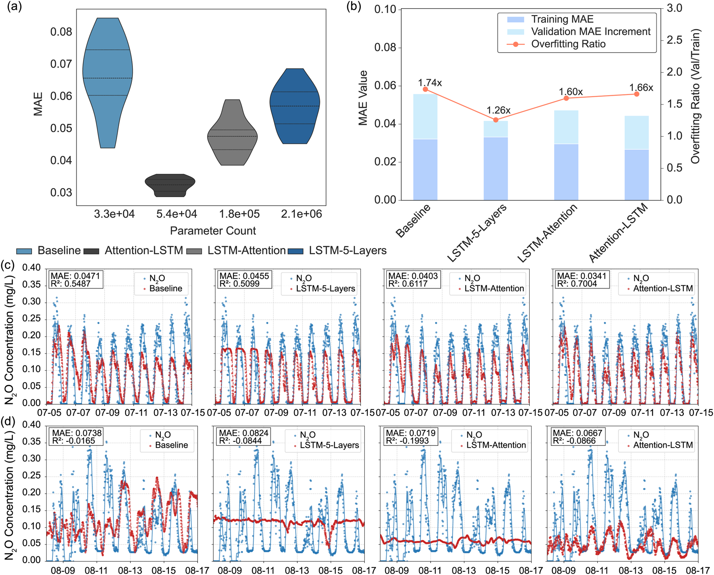
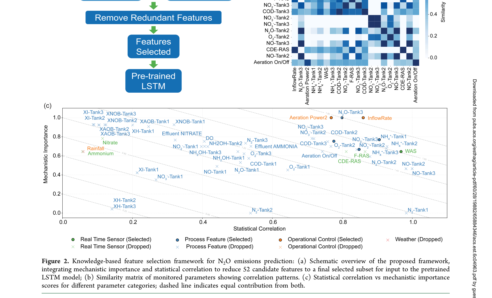
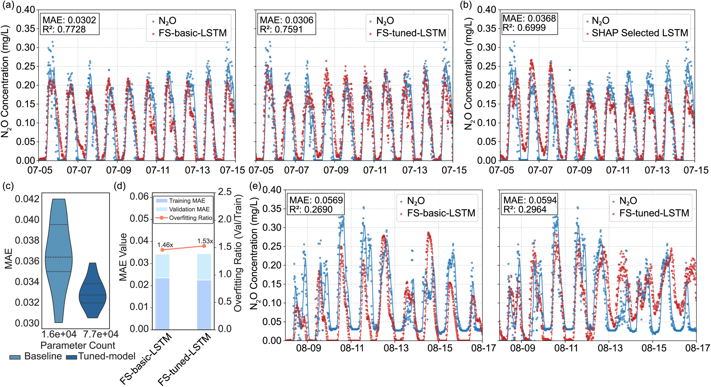
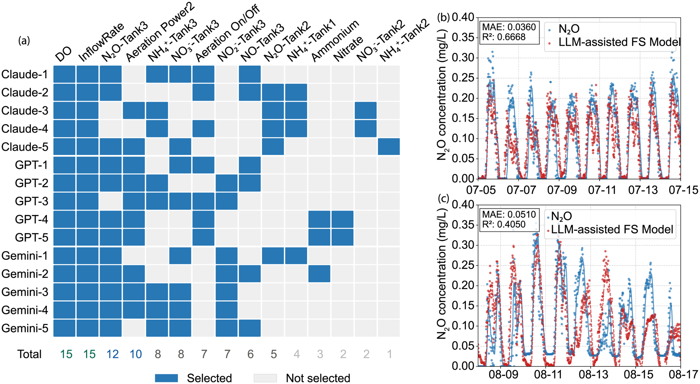
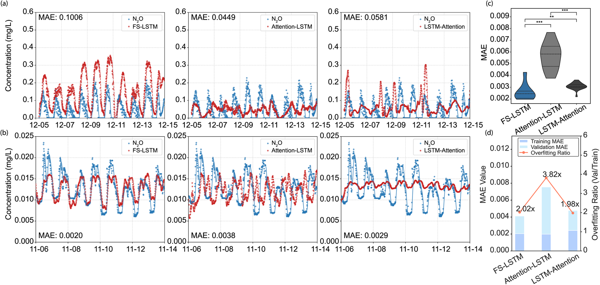

# Knowledge-Based Feature Selection Substantially Enhances Data-Driven Wastewater Treatment Modeling

## Abstract

- Thách thức cốt lõi của mô hình hóa xử lý nước thải là tình trạng dữ liệu mẫu nhỏ nhưng số chiều cao (small, high-dimensional data).
  - Số lượng lớn các thông số quan trắc trong tập dữ liệu quy mô nhỏ làm lu mờ hiểu biết cơ chế sinh học nền tảng.
- Khung lựa chọn đặc trưng định hướng tri thức (knowledge-driven feature selection) được đề xuất nhằm tích hợp hiểu biết cơ chế với tương quan thống kê.
  - Mục tiêu là xác định tập đặc trưng dự đoán tối ưu cho bài toán phát thải khí nitrous oxide ($N_2O$) tại trạm xử lý sinh học quy mô thực tế (full-scale BNR plant).
- So sánh hiệu năng giữa thuật toán học sâu dựa trên cơ chế chú ý (attention mechanism) với hai phương pháp tiếp cận tri thức mới:
  - Phương pháp 1: Lựa chọn đặc trưng dựa trên tri thức chuyên gia (expert-guided feature selection).
  - Phương pháp 2: Lựa chọn đặc trưng tăng cường bằng mô hình ngôn ngữ lớn (LLM-augmented feature selection).
- Phương pháp lựa chọn đặc trưng dựa trên tri thức chuyên gia cải thiện độ chính xác dự đoán:
  - Đạt hệ số xác định trung bình $R^2 = 0.723$ và sai số tuyệt đối trung bình $\text{MAE} = 0.033$.
  - Hiệu năng tốt hơn kiến trúc dựa trên attention tốt nhất ($R^2 = 0.712$, $\text{MAE} = 0.033$).
- Khung phương pháp cải thiện rõ rệt khả năng tổng quát hóa ngoại suy (generalizability):
  - Trong điều kiện lưu lượng cao lệch phân phối (out-of-distribution high-flow), mô hình dựa trên attention thất bại trong việc nắm bắt quy luật phát thải $N_2O$.
  - Mô hình dựa trên đặc trưng chuyên gia tiếp tục tái tạo chính xác động học thời gian chủ đạo của phát thải $N_2O$.
- Phương pháp lựa chọn đặc trưng qua LLM mang lại hiệu năng cạnh tranh và tính ổn định cao:
  - Đạt $R^2$ trung bình $= 0.596$ và $\text{MAE} = 0.041$.
  - Bảo tồn khả năng tổng quát hóa dưới sự dịch chuyển phân phối đầu vào (distributional shift).
  - Cung cấp hướng tiếp cận khả thi, duy trì hiệu quả tính toán cho các hệ thống xử lý nước thải phức tạp.
- Từ khóa định danh nghiên cứu (keywords):
  - Lựa chọn đặc trưng (feature selection), mô hình hóa nước thải (wastewater modeling), dữ liệu số chiều cao (high-dimensionality data), tri thức chuyên gia (expert knowledge), học máy (machine learning), hướng dữ liệu (data driven).

## 1 INTRODUCTION

- Vai trò của mô hình hóa xử lý nước thải đang chuyển dịch mạnh mẽ theo định hướng hạ tầng xanh:
  - Tối ưu hóa vận hành, bảo đảm tuân thủ quy chuẩn pháp lý và kiểm soát phát thải khí nhà kính (GHG emissions).
  - Nhà máy xử lý nước thải (WWTPs) chuyển từ vai trò loại bỏ chất ô nhiễm sang cơ sở thu hồi tài nguyên (resource recovery facilities) và hạ tầng trung hòa năng lượng.
- Các mô hình cơ chế truyền thống bộc lộ nhiều giới hạn nội tại:
  - Thiếu hiểu biết đầy đủ về các cơ chế phản ứng phức tạp và tương tác vi sinh vật trong hệ thống.
  - Gặp khó khăn khi mô tả các chất ô nhiễm mới nổi và động học phát thải khí nhà kính như nitrous oxide ($N_2O$).
- Mô hình học máy đối mặt với thách thức "lời nguyền số chiều" (curse of dimensionality) trong điều kiện dữ liệu mẫu nhỏ:
  - Số lượng đặc trưng quá lớn dẫn đến hiện tượng quá khớp (overfitting) và làm giảm khả năng tổng quát hóa (generalizability).
  - Trong ngành nước thải, dữ liệu thường có kích thước mẫu hạn chế nhưng số lượng thông số quan trắc lại rất lớn từ hệ thống SCADA.
  - Nghịch lý dữ liệu: Dữ liệu đa chiều làm mờ đi các mối quan hệ cơ chế sinh học chi phối hệ thống thay vì làm sáng tỏ chúng.
- Tăng độ phức tạp của kiến trúc học sâu không giải quyết triệt để vấn đề dữ liệu thưa thời gian:
  - Các kiến trúc học sâu như mạng nơ-ron tích chập (CNN), biểu diễn đồ thị (graph-based) và cơ chế chú ý (attention mechanisms) được thiết kế để tự động học phụ thuộc không-thời gian.
  - Do hạn chế quan trắc thực tế, dữ liệu phần lớn thưa thớt theo thời gian (temporally sparse data sets).
  - Việc tăng độ phức tạp mạng và bổ sung đầu vào khi thiếu dữ liệu lớn thường làm suy giảm độ chính xác dự đoán thay vì cải thiện.
- Lựa chọn đặc trưng (feature selection) là lộ trình hiệu quả hơn việc chỉ tập trung mở rộng kiến trúc:
  - Xác định các thông số ưu tiên giúp mô hình đạt hiệu năng dự đoán cao trong khi duy trì độ phức tạp hợp lý và tiết kiệm chi phí tính toán.
  - Phương pháp thống kê truyền thống như phân tích thành phần chính (PCA) thiếu ngữ cảnh chuyên ngành, dễ chọn các biến có tương quan toán học nhưng phi lý về cơ chế sinh học.
  - Lựa chọn đặc trưng định hướng tri thức (knowledge-guided feature selection) giúp thu hẹp không gian giả thuyết của mô hình (hypothesis space) dựa trên nguyên lý xử lý nước thải.
- Cơ hội từ mô hình ngôn ngữ lớn kết hợp truy xuất tri thức tăng cường (LLM-RAG):
  - Khả năng tổng hợp có hệ thống tri thức chuyên ngành từ lượng lớn y văn và tài liệu khoa học.
  - Bổ khuyết cho các chuyên gia cá nhân bằng cách bao quát những mối liên hệ bị bỏ sót do giới hạn tiếp cận tài liệu.
  - Kết hợp trực giác chuyên gia con người với năng lực tổng hợp tự động của trí tuệ nhân tạo.
- Thiết kế nghiên cứu và đối tượng thực nghiệm:
  - Dự đoán phát thải khí nhà kính $N_2O$ tại hai trạm xử lý nước thải quy mô thực tế tại Queensland, Australia.
  - Khí $N_2O$ sinh ra đồng thời từ nhiều con đường sinh học động học cao và chịu tác động của nhiều yếu tố môi trường đan xen.
  - Thiết lập so sánh đối chứng giữa mô hình học sâu chú ý (Attention-LSTM) với hai giải pháp dựa trên tri thức:
    - Tiếp cận 1: Khung sàng lọc đặc trưng dựa trên tri thức chuyên gia (KBFS) tích hợp cơ chế sinh hóa và tương quan thống kê.
    - Tiếp cận 2: Khung sàng lọc đặc trưng tăng cường bằng mô hình ngôn ngữ lớn (LLM-RAG).
  - Đánh giá đồng bộ trên ba tiêu chí: độ chính xác dự đoán, mức độ quá khớp và độ bền vững dưới sự dịch chuyển phân phối dữ liệu (distributional shift giữa các mùa và giữa các trạm xử lý khác nhau).

## 2 MATERIALS AND METHODS

### 2.1 Data Acquisition and Preprocessing

#### 2.1.1 Study Site Characteristics
- Nghiên cứu thực hiện quan trắc tại hai nhà máy xử lý nước thải quy mô thực tế ở Queensland, Australia:
  - Nhà máy WWTP-A:
    - Công suất xử lý thiết kế đạt $20\text{ ML}\cdot\text{d}^{-1}$ ($20\text{ megalitres/day}$).
    - Áp dụng cấu hình khử dinh dưỡng sinh học (BNR - Biological Nutrient Removal) gồm vùng thiếu khí (anoxic) và hiếu khí (aerobic) nối tiếp, theo sau là bể lắng thứ cấp.
    - Vận hành máy sục khí cơ học bề mặt (surface aerators) trên 6 bể sinh học song song.
    - Mỗi bể gồm một vùng thiếu khí (ngăn 1) và một vùng hiếu khí chia 2 ngăn (ngăn 2 và 3); quan trắc chuyên sâu tại một bể sinh học đại diện.
  - Nhà máy WWTP-B:
    - Công suất xử lý thiết kế đạt $30\text{ ML}\cdot\text{d}^{-1}$.
    - Sử dụng quy trình 5 giai đoạn Bardenpho (five-stage Bardenpho process) trong bể phản ứng sinh học đa ngăn gồm 12 ngăn nối tiếp.
    - Cấu hình nối tiếp gồm các vùng kỵ khí (anaerobic), hiếu khí (aerobic), thiếu khí sau (post-anoxic) và tái hiếu khí (reaeration) trên các chuỗi xử lý song song.
    - Tạo lập môi trường oxy hóa khử phân tầng theo từng giai đoạn; chiến dịch quan trắc tập trung vào một chuỗi xử lý đại diện.

#### 2.1.2 Data Sets and Pretreatments
- Ba tập dữ liệu thực nghiệm được thu thập để đánh giá khung mô hình hóa (Bảng 1):
  - Tập dữ liệu A1 (WWTP-A):
    - Thời gian quan trắc từ ngày 25 tháng 5 năm 2024 đến ngày 16 tháng 8 năm 2024.
    - Giai đoạn tháng 5 đến tháng 7 năm 2024 dùng cho huấn luyện và kiểm định nội miền (in-distribution).
    - Giai đoạn từ ngày 9 đến ngày 16 tháng 8 năm 2024 là giai đoạn kiểm tra điều kiện dòng chảy cao ngoài phân phối (out-of-distribution high-flow).
    - Các thông số SCADA ghi nhận gồm: nồng độ $N_2O$ hòa tan, thông số bùn tuần hoàn ($\text{RAS\_CDE}$ và $\text{RAS\_F}$), chỉ số nitơ ($NH_4^+$, $NO_3^-$), công suất sục khí $\text{Aeration Power2}$, lưu lượng bùn thải $\text{WAS}$, lưu lượng dòng vào $\text{InflowRate}$, oxy hòa tan $\text{DO}$, trạng thái sục khí $\text{Aeration On/Off}$, amoni và nitrat trong nước sau lắng.
  - Tập dữ liệu A2 (WWTP-A):
    - Thu thập trong chiến dịch mùa hè từ ngày 5 đến ngày 15 tháng 12 năm 2024.
    - Đại diện cho điều kiện mùa vụ khác biệt nhằm kiểm tra tính tổng quát hóa theo thời gian.
  - Tập dữ liệu B1 (WWTP-B):
    - Thu thập trong chiến dịch quan trắc từ tháng 10 đến tháng 11 năm 2025.
    - Ghi nhận: lưu lượng dòng vào và bùn thải, lưu lượng bơm $\text{RAS}$, tốc độ bơm tuần hoàn nội bộ (chu kỳ A), lưu lượng khí sục tại các ngăn 1–3 và ngăn tái hiếu khí, nồng độ $\text{DO}$ các ngăn 1–3 và ngăn tái hiếu khí, $\text{pH}$ nước ra, nhiệt độ ngăn 1, amoni, nitrat và nồng độ $N_2O$ đo bằng cảm biến tại chỗ.
- Phương pháp tiền xử lý và đồng bộ hóa chuỗi thời gian:
  - Tái lấy mẫu (resampling) toàn bộ chuỗi dữ liệu SCADA về khoảng thời gian đồng nhất $15\text{ phút}$ bằng giá trị trung bình mỗi khung thời gian nhằm giảm chi phí tính toán và bảo đảm nắm bắt động học xử lý.
  - Dữ liệu lượng mưa theo giờ thu thập từ cổng CHRS (PERSIANN-CCS) tương ứng với lưu vực của từng nhà máy.
  - Áp dụng phương pháp nội suy tuyến tính (linear interpolation) để khớp dữ liệu mưa theo mốc thời gian $15\text{ phút}$ của hệ thống SCADA, phục vụ phân tích ảnh hưởng của mưa lên phát thải $N_2O$.

#### 2.1.3 Feature Engineering
- Xây dựng mô hình bùn hoạt tính kết hợp $N_2O$ (ASM-$N_2O$):
  - Mô hình Activated Sludge Model-$N_2O$ được hiệu chuẩn riêng cho từng hệ thống dựa trên dữ liệu 2 tuần đầu tiên.
  - Kiểm soát nghiêm ngặt hiện tượng rò rỉ dữ liệu (data leakage): dữ liệu hiệu chuẩn nằm trọn trong tập huấn luyện, không sử dụng dữ liệu từ tập kiểm định hay kiểm tra.
- Tích hợp con đường phản ứng sinh hóa và động học vi sinh:
  - Mô hình hóa cơ chế sinh $N_2O$ qua vi khuẩn oxy hóa amoni (AOB) theo Pocquet et al., gồm con đường nitrat hóa (NN - Nitrifier Nitrification) và khử nitrat của vi khuẩn nitrat hóa (ND - Nitrifier Denitrification).
  - Tích hợp mô hình khử nitrat dị dưỡng bốn bước của Hiatt và Grady.
  - Hiệu chuẩn độc lập cho WWTP-A và WWTP-B dựa trên dữ liệu biên dạng $\text{DO}$ và quá trình chuyển hóa các dạng nitơ.
- Trích xuất tập biến trạng thái sinh học bổ sung:
  - Nồng độ khí hòa tan: $N_2$ và $N_2O$.
  - Các dạng hợp chất nitơ hòa tan: $NH_4^+$, $NH_2OH$, $NO$, $NO_2^-$, $NO_3^-$.
  - Mức oxy hòa tan $\text{DO}$ và nồng độ cơ chất hữu cơ dễ phân hủy sinh học.
  - Nồng độ các nhóm sinh khối vi sinh: $X_{AOB}$, $X_H$ (vi khuẩn dị dưỡng), $X_I$ (chất trơ) và $X_{NOB}$ (vi khuẩn oxy hóa nitrit).

### 2.2 Deep Learning Model Development and Architecture Optimization

- Kiến trúc mô hình cơ sở LSTM hai lớp (two-layer baseline LSTM):
  - Thiết kế gồm 2 lớp LSTM xếp chồng (mỗi lớp gồm 32 units).
  - Mỗi lớp được bổ sung chuẩn hóa theo lô (Batch Normalization) và điều chuẩn dropout (tỷ lệ $0.2$).
  - Lớp đầu ra là một lớp tuyến tính kết nối đầy đủ (dense linear layer) để dự đoán nồng độ $N_2O$.
- Chiến lược mở rộng kiến trúc học sâu qua ba cấu hình chính:
  - Cấu hình 1: Tối ưu hóa kiến trúc mở rộng (Tuned LSTM):
    - Tìm kiếm tự động không gian kiến trúc với độ sâu lớp và số nơ-ron biến thiên bằng khung Optuna.
    - Tối ưu hóa đồng thời số lớp LSTM, số đơn vị mỗi lớp và các siêu tham số điều chuẩn nhằm xác định cấu hình tối ưu.
  - Cấu hình 2: Mô hình Attention-LSTM tích hợp cơ chế chú ý tự thân đa đầu:
    - Áp dụng cơ chế multi-head self-attention trên chiều không gian đặc trưng (feature dimension) trước khi đưa vào các lớp LSTM xử lý chuỗi thời gian.
    - Ưu tiên trích xuất các đặc trưng giàu thông tin nhất ngay từ đầu chu trình xử lý, gia tăng độ linh hoạt khi xử lý dữ liệu số chiều cao.
    - Công thức toán học của cơ chế chú ý đa đầu:
      $$\text{head}_i = \text{Attention}(Q W_i^Q, K W_i^K, V W_i^V)$$
      $$\text{MultiHead}(Q, K, V) = \text{Concat}(\text{head}_1, \dots, \text{head}_h) W^O$$
      Trong đó $Q, K, V$ lần lượt là các ma trận truy vấn (query), khóa (key) và giá trị (value); các ma trận $W_i^Q, W_i^K, W_i^V, W^O$ là ma trận chiếu học được (learnable projection matrices).
  - Cấu hình 3: Mô hình lai CNN-LSTM:
    - Lớp tích chập một chiều (1D-CNN) áp dụng bộ lọc theo thời gian để trích xuất các đặc trưng cục bộ ngắn hạn (short-range patterns).
    - Các lớp LSTM tiếp nhận biểu diễn cô đọng từ CNN để nắm bắt các phụ thuộc dài hạn (long-range temporal dependencies).
- Quy trình tối ưu hóa siêu tham số có hệ thống bằng Optuna:
  - Sử dụng thuật toán lấy mẫu TPE (Tree-structured Parzen Estimator) kết hợp cơ chế cắt tỉa Hyperband pruning.
  - Tiến hành 100 lượt thử nghiệm (trials) cho mỗi kiến trúc: gồm 15 lượt lấy mẫu ngẫu nhiên khởi tạo quần thể trước khi kích hoạt thuật toán TPE.
  - Hàm mục tiêu tối ưu là sai số $\text{MAE}$ trên tập kiểm định, tính toán trực tiếp trên giá trị đã nghịch đảo chuẩn hóa để bảo đảm đúng thang đo vật lý thực nghiệm.
- Thiết lập huấn luyện và phân chia dữ liệu bảo toàn tính thứ tự thời gian (chronological split):
  - Triển khai trên nền tảng TensorFlow/Keras API với hàm mất mát Huber loss và thuật toán tối ưu Adam.
  - Sử dụng kỹ thuật giảm tốc độ học thích ứng (adaptive learning rate reduction) và dừng sớm (early stopping) để kiểm soát nguy cơ quá khớp.
  - Phân chia tập dữ liệu A1 (tổng số 51 ngày nội miền):
    - 30 ngày cho huấn luyện (training).
    - 10 ngày cho kiểm định (validation).
    - 11 ngày cho kiểm tra (testing).
  - Phân chia tập dữ liệu B1 (tổng số 39 ngày):
    - 25 ngày cho huấn luyện.
    - 5 ngày cho kiểm định.
    - 9 ngày cho kiểm tra.
  - Huấn luyện lặp lại 20 lần độc lập cho mỗi cấu hình mô hình với các hạt giống ngẫu nhiên (random seeds) khác nhau; tính trung bình $\text{MAE}$ và $R^2$ để loại trừ nhiễu ngẫu nhiên trong quá trình khởi tạo trọng số.

### 2.3 Knowledge-Based Feature Selection Framework

- Quy trình sàng lọc đặc trưng dựa trên tri thức gồm năm bước có cấu trúc:
  - Tối ưu hóa không gian biến đầu vào trước khi tiến hành xây dựng mô hình và tối ưu hóa siêu tham số.
  - Cân bằng giữa mức độ hiểu biết cơ chế sinh học và tương quan thống kê chuỗi thời gian.
- Bước 1: Gán trọng số tầm quan trọng cơ chế (Mechanistic Importance-Weighting):
  - Phân loại đặc trưng theo vai trò chức năng trong các phương trình động học sinh học và phương trình cân bằng khối lượng.
  - Gán điểm số $\text{MI-score}$ (Mechanistic Importance score) trong khoảng từ gần $0$ (ảnh hưởng không đáng kể) đến $1.0$ (ảnh hưởng cốt lõi lớn nhất).
  - Điểm số phản ánh mức độ đóng góp lý thuyết vào quá trình hình thành khí $N_2O$ dựa trên cơ chế phản ứng sinh hóa đã được xác lập.
- Bước 2: Phân nhóm theo quy trình sinh học (Process Group Categorization):
  - Phân loại các đặc trưng vào 4 nhóm chức năng theo chu trình nitơ:
    - Nhóm con đường AOB (ammonia-oxidizing bacteria): nồng độ amoni ($NH_4^+$), hydroxylamine ($NH_2OH$), nitrit ($NO_2^-$) và sinh khối tự dưỡng $X_{AOB}$.
    - Nhóm con đường NOB (nitrite-oxidizing bacteria): nồng độ nitrit ($NO_2^-$), nitrat ($NO_3^-$) và sinh khối $X_{NOB}$.
    - Nhóm khử nitrat dị dưỡng (heterotrophic denitrification): các oxit nitơ và nồng độ sinh khối vi khuẩn dị dưỡng $X_H$.
    - Nhóm thông số vận hành và ngoại cảnh: biến điều khiển sục khí, cảm biến trực tuyến và dữ liệu khí tượng mưa.
- Bước 3: Phân tích tương quan động học chuỗi thời gian (Temporal Correlation Analysis):
  - Ứng dụng hàm tương quan chéo (`ccf` - cross-correlation function) từ thư viện `statsmodels.tsa.stattools` để tính toán hệ số tương quan Pearson tại các bước trễ thời gian khác nhau.
  - Thiết lập cửa sổ trễ thời gian $\pm 4\text{ giờ}$ với độ phân giải dữ liệu $15\text{ phút}$ giữa từng biến quá trình với nồng độ phát thải $N_2O$.
  - Xác định bản chất quan hệ dẫn trước hoặc trễ sau (leading or lagging relationships) của từng thông số so với biến động phát thải $N_2O$.
  - Điểm tương quan thống kê $\text{SC-score}$ (Statistical Correlation score) lấy theo giá trị tương quan tuyệt đối cực đại trong cửa sổ $\pm 4\text{ giờ}$.
- Bước 4: Khử bỏ đặc trưng dư thừa (Redundancy Elimination):
  - Xây dựng ma trận tương đồng đặc trưng (similarity matrix) thông qua tương quan cặp Pearson giữa các chuỗi thời gian đã chuẩn hóa.
  - Gán trọng số tương đồng nâng cao cho các cặp đặc trưng thuộc cùng nhóm chức năng sinh học nhằm phản ánh sự dư thừa chức năng xử lý.
- Bước 5: Sàng lọc và xếp hạng đặc trưng cuối cùng (Final Feature Selection):
  - Chuẩn hóa tuyến tính điểm $\text{SC-score}$ và $\text{MI-score}$ về cùng thang đo đơn vị.
  - Tính điểm tổng hợp theo công thức kết hợp:
    $$\text{Combined Score} = \text{SC-score} + \text{MI-score}$$
  - Loại bỏ các đặc trưng dư thừa có độ tương đồng vượt ngưỡng $\text{similarity} > 0.85$, ưu tiên giữ lại đặc trưng có điểm $\text{Combined Score}$ cao nhất.
  - Ngưỡng tương đồng $0.85$ là mức giới hạn bảo thủ nhằm triệt tiêu đa cộng tuyến mạnh nhưng không làm mất thông tin động học then chốt.
- Thiết lập phương pháp đối chứng benchmark:
  - So sánh độc lập với kỹ thuật điều chuẩn LASSO (L1 regularization) và phân tích độ quan trọng đặc trưng dựa trên giá trị SHAP (SHapley Additive exPlanations).

### 2.4 LLM-RAG Feature Selection Framework

- Khung tích hợp tri thức y văn khoa học qua kỹ thuật RAG (Retrieval-Augmented Generation):
  - Xây dựng trên nền tảng thư viện PaperQA nhằm cho phép các mô hình ngôn ngữ lớn truy xuất và lập luận trên tập tài liệu nghiên cứu chuyên ngành.
  - Kết hợp đồng thời 3 mô hình ngôn ngữ lớn (LLMs) đa dạng về kiến trúc và phương pháp huấn luyện (Bảng 2):
    - GPT-5.2 (OpenAI).
    - Claude Sonnet 4.6 (Anthropic).
    - Gemini 2.5 Flash (Google).
  - Tận dụng thế mạnh lập luận bổ trợ giữa các kiến trúc mô hình khác nhau để hạn chế sai lệch phán đoán cá thể.
- Xây dựng kho ngữ liệu chuyên ngành và cơ chế tìm kiếm ngữ nghĩa:
  - Tập hợp kho ngữ liệu cục bộ gồm 520 bài báo khoa học chuyên sâu về phát thải $N_2O$ và xử lý nước thải sinh học từ các tạp chí uy tín.
  - Lập chỉ mục vector hóa (vector embeddings) sử dụng mô hình `text-embedding-3-small` của OpenAI để hỗ trợ tìm kiếm độ tương đồng ngữ nghĩa chính xác.
- Quy trình bảo mật dữ liệu và chuẩn bị ngữ cảnh:
  - Khử định danh dữ liệu (data anonymization): Loại bỏ hoàn toàn tên nhà máy, vị trí địa lý và các siêu dữ liệu vận hành nhạy cảm trước khi truy vấn nhằm bảo đảm tính bảo mật.
  - Tạo cấu trúc tóm tắt dữ liệu: trích xuất đặc tính thống kê, phân tích phân phối dữ liệu khuyết thiếu, và ma trận tương quan giữa các biến quá trình với nồng độ phát thải $N_2O$.
- Cơ chế truy xuất bằng chứng khoa học và quyết định chọn đặc trưng:
  - Truy xuất các phân đoạn văn bản cơ chế có độ liên quan cao nhất từ kho 520 bài báo khoa học.
  - Tổng hợp đồng thời ngữ cảnh dữ liệu vận hành và tri thức y văn để kết luận danh sách đặc trưng đầu vào phục vụ mô hình học sâu.

## 3 RESULTS AND DISCUSSION

### 3.1 Deeper and Attention-Based Models Improve Performance

- Đánh giá có hệ thống các mô hình trong điều kiện mẫu nhỏ, số chiều cao:
  - Tỷ lệ kích thước mẫu trên số lượng đặc trưng thấp ở mức xấp xỉ $76:1$ (sample-to-feature ratio $\approx 76:1$).
  - Khảo sát hai hướng tiếp cận dựa trên cấu trúc mạng: tăng độ sâu mô hình học chuỗi và tích hợp cơ chế chú ý (attention mechanisms).
- Hiệu năng của các kiến trúc học sâu không sử dụng cơ chế chú ý:
  - Mô hình cơ sở LSTM hai lớp (two-layer LSTM):
    - Đạt sai số kiểm tra trung bình $\text{MAE} = 0.0665$ ($\sigma = 0.0110$) và $R^2 = 0.119$ qua 20 lượt chạy độc lập.
  - Mô hình lai CNN-LSTM:
    - Chỉ mang lại cải thiện hạn chế với $\text{MAE} = 0.0599$ và $R^2 = 0.206$.
  - Mô hình năm lớp LSTM tối ưu hóa qua Optuna (LSTM-5-Layers):
    - Đạt $\text{MAE} = 0.0567$ ($\sigma = 0.0065$) và $R^2 = 0.2263$ ($\sigma = 0.1843$), cải thiện vừa phải nhờ tăng dung lượng nắm bắt phụ thuộc dài hạn.
- Cơ chế chú ý cải thiện độ chính xác dự đoán nội miền:
  - So sánh hai biến thể vị trí đặt cơ chế chú ý:
    - Mô hình Attention-LSTM: áp dụng chú ý theo chiều đặc trưng (feature-wise attention) để đánh trọng số lại các biến đầu vào trước khi xử lý chuỗi, đạt $\text{MAE} = 0.0326$ và $R^2 = 0.712$.
    - Mô hình LSTM-Attention: áp dụng chú ý theo trục thời gian sau khi mã hóa chuỗi LSTM, đạt $\text{MAE} = 0.0478$ và $R^2 = 0.465$.
    - Attention-LSTM tốt hơn LSTM-Attention $31.8\%$ về chỉ số $\text{MAE}$, chứng minh việc tái đánh trọng số đầu vào ở giai đoạn sớm hiệu quả hơn xử lý biểu diễn sau mã hóa.
- Hiện tượng quá khớp gia tăng ở các mô hình dung lượng lớn và toàn bộ kiến trúc suy giảm khi gặp điều kiện dòng chảy cao ngoài phân phối:
  - Tỷ lệ sai số kiểm định trên huấn luyện (validation-to-training MAE ratio) dao động từ $1.26\times$ ở LSTM năm lớp đến $1.66\times$ ở Attention-LSTM.
  - Khi thử nghiệm trên tập dữ liệu ngoài phân phối tháng 8 với lưu lượng dòng vào đạt $64.04\text{ L/s}$ (vượt mức trung bình huấn luyện $52.71\text{ L/s}$), toàn bộ mô hình đều sụp đổ với hệ số $R^2$ chuyển sang âm: baseline đạt $-0.017$, LSTM-5-Layers đạt $-0.084$, Attention-LSTM đạt $-0.087$ và LSTM-Attention đạt $-0.199$.
  - **Hình 1.** So sánh hiệu năng mô hình trong điều kiện mẫu nhỏ, số chiều cao
    - 
    - Cơ chế & Bằng chứng: Phân phối $\text{MAE}$ trên tập kiểm tra cải thiện dần từ baseline đến Attention-LSTM đạt sai số thấp nhất ($0.0326$), nhưng tỷ lệ $\text{MAE}$ kiểm định/huấn luyện đạt $1.66\times$ (quá khớp cao). Khi lưu lượng tăng lên $64.04\text{ L/s}$ vào tháng 8, hệ số $R^2$ của toàn bộ mô hình đều chuyển sang âm (từ $-0.017$ đến $-0.199$).
- Giới hạn của việc cải tiến kiến trúc thuần túy:
  - Dòng chảy cao đưa vào các tổ hợp đặc trưng chưa xuất hiện trong tập huấn luyện, buộc mạng nơ-ron phải ngoại suy ngoài miền phân phối đã học.
  - Tăng độ phức tạp mạng chỉ giúp ghi nhớ mẫu thống kê nội miền tháng 7 mà không tạo ra năng lực khái quát hóa vững chắc; do đó, tối ưu hóa không gian đầu vào bằng chọn lọc đặc trưng là yêu cầu bắt buộc.

### 3.2 Expert-Guided Feature Selection Improves Accuracy and Efficiency

- Cơ sở khoa học của phương pháp lựa chọn đặc trưng dựa trên tri thức (KBFS):
  - Khắc phục triệt để hiện tượng suy giảm khả năng tổng quát hóa ở mô hình học sâu phức tạp bằng cách tối ưu hóa không gian đầu vào.
  - Kết hợp đồng thời tương quan thống kê chuỗi thời gian và tầm quan trọng cơ chế sinh học để sàng lọc 52 biến ứng viên ban đầu.
- Phân tích tương quan thống kê và đóng góp cơ chế sinh hóa:
  - Các đặc trưng có tương quan thống kê cao nhất với nồng độ phát thải $N_2O$ tại Bể 3:
    - $\text{NO-tank3}$ (hệ số $1.0$), $N_2\text{-tank1}$ ($0.983$) và $\text{NO-tank2}$ ($0.982$).
    - Nitric oxide ($NO$) là tiền chất hóa sinh trực tiếp sinh ra $N_2O$ trong cả con đường nitrat hóa của AOB và khử nitrat dị dưỡng; nồng độ $N_2$ phản ánh mức độ hoàn tất của quá trình khử nitrat.
  - Vai trò bù đắp của điểm số cơ chế (Mechanistic Importance - MI):
    - Tương quan thống kê thuần túy dễ bị méo mó bởi nhiễu thiết bị đo và sai lệch phân phối mẫu.
    - Một số thông số vận hành cốt lõi nhận điểm $\text{MI-score} = 1.0$ dù tương quan thống kê ở mức trung bình: lưu lượng vào $\text{InflowRate}$ (chi phối thời gian lưu thủy lực và tải lượng cơ chất), công suất sục khí $\text{Aeration Power2}$ (quyết định nồng độ oxy hòa tan $\text{DO}$ điều khiển tốc độ nitrat hóa) và $N_2O\text{-Tank3}$ mô phỏng.
- Phân tích tương đồng chuỗi thời gian và triệt tiêu đa cộng tuyến:
  - Nhiều thông số có dạng sóng dao động gần như trùng khớp sau khi chuẩn hóa do chia sẻ cùng vai trò sinh học trong hệ thống BNR (ví dụ $NH_4^+\text{-Tank1}$ và $NH_4^+\text{-Tank2}$).
  - Thiết lập ngưỡng tương đồng Pearson bảo thủ ở mức $0.85$ để loại bỏ biến trùng lặp, giữ lại biến có điểm tổng hợp cao hơn:
    - Loại bỏ $NH_4^+\text{-Tank2}$ do độ tương đồng đạt $0.906$ với $NH_4^+\text{-Tank1}$.
    - Loại bỏ $NO_2^-\text{-Tank3}$ do trùng lặp với $N_2O\text{-Tank3}$ (độ tương đồng $0.865$).
- Tích hợp tầm quan trọng cơ chế và phân tích tương quan thống kê giúp sàng lọc 52 đặc trưng ban đầu thành tập 7 biến cốt lõi:
  - Tập 7 đặc trưng được lựa chọn đại diện đầy đủ cho điều khiển vận hành, động học nitơ và tải lượng hữu cơ:
    - Nhóm thông số vận hành chính: $\text{InflowRate}$, $\text{Aeration Power2}$ và lưu lượng bùn thải $\text{WAS flow}$.
    - Nhóm chỉ thị chuyển hóa nitơ then chốt: $NH_4^+\text{-tank1}$ và $NO_2^-\text{-tank2}$.
    - Nhóm cacbon hữu cơ sẵn có: $\text{COD-tank2}$ (nguồn cacbon thúc đẩy phản ứng khử nitrat).
    - Biến trạng thái mục tiêu: $N_2O\text{-tank3}$ (mô phỏng từ ASM-$N_2O$).
  - **Hình 2.** Khung lựa chọn đặc trưng định hướng tri thức cho dự đoán phát thải N2O
    - 
    - Cơ chế & Bằng chứng: Tích hợp điểm số cơ chế (MI-score) và tương quan thống kê (SC-score) để rút gọn 52 biến ứng viên xuống 7 đặc trưng. Ma trận tương đồng Pearson xác định và loại bỏ các biến dư thừa (như loại bỏ $NH_4^+\text{-Tank2}$ do tương đồng $0.906$ với $NH_4^+\text{-Tank1}$, loại bỏ $NO_2^-\text{-Tank3}$ do trùng lặp $0.865$).
- Đánh giá hiệu năng nổi bật của mô hình học sâu sử dụng 7 đặc trưng chọn lọc:
  - Mô hình cơ sở hai lớp với 7 đặc trưng (FS-basic-LSTM):
    - Đạt $\text{MAE} = 0.0367$ ($\sigma = 0.0032$) và $R^2 = 0.6919$ trong điều kiện nội miền.
    - Cải thiện có ý nghĩa thống kê so với baseline đầy đủ biến ($p < 0.001$), mô hình 5 lớp ($p < 0.001$) và LSTM-Attention ($p < 0.001$).
    - Lượt chạy tốt nhất đạt $R^2 = 0.77$, vượt qua kết quả cao nhất của mô hình Attention-LSTM.
  - Tối ưu hóa kiến trúc mạng trên tập đặc trưng chọn lọc (FS-tuned-LSTM):
    - Cấu hình tối ưu chỉ là một mạng LSTM đơn lớp (1-layer LSTM) gọn nhẹ.
    - Đạt sai số $\text{MAE} = 0.0330$ ($\sigma = 0.0015$) và $R^2 = 0.7225$, tái tạo chính xác dao động ngày đêm (diurnal pattern) của phát thải $N_2O$.
- So sánh đối chứng với các phương pháp lựa chọn đặc trưng truyền thống:
  - Sàng lọc bằng điều chuẩn LASSO và phương pháp SHAP từ mô hình LSTM 5 lớp đều cho kết quả kém hơn rõ rệt so với tiếp cận dựa trên tri thức.
  - Khẳng định chất lượng không gian đặc trưng quyết định hiệu năng của mô hình hơn là dung lượng tính toán mạng nơ-ron.
- Mô hình LSTM huấn luyện trên 7 đặc trưng chọn lọc đạt độ chính xác cao và duy trì hệ số R2 dương trong điều kiện dòng chảy cao ngoài phân phối:
  - Tỷ lệ quá khớp $\text{MAE}$ kiểm định/huấn luyện giảm xuống $1.46\times$ ở FS-basic-LSTM và $1.53\times$ ở FS-tuned-LSTM.
  - Khi đối mặt với đợt lưu lượng cao ngoài phân phối tháng 8, cả hai mô hình FS duy trì hệ số $R^2$ dương vững chắc: FS-basic-LSTM đạt $0.2690$ và FS-tuned-LSTM đạt $0.2964$.
  - Mô hình chỉ suy giảm cục bộ khi lưu lượng dòng vào đạt đỉnh $82.62\text{ L/s}$ (ngày 14–16/08, tăng $56.74\%$ so với trung bình huấn luyện).
  - **Hình 3.** Hiệu năng của các mô hình LSTM lựa chọn đặc trưng trong dự đoán N2O
    - 
    - Cơ chế & Bằng chứng: Chuỗi thời gian tháng 7 cho thấy FS-basic-LSTM và FS-tuned-LSTM ($R^2 = 0.7225$, $\text{MAE} = 0.0330$) bám sát động học thực tế hơn mô hình chọn bằng SHAP. Trong điều kiện dòng chảy cao tháng 8, cả hai mô hình FS duy trì $R^2$ dương ($0.2690$ và $0.2964$), nắm bắt các đỉnh phát thải $N_2O$ thay vì bị sụp đổ như mô hình full-feature.

### 3.3 LLM-Assisted Feature Selection Provides a Viable Alternative

- Đánh giá khả năng thay thế tri thức chuyên gia bằng khung LLM-RAG tự động:
  - Thiết lập 15 lượt thử nghiệm độc lập (mỗi mô hình trong số ba LLMs thực hiện 5 lượt), mỗi lượt lựa chọn 7 đặc trưng.
  - Tổng cộng 14 đặc trưng duy nhất được xác định trên toàn bộ các lượt thử nghiệm (Hình 4a).
  - Tần suất lựa chọn cho thấy sự hội tụ cao về mặt cơ chế sinh học:
    - Oxy hòa tan $\text{DO}$ và lưu lượng vào $\text{InflowRate}$ được chọn nhất quán tuyệt đối ($100\%$).
    - $N_2O\text{-Tank3}$ mô phỏng đạt tần suất $80\%$ và công suất sục khí $\text{Aeration Power2}$ đạt $67\%$.
    - Bốn biến cốt lõi này chiếm tới $46\%$ tổng số lượt lựa chọn của các mô hình ngôn ngữ lớn.
- Khung LLM-RAG thể hiện tính hội tụ cao qua 15 lượt thực nghiệm và mô hình duy trì khả năng dự đoán ổn định dưới điều kiện lưu lượng cao ngoài phân phối:
  - Ba mô hình GPT-5.2, Claude Sonnet 4.6 và Gemini 2.5 Flash cho kết quả đồng thuận cao với độ lệch biến rất nhỏ.
  - Tính ổn định xuất phát từ cơ chế truy xuất ngữ nghĩa của hệ thống RAG trên 520 bài báo y văn, không phụ thuộc vào thiên kiến riêng của từng mô hình ngôn ngữ.
  - Tập 7 đặc trưng được chọn đồng thuận cao nhất: $\text{DO}$, $\text{InflowRate}$, $N_2O\text{-Tank3}$, $\text{Aeration Power2}$, $NH_4^+\text{-Tank1}$, $NO_2^-\text{-Tank3}$ và $NO_3^-\text{-Tank3}$.
  - **Hình 4.** Kết quả lựa chọn đặc trưng có sự hỗ trợ của LLM và hiệu năng mô hình
    - 
    - Cơ chế & Bằng chứng: Ma trận lựa chọn qua 15 lượt cho thấy $\text{DO}$ và $\text{InflowRate}$ đạt tần suất tuyệt đối ($100\%$), tiếp theo là $N_2O\text{-Tank3}$ ($80\%$) và $\text{Aeration Power2}$ ($67\%$). Mô hình LSTM đơn lớp đạt $R^2 = 0.596$ trong điều kiện tháng 7 và duy trì $R^2 = 0.405$ ($\text{MAE} = 0.051$) khi gặp đợt dòng chảy cao ngoài phân phối tháng 8.
- So sánh đối chiếu giữa LLM-RAG và tri thức chuyên gia trực tiếp:
  - Sự tương đồng: Cả hai phương pháp đều nhận diện chính xác các biến động lực học quan trọng gồm $\text{InflowRate}$, $N_2O\text{-Tank3}$, $\text{Aeration Power2}$ và $NH_4^+\text{-Tank1}$.
  - Sự phân kỳ then chốt: LLM-RAG bỏ sót các biến $NO_2^-\text{-Tank2}$, lưu lượng bùn thải $\text{WAS}$ và $\text{COD-Tank2}$.
  - Nguyên nhân phân kỳ: Các thông số $\text{WAS}$ và $\text{COD}$ là biến vận hành đặc thù ít được nhấn mạnh trong các bài báo lý thuyết về phát thải $N_2O$, dẫn đến tần suất truy xuất y văn thấp.
  - Hạn chế cố hữu của LLM-RAG: Tổng hợp tốt tri thức lý thuyết chung từ tài liệu khoa học nhưng thiếu hiểu biết về bối cảnh vận hành cục bộ và tương tác công nghệ thực tế tại từng nhà máy cụ thể.
- Hiệu năng thực nghiệm của mô hình LSTM sử dụng đặc trưng do LLM lựa chọn:
  - Điều kiện nội miền tháng 7:
    - Mô hình LSTM đơn lớp đạt sai số trung bình $\text{MAE} = 0.0412$ ($\sigma = 0.0025$) và $R^2 = 0.596$ qua 20 lượt chạy độc lập.
    - Lượt chạy tối ưu đạt $\text{MAE} = 0.0366$ và $R^2 = 0.666$.
    - Hiệu năng cao hơn LSTM 5 lớp và LSTM-Attention, tiệm cận Attention-LSTM.
    - Kém hơn mô hình do chuyên gia tinh chỉnh ($R^2$ thấp hơn $0.096$, $\text{MAE}$ cao hơn $36\%$).
  - Khả năng bền vững dưới sự dịch chuyển phân phối tháng 8:
    - Duy trì hệ số $R^2 = 0.405$ và sai số kiểm tra $\text{MAE} = 0.051$.
    - Bám sát xu hướng biến thiên thực tế, chỉ suy giảm trong giai đoạn cực đoan ngày 14–16/08.
    - Khẳng định tính khả thi của giải pháp LLM-RAG khi thiếu vắng chuyên gia chuyên ngành trực tiếp.

### 3.4 Generalizability across Seasons and Treatment Plants

- Hai thử nghiệm kiểm định tính tổng quát hóa bổ trợ lẫn nhau:
  - Kiểm định tính tổng quát hóa theo mùa vụ (temporal generalizability) trên Tập dữ liệu A2 tại nhà máy WWTP-A.
  - Kiểm định khả năng chuyển giao liên trạm (cross-plant transferability) trên Tập dữ liệu B1 tại nhà máy WWTP-B có sơ đồ công nghệ khác biệt.
- Khả năng tổng quát hóa xuyên mùa vụ trên Tập dữ liệu A2 (WWTP-A mùa hè):
  - Áp dụng trực tiếp cấu hình mô hình từ tập A1 sang tập A2 (tháng 12 năm 2024) mà không huấn luyện lại hay tinh chỉnh trọng số (zero retraining).
  - Điều kiện vận hành mùa hè có lưu lượng dòng vào đạt $75\text{ L/s}$, cao hơn rõ rệt so với mức trung bình tập huấn luyện ($52.71\text{ L/s}$).
  - Mô hình FS-LSTM có độ lệch thang đo hệ thống nhưng sau chuẩn hóa vẫn nắm bắt trọn vẹn quy luật động học thời gian của phát thải $N_2O$.
  - Ngược lại, cả LSTM-Attention và Attention-LSTM đều mất độ nhạy với dao động tức thời, làm phẳng các giá trị cực trị và bỏ lỡ các đỉnh phát thải quá độ.
- Khung KBFS chứng minh khả năng tổng quát hóa xuyên mùa vụ tại WWTP-A và chuyển giao thành công sang nhà máy WWTP-B với quy trình Bardenpho 12 bể:
  - Trạm WWTP-B vận hành quy trình Bardenpho 5 giai đoạn với 12 bể phản ứng sinh học song song, tạo ra không gian quan trắc khổng lồ gồm 180 đặc trưng ứng viên.
  - Tái áp dụng độc lập quy trình KBFS trên trạm WWTP-B giúp cô đọng 180 biến xuống 7 đặc trưng khử nitrat then chốt:
    - Lưu lượng khí sục các ngăn 6–8 ($\text{Airflow Rates Tank 6-8}$).
    - Nồng độ sinh khối vi khuẩn dị dưỡng tại ngăn 5 và ngăn 6 ($X_H\text{-Tank 5}$, $X_H\text{-Tank 6}$).
    - Lưu lượng dòng vào $\text{InflowRate}$.
    - Nồng độ nhu cầu oxy hóa học tại ngăn 2 ($\text{COD-Tank 2}$).
  - **Hình 5.** Đánh giá tính tổng quát hóa của khung lựa chọn đặc trưng định hướng tri thức
    - 
    - Cơ chế & Bằng chứng: Kiểm định mùa hè trên tập A2 ($75\text{ L/s}$) cho thấy FS-LSTM duy trì động học phát thải $N_2O$ trong khi Attention-LSTM làm phẳng các đỉnh dao động. Tại WWTP-B với 180 biến ứng viên, KBFS rút gọn xuống 7 đặc trưng khử nitrat giúp FS-LSTM đạt $\text{MAE} = 0.00260$ (so với $0.00568$ của Attention-LSTM) và ổn định tỷ lệ quá khớp.
- Hiệu năng nổi bật của mô hình lựa chọn đặc trưng tại WWTP-B:
  - Mô hình FS-LSTM đạt sai số $\text{MAE} = 0.00260$, thấp hơn đáng kể so với Attention-LSTM ($\text{MAE} = 0.00568$) và LSTM-Attention ($\text{MAE} = 0.00309$).
  - Duy trì tỷ lệ quá khớp ổn định nhất trên các kịch bản kiểm định, loại bỏ hoàn toàn các tương quan giả và nhiễu từ không gian 180 biến ban đầu.
  - Khẳng định tính tất yếu của việc tái đánh giá đặc trưng theo cơ chế khi chuyển giao mô hình sang các trạm xử lý nước thải mới.

### 3.5 Implications

- Ba kết luận khoa học cốt lõi từ nghiên cứu:
  - Thứ nhất, lựa chọn đặc trưng định hướng tri thức (KBFS) khắc phục triệt để hạn chế tổng quát hóa ngoại suy mà các mô hình học sâu phức tạp không thể giải quyết.
  - Thứ hai, chất lượng không gian đầu vào là yếu tố quyết định hiệu năng mô hình trong điều kiện dữ liệu mẫu nhỏ và số chiều cao, ưu thế hơn so với việc chỉ tăng độ phức tạp kiến trúc.
  - Thứ ba, khung LLM-RAG là giải pháp tự động hóa khả thi, mang lại hiệu năng dự đoán cạnh tranh mà không phụ thuộc vào sự can thiệp trực tiếp của chuyên gia con người.
- Vai trò của lựa chọn đặc trưng trong kỹ thuật môi trường và đối sánh liên ngành:
  - Lựa chọn đặc trưng đóng vai trò trung tâm trong nhiều lĩnh vực kỹ thuật từ tin sinh học hệ gen, xử lý ngôn ngữ tự nhiên đến chẩn đoán hình ảnh và tài chính.
  - Trong ngành nước thải, đa số các nghiên cứu học máy áp dụng lựa chọn đặc trưng thiếu hệ thống và chưa đánh giá đúng tầm quan trọng của việc thanh lọc biến.
  - Thực nghiệm cho thấy cắt giảm $2/3$ số biến đầu vào không chỉ nâng hệ số $R^2$ thêm $10–20\%$ mà còn cắt giảm $50\%$ thời gian tính toán của mô hình vận hành.
- Đóng góp phương pháp luận và khả năng mở rộng:
  - Kết hợp chặt chẽ giữa nguyên lý sinh hóa và tương quan thực nghiệm để xây dựng mô hình nhận biết quá trình (process-aware model) có độ bền vững cao.
  - Tiên phong ứng dụng kỹ thuật LLM-RAG vào quy trình lựa chọn đặc trưng trong kỹ thuật xử lý nước thải, mở rộng bộ công cụ phương pháp luận cho ngành kỹ thuật môi trường.
  - Khung phương pháp có khả năng chuyển giao trực tiếp sang các bài toán môi trường khác có dữ liệu thưa, số chiều cao và cấu trúc cơ chế sinh hóa phức tạp.
- Ba giới hạn nội tại và định hướng phát triển tương lai:
  - Hạn chế 1: Nghiên cứu hiện tại chủ yếu đánh giá đóng góp đơn lẻ của từng đặc trưng lên biến mục tiêu; các nghiên cứu tiếp theo cần phát triển thuật toán nhận biết tương tác đa biến (interaction-aware feature selection).
  - Hạn chế 2: Trọng số kết hợp $1:1$ giữa tương quan thống kê và điểm cơ chế mang tính cân bằng thực dụng; tỷ lệ này cần được điều chỉnh linh hoạt tùy thuộc vào độ tin cậy của dữ liệu quan trắc và mức độ hiểu biết cơ chế lý thuyết.
  - Hạn chế 3: Bản chất rời rạc của dữ liệu thực nghiệm khiến ranh giới ngoại suy an toàn (safe extrapolation bounds) chưa được xác định rõ ràng, đòi hỏi các đợt quan trắc rộng hơn để định hình phạm vi ứng dụng tin cậy.

## Data Availability Statement

- Mã nguồn và kho lưu trữ trực tuyến:
  - Toàn bộ mã nguồn triển khai mô hình học sâu và thuật toán lựa chọn đặc trưng được công khai trên GitHub: `https://github.com/SenyuanGu/Water-Feature-Selection`.
  - Tài liệu bổ trợ (Supporting Information - SI) phát hành miễn phí trên cổng xuất bản ACS Publications: `https://pubs.acs.org/doi/10.1021/acs.est.6c04963`.
- Cấu trúc nội dung tài liệu bổ trợ (Supporting Information):
  - Mục 1 (Hình S1–S2): Sơ đồ công nghệ nhà máy và cấu hình chi tiết các bể phản ứng sinh học BNR tại WWTP-A và WWTP-B.
  - Mục 2 (Bảng S1–S3, Hình S3–S5): Thông số hóa sinh và động học của mô hình ASM1-$N_2O$, phân loại biến trạng thái và kết quả mô phỏng động học.
  - Mục 3 (Bảng S4–S6): Không gian tìm kiếm siêu tham số qua Optuna, cấu hình kiến trúc tối ưu và bảng tổng hợp hiệu năng tính toán phần cứng.
  - Mục 4: Chi tiết phương pháp luận lựa chọn đặc trưng định hướng tri thức, phân tích độ nhạy cơ chế và quy trình tính điểm $\text{SC-score}$.
  - Mục 5: Thiết kế prompt có cấu trúc cho các mô hình ngôn ngữ lớn trong khung RAG đề xuất đặc trưng.
  - Mục 6 (Bảng S7): Bảng so sánh hiệu năng chi tiết giữa các mô hình học máy cổ điển và các biến thể LSTM tích hợp cơ chế chú ý.
  - Mục 7 (Bảng S8–S11): Kết quả sàng lọc biến đối chứng bằng phương pháp điều chuẩn LASSO và phân tích giá trị SHAP.
  - Mục 8: Báo cáo đầy đủ về quá trình và kết quả lựa chọn đặc trưng của ba mô hình GPT-5.2, Claude Sonnet 4.6 và Gemini 2.5 Flash qua 15 lượt chạy.
  - Mục 9 (Hình S6): Đồ thị phân tích chi tiết khả năng tổng quát hóa và phân phối sai số dưới các kịch bản ngoại suy.
- Thông tin tác giả và cơ quan nghiên cứu:
  - Tác giả liên hệ chính: Haoran Duan (UNSW Water Research Centre, Đại học New South Wales; ACWEB Đại học Queensland; Đại học Hồng Kông; Email: `haoran.duan@hku.hk`).
  - Nhóm tác giả cộng tác: Senyuan Gu, Shuting Wang, Ruihong Qiu, Kaili Li, Jaswinder Manjeet Singh (Hội đồng Thành phố Gold Coast), Jue Zhang, Bing-Jie Ni, T. David Waite, Liu Ye.
  - Cam kết minh bạch: Các tác giả tuyên bố không có xung đột lợi ích tài chính trong nghiên cứu.
- Nguồn tài trợ và hạ tầng tính toán:
  - Tài trợ từ Hội đồng Nghiên cứu Úc (Australian Research Council - ARC) qua dự án Industry Fellowship (IE230100422), ARC DECRA Fellowship (DE250100919) và ARC Linkage Project (LP240200633).
  - Học bổng nghiên cứu từ China Scholarship Council và Melbourne Water (RM2021001190).
  - Toàn bộ các mô phỏng và huấn luyện học sâu được thực hiện trên cụm siêu máy tính Katana tại UNSW (DOI: `10.26190/669X-A286`).
