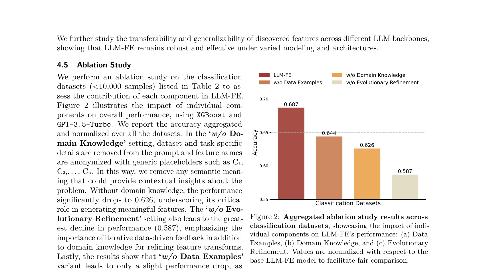
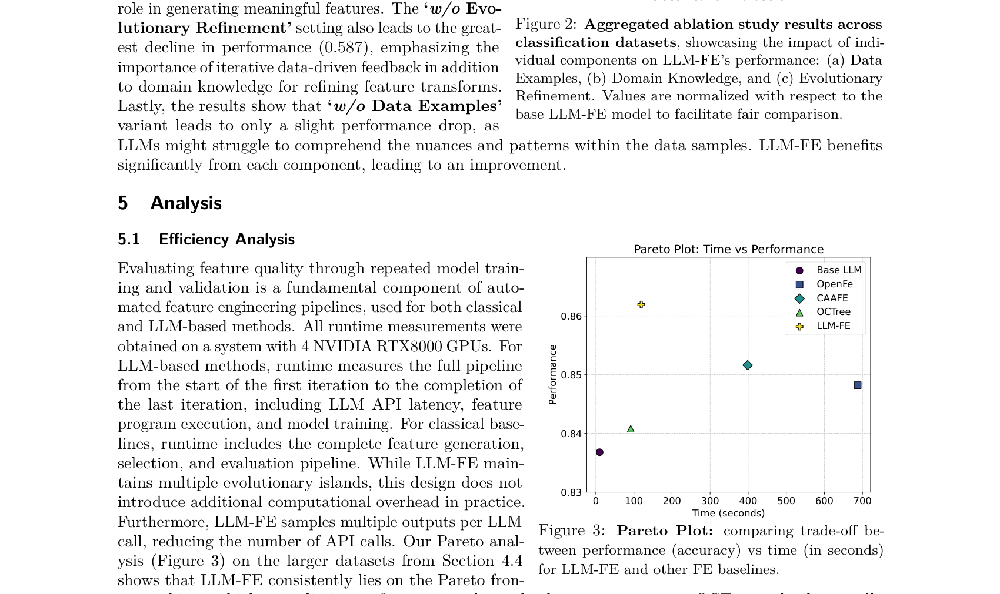
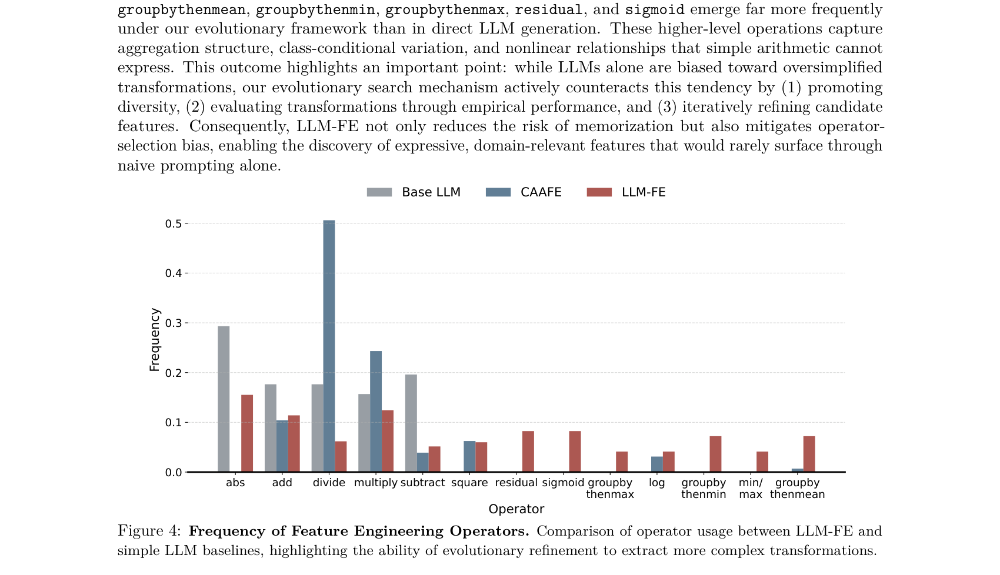
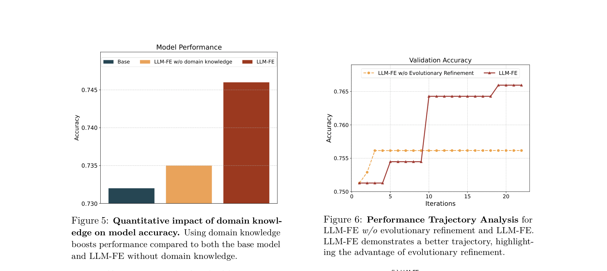
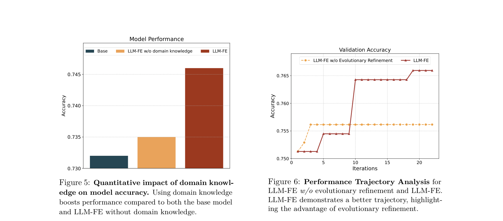
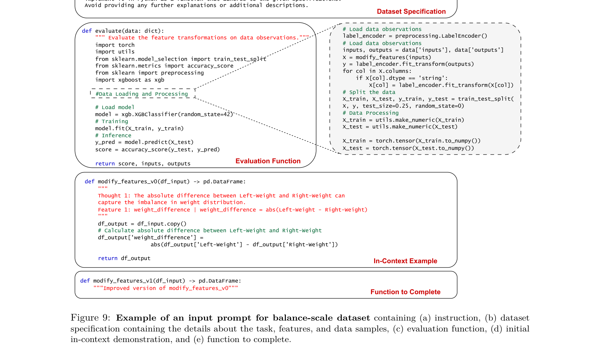
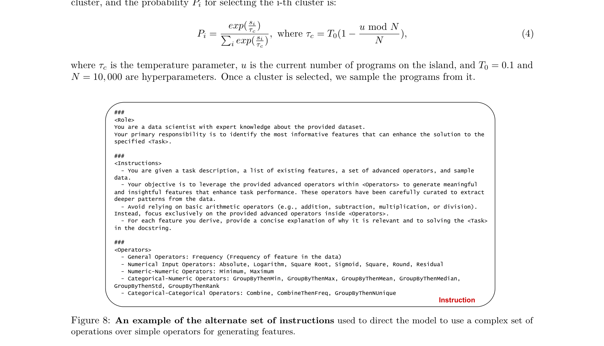
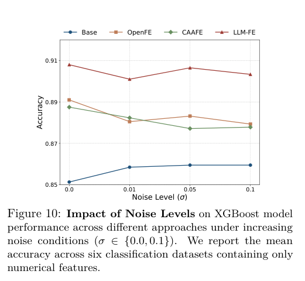
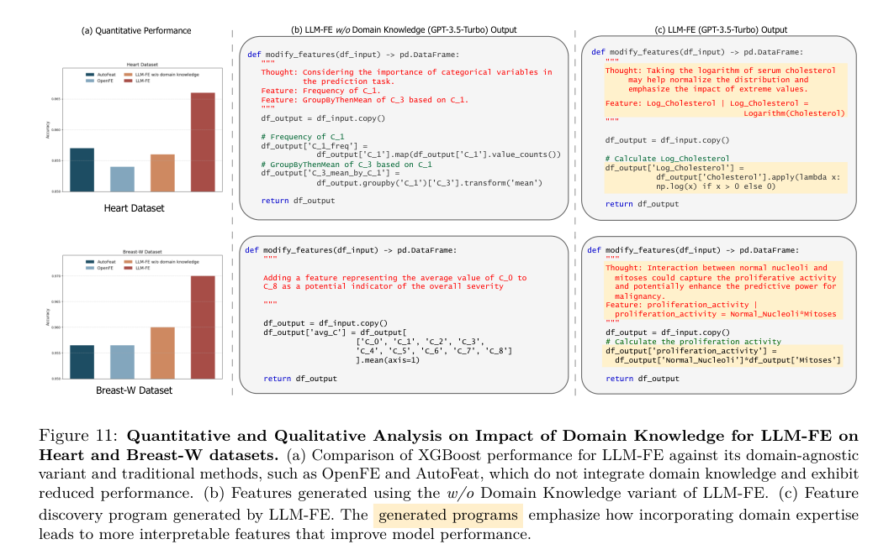
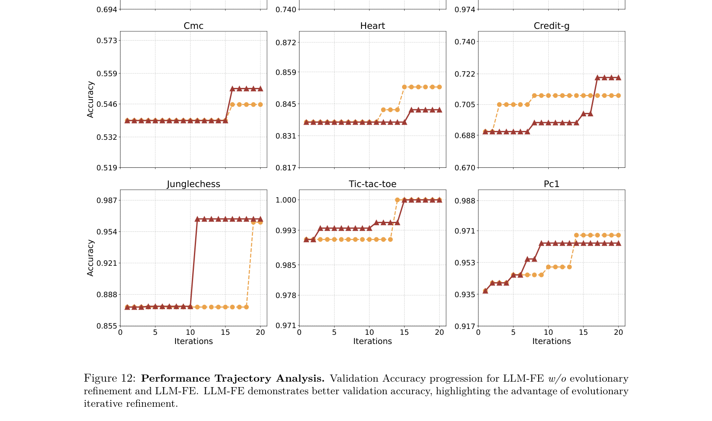

# LLM-FE: Automated Feature Engineering for Tabular Data with LLMs as Evolutionary Optimizers

## Tóm tắt (Abstract)

- **Vai trò của Kỹ thuật Đặc trưng Tự động (Automated Feature Engineering - AutoFE)**:
  - Kỹ thuật đặc trưng tự động đóng vai trò then chốt trong việc cải thiện hiệu năng của mô hình dự đoán (predictive model performance) đối với các tác vụ học máy trên dữ liệu bảng (tabular learning tasks).

- **Hạn chế của các phương pháp AutoFE truyền thống**:
  - Phụ thuộc vào các phép biến đổi tiền định (pre-defined transformations) bên trong các không gian tìm kiếm (search spaces) cố định, được thiết kế thủ công.
  - Thường xuyên bỏ qua tri thức miền (domain knowledge) về ngữ nghĩa thực tế của các thuộc tính dữ liệu.

- **Thách thức của các phương pháp ứng dụng Mô hình Ngôn ngữ Lớn (Large Language Models - LLMs) hiện nay**:
  - *Cơ hội*: Các bước tiến gần đây của LLMs đã cho phép tích hợp tri thức miền phong phú vào quy trình kỹ thuật đặc trưng.
  - *Hạn chế tồn đọng*: Các giải pháp dựa trên LLM hiện thời chủ yếu áp dụng cơ chế gợi ý trực tiếp (direct prompting) hoặc chỉ dựa đơn thuần vào điểm kiểm định (validation scores) để chọn lọc đặc trưng (feature selection).
  - *Hệ quả*: Thất bại trong việc khai thác tri thức tích lũy (insights) từ các thử nghiệm khám phá đặc trưng trước đó, đồng thời chưa thiết lập được lập luận suy diễn có ý nghĩa (meaningful reasoning) liên kết giữa quá trình sinh đặc trưng và hiệu năng thực nghiệm định hướng bởi dữ liệu (data-driven performance).

- **Đề xuất Khung làm việc LLM-FE**:
  - Giới thiệu **LLM-FE**, một khung làm việc mới lạ kết hợp giữa tìm kiếm tiến hóa (evolutionary search) với tri thức miền và năng lực suy luận (reasoning capabilities) của LLM nhằm tự động phát hiện các đặc trưng hiệu quả cho dữ liệu dạng bảng.
  - **Mô hình hóa bài toán**: LLM-FE thiết lập bài toán kỹ thuật đặc trưng dưới dạng bài toán tìm kiếm chương trình (program search problem).
  - **Cơ chế vận hành**: LLM đề xuất lặp đi lặp lại các chương trình biến đổi đặc trưng mới (feature transformation programs), trong khi phản hồi dựa trên dữ liệu (data-driven feedback) đóng vai trò định hướng toàn bộ không gian tìm kiếm.

- **Kết quả Thực nghiệm và Tính Tổng quát hóa (Generalizability)**:
  - Các kết quả thực nghiệm chứng minh LLM-FE vượt trội nhất quán so với các phương pháp cơ sở hiện đại nhất (state-of-the-art baselines).
  - Khẳng định khả năng tổng quát hóa mạnh mẽ trên nhiều kiến trúc mô hình, tác vụ học máy và tập dữ liệu đa dạng.

- **Tính khả dụng của mã nguồn**:
  - Mã nguồn hoàn chỉnh của nghiên cứu được công khai tại: [https://github.com/nikhilsab/LLMFE](https://github.com/nikhilsab/LLMFE).

## 1 Introduction

### Bối cảnh và Thách thức trong Kỹ thuật Đặc trưng Dữ liệu Bảng (Context & Challenges in Tabular Feature Engineering)
- **Tầm quan trọng cốt lõi của kỹ thuật tạo đặc trưng (Feature Engineering - FE)**:
  - Feature engineering (kỹ thuật tạo đặc trưng) là quá trình chuyển đổi raw data (dữ liệu thô) thành các đặc trưng có ý nghĩa phục vụ các mô hình học máy, đóng vai trò then chốt trong việc nâng cao predictive performance (hiệu năng dự đoán), đặc biệt là đối với tabular data (dữ liệu dạng bảng) (Domingos, 2012).
  - Trong nhiều tác vụ dự đoán trên dữ liệu bảng, các đặc trưng được thiết kế tốt giúp nâng cao vượt bậc hiệu năng của tree-based models (các mô hình dựa trên cây như XGBoost), thường vượt trội hơn cả deep learning models (các mô hình học sâu) vốn phụ thuộc vào learned representations (biểu diễn học được) (Grinsztajn et al., 2022).
  - Tuy nhiên, các tác vụ data-centric (lấy dữ liệu làm trung tâm) như kỹ thuật đặc trưng là một trong những quy trình tốn thời gian và tiêu hao tài nguyên tính toán nhất trong tabular learning workflow (quy trình học dữ liệu bảng) (Anaconda, 2020; Hollmann et al., 2024), do đòi hỏi các chuyên gia dữ liệu phải rà soát thủ công giữa không gian tổ hợp khổng lồ của các phép biến đổi khả dĩ.

- **Hạn chế của các phương pháp tự động hóa truyền thống (Classical AutoFE)**:
  - Các phương pháp kỹ thuật đặc trưng cổ điển (Kanter & Veeramachaneni, 2015; Khurana et al., 2016; 2018; Horn et al., 2020; Zhang et al., 2023) xây dựng không gian tìm kiếm rộng lớn các toán tử xử lý đặc trưng và sử dụng các thuật toán tối ưu hóa heuristic để lựa chọn đặc trưng hiệu quả.
  - *Điểm nghẽn*: Không gian tìm kiếm bị giới hạn chặt chẽ bởi các phép biến đổi tiền định (predefined transformations) được thiết kế thủ công, hoàn toàn thiếu khả năng tiếp cận và tích hợp domain knowledge (tri thức miền) (Zhang et al., 2023).
  - *Giá trị của tri thức miền*: Tri thức miền đóng vai trò như một invaluable prior (tiên nghiệm vô giá) giúp định hướng phát hiện các phép biến đổi phù hợp, làm giảm độ phức tạp tìm kiếm và tạo ra các đặc trưng vừa có tính giải thích cao (interpretable) vừa đạt hiệu quả vượt trội (Hollmann et al., 2024).

- **Thách thức của các phương pháp ứng dụng LLM hiện tại**:
  - Sự xuất hiện của Large Language Models (LLMs - các mô hình ngôn ngữ lớn) mang lại cơ hội đột phá nhờ kho tri thức miền phong phú được nhúng sẵn bên trong mô hình.
  - Tuy nhiên, các phương pháp khai thác LLM gần đây (Hollmann et al., 2024; Han et al., 2024) chủ yếu dựa vào direct prompting (câu nhắc trực tiếp) hoặc chỉ sử dụng validation scores (điểm kiểm định) đơn thuần để dẫn dắt quá trình sinh đặc trưng.
  - *Hệ quả*: Các cách tiếp cận này không khai thác được bài học kinh nghiệm từ lịch sử các thử nghiệm khám phá đặc trưng trước đó, dẫn đến việc chưa thể thiết lập mối liên kết suy luận có ý nghĩa giữa quá trình sinh đặc trưng và data-driven performance (hiệu năng định hướng bởi dữ liệu thực nghiệm).

### Khung làm việc Tối ưu hóa Tiến hóa LLM-FE (LLM-FE Evolutionary Optimization Framework)
- **Đề xuất khung làm việc LLM-FE**:
  - Nghiên cứu giới thiệu **LLM-FE**, một khung làm việc mới tích hợp năng lực suy luận của LLM với các mô hình dự đoán dạng bảng và evolutionary search (tìm kiếm tiến hóa) nhằm hiện thực hóa quá trình tối ưu hóa đặc trưng hiệu quả.
  - LLM-FE vận hành theo một vòng lặp kín để sinh và đánh giá các giả thuyết biến đổi đặc trưng, sử dụng phản hồi hiệu năng từ mô hình dự đoán làm phần thưởng (reward) để nâng cao chất lượng đặc trưng.
  - LLM đóng vai trò như một knowledge-guided evolutionary optimizer (bộ tối ưu hóa tiến hóa được dẫn dắt bởi tri thức), thực hiện đột biến (mutating) các chương trình biến đổi đặc trưng thành công trước đó để sinh ra các đặc trưng mới hiệu quả hơn (Meyerson et al., 2024).

- **Cơ chế 4 giai đoạn của chu trình LLM-FE (Hình 1)**:
  - *(a) New Feature Generation (Sinh đặc trưng mới)*: Bắt đầu từ chương trình biến đổi ban đầu, LLM tiếp nhận prompt chứa đặc tả tác vụ, mô tả ngữ nghĩa các cột thuộc tính, và mẫu dữ liệu cụ thể để sinh ra các chương trình khám phá đặc trưng mới dưới dạng mã nguồn Python.
  - *(b) Feature Engineering (Biến đổi đặc trưng)*: Áp dụng chương trình biến đổi lên tập dữ liệu thô để tạo thành tập dữ liệu tăng cường (augmented dataset). Ví dụ: tính toán chỉ số kháng insulin qua công thức $\text{insulin\_resistance} = (\text{glucose} \times \text{insulin}) / 405$ và tương tác $\text{age\_bmi} = \text{age} \times \text{bmi}$.
  - *(c) Feature Evaluation (Đánh giá đặc trưng)*: Huấn luyện mô hình dự đoán (XGBoost, TabPFN, MLP) trên tập dữ liệu tăng cường và đánh giá điểm số (như validation accuracy $0.8034$, $0.8247$, v.v.) trên held-out validation set (tập kiểm định độc lập).
  - *(d) Experience Management (Quản lý kinh nghiệm)*: Lưu trữ các chương trình biến đổi đạt điểm cao vào bộ nhớ dài hạn đa đảo (multi-island memory buffer: Island $1$, Island $2$, $\dots$, Island $k$) để làm in-context demonstrations (mẫu minh họa ngữ cảnh) cho các vòng tinh chỉnh kế tiếp của LLM.
  - **Hình 1.** Tổng quan khung làm việc tối ưu hóa đặc trưng LLM-FE.
    - 
    - **Hình này chứng minh điều gì**
      - Quy trình lặp 4 bước kết hợp LLM, mô hình dự đoán và bộ nhớ tiến hóa đa đảo để tự động sinh và tinh chỉnh đặc trưng.
    - **Từ đâu mà thấy được**
      - Sơ đồ tương tác khép kín: (a) New Feature Generation, (b) Feature Engineering, (c) Feature Evaluation với mô hình ML, và (d) Experience Management qua các đảo lưu trữ (Island 1 đến Island k).

### So sánh với các Phương pháp Hiện có (Comparison with Existing Methods)
- **So sánh đa chiều giữa LLM-FE và các phương pháp cơ sở (Bảng 1)**:
  - Bảng 1 tổng hợp sự khác biệt cốt lõi giữa LLM-FE và các phương pháp kỹ thuật đặc trưng truyền thống lẫn các phương pháp dựa trên LLM theo 4 khía cạnh: Tri thức miền (Domain Knowledge), Dẫn dắt bởi phản hồi (Feedback Driven), Đặc trưng phức tạp (Complex Features), và Tinh chỉnh đa đặc trưng (Multi-Feature Refinement):

| Phương pháp (Method) | Tri thức miền (Domain Knowledge) | Dẫn dắt bởi phản hồi (Feedback Driven) | Đặc trưng phức tạp (Complex Features) | Tinh chỉnh đa đặc trưng (Multi-Feature Refinement) |
| :--- | :---: | :---: | :---: | :---: |
| AutoFeat (Horn et al., 2020) | ✗ | ✗ | ✓ | ✗ |
| OpenFE (Zhang et al., 2023) | ✗ | ✗ | ✓ | ✗ |
| FeatLLM (Han et al., 2024) | ✓ | ✗ | ✗ | ✗ |
| CAAFE (Hollmann et al., 2024) | ✓ | ✓ | ✗ | ✗ |
| OCTree (Nam et al., 2024) | ✓ | ✓ | ✗ | ✗ |
| **LLM-FE** | **✓** | **✓** | **✓** | **✓** |

- **Phân tích ưu thế toàn diện của LLM-FE**:
  - *Hạn chế của phương pháp cổ điển*: AutoFeat và OpenFE hỗ trợ các phép biến đổi toán tử phức tạp nhưng hoàn toàn thiếu tri thức ngữ cảnh miền và không có phản hồi từ mô hình dự đoán downstream.
  - *Hạn chế của phương pháp LLM đi trước*: FeatLLM chỉ sinh các luật nhị phân tĩnh; CAAFE và OCTree có sử dụng phản hồi kiểm định nhưng chỉ sinh các đặc trưng đơn giản (Küken et al., 2024) hoặc bị giới hạn trong việc tinh chỉnh một quy tắc duy nhất tại một thời điểm.
  - *Tính vượt trội của LLM-FE*: Là phương pháp duy nhất tích hợp đồng thời cả 4 tiêu chuẩn, LLM-FE tận dụng tri thức miền từ LLM kết hợp với tối ưu hóa tiến hóa có phản hồi dữ liệu để liên tục sinh và tinh chỉnh các tập đặc trưng phức tạp, đa biến.

- **Hiệu năng thực nghiệm và khả năng chuyển giao**:
  - LLM-FE được đánh giá trên các mô hình ngôn ngữ nền tảng Llama-3.1-8B-Instruct (Dubey et al., 2024) và GPT-3.5-Turbo (OpenAI, 2023) xuyên suốt các tác vụ phân loại và hồi quy trên nhiều tập dữ liệu bảng.
  - Khung làm việc liên tục vượt trội hơn các phương pháp FE tiên tiến nhất, tạo ra các đặc trưng có ý nghĩa ngữ cảnh giúp cải thiện rõ rệt hiệu năng của các mô hình dự đoán dạng bảng phổ biến như XGBoost (Chen & Guestrin, 2016), TabPFN (Hollmann et al., 2023), và MLP (Gorishniy et al., 2021).

### Các Đóng góp Chính của Nghiên cứu (Key Contributions)
- **Mô hình hóa kỹ thuật đặc trưng như bài toán tối ưu hóa tiến hóa**:
  - Giới thiệu LLM-FE, một khung làm việc mới mô hình hóa bài toán kỹ thuật đặc trưng dưới dạng tối ưu hóa tiến hóa được định hướng bởi LLM (LLM-guided evolutionary optimization), kết hợp chặt chẽ tri thức miền, đánh giá dựa trên dữ liệu thực nghiệm, và bộ nhớ dài hạn để phục vụ tinh chỉnh lặp.
- **Hiệu năng vượt trội và tính tổng quát hóa cao (Generalizability)**:
  - Minh chứng qua thực nghiệm rằng LLM-FE vượt trội nhất quán so với các phương pháp cơ sở hiện đại nhất (SOTA baselines), đồng thời thể hiện khả năng tổng quát hóa xuất sắc trên nhiều mô hình dự đoán (predictors) và nhiều mô hình ngôn ngữ nền tảng (LLM backbones) khác nhau.
- **Nghiên cứu cắt bỏ toàn diện (Comprehensive Ablation Study)**:
  - Thực hiện phân tích cắt bỏ chi tiết để chứng minh vai trò thiết yếu của từng thành phần: tri thức miền (domain knowledge), tìm kiếm tiến hóa (evolutionary search), phản hồi định hướng dữ liệu (data-driven feedback), và các mẫu dữ liệu cụ thể (data samples) trong việc dẫn dắt LLM khám phá không gian đặc trưng hiệu quả và phát hiện các đặc trưng có tác động lớn nhất.

## 2 Related Works

### Kỹ thuật đặc trưng (Feature Engineering)
- **Bản chất và mục tiêu của Feature Engineering**: Feature engineering (kỹ thuật đặc trưng) là quá trình tạo ra các đặc trưng có ý nghĩa từ raw data (dữ liệu thô) nhằm nâng cao predictive performance (hiệu năng dự đoán) của mô hình học máy (Hollmann et al., 2024).
- **Nhu cầu tự động hóa**: Độ phức tạp ngày càng gia tăng của các tập dữ liệu đã thúc đẩy sự phát triển của automated feature engineering (kỹ thuật đặc trưng tự động) nhằm cắt giảm công sức thủ công và tối ưu hóa quá trình khám phá đặc trưng.
- **Các phương pháp truyền thống**: Các kỹ thuật tự động hóa truyền thống chủ yếu bao gồm:
  - Tree-based exploration (thám hiểm dựa trên cây)
  - Transformation enumeration (liệt kê phép biến đổi toán tử)
  - Learning-based methods (các phương pháp dựa trên học máy) (Khurana et al., 2016; Kanter & Veeramachaneni, 2015; Nargesian et al., 2017; Zhang et al., 2023).
- **Rào cản của phương pháp truyền thống và tiềm năng của LLM**: Các phương pháp tiếp cận truyền thống thường thất bại trong việc tận dụng domain knowledge (tri thức miền) để phát hiện đặc trưng mới. Ngược lại, Large Language Models (LLMs - các mô hình ngôn ngữ lớn) lại đặc biệt phù hợp cho các bài toán tabular prediction (dự đoán trên dữ liệu dạng bảng) nhờ sở hữu prior contextual domain understanding (hiểu biết ngữ cảnh miền tiên nghiệm) phong phú.

### LLM và Tối ưu hóa (LLMs and Optimization)
- **Khả năng thích ứng không cần huấn luyện lại**: Những bước tiến của LLM chứng minh chúng có thể thích ứng linh hoạt với các tác vụ mới lạ thông qua prompt engineering (kỹ nghệ câu nhắc) và in-context learning (học trong ngữ cảnh) mà không đòi hỏi huấn luyện lại mô hình (Brown et al., 2020; Wei et al., 2022).
- **Hạn chế về tính ổn định và tính chính xác**: Đầu ra của LLM vẫn thường gặp hiện tượng thiếu nhất quán hoặc sai lệch về mặt thực tế (factually incorrect) (Madaan et al., 2024; Zhu et al., 2023), đặt ra yêu cầu cấp thiết về các cơ chế giúp tinh chỉnh (refine) hoặc ổn định hóa kết quả sinh ra.
- **Kết hợp LLM với khung làm việc tiến hóa (Evolutionary Frameworks)**: Một làn sóng nghiên cứu đang phát triển mạnh mẽ đã kết hợp LLM với các bộ đánh giá (evaluators) trong các khuôn khổ lặp hoặc tiến hóa, sử dụng feedback (phản hồi), mutation (đột biến), và crossover (lai ghép) để dẫn đường cho không gian tìm kiếm giải pháp (Lehman et al., 2023; Wu et al., 2024; Meyerson et al., 2024).
- **Các lĩnh vực ứng dụng thành công**: Mô hình tiếp cận này đã đạt được nhiều đột phá trong:
  - Prompt optimization (tối ưu hóa câu nhắc) (Yang et al., 2024b; Guo et al., 2024)
  - Neural architecture search (NAS - tìm kiếm kiến trúc mạng nơ-ron) (Zheng et al., 2023; Chen et al., 2023)
  - Mathematical heuristic discovery (khám phá thuật toán phỏng đoán/heuristic toán học) (Romera-Paredes et al., 2024)
  - Symbolic regression (hồi quy tượng trưng) (Shojaee et al., 2025).
- **Định vị của LLM-FE**: Kế thừa và phát triển định hướng này, khung làm việc LLM-FE hiện thực hóa LLM dưới vai trò là các evolutionary optimizers (bộ tối ưu hóa tiến hóa), kết hợp tri thức tiên nghiệm sâu rộng của mô hình với quy trình tinh chỉnh có hệ thống dựa trên dữ liệu (data-driven refinement) để khám phá các đặc trưng vừa cô đọng (compact), vừa đạt hiệu năng vượt trội.

### LLM cho Học trên dữ liệu bảng (LLMs for Tabular Learning)
- **Tiếp cận LLM trên dữ liệu có cấu trúc**: Việc áp dụng LLM cho structured data (dữ liệu có cấu trúc) thường dựa vào hai hướng chính:
  - Chuyển đổi bảng biểu thành textual representations (biểu diễn dạng văn bản) (Dinh et al., 2022; Hegselmann et al., 2023; Wang et al., 2023).
  - Tùy biến chiến lược tokenization (phân đoạn từ) và pre-training (tiền huấn luyện) chuyên biệt để nâng cao độ bền vững trên dữ liệu bảng (Yan et al., 2024).
- **Ứng dụng trong dự đoán và kỹ thuật đặc trưng trên dữ liệu bảng**:
  - LLM được triển khai dưới các mô hình fine-tuning (tinh chỉnh) hoặc few-shot in-context learning (Hegselmann et al., 2023; Nam et al., 2023).
  - Trực tiếp thực hiện kỹ thuật đặc trưng: FeatLLM sinh các binary rules (luật nhị phân) (Han et al., 2024); CAAFE tận dụng bản mô tả tác vụ để sinh các đặc trưng theo ngữ cảnh (Hollmann et al., 2024); OCTree tinh chỉnh lặp các đặc trưng thông qua suy luận cây quyết định (decision tree reasoning) (Nam et al., 2024).
- **Điểm nghẽn của các phương pháp đi trước**: Các phương pháp trên chủ yếu dựa vào việc tinh chỉnh tăng dần trên một ứng viên duy nhất (incremental refinement of a single candidate), dễ dẫn đến bế tắc cục bộ và hạn chế không gian tìm kiếm.
- **Cơ chế đột phá của LLM-FE**:
  - LLM-FE duy trì một diverse pool (bể chứa đa dạng) các chương trình biến đổi tiềm năng.
  - Sử dụng evolutionary search (tìm kiếm tiến hóa) để duyệt qua feature space (không gian đặc trưng) một cách hiệu quả.
  - Tận dụng mutation (đột biến) và crossover (lai ghép) để khai phá các phép biến đổi vừa có căn cứ dữ liệu (data-driven) vừa có khả năng diễn giải cao (interpretable transformations).
- **Giá trị cốt lõi**: Thiết kế này giúp phát hiện các đặc trưng không chỉ cải thiện độ chính xác dự đoán mà còn hoàn toàn dễ hiểu đối với con người, thu hẹp khoảng cách giữa domain-informed reasoning (suy luận dựa trên tri thức miền) và quá trình tối ưu hóa thực nghiệm. Phụ lục A (Appendix A) phân tích rõ hơn sự khác biệt định tính giữa LLM-FE và các phương pháp baseline.

## 3 LLM-FE Approach

### 3.1 Problem Formulation

- **Ký hiệu hình thức và định nghĩa tập dữ liệu dạng bảng (Tabular Dataset Formulation)**:
  - Một tập dữ liệu dạng bảng (tabular dataset) $\mathcal{D}$ bao gồm $N$ hàng (instances - mẫu dữ liệu), mỗi hàng được đặc trưng bởi $d$ cột (features - đặc trưng).
  - Mỗi mẫu dữ liệu $x_i$ là một vector đặc trưng $d$-chiều ($d$-dimensional feature vector) với tập hợp tên đặc trưng tương ứng được ký hiệu là $C = \{c_j\}_{j=1}^d$.
  - Tập dữ liệu đi kèm với siêu dữ liệu (metadata) $M$, bao gồm các mô tả ngữ nghĩa của từng đặc trưng (feature descriptions) và thông tin chuyên biệt của tác vụ (task-specific information).
  - Đối với các tác vụ học có giám sát (supervised learning tasks), mỗi mẫu dữ liệu $x_i$ liên kết với một nhãn mục tiêu tương ứng $y_i$:
    - $y_i \in \{0, 1, \dots, K\}$ đối với bài toán phân loại (classification tasks) có $K$ lớp.
    - $y_i \in \mathbb{R}$ đối với bài toán hồi quy (regression tasks).

- **Mục tiêu kỹ thuật đặc trưng và không gian biểu diễn tăng cường (Feature Engineering Objective)**:
  - Cho một tập dữ liệu dạng bảng có gán nhãn $\mathcal{D} = \{(x_i, y_i)\}_{i=1}^N$ và một mô hình dự đoán (prediction model) $f$ thực hiện ánh xạ từ không gian đặc trưng đầu vào $\mathcal{X}$ sang không gian nhãn tương ứng $\mathcal{Y}$.
  - Mục tiêu của kỹ thuật đặc trưng (feature engineering) là xác định một chương trình biến đổi đặc trưng tối ưu (optimal feature transformation program) $T$.
  - Chương trình $T$ thực hiện ánh xạ không gian đặc trưng gốc $\mathcal{X}$ sang một biểu diễn tăng cường (augmented representation) $T(\mathcal{X})$, từ đó cải thiện hiệu năng dự đoán (predictive performance) khi huấn luyện mô hình hạ nguồn (downstream model).

- **Thiết lập bài toán tối ưu hai cấp (Bilevel Optimization Formulation)**:
  - Nhiệm vụ kỹ thuật đặc trưng được định nghĩa một cách chặt chẽ dưới dạng bài toán tối ưu hai cấp (bilevel optimization problem):
    $$\max_{T} E(f^*(T(X_{\text{val}})), Y_{\text{val}}) \quad (1)$$
    thỏa mãn điều kiện (subject to):
    $$f^* \in \arg\min_{f} \mathcal{L}_f(f(T(X_{\text{tr}})), Y_{\text{tr}}) \quad (2)$$
  - Các thành phần trong công thức tối ưu hóa:
    - $(X_{\text{tr}}, Y_{\text{tr}})$ là tập con huấn luyện (sub-training set) và $(X_{\text{val}}, Y_{\text{val}})$ là tập kiểm định (validation set), cả hai đều được phân tách từ tập dữ liệu huấn luyện $(X_{\text{train}}, Y_{\text{train}})$.
    - $\mathcal{L}_f$ là hàm mất mát (loss function) dùng để huấn luyện mô hình dự đoán $f$ trên tập dữ liệu con đã qua biến đổi $T(X_{\text{tr}})$.
    - $E(\cdot, \cdot)$ là thước đo đánh giá hiệu năng (evaluation metric) của mô hình tối ưu $f^*$ trên tập kiểm định $T(X_{\text{val}})$.
    - Sau khi xác định được chương trình biến đổi đặc trưng, mô hình dự đoán $f^*$ được huấn luyện trên toàn bộ tập dữ liệu huấn luyện đã biến đổi $T(X_{\text{train}})$ nhằm tối thiểu hóa tổn thất.

- **Cơ chế sinh chương trình thông qua Mô hình Ngôn ngữ Lớn (LLM-Based Program Generation)**:
  - Chương trình biến đổi đặc trưng $T$ được sinh ra bởi một Mô hình Ngôn ngữ Lớn (LLM) $\pi_\theta$ phụ thuộc vào câu nhắc (prompt) $p$.
  - Các chương trình ứng viên (candidate programs) được lấy mẫu theo phân phối:
    $$T \sim \pi_\theta(p)$$
  - Prompt $p$ được xây dựng có cấu trúc từ ba thành phần:
    - Siêu dữ liệu tập dữ liệu $M$ (dataset metadata).
    - Các mẫu dữ liệu thực tế $X$ (data samples).
    - Các chương trình đạt điểm cao từ các vòng lặp trước đó (high-scoring programs from prior iterations) nhằm cung cấp gợi ý ngữ cảnh (chi tiết tại Mục 3.2).

- **Phương pháp xấp xỉ bằng tìm kiếm tiến hóa (Evolutionary Search Approximation)**:
  - Mục tiêu tối ưu hai cấp trong Phương trình (1)–(2) là bài toán bất khả quy / không thể giải trực tiếp (intractable) do không gian tổ hợp (combinatorial space) của các chương trình biến đổi đặc trưng là vô cùng lớn.
  - LLM-FE giải quyết thách thức này bằng cách xấp xỉ nghiệm thông qua tìm kiếm tiến hóa (evolutionary search) tại mỗi vòng lặp (tham khảo Thuật toán 1):
    - LLM $\pi_\theta$ đề xuất tập hợp các chương trình ứng viên $\{T_j\}$ dựa trên điều kiện của prompt $p$.
    - Mỗi chương trình ứng viên $T_j$ được đánh giá bằng cách huấn luyện mô hình $f^*$ trên tập $T_j(X_{\text{tr}})$ và tính điểm đánh giá trên tập $T_j(X_{\text{val}})$.
    - Điểm số kiểm định này đóng vai trò là tín hiệu độ thích nghi (fitness signal) dẫn dắt quá trình tinh chỉnh lặp (iterative refinement) trong các thế hệ kế tiếp.

### 3.2 Sinh Đặc trưng (Feature Generation)

- **Tổng quan về bước sinh đặc trưng**:
  - Bước sinh đặc trưng sử dụng một Mô hình Ngôn ngữ Lớn (Large Language Model - LLM) để khởi tạo nhiều chương trình biến đổi đặc trưng mới (feature transformation programs) (được minh họa trực quan tại Figure 1(a)).
  - Quá trình này tận dụng tri thức tiền định (prior knowledge), khả năng suy luận (reasoning) và năng lực học trong ngữ cảnh (in-context learning) của mô hình để khám phá không gian đặc trưng (feature space) một cách hiệu quả.

#### 3.2.1 Prompt Đầu vào (Input Prompt)

- **Phương pháp luận thiết kế prompt có cấu trúc (Structured Prompting Methodology)**:
  - Nhằm hỗ trợ việc tạo ra các chương trình khám phá đặc trưng vừa hiệu quả vừa phù hợp với ngữ cảnh, nghiên cứu phát triển một phương pháp thiết kế prompt có cấu trúc chặt chẽ.
  - Prompt được thiết kế nhằm cung cấp toàn diện: thông tin đặc thù của dữ liệu (data-specific information), một chương trình biến đổi đặc trưng khởi đầu làm điểm xuất phát cho tiến hóa (initial feature transformation program), một hàm đánh giá (evaluation function), và một định dạng đầu ra được định nghĩa rõ ràng (xem thêm chi tiết tại Appendix B.1).
  - Prompt đầu vào $p$ bao gồm 4 thành phần then chốt:
- **Chỉ dẫn (Instruction)**:
  - LLM được giao nhiệm vụ tìm kiếm các đặc trưng phù hợp nhất để hỗ trợ giải quyết tác vụ cho trước.
  - Tác vụ nhấn mạnh việc khai thác tri thức tiền định của LLM về miền dữ liệu (dataset's domain) để tạo ra các đặc trưng.
  - LLM được chỉ dẫn rõ ràng phải tạo ra các đặc trưng mới lạ (novel features) và cung cấp lập luận từng bước (step-by-step reasoning) minh bạch về mức độ liên quan của chúng đối với tác vụ dự đoán.
  - Do LLM thường có xu hướng thiên lệch tạo ra các đặc trưng đơn giản, prompt chỉ dẫn đặc biệt yêu cầu LLM phải sinh ra các đặc trưng phức tạp (complex features).
- **Đặc tả Tập dữ liệu (Dataset Specification)**:
  - Sau phần chỉ dẫn, LLM được cung cấp thông tin đặc thù của tập dữ liệu trích xuất từ siêu dữ liệu (metadata) $M$.
  - Thông tin này bao gồm mô tả chi tiết về tác vụ hạ nguồn dự kiến (downstream task), đi kèm danh sách tên các đặc trưng $C$ và các phần mô tả tương ứng của từng thuộc tính.
  - Ngoài ra, một số lượng giới hạn các mẫu dữ liệu đại diện từ tập dữ liệu dạng bảng cũng được cung cấp trong prompt.
  - Để nâng cao khả năng diễn giải dữ liệu hiệu quả của mô hình, phương pháp áp dụng kỹ thuật tuần tự hóa (serialization approach) tương tự các nghiên cứu trước (Dinh et al., 2022; Hegselmann et al., 2023; Han et al., 2024):
    $$\text{Serialize}(x_i, y_i, C) = \text{‘If } c_1 \text{ is } x_i^1, \dots, c_d \text{ is } x_i^d. \text{ Then Result is } y_i\text{’} \tag{3}$$
  - Việc cung cấp các chi tiết đặc thù của tập dữ liệu giúp định hướng mô hình ngôn ngữ tập trung vào các đặc trưng thích hợp nhất về mặt ngữ cảnh, trực tiếp hỗ trợ tập dữ liệu và mục tiêu tác vụ.
- **Hàm Đánh giá (Evaluation Function)**:
  - Hàm đánh giá được tích hợp trực tiếp vào prompt để dẫn dắt mô hình ngôn ngữ sinh ra các chương trình biến đổi đặc trưng bám sát các mục tiêu hiệu năng (performance objectives).
  - Các chương trình này thực hiện tăng cường tập dữ liệu gốc bằng các đặc trưng mới; chất lượng của chúng được đánh giá dựa trên hiệu năng của một mô hình dự đoán được huấn luyện trên dữ liệu tăng cường đó.
  - Điểm số đánh giá của mô hình trên tập kiểm định tăng cường (augmented validation set) đóng vai trò là thước đo chất lượng đặc trưng.
  - Nhờ việc nhúng hàm đánh giá vào prompt, LLM có thể sinh ra các chương trình vốn dĩ đã tương thích chặt chẽ với các tiêu chí hiệu năng mong muốn.
- **Mẫu Minh họa theo Ngữ cảnh (In-Context Demonstration)**:
  - Cụ thể, phương pháp lấy mẫu $k$ mẫu minh họa có hiệu năng cao nhất từ các vòng lặp trước đó, cho phép LLM kế thừa và phát triển từ các kết quả thành công.
  - Sự tương tác lặp đi lặp lại giữa đầu ra sinh của LLM và phản hồi từ bộ đánh giá (được định hướng bởi các ví dụ này) tạo điều kiện thuận lợi cho một quy trình tinh chỉnh có hệ thống (systematic refinement process).
  - Qua từng vòng lặp, LLM liên tục cải thiện chất lượng đầu ra bằng cách tận dụng các quy luật (patterns) và tri thức sâu sắc (insights) đã được đúc kết từ những mẫu minh họa thành công trước đó.

#### 3.2.2 Lấy Mẫu Đặc trưng (Feature Sampling)

- **Quy trình sinh và lấy mẫu chương trình tại mỗi vòng lặp**:
  - Tại mỗi vòng lặp $t$, prompt $p_t$ được xây dựng bằng cách lấy mẫu từ vòng lặp trước đó để làm đầu vào cho LLM $\pi_\theta$, từ đó tạo ra đầu ra $T_1, \dots, T_b = \pi_\theta(p_t)$ đại diện cho một tập hợp gồm $b$ chương trình được lấy mẫu.
- **Cân bằng giữa khám phá (exploration) và khai thác (exploitation)**:
  - Nhằm thúc đẩy tính đa dạng và duy trì sự cân bằng tối ưu giữa khám phá (exploration / tính sáng tạo) và khai thác (exploitation / tri thức tiền định), phương pháp áp dụng cơ chế lấy mẫu ngẫu nhiên dựa trên nhiệt độ (stochastic temperature-based sampling).
- **Lọc và kiểm tra tính khả thi trước đánh giá**:
  - Mỗi phép biến đổi đặc trưng được lấy mẫu ($T_i$) đều phải trải qua bước thực thi thử nghiệm trước khi tiến hành đánh giá nhằm loại bỏ các chương trình dễ phát sinh lỗi (error-prone programs).
  - Cơ chế này đảm bảo chỉ những chương trình biến đổi đặc trưng hợp lệ, có khả năng thực thi mới được xem xét trong đường ống tối ưu hóa (optimization pipeline).
- **Kiểm soát chi phí tính toán (Computational Efficiency)**:
  - Để đảm bảo hiệu quả về mặt tài nguyên tính toán, một ngưỡng thời gian thực thi tối đa (maximum execution time threshold) được áp dụng nghiêm ngặt; bất kỳ chương trình nào chạy vượt quá ngưỡng thời gian này đều bị loại bỏ ngay lập tức.

### 3.3 Data-Driven Evaluation

- **Tăng cường tập dữ liệu bằng đặc trưng mới sinh**:
  - Các đặc trưng do mô hình ngôn ngữ lớn (LLM - Large Language Model) tạo ra được sử dụng để tăng cường (augment) tập dữ liệu gốc, tích hợp các đặc trưng phái sinh mới (derived features) vào không gian dữ liệu ban đầu (minh họa tại Figure 1(b)).
- **Quy trình đánh giá đặc trưng gồm hai giai đoạn (two-stage feature evaluation process)**:
  - Tương tự phương pháp tiếp cận trong Hollmann et al. (2024) và Nam et al. (2024), quy trình đánh giá chất lượng đặc trưng được chia thành hai giai đoạn kế tiếp:
    - **(i) Huấn luyện mô hình trên tập dữ liệu đã tăng cường (model training on the augmented dataset)**:
      - Khớp mô hình dự đoán dữ liệu dạng bảng (tabular predictive model) $f^*$ trên tập huấn luyện con đã biến đổi $T(X_{\text{tr}})$ bằng cách cực tiểu hóa hàm mất mát $\mathcal{L}_f$ (loss function) theo bài toán tối ưu cấp dưới (xem Eq. 1 và Eq. 2):
        $$f^* \in \arg\min_f \mathcal{L}_f(f(T(X_{\text{tr}})), Y_{\text{tr}})$$
    - **(ii) Đánh giá hiệu năng để xác định chất lượng đặc trưng (performance assessment for feature quality)**:
      - Đo lường chất lượng của các chương trình biến đổi đặc trưng $T$ do LLM tạo ra (Figure 1(c)) thông qua việc tính toán hiệu năng dự đoán của mô hình $f^*$ trên tập kiểm định đã tăng cường $T(X_{\text{val}})$ (augmented validation set) (xem Eq. 1 và Eq. 2):
        $$\max_T E(f^*(T(X_{\text{val}})), Y_{\text{val}})$$
- **Mục tiêu tối ưu hóa hiệu năng dự đoán**:
  - Tương tự bài toán tối ưu hai cấp (bilevel optimization) đã trình bày trong Section 3.1, mục tiêu cốt lõi là xác định các phép biến đổi đặc trưng tối ưu nhằm tối đa hóa thước đo hiệu năng $E$:
    - Sử dụng độ chính xác (accuracy) cho bài toán phân loại (classification).
    - Sử dụng các thước đo sai số (error metrics, ví dụ RMSE) cho bài toán hồi quy (regression).
  - Điểm số đánh giá trên tập kiểm định đóng vai trò là tín hiệu phản hồi dựa trên dữ liệu (data-driven feedback / fitness score) để định hướng quá trình sàng lọc và tinh chỉnh tiến hóa trong các vòng lặp tiếp theo.

### 3.4 Experience Management

- **Mục tiêu và Vai trò của Quản lý Kinh nghiệm (Experience Management)**:
  - Khắc phục sự bế tắc tại các cực trị địa phương (local optima) và thúc đẩy việc khám phá các đặc trưng đa dạng (diverse feature discovery).
  - Ứng dụng cơ chế **quản lý kinh nghiệm tiến hóa đa quần thể (evolutionary multi-population experience management)** (minh họa tại Figure 1(d)) nhằm lưu trữ các chương trình khám phá đặc trưng (feature discovery programs) vào một cơ sở dữ liệu chuyên dụng.
  - Sử dụng các mẫu trích xuất từ cơ sở dữ liệu này để cấu trúc các ví dụ ngữ cảnh (in-context examples) cung cấp cho mô hình ngôn ngữ lớn (LLM - Large Language Model), từ đó hỗ trợ LLM sinh ra các biến đổi đặc trưng mới lạ.
  - Quy trình quản lý kinh nghiệm gồm hai thành phần cốt lõi:
    - **(i) Bộ nhớ đa quần thể (multi-population memory)**: Duy trì một bộ đệm bộ nhớ dài hạn (long-term memory buffer) chứa các chương trình đã đánh giá.
    - **(ii) Lấy mẫu từ bộ đệm bộ nhớ (sampling from memory buffer)**: Chọn lọc các chương trình tiêu biểu từ bộ đệm để xây dựng các mẫu minh họa ngữ cảnh (in-context example demonstrations).
  - Sau khi đánh giá các phép biến đổi đặc trưng tại vòng lặp (iteration) $t$, cặp phép biến đổi và điểm số $(T, s)$ được lưu trữ vào bộ đệm quần thể $P_t$ để tinh chỉnh quá trình tìm kiếm lặp qua từng thế hệ.

- **Mô hình Đa Quần thể Đảo (Multi-Population 'Island' Model)**:
  - Để tiến hóa quần thể chương trình một cách hiệu quả, LLM-FE áp dụng mô hình đa quần thể lấy cảm hứng từ mô hình đảo ('island' model) (Cranmer, 2023; Romera-Paredes et al., 2024; Shojaee et al., 2025).
  - Quần thể chương trình được phân chia thành $m$ đảo độc lập (independent islands):
    - Mỗi đảo đều có quyền truy cập vào toàn bộ tập đặc trưng gốc (original feature set) ban đầu, nhưng thực hiện tiến hóa hoàn toàn riêng biệt.
    - Mỗi đảo được khởi tạo bằng một bản sao của ví dụ mẫu ban đầu từ người dùng (user's initial example, xem Figure 9(d)).
  - Cho phép khám phá song song (parallel exploration) không gian đặc trưng, giảm thiểu nguy cơ mắc kẹt trong các giải pháp dưới mức tối ưu (suboptimal solutions).
  - Quy trình chọn đảo và cập nhật nghiệm:
    - Tại mỗi vòng lặp $t$, hệ thống chọn ngẫu nhiên một trong số $m$ đảo và lấy mẫu các chương trình từ bộ đệm bộ nhớ của đảo đó để cập nhật prompt với các ví dụ ngữ cảnh mới.
    - Đánh giá $b$ mẫu đặc trưng mới sinh; nếu điểm số $s_j$ của mẫu mới vượt qua điểm số tốt nhất hiện tại, cặp đặc trưng - điểm số $(T_j, s_j)$ sẽ được nạp bổ sung vào chính hòn đảo đã dùng để lấy mẫu ví dụ ngữ cảnh.

- **Phân cụm theo Chữ ký Chương trình (Program Signature Clustering) và Chọn lọc Boltzmann (Boltzmann Sampling)**:
  - **Bảo toàn tính đa dạng quần thể (Preserving Diversity)**: Để đảm bảo các chương trình có đặc tính hiệu năng khác nhau cùng được duy trì trong bộ đệm, các chương trình trong mỗi đảo được phân cụm dựa trên **chữ ký chương trình (program signature)**, định nghĩa bởi điểm hiệu năng kiểm định (validation performance score) $s$.
    - Cụ thể: các chương trình biến đổi đặc trưng tạo ra điểm kiểm định giống hệt nhau sẽ được gộp chung vào cùng một cụm (cluster).
  - **Quy trình lấy mẫu hai giai đoạn (Two-step sampling mechanism)** (theo Romera-Paredes et al., 2024; Shojaee et al., 2025):
    - Giai đoạn 1: Lấy mẫu từ một trong số $m$ đảo khả dụng.
    - Giai đoạn 2: Lấy mẫu $k$ chương trình từ đảo đã chọn để tạo các ví dụ ngữ cảnh $k$-shot ($k$-shot in-context examples) cho LLM (chi tiết tại Appendix B.1).
  - **Cơ chế chọn lọc cụm Boltzmann (Boltzmann cluster selection)** (De La Maza & Tidor, 1992):
    - Gán xác suất lựa chọn cao hơn cho các cụm có điểm số trung bình cao hơn theo phân phối xác suất dựa trên điểm số:
      $$P_i = \frac{\exp(s_i / \tau_c)}{\sum_i \exp(s_i / \tau_c)}$$
      trong đó:
      - $s_i$ biểu thị điểm số trung bình (mean score) của cụm thứ $i$.
      - $\tau_c$ là tham số nhiệt độ (temperature parameter).
    - Tham số nhiệt độ $\tau_c$ kiểm soát sự đánh đổi giữa khám phá và khai thác (exploration–exploitation trade-off):
      - $\tau_c$ thấp: tập trung phần lớn khối lượng xác suất vào cụm có điểm số cao nhất (khai thác - exploitation).
      - $\tau_c$ cao: phân bổ khối lượng xác suất đồng đều hơn giữa các cụm (khám phá - exploration).
  - Các chương trình biến đổi đặc trưng được lấy mẫu từ bộ đệm bộ nhớ sau đó được ghép vào prompt làm ví dụ ngữ cảnh để định hướng LLM sinh ra các biến đổi đặc trưng hiệu quả hơn (chi tiết chiến lược quản lý bộ nhớ, quy trình phân cụm và cơ chế lấy mẫu được trình bày tại Appendix B.1).

- **Thuật toán Khung LLM-FE (Algorithm 1: LLM-FE Pseudocode)**:
  - Cấu trúc giả mã quy trình tìm kiếm tiến hóa của LLM-FE:
    ```text
    Algorithm 1 LLM-FE
    Require: Dataset D, Metadata M, Iterations T, Model f, LLM π_θ, Metric E
     1: P_0 ← BufferInit()
     2: T*, s* ← null, -∞
     3: p ← UpdatePrompt(D, M)
     4: for t = 1 to T do
     5:     p_t ← p + P_{t-1}.topk()
     6:     {T_j}_{j=1}^b ← π_θ(p_t)
     7:     for j = 1 to b do
     8:         s_j ← FeatureScore(f, T_j, D, E)
     9:         if s_j > s* then
    10:             T*, s* ← T_j, s_j
    11:         end if
    12:         P_t ← UpdateBuffer(P_{t-1}, Tj, sj)
    13:     end for
    14: end for
    15: return T*, s*
    ```
  - **Chi tiết các bước thực thi tuần tự của thuật toán**:
    - **Bước 1 (Khởi tạo - Initialization)**:
      - Gọi hàm `BufferInit()` để khởi tạo bộ đệm bộ nhớ $P_0$ với quần thể ban đầu chứa một phép biến đổi đặc trưng đơn giản, đóng vai trò điểm xuất phát cho tìm kiếm tiến hóa các chương trình biến đổi đặc trưng ở các bước kế tiếp.
      - Thiết lập nghiệm tối ưu ban đầu $T^* \leftarrow \text{null}$, điểm số tối ưu $s^* \leftarrow -\infty$.
      - Xây dựng prompt cơ sở $p \leftarrow \text{UpdatePrompt}(D, M)$ dựa trên tập dữ liệu $D$ và siêu dữ liệu $M$.
    - **Bước 2 (Vòng lặp tiến hóa - Evolutionary loop qua $t = 1 \dots T$)**:
      - Áp dụng hàm `topk()` để lấy mẫu $k$ ví dụ in-context từ quần thể thế hệ trước $P_{t-1}$, cập nhật prompt: $p_t \leftarrow p + P_{t-1}.\text{topk}()$.
      - Truy vấn mô hình ngôn ngữ lớn $\pi_\theta(p_t)$ bằng prompt đã cập nhật để lấy mẫu $b$ chương trình biến đổi đặc trưng mới $\{T_j\}_{j=1}^b$.
      - Với từng chương trình ứng viên $T_j$ ($j = 1 \dots b$):
        - Đánh giá chất lượng bằng hàm `FeatureScore(f, T_j, D, E)` theo quy trình Đánh giá Dựa trên Dữ liệu (Section 3.3).
        - Nếu điểm số $s_j$ vượt trội hơn kỷ lục hiện tại $s^*$, cập nhật nghiệm tốt nhất: $T^* \leftarrow T_j$ và $s^* \leftarrow s_j$.
        - Cập nhật bộ đệm bộ nhớ thông qua `UpdateBuffer(P_{t-1}, Tj, sj)` để hình thành quần thể thế hệ $P_t$.
    - **Bước 3 (Trả về kết quả tối ưu - Return optimal solution)**:
      - Sau khi hoàn thành $T$ vòng lặp tiến hóa, thuật toán trả về chương trình đạt điểm cao nhất $T^*$ từ $P_t$ cùng điểm số tương ứng $s^*$ làm giải pháp tối ưu tìm được cho bài toán.

- **Cơ chế Tiến hóa Ngầm định qua Gợi ý Ngữ cảnh (Implicit Evolution via Prompt-Conditioned Generation)**:
  - LLM-FE sử dụng cơ chế tìm kiếm lặp (iterative search) để hoàn thiện và nâng cao chất lượng các chương trình bằng cách khai thác tối đa năng lực của LLM.
  - Thông qua việc học hỏi từ kho kinh nghiệm liên tục tiến hóa trong bộ đệm, LLM tự định hướng không gian tìm kiếm về phía các giải pháp hiệu quả cao.
  - **Khác biệt bản chất so với các thuật toán tiến hóa cổ điển (classical evolutionary algorithms)**:
    - Thuật toán tiến hóa cổ điển: áp dụng các toán tử đột biến (mutation) hoặc lai ghép (crossover) một cách tường minh (explicit).
    - LLM-FE: thực hiện quá trình tiến hóa một cách ngầm định (implicitly) thông qua cơ chế sinh có điều kiện định hướng bởi prompt (prompt-conditioned generation).
    - Các chương trình thành công ở các thế hệ trước, khi được đưa vào prompt dưới dạng các ví dụ in-context, sẽ định hướng LLM tự động tạo ra các biến thể cải tiến của từng chương trình đơn lẻ cũng như lai ghép, kết hợp các đặc trưng ưu việt từ nhiều chương trình khác nhau.

## 4 Experimental Setup

- **Phạm vi và mục tiêu đánh giá thực nghiệm (Scope and Objectives of Experimental Evaluation)**:
  - LLM-FE được đánh giá trên một dải rộng các tập dữ liệu dạng bảng (tabular datasets), bao quát cả tác vụ phân loại (classification tasks) lẫn tác vụ hồi quy (regression tasks).
  - Khung phân tích thực nghiệm bao gồm:
    - Các phép so sánh định lượng (quantitative comparisons) đối chiếu với các phương pháp đối chuẩn (baselines).
    - Các nghiên cứu cắt bỏ chi tiết (detailed ablation studies) nhằm thẩm định đóng góp của từng thành phần trong phương pháp.

- **Các mô hình dự đoán dữ liệu bảng đại diện cho các họ kiến trúc khác biệt (Tabular Predictive Models Evaluated)**:
  - Phương pháp tiếp cận được thẩm định trên 3 mô hình dự đoán dữ liệu bảng tiêu biểu với các cấu trúc kiến trúc hoàn toàn riêng biệt:
    - **(1) XGBoost**: Mô hình dựa trên cấu trúc cây (tree-based model) (Chen & Guestrin, 2016).
    - **(2) MLP**: Mô hình mạng nơ-ron (neural model) (Gorishniy et al., 2021).
    - **(3) TabPFN**: Mô hình nền tảng dựa trên kiến trúc transformer (transformer-based foundation model) (Hollmann et al., 2023; Vaswani et al., 2017).

- **Hiệu quả tổng quan của các đặc trưng do LLM-FE sinh ra**:
  - Các kết quả thực nghiệm làm nổi bật năng lực của LLM-FE trong việc tự động kiến tạo các đặc trưng hiệu quả (effective features).
  - Các đặc trưng mới này cải thiện một cách nhất quán hiệu năng dự đoán trên nhiều họ mô hình và tập dữ liệu khác nhau.

### 4.1 Baselines

- **Tập hợp các phương pháp đối chuẩn (baselines) được đưa vào so sánh**:
  - LLM-FE được đánh giá so sánh trực tiếp với các phương pháp feature engineering (kỹ thuật đặc trưng) tiên tiến nhất (state-of-the-art).
  - Nhóm phương pháp truyền thống: Bao gồm OpenFE (Zhang et al., 2023) và AutoFeat (Horn et al., 2020).
  - Nhóm phương pháp dựa trên LLM (LLM-based methods): Bao gồm CAAFE (Hollmann et al., 2024), FeatLLM (Han et al., 2024), và OCTree (Nam et al., 2024).
- **Cấu hình mô hình dự đoán và mô hình ngôn ngữ lớn nền tảng mặc định**:
  - **Mô hình dự đoán dữ liệu dạng bảng mặc định (default tabular data prediction model)**: XGBoost được lựa chọn làm mô hình dự đoán mặc định cho toàn bộ các thử nghiệm so sánh với các baselines.
  - **LLM backbone (mô hình ngôn ngữ lớn nền tảng) mặc định**: GPT-3.5-Turbo được sử dụng làm mô hình nền tảng mặc định cho tất cả các phương pháp tiếp cận dựa trên LLM (Tables 2 và 3).
- **Thiết lập giao thức thực nghiệm đảm bảo tính công bằng (fair comparison)**:
  - **Ngân sách lấy mẫu cố định (fixed budget)**: Mọi phương pháp tiếp cận dựa trên LLM đều vận hành dưới một ngân sách giới hạn cố định là 20 LLM samples (mẫu sinh LLM).
  - **Không áp dụng điều kiện dừng**: Quá trình tìm kiếm không sử dụng early stopping (dừng sớm) hay bất kỳ convergence criterion (tiêu chí hội tụ) nào.
  - **Tiêu chuẩn kết quả báo cáo cuối cùng**: Điểm số được công bố đại diện cho best-scoring program (chương trình đạt điểm số cao nhất) được khám phá trong phạm vi ngân sách 20 mẫu này.
- **Tài liệu tham khảo chi tiết triển khai**: Appendix B.2 cung cấp thêm các chi tiết triển khai bổ sung (additional implementation details).

### 4.2 Datasets

- **Tiêu chí lựa chọn và nguồn gốc tập dữ liệu (Dataset selection & sources)**:
  - Kế thừa phương pháp luận từ Hollmann et al. (2024) để chọn lọc các tập dữ liệu từ các nghiên cứu kỹ thuật đặc trưng (feature engineering) trước đây, bao gồm Han et al. (2024), Hollmann et al. (2024), và Zhang et al. (2023).
  - Tiêu chuẩn tiên quyết là tập dữ liệu phải chứa thông tin đặc trưng mang tính mô tả ngữ nghĩa (descriptive feature information).
  - Dữ liệu được thu thập từ các kho lưu trữ học máy uy tín và phổ biến: OpenML (Vanschoren et al., 2014; Feurer et al., 2021), UCI Machine Learning Repository (Asuncion et al., 2007), và Kaggle.
- **Quy mô và cơ cấu tập dữ liệu thực nghiệm (Evaluation dataset composition)**:
  - Phân tích bao gồm 19 tập dữ liệu phân loại (classification datasets) và 10 tập dữ liệu hồi quy (regression datasets).
  - Mỗi tập dữ liệu đều chứa tập hợp hỗn hợp các đặc trưng phân loại (categorical features) và đặc trưng số học (numerical features).
  - Bổ sung 8 tập dữ liệu phân loại quy mô lớn, số chiều cao (large-scale, high-dimensional classification datasets) nhằm đảm bảo năng lực đánh giá toàn diện (comprehensive evaluation).
- **Kiểm định khả năng tổng quát hóa trên tập dữ liệu sau mốc huấn luyện (Post-cutoff datasets & memorization check)**:
  - Thực hiện các thử nghiệm trên 5 tập dữ liệu phân loại từ Hollmann et al. (2024) và Bordt et al. (2024).
  - Các tập dữ liệu này được công bố sau mốc thời gian chốt dữ liệu huấn luyện (training cutoff date) tháng 9/2021 của GPT (September 2021 GPT training cutoff date), giúp kiểm tra mức độ phụ thuộc vào việc ghi nhớ dữ liệu bảng (memorization) và khẳng định khả năng khái quát hóa thực chất.
- **Siêu dữ liệu đi kèm (Dataset metadata)**:
  - Mỗi tập dữ liệu đều được đính kèm siêu dữ liệu (metadata) đầy đủ.
  - Bao gồm phần mô tả tác vụ dự đoán bằng ngôn ngữ tự nhiên (natural-language description of the prediction task) cùng hệ thống tên đặc trưng mang tính mô tả rõ ràng (descriptive feature names).
- **Giao thức phân chia dữ liệu và đánh giá thực nghiệm (Data partitioning & evaluation protocol)**:
  - Phân chia mỗi tập dữ liệu thành tập huấn luyện (train set) và tập kiểm tra (test set) theo tỷ lệ phân tách 80-20 (80-20 split).
  - Tuân thủ thiết lập của Hollmann et al. (2024), tất cả các phương pháp được đánh giá qua 5 lần lặp độc lập (five iterations).
  - Mỗi lần lặp sử dụng một hạt giống ngẫu nhiên riêng biệt (distinct random seed) và một phân chia train-test khác nhau.
- **Tài liệu tham khảo chi tiết thống kê**:
  - Thông tin thống kê chi tiết về từng tập dữ liệu (bao gồm số lượng mẫu $n$, số lượng đặc trưng $p$, và nguồn định danh) được cung cấp đầy đủ trong Appendix C.

### 4.3 LLM-FE Configuration

- **Mô hình ngôn ngữ lớn nền tảng (Backbone LLMs)**:
  - Các thử nghiệm sử dụng GPT-3.5-Turbo và Llama-3.1-8B-Instruct làm backbone LLMs (mô hình ngôn ngữ lớn nền tảng).
- **Cấu hình siêu tham số tìm kiếm tiến hóa (Evolutionary search hyperparameters)**:
  - **Nhiệt độ lấy mẫu (Sampling temperature)**: Thiết lập ở mức $t = 0.8$ nhằm kích thích tính khám phá (exploration) các giả thuyết đặc trưng đa dạng và phong phú.
  - **Mô hình đa đảo (Island-based evolutionary model)**: Vận hành với $m = 3$ islands (đảo tiến hóa độc lập) để quản lý các quần thể chương trình song song, hạn chế tối đa hội tụ cục bộ (local convergence).
  - **Số lượng chương trình sinh mỗi vòng lặp (Batch size per iteration)**: Tại mỗi iteration (vòng lặp), LLM sinh $b = 3$ feature transformation programs (chương trình biến đổi đặc trưng) cho mỗi prompt bằng mã nguồn Python.
- **Ngân sách thực thi và tính nhất quán đối chuẩn (Sampling budget consistency)**:
  - Để đảm bảo tính so sánh công bằng và nhất quán tuyệt đối với các baseline (fair comparison), LLM-FE được cấu hình với ngân sách cố định là $20$ mẫu sinh LLM ($20$ LLM samples) cho mỗi thực nghiệm.
- **Chiến lược tuyển chọn giải pháp tối ưu (Final program selection)**:
  - Lấy mẫu top $m$ (với $m$ là số lượng đảo, $m = 3$) feature discovery programs (chương trình khám phá đặc trưng) đạt điểm số cao nhất dựa trên validation scores (điểm đánh giá trên tập kiểm định) tương ứng của chúng.
- **Tài liệu tham khảo chi tiết triển khai**:
  - Appendix B.1 cung cấp chi tiết toàn diện về các thiết lập tham số, mẫu prompt, và giao thức thực thi bổ sung.

#### Hiệu năng trên các tập dữ liệu phân loại (Classification Datasets - Table 2)

- **Mô tả thiết lập và quy ước thực nghiệm (Experimental setup & conventions)**:
  - Đánh giá hiệu năng của mô hình XGBoost khi kết hợp với các phương pháp Feature Engineering (FE - kỹ thuật đặc trưng) khác nhau trên $19$ classification datasets (tập dữ liệu phân loại).
  - **Thước đo đánh giá**: Độ chính xác (Accuracy, giá trị càng cao thể hiện hiệu năng càng tốt). Báo cáo giá trị trung bình (mean) và độ lệch chuẩn (standard deviation) qua $5$ phân chia ngẫu nhiên (five splits).
  - **Quy ước ký hiệu**:
    - `✗`: Thời gian thực thi vượt quá $12$ giờ (đối với classical FE methods) hoặc thất bại do lỗi thực thi chương trình (đối với LLM-based FE methods).
    - **In đậm (bold)**: Chỉ ra phương pháp đạt hiệu năng tốt nhất (best performance).
    - <u>Gạch chân (underline)</u>: Chỉ ra phương pháp đạt hiệu năng tốt thứ hai (second-best performance).
    - $n$: Số lượng mẫu dữ liệu (number of samples).
    - $p$: Số lượng đặc trưng ban đầu (number of features).
  - **Các nhóm phương pháp so sánh**:
    - *Base*: XGBoost huấn luyện trực tiếp trên tập dữ liệu gốc (raw data).
    - *Classical FE Methods (Phương pháp FE cổ điển)*: AutoFeat và OpenFE.
    - *LLM-based FE Methods (Phương pháp FE dựa trên LLM)*: CAAFE, FeatLLM, và OCTree.
    - *LLM-FE*: Khung làm việc tìm kiếm chương trình tiến hóa đề xuất.

| Dataset | $n$ | $p$ | Base | Classical FE Methods: AutoFeat | Classical FE Methods: OpenFE | LLM-based FE Methods: CAAFE | LLM-based FE Methods: FeatLLM | LLM-based FE Methods: OCTree | LLM-FE |
| :--- | :--- | :--- | :--- | :--- | :--- | :--- | :--- | :--- | :--- |
| adult | 48.8k | 14 | 0.873 ± 0.002 | ✗ | <u>0.873 ± 0.002</u> | 0.872 ± 0.002 | 0.842 ± 0.003 | 0.870 ± 0.002 | **0.874 ± 0.003** |
| arrhythmia | 452 | 279 | 0.657 ± 0.019 | ✗ | ✗ | ✗ | ✗ | ✗ | **0.659 ± 0.018** |
| balance-scale | 625 | 4 | 0.856 ± 0.020 | 0.925 ± 0.036 | <u>0.986 ± 0.009</u> | 0.966 ± 0.029 | 0.800 ± 0.037 | 0.882 ± 0.022 | **0.990 ± 0.013** |
| bank-marketing | 45.2k | 16 | 0.906 ± 0.003 | ✗ | 0.906 ± 0.002 | **0.907 ± 0.002** | **0.907 ± 0.002** | 0.900 ± 0.002 | **0.907 ± 0.002** |
| breast-w | 699 | 9 | 0.956 ± 0.012 | 0.956 ± 0.019 | 0.956 ± 0.014 | 0.960 ± 0.009 | 0.967 ± 0.015 | <u>0.969 ± 0.009</u> | **0.970 ± 0.009** |
| blood-transfusion | 748 | 4 | 0.742 ± 0.012 | 0.738 ± 0.014 | 0.747 ± 0.025 | 0.749 ± 0.017 | **0.771 ± 0.016** | <u>0.755 ± 0.026</u> | 0.751 ± 0.036 |
| car | 1728 | 6 | 0.995 ± 0.003 | <u>0.998 ± 0.003</u> | <u>0.998 ± 0.003</u> | **0.999 ± 0.001** | 0.808 ± 0.037 | 0.995 ± 0.004 | **0.999 ± 0.001** |
| cdc diabetes | 253k | 21 | 0.849 ± 0.001 | ✗ | 0.849 ± 0.001 | 0.849 ± 0.001 | 0.849 ± 0.001 | 0.849 ± 0.001 | **0.849 ± 0.001** |
| cmc | 1473 | 9 | 0.528 ± 0.029 | 0.505 ± 0.015 | 0.517 ± 0.007 | 0.524 ± 0.016 | 0.479 ± 0.015 | 0.525 ± 0.027 | **0.531 ± 0.019** |
| communities | 1.9k | 103 | 0.706 ± 0.016 | ✗ | 0.704 ± 0.009 | 0.707 ± 0.013 | 0.593 ± 0.012 | <u>0.708 ± 0.016</u> | **0.711 ± 0.012** |
| covtype | 581k | 54 | 0.870 ± 0.001 | ✗ | **0.885 ± 0.007** | 0.872 ± 0.003 | 0.554 ± 0.001 | 0.832 ± 0.002 | <u>0.882 ± 0.003</u> |
| credit-g | 1000 | 20 | 0.751 ± 0.019 | 0.757 ± 0.017 | <u>0.758 ± 0.017</u> | 0.751 ± 0.020 | 0.707 ± 0.034 | 0.753 ± 0.021 | **0.766 ± 0.015** |
| eucalyptus | 736 | 19 | 0.655 ± 0.024 | 0.664 ± 0.028 | 0.663 ± 0.033 | **0.679 ± 0.024** | ✗ | 0.658 ± 0.041 | <u>0.668 ± 0.027</u> |
| heart | 918 | 11 | 0.858 ± 0.013 | 0.857 ± 0.021 | 0.854 ± 0.020 | 0.849 ± 0.023 | <u>0.865 ± 0.030</u> | 0.852 ± 0.022 | **0.866 ± 0.021** |
| jungle_chess | 44.8k | 6 | 0.869 ± 0.001 | ✗ | 0.900 ± 0.004 | <u>0.901 ± 0.038</u> | 0.577 ± 0.002 | 0.869 ± 0.002 | **0.969 ± 0.004** |
| myocardial | 1.7k | 111 | 0.784 ± 0.023 | ✗ | 0.787 ± 0.026 | **0.789 ± 0.023** | 0.778 ± 0.023 | 0.787 ± 0.031 | **0.789 ± 0.023** |
| pc1 | 1109 | 21 | 0.931 ± 0.004 | 0.931 ± 0.014 | 0.931 ± 0.009 | 0.929 ± 0.005 | 0.933 ± 0.007 | <u>0.934 ± 0.007</u> | **0.935 ± 0.006** |
| tic-tac-toe | 958 | 9 | 0.998 ± 0.002 | **1.000 ± 0.000** | 0.994 ± 0.006 | 0.996 ± 0.003 | 0.653 ± 0.037 | 0.997 ± 0.003 | <u>0.998 ± 0.005</u> |
| vehicle | 846 | 18 | 0.754 ± 0.016 | **0.788 ± 0.018** | <u>0.785 ± 0.008</u> | 0.771 ± 0.019 | 0.744 ± 0.035 | 0.753 ± 0.036 | 0.769 ± 0.013 |
| **Mean Rank** | — | — | 3.95 | 5.11 | 3.63 | 3.47 | 5.11 | 4.05 | **1.42** |

- **Các quan sát then chốt từ Bảng 2**:
  - **Thứ hạng vượt trội**: LLM-FE đạt Mean Rank là $1.42$, vượt trội rõ rệt so với toàn bộ các baselines (CAAFE $3.47$, OpenFE $3.63$, Base $3.95$, OCTree $4.05$, AutoFeat $5.11$, FeatLLM $5.11$).
  - **Tính bền vững trên dữ liệu phức tạp**: Trên tập dữ liệu `arrhythmia` ($n = 452, p = 279$), tất cả $5$ phương pháp đối chuẩn đều gặp lỗi hoặc vượt quá giới hạn thời gian (`✗`), trong khi LLM-FE là phương pháp duy nhất hoàn thành thành công và nâng cao độ chính xác ($0.659 \pm 0.018$ so với Base $0.657 \pm 0.019$).
  - **Hạn chế về chi phí thời gian của phương pháp cổ điển**: AutoFeat bị quá thời gian giới hạn $12$ giờ trên $7$ tập dữ liệu có quy mô mẫu lớn hoặc số chiều cao (`adult`, `arrhythmia`, `bank-marketing`, `cdc diabetes`, `communities`, `covtype`, `jungle_chess`, `myocardial`).

#### Hiệu năng trên các tập dữ liệu hồi quy (Regression Datasets - Table 3)

- **Mô tả thiết lập và quy ước thực nghiệm (Experimental setup & conventions)**:
  - Đánh giá hiệu năng của XGBoost với các phương pháp FE trên $10$ regression datasets (tập dữ liệu hồi quy).
  - **Thước đo đánh giá**: RMSE (Root Mean Squared Error - Sai số toàn phương trung bình, giá trị càng thấp thể hiện hiệu năng càng tốt). Báo cáo mean và standard deviation qua $5$ phân chia ngẫu nhiên (five splits).
  - **Ký hiệu**: **In đậm (bold)** thể hiện hiệu năng tốt nhất; <u>Gạch chân (underline)</u> thể hiện hiệu năng tốt thứ hai; $n$ là số mẫu; $p$ là số đặc trưng.
  - **Các nhóm phương pháp so sánh**:
    - *Base*: XGBoost trên dữ liệu gốc.
    - *Classical FE Methods*: AutoFeat và OpenFE.
    - *LLM-based FE Methods*: Base LLM và OCTree (CAAFE và FeatLLM không hỗ trợ bài toán hồi quy trong mã nguồn công khai).
    - *LLM-FE*: Khung làm việc đề xuất.

| Dataset | $n$ | $p$ | Base | Classical FE Methods: AutoFeat | Classical FE Methods: OpenFE | LLM-based FE Methods: Base LLM | LLM-based FE Methods: OCTree | LLM-FE |
| :--- | :--- | :--- | :--- | :--- | :--- | :--- | :--- | :--- |
| airfoil_self_noise [100] | 1503 | 6 | 1.572 ± 0.084 | 1.531 ± 0.118 | 1.631 ± 0.111 | <u>1.507 ± 0.150</u> | 1.572 ± 0.079 | **1.451 ± 0.059** |
| bike [101] | 17389 | 11 | 4.094 ± 0.096 | 4.222 ± 0.123 | <u>4.089 ± 0.140</u> | 4.149 ± 0.101 | 4.094 ± 0.096 | **3.985 ± 0.084** |
| cpu_small [100] | 8192 | 10 | 2.857 ± 0.223 | 2.896 ± 0.197 | 2.822 ± 0.190 | <u>2.798 ± 0.226</u> | 2.832 ± 0.192 | **2.733 ± 0.249** |
| crab [100] | 3893 | 8 | 2.325 ± 0.094 | 2.266 ± 0.078 | <u>2.221 ± 0.010</u> | 2.309 ± 0.135 | 2.280 ± 0.087 | **2.211 ± 0.124** |
| diamond [102] | 53940 | 9 | 5.479 ± 0.063 | 5.521 ± 0.143 | <u>5.384 ± 0.084</u> | 5.422 ± 0.075 | 5.479 ± 0.063 | **5.356 ± 0.134** |
| forest-fires [101] | 517 | 13 | 0.163 ± 0.009 | 0.163 ± 0.010 | <u>0.161 ± 0.013</u> | 0.165 ± 0.018 | 0.162 ± 0.007 | **0.156 ± 0.008** |
| housing [104] | 20640 | 9 | 4.845 ± 0.191 | 4.776 ± 0.271 | <u>4.628 ± 0.105</u> | 4.961 ± 0.457 | 4.845 ± 0.191 | **4.525 ± 0.260** |
| insurance [103] | 1338 | 7 | 5.269 ± 0.260 | 5.098 ± 0.323 | 5.085 ± 0.286 | 5.112 ± 0.362 | **4.969 ± 0.331** | <u>5.069 ± 0.392</u> |
| plasma_retinol [102] | 315 | 13 | <u>2.352 ± 0.196</u> | 2.478 ± 0.217 | 2.363 ± 0.195 | 2.384 ± 0.200 | 2.362 ± 0.204 | **2.278 ± 0.248** |
| wine [100] | 4898 | 10 | 0.639 ± 0.006 | 0.633 ± 0.007 | <u>0.631 ± 0.009</u> | 0.639 ± 0.009 | 0.639 ± 0.006 | **0.612 ± 0.007** |
| **Mean Rank** | — | — | 4.55 | 4.45 | <u>2.80</u> | 4.40 | 3.70 | **1.10** |

- **Các quan sát then chốt từ Bảng 3**:
  - **Thứ hạng trung bình dẫn đầu áp đảo**: LLM-FE đạt Mean Rank là $1.10$, vượt trội hơn tất cả các đối chuẩn (OpenFE $2.80$, OCTree $3.70$, Base LLM $4.40$, AutoFeat $4.45$, Base $4.55$).
  - **Tỷ lệ chiến thắng vượt bậc**: LLM-FE đạt hiệu năng tốt nhất (bold) trên $9/10$ tập dữ liệu hồi quy và đạt vị trí thứ hai (underline) trên tập còn lại (`insurance`).

### 4.4 Results and Discussion

- **Hiệu năng vượt trội trên các tập dữ liệu phân loại (Classification Datasets - Table 2)**:
  - **Quy mô thực nghiệm**: LLM-FE được so sánh toàn diện với nhiều phương pháp feature engineering (kỹ thuật đặc trưng) đối chuẩn (baselines) trên $19$ classification datasets (tập dữ liệu phân loại).
  - **Cải thiện nhất quán so với mô hình cơ sở**: Kết quả thực nghiệm chứng minh LLM-FE liên tục cải thiện hiệu năng dự đoán (predictive performance) so với base model (mô hình cơ sở) sử dụng raw data (dữ liệu thô).
  - **Thứ hạng trung bình tối ưu với chi phí thấp**: LLM-FE đạt mean rank (thứ hạng trung bình) thấp nhất ($1.42$, đại diện cho hiệu năng tốt nhất so với Base $3.95$, AutoFeat $5.11$, OpenFE $3.63$, CAAFE $3.47$, FeatLLM $5.11$, OCTree $4.05$) với computational cost (chi phí tính toán) thấp hơn (chi tiết tại Section 5.1), khẳng định tính hiệu quả vượt trội trong việc thúc đẩy khám phá đặc trưng (feature discovery) so với các baselines dẫn đầu khác.

- **Hiệu năng vượt trội trên các tập dữ liệu hồi quy (Regression Datasets - Table 3)**:
  - **Mở rộng thực nghiệm sang bài toán hồi quy**: Để đánh giá sâu hơn hiệu quả của LLM-FE, các thực nghiệm được tiến hành trên $10$ regression datasets (tập dữ liệu hồi quy) với cùng các evaluation settings (thiết lập đánh giá) được áp dụng cho các tập dữ liệu phân loại.
  - **Giới hạn phạm vi so sánh đối chuẩn**: Do thiếu phần triển khai cho dữ liệu hồi quy trong các kho mã nguồn hiện có của các baseline dựa trên LLM (LLM-based baselines gồm CAAFE và FeatLLM), phạm vi so sánh trong Table 3 được giới hạn ở các phương pháp phi LLM (non-LLM methods gồm OpenFE & AutoFeat), base LLM (mô hình ngôn ngữ lớn cơ sở), và OCTree — những phương pháp đã được kiểm chứng trước đó trên các tác vụ hồi quy.
  - **Kết quả dẫn đầu vượt bậc**: LLM-FE vượt trội hơn toàn bộ các phương pháp đối chuẩn, đạt mean rank thấp nhất ($1.10$, so với OpenFE $2.80$, OCTree $3.70$, base LLM $4.40$, AutoFeat $4.45$, Base $4.55$) và thể hiện sự cải thiện nhất quán trên toàn bộ tất cả các tập dữ liệu.

- **Các phân tích thực nghiệm mở rộng và kiểm định thống kê (Appendix D)**:
  - **Kiểm định ý nghĩa thống kê**: Bổ sung Wilcoxon signed-rank tests (kiểm định hạng có dấu Wilcoxon) nhằm chứng minh ý nghĩa thống kê của mức độ cải thiện hiệu năng.
  - **Tác động của tối ưu hóa siêu tham số**: Phân tích ảnh hưởng của hyperparameter optimization (tối ưu hóa siêu tham số - HPO) đối với LLM-FE.
  - **Đánh giá trên các mô hình dự đoán thay thế**: Kiểm thử mở rộng với các mô hình dự đoán khác như CatBoost và Logistic Regression.

- **Khả năng chuyển giao và tính tổng quát hóa (Transferability and Generalizability)**:
  - **Khảo sát trên nhiều mô hình nền tảng**: Nghiên cứu sâu hơn về tính chuyển giao (transferability) và khả năng tổng quát hóa (generalizability) của các đặc trưng được khám phá qua nhiều LLM backbones (mô hình ngôn ngữ lớn nền tảng) khác nhau.
  - **Độ bền vững kiến trúc**: Kết quả khẳng định LLM-FE duy trì tính bền vững (robust) và hiệu quả cao dưới các cơ chế mô hình hóa và kiến trúc đa dạng.

### 4.5 Ablation Study

- **Mục tiêu và thiết lập thực nghiệm của nghiên cứu cắt bỏ thành phần (ablation study)**:
  - **Mục tiêu**: Đánh giá định lượng mức độ đóng góp độc lập của từng thành phần cốt lõi trong framework LLM-FE đối với hiệu năng tổng thể.
  - **Tập dữ liệu thử nghiệm**: Thực hiện trên nhóm classification datasets (tập dữ liệu phân loại) có quy mô dưới $10{,}000$ mẫu ($< 10{,}000$ samples) được liệt kê trong Table 2.
  - **Cấu hình mô hình thực nghiệm**: Sử dụng XGBoost làm prediction model (mô hình dự đoán) và GPT-3.5-Turbo làm LLM backbone (mô hình ngôn ngữ lớn nền tảng).
  - **Chỉ số đánh giá**: Báo cáo accuracy (độ chính xác) được tổng hợp (aggregated) và chuẩn hóa (normalized) trên toàn bộ các tập dữ liệu nhằm đảm bảo tính so sánh công bằng (fair comparison). Mô hình LLM-FE đầy đủ đạt độ chính xác chuẩn hóa là $0.687$.

- **Tác động của từng thành phần lên hiệu năng tổng thể của LLM-FE**:
  - **Hình 2.** Kết quả ablation study tổng hợp trên các tập dữ liệu phân loại
    - 
    - **Hình này chứng minh điều gì**
      - Mọi thành phần đều đóng góp tích cực vào hiệu năng của LLM-FE, trong đó Evolutionary Refinement và Domain Knowledge đóng vai trò quyết định lớn nhất.
    - **Từ đâu mà thấy được**
      - Trục tung Accuracy sụt giảm từ $0.687$ (LLM-FE) xuống $0.644$ khi bỏ Data Examples, giảm mạnh còn $0.626$ khi bỏ Domain Knowledge, và thấp nhất là $0.587$ khi bỏ Evolutionary Refinement.
  - **Ảnh hưởng của cơ chế tinh chỉnh tiến hóa (w/o Evolutionary Refinement)**:
    - Việc loại bỏ cơ chế evolutionary refinement (tinh chỉnh tiến hóa) dẫn đến mức sụt giảm hiệu năng nghiêm trọng nhất trong tất cả các biến thể, đưa accuracy xuống còn $0.587$ (giảm $0.100$ so với LLM-FE gốc).
    - Kết quả này nhấn mạnh tầm quan trọng cốt lõi của iterative data-driven feedback (phản hồi lặp dựa trên dữ liệu) kết hợp cùng tri thức miền để sàng lọc và cải tiến các feature transforms (phép biến đổi đặc trưng).
  - **Ảnh hưởng của tri thức miền (w/o Domain Knowledge)**:
    - Trong cấu hình loại bỏ domain knowledge (tri thức miền), toàn bộ chi tiết đặc thù về tác vụ và tập dữ liệu bị xóa bỏ khỏi prompt (lời nhắc); tên các thuộc tính đặc trưng bị anonymized (ẩn danh hóa) bằng các ký hiệu giữ chỗ tổng quát như $C_1, C_2, \dots, C_n$.
    - Việc triệt tiêu hoàn toàn semantic meaning (ý nghĩa ngữ nghĩa) làm mất đi contextual insights (hiểu biết sâu về ngữ cảnh bài toán), khiến hiệu năng sụt giảm đáng kể xuống $0.626$ (giảm $0.061$).
    - Minh chứng vai trò then chốt của tri thức miền trong việc định hướng mô hình sinh ra các đặc trưng có ý nghĩa thực tiễn.
  - **Ảnh hưởng của các mẫu dữ liệu minh họa (w/o Data Examples)**:
    - Biến thể loại bỏ data examples (mẫu dữ liệu minh họa) chỉ gây ra mức sụt giảm nhẹ về hiệu năng, đạt accuracy $0.644$ (giảm $0.043$).
    - Nguyên nhân xuất phát từ việc LLM có thể gặp khó khăn trong việc nắm bắt toàn diện các sắc thái vi mô và quy luật phân phối phức tạp (nuances and patterns) chỉ từ một số ít mẫu dữ liệu được cung cấp trong prompt.
  - **Kết luận chung về kiến trúc**:
    - LLM-FE hưởng lợi rõ rệt từ sự hiệp đồng của tất cả các thành phần cấu thành, giúp framework đạt được sự cải thiện vượt trội trong kỹ thuật đặc trưng.

## 5 Analysis

### 5.1 Efficiency Analysis

- **Tầm quan trọng của khâu đánh giá chất lượng đặc trưng trong các quy trình tự động (Role of Feature Evaluation in Pipelines)**:
  - Việc đánh giá chất lượng đặc trưng (feature quality) thông qua việc huấn luyện và kiểm định mô hình lặp đi lặp lại (repeated model training and validation) là thành phần cốt lõi của các đường ống kỹ thuật đặc trưng tự động (automated feature engineering pipelines).
  - Quy trình đánh giá lặp này được áp dụng chung cho cả các phương pháp truyền thống (classical methods) lẫn các phương pháp tiếp cận dựa trên mô hình ngôn ngữ lớn (LLM-based methods).

- **Thiết lập phần cứng và định nghĩa thời gian chạy thực nghiệm (Hardware Setup and Runtime Metrics)**:
  - Toàn bộ các phép đo thời gian chạy (runtime measurements) được thu thập trên một hệ thống phần cứng đồng nhất trang bị 4 GPU NVIDIA RTX8000 ($4\text{ NVIDIA RTX8000 GPUs}$).
  - **Định nghĩa thời gian chạy cho các phương pháp dựa trên LLM (LLM-based methods)**: Đo lường toàn bộ quy trình hoàn chỉnh từ thời điểm khởi động vòng lặp đầu tiên đến khi kết thúc vòng lặp cuối cùng, bao gồm:
    - Độ trễ gọi API của LLM (LLM API latency).
    - Thời gian thực thi chương trình biến đổi đặc trưng (feature program execution).
    - Thời gian huấn luyện mô hình học máy (model training).
  - **Định nghĩa thời gian chạy cho các phương pháp đối chuẩn cổ điển (Classical baselines)**: Tính toàn bộ thời gian của đường ống hoàn chỉnh từ khâu sinh đặc trưng (feature generation), chọn lọc đặc trưng (feature selection), đến khâu đánh giá đặc trưng (feature evaluation).

- **Tối ưu hóa hiệu năng tính toán trong thiết kế kiến trúc LLM-FE (Computational Efficiency in LLM-FE Design)**:
  - **Mô hình đa đảo không phát sinh phụ phí (Multiple evolutionary islands without overhead)**: Dù LLM-FE duy trì đồng thời nhiều đảo tiến hóa (multiple evolutionary islands), thiết kế này trong thực tế không hề gây thêm phụ phí tính toán (computational overhead).
  - **Chiến lược lấy mẫu đa đầu ra (Sampling multiple outputs per call)**: LLM-FE tiến hành lấy mẫu nhiều kết quả đầu ra trên mỗi lần gọi LLM, giúp giảm thiểu đáng kể tổng số lượng truy vấn API (reducing the number of API calls).

- **Phân tích biên Pareto về sự đánh đổi giữa hiệu năng và thời gian tính toán (Pareto Analysis: Time vs Performance)**:
  - Phân tích biên Pareto (Pareto analysis) được thực hiện trên nhóm các tập dữ liệu có quy mô lớn hơn từ Section 4.4, đối chiếu thời gian chạy (runtime tính bằng giây) và hiệu năng dự đoán (predictive performance / accuracy).
  - **Hình 3.** Phân tích Pareto đánh đổi giữa độ chính xác và thời gian tính toán
    - 
    - **Hình này chứng minh điều gì**
      - LLM-FE xác lập biên Pareto tối ưu, đạt hiệu năng dự đoán cao nhất với thời gian chạy cạnh tranh so với các đối chuẩn.
    - **Từ đâu mà thấy được**
      - Trục hoành Time ($0 - 700\text{ s}$), trục tung Performance ($0.83 - 0.86$): LLM-FE nằm trên đỉnh biên Pareto với accuracy cao nhất (~$0.862$) trong ~$120\text{ s}$, nhanh hơn nhiều so với CAAFE (~$400\text{ s}$, ~$0.852$) và OpenFE (~$685\text{ s}$, ~$0.848$), đồng thời vượt trội về độ chính xác so với OCTree (~$95\text{ s}$, ~$0.841$) và Base LLM (~$10\text{ s}$, ~$0.837$).
  - **Vị trí tối ưu nhất quán của LLM-FE**: Kết quả thực nghiệm chỉ ra rằng LLM-FE luôn nằm trên biên Pareto (Pareto frontier), đạt hiệu năng dự đoán cao hơn hẳn với thời gian chạy gần tương đương OCTree và thấp hơn rất nhiều so với CAAFE.
  - **So sánh tương quan với các phương pháp cạnh tranh**:
    - **CAAFE và OpenFE**: Đòi hỏi chi phí thời gian chạy rất lớn (substantially more runtime), trong đó CAAFE mất ~$400\text{ s}$ và OpenFE mất tới ~$685\text{ s}$.
    - **OCTree**: Thất bại trong việc bắt kịp mức độ chính xác của LLM-FE dù thời gian chạy tương đối ngắn (~$95\text{ s}$ so với ~$120\text{ s}$ của LLM-FE).
    - **Mô hình cơ sở (Base LLM)**: Dù tốn ít chi phí tính toán nhất (~$10\text{ s}$), Base LLM phải chịu mức thâm hụt hiệu năng dự đoán rất nặng nề (steep performance deficit, chỉ đạt ~$0.837$).

- **Đánh giá tổng thể về sự đánh đổi hiệu quả và hiệu năng (Overall Efficiency-Performance Trade-off)**:
  - LLM-FE mang lại tỷ lệ đánh đổi giữa hiệu quả tính toán và hiệu năng dự đoán tốt nhất (best efficiency–performance trade-off) trong số toàn bộ các phương pháp được thử nghiệm.
  - Phương pháp thiết lập kỷ lục hiệu năng dự đoán hiện đại (state-of-the-art predictive performance) trên các tập dữ liệu dạng bảng lớn và phức tạp mà không làm phát sinh chi phí tính toán dư thừa nào.

### 5.2 Bias Mitigation

- **Thiên lệch cố hữu của LLM về phía các toán tử toán học đơn giản (Pronounced bias toward simple operators)**:
  - Khi được yêu cầu sinh các biến đổi đặc trưng (feature transformations), các mô hình ngôn ngữ lớn (LLMs - Large Language Models) bộc lộ thiên lệch rõ nét về một tập hẹp các toán tử số học đơn giản như phép cộng (`add` / addition), phép trừ (`subtract` / subtraction), và giá trị tuyệt đối (`abs` / absolute value) (Küken et al., 2024).
  - *Nguồn gốc thiên lệch*: Xuất phát từ kho ngữ liệu tiền huấn luyện (pretraining corpora), nơi các quy luật đơn giản chiếm thế áp đảo và trở thành các chiến lược sinh mặc định (default strategies).
  - *Hệ quả của quy trình ngây thơ (naive pipelines)*: Các pipeline kỹ thuật đặc trưng dựa trên LLM ngây thơ thường tạo ra các phép biến đổi lặp lại, độ phức tạp thấp (low-complexity transformations), thất bại trong việc khai thác không gian kết hợp phong phú (richer compositional space) của các toán tử dữ liệu bảng thực sự có ý nghĩa.

- **Minh chứng thực nghiệm về thiên lệch toán tử trong các phương pháp cơ sở (Empirical operator bias in baselines)**:
  - Phương pháp CAAFE bộc lộ xu hướng ưu tiên cực đoan các phép biến đổi cơ bản: riêng hai toán tử nhân (`multiply`) và chia (`divide`) đã chiếm tới $75\%$ tổng số toán tử được tạo ra.
  - Mô hình LLM cơ sở (Base LLM) cũng tập trung gần như toàn bộ vào các phép tính cộng, trừ, nhân, chia và trị tuyệt đối, hoàn toàn vắng bóng các phép biến đổi bậc cao.
  - **Hình 4.** Tần suất sử dụng toán tử kỹ thuật đặc trưng giữa các mô hình
    - 
    - **Hình này chứng minh điều gì**
      - LLM-FE hóa giải thiên lệch toán tử đơn giản, khám phá đa dạng các phép biến đổi phức hợp và phi tuyến tính.
    - **Từ đâu mà thấy được**
      - Trục hoành biểu diễn các toán tử, trục tung là tần suất ($0.0 - 0.5$); CAAFE chiếm tới $75\%$ cho `divide` (~$0.51$) và `multiply` (~$0.24$), Base LLM chỉ dùng số học cơ bản, trong khi LLM-FE phân bổ đáng kể sang `residual`, `sigmoid`, `groupbythenmean`, `groupbythenmin`, và `groupbythenmax`.

- **Năng lực khám phá các phép biến đổi tinh vi thông qua tinh chỉnh tiến hóa (Evolutionary refinement)**:
  - Bất chấp thiên lệch cố hữu nêu trên, LLM-FE thường xuyên tìm ra và duy trì các biến đổi đặc trưng tinh vi (sophisticated feature transformations) nhờ cơ chế tinh chỉnh tiến hóa (evolutionary refinement).
  - Các toán tử bậc cao xuất hiện với tần suất vượt trội trong khuôn khổ tiến hóa của LLM-FE so với việc sinh trực tiếp từ LLM đơn lẻ:
    - Nhóm toán tử gom nhóm tổng hợp (`groupbythenmean`, `groupbythenmin`, `groupbythenmax`): Khai thác cấu trúc tổng hợp (aggregation structure) và biến thiên có điều kiện theo lớp (class-conditional variation).
    - Nhóm toán tử phi tuyến và phần dư (`residual`, `sigmoid`): Mô hình hóa các mối quan hệ phi tuyến tính (nonlinear relationships) phức tạp mà các phép tính số học đơn giản không thể biểu diễn được.

- **Cơ chế ba tác động của tìm kiếm tiến hóa nhằm triệt tiêu thiên lệch (Threefold evolutionary mechanism)**:
  - Cơ chế tìm kiếm tiến hóa (evolutionary search mechanism) của LLM-FE chủ động đối trọng và hóa giải xu hướng đơn giản hóa quá mức của LLM thông qua ba nguyên lý:
    1. **Thúc đẩy tính đa dạng (promoting diversity)**: Mở rộng diện bao phủ không gian tìm kiếm toán tử.
    2. **Đánh giá dựa trên hiệu năng thực nghiệm (empirical performance)**: Kiểm định biến đổi trực tiếp trên dữ liệu thực tế thay vì dựa vào phán đoán chủ quan.
    3. **Tinh chỉnh lặp các đặc trưng ứng viên (iteratively refining candidate features)**: Chọn lọc và tiến hóa liên tục các biến đổi có chất lượng cao.

- **Tác động kép của LLM-FE đối với chất lượng đặc trưng**:
  - LLM-FE không chỉ làm giảm nguy cơ ghi nhớ vẹt (memorization) mà còn giảm thiểu hiệu quả thiên lệch lựa chọn toán tử (operator-selection bias).
  - Cho phép tự động phát hiện các đặc trưng giàu tính biểu đạt (expressive) và gắn liền với tri thức miền (domain-relevant) mà các phương pháp gợi ý trực tiếp thông thường (naive prompting) hiếm khi có thể chạm tới.

### 5.3 Impact of Domain Knowledge and Evolutionary Refinement

- **Lợi ích định tính của việc tích hợp tri thức miền trong kỹ thuật đặc trưng (Qualitative benefits of domain knowledge)**:
  - Phân tích định tính (Figure 7) đối chiếu rõ nét giữa hai hướng tiếp cận trên tập dữ liệu y sinh: kỹ thuật đặc trưng không có tri thức miền (w/o domain knowledge - Figure 7(a)) và LLM-FE được định hướng bởi tri thức chuyên biệt theo miền (domain-specific insights - Figure 7(b)).
  - *Hạn chế của biến thể không có tri thức miền (domain-agnostic variant)*: Tên các đặc trưng bị ẩn danh hóa thành ký hiệu trừu tượng ($C_1, C_2, C_3$); mô hình tạo ra các phép biến đổi tùy tiện (arbitrary transformations) như lấy căn bậc hai tích của hai biến ($C_{10} = \sqrt{C_1 \times C_3}$) và loại bỏ đặc trưng $C_2$ mà không có lý giải xác đáng, dẫn tới các đầu ra không thể diễn giải được (uninterpretable outputs).
  - *Ưu thế vượt trội của LLM-FE*: Khai thác kho tri thức miền nội tại (embedded domain knowledge) của LLM để suy luận logic (Thought) và sinh ra các đặc trưng có khả năng diễn giải cao (interpretable) cùng ý nghĩa lâm sàng thực tế (clinically meaningful features):
    - Tạo đặc trưng tỷ lệ Insulin / Glucose (`insulin_glucose_ratio` = $\text{Insulin} / \text{Glucose}$) nhằm phản ánh trạng thái chuyển hóa (metabolic state) của cơ thể.
    - Tạo đặc trưng tỷ lệ BMI / Tuổi (`bmi_age_ratio` = $\text{BMI} / \text{Age}$) đóng vai trò chỉ số đánh giá rủi ro mắc bệnh tiểu đường (diabetes risk) tiềm ẩn.

- **Minh chứng định lượng về tác động vượt trội của tri thức miền đối với độ chính xác mô hình (Quantitative impact of domain knowledge)**:
  - Kết quả so sánh định lượng trên cùng tập dữ liệu (Figure 5) khẳng định việc tích hợp tri thức miền giúp LLM-FE tối ưu hóa độ chính xác (accuracy) vượt bậc:
    - LLM-FE đạt độ chính xác cao nhất ($\approx 0.746$), vượt trội hơn hẳn cả mô hình cơ sở (Base model, $\approx 0.732$) lẫn biến thể LLM-FE không có tri thức miền (LLM-FE w/o domain knowledge, đạt $0.735$).
  - **Hình 5.** Tác động định lượng của tri thức miền lên độ chính xác mô hình
    - 
    - **Hình này chứng minh điều gì**
      - LLM-FE tích hợp tri thức miền tối ưu hóa độ chính xác vượt trội so với mô hình cơ sở và biến thể thiếu tri thức miền.
    - **Từ đâu mà thấy được**
      - Biểu đồ cột biểu diễn Accuracy: mô hình Base đạt ~0.732, LLM-FE không có tri thức miền đạt 0.735, trong khi LLM-FE đầy đủ bứt phá lên ~0.746.

- **Phân tích quỹ đạo hiệu năng và vai trò của cơ chế tinh chỉnh tiến hóa (Evolutionary refinement trajectory)**:
  - Khảo sát quỹ đạo độ chính xác kiểm định (validation accuracy trajectory) qua $20$ vòng lặp (iterations) (Figure 6) chứng minh cơ chế tinh chỉnh tiến hóa (evolutionary refinement) là yếu tố quyết định để duy trì đà tối ưu:
    - *Biến thể không có tinh chỉnh tiến hóa (LLM-FE w/o evolutionary refinement)*: Đạt cải thiện sớm ở các vòng đầu (tăng từ $\approx 0.7513$ lên $\approx 0.7561$ tại vòng $3$), nhưng ngay sau đó đi ngang hoàn toàn (quickly plateaus), phản ánh việc mô hình bị kẹt sớm tại điểm cực trị địa phương (local optimum).
    - *LLM-FE với tinh chỉnh tiến hóa đầy đủ*: Liên tục duy trì đà tăng trưởng qua các thế hệ; thực hiện bước nhảy vọt tại vòng $10$ ($\approx 0.7643$) và tiếp tục tối ưu đạt đỉnh $\approx 0.7660$ ở vòng $19$.
  - **Hình 6.** Phân tích quỹ đạo hiệu năng kiểm định qua các vòng lặp tiến hóa
    - 
    - **Hình này chứng minh điều gì**
      - Cơ chế tinh chỉnh tiến hóa giúp LLM-FE liên tục thoát khỏi cực trị địa phương để nâng cao hiệu năng qua các thế hệ.
    - **Từ đâu mà thấy được**
      - Trục hoành là Iterations (0-20), trục tung là Validation Accuracy: biến thể w/o Evolutionary Refinement đi ngang tại 0.7561 từ vòng 3, trong khi LLM-FE nhảy vọt ở vòng 10 (~0.7643) và đạt đỉnh ~0.7660 ở vòng 19.

- **Cơ chế vượt qua cực trị địa phương để tối ưu hóa hiệu quả (Escaping local optima)**:
  - Cơ chế tìm kiếm tiến hóa kết hợp vòng lặp phản hồi dựa trên dữ liệu thực nghiệm (data-driven feedback) trao cho LLM-FE khả năng thoát khỏi các điểm cực trị địa phương (local optima) mà các phương pháp tạo đặc trưng tĩnh hoặc tối ưu một lần không thể vượt qua.
  - Các phân tích thực nghiệm chi tiết và mở rộng được cung cấp thêm tại Phụ lục E (Appendix E).

### 5.4 Memorization in Feature Engineering

- **Mối lo ngại về hiện tượng ghi nhớ dữ liệu trong các mô hình ngôn ngữ lớn**:
  - Các công trình nghiên cứu gần đây chỉ ra rằng các mô hình ngôn ngữ lớn (LLMs - Large Language Models) có thể vô tình ghi nhớ dữ liệu huấn luyện (unintentionally memorize data) dưới một số điều kiện nhất định (Carlini et al., 2021; Bordt et al., 2024).
  - Hiện tượng này dấy lên mối lo ngại về việc liệu những cải thiện hiệu năng đạt được từ LLM là kết quả của năng lực suy luận thực chất (genuine LLM reasoning) hay chỉ đơn thuần là sự tái hiện lại các mẫu dữ liệu trong tập huấn luyện (recalling training examples).
- **Thiết lập thực nghiệm kiểm chứng hiện tượng ghi nhớ (Experimental Setup)**:
  - Để thăm dò và làm rõ vấn đề này, các tác giả thực hiện đánh giá mô hình XGBoost ở hai trường hợp: không có LLM-FE (Base) và có kết hợp LLM-FE, sử dụng GPT-3.5-Turbo làm mô hình nền tảng.
  - **Tập dữ liệu từ Bordt et al. (2024)**: Các tập dữ liệu này được xây dựng một cách tường minh nhằm phát hiện hiện tượng ghi nhớ (explicitly constructed to detect memorization) và đã được xác nhận là hoàn toàn không xuất hiện trong quá trình tiền huấn luyện (model pretraining) của mô hình.
  - **Tập dữ liệu từ Hollmann et al. (2024)**: Được phát hành sau mốc thời gian giới hạn dữ liệu huấn luyện (training cutoff date) tháng 9/2021 của GPT và được cung cấp trên Kaggle với các phép chia tập dữ liệu ẩn (hidden splits), khiến cho khả năng mô hình từng tiếp xúc với dữ liệu trong giai đoạn tiền huấn luyện (pretraining exposure) gần như không thể xảy ra.
- **Kết quả thực nghiệm trên năm tập dữ liệu phân loại (Table 4)**:
  - Hiệu năng phân loại (độ chính xác kèm độ lệch chuẩn qua các lần chạy) của mô hình XGBoost khi không có (Base) và có LLM-FE:

| Dataset | Base | LLM-FE |
| :--- | :---: | :---: |
| kidney-stones | $0.761 \pm 0.024$ | $0.761 \pm 0.027$ |
| health-insurance | $0.756 \pm 0.001$ | $0.759 \pm 0.001$ |
| pharyngitis | $0.655 \pm 0.008$ | $0.660 \pm 0.023$ |
| fico | $0.715 \pm 0.006$ | $0.719 \pm 0.009$ |
| acs-income | $0.807 \pm 0.002$ | $0.809 \pm 0.003$ |

  - **Mức tăng hiệu năng khiêm tốn nhưng nhất quán**: Như thể hiện trong Table 4, LLM-FE mang lại mức cải thiện hiệu năng khiêm tốn nhưng nhất quán (modest but consistent performance gains) trên toàn bộ năm tập dữ liệu được thử nghiệm.
  - **Sự tương phản với các bộ sinh đặc trưng ngây thơ**: Kết quả này tạo nên sự tương phản rõ rệt với các bộ sinh đặc trưng LLM ngây thơ (naive LLM feature generators) - vốn có xu hướng vô tình bị quá khớp (overfit) hoặc tạo ra các mối quan hệ ảo giác về miền dữ liệu (hallucinate domain relationships).
- **Cơ chế tinh chỉnh tiến hóa đóng vai trò là màng lọc bảo vệ (Evolutionary Refinement as Safeguard)**:
  - Thay vì chỉ dựa vào các đầu ra thô (raw outputs) của LLM, LLM-FE tiến hành chọn lọc (selects), làm đột biến (mutates) và đánh giá (evaluates) lặp đi lặp lại các đặc trưng ứng viên dựa trên hiệu năng thực tế của mô hình hạ nguồn (downstream model performance).
  - Quy trình này đóng vai trò như một bộ lọc (filter), triệt tiêu có hệ thống các tạo tác bắt nguồn từ hiện tượng ghi nhớ (memorization-driven artifacts) và thúc đẩy các đặc trưng có khả năng tổng quát hóa (generalize) qua các vòng đánh giá lặp lại.
  - **Kết luận và định hướng nghiên cứu tương lai**: Mặc dù hiện tượng ghi nhớ vẫn là một rủi ro trọng yếu trong các quy trình làm việc trên dữ liệu dạng bảng có sự tham gia của LLM (LLM-driven tabular workflows), các kết quả thực nghiệm chỉ ra rằng quá trình tinh chỉnh tiến hóa (evolutionary refinement) cung cấp một cơ chế bảo vệ hữu hiệu (effective safeguard), đồng thời nhấn mạnh nhu cầu xây dựng các bộ đo chuẩn (benchmarks) trong tương lai để cô lập và kiểm thử áp lực (isolate and stress-test) đối với những hành vi này.

### 5.5 Generalizability Analysis

- **Mục tiêu và thiết lập đánh giá khả năng tổng quát hóa (generalizability)**:
  - Tiến hành đánh giá có hệ thống (systematic assessment) về hiệu năng của LLM-FE trên nhiều mô hình dự đoán dữ liệu dạng bảng (tabular prediction models) và các mô hình ngôn ngữ lớn nền tảng (LLM backbones) đa dạng.
  - Khảo sát sự kết hợp chéo giữa 2 đại diện LLM và 3 kiến trúc mô hình dự đoán dữ liệu bảng phổ biến nhằm kiểm chứng tính độc lập và khả năng thích ứng rộng rãi của khung làm việc kỹ thuật đặc trưng.

- **Các mô hình dự đoán dữ liệu dạng bảng (tabular prediction models) được đánh giá**:
  - **XGBoost** (Chen & Guestrin, 2016): Mô hình cơ sở dựa trên cây (tree-based baseline) mạnh mẽ dành cho dữ liệu có cấu trúc (structured data).
  - **Multilayer Perceptron (MLP)** (Gorishniy et al., 2021): Cung cấp một kiến trúc học sâu (deep-learning architecture) đơn giản nhưng có tính cạnh tranh cao cho đầu vào dữ liệu bảng.
  - **TabPFN** (Hollmann et al., 2023): Mô hình nền tảng dựa trên transformer (transformer-based foundation model) mới được thiết kế chuyên biệt cho học dữ liệu bảng; do giới hạn dung lượng xử lý, TabPFN chỉ được đánh giá trên $10{,}000$ mẫu (ký hiệu $\text{TabPFN}^*$).

- **Các mô hình ngôn ngữ lớn nền tảng (LLM backbones)**:
  - **Llama-3.1-8B-Instruct**: Đại diện cho dòng mô hình ngôn ngữ lớn mã nguồn mở (open-source LLM).
  - **GPT-3.5-Turbo**: Đại diện cho dòng mô hình ngôn ngữ lớn thương mại qua API.

- **Kết quả thực nghiệm định lượng trên các tác vụ phân loại và hồi quy (Bảng 5)**:
  - Hiệu năng cải thiện được đo lường thông qua giá trị tổng hợp của độ chính xác (accuracy) $\uparrow$ trên các tác vụ phân loại (classification tasks) và sai số căn bậc hai trung bình chuẩn hóa (normalized root mean square error - NRMSE) $\downarrow$ trên các tác vụ hồi quy (regression tasks).
  - Toàn bộ kết quả thể hiện giá trị trung bình và độ lệch chuẩn ($\text{mean} \pm \text{std}$) tính trên 5 lượt phân chia (five splits); số in đậm thể hiện hiệu năng tốt nhất.

| Phương pháp (Method) | LLM Backbone | Phân loại (Classification) $\uparrow$ | Hồi quy (Regression) $\downarrow$ |
| :--- | :--- | :---: | :---: |
| **XGBoost** | | | |
| Base (không dùng FE) | – | $0.820 \pm 0.020$ | $0.324 \pm 0.016$ |
| LLM-FE | Llama 3.1-8B | $0.832 \pm 0.021$ | $0.310 \pm 0.022$ |
| LLM-FE | GPT-3.5 Turbo | $\mathbf{0.840 \pm 0.022}$ | $\mathbf{0.306 \pm 0.015}$ |
| **MLP** | | | |
| Base (không dùng FE) | – | $0.745 \pm 0.034$ | $0.871 \pm 0.027$ |
| LLM-FE | Llama 3.1-8B | $0.768 \pm 0.032$ | $0.794 \pm 0.016$ |
| LLM-FE | GPT-3.5 Turbo | $\mathbf{0.791 \pm 0.029}$ | $\mathbf{0.631 \pm 0.043}$ |
| **$\text{TabPFN}^*$** | | | |
| Base (không dùng FE) | – | $0.852 \pm 0.028$ | $0.289 \pm 0.016$ |
| LLM-FE | Llama 3.1-8B | $0.856 \pm 0.017$ | $0.288 \pm 0.016$ |
| LLM-FE | GPT-3.5 Turbo | $\mathbf{0.863 \pm 0.018}$ | $\mathbf{0.286 \pm 0.015}$ |

  > **Ghi chú**: $\text{TabPFN}^*$ biểu thị việc đánh giá chỉ sử dụng $10{,}000$ mẫu do năng lực xử lý hạn chế của kiến trúc này.

- **Quan sát và phân tích cốt lõi (Key Findings & Insights)**:
  - **Cải thiện nhất quán trên mọi mô hình dự đoán**: LLM-FE xác định thành công các đặc trưng chứa nhiều thông tin hữu ích và liên quan mật thiết tới bài toán (informative and task-relevant features), giúp nâng cao hiệu năng hạ nguồn (downstream performance) của cả 3 mô hình dự đoán dưới cả 2 LLM backbones.
  - **Vượt trội ổn định so với mô hình gốc không qua kỹ thuật đặc trưng**: Các tập đặc trưng do LLM-FE tạo ra luôn vượt trội đáng tin cậy so với các mô hình cơ sở đối chứng không dùng kỹ thuật đặc trưng (non-feature-engineering counterparts).
  - **Độ vững chắc xuyên suốt các họ mô hình và tác vụ**: Kết quả chứng minh phương pháp mang lại lợi ích vững chắc (robust benefits) trên nhiều họ mô hình (model classes), lựa chọn backbone và các tác vụ khác nhau, khẳng định tính phổ quát và khả năng ứng dụng rộng rãi của khung làm việc kỹ thuật đặc trưng đề xuất.
  - **Thực nghiệm mở rộng**: Phụ lục D.2 (Appendix D.2) cung cấp thêm các thực nghiệm với các LLM và mô hình dự đoán bổ sung khác, tiếp tục củng cố kết luận về tính tổng quát hóa của phương pháp.

## 6 Conclusion

- **Đề xuất khung làm việc LLM-FE cho kỹ thuật đặc trưng tự động**: Nghiên cứu giới thiệu khung làm việc mới mang tên LLM-FE, ứng dụng các mô hình ngôn ngữ lớn (Large Language Models - LLMs) đóng vai trò là các bộ tối ưu hóa tiến hóa (evolutionary optimizers) nhằm tự động khám phá các đặc trưng mới cho các tác vụ dự đoán trên dữ liệu dạng bảng (tabular prediction tasks).
  - **Cơ chế hoạt động cốt lõi**: Tự động hóa hiệu quả toàn bộ quy trình kỹ thuật đặc trưng (feature engineering - FE) bằng cách kết hợp ba thành phần then chốt:
    - Cơ chế sinh giả thuyết do LLM dẫn dắt (LLM-driven hypothesis generation).
    - Tín hiệu phản hồi thực nghiệm dựa trên dữ liệu (data-driven feedback).
    - Thuật toán tìm kiếm tiến hóa (evolutionary search).
- **Khẳng định tính ưu việt thực nghiệm trên dữ liệu bảng**: Qua các thực nghiệm toàn diện trên nhiều tác vụ học dữ liệu bảng đa dạng, LLM-FE liên tục vượt trội hơn các phương pháp cơ sở hiện đại nhất (state-of-the-art baselines - SOTA baselines).
  - **Mức độ cải thiện hiệu năng**: Mang lại sự nâng cao đáng kể về hiệu năng dự đoán (predictive performance) trên nhiều kiến trúc mô hình dự đoán dữ liệu bảng khác nhau (như XGBoost, MLP, và TabPFN).
- **Định hướng nghiên cứu và phát triển trong tương lai (Future Work)**:
  - **Tích hợp mô hình ngôn ngữ chuyên biệt**: Khám phá việc tích hợp các mô hình ngôn ngữ mạnh mẽ hơn hoặc các mô hình ngôn ngữ chuyên sâu theo từng lĩnh vực (domain-specific language models) nhằm cải thiện chất lượng và độ phù hợp ngữ cảnh của các đặc trưng được sinh ra đối với các bài toán đặc thù của từng miền tri thức.
  - **Mở rộng sang chu trình dữ liệu toàn diện (data-centric pipeline)**: Mở rộng khung làm việc ra ngoài phạm vi kỹ thuật đặc trưng tới các giai đoạn khác trong quy trình học máy và xử lý dữ liệu:
    - Tăng cường dữ liệu (data augmentation).
    - Làm sạch dữ liệu tự động (automated data cleaning), bao gồm điền khuyết giá trị thiếu (imputation) và phát hiện điểm ngoại lai (outlier detection).
    - Tinh chỉnh mô hình (model tuning / hyperparameter optimization).

### Tuyên bố Tác động (Impact Statement)

- **Nâng cao hiệu năng mô hình và giảm thiểu chi phí kỹ thuật thủ công**: Khung làm việc LLM-FE giúp nâng cao năng lực dự đoán đồng thời giảm thiểu đáng kể công sức kỹ thuật thủ công của con người, đặc biệt có ý nghĩa thiết thực trong các lĩnh vực tiêu tốn nhiều tài nguyên (resource-intensive domains).
  - **Khai phá biểu diễn đặc trưng phức tạp**: Sự kết hợp giữa tri thức miền (domain knowledge) và tối ưu hóa tiến hóa (evolutionary optimization) cho phép phát hiện các biểu diễn đặc trưng hiệu quả mà các kỹ sư dữ liệu rất khó tự thiết kế thủ công.
  - **Tiềm năng ứng dụng xuyên suốt quy trình học máy**: Dù trọng tâm nghiên cứu tập trung vào kỹ thuật đặc trưng, khung làm việc có tiềm năng mở rộng sang các công đoạn liên quan trong quy trình học máy (machine learning pipeline - ML pipeline) như làm sạch dữ liệu (data cleaning), phân tích khám phá (exploratory analysis), tăng cường dữ liệu, và tinh chỉnh mô hình.
- **Vấn đề bảo mật và quyền riêng tư dữ liệu (Privacy Considerations)**:
  - **Nguy cơ rò rỉ dữ liệu qua prompt**: Do LLM-FE có thể chèn các mẫu dữ liệu đã tuần tự hóa (serialized data samples) vào câu lệnh nhắc (prompts), các cân nhắc về quyền riêng tư và bảo mật trở nên đặc biệt quan trọng trong các lĩnh vực nhạy cảm (sensitive domains) như y tế hoặc tài chính.
  - **Các biện pháp giảm thiểu rủi ro bảo mật khả thi trong thực tế**:
    - *Triển khai mô hình mã nguồn mở cục bộ (locally deployed open-source models)*: Tránh hoàn toàn việc truyền dữ liệu ra bên ngoài qua các giao diện lập trình ứng dụng (Application Programming Interfaces - APIs) của bên thứ ba.
    - *Sử dụng dữ liệu ẩn danh hoặc dữ liệu tổng hợp*: Thay thế các mẫu dữ liệu thô (raw data) bằng các mẫu dữ liệu đã khử định danh (anonymized samples) hoặc dữ liệu nhân tạo (synthetic samples).
    - *Loại bỏ hoàn toàn mẫu dữ liệu trong prompt*: Kết quả phân tích cắt bỏ (ablation analysis) đã chứng minh rằng việc loại bỏ toàn bộ các mẫu dữ liệu khỏi prompt chỉ gây ảnh hưởng thứ yếu không đáng kể đến hiệu năng mô hình.
- **Bản chất AutoML có con người trong vòng lặp (Human-in-the-Loop AutoML)**:
  - **Kế thừa và tiếp nối truyền thống AutoML**: Tự động hóa quá trình khám phá đặc trưng là một hướng nghiên cứu nền tảng trong y văn học máy tự động (Automated Machine Learning - AutoML), và LLM-FE tiếp nối quỹ đạo phát triển này.
  - **Vai trò định hướng của chuyên gia con người**: Khung làm việc phụ thuộc căn bản vào các dữ liệu đầu vào do con người cung cấp, bao gồm mô tả tác vụ (task descriptions), siêu dữ liệu đặc trưng (feature metadata), và ngữ cảnh miền (domain context).
  - **Hỗ trợ tăng cường thay vì thay thế chuyên gia**: LLM-FE được thiết kế để bổ trợ và tăng cường năng lực cho các chuyên gia (augment domain experts), giải phóng các nhà khoa học dữ liệu (data scientists) khỏi các bước thử-sai lặp lại để tập trung vào việc ra quyết định và giải quyết vấn đề ở cấp độ chiến lược cao hơn.
  - **Khuyến nghị an toàn cho các lĩnh vực quan trọng (safety-critical domains)**: Các biến đổi do LLM-FE đề xuất cần được đối xử như các giả thuyết để chuyên gia thẩm định và đánh giá (expert-reviewable hypotheses) trước khi xem xét triển khai trực tiếp vào các hệ thống thực tế.

### Tuyên bố về Khả năng Tái lập (Reproducibility Statement)

- **Cung cấp đầy đủ chi tiết triển khai thực nghiệm**: Đảm bảo khả năng tái lập hoàn toàn kết quả nghiên cứu thông qua tài liệu chi tiết:
  - Phần 3 trình bày toàn bộ phương pháp luận lý thuyết và thuật toán.
  - Phụ lục B.1 (Appendix B.1) cung cấp mô tả chuyên sâu về khung làm việc LLM-FE, bao gồm toàn bộ các khuôn mẫu câu lệnh nhắc LLM cụ thể (LLM prompt templates).
  - Phụ lục C (Appendix C) liệt kê chi tiết đặc tả cấu hình của các tập dữ liệu được sử dụng trong các thí nghiệm.
- **Công khai mã nguồn và dữ liệu nghiên cứu**: Toàn bộ mã nguồn triển khai và dữ liệu thực nghiệm được công bố công khai tại kho lưu trữ GitHub: [https://github.com/nikhilsab/LLMFE](https://github.com/nikhilsab/LLMFE) nhằm tạo điều kiện thuận lợi cho các nghiên cứu tiếp theo của cộng đồng học thuật.

### Lời cảm ơn (Acknowledgments)

- **Nguồn tài trợ nghiên cứu**: Công trình nghiên cứu này được hỗ trợ một phần bởi Quỹ Khoa học Quốc gia Hoa Kỳ (U.S. National Science Foundation - NSF) theo Hợp đồng tài trợ số 2416728 (Grant No. 2416728).

## Appendix A Comparison with LLM-based Baselines

- **Khái quát so sánh phương pháp luận giữa LLM-FE và các phương pháp đối chuẩn dựa trên LLM**:
  - Mặc dù LLM-FE cùng hai phương pháp đối chuẩn tiêu biểu là CAAFE và OCTree đều tận dụng các mô hình ngôn ngữ lớn (Large Language Models - LLMs) cho kỹ thuật tạo đặc trưng tự động (Automated Feature Engineering - AutoFE), chúng có sự khác biệt căn bản (differ fundamentally) về cơ chế khám phá (explore) và tinh chỉnh (refine) không gian đặc trưng (feature space).
  - Bài báo chỉ ra 5 điểm khác biệt phương pháp luận cốt lõi (key methodological differences) giữa LLM-FE và các phương pháp đối chuẩn dựa trên LLM tiền nhiệm: (i) Khám phá song song và đa đường dẫn, (ii) Bộ nhớ dựa trên quần thể, (iii) Thiết kế phản hồi và tinh chỉnh, (iv) Tác động thực nghiệm, và (v) Độ phức tạp của đặc trưng.

### 1. Khám phá Song song và Đa đường dẫn (Parallel and Multi-Path Exploration)

- **Cơ chế tiến hóa đa ứng viên song song qua các đảo của LLM-FE**:
  - LLM-FE tiến hành thăm dò không gian đặc trưng theo phương thức song song (in parallel) thông qua việc tiến hóa đồng thời nhiều chương trình ứng viên (evolving multiple candidate programs simultaneously) phân bố trên các đảo độc lập (across islands).
  - Mô hình đa đảo (multi-island model) cho phép duy trì song song các quỹ đạo tìm kiếm tách biệt, thúc đẩy tính đa dạng của giải pháp và ngăn ngừa việc toàn bộ quá trình tìm kiếm bị chi phối bởi một hướng phát triển cục bộ duy nhất.
- **Hạn chế của quy trình tối ưu hóa đơn đường dẫn ở CAAFE và OCTree**:
  - Cả CAAFE và OCTree đều tuân theo quy trình tối ưu hóa đơn đường dẫn (single-path optimization process).
  - Trong quy trình này, LLM chỉ tinh chỉnh tăng dần (incrementally refines) duy nhất một ứng viên (single candidate) hoặc một quy tắc (rule) tại một thời điểm.
  - Cách tiếp cận tuần tự đơn luồng này hạn chế đáng kể độ bao phủ của không gian tìm kiếm tổ hợp và làm gia tăng nguy cơ mắc kẹt trong không gian nghiệm cục bộ.

### 2. Bộ nhớ Dựa trên Quần thể (Population-Based Memory)

- **Kiến trúc bộ nhớ ngoài đa quần thể của LLM-FE**:
  - Khác biệt rõ rệt so với CAAFE và OCTree, LLM-FE duy trì một bộ nhớ ngoài đa quần thể (multi-population external memory).
  - Bộ nhớ này có nhiệm vụ lưu trữ các chương trình biến đổi đặc trưng đa dạng và đạt hiệu năng cao (diverse, high-performing feature programs) xuyên suốt các vòng lặp tiến hóa (iterations).
  - Các chương trình ưu tú trong bộ nhớ được cấu trúc và phân cụm để chọn lọc làm các mẫu minh họa theo ngữ cảnh (in-context demonstrations) hiệu quả cho LLM trong các vòng tiếp theo.
- **Sự thiếu vắng bộ nhớ quần thể ở các phương pháp đối chuẩn**:
  - Cả CAAFE và OCTree đều không sở hữu cơ chế bộ nhớ quần thể bên ngoài để lưu trữ đa dạng các ứng viên xuất sắc xuyên suốt chiều dài tối ưu hóa, làm giới hạn khả năng tích lũy và truyền thừa tri thức khám phá giữa các thế hệ.

### 3. Thiết kế Cơ chế Phản hồi và Tinh chỉnh (Feedback and Refinement Design)

- **Cơ chế đột biến và lai ghép được LLM dẫn dắt trong LLM-FE**:
  - LLM-FE áp dụng các toán tử đột biến (mutation) và lai ghép (crossover) được dẫn dắt bởi LLM (LLM-guided operators) trên nhiều quần thể để thúc đẩy đồng thời cả hai quá trình thăm dò (exploration) và tái tổ hợp (recombination).
  - Cơ chế này cho phép LLM vừa đề xuất các biến đổi mới lạ, vừa kết hợp có chọn lọc các khối cấu trúc đặc trưng thành công từ nhiều chương trình giải pháp khác nhau.
- **Cơ chế tinh chỉnh quy tắc từng bước của OCTree**:
  - Ngược lại, OCTree dựa vào việc tinh chỉnh quy tắc từng bước (stepwise rule refinement) được định hướng bởi phản hồi từ cây quyết định (decision-tree feedback).
  - Phương pháp này chủ yếu điều chỉnh các điều kiện rẽ nhánh và ngưỡng phân chia của cây thay vì tái tổ hợp các biểu thức đặc trưng độc lập.
- **Cơ chế tinh chỉnh dựa trên câu lệnh nhắc của CAAFE**:
  - CAAFE sử dụng cơ chế tinh chỉnh dựa trên câu lệnh nhắc (prompt-based refinement) mà hoàn toàn không tích hợp các toán tử tiến hóa (evolutionary operators).
  - Việc cải tiến đặc trưng phụ thuộc đơn thuần vào việc viết lại prompt lặp đi lặp lại mà không có sự hỗ trợ của các phép toán tiến hóa cấu trúc.

### 4. Tác động Thực nghiệm (Empirical Impact)

- **Bảo toàn tính đa dạng và hạn chế hội tụ sớm**:
  - Chiến lược đa đảo (multi-island strategy) giúp giảm thiểu hiện tượng hội tụ sớm (premature convergence) bằng cách bảo toàn tính đa dạng (preserving diversity) giữa các quần thể đảo.
  - Điều này đảm bảo quá trình tìm kiếm không bị đình trệ ở các giải pháp tối ưu cục bộ kém chất lượng.
- **Thành quả vượt trội nhất quán trên dữ liệu thực nghiệm**:
  - Nhờ duy trì tính đa dạng và tái tổ hợp hiệu quả, LLM-FE đạt được các bước cải thiện thực nghiệm nhất quán (consistent empirical gains) so với cả CAAFE và OCTree.
  - Các kết quả định lượng vượt trội này được chứng minh cụ thể trong Bảng 2 và Bảng 3 (Tables 2 and 3) trên cả các tác vụ phân loại và hồi quy.

### 5. Độ phức tạp của Đặc trưng (Feature Complexity)

- **Hiện tượng thiên lệch về toán tử đơn giản trong y văn trước đây**:
  - Nghiên cứu của Küken et al. (2024) đã chứng minh rằng các phương pháp kỹ thuật đặc trưng dựa trên LLM thường có xu hướng thiên lệch mạnh mẽ về phía các toán tử đơn giản (favor simple feature operators), chỉ giới hạn ở các phép toán số học cơ bản.
- **Khả năng khắc phục thiên lệch toán tử của LLM-FE**:
  - Các kết quả thực nghiệm trình bày tại Hình 4 (Figure 4) khẳng định LLM-FE hóa giải thành công sự thiên lệch này:
    - Xấp xỉ $45\%$ các đặc trưng do LLM-FE phát hiện đạt tiêu chuẩn xếp loại là đặc trưng phức tạp (complex features) theo định nghĩa của Küken et al. (2024) (chẳng hạn như các toán tử phi tuyến và tổng hợp nhóm: `groupbythenmean`, `groupbythenmin`, `groupbythenmax`, `residual`, `sigmoid`).
    - Ngược lại, tỷ lệ đặc trưng phức tạp được tạo ra bởi CAAFE và OCTree là không đáng kể (negligible), cho thấy hai phương pháp này hầu như không thể thoát khỏi xu hướng lựa chọn toán tử tầm thường.

## Appendix B Implementation Details

### B.1 LLM-FE

#### Feature Generation (Sinh đặc trưng)

- **Cấu trúc prompt đầu vào tiêu chuẩn**: Đối với tập dữ liệu `balance-scale`, prompt (lời nhắc) bắt đầu bằng các chỉ dẫn chung (general instructions), tiếp theo là thông tin chi tiết đặc thù của tập dữ liệu bao gồm mô tả tác vụ (task descriptions), mô tả đặc trưng (feature descriptions), và một tập con các quan sát dữ liệu được tuần tự hóa (serialized data instances) diễn đạt bằng ngôn ngữ tự nhiên.
  - Ngữ cảnh có cấu trúc này cho phép mô hình tận dụng tri thức miền (domain knowledge) để đề xuất các giả thuyết có ý nghĩa ngữ nghĩa và ngữ cảnh cho các chương trình tối ưu hóa đặc trưng mới.
  - Chi tiết về chất lượng của các đặc trưng được tạo ra được trình bày cụ thể trong Phụ lục 5.2 (Appendix 5.2).
  - **Hình 9.** Cấu trúc prompt mẫu cho tập dữ liệu balance-scale
    - 
    - **Hình này chứng minh điều gì**
      - Minh họa trực quan 5 khối cấu trúc thành phần của prompt giúp LLM sinh mã biến đổi đặc trưng hợp lệ và tối ưu.
    - **Từ đâu mà thấy được**
      - 5 khối nhãn đỏ: Chỉ dẫn (Instruction), Đặc tả tập dữ liệu (Dataset Specification), Hàm đánh giá (Evaluation Function), Ví dụ mẫu (In-Context Example), và Hàm cần hoàn thiện (Function to Complete).
- **Chiến lược đa dạng hóa prompt và giảm thiểu thiên lệch toán tử**: Nhằm tạo sự đa dạng trong kỹ thuật nhắc lệnh (prompting diversity), quy trình lấy mẫu ngẫu nhiên giữa phương pháp tiếp cận tiêu chuẩn và một bộ chỉ dẫn thay thế (alternative set of instructions).
  - Bộ chỉ dẫn thay thế khuyến khích LLM khai phá dải rộng các toán tử từ OpenFE (Zhang et al., 2023), khắc phục hạn chế cố hữu của các LLM trước đây vốn có xu hướng thiên lệch chuộng các toán tử đơn giản (Küken et al., 2024).
  - **Hình 8.** Chỉ dẫn thay thế định hướng dùng toán tử phức tạp
    - 
    - **Hình này chứng minh điều gì**
      - Thiết kế prompt ép buộc LLM không sử dụng phép tính số học cơ bản mà phải tập trung vào các toán tử nâng cao từ OpenFE.
    - **Từ đâu mà thấy được**
      - Các thẻ cấu trúc: `<Role>` định vị chuyên gia dữ liệu, `<Instructions>` cấm phép tính cộng trừ nhân chia, và danh mục `<Operators>` phân loại chi tiết các toán tử phức tạp.

#### Data-Driven Evaluation (Đánh giá dựa trên dữ liệu)

- **Lấy mẫu đầu ra từ LLM**: Sau khi truyền prompt vào LLM, hệ thống tiến hành lấy mẫu $b = 3$ đầu ra (outputs).
- **Cấu hình nhiệt độ sinh mã**: Dựa trên các thí nghiệm sơ bộ, tham số nhiệt độ sinh mã của LLM được thiết lập ở mức $t = 0.8$.
  - Mức nhiệt độ này giúp cân bằng giữa tính sáng tạo khám phá (exploration) và sự tuân thủ các ràng buộc bài toán cũng như khai thác tri thức sẵn có (exploitation).
- **Quy trình biến đổi dữ liệu thực nghiệm**: Các đoạn mã sinh ra từ LLM được áp dụng trực tiếp để biến đổi các đặc trưng thông qua hàm `modify_features(inputs)` (như minh họa tại Hình 9(c)).
  - Tập đặc trưng sau khi sửa đổi được đưa vào mô hình dự đoán (prediction model) để huấn luyện và tính toán điểm số kiểm định (validation score) tương ứng.
- **Ràng buộc tài nguyên và cơ chế kiểm soát chất lượng**: Quá trình đánh giá được kiểm soát nghiêm ngặt với giới hạn thời gian thực thi $T = 30\text{ s}$ và giới hạn bộ nhớ $M = 2\text{ GB}$.
  - Các chương trình vượt quá một trong hai ngưỡng giới hạn này sẽ bị loại trực tiếp (disqualified) và gán điểm số là `None`.
  - Cơ chế này đảm bảo tiến độ tìm kiếm diễn ra đúng thời hạn và tối ưu hóa hiệu quả sử dụng tài nguyên phần cứng.

#### Memory Management (Quản lý bộ nhớ)

- **Kiến trúc bộ đệm đa đảo độc lập (Islands Model)**: Áp dụng mô hình các đảo ('islands' model) phỏng theo Cranmer (2023), Shojaee et al. (2025), và Romera-Paredes et al. (2024), các giả thuyết sinh ra cùng điểm số đánh giá được lưu trữ trong một bộ đệm bộ nhớ (memory buffer) gồm $m = 3$ đảo tiến hóa độc lập.
  - Mỗi đảo được khởi tạo bằng một chương trình biến đổi đặc trưng đơn giản đặc thù cho tập dữ liệu (ví dụ: hàm `def modify_features_v0()` trong Hình 9(d)).
  - Trong mỗi vòng lặp, các giả thuyết mới và chỉ số kiểm định tương ứng chỉ được tích hợp vào đảo nếu chúng đạt điểm số vượt qua kỷ lục tốt nhất hiện tại của đảo đó.
- **Phân cụm chương trình dựa trên chữ ký (Signature-Based Clustering)**: Bên trong từng đảo, các chương trình khám phá đặc trưng được phân cụm dựa trên chữ ký (signature) được đặc trưng bởi chính điểm số kiểm định (validation score) của chúng.
  - Các chương trình biến đổi đặc trưng cho ra điểm số giống hệt nhau sẽ được gom lại thành các cụm riêng biệt (distinct clusters).
  - Phương pháp phân cụm này giúp bảo tồn tính đa dạng (preserve diversity) của quần thể bằng cách duy trì các chương trình có đặc tính hiệu năng khác nhau cùng tồn tại.
- **Cơ chế chọn mẫu in-context qua phân phối Boltzmann**: Mô hình đảo được khai thác trực tiếp để xây dựng prompt cho LLM; sau khi cập nhật mẫu prompt ban đầu với thông tin tập dữ liệu, các ví dụ minh họa ngữ cảnh (in-context demonstrations) được tích hợp từ bộ đệm:
  - Chọn ngẫu nhiên một trong $m$ đảo hiện có.
  - Trong đảo đã chọn, tiến hành lấy mẫu $k = 3$ chương trình đóng vai trò làm mẫu ví dụ minh họa in-context.
  - Để lấy mẫu chương trình, trước tiên hệ thống chọn cụm dựa trên chữ ký bằng chiến lược chọn lọc Boltzmann (Boltzmann selection strategy; De La Maza & Tidor, 1992), ưu tiên các cụm có điểm số cao hơn.
- **Xác suất chọn cụm và tham số làm nguội**: Gọi $s_i$ là điểm số của cụm thứ $i$, xác suất $P_i$ để chọn cụm thứ $i$ được xác định theo công thức:
  $$P_i = \frac{\exp\left(\frac{s_i}{\tau_c}\right)}{\sum_i \exp\left(\frac{s_i}{\tau_c}\right)}$$
  trong đó tham số nhiệt độ $\tau_c$ được điều chỉnh động theo công thức:
  $$\tau_c = T_0\left(1 - \frac{u \bmod N}{N}\right)$$
  - $\tau_c$ là tham số nhiệt độ (temperature parameter).
  - $u$ là số lượng chương trình hiện tại trên đảo.
  - $T_0 = 0.1$ và $N = 10{,}000$ là các siêu tham số (hyperparameters).
  - Sau khi một cụm được chọn theo phân phối xác suất trên, các chương trình cụ thể sẽ được lấy mẫu trực tiếp từ cụm đó.

### B.2 Baselines

- **Tổng quan về thiết lập đối chuẩn (Baseline setup)**:
  - Nghiên cứu triển khai và đánh giá nhiều phương pháp đối chuẩn (baselines) kỹ thuật đặc trưng (feature engineering) tiên tiến nhất (state-of-the-art), bao phủ từ các phương pháp truyền thống đến các cách tiếp cận dựa trên mô hình ngôn ngữ lớn (LLM-based approaches) gần đây, nhằm so sánh toàn diện với LLM-FE.
  - **Đường ống tiền xử lý hợp nhất (Unified preprocessing pipeline)**: Sau khi sinh đặc trưng với từng phương pháp đối chuẩn, một đường ống tiền xử lý thống nhất được áp dụng để chuẩn bị dữ liệu cho quá trình huấn luyện và đánh giá trên mô hình học máy (machine learning model).

#### FeatLLM

- **Nguyên lý hoạt động cơ sở**:
  - FeatLLM sử dụng một LLM để sinh ra các quy tắc nhằm nhị phân hóa đặc trưng (binarize features), sau đó các đặc trưng này được đưa vào làm đầu vào cho một mô hình đơn giản, chẳng hạn như hồi quy tuyến tính (linear regression).
- **Điều chỉnh triển khai và mô hình suy luận**:
  - Nghiên cứu kế thừa và tùy biến bản triển khai mã nguồn mở của FeatLLM ([https://github.com/Sungwon-Han/FeatLLM](https://github.com/Sungwon-Han/FeatLLM)), điều chỉnh đường ống (pipeline) để sử dụng mô hình XGBoost cho pha suy luận (inference).
- **Giao thức so sánh công bằng (Fair comparison protocol)**:
  - Để đảm bảo tính công bằng với các phương pháp khác, mô hình XGBoost được huấn luyện trên toàn bộ tập dữ liệu huấn luyện (entire training dataset), trong khi LLM chỉ sử dụng một tập con gồm 10 mẫu ($10$ samples) để sinh ra các đặc trưng nhị phân.
- **Cơ chế tập hợp (Ensemble)**:
  - Do FeatLLM sinh ra song song nhiều tập đặc trưng qua các lượt gọi LLM, kết quả báo cáo cuối cùng được tổng hợp (ensemble) qua 3 mẫu ($3$ samples) nhằm duy trì tính nhất quán tuyệt đối với LLM-FE.

#### AutoFeat

- **Nguyên lý hoạt động cơ sở**:
  - AutoFeat là một phương pháp kỹ thuật đặc trưng cổ điển (classical feature engineering approach), vận hành dựa trên cơ chế lấy mẫu con đặc trưng lặp (iterative feature subsampling) kết hợp với tìm kiếm chùm tia (beam search) để chọn lọc các đặc trưng chứa nhiều thông tin hữu ích (informative features).
- **Cấu hình triển khai**:
  - Sử dụng gói mã nguồn mở `autofeat` chính thức ([https://github.com/cod3licious/autofeat.git](https://github.com/cod3licious/autofeat.git)).
  - Toàn bộ các thiết lập tham số mặc định (default parameter settings) được giữ nguyên, tham chiếu trực tiếp theo các tệp ví dụ `.ipynb` được cung cấp trong kho lưu trữ chính thức của tác giả.

#### CAAFE

- **Triển khai và phạm vi bài toán áp dụng**:
  - Sử dụng bản triển khai chính thức của CAAFE, duy trì nguyên vẹn toàn bộ các thiết lập tham số theo đúng quy định trong kho lưu trữ gốc.
  - Kho lưu trữ của CAAFE vốn được thiết kế chuyên biệt cho các tập dữ liệu phân loại (classification datasets).
- **Đường ống xử lý dữ liệu**:
  - Tuân thủ quy trình làm việc (workflow) của tác giả gốc, dữ liệu được tiền xử lý trước khi nạp vào mô hình dự đoán sau pha kỹ thuật đặc trưng.
- **Khả năng tổng hợp nghiệm (Ensembling)**:
  - Do CAAFE áp dụng cơ chế tinh chỉnh đặc trưng tuần tự (sequential feature refinement) và chỉ tạo ra duy nhất một giải pháp ứng viên độc lập (single independent candidate solution), nên kỹ thuật ensemble không thể áp dụng được cho phương pháp này.

#### OCTree

- **Tùy biến triển khai và thống nhất đường ống**:
  - Bản triển khai chính thức của OCTree được điều chỉnh để đồng bộ hóa và giữ chung phần nạp dữ liệu (data loading) cũng như khởi tạo mô hình (model initialization) với quy trình thử nghiệm tổng thể.
- **Giới hạn trên tác vụ phân loại**:
  - OCTree chỉ được triển khai đánh giá trên các tập dữ liệu phân loại (classification datasets), do bản triển khai chính thức bị giới hạn ở các bài toán phân loại và việc tự ý mở rộng cho bài toán hồi quy (regression datasets) có thể dẫn tới sai lệch trong triển khai.
- **Tính chất giải pháp đơn lẻ**:
  - Tương tự CAAFE, OCTree tuân theo một quy trình tối ưu hóa tuần tự (sequential optimization procedure) và không tạo ra nhiều nghiệm độc lập phục vụ cho việc kết hợp ensemble.

#### OpenFE

- **Nguyên lý hoạt động cơ sở**:
  - OpenFE là phương pháp kỹ thuật đặc trưng truyền thống hiện đại nhất (state-of-the-art traditional feature engineering method), ứng dụng các thuật toán boosting đặc trưng (feature boosting) và cắt tỉa đặc trưng (pruning algorithms) để tìm kiếm các đặc trưng tổ hợp hiệu quả.
- **Cấu hình triển khai**:
  - Sử dụng gói mã nguồn mở `openfe` chính thức với các thiết lập tham số tiêu chuẩn (standard parameter settings).

## Phụ lục C: Chi tiết về các tập dữ liệu (Appendix C: Dataset Details)

- **Tổng quan về tập dữ liệu thực nghiệm**:
  - Nghiên cứu sử dụng một bộ sưu tập đa dạng gồm $29$ tập dữ liệu thực nghiệm, bao trùm $3$ nhóm bài toán học máy chủ đạo trên dữ liệu bảng (tabular data):
    1. *Phân loại nhị phân (Binary Classification)*: Gồm $7$ tập dữ liệu.
    2. *Phân loại đa lớp (Multi-class Classification)*: Gồm $12$ tập dữ liệu (tổng cộng $19$ tập dữ liệu phân loại).
    3. *Hồi quy (Regression)*: Gồm $10$ tập dữ liệu.
  - Các tập dữ liệu được tuyển chọn chủ yếu từ các nền tảng học máy uy tín và tiêu chuẩn trong cộng đồng nghiên cứu: OpenML (Vanschoren et al., 2014; Feurer et al., 2021), UCI Machine Learning Repository (Asuncion et al., 2007), và Kaggle.

### C.1 Tiêu chí Tuyển chọn và Cơ sở Phương pháp luận (Selection Criteria and Rationale)

- **Ưu tiên ngữ nghĩa của đặc trưng (Descriptive feature names)**:
  - Nhóm tác giả chủ đích tuyển chọn các tập dữ liệu có tên thuộc tính/đặc trưng mang ý nghĩa mô tả rõ ràng (descriptive feature names).
  - Loại bỏ hoàn toàn các tập dữ liệu chỉ chứa các mã định danh số thuần túy hoặc đã bị ẩn danh hóa (merely numerical identifiers, ví dụ `feat_1`, `feat_2`).
  - *Ý nghĩa đối với LLM*: Việc giữ nguyên tên đặc trưng giàu ngữ nghĩa là tiền đề cốt lõi giúp các mô hình ngôn ngữ lớn (Large Language Models - LLMs) kích hoạt và khai thác tri thức miền (domain knowledge) được tích lũy sẵn, từ đó đề xuất các biến đổi đặc trưng có căn cứ thực tế và lý giải được.
- **Tích hợp bản mô tả tác vụ ngữ cảnh (Contextual task description)**:
  - Mỗi tập dữ liệu đều đi kèm một bản mô tả tác vụ chi tiết (task description), làm rõ ngữ cảnh ứng dụng và mục tiêu dự đoán của bài toán.
  - Thông tin ngữ cảnh này giúp tăng cường sự thấu hiểu bài toán (enhancing contextual understanding) cho cả người sử dụng lẫn LLM trong quá trình tạo lập và tối ưu hóa đặc trưng.
- **Độ đa dạng về quy mô mẫu và chiều không gian (Scale and Dimensionality Diversity)**:
  - Phổ kích thước mẫu ($N$) trải dài từ các tập dữ liệu rất nhỏ ($315$ mẫu trong `plasma_retinol`, $452$ mẫu trong `arrhythmia`, $517$ mẫu trong `forest-fires`) cho tới các tập dữ liệu quy mô đồ sộ ($253{,}680$ mẫu trong `cdc diabetes` và $581{,}012$ mẫu trong `covtype`).
  - Chiều không gian thuộc tính ($D$) biến thiên mạnh mẽ: từ các tập dữ liệu có số chiều rất thấp ($4$ đặc trưng trong `blood-transfusion` và `balance-scale`) đến các tập dữ liệu số chiều cao (high-dimensional datasets) với hơn $50$ đặc trưng ($> 50$ features), đặc biệt có tập dữ liệu lên đến $279$ đặc trưng (`arrhythmia`).
  - Phổ dữ liệu đa dạng và toàn diện này phản ánh sát thực các kịch bản thực tế (real-world scenarios), tạo nên một khung kiểm thử vững chắc (robust evaluation framework) để đánh giá toàn diện năng lực của các thuật toán kỹ thuật đặc trưng tự động (Automated Feature Engineering - AutoFE).

### C.2 Thống kê Chi tiết các Tập dữ liệu Thực nghiệm (Table 6: Dataset Statistics)

- **Bảng thống kê toàn diện $29$ tập dữ liệu (Bảng 6)**:
  - Thống kê chi tiết các tham số cốt lõi gồm: Tên tập dữ liệu (Dataset), Số lượng đặc trưng (#Features), Số lượng mẫu (#Samples), Nguồn gốc dữ liệu (Source), và Mã định danh hoặc Tên tác vụ trên kho lưu trữ (ID/Name):

| Nhóm bài toán (Category) | Tập dữ liệu (Dataset) | Số đặc trưng (#Features) | Số mẫu (#Samples) | Nguồn (Source) | Định danh / Tên lưu trữ (ID/Name) |
| :--- | :--- | :---: | :---: | :---: | :--- |
| **Phân loại nhị phân (Binary Classification)** | `adult` | $14$ | $48{,}842$ | OpenML | 1590 |
| | `blood-transfusion` | $4$ | $748$ | OpenML | 1464 |
| | `bank-marketing` | $16$ | $45{,}211$ | OpenML | 1461 |
| | `breast-w` | $9$ | $699$ | OpenML | 15 |
| | `credit-g` | $20$ | $1{,}000$ | OpenML | 31 |
| | `tic-tac-toe` | $9$ | $958$ | OpenML | 50 |
| | `pc1` | $21$ | $1{,}109$ | OpenML | 1068 |
| **Phân loại đa lớp (Multi-class Classification)** | `arrhythmia` | $279$ | $452$ | OpenML | 5 |
| | `balance-scale` | $4$ | $625$ | OpenML | 11 |
| | `car` | $6$ | $1{,}728$ | OpenML | 40975 |
| | `cmc` | $9$ | $1{,}473$ | OpenML | 23 |
| | `eucalyptus` | $19$ | $736$ | OpenML | 188 |
| | `jungle_chess` | $6$ | $44{,}819$ | OpenML | 41027 |
| | `vehicle` | $18$ | $846$ | OpenML | 54 |
| | `cdc diabetes` | $21$ | $253{,}680$ | Kaggle | `diabetes-health-indicators-dataset` |
| | `heart` | $11$ | $918$ | Kaggle | `heart-failure-prediction` |
| | `communities` | $103$ | $1{,}994$ | UCI | `communities-and-crime` |
| | `covtype` | $54$ | $581{,}012$ | UCI | `covertype` |
| | `myocardial` | $111$ | $1{,}700$ | UCI | `myocardial-infarction-complications` |
| **Hồi quy (Regression)** | `airfoil_self_noise` | $6$ | $1{,}503$ | OpenML | 44957 |
| | `cpu_small` | $12$ | $8{,}192$ | OpenML | 562 |
| | `diamonds` | $9$ | $53{,}940$ | OpenML | 42225 |
| | `plasma_retinol` | $13$ | $315$ | OpenML | 511 |
| | `forest-fires` | $13$ | $517$ | OpenML | 42363 |
| | `housing` | $9$ | $20{,}640$ | OpenML | 43996 |
| | `crab` | $8$ | $3{,}893$ | Kaggle | `crab-age-prediction` |
| | `insurance` | $7$ | $1{,}338$ | Kaggle | `us-health-insurancedataset` |
| | `bike` | $11$ | $17{,}389$ | UCI | `bike-sharing-dataset` |
| | `wine` | $10$ | $4{,}898$ | UCI | `wine-quality` |

### C.3 Phân tích Đặc tính Cấu trúc và Phân phối Dữ liệu (Structural & Distributional Analysis)

- **Đặc trưng nhóm Phân loại nhị phân (Binary Classification)**:
  - *Phân phối số chiều và mẫu*: Số lượng thuộc tính nằm trong khoảng từ $4$ (`blood-transfusion`) đến $21$ (`pc1`). Số lượng mẫu dao động từ $699$ (`breast-w`) đến $48{,}842$ (`adult`).
  - *Nguồn cung cấp*: Toàn bộ $7/7$ ($100\%$) tập dữ liệu phân loại nhị phân được trích xuất từ OpenML với mã định danh công khai, đảm bảo tính thuận tiện cao trong tái lập thực nghiệm.
  - *Miền ứng dụng*: Đại diện cho các tác vụ quan trọng như dự báo thu nhập kinh tế-xã hội (`adult`), tiếp thị ngân hàng (`bank-marketing`), thẩm định tín dụng cá nhân (`credit-g`), chẩn đoán lâm sàng (`blood-transfusion`, `breast-w`), phát hiện lỗi phần mềm (`pc1`), và nhận dạng trạng thái trò chơi cờ (`tic-tac-toe`).

- **Đặc trưng nhóm Phân loại đa lớp (Multi-class Classification)**:
  - *Phân phối số chiều và mẫu*: Số lượng thuộc tính trải rộng từ $4$ (`balance-scale`) đến $279$ (`arrhythmia`). Số mẫu dao động từ $452$ (`arrhythmia`) đến $581{,}012$ (`covtype`).
  - *Nguồn cung cấp*: Phân bổ đa dạng từ $3$ nguồn gồm $7$ tập từ OpenML, $3$ tập từ UCI (`communities`, `covtype`, `myocardial`), và $2$ tập từ Kaggle (`cdc diabetes`, `heart`).
  - *Nhóm tập dữ liệu nhiều chiều (High-dimensional subset)*: Danh mục này bao hàm toàn bộ $4$ tập dữ liệu có số lượng thuộc tính vượt mốc $50$ ($> 50$ features):
    - `covtype`: $54$ đặc trưng, $581{,}012$ mẫu (phân loại loại che phủ rừng quy mô rất lớn).
    - `communities`: $103$ đặc trưng, $1{,}994$ mẫu (dự báo tội phạm và nhân khẩu học cộng đồng).
    - `myocardial`: $111$ đặc trưng, $1{,}700$ mẫu (dự đoán biến chứng sau nhồi máu cơ tim).
    - `arrhythmia`: $279$ đặc trưng, $452$ mẫu (bài toán y tế số chiều cao với tỷ số số chiều trên số mẫu $D/N > 0.61$).

- **Đặc trưng nhóm Hồi quy (Regression)**:
  - *Phân phối số chiều và mẫu*: Số lượng thuộc tính có độ tập trung cao trong khoảng từ $6$ (`airfoil_self_noise`) đến $13$ (`plasma_retinol`, `forest-fires`). Quy mô mẫu trải rộng từ $315$ (`plasma_retinol`) đến $53{,}940$ (`diamonds`).
  - *Nguồn cung cấp*: Bao gồm $6$ tập từ OpenML, $2$ tập từ Kaggle (`crab`, `insurance`), và $2$ tập từ UCI (`bike`, `wine`).
  - *Miền ứng dụng*: Bao phủ các hiện tượng tự nhiên và xã hội phức tạp như động lực học âm thanh cánh máy bay (`airfoil_self_noise`), thời gian tải hệ thống tính toán (`cpu_small`), kinh tế thị trường (`diamonds`, `housing`), y sinh học (`plasma_retinol`, `insurance`), cháy rừng và khí tượng (`forest-fires`), sinh thái học biển (`crab`), điều phối giao thông công cộng (`bike`), và hóa học thực phẩm (`wine`).

## Appendix D Additional Results

### D.1 LLM-FE và Tối ưu hóa Siêu tham số (Hyperparameter Optimization - HPO)

- **Mục tiêu nghiên cứu**:
  - Đánh giá tác động thực nghiệm của kỹ thuật tối ưu hóa siêu tham số (Hyperparameter Optimization - HPO) đối với phương pháp LLM-FE.
  - Kiểm tra xem liệu các cải tiến hiệu năng mà LLM-FE mang lại từ kỹ thuật đặc trưng (Feature Engineering - FE) dựa trên mô hình ngôn ngữ lớn (Large Language Models - LLMs) có mang tính độc lập và bổ trợ hay sẽ bị triệt tiêu khi các mô hình cơ sở được tinh chỉnh siêu tham số tối ưu.

- **Thiết lập thực nghiệm**:
  - **Mô hình đánh giá**: Thử nghiệm trên hai cấu trúc mô hình đại diện cho hai trường phái học máy trên dữ liệu bảng:
    - XGBoost: Đại diện cho họ mô hình cây quyết định tăng cường gradient (Gradient Boosted Decision Trees - GBDT).
    - Multilayer Perceptron (MLP): Mạng nơ-ron truyền thẳng đa tầng (multilayer perceptron) đại diện cho mô hình học sâu (deep learning).
  - **Tập dữ liệu thử nghiệm**: Đánh giá trên $5$ tập dữ liệu phân loại (classification datasets) có độ khó cao, nơi các mô hình cơ sở ban đầu đạt độ chính xác (accuracy) dưới $0.8$ ($< 0.8$), gồm: `eucalyptus`, `credit-g`, `cmc`, `blood-transfusion`, và `vehicle`.
  - **Giao thức và công cụ tối ưu hóa**:
    - Quá trình tối ưu hóa được triển khai thông qua thư viện Optuna (Akiba et al., 2019).
    - Thiết lập $100$ lượt thử nghiệm (trials) với cơ chế lấy mẫu ngẫu nhiên (random sampling) trên nhiều phép phân chia dữ liệu (dataset splits).
    - Toàn bộ các mô hình MLP được huấn luyện tối đa $100$ chu kỳ (epochs) kết hợp kỹ thuật dừng sớm (early stopping), giữ lại điểm lưu mô hình (checkpoint) đạt điểm số cao nhất trên tập kiểm định (validation score).

#### Không gian Tìm kiếm Siêu tham số (Hyperparameter Search Spaces)

- **Cơ sở xây dựng**:
  - Không gian tìm kiếm siêu tham số được kế thừa chặt chẽ từ các nghiên cứu đối chuẩn chuẩn mực trên dữ liệu dạng bảng (Grinsztajn et al., 2022; Gorishniy et al., 2021).

- **Không gian siêu tham số của XGBoost (Bảng 7)**:
  - Chi tiết phân phối tìm kiếm của $10$ siêu tham số cốt lõi trong XGBoost:

  | Siêu tham số (Parameter) | Phân phối (Distribution) | Miền giá trị & Diễn giải |
  | :--- | :--- | :--- |
  | `Max depth` | $\text{UniformInt}[1, 11]$ | Độ sâu tối đa của từng cây quyết định |
  | `Num estimators` | $\text{UniformInt}[100, 6100, 200]$ | Số lượng cây ước lượng (bước nhảy $200$) |
  | `Min child weight` | $\text{LogUniformInt}[1, 1\text{e}2]$ | Trọng số cá thể tối thiểu tại một nút lá con |
  | `Subsample` | $\text{Uniform}[0.5, 1]$ | Tỷ lệ lấy mẫu ngẫu nhiên của tập dữ liệu huấn luyện |
  | `Learning rate` | $\text{LogUniform}[1\text{e}-5, 0.7]$ | Tốc độ học (shrinkage factor) |
  | `Col sample by level` | $\text{Uniform}[0.5, 1]$ | Tỷ lệ lấy mẫu đặc trưng cho mỗi cấp độ phân nhánh |
  | `Col sample by tree` | $\text{Uniform}[0.5, 1]$ | Tỷ lệ lấy mẫu đặc trưng cho mỗi cây |
  | `Gamma` | $\text{LogUniform}[1\text{e}-8, 7]$ | Mức giảm độ mất mát tối thiểu để tiếp tục phân nhánh |
  | `Lambda` | $\text{LogUniform}[1, 4]$ | Hệ số chính quy hóa L2 (L2 regularization) |
  | `Alpha` | $\text{LogUniform}[1\text{e}-8, 1\text{e}2]$ | Hệ số chính quy hóa L1 (L1 regularization) |

- **Không gian siêu tham số của MLP (Bảng 8)**:
  - Chi tiết phân phối tìm kiếm của $7$ siêu tham số kiến trúc và huấn luyện trong MLP:

  | Siêu tham số (Parameter) | Phân phối (Distribution) | Miền giá trị & Diễn giải |
  | :--- | :--- | :--- |
  | `Num layers` | $\text{UniformInt}[1, 8]$ | Số lượng tầng ẩn (hidden layers) |
  | `Layer size` | $\text{UniformInt}[16, 1024]$ | Số lượng đơn vị nơ-ron trên mỗi tầng ẩn |
  | `Dropout` | $\text{Uniform}[0, 0.5]$ | Tỷ lệ loại bỏ nơ-ron ngẫu nhiên chống quá khớp |
  | `Learning rate` | $\text{LogUniform}[1\text{e}-5, 1\text{e}-2]$ | Tốc độ học của thuật toán tối ưu hóa |
  | `Category embedding size` | $\text{UniformInt}[64, 512]$ | Số chiều không gian nhúng của biến phân loại |
  | `Learning rate scheduler` | $\{\text{True}, \text{False}\}$ | Cơ chế điều chỉnh lịch trình tốc độ học |
  | `Batch size` | $\{256, 512, 1024\}$ | Kích thước lô huấn luyện (mini-batch size) |

#### Kết quả So sánh và Phân tích Thực nghiệm

- **So sánh độ chính xác phân loại sau HPO (Bảng 9)**:
  - Đánh giá hiệu năng giữa mô hình cơ sở (Base), OpenFE và LLM-FE sau khi áp dụng HPO trên cả hai mô hình XGBoost và MLP (giá trị in đậm thể hiện hiệu năng tốt nhất):

  | Tập dữ liệu (Dataset) | XGBoost: Base | XGBoost: OpenFE | XGBoost: LLM-FE | MLP: Base | MLP: OpenFE | MLP: LLM-FE |
  | :--- | :---: | :---: | :---: | :---: | :---: | :---: |
  | `eucalyptus` | $0.681 \pm 0.029$ | **$0.687 \pm 0.017$** | $0.678 \pm 0.020$ | $0.501 \pm 0.041$ | $0.376 \pm 0.080$ | **$0.506 \pm 0.028$** |
  | `credit-g` | $0.746 \pm 0.023$ | $0.754 \pm 0.019$ | **$0.755 \pm 0.020$** | $0.689 \pm 0.032$ | $0.643 \pm 0.047$ | **$0.693 \pm 0.028$** |
  | `cmc` | $0.552 \pm 0.030$ | $0.551 \pm 0.013$ | **$0.560 \pm 0.030$** | **$0.572 \pm 0.024$** | $0.491 \pm 0.023$ | $0.567 \pm 0.027$ |
  | `blood-transfusion` | $0.790 \pm 0.010$ | $0.777 \pm 0.016$ | **$0.791 \pm 0.011$** | $0.616 \pm 0.182$ | **$0.746 \pm 0.031$** | $0.705 \pm 0.078$ |
  | `vehicle` | $0.760 \pm 0.016$ | **$0.810 \pm 0.016$** | $0.780 \pm 0.022$ | $0.637 \pm 0.095$ | $0.396 \pm 0.043$ | **$0.694 \pm 0.039$** |

- **Phân tích kết quả và nhận định khoa học**:
  - **Tác động nhất quán của HPO**: Quá trình tối ưu hóa siêu tham số liên tục cải thiện hiệu năng dự đoán trên tất cả các tập dữ liệu đối với mô hình Base gốc, khẳng định tầm quan trọng của HPO trong đường ống học máy chuẩn.
  - **Lợi thế vượt trội của LLM-FE sau tinh chỉnh HPO**:
    - Ngay cả khi tất cả các mô hình đã được hưởng lợi tối đa từ quá trình HPO chuyên sâu, phương pháp đề xuất LLM-FE vẫn mang lại mức tăng trưởng hiệu năng bổ sung (further gains), vượt trội hơn cả mô hình Base và phương pháp tiên tiến OpenFE trên $3/5$ tập dữ liệu ở cả hai lớp mô hình:
      - *Mô hình XGBoost*: LLM-FE thiết lập hiệu năng cao nhất trên `credit-g` ($0.755 \pm 0.020$), `cmc` ($0.560 \pm 0.030$) và `blood-transfusion` ($0.791 \pm 0.011$).
      - *Mô hình MLP*: LLM-FE đạt vị trí dẫn đầu trên `eucalyptus` ($0.506 \pm 0.028$), `credit-g` ($0.693 \pm 0.028$) và `vehicle` ($0.694 \pm 0.039$).
  - **Tính chất bổ trợ và độc lập của LLM-FE**:
    - Các kết quả thực nghiệm chỉ ra rằng HPO và LLM-FE giải quyết hai khía cạnh tối ưu hóa trực giao (orthogonal) trong học máy: trong khi HPO tinh chỉnh cách mô hình khai thác không gian tham số, LLM-FE tái cấu trúc và làm giàu chính không gian biểu diễn đặc trưng (feature representation space).
    - Do đó, LLM-FE mang lại những nâng cấp căn bản, có tính chất bổ trợ thực chất và hoàn toàn độc lập với việc tinh chỉnh siêu tham số, điều mà các kỹ thuật HPO đơn thuần không thể tạo ra được.

### D.2 Generalizability Analysis

- **Mục tiêu mở rộng phân tích tổng quát hóa**: Phần này mở rộng các kết quả thực nghiệm từ Mục 4.4 nhằm kiểm chứng toàn diện khả năng tổng quát hóa (generalizability) và sự cải thiện hiệu năng đạt được bởi LLM-FE trên nhiều khía cạnh khác nhau:
  - Khảo sát trên các mô hình dự đoán (prediction models) đa dạng bao gồm XGBoost, MLP (Multi-Layer Perceptron - Mạng nơ-ron truyền thẳng nhiều lớp), và TabPFN (Bảng 10).
  - Đánh giá trên nhiều mô hình ngôn ngữ lớn làm nền tảng (LLM backbones) khác nhau gồm GPT-4o-mini, Qwen2.5-72B-Instruct, và Gemini-2.5-Flash bên cạnh GPT-3.5-Turbo mặc định (Bảng 11).
  - Kiểm thử trên các mô hình dự đoán bổ sung có quy mô nhỏ hơn hoặc bản chất khác biệt như CatBoost và Hồi quy Logistic (Logistic Regression) (Bảng 12).
- **Kết luận bao quát**: Dữ liệu thực nghiệm từ Bảng 10, Bảng 11 và Bảng 12 chứng minh rằng LLM-FE vượt trội hơn các mô hình gốc (base models) tương ứng không qua kỹ thuật đặc trưng trên phần lớn các tập dữ liệu thực nghiệm ở cả hai tác vụ phân loại (classification) và hồi quy (regression).

#### Cải thiện Hiệu năng trên Đa dạng Mô hình Dự đoán (Bảng 10)

- **Thiết lập thực nghiệm đồng nhất (End-to-End Prediction Model Alignment)**:
  - Sử dụng trực tiếp chính mô hình dự đoán mục tiêu (XGBoost, MLP hoặc TabPFN) trong quá trình đánh giá độ thích nghi (fitness evaluation) để sinh đặc trưng, sau đó dùng chính mô hình đó để thực hiện suy luận (inference) trên tập kiểm thử.
  - LLM backbone được sử dụng để sinh đặc trưng trong thiết lập này là GPT-3.5-Turbo.
  - Kết quả được đo lường trung bình và độ lệch chuẩn ($\text{mean} \pm \text{std}$) qua 5 lần chia dữ liệu độc lập (five splits).
  - Thước đo đánh giá: Sai số căn bậc hai trung bình (RMSE - Root Mean Squared Error) cho các tập hồi quy (giá trị càng nhỏ thể hiện hiệu năng càng tốt) và Độ chính xác (Accuracy) cho các tập phân loại (giá trị càng lớn thể hiện hiệu năng càng tốt).

- **Hiệu năng vượt trội trên mô hình cây quyết định XGBoost**:
  - Trên toàn bộ 9 tập dữ liệu phân loại, XGBoost kết hợp với LLM-FE đều cải thiện độ chính xác so với mô hình gốc không có kỹ thuật đặc trưng (Base):
    - *breast-w*: tăng từ $0.956 \pm 0.012$ lên $0.973 \pm 0.009$.
    - *blood-transfusion*: tăng từ $0.742 \pm 0.012$ lên $0.751 \pm 0.036$.
    - *car*: tăng từ $0.995 \pm 0.003$ lên $0.999 \pm 0.001$.
    - *cmc*: tăng từ $0.528 \pm 0.030$ lên $0.535 \pm 0.019$.
    - *credit-g*: tăng từ $0.751 \pm 0.019$ lên $0.766 \pm 0.025$.
    - *eucalyptus*: tăng từ $0.655 \pm 0.024$ lên $0.668 \pm 0.027$.
    - *heart*: tăng từ $0.858 \pm 0.013$ lên $0.866 \pm 0.021$.
    - *pc1*: tăng từ $0.931 \pm 0.004$ lên $0.935 \pm 0.006$.
    - *vehicle*: tăng từ $0.754 \pm 0.016$ lên $0.769 \pm 0.027$.
  - Trên tất cả 5 tập dữ liệu hồi quy, LLM-FE giúp giảm RMSE đáng kể so với Base XGBoost:
    - *bike [101]*: RMSE giảm từ $4.094 \pm 0.096$ xuống $3.985 \pm 0.084$.
    - *crab [100]*: RMSE giảm từ $2.325 \pm 0.094$ xuống $2.211 \pm 0.124$.
    - *housing [104]*: RMSE giảm từ $4.845 \pm 0.191$ xuống $4.525 \pm 0.260$.
    - *insurance [103]*: RMSE giảm từ $5.269 \pm 0.260$ xuống $5.069 \pm 0.392$.
    - *wine [100]*: RMSE giảm từ $0.639 \pm 0.006$ xuống $0.612 \pm 0.007$.

- **Hiệu năng trên mô hình nền tảng dạng bảng TabPFN**:
  - LLM-FE tăng cường hiệu năng cho TabPFN trên hầu hết các tập phân loại:
    - *credit-g*: tăng mạnh từ $0.728 \pm 0.008$ lên $0.794 \pm 0.022$.
    - *car*: tăng từ $0.984 \pm 0.007$ lên $0.996 \pm 0.006$.
    - *blood-transfusion*: tăng nhẹ từ $0.790 \pm 0.012$ lên $0.791 \pm 0.011$.
    - *cmc*: tăng từ $0.563 \pm 0.030$ lên $0.566 \pm 0.036$.
    - *eucalyptus*: tăng từ $0.712 \pm 0.016$ lên $0.715 \pm 0.021$.
    - *pc1*: tăng từ $0.936 \pm 0.007$ lên $0.937 \pm 0.003$.
    - *vehicle*: tăng từ $0.852 \pm 0.016$ lên $0.856 \pm 0.028$.
    - *breast-w*: duy trì mức độ chính xác tương đương ($0.971 \pm 0.006$ so với $0.971 \pm 0.007$).
    - *heart*: dao động nhẹ ($0.882 \pm 0.025$ so với $0.880 \pm 0.021$).
  - Trên các tập hồi quy, TabPFN kết hợp LLM-FE đạt RMSE thấp hơn trên cả 5 tập dữ liệu:
    - *bike [101]*: giảm từ $3.795 \pm 0.094$ xuống $3.759 \pm 0.109$.
    - *crab [100]*: giảm từ $2.073 \pm 0.115$ xuống $2.065 \pm 0.134$.
    - *housing [104]*: giảm từ $4.338 \pm 0.081$ xuống $4.184 \pm 0.071$.
    - *insurance [103]*: giảm từ $4.653 \pm 0.237$ xuống $4.592 \pm 0.261$.
    - *wine [100]*: giảm từ $0.678 \pm 0.023$ xuống $0.676 \pm 0.024$.

- **Hiệu năng và tính nhạy cảm trên mạng nơ-ron MLP**:
  - Trên tác vụ phân loại, LLM-FE đem lại bước nhảy vọt hiệu năng rất lớn cho MLP trên các tập dữ liệu có quan hệ phi tuyến phức tạp:
    - *blood-transfusion*: tăng từ $0.674 \pm 0.071$ lên $0.782 \pm 0.017$ (tăng $+0.108$).
    - *credit-g*: tăng từ $0.558 \pm 0.144$ lên $0.633 \pm 0.101$ (tăng $+0.075$).
    - *vehicle*: tăng từ $0.583 \pm 0.062$ lên $0.673 \pm 0.043$ (tăng $+0.090$).
    - *eucalyptus*: tăng từ $0.414 \pm 0.064$ lên $0.456 \pm 0.062$.
    - *car*: tăng từ $0.929 \pm 0.019$ lên $0.950 \pm 0.009$.
    - *breast-w*: tăng từ $0.957 \pm 0.010$ lên $0.964 \pm 0.005$.
    - *cmc*: tăng từ $0.559 \pm 0.028$ lên $0.566 \pm 0.028$.
    - *heart*: tăng từ $0.840 \pm 0.010$ lên $0.844 \pm 0.006$.
    - *pc1*: suy giảm từ $0.931 \pm 0.002$ xuống $0.904 \pm 0.055$.
  - Trên tác vụ hồi quy, MLP ghi nhận sự cải thiện rõ trên *bike [101]* (RMSE giảm từ $1.205 \pm 0.028$ xuống $1.044 \pm 0.042$), *crab [100]* ($2.128 \pm 0.104$ xuống $2.110 \pm 0.106$) và giữ nguyên trên *wine [100]* ($0.728 \pm 0.005$ so với $0.728 \pm 0.003$).
  - Hiện tượng bất ổn định trên tập hồi quy của MLP: Trên hai tập *housing [104]* (từ $1.045 \pm 0.018$ vọt lên $9.183 \pm 0.734$) và *insurance [103]* (từ $1.189 \pm 0.070$ vọt lên $6.459 \pm 0.341$), MLP gặp hiện tượng bùng nổ sai số RMSE khi bổ sung đặc trưng do LLM-FE sinh ra. Điều này phản ánh tính nhạy cảm đặc thù của kiến trúc mạng nơ-ron sâu truyền thống đối với tỷ lệ co giãn (feature scaling) và các giá trị ngoại lai (outliers) sinh ra từ các biến đổi toán học phức tạp trong tác vụ hồi quy.

| Dataset | XGBoost (Base) | XGBoost (LLM-FE) | MLP (Base) | MLP (LLM-FE) | TabPFN (Base) | TabPFN (LLM-FE) |
| :--- | :--- | :--- | :--- | :--- | :--- | :--- |
| **Phân loại (Accuracy $\uparrow$)** | | | | | | |
| breast-w | $0.956 \pm 0.012$ | **$0.973 \pm 0.009$** | $0.957 \pm 0.010$ | $0.964 \pm 0.005$ | $0.971 \pm 0.006$ | $0.971 \pm 0.007$ |
| blood-transfusion | $0.742 \pm 0.012$ | $0.751 \pm 0.036$ | $0.674 \pm 0.071$ | $0.782 \pm 0.017$ | $0.790 \pm 0.012$ | **$0.791 \pm 0.011$** |
| car | $0.995 \pm 0.003$ | **$0.999 \pm 0.001$** | $0.929 \pm 0.019$ | $0.950 \pm 0.009$ | $0.984 \pm 0.007$ | $0.996 \pm 0.006$ |
| cmc | $0.528 \pm 0.030$ | $0.535 \pm 0.019$ | $0.559 \pm 0.028$ | **$0.566 \pm 0.028$** | $0.563 \pm 0.030$ | **$0.566 \pm 0.036$** |
| credit-g | $0.751 \pm 0.019$ | $0.766 \pm 0.025$ | $0.558 \pm 0.144$ | $0.633 \pm 0.101$ | $0.728 \pm 0.008$ | **$0.794 \pm 0.022$** |
| eucalyptus | $0.655 \pm 0.024$ | $0.668 \pm 0.027$ | $0.414 \pm 0.064$ | $0.456 \pm 0.062$ | $0.712 \pm 0.016$ | **$0.715 \pm 0.021$** |
| heart | $0.858 \pm 0.013$ | $0.866 \pm 0.021$ | $0.840 \pm 0.010$ | $0.844 \pm 0.006$ | **$0.882 \pm 0.025$** | $0.880 \pm 0.021$ |
| pc1 | $0.931 \pm 0.004$ | $0.935 \pm 0.006$ | $0.931 \pm 0.002$ | $0.904 \pm 0.055$ | $0.936 \pm 0.007$ | **$0.937 \pm 0.003$** |
| vehicle | $0.754 \pm 0.016$ | $0.769 \pm 0.027$ | $0.583 \pm 0.062$ | $0.673 \pm 0.043$ | $0.852 \pm 0.016$ | **$0.856 \pm 0.028$** |
| **Hồi quy (RMSE $\downarrow$)** | | | | | | |
| bike [101] | $4.094 \pm 0.096$ | $3.985 \pm 0.084$ | $1.205 \pm 0.028$ | **$1.044 \pm 0.042$** | $3.795 \pm 0.094$ | $3.759 \pm 0.109$ |
| crab [100] | $2.325 \pm 0.094$ | $2.211 \pm 0.124$ | $2.128 \pm 0.104$ | $2.110 \pm 0.106$ | $2.073 \pm 0.115$ | **$2.065 \pm 0.134$** |
| housing [104] | $4.845 \pm 0.191$ | $4.525 \pm 0.260$ | **$1.045 \pm 0.018$** | $9.183 \pm 0.734$ | $4.338 \pm 0.081$ | $4.184 \pm 0.071$ |
| insurance [103] | $5.269 \pm 0.260$ | $5.069 \pm 0.392$ | **$1.189 \pm 0.070$** | $6.459 \pm 0.341$ | $4.653 \pm 0.237$ | $4.592 \pm 0.261$ |
| wine [100] | $0.639 \pm 0.006$ | **$0.612 \pm 0.007$** | $0.728 \pm 0.005$ | $0.728 \pm 0.003$ | $0.678 \pm 0.023$ | $0.676 \pm 0.024$ |

#### Khả năng Tổng quát hóa qua các Mô hình Ngôn ngữ Lớn Khác nhau (Bảng 11)

- **Đánh giá tính độc lập với LLM backbone**:
  - Nhằm kiểm tra xem thành công của LLM-FE có phụ thuộc độc quyền vào GPT-3.5-Turbo hay không, tác giả tiến hành thử nghiệm LLM-FE với 3 mô hình ngôn ngữ lớn tiên tiến khác thuộc các họ kiến trúc và nhà phát triển khác nhau:
    - **Qwen2.5-72B-Instruct**: Mô hình mã nguồn mở quy mô lớn (open-weight LLM) hàng đầu từ Alibaba Cloud.
    - **GPT-4o-mini**: Mô hình nhẹ, tối ưu hóa chi phí và tốc độ suy luận của OpenAI.
    - **Gemini-2.5-Flash**: Mô hình đa phương thức tốc độ cao thế hệ mới của Google.
  - Tất cả các thí nghiệm trong Bảng 11 đều sử dụng **XGBoost** làm mô hình dự đoán hạ nguồn cố định để so sánh trực tiếp năng lực kỹ thuật đặc trưng thuần túy của các LLM.

- **Kết quả nhất quán vượt trội so với Base model**:
  - Cả 3 mô hình LLM khi tích hợp vào khung tiến hóa LLM-FE đều vượt trội hơn mô hình XGBoost Base (không có feature engineering) trên hầu hết các tập dữ liệu. Điều này khẳng định cơ chế tìm kiếm tiến hóa và tối ưu hóa hai cấp của LLM-FE có tính tổng quát hóa cao và tương thích tốt với nhiều họ LLM khác nhau.
  - **Qwen2.5-72B-Instruct** thể hiện ưu thế vượt trội trên các bài toán phân loại:
    - Đạt độ chính xác tuyệt đối $1.000 \pm 0.000$ trên tập *car*.
    - Dẫn đầu trên *breast-w* ($0.974 \pm 0.006$), *credit-g* ($0.775 \pm 0.022$), *eucalyptus* ($0.678 \pm 0.028$), *heart* ($0.863 \pm 0.023$), *vehicle* ($0.770 \pm 0.020$).
    - Trên tác vụ hồi quy, Qwen2.5-72B đạt kết quả tốt nhất trên tập *wine [100]* với RMSE giảm xuống $0.610 \pm 0.004$ (so với Base là $0.639 \pm 0.006$).
  - **GPT-4o-mini** thể hiện năng lực nổi bật trên các tác vụ hồi quy phức tạp:
    - Đạt RMSE thấp nhất (tốt nhất) trên 4 trên 5 tập hồi quy: *bike [101]* ($3.928 \pm 0.186$ so với Base $4.094$), *crab [100]* ($2.193 \pm 0.132$ so với Base $2.325$), *housing [104]* ($4.430 \pm 0.126$ so với Base $4.845$), và *insurance [103]* ($5.100 \pm 0.351$ so với Base $5.269$).
    - Trên phân loại, dẫn đầu trên tập *cmc* ($0.538 \pm 0.016$) và *pc1* ($0.935 \pm 0.008$).
  - **Gemini-2.5-Flash** duy trì hiệu năng ổn định và cải thiện nhất quán:
    - Vượt qua Base trên tất cả các tập phân loại: *breast-w* ($0.961 \pm 0.011$), *blood-transfusion* ($0.747 \pm 0.023$), *car* ($0.997 \pm 0.005$), *cmc* ($0.534 \pm 0.024$), *credit-g* ($0.755 \pm 0.012$), *eucalyptus* ($0.659 \pm 0.032$), *pc1* ($0.934 \pm 0.009$), *vehicle* ($0.766 \pm 0.026$).
    - Cải thiện RMSE trên *bike [101]* ($3.960 \pm 0.119$), *crab [100]* ($2.273 \pm 0.154$), *housing [104]* ($4.769 \pm 0.393$), và *wine [100]* ($0.633 \pm 0.005$). Điểm ngoại lệ duy nhất là trên tập *insurance [103]* ($5.351 \pm 0.776$ so với Base $5.269 \pm 0.260$).

| Dataset | Base (XGBoost) | Qwen2.5-72B | GPT-4o-mini | Gemini-2.5-Flash |
| :--- | :--- | :--- | :--- | :--- |
| **Phân loại (Accuracy $\uparrow$)** | | | | |
| breast-w | $0.956 \pm 0.012$ | **$0.974 \pm 0.006$** | $0.969 \pm 0.011$ | $0.961 \pm 0.011$ |
| blood-transfusion | $0.742 \pm 0.012$ | **$0.750 \pm 0.029$** | $0.749 \pm 0.022$ | $0.747 \pm 0.023$ |
| car | $0.995 \pm 0.003$ | **$1.000 \pm 0.000$** | $0.999 \pm 0.001$ | $0.997 \pm 0.005$ |
| cmc | $0.528 \pm 0.029$ | $0.534 \pm 0.016$ | **$0.538 \pm 0.016$** | $0.534 \pm 0.024$ |
| credit-g | $0.751 \pm 0.019$ | **$0.775 \pm 0.022$** | $0.764 \pm 0.028$ | $0.755 \pm 0.012$ |
| eucalyptus | $0.655 \pm 0.024$ | **$0.678 \pm 0.028$** | $0.670 \pm 0.022$ | $0.659 \pm 0.032$ |
| heart | $0.858 \pm 0.013$ | **$0.863 \pm 0.023$** | $0.857 \pm 0.016$ | $0.847 \pm 0.012$ |
| pc1 | $0.931 \pm 0.004$ | $0.934 \pm 0.004$ | **$0.935 \pm 0.008$** | $0.934 \pm 0.009$ |
| vehicle | $0.754 \pm 0.016$ | **$0.770 \pm 0.020$** | $0.761 \pm 0.027$ | $0.766 \pm 0.026$ |
| **Hồi quy (RMSE $\downarrow$)** | | | | |
| bike [101] | $4.094 \pm 0.096$ | $4.027 \pm 0.322$ | **$3.928 \pm 0.186$** | $3.960 \pm 0.119$ |
| crab [100] | $2.325 \pm 0.094$ | $2.262 \pm 0.203$ | **$2.193 \pm 0.132$** | $2.273 \pm 0.154$ |
| housing [104] | $4.845 \pm 0.191$ | $4.813 \pm 0.344$ | **$4.430 \pm 0.126$** | $4.769 \pm 0.393$ |
| insurance [103] | $5.269 \pm 0.260$ | $5.108 \pm 0.296$ | **$5.100 \pm 0.351$** | $5.351 \pm 0.776$ |
| wine [100] | $0.639 \pm 0.006$ | **$0.610 \pm 0.004$** | $0.616 \pm 0.006$ | $0.633 \pm 0.005$ |

#### Cải thiện Hiệu năng trên CatBoost và Hồi quy Logistic (Bảng 12)

- **Mở rộng sang các mô hình dự đoán kích thước nhỏ và đơn giản**:
  - Bên cạnh các mô hình phức tạp như XGBoost, MLP và TabPFN, nghiên cứu đánh giá thêm tính hiệu quả của LLM-FE trên:
    - **Hồi quy Logistic (Logistic Regression)**: Mô hình tuyến tính cơ bản, đại diện cho lớp thuật toán đơn giản, có khả năng diễn giải cao nhưng giới hạn trong việc nắm bắt tương tác phi tuyến.
    - **CatBoost**: Mô hình tăng cường gradient dựa trên cây quyết định đối xứng (symmetric/oblivious decision trees), được thiết kế tối ưu hóa mạnh mẽ cho dữ liệu phân loại.
  - Thử nghiệm được thực hiện trên 9 tập dữ liệu phân loại, báo cáo Accuracy trung bình và độ lệch chuẩn ($\text{mean} \pm \text{std}$) qua 5 lần chia dữ liệu.

- **Tác động của LLM-FE đối với Hồi quy Logistic (Logistic Regression)**:
  - Các đặc trưng mới được sinh bởi LLM-FE giúp mở rộng không gian biểu diễn cho mô hình tuyến tính, biến đổi các quan hệ phi tuyến trong dữ liệu gốc thành các dạng biểu diễn phân tách tuyến tính thuận lợi hơn.
  - Cải thiện độ chính xác rõ rệt trên các tập dữ liệu:
    - *breast-w*: tăng từ $0.955 \pm 0.014$ lên $0.962 \pm 0.008$.
    - *credit-g*: tăng từ $0.764 \pm 0.006$ lên $0.780 \pm 0.015$.
    - *cmc*: tăng từ $0.520 \pm 0.019$ lên $0.525 \pm 0.012$.
    - *car*: tăng từ $0.690 \pm 0.017$ lên $0.696 \pm 0.031$.
    - *pc1*: tăng từ $0.931 \pm 0.003$ lên $0.935 \pm 0.003$.
  - Duy trì hiệu năng ổn định trên *blood-transfusion* ($0.799 \pm 0.014$ so với $0.799 \pm 0.009$).
  - Có sự suy giảm không đáng kể trên *eucalyptus* ($0.671 \pm 0.036$ xuống $0.667 \pm 0.042$), *heart* ($0.877 \pm 0.021$ xuống $0.872 \pm 0.025$), và *vehicle* ($0.772 \pm 0.028$ xuống $0.769 \pm 0.015$).

- **Tác động của LLM-FE đối với CatBoost**:
  - LLM-FE mang lại mức cải thiện đáng kể trên các tập dữ liệu có cấu trúc khó:
    - *eucalyptus*: tăng vượt bậc từ $0.436 \pm 0.027$ lên $0.509 \pm 0.050$ (tăng $+0.073$).
    - *cmc*: tăng từ $0.518 \pm 0.028$ lên $0.548 \pm 0.027$ (tăng $+0.030$).
    - *blood-transfusion*: tăng từ $0.742 \pm 0.012$ lên $0.751 \pm 0.036$.
    - *breast-w*: tăng từ $0.957 \pm 0.009$ lên $0.962 \pm 0.008$.
    - *pc1*: tăng từ $0.929 \pm 0.005$ lên $0.932 \pm 0.012$.
    - *vehicle*: tăng từ $0.719 \pm 0.045$ lên $0.725 \pm 0.033$.
    - *car*: duy trì mức độ chính xác gần như hoàn hảo $0.999 \pm 0.001$.
  - Biến động giảm nhẹ trên hai tập: *credit-g* ($0.714 \pm 0.046$ xuống $0.700 \pm 0.021$) và *heart* ($0.845 \pm 0.015$ xuống $0.839 \pm 0.018$).

| Dataset | Logistic Regression (Base) | Logistic Regression (LLM-FE) | CatBoost (Base) | CatBoost (LLM-FE) |
| :--- | :--- | :--- | :--- | :--- |
| breast-w | $0.955 \pm 0.014$ | **$0.962 \pm 0.008$** | $0.957 \pm 0.009$ | **$0.962 \pm 0.008$** |
| blood-transfusion | **$0.799 \pm 0.014$** | **$0.799 \pm 0.009$** | $0.742 \pm 0.012$ | $0.751 \pm 0.036$ |
| car | $0.690 \pm 0.017$ | $0.696 \pm 0.031$ | **$0.999 \pm 0.001$** | **$0.999 \pm 0.001$** |
| cmc | $0.520 \pm 0.019$ | $0.525 \pm 0.012$ | $0.518 \pm 0.028$ | **$0.548 \pm 0.027$** |
| credit-g | $0.764 \pm 0.006$ | **$0.780 \pm 0.015$** | $0.714 \pm 0.046$ | $0.700 \pm 0.021$ |
| eucalyptus | **$0.671 \pm 0.036$** | $0.667 \pm 0.042$ | $0.436 \pm 0.027$ | $0.509 \pm 0.050$ |
| heart | **$0.877 \pm 0.021$** | $0.872 \pm 0.025$ | $0.845 \pm 0.015$ | $0.839 \pm 0.018$ |
| pc1 | $0.931 \pm 0.003$ | **$0.935 \pm 0.003$** | $0.929 \pm 0.005$ | $0.932 \pm 0.012$ |
| vehicle | **$0.772 \pm 0.028$** | $0.769 \pm 0.015$ | $0.719 \pm 0.045$ | $0.725 \pm 0.033$ |

### D.3 Khả năng chuyển giao của các đặc trưng được sinh (Transferability of Generated Features)

- **Mục tiêu và Động lực về Chuyển giao Đặc trưng (Feature Transfer)**:
  - Trong khi các phương pháp truyền thống thường sử dụng cùng một mô hình cho cả quá trình sinh đặc trưng (feature generation) lẫn quá trình suy luận (inference), nghiên cứu này chứng minh rằng các đặc trưng được tạo ra bởi một mô hình hoàn toàn có thể được tái sử dụng và phục vụ hiệu quả cho các mô hình khác.
  - Kế thừa tiếp cận từ Nam et al. (2024), nhóm tác giả sử dụng **XGBoost**—một mô hình dựa trên cây quyết định (decision tree-based model) có chi phí tính toán thấp và hiệu quả cao—để sinh ra các biến đặc trưng phục vụ cho các kiến trúc phức tạp hơn trong giai đoạn suy luận.

- **Phân tích Thực nghiệm và Đối sánh Hiệu năng (Bảng 13)**:
  - Bảng 13 trình bày kết quả phân tích so sánh của LLM-FE khi thực hiện chuyển giao đặc trưng sang hai kiến trúc mô hình khác nhau là MLP và TabPFN.
  - Các kết quả đo lường độ chính xác phân loại (Classification Accuracy $\uparrow$) đối với tác vụ phân loại và sai số căn bậc hai trung bình chuẩn hóa (Normalized Root-Mean-Square Error - NRMSE $\downarrow$) đối với tác vụ hồi quy, biểu diễn qua giá trị trung bình và độ lệch chuẩn ($\text{Mean} \pm \text{Std}$) sau 5 lần phân chia ngẫu nhiên (five random splits).
  - Các giá trị in đậm biểu thị hiệu năng tốt nhất trên từng kiến trúc mô hình.

| Kiến trúc (Architecture) | Phương pháp (Method) | LLM | Phân loại (Classification) ↑ | Hồi quy (Regression - NRMSE) ↓ |
| :--- | :--- | :--- | :---: | :---: |
| **MLP** | Base | – | $0.745 \pm 0.034$ | $0.871 \pm 0.027$ |
| | $\text{LLM-FE}_{\text{XGB}}$ | GPT-3.5-Turbo | $0.763 \pm 0.030$ | $0.848 \pm 0.017$ |
| | $\text{LLM-FE}$ | GPT-3.5-Turbo | $\mathbf{0.791 \pm 0.029}$ | $\mathbf{0.631 \pm 0.043}$ |
| **TabPFN** | Base | – | $0.852 \pm 0.028$ | $0.289 \pm 0.016$ |
| | $\text{LLM-FE}_{\text{XGB}}$ | GPT-3.5-Turbo | $0.861 \pm 0.017$ | $0.287 \pm 0.015$ |
| | $\text{LLM-FE}$ | GPT-3.5-Turbo | $\mathbf{0.863 \pm 0.018}$ | $\mathbf{0.286 \pm 0.015}$ |

- **Phân tích Chi tiết trên Từng Kiến trúc Mô hình**:
  - **Mạng Perceptron Đa lớp (Multi-Layer Perceptron - MLP)**:
    - Khi nhận các đặc trưng chuyển giao sinh từ XGBoost ($\text{LLM-FE}_{\text{XGB}}$), hiệu năng của MLP vượt trội hơn phiên bản cơ sở (`Base`) trên cả hai tác vụ: độ chính xác phân loại tăng từ $0.745 \pm 0.034$ lên $0.763 \pm 0.030$, và sai số NRMSE hồi quy giảm từ $0.871 \pm 0.027$ xuống $0.848 \pm 0.017$.
    - Khi tối ưu hóa đặc trưng trực tiếp bằng chính MLP thông qua LLM-FE, mô hình đạt mức cải thiện cao nhất ($\mathbf{0.791 \pm 0.029}$ cho phân loại và $\mathbf{0.631 \pm 0.043}$ cho hồi quy).
  - **Mạng Khớp Tiên nghiệm cho Dữ liệu Bảng (Prior-data Fitted Network - TabPFN)**:
    - Việc sử dụng các đặc trưng chuyển giao từ XGBoost ($\text{LLM-FE}_{\text{XGB}}$) nâng hiệu năng của TabPFN vượt qua bản `Base`: độ chính xác phân loại tăng từ $0.852 \pm 0.028$ lên $0.861 \pm 0.017$, còn sai số NRMSE giảm từ $0.289 \pm 0.016$ xuống $0.287 \pm 0.015$.
    - Mức hiệu năng này tiếp cận rất gần với kết quả khi tối ưu trực tiếp bằng TabPFN ($\text{LLM-FE}$ đạt $\mathbf{0.863 \pm 0.018}$ và $\mathbf{0.286 \pm 0.015}$).

- **Phát hiện Then chốt và Ý nghĩa Khoa học**:
  - **Cải thiện hiệu năng liên kiến trúc (Cross-architecture performance improvement)**: Các đặc trưng do XGBoost sinh ra đem lại sự tăng trưởng hiệu năng rõ rệt cho cả MLP và TabPFN so với các phiên bản cơ sở tương ứng.
  - **Nắm bắt đặc tính dữ liệu có ý nghĩa (Capturing meaningful data characteristics)**: Hiện tượng chuyển giao thành công chứng minh các biến đặc trưng do LLM-FE tạo ra nắm bắt được những thuộc tính dữ liệu mang ý nghĩa bản chất, có giá trị chung xuyên suốt nhiều hệ hình mô hình hóa (modeling paradigms) khác nhau thay vì chỉ hoạt động cục bộ trên một thuật toán đơn lẻ.
  - **Tính ứng dụng thực tiễn cao**: Do XGBoost có chi phí tính toán rẻ và tốc độ xử lý nhanh, việc sử dụng XGBoost để khám phá và sinh đặc trưng, sau đó chuyển giao sang các mô hình phức tạp hơn để suy luận là giải pháp khả thi giúp cân bằng tối ưu giữa chi phí tính toán và chất lượng mô hình.

### D.4 Phân tích thống kê (Statistical Analysis)

- **Mục tiêu và Thiết kế Kiểm định Thống kê (Test Setup & Directional Formulation)**:
  - Để đánh giá một cách chặt chẽ liệu kỹ thuật tạo đặc trưng (feature engineering - FE) có mang lại những cải thiện có ý nghĩa thống kê (statistically significant improvements) so với tập đặc trưng thô ban đầu (raw feature set) hay không, nghiên cứu tiến hành các kiểm định thứ hạng có dấu Wilcoxon một phía (one-tailed Wilcoxon signed-rank tests) nhằm so sánh đối đầu giữa LLM-FE và mô hình cơ sở XGBoost (`Base`).
  - **Lý do lựa chọn kiểm định một phía (One-tailed formulation)**: Thiết kế kiểm định một phía hoàn toàn phù hợp và chuẩn xác về mặt phương pháp luận vì giả thuyết nghiên cứu mang tính định hướng nghiêm ngặt (strictly directional hypothesis): kỹ thuật tạo đặc trưng phải nâng cao hiệu năng dự đoán (predictive performance) so với việc chỉ sử dụng các đặc trưng thô ban đầu, chứ không chỉ dừng ở việc kiểm tra sự khác biệt hai chiều.
  - **Quy trình ghép cặp và độ tin cậy thực nghiệm**:
    - Kiểm định được tiến hành dựa trên $25$ quan sát ghép đôi (paired observations) cho mỗi tập dữ liệu, thu thập từ $5$ hạt giống ngẫu nhiên (random seeds) khác nhau kết hợp cùng kỹ thuật kiểm định chéo $5$ lượt ($5$-fold cross-validation) ($5 \times 5 = 25$ lượt chạy độc lập).
    - Ngưỡng đánh giá sử dụng khoảng tin cậy 95% (95% confidence intervals).

- **Kết quả Kiểm định Định lượng Tổng thể**:
  - **Tác vụ Hồi quy (Regression tasks)**: LLM-FE đạt được sự cải thiện vượt trội có ý nghĩa thống kê trên toàn bộ $10/10$ tập dữ liệu hồi quy ($100\%$) với giá trị $p < 0.001$.
  - **Tác vụ Phân loại (Classification tasks)**: LLM-FE đạt được sự cải thiện có ý nghĩa thống kê trên $8/15$ tập dữ liệu ($p < 0.05$), đồng thời đạt mức cải thiện cận biên có ý nghĩa (marginally significant improvements) trên $2/15$ tập dữ liệu khác.
  - Tổng hợp lại, có tới $18/25$ tập dữ liệu thử nghiệm ($72\%$) ghi nhận sự vượt trội có ý nghĩa thống kê hoặc cải thiện cận biên rõ rệt so với mô hình cơ sở.

- **Kết quả Kiểm định Ý nghĩa Thống kê Wilcoxon Một phía (Table 14)**:
  - *Quy ước hiển thị*: **In đậm (bold)** biểu thị cải thiện có ý nghĩa thống kê ($p < 0.05$ cho phân loại, $p < 0.001$ cho hồi quy); <u>Gạch chân (underline)</u> biểu thị cải thiện có ý nghĩa cận biên (marginally significant); các giá trị được biểu diễn dưới dạng $\text{Mean} \pm \text{Std}$.

#### Tác vụ Phân loại (Classification Tasks — Accuracy ↑)

| Tập dữ liệu (Dataset) | Base (XGBoost) | LLM-FE | Mức ý nghĩa thống kê |
| :--- | :---: | :---: | :--- |
| `adult` | $0.872 \pm 0.002$ | $\mathbf{0.874 \pm 0.003}$ | Có ý nghĩa thống kê ($p < 0.05$) |
| `bank` | $0.906 \pm 0.002$ | $\mathbf{0.907 \pm 0.003}$ | Có ý nghĩa thống kê ($p < 0.05$) |
| `breast-w` | $0.955 \pm 0.014$ | $\mathbf{0.963 \pm 0.012}$ | Có ý nghĩa thống kê ($p < 0.05$) |
| `blood` | $0.747 \pm 0.023$ | $0.743 \pm 0.024$ | Không có ý nghĩa |
| `car` | $0.992 \pm 0.005$ | $\mathbf{0.998 \pm 0.004}$ | Có ý nghĩa thống kê ($p < 0.05$) |
| `cdc-diabetes` | $0.849 \pm 0.001$ | $\mathbf{0.849 \pm 0.001}$ | Có ý nghĩa thống kê ($p < 0.05$)* |
| `cmc` | $0.527 \pm 0.029$ | $0.527 \pm 0.024$ | Không có ý nghĩa |
| `communities` | $0.699 \pm 0.020$ | <u>$0.703 \pm 0.019$</u> | Cận biên có ý nghĩa (Marginal) |
| `covtype` | $0.871 \pm 0.002$ | $\mathbf{0.878 \pm 0.001}$ | Có ý nghĩa thống kê ($p < 0.05$) |
| `credit-g` | $0.754 \pm 0.028$ | <u>$0.758 \pm 0.027$</u> | Cận biên có ý nghĩa (Marginal) |
| `eucalyptus` | $0.659 \pm 0.029$ | $\mathbf{0.671 \pm 0.029}$ | Có ý nghĩa thống kê ($p < 0.05$) |
| `heart` | $0.861 \pm 0.022$ | $0.857 \pm 0.026$ | Không có ý nghĩa |
| `myocardial` | $0.785 \pm 0.025$ | $0.788 \pm 0.029$ | Không có ý nghĩa |
| `pc1` | $0.931 \pm 0.010$ | $\mathbf{0.937 \pm 0.008}$ | Có ý nghĩa thống kê ($p < 0.05$) |
| `vehicle` | $0.761 \pm 0.028$ | $0.767 \pm 0.030$ | Không có ý nghĩa |

*\*Ghi chú về `cdc-diabetes`*: Dù giá trị trung bình làm tròn hiển thị tương đương ($0.849 \pm 0.001$), phép kiểm định cặp thứ hạng trên $25$ mẫu quan sát chi tiết cho thấy phân phối cải thiện có ý nghĩa thống kê ở mức $p < 0.05$.

#### Tác vụ Hồi quy (Regression Tasks — RMSE ↓)

| Tập dữ liệu (Dataset) [Hệ số tỉ lệ] | Base (XGBoost) | LLM-FE | Mức ý nghĩa thống kê |
| :--- | :---: | :---: | :--- |
| `forest-fires` $[10^0]$ | $1.649 \pm 0.116$ | $\mathbf{1.567 \pm 0.116}$ | Có ý nghĩa thống kê ($p < 0.001$) |
| `housing` $[10^4]$ | $4.801 \pm 0.118$ | $\mathbf{4.422 \pm 0.144}$ | Có ý nghĩa thống kê ($p < 0.001$) |
| `insurance` $[10^3]$ | $5.280 \pm 0.306$ | $\mathbf{5.117 \pm 0.353}$ | Có ý nghĩa thống kê ($p < 0.001$) |
| `bike` $[10^1]$ | $4.078 \pm 0.122$ | $\mathbf{3.976 \pm 0.137}$ | Có ý nghĩa thống kê ($p < 0.001$) |
| `wine` $[10^{-1}]$ | $6.370 \pm 0.190$ | $\mathbf{6.130 \pm 0.190}$ | Có ý nghĩa thống kê ($p < 0.001$) |
| `crab` $[10^0]$ | $2.309 \pm 0.092$ | $\mathbf{2.215 \pm 0.097}$ | Có ý nghĩa thống kê ($p < 0.001$) |
| `diamond` $[10^2]$ | $5.482 \pm 0.104$ | $\mathbf{5.365 \pm 0.131}$ | Có ý nghĩa thống kê ($p < 0.001$) |
| `airfoil_self_noise` $[10^0]$ | $1.547 \pm 0.127$ | $\mathbf{1.435 \pm 0.113}$ | Có ý nghĩa thống kê ($p < 0.001$) |
| `cpu_small` $[10^0]$ | $2.833 \pm 0.210$ | $\mathbf{2.718 \pm 0.219}$ | Có ý nghĩa thống kê ($p < 0.001$) |
| `plasma_retinol` $[10^2]$ | $2.336 \pm 0.238$ | $\mathbf{2.240 \pm 0.268}$ | Có ý nghĩa thống kê ($p < 0.001$) |

- **Ý nghĩa Thực nghiệm và Kết luận Khoa học**:
  - **Tính nhất quán xuyên suốt các bài toán hồi quy**: Việc $10/10$ tập dữ liệu hồi quy đều đạt cải thiện có ý nghĩa thống kê cao ($p < 0.001$) chứng minh rằng trong không gian biến liên tục, việc tạo lập các biến đặc trưng mới dưới sự dẫn dắt của LLM (LLM-guided feature engineering) hỗ trợ mô hình dự đoán nắm bắt rất hiệu quả các quan hệ phi tuyến tính phức tạp.
  - **Độ tin cậy trong các bài toán phân loại**: Mặc dù không phải tuyệt đối $100\%$ các tập dữ liệu đều cho thấy cải thiện mang ý nghĩa thống kê (có $5/15$ tập dữ liệu chưa vượt ngưỡng ý nghĩa thống kê), nhưng sự tăng trưởng ở $10/15$ tập dữ liệu (8 tập có ý nghĩa thống kê và 2 tập cận biên) là bằng chứng thực nghiệm vững chắc.
  - **Khẳng định giá trị thực sự của tri thức LLM**: Những kết quả trên khẳng định rằng kỹ thuật tạo đặc trưng do LLM định hướng đem lại những bước tiến triển có ý nghĩa bản chất so với không gian đặc trưng thô ban đầu (meaningful improvements over the raw feature space), bác bỏ giả thuyết rằng các cải thiện này chỉ xuất hiện ngẫu nhiên hoặc do hiện tượng quá khớp (overfitting) cục bộ.

## Phụ lục E: Phân tích Định tính (Appendix E: Qualitative Analysis)

### E.1 Phân tích Khả năng Diễn giải (Interpretability Analysis)

- **Sinh chương trình biến đổi đặc trưng bằng ngôn ngữ tự nhiên (Natural language programs & interpretability)**:
  - LLM-FE tạo ra các chương trình biến đổi đặc trưng (feature-transformation programs) đi kèm diễn giải bằng ngôn ngữ tự nhiên (natural language), qua đó hỗ trợ tối đa khả năng diễn giải (interpretability).
  - Mỗi chương trình đặc trưng được sinh ra đều trải qua quy trình đánh giá độc lập (independently evaluated); những chương trình đạt hiệu quả cao được lưu trữ vào bộ đệm kinh nghiệm phục vụ quá trình tinh chỉnh tiến hóa (evolutionary refinement).
  - Cơ chế này cho phép các đặc trưng hữu ích phát hiện ở giai đoạn đầu có thể tích hợp và cấu thành (compose) nên các đặc trưng bậc cao hơn (higher-order features) mà vẫn bảo toàn trọn vẹn tính tường minh và khả năng lý giải.

- **Đánh giá mức độ đóng góp thực chất bằng phân tích gán thuộc tính SHAP (Attribution analysis using SHAP values)**:
  - Nhằm xác định tính hữu dụng thực tế của các đặc trưng được sinh ra, nghiên cứu tiến hành phân tích gán thuộc tính (attribution analysis) thông qua các giá trị SHAP (SHapley Additive exPlanations values).
  - Kết quả phân tích khẳng định một tập con nhất quán các đặc trưng được LLM-FE khám phá đạt điểm số gán thuộc tính rất cao (high attribution scores).
  - Bằng chứng này chứng minh các đặc trưng mới thực sự đóng góp chủ động vào tiến trình dự đoán của mô hình, thay vì chỉ đóng vai trò như các thành phần tăng cường giả mạo hoặc dư thừa không được dùng đến (spurious or unused augmentations).

- **Định lượng tỷ lệ đặc trưng quan trọng trong top-$k$ theo SHAP (Table 15: Percentage of generated features ranked among top-$k$)**:
  - Dữ liệu định lượng từ Bảng 15 chứng minh sự hiện diện áp đảo của các đặc trưng do LLM-FE sinh ra trong nhóm các đặc trưng có tầm ảnh hưởng lớn nhất:
    - Có $16.67\%$ đặc trưng được sinh lọt vào nhóm top-$10$ đặc trưng có tác động mạnh mẽ nhất đến quyết định của mô hình.
    - Hơn $60\%$ (chính xác là $62.96\%$) đặc trưng xuất hiện trong nhóm top-$50$ thuộc tính quan trọng nhất.

| Thứ hạng (Top-$k$) | Tỷ lệ phần trăm (%) (Percentage) |
| :--- | :---: |
| Top-$10$ | $16.67$ |
| Top-$20$ | $25.93$ |
| Top-$30$ | $37.04$ |
| Top-$40$ | $57.41$ |
| Top-$50$ | $62.96$ |

### E.2 Độ Bền vững Trước Nhiễu (Robustness to Noise)

- **Thách thức của hiện tượng nhiễu trong dữ liệu thực tế (Noise challenge in real-world tabular data)**:
  - Nhiễu là thách thức phổ biến trong các tập dữ liệu bảng thực tế, xuất phát từ các khiếm khuyết của cảm biến (sensor imperfections), sai sót của con người (human errors), biến động môi trường (environmental variability), và các giới hạn phần cứng (hardware constraints).
  - Sự tha hóa dữ liệu này làm lu mờ các cấu trúc có ý nghĩa, gây cản trở nghiêm trọng đến khả năng học các mối quan hệ bản chất tiềm ẩn (true underlying relationships) của các mô hình học máy.

- **Thiết lập kiểm thử độ bền vững với nhiễu Gauss (Gaussian noise experimental setup)**:
  - Để đánh giá năng lực của LLM-FE trong việc khai thác tri thức tiên nghiệm (prior knowledge) kết hợp tìm kiếm tiến hóa nhằm duy trì hiệu quả trong điều kiện bất lợi, nghiên cứu bổ sung nhiễu Gauss (Gaussian noise) với độ lệch chuẩn $\sigma \in \{0.0, 0.01, 0.05, 0.1\}$ vào $6$ tập dữ liệu phân loại chỉ chứa đặc trưng số (numerical classification datasets).
  - Mô hình dự đoán được sử dụng là XGBoost, với mô hình nền tảng GPT-3.5-Turbo làm backbone cho tất cả các phương pháp dựa trên LLM.
  - Các phương pháp so sánh đối chuẩn bao gồm: Mô hình cơ sở không có kỹ thuật đặc trưng (Base), OpenFE, CAAFE, và LLM-FE.

- **Hiệu năng và độ bền vững vượt trội của LLM-FE trong môi trường nhiễu**:
  - **Hình 10.** Tác động của các mức độ nhiễu lên hiệu năng mô hình XGBoost
    - 
    - **Hình này chứng minh điều gì**
      - LLM-FE duy trì độ chính xác cao nhất và thể hiện độ bền vững vượt trội nhất trước sự gia tăng của mức độ nhiễu so với mọi phương pháp đối chuẩn.
    - **Từ đâu mà thấy được**
      - Trục hoành biểu diễn mức nhiễu $\sigma \in \{0.0, 0.01, 0.05, 0.1\}$, trục tung Accuracy ($0.85 - 0.91$): đường LLM-FE luôn ở trên đỉnh (~$0.903 - 0.908$), vượt trội hơn hẳn OpenFE (~$0.880 - 0.891$), CAAFE (~$0.877 - 0.888$), và Base (~$0.851 - 0.860$).
  - Trên tất cả các cấp độ nhiễu, LLM-FE liên tục duy trì độ chính xác vượt trội và thể hiện độ bền vững cao hơn hẳn các giải pháp cạnh tranh, khẳng định khả năng chống chịu sự suy giảm chất lượng do nhiễu gây ra (resilience to noise-induced degradation).

### E.3 Tác động của Tri thức Miền (Impact of Domain Knowledge)

- **Vai trò định hướng của tri thức miền trong kỹ thuật đặc trưng (Role of domain knowledge in feature engineering)**:
  - Việc lồng ghép tri thức miền (domain knowledge) không chỉ cải thiện đáng kể độ chính xác của mô hình dự đoán mà còn cung cấp cơ sở lý giải xác đáng (justification) cho các biến đổi được chọn, mang lại quy trình kỹ thuật đặc trưng giàu tính diễn giải.
  - Tác động tích cực cả về mặt định tính lẫn định lượng được chứng minh cụ thể trên hai tập dữ liệu y sinh: tập `Breast-W` (phân biệt khối u lành tính và ác tính) và tập `Heart` (dự đoán nguy cơ bệnh tim mạch dựa trên các chỉ số bệnh nhân).

- **So sánh định lượng và định tính trên hai tập dữ liệu lâm sàng**:
  - **Hình 11.** Phân tích định lượng và định tính về tác động của tri thức miền trên tập dữ liệu Heart và Breast-W
    - 
    - **Hình này chứng minh điều gì**
      - Tri thức miền giúp LLM-FE tạo ra các đặc trưng mang ý nghĩa lâm sàng sâu sắc và nâng cao vượt bậc độ chính xác so với biến thể thiếu tri thức miền và các phương pháp AutoFE truyền thống.
    - **Từ đâu mà thấy được**
      - Hình 11(a) cho thấy XGBoost với LLM-FE đạt accuracy cao nhất trên Heart (~$0.866$) và Breast-W (~$0.970$), vượt OpenFE, AutoFeat và biến thể w/o Domain Knowledge; Hình 11(b)-(c) đối chiếu mã Python cho thấy đặc trưng có tri thức miền sở hữu lập luận y khoa thuyết phục thay vì tính toán vô nghĩa.

- **Phân tích định tính ca bệnh lý tim mạch (Heart Dataset Case Study)**:
  - *LLM-FE có tri thức miền*: Mô hình nhận thức được vai trò trọng yếu của chỉ số cholesterol huyết thanh trong sức khỏe tim mạch và đề xuất tạo đặc trưng `Log_Cholesterol` thông qua phép biến đổi logarit:
    ```python
    def modify_features(df_input) -> pd.DataFrame:
        """    
        Thought: Taking the logarithm of serum cholesterol   
                 may help normalize the distribution and 
                 emphasize the impact of extreme values.
        Feature: Log_Cholesterol | Log_Cholesterol = Logarithm(Cholesterol)
        """
        df_output = df_input.copy()
        # Calculate Log_Cholesterol
        df_output['Log_Cholesterol'] = df_output['Cholesterol'].apply(lambda x: np.log(x) if x > 0 else 0)
        return df_output
    ```
    Biến đổi này giúp chuẩn hóa phân phối dữ liệu, giảm thiểu tác động tiêu cực của các giá trị ngoại lai (outliers) và ổn định phương sai (stabilize variance).
  - *Biến thể loại bỏ tri thức miền (w/o Domain Knowledge)*: Do các cột bị ẩn danh thành $C_1, C_2, \dots$, mô hình ghép nối tùy tiện các biến phân loại để tính tần suất `C_1_freq` và giá trị trung bình gom nhóm `C_3_mean_by_C_1 = df_output.groupby('C_1')['C_3'].transform('mean')`, tạo ra các biến đổi khó diễn giải và làm suy giảm hiệu năng mô hình (Hình 11(a)).

- **Phân tích định tính ca chẩn đoán ung thư vú (Breast-W Dataset Case Study)**:
  - *LLM-FE có tri thức miền*: Mô hình nhận diện được tương tác sinh học giữa số lượng hạch nhân bình thường (`Normal_Nucleoli`) và số lượng phân bào (`Mitoses`), từ đó đề xuất chỉ số hoạt tính tăng sinh `proliferation_activity`:
    ```python
    def modify_features(df_input) -> pd.DataFrame:
        """
        Thought: Interaction between normal nucleoli and mitoses could capture 
                 the proliferative activity and potentially enhance the predictive 
                 power for malignancy.
        Feature: proliferation_activity | proliferation_activity = Normal_Nucleoli*Mitoses
        """
        df_output = df_input.copy()
        # Calculate the proliferation activity
        df_output['proliferation_activity'] = df_output['Normal_Nucleoli'] * df_output['Mitoses']
        return df_output
    ```
    Đây là một thước đo có ý nghĩa sinh học rõ rệt phản ánh mức độ ác tính của khối u, mang lại bước nhảy vọt về hiệu năng phân loại.
  - *Biến thể loại bỏ tri thức miền (w/o Domain Knowledge)*: Thiếu vắng ngữ cảnh y khoa, mô hình chỉ tạo ra một phép tính trung bình đơn giản của toàn bộ các cột từ $C_0$ đến $C_8$ (`avg_C = df_output[['C_0', ..., 'C_8']].mean(axis=1)`), hoàn toàn thiếu vắng tính giải thích và giá trị lâm sàng (clinical significance).

### E.4 Tác động của Tiến hóa Đa đảo (Impact of Multi-Island Evolution)

- **Cơ chế phân vùng và đánh đổi giữa thăm dò và khai thác (Exploration vs. exploitation trade-off)**:
  - Tại bước khởi tạo, không gian khám phá đặc trưng được phân vùng thành $k$ đảo độc lập (independent islands) bằng cách chia đều tập đặc trưng ứng viên ban đầu.
  - Với một ngân sách tính toán cố định gồm $T$ vòng lặp (iterations), mỗi đảo nhận được xấp xỉ $T/k$ vòng lặp; do đó, tham số $k$ đóng vai trò cốt lõi điều phối sự đánh đổi giữa thăm dò (exploration) và khai thác (exploitation):
    - Giá trị $k$ nhỏ cho phép đào sâu tinh chỉnh bên trong từng đảo riêng lẻ, nhấn mạnh tính khai thác (exploitation).
    - Giá trị $k$ lớn khuyến khích thăm dò diện rộng (broad exploration) thông qua nhiều quỹ đạo tìm kiếm độc lập nhưng có chiều sâu tinh chỉnh nông hơn.

- **Đánh giá thực nghiệm với các cấu hình số đảo khác nhau (Table 16: Effect of the number of islands)**:
  - Nghiên cứu khảo sát ba thiết lập đại diện với $k = 1, 3, 5$ trên $6$ tập dữ liệu phân loại, báo cáo giá trị trung bình và độ lệch chuẩn qua $5$ lần chia ngẫu nhiên (Table 16).
  - Số lượng đảo ở mức vừa phải ($k = 3$) mang lại sự cân bằng tối ưu và nhất quán nhất giữa tính đa dạng thăm dò và chiều sâu tinh chỉnh:
    - Sử dụng một đảo duy nhất ($k = 1$) hạn chế độ đa dạng của các đặc trưng được khám phá.
    - Sử dụng quá nhiều đảo ($k = 5$) làm phân tán ngân sách tính toán, khiến chiều sâu tinh chỉnh của từng quỹ đạo bị suy giảm.
  - Hiệu năng tổng thể của mô hình rất vững chắc trên các cấu hình đảo; các quỹ đạo tìm kiếm độc lập bổ trợ hiệu quả cho nhau và đem lại kết quả ổn định khi ngân sách tính toán được phân bổ hợp lý.

| Số lượng đảo (# Islands $k$) | `adult` | `bank` | `cmc` | `car` | `breast-w` | `vehicle` |
| :---: | :---: | :---: | :---: | :---: | :---: | :---: |
| $1$ | $0.874 \pm 0.002$ | $\mathbf{0.908 \pm 0.003}$ | $0.532 \pm 0.017$ | $\mathbf{0.999 \pm 0.003}$ | $0.966 \pm 0.014$ | $0.761 \pm 0.012$ |
| $3$ | $0.874 \pm 0.002$ | $0.907 \pm 0.002$ | $\mathbf{0.535 \pm 0.019}$ | $\mathbf{0.999 \pm 0.001}$ | $\mathbf{0.973 \pm 0.009}$ | $0.769 \pm 0.013$ |
| $5$ | $0.874 \pm 0.003$ | $0.907 \pm 0.003$ | $0.528 \pm 0.010$ | $0.998 \pm 0.003$ | $0.969 \pm 0.014$ | $\mathbf{0.773 \pm 0.015}$ |

### E.5 Tác động của Tinh chỉnh Tiến hóa (Impact of Evolutionary Refinement)

- **Cơ chế vượt cực trị địa phương thông qua tìm kiếm tiến hóa (Escaping local optima)**:
  - So sánh đối chiếu tiến trình tối ưu giữa LLM-FE đầy đủ và biến thể loại bỏ tinh chỉnh tiến hóa (w/o Evolutionary Refinement) minh chứng rõ nét ưu thế của tìm kiếm tiến hóa.
  - Trong khi biến thể không tiến hóa nhanh chóng bị đình trệ (plateau / stagnate) do vướng vào các cực trị địa phương (local optima), LLM-FE liên tục cải thiện độ chính xác kiểm định (validation accuracy) qua từng thế hệ tối ưu hóa.
  - Cụ thể trên tập dữ liệu `PC1`, biến thể không tiến hóa đi ngang và ngừng cải thiện chỉ sau $7$ vòng lặp (seven iterations); trên tập `Balance-Scale`, nó đình trệ hoàn toàn chỉ sau $5$ vòng lặp (five iterations).
  - Cơ chế tinh chỉnh tiến hóa của LLM-FE mang lại quy trình tối ưu hóa bền bỉ và mạnh mẽ hơn, giúp mô hình vượt thoát các bẫy cục bộ để đạt độ chính xác kiểm định vượt trội trên cả hai tập dữ liệu nói trên cũng như trên toàn bộ các tập thử nghiệm.

- **Phân tích quỹ đạo hiệu năng kiểm định qua các vòng lặp (Performance Trajectory Analysis across 12 Datasets)**:
  - **Hình 12.** Phân tích quỹ đạo hiệu năng kiểm định theo số vòng lặp tối ưu
    - 
    - **Hình này chứng minh điều gì**
      - Tinh chỉnh tiến hóa giúp LLM-FE liên tục thoát khỏi cực trị địa phương và cải thiện độ chính xác kiểm định, trong khi biến thể không tiến hóa nhanh chóng bị đình trệ.
    - **Từ đâu mà thấy được**
      - Trên 12 tập dữ liệu qua $20$ vòng lặp (Iterations $0 - 20$), đường LLM-FE (đỏ tam giác) liên tục bứt phá lên các mức accuracy cao hơn, trong khi biến thể w/o Evolutionary Refinement (vàng tròn nét đứt) sớm đi ngang (plateau) ở mức thấp (điển hình dừng sau $5$ vòng lặp ở Balance-Scale và sau $7$ vòng lặp ở Pc1).
  - Quỹ đạo hiệu năng chi tiết trên $12$ tập dữ liệu phân loại (`Adult`, `Bank`, `Balance-Scale`, `Eucalyptus`, `Blood`, `Car`, `Cmc`, `Heart`, `Credit-g`, `Junglechess`, `Tic-tac-toe`, `Pc1`) khẳng định sự cần thiết của vòng lặp phản hồi thực nghiệm để liên tục sàng lọc và nhân rộng các đặc trưng tối ưu.
