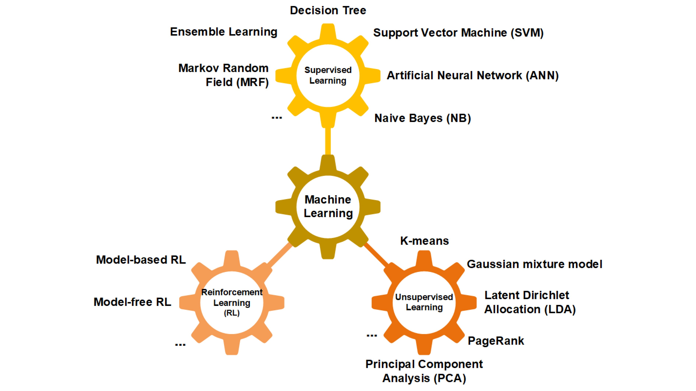
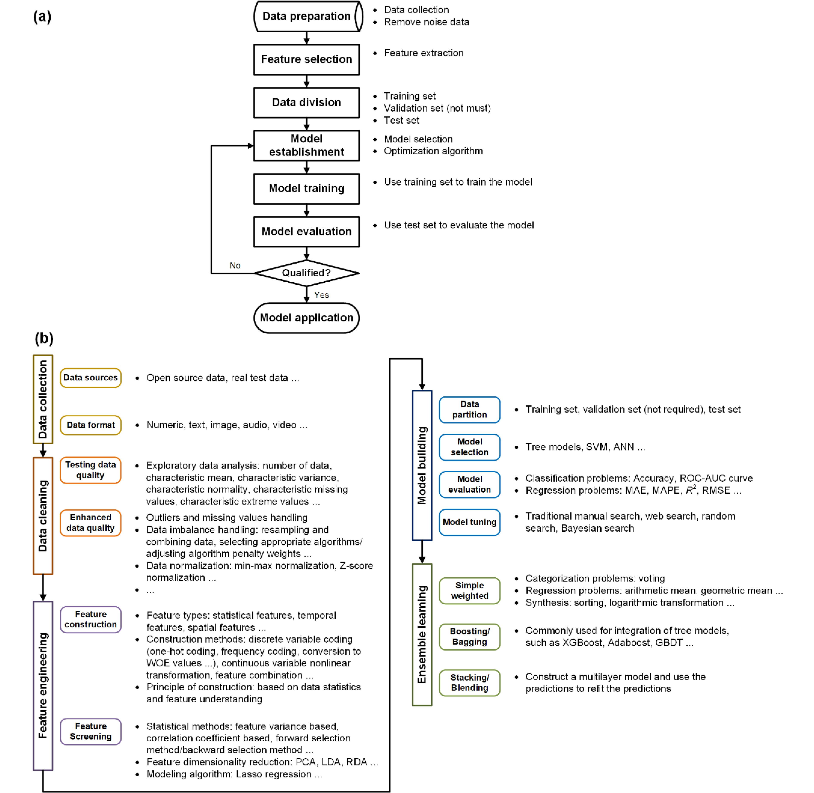
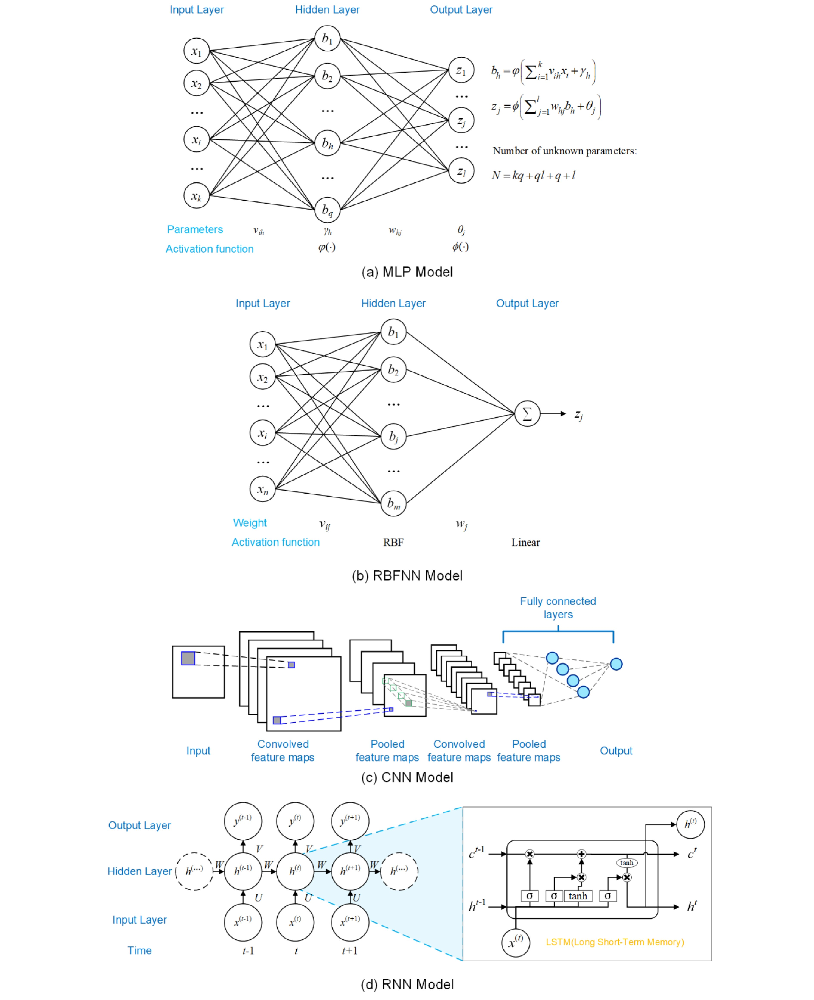
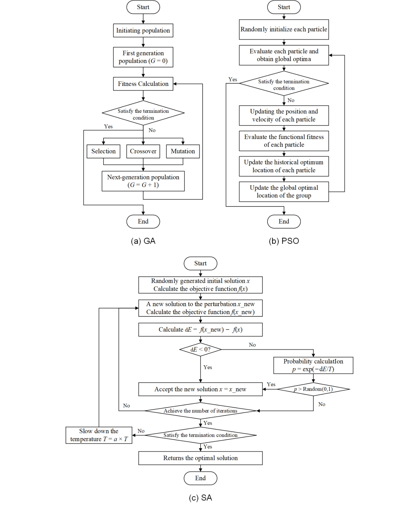
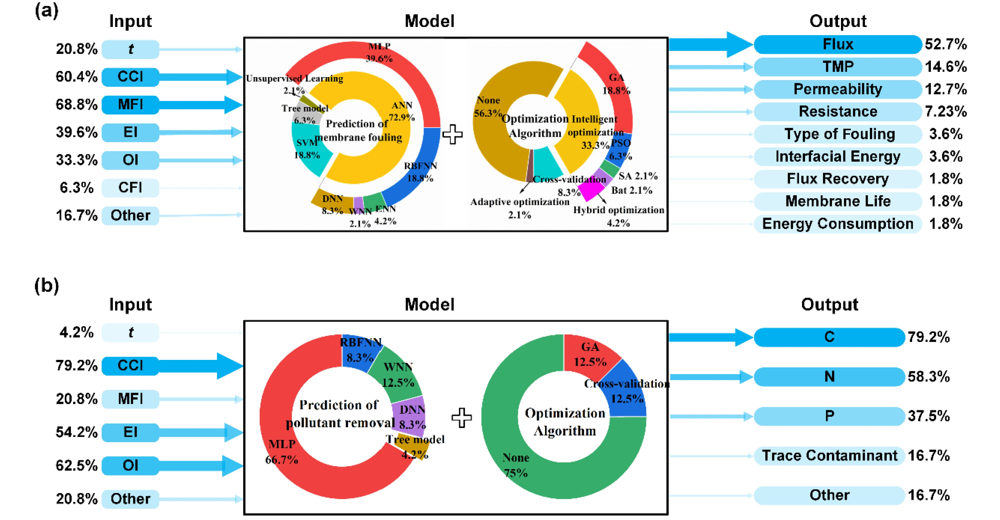

# Machine learning for membrane bioreactor research: principles, methods, applications, and a tutorial

## Abstract

- Hiện tượng tắc nghẽn màng (membrane fouling) đặt ra thách thức lớn đối với sự phát triển bền vững của các công nghệ bể phản ứng sinh học màng (MBR - membrane bioreactor) trong xử lý nước thải (wastewater treatment).
  - Dự đoán chính xác quá trình lọc màng (membrane filtration process) có tầm quan trọng lớn nhằm nhận diện và kiểm soát hiện tượng tắc nghẽn màng.
- Các phương pháp học máy (machine learning) giải quyết các hạn chế của các phương pháp tiếp cận thống kê truyền thống (traditional statistical approaches):
  - Khắc phục các nhược điểm về độ chính xác thấp (low accuracy), khả năng tổng quát hóa kém (poor generalization ability) và tốc độ hội tụ chậm (slow convergence).
  - Phát huy hiệu quả đặc biệt trong việc dự đoán các quá trình lọc và tắc nghẽn phức tạp trong bối cảnh dữ liệu lớn (big data).
- Nghiên cứu trình bày chi tiết về lý thuyết học máy (machine learning theory) và tổng quan các tiến bộ ứng dụng trong hệ thống MBR:
  - Các phương pháp học máy được tổng quan bao gồm mạng nơ-ron nhân tạo (ANN - artificial neural networks), máy vector hỗ trợ (SVM - support vector machines), cây quyết định (decision trees) và học kết hợp (ensemble learning).
- Nghiên cứu tóm tắt và so sánh các đặc trưng đầu vào và đầu ra của mô hình (model input and output characteristics) dựa trên y văn hiện hành:
  - Các nhóm đặc trưng bao gồm đặc tính chất gây tắc nghẽn (foulant characteristics), môi trường dung dịch (solution environments), điều kiện lọc (filtration conditions), điều kiện vận hành (operating conditions) và các yếu tố thời gian (time factors).
  - So sánh việc lựa chọn mô hình và các thuật toán tối ưu hóa (optimization algorithms).
- Quy trình xây dựng mô hình (modeling procedures) được minh họa chi tiết thông qua một ví dụ hướng dẫn (tutorial example) cho năm phương pháp:
  - Năm phương pháp bao gồm SVM, rừng ngẫu nhiên (RF - random forest), mạng nơ-ron lan truyền ngược (BPNN - back propagation neural network), mạng bộ nhớ ngắn-dài hạn (LSTM - long short-term memory) và mạng lan truyền ngược tối ưu hóa bằng thuật toán di truyền (GA-BP - genetic algorithm-back propagation).
  - Kết quả mô phỏng chứng minh cả năm phương pháp đều đem lại dự đoán chính xác với $R^2 > 0.8$.
- Các thách thức hiện tại trong việc triển khai các mô hình học máy vào hệ thống MBR được phân tích cụ thể:
  - Sự tích hợp của học sâu (deep learning), học máy tự động (AutoML - automated machine learning) và trí tuệ nhân tạo có thể giải thích (XAI - explainable artificial intelligence) có thể tạo điều kiện thuận lợi cho việc ứng dụng mô hình vào thực tế kỹ thuật.
  - Các phân tích chuyên sâu được kỳ vọng sẽ thúc đẩy việc thiết lập khuôn khổ điều khiển thông minh (intelligent control framework) cho các quy trình MBR trong tương lai.

## 1 Introduction

- **Vai trò và ưu điểm của công nghệ MBR trong xử lý và tái sử dụng nước thải**: Xử lý và tái sử dụng nước thải (wastewater treatment and reclamation) là chiến lược thiết yếu để giảm thiểu khủng hoảng nước do khan hiếm và ô nhiễm nước gây ra:
  - Công nghệ bioreactor màng (membrane bioreactor: MBR) kết hợp giữa phân tách màng (membrane separation) và xử lý sinh học (biological treatment) (Yamamoto et al., 1989).
  - MBR được sử dụng rộng rãi trong những năm gần đây nhờ các ưu điểm: chất lượng nước đầu ra (effluent quality) ổn định và xuất sắc, diện tích chiếm dụng nhỏ (small footprint), cùng lượng bùn dư phát sinh thấp (low residual sludge production) (Xiao et al., 2014; Krzeminski et al., 2017; Xiao et al., 2019; Qu et al., 2022).

- **Tắc nghẽn màng là rào cản hạn chế tính bền vững kỹ thuật - kinh tế của MBR**: Hiện tượng tắc nghẽn màng (membrane fouling) phát sinh trong quá trình vận hành MBR gây ra nhiều tác động tiêu cực (Xiao et al., 2019; Qu et al., 2022):
  - Dẫn đến suy giảm thông lượng (decreased flux) và suy giảm hiệu quả phân tách (deteriorated separation efficiency).
  - Làm gia tăng tiêu thụ năng lượng (increased energy consumption) và rút ngắn tuổi thọ của màng (shortened membrane lifespan).
  - Hạn chế tính bền vững kỹ thuật - kinh tế (techno-economic sustainability) của hệ thống (Xiao et al., 2019; Qu et al., 2022).

- **Ba nhóm yếu tố chi phối hiện tượng tắc nghẽn màng**: Tắc nghẽn màng có mối liên hệ chặt chẽ với đặc tính màng (membrane properties), đặc tính bùn lỏng (mixed liquor properties), và điều kiện vận hành (operating conditions):
  - Hành vi tắc nghẽn của các vật liệu màng (chẳng hạn như polyvinylidene fluoride [PVDF], polyethersulfone [PES], polyethylene [PE], và polyacrylonitrile [PAN]) biến thiên theo độ ưa nước/kỵ nước (hydrophilicity/hydrophobicity), cấu trúc lỗ rỗng (pore structure), và độ nhám bề mặt (surface roughness), tất cả đều tác động đến tương tác giữa màng và chất gây tắc nghẽn (membrane-foulant interaction) (Yamato et al., 2006; Zhang et al., 2008).
  - Màng kỵ nước nhìn chung dễ bị tắc nghẽn hơn so với màng ưa nước (Choi et al., 2002).

- **Tương tác giữa kích thước lỗ rỗng màng và kích thước chất gây tắc nghẽn**: Kích thước lỗ rỗng màng (membrane pore size) và kích thước chất gây tắc nghẽn (foulant size) đóng vai trò tương tác trong quá trình hình thành tắc nghẽn:
  - Các chất gây tắc nghẽn có kích thước tương đương với kích thước lỗ rỗng có thể làm bít tắc chặt các lỗ rỗng do cơ chế loại trừ kích thước (size exclusion) (Meireles et al., 1991).
  - Các chất gây tắc nghẽn có kích thước nhỏ có thể gây ra hiện tượng tắc nghẽn do hấp phụ (adsorptive fouling) bên trong lòng lỗ rỗng (Kawakatsu et al., 1993).
  - Dải phân bố kích thước lỗ rỗng (pore size distribution) hẹp hơn mang lại sự thuận lợi cho việc duy trì thông lượng ổn định (Shimizu et al., 1990; Meireles et al., 1991).

- **Tác động của độ nhám bề mặt màng ở các thang đo kích thước**: Độ nhám bề mặt màng (membrane surface roughness) chi phối hành vi lắng đọng và hấp phụ của chất gây tắc nghẽn (Xu et al., 2020):
  - Ở thang đo micromet ($\mu\text{m}$), độ nhám bề mặt ảnh hưởng đến động lực học chất lưu (fluid dynamics) đối với sự lắng đọng hạt.
  - Ở thang đo nanomet ($\text{nm}$), độ nhám bề mặt chi phối sự tiếp xúc giữa các phân tử (intermolecular contact) đối với quá trình hấp phụ chất gây tắc nghẽn.
  - Dữ liệu thực nghiệm chỉ ra rằng bề mặt màng nhẵn hơn có xu hướng cản trở sự hình thành và phát triển của lớp bánh cặn (cake layer formation) (Vatanpour et al., 2011; Sadeghi et al., 2013; Panda et al., 2015).

- **Vai trò gây tắc nghẽn của các thành phần trong bùn lỏng**: Hỗn hợp chất rắn lơ lửng trong bùn lỏng (mixed liquor suspended solids: MLSS), các chất polyme ngoại bào (extracellular polymeric substances: EPS), và các sản phẩm vi sinh hòa tan (soluble microbial products: SMP) đều góp phần gây tắc nghẽn màng trong MBR:
  - MLSS chịu trách nhiệm chính đối với hiện tượng tắc nghẽn tổng thể, đặc biệt ở các mức nồng độ trên $10\text{ mg/L}$.
  - EPS và SMP đóng vai trò chủ chốt gây ra hiện tượng tắc nghẽn không thuận nghịch về mặt vật lý (physically irreversible fouling).

- **Tác động của điều kiện vận hành MBR đến nồng độ các chất gây tắc nghẽn**: MLSS, EPS, và SMP có mối liên hệ mật thiết với các điều kiện vận hành MBR như thời gian lưu nước (hydraulic retention time: HRT), thời gian lưu bùn (sludge retention time: SRT), và tỷ lệ cơ chất trên vi sinh vật (food-to-microorganism rate: F/M) (Huang et al., 2011):
  - HRT quá ngắn hoặc SRT quá dài có thể dẫn đến nồng độ MLSS và SMP cao, làm trầm trọng thêm mức độ tắc nghẽn màng.
  - Nồng độ MLSS quá thấp một cách bất thường cũng có thể làm trầm trọng thêm tình trạng tắc nghẽn, có khả năng do sự giải phóng quá mức của EPS (Yoon, 2015).

- **Ba nhóm chiến lược kiểm soát tắc nghẽn màng chính**: Các chiến lược kiểm soát tắc nghẽn màng (fouling control strategies) được phân loại thành ba nhóm giải pháp chính (Meng et al., 2017):
  - **Điều hòa bùn lỏng (mixed liquor conditioning)**: Bổ sung các vật liệu như chất mang lơ lửng (suspended carriers), hạt (particles), chất keo tụ (coagulants), ozone, và các hóa chất khác (Wu and Huang, 2008; Kurita et al., 2014, 2015; Juntawang et al., 2017; Zhang et al., 2017; Zhang et al., 2022); các chất phụ gia này có khả năng điều chỉnh đặc tính của SMP và EPS, đồng thời tác động đến cấu trúc bông bùn (floc structure) (Wu et al., 2006; Wu and Huang, 2008; Juntawang et al., 2017; Zhang et al., 2017).
  - **Điều chỉnh điều kiện lọc (filtration conditions adjustment)**: Cường độ sục khí (aeration intensity) và chu kỳ lọc/nghỉ (filtration/relaxation intervals) ảnh hưởng trực tiếp đến tốc độ tắc nghẽn tổng thể và khả năng thuận nghịch của lớp bánh/gel (cake/gel layer reversibility) (Liu et al., 2020b); sục khí hoặc thổi khí (aeration / air scouring) giúp bóc tách và loại bỏ chất gây tắc nghẽn khỏi bề mặt màng bằng cách gia tăng lực cắt dòng chảy ngang (cross-flow shear).
  - **Làm sạch màng bị tắc nghẽn (physical/chemical cleaning of fouled membranes)**: Làm sạch vật lý (như rửa bằng nước máy, rửa bằng nước đầu ra của màng, rửa dòng so le [staggered flow], rửa ngược [backwash], và rửa siêu âm [ultrasonic cleaning]) giúp giảm nhẹ tắc nghẽn thuận nghịch (reversible fouling); trong khi đó, làm sạch hóa học (sử dụng axit, kiềm, chất oxy hóa, chất tạo phức [chelating agent], và chất hoạt động bề mặt [surfactants]) giúp giảm nhẹ sâu hơn hiện tượng tắc nghẽn không thuận nghịch (irreversible fouling).

- **Hạn chế hậu nghiệm và độ trễ của các biện pháp kiểm soát tắc nghẽn hiện hữu**: Các biện pháp kiểm soát tắc nghẽn màng hiện nay chủ yếu được tiến hành theo phương thức hậu nghiệm (a posteriori) dựa trên việc quan sát các hiện tượng tắc nghẽn đã xảy ra:
  - Can thiệp kiểm soát chỉ diễn ra sau khi ghi nhận hiện tượng gia tăng áp suất xuyên màng (transmembrane pressure: TMP), tạo ra một độ trễ nhất định giữa thời điểm tắc nghẽn phát sinh và thời điểm can thiệp kiểm soát.
  - Các biện pháp can thiệp không chuẩn xác có thể làm giảm hiệu quả xử lý, lãng phí năng lượng và hóa chất, đồng thời gây hư hại đến màng.
  - Cần áp dụng các biện pháp kiểm soát phù hợp với thời điểm và liều lượng chính xác.
  - Nhằm đạt được cảnh báo sớm (early warning) và kiểm soát kịp thời, việc phát triển mô hình có khả năng dự đoán xu hướng tắc nghẽn ngay từ giai đoạn khởi phát (fouling tendency in its infancy) đóng vai trò then chốt.

- **Tiềm năng và giới hạn cố hữu của các mô hình thống kê truyền thống**: Các mô hình dự đoán và điều tiết dựa trên dữ liệu (data-driven prediction and regulation models) mang lại cách tiếp cận mới để kiểm soát chính xác hiện tượng tắc nghẽn màng, trong đó các mô hình thống kê truyền thống đã đạt được một số bước tiến ban đầu:
  - Zhang et al. (2012) đã thiết lập mô hình bình phương tối thiểu từng phần (partial least squares: PLS) đạt $R^2 = 0.84$ để dự đoán thông lượng màng từ các đặc tính bùn lỏng gồm nồng độ MLSS/EPS/SMP, độ kỵ nước tương đối, kích thước hạt trung bình, và áp suất thẩm thấu.
  - Chen et al. (2022) đã phát triển mô hình chuỗi thời gian (time series model) sử dụng nhiệt độ làm biến đồng biến (covariate) và các sự kiện làm sạch trực tuyến làm biến chuyển đổi (switching variables) để dự đoán xu hướng TMP trong bể MBR kỵ khí (anaerobic MBR: AnMBR) qua các mùa vụ, đạt $R^2 = 0.91$.
  - Mặc dù phản ánh tốt mối quan hệ giữa biến đầu vào và biến đầu ra, các mô hình thống kê truyền thống phụ thuộc vào tri thức tiên nghiệm (a priori knowledge) về các mối quan hệ này và bộc lộ các nhược điểm cố hữu:
    - (a) Độ chính xác khớp mẫu chưa đủ (insufficient fitting accuracy), khả năng tổng quát hóa yếu (weak generalization ability), và độ thích ứng kém với mẫu dữ liệu mới do đánh giá thấp độ phức tạp của các mối quan hệ thực tế.
    - (b) Hiệu quả tính toán thấp đối với phân tích dữ liệu lớn (big data analysis) và tốc độ hội tụ chậm khi xử lý nhiều biến có tương tác phức tạp do những giới hạn trong cấu trúc mô hình.
    - Tính đa dạng và mức độ phức tạp của nhiều biến tương tác lẫn nhau vốn là đặc tính cố hữu trong hệ thống tắc nghẽn màng thực tế, khiến việc ứng dụng các mô hình thống kê truyền thống gặp nhiều thách thức.

- **Đặc trưng và thế mạnh của Machine Learning trong dự đoán tắc nghẽn MBR**: Machine learning là bước phát triển thống kê gần đây đóng vai trò bổ trợ cho các mô hình thống kê truyền thống, thu hút sự chú ý ngày càng tăng trong kỹ thuật môi trường như một công nghệ trí tuệ nhân tạo tổng quát (general artificial intelligence technology) (Zhong et al., 2021):
  - Ra đời từ các mô hình thống kê nhưng có sự khác biệt: machine learning tập trung vào việc ước tính chính xác các hàm số phức tạp bằng máy tính, thay vì cung cấp các khoảng tin cậy thống kê (statistical confidence intervals) cho các hàm đó.
  - Các thuật toán machine learning tự động "học" từ kinh nghiệm (dữ liệu) để cải thiện hiệu năng của hệ thống (Bishop, 2006).
  - Với đặc tính của mô hình hộp đen (black-box model), machine learning sở hữu khả năng khớp mẫu mạnh mẽ, độ thích ứng tốt, và độ chính xác dự đoán cao khi giải quyết các bài toán có hàm phản ứng chưa biết (unknown response functions), mối quan hệ biến phức tạp, cùng khối lượng dữ liệu lớn.
  - Các thế mạnh này mở ra triển vọng thuận lợi cho việc dự đoán tắc nghẽn trong các hệ thống MBR; trong những năm gần đây, machine learning dần được áp dụng để dự đoán hiệu năng lọc màng (như thông lượng, độ cản [resistance], và độ thẩm thấu [permeability]), đồng thời mang lại cơ sở định lượng mới hỗ trợ phân tích cơ chế tắc nghẽn (Niu et al., 2022).

- **Cấu trúc nội dung của bài báo**: Nghiên cứu này triển khai ba nội dung chính:
  - Giới thiệu 4 mô hình machine learning thông dụng.
  - Đánh giá tổng quan các ứng dụng của mô hình machine learning trong việc dự đoán hiệu quả loại bỏ chất ô nhiễm (pollutant removal) và hiệu năng tắc nghẽn màng (fouling performance).
  - Phân tích các hạn chế của những mô hình hiện có nhằm hỗ trợ các nhà nghiên cứu trong tương lai phát triển các mô hình machine learning mới để nâng cao khả năng dự đoán tắc nghẽn trong MBR.

## 2 Principles and methods of machine learning

- Học máy (machine learning) xây dựng mô hình bằng cách sử dụng "dữ liệu huấn luyện" ("training data") để đưa ra dự đoán hoặc quyết định mà không cần giả định tiên nghiệm (a priori assumptions) rõ ràng hay lập trình tường minh.
  - Các bước tổng quát và chi tiết của quy trình học máy được mô tả tương ứng trong Figure 1(a) và Figure 1(b).
- Các mô hình học máy phổ biến bao gồm học có giám sát (supervised learning), học không giám sát (unsupervised learning), và học tăng cường (reinforcement learning: RL).
  - **Figure 2: Classification of machine learning methods**
    - 
    - **Hình này chứng minh điều gì**
      - Phân loại học máy thành ba nhóm phương pháp chính gồm supervised learning, unsupervised learning, và reinforcement learning (RL) cùng các thuật toán thành phần.
    - **Từ đâu mà thấy được**
      - Bánh răng trung tâm (Machine Learning) kết nối truyền động với ba bánh răng nhánh: Supervised Learning (trên), Unsupervised Learning (dưới phải), và Reinforcement Learning (RL) (dưới trái).
      - Nhóm Supervised Learning gồm: Decision Tree, Support Vector Machine (SVM), Artificial Neural Network (ANN), Naive Bayes (NB), Markov Random Field (MRF), Ensemble Learning.
      - Nhóm Unsupervised Learning gồm: K-means, Gaussian mixture model, Latent Dirichlet Allocation (LDA), PageRank, Principal Component Analysis (PCA).
      - Nhóm Reinforcement Learning gồm: Model-based RL, Model-free RL.
- Việc lựa chọn mô hình phù hợp đòi hỏi phải xem xét nhiều yếu tố:
  - Nguyên lý mô hình (model principles).
  - Loại bài toán (problem type: phân loại - classification, hồi quy - regression, chuỗi thời gian - time series, v.v.).
  - Khối lượng dữ liệu (data volume).
  - Chiều đặc trưng (feature dimensions).
  - Yêu cầu giải thích mô hình (interpretation requirements).
- Khi có nhiều mô hình để lựa chọn, mô hình tối ưu được xác định thông qua so sánh:
  - Hiệu suất mô hình (model performance).
  - Chi phí tính toán (computational costs).
  - Khả năng giải thích (interpretability).
- Bắt nguồn từ trí tuệ nhân tạo (artificial intelligence), học máy được ứng dụng rộng rãi trong lĩnh vực khoa học và kỹ thuật môi trường (environmental science and engineering):
  - Xây dựng mô hình dự đoán sử dụng các tập dữ liệu đa dạng (diverse data sets).
  - Đánh giá tầm quan trọng của đặc trưng (feature importance) thông qua giải thích mô hình (model interpretation).
  - Phát hiện bất thường (anomaly detection) qua so sánh với dữ liệu lịch sử (historical data).
  - Thúc đẩy nghiên cứu phát triển vật liệu mới (advancement of new materials) (Zhong et al., 2022).

### 2.1 Machine learning methods

- Phần này tập trung giới thiệu ba phương pháp học máy (machine learning methods) phổ biến:
  - Máy vector hỗ trợ (support vector machine - SVM).
  - Mạng nơ-ron nhân tạo (artificial neural network - ANN).
  - Cây quyết định (decision tree).
- Thuật toán $k$ láng giềng gần nhất ($k$-nearest neighbor - KNN) được cung cấp dưới dạng tổng quan súc tích bổ sung.
- Bốn phương pháp học máy chứng minh hiệu quả trong việc giải quyết hai nhóm bài toán cốt lõi:
  - Bài toán phân loại (classification problems) đối với các biến rời rạc (discrete variables).
  - Bài toán hồi quy (regression problems) đối với các biến liên tục (continuous variables).
  - **Figure 1: Machine learning process**
    - 
    - **Hình này chứng minh điều gì**
      - Minh họa chu trình học máy gồm quy trình vận hành tổng quát và các bước kỹ thuật chi tiết nhằm thiết lập mô hình giải quyết bài toán phân loại và hồi quy.
    - **Từ đâu mà thấy được**
      - Panel (a) (Quy trình tổng quát): Luồng tuần tự Data preparation $\rightarrow$ Feature selection $\rightarrow$ Data division $\rightarrow$ Model establishment $\rightarrow$ Model training $\rightarrow$ Model evaluation $\rightarrow$ Kiểm tra đạt chuẩn (Qualified?): nếu chưa đạt (No) thì quay lại Model establishment, nếu đạt (Yes) chuyển sang Model application.
      - Panel (b) (Các bước chi tiết): Năm giai đoạn triển khai gồm Data collection (thu thập dữ liệu), Data cleaning (làm sạch dữ liệu, chuẩn hóa), Feature engineering (kỹ thuật đặc trưng, PCA, Lasso), Model building (xây dựng mô hình với Tree, SVM, ANN; đánh giá bằng Accuracy/ROC-AUC hoặc MAE/MAPE/$R^2$/RMSE; tinh chỉnh siêu tham số) và Ensemble learning (học kết hợp qua Boosting, Bagging, Stacking).
- Bảng 1 (Table 1) tổng hợp và so sánh bốn phương pháp học máy cùng phạm vi ứng dụng tương ứng:
  - Tóm tắt ưu điểm và nhược điểm của từng phương pháp học máy.
  - Xác định phạm vi ứng dụng trong lĩnh vực môi trường (scope of environmental application).
  - Khái quát các kịch bản và ví dụ ứng dụng tiềm năng trong hệ thống bể phản ứng sinh học màng (potential application scenarios and examples in MBRs).

#### 2.1.1 Support vector machine

- **Định nghĩa nền tảng và cơ chế phân loại của $SVM$**:
  - Máy vector hỗ trợ ($SVM$ - support vector machine) là một phương pháp phân loại nhị phân (binary classification method) bắt nguồn từ lý thuyết học thống kê (statistical learning theory), thực thi chiến lược giảm thiểu rủi ro cấu trúc (structural risk minimization strategy).
  - $SVM$ thực hiện biến đổi dữ liệu (data transformation) từ không gian số chiều thấp (low-dimensional space) sang không gian số chiều cao (high-dimensional space) bằng cách xây dựng hàm nhân (kernel function).
  - Mô hình có thể áp dụng để giải quyết cả bài toán phân loại (support vector classification - $SVC$) và bài toán hồi quy (support vector regression - $SVR$) thông qua việc xác định siêu phẳng phân chia tối ưu (optimal dividing hyperplane) nhằm phân loại dữ liệu mẫu vào các lớp khác nhau với độ rộng biên (“margin”) tại ranh giới lớn nhất.
  - Các điểm mẫu nằm gần ranh giới nhất có vai trò quyết định vị trí của siêu phẳng và được gọi là các vector hỗ trợ (support vectors).
- **Đặc điểm ánh xạ, cấu trúc dữ liệu đầu vào và ưu thế trên tập mẫu nhỏ**:
  - $SVM$ là phương pháp phù hợp để giải quyết các bài toán ánh xạ phi tuyến (nonlinear mapping problems) trong không gian số chiều cao với số lượng mẫu hạn chế (limited samples), đồng thời sở hữu khả năng tổng quát hóa (generalization ability) nhất định.
  - Dữ liệu đầu vào của $SVM$ thường bao gồm một chuỗi các điểm dữ liệu chứa nhiều đặc trưng (multiple features), với số lượng đặc trưng thường là $\ge 2$ tùy thuộc vào bài toán mô hình hóa cụ thể.
  - Khi xử lý tập dữ liệu có kích thước mẫu nhỏ (ví dụ: kích thước mẫu huấn luyện nhỏ hơn $125$ mẫu (Qian et al., 2015)), mô hình $SVM$ nhìn chung thể hiện hiệu năng tổng quát hóa cao và độ chính xác dự đoán tốt (superior generalization performance and prediction accuracy).
  - Lợi thế này xuất phát từ độ phức tạp mô hình tương đối thấp (relatively low complexity) và nền tảng lý thuyết học thống kê vững chắc (solid statistical theoretical foundation).
- **Hạn chế tính toán, độ nhạy dữ liệu và yêu cầu tiền xử lý**:
  - Hiệu quả tính toán (computational efficiency) của $SVM$ giảm khi kích thước mẫu lớn, có thể đòi hỏi thời gian tính toán kéo dài hơn.
  - $SVM$ nhạy cảm với sự hiện diện của dữ liệu bị thiếu (susceptible to missing data); do đó, bắt buộc phải sàng lọc tập dữ liệu để loại bỏ các giá trị ngoại lai (outliers) và xử lý triệt để các giá trị bị khuyết thiếu (missing values) trước khi tiến hành mô hình hóa $SVM$.
  - Cần phải xem xét đến khả năng giải thích (interpretability) của phép ánh xạ trong không gian số chiều cao.
- **Tổng hợp đặc tính kỹ thuật và kịch bản ứng dụng trong $MBR$ (Bảng 1 - Table 1)**:
  - Thuộc nhóm học có giám sát (supervised learning) với cơ sở toán học rõ ràng (clear mathematical basis).
  - Ưu điểm: Hiệu năng vững chắc với kích thước mẫu hạn chế (reliable performance with limited sample size), khả năng dự đoán nhanh (rapid prediction capabilities), và khả năng giải thích mạnh (strong interpretability).
  - Nhược điểm: Dễ bị ảnh hưởng bởi dữ liệu bị thiếu (susceptibility to missing data), độ phức tạp tính toán cao (high computational complexity), và không phù hợp cho tập dữ liệu lớn (inappropriateness for large data set).
  - Phạm vi áp dụng môi trường: Các bài toán phân loại hoặc hồi quy khi kích thước mẫu không quá lớn.
  - Ứng dụng tiềm năng trong hệ thống màng sinh học ($MBR$ - membrane bioreactor): Dự đoán áp suất xuyên màng ($TMP$ - transmembrane pressure) và trở lực màng (resistance) (Liu et al., 2020a).
- **Các kịch bản ứng dụng trong kỹ thuật nước và môi trường**:
  - Trong kỹ thuật nước và môi trường nước (water engineering and water environments), $SVM$ được triển khai cho nhiều nhiệm vụ:
    - Phát hiện rò rỉ trong hệ thống cấp nước (leakage detection in water supply system) (McMillan et al., 2024).
    - Phân tích cấu trúc hoặc đặc trưng hóa chất ô nhiễm (structural analysis or characterization of pollutants) (Zhong and Guan, 2023).
    - Phân tích quang phổ chất lượng nước (spectral analysis of water quality) (Mallet et al., 2022).
    - Giám sát vận hành bể phản ứng (monitoring of reactor operation) (Vasilaki et al., 2020).
    - Giám sát và kiểm soát sinh thái trong lưu vực (ecological monitoring and control in watersheds) (Kim et al., 2021a).
    - Cảnh báo sớm sự cố ô nhiễm chất lượng nước (early warning of water quality pollution event) (Oliker and Ostfeld, 2014).
  - Trong các lĩnh vực môi trường khác:
    - Giám sát và đánh giá chất lượng không khí (air quality monitoring and assessment) (Li et al., 2017).
    - Ước tính nhanh hàm lượng carbon hữu cơ trong đất (soil organic carbon rapid estimation) (Li et al., 2015).

#### 2.1.2 Artificial neural network

- **Định nghĩa, nguyên lý phỏng sinh học và bản chất học kết nối (connectionist learning)**:
  - Mạng nơ-ron nhân tạo (artificial neural network - $\text{ANN}$) bao gồm nhiều nơ-ron (neurons) cơ bản mô phỏng quá trình học hỏi của não bộ con người nhằm giải quyết đa dạng các bài toán thực tế.
  - $\text{ANN}$ là một trong những mô hình được sử dụng thường xuyên nhất trong học máy (machine learning - $\text{ML}$), đại diện tiêu biểu cho trường phái học kết nối (connectionist learning).

- **Kiến trúc phân tầng và cơ chế ánh xạ đầu vào - đầu ra (input-to-output mapping)**:
  - Cấu trúc điển hình của một $\text{ANN}$ gồm ba thành phần chính: tầng đầu vào (input layer), tầng ẩn (hidden layer), và tầng đầu ra (output layer).
  - Quy mô nơ-ron: Mỗi tầng có thể chứa từ một vài cho đến hàng triệu nơ-ron; số lượng nơ-ron quy định độ phức tạp của các mối quan hệ tiềm ẩn bên trong dữ liệu cần học.
  - Cơ chế ánh xạ phi tuyến: Tầng đầu vào tiếp nhận dữ liệu huấn luyện (training data), dữ liệu này được biến đổi phi tuyến qua một hoặc nhiều tầng ẩn, và tầng đầu ra cung cấp dữ liệu giá trị đã qua chuyển đổi phi tuyến, hoàn tất quá trình ánh xạ từ đầu vào sang đầu ra (input-to-output mapping).

- **Chiến lược gia tăng năng lực xử lý phi tuyến, phạm vi bài toán và định dạng dữ liệu đầu vào**:
  - Khả năng xử lý các bài toán phi tuyến phức tạp của $\text{ANN}$ được nâng cao thông qua ba giải pháp kỹ thuật:
    - Gia tăng "độ sâu" (depth) bằng cách bổ sung thêm các tầng ẩn.
    - Gia tăng "độ rộng" (width) bằng cách tăng số lượng nơ-ron trong một tầng đơn lẻ.
    - Tối ưu hóa hàm kích hoạt (activation function).
  - Phạm vi bài toán: $\text{ANN}$ có thể được triển khai để giải quyết bài toán phân loại (classification), hồi quy (regression), và bài toán chuỗi thời gian (time-series).
  - Thích ứng cỡ mẫu: Phù hợp để xử lý các bài toán có quy mô cỡ mẫu biến thiên (varying sample sizes) thông qua việc linh hoạt áp dụng nhiều biến thể kiến trúc khác nhau.
  - Định dạng dữ liệu đầu vào: Dữ liệu đầu vào thuộc dạng đa biến (multivariate), bao gồm dữ liệu liên tục (continuous), dữ liệu rời rạc (discrete), hoặc dữ liệu dạng ma trận/hình ảnh (matrix/image data).

- **Các kiến trúc mạng nơ-ron: Từ mô hình mạng nông (MLP, RBFNN) đến mạng nơ-ron sâu (DNN: CNN, RNN, GNN)**:
  - Perceptron đa tầng (multilayer perceptron - $\text{MLP}$, còn gọi là mạng nơ-ron lan truyền ngược - back-propagation neural network ($\text{BPNN}$)) (Fig. 3(a)) và mạng nơ-ron hàm cơ sở xuyên tâm (radial basis function neural network - $\text{RBFNN}$) (Fig. 3(b)) là các cấu trúc mạng nơ-ron đơn giản nhất, thường được áp dụng cho bài toán hồi quy (regression), phân loại (classification) và các câu đố chuỗi thời gian (time series puzzles).
  - So với $\text{MLP}$ và $\text{RBFNN}$, mạng nơ-ron sâu (deep neural network - $\text{DNN}$) (ví dụ: mạng nơ-ron tích chập - convolutional neural network ($\text{CNN}$) (Fig. 3(c)), mạng nơ-ron hồi quy - recurrent neural network ($\text{RNN}$) (Fig. 3(d)), và mạng nơ-ron đồ thị - graph neural network ($\text{GNN}$)) sở hữu cấu trúc mạng phức tạp hơn và có năng lực tự động trích xuất đặc trưng (autonomously extracting features), giúp giảm bớt nhu cầu can thiệp của con người và nâng cao chất lượng trích xuất đặc trưng (Zhang et al., 2018).
  - **Figure 3: Schematic diagrams of artificial neural networks**
    - 
    - **Hình này chứng minh điều gì**:
      - Thể hiện sơ đồ cấu trúc kiến trúc và cơ chế lan truyền tín hiệu của bốn mô hình mạng nơ-ron điển hình: $\text{MLP}$, $\text{RBFNN}$, $\text{CNN}$ và $\text{RNN}$/$\text{LSTM}$.
    - **Từ đâu mà thấy được**:
      - Panel (a) Mô hình $\text{MLP}$: Tầng đầu vào tiếp nhận $x_i$, tầng ẩn $b_h = \varphi\left(\sum_{i=1}^{k} v_{ih}x_i + \gamma_h\right)$, tầng đầu ra $z_j = \phi\left(\sum w_{hj}b_h + \theta_j\right)$, với tổng số tham số chưa biết $N = kq + ql + q + l$.
      - Panel (b) Mô hình $\text{RBFNN}$: Trọng số $v_{ij}$ kết nối vào tầng ẩn hàm cơ sở xuyên tâm ($\text{RBF}$), chuyển tiếp qua trọng số $w_j$ tới nút cộng tuyến tính ($\sum$) ở đầu ra $z_j$.
      - Panel (c) Mô hình $\text{CNN}$: Quá trình xử lý từ ảnh đầu vào qua các tầng tích chập trích xuất bản đồ đặc trưng (convolved feature maps), tầng gộp (pooled feature maps) và các tầng kết nối đầy đủ (fully connected layers) tới đầu ra.
      - Panel (d) Mô hình $\text{RNN}$: Dữ liệu chuỗi theo bước thời gian ($t-1, t, t+1$) với trọng số $U, W, V$; khối phóng to $\text{LSTM}$ chi tiết hóa trạng thái ô nhớ $c^t$, trạng thái ẩn $h^t$ cùng các cổng kích hoạt $\sigma$ và $\tanh$.

- **Kiến trúc mạng nơ-ron tích chập (CNN) và các bước cải tiến kiến trúc**:
  - Cơ chế trích xuất không gian: $\text{CNN}$ thường sử dụng dữ liệu không gian hoặc dữ liệu hình ảnh làm đầu vào để thực hiện nhận dạng hình ảnh hoặc trích xuất đặc trưng không gian thông qua các phép tính tích chập (convolutional computation) (Zeiler and Fergus, 2014; Gao et al., 2019; Kiranyaz et al., 2021).
  - Các cải tiến kiến trúc nổi bật của $\text{CNN}$:
    - GoogLeNet (Szegedy et al., 2015).
    - $\text{CNN}$ dựa trên độ sâu (depth-based $\text{CNNs}$) (Szegedy et al., 2016).
    - DenseNet (Huang et al., 2017).
    - Mạng phần dư mở rộng (wide residual networks) (Zagoruyko and Komodakis, 2016).
    - $\text{CNN}$ hai kênh (dual-channel $\text{CNN}$) (Ma et al., 2023).

- **Kiến trúc mạng nơ-ron hồi quy (RNN), mô hình LSTM và thách thức đánh đổi của DNN**:
  - Xử lý dữ liệu chuỗi thời gian: $\text{RNN}$, đặc biệt là mạng bộ nhớ ngắn-dài (long short-term memory - $\text{LSTM}$) (Greff et al., 2017), thể hiện những ưu thế nhất định khi dữ liệu đầu vào mang đặc tính phụ thuộc thời gian (temporal characteristics).
  - Thách thức đánh đổi kỹ thuật của $\text{DNN}$: Các mô hình $\text{DNN}$ đối mặt với thách thức lớn khi độ phức tạp mô hình gia tăng (increased model complexity) đi kèm sự suy giảm khả năng diễn giải/giải thích (reduced interpretability).

- **Hàm kích hoạt tầng ẩn và Mạng nơ-ron Wavelet (WNN)**:
  - Tính đa dạng của hàm kích hoạt: Các mạng nơ-ron khác nhau có thể áp dụng các hàm kích hoạt tầng ẩn khác nhau; Bảng S1 trong Phụ lục A (Table S1 in Appendix A) cung cấp bản tổng hợp các hàm kích hoạt tầng ẩn khả dụng.
  - Đặc tính của mạng nơ-ron Wavelet ($\text{WNN}$): Khác với hàm kích hoạt dạng chữ S truyền thống (conventional S-type activation function), $\text{WNN}$ áp dụng hàm wavelet làm hàm kích hoạt cho tầng ẩn (Alexandridis and Zapranis, 2013).
  - Các lợi thế kỹ thuật của $\text{WNN}$ so với $\text{MLP}$ truyền thống:
    - Tốc độ hội tụ mạng nhanh hơn (faster network convergence).
    - Ngăn ngừa hiện tượng rơi vào tối ưu cục bộ (prevention of local optimization).
    - Khả năng thực hiện phân tích tần số - thời gian cục bộ (local time-frequency analysis).

- **Các lĩnh vực ứng dụng của ANN trong kỹ thuật môi trường**:
  - Ứng dụng của $\text{ANN}$ lan tỏa rộng rãi trong lĩnh vực kỹ thuật môi trường (environmental field), bao gồm nhiều phân ngành:
    - Vận hành hoặc tối ưu hóa các hệ thống quy trình màng (membrane process systems) (Wang et al., 2024b).
    - Xử lý nước thải (wastewater treatment) (Al-Ghazawi and Alawneh, 2021).
    - Dự đoán các chất ô nhiễm mới nổi (novel pollutants) như phụ phẩm khử trùng (disinfection by-products) (Kulkarni and Chellam, 2010).
    - Dự đoán chất lượng nước mặt hoặc nước ngầm (surface or groundwater quality).
    - Quá trình sản xuất khí sinh học (biogas production) (Liu et al., 2021).
    - Hiện tượng hấp phụ môi trường (environmental adsorption).

#### 2.1.3 Decision tree and ensemble learning

- **Định nghĩa và đặc trưng cấu trúc của cây quyết định (decision tree)**:
  - Cây quyết định là một phương pháp học máy (machine learning) có đặc trưng bởi cấu trúc dạng cây (tree-like structure).
  - Thuật toán cây quyết định có thể được xem như một tập hợp các quy tắc nếu-thì (if-then rules) hoặc một phân phối xác suất có điều kiện (conditional probability distribution) được định nghĩa trên cả không gian đặc trưng (feature space) và không gian phân lớp (class space).
  - Đặc tính này mang lại độ phức tạp mô hình thấp (low model complexity) và tạo điều kiện thuận lợi cho khả năng giải thích tốt (good interpretability).
- **Các thuật toán cây quyết định thông dụng và phạm vi ứng dụng theo bài toán**:
  - Ba thuật toán cây quyết định phổ biến (Bảng S2 trong Phụ lục A - Table S2 in Appendix A) sử dụng các thước đo khác nhau (different metrics) để phân chia mẫu (divide samples):
    - ID3
    - C4.5 (Quinlan, 1993)
    - Cây hồi quy phân loại (categorical regression tree - CART) (Breiman et al., 1984)
  - Thuật toán cây quyết định đơn lẻ (single decision tree algorithm) thường được áp dụng để giải quyết các bài toán phân loại (classification problems).
  - Phương pháp CART phù hợp để giải quyết các bài toán hồi quy (regression problems).
- **Nguy cơ quá khớp (overfitting) và các kỹ thuật kiểm soát**:
  - Hiện tượng quá khớp có thể xuất hiện, có khả năng dẫn đến khả năng tổng quát hóa yếu (weak generalization).
  - Để giảm thiểu nguy cơ quá khớp, các kỹ thuật có thể được áp dụng bao gồm:
    - Cắt tỉa (pruning)
    - Kiểm định chéo (cross-validation - CV)
    - Học tập hợp (ensemble learning)
- **Định nghĩa và các phương thức triển khai của học tập hợp (ensemble learning)**:
  - Học tập hợp là một thuật toán học máy kết hợp một nhóm các mô hình học cơ sở (base learners, ví dụ: cây quyết định, mạng nơ-ron lan truyền ngược - backpropagation neural network - BPNN, v.v.) theo một chiến lược xác định nhằm cải thiện hiệu suất tổng quát hóa của các mô hình học cơ sở này.
  - Đóng bao (bagging) và tăng cường (boosting) là hai thuật toán triển khai học tập hợp điển hình:
    - Rừng ngẫu nhiên (Random Forest - RF) (Breiman, 2001) là một phần mở rộng của phương pháp bagging.
    - Tăng cường thích ứng (adaptive boosting), cây quyết định tăng cường độ dốc (gradient boosting decision tree - GBDT), và tăng cường độ dốc tột cùng (eXtreme gradient boosting - XGBoost) (Chen and Guestrin, 2016) là các phần mở rộng của phương pháp boosting.
- **Các ưu thế của học tập hợp so với phương pháp tiếp cận mô hình học cơ sở đơn lẻ**:
  - Độ chính xác cao (high accuracy).
  - Hiệu suất tổng quát hóa tốt (good generalization performance).
  - Tốc độ huấn luyện nhanh (fast training speed).
  - Độ bền vững tốt (good robustness).
  - Đòi hỏi kỹ thuật tạo đặc trưng ở mức tối thiểu (minimal feature engineering).
  - Phạm vi kịch bản ứng dụng rộng (wide range of application scenarios).
- **Các kịch bản ứng dụng trong lĩnh vực môi trường và vai trò hỗ trợ ra quyết định**:
  - Tương tự như mạng nơ-ron nhân tạo (artificial neural networks - ANN) và máy vector hỗ trợ (support vector machines - SVM), cây quyết định cùng các phương pháp học tích hợp của chúng được áp dụng rộng rãi trong nhiều bài toán:
    - Giám sát hoặc phân loại chất lượng nước (water quality monitoring or classification) (Xu et al., 2021).
    - Nhận diện vi nhựa nano (nano-plastics identification) (Xie et al., 2023).
    - Phân hủy chất ô nhiễm (pollutant degradation) (Zhang et al., 2023).
    - Dự đoán chất lượng không khí (air quality prediction) (Chen et al., 2020).
    - Dự đoán ô nhiễm nước ngầm (groundwater contamination prediction) (Bindal and Singh, 2019).
    - Nhận diện nguồn ô nhiễm đất (source of soil contamination) (Zhou and Li, 2024).
    - Đánh giá sinh thái và môi trường (ecological and environmental evaluation) (Espel et al., 2020).
  - Nhờ có khả năng giải thích tốt hơn (better interpretability), các mô hình cây được sử dụng không chỉ cho dự đoán môi trường (environmental prediction) mà còn phục vụ cho quản lý môi trường và ra quyết định (environmental management and decision-making) (Jiang et al., 2021).

#### 2.1.4 k-nearest neighbors

- $k$-nearest neighbors ($KNN$ - $k$ láng giềng gần nhất) là một mô hình học máy không giám sát (unsupervised machine learning model) đo lường khoảng cách giữa các giá trị đặc trưng (feature values) khác nhau làm cơ sở cho phân loại (classification) hoặc hồi quy (regression).
  - Mô hình $KNN$ được áp dụng để giải quyết bài toán phân loại (classification problem).
  - Đối với bài toán hồi quy (regression problem), phương pháp bao gồm việc xác định $k$ láng giềng gần nhất ($k$-nearest neighbors) của mẫu cần dự đoán.
- $KNN$ sở hữu các ưu điểm rõ rệt bao gồm độ chính xác cao (high precision), tính không nhạy với các giá trị ngoại lai (insensitivity to outliers), và không có giả định đầu vào đối với nhãn mẫu (no input assumption for sample labels).
  - $KNN$ tồn tại một số nhược điểm nhất định, bao gồm độ phức tạp tính toán (computational complexity) và độ phức tạp không gian (space complexity) cao.
  - Do các đặc tính trên, $KNN$ chủ yếu áp dụng phù hợp để xử lý dữ liệu dạng số (numerical data) và dữ liệu định danh (nominal data).
- $KNN$ có phạm vi ứng dụng trong lĩnh vực môi trường (environmental domain) hạn chế hơn (more circumscribed range of applications) so với $SVM$, $ANN$ và các mô hình cây (tree models).
  - Tuy vậy, mô hình vẫn có thể được triển khai để giải quyết nhiều bài toán môi trường phức tạp:
    - Giám sát chất lượng nước (water quality monitoring) (Uddin et al., 2023).
    - Kiểm soát xử lý nước thải (wastewater treatment control) (Xu et al., 2022).
    - Đánh giá quá trình hấp phụ (adsorption evaluation) (Nguyen et al., 2022).
    - Dự đoán chất lượng không khí (air quality prediction) (Tella et al., 2021).

#### 2.1.5 Other methods

- Bên cạnh học có giám sát (supervised learning) và học không giám sát (unsupervised learning), học tăng cường (RL - reinforcement learning) là một phân lớp học máy dựa trên chính sách tối ưu (optimal policy) để ánh xạ trạng thái sang hành vi:
  - Cơ chế vận hành của RL dựa trên sự tương tác giữa tác tử thông minh (intelligence) và môi trường (environment), với mục tiêu tối đa hóa phần thưởng tích lũy (cumulative rewards) (Byeon, 2023).
  - Quá trình quyết định Markov (Markov decision process) là khung làm việc (framework) nền tảng của RL.
  - RL là phương pháp luận thường được áp dụng để giải quyết các vấn đề ra quyết định (decision-making) và điều khiển (control).
  - Một số nghiên cứu đã áp dụng RL để tối ưu hóa việc điều khiển quy trình xử lý nước thải (wastewater treatment control):
    - Tối ưu hóa quá trình khử phốt pho (removal of phosphorus) (Mohammadi et al., 2024).
    - Cắt giảm mức tiêu thụ năng lượng (reduction of energy consumption).
- Sự phát triển của các mô hình lớn (large models, còn gọi là foundation models - mô hình nền tảng) đại diện cho bước tiến quan trọng trong lĩnh vực trí tuệ nhân tạo (AI - artificial intelligence):
  - Các mô hình lớn được ứng dụng phổ biến trong các lĩnh vực xử lý ngôn ngữ tự nhiên (natural language processing), thị giác máy tính (computer vision), và các bài toán đa phương thức (multimodal problems).
  - Mô hình lớn có các đặc điểm nổi bật: quy mô tham số lớn (large parameter scale), cấu trúc tính toán phức tạp (complex computational structure), khả năng học đa nhiệm (multitask learning), và năng lực đột sinh (emergence capability).
  - ChatGPT hiện là một trong những mô hình thu hút sự chú ý hàng đầu (Ahmed et al., 2024).
  - Ở giai đoạn hiện tại, mô hình lớn chủ yếu được sử dụng để giải quyết các vấn đề môi trường quy mô lớn hoặc dài hạn:
    - Dự báo thời tiết (weather forecasting) (Bi et al., 2023).
    - Phát thải khí mê-tan toàn cầu (global methane emissions) (Rouet-Leduc and Hulbert, 2024).
    - Các ứng dụng này đòi hỏi số lượng mẫu đáng kể để làm cơ sở cho quá trình huấn luyện hoặc học tập.
- Học máy tự động (AutoML - automated machine learning) là một lĩnh vực phát triển nhanh chóng, hướng đến việc tự động hóa quy trình xây dựng mô hình học máy:
  - Một chuỗi quy trình tự động hóa đã được thiết lập nhằm giảm thiểu sự can thiệp của người phát triển mô hình và nâng cao chất lượng mô hình (Salehin et al., 2024), bao gồm:
    - Xử lý dữ liệu (data processing).
    - Kỹ thuật tạo đặc trưng (feature engineering).
    - Lựa chọn mô hình/thuật toán (model/algorithm selection).
    - Tối ưu hóa siêu tham số (hypermeter optimization).
    - Đánh giá mô hình (model evaluation).
  - AutoML là công cụ giá trị trong thị giác máy tính (computer vision) và xử lý ngôn ngữ tự nhiên (natural language processing).
  - Trong lĩnh vực môi trường, AutoML đã được sử dụng để:
    - Dự đoán bề mặt thế năng (potential energy surfaces) (Abbott et al., 2019).
    - Dự đoán chất lượng nước (water quality) (Senthil Kumar et al., 2024).

#### 2.1.6 Related algorithms

- **Vai trò của logic mờ và phương pháp Monte Carlo trong machine learning**: Logic mờ (fuzzy logic) và các phương pháp Monte Carlo (Monte Carlo methods) là những thuật toán thường xuyên được sử dụng trong học máy (machine learning).
  - Sự tích hợp của hai thuật toán này với machine learning hỗ trợ giải quyết các bài toán phức tạp và bất định (complex and uncertain problems) trong bối cảnh dữ liệu lớn (big data).

- **Đặc tính và ứng dụng của logic mờ (fuzzy logic)**: Logic mờ đại diện cho phương pháp tiếp cận logic đa trị (multi-valued logic approach) nhằm xử lý tính bất định (uncertainty) và thông tin không chính xác (imprecise information) thông qua mô phỏng tư duy con người (simulation of human thinking) (Zadeh, 2023).
  - Logic mờ có phạm vi ứng dụng sâu rộng trong các hệ thống điều khiển (control systems) (Castillo et al., 2008).
  - Sự kết hợp giữa logic mờ và mạng nơ-ron (neural networks) tạo thành mạng nơ-ron mờ (fuzzy neural network) (de Campos Souza, 2020):
    - Tận dụng dữ liệu có sẵn từ trước (pre-existing data) để xây dựng cơ sở tri thức chuyên gia (expert knowledge base).
    - Dự đoán các kết quả đầu ra thông qua cơ chế suy luận logic mờ (fuzzy logic inference).

- **Nguyên lý và ứng dụng của phương pháp Monte Carlo (Monte Carlo method)**: Phương pháp Monte Carlo là một phương pháp tính toán số học (numerical calculation method) được xây dựng trên nền tảng lý thuyết xác suất thống kê (probability statistics theory) (Raychaudhuri, 2008).
  - Phương pháp dựa trên "định lý số lớn" ("large number theorem") để đạt được sự xấp xỉ ngẫu nhiên (random approximation) bằng cách lấy mẫu lặp đi lặp lại một tập dữ liệu (repeatedly sampling a data set) và thực hiện các phép thử ngẫu nhiên hóa (randomized tests).
  - Các phương pháp Monte Carlo được triển khai trong học máy, đặc biệt là trong học tăng cường (reinforcement learning).
  - Điển hình như hệ thống AlphaGo nổi tiếng đã ứng dụng phương pháp Monte Carlo trong học tăng cường để nâng cao năng lực ra quyết định (decision-making ability) của các mạng nơ-ron (Silver et al., 2016).

### 2.2 Model optimization

- **Khái niệm và vai trò của tối ưu hóa mô hình (Model optimization)**: Học máy (machine learning) bao gồm quá trình tối ưu hóa nhiều tham số (multiple parameters) trong suốt tiến trình học tập (learning process).
- **Phương pháp kiểm định chéo (Cross-validation - CV) trong tối ưu hóa mô hình**: Kiểm định chéo (CV) là một phương pháp trực tiếp (straightforward method) để tối ưu hóa mô hình, bao gồm kiểm định chéo $k$-lần ($k$-fold CV, trong đó việc kiểm tra lựa chọn giá trị $k$ không có quy tắc thông thường):
  - Dữ liệu huấn luyện (training data) trước tiên được chia thành $k$ tập con ($subsets$).
  - Các tập con sau đó được phân chia thành hai phần (Browne, 2000):
    - Phần huấn luyện (training part, gồm $k - 1$ tập con) dùng để huấn luyện mô hình.
    - Phần kiểm định (validation part, là tập con còn lại bên ngoài phần huấn luyện) dùng để kiểm tra sai số (check the error).
  - Hai phần dữ liệu này được sử dụng đồng thời nhằm thu được mô hình đạt sai số tổng quát hóa nhỏ nhất (least generalization error).
  - Hạn chế về chi phí thời gian của CV: Đòi hỏi một lượng thời gian đáng kể (substantial amount of time) do phải lặp đi lặp lại quá trình tái huấn luyện (repeated re-training) và tái kiểm định (re-verification).
- **Thuật toán tối ưu hóa thông minh heuristic (Heuristic intelligent optimization algorithms)**: Việc ứng dụng các thuật toán tối ưu hóa thông minh heuristic trong quá trình học có thể cải thiện đáng kể hiệu năng mô hình (model performance) và tốc độ hội tụ (convergence rate):
  - Cảm hứng tự nhiên và vật lý: Các thuật toán tối ưu hóa thông minh thường lấy cảm hứng từ các hiện tượng tự nhiên (natural), sinh học (biological), hoặc vật lý (physical phenomena).
  - Các thuật toán tối ưu hóa thông minh phổ biến: Bao gồm thuật toán di truyền (genetic algorithms - GA) (Fig. 4(a)) (Katoch et al., 2021), tối ưu hóa bầy đàn (particle swarm optimization - PSO) (Fig. 4(b)), tôi luyện mô phỏng (simulated annealing - SA) (Fig. 4(c)) (Suman and Kumar, 2006), đàn ong nhân tạo (artificial bee colony) (Karaboga and Basturk, 2007), tối ưu hóa đàn kiến (ant colony optimization) (Dorigo et al., 2006), thuật toán đom đóm (firefly algorithm - FFA) (Yang, 2009), thuật toán dơi (bat algorithm - BA) (Yang, 2010), và thuật toán tối ưu hóa bầy sói xám (gray wolf optimizer - GWO) (Mirjalili et al., 2014):
    - **Figure 4: Optimization algorithms**
      - 
      - Sơ đồ lưu trình tối ưu hóa của các thuật toán thông minh tiêu biểu (Fig. 4):
        - Thuật toán di truyền (GA) (Fig. 4(a)): Khởi tạo quần thể ban đầu ($G = 0$) $\rightarrow$ Tính toán độ thích nghi (fitness calculation) $\rightarrow$ Kiểm tra điều kiện kết thúc; nếu chưa thỏa mãn, thực hiện chọn lọc (selection), lai ghép (crossover) và đột biến (mutation) để tạo thế hệ kế tiếp ($G = G + 1$) và lặp lại chu trình đánh giá độ thích nghi.
        - Tối ưu hóa bầy đàn (PSO) (Fig. 4(b)): Khởi tạo ngẫu nhiên vị trí từng hạt $\rightarrow$ Đánh giá từng hạt và xác định điểm tối ưu toàn cục $\rightarrow$ Kiểm tra điều kiện kết thúc; nếu chưa thỏa mãn, cập nhật vị trí cùng vận tốc của từng hạt $\rightarrow$ đánh giá độ thích nghi $\rightarrow$ cập nhật vị trí tối ưu lịch sử của hạt và vị trí tối ưu toàn cục của đàn để lặp lại.
        - Tôi luyện mô phỏng (SA) (Fig. 4(c)): Khởi tạo nghiệm $x$, tính hàm mục tiêu $f(x)$ $\rightarrow$ Gây nhiễu tạo nghiệm mới $x_{\text{new}}$, tính $f(x_{\text{new}})$ và độ chênh lệch năng lượng $dE = f(x_{\text{new}}) - f(x)$ $\rightarrow$ Nếu $dE < 0$, chấp nhận nghiệm mới $x = x_{\text{new}}$; nếu không, tính xác suất $p = \exp(-dE / T)$, chấp nhận $x_{\text{new}}$ nếu $p > \text{Random}(0, 1)$ $\rightarrow$ Kiểm tra số bước lặp và điều kiện dừng; nếu chưa dừng, hạ nhiệt độ $T = a \times T$ và lặp lại chu trình.
  - Phạm vi ứng dụng: Các thuật toán này đã được ứng dụng rộng rãi trong nhiều lĩnh vực khác nhau để giải quyết các bài toán tối ưu hóa với hiệu quả và độ chính xác cao.
  - Cân nhắc lựa chọn: Mỗi thuật toán đều sở hữu những ưu điểm và hạn chế riêng (strengths and weaknesses).

### 2.3 Assessment of model performance

- **Chỉ số đánh giá hiệu năng mô hình thống kê và mô hình phân loại**: Hiệu năng của một mô hình thống kê ($statistical\ model$) thường được đánh giá thông qua các chỉ số sai số và độ khớp, trong khi các bộ phân loại nhị phân ($binary\ classifier$) sử dụng các chỉ số đo lường hiệu quả chuyên biệt:
  - Các chỉ số đánh giá mô hình thống kê bao gồm hệ số xác định ($R^2$ - coefficient of determination), sai số bình phương trung bình ($\text{MSE}$ - mean square error), sai số căn bậc hai trung bình ($\text{RMSE}$ - root mean square error), và sai số phần trăm tuyệt đối trung bình ($\text{MAPE}$ - mean absolute percentage error) (Niu et al., 2022).
  - Các chỉ số thường xuyên được áp dụng để đánh giá hiệu quả của bộ phân loại nhị phân gồm đường cong đặc trưng hoạt động của máy thu ($\text{ROC}$ - receiver operating characteristic), diện tích dưới đường cong ($\text{AUC}$ - area under curve), độ chính xác ($\text{accuracy}$), độ chuẩn xác ($\text{precision}$), và độ thu hồi ($\text{recall}$).
  - Giới hạn chung của các chỉ số đánh giá hiệu năng ($R^2$, $\text{MSE}$, $\text{RMSE}$, $\text{MAPE}$, $\text{ROC}$, $\text{AUC}$, accuracy, precision, recall): Các chỉ số này đánh giá được hiệu năng của mô hình nhưng không được thiết kế để xét đến độ phức tạp của mô hình ($model\ complexity$), vốn liên quan đến số lượng tham số chưa biết ($number\ of\ unknown\ parameters$).

- **Tiêu chuẩn thông tin phục vụ lựa chọn mô hình tối ưu**: Tiêu chuẩn thông tin ($information\ criterion$) được sử dụng để đạt được sự lựa chọn mô hình tối ưu ($optimal\ model\ selection$) thông qua việc cân bằng giữa độ phức tạp của mô hình và hiệu năng mô hình:
  - Các tiêu chuẩn thông tin tiêu biểu gồm tiêu chuẩn thông tin Akaike ($\text{AIC}$ - Akaike information criterion) (Akaike, 1974), tiêu chuẩn thông tin Bayesian ($\text{BIC}$ - Bayesian information criterion) (Gideon, 1978), và tiêu chuẩn Hannan-Quinn ($\text{HQC}$ - Hannan-Quinn criterion) (Hannan and Quinn, 1979).
  - Đối với kích thước mẫu lớn ($large\ sample\ size$), mức phạt áp đặt lên các tham số mô hình ($model\ parameter\ penalty$) của ba tiêu chuẩn thể hiện một gradien từ yếu đến mạnh theo thứ tự: $\text{AIC} < \text{HQC} < \text{BIC}$ (Tu and Xu, 2012).
  - Mức phạt tham số càng mạnh thì tiêu chuẩn càng có xu hướng ưu tiên chọn mô hình có số chiều thấp ($low-dimensional\ model$).
  - Nhìn chung, các giá trị $\text{AIC}$, $\text{BIC}$, hoặc $\text{HQC}$ càng nhỏ thể hiện mức độ khớp mô hình càng tốt ($better\ model\ fitting$) và độ chính xác càng cao ($greater\ accuracy$).

### 2.4 Assessment of model interpretation

- Các chỉ số tầm quan trọng của biến (variable importance metrics) hỗ trợ nhà nghiên cứu hiểu rõ hơn quá trình tạo dữ liệu (data generation process) thông qua việc đánh giá tầm quan trọng tương đối của các biến độc lập (independent variables) đối với biến phụ thuộc (dependent variable) (Kruskal, 1987).
- Phương pháp giải thích mô hình dựa trên cây (tree models):
  - Các phương pháp giải thích mô hình cây phổ biến bao gồm giá trị Shapley (Shapley value) (Samek, 2020) và phương pháp TreeExplainer (Lundberg et al., 2020).
  - Khả năng giải thích (interpretability) của mô hình suy giảm khi việc ra quyết định liên quan đến nhiều cây; do đó, các mô hình cây nâng cao (advanced tree models) thuộc nhóm mô hình hộp đen (black boxes) (Samek, 2020).
  - Thước đo tầm quan trọng của biến dựa trên những thay đổi về độ chính xác dự đoán ngoài mẫu (out-of-bag prediction accuracy), ví dụ sai số toàn phương trung bình ($\text{MSE}$) hoặc độ chính xác ($\text{accuracy}$), hoặc dựa trên chỉ số Gini ($\text{Gini index}$) khi sử dụng biến đó (Grömping, 2015).
- Phương pháp đánh giá tầm quan trọng của biến đối với mạng nơ-ron nhân tạo (ANN) và máy vector hỗ trợ (SVM):
  - Trong các mô hình như $\text{ANN}$ và $\text{SVM}$, tầm quan trọng tương đối của các đặc trưng đầu vào có thể được đánh giá bằng hệ số xác định đơn giản $R^2$ (simple $R^2$) (Hosseinzadeh et al., 2020).
  - Tầm quan trọng của biến có thể được đánh giá qua phân tích độ nhạy (sensitivity analysis) (Cortez and Embrechts, 2013).
  - Đối với mạng nơ-ron, có thể tính toán tầm quan trọng của các biến đầu vào đối với đầu ra bằng các phương pháp dựa trên trọng số kết nối (connection weights) của các nơ-ron.
    - Một số phương pháp hỗ trợ đánh giá này bao gồm Garson (1991), Goh (1995), Gedeon (1997) và Olden (Olden et al., 2004).
    - Đáng chú ý, phương pháp của Gedeon và Olden sử dụng trọng số của tất cả các kết nối, trong đó phương pháp của Gedeon được thiết kế đặc thù cho học sâu (deep learning).
- Ứng dụng trí tuệ nhân tạo có thể giải thích (XAI - Explainable Artificial Intelligence) và các phương pháp giải thích mô hình:
  - $\text{XAI}$ gần đây đã được áp dụng trong nhiều lĩnh vực khoa học khác nhau, bao gồm dự đoán chất lượng nước (water quality prediction) (Madni et al., 2023) và tìm hiểu quy trình $\text{MBR}$ (understanding MBR process) (Chang et al., 2022).
  - Các phương pháp phù hợp để giải thích mô hình bao gồm (Molnar, 2019):
    - Biểu đồ phụ thuộc riêng phần (partial dependence plot).
    - Kỳ vọng điều kiện cá thể (individual conditional expectation).
    - Giải thích cục bộ độc lập với mô hình có thể diễn giải (local interpretable model-agnostic explanations - $\text{LIME}$).
    - Giải thích cộng tính Shapley (Shapley additive explanations - $\text{SHAP}$).
  - Riêng $\text{SHAP}$ sở hữu các đặc tính mong muốn gồm độ chính xác cục bộ (local accuracy), tính khuyết thiếu (missingness), và tính nhất quán (consistency), qua đó có thể dùng để giải thích mô hình từ các góc độ toàn cục (global), cục bộ (local), và tương tác đặc trưng (feature interaction perspectives) (Aldrees et al., 2024b).
  - Những phương pháp này có thể được sử dụng để diễn giải hoặc giải thích cho tất cả các loại mô hình học máy (machine learning models), bao gồm cả các mô hình học sâu (deep learning models).

### 2.5 Model selection guide

- **Tầm quan trọng của lựa chọn phương pháp mô hình hóa (modeling method selection)**: Việc lựa chọn một phương pháp mô hình hóa phù hợp (appropriate modeling method) có vai trò then chốt tối quan trọng (paramount importance).
- **Phân loại phương pháp theo sự hiện diện của nhãn dữ liệu (data labeling status)**:
  - Các phương pháp học không giám sát (unsupervised learning methods) được áp dụng khi tập dữ liệu thiếu các nhãn đầu ra (output labels).
  - Các phương pháp học có giám sát (supervised learning methods) được sử dụng khi tập dữ liệu chứa các nhãn đầu ra.
- **Xác định loại bài toán (type of problem)** là bước đầu tiên trong quy trình lựa chọn mô hình:
  - Đối với các bài toán có nhãn đầu ra dạng số (numerical output labels), tức các bài toán hồi quy (regression) hoặc chuỗi thời gian (time-series problems): Các mô hình như SVR (Support Vector Regression), RF (Random Forest), và ANN (Artificial Neural Network) có thể được lựa chọn.
  - Đối với các bài toán có dữ liệu đầu ra dạng rời rạc hoặc định danh (discrete or nominal output data), tức các bài toán phân loại (classification problems): Các mô hình như SVC (Support Vector Classification), RF, và ANN là phù hợp.
  - Đối với các trường hợp liên quan đến nhiều quá trình ra quyết định (multiple decision-making processes): Học tăng cường (reinforcement learning) có thể là một giải pháp mang lại lợi thế (advantageous solution).
- **Cân nhắc quy mô của tập dữ liệu (magnitude of the data set)** là bước tiếp theo cần xem xét:
  - Khi kích thước mẫu bị giới hạn (sample size is limited): Các mô hình SVM (Support Vector Machine), RF, và MLP (Multilayer Perceptron) với cấu trúc tương đối đơn giản đã được chứng minh là có thể đạt được kết quả có độ bền vững thỏa đáng (adequately robust results).
  - Khi kích thước mẫu lớn (sample size is large): Hiệu suất của DNN (Deep Neural Network) có thể được tối ưu hóa.
- **Đặc tính của dữ liệu đầu vào (characteristics of the input data)** giữ vai trò trọng yếu trong việc lựa chọn kiến trúc chuyên biệt:
  - LSTM (Long Short-Term Memory) phù hợp cho dữ liệu chuỗi thời gian (time-series data).
  - CNN (Convolutional Neural Network) phù hợp cho dữ liệu ma trận mang đặc tính hình ảnh (matrix data with image characteristics).
  - GNN (Graph Neural Network) phù hợp để xử lý trực tiếp dữ liệu có cấu trúc đồ thị (graph-structured data).

## 3 Application of machine learning in MBRs

### 3.1 Overview of application

- **Xu hướng phát triển và trọng tâm nghiên cứu của mô hình học máy trong hệ thống MBR**: Kể từ năm 2015, số lượng nghiên cứu công bố về mô hình học máy (machine learning) – một công nghệ trí tuệ nhân tạo (artificial intelligence - AI) – trong hệ thống bể phản ứng sinh học màng (Membrane Bioreactor - MBR) gia tăng rõ rệt và tăng trưởng mạnh mẽ sau năm 2018 (Fig. S1 trong Appendix A):
  - Phân tích thống kê về mô hình, đặc trưng (features) và thuật toán tối ưu hóa (optimization) phản ánh chi tiết tiến trình nghiên cứu trong bài toán dự đoán hiệu suất MBR.
  - Tỷ lệ các công trình nghiên cứu tập trung vào dự đoán tắc nghẽn màng (membrane fouling) chiếm $67.1\%$.
  - Tỷ lệ các công trình nghiên cứu tập trung vào dự đoán hiệu quả loại bỏ chất ô nhiễm (pollutant removal) chiếm $34.3\%$.

- **Phân loại bảy nhóm đặc trưng thông số quy trình màng làm biến đầu vào mô hình**: Các đặc tính và thông số kỹ thuật của quy trình màng được phân loại thành bảy nhóm chính để làm biến đầu vào cho mô hình (model inputs):
  - Thông số thời gian ($t$ - time parameter).
  - Nhóm chỉ số nồng độ truyền thống (conventional concentration indices - CCI): bao gồm nhu cầu oxy hóa học (chemical oxygen demand - COD), tổng nitơ (total nitrogen - TN), và tổng phốt pho (total phosphorus - TP) trong dòng vào (influent) và dòng ra (effluent); tổng chất rắn lơ lửng trong dòng vào (influent TSS); chất rắn lơ lửng trong bùn lỏng (mixed liquor suspended solids - MLSS), cùng các thông số liên quan khác.
  - Nhóm chỉ số lọc màng (membrane filtration indices - MFI): bao gồm áp suất xuyên màng (transmembrane pressure - TMP), thông lượng màng (membrane flux), trở lực lọc (filtration resistance), tốc độ biến thiên áp suất xuyên màng theo thời gian ($\Delta\text{TMP}/\Delta t$), độ thấm màng (membrane permeability), cùng các thông số khác.
  - Nhóm chỉ số môi trường (environment indices - EI): bao gồm nhiệt độ ($T$), oxy hòa tan (dissolved oxygen - DO), $\text{pH}$, thế oxy hóa khử (oxidation reduction potential - ORP), tốc độ tải nạp hữu cơ (organic loading rate - OLR), cùng các thông số môi trường liên quan.
  - Nhóm chỉ số vận hành (operation indices - OI): bao gồm thời gian lưu bùn (solids retention time - SRT), thời gian lưu thủy lực (hydraulic retention time - HRT), tỷ lệ lọc - gián đoạn / thư giãn (filtration-relaxation ratio), cường độ sục khí (aeration intensity), cường độ/thời gian rửa ngược (backwash strength/time), cùng các thông số vận hành khác.
  - Nhóm chỉ số chất gây tắc nghẽn đặc trưng (characteristic foulant indices - CFI): bao gồm nồng độ các sản phẩm vi sinh vật hòa tan (soluble microbial products - SMP), chất polyme ngoại bào liên kết lỏng lẻo (loosely-bound extracellular polymeric substances - loosely-bound EPS), và chất polyme ngoại bào liên kết chặt chẽ (tightly-bound EPS).
  - Dữ liệu đo quang phổ (spectroscopic measurement results): bao gồm dữ liệu phổ (spectral data) và bản đồ ảnh xám phổ (spectral grayscale maps) được sử dụng làm đầu vào mô hình nhằm hỗ trợ tự động trích xuất đặc trưng phổ (automatic spectral features extraction).
  - Các thông số đặc tính bổ trợ khác: kích thước hạt bùn (sludge particle size), độ nhớt (viscosity), thế điện động zeta (zeta potential), hệ số gây bít tắc (blocking coefficient), kích thước lỗ màng (membrane pore size), v.v.
  - Biến đầu ra mô hình (model outputs): từ các đặc trưng đầu vào kể trên, các mô hình học máy thường xuất ra kết quả dự đoán về hiệu suất loại bỏ chất ô nhiễm và hiệu suất tắc nghẽn màng.

- **Đặc tính mô hình hóa dự đoán tắc nghẽn màng và loại bỏ chất ô nhiễm trong MBR (Figure 5)**: Nghiên cứu thống kê cấu trúc dữ liệu đầu vào, kiến trúc thuật toán học máy, phương pháp tối ưu hóa siêu tham số và chỉ số đầu ra mục tiêu giữa bài toán dự đoán tắc nghẽn màng và bài toán dự đoán loại bỏ chất ô nhiễm:
  - **Figure 5: MBR machine learning application overview**
    - 
    - **Hình này chứng minh điều gì**
      - Thống kê tỷ lệ phân bố biến đầu vào, cấu trúc giải thuật, tối ưu hóa và chỉ số đầu ra giữa bài toán tắc nghẽn màng (a) và xử lý chất ô nhiễm (b).
      - Mạng nơ-ron ANN (đặc biệt là MLP) chiếm tỷ trọng áp đảo ở cả hai nhóm; mô hình tắc nghẽn màng có cấu trúc đa dạng và áp dụng nhiều giải thuật tối ưu hơn.
    - **Từ đâu mà thấy được**
      - Panel (a) Dự đoán tắc nghẽn màng: đầu vào chủ đạo MFI ($68.8\%$) và CCI ($60.4\%$); ANN ($72.9\%$); tối ưu hóa gồm không tối ưu ($56.3\%$), thuật toán thông minh ($33.3\%$); đầu ra chủ yếu là Flux ($52.7\%$).
      - Panel (b) Dự đoán xử lý chất ô nhiễm: đầu vào chủ đạo CCI ($79.2\%$), OI ($62.5\%$), EI ($54.2\%$); MLP ($66.7\%$); không tối ưu ($75\%$); đầu ra tập trung vào C ($79.2\%$), N ($58.3\%$), P ($37.5\%$).
      - Lưu ý: hình ghi $79.2\%$, văn bản ghi $75.2\%$ cho tỷ lệ đầu vào CCI trong mô hình dự đoán loại bỏ chất ô nhiễm ở panel (b).
  - Đặc tính của mô hình dự đoán tắc nghẽn màng MBR (Figure 5a):
    - Nhóm đặc trưng đầu vào chiếm tỷ trọng cao nhất là MFI ($68.8\%$) và CCI ($60.4\%$).
    - Thông lượng màng (membrane flux) được chọn làm chỉ số đại diện hàng đầu cho hiệu suất tắc nghẽn màng với tỷ lệ $52.7\%$ (theo sau là TMP với $14.6\%$, độ thấm permeability với $12.7\%$, trở lực resistance với $7.23\%$, dạng tắc nghẽn type of fouling với $3.6\%$, năng lượng tương tác interfacial energy với $3.6\%$, phục hồi thông lượng flux recovery với $1.8\%$, tuổi thọ màng membrane life với $1.8\%$, và tiêu thụ năng lượng energy consumption với $1.8\%$).
    - Mô hình mạng nơ-ron nhân tạo (Artificial Neural Network - ANN) chiếm $72.9\%$ tổng số mô hình được thiết lập, tập trung chủ yếu vào các cấu trúc tương đối đơn giản gồm mạng Perceptron đa tầng (Multilayer Perceptron - MLP) chiếm $39.6\%$ và mạng nơ-ron hàm cơ sở xuyên tâm (Radial Basis Function Neural Network - RBFNN) chiếm $18.8\%$.
    - Mạng nơ-ron sâu (Deep Neural Network - DNN) và máy vector hỗ trợ (Support Vector Machine - SVM) lần lượt chiếm tỷ lệ $8.3\%$ và $18.8\%$; các mô hình còn lại gồm mô hình cây (tree model) chiếm $6.3\%$, mạng Elman (ENN) chiếm $4.2\%$, mạng nơ-ron wavelet (WNN) chiếm $2.1\%$, và học không giám sát (unsupervised learning) chiếm $2.1\%$.
    - Về tối ưu hóa và tinh chỉnh mô hình (model tuning): hơn một nửa số mô hình ($56.3\%$) không áp dụng thuật toán tối ưu hóa nào, $33.3\%$ lựa chọn thuật toán tối ưu hóa thông minh (intelligent optimization algorithms), và $8.3\%$ áp dụng kiểm định chéo (Cross-Validation - CV) đơn giản để tối ưu hóa tham số.
    - Trong nhóm thuật toán tối ưu hóa thông minh, giải thuật di truyền (Genetic Algorithm - GA) chiếm ưu thế với $56.5\%$ (chiếm $18.8\%$ tổng thể), tiếp theo là tối ưu hóa bầy đàn (Particle Swarm Optimization - PSO) với $18.9\%$ (chiếm $6.3\%$ tổng thể); các thuật toán khác gồm tối ưu hóa lai (hybrid optimization) chiếm $4.2\%$, ủ mô phỏng (Simulated Annealing - SA) chiếm $2.1\%$, thuật toán bầy dơi (Bat algorithm) chiếm $2.1\%$, và tối ưu hóa thích nghi (adaptive optimization) chiếm $2.1\%$.
  - Đặc tính của mô hình dự đoán hiệu quả loại bỏ chất ô nhiễm trong MBR (Figure 5b):
    - Biến đầu vào hoàn toàn không sử dụng nhóm chỉ số chất gây tắc nghẽn đặc trưng CFI ($0\%$).
    - Phần lớn mô hình sử dụng các nhóm đặc trưng đầu vào gồm CCI chiếm $75.2\%$ (hình ghi $79.2\%$), OI chiếm $62.5\%$, và EI chiếm $54.2\%$; chỉ có $20.8\%$ số mô hình tích hợp nhóm chỉ số MFI vào đặc trưng đầu vào (thời gian $t$ chiếm $4.2\%$, các biến khác chiếm $20.8\%$).
    - Về chỉ số đầu ra mục tiêu: $79.2\%$ mô hình hướng đến dự đoán các chỉ số liên quan đến carbon cốt lõi (như COD dòng ra và tỷ lệ loại bỏ COD); các chỉ số liên quan đến nitơ (tỷ lệ loại bỏ và nồng độ dòng ra của TN, $\text{NH}_3\text{-N}$, $\text{NO}_3^-\text{-N}$) theo sau với $58.3\%$; chỉ số liên quan đến phốt pho (P) chiếm $37.5\%$; chỉ có $16.7\%$ mô hình dự đoán các chất ô nhiễm hữu cơ dạng vết (trace organic pollutants); các chỉ số khác chiếm $16.7\%$.
    - Về cấu trúc mô hình: tỷ lệ đáng kể các mô hình sử dụng họ ANN, trong đó MLP là lựa chọn phổ biến nhất với $66.7\%$ (WNN chiếm $12.5\%$, RBFNN chiếm $8.3\%$, DNN chiếm $8.3\%$, và tree model chiếm $4.2\%$).
    - So với bài toán dự đoán tắc nghẽn màng, các mô hình dự đoán loại bỏ chất ô nhiễm thường có cấu trúc đơn giản hơn, với tỷ lệ áp dụng thuật toán tối ưu hóa thấp hơn ($75\%$ không dùng thuật toán tối ưu hóa, GA chiếm $12.5\%$, và CV chiếm $12.5\%$).

- **Mối tương quan giữa dung lượng mô hình, độ ổn định và số lượng tham số trong các mô hình ANN**: Phân tích mối quan hệ giữa hệ số xác định ($R^2$) và số lượng tham số trong các mô hình ANN khác nhau cho thấy dung lượng mô hình (model's capacity) được phản ánh trực tiếp qua số lượng tham số (Fig. S2 trong Appendix A):
  - Độ ổn định của mô hình MLP kém hơn, chịu ảnh hưởng tiềm tàng từ đặc tính tập dữ liệu hoặc cấu hình thiết lập tham số mô hình.
  - Việc đưa vào các thuật toán tối ưu hóa như GA giúp cải thiện hiệu suất chung của mô hình, có khả năng bắt nguồn từ tối ưu hóa thuật toán hoặc sự tinh chỉnh quy trình huấn luyện tham số.
  - Mô hình mạng nơ-ron wavelet (WNN) đạt kết quả khả quan với số lượng tham số khiêm tốn, nhiều khả năng nhờ vào việc xây dựng hàm kích hoạt phức tạp hơn (more complex activation function).

- **Đánh giá tổng thể và bốn giới hạn cốt lõi của công nghệ học máy trong hệ thống MBR**: Học máy là công cụ thịnh hành và đạt hiệu suất thỏa đáng trong các ứng dụng MBR, song cần nhìn nhận bốn hạn chế kỹ thuật chính:
  - Hệ thống chỉ số chưa đầy đủ (incomplete indicator system).
  - Thiếu hụt kiểm chứng trên công trình kỹ thuật quy mô thực tế (lack of full-scale engineering validation).
  - Khó khăn trong việc triển khai dự đoán theo thời gian thực (difficulty of real-time prediction).
  - Chưa đóng góp vào việc nâng cao hiểu biết sâu sắc về bản chất cơ chế quy trình (lack of process understanding contribution).

### 3.2 Machine learning models to predict pollutant removal performances

- Các ứng dụng của mô hình học máy (machine learning) nhằm dự đoán hiệu suất loại bỏ chất ô nhiễm của hệ thống MBR được tổng hợp tại Bảng S3 trong Phụ lục A (Table S3 in Appendix A):
  - Các ứng dụng này chủ yếu dựa trên các mạng nơ-ron nhân tạo (ANN - artificial neural networks).
  - Mô hình perceptron đa tầng (MLP - multilayer perceptron) đóng vai trò làm nền tảng cho phân tích thống kê của nhiều mô hình, tập trung vào việc tối ưu hóa cấu trúc phân cấp (hierarchical structure) và các hàm kích hoạt (activation functions).
- Mô hình MLP kết hợp kỹ thuật quang phổ cận hồng ngoại (near-infrared spectroscopy) dự đoán nồng độ dòng ra và các chất gây tắc nghẽn (Kim et al., 2021b):
  - Dự đoán nồng độ các chất ô nhiễm trong nước đầu ra ($\text{COD}$, $\text{TN}$, $\text{NH}_3\text{-N}$, nitrit nitơ, $\text{NO}_3^-\text{-N}$ và phosphat) cũng như các chất cao phân tử hòa tan (SMP - soluble microbial products) và các chất polymer ngoại bào (EPS - extracellular polymeric substances) trong hỗn hợp bùn lỏng đạt hệ số xác định $R^2 > 0.97$.
  - Cấu trúc topo (topology) của MLP để dự đoán ba nhóm chất ô nhiễm/chất gây tắc nghẽn này lần lượt là $5\text{-}11\text{-}6$, $5\text{-}9\text{-}1$ và $5\text{-}9\text{-}2$.
- Ứng dụng mô hình MLP trong dự đoán loại bỏ các chất ô nhiễm hữu cơ vết (trace organic pollutants):
  - Một số mô hình MLP được tập trung chuyên biệt vào việc dự đoán hiệu quả loại bỏ các chất ô nhiễm hữu cơ vết bên cạnh việc phát hiện chất lượng nước định kỳ (routine water quality) (Wolf et al., 2001; Wolf et al., 2003).
- Tối ưu hóa hàm kích hoạt của tầng ẩn (hidden layer) bằng hàm cơ sở xuyên tâm (RBF - radial basis function) và các hàm wavelet:
  - Mirbagheri et al. (2015b) thiết lập mô hình mạng nơ-ron hàm cơ sở xuyên tâm (RBFNN - radial basis function neural network) với cấu trúc topo $5\text{-}5\text{-}1$ để đánh giá hiệu suất của hệ thống MBR đặt ngập (submerged MBR) trong xử lý nước thải đô thị kết hợp nước thải công nghiệp.
    - Các đặc trưng đầu vào (input characteristics) bao gồm nồng độ đầu vào (nhu cầu oxy sinh hóa - $\text{BOD}$, $\text{COD}$, $\text{NH}_3\text{-N}$, $\text{TP}$), tổng chất rắn hòa tan đầu vào (influent total dissolved solids), thời gian lưu thủy lực (HRT - hydraulic retention time), chất rắn lơ lửng bay hơi trong hỗn hợp bùn lỏng (MLVSS - volatile MLSS) và pH của hỗn hợp bùn lỏng (mixed liquor pH).
    - Dự đoán nồng độ dòng ra ($\text{BOD}$, $\text{COD}$, $\text{NH}_3\text{-N}$ và $\text{TP}$) đạt $R^2 > 0.98$.
  - Cai et al. (2019b) thiết lập mô hình mạng nơ-ron wavelet (WNN - wavelet neural network) với cấu trúc topo $3\text{-}2\text{-}1$ để dự đoán chất lượng nước đầu ra ($\text{COD}$ đạt $R^2 = 0.999$; $\text{NH}_3\text{-N}$ đạt $R^2 = 0.997$) với các đặc trưng đầu vào là $\text{COD}$ đầu vào, $\text{NH}_3\text{-N}$ đầu vào và độ mặn (salinity).
  - Mô hình WNN đạt hiệu suất tốt hơn so với mô hình MLP trong việc dự đoán $\text{COD}$ và $\text{TN}$ đầu ra (Cai et al., 2019a).
- Tối ưu hóa cấu trúc phân cấp mô hình bằng các kiến trúc mạng phức tạp hơn MLP:
  - Các cấu trúc phức tạp hơn được nghiên cứu bao gồm mạng nơ-ron tích chập (CNN - convolutional neural network), DenseNet và mạng bộ nhớ ngắn-dài hạn (LSTM - long short-term memory).
  - Li et al. (2022) thiết lập ba mô hình mạng nơ-ron sâu (DNN - deep neural network), bao gồm mạng kết nối đầy đủ (FCN - fully connected network), CNN và DenseNet, để dự đoán pH đầu ra, $\text{COD}$ đầu ra, tỷ lệ loại bỏ $\text{COD}$, sản lượng khí sinh học (biogas yield: $\text{CH}_4$, $\text{N}_2$ và $\text{CO}_2$) và thế oxy hóa khử của hệ thống MBR kỵ khí (AnMBR - anaerobic MBR).
    - Các đặc trưng đầu vào bao gồm nhiệt độ môi trường, nhiệt độ nước đầu vào, pH đầu vào, $\text{COD}$ đầu vào, nhiệt độ hỗn hợp bùn lỏng và thông lượng màng (membrane flux).
    - Độ chính xác dự đoán (prediction accuracy) của mô hình DenseNet đạt $97.4\%$, trong khi FCN đạt $92.6\%$ và CNN đạt $91.8\%$.
  - Yaqub et al. (2020) thiết lập mô hình LSTM để dự đoán mức độ loại bỏ $\text{TN}$, $\text{TP}$ và $\text{NH}_3\text{-N}$ của quy trình MBR kỵ khí/thiếu khí/hiếu khí (anaerobic/anoxic/aerobic-MBR).
    - Các đặc trưng đầu vào bao gồm chất lượng nước đầu vào (tổng carbon hữu cơ - TOC [total organic carbon], $\text{TN}$, $\text{TP}$, $\text{COD}$, $\text{NH}_3\text{-N}$ và chất rắn lơ lửng [suspended solids]) cùng các thông số vận hành (oxy hòa tan - $\text{DO}$, thế oxy hóa khử - $\text{ORP}$ và $\text{MLSS}$).
    - Mô hình đạt hiệu quả cao nhất trong việc dự đoán tỷ lệ loại bỏ $\text{NH}_3\text{-N}$ với sai số bình phương trung bình $\text{MSE} = 0.0047$.
- Tổng kết xu hướng mô hình, thuật toán tối ưu hóa và các hạn chế trong nghiên cứu dự đoán loại bỏ chất ô nhiễm:
  - Các nghiên cứu trước đây chủ yếu sử dụng mô hình MLP để dự đoán hiệu suất loại bỏ chất ô nhiễm; các mô hình ANN phức tạp hơn (WNN, CNN, LSTM) chỉ thỉnh thoảng được áp dụng.
  - Các thuật toán tối ưu hóa thông minh (intelligent optimization algorithms) như thuật toán đom đóm (FFA - firefly algorithm), tối ưu hóa bầy đàn (PSO - particle swarm optimization) và thuật toán bầy sói xám (GWO - grey wolf optimizer) được tích hợp để cải thiện độ chính xác và tìm kiếm giải pháp hiệu quả cho các bài toán phức tạp (Aldrees et al., 2024a).
  - Thiếu sót về biến đầu vào: Một số mô hình không đưa chỉ số lọc màng (MFI - membrane filtration indices) vào biến đầu vào, dẫn đến nguy cơ đánh giá thấp vai trò của màng trong việc loại bỏ chất ô nhiễm.
  - Hạn chế về biến đầu ra: Các nghiên cứu trước đây chủ yếu tập trung vào loại bỏ carbon ($\text{C}$), nitơ ($\text{N}$) và phốt pho ($\text{P}$), chưa chú trọng thỏa đáng đến các chất ô nhiễm vết.
  - Hiệu quả dự đoán chất ô nhiễm hữu cơ vết: Các mô hình ANN dường như kém hiệu quả hơn trong việc dự đoán các chất ô nhiễm hữu cơ vết do hành vi phân hủy đa dạng của chúng trong quá trình xử lý.
  - Cải thiện hiệu suất qua hàm kích hoạt và mô hình cây: Việc tối ưu hóa hàm kích hoạt có thể nâng cao hiệu suất của ANN, và các mô hình cây (tree models) có thể đạt hiệu suất tốt hơn so với ANN.
  - Giới hạn của việc phức tạp hóa cấu trúc mô hình: Việc gia tăng độ phức tạp của cấu trúc mô hình không đồng nghĩa với việc trực tiếp cải thiện hiệu suất của ANN, nguyên nhân có thể do dung lượng dữ liệu không đủ (insufficient amount of data), sai số trong dữ liệu đo đạc (errors in the measured data) hoặc mối quan hệ phức tạp giữa các biến (complex relationship between variables).

### 3.3 Machine learning models to predict membrane fouling

- Hiện tượng tắc nghẽn màng (membrane fouling) thường bao gồm tắc nghẽn hữu cơ (organic fouling), vô cơ (inorganic fouling), sinh học (biological fouling) và tắc nghẽn hỗn hợp (composite fouling).
  - Các hợp chất hữu cơ (organic compounds) như polysaccharide (polysaccharides), protein (proteins) và các chất humic (humic substances) tham gia vào các giai đoạn khác nhau của quá trình tắc nghẽn màng, dẫn đến tắc nghẽn có thể phục hồi (reversible fouling) hoặc không thể phục hồi (irreversible fouling) (Lin et al., 2014; Xu et al., 2020).
- Quá trình loại bỏ chất ô nhiễm (pollutant removal) trong các hệ thống bể phản ứng sinh học màng ($MBR$ - membrane bioreactor) bao gồm sự kết hợp giữa các quá trình sinh học (biological processes) và quá trình lưu giữ của màng (membrane retention).
  - Sự hình thành tắc nghẽn màng có mối liên hệ nội tại (inherently linked) chặt chẽ với quá trình loại bỏ chất ô nhiễm.
- So với bài toán chỉ xem xét đơn thuần việc loại bỏ chất ô nhiễm, tắc nghẽn màng là một quá trình phức tạp với độ phi tuyến (nonlinearity) giữa các thông số cao hơn.
  - Độ phức tạp cao này mang lại tiềm năng to lớn cho việc triển khai các mô hình học máy (machine learning models).

#### 3.3.1 ANN for membrane fouling prediction

- **Đặc tính mô hình và phân loại bài toán dự đoán tắc nghẽn màng (membrane fouling prediction)**: Mạng nơ-ron nhân tạo (Artificial Neural Network - ANN) là mô hình học máy với năng lực khớp phi tuyến mạnh mẽ (strong nonlinear fitting capabilities), thể hiện hiệu suất tốt trong dự đoán tắc nghẽn màng:
  - Bài toán dự đoán tắc nghẽn màng được phân thành hai nhóm chính:
    - Dự đoán trạng thái lọc (filtration state prediction): bao gồm các biến trạng thái vận hành như thông lượng dòng thấm (flux), áp suất xuyên màng (Transmembrane Pressure - TMP), và độ thấm của màng (permeability).
    - Phân tích tắc nghẽn màng (membrane fouling analysis): bao gồm xác định dạng tắc nghẽn (fouling type), tỷ lệ phục hồi thông lượng (flux recovery rate), và năng lượng tương tác bề mặt màng (membrane interfacial energy).
  - Các phương thức cải tiến mô hình Perceptron đa tầng (Multilayer Perceptron - MLP) nhằm nâng cao độ chính xác dự đoán:
    - Tối ưu hóa thuật toán hoặc lựa chọn thuật toán huấn luyện (optimizing/training algorithms).
    - Thay đổi hàm kích hoạt của lớp ẩn (hidden layer activation function).
    - Điều chỉnh cấu trúc phân tầng hoặc phân cấp của mô hình (adjusting the model hierarchy).
  - Phân tích hệ số độ nhạy (sensitivity factor analysis) được áp dụng để diễn giải mô hình (model interpretation) hoặc nhận diện các thông số có ảnh hưởng quan trọng (significant parameters).

- **Tổng hợp các mô hình ANN dự đoán trạng thái lọc trong MBR (Table 2)**: Bảng 2 tóm tắt các nghiên cứu điển hình sử dụng các biến thể ANN để dự đoán trạng thái lọc trong hệ thống bể phản ứng sinh học màng (Membrane Bioreactor - MBR):

| Model | Optimization | Hidden layer activation function | Structural features | Input parameter | Output parameter | Training algorithm | Fitting performance | Ref. |
| :--- | :--- | :--- | :--- | :--- | :--- | :--- | :--- | :--- |
| ENN | - | - | 9-55-1 | $T$, SRT, TSS, ODR, TMP, $\text{d}\text{TMP}/\text{d}t$, Filtration and backwash time | Flux | - | $\text{AD} = 2.7\%$ | Geissler et al., 2005 |
| MLP | - | - | 3-5-1 | Backwash time, Operation time, Flux | Flux | LM | $R^2 = 0.99$ | Aidan et al., 2008 |
| MLP | GA | log-sigmoid | - | MLSS, TMP, Resistance | Flux | LM | $\text{MAPE} = 0.0331$ | Li et al., 2014 |
| MLP | GA | tan-sigmoid | 5-10-1 | Time, MLSS, COD, SRT, TSS | TMP, Permeability | LM | $R^2 = 0.98$ (cho cả TMP và Permeability) | Mirbagheri et al., 2015b |
| RBFNN | GA | RBF | 5-5-1 | Time, MLSS, COD, SRT, TSS | TMP, Permeability | LM | $R^2 = 0.98$ (TMP), $R^2 = 0.99$ (Permeability) | Mirbagheri et al., 2015b |
| MLP | GA | tan-sigmoid | 6-8-1 | Flux, Aeration ratio, Concentration of SMP and EPS, initial TMP, Running time | TMP | Bayesian rule | Relative $\text{MSE} = 0.024$ | Wang and Wu, 2015 |
| RBFNN | CV | RBF | 2-2-1 | Aeration volume, TMP | Flux | - | $R^2 = 0.80$ | 2017 |
| MLP | - | log-sigmoid | 6-5-1 | Influent (TN, $\text{NO}_3^--\text{N}$, TP), Effluent (TN, $\text{NO}_3^--\text{N}$, TP) | TMP | LM | $R^2 = 0.85$ | Schmitt et al., 2018 |
| Fuzzy-RBFNN | PSO | log-sigmoid | 2-14-49-1 | Flux, Membrane flux variation | Flux | - | $\text{MAPE} = 0.0287$ | Tao and Li, 2018 |
| MLP | PSO | - | - | Temperature, Flux, TMP, MLSS | Resistance | LM | $R^2 = 0.97$ | Hamedi et al., 2019 |
| MLP | - | tan-sigmoid | 4-8-1 | MLSS, EC, DO, Time | Flux | LM | $R^2 = 0.98$ | Hosseinzadeh et al., 2020 |
| RBFNN | - | RBF | 1-3-1 | Permeate pump pressure | Flux, TMP | LM | $R^2 > 0.90$ | Abdul Wahab et al. |
| MLP | - | tan-sigmoid | 1-5(7)-1 | Permeate pump pressure | Flux, TMP | LM | $R^2 > 0.88$ | Abdul Wahab et al. |
| RNN | - | - | - | EC, Flux | EC, Flux | - | $\text{RMSE} = 18\text{ mS/cm}$ (EC), $\text{RMSE} = 1.1\text{ LMH}$ (Flux) | Viet et al., 2021 |
| MLP | - | tan-sigmoid | 4-30-30-1, 4-5-5-5-5-5-5-1 | pH, EC, influent TN and $\text{NH}_3\text{-N}$ | Flux, Resistance | LM | Flux: $R^2 = 0.88$, Resistance: $R^2 = 0.86$ | Viet and Jang, 2021 |
| WNN | BA | Bandelet function | 5-12-2 | MLSS, Sludge particle size, EPS, SMP, Sludge viscosity, RH, Zeta potential | Flux, Membrane flux recovery rate | Gradient descent method | $\text{MAPE} = 0.032$ | Zhao et al., 2020 |
| MLP | - | - | 3-17-2 | MLSS, HRT, Time | Flux, COD removal rate | LM | $R^2 = 0.9996$ | Hazrati et al., 2017 |
| ANFIS | - | - | - | OLR, Effluent pH, MLSS, MLVSS | TMP | LM | $R^2 = 0.98$ | Taheri et al., 2021 |
| MLP | - | log-sigmoid | 6-9-1 | Time, Flux, influent COD, pH, MLSS, TMP rate of change | Permeability | - | $R^2 = 0.9985$ | Yao et al., 2022 |
| MLP | - | tan-sigmoid | 3-9-1 | Disc rotational speed, Membrane to disc gap, OLR | Permeability | LM | $R^2 = 0.999$ | Irfan et al., 2022 |
| MLP | CV | tan-sigmoid | 6-6-1 | Sludge filterability, MLVSS, pH, influent COD, $T$, Cleaning cycle | Permeability | BFGS | $R^2 = 0.93$ | Alkmim et al., 2020 |

  - *Ghi chú từ Bảng 2*: $\text{ENN} = \text{Elman neural network}$, $\text{ODR} = \text{oxygen decay rate}$ (tốc độ phân hủy oxy), $\text{EC} = \text{Electrical conductivity}$ (độ dẫn điện), $\text{ANFIS} = \text{adaptive network-based fuzzy inference system}$ (hệ suy luận mờ thích nghi dựa trên mạng nơ-ron), $\text{BFGS} = \text{Broyden-Fletcher-Goldfarb-Shanno}$, $\text{RH} = \text{relative hydrophobicity}$ (độ kỵ nước tương đối).

- **Tối ưu hóa thuật toán huấn luyện và tác động của quy mô tập dữ liệu**: Các thuật toán huấn luyện đa dạng cùng kỹ thuật tối ưu hóa giúp nâng cao độ chính xác mô hình hóa, đồng thời bộc lộ giới hạn khi kích thước mẫu hạn chế:
  - Thuật toán di truyền (Genetic Algorithm - GA) và logic mờ (fuzzy logic) đã được kết hợp vào các mô hình MLP cải tiến.
  - Các thuật toán huấn luyện phổ biến gồm Levenberg-Marquardt (LM), quy tắc Bayes (Bayesian rule), phương pháp hạ độ dốc (gradient descent), và thuật toán Broyden-Fletcher-Goldfarb-Shanno (BFGS).
  - Wang và Wu (2015) dự đoán áp suất xuyên màng TMP:
    - Biến đầu vào gồm lưu lượng dòng (flow rate), tỷ lệ sục khí (aeration ratio), TMP ban đầu (initial TMP), thời gian vận hành (running time), và nồng độ chất gây nghẽn đặc trưng gồm chất cao phân tử hòa tan (Soluble Microbial Products - SMP) cùng chất polyme ngoại bào (Extracellular Polymeric Substances - EPS).
    - Dự đoán điểm nhảy vọt của TMP (jump point of TMP) đạt sai số bình phương trung bình tương đối (Relative MSE) bằng $0.024$.
    - Kiến trúc mạng MLP có cấu trúc tô-pô $6\text{-}8\text{-}1$, trọng số và độ lệch (weight and bias) được tối ưu hóa bằng thuật toán GA, và mô hình được huấn luyện bằng quy tắc Bayes.
    - Kết quả chỉ ra rằng hiệu suất của MLP khi kích thước mẫu nhỏ (small sample sizes) kém ổn định hơn so với các mô hình toán học truyền thống (traditional mathematical models).
  - Alkmim và cộng sự (2020) mô hình hóa độ thấm màng (membrane permeability):
    - Thiết lập mạng MLP với cấu trúc tô-pô $6\text{-}6\text{-}1$, huấn luyện bằng thuật toán BFGS, và tối ưu hóa siêu tham số bằng kiểm định chéo (Cross-Validation - CV).
    - Biến đầu vào gồm khả năng lọc của bùn (sludge filterability), chất rắn bay hơi lơ lửng trong bùn lỏng (Mixed Liquor Volatile Suspended Solids - MLVSS), $\text{pH}$, COD dòng vào (influent COD), nhiệt độ ($T$), và chu kỳ làm sạch (cleaning cycle).
    - Mô hình đạt hệ số xác định $R^2 = 0.93$.
  - Đánh giá tổng hợp: Các thuật toán tối ưu hóa/huấn luyện cho thấy hiệu quả rõ rệt trong việc cải thiện mô hình, song tác động của kích thước mẫu đối với hiệu suất học máy trong xử lý tắc nghẽn màng vẫn là vấn đề cần lưu tâm.

- **Tối ưu hóa hàm kích hoạt lớp ẩn bằng hàm RBF và hàm sóng (Wavelet/Bandelet)**: Việc thay đổi hàm kích hoạt lớp ẩn giúp nâng cao năng lực mô hình hóa phi tuyến các thông số tắc nghẽn phức tạp:
  - Mạng nơ-ron hàm cơ sở xuyên tâm (Radial Basis Function Neural Network - RBFNN):
    - Mirbagheri và cộng sự (2015a) áp dụng mô hình RBFNN tối ưu hóa bằng thuật toán GA để dự đoán TMP và độ thấm màng từ $5$ chỉ số đầu vào: thời gian vận hành (operating time), tổng chất rắn lơ lửng (Total Suspended Solids - TSS), COD, thời gian lưu bùn (Solids Retention Time - SRT), và chất rắn lơ lửng trong bùn lỏng (Mixed Liquor Suspended Solids - MLSS).
    - Mô hình đạt hệ số xác định $R^2 > 0.98$.
    - Phân tích độ nhạy (sensitivity analysis) chỉ ra thời gian vận hành và nồng độ MLSS của bùn lỏng là các yếu tố ảnh hưởng mang tính chi phối.
  - Mạng nơ-ron Bandelet (Bandelet neural network / Wavelet Neural Network - WNN):
    - Zhao và cộng sự (2020) sử dụng hàm Bandelet (dạng xấp xỉ của hàm sóng wavelet) làm hàm kích hoạt lớp ẩn với cấu trúc mạng $5\text{-}12\text{-}2$.
    - Mạng được huấn luyện bằng phương pháp hạ độ dốc (gradient descent) và tích hợp thuật toán dơi (Bat Algorithm - BA) để tối ưu hóa tham số.
    - Dự đoán thông lượng màng và tỷ lệ phục hồi thông lượng màng (membrane flux recovery rate) dựa trên các tính chất của bùn lỏng: MLSS, kích thước hạt bùn (sludge particle size), EPS, SMP, độ nhớt của bùn (sludge viscosity), độ kỵ nước tương đối (relative hydrophobicity - RH), và điện thế zeta (zeta potential).
    - Đạt sai số phần trăm tuyệt đối trung bình $\text{MAPE} = 0.032$ (tương đương sai số tương đối $3.2\%$) trên toàn bộ tập dữ liệu.

- **Mô hình hóa chuỗi thời gian cho tắc nghẽn màng biến thiên bằng mạng nơ-ron hồi quy (RNN và ENN)**: Mạng nơ-ron hồi quy thích hợp cho việc dự đoán tắc nghẽn màng biến thiên theo thời gian (time-varying membrane fouling) nhờ ưu thế xử lý dữ liệu dạng chuỗi tuần tự (sequential data):
  - Mạng nơ-ron Elman (Elman Neural Network - ENN) là dạng sơ khai của RNN với các ô nhớ cục bộ (local memory cells) và liên kết phản hồi cục bộ (local feedback connections), được ứng dụng dự đoán tắc nghẽn màng từ giai đoạn đầu:
    - Geissler và cộng sự (2005) thiết lập mô hình ENN với cấu trúc tô-pô $9\text{-}55\text{-}1$ để dự đoán thông lượng màng với độ lệch trung bình (Average Deviation - AD) là $2.7\%$.
    - Thông qua phân tích độ nhạy, nghiên cứu xác định điều kiện rửa ngược màng tối ưu là rửa ngược ở áp suất cao với khoảng thời gian ngắn (high-pressure backwash with short intervals).
  - Ứng dụng RNN dự đoán diễn tiến dài hạn:
    - Viet và cộng sự (2021) thiết lập mô hình RNN để dự đoán độ dẫn điện của bùn lỏng (mixed liquor conductivity) và thông lượng màng của bể phản ứng sinh học màng thẩm thấu (osmosis membrane bioreactor) trong thời gian $40\text{ ngày}$.
    - Mô hình đạt sai số thỏa đáng với sai số căn bậc hai trung bình $\text{RMSE} = 18\text{ mS/cm}$ (đối với độ dẫn điện) và $\text{RMSE} = 1.1\text{ LMH}$ (đối với thông lượng màng).
  - Ý nghĩa đối với công tác vận hành:
    - Việc xem xét các yếu tố diễn tiến theo chuỗi thời gian (time-series development factors) hỗ trợ dự đoán tắc nghẽn màng chính xác hơn.
    - Phân tích diễn giải mô hình (model interpretation) hỗ trợ thiết kế các điều kiện vận hành và lưu trình công nghệ tối ưu, đóng góp vào quá trình vận hành tinh gọn của hệ thống MBR.

- **Ứng dụng mô hình ANN trong phân tích tắc nghẽn màng nâng cao (membrane fouling analysis)**: Mở rộng các kiến trúc mạng nơ-ron (MLP, RBFNN, RNN, CNN) sang phân tích cơ chế, cân bằng năng lượng và thị giác máy tính:
  - Dự đoán tiêu thụ năng lượng hệ MBR quy mô thực tế:
    - Chen và cộng sự (2012) phát triển mô hình MLP sử dụng công suất sục khí quá trình sinh học (bioprocess aeration capacity), công suất sục khí màng (membrane aeration capacity), lưu lượng tuần hoàn bùn lỏng (mixed liquor recirculation flowrate), và thông lượng màng làm biến đầu vào.
    - Dự đoán mức tiêu thụ năng lượng trên một đơn vị sản xuất nước (energy consumption per unit water production) trong hệ MBR quy mô đầy đủ (full-scale MBR) với $R^2 > 0.55$.
  - Định lượng năng lượng tương tác liên diện màng:
    - Zhao và cộng sự (2019) thiết lập mô hình RBFNN để định lượng năng lượng tương tác bề mặt màng MBR (membrane interfacial energy).
    - Biến đầu vào gồm góc tiếp xúc của nước/glycerol/diiodomethane trên bề mặt bùn và màng, điện thế zeta của bề mặt bùn và màng, cùng khoảng cách giữa các hạt bùn và bề mặt màng.
    - Thời gian tính toán mà mô hình RBFNN yêu cầu chỉ xấp xỉ $1/50$ so với phương pháp Derjaguin-Landau-Verwey-Overbeek mở rộng giải tích (analytically extended DLVO method).
  - Phân loại tắc nghẽn màng bằng mạng tích chập kết hợp cơ chế chú ý:
    - Shi và cộng sự (2022) thiết lập mô hình mạng nơ-ron tích chập (Convolutional Neural Network - CNN) dựa trên cơ chế chú ý (attention mechanism).
    - Mô hình sử dụng tập ảnh mức xám đã qua xử lý (processed grayscale image set) làm đầu vào để phân loại tắc nghẽn màng với độ chính xác chẩn đoán (diagnostic accuracy) đạt $98\%$.
  - Khai thác học máy không giám sát:
    - Bên cạnh học có giám sát, các phương pháp học không giám sát (unsupervised learning) cũng được ứng dụng để phân tích tắc nghẽn màng phục vụ tối ưu hóa quy trình vận hành (Woo et al., 2022).
  - Đánh giá tiềm năng và rào cản ứng dụng thực tiễn:
    - Mặc dù giám sát trực tuyến (online monitoring) chưa khả dụng cho phần lớn các đặc trưng đầu vào trong các ứng dụng phân tích chuyên sâu nói trên, các mô hình vẫn thể hiện năng lực phân tích mạnh mẽ.
    - Các nghiên cứu này mang lại góc nhìn mới giúp phân tích cơ chế tắc nghẽn màng và cung cấp cơ sở mô hình hóa phục vụ kiểm soát tắc nghẽn màng có định hướng.

#### 3.3.2 Other model applications

- **Các mô hình học máy khác ngoài ANN được ứng dụng trong dự đoán nghẽn màng MBR**: Bên cạnh mạng nơ-ron nhân tạo (ANN - Artificial Neural Network), các mô hình khác như SVM (Support Vector Machine - máy vector hỗ trợ, bao gồm cả SVR - Support Vector Regression), least squares SVM (LSSVM - máy vector hỗ trợ bình phương tối thiểu), RF (Random Forest - rừng ngẫu nhiên), limit GBDT và GBDT (Gradient Boosting Decision Tree - cây quyết định tăng cường gradient) cũng đã được áp dụng để dự đoán tắc nghẽn màng (membrane fouling prediction) trong các hệ MBR (Membrane Bioreactor - bể phản ứng sinh học màng):
  - Bảng S4 trong Phụ lục A (Table S4 in Appendix A) trình bày các ví dụ về việc sử dụng SVM hoặc các mô hình dựa trên cây (tree-based models) để dự đoán hiện tượng nghẽn màng.
  - Mặc dù mức độ ứng dụng của những mô hình này không phổ biến rộng rãi như ANN, chúng vẫn thể hiện khả năng dự đoán tốt trong nhiều tình huống và kịch bản khác nhau.

- **Mô hình LSSVM giúp đơn giản hóa việc tối ưu hóa hệ phương trình tuyến tính**: Hamedi và cộng sự (2019) đã thiết lập một mô hình LSSVM để đơn giản hóa quá trình tối ưu hóa một hệ phương trình tuyến tính (linear equation system):
  - Các thông số đầu vào được lựa chọn gồm MLSS (Mixed Liquor Suspended Solids - chất rắn lơ lửng trong bùn lỏng), TMP (Transmembrane Pressure - áp suất xuyên màng), thông lượng (flux) và nhiệt độ (temperature) để dự đoán trở lực lọc (filtration resistance).
  - Mô hình LSSVM đạt hiệu suất cao hơn cả mô hình PSO-MLP ($R^2 = 0.96$) và mô hình lập trình biểu thức gen (gene expression programming model, $R^2 = 0.98$), đạt giá trị $R^2 = 0.99$.

- **Mô hình Random Forest (RF) trong dự đoán thông lượng màng và so sánh hiệu suất**: Li và cộng sự (2020) đã phát triển một mô hình RF với $300$ cây ($300\text{ trees}$) và $2$ biến nút ($2\text{ node variables}$):
  - MLSS, TMP và trở lực màng (membrane resistance) được chọn làm các đặc trưng đầu vào chính, sau khi được đánh giá sơ bộ thông qua phân tích thành phần chính (PCA - Principal Component Analysis), để dự đoán thông lượng màng (membrane flux).
  - Kết quả cho thấy mô hình RF ($R^2 = 0.95$) đạt hiệu suất cao hơn so với mô hình SVM ($R^2 = 0.92$) và mô hình MLP ($R^2 = 0.89$).
  - Từ ví dụ nghiên cứu này, các mô hình RF cho thấy khả năng phù hợp hơn so với mô hình SVM và MLP trong việc dự đoán tắc nghẽn màng.

- **Ý nghĩa của việc dùng PCA và triển vọng quan trắc trực tuyến**: Việc ứng dụng PCA để lựa chọn đặc trưng trong các nghiên cứu này chỉ ra khả năng xảy ra hiện tượng đa cộng tuyến (multicollinearity) giữa các nhân tố tác động đến tắc nghẽn màng:
  - Mặc dù các yếu tố đóng góp vào quá trình nghẽn màng mang tính phức tạp, một số ít chỉ số mang tính đại diện có thể được chọn lọc để phục vụ quan trắc và dự đoán trực tuyến (online monitoring and prediction).

## 4 Tutorial example

### 4.1 Method

- Mạng nơ-ron lan truyền ngược (BPNN - Back Propagation Neural Network), máy vector hỗ trợ (SVM - Support Vector Machine) và rừng ngẫu nhiên (RF - Random Forest) đã nổi lên như các mô hình học máy phổ biến (prevalent machine learning models):
  - Các mô hình BP và SVM được ứng dụng rộng rãi nhất trong hệ thống bể phản ứng sinh học màng (MBR - Membrane Bioreactor).
  - Thuật toán di truyền (GA - Genetic Algorithm) là thuật toán chiếm ưu thế nhất được sử dụng cho tối ưu hóa mô hình (model optimization).
- Việc đưa cơ chế bộ nhớ ngắn-dài hạn vào LSTM (Long Short-Term Memory, một biến thể của mạng nơ-ron hồi quy - RNN, Recurrent Neural Network) đã thể hiện tiềm năng rõ rệt trong việc giải quyết các bài toán phụ thuộc thời gian (time issues).
- Dự đoán thời gian thực (real-time prediction) về hiện tượng tắc nghẽn màng (membrane fouling) đóng vai trò then chốt do bản chất hình thành tắc nghẽn phức tạp hơn nhiều so với quá trình loại bỏ chất ô nhiễm (pollutant removal):
  - Dự đoán đòi hỏi phải nắm bắt các tương tác động học và nhạy cảm theo thời gian (dynamic and time-sensitive interactions) giữa các chất gây tắc nghẽn (foulants) và màng lọc (membranes).
- Bài hướng dẫn (tutorial) này áp dụng 5 phương pháp học máy điển hình (SVM, RF, BPNN, LSTM và GA-BP) để dự đoán hiện tượng tắc nghẽn màng trong các hệ thống MBR:
  - Một tập dữ liệu ảo (virtual data set; tham khảo bảng dữ liệu tại S Appendix B) được tạo ra phục vụ cho việc thực hành học máy.
  - Quy trình thực hành và tính toán được thực hiện trên nền tảng phần mềm MATLAB.

#### 4.1.1 Data preprocessing

- Bước đầu tiên trong quy trình là xác định các biến độc lập (independent variables - đóng vai trò các đặc trưng đầu vào / input characteristics) và các biến phụ thuộc (dependent variables - đóng vai trò các đặc trưng đầu ra / output characteristics) từ tập dữ liệu thô (raw data set).
- Áp suất xuyên màng (TMP - Transmembrane Pressure) được lựa chọn làm đại lượng đầu ra mục tiêu (target output) nhằm đặc trưng hóa trạng thái tắc nghẽn của màng (fouling state).
- Các yếu tố ảnh hưởng quan trọng tiềm năng đối với quá trình tắc nghẽn màng được lựa chọn làm các đặc trưng đầu vào, dựa trên cơ sở hiểu biết chung và các khảo sát sơ bộ:
  - Các biến đầu vào được lựa chọn bao gồm nhiệt độ ($T$ - temperature), chất rắn lơ lửng trong bùn lỏng (MLSS - Mixed Liquor Suspended Solids), $pH$, oxy hòa tan (DO - Dissolved Oxygen) trong vùng hiếu khí (aerobic zone), chất lượng nước đầu vào (influent water quality) gồm nhu cầu oxy hóa học (COD - Chemical Oxygen Demand), tổng nitơ (TN - Total Nitrogen), tổng phospho (TP - Total Phosphorus), và thông lượng màng (membrane flux).
- Hàm `mapminmax` trong MATLAB được áp dụng để chuẩn hóa (normalize) dữ liệu đầu vào và đầu ra về khoảng $[0, 1]$:
  - Quá trình chuẩn hóa nhằm loại bỏ các tác động tiêu cực do dữ liệu kỳ dị (singular data) gây ra và đẩy nhanh tốc độ hội tụ (expedite convergence).
- Dữ liệu mẫu được phân chia ngẫu nhiên thành hai tập con:
  - $70\%$ dữ liệu mẫu được chọn ngẫu nhiên làm tập huấn luyện (training set).
  - $30\%$ dữ liệu mẫu còn lại được dùng làm tập kiểm thử (test set).

#### 4.1.2 Selection of model and policy

- Phần mềm MATLAB được sử dụng để xây dựng mô hình và lập trình tính toán (xem mã nguồn mẫu tại Appendix C).
- Đối với mô hình SVM, bộ công cụ LibSVM được áp dụng cho bài toán dự đoán hồi quy (regression prediction), trong đó hàm nhân cơ sở hướng kính (RBF kernel - Radial Basis Function) được lựa chọn làm hàm hạt nhân (kernel function):
  - Tham số $C$ (hệ số phạt - penalty coefficient, đại diện cho mức dung sai đối với sai số / tolerance for error) và tham số $G$ được tối ưu hóa thông qua kiểm định chéo (CV - Cross-Validation).
  - Tham số $G$ của hàm nhân RBF được tính theo công thức:
    $$G = \frac{1}{2\sigma_{\text{RBF}}^2}$$
  - Tham số $G$ xác định một cách ẩn định phân bố của dữ liệu khi được ánh xạ vào không gian đặc trưng mới (new feature space).
- Để xây dựng các mô hình BPNN, LSTM và RF, hộp công cụ mạng nơ-ron (neural network toolbox) và hộp công cụ rừng ngẫu nhiên (random forest toolbox) được lựa chọn từ các gói thư viện của MATLAB:
  - Thuật toán huấn luyện lan truyền ngược (backpropagation training algorithm) được áp dụng để phát triển mô hình mạng nơ-ron.
- Mô hình GA-BP được thiết lập dưới dạng mô hình lai ghép (hybrid model) kết hợp giữa thuật toán GA và thuật toán BPNN:
  - Mô hình vận hành theo quy trình ba bước gồm chọn lọc (selection), lai ghép (crossover) và đột biến (mutation).
  - Quy trình này nhằm tối ưu hóa toàn cục (globally optimize) trọng số (weight) và độ lệch (bias) của mạng nơ-ron.

#### 4.1.3 Model evaluation

- Độ tin cậy (reliability) và độ chính xác (accuracy) của từng mô hình được đánh giá thông qua ba thông số thống kê (statistical parameters):
  - Hệ số xác định ($R^2$ - Coefficient of Determination).
  - Căn bậc hai sai số bình phương trung bình (RMSE - Root Mean Square Error).
  - Sai số phần trăm tuyệt đối trung bình (MAPE - Mean Absolute Percentage Error).
- Tiêu chí đánh giá chất lượng mô hình:
  - Giá trị MAPE và RMSE càng tiến gần về $0$ (hoặc $R^2$ càng tiến gần về $1$) cho thấy dự đoán càng chính xác và hiệu năng của mô hình càng tốt.

### 4.2 Results and discussion

#### 4.2.1 Presentation of raw data

- Bảng S5 (Table S5) trình bày giá trị trung bình (mean), độ lệch chuẩn (standard deviation), cùng các giá trị cực đại (maximum) và cực tiểu (minimum) của dữ liệu đầu vào và đầu ra.
- Các biến đầu vào (input variables) gồm có nhiệt độ ($T$), MLSS, $pH$, DO vùng hiếu khí (aerobic-zone DO), COD đầu vào, TN đầu vào, TP đầu vào và thông lượng màng (flux).
- Biến đầu ra (output variable) là áp suất xuyên màng (TMP):
  - Các mô hình học máy thiết lập mối quan hệ ánh xạ (mapping relationship) giữa các biến đầu vào và biến đầu ra để dự đoán hiện tượng tắc nghẽn màng.
- Tập dữ liệu thô (raw data set) bao gồm $2000$ mẫu:
  - $70\%$ số mẫu ($1400$ mẫu) được chọn ngẫu nhiên cho tập huấn luyện (training).
  - $30\%$ số mẫu còn lại ($600$ mẫu) được dành cho tập kiểm thử (testing).

#### 4.2.2 Model performance

- Tập hợp các tham số mô hình được trình bày chi tiết tại Phần 1 của Phụ lục A (Section 1 of Appendix A).
- Bảng 3 (Table 3) so sánh kết quả dự đoán của năm phương pháp SVM, RF, BPNN, LSTM và GA-BP:

Table 3: Hiệu năng của các mô hình học máy khác nhau đối với ví dụ hướng dẫn (Performance of different machine learning models for the tutorial example).

| Thông số thống kê (Metric) | Tập dữ liệu (Dataset) | SVM | RF | BPNN | LSTM | GA-BP |
| :--- | :--- | :--- | :--- | :--- | :--- | :--- |
| $R^2$ | Training | $0.8208$ | $0.9017$ | $0.8199$ | $0.8206$ | $0.8201$ |
| | Testing | $0.8124$ | $0.7344$ | $0.8096$ | $0.8175$ | $0.8128$ |
| | All Data | $0.8184$ | $0.8537$ | $0.8170$ | $0.8197$ | $0.8180$ |
| RMSE | Training | $1.4075$ | $1.0424$ | $1.4107$ | $1.4080$ | $1.4100$ |
| | Testing | $1.3955$ | $1.6605$ | $1.4058$ | $1.3765$ | $1.3940$ |
| | All Data | $1.4039$ | $1.2601$ | $1.4092$ | $1.3987$ | $1.4052$ |
| MAPE | Training | $0.0616$ | $0.0463$ | $0.0629$ | $0.0630$ | $0.0628$ |
| | Testing | $0.0624$ | $0.0737$ | $0.0636$ | $0.0619$ | $0.0625$ |
| | All Data | $0.0618$ | $0.0545$ | $0.0631$ | $0.0626$ | $0.0627$ |

- Cả năm mô hình đều thể hiện khả năng khớp dữ liệu tốt (good fitting ability) trên tập dữ liệu hoàn chỉnh (All Data, với $R^2$ dao động từ $0.8170$ đến $0.8537$).
- Bốn mô hình SVM, BPNN, LSTM và GA-BP đạt hiệu năng tương đồng giữa tập huấn luyện và tập kiểm thử:
  - SVM đạt $R^2 = 0.8208$ (huấn luyện) và $0.8124$ (kiểm thử); $\text{RMSE} = 1.4075$ và $1.3955$; $\text{MAPE} = 0.0616$ và $0.0624$.
  - BPNN đạt $R^2 = 0.8199$ (huấn luyện) và $0.8096$ (kiểm thử); $\text{RMSE} = 1.4107$ và $1.4058$; $\text{MAPE} = 0.0629$ và $0.0636$.
  - LSTM đạt $R^2 = 0.8206$ (huấn luyện) và $0.8175$ (kiểm thử); $\text{RMSE} = 1.4080$ và $1.3765$; $\text{MAPE} = 0.0630$ và $0.0619$.
  - GA-BP đạt $R^2 = 0.8201$ (huấn luyện) và $0.8128$ (kiểm thử); $\text{RMSE} = 1.4100$ và $1.3940$; $\text{MAPE} = 0.0628$ và $0.0625$.
- Mô hình RF thể hiện khả năng khớp dữ liệu tốt trên tập huấn luyện nhưng có khả năng dự đoán tổng quát hóa yếu hơn (weaker generalized predictability):
  - Trên tập huấn luyện, RF đạt $R^2 = 0.9017$, $\text{RMSE} = 1.0424$ và $\text{MAPE} = 0.0463$.
  - Trên tập kiểm thử, hiệu năng dự đoán của RF giảm xuống với $R^2 = 0.7344$, $\text{RMSE} = 1.6605$ và $\text{MAPE} = 0.0737$.
  - Dù RF không mắc phải vấn đề quá khớp (overfitting) (Peter et al., 1998), sự thiếu hụt khả năng tổng quát hóa có thể bắt nguồn từ mối tương quan và tính dư thừa giữa các biến độc lập sinh ra do việc chọn ngẫu nhiên các đặc trưng (Wu et al., 2012).
  - Khả năng tổng quát hóa của RF có thể được cải thiện bằng cách tăng số lượng cây (increasing the number of trees), thực hiện lựa chọn đặc trưng (feature selection) và tối ưu hóa thuật toán cắt tỉa cây (optimizing the pruning algorithm) (Yang et al., 2012).
- Mô hình LSTM thể hiện khả năng dự đoán nhỉnh hơn một chút (slightly better predictive ability) so với BPNN:
  - Trên tập kiểm thử, LSTM đạt $R^2 = 0.8175$ (so với $0.8096$ của BPNN), $\text{RMSE} = 1.3765$ (so với $1.4058$) và $\text{MAPE} = 0.0619$ (so với $0.0636$).
- Mô hình GA-BP cải thiện kết quả dự đoán so với mô hình BPNN:
  - Trên tập kiểm thử, GA-BP đạt $R^2 = 0.8128$ (so với $0.8096$ của BPNN), $\text{RMSE} = 1.3940$ (so với $1.4058$) và $\text{MAPE} = 0.0625$ (so với $0.0636$).

## 5 Summary and prospect

- **Hiện trạng ứng dụng học máy trong MBR và ba thách thức cốt lõi**:
  - Các mô hình học máy (machine learning models), bao gồm mạng nơ-ron nhân tạo (ANN - Artificial Neural Networks), máy vector hỗ trợ (SVM - Support Vector Machines), và cây quyết định (decision trees), đã được ứng dụng để dự đoán hiệu năng lọc màng (membrane filtration performances) trong bioreactor màng (MBR - Membrane Bioreactors).
  - Nhiều mô hình đã được báo cáo là thể hiện hiệu năng khớp dữ liệu (fitting performance) và khả năng khái quát hóa (generalization ability) tương đối tốt.
  - Các tham số mô hình (model parameters) có thể được tối ưu hóa bằng các thuật toán tối ưu hóa thông minh (intelligent optimization algorithms) như thuật toán di truyền (GA - Genetic Algorithm) và tối ưu hóa bầy đàn (PSO - Particle Swarm Optimization) nhằm nâng cao khả năng dự đoán (predictability).
  - Việc ứng dụng phương pháp giải thích cộng tính Shapley (SHAP - SHapley Additive exPlanations) để giải thích các mô hình dự đoán MBR đã phát triển nhanh chóng (Aldrees et al., 2024a; Niu et al., 2024).
  - Các mô hình hiện tại đang đối mặt với các thách thức ở ba khía cạnh:
    - (a) Các đặc trưng đầu vào (input features) và chỉ số giám sát (monitoring indices) chưa đầy đủ.
    - (b) Khả năng giải thích (interpretability) và khả năng khái quát hóa (generalizability) của dự đoán mô hình còn hạn chế.
    - (c) Thiếu sự ứng dụng trong kiểm soát quy trình tự động (automated process control).
  - Tình trạng này đòi hỏi những tiến bộ xa hơn trong các kỹ thuật mô hình hóa (modeling techniques) và sự tích hợp sâu hơn của mô hình vào thế giới vật lý (physical world) (chẳng hạn như các hệ thống giám sát và điều khiển - monitoring and control systems).
  - Khuyến nghị khám phá các ràng buộc (constraints) và giải pháp nâng cao (enhancements) của học máy trong các ứng dụng kiểm chứng kỹ thuật MBR (engineering validation applications) ở bốn cấp độ (four levels): cấu thành các đặc trưng mô hình, giám sát trực tuyến các đặc trưng mô hình, ứng dụng hướng tới kiểm soát quy trình, cùng chia sẻ dữ liệu và khái quát hóa.

- **Cấp độ 1: Mở rộng và chuẩn hóa cấu thành đặc trưng mô hình (constitution of model features)**:
  - Các tham số đầu vào của mô hình (model input parameters) có thể được mở rộng nhằm đạt được mô tả chính xác và bao quát hơn về các đặc trưng then chốt:
    - Thay vì chỉ sử dụng các chỉ số thô truyền thống (conventional rough indices) để mô tả tắc nghẽn màng tổng thể (overall membrane fouling), các chỉ số cụ thể có thể được tinh chỉnh để mô tả chính xác hơn hành vi tắc nghẽn (fouling behavior) (ví dụ: tiềm năng tắc nghẽn [fouling potential] cho các giai đoạn tắc nghẽn cụ thể) và đặc tính của chất gây tắc nghẽn (foulant properties) (ví dụ: nồng độ polysaccharide, protein, chất mùn [humus concentrations] và các đặc trưng phân tử [molecular characteristics]).
    - Cần mở rộng hệ thống chỉ số hiện tại hướng tới việc bao phủ đầy đủ hơn các yếu tố tiềm năng.
    - Bổ sung trạng thái vận hành màng vào mô hình dự đoán hiệu quả loại bỏ chất ô nhiễm: Các mô hình trước đây về hiệu quả loại bỏ chất ô nhiễm (pollutant removal efficiency) ít chú ý hơn đến ảnh hưởng của trạng thái vận hành màng (áp suất xuyên màng $\text{TMP}$ - transmembrane pressure, thông lượng $\text{flux}$, độ thấm $\text{permeability}$, chỉ số tắc nghẽn biến đổi $\text{MFI}$ - modified fouling index, v.v.) và khả năng lưu giữ chất ô nhiễm tương ứng của màng (pollutant interception by the membrane).
    - Đưa chỉ số vận hành ($\text{OI}$ - operating index) vào mô hình dự đoán tắc nghẽn màng: Trong các mô hình dự đoán tắc nghẽn, $\text{MFI}$ và chỉ số tắc nghẽn kết hợp ($\text{CCI}$ - combined fouling index) thường xuyên được sử dụng làm tham số đầu vào, trong khi $\text{OI}$ (liên quan đến quá trình rửa ngược màng [backwash] và sục khí làm sạch màng [scouring]) vẫn chưa được đưa vào một cách thỏa đáng.
    - Tích hợp các tham số nồng độ truyền thống (traditional concentration parameters) với trạng thái màng (membrane status) và điều kiện vận hành (operating conditions) trong các mô hình tiếp theo.
    - Việc bổ sung các chỉ số giám sát chính xác và hoàn chỉnh này làm đặc trưng đầu vào sẽ tạo điều kiện thuận lợi cho việc ứng dụng học máy trong các quy trình MBR.

- **Cấp độ 2: Phát triển giám sát trực tuyến các đặc trưng then chốt (online monitoring of model features)**:
  - Giám sát trực tuyến (online monitoring) các tham số then chốt đóng vai trò quyết định trong việc phát triển các mô hình "thông minh" (smart models) có khả năng phản ứng kịp thời với trạng thái vận hành theo thời gian thực của MBR:
    - Các hạng mục giám sát trực tuyến thông thường bao gồm nhiệt độ (temperature), $\text{pH}$, oxy hòa tan ($\text{DO}$ - dissolved oxygen), độ đục (turbidity), và nhu cầu oxy hóa học ($\text{COD}$ - chemical oxygen demand), v.v.
    - Các chỉ số thông thường này không đủ để cung cấp chi tiết chính xác về các chất ô nhiễm và chất gây tắc nghẽn (pollutants/foulants) phục vụ mô hình hóa.
    - $\text{COD}$ chỉ có thể phản ánh nồng độ tổng thể của chất hữu cơ (overall concentration of organic matter) mà không tiết lộ chi tiết về thành phần hóa học (chemical composition) và cấu trúc phân tử (molecular structure).
    - Các phép đo tỉ mỉ (elaborate measurements) trong phòng thí nghiệm về các đặc tính này thường tốn nhiều công sức (laborious), mất nhiều thời gian (time-consuming), và không phù hợp cho giám sát trực tuyến (unsuitable for online monitoring).
    - Các phương pháp quang phổ (spectroscopic methods) (như quang phổ tử ngoại - ultraviolet, khả kiến - visible, và huỳnh quang - fluorescence spectroscopy) mở ra những khả năng mới để phản ánh chi tiết phân tử theo thời gian thực (real-time reflection of molecular details).
    - Kỹ thuật quang phổ sở hữu ưu thế nhanh chóng (fast), độ nhạy cao (sensitive), và giàu thông tin (informative) để khám phá dấu vân tay phân tử (molecular fingerprints), đóng vai trò là nguồn bổ sung triển vọng cho hệ thống giám sát trực tuyến.
    - Kết hợp các chỉ số quang phổ trực tuyến (online spectral indicators) với trạng thái vận hành màng và các điều kiện điều khiển (control conditions) mang lại lợi ích lớn trong việc phát triển các mô hình thực sự có thể triển khai để kiểm soát quy trình (implementable for process control).

- **Cấp độ 3: Thiết lập mô hình truyền thẳng phục vụ cảnh báo sớm và kiểm soát chủ động (application toward process control)**:
  - Các mô hình truyền thẳng (feedforward models) là yêu cầu thiết yếu nhằm hỗ trợ cảnh báo sớm (early warning) và kiểm soát chủ động (proactive control) các quy trình MBR:
    - Để tối ưu hóa vận hành MBR về mặt loại bỏ chất ô nhiễm và giảm thiểu tắc nghẽn, các hành động phòng ngừa (preventive actions) cần được thực hiện từ sớm thay vì chỉ phản ứng bị động sau khi các sự cố bất lợi (adverse events) xảy ra.
    - Các hệ thống MBR hiện tại vẫn đang thiếu cơ chế kiểm soát truyền thẳng (feedforward control).
    - Mặc dù hầu hết các mô hình đã chứng minh hiệu năng tương đối tốt trong việc mô phỏng các dữ kiện hiện có (simulating existing facts), khả năng dự đoán các xu hướng tương lai (future tendencies) của chúng vẫn chưa đầy đủ.
    - Việc kiểm soát tắc nghẽn thông minh theo cơ chế truyền thẳng (intelligent feedforward fouling control) vẫn chưa thể hiện thực hóa do các đặc trưng đầu vào chưa hoàn thiện và thiếu các mô hình dự đoán xu hướng.
    - Trong các nghiên cứu mô hình hóa tiếp theo, cần chú trọng đưa các chỉ số xu hướng (tendency indices) (ví dụ: tiềm năng tắc nghẽn [fouling potential]) làm đầu ra của mô hình, hoặc tích hợp các khái niệm chuỗi thời gian (time series concepts) để dự báo hiệu năng tương lai từ trạng thái vận hành hiện tại.
    - Kết quả dự đoán từ mô hình cần được ghép nối với một hệ thống điều khiển tự động (automatic control system) để chuyển hóa chúng thành ứng dụng thực tiễn.

- **Cấp độ 4: Xây dựng cơ sở dữ liệu mở dùng chung nhằm nâng cao tính giải thích và tính khái quát hóa (data sharing and generalization)**:
  - Một cơ sở dữ liệu chia sẻ rộng rãi (widely shared database) có thể được xây dựng nhằm nâng cao khả năng giải thích (interpretability) và khả năng khái quát hóa (generalizability) của các mô hình:
    - Khả năng giải thích của các mô hình "hộp đen" (black box models) vẫn là một vấn đề tồn tại kéo dài, và sự phức tạp của các quá trình vật lý, hóa học, sinh học trong hệ thống MBR đặt ra những yêu cầu và rào cản mới cho khả năng giải thích của các mô hình dự đoán.
    - Hiện tại, việc ứng dụng các phương pháp giải thích mô hình (model interpretation) và các mô hình học sâu (deep learning models) trong dự đoán MBR vẫn còn ở mức giới hạn.
    - Các phương pháp giải thích mô hình đa dạng, chẳng hạn như phân tích luật quyết định (decision rule analysis), so sánh hệ số tương quan (correlation coefficient comparison), phân tích yếu tố độ nhạy (sensitivity factor analysis), và $\text{SHAP}$, có thể hỗ trợ giải thích mô hình nhưng vẫn chưa được sử dụng đầy đủ.
    - Sự thiếu hụt các đặc trưng đầu vào khiến cho việc giải thích mô hình gắn với bản chất vật lý thực tế càng trở nên khó khăn hơn.
    - Để hỗ trợ một mô hình học sâu bền vững (deep learning model) có đủ đặc trưng đầu vào và khả năng khái quát hóa rộng rãi, một lượng lớn dữ liệu mang tính đại diện (representative data) là yếu tố mang tính quyết định, đòi hỏi khối lượng công việc đáng kể cho việc thu thập và tiền xử lý dữ liệu.
    - Nhằm giải quyết thách thức này, việc xây dựng một cơ sở dữ liệu mở tương tự như $\text{ImageNet}$ mang ý nghĩa to lớn, tạo điều kiện cho các nhà nghiên cứu chia sẻ dữ liệu và phát triển các mô hình dự đoán có độ khái quát hóa tốt hơn cùng phạm vi ứng dụng rộng rãi hơn nhờ tập dữ liệu thực nghiệm hoặc kỹ thuật quy mô lớn và đa dạng.

- **Định hướng tương lai về tích hợp đa chiều và đổi mới kiến trúc mô hình (future trajectory and model innovation)**:
  - Quỹ đạo tương lai của học máy trong MBR bao hàm nhiều chiều không gian:
    - Giám sát các đặc trưng đa chiều (multidimensional features) có tiềm năng trực tuyến.
    - Trích xuất chi tiết phân tử dựa trên quang phổ (spectral-driven molecular details).
    - Tích hợp hệ thống điều khiển thông minh dựa trên các mô hình cảnh báo thời gian thực (real-time warning models).
    - Thiết lập các hệ thống dữ liệu mở và dùng chung.
  - Đổi mới mô hình (model innovation) là một phương hướng đáng chú ý:
    - Các phương pháp trí tuệ nhân tạo tiên tiến (AI methods), chẳng hạn như học tăng cường có thể giải thích (explainable reinforcement learning) (Yu et al., 2023) và các mô hình lớn (large models) dựa trên khung kiến trúc $\text{Transformer}$ hoặc đa phương thức (multimodality) (Vasu et al., 2023), đã chứng minh tiềm năng đáng kể trong một số lĩnh vực, bao gồm viễn thám (remote sensing) (Sun et al., 2023), dự đoán sớm không - thời gian (spatio-temporal early prediction) (Wei et al., 2024), và nhận diện vật thể $3\text{D}$ ($3\text{D}$ object detection) (Li et al., 2024b).
    - Các nhà nghiên cứu cần xem xét các mô hình tiên tiến nhưng tinh gọn (simple models) như $\text{KAN}$ (Kolmogorov-Arnold Network với các hàm kích hoạt có thể học được trên các trọng số thay vì sử dụng các hàm kích hoạt cố định trên các nơ-ron) (Liu et al., 2024), và $\text{xLSTM}$ (extended LSTM với cơ chế cổng hàm mũ [exponential gating] cùng cấu trúc bộ nhớ cải tiến [enhanced memory structures]) (Beck et al., 2024).
    - Việc kết hợp các phương pháp luận tích hợp tri thức vật lý (physics-informed), nhận biết vật lý (physics-aware), hoặc dẫn dắt bởi dữ liệu và tri thức (data-knowledge driven methodologies) cũng có thể cải thiện hiệu năng mô hình và/hoặc khả năng giải thích (Nguyen et al., 2023; Li et al., 2024a; Wang et al., 2024a).
    - Các mô hình và phương pháp mới này vẫn chưa được khai thác nhiều trong lĩnh vực quản lý nước và kỹ thuật xử lý nước thải (water management and wastewater engineering); khuyến nghị các nhà nghiên cứu MBR hướng sự chú ý vào các hướng tiếp cận tiên tiến này.
    - Lĩnh vực xử lý nước có thể hưởng lợi từ sự truyền cảm hứng liên ngành hoặc xuyên ngành (interdisciplinary or cross-disciplinary inspiration) từ các kỹ thuật học máy đã ứng dụng trong vật liệu, sinh học, y học và viễn thám, qua đó nâng cao hiệu quả các phương pháp tiếp cận hiện hữu trong xử lý nước.
    - Việc lập hồ sơ đặc tính của các kiểu dữ liệu (profiling of data types), mục tiêu giải pháp (solution goals), và yêu cầu ứng dụng (application requirements) sẽ tạo điều kiện thuận lợi cho việc lựa chọn và tối ưu hóa mô hình.
    - Khám phá mở rộng về các ứng dụng tiềm năng của các thuật toán tối ưu hóa thông minh (intelligent optimization algorithms, còn gọi là thuật toán metaheuristic), học máy tự động ($\text{AutoML}$ - Automated Machine Learning), và trí tuệ nhân tạo có thể giải thích ($\text{XAI}$ - Explainable Artificial Intelligence) trong các quy trình MBR có thể thúc đẩy sự phát triển của các mô hình hiệu quả phục vụ dự đoán và giải thích quy trình.

## 6 Conclusions

* Bài báo tổng kết các tiến bộ gần đây trong lĩnh vực machine learning (học máy) nhằm dự đoán hiệu suất loại bỏ chất ô nhiễm (pollutants removal) và hiện tượng nghẽn màng (membrane fouling) trong quy trình MBR (membrane bioreactor - bể phản ứng sinh học màng).
* Dựa trên tổng quan tài liệu (literature review), nhiều phương pháp machine learning đã được ứng dụng trong phạm vi nghiên cứu này:
  * Mạng nơ-ron nhân tạo ANN (artificial neural networks).
  * Máy vector hỗ trợ SVM (support vector machines).
  * Cây quyết định (decision trees).
* Các mô hình ANN thông thường (ordinary ANNs) chiếm ưu thế chủ đạo trong số các mô hình dự đoán được công bố.
  * Nghiên cứu về các mô hình deep learning (học sâu) trong lĩnh vực này vẫn còn nhiều giới hạn (limitations).
* Bài báo đánh giá các nguyên lý cơ bản của machine learning, đồng thời trình bày một ví dụ hướng dẫn (tutorial example) để người đọc thực hành $5$ mô hình (five models) trong việc dự đoán TMP (transmembrane pressure - áp suất xuyên màng).
* Bên cạnh tiềm năng lớn của machine learning trong nghiên cứu MBR, việc tiếp tục phát triển và triển khai mô hình ở quy mô kỹ thuật thực tế (full-scale engineering) đối mặt với các thách thức chính:
  * Sự thiếu hụt về các đặc trưng đầu vào (input features) và các chỉ số giám sát (monitoring metrics).
  * Khả năng giải thích mô hình (model interpretability) và khả năng tổng quát hóa (generalizability) chưa đáp ứng đầy đủ yêu cầu thực tiễn.
  * Thiếu tính khả thi thực tế (lack of practicability) trong việc kiểm soát quy trình tự động (automated process control).
* Việc xây dựng một hệ thống chỉ số đầu vào hoàn chỉnh hơn (a more complete input index system) được hỗ trợ bởi công nghệ giám sát trực tuyến (online monitoring) đóng vai trò then chốt:
  * Cho phép phát triển các mô hình phản hồi theo thời gian thực (real-time responsive models) hoặc các mô hình điều khiển đón đầu / cấp nguồn trước (feedforward models).
  * Thu hẹp khoảng cách giữa kết quả dự đoán lý thuyết của mô hình và kiểm soát vận hành thực tế (practical control).
* Một cơ sở dữ liệu vận hành MBR mở và chia sẻ (open and shared MBR operation database) mang lại lợi ích lớn trong việc thúc đẩy khả năng tổng quát hóa (generalizability) và khả năng giải thích (interpretability) của mô hình.
* Ứng dụng deep learning và các thuật toán tối ưu hóa thông minh (intelligent optimization algorithms) có thể nâng cao hiệu suất hoạt động của mô hình (model performance).
* Tích hợp AutoML (automated machine learning - học máy tự động) và XAI (explainable artificial intelligence - trí tuệ nhân tạo có thể giải thích) có thể tạo điều kiện thuận lợi cho việc triển khai mô hình vào các ứng dụng kỹ thuật thực tế.
* Các nội dung và phân tích trong bài báo được kỳ vọng sẽ cung cấp định hướng cho các nghiên cứu tương lai hướng đến vận hành và bảo trì thông minh (intelligent operation and maintenance) các hệ thống MBR trên nền tảng machine learning.
* Thông tin tài trợ và công bố bài báo (Acknowledgements & Article Information):
  * Nghiên cứu nhận được sự tài trợ từ National Natural Science Foundation of China (Mã số: $52370059$), Beijing Natural Science Foundation (Mã số: $\text{JQ}22027$), và Fundamental Research Funds for the Central Universities (Mã số: $\text{E2EG0502X2}$).
  * Tuyên bố xung đột lợi ích (Conflict of Interests): Kang Xiao và Xia Huang là thành viên ban biên tập của tạp chí Frontiers of Environmental Science & Engineering; các tác giả khẳng định không có xung đột lợi ích thương mại hay tài chính.
  * Tài liệu bổ trợ trực tuyến (Electronic Supplementary Material): Có sẵn tại DOI $10.1007/\text{s}11783-025-1954-2$ (năm $2025$, tập $19$, số $(3)$: $34$).
