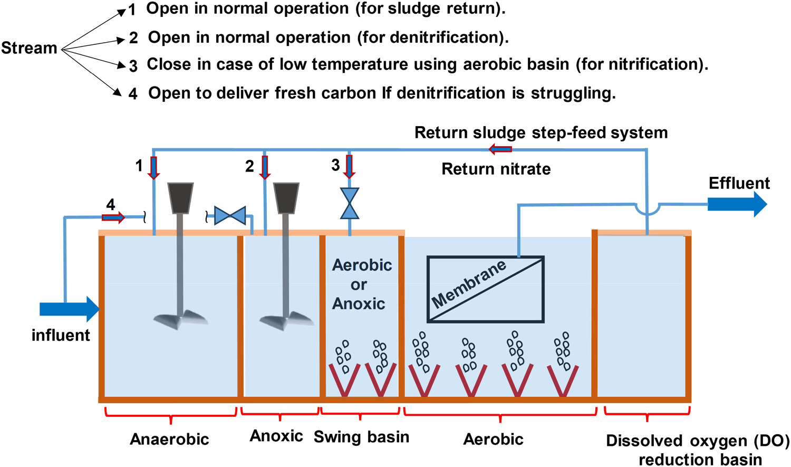
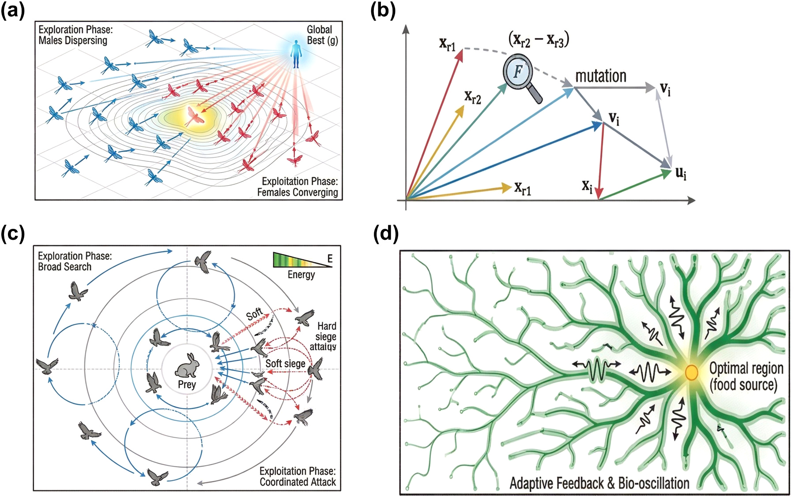
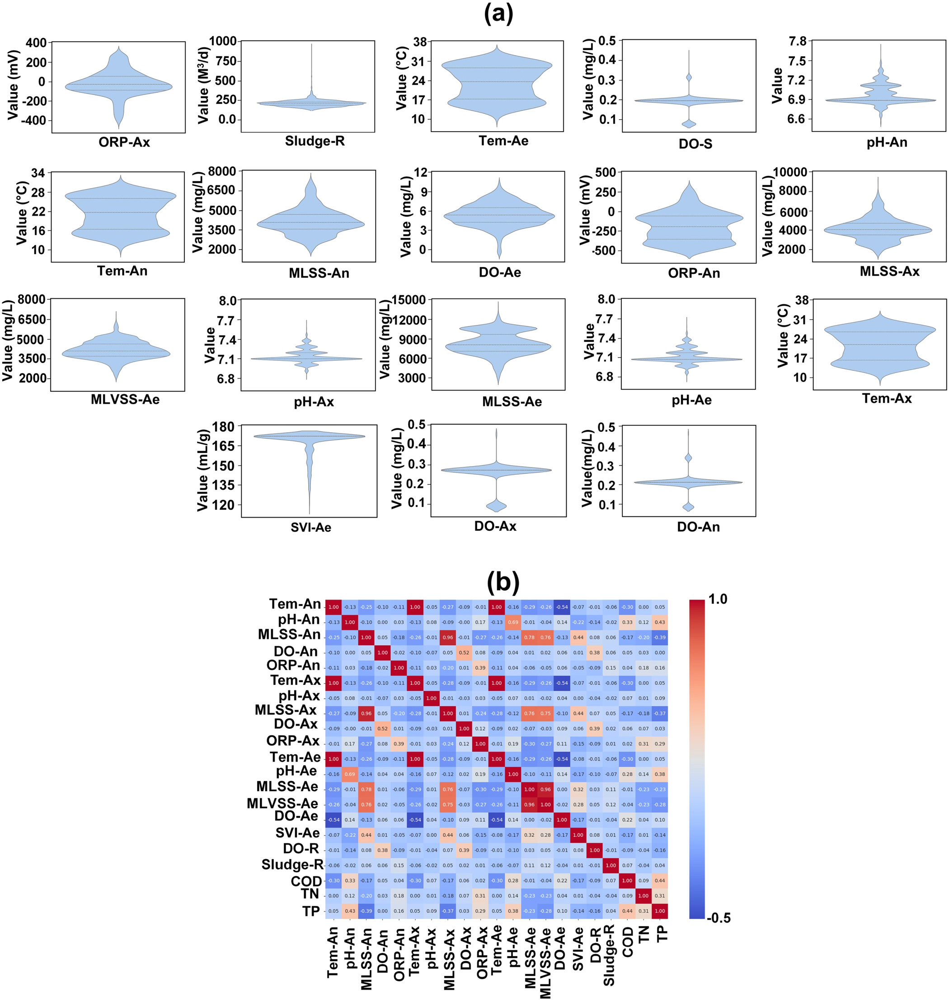
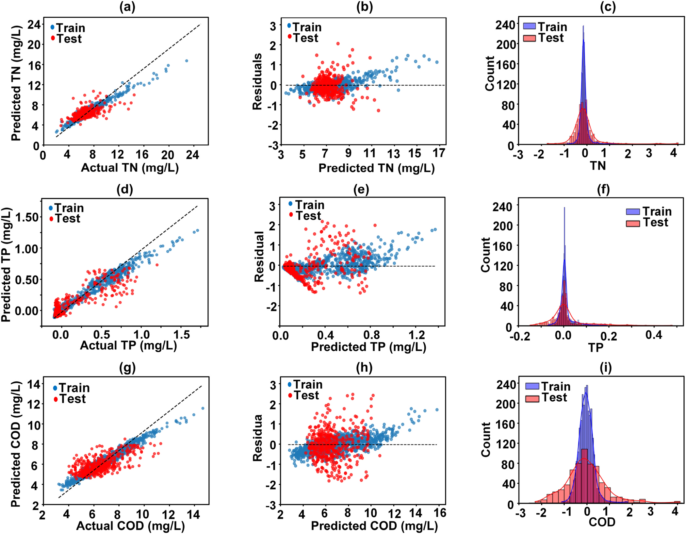
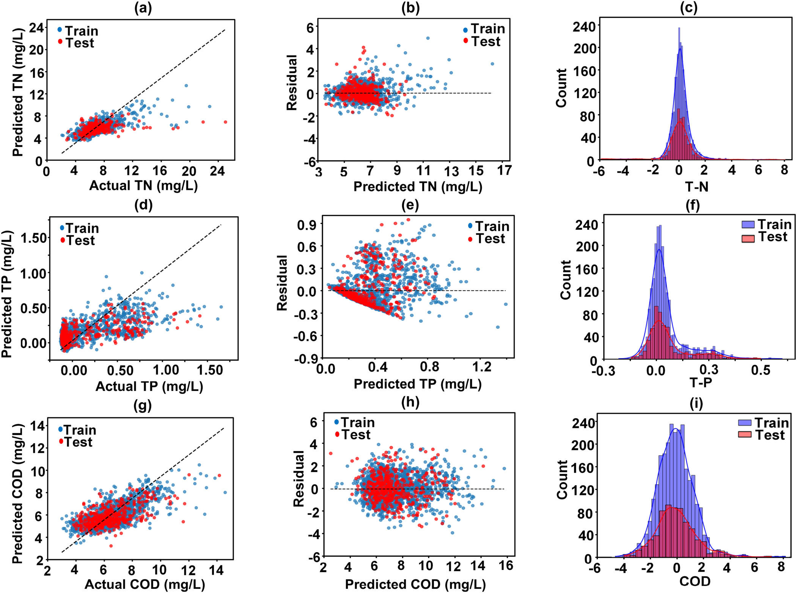
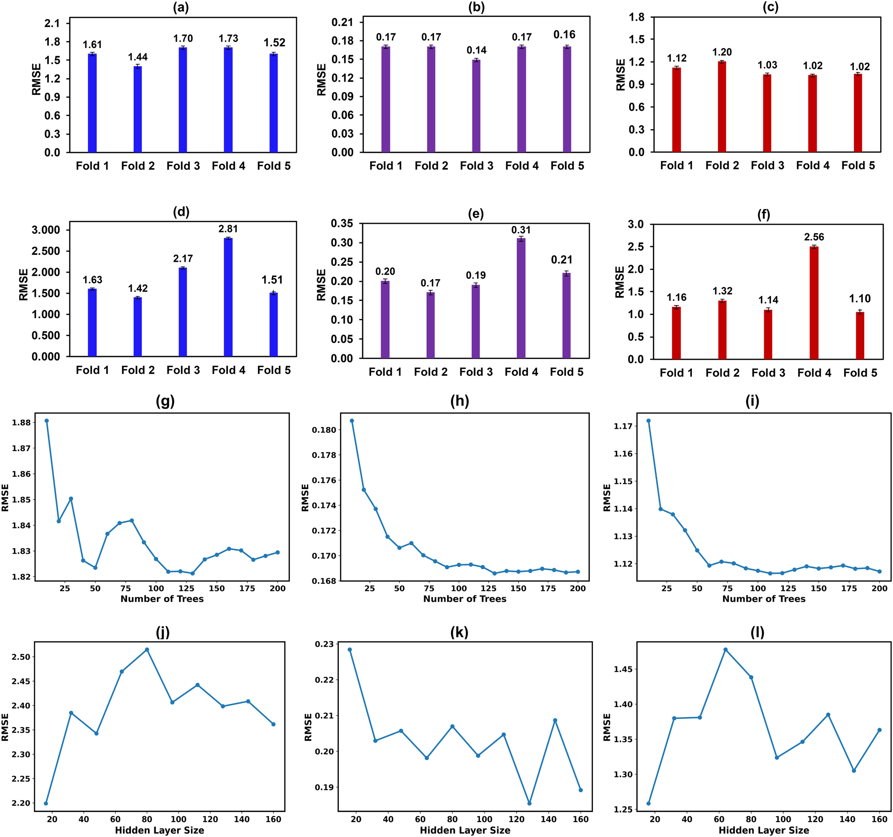
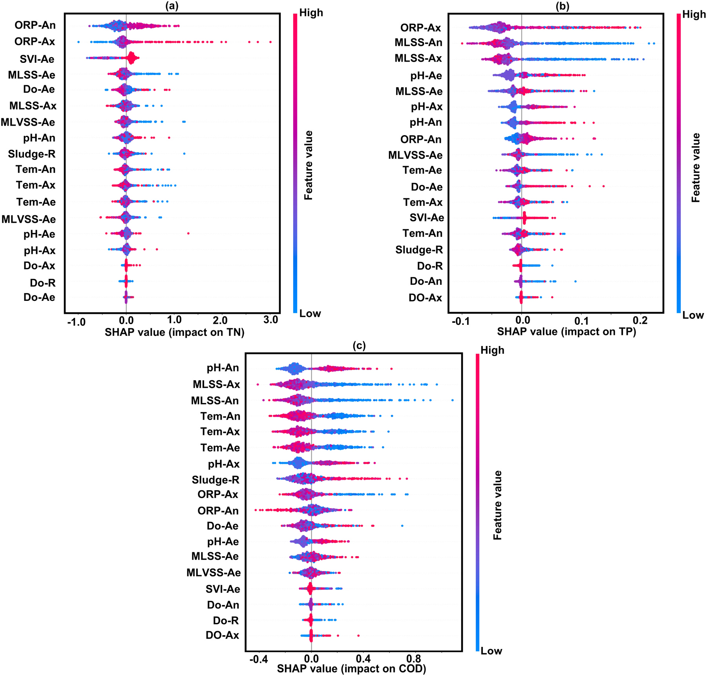
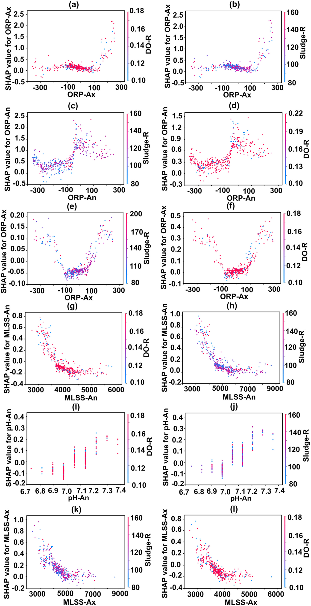
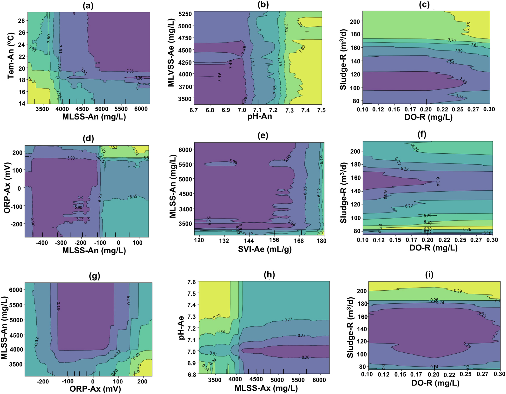
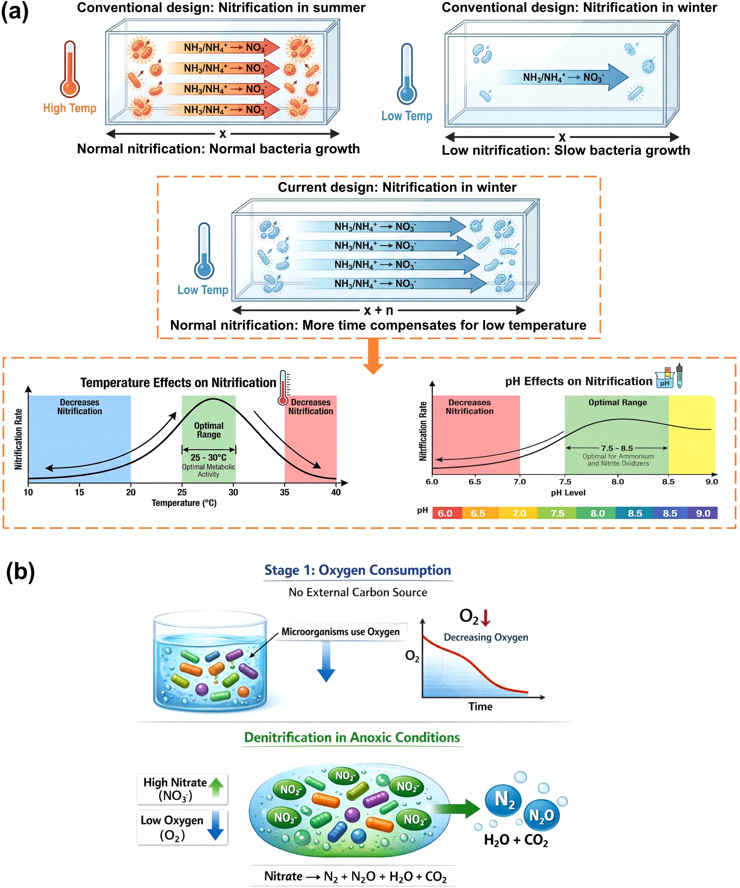

# Maximizing nitrogen removal in a membrane bioreactor (MBR) via a swing-basin and dissolved oxygen reduction configuration: A bio-inspired machine learning optimization approach

## Abstract

- Hệ thống màng sinh học (MBR) truyền thống gặp hai rào cản lớn trong việc xử lý tổng nitơ ($\text{TN}$)
  - Quá trình nitrat hóa suy giảm mạnh trong mùa đông do nhiệt độ thấp ức chế vi khuẩn nitrat hóa tự dưỡng.
  - Quá trình khử nitrat bị cản trở do dòng bùn tuần hoàn mang lượng oxy hòa tan ($\text{DO}$) dư thừa cao vào vùng thiếu khí (anoxic).
  - Tồn tại sự cạnh tranh gay gắt về nguồn cơ chất cacbon giữa vi khuẩn khử nitrat và sinh vật tích lũy photpho ($\text{PAO}$).
- Cấu hình đề xuất tích hợp đồng thời hai giải pháp kỹ thuật bổ trợ
  - Bể chuyển đổi (swing-basin) tăng cường nitrat hóa bằng cách chuyển đổi linh hoạt giữa chế độ hiếu khí (aerobic) và thiếu khí (anoxic) trong thời kỳ nhiệt độ thấp.
  - Bể giảm oxy hòa tan ($\text{DO-R}$) hạ thấp nồng độ $\text{DO}$ của dòng bùn hồi lưu trước khi đưa vào vùng thiếu khí, triệt tiêu sự ức chế oxy đối với vi khuẩn khử nitrat.
- Cơ sở dữ liệu vận hành quy mô thực tế được thu thập liên tục trong thời gian hơn 1 năm
  - Vị trí thu thập dữ liệu tại Trạm xử lý nước thải công cộng "D" ở Hàn Quốc với công suất thiết kế $25.000\text{ m}^3/\text{ngày}$.
  - Tập dữ liệu bao gồm các chỉ số chất lượng nước đầu vào, thông số vận hành các ngăn bể và nồng độ chất ô nhiễm đầu ra ($\text{COD}$, $\text{TN}$, $\text{TP}$).
- Đánh giá và so sánh hiệu năng của hai mô hình học máy
  - Mô hình Rừng ngẫu nhiên ($\text{RF}$) đạt độ chính xác cao hơn mô hình mạng nơ-ron sâu ($\text{DNN}$).
  - Chỉ số sai số căn bậc hai trung bình ($\text{RMSE}$) trong dự đoán nồng độ $\text{TN}$ của $\text{RF}$ đạt $1.73$, vượt hơn mức $2.81$ của $\text{DNN}$.
- Phân tích cơ chế giải thích mô hình bằng Shapley Additive exPlanations ($\text{SHAP}$)
  - Bể swing-basin mở rộng thể tích hiếu khí hiệu dụng và kéo dài thời gian lưu nước ($\text{HRT}$) trong mùa đông, duy trì động học chuyển hóa amoni ($\text{NH}_4^+$) thành nitrat ($\text{NO}_3^-$).
  - Bể $\text{DO-R}$ triệt tiêu oxy tự do nhờ quá trình hô hấp nội bào, loại bỏ sự cạnh tranh giữa oxy và nitrat đối với vi khuẩn khử nitrat dị dưỡng.
- Tối ưu hóa điều kiện vận hành bằng thuật toán tiến hóa sinh học Harris Hawks ($\text{HHO}$)
  - Thuật toán $\text{HHO}$ đạt mức độ hội tụ gần nhất với phương pháp chuẩn Tiến hóa vi phân ($\text{DE}$).
  - Lưu lượng bùn tuần hoàn tối ưu qua bể $\text{DO-R}$ được xác định ở mức $146.23\text{ m}^3/\text{ngày}$.
  - Nồng độ chất ô nhiễm trong nước sau xử lý giảm xuống mức tối thiểu: $\text{COD}$ đạt $5.96\text{ mg/L}$, $\text{TN}$ đạt $5.26\text{ mg/L}$, và $\text{TP}$ đạt $0.06\text{ mg/L}$.

## 1 Introduction

- Nhà máy xử lý nước thải ($\text{WWTPs}$) ứng dụng quá trình sinh học để chuyển hóa chất ô nhiễm
  - Các chuyển hóa vi sinh vật xử lý đồng thời chất hữu cơ, nitơ và photpho trong các phân vùng kỵ khí, thiếu khí và hiếu khí.
  - Công nghệ màng sinh học ($\text{MBR}$) trở thành lựa chọn ưu tiên nhờ hiệu suất phân tách cao, diện tích xây dựng nhỏ và khả năng duy trì nồng độ sinh khối ($\text{MLSS}$) cao.
- Cấu hình $\text{MBR}$ truyền thống gặp hai nút thắt vận hành liên quan mật thiết đến nhau
  - Nhiệt độ thấp trong mùa đông ức chế hoạt tính của vi khuẩn nitrat hóa, dẫn đến hiện tượng trôi thoát amoni và suy giảm hiệu quả xử lý $\text{TN}$.
  - Nồng độ oxy hòa tan ($\text{DO}$) dư thừa trong dòng bùn tuần hoàn xâm nhập vào vùng thiếu khí (anoxic), gây ức chế vi khuẩn khử nitrat dị dưỡng.
  - Sự cạnh tranh cơ chất cacbon giữa vi khuẩn khử nitrat và sinh vật tích lũy photpho ($\text{PAO}$) trong điều kiện nước thải thiếu cacbon làm hiệu quả xử lý $\text{TN}$ suy giảm nghiêm trọng.
- Các nghiên cứu cải tiến trước đây xử lý cục bộ các thông số riêng lẻ
  - Phương pháp kiểm soát nồng độ amoni tự do làm giàu quần thể vi sinh vật nitrat hóa - khử nitrat, đạt hiệu suất khử $\text{TN}$ $97.12\%$ và giảm $33\%$ lượng tiêu thụ cacbon.
  - Cấu hình $\text{MBR}$ màng động sục khí gián đoạn hỗ trợ nitrat hóa - khử nitrat một phần ở tỷ lệ $\text{COD/N}$ thấp, đạt hiệu suất khử $\text{TN}$ $86.14\%$.
  - Ứng dụng khử nitrat tự dưỡng bằng lưu huỳnh kết hợp châm hóa chất keo tụ hoặc bổ sung giá thể mang lưu huỳnh cải thiện hiệu quả khử $\text{TN}$ từ $30\%$ đến $40\%$.
  - Các giải pháp trên chưa giải quyết đồng bộ sự mất cân bằng oxy giữa các vùng phản ứng và sự suy giảm hoạt tính sinh học theo mùa.
- Nghiên cứu đề xuất cấu hình $\text{MBR}$ tích hợp hai giải pháp kỹ thuật bổ trợ
  - Bể chuyển đổi (swing-basin) hoạt động linh hoạt giữa chế độ thiếu khí và hiếu khí, cho phép điều chỉnh thể tích vùng hiếu khí để đảm bảo tốc độ nitrat hóa ổn định khi nhiệt độ nước thải xuống thấp.
  - Bể giảm oxy hòa tan ($\text{DO-R}$) ngắt sục khí sau vùng hiếu khí, thúc đẩy vi sinh vật tiêu thụ $\text{DO}$ dư bằng con đường hô hấp nội bào nhằm tái lập thế khử phù hợp cho quá trình khử nitrat.
- Tích hợp mô hình học máy giải thích được và tối ưu hóa lấy cảm hứng sinh học
  - Mô hình hóa mối quan hệ phi tuyến phức tạp giữa thông số vận hành và chất lượng nước sau xử lý thông qua Rừng ngẫu nhiên ($\text{RF}$) và Mạng nơ-ron sâu ($\text{DNN}$).
  - Sử dụng phương pháp Shapley Additive exPlanations ($\text{SHAP}$) để định lượng tác động tương hỗ giữa nồng độ $\text{DO}$, bùn tuần hoàn và hiệu quả khử nitơ.
  - So sánh tốc độ hội tụ và độ chính xác của ba thuật toán tối ưu hóa lấy cảm hứng sinh học với chuẩn Tiến hóa vi phân ($\text{DE}$) nhằm tìm ra điều kiện vận hành tối ưu cho trạm $\text{MBR}$ quy mô thực tế.

## 2 Materials and methods

### 2.1 Full-scale MBR plant and data collection

#### 2.1.1 Plant description and operational data source

- Hệ thống màng sinh học ($\text{MBR}$) quy mô thực tế được đặt tại Trạm xử lý nước thải công cộng "D" ở Hàn Quốc
  - Trạm xử lý có công suất thiết kế đạt mức $25.000\text{ m}^3/\text{ngày}$.
  - Dữ liệu vận hành thực tế được theo dõi và thu thập liên tục trong khoảng thời gian hơn 1 năm.
- Cơ sở dữ liệu bao gồm giá trị trung bình hàng ngày của các thông số chất lượng nước và vận hành
  - Các thông số chất lượng nước đo đạc bao gồm $\text{COD}$, $\text{TN}$ và $\text{TP}$ từ dòng đầu vào và các phân vùng xử lý.
  - Các thông số vận hành kỹ thuật bao gồm lưu lượng dòng chảy, chế độ sục khí và nhiệt độ vận hành.
  - Nồng độ chất ô nhiễm trung bình trong nước thải đầu vào ghi nhận: $\text{COD}$ đạt $15.50\text{ mg/L}$, $\text{TN}$ đạt $27.91\text{ mg/L}$ và $\text{TP}$ đạt $1.80\text{ mg/L}$.
  - Tập dữ liệu đầy đủ này được sử dụng làm cơ sở huấn luyện và kiểm định các mô hình học máy.

#### 2.1.2 Integrated MBR process configuration

- Đơn vị màng $\text{MBR}$ đóng vai trò phân tách pha rắn - lỏng và duy trì nồng độ bùn hoạt tính ($\text{MLSS}$) cao
  - Màng sinh học giữ lại toàn bộ sinh khối hoạt tính trong bể, tạo dòng nước sau lọc có chất lượng trong và ổn định.
  - Mục tiêu cốt lõi của cấu hình cải tiến là tối đa hóa hiệu suất khử $\text{TN}$ trong khi vẫn duy trì cân bằng xử lý $\text{TP}$ và $\text{COD}$.
- Cấu hình tổng thể tích hợp hai giải pháp kỹ thuật bổ trợ khắc phục mất cân bằng oxy và nhạy cảm nhiệt độ
  - Tích hợp bể chuyển đổi (swing-basin) để tăng cường quá trình nitrat hóa trong điều kiện mùa lạnh.
  - Bổ sung bể giảm oxy hòa tan ($\text{DO-R}$) nhằm ngăn chặn oxy hòa tan dư thừa xâm nhập vào vùng thiếu khí.
    - **Hình 1.** Sơ đồ cấu hình hệ thống phản ứng MBR tích hợp bể chuyển đổi và bể DO-R
      - 
      - **Hình này chứng minh điều gì**
        - Sơ đồ chuỗi công nghệ kết hợp bể swing và bể DO-R khử đồng thời nitơ và photpho.
      - **Từ đâu mà thấy được**
        - Dòng bùn tuần hoàn từ bể MBR đi qua bể DO-R không sục khí trước khi hồi lưu anoxic.

#### 2.1.3 Process unit design and functional rationale

- Vùng kỵ khí (2.1.3.1 Anaerobic zone) là điểm khởi đầu thiết yếu cho chu trình giải phóng photpho
  - Điều kiện vận hành duy trì triệt để không có oxy hòa tan và không chứa nitrat.
  - Quần thể sinh vật tích lũy photpho ($\text{PAO}$) thủy phân polyphosphate nội bào để tạo năng lượng, giải phóng photphat hòa tan vào dung dịch.
  - Sự tích lũy cacbon hòa tan dễ phân hủy dưới dạng polyhydroxyalkanoate ($\text{PHA}$) trong tế bào $\text{PAO}$ làm giảm sự cạnh tranh cacbon đối với vi khuẩn khử nitrat ở vùng sau.
- Vùng thiếu khí (2.1.3.2 Anoxic zone) là vị trí phản ứng chính của quá trình khử nitrat tổng thể
  - Môi trường phản ứng đặc trưng bởi sự vắng mặt của $\text{DO}$ cùng với sự hiện diện của nitrat ($\text{NO}_3^-$) và nitrit ($\text{NO}_2^-$).
  - Vi khuẩn dị dưỡng tùy nghi sử dụng các dạng nitơ oxy hóa làm chất nhận electron cuối cùng thay thế cho oxy tự do.
  - Quá trình khử sinh hóa chuyển hóa tuần tự từ nitrat sang nitrit ($\text{NO}_2^-$), oxit nitric ($\text{NO}$), oxit đinitơ ($\text{N}_2\text{O}$) và khí nitơ vô hại ($\text{N}_2$).
  - Nồng độ oxy xâm nhập phải được giữ ở mức tối thiểu để tránh ức chế các enzyme khử nitrat đặc hiệu.
- Bể chuyển đổi (2.1.3.3 Swing basin) hoạt động như một vùng đệm linh hoạt cho quá trình nitrat hóa
  - Khả năng chuyển đổi luân phiên giữa chế độ thiếu khí và hiếu khí thông qua việc bật hoặc tắt hệ thống sục khí.
  - Trong mùa đông lạnh, vận hành chế độ hiếu khí giúp mở rộng thể tích sục khí hiệu dụng và kéo dài thời gian lưu thủy lực ($\text{HRT}$).
  - Sự ổn định quá trình nitrat hóa ngăn ngừa amoni tích tụ trong nước sau xử lý và giảm bớt nhu cầu bổ sung nguồn cacbon ngoại sinh.
  - Quá trình chuyển hóa amoni hoàn chỉnh hạn chế sự cạnh tranh oxy giữa vi khuẩn nitrat hóa và vi khuẩn $\text{PAO}$, hỗ trợ gián tiếp cho việc hấp thu photpho.
- Vùng hiếu khí và ngăn màng MBR (2.1.3.4 Aerobic zone and MBR) duy trì hai quá trình sinh học song song
  - Sục khí liên tục thúc đẩy vi khuẩn tự dưỡng chuyển hóa amoni ($\text{NH}_4^+$) thành nitrat ($\text{NO}_3^-$) qua bước trung gian nitrit.
  - Nguồn năng lượng $\text{PHA}$ tích lũy được vi khuẩn $\text{PAO}$ sử dụng để hấp thu lượng lớn photphat từ hỗn hợp bùn, lưu trữ dưới dạng hạt polyphosphate nội bào.
- Bể giảm oxy hòa tan (2.1.3.5 DO reduction basin) loại bỏ oxy hòa tan dư thừa khỏi dòng bùn hồi lưu
  - Bể phản ứng chuyên biệt không cấp khí được lắp đặt ngay sau vùng hiếu khí và ngăn màng $\text{MBR}$.
  - Vi sinh vật thực hiện quá trình hô hấp nội bào trong điều kiện thiếu cacbon ngoại sinh để tiêu thụ lượng $\text{DO}$ còn tồn dư.
  - Ngăn ngừa hiện tượng ngộ độc oxy trong vùng thiếu khí, tạo điều kiện thuận lợi nhất cho quá trình khử nitrat đạt hiệu suất cao.
  - Môi trường không chứa $\text{DO}$ bảo vệ hoạt tính giải phóng photpho của vi khuẩn $\text{PAO}$ khi hồi lưu về ngăn trước.
- Hệ thống phân dòng bùn hồi lưu từng bậc (2.1.3.6 Return sludge step-feed system) kiểm soát linh hoạt dòng mang nitrat
  - Thiết kế các đường ống tuần hoàn độc lập cho phép điều chỉnh lưu lượng bùn đưa về vùng kỵ khí hoặc vùng chuyển đổi/thiếu khí.
  - Khả năng tinh chỉnh lưu lượng bùn giúp tối ưu hóa nồng độ cơ chất và thời gian tiếp xúc của các chủng vi sinh vật.
- Đường tắt dòng nước thải đầu vào (2.1.3.7 Influent bypass - Line 4) khắc phục hiện tượng thiếu hụt cacbon
  - Cơ chế cho phép dẫn trực tiếp một phần nước thải thô giàu $\text{COD}$ dễ phân hủy (như axit béo bay hơi) vào thẳng vùng thiếu khí.
  - Đường tắt được kích hoạt khi hiệu suất khử nitrat giảm sút nhằm bổ sung chất cho electron cho vi khuẩn khử nitrat mà không qua ngăn kỵ khí.

### 2.2 Data cleaning and normalization

- Quy trình làm sạch dữ liệu và tiền xử lý thu được tập dữ liệu chuẩn mực
  - Tổng số mẫu quan sát hợp lệ sau khi sàng lọc đạt $2.191$ điểm dữ liệu cho phân tích học máy.
  - Các lỗi định dạng chuỗi số, dấu phẩy và khoảng trắng thừa được loại bỏ để chuyển đổi sang định dạng số thực.
  - Các giá trị khuyết thiếu được xử lý bằng thuật toán điền giá trị trung bình qua hàm SimpleImputer nhằm bảo toàn tính nhất quán thống kê.
- Chuẩn hóa đặc trưng bằng kỹ thuật thang đo độ lệch chuẩn (StandardScaler)
  - Biến đổi toàn bộ các biến đầu vào về phân phối có giá trị trung bình bằng 0 và phương sai bằng 1 ($\mu = 0, \sigma^2 = 1$).
  - Loại bỏ ảnh hưởng do sự chênh lệch lớn về đơn vị đo lường và thang đo giữa các biến vận hành khác nhau.
- Cơ sở khoa học trong việc lựa chọn $18$ biến đặc trưng vận hành
  - Nhiệt độ tại ba vùng kỵ khí, thiếu khí và hiếu khí phản ánh chính xác sự suy giảm hoạt tính nitrat hóa theo mùa trong mùa đông.
  - Thế oxy hóa - khử ($\text{ORP}$) và oxy hòa tan ($\text{DO}$) tại các phân vùng định lượng trạng thái redox quyết định hiệu suất khử nitrat và chuyển hóa của vi khuẩn $\text{PAO}$.
  - Nồng độ chất rắn lơ lửng dễ bay hơi ($\text{MLVSS}$) kết hợp với $\text{MLSS}$ giúp phân định sinh khối vi sinh vật hoạt tính với cặn trơ vô cơ.
  - Chỉ số thể tích bùn ($\text{SVI}$) theo dõi đặc tính lắng của bùn nhằm kiểm soát rủi ro thất thoát sinh khối qua màng.
  - Lưu lượng bùn tuần hoàn ($\text{Sludge-R}$) kiểm soát trực tiếp lượng nitrat hồi lưu về ngăn thiếu khí cho phản ứng khử nitrat.
  - Tập đặc trưng phản ánh đúng cơ chế động học sinh hóa của trạm xử lý, tạo nền tảng vững chắc cho phân tích giải thích bằng $\text{SHAP}$.

### 2.3 Implementation of machine learning algorithms

- Hai thuật toán học máy được triển khai để giải bài toán hồi quy đa biến
  - Rừng ngẫu nhiên (Random Forest Regressor - $\text{RFR}$) hoạt động theo nguyên lý tập hợp (ensemble) kết hợp kết quả từ nhiều cây quyết định độc lập.
  - Mỗi cây trong $\text{RFR}$ được huấn luyện trên một tập con ngẫu nhiên của dữ liệu và đặc trưng để giảm thiểu hiện tượng quá khớp (overfitting).
  - Mạng nơ-ron sâu ($\text{DNN}$) được thiết kế với nhiều tầng liên kết đầy đủ (Dense layers) để học các mối quan hệ phi tuyến tính phức tạp thông qua thuật toán lan truyền ngược.
- Thiết lập môi trường phần mềm và cấu trúc mạng nơ-ron
  - Mô hình $\text{RF}$ được xây dựng bằng lớp `RandomForestRegressor` trong thư viện `scikit-learn`.
  - Mô hình $\text{DNN}$ được phát triển trên nền tảng `TensorFlow/Keras` với kiến trúc tuần tự (`Sequential`), tích hợp kỹ thuật ngắt kết nối ngẫu nhiên (`Dropout`) để chống quá khớp.
  - Các thư viện hỗ trợ xử lý dữ liệu và thống kê bao gồm `pandas`, `numpy`, `matplotlib` và `seaborn`.
- Hệ thống $18$ thông số đầu vào và $3$ chỉ tiêu đầu ra được mã hóa chuẩn xác
  - Phân vùng kỵ khí gồm $5$ biến: nhiệt độ ($\text{Tem-An}$, $^\circ\text{C}$), $\text{pH-An}$, nồng độ bùn ($\text{MLSS-An}$, $\text{mg/L}$), oxy hòa tan ($\text{DO-An}$, $\text{mg/L}$) và thế oxy hóa khử ($\text{ORP-An}$, $\text{mV}$).
  - Phân vùng thiếu khí/chuyển đổi gồm $5$ biến: $\text{Tem-Ax}$ ($^\circ\text{C}$), $\text{pH-Ax}$, $\text{MLSS-Ax}$ ($\text{mg/L}$), $\text{DO-Ax}$ ($\text{mg/L}$) và $\text{ORP-Ax}$ ($\text{mV}$).
  - Phân vùng hiếu khí gồm $6$ biến: $\text{Tem-Ae}$ ($^\circ\text{C}$), $\text{pH-Ae}$, $\text{MLSS-Ae}$ ($\text{mg/L}$), nồng độ bùn bay hơi ($\text{MLVSS-Ae}$, $\text{mg/L}$), $\text{DO-Ae}$ ($\text{mg/L}$) và chỉ số thể tích bùn ($\text{SVI-Ae}$, $\text{mL/g}$).
  - Bể giảm oxy hòa tan và dòng hồi lưu gồm $2$ biến: $\text{DO-R}$ ($\text{mg/L}$) và lưu lượng bùn tuần hoàn ($\text{Sludge-R}$, $\text{m}^3/\text{ngày}$).
  - Ba mục tiêu chất lượng nước đầu ra cần dự đoán đồng thời: $\text{COD}$ ($\text{mg/L}$), $\text{TN}$ ($\text{mg/L}$) và $\text{TP}$ ($\text{mg/L}$).
- Tiêu chí lựa chọn mô hình phục vụ tối ưu hóa hệ thống
  - Đánh giá song song giữa phương pháp học máy tập hợp và mạng nơ-ron sâu trên cùng một tập dữ liệu chuẩn hóa.
  - Thuật toán đạt độ chính xác cao nhất được chọn làm mô hình nền tảng cho phân tích giải thích bằng $\text{SHAP}$ và tối ưu hóa vận hành.

### 2.4 Hyperparameter optimization

- Tối ưu hóa siêu tham số mô hình Rừng ngẫu nhiên ($\text{RF}$) qua tìm kiếm lưới kết hợp kiểm định chéo
  - Cấu hình siêu tham số tối ưu được xác lập chặt chẽ:
    - Số lượng cây quyết định: `n_estimators = 500`.
    - Số mẫu tối thiểu để phân tách một nút: `min_samples_split = 2`.
    - Số mẫu tối thiểu tại một nút lá: `min_samples_leaf = 1`.
    - Số lượng đặc trưng tối đa khi phân nhánh: `max_features = 'log2'`.
    - Độ sâu tối đa của cây: `max_depth = None` (phát triển tự nhiên đến khi các lá thuần nhất).
    - Hạt giống ngẫu nhiên: `random_state = 42` và sử dụng toàn bộ tài nguyên luồng tính toán: `n_jobs = -1`.
- Quy trình điều chỉnh siêu tham số cho mạng nơ-ron sâu ($\text{DNN}$)
  - Thực hiện thử nghiệm đa dạng các tổ hợp số lượng nơ-ron trong các lớp ẩn và tỷ lệ ngắt kết nối (`dropout rate`).
  - Huấn luyện mô hình qua nhiều chu kỳ (epochs) bằng thuật toán hạ gradient theo lô (batch gradient descent).
  - Lựa chọn cấu trúc tối ưu dựa trên hàm mất mát kiểm định (validation loss) nhằm đảm bảo sự so sánh công bằng giữa hai phương pháp tiếp cận.

### 2.5 Model performance evaluation

- Phương pháp kiểm định chéo $5$ phần ($5\text{-fold cross-validation}$) làm chuẩn đánh giá khách quan
  - Toàn bộ tập dữ liệu được phân chia thành $5$ tập con đồng đều và luân phiên kiểm thử.
  - Mỗi vòng kiểm định sử dụng $4$ phần để huấn luyện mô hình và $1$ phần dữ liệu độc lập chưa từng thấy để kiểm tra độ chính xác.
  - Quy trình được lặp lại $5$ lần để đảm bảo mọi quan sát đều được sử dụng làm tập kiểm thử đúng một lần.
  - Kết quả đánh giá cuối cùng là giá trị trung bình trên toàn bộ $5$ lượt kiểm định chéo.
- Ưu điểm rõ rệt so với phương pháp phân chia dữ liệu đơn lẻ (single train-test split)
  - Triệt tiêu hiện tượng sai lệch do ngẫu nhiên hóa và giảm thiểu nguy cơ quá khớp đối với một tập dữ liệu con cụ thể.
  - Đảm bảo mô hình có khả năng khái quát hóa cao trên các tập dữ liệu vận hành thực tế độc lập.
- Hệ thống ba chỉ số sai số đánh giá độ chính xác dự đoán
  - Căn bậc hai sai số trung bình bình phương ($\text{RMSE}$) phản ánh mức độ phân tán và độ lệch của giá trị dự đoán so với thực tế.
  - Sai số tuyệt đối trung bình ($\text{MAE}$) đo lường độ lớn sai số bình quân mà không khuếch đại các điểm dị biệt.
  - Sai số trung bình bình phương ($\text{MSE}$) cung cấp thêm cơ sở xác thực tính đồng nhất của mô hình.

### 2.6 Explainable machine learning models

- Ứng dụng phương pháp học máy giải thích được (XAI) nhằm mở hộp đen mô hình
  - Mô hình có độ chính xác cao nhất được phân tích sâu bằng hai kỹ thuật diễn giải bổ trợ: Shapley Additive exPlanations ($\text{SHAP}$) và Biểu đồ phụ thuộc một phần ($\text{PDP}$).
  - Khám phá các hiệu ứng tương tác phi tuyến và mức độ đóng góp kết hợp của các đặc trưng đầu vào đối với từng chỉ tiêu xử lý.
- Minh bạch hóa cơ chế sinh học và gia tăng độ tin cậy của kết quả dự báo
  - Làm sáng tỏ quy luật tác động định lượng của từng biến vận hành lên nồng độ các chất ô nhiễm đầu ra ($\text{TN}$, $\text{COD}$, $\text{TP}$).
  - Cung cấp cơ sở khoa học giúp gia tăng mức độ tin cậy, tính giải trình và khả năng tái lập trong thực hành kỹ thuật môi trường.
  - Hỗ trợ phát hiện các điểm sai lệch hoặc nguy cơ quá khớp tiềm ẩn trong quá trình học máy.
  - Đóng vai trò kim chỉ nam định hướng việc tinh chỉnh và tối ưu hóa điều kiện vận hành hệ thống $\text{MBR}$ trong thực tế.

### 2.7 Process optimization

- Thiết lập mục tiêu tối ưu hóa đa biến cho trạm xử lý nước thải $\text{MBR}$
  - Tinh chỉnh đồng thời các thông số vận hành nhằm cực tiểu hóa nồng độ $\text{COD}$, $\text{TN}$ và $\text{TP}$ trong nước sau xử lý.
  - Sử dụng mô hình học máy chính xác nhất làm hàm mục tiêu để đánh giá chất lượng nước đầu ra.
- Các thuật toán tối ưu hóa lấy cảm hứng sinh học mô phỏng hành vi tự nhiên để giải bài toán phi tuyến đa mục tiêu
  - Thuật toán Tiến hóa vi phân ($\text{DE}$) đóng vai trò làm chuẩn tham chiếu nhờ tính ổn định và khả năng bao quát không gian nghiệm.
  - Ba thuật toán tiến hóa sinh học hiện đại được đưa vào so sánh: Thuật toán Nấm nhầy ($\text{SMA}$), Thuật toán Thiêu thân ($\text{MOA}$) và Thuật toán Chim ưng Harris ($\text{HHO}$).
    - **Hình 2.** Minh họa trực quan các thuật toán tối ưu hóa dựa trên hành vi tự nhiên
      - 
      - **Hình này chứng minh điều gì**
        - Cơ chế tự nhiên của bốn thuật toán: (a) MOA, (b) DE, (c) HHO và (d) SMA.
      - **Từ đâu mà thấy được**
        - Bốn khung hình thể hiện hành vi đàn thiêu thân, đột biến quần thể, chim ưng săn mồi và mạng lưới nấm nhầy.
- Cơ chế tìm kiếm nghiệm đặc trưng của từng thuật toán tối ưu hóa
  - Thuật toán $\text{DE}$ áp dụng các toán tử đột biến, lai ghép và chọn lọc, tạo độ biến thiên bằng sai phân tỷ lệ giữa các cá thể ngẫu nhiên để tránh mắc kẹt tại cực trị địa phương.
  - Thuật toán $\text{SMA}$ mô phỏng quá trình dao động tìm thức ăn của nấm nhầy dựa trên phản hồi âm và dương, cân bằng linh hoạt giữa mở rộng tìm kiếm và khai thác nghiệm sâu.
  - Thuật toán $\text{MOA}$ tái hiện tập tính kết đôi và bay theo bầy của loài thiêu thân, phân tách quần thể đực - cái để duy trì tính đa dạng di truyền và chống hội tụ sớm.
  - Thuật toán $\text{HHO}$ mô phỏng chiến thuật vây bắt mồi phối hợp của chim ưng Harris, sử dụng biến năng lượng trốn thoát của con mồi để tự động chuyển pha từ tìm kiếm diện rộng sang tập trung khai thác.
- Đặc tả chi tiết cấu trúc mạng nơ-ron sâu ($\text{DNN}$) làm nền tảng dự báo
  - Tầng đầu vào (Input layer) tiếp nhận $18$ biến đặc trưng vận hành đã qua chuẩn hóa thang đo.
  - Tầng ẩn thứ nhất gồm $128$ hoặc $64$ nơ-ron liên kết đầy đủ, sử dụng hàm kích hoạt ReLU kết hợp hệ số ngắt `dropout` từ $0.2$ đến $0.3$.
  - Tầng ẩn thứ hai gồm $64$ hoặc $32$ nơ-ron với hàm kích hoạt ReLU và hệ số ngắt `dropout` từ $0.2$ đến $0.3$ để kiểm soát quá khớp.
  - Tầng đầu ra (Output layer) gồm $3$ nơ-ron với hàm kích hoạt tuyến tính (Linear), thực hiện dự đoán đồng thời các giá trị liên tục của $\text{COD}$, $\text{TN}$ và $\text{TP}$.

## 3 Results and discussion

### 3.1 Feature analysis of different operational parameters

- Thang đo các thông số vận hành phân tán rộng và ma trận tương quan Pearson phản ánh các tương tác phi tuyến phức tạp
  - Các biến vận hành có biên độ biến thiên rất lớn đòi hỏi bắt buộc phải chuẩn hóa thang đo:
    - Oxy hòa tan vùng thiếu khí ($\text{DO-Ax}$): $0.1$ đến $0.5\text{ mg/L}$.
    - Thế oxy hóa khử vùng thiếu khí ($\text{ORP-Ax}$): $-400$ đến $400\text{ mV}$.
    - Nhiệt độ vùng kỵ khí ($\text{Tem-An}$): $10$ đến $24^\circ\text{C}$.
    - Oxy hòa tan bể giảm oxy ($\text{DO-R}$): $0.05$ đến $0.48\text{ mg/L}$.
    - Lưu lượng bùn tuần hoàn ($\text{Sludge-R}$): $19$ đến $905\text{ m}^3/\text{ngày}$.
    - Nồng độ bùn bay hơi vùng hiếu khí ($\text{MLVSS-Ae}$): $2000$ đến $8000\text{ mg/L}$.
    - **Hình 3.** Phân bố khoảng giá trị đặc trưng và ma trận hệ số tương quan Pearson
      - 
      - **Hình này chứng minh điều gì**
        - Sự khác biệt về thang đo dữ liệu (a) và mối quan hệ tuyến tính giữa các biến (b).
      - **Từ đâu mà thấy được**
        - Biểu đồ hộp thể hiện độ phân tán của 18 đặc trưng và bản đồ nhiệt ma trận tương quan.
- Tương quan tuyến tính Pearson đối với quá trình khử tổng nitơ ($\text{TN}$)
  - Hệ số tương quan dương vừa phải giữa $\text{TN}$ và $\text{ORP-Ax}$ ($r = 0.31$) cho thấy kiểm soát ổn định thế redox là điều kiện then chốt của quá trình chuyển hóa nitơ.
  - Bể swing-basin hỗ trợ duy trì cân bằng redox bằng cách luân chuyển linh hoạt trạng thái hiếu khí và thiếu khí để bảo vệ quá trình nitrat hóa trong mùa lạnh.
  - Oxy hòa tan $\text{DO-R}$ ($r = -0.04$) và lưu lượng bùn $\text{Sludge-R}$ ($r = -0.04$) thể hiện tương quan âm yếu, phản ánh vai trò phi tuyến trong việc ngăn chặn oxy xâm lấn và phân bổ sinh khối.
- Tương quan đối với hiệu quả loại bỏ nhu cầu oxy hóa học ($\text{COD}$)
  - Nhiệt độ vùng thiếu khí $\text{Tem-Ax}$ có tương quan dương ($r = 0.30$) với hiệu quả xử lý $\text{COD}$, do hoạt tính vi sinh vật phân hủy chất hữu cơ gia tăng theo nhiệt độ.
  - Lưu lượng bùn $\text{Sludge-R}$ có tương quan dương yếu ($r = 0.07$), phản ánh bùn tuần hoàn được điều hòa trong môi trường $\text{DO}$ thấp giúp tăng cường hoạt tính dị dưỡng phân hủy chất hữu cơ ở các ngăn tiếp theo.
- Tương quan đối với hiệu quả loại bỏ tổng photpho ($\text{TP}$)
  - Nồng độ $\text{DO-R}$ thể hiện tương quan âm yếu ($r = -0.16$) với quá trình xử lý photpho.
  - Nồng độ bùn vùng thiếu khí $\text{MLSS-Ax}$ có tương quan âm vừa phải ($r = -0.37$) với hiệu suất khử $\text{TP}$.
  - Nồng độ sinh khối quá cao trong ngăn anoxic kèm theo oxy dư thừa cản trở chu trình giải phóng và hấp thu photpho của vi khuẩn $\text{PAO}$, đòi hỏi sự điều hòa redox từ bể swing-basin.

### 3.2 Comparison of model accuracy

- Mô hình Rừng ngẫu nhiên thể hiện độ chính xác cao và sai số phần dư tập trung quanh trục không
  - Các điểm dữ liệu giữa giá trị thực tế và dự báo của mô hình $\text{RF}$ phân bố sát đường chéo lý tưởng hơn mô hình $\text{DNN}$.
  - Cấu trúc tập hợp nhiều cây quyết định giúp $\text{RF}$ triệt tiêu nhiễu từ các điểm ngoại lai và xử lý tốt các đặc trưng có thang đo lệch nhau.
  - Phân phối phần dư của $\text{RF}$ có độ trải rộng hẹp và tập trung quanh giá trị 0, phản ánh sai số dự đoán rất nhỏ và độ ổn định cao.
    - **Hình 4.** Giá trị thực tế so với dự đoán và biểu đồ phần dư của mô hình RF
      - 
      - **Hình này chứng minh điều gì**
        - Độ tập trung cao của điểm dự đoán quanh đường chéo đối với $\text{TN}$, $\text{TP}$ và $\text{COD}$.
      - **Từ đâu mà thấy được**
        - Biểu đồ phân tán và phân phối phần dư thu hẹp quanh giá trị sai số bằng 0.
- Mô hình mạng nơ-ron sâu thể hiện độ phân tán lớn hơn và độ lệch phần dư rộng hơn
  - Các điểm dự đoán của $\text{DNN}$ phân tán xa đường chéo chuẩn, cho thấy độ nhạy cao với tính phi đồng nhất của dữ liệu.
  - Phân phối phần dư của $\text{DNN}$ kéo dài về hai phía, ghi nhận nhiều sai số có độ lệch lớn đối với các chỉ tiêu xử lý chất ô nhiễm.
    - **Hình 5.** Giá trị thực tế so với dự đoán và biểu đồ phần dư của mô hình DNN
      - 
      - **Hình này chứng minh điều gì**
        - Mức độ tán xạ rộng của mạng nơ-ron sâu khi dự đoán ba chỉ tiêu $\text{TN}$, $\text{TP}$ và $\text{COD}$.
      - **Từ đâu mà thấy được**
        - Các điểm dữ liệu lệch xa đường chéo lý tưởng và phân phối phần dư trải rộng hai phía.
- Sai số kiểm định chéo năm phần và phân tích độ ổn định theo độ phức tạp mô hình
  - Khoảng biến thiên sai số $\text{RMSE}$ qua $5$ lượt kiểm định chéo của mô hình $\text{RF}$ duy trì mức thấp rõ rệt:
    - Dự đoán tổng nitơ ($\text{TN}$): $\text{RMSE}$ đạt từ $1.44$ đến $1.73$.
    - Dự đoán tổng photpho ($\text{TP}$): $\text{RMSE}$ đạt từ $0.14$ đến $0.17$.
    - Dự đoán nhu cầu oxy hóa học ($\text{COD}$): $\text{RMSE}$ đạt từ $1.02$ đến $1.20$.
  - Mô hình $\text{DNN}$ ghi nhận biên độ sai số $\text{RMSE}$ cao hơn và biến động mạnh hơn:
    - Dự đoán $\text{TN}$: $\text{RMSE}$ dao động từ $1.42$ đến $2.81$.
    - Dự đoán $\text{TP}$ dao động từ $0.17$ đến $0.31$.
    - Dự đoán $\text{COD}$ dao động từ $1.10$ đến $2.56$.
  - Đánh giá theo sai số tuyệt đối trung bình ($\text{MAE}$) và sai số bình phương ($\text{MSE}$):
    - Mô hình $\text{RF}$ ghi nhận $\text{MAE}$ đạt $0.372$ cho $\text{TN}$, $0.032$ cho $\text{TP}$ và $0.303$ cho $\text{COD}$; với $\text{MSE}$ tương ứng là $0.160$, $0.370$ và $0.300$.
    - Mô hình $\text{DNN}$ có sai số lớn hơn đáng kể với $\text{MAE}$ đạt $1.038$ cho $\text{TN}$, $0.147$ cho $\text{TP}$ và $0.846$ cho $\text{COD}$; với $\text{MSE}$ tương ứng là $1.399$, $4.067$ và $0.058$.
    - **Hình 6.** Sai số RMSE qua 5 lượt kiểm định chéo và theo độ phức tạp mô hình
      - 
      - **Hình này chứng minh điều gì**
        - Mô hình $\text{RF}$ đạt $\text{RMSE}$ thấp hơn và duy trì ổn định qua các lần phân chia dữ liệu.
      - **Từ đâu mà thấy được**
        - Biểu đồ cột $\text{RMSE}$ cho từng fold và đường sai số trung bình theo số lượng cây.
- Tác động của độ phức tạp kiến trúc lên sai số dự báo
  - Đường sai số trung bình $\text{RMSE}$ của $\text{RF}$ theo số lượng cây quyết định biến thiên êm thuận và nhanh chóng đạt trạng thái bão hòa ổn định.
  - Mô hình $\text{DNN}$ chịu sự dao động mạnh khi thay đổi số lượng nơ-ron lớp ẩn, thể hiện độ nhạy cao với cấu trúc tham số mạng.

### 3.3 Explainable machine learning

#### 3.3.1 SHAP analysis

- Thứ hạng tương tác SHAP định lượng mức độ đóng góp của các thông số vận hành lên chất lượng nước đầu ra
  - Phân tích đóng góp lên mục tiêu tổng nitơ ($\text{TN}$):
    - Nhiệt độ vùng thiếu khí ($\text{Tem-Ax}$) là nhân tố nhạy cảm hàng đầu ảnh hưởng đến quá trình nitrat hóa và khử nitơ.
    - Nhiệt độ thấp trong mùa đông gây đóng góp âm rõ rệt với giá trị SHAP dao động trong khoảng từ $-0.23$ đến $1.05$.
    - Vận hành bể swing-basin mở rộng vùng hiếu khí cung cấp đủ $\text{DO}$ và thời gian lưu cho vi khuẩn oxy hóa amoni và nitrit.
    - Hai thông số $\text{DO-R}$ và $\text{Sludge-R}$ kiểm soát trực tiếp hiệu quả khử nitrat; khi $\text{DO-R}$ đạt giá trị cao, đóng góp SHAP tiệm cận 0.
    - Bể $\text{DO-R}$ khử sạch oxy hòa tan trong bùn tuần hoàn trước khi đưa về ngăn anoxic, đảm bảo quá trình chuyển tiếp redox thuận lợi.
  - Phân tích đóng góp lên mục tiêu tổng photpho ($\text{TP}$):
    - Thế oxy hóa khử trong bể swing ($\text{ORP-Ax}$) chi phối mạnh mẽ hiệu quả xử lý photpho.
    - Giá trị $\text{ORP}$ thấp ứng với đóng góp SHAP âm, trong khi giá trị $\text{ORP}$ cao tương ứng với đóng góp dương kích thích vi khuẩn $\text{PAO}$ hấp thu photpho.
    - Tỷ lệ bùn tuần hoàn ($\text{Sludge-R}$) thấp đóng góp tích cực cho khử photpho, trong khi tuần hoàn bùn quá mức làm SHAP chuyển dịch về vùng âm.
  - Phân tích đóng góp lên nhu cầu oxy hóa học ($\text{COD}$):
    - Lưu lượng bùn $\text{Sludge-R}$ có tác động chi phối mạnh hơn so với $\text{DO-R}$.
    - Tăng $\text{Sludge-R}$ làm giá trị SHAP dịch chuyển từ âm sang dương do tuần hoàn các hợp chất hữu cơ chưa phân hủy và sản phẩm vi sinh hòa tan.
    - Nồng độ $\text{DO-R}$ cao làm giá trị SHAP chuyển dịch về vùng âm, phản ánh sự oxy hóa hiếu khí tăng cường trong bể $\text{DO-R}$.
    - **Hình 7.** Biểu đồ xếp hạng tương tác SHAP giữa các đặc trưng và ba chỉ tiêu mục tiêu
      - 
      - **Hình này chứng minh điều gì**
        - Thứ hạng đóng góp của các biến vận hành lên nồng độ $\text{TN}$ (a), $\text{TP}$ (b) và $\text{COD}$ (c).
      - **Từ đâu mà thấy được**
        - Độ phân tán của giá trị SHAP đối với nhiệt độ anoxic, thế redox và lưu lượng bùn tuần hoàn.
- Biểu đồ tương tác SHAP làm sáng tỏ tác động kết hợp của bể chuyển đổi và bể giảm oxy hòa tan
  - Cơ chế tương tác đối với động học khử nitơ ($\text{TN}$):
    - Khử nitơ thể hiện độ nhạy cao nhất với tương tác giữa $\text{DO-R}$, $\text{Sludge-R}$ và giá trị $\text{ORP}$ của các bể kỵ khí, thiếu khí.
    - Tại mức $\text{ORP-Ax}$ thấp, bể $\text{DO-R}$ hạn chế truyền oxy, duy trì môi trường khử triệt để cần thiết cho phản ứng khử nitrat hoàn toàn.
    - Khi $\text{ORP-Ax}$ tăng, bể swing-basin cân bằng hệ thống bằng cách luân phiên chu kỳ hiếu khí và thiếu khí để phục hồi hiệu quả khử nitrat.
  - Cơ chế tương tác đối với quá trình xử lý photpho ($\text{TP}$):
    - Ở giá trị $\text{ORP-Ax}$ thấp, điều kiện khử hỗ trợ vi sinh vật giải phóng photpho; khi $\text{ORP-Ax}$ tăng dưới lượng oxy kiểm soát từ bể $\text{DO-R}$, hoạt tính hấp thu photpho được kích hoạt.
    - Tương tác giữa nồng độ bùn kỵ khí ($\text{MLSS-An}$) với $\text{DO-R}$ và $\text{Sludge-R}$ cho thấy sinh khối cao tạo các bông bùn đậm đặc, hạn chế oxy khuếch tán vào lõi sinh khối và giảm bớt nhu cầu tuần hoàn bùn lớn.
  - Cơ chế tương tác đối với chuyển hóa hợp chất hữu cơ ($\text{COD}$):
    - Tương tác giữa $\text{pH-An}$, $\text{DO-R}$ và $\text{Sludge-R}$ chỉ ra rằng rò rỉ oxy từ bùn tuần hoàn phá vỡ điều kiện anoxic và làm suy giảm quá trình khử nitrat.
    - Bể $\text{DO-R}$ triệt tiêu oxy hồi lưu giúp ổn định hiệu suất phân hủy $\text{COD}$.
    - Trong mùa lạnh, việc kéo dài thời gian phản ứng tại bể swing cho phép sử dụng nồng độ $\text{MLSS}$ cao hiệu quả hơn để duy trì tốc độ xử lý $\text{COD}$.
    - **Hình 8.** Biểu đồ tương tác SHAP thể hiện mối liên hệ giữa các thông số quan trọng và mục tiêu
      - 
      - **Hình này chứng minh điều gì**
        - Sự phối hợp giữa $\text{DO-R}$ và $\text{Sludge-R}$ điều tiết động học $\text{TN}$ (a–d), $\text{TP}$ (e–h) và $\text{COD}$ (i–l).
      - **Từ đâu mà thấy được**
        - Các đám mây điểm tương tác giữa nồng độ bùn, thế oxy hóa khử và mức oxy hòa tan.

#### 3.3.2 PDP analysis

- Phân tích biểu đồ phụ thuộc một phần PDP xác định vùng thông số vận hành tối ưu cho từng quá trình sinh học
  - Động học nitơ ($\text{TN}$) thể hiện độ nhạy cao nhất với các tương tác vận hành (Hình 9a–c):
    - Hoạt tính sinh khối vùng hiếu khí được phản ánh qua đáp ứng của $\text{MLVSS-Ae}$; vùng hiệu suất cao (màu vàng) bị giới hạn khi nồng độ sinh khối quá cao do hạn chế truyền khối và thiếu hụt oxy cục bộ.
    - Hiệu quả khử nitrat và loại bỏ $\text{TN}$ tổng thể được điều tiết chính bởi lưu lượng bùn $\text{Sludge-R}$ và oxy hòa tan $\text{DO-R}$.
    - Hiệu suất tối ưu đạt được khi duy trì $\text{Sludge-R}$ ở mức cao kết hợp $\text{DO-R}$ từ trung bình đến cao; dòng bùn tuần hoàn cung cấp sinh khối hoạt tính và bùn giàu nitrat cho vùng thiếu khí.
    - Bể swing-basin hỗ trợ chuyển tiếp redox linh hoạt, ngăn chặn sự tích lũy nitrit ($\text{NO}_2^-$) và giải phóng khí nitơ ($\text{N}_2$).
  - Động học photpho ($\text{TP}$) thể hiện mức độ nhạy cảm thứ cấp (Hình 9d–f):
    - Vùng hiệu suất cao xuất hiện khi lưu lượng bùn tuần hoàn $\text{Sludge-R}$ cao kết hợp với kiểm soát chặt chẽ $\text{ORP-Ax}$ và $\text{pH-Ae}$.
    - Giá trị $\text{pH}$ hiếu khí cao thúc đẩy quá trình kết tủa hóa học với các cation hóa trị hai, trong khi tuần hoàn bùn hợp lý hỗ trợ vận chuyển photpho về vùng xử lý.
    - Chu kỳ redox luân phiên của bể swing-basin tạo môi trường tối ưu cho vi khuẩn $\text{PAO}$ hấp thu photpho hiệu quả.
  - Động học chất hữu cơ ($\text{COD}$) phụ thuộc vào điều kiện kỵ khí và cân bằng redox (Hình 9g–i):
    - Nhiệt độ kỵ khí $\text{Tem-An}$ thấp và nồng độ $\text{MLSS-An}$ ở mức vừa phải tạo thuận lợi cho phân hủy $\text{COD}$.
    - Nồng độ $\text{MLSS}$ quá cao làm gia tăng lượng cặn trơ vô cơ và cản trở truyền khối, làm giảm tỷ lệ sinh khối hoạt tính.
    - Giá trị $\text{pH}$ kỵ khí cao thúc đẩy quá trình thủy phân và lên men các hợp chất hữu cơ phức tạp, bổ sung nguồn cacbon cho khử nitrat.
    - Cặp thông số $\text{Sludge-R}$ và $\text{DO-R}$ chỉ hỗ trợ xử lý $\text{COD}$ trong một khoảng hẹp; nếu vượt ngưỡng sẽ gây xáo trộn cân bằng oxy hóa khử.
    - **Hình 9.** Phân tích biểu đồ phụ thuộc một phần PDP cho các chỉ tiêu chất lượng nước
      - 
      - **Hình này chứng minh điều gì**
        - Biên độ tối ưu của các biến vận hành đối với $\text{TN}$ (a–c), $\text{TP}$ (d–f) và $\text{COD}$ (g–i).
      - **Từ đâu mà thấy được**
        - Vùng đáp ứng màu vàng biểu thị hiệu suất xử lý cao nhất trên bề mặt phản ứng hai biến.

#### 3.3.3 Clarifying the performance impacts of swing-basin and DO-R configurations

- Đánh giá định lượng cơ chế tăng cường nitrat hóa mùa đông của bể swing và cơ chế khử oxy của bể DO-R
  - Cơ chế bù trừ nhiệt độ của bể chuyển đổi (swing-basin) trong mùa đông:
    - Trong mùa lạnh, hoạt tính trao đổi chất và tốc độ sinh trưởng của vi khuẩn oxy hóa amoni và nitrit bị suy giảm mạnh.
    - Cấu hình thông thường bị giảm hiệu suất nitrat hóa nghiêm trọng và tích tụ amoni khi nhiệt độ nước thải hạ thấp.
    - Cấu hình đề xuất mở rộng linh hoạt vùng hiếu khí trong mùa đông, kéo dài thời gian lưu bùn và tăng lượng oxy tiếp xúc.
    - Duy trì quần thể vi khuẩn nitrat hóa ổn định, đảm bảo chuỗi chuyển hóa tuần tự amoni thành nitrat xuyên suốt các mùa trong năm.
  - Cơ chế tạo lập môi trường anoxic sâu của bể giảm oxy hòa tan ($\text{DO-R}$):
    - Dòng bùn hồi lưu giàu oxy đi vào bể $\text{DO-R}$ không cấp khí ngoài.
    - Vi sinh vật tiêu thụ triệt để lượng $\text{DO}$ tồn dư thông qua con đường hô hấp nội bào do không có nguồn cacbon ngoại sinh.
    - Nồng độ oxy hòa tan suy giảm dần đến mức triệt tiêu, ức chế hoàn toàn con đường hô hấp hiếu khí.
    - Tái lập thế khử phù hợp cho phép vi khuẩn khử nitrat dị dưỡng sử dụng nitrat ($\text{NO}_3^-$) làm chất nhận electron chính, đẩy nhanh động học phản ứng và nâng cao hiệu suất loại bỏ $\text{TN}$.
    - **Hình 10.** So sánh hiệu quả nitrat hóa và tác động của bể DO-R lên quá trình khử nitrat
      - 
      - **Hình này chứng minh điều gì**
        - So sánh hiệu quả nitrat hóa giữa cấu hình thông thường và cấu hình swing (a) cùng tác động của bể $\text{DO-R}$ (b).
      - **Từ đâu mà thấy được**
        - Đồ thị ảnh hưởng của pH, nhiệt độ lên nitrat hóa và đường suy giảm nồng độ oxy hòa tan theo thời gian.

### 3.4 Process optimization

- Bảng 4 so sánh kết quả tối ưu hóa đa mục tiêu giữa phương pháp chuẩn và các thuật toán sinh học
  - Phương pháp chuẩn Tiến hóa vi phân ($\text{DE}$) thiết lập mốc tham chiếu kỹ thuật:
    - Nồng độ các chất ô nhiễm sau xử lý được tối thiểu hóa: $\text{COD}$ đạt $5.59\text{ mg/L}$, $\text{TN}$ đạt $5.06\text{ mg/L}$ và $\text{TP}$ đạt $0.06\text{ mg/L}$.
    - Thông số vận hành tối ưu: lưu lượng bùn tuần hoàn $\text{Sludge-R}$ đạt $139.67\text{ m}^3/\text{ngày}$ và nồng độ $\text{DO-R}$ đạt $0.20\text{ mg/L}$.
  - Thuật toán Nấm nhầy ($\text{SMA}$) đạt các giá trị cận tối ưu:
    - Nồng độ chất lượng nước đầu ra: $\text{COD}$ đạt $6.16\text{ mg/L}$, $\text{TN}$ đạt $5.35\text{ mg/L}$ và $\text{TP}$ đạt $0.05\text{ mg/L}$.
    - Thông số vận hành tương ứng: $\text{Sludge-R}$ đạt $138.17\text{ m}^3/\text{ngày}$ và $\text{DO-R}$ đạt $0.20\text{ mg/L}$, rất sát với chuẩn $\text{DE}$.
  - Thuật toán Thiêu thân ($\text{MOA}$) có độ lệch lớn hơn:
    - Nồng độ nước đầu ra: $\text{COD}$ đạt $6.19\text{ mg/L}$, $\text{TN}$ đạt $5.55\text{ mg/L}$ và $\text{TP}$ đạt $0.05\text{ mg/L}$.
    - Lưu lượng bùn tuần hoàn $\text{Sludge-R}$ chỉ đạt $119.88\text{ m}^3/\text{ngày}$, thấp hơn nhiều so với $\text{DE}$, làm giảm lưu lượng nitrat cung cấp cho khử nitrat.
    - Chênh lệch nồng độ $\text{TN}$ khoảng $0.5\text{ mg/L}$ có ý nghĩa quyết định trong việc tuân thủ các quy chuẩn xả thải môi trường nghiêm ngặt.
- Thuật toán Chim ưng Harris ($\text{HHO}$) đạt độ chính xác gần nhất với chuẩn DE
  - Kết quả nồng độ nước sau xử lý của $\text{HHO}$: $\text{COD}$ đạt $5.96\text{ mg/L}$, $\text{TN}$ đạt $5.26\text{ mg/L}$ và $\text{TP}$ đạt $0.06\text{ mg/L}$.
  - Thông số vận hành tối ưu xác định: $\text{Sludge-R}$ đạt $146.23\text{ m}^3/\text{ngày}$ và $\text{DO-R}$ đạt $0.20\text{ mg/L}$.
  - $\text{HHO}$ duy trì khả năng điều tiết bùn tuần hoàn và oxy hòa tan cân bằng nhất, đảm bảo tính ổn định của toàn bộ chu trình xử lý sinh học.
- Phân tích cơ chế toán học giúp HHO đạt hiệu năng hội tụ cao
  - Biến năng lượng đào thoát $E$ của con mồi giảm dần theo từng chu kỳ lặp, tự động điều phối sự chuyển tiếp nhịp nhàng giữa pha tìm kiếm diện rộng và pha khai thác cục bộ.
  - Vận dụng phối hợp nhiều chiến lược tấn công bao gồm vây hãm mềm, vây hãm cứng và các đợt bổ nhào nhanh thích ứng theo xác suất trốn thoát của con mồi.
  - Tốc độ tính toán nhanh vượt bậc so với thuật toán tiến hóa cổ điển $\text{DE}$, khiến $\text{HHO}$ trở thành công cụ tối ưu hóa phù hợp nhất cho điều khiển vận hành tự động trạm $\text{MBR}$ trong thực tế.

## 4 Conclusion

- Khẳng định tính hiệu quả của cấu hình MBR tích hợp bể chuyển đổi và bể DO-R
  - Sự kết hợp giữa bể swing-basin và bể giảm oxy hòa tan ($\text{DO-R}$) nâng cao đáng kể hiệu suất xử lý tổng nitơ ($\text{TN}$) ở quy mô thực tế.
  - Quá trình xử lý nhu cầu oxy hóa học ($\text{COD}$) và tổng photpho ($\text{TP}$) vẫn được duy trì ở mức ổn định cao.
  - Bể swing-basin hóa giải nút thắt suy giảm nitrat hóa mùa đông thông qua việc chủ động mở rộng thể tích hiếu khí.
  - Bể $\text{DO-R}$ triệt tiêu oxy hòa tan dư thừa trong bùn hồi lưu bằng hô hấp nội bào, bảo vệ môi trường anoxic cho vi khuẩn khử nitrat.
- Đóng góp khoa học của mô hình học máy và thuật toán tối ưu hóa sinh học
  - Mô hình Rừng ngẫu nhiên ($\text{RF}$) đạt độ chính xác và độ ổn định cao hơn mô hình mạng nơ-ron sâu ($\text{DNN}$) trong dự báo đa mục tiêu $\text{COD}$, $\text{TN}$ và $\text{TP}$.
  - Thuật toán Chim ưng Harris ($\text{HHO}$) đạt mức độ hội tụ gần nhất với phương pháp chuẩn Tiến hóa vi phân ($\text{DE}$) với tốc độ tính toán nhanh rõ rệt.
  - Các thông số vận hành tối ưu xác định gồm: lưu lượng bùn tuần hoàn $\text{Sludge-R}$ đạt $146.23\text{ m}^3/\text{ngày}$ và nồng độ $\text{DO-R}$ đạt $0.20\text{ mg/L}$.
  - Thiết lập khung phương pháp luận kết hợp giữa đổi mới công nghệ quá trình, học máy giải thích được ($\text{SHAP}$, $\text{PDP}$) và tối ưu hóa tiến hóa sinh học.
- Hạn chế nghiên cứu và định hướng phát triển trong tương lai
  - Nghiên cứu hiện tại dựa trên cơ sở dữ liệu từ một nhà máy xử lý nước thải quy mô thực tế duy nhất tại Hàn Quốc.
  - Tính tổng quát hóa của mô hình cần được kiểm chứng thêm trên các trạm xử lý khác có đặc tính nước thải đầu vào và quy trình công nghệ khác biệt.
  - Hướng nghiên cứu tiếp theo sẽ triển khai khung giải pháp trên nhiều hệ thống $\text{MBR}$ công nghiệp để mở rộng khả năng ứng dụng thực tiễn.

## Data availability

- Tuyên bố khả dụng và quyền tiếp cận cơ sở dữ liệu nghiên cứu
  - Toàn bộ dữ liệu vận hành thực tế của trạm $\text{MBR}$ được cung cấp theo yêu cầu hợp lý gửi tới tác giả liên hệ.
  - Bộ dữ liệu bao gồm chuỗi thời gian hơn 1 năm ghi nhận thông số chất lượng nước đầu vào và vận hành chi tiết các ngăn bể.
- Bảng tổng hợp các giá trị đặc trưng tối ưu và nồng độ mục tiêu cực tiểu hóa (Bảng 4)
  - Các biến trạng thái vùng kỵ khí tối ưu theo từng thuật toán:
    - Nhiệt độ ($\text{Tem-An}$): $\text{DE} = 29^\circ\text{C}$, $\text{SMA} = 29^\circ\text{C}$, $\text{MOA} = 20^\circ\text{C}$, $\text{HHO} = 29^\circ\text{C}$.
    - Độ pH ($\text{pH-An}$): $\text{DE} = 7.30$, $\text{SMA} = 7.03$, $\text{MOA} = 7.035$, $\text{HHO} = 6.97$.
    - Nồng độ bùn ($\text{MLSS-An}$): $\text{DE} = 4804.97\text{ mg/L}$, $\text{SMA} = 4908.49\text{ mg/L}$, $\text{MOA} = 4630.98\text{ mg/L}$, $\text{HHO} = 6126.58\text{ mg/L}$.
    - Oxy hòa tan ($\text{DO-An}$): duy trì đồng nhất ở mức $0.20\text{ mg/L}$ qua cả bốn thuật toán.
    - Thế oxy hóa khử ($\text{ORP-An}$): $\text{DE} = 184.46\text{ mV}$, $\text{SMA} = 265.43\text{ mV}$, $\text{MOA} = 165.61\text{ mV}$, $\text{HHO} = 257.32\text{ mV}$.
  - Các biến trạng thái bể chuyển đổi/thiếu khí ($\text{Swing-Basin}$):
    - Nhiệt độ ($\text{Tem-S}$): $\text{DE} = 29.71^\circ\text{C}$, $\text{SMA} = 29.81^\circ\text{C}$, $\text{MOA} = 20.06^\circ\text{C}$, $\text{HHO} = 29.79^\circ\text{C}$.
    - Độ pH ($\text{pH-S}$): $\text{DE} = 7.01$, $\text{SMA} = 7.18$, $\text{MOA} = 7.10$, $\text{HHO} = 6.95$.
    - Nồng độ bùn ($\text{MLSS-S}$): $\text{DE} = 4912.48\text{ mg/L}$, $\text{SMA} = 5262.66\text{ mg/L}$, $\text{MOA} = 4873.97\text{ mg/L}$, $\text{HHO} = 5034.03\text{ mg/L}$.
    - Oxy hòa tan ($\text{DO-S}$): duy trì ở mức $0.20\text{ mg/L}$.
    - Thế oxy hóa khử ($\text{ORP-S}$): $\text{DE} = -1.71\text{ mV}$, $\text{SMA} = 64.63\text{ mV}$, $\text{MOA} = 123.22\text{ mV}$, $\text{HHO} = 131.01\text{ mV}$.
  - Các biến trạng thái vùng hiếu khí:
    - Nhiệt độ ($\text{Tem-Ae}$): $\text{DE} = 29.91^\circ\text{C}$, $\text{SMA} = 26.44^\circ\text{C}$, $\text{MOA} = 23.69^\circ\text{C}$, $\text{HHO} = 29.82^\circ\text{C}$.
    - Độ pH ($\text{pH-Ae}$): cố định ở mức $7.00$ qua mọi thuật toán.
    - Nồng độ bùn ($\text{MLSS-Ae}$): $\text{DE} = 8035.04\text{ mg/L}$, $\text{SMA} = 8012.74\text{ mg/L}$, $\text{MOA} = 7459.47\text{ mg/L}$, $\text{HHO} = 7968.15\text{ mg/L}$.
    - Nồng độ bùn bay hơi ($\text{MLVSS-Ae}$): $\text{DE} = 4958.33\text{ mg/L}$, $\text{SMA} = 5185.49\text{ mg/L}$, $\text{MOA} = 4671.50\text{ mg/L}$, $\text{HHO} = 5072.03\text{ mg/L}$.
    - Oxy hòa tan ($\text{DO-Ae}$): $\text{DE} = 3.60\text{ mg/L}$, $\text{SMA} = 6.57\text{ mg/L}$, $\text{MOA} = 4.81\text{ mg/L}$, $\text{HHO} = 4.01\text{ mg/L}$.
    - Chỉ số thể tích bùn ($\text{SVI-Ae}$): $\text{DE} = 124.45\text{ mL/g}$, $\text{SMA} = 123.15\text{ mL/g}$, $\text{MOA} = 133.42\text{ mL/g}$, $\text{HHO} = 125.50\text{ mL/g}$.
  - Thông số kiểm soát bể $\text{DO-R}$ và dòng bùn hồi lưu:
    - Oxy hòa tan $\text{DO-R}$: xác lập đồng nhất tại mức $0.20\text{ mg/L}$.
    - Lưu lượng bùn tuần hoàn ($\text{Sludge-R}$): $\text{DE} = 139.67\text{ m}^3/\text{ngày}$, $\text{SMA} = 138.17\text{ m}^3/\text{ngày}$, $\text{MOA} = 119.88\text{ m}^3/\text{ngày}$, $\text{HHO} = 146.23\text{ m}^3/\text{ngày}$.
  - Nồng độ chất lượng nước đầu ra cực tiểu hóa tương ứng:
    - $\text{COD}$: $\text{DE} = 5.59\text{ mg/L}$, $\text{SMA} = 6.16\text{ mg/L}$, $\text{MOA} = 6.19\text{ mg/L}$, $\text{HHO} = 5.96\text{ mg/L}$.
    - $\text{TN}$: $\text{DE} = 5.06\text{ mg/L}$, $\text{SMA} = 5.35\text{ mg/L}$, $\text{MOA} = 5.55\text{ mg/L}$, $\text{HHO} = 5.26\text{ mg/L}$.
    - $\text{TP}$: $\text{DE} = 0.06\text{ mg/L}$, $\text{SMA} = 0.05\text{ mg/L}$, $\text{MOA} = 0.05\text{ mg/L}$, $\text{HHO} = 0.06\text{ mg/L}$.
- Cơ sở lý thuyết và danh mục công trình tham khảo nền tảng
  - Các công trình nghiên cứu về công nghệ màng $\text{MBR}$ và động học chuyển hóa sinh hóa bùn hoạt tính.
  - Các phương pháp học máy giải thích được ($\text{SHAP}$, $\text{PDP}$) trong kỹ thuật môi trường và mô hình hóa phi tuyến.
  - Các thuật toán tối ưu hóa bầy đàn và tiến hóa vi phân áp dụng cho hệ thống xử lý nước thải sinh học đa mục tiêu.
