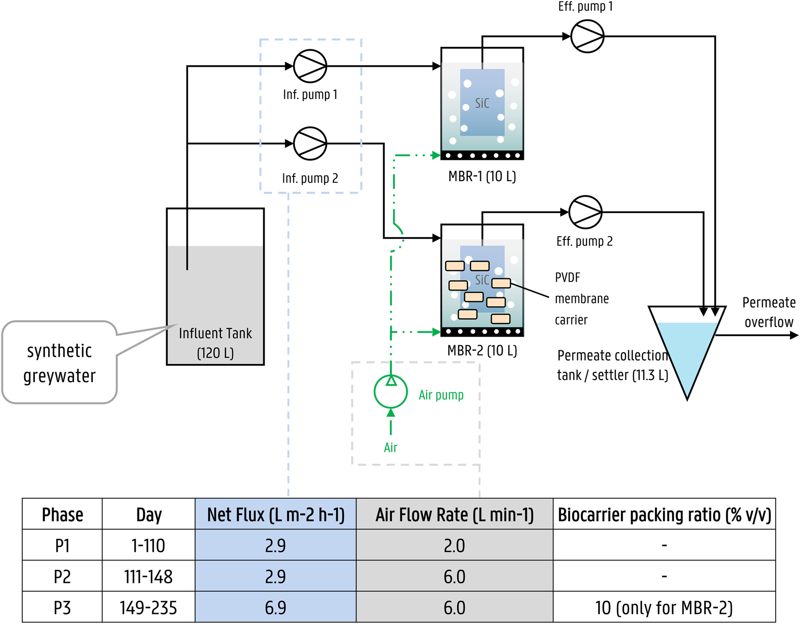
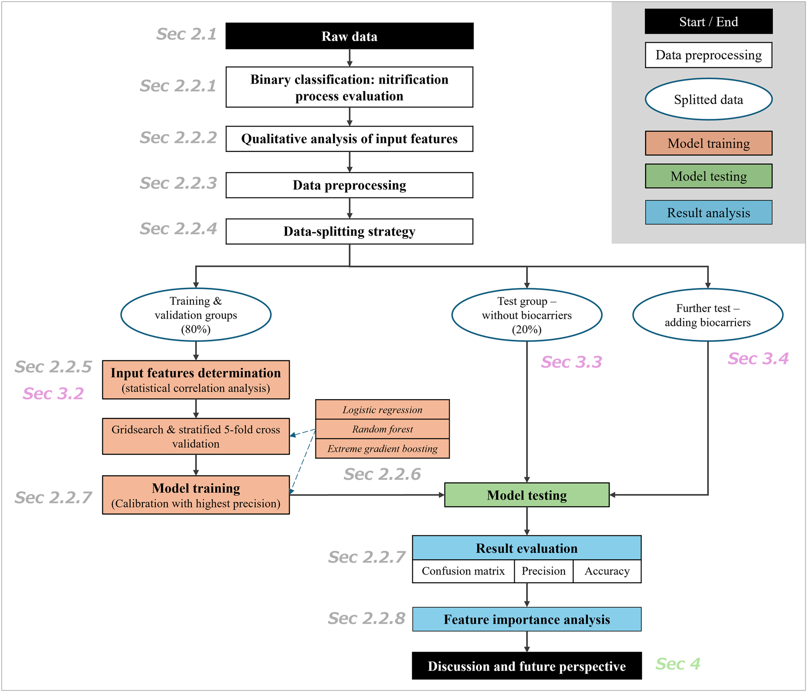
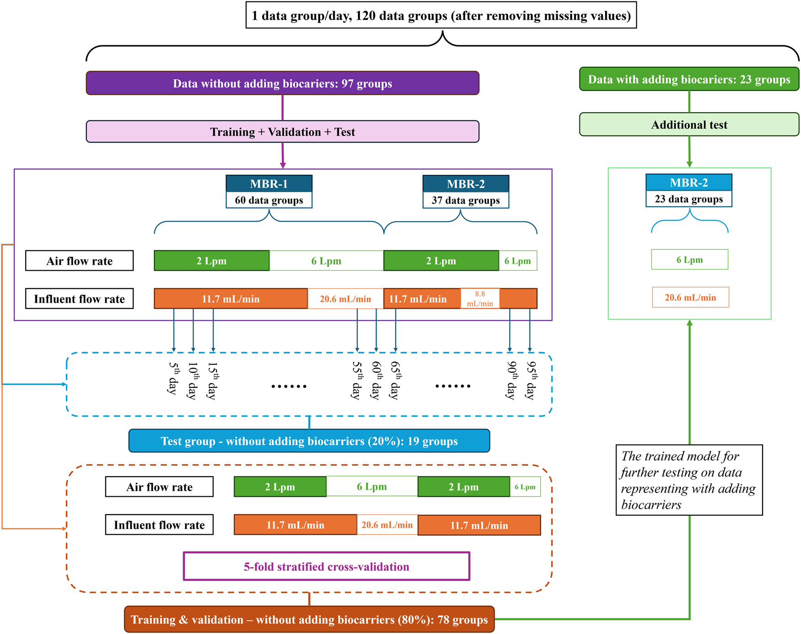
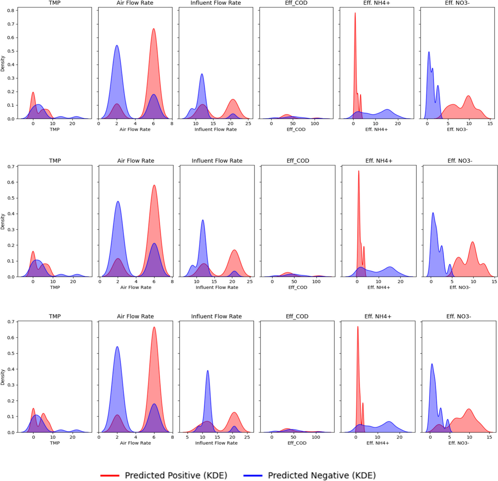
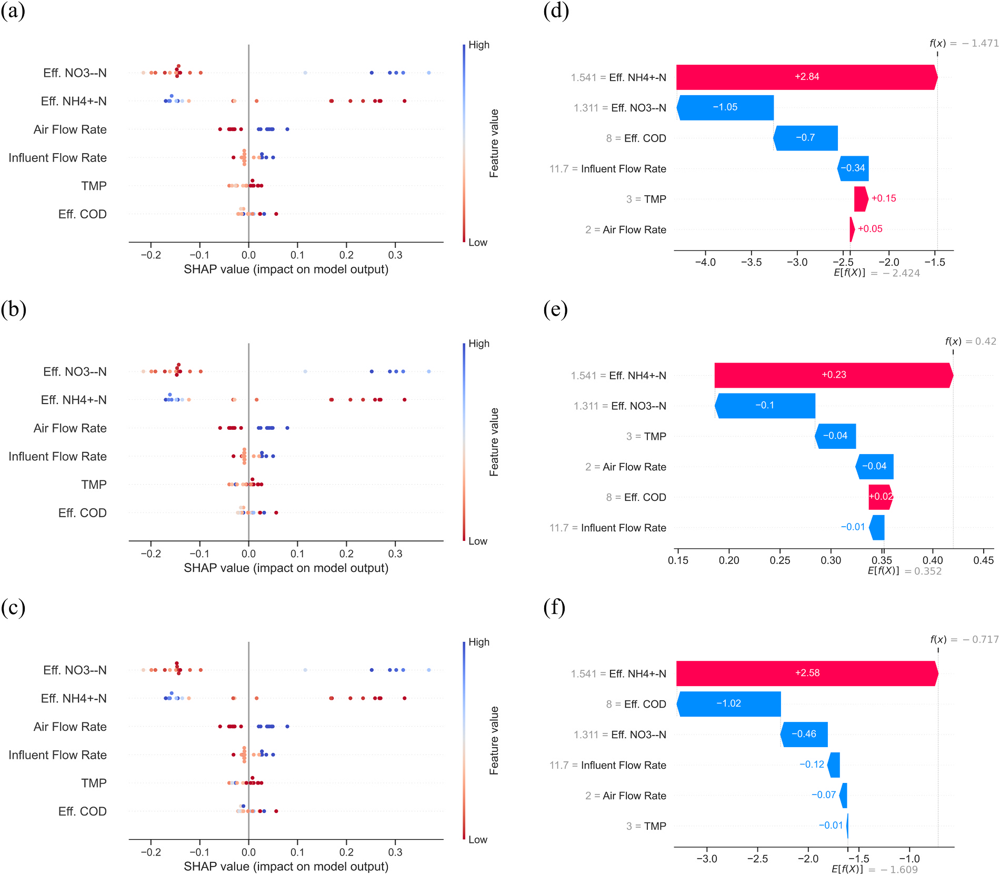
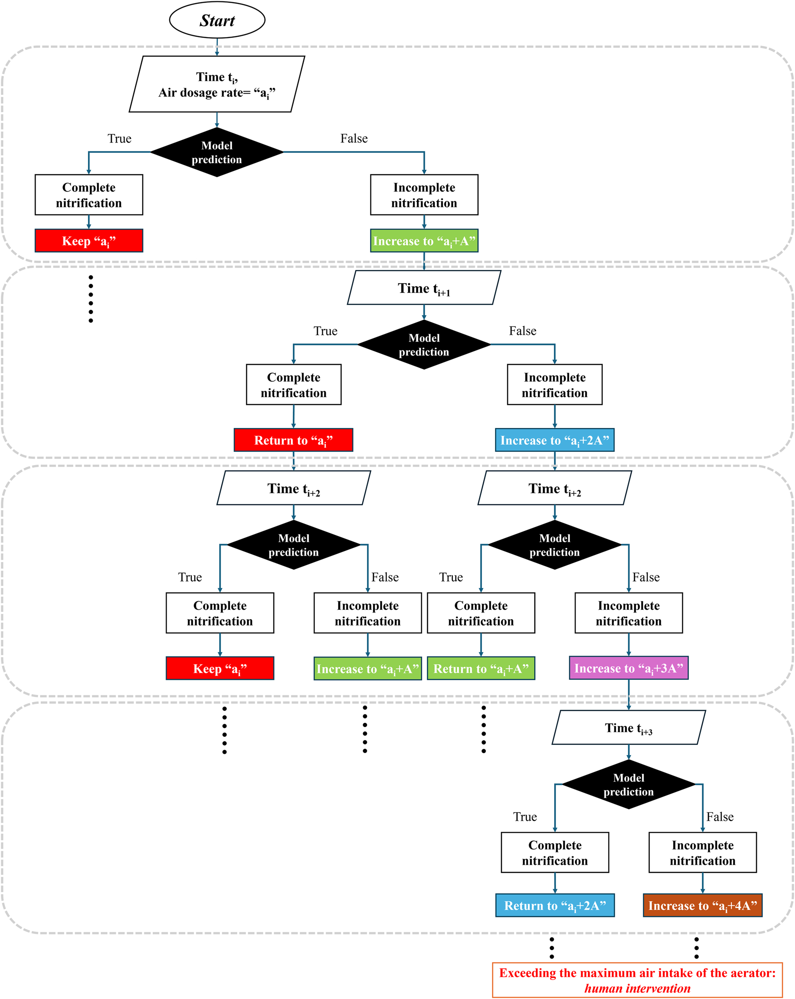

# Predicting nitrification status in aerobic membrane bioreactors by interpretable machine learning models

## Abstract

- Hệ thống màng lọc sinh học (Membrane Bioreactor - $\text{MBR}$) dùng cho xử lý và tái sử dụng nước xám tại chỗ (on-site greywater treatment and reuse) đòi hỏi quy trình giám sát nitrat hóa (nitrification monitoring) ổn định nhằm ngăn ngừa gián đoạn vận hành và duy trì tiêu chuẩn nước đầu ra.
- Khung làm việc dựa trên học máy có khả năng giải thích (interpretable machine learning framework) được đề xuất để dự đoán hiệu quả nitrat hóa (nitrification efficacy) trong hệ thống $\text{MBR}$:
  - Trạng thái nitrat hóa được phân loại nhị phân thành "đạt yêu cầu" ("sufficient") hoặc "chưa đạt yêu cầu" ("insufficient").
  - Khung làm việc tích hợp khả năng giải thích dựa trên mô hình (model-based interpretability) và giải thích hậu nghiệm (post hoc interpretability).
- Ba thuật toán ($3$ algorithms) học máy có khả năng giải thích được đánh giá có hệ thống, xem xét sự đánh đổi giữa độ chệch và phương sai (bias-variance trade-offs) trong phân loại nhị phân:
  - Hồi quy logistic (Logistic Regression - $\text{LR}$).
  - Rừng ngẫu nhiên (Random Forest - $\text{RF}$).
  - Tăng cường độ dốc cực đại (Extreme Gradient Boosting - $\text{XGB}$).
- Sáu đặc trưng đầu vào ($6$ input features) được lựa chọn dựa trên khả năng đo trực tiếp, tính tương thích với cảm biến thương mại và mức độ liên quan đến vận hành thực tế.
- Tiêu chí tối ưu hóa mô hình tập trung vào việc cực đại hóa độ chuẩn xác ($\text{Precision}$) nhằm ngăn ngừa các can thiệp điều khiển sai lệch khi quá trình nitrat hóa chưa đạt yêu cầu:
  - Duy trì tỷ lệ dương tính giả thấp ($\text{FPR}$ - False Positive Rate: phân loại nhầm trạng thái nitrat hóa chưa đạt thành đạt yêu cầu).
  - Đạt tỷ lệ dương tính thật cao ($\text{TPR}$ - True Positive Rate: nhận diện chính xác trạng thái nitrat hóa đạt yêu cầu).
- Cả $\text{LR}$ và $\text{XGB}$ đều đạt điểm số độ chuẩn xác tương đồng $\text{Precision} > 0.85$ trong các điều kiện tiêu chuẩn.
- Kiểm chứng chéo kịch bản (cross-scenario validation) chứng minh mô hình $\text{RF}$ có tính khái quát hóa cao hơn ($\text{Precision} = 0.87$) khi dự đoán trạng thái nitrat hóa trong hệ thống $\text{MBR}$ có bổ sung giá thể sinh học (biocarrier-amended MBRs) bằng dữ liệu huấn luyện từ hệ thống không bổ sung giá thể sinh học, thể hiện khả năng chuyển giao tiềm năng của mô hình.
- Phân tích giải thích hậu nghiệm và phân tích độ ổn định (stability analysis) xác định độ nhạy của dự đoán đối với các giới hạn dữ liệu và độ lệch phân phối (distributional biases), cung cấp cơ sở để cải thiện và triển khai mô hình trong thực tế.

## 1. Introduction

- Nước xám (greywater) chiếm khoảng $70\%$ tổng lưu lượng nước thải sinh hoạt khu dân cư (residential sewage), với sản lượng dao động từ $20$ đến $220\text{ L}$ trên đầu người mỗi ngày ($20\text{--}220\text{ L/capita/day}$) (Shaikh and Ahammed, 2020).
  - Nước xám được định nghĩa là nước thải sinh hoạt không bao gồm nước thải từ bồn cầu (excluding toilet contributions).
  - Tái sử dụng nước xám tại chỗ (on-site reuse) là chiến lược thiết yếu nhằm bảo tồn tài nguyên nước (water conservation), cải thiện khả năng thích ứng của hệ thống cấp thoát nước đô thị (urban water resilience improvement) và phát triển đô thị bền vững (Liu et al., 2023; Maggiotto, 2022).

- Bể phản ứng sinh học màng (membrane bioreactors - $\text{MBRs}$) đóng vai trò công nghệ chủ đạo cho xử lý nước xám phân tán (decentralized treatment) nhờ diện tích xây dựng nhỏ gọn (compact footprint) và chất lượng nước đầu ra ổn định, đáp ứng tiêu chuẩn tái sử dụng (Gao et al., 2025).
  - Hệ thống $\text{MBR}$ kết hợp hiệp đồng giữa các quá trình sinh học—bao gồm quá trình oxy hóa dị dưỡng (heterotrophic oxidation) và quá trình nitrat hóa tự dưỡng (autotrophic nitrification)—với quá trình lọc màng (membrane filtration) để phân tách hiệu quả pha rắn (Boleydei and Vaneeckhaute, 2024).

- Quá trình nitrat hóa (nitrification) chuyển hóa ammonium ($\text{NH}_4^+\text{--N}$) thành nitrite ($\text{NO}_2^-\text{--N}$) và sau đó thành nitrate ($\text{NO}_3^-\text{--N}$), là mắt xích thiết yếu trong $\text{MBRs}$ nhằm đáp ứng các quy chuẩn tái sử dụng nước.
  - Các nhà máy xử lý tập trung (centralized plants) thường áp dụng chiến lược điều khiển vi tích phân tỷ lệ (proportional integral differential - $\text{PID}$) để duy trì điểm đặt oxy hòa tan (dissolved oxygen - $\text{DO}$) cố định (fixed setpoints).
  - Chiến lược $\text{PID}$ điểm đặt cố định thích ứng kém với dao động tải lượng dòng vào (influent fluctuations) và gây tổn hao chi phí năng lượng lớn (Gu et al., 2023).
  - Các hệ thống xử lý nước xám tại chỗ đối mặt với biên độ biến động tải lượng khuếch đại (amplified load variability):
    - Chu kỳ sử dụng theo ngày và theo mùa (daily/seasonal usage patterns) tạo ra các khoảng thời gian tải lượng thấp kéo dài xen kẽ các đỉnh tải nhọn đột biến (sharp peaks).
    - Đặc tính chất lượng nước biến động liên tục làm mất hiệu lực các tham số điều khiển kinh nghiệm (empirical control parameters) (DelaPaz-Ruíz et al., 2024; Hassan et al., 2024).
  - Dù thuật toán $\text{PID}$ có thể điều chỉnh van sục khí (aeration valves), các mục tiêu $\text{DO}$ tĩnh không đáp ứng kịp thời theo thời gian thực trước biến động tải lượng $\text{NH}_4^+\text{--N}$ (thiếu sự điều chỉnh động phụ thuộc tải $\text{NH}_4^+\text{--N}$) (Li et al., 2022; Shi et al., 2024).
  - Hệ thống $\text{PID}$ phụ thuộc vào các đầu dò $\text{DO}$ ngập trong bể (submerged $\text{DO}$ probes):
    - Đầu dò ngập nước trong $\text{MBRs}$ quy mô nhỏ dễ bị bám bẩn (fouling) và trôi dạt tín hiệu (drift) do sục khí liên tục và tích tụ bùn vi sinh.
    - Sự cố đầu dò làm suy giảm độ tin cậy của phép đo, dễ bị nhầm lẫn giữa hỏng hóc cảm biến và biến động tải lượng thực tế.

- Giám sát đáng tin cậy quá trình nitrat hóa là rào cản kỹ thuật lớn đối với $\text{MBRs}$ phân tán do hiệu quả xử lý dao động tiềm ẩn nguy cơ mất ổn định hệ thống ngay cả khi chất lượng nước sau xử lý vẫn đạt chuẩn (được ghi nhận trong thử nghiệm nghiên cứu).
  - Việc giám sát theo thời gian thực quá trình nitrat hóa nội tại bên trong $\text{MBRs}$—đặc biệt ở các kịch bản vận hành phân tán—chưa từng được giải quyết trong các công bố khoa học trước đó.
  - Các cảm biến thương mại đo trực tiếp $\text{NH}_4^+\text{--N}$, $\text{NO}_2^-\text{--N}$ và $\text{NO}_3^-\text{--N}$ không khả thi khi lắp đặt trong bể phản ứng:
    - Nồng độ bùn sinh học cao gây tắc bẩn nhanh, tăng gánh nặng bảo trì định kỳ và đội chi phí vận hành (Huang et al., 2024).
    - Hợp chất hữu cơ (organic matter), chất rắn lơ lửng (suspended solids) và nhiễu ion (ionic interference) làm sai lệch kết quả đo.
    - Độ trễ đáp ứng (response lags) của cảm biến không theo kịp động học phản ứng nitrat hóa diễn ra nhanh, cản trở điều khiển thời gian thực.

- Học máy (machine learning - $\text{ML}$) mở ra hướng tiếp cận dựa trên dữ liệu (data-driven solutions) cho phép giám sát quá trình nitrat hóa trong $\text{MBRs}$ thông qua các thông số chất lượng nước đầu ra (effluent water quality parameters) mà không cần sử dụng các đầu dò xâm lấn trong bể phản ứng (Van de Walle et al., 2023).
  - Phương pháp $\text{ML}$ cho phép giám sát nhanh, chi phí thấp, theo thời gian thực—tạo điều kiện can thiệp quy trình kịp thời và tăng cường độ an toàn vận hành (Bahramian et al., 2023).
  - So với các mô hình cơ chế (mechanistic models), $\text{ML}$ yêu cầu ít biến đầu vào hơn và giảm thiểu yêu cầu bảo trì, thích hợp với các trạm xử lý tại chỗ (Duarte et al., 2024).
  - Xử lý nước xám phục vụ tái sử dụng đòi hỏi sự chấp thuận khắt khe từ cơ quan quản lý và sự tin cậy của cộng đồng:
    - Các mô hình $\text{ML}$ có khả năng giải thích (interpretable $\text{ML}$) cung cấp cơ sở dự đoán minh bạch cho quyết định can thiệp của người vận hành và quá trình hiệu chỉnh mô hình (Allen et al., 2024).
    - Tính diễn giải giúp làm rõ các hạn chế trong chiến lược huấn luyện hiện hành và định hướng nâng cấp kiến trúc mô hình.

- Các nghiên cứu dự đoán dựa trên dữ liệu trước đây trong xử lý nước thải bằng $\text{MBR}$ tập trung vào chất lượng nước thải đầu ra, hiệu suất loại bỏ chất ô nhiễm mục tiêu và tắc nghẽn màng (membrane fouling) (Muniz de Queiroz et al., 2025; Shi et al., 2022; Zhong et al., 2022).
  - Việc phụ thuộc thuần túy vào giám sát chất lượng dòng thải đầu ra bộc lộ nhiều hạn chế vận hành:
    - Khả năng kiểm soát quy trình bị hạn chế, không cho phép can thiệp kịp thời khi phát sinh các sự cố vận hành bất thường.
    - Phương pháp đo dòng thải đòi hỏi nhiều nhân công (labor-intensive) và tiêu tốn thời gian (time-consuming).
    - Không có khả năng truy xuất các khiếm khuyết vận hành tiềm ẩn trước khi xảy ra vi phạm tiêu chuẩn xả thải (Moretti et al., 2024).
  - Ngược lại, giám sát quy trình theo thời gian thực (real-time process monitoring) tạo tiền đề cho điều khiển chủ động (proactive control), củng cố khả năng phục hồi của hệ thống (system resilience) và phát hiện sự cố sớm—yếu tố quyết định để duy trì chất lượng nước đồng nhất cho nhiều mục đích tái sử dụng.

- Nghiên cứu này hướng đến xây dựng mô hình $\text{ML}$ có khả năng giải thích nhằm giám sát quá trình nitrat hóa trong $\text{MBRs}$ dựa trên các thông số dòng ra, giảm thiểu độ phức tạp trong việc thu thập đặc trưng đầu vào thực tế.
  - Các đặc trưng đầu vào được sàng lọc theo ba tiêu chí: khả năng đo đạc trực tiếp (direct measurability), tính tương thích với cảm biến (sensor compatibility), và ý nghĩa vận hành (operational relevance).
  - Ba thuật toán có khả năng giải thích được đánh giá nhằm giảm thiểu nguy cơ quá khớp (overfitting) và cân bằng độ chệch - phương sai (bias-variance tradeoffs):
    - Hồi quy logistic (logistic regression - $\text{LR}$).
    - Rừng ngẫu nhiên (random forest - $\text{RF}$).
    - Extreme gradient boosting ($\text{XGB}$).
  - Chiến lược huấn luyện mô hình đặt ưu tiên vào độ ổn định vận hành thông qua việc tối đa hóa độ chính xác ($\text{precision}$), dựa trên tỷ lệ dương tính thật ($\text{TPR}$ / true positive rate) cao và tỷ lệ dương tính giả ($\text{FPR}$ / false positive rate) thấp, sử dụng dữ liệu từ hệ thống $\text{MBR}$ bùn lơ lửng (suspended-sludge $\text{MBR}$).
  - Phân tích $\text{SHAP}$ (SHapley Additive exPlanations), đánh giá độ quan trọng của đặc trưng (feature importance) và các phân tích cặp (pairwise assessments) được thực hiện nhằm làm rõ mối liên kết giữa các nhân tố với kết quả dự đoán, định hướng cải thiện mô hình.
  - Mô hình được kiểm chứng mở rộng trên hệ thống lai (hybrid system) tích hợp bùn lơ lửng với giá thể sinh học polyvinylidene fluoride ($\text{PVDF}$ biocarriers) thực hiện đồng thời quá trình nitrat hóa - khử nitrat (simultaneous nitrification-denitrification - $\text{SND}$), chứng minh khả năng áp dụng dự đoán xuyên kịch bản.
  - Một chiến lược điều khiển sục khí tự động (automated aeration control strategy) được đề xuất nhằm hiện thực hóa khung giám sát vào thực tiễn vận hành.

## 2. Material and methods

## 2.1. Experiment method

- Nước xám nhân tạo (synthetic greywater) được chuẩn bị theo quy trình của Ongena et al. (2023) sử dụng các sản phẩm chăm sóc cá nhân (personal care products), chất tẩy rửa thương mại Hàn Quốc (detergents) và các thành phần tổng hợp từ tài liệu tham khảo.
  - Thành phần hóa lý tổng thể của nước xám nhân tạo bao gồm:
    - Nhu cầu oxy hóa học ($\text{COD}$ - chemical oxygen demand): $405 \pm 70\text{ mg L}^{-1}$.
    - Amoni nitơ ($\text{NH}_4^+\text{-N}$): $20 \pm 3\text{ mg L}^{-1}$.
    - Tổng nitơ ($\text{TN}$ - total nitrogen): $21 \pm 5\text{ mg L}^{-1}$.
  - Lượng $\text{COD}$ và $\text{TN}$ còn lại chưa được cung cấp đủ từ các sản phẩm chăm sóc cá nhân và chất tẩy rửa được bù đắp xấp xỉ bằng cách bổ sung natri axetat (acetate) và amoni clorua (ammonium chloride).
  - Các mẻ nước thải nhân tạo mới được chuẩn bị hàng ngày bằng nước máy (tap water).
- Hai hệ thống phản ứng sinh học màng (MBR - membrane bioreactor) quy mô $10\text{ L}$ vận hành song song được cấy bùn hoạt tính (activated sludge) lấy từ nhà máy xử lý nước thải công nghệ Kỵ khí - Thiếu khí - Hiếu khí ($A^2O$ - Anaerobic-Anoxic-Oxic) tại Incheon, Hàn Quốc và vận hành liên tục trong $235\text{ ngày}$.
  - Mỗi bể MBR lắp đặt hai tấm màng phẳng gốm silicon cacbua ($0.56\text{ }\mu\text{m}$ SiC flat-sheet membranes) với tổng diện tích bề mặt $0.165\text{ m}^2$.
  - Hệ thống sục khí liên tục (continuous aeration) duy trì nồng độ oxy hòa tan ($\text{DO}$ - dissolved oxygen) trong bể ở mức $5.1 \pm 2.2\text{ mg L}^{-1}$.
  - Dòng cấp nước xám và dòng hút nước lọc qua màng (permeate extraction) được vận hành liên tục, kết hợp cơ chế giãn nghỉ màng điều khiển bằng bộ định thời (timer-controlled relaxation) ở lưu lượng $0.06\text{ L min}^{-1}$.
- Chiến lược vận hành của hai bể MBR song song được tổ chức thành ba giai đoạn (Phase 1, Phase 2, Phase 3) với việc điều chỉnh net flux và lưu lượng sục khí nhằm nâng cao hiệu quả xử lý nước xám, đặc biệt là quá trình loại bỏ amoni (ammonia removal).
  - **Hình 1.** Sơ đồ bố trí thực nghiệm và các giai đoạn vận hành MBR.
    - 
    - **Hình này chứng minh điều gì**
      - Cấu hình song song MBR-1/MBR-2 và lịch trình phân kỳ 3 giai đoạn theo ngày vận hành.
    - **Từ đâu mà thấy được**
      - Sơ đồ trên: dòng nước từ bể cấp $120\text{ L}$ qua bơm cấp vào MBR-1 và MBR-2 ($10\text{ L}$); MBR-2 bổ sung giá thể PVDF; nước sau lọc dẫn về bể thu $11.3\text{ L}$.
      - Bảng dưới: P1 (ngày 1–110), P2 (ngày 111–148), P3 (ngày 149–235) với bước nhảy sục khí ($2.0 \rightarrow 6.0\text{ L min}^{-1}$) và net flux ($2.9 \rightarrow 6.9\text{ L m}^{-2}\text{ h}^{-1}$).
  - Giai đoạn 1 (Phase 1, ngày 1–110): Hiệu suất loại bỏ amoni ban đầu ở mức thấp dưới điều kiện net flux $2.9\text{ L/(m}^2\cdot\text{h)}$ và lưu lượng sục khí $2.0\text{ L/min}$.
  - Giai đoạn 2 (Phase 2, ngày 111–148): Lưu lượng sục khí được tăng lên $6.0\text{ L/min}$ (dưới mức net flux $2.9\text{ L/(m}^2\cdot\text{h)}$) để cải thiện và nâng cao hiệu quả nitrat hóa (nitrification efficiency).
  - Giai đoạn 3 (Phase 3, ngày 149–235): Net flux được tăng lên $6.9\text{ L/(m}^2\cdot\text{h)}$ để tiếp tục thử nghiệm độ ổn định thủy lực (hydraulic stability).
- Giá thể vi sinh (biocarriers) được bổ sung vào bể MBR-2 trong Phase 3 với tỷ lệ lấp đầy $10\%$ (packing ratio):
  - Hạn chế tắc nghẽn màng (membrane fouling) dưới tải trọng net flux cao ($6.9\text{ L/(m}^2\cdot\text{h)}$).
  - Tạo các vùng thiếu khí (anoxic zones) bên trong cấu trúc giá thể màng PVDF nhằm thúc đẩy quá trình nitrat hóa - khử nitrat đồng thời (simultaneous nitrification-denitrification).
  - Cho phép đánh giá và so sánh hiệu năng trực tiếp giữa MBR-2 (có giá thể) và MBR-1 (không có giá thể).
  - Tỷ lệ lấp đầy $10\%$ được lựa chọn nhằm cân bằng giữa việc kiểm soát tắc nghẽn và độ an toàn vận hành, tránh các vấn đề mài mòn thiết bị và tiêu tốn năng lượng liên quan đến tải trọng giá thể cao hơn (Noor et al., 2023; Rahman et al., 2023).
- Các biến đổi có chủ đích về net flux, lưu lượng sục khí và bổ sung giá thể vi sinh đa dạng hóa điều kiện vận hành của hệ thống:
  - Làm giàu và mở rộng không gian tập dữ liệu (enriching the dataset).
  - Nâng cao khả năng tổng quát hóa (generalizability) của mô hình học máy (machine learning model) trên nhiều kịch bản vận hành khác nhau.
- Chất lượng nước đầu vào (influent), nước sau lọc qua màng (effluent) và nước trong bể phản ứng (reactor water) được phân tích hàng ngày theo các quy trình mô tả trong thông tin bổ sung (supplementary information - SI 1).

### 2.2. Data-driven modelling

#### 2.2.1. Binary classification: nitrification process evaluation

- Dự đoán trạng thái nitrat hóa (nitrification status) đòi hỏi xác định mối quan hệ định lượng giữa nồng độ các dạng nitơ trong bể phản ứng (reactor): $\mathrm{NO_3^--N}$, $\mathrm{NO_2^--N}$ và $\mathrm{NH_4^+-N}$.
  - Trong quá trình đồng thời nitrat hóa và khử nitrat (simultaneous nitrification and denitrification - SND) bên trong MBR, nồng độ $\mathrm{NO_3^--N}$ thường cao hơn nồng độ $\mathrm{NO_2^--N}$ và $\mathrm{NH_4^+-N}$ khi điều kiện sục khí đầy đủ (sufficient aeration).
  - Tỷ lệ nồng độ $\mathrm{NO_3^--N}$ duy trì ở mức cao là nhân tố then chốt cho quá trình chuyển hóa và loại bỏ nitơ hiệu quả (Huang et al., 2022; Paetkau and Cicek, 2011).
- Điều kiện nitrat hóa đầy đủ (sufficient nitrification) được định nghĩa là trạng thái trong đó nồng độ $\mathrm{NO_3^--N}$ vượt quá tổng nồng độ của $\mathrm{NO_2^--N}$ và $\mathrm{NH_4^+-N}$.
  - Tiêu chí định lượng của trạng thái nitrat hóa đầy đủ được biểu diễn bằng bất đẳng thức: $[\mathrm{NO_3^--N}] > [\mathrm{NO_2^--N}] + [\mathrm{NH_4^+-N}]$.
  - Trạng thái đáp ứng điều kiện $[\mathrm{NO_3^--N}] > [\mathrm{NO_2^--N}] + [\mathrm{NH_4^+-N}]$ được gán nhãn dương tính ("Positive").
  - Trạng thái không đáp ứng điều kiện trên ($[\mathrm{NO_3^--N}] \le [\mathrm{NO_2^--N}] + [\mathrm{NH_4^+-N}]$) được gán nhãn âm tính ("Negative"), tương ứng với mức nitrat hóa không đủ (insufficient).
- Mục tiêu chính của mô hình dữ liệu (data-driven model) cho dự đoán quá trình xử lý là phân loại nhị phân (binary classification) xem quá trình nitrat hóa đạt mức đầy đủ hay không đủ.
  - Phân loại nhị phân đóng vai trò định nghĩa biến mục tiêu đầu ra cho các thuật toán học máy trong toàn bộ nghiên cứu.
- Quy trình phát triển mô hình dữ liệu giám sát nitrat hóa trong MBR được thiết lập có hệ thống từ phân loại nhị phân đến đánh giá và điều khiển.
  - **Hình 2.** Lưu đồ phát triển và đánh giá mô hình dữ liệu
    - 
    - **Hình này chứng minh điều gì**
      - Khung làm việc mô hình hóa phân loại trạng thái nitrat hóa từ dữ liệu thô đến kiểm thử và phân tích tầm quan trọng đặc trưng.
    - **Từ đâu mà thấy được**
      - Dòng xử lý từ trên xuống bắt đầu từ Raw data (Sec 2.1) qua Binary classification (Sec 2.2.1), Data preprocessing (Sec 2.2.3) đến Data-splitting strategy (Sec 2.2.4).
      - Dữ liệu phân tách thành nhóm Training & validation ($80\,\%$) và hai nhóm kiểm thử: Test group không biocarrier ($20\,\%$, Sec 3.3) cùng Further test bổ sung biocarrier (Sec 3.4).
      - Ba thuật toán (Logistic regression, Random forest, Extreme gradient boosting) được hiệu chuẩn với tiêu chí độ chính xác cao nhất (Sec 2.2.7) trước khi đưa vào Model testing.

#### 2.2.2. Qualitative analysis of inputs selection

- Thu thập ba nhóm dữ liệu chính (three data categories) trong suốt quá trình thí nghiệm:
  - Nhóm thủy lực (Hydraulic): Thời gian lưu nước thủy lực ($HRT$ - hydraulic retention time) và thời gian lưu bùn ($SRT$ - sludge retention time).
  - Nhóm vận hành (Operational): Áp suất xuyên màng ($TMP$ - transmembrane pressure), lưu lượng khí cấp/nước đầu vào/nước đầu ra ($air/influent/effluent\ flow\ rates$), thông lượng tổng/thông lượng thực ($gross/net\ flux$), và độ phục hồi thông lượng ($flux\ recovery$).
  - Nhóm chất lượng nước (Water quality): $COD$, $TN$, $NH_4^+-N$, $NO_3^--N$, $NO_2^--N$ (đo trong nước đầu vào - $influent$, nước đầu ra - $effluent$, và hỗn hợp bùn lỏng trong bể phản ứng - $mixed\ liquor\ in\ the\ reactor$), tổng chất rắn lơ lửng ($TSS$ - total suspended solids trong nước đầu vào/đầu ra), oxy hòa tan ($DO$ - dissolved oxygen), nồng độ chất rắn lơ lửng bùn lỏng ($MLSS$ - mixed liquor suspended solids) và nồng độ chất rắn lơ lửng bay hơi bùn lỏng ($MLVSS$ - mixed liquor volatile suspended solids) trong bể phản ứng.
  - Hiệu suất loại bỏ (Removal efficiency) được tính toán bổ sung cho từng thông số chất lượng nước.
- Ba tiêu chí lựa chọn đặc trưng đầu vào (input features) từ góc độ triển khai thực tế (practical deployment):
  - Khả năng đo trực tiếp ($1 > Direct\ measurability$).
  - Khả năng tương thích với cảm biến thương mại ($2 > Commercial\ sensor\ compatibility$).
  - Mức độ liên quan đến vận hành ($3 > Operational\ relevance$, ví dụ: $TMP$).
- Sàng lọc và loại trừ các biến không phù hợp để tinh giản dữ liệu:
  - Loại trừ các biến gián tiếp (Indirect variables): Biến thời gian lưu bùn ($SRT$) và hiệu suất loại bỏ ($removal\ efficiencies$) bị loại bỏ do tính chất đo lường gián tiếp.
  - Cân nhắc ban đầu: Xem xét ban đầu bao gồm các thông số chất lượng nước ($DO$, $COD$, $TN$, $NH_4^+-N$, $NO_3^--N$, $NO_2^--N$) và các yếu tố vận hành (lưu lượng dòng chảy - $flow\ rates$, lưu lượng khí - $air\ flow$, $TMP$).
  - Loại trừ oxy hòa tan ($DO$): Tỷ lệ thiếu hụt dữ liệu $DO > 50\%$ dẫn đến việc loại bỏ thông số này, mô phỏng các kịch bản hỏng hóc đầu dò cảm biến (probe failure scenarios).
  - Giữ lại lưu lượng khí cấp ($air\ flow\ rate$) nhằm đóng vai trò biến đại diện cho oxy ($oxygen\ proxy$).
  - Ưu tiên tính tương thích với cảm biến trực tuyến (Online sensor compatibility): Nhằm nâng cao khả năng áp dụng (applicability) và độ bền vững (robustness) của mô hình.
  - Loại trừ chất lượng nước đầu vào ($influent\ water\ quality$): Bị loại do các lo ngại về độ tin cậy của cảm biến (sensor reliability concerns), nền mẫu phức tạp (complex matrices) gây tắc nghẽn bề mặt cảm biến (sensor fouling) và suy thoái cảm biến (sensor degradation, ví dụ hiện tượng hòa tan điện cực $Ag/AgCl$) (Ching et al., 2022; Haimi et al., 2013).
  - Loại trừ $NO_2^--N$ nước đầu ra ($effluent\ NO_2^--N$): Bị loại do tính không ổn định trong phép đo (measurement instability) so với thông số $NO_3^--N$ ổn định.
  - Đưa vào áp suất xuyên màng ($TMP$): Giữ lại nhằm theo dõi hiệu năng màng lọc (membrane performance), hỗ trợ giám sát vận hành dài hạn (long-term operation monitoring).
- Tinh chỉnh tập dữ liệu (Dataset refinement):
  - Loại bỏ các biến không phù hợp và tinh giản các biến đầu vào nhằm tạo điều kiện thuận lợi cho việc phân chia tập dữ liệu (dataset splitting).

#### 2.2.3. Data preprocessing

- Quy trình làm sạch loại bỏ các mục dữ liệu không hoàn chỉnh từ chuỗi quan trắc dài hạn của hệ thống MBR kép (dual MBRs):
  - Tổng số dữ liệu thu thập ban đầu gồm $128$ bộ dữ liệu (datasets) trong thời gian $235$ ngày vận hành.
  - Loại bỏ $8$ mục dữ liệu không hoàn chỉnh (incomplete entries), giữ lại $120$ nhóm dữ liệu hợp lệ cho các phân tích tiếp theo.
- Bổ sung giá thể sinh học (biocarriers) trong Giai đoạn 3 (Phase 3) làm thay đổi tương quan thông số và tạo cơ sở kiểm thử liên kịch bản:
  - Giá thể sinh học được bổ sung vào một bể phản ứng trong Phase 3 để thúc đẩy quá trình khử nitrat (denitrification) (Fig. 1), dẫn đến sự biến đổi trong mối quan hệ giữa các thông số (parameter relationships).
  - Thiết lập tập kiểm tra độc lập (independent test group) gồm $23$ nhóm dữ liệu thu thập từ Phase 3 (có bổ sung giá thể) nhằm đánh giá khả năng áp dụng liên kịch bản (cross-scenario applicability).
  - Tập dữ liệu gồm $97$ nhóm không bổ sung giá thể (no-biocarrier data groups, chỉ chứa bùn hoạt tính / activated sludge only) được sử dụng để huấn luyện (training), xác thực (validation) và kiểm tra (testing) mô hình dự đoán trạng thái nitrat hóa (nitrification).
  - Cách tiếp cận này cho phép đánh giá năng lực dự đoán của mô hình khi chuyển đổi sang các điều kiện vận hành bị thay đổi (altered operational conditions).
- Điểm ngoại lai (outliers) được chủ động giữ lại nhằm kiểm tra độ bền vững của mô hình:
  - Hệ thống xử lý nước xám tại chỗ (onsite greywater systems) có đặc tính biến thiên tự nhiên cao ở dòng vào (inherent influent variability).
  - Giữ lại các giá trị ngoại lai giúp đánh giá độ bền vững (robustness) của mô hình trước các dao động vận hành (operational fluctuations), phản ánh sát động học thực tế (real-world dynamics).

#### 2.2.4. Dataset splitting strategy

- Tập dữ liệu sau tiền xử lý (preprocessed dataset) bao gồm 120 nhóm dữ liệu ($120$ groups of data), phản ánh các phép đo hàng ngày từ các thao tác vận hành thực nghiệm:
  - Dữ liệu tồn tại sự mất cân bằng cố hữu về phân phối nhãn (inherent imbalance in label distribution) do các thay đổi có kiểm soát trong điều kiện xử lý.
  - Đối với từng bể phản ứng, lưu lượng sục khí (airflow rate) được duy trì ở mức $2.0\text{ L/min}$ cho đến ngày $111$ và tăng lên mức $6.0\text{ L/min}$ sau đó nhằm tăng cường quá trình nitrat hóa (nitrification treatment).
  - Tương tự, lưu lượng dòng vào (influent flow rate) chủ yếu ở mức $11.7\text{ ML/min}$ trước ngày thứ $149$ và tăng lên mức $20.6\text{ ML/min}$ sau đó.
- Do các dịch chuyển theo thời gian này (temporal shifts), phương pháp phân chia dữ liệu theo trình tự thời gian đơn thuần (simple chronological split) không thể đánh giá khách quan hiệu năng mô hình.
- Tập huấn luyện (training set) và tập kiểm tra (test set) được xây dựng theo chiến lược phân chia nhằm bao quát toàn bộ các biến động vận hành để đảm bảo đánh giá mang tính đại diện (representative assessment):
  - **Hình 3.** Chiến lược phân chia dữ liệu cho các nhóm huấn luyện, kiểm định và kiểm tra
    - 
    - **Hình này chứng minh điều gì**
      - Quy trình phân vùng 120 nhóm dữ liệu qua các pha vận hành thành tập huấn luyện-kiểm định ($80\%$, 78 nhóm), tập kiểm tra ($20\%$, 19 nhóm) và tập kiểm tra bổ sung (23 nhóm có biocarrier).
    - **Từ đâu mà thấy được**
      - Nhánh trái phân tách 97 nhóm không có biocarrier (MBR-1: 60 nhóm, MBR-2: 37 nhóm) trải qua các mức khí ($2\text{ Lpm}$, $6\text{ Lpm}$) và lưu lượng ($11.7\text{ mL/min}$, $20.6\text{ mL/min}$, $8.8\text{ mL/min}$).
      - Mũi tên lấy mẫu định kỳ đưa dữ liệu vào tập kiểm tra ($20\%$) và tập huấn luyện-kiểm định ($80\%$, áp dụng 5-fold stratified cross-validation); nhánh phải đưa 23 nhóm MBR-2 vào kiểm tra chéo kịch bản.
      - Lưu ý: hình thể hiện chu kỳ lấy mẫu các ngày 5, 10, 15... 95 (bước nhảy 5 ngày), văn bản ghi chọn mỗi điểm dữ liệu thứ tư ("every fourth data point").
- Do sự mất cân bằng giữa lưu lượng khí và lưu lượng dòng vào, mỗi điểm dữ liệu thứ tư ("every fourth data point") (hình ghi chu kỳ 5 ngày: 5th, 10th, 15th... 95th day) được lựa chọn để hình thành tập kiểm tra (test set), chiếm $20\,\%$ tổng dữ liệu:
  - Tập kiểm tra bao gồm 19 nhóm dữ liệu (19 groups of data), với 8 nhãn dương tính ($8\text{ positive}$) và 11 nhãn âm tính ($11\text{ negative labels}$).
- $80\,\%$ dữ liệu còn lại (gồm 78 nhóm dữ liệu) được sử dụng cho huấn luyện và kiểm định (training and validation):
  - Tập này gồm 28 nhãn dương tính ($28\text{ positive}$) và 50 nhãn âm tính ($50\text{ negative labels}$).
  - Cấu trúc phân chia duy trì các đặc tính phân phối riêng biệt để đánh giá khả năng tổng quát hóa của mô hình (model generalization).
- Quá trình tối ưu hóa siêu tham số (hyperparameter optimization) áp dụng kiểm định chéo phân tầng 5 lần (stratified 5-fold cross-validation thông qua StratifiedKFold của Scikit-Learn):
  - Phương pháp kiểm định chéo phân tầng đảm bảo tỷ lệ đại diện cân bằng giữa các lớp trong mỗi fold nhằm nâng cao độ tin cậy đối với tập dữ liệu mất cân bằng (Szeghalmy and Fazekas, 2023; Zeng and Martinez, 2000).
- Thử nghiệm độ bền vững chéo kịch bản (cross-scenario robustness) dưới các phân phối nhãn phân kỳ:
  - Sử dụng bổ sung 23 bộ dữ liệu ($23\text{ datasets}$) thu thập từ điều kiện có bổ sung giá thể sinh học (biocarrier-added condition; Mục 2.1 và Mục 2.2).
  - Nhóm này bao gồm 15 nhãn dương tính ($15\text{ positive}$) và 8 nhãn âm tính ($8\text{ negative labels}$) nhằm kiểm tra khả năng chuyển giao của mô hình trước sự thay đổi điều kiện vận hành.

### 2.2.5. Statistical correlation analysis for inputs determination

- Tương quan thứ hạng Spearman (Spearman's rank correlation) được áp dụng để đánh giá các mối quan hệ thống kê giữa biến đầu vào (inputs) và đầu ra (outputs), dựa trên kết quả lựa chọn đặc trưng đầu vào sơ bộ thông qua phân tích định tính tại Mục 2.2.2.
  - Đây là phương pháp phi tham số (nonparametric method) định lượng độ mạnh của các mối liên hệ đơn điệu (monotonic associations) giữa các biến mà không yêu cầu giả định về phân phối chuẩn (normal distribution).
  - Đặc tính này giúp phương pháp phù hợp với các bối cảnh phân loại phi tuyến nhưng có tính đơn điệu (nonlinear yet monotonic classification contexts) (Hastie et al., 2009).
- Ý nghĩa thống kê (statistical significance) của các tương quan được xác định thông qua giá trị $p$ ($p\text{-values}$):
  - Giá trị $p$ biểu thị xác suất thu được hệ số tương quan Spearman quan sát được, hoặc một giá trị cực đoan hơn, theo giả thuyết không (null hypothesis) rằng không tồn tại mối quan hệ đơn điệu giữa các biến.
  - Ngưỡng $p\text{-value} < 0.05$ được sử dụng để bác bỏ giả thuyết không và xác nhận mối tương quan đạt mức ý nghĩa thống kê.
- Hàm `"spearmanr"` thuộc thư viện SciPy trong môi trường Python được sử dụng để tính toán các hệ số tương quan và giá trị $p$ cho toàn bộ các cặp biến (all variable pairs) (Van Rossum and Drake, 2009).

#### 2.2.6. Model-based interpretability: interpretable ML algorithms

- Lựa chọn mô hình học máy kết hợp giữa độ chính xác thống kê (statistical accuracy) và đặc tính cấu trúc riêng của từng thuật toán (algorithm-specific characteristics) nhằm dự đoán trạng thái nitrate hóa (nitrification status) trong MBR và đảm bảo tính ổn định trong vận hành:
  - Độ lệch (bias) trong học máy bắt nguồn từ các giả định đơn giản hóa (simplifying assumptions) (Reynaert et al., 2023).
  - Phương sai (variance) phản ánh mức độ nhạy cảm của mô hình đối với các dao động trong tập dữ liệu huấn luyện (training data) (Reynaert et al., 2023).
  - Quy luật đánh đổi bias–variance: Cực tiểu hóa một thành phần thường làm gia tăng thành phần còn lại (Belkin et al., 2019).
- Mô hình đơn giản hơn (simpler models) mang lại nhiều lợi thế thực nghiệm cho các tập dữ liệu quy mô nhỏ (small datasets) (Reynaert et al., 2023; Wang et al., 2025):
  - Giảm thiểu nguy cơ quá khớp (overfitting risk) khi kích thước dữ liệu hạn chế.
  - Cải thiện khả năng diễn giải (interpretability) của mô hình.
  - Đòi hỏi nhu cầu và chi phí tính toán thấp hơn (lower computational demands).
  - Đối với các tập dữ liệu nhỏ và phi thời gian (small, non-temporal datasets), các cấu trúc phức tạp như mạng nơ-ron nhân tạo (artificial neural networks) làm gia tăng nguy cơ quá khớp (Chiroma et al., 2019).
- Ba thuật toán học máy có khả năng diễn giải (interpretable algorithms) với đặc tính bias–variance riêng biệt được lựa chọn dựa trên tiêu chuẩn có thể mô phỏng lại (simulatable, tức interpretable) của mô hình hồi quy logistic và các mô hình dựa trên cây quyết định (Breiman et al., 2017; Murdoch et al., 2019):
  - Hồi quy logistic (Logistic Regression - LR):
    - Đặc tính: Bias cao, variance thấp (High bias, low variance).
    - Cơ chế hoạt động: Áp dụng phép biến đổi logit (logit transformation) vào hồi quy tuyến tính (linear regression) để dự đoán xác suất nhị phân (binary probability prediction).
    - Phạm vi ứng dụng: Xử lý cả biến liên tục và biến phân loại (continuous/categorical variables) với khả năng diễn giải cao và cấu trúc đơn giản (Hosmer et al., 2013).
  - Phân loại rừng ngẫu nhiên (Random Forest classification - RF):
    - Đặc tính: Mức cân bằng bias–variance trung gian (Intermediate bias-variance tradeoff).
    - Cơ chế hoạt động: Phương pháp học tập hợp (ensemble method) tổng hợp nhiều cây quyết định (decision trees) thông qua cơ chế bỏ phiếu (voting).
    - Hiệu quả: Cải thiện độ chính xác và khả năng chống nhiễu (noise resistance) đối với dữ liệu nhiều chiều (high-dimensional data) (Breiman, 2001).
  - Phân loại tăng cường độ dốc cực độ (Extreme Gradient Boosting classification - XGB):
    - Đặc tính: Bias thấp, variance cao (Low bias, high variance).
    - Cơ chế hoạt động: Triển khai tối ưu hóa thuật toán tăng cường độ dốc (gradient boosting algorithm) với các cây quyết định tuần tự, trong đó mỗi cây kế tiếp sửa lỗi của cây tiền nhiệm nhằm cực tiểu hóa hàm mất mát (loss function) và tăng cường hiệu năng dự đoán.
    - Cải tiến kỹ thuật: So với các cây quyết định tăng cường độ dốc truyền thống (traditional gradient boosting decision trees), XGB bổ sung các cải tiến gồm kỹ thuật điều chuẩn (regularization), tính toán song song (parallel computing), và khả năng tự định nghĩa hàm mất mát (custom loss function definition) (Chen and Guestrin, 2016).
- Môi trường cài đặt phần mềm và phương thức tối ưu hóa:
  - Toàn bộ các mô hình được triển khai bằng thư viện `scikit-learn` phiên bản $1.0.2$ trên nền tảng `Python` phiên bản $3.9.13$.
  - Siêu tham số (hyperparameters) của các mô hình được tối ưu hóa thông qua tìm kiếm dạng lưới (grid search).

#### 2.2.7. Evaluation metrics and hyperparameter tuning criteria

- Đánh giá hiệu năng của các mô hình phân loại (classification models) thông qua ma trận nhầm lẫn (confusion matrix), đối chiếu kết quả dự đoán ("Sufficient" / "Insufficient") với điều kiện vận hành thực tế:
  - Nhãn "Positive" biểu thị trạng thái nitrate hóa đầy đủ (sufficient nitrification), trong khi nhãn "Negative" biểu thị trạng thái nitrate hóa không đầy đủ (insufficient nitrification), theo định nghĩa tại Section 2.1.
  - Các chỉ số cốt lõi trong ma trận nhầm lẫn bao gồm (Section 2.2.1):
    - True positive ($\text{TP}$): Phân loại chính xác trạng thái nitrate hóa đầy đủ (correctly classified sufficient nitrification).
    - False positive ($\text{FP}$): Phân loại sai thành nitrate hóa đầy đủ trong điều kiện thực tế không đầy đủ (erroneously classified sufficient under insufficient conditions).
    - False negative ($\text{FN}$): Phân loại sai thành nitrate hóa không đầy đủ dù thực tế đạt mức đầy đủ (insufficient misclassifications despite actual sufficiency).
    - True negative ($\text{TN}$): Phân loại chính xác trạng thái nitrate hóa không đầy đủ (accurate classified as insufficient).
- Cực tiểu hóa tỷ lệ dương tính giả (false positive rate - $\text{FPR}$) là yêu cầu then chốt nhằm bảo đảm chất lượng nước đầu ra (effluent water quality) an toàn:
  - Trong hệ thống điều khiển tích hợp mô hình giám sát nitrate hóa, khi xảy ra hiện tượng nitrate hóa không đầy đủ, lượng không khí cấp vào cần được tăng cường (more air should be supplied).
  - Khi xảy ra lỗi $\text{FP}$, mô hình dự đoán sai thành trạng thái nitrate hóa đầy đủ, dẫn đến việc hệ thống điều khiển ngừng bổ sung thêm oxy, gây ra tình trạng nước thải đầu ra không an toàn và không thích hợp để tái sử dụng (unsafe effluent unsuitable for reuse).
- Tỷ lệ dương tính thật (true positive rate - $\text{TPR}$) cao hơn là yêu cầu cần thiết để phát hiện trạng thái nitrate hóa đầy đủ trong các điều kiện vận hành thông thường (conventional operation conditions):
  - Mức $\text{TPR}$ cao giúp giảm chi phí vận hành (operational costs) bằng cách ngăn chặn việc cấp oxy không cần thiết do lỗi $\text{FN}$ kích hoạt (preventing unnecessary oxygen supply triggered by $\text{FN}$).
- Tối ưu hóa đơn lẻ để giảm $\text{FPR}$ có thể làm suy giảm nghiêm trọng $\text{TPR}$ theo các ghi nhận từ các nghiên cứu trước (Reynaert et al., 2023; Salvia et al., 2021; Yang et al., 2019):
  - Nghiên cứu áp dụng phương pháp tiếp cận cân bằng, đồng thời xem xét cả $\text{TPR}$ (Eq. 1) và $\text{FPR}$ (Eq. 2).
  - Độ chuẩn xác ($\text{Precision}$, Eq. 3) được chọn làm chỉ số tối ưu hóa then chốt (key optimization metric).
  - Chỉ số $\text{Precision}$ phản ánh tỷ lệ các dự đoán $\text{TP}$ trong tổng số tất cả các dự đoán dương tính (positive predictions).
- Các phương trình toán học xác định $\text{TPR}$, $\text{FPR}$ và $\text{Precision}$:
  - Tỷ lệ dương tính thật ($\text{TPR}$):
    $$\text{TPR} = \frac{\text{TP}}{\text{TP} + \text{FN}} \quad (1)$$
  - Tỷ lệ dương tính giả ($\text{FPR}$):
    $$\text{FPR} = \frac{\text{FP}}{\text{FP} + \text{TN}} \quad (2)$$
  - Độ chuẩn xác ($\text{Precision}$):
    $$\text{Precision} = \frac{\text{TP}}{\text{TP} + \text{FP}} \quad (3)$$
- Độ chính xác ($\text{Accuracy}$) đại diện cho tỷ lệ các dự đoán chính xác trên tổng số tất cả các trường hợp và được sử dụng để đánh giá mô hình trên các nhóm kiểm tra (test groups):
  - Mặc dù $\text{Precision}$ được ưu tiên trong quá trình tinh chỉnh siêu tham số (hyperparameter tuning), $\text{Accuracy}$ vẫn được sử dụng kết hợp để đánh giá mô hình.
  - Phương trình tính toán $\text{Accuracy}$ (Eq. 4):
    $$\text{Accuracy} = \frac{\text{TP} + \text{TN}}{\text{TP} + \text{TN} + \text{FP} + \text{FN}} \quad (4)$$
- Đánh giá độ ổn định của hiệu năng mô hình (stability of model performance) trên tập dữ liệu kiểm tra (test dataset) bằng cách tính toán khoảng tin cậy $95\,\%$ ($95\text{ \% confidence intervals}$):
  - Kỹ thuật tái lấy mẫu bootstrap $1000$ lần ($1000\text{-times bootstrap resampling}$) được triển khai theo các thực hành chuẩn trong kiểm định học máy (standard practices in machine learning validation).
  - Khoảng tin cậy $95\,\%$ được xác định cho các chỉ số $\text{Accuracy}$, $\text{Precision}$, độ nhạy ($\text{Recall}$), và điểm số $F_1$ ($F_1\text{ score}$).

#### 2.2.8. Post hoc interpretability
- Diễn giải hậu nghiệm (post hoc interpretation) là yêu cầu cần thiết đối với các mô hình phức tạp dù các phương pháp dựa trên cây quyết định (decision tree-based methods) sở hữu khả năng diễn giải cố hữu (inherent interpretability) (Murdoch et al., 2019).
- Độ quan trọng của đặc trưng (feature importance) định lượng mức độ đóng góp của các biến đầu vào (input variables):
  - Đóng vai trò hỗ trợ cải thiện khả năng diễn giải của mô hình và định hướng chiến lược thu thập dữ liệu nhằm nâng cao hiệu suất.
  - Trong mô hình Logistic Regression (LR), các hệ số đặc trưng (feature coefficients) thu được từ việc cực tiểu hóa hàm mất mát (loss function) dạng log-likelihood âm (negative log-likelihood) thông qua các phương pháp tối ưu hóa như hạ độ dốc (gradient descent) (Hastie et al., 2009).
  - Các hệ số trong LR thể hiện độ mạnh và chiều hướng của mối quan hệ tuyến tính giữa từng đặc trưng với biến mục tiêu (target variable) (Murphy, 2012).
  - Trong mô hình Random Forest (RF), feature importance được đánh giá thông qua mức độ giảm tạp chất (reduction in impurity), chẳng hạn như chỉ số Gini (Gini index), khi một đặc trưng được sử dụng để phân chia nút (split a node) (Liaw and Wiener, 2002).
  - Điểm số quan trọng trong RF được tính trung bình trên toàn bộ các cây, phản ánh mức đóng góp tổng thể của từng đặc trưng vào mô hình.
  - Trong mô hình XGBoost (XGB), feature importance thường được tính toán theo phương pháp độ lợi (Gain method) bằng cách tính tổng và chuẩn hóa các mức lợi (gains) từ tất cả các điểm phân tách liên quan đến đặc trưng đó để xác định điểm số quan trọng (Chen and Guestrin, 2016).
- Phân tích SHAP (SHapley Additive exPlanations) ứng dụng lý thuyết trò chơi (game theory) để gán cho từng đặc trưng một giá trị quan trọng đối với các dự đoán cụ thể:
  - Các giá trị SHAP thỏa mãn ba tiên đề gồm tính hiệu quả (efficiency), tính đối xứng (symmetry) và tính cộng (additivity), mang lại khả năng diễn giải nhất quán trên cả quy mô cục bộ (local interpretability) và toàn cục (global interpretability) (Lundberg and Lee, 2017).
  - Tiên đề hiệu quả thỏa mãn hệ thức: $\text{prediction} = \text{base value} + \sum \text{feature contributions}$.
- Mối quan hệ giữa từng cặp đặc trưng (pairwise feature relationships) được trực quan hóa thông qua ước lượng mật độ nhân (KDE - Kernel Density Estimation) và biểu đồ từng cặp đặc trưng (pairwise feature plot):
  - KDE xấp xỉ phi tham số (nonparametrically approximate) các hàm mật độ xác suất liên tục (continuous probability density functions) bằng phương pháp làm mịn các điểm dữ liệu quan sát thông qua các hàm nhân đối xứng (symmetric kernel functions) và tham số độ rộng băng thông (bandwidth parameters) (Scott, 2015).
  - Biểu đồ từng cặp đặc trưng được triển khai dưới dạng ma trận biểu đồ phân tán (scatterplot matrices), biểu thị các mẫu tương quan (correlation) và cụm (clustering patterns) giữa các đặc trưng (Pekalska et al., 2005).
  - Trực quan hóa hỗ trợ nhận định hiệu suất phân loại của mô hình bằng cách biểu diễn trực quan ma trận nhầm lẫn (confusion matrix) (Waskom, 2021).
- Môi trường phần mềm và triển khai tính toán:
  - Toàn bộ các phân tích trong nghiên cứu được triển khai trên môi trường Python phiên bản $3.9.13$ (Van Rossum and Drake, 2009).

## 3. Results analysis: data-driven model prediction

### 3.1. MBR performance and data collection

- Các giai đoạn 1–2 (Phases 1–2, không sử dụng giá thể sinh học / no biocarriers) ghi nhận xu hướng nhất quán đối với hiệu suất loại bỏ nhu cầu oxy hóa học (chemical oxygen demand: COD), nitơ amoni ($\text{NH}_4^+\text{-N}$) và tổng nitơ (total nitrogen: TN):
  - Hiệu suất loại bỏ $\text{COD}$ duy trì ở mức $> 85\%$.
  - Nước đầu ra (effluent) trong Phase 1 chứa nồng độ $\text{NH}_4^+\text{-N}$ cao ở mức $14 \pm 5\text{ mg/L}$ (tương ứng hiệu suất loại bỏ $28\%$) và nồng độ $\text{TN}$ cao ở mức $14 \pm 2\text{ mg/L}$ (tương ứng hiệu suất loại bỏ $23\%$).
  - Nồng độ nitơ nitrat ($\text{NO}_3^-\text{-N}$) trong nước đầu ra duy trì ở mức tối thiểu (minimal $\text{NO}_3^-\text{-N}$), phản ánh quá trình nitrat hóa chưa diễn ra đầy đủ (insufficient nitrification).
- Việc gia tăng cường độ sục khí (increasing aeration) trong Phase 2 cải thiện hiệu quả xử lý amoni:
  - Hiệu suất loại bỏ $\text{NH}_4^+\text{-N}$ tăng lên mức $95 \pm 1\%$, giúp giảm nồng độ $\text{NH}_4^+\text{-N}$ trong nước đầu ra xuống còn $0.9 \pm 0.2\text{ mg/L}$.
  - Tỷ lệ $\text{MLSS/MLVSS}$ ổn định ở mức $0.92 \pm 0.07$ trong Phase 1 và duy trì quanh mức $0.9$ trong Phase 2.
  - Tỷ lệ này cho thấy phần lớn bùn bao gồm các cấu phần hữu cơ (organic fractions)—chỉ dấu cho điều kiện bùn khỏe mạnh (healthy sludge conditions).
- Việc bổ sung giá thể sinh học bằng polyvinylidene fluoride (PVDF biocarriers) vào bể MBR-2 trong Phase 3 cải thiện hiệu suất của quá trình khử nitrat (denitrification performance) so với bể đối chứng MBR-1:
  - Hiệu suất loại bỏ $\text{TN}$ tại MBR-2 đạt $58 \pm 21\%$, so với mức $34 \pm 15\%$ tại MBR-1 vận hành không bổ sung giá thể sinh học.
  - Hệ thống duy trì ổn định hiệu suất loại bỏ $\text{COD}$ ($90 \pm 4\%$) và hiệu suất loại bỏ $\text{NH}_4^+\text{-N}$ ($94 \pm 5\%$).
  - Bể MBR-2 giảm thiểu hiện tượng tắc nghẽn màng (reduced membrane fouling) với áp suất xuyên màng duy trì ở mức $\text{TMP} < 10\text{ kPa}$.
  - Nồng độ sinh khối (biomass concentrations) trong MBR-2 đạt mức cao hơn so với MBR-1, trong đó nồng độ chất rắn lơ lửng trong bùn lỏng (mixed liquor suspended solids: MLSS) đạt $2832 \pm 831\text{ mg/L}$ và chất rắn lơ lửng bay hơi (mixed liquor volatile suspended solids: MLVSS) đạt $2655 \pm 806\text{ mg/L}$ (so với MBR-1 có $\text{MLSS}$ đạt $2439 \pm 648\text{ mg/L}$ và $\text{MLVSS}$ đạt $2191 \pm 543\text{ mg/L}$).
- Đánh giá tổng thể chất lượng nước đầu ra theo tiêu chuẩn xả thải và ghi nhận biến động vận hành:
  - Nồng độ $\text{COD}$ và $\text{TN}$ trong nước đầu ra nhìn chung đáp ứng các tiêu chuẩn của Chỉ thị EU 91/271/EEC (EU Directive 91/271/EEC standards).
  - Hiệu suất loại bỏ $\text{TN}$ trong Phase 3 có diễn biến không đồng đều (inconsistent), nhiều khả năng xuất phát từ quá trình thích nghi của màng sinh học (biofilm acclimatization).
  - Các kết quả đo đạc chi tiết hơn được mô tả tại tài liệu bổ sung SI 2.

### 3.2. Input features determination

- Sau bước lựa chọn đặc trưng định tính như trình bày ở Mục 2.2.2 (Section 2.2.2), $9$ biến đầu vào (nine input variables) còn lại được đánh giá thống kê:
  - Tài liệu bổ sung $\text{SI 3}$ xác định các biến có mối tương quan mang ý nghĩa thống kê được đánh dấu bằng các hình tròn ($p\text{-value} < 0.05$) trong số các đặc trưng đầu vào còn lại.
- Chỉ lưu lượng dòng vào (influent flow rate) được giữ lại nhằm đơn giản hóa cấu trúc mô hình:
  - Quyết định này dựa trên sự tương đồng giữa lưu lượng dòng vào và lưu lượng dòng ra (effluent flow rate), vốn thể hiện độ phục hồi thông lượng (flux recovery) đạt trên $97\,\%$.
- Áp suất xuyên màng ($\text{TMP}$ - transmembrane pressure) được đưa vào mô hình nhằm nâng cao khả năng chuyển giao của mô hình (model transferability):
  - Mặc dù $\text{TMP}$ có tương quan yếu với quá trình nitrat hóa (nitrification), việc giữ lại thông số này giúp mô hình tính đến hiện tượng tắc nghẽn màng không tuần hoàn (acyclic membrane fouling) trong vận hành dài hạn.
- Bản ghi làm sạch màng (membrane cleaning record) bị loại trừ khỏi tập đặc trưng:
  - Mặc dù biến này tương quan với $\text{TMP}$ và phản ánh nhu cầu bảo trì màng, nó bị loại bỏ nhằm tránh các sai lệch mang tính đặc thù theo vật liệu màng (material-specific biases).
- Tổng nitơ ($\text{TN}$ - total nitrogen) bị loại bỏ do mức đóng góp dự đoán không đáng kể (marginal predictive contribution) và tính không thực tiễn trong giám sát thời gian thực (real-time monitoring):
  - Mặc dù $\text{TN}$ có tương quan nhất định với đầu ra mục tiêu, cảm biến đo $\text{TN}$ có chi phí đắt đỏ và có chu kỳ đo dài ($30\text{--}60\text{ min}$, dựa trên các cảm biến $\text{TN}$ thương mại hiện có) so với các cảm biến giám sát $\text{NO}_3^-\text{-N}$ và $\text{NH}_4^+\text{-N}$.
- Bộ đặc trưng cuối cùng phục vụ dự đoán trạng thái nitrat hóa gồm $6$ đặc trưng đầu vào (six input features), bao gồm $3$ yếu tố vận hành (operational factors) và $3$ biến chất lượng nước (water quality variables):
  - $3$ yếu tố vận hành gồm: lưu lượng khí cấp (air flow rate), lưu lượng dòng vào (influent flow rate), và $\text{TMP}$.
  - $3$ biến chất lượng nước gồm: nồng độ $\text{COD}$ dòng ra (effluent $\text{COD}$), $\text{NO}_3^-\text{-N}$, và $\text{NH}_4^+\text{-N}$.
  - Tập đặc trưng tinh giản (streamlined feature set) này cân bằng giữa tính đơn giản của mô hình, độ chính xác và tính khả thi ứng dụng hiện trường trong giám sát quá trình nitrat hóa.

### 3.3. Nitrification status prediction without biocarriers addition

- Ba mô hình phân loại gồm Hồi quy logistic (Logistic Regression - $\text{LR}$), Rừng ngẫu nhiên (Random Forest - $\text{RF}$) và Tăng cường độ dốc cực đại (Extreme Gradient Boosting - $\text{XGB}$) được huấn luyện trên tập dữ liệu không bổ sung giá thể sinh học (biocarriers), ưu tiên tối ưu hóa độ chuẩn xác ($\text{Precision}$) qua kiểm thực chéo phân tầng $5$ lượt (stratified 5-fold cross-validation, $\text{SI 4}$).
- Bảng 1a (Table 1a) tóm tắt kết quả dự đoán với $6$ đặc trưng đầu vào được chọn lọc ($\text{TMP}$, lưu lượng sục khí, lưu lượng dòng vào, cùng nồng độ $\text{COD}$, $\text{NO}_3^-\text{-N}$ và $\text{NH}_4^+\text{-N}$ nước đầu ra), báo cáo độ chính xác ($\text{Accuracy}$), độ chuẩn xác ($\text{Precision}$), tỷ lệ dương tính thật ($\text{TPR}$) và tỷ lệ dương tính giả ($\text{FPR}$) trên tập kiểm tra cùng kết quả trung bình từ các lượt kiểm thực chéo ($\text{SI 5}$).
- Tập dữ liệu có quy mô giới hạn gồm $78$ mẫu ở nhóm huấn luyện và $19$ mẫu ở nhóm kiểm tra mang lại ba phát hiện cốt lõi từ Bảng 1a:
  - Các mô hình $\text{LR}$, $\text{RF}$ và $\text{XGB}$ đạt hiệu suất tương đồng trên tập kiểm tra với độ chính xác dao động trong khoảng $0.79\text{--}0.84$ (ma trận nhầm lẫn của từng thuật toán được cung cấp trong $\text{SI 6}$).
    - Mức độ phù hợp tốt này gắn liền với mối quan hệ cơ chế giữa các biến đầu vào và mục tiêu đầu ra, liên quan trực tiếp đến quá trình chuyển hóa nitơ trong phản ứng nitrat hóa (Huang et al., 2022; Omar et al., 2024).
  - Khi đối chiếu với kết quả cao hơn ở các nhóm kiểm thực (độ chính xác đạt $0.90\text{--}0.91$), $\text{RF}$ và $\text{XGB}$ thể hiện hiệu suất trên tập kiểm tra thấp hơn $\text{LR}$, cảnh báo nguy cơ quá khớp (overfitting) tiềm ẩn khi dữ liệu bị giới hạn.
  - Kích thước mẫu nhỏ hạn chế khả năng đánh giá đầy đủ sự khác biệt về hiệu suất giữa các thuật toán có độ phức tạp khác nhau, gây khó khăn cho việc xác định ảnh hưởng của độ phức tạp mô hình lên $\text{TPR}$ và $\text{FPR}$.
- Kết quả bước đầu xác nhận tính khả thi của các thuật toán học máy trong việc dự đoán trạng thái nitrat hóa dựa trên áp suất xuyên màng ($\text{TMP}$), lưu lượng sục khí (air flow rate), lưu lượng dòng vào (influent flow rate), cùng nồng độ $\text{COD}$, $\text{NO}_3^-\text{-N}$ và $\text{NH}_4^+\text{-N}$ nước đầu ra.
- Sự sụt giảm của tỷ lệ dương tính thật ($\text{TPR}$) trên tập kiểm tra so với nhóm kiểm thực xuất phát từ ba nguyên nhân chính: mất cân bằng lớp (class imbalance), sự dịch chuyển phân phối đặc trưng (feature distribution shifts) và số lượng mẫu nhãn dương tính bị hạn chế:
  - Hiện tượng mất cân bằng lớp tạo độ chệch khiến mô hình thiên lệch về phía lớp chiếm ưu thế:
    - Trong tập huấn luyện, mẫu nhãn âm tính chiếm tỷ lệ $64.10\%$, trong khi ở tập kiểm tra tỷ lệ này giảm xuống $57.89\%$.
    - Dù tỷ lệ mẫu âm tính ở tập kiểm tra có giảm nhẹ, mức độ mất cân bằng vẫn ở mức đáng kể, làm giảm năng lực dự đoán chính xác các mẫu dương tính và kéo giảm $\text{TPR}$ trên tập kiểm tra.
    - Vấn đề này xuất hiện đồng loạt ở tất cả các thuật toán, với độ chính xác kiểm thực cao hơn tập kiểm tra vượt quá $0.1$ (Bảng 1a), cho thấy mô hình dễ bị quá khớp vào tỷ lệ lớp trong giai đoạn huấn luyện do tập dữ liệu nhỏ.
  - Sự dịch chuyển phân phối đặc trưng làm trầm trọng thêm mức giảm $\text{TPR}$ và bộc lộ sự phụ thuộc quá mức vào các đặc tính dữ liệu huấn luyện:
    - Ở tập huấn luyện, $58.67\%$ số mẫu có lưu lượng khí bằng $2\ \text{L/min}$ và $41.33\%$ số mẫu có lưu lượng khí bằng $6\ \text{L/min}$.
    - Ở tập kiểm tra, các tỷ lệ này dịch chuyển tương ứng thành $52.63\%$ và $47.37\%$.
    - Mặc dù biên độ dịch chuyển tương đối nhỏ, biến thiên này vẫn làm suy giảm năng lực khái quát hóa do lưu lượng sục khí là thông số mang tính quyết định để dự đoán trạng thái nitrat hóa.
  - Biểu đồ ước lượng mật độ hạt nhân ($\text{KDE}$) minh chứng hai phân phối của lưu lượng sục khí giữa lớp dương tính và lớp âm tính có sự phân tách rõ rệt, làm khuếch đại ảnh hưởng bất lợi của sự dịch chuyển phân phối đặc trưng.
    - **Hình 4 (Bảng 1b).** Biểu đồ phân bố mật độ hạt nhân KDE của các đặc trưng
      - 
      - **Hình này chứng minh điều gì**
        - Đường mật độ lớp dương (màu đỏ) tập trung chủ yếu ở mức sục khí cao $6\ \text{Lpm}$, trong khi lớp âm (màu xanh) chiếm ưu thế tại $2\ \text{Lpm}$.
        - Độ phân tách hai đỉnh rõ rệt ở cả ba mô hình chứng minh sự dịch chuyển phân phối sục khí tác động trực tiếp đến suy giảm $\text{TPR}$.
      - **Từ đâu mà thấy được**
        - Trục hoành biểu thị $6$ thông số: $\text{TMP}$ ($\text{kPa}$), $\text{Air Flow Rate}$ ($\text{Lpm}$), $\text{Influent Flow Rate}$ ($\text{mL/min}$), $\text{Eff\_COD}$ ($\text{mg/L}$), $\text{Eff. NH}_4^+$ ($\text{mg/L}$), $\text{Eff. NO}_3^-$ (dải $0\text{--}15\ \text{mg/L}$, đỉnh lớp dương tại $10\ \text{mg/L}$).
        - Trục tung đo mật độ xác suất ($\text{Density}$, giá trị $0.0\text{--}0.8$), với ba hàng đồ thị tương ứng cho $\text{LR}$ (trên), $\text{RF}$ (giữa) và $\text{XGB}$ (dưới).
  - Sự phân tách phân phối rõ nét giải thích nguyên nhân các mô hình $\text{RF}$ và $\text{XGB}$, dù đạt độ chính xác kiểm thực cao ($0.9114$ ở $\text{RF}$ và $0.9063$ ở $\text{XGB}$), vẫn bị suy giảm $\text{TPR}$ rõ rệt khi kiểm tra ($0.6250$ đối với $\text{RF}$ và $0.7500$ đối với $\text{XGB}$), bộc lộ việc ghi nhớ quá cứng nhắc các quy luật đặc thù của tập huấn luyện.
  - Sự khan hiếm mẫu dương tính trong tập kiểm tra đẩy cao rủi ro quá khớp:
    - Kích thước tập huấn luyện hạn chế buộc mô hình quá khớp vào lớp âm tính đa số, gây suy giảm năng lực khái quát hóa đối với các trường hợp dương tính chưa từng quan sát.
    - Hiện tượng này thể hiện rõ rệt nhất ở mô hình $\text{RF}$, khi độ chuẩn xác duy trì ở mức cao ($0.8333$) nhưng $\text{TPR}$ sụt giảm mạnh xuống $0.6250$ trên tập kiểm tra.
    - Sự phân kỳ giữa kết quả kiểm thực và kiểm tra chứng minh $\text{RF}$ đã quá khớp vào các đặc trưng của lớp âm tính trong quá trình huấn luyện, làm suy giảm tính cân bằng dự đoán giữa hai lớp.
  - Tỷ lệ dương tính giả ($\text{FPR}$) duy trì ổn định giữa tập huấn luyện và kiểm tra nhờ phân phối đồng nhất của các mẫu âm tính:
    - Tỷ lệ mẫu âm tính cao trong tập huấn luyện nâng cao độ nhạy của mô hình trong việc nhận diện lớp âm tính, duy trì khả năng phân loại chính xác khi tỷ lệ mẫu âm tính ở tập kiểm tra giảm nhẹ, giúp giữ $\text{FPR}$ ở mức thấp.
    - Sự ổn định biểu kiến của $\text{FPR}$ không che lấp được bản chất quá khớp mang tính hệ thống khi độ chênh lệch giữa hiệu suất kiểm thực cao và hiệu suất kiểm tra suy giảm xuất hiện ở cả ba mô hình (Bảng 1a), cho thấy các thuật toán đã học phân phối riêng của tập huấn luyện thay vì các quy luật khái quát hóa bền vững.
- Tóm lại, mức suy giảm $\text{TPR}$ trên tập kiểm tra chủ yếu bắt nguồn từ mất cân bằng lớp, dịch chuyển phân phối đặc trưng và số lượng mẫu nhãn dương tính ít ỏi làm tăng rủi ro quá khớp; ngược lại, độ ổn định của $\text{FPR}$ phản ánh phân phối nhất quán của các mẫu âm tính qua hai tập dữ liệu, nhấn mạnh thách thức trong việc duy trì độ ổn định mô hình dưới tác động của sự dịch chuyển dữ liệu trong môi trường xử lý nước thải biến động.
- Phân tích tầm quan trọng đặc trưng làm sáng tỏ cơ chế dự đoán và định hướng chiến lược thu thập dữ liệu:
  - Bảng 1b (Table 1b) trình bày điểm số tầm quan trọng cùng các đường biểu diễn ước lượng mật độ hạt nhân ($\text{KDE}$) cho các mô hình $\text{LR}$, $\text{RF}$ và $\text{XGB}$.
  - Đối với $\text{LR}$, hệ số hồi quy phản ánh chiều hướng và độ lớn của đặc trưng lên dự đoán.
  - Đối với $\text{RF}$ và $\text{XGB}$, điểm số tầm quan trọng định lượng mức độ đóng góp của từng đặc trưng.
  - Đường $\text{KDE}$ trực quan hóa phân phối mật độ xác suất cho lớp dự đoán dương tính (Predicted Positive, màu đỏ) và lớp dự đoán âm tính (Predicted Negative, màu xanh).
  - Đỉnh của đường cong chỉ ra vùng tập trung giá trị (chẳng hạn $\text{Eff\_COD}$ đạt đỉnh tại giá trị khoảng $30$ đối với lớp dương tính).
  - Khả năng phân biệt lớp được đánh giá thông qua độ chồng lấn $\text{KDE}$, với độ chồng lấn tối thiểu biểu thị khả năng phân tách mạnh (chẳng hạn lưu lượng sục khí thể hiện mức phân tách vừa phải).
  - Độ rộng đường cong phản ánh phương sai đặc trưng: đường cong hẹp biểu thị giá trị nhất quán theo lớp, trong khi đường cong rộng thể hiện độ biến thiên cao hơn.
- Phân tích tầm quan trọng đặc trưng và $\text{KDE}$ xác nhận nồng độ $\text{NH}_4^+\text{-N}$ và $\text{NO}_3^-\text{-N}$ nước đầu ra là các biến dự đoán chủ đạo cho trạng thái nitrat hóa:
  - Dù có liên hệ về mặt cơ chế, lưu lượng dòng vào ($11.7\text{--}20.6\ \text{mL/min}$) và lưu lượng sục khí ($2\text{--}6\ \text{Lpm}$) chỉ đóng góp hạn chế do biên độ biến thiên vận hành trong thực nghiệm ở mức thấp.
  - Nồng độ $\text{COD}$ nước đầu ra cũng chỉ tạo tác động nhỏ, thể hiện qua hệ số biến thiên thấp hơn ($55.25\%$) so với $\text{NH}_4^+\text{-N}$ ($93.82\%$) và $\text{NO}_3^-\text{-N}$ ($101.72\%$) — được tính bằng tỷ số giữa độ lệch chuẩn và giá trị trung bình.
  - Sự chênh lệch về biên độ biến thiên giải thích mức độ phân hóa về tầm quan trọng giữa các đặc trưng đầu vào.
- Đồ thị phân tán theo cặp ($\text{SI 7}$) và định lượng tầm quan trọng đặc trưng trên các nhóm kiểm thực ($\text{SI 8}$) củng cố vai trò trung tâm của $\text{NO}_3^-\text{-N}$ và $\text{NH}_4^+\text{-N}$ nước đầu ra, phù hợp với bản chất sinh hóa của quá trình nitrat hóa:
  - Tuy nhiên, nhóm kiểm thực của $\text{XGB}$ ghi nhận sự nổi bật bất thường của lưu lượng dòng vào và lưu lượng khí vốn ổn định hơn so với các hợp chất nitơ.
  - Hiện tượng này bắt nguồn từ cơ chế tăng cường của $\text{XGB}$: các cây tuần tự ưu tiên những đặc trưng giúp sửa lỗi của cây đứng trước, liên tục phân bổ lại trọng số đặc trưng trong quá trình tối ưu hóa gia tăng (Bentéjac et al., 2021; Nguyen et al., 2024).
  - Khả năng thích ứng này giúp tăng tính linh hoạt giữa các nhóm dữ liệu nhưng có thể thổi phồng tầm quan trọng của các đặc trưng ngắn hạn và làm tăng nguy cơ quá khớp.
- Biểu đồ $\text{SHAP}$ (Hình 4 / Fig. 4) minh họa phân tích giải thích cho ba mô hình $\text{LR}$, $\text{RF}$ và $\text{XGB}$, kết hợp tầm quan trọng toàn cục (beeswarm plots, Hình 4a–c) và phân rã đóng góp ở cấp độ từng cá thể (waterfall plots, Hình 4d–f):
  - Biểu đồ beeswarm thể hiện thứ hạng tầm quan trọng nhất quán trên cả ba mô hình: $\text{Eff. NH}_4^+\text{-N}$ và $\text{Eff. NO}_3^-\text{-N}$ chiếm ưu thế áp đảo, tiếp theo là $\text{Eff. COD}$ và $\text{TMP}$, chứng minh vai trò mang tính bất biến theo thuật toán của các chỉ số nitơ và chất hữu cơ trong việc phản ánh hiệu quả xử lý, hoàn toàn phù hợp với phân tích tầm quan trọng đặc trưng.
  - Biểu đồ thác nước (waterfall plots) mang lại cái nhìn sâu sắc hơn về cơ chế vận hành và phân bổ trọng số của từng thuật toán:
    - **Hình 4.** Biểu đồ SHAP beeswarm và waterfall cho ba mô hình
      - 
      - **Hình này chứng minh điều gì**
        - Giá trị kỳ vọng nền $E[f(X)]$ có sự khác biệt lớn giữa $\text{LR}$ ($-2.424$), $\text{RF}$ ($0.352$) và $\text{XGB}$ ($-1.609$).
        - Ở cá thể được phân tích, $\text{Eff. NH}_4^+\text{-N} = 1.541\ \text{mg/L}$ tạo lực đẩy dương mạnh nhất ở cả ba mô hình ($+2.84$ ở $\text{LR}$, $+0.23$ ở $\text{RF}$, $+2.58$ ở $\text{XGB}$).
      - **Từ đâu mà thấy được**
        - Panel (a–c): Trục hoành đo giá trị $\text{SHAP}$ (từ $-0.2$ đến $+0.3$), trục tung xếp hạng $6$ đặc trưng từ trên xuống dưới theo mức độ tác động.
        - Panel (d–f): Trục hoành đo đầu ra mô hình $f(x)$ (thang giá trị từ $-4.0$ đến $+0.45$), hiển thị giá trị thực tế của từng đặc trưng cùng độ lớn thanh phân rã.
  - Trong mô hình $\text{LR}$ (Hình 4d), đầu ra bị chi phối mạnh mẽ bởi một giá trị $\text{NH}_4^+\text{-N}$ cao duy nhất ($+2.84$), bị triệt tiêu bởi đóng góp âm từ $\text{NO}_3^-\text{-N}$ và $\text{COD}$, phản ánh tính chất cộng tuyến tính thuần túy:
    - Sự phụ thuộc tuyệt đối vào một đặc trưng đơn lẻ làm bộc lộ rủi ro quá khớp: khi $\text{NH}_4^+\text{-N}$ lệch khỏi khuôn mẫu huấn luyện, mô hình gặp khó khăn trong việc khái quát hóa, giải thích nguyên nhân sụt giảm $\text{TPR}$ khi kiểm tra.
  - Mô hình $\text{RF}$ (Hình 4e) thể hiện sự đóng góp cân bằng hơn từ nhiều đặc trưng với độ lớn nhỏ hơn nhưng phân bổ đều, phù hợp với nguyên lý lấy trung bình quyết định của mô hình tập hợp.
  - Mô hình $\text{XGB}$ (Hình 4f) biểu hiện tương tác phi tuyến rõ rệt hơn: $\text{COD}$ và $\text{NO}_3^-\text{-N}$ cùng tạo ảnh hưởng âm chi phối, trong khi $\text{NH}_4^+\text{-N}$ đóng góp dương nhưng không đủ để vượt qua các tín hiệu áp lực vận hành, dẫn đến dự đoán âm tính.
    - Độ phức tạp của các tương tác phi tuyến kết hợp số lượng mẫu huấn luyện hạn chế làm tăng khả năng ghi nhớ nhiễu riêng của tập dữ liệu, một dấu hiệu điển hình của quá khớp.
  - Áp suất xuyên màng ($\text{TMP}$) và lưu lượng sục khí (Air Flow Rate) đóng vai trò như các biến điều biến thứ cấp nhưng không thể bỏ qua, phản ánh độ nhạy của mô hình đối với trạng thái vận hành.
- Phân tích tương quan nồng độ $\text{NH}_4^+\text{-N}$ và $\text{NO}_3^-\text{-N}$ nước đầu ra kết hợp truy nguyên tập dữ liệu làm sáng tỏ cơ chế phát sinh lỗi dự đoán:
  - Các trường hợp dương tính giả (false positives) tập trung chủ yếu khi $\text{NO}_3^-\text{-N}$ nước đầu ra đạt $9\ \text{mg/L}$ và $\text{NH}_4^+\text{-N}$ đạt $2\ \text{mg/L}$.
  - Chất lượng nước đầu ra thể hiện tiềm năng nitrat hóa đạt yêu cầu tương đối rõ ràng, nhưng đồng thời bể phản ứng thực tế lại ở trạng thái nitrat hóa chưa đạt.
  - Đối chiếu với nhãn đầu ra trong tập huấn luyện cho thấy nguyên nhân chủ yếu: khi nồng độ $\text{NO}_3^-\text{-N} > 9\ \text{mg/L}$ và $\text{NH}_4^+\text{-N} < 2\ \text{mg/L}$, toàn bộ nhãn dữ liệu huấn luyện đều là dương tính (nitrat hóa đạt yêu cầu), chi phối trực tiếp đến dự đoán trên tập kiểm tra.
  - Hiện tượng này chứng minh các mô hình đã quá khớp vào quy luật phân phối nhãn của tập huấn luyện và phân loại nhầm các trường hợp ở vùng ranh giới trên tập kiểm tra, bộc lộ sự thiếu hụt năng lực khái quát hóa.
- Phân tích $\text{SHAP}$ khẳng định nồng độ $\text{NH}_4^+\text{-N}$ và $\text{NO}_3^-\text{-N}$ nước đầu ra là các biến dự báo có ảnh hưởng lớn nhất trên toàn bộ các mô hình, nhấn mạnh vai trò chỉ báo trọng yếu cho hiệu quả nitrat hóa trong hệ thống $\text{MBR}$:
  - Việc giám sát thời gian thực các hợp chất nitơ này — thay vì chỉ phụ thuộc vào các thông số quy ước như $\text{TMP}$ hay oxy hòa tan ($\text{DO}$) trong bể — giúp nâng cao năng lực kiểm soát vận hành song song với theo dõi chất lượng nước đầu ra.
  - Việc xác định các trường hợp vùng ranh giới (chẳng hạn khi đồng thời ghi nhận $\text{NH}_4^+\text{-N} \approx 2\ \text{mg/L}$ và $\text{NO}_3^-\text{-N} \approx 9\ \text{mg/L}$ dẫn đến dương tính giả) giúp khoanh vùng các trạng thái bất ổn định dễ phân loại sai.
  - Các ngưỡng tới hạn này cung cấp thông tin thiết thực cho các hệ thống cảnh báo sớm: khi nồng độ nitơ tiến gần các giá trị này, hệ thống điều khiển thông minh cần chủ động điều chỉnh mức độ sục khí (được chứng minh qua vai trò điều biến của lưu lượng khí trong phân tích $\text{SHAP}$) hoặc kiểm tra thời gian lưu bùn ($\text{SRT}$) nhằm ngăn ngừa sự cố nitrat hóa.
  - Quản lý đồng bộ đa thông số là điều kiện tiên quyết để duy trì quá trình nitrat hóa ổn định và tránh cho mô hình bị quá khớp vào các xung nhiễu ngắn hạn, gắn kết các dự đoán từ dữ liệu với chiến lược điều khiển thích ứng trong vận hành $\text{MBR}$.
- Dựa trên kết quả thử nghiệm ban đầu, các nghiên cứu tiếp theo cần được thiết kế nhằm khảo sát chất lượng nước đầu vào biến động hơn, mô phỏng đặc tính biên độ dao động rộng của nước xám được tổng hợp từ các tài liệu khoa học:
  - Việc thu thập dữ liệu ở các lưu lượng dòng vào khác nhau, tương ứng với các thời gian lưu nước ($\text{HRT}$) khác nhau, sẽ hỗ trợ phân tích độ trễ giữa nồng độ amoni/nitrat nước đầu ra và trạng thái phản ứng bên trong bể.
  - Thiết kế thu thập dữ liệu theo chuỗi thời gian, chẳng hạn lấy mẫu và đo đạc liên tục mỗi giờ, giúp xác định mối quan hệ động học giữa biến thiên chất lượng nước đầu ra và trạng thái phản ứng tại cùng thời điểm dưới góc nhìn đa chiều hơn.
  - Mở rộng tập dữ liệu với độ biến động phong phú là điều kiện bắt buộc để kiểm chứng tính khả thi của việc sử dụng chất lượng nước đầu ra nhằm dự đoán và kiểm soát trạng thái bể phản ứng, giảm thiểu rủi ro quá khớp và nâng cao độ ổn định của mô hình trong ứng dụng thực tế.
  - Các tác động của giới hạn dữ liệu và đặc trưng đầu vào lên cấu trúc mô hình tiếp tục được thảo luận chi tiết trong phần 4.1 và 4.2.

### 3.4. Cross-scenario test

- Đánh giá năng lực dự đoán xuyên kịch bản (cross-scenario prediction capability) của mô hình cơ sở trong hệ thống màng lọc sinh học (MBR - membrane bioreactor) có bổ sung chất mang sinh học (biocarriers):
  - Kế thừa hiệu quả đã được chứng minh trong các hệ thống nitrat hóa truyền thống (conventional nitrification systems, Section 3.3).
  - Năng lực dự đoán xuyên kịch bản được đánh giá sâu hơn trong hệ thống MBR bổ sung biocarriers nhằm tăng cường quá trình nitrat hóa - khử nitrat đồng thời (SND - simultaneous nitrification-denitrification).
  - Mô hình cơ sở (base model) huấn luyện trên các điều kiện vận hành không có chất mang sinh học (no-biocarrier operations) được đưa vào kiểm định trực tiếp để dự đoán trạng thái nitrat hóa (nitrification status) trong các hệ thống bổ sung biocarriers mà không cần huấn luyện lại (without retraining).
- Ba quan sát chính từ thử nghiệm kiểm tra điều kiện chéo (cross-condition testing) theo Bảng 1a (Table 1a):
  - Mô hình Random Forest (RF) ghi nhận sự cải thiện đồng thời ở cả độ chính xác tổng thể (accuracy: $0{,}79 \rightarrow 0{,}83$) và độ chuẩn xác (precision: $0{,}83 \rightarrow 0{,}87$) khi chuyển sang điều kiện bổ sung biocarriers so với nhóm kiểm tra không có biocarriers, phản ánh khả năng thích ứng cao hơn trước tính phức tạp của hệ thống nitrat hóa - khử nitrat đồng thời.
  - Tỷ lệ dương tính thực (TPR - True Positive Rate) của cả ba thuật toán đều đạt giá trị $\ge 0{,}8$, trong đó mô hình Logistic Regression (LR) đạt mức tối đa $\text{TPR} = 1$, ghi nhận mức tăng đáng kể so với nhóm kiểm tra không bổ sung chất mang sinh học.
  - Tỷ lệ dương tính giả (FPR - False Positive Rate) tương ứng tăng lên rõ rệt, đặc biệt ở mô hình LR ($\text{FPR} = 0{,}50$), cho thấy độ chính xác nhận diện mẫu âm tính (negative sample identification accuracy) chỉ đạt mức $50\,\%$.
  - Ma trận nhầm lẫn đầy đủ (full confusion matrices) được trình bày trong Phụ lục SI 9.
  - Về mặt lý thuyết, các kết quả này không thể so sánh trực tiếp với dữ liệu không bổ sung biocarriers (Table 1a) do khác biệt về điều kiện vận hành và đặc tính tập dữ liệu; tuy nhiên, các phát hiện này cung cấp hiểu biết vận hành thực tế về hành vi mô hình trong điều kiện chéo (cross-condition model behavior).
- Cơ chế giải thích cho hiện tượng TPR và FPR tương đối cao trong nhóm kiểm tra MBR bổ sung biocarriers:
  - Tính nhất quán của đặc trưng (feature consistency) trong tập kiểm tra:
    - Trong tập huấn luyện (training set), đặc trưng đầu vào lưu lượng khí ("air flow rate") bao gồm hai giá trị là $2\text{ Lpm}$ và $6\text{ Lpm}$.
    - Trong tập kiểm tra (test set), toàn bộ các mẫu đều có giá trị air flow rate cố định ở mức $6\text{ Lpm}$.
    - Tính nhất quán này đơn giản hóa các quy tắc ra quyết định (decision rules) của mô hình, giúp giảm thiểu khả năng phân loại sai các mẫu nhãn âm tính (thể hiện qua ước lượng mật độ hạt nhân - KDEs trong Table 1b).
  - Hạn chế của ranh giới quyết định (decision boundary limitations):
    - Dù mô hình phân loại hiệu quả các mẫu dương tính ở mức $6\text{ Lpm}$, mô hình vẫn duy trì xu hướng phân loại sai còn tồn đọng (residual misclassification tendencies) đối với các mẫu âm tính.
    - Kích thước tập mẫu âm tính trong tập kiểm tra bị giới hạn ở quy mô nhỏ ($n = 8$), làm khuếch đại độ nhạy của phép đo FPR trước từng trường hợp phân loại sai đơn lẻ.
- Phân tích độ ổn định mô hình thông qua kỹ thuật lấy mẫu bootstrap ($n = 1000$):
  - Các mô hình vận hành trong điều kiện không có biocarriers ghi nhận precision và accuracy cao nhưng khoảng tin cậy $95\,\%$ rộng (wide $95\,\%$ confidence intervals), phản ánh sự mất ổn định của mô hình.
  - Việc bổ sung biocarriers giúp thu hẹp các khoảng tin cậy $95\,\%$, trong đó mô hình RF đạt được độ ổn định và hiệu năng tối ưu nhất.
  - Phân tích chi tiết về khoảng tin cậy cho cả hai kịch bản được trình bày trong Phụ lục SI 10.

## 4. Discussion and future perspective of sustainable operation

### 4.1. Data limitation and data collection

- Sự khan hiếm dữ liệu (data scarcity) là rào cản căn bản trong phát triển mô hình ML (Machine Learning - học máy) cho các ứng dụng môi trường:
  - Thách thức xuất hiện rõ rệt khi thích ứng mô hình tiền huấn luyện (pre-trained models) sang các kịch bản vận hành mới thông qua học chuyển giao (transfer learning).
  - Tập dữ liệu nghiên cứu được thu thập từ các thí nghiệm vận hành thay vì được thiết kế chuyên biệt cho việc phát triển ML, tạo ra giới hạn trong đánh giá mô hình dù độ chính xác trên tập kiểm tra (test accuracy) đạt $> 0{,}8$.
  - Việc mở rộng quy mô tập dữ liệu trải rộng qua nhiều điều kiện vận hành đa dạng là yêu cầu thiết yếu để thiết lập các ranh giới quyết định (decision boundaries) bền vững (robust), đặc biệt khi phân biệt các trạng thái quá trình chuyển tiếp (transient process states) trong quá trình nitrat hóa - khử nitrat đồng thời (SND - simultaneous nitrification-denitrification).
- Giới hạn dữ liệu tác động trực tiếp đến việc xác lập các tiêu chí tối ưu hóa (optimization criteria) và làm gia tăng hiện tượng quá khớp dự đoán (prediction overfitting):
  - Dù nghiên cứu ưu tiên tối đa hóa độ chuẩn xác (precision maximization: TPR cao / FPR thấp - high True Positive Rate / low False Positive Rate), tập dữ liệu hạn chế cản trở việc xác định ranh giới cho các đường cong tối ưu hóa TPR-FPR (TPR-FPR optimization curves).
  - Đường cong tối ưu hóa đóng vai trò trực quan hóa quy trình hiệu chuẩn mô hình (model calibration) và định hướng lựa chọn ngưỡng FPR phù hợp để đánh giá hiệu năng trên cả ba tập: huấn luyện (training set), kiểm định (validation set) và kiểm tra (test set).
  - Bối cảnh tái sử dụng nước (water reuse contexts) đòi hỏi phải đánh giá rủi ro định lượng đối với các trường hợp dương tính giả (FPs - False Positives) thay vì chỉ xác định FPR thuần túy về mặt toán học.
  - Việc xác định các điểm vận hành hợp lý (reasonable operating points) trước khi tiến hành thử nghiệm chéo kịch bản (cross-scenario testing) hỗ trợ quá trình kiểm định mô hình và điều chỉnh điểm đặt (set-point adjustments).
  - Khoảng tin cậy rộng (wide confidence intervals) phản ánh sự cần thiết của các tập dữ liệu quy mô lớn hơn nhằm đánh giá độ ổn định của mô hình và mức đóng góp của từng đặc trưng (feature contributions).
  - Phạm vi dữ liệu hiện tại phụ thuộc vào nồng độ $\text{NH}_4^+\text{-N}$ và $\text{NO}_3^-\text{-N}$ trong nước sau xử lý (effluent $\text{NH}_4^+\text{-N}/\text{NO}_3^-\text{-N}$), cần được mở rộng để tích hợp các thông số vận hành (operational parameters), động học chất lượng nước (water quality dynamics) và dữ liệu chuỗi thời gian (temporal data) cho phân tích độ nhạy (sensitivity analysis) đáng tin cậy.
- Cảm biến trực tuyến (online sensors) đóng vai trò cốt lõi trong việc thu thập dữ liệu vận hành nhất quán:
  - Các đặc trưng tương thích với cảm biến (sensor-compatible features, Section 2.2.2) được ưu tiên lựa chọn để tạo điều kiện thuận lợi cho việc kiểm định quy mô lớn trong tương lai.
  - Việc tối ưu hóa tần suất đo (measurement frequency) đòi hỏi sự cân bằng giữa yêu cầu nghiêm ngặt của việc tái sử dụng nước và chi phí vận hành (operational costs).
  - Xác định các giá trị đầu vào liên quan đến các điểm phân loại sai (misclassification points), tăng tần suất đo và đánh giá kết quả dự đoán của mô hình trong các điều kiện này hỗ trợ làm sáng tỏ cơ chế sự cố (failure mechanisms) và đặt nền móng cho các nghiên cứu về hệ thống cảnh báo sớm (early-warning systems).
- Khung lộ trình theo các giai đoạn (phased framework) mở rộng từ nước xám nhân tạo (synthetic greywater) sang nền nước thải thực tế (real wastewater matrices):
  - Việc kiểm định mô hình hiện tại sử dụng synthetic greywater chỉ đóng vai trò chứng minh khái niệm (proof-of-concept), đòi hỏi phải mở rộng kiểm chứng trên nền nước thải thực tế.
  - Khung lộ trình nghiên cứu tương lai gồm ba giai đoạn:
    - Giai đoạn I (Phase I): Nhân tạo $\rightarrow$ Nhân tạo (Synthetic $\rightarrow$ Synthetic - nghiên cứu hiện tại).
    - Giai đoạn II (Phase II): Nhân tạo $\rightarrow$ Thực tế (Synthetic $\rightarrow$ Real - bước kiểm định kế tiếp).
    - Giai đoạn III (Phase III): Huấn luyện mô hình hỗn hợp (Hybrid training), kết hợp dữ liệu thực tế và nhân tạo (ví dụ: $60\,\%$ nước thải thực tế $+ 40\,\%$ nước xám nhân tạo).
  - Bổ sung các điều kiện vận hành thách thức hơn như sự cố hệ thống (system failures: lỗi hệ thống sục khí - aeration malfunction, hoặc hư hại màng - membrane damage) là điều kiện thiết yếu để nâng cao khả năng ứng dụng thực tế của mô hình.
  - Mặc dù nghiên cứu đã bao gồm một số điều kiện vận hành cận tối ưu (suboptimal operations: nitrat hóa ở mức sục khí thấp - low-aeration nitrification), việc thu thập dữ liệu có hệ thống trên nhiều chế độ lỗi (failure modes) khác nhau vẫn là yêu cầu cốt lõi.

### 4.2. Trade-offs of input features for data-driven model structure

- Mô hình sử dụng các chỉ số chất lượng nước đầu ra (effluent quality) để đánh giá trạng thái nitrat hóa (nitrification status) đồng thời, thực chất là sử dụng dữ liệu lịch sử để dự đoán các điều kiện vận hành hiện tại.
  - Sự biến động của lưu lượng dòng vào (influent flow variations) ảnh hưởng đến thời gian lưu nước thủy lực (hydraulic retention time - $\text{HRT}$), tạo ra độ trễ thời gian giữa đầu vào và đầu ra (input-output time lags) có thể làm suy giảm độ chính xác của mô hình.
  - Việc tính đến động học dòng vào (inflow dynamics) là yếu tố then chốt, đặc biệt trong điều kiện phát sinh nước xám (greywater generation) có tính biến thiên rất cao (Pinto and Maheshwari, 2015).
  - Công tác thu thập dữ liệu trong tương lai cần giải quyết tính biến thiên của lưu lượng dòng vào nhằm cải thiện kết quả dự đoán, có tiềm năng áp dụng các mô hình phụ đặc thù theo lưu lượng (flow-specific sub-models).
- Lưu lượng cấp khí (air flow rate) được sử dụng làm biến đại diện (proxy) duy nhất cho oxy do xuất hiện các khoảng trống dữ liệu oxy hòa tan (dissolved oxygen - $\text{DO}$) kéo dài.
  - Hiện tượng không đồng nhất nồng độ $\text{DO}$ (DO heterogeneity) quan sát được trong thực tế chịu sự chi phối của động lực học chất lưu (fluid dynamics), hiệu quả truyền oxy không đồng đều (uneven oxygen transfer), gradient hoạt tính vi sinh (microbial activity gradients), và thiết kế bể phản ứng (reactor design) (Gillot and Héduit, 2000).
  - Cần bố trí hệ thống cảm biến $\text{DO}$ phân tán (distributed DO sensors) trong các nghiên cứu mô hình hóa tương lai để bảo đảm độ chính xác.
- Quá trình xây dựng cấu trúc mô hình dựa trên dữ liệu (data-driven model structure) đòi hỏi chiến lược lựa chọn đặc trưng đầu vào (strategic input feature selection) phù hợp.
  - Các đặc trưng đầu vào phải cân bằng giữa tương quan thống kê (statistical correlations) và mức độ phù hợp thực tiễn (practical relevance), do các tập dữ liệu mất cân bằng (imbalanced datasets) có thể làm sai lệch mối quan hệ giữa đầu vào và đầu ra.
  - Cần so sánh có hệ thống giữa các tổ hợp đặc trưng khác nhau, lưu ý rằng việc bổ sung thêm các biến đầu vào không bảo đảm gia tăng độ chính xác bất chấp các tương quan sẵn có (Linardatos et al., 2020; Reynaert et al., 2023).
- Độ ổn định và độ tin cậy của đặc trưng (feature stability and reliability) đóng vai trò quan trọng đối với khả năng vận hành thực tế:
  - Mô hình chỉ dựa trên các đầu vào chất lượng nước thuần túy có nguy cơ gặp sai lệch dài hạn (long-term bias) nếu thiếu quy trình bảo trì cảm biến nghiêm ngặt.
  - Sai số đo lường (measurement errors) và lịch trình hiệu chuẩn lại (recalibration schedules) cần được tích hợp trực tiếp vào thiết kế mô hình bền vững (robust model design).
  - Chi phí đầu tư cảm biến (sensor costs) cần được đưa vào tính toán trong hệ thống giám sát nhằm nâng cao tính ứng dụng thực tế và rút ngắn thời gian thu hồi vốn (payback periods).

### 4.3. Model transferability improvement

- Khả năng chuyển giao mô hình (model transferability) — năng lực thích ứng của mô hình đối với các tác vụ hoặc miền (domains) mới với yêu cầu tái huấn luyện tối thiểu (minimal retraining) — có thể được tối ưu hóa có hệ thống thông qua các khung học chuyển giao có cấu trúc (structured transfer learning frameworks) (Tian và Yu, 2023).
- Các chiến lược học chuyển giao (transfer learning strategies) bao gồm 6 nhóm phương pháp chính (Yu và cộng sự, 2022):
  - Căn chỉnh đặc trưng (feature alignment).
  - Các mô hình tiền huấn luyện (pre-training models).
  - Kiến trúc học meta (meta-learning architectures).
  - Học tự giám sát (self-supervised learning).
  - Tăng cường dữ liệu (data augmentation).
  - Khả năng mở rộng cấu trúc mô hình (scalability of model structure).
- Tiềm năng thích ứng đa kịch bản (cross-scenario adaptation) của học chuyển giao trong các hệ thống xử lý nước (water treatment systems) vẫn chưa được khai phá đầy đủ, dù phương pháp này đã được khảo cứu và ứng dụng công nghiệp rộng rãi.
- Các tiến bộ liên ngành chứng minh những lộ trình ứng dụng học chuyển giao khả thi:
  - Li và cộng sự (2021) nâng cao độ chính xác dự đoán giao thông ngắn hạn thông qua tinh chỉnh (fine-tuning) các mô hình tiền huấn luyện từ các khu vực giàu dữ liệu (data-rich areas).
  - Zhou và cộng sự (2025) nâng cao khả năng chuyển giao hiệu năng pin thông qua tăng cường dữ liệu bền vững với điều kiện vận hành (condition-robust data augmentation).
  - Nieves-Avendano và cộng sự (2023) đã điều chỉnh thành công mô hình $\text{MobileNetV2}$ tiền huấn luyện để phát hiện lỗi cơ khí thông qua tinh chỉnh miền mục tiêu (targeted domain fine-tuning).
- Dựa trên thử nghiệm đa kịch bản (Mục 3.4 - Section 3.4), ba lộ trình nâng cao (three enhancement pathways) được đề xuất nhằm tăng cường khả năng chuyển giao cho các mô hình xử lý nước:
  - Tối ưu hóa hướng dữ liệu (Data-centric optimization):
    - Thiết kế thực nghiệm có hệ thống cần ưu tiên độ bao phủ điều kiện vận hành rộng và phân phối dữ liệu mang tính đại diện trong quá trình thu thập.
    - Hiệu quả của kỹ thuật tăng cường dữ liệu (data augmentation efficacy) phụ thuộc trực tiếp vào tính đa dạng của tập dữ liệu cơ sở (baseline dataset diversity).
  - Các khung mô hình tiền huấn luyện (Pre-trained frameworks):
    - Phát triển các mô hình tiền huấn luyện đặc thù cho miền xử lý nước đòi hỏi chia sẻ dữ liệu liên cơ quan/liên tổ chức (cross-institutional data sharing), đặc biệt đối với các hệ thống xử lý chất lượng nước biến thiên hoặc các quy trình phụ thuộc quy mô (scale-dependent processes).
    - Các đặc trưng đầu vào (input features) cần tích hợp rõ ràng các thông số quy mô của công trình xử lý (treatment facility scale parameters) do những tác động thủy lực và sinh hóa (hydraulic and biochemical implications) của chúng.
  - Đổi mới cấu trúc mô hình (Model structure innovation):
    - Các mô hình con phân cụm (clustered sub-models) sử dụng phân nhóm đặc trưng (feature grouping) và dữ liệu huấn luyện phân vùng theo dải giá trị (range-partitioned training data) có thể nâng cao độ chính xác cục bộ trong khi vẫn duy trì khả năng thích ứng của toàn hệ thống.
    - Có thể tiến hành thêm các thử nghiệm ứng dụng đổi mới thuật toán (ví dụ: học meta - meta-learning).
- Cách tiếp cận đa hướng giải quyết các hạn chế hiện tại về khả năng tổng quát hóa của mô hình (model generalization), đồng thời đồng bộ với tính biến thiên cố hữu trong xử lý nước về:
  - Quy mô vận hành (operational scales).
  - Đặc tính nước đầu vào (influent characteristics).
  - Cấu hình quy trình công nghệ (process configurations).
- Nghiên cứu tương lai cần ưu tiên thiết lập các tập dữ liệu đối chuẩn mở (open benchmarking datasets) nhằm chuẩn hóa việc đánh giá khả năng chuyển giao qua các kịch bản vận hành đa dạng.

### 4.4. Data-driven sustainable control

- Hệ thống điều khiển tự động (automatic control system) có thể được phát triển để vận hành thông minh hệ thống bể phản ứng sinh học màng (MBR - membrane bioreactor) sau khi mô hình được huấn luyện với các đặc trưng đầu vào phù hợp và tập dữ liệu thu thập có hệ thống (như thảo luận tại Mục 5.1 và Mục 5.2).
- Quy trình quản lý tự động quá trình xử lý MBR dựa trên mô hình dữ liệu (data-driven model) được thiết kế với giả định đơn giản hóa là điều chỉnh lưu lượng khí cấp (air flow rate) trong điều kiện lưu lượng nước đầu vào cố định (fixed influent flow rate, tương ứng thời gian lưu thủy lực $\text{HRT}$ - hydraulic retention time không đổi).
  - Trước khi triển khai hệ thống điều khiển dữ liệu, giá trị lưu lượng khí cơ sở ($a_i$ / baseline air flow rate) và đơn vị gia số lưu lượng khí ($A$ / increment unit) cần được xác định thông qua phân tích đặc tính nước xám đầu vào (influent greywater characteristics) trong một khoảng thời gian cụ thể.
  - Tần suất đo đạc (measurement frequency) cần được điều chỉnh phù hợp với từng phương án tái sử dụng (reuse options) và yêu cầu chất lượng nước đầu ra (effluent quality requirements) tương ứng.
  - Các tiêu chí để lựa chọn những yếu tố vận hành này cần được tiếp tục nghiên cứu sâu hơn.
- Quy trình điều khiển tự động quá trình xử lý của hệ thống MBR dựa trên mô hình dữ liệu được thực thi thông qua lưu đồ kiểm soát sục khí linh hoạt nhằm duy trì kiểm soát bền vững và tránh tiêu hao năng lượng quá mức:
  - **Hình 5.** Lưu đồ kiểm soát MBR dựa trên mô hình phân loại.
    - 
    - **Hình này chứng minh điều gì**
      - Quy trình kiểm soát sục khí tự động theo từng bước gia số $A$ từ mức cơ sở $a_i$ nhằm duy trì nitrat hóa hoàn toàn mà không lãng phí năng lượng.
    - **Từ đâu mà thấy được**
      - Chu trình điều khiển thể hiện từ trên xuống dưới qua từng khoảng thời gian quan trắc $t_i, t_{i+1}, t_{i+2}, t_{i+3}$ (khung chữ nhật nét đứt màu xám).
      - Rẽ nhánh dự đoán mô hình: nhãn "True" giữ hoặc giảm lưu lượng khí về mức thấp hơn ($a_i$, $a_i + A$, $a_i + 2A$ tương ứng khối màu đỏ, lục, lam); nhãn "False" tăng thêm $A$ ($a_i + A$, $a_i + 2A$, $a_i + 3A$, $a_i + 4A$ tương ứng màu lục, lam, tím, nâu).
      - Cảnh báo can thiệp của con người (human intervention, khung viền đỏ dưới cùng) khi lưu lượng khí vượt quá công suất nạp khí cực đại của thiết bị sục.
  - Giả định hệ thống ban đầu vận hành tại mức lưu lượng khí cơ sở $a_i$ và trạng thái nitrat hóa được dự đoán tại thời điểm $t_i$:
    - Nếu mô hình dự đoán nitrat hóa hoàn toàn (nhãn "True" / complete nitrification), lưu lượng khí được giữ nguyên ở mức $a_i\text{ L/min}$ (biểu diễn bằng khối chữ nhật màu đỏ).
    - Nếu dự đoán nitrat hóa chưa hoàn toàn (nhãn "False" / incomplete nitrification), lưu lượng khí được tăng thêm một lượng $A$ lên mức $(a_i + A)\text{ L/min}$ (khối chữ nhật màu lục).
  - Khi hệ thống vận hành qua khoảng thời gian đo tiếp theo với lưu lượng $(a_i + A)\text{ L/min}$, tại thời điểm đo kế tiếp $t_{i+1}$:
    - Lưu lượng khí trở về giá trị cơ sở $a_i\text{ L/min}$ nếu dự đoán nitrat hóa hoàn toàn.
    - Lưu lượng khí tăng lên mức $(a_i + 2A)\text{ L/min}$ nếu dự đoán nitrat hóa chưa hoàn toàn (khối chữ nhật màu lam).
  - Quá trình điều chỉnh lặp lại ở từng khoảng thời gian đo kế tiếp ($t_{i+2}, t_{i+3}, \dots$), trong đó lưu lượng khí tăng hoặc giảm theo từng đơn vị $A$ tùy thuộc vào kết quả xác định hệ thống đã được nitrat hóa hoàn toàn hay chưa:
    - Mức tăng tiếp theo tại $t_{i+3}$ có thể đạt $(a_i + 3A)\text{ L/min}$ (khối chữ nhật màu tím) và $(a_i + 4A)\text{ L/min}$ (khối chữ nhật màu nâu).
    - Lưu lượng khí chỉ có thể giảm tối thiểu về mức cơ sở $a_i$.
    - Nếu lưu lượng khí vượt quá công suất nạp khí tối đa của thiết bị sục khí (aerator's maximum capacity), hệ thống cảnh báo sớm (early warning system) sẽ kích hoạt sự can thiệp của con người (human intervention), chẳng hạn như xả bỏ nước xám hoặc bổ sung thiết bị sục khí.
  - Tần suất giám sát có thể được tăng lên trong thời gian cao điểm sử dụng nước để nâng cao hiệu quả xử lý và độ an toàn khi tái sử dụng.
- Khung phân loại nhị phân (binary classification framework) chứng minh tính khả thi trong vận hành thực tế dưới điều kiện dữ liệu bị hạn chế.
- Mở rộng khung phân loại hiện tại sang các trạng thái nitrat hóa đa lớp (multiclass nitrification states) — chẳng hạn sơ đồ dự đoán $4$ cấp độ gồm $25\,\%$, $50\,\%$, $75\,\%$ và nitrat hóa hoàn toàn — cho phép điều khiển sục khí theo tỷ lệ (proportional aeration control):
  - Tinh chỉnh này giúp tối ưu hóa sử dụng năng lượng, cắt giảm dấu chân carbon (carbon footprint) và đảm bảo chất lượng nước đầu ra ổn định.
  - Các mô hình đa lớp đòi hỏi tập dữ liệu mở rộng từ các cảm biến trực tuyến (online sensors) (như đề cập trong Mục 4.1).
  - Cần áp dụng các kỹ thuật tối ưu hóa chuyên biệt: tinh chỉnh ngưỡng đa lớp (multi-class threshold tuning) giải quyết chi phí phân loại sai (misclassification costs) và các phương pháp xử lý dữ liệu mất cân bằng (imbalanced data) (Davis và Goadrich, 2006; Haibo He và Garcia, 2009; Saito và Rehmsmeier, 2015).
  - Việc lựa chọn ngưỡng cần tính đến chi phí và rủi ro của việc phân loại sai, vượt ra ngoài các cân nhắc thuần túy về mặt toán học.
  - Định nghĩa các lớp phân loại phải phù hợp và đồng bộ với đặc tính nước xám đầu vào cùng các yêu cầu tái sử dụng.
- Tích hợp mô hình phân loại đa lớp vào hệ thống điều khiển cho phép thực hiện các điều chỉnh chính xác hơn, có tiềm năng loại bỏ nhu cầu thay đổi tăng dần từng bước cố định (chẳng hạn như đại lượng $A$ trong Hình 5).
  - Chiến lược tối ưu để giảm lưu lượng sục khí sau khi dự đoán nitrat hóa hoàn toàn — giảm dần từng bước (gradual reduction) so với giảm ngay lập tức (immediate reduction) — cần được kiểm chứng trong phòng thí nghiệm hoặc quy mô thử nghiệm pilot (lab/pilot validation).
  - Giảm dần từng bước có thể là lựa chọn thích hợp hơn nhằm duy trì hiệu quả xử lý đối với các tiêu chuẩn tái sử dụng nghiêm ngặt, đòi hỏi phải tiến hành các đánh giá rủi ro - chi phí (risk-cost evaluations).

## 5. Conclusions

- Tính khả thi của các mô hình học máy có khả năng giải thích (interpretable ML-based models) trong giám sát quá trình nitrat hóa (nitrification) của màng sinh học hiếu khí (MBR - Membrane Bioreactor):
  - Khung mô hình áp dụng ba thuật toán gồm hồi quy logistic ($\text{LR}$ - Logistic Regression), rừng ngẫu nhiên ($\text{RF}$ - Random Forest), và tăng cường độ dốc cực đại ($\text{XGB}$ - Extreme Gradient Boosting).
  - Sử dụng sáu đặc trưng tương thích với cảm biến (six sensor-compatible features):
    - Lưu lượng khí cấp ($\text{airflow}$).
    - Lưu lượng dòng vào ($\text{influent flow}$).
    - Áp suất xuyên màng ($\text{TMP}$ - Transmembrane Pressure).
    - Nồng độ dòng ra của nhu cầu oxy hóa học ($\text{effluent COD}$).
    - Nồng độ nitrat dòng ra ($\text{effluent }\text{NO}_3^-\text{-N}$).
    - Nồng độ amoni dòng ra ($\text{effluent }\text{NH}_4^+\text{-N}$).
- Hiệu năng phân loại và khả năng chuyển giao xuyên kịch bản (cross-scenario testing):
  - Chiến lược lựa chọn đặc trưng cho phép phân loại mạnh mẽ (robust classification) với độ chuẩn xác $\text{precision} > 0.85$ đối với $\text{LR}$ và $\text{XGB}$.
  - Mô hình $\text{RF}$ đạt kết quả cao trong thử nghiệm xuyên kịch bản với độ chuẩn xác $\text{precision} = 0.87$ khi dự đoán vận hành có giá thể sinh học (biocarrier operations) bằng dữ liệu huấn luyện từ các hệ thống không có giá thể sinh học (non-biocarrier systems).
  - Tỷ lệ dương tính giả ($\text{FPR}$ - False Positive Rate) suy giảm do sự dịch chuyển phân phối đặc trưng (feature distribution shifts).
  - Tất cả các mô hình duy trì tỷ lệ dương tính thật $\text{TPR} \ge 0.80$ và độ chính xác $\text{accuracy} > 0.75$ trong thử nghiệm xuyên kịch bản.
  - Tập dữ liệu giới hạn tạo ra ràng buộc đối với độ ổn định của mô hình.
  - Kết quả nhấn mạnh tiềm năng của ML trong việc tăng cường kiểm soát MBR thông qua cân bằng độ chuẩn xác ($\text{precision}$, giảm thiểu các trường hợp dương tính giả $\text{FP}$ - False Positives) với khả năng chuyển giao giữa các cấu hình vận hành khác nhau.
- Phân tích hậu nghiệm (post hoc analysis) và nhận diện các biến dự đoán chi phối:
  - Các phương pháp phân tích hậu nghiệm gồm độ quan trọng đặc trưng ($\text{feature importance}$), ước lượng mật độ nhân ($\text{KDE}$ - Kernel Density Estimation), biểu đồ từng cặp ($\text{pairwise plots}$), và phân tích giá trị $\text{SHAP}$ ($\text{SHapley Additive exPlanations}$).
  - Xác nhận nồng độ dòng ra của $\text{NO}_3^-\text{-N}$ và $\text{NH}_4^+\text{-N}$ là các biến dự đoán chi phối (dominant predictors).
  - Khoảng tin cậy $95\,\%$ rộng ($95\,\%$ confidence intervals) phản ánh sự không ổn định bắt nguồn từ quy mô tập dữ liệu nhỏ.
- Định hướng nghiên cứu tương lai và khung triển khai thực tế:
  - Ưu tiên thu thập dữ liệu có hệ thống và huấn luyện mô hình trên các điều kiện chất lượng nước đầu vào đa dạng cùng nhiều chế độ oxy hòa tan ($\text{DO}$ - Dissolved Oxygen) khác nhau.
  - Mở rộng các điều kiện biên (boundary conditions), cụ thể là tập trung thu thập dữ liệu trong điều kiện $\text{NO}_3^-\text{-N}$ cao và $\text{NH}_4^+\text{-N}$ thấp nhằm tối ưu hóa kiến trúc mô hình.
  - Nghiên cứu thiết lập khung làm việc triển khai các mô hình dựa trên dữ liệu có khả năng giải thích trong tái sử dụng nước xám phân tán (decentralized greywater reuse), thúc đẩy kiểm soát MBR thông minh và giải quyết rào cản chuyển giao trong triển khai thực tế.
- Tuyên bố đóng góp tác giả, công nghệ AI hỗ trợ, xung đột lợi ích và lời cảm ơn (Authorship, AI declaration, conflicts of interest, and acknowledgments):
  - Đóng góp tác giả CRediT ($\text{CRediT authorship contribution statement}$):
    - Siyuan Wang: Viết – soát xét & biên tập ($\text{Writing – review \& editing}$), viết – bản thảo gốc ($\text{Writing – original draft}$), trực quan hóa ($\text{Visualization}$), phần mềm ($\text{Software}$), phương pháp luận ($\text{Methodology}$), điều tra ($\text{Investigation}$), phân tích chính thức ($\text{Formal analysis}$), và hình thành ý tưởng ($\text{Conceptualization}$).
    - Duc-Viet Nguyen: Viết – soát xét & biên tập ($\text{Writing – review \& editing}$), điều tra ($\text{Investigation}$).
    - How Seow-Wah: Phương pháp luận ($\text{Methodology}$), điều tra ($\text{Investigation}$), phân tích chính thức ($\text{Formal analysis}$), và quản lý dữ liệu ($\text{Data curation}$).
    - Di Wu: Viết – soát xét & biên tập ($\text{Writing – review \& editing}$), giám sát ($\text{Supervision}$), điều tra ($\text{Investigation}$), huy động tài trợ ($\text{Funding acquisition}$), và hình thành ý tưởng ($\text{Conceptualization}$).
  - Tuyên bố về trí tuệ nhân tạo tạo sinh trong quá trình viết ($\text{Declaration of Generative AI and AI-assisted technologies in the writing process}$): Sử dụng $\text{DEEPSEEK}^{\text{TM}}$ nhằm cải thiện độ đọc và ngôn ngữ bản thảo; các tác giả đã rà soát, chỉnh sửa nội dung và chịu trách nhiệm về toàn bộ bài báo xuất bản.
  - Tuyên bố về xung đột lợi ích ($\text{Declaration of Competing Interest}$): Các tác giả tuyên bố không có xung đột lợi ích tài chính hoặc mối quan hệ cá nhân nào ảnh hưởng đến công trình nghiên cứu.
  - Lời cảm ơn ($\text{Acknowledgments}$): Ghi nhận sự hỗ trợ của Emile van Holsbeke, Helena Deberdt, Yujin Kim, Joonhyung Bai, Ji Eun Kim, Siyoung Kim, Loïc Ruiz và Dongha Kim từ Đại học Ghent ($\text{Ghent University}$) trong lắp đặt và vận hành hệ thống MBR; công trình nhận tài trợ từ Quỹ Nghiên cứu Đặc biệt của Đại học Ghent, Bỉ ($\text{BOF22/DOC/135}$), Hội đồng Tài trợ Nghiên cứu Hồng Kông ($\text{T21–604/19-R}$), và Ủy ban Đổi mới và Công nghệ Hồng Kông ($\text{ITC-CNERC14EG03}$).

## Appendix A. Supporting information

- Dữ liệu bổ trợ trực tuyến (Supplementary data):
  - Dữ liệu bổ trợ liên kết với bài báo nghiên cứu có thể được truy cập trong phiên bản trực tuyến tại địa chỉ định danh đối tượng số ($\text{DOI}$): https://doi.org/10.1016/j.eti.2025.104541 ($\text{doi}: 10.1016/\text{j.eti}.2025.104541$).

### Data availability

- Tính khả dụng của dữ liệu (Data availability):
  - Dữ liệu nghiên cứu sẽ được cung cấp khi có yêu cầu hợp lý ($\text{Data will be made available on request}$).

### References

- Danh mục tài liệu tham khảo (References) gồm $66$ công trình khoa học được dẫn chiếu trong nghiên cứu:
  - Cung cấp cơ sở lý thuyết và thực nghiệm về hệ thống màng lọc sinh học ($\text{MBR}$ - Membrane Bioreactor), xử lý và tái sử dụng nước xám ($\text{greywater reuse}$), cơ chế nitrat hóa ($\text{nitrification}$) và nitrat hóa - khử nitrat đồng thời ($\text{SND}$ - Simultaneous Nitrification and Denitrification) với giá thể sinh học ($\text{biocarriers}$), cùng chiến lược kiểm soát sục khí ($\text{aeration control}$) và oxy hòa tan ($\text{DO}$ - Dissolved Oxygen).
  - Cung cấp nền tảng thuật toán cho các mô hình học máy có khả năng giải thích ($\text{interpretable ML}$), bao gồm hồi quy logistic ($\text{LR}$ - Logistic Regression), rừng ngẫu nhiên ($\text{RF}$ - Random Forest), mô hình tăng cường cây độ dốc cực đại ($\text{XGB}$ - Extreme Gradient Boosting), và mạng nơ-ron nhân tạo ($\text{ANN}$ - Artificial Neural Networks).
  - Cung cấp phương pháp giải thích mô hình và phân tích phân phối dữ liệu, bao gồm giá trị giải thích cộng tính Shapley ($\text{SHAP}$ - SHapley Additive exPlanations), ước lượng mật độ nhân ($\text{KDE}$ - Kernel Density Estimation), và lựa chọn đặc trưng từng cặp ($\text{pairwise feature selection}$).
  - Cung cấp cơ sở phương pháp luận về đánh giá mô hình trong điều kiện mất cân bằng dữ liệu ($\text{imbalanced data}$), đường cong độ chuẩn xác - độ thu hồi ($\text{Precision-Recall}$), kiểm chứng chéo phân tầng cân bằng phân phối ($\text{distribution-balanced stratified cross-validation}$), và học chuyển giao ($\text{transfer learning}$) giữa các kịch bản vận hành khác nhau.
