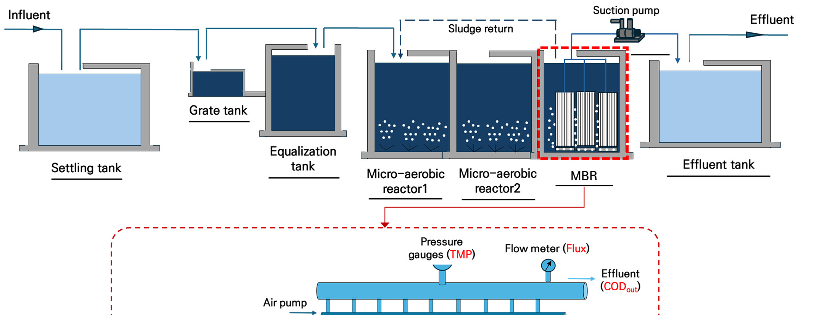
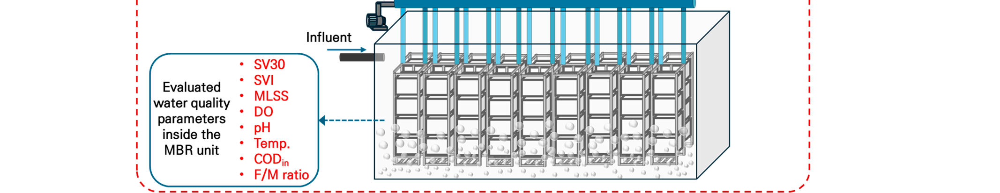
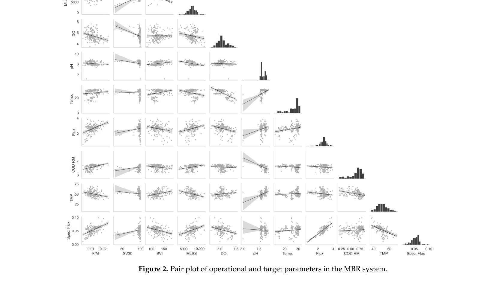
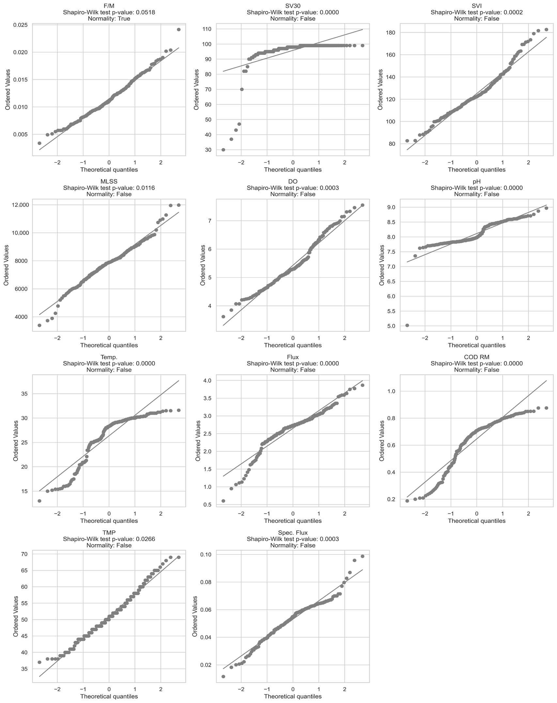
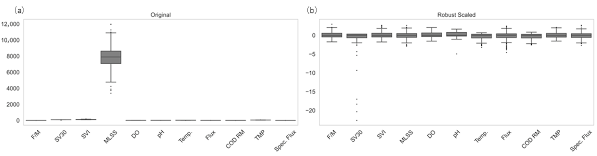
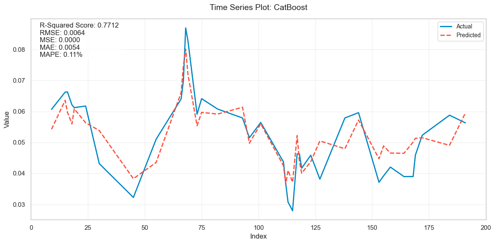
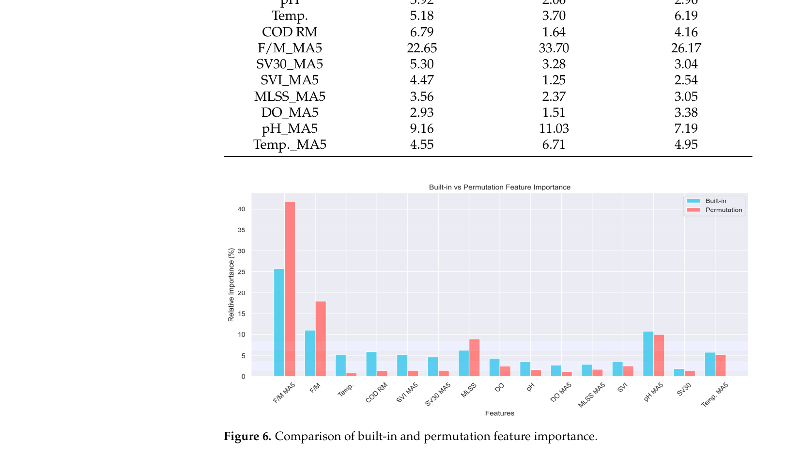
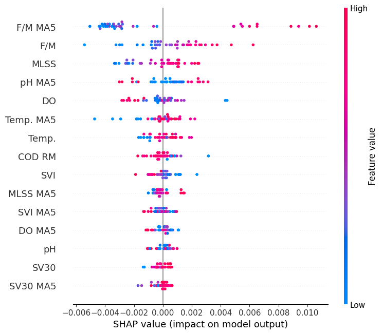

# Predictive Framework for Membrane Fouling in Full-Scale Membrane Bioreactors (MBRs): Integrating AI-Driven Feature Engineering and Explainable AI (XAI)

## Abstract

- Hiện tượng tắc nghẽn màng (membrane fouling) là thách thức lớn trong các hệ thống bể phản ứng sinh học màng quy mô thực tế (full-scale membrane bioreactor - MBR), làm suy giảm hiệu quả vận hành (operational efficiency) và gia tăng nhu cầu bảo trì (maintenance needs).
- Khung dự đoán và phân tích (predictive and analytic framework) cho hiện tượng tắc nghẽn màng được thiết lập thông qua việc tích hợp kỹ thuật đặc trưng dựa trên trí tuệ nhân tạo (artificial intelligence (AI)-driven feature engineering) và AI có thể giải thích (explainable AI - XAI), sử dụng dữ liệu thực tế (real-world data) từ hệ thống MBR xử lý nước thải chế biến thực phẩm (food processing wastewater).
  - Tinh chỉnh thông số mục tiêu (target parameter) thành thông lượng riêng ($\text{specific flux} = \text{flux} / \text{TMP}$, với $\text{TMP}$ là áp suất xuyên màng - transmembrane pressure).
  - Tích hợp hiệu quả loại bỏ nhu cầu oxy hóa học (chemical oxygen demand (COD) removal efficiency) nhằm phản ánh hiệu năng sinh học (biological performance).
  - Ứng dụng hàm trung bình trượt (moving average function) nhằm ghi nhận động học tắc nghẽn theo thời gian (temporal fouling dynamics).
- Mô hình CatBoost đạt độ chính xác dự đoán cao nhất với $R^2 = 0.8374$ trong số các mô hình được thử nghiệm, đạt hiệu năng cao hơn các mô hình thống kê truyền thống (traditional statistical models) và các mô hình học máy (machine learning models) khác.
- Tỷ lệ thức ăn trên vi sinh vật (food-to-microorganism (F/M) ratio) và nồng độ chất rắn lơ lửng trong bùn lỏng (mixed liquor suspended solids - MLSSs) được phân tích XAI xác định là các biến số có ảnh hưởng lớn nhất đến quá trình tắc nghẽn màng.
- Phương pháp tiếp cận có độ tin cậy cao và khả năng diễn giải (robust and interpretable approach) cho phép dự đoán tắc nghẽn chủ động (proactive fouling prediction) và hỗ trợ ra quyết định có cơ sở (informed decision making) trong vận hành MBR thực tế, ngay cả trong điều kiện dữ liệu hạn chế (limited data).
  - Thiết lập nền tảng cho việc tích hợp tương lai với hệ thống giám sát thời gian thực (real-time monitoring) và kiểm soát thích ứng (adaptive control), đóng góp vào việc vận hành xử lý nước thải bằng công nghệ màng bền vững và hiệu quả hơn.
- Giới hạn nghiên cứu bắt nguồn từ việc sử dụng tập dữ liệu từ một hệ thống MBR quy mô thực tế đơn lẻ xử lý nước thải chế biến thực phẩm và thiếu các biến cố tắc nghẽn nghiêm trọng (severe fouling) hoặc các sự kiện làm sạch màng (cleaning events).
  - Cần kiểm chứng bổ sung trên các bộ dữ liệu đa dạng (diverse datasets) để xác nhận khả năng áp dụng trên phạm vi rộng hơn.
- **Từ khóa (Keywords)**: Tắc nghẽn màng (membrane fouling); bể phản ứng sinh học màng (membrane bioreactor - MBR); khung dự đoán và phân tích (predictive and analytic framework); kỹ thuật đặc trưng điều khiển bởi AI (AI-driven feature engineering); trí tuệ nhân tạo có thể giải thích (explainable AI - XAI).

## 1. Introduction

- **Bối cảnh phát triển và ưu thế kỹ thuật của công nghệ màng lọc sinh học (MBR - Membrane Bioreactor)**:
  - Công nghệ MBR là giải pháp đổi mới then chốt trong ngành xử lý nước thải (wastewater treatment industry), mang lại nhiều ưu thế so với các quy trình bùn hoạt tính truyền thống (conventional activated sludge processes).
  - Bản chất quy trình: MBR kết hợp trực tiếp giữa xử lý sinh học (biological treatment) với quá trình lọc màng (membrane filtration).
  - Chất lượng nước sau xử lý ($effluent$): Tạo ra dòng nước sau lọc chất lượng cao, đáp ứng các yêu cầu khắt khe cho nhiều mục đích tái sử dụng nước khác nhau ($reuse\ applications$).
  - Các đặc tính kỹ thuật cốt lõi:
    - Diện tích mặt bằng nhỏ gọn ($compact\ footprint$).
    - Lượng bùn phát sinh thấp ($reduced\ sludge\ production$).
    - Hiệu suất loại bỏ chất ô nhiễm cao, bao gồm cả các vi chất ô nhiễm ($micropollutants$) và mầm bệnh ($pathogens$).
  - Quy mô triển khai thực tế: Công nghệ MBR được ứng dụng rộng rãi tại các nhà máy xử lý nước thải đô thị ($municipal$) và cơ sở xử lý nước thải công nghiệp ($industrial$) trên toàn thế giới.
- **Hiện tượng nghẹt màng (Membrane fouling) là thách thức cố hữu và nguyên nhân suy giảm hiệu quả vận hành**:
  - Cơ chế hình thành nghẹt màng: Phát sinh từ sự tích tụ của các hạt cặn ($particles$), các chất keo ($colloids$), và các chất hòa tan ($dissolved\ substances$) bám đọng trên bề mặt màng hoặc lắng đọng bên trong các mao quản của màng lọc.
  - Hệ quả kỹ thuật và kinh tế:
    - Làm sụt giảm độ thấm của màng ($permeability$).
    - Gia tăng tiêu hao năng lượng vận hành ($energy\ consumption$).
    - Đòi hỏi tăng tần suất súc rửa hóa chất hoặc phải thay thế màng sớm.
  - Các nhóm yếu tố chi phối: Hiện tượng nghẹt màng chịu ảnh hưởng đồng thời từ đặc tính nước thải đầu vào ($influent\ wastewater\ characteristics$), các điều kiện vận hành ($operational\ conditions$), và đặc tính của sinh khối ($biomass\ properties$).
  - Tác động vận hành dài hạn: Làm suy giảm trực tiếp hiệu quả vận hành và làm gia tăng đáng kể chi phí bảo trì ($maintenance\ costs$), đặt ra yêu cầu cấp thiết về các công cụ dự đoán ($predictive\ tools$) và giải pháp sáng tạo nhằm tối ưu hóa hiệu suất MBR phục vụ tính bền vững lâu dài.
- **Tầm quan trọng của dự đoán nghẹt màng và tính chất phụ thuộc thông lượng (Flux-driven nature)**:
  - Vai trò của dự đoán chính xác: Hỗ trợ người vận hành triển khai các giải pháp chủ động kịp thời, bao gồm việc hiệu chỉnh các thông số vận hành ($operational\ parameters$) hoặc chủ động lập kế hoạch làm sạch ($cleaning\ interventions$) để giảm thiểu tác động tiêu cực đến hiệu suất toàn hệ thống.
  - Rủi ro vận hành ở thông lượng cao: Do bản chất quy trình phụ thuộc chặt chẽ vào thông lượng ($flux\text{-}driven\ nature$), việc vận hành ở mức thông lượng ($flux$) quá cao có thể tạm thời làm giảm tần suất rửa màng, nhưng lại đẩy nhanh quá trình nghẹt màng, làm phát sinh chi phí và rủi ro gia tăng trong dài hạn.
  - Cân bằng đa mục tiêu: Dự đoán nghẹt màng chính xác hỗ trợ lựa chọn các điều kiện vận hành tối ưu nhằm cân bằng đồng thời giữa năng suất lọc ($productivity$), chất lượng nước sau xử lý ($effluent\ quality$), nhu cầu làm sạch ($cleaning\ needs$), và tổng chi phí vận hành ($overall\ cost$).
- **Giới hạn của các phương pháp dự đoán truyền thống và tiếp cận mô hình hóa tiên tiến**:
  - Hạn chế của mô hình thực nghiệm: Các phương pháp dự đoán truyền thống phụ thuộc chủ yếu vào các mô hình kinh nghiệm ($empirical\ models$) và thí nghiệm quy mô phòng thí nghiệm ($laboratory\text{-}scale\ experiments$), vốn không nắm bắt được động học phức tạp trong các hệ thống MBR quy mô thực tế ($full\text{-}scale\ MBR\ systems$).
  - Mô hình cơ chế ($mechanistic\ models$): Được xây dựng dựa trên các nguyên lý động lực học chất lưu ($fluid\ dynamics$), quá trình truyền khối ($mass\ transfer$), và sự hình thành màng sinh học ($biofilm\ formation$) nhằm mô phỏng tương tác phức tạp giữa sinh khối ($biomass$), chất rắn lơ lửng ($suspended\ solids$) và bề mặt màng, cung cấp các tri thức sâu sắc về cơ chế nghẹt màng.
  - Phương pháp thống kê và hướng dữ liệu ($statistical\ and\ data\text{-}driven\ approaches$): Bao gồm phân tích chuỗi thời gian ($time\text{-}series\ analysis$) và các kỹ thuật thống kê đa biến ($multivariate\ techniques$) nhằm xác định tương quan và nhận diện xu hướng biến thiên của hiệu suất màng.
  - Công cụ giám sát trực tuyến và cảm biến ($online\ monitoring\ tools\ and\ sensors$): Cung cấp dữ liệu theo thời gian thực về các chỉ số nghẹt màng cốt lõi, bao gồm áp suất qua màng ($TMP$ - transmembrane pressure) và thông lượng dòng thấm ($permeate\ flux$).
  - Rào cản khi ứng dụng quy mô thực tế: Các điều kiện vận hành đa dạng và biến động liên tục trong thực tế khiến việc thiết lập một mô hình dự đoán áp dụng phổ quát gặp nhiều khó khăn; đồng thời, bản chất phụ thuộc thời gian ($time\text{-}dependent\ nature$) của nghẹt màng cùng các biến động đột ngột của chất lượng nước đầu vào hoặc thông số vận hành đòi hỏi các phương pháp tiếp cận tinh vi và có khả năng thích ứng cao hơn.
- **Tiềm năng và phạm vi ứng dụng của Trí tuệ nhân tạo (AI) và Học máy (Machine Learning)**:
  - Năng lực cốt lõi của AI: Có khả năng xử lý hiệu quả các mối quan hệ phi tuyến phức tạp ($complex\ non\text{-}linear\ relationships$) giữa nhiều biến số và khai thác các cấu trúc quy luật ẩn ($hidden\ patterns$) trong các tập dữ liệu lớn.
  - Hiệu suất dự đoán: Cho thấy độ chính xác dự đoán cao hơn rõ rệt so với các mô hình thống kê thông thường khi xử lý bản chất biến động đa diện của hiện tượng nghẹt màng MBR.
  - Hạn chế về phạm vi xác thực hiện hữu: Phần lớn các nghiên cứu AI trước đây mới chỉ được thẩm định trong các điều kiện kiểm soát nghiêm ngặt ở quy mô phòng thí nghiệm hoặc quy mô thử nghiệm ($pilot\text{-}scale$), với rất ít minh chứng thực tế trong môi trường đầy nhiễu và biến động liên tục của các trạm MBR quy mô thực tế.
  - Các thuật toán AI tiêu biểu: Bao gồm mạng nơ-ron nhân tạo ($ANNs$ - Artificial Neural Networks), máy vector hỗ trợ ($SVMs$ - Support Vector Machines), rừng ngẫu nhiên ($random\ forests$), và các mô hình học sâu ($deep\ learning\ models$).
  - Các biến số đầu vào ($input\ variables$) dự đoán chỉ số nghẹt màng (như $TMP$ hoặc $permeate\ flux$):
    - Thông số vận hành ($operational\ parameters$): Tốc độ sục khí ($aeration\ rate$), thông lượng ($flux$), nồng độ bùn hoạt tính lơ lửng trong hỗn hợp lỏng ($MLSS$ - mixed liquor suspended solids).
    - Đặc tính nước thải đầu vào ($influent\ characteristics$): Nhu cầu oxy hóa học ($COD$ - chemical oxygen demand), hàm lượng dinh dưỡng ($nutrients$), nhiệt độ ($temperature$).
    - Đặc tính màng lọc ($membrane\ properties$).
  - Kỹ thuật đặc trưng nâng cao ($advanced\ feature\ engineering$): Áp dụng phân tích thành phần chính ($PCA$ - Principal Component Analysis) để giảm chiều dữ liệu ($dimensionality\ reduction$) hoặc biến đổi wavelet ($wavelet\ transforms$) cho phân tích chuỗi thời gian, kết hợp giữa dữ liệu đo trực tuyến dễ thu thập và các bộ chỉ số hóa lý - sinh học mở rộng.
- **Các thách thức kỹ thuật cốt lõi cản trở ứng dụng AI trong MBR quy mô thực tế**:
  - Hạn chế "hộp đen" ($black\ box$) và sự thiếu hụt khả năng giải thích ($lack\ of\ interpretability$): Các thuật toán AI, đặc biệt là học sâu, thiếu tính minh bạch khiến người vận hành khó hiểu và khó tin cậy vào kết quả dự đoán, cản trở việc đưa ra các quyết định điều hành sáng suốt trên thực địa.
  - Chất lượng và tính đại diện của dữ liệu huấn luyện: Dữ liệu thu thập từ phòng thí nghiệm hoặc pilot thiếu vắng mức độ nhiễu tín hiệu ($noise$), giá trị khuyết thiếu ($missing\ values$), và biên độ dao động vận hành thực tế ($operational\ variability$), dẫn đến nguy cơ mô hình hoạt động kém tin cậy khi chuyển sang môi trường thực tế.
  - Vấn đề co giãn và chuẩn hóa dữ liệu ($data\ scaling\ and\ normalization$): Các biến đầu vào có dải giá trị và đơn vị đo lường khác biệt rất lớn, dễ dẫn đến hiện tượng dự đoán sai lệch hoặc thiên vị nếu không được chuẩn hóa phù hợp trước biến động rộng của dữ liệu nhà máy xử lý nước thải.
  - Bản chất tích lũy theo thời gian ($time\text{-}dependent\ nature$): Hiện tượng nghẹt màng mang bản chất phụ thuộc thời gian tích lũy, đòi hỏi kỹ thuật trích xuất đặc trưng phải kết hợp đồng thời dữ liệu vận hành tức thời và dữ liệu lịch sử; hầu hết các phương pháp hiện hữu bỏ qua tác động tích lũy này, chưa phản ánh được phụ thuộc thời gian và xu hướng dài hạn.
  - Thách thức lựa chọn tham số mục tiêu ($target\ parameter$):
    - Hai chỉ số đầu ra truyền thống được sử dụng phổ biến nhất là áp suất qua màng ($TMP$) và thông lượng ($flux$).
    - Trong chế độ thông lượng không đổi ($constant\ flux\ mode$): $TMP$ gia tăng khi màng bị nghẹt.
    - Trong chế độ áp suất không đổi ($constant\ pressure\ mode$): $flux$ suy giảm khi màng bị nghẹt.
    - Trạng thái thực tế: Phần lớn hệ thống MBR vận hành ở chế độ $constant\ flux$, nhưng do biến động lưu lượng dòng vào ($inflow\ variability$) và điều kiện môi trường thay đổi, cả $flux$ lẫn $TMP$ đều thường xuyên dao động đồng thời; do đó, cần lựa chọn tham số mục tiêu mới có khả năng phản ánh đồng thời sự biến thiên của cả hai đại lượng này.
- **Mục tiêu nghiên cứu và các điểm đổi mới của khung dự đoán nghẹt màng đề xuất**:
  - Mục tiêu nghiên cứu cốt lõi: Xây dựng khung dự đoán nghẹt màng cho các trạm MBR quy mô thực tế ($full\text{-}scale\ MBRs$) thông qua sự tích hợp giữa kỹ thuật trích xuất đặc trưng định hướng AI ($AI\text{-}driven\ feature\ engineering$) và Trí tuệ nhân tạo có thể giải thích ($XAI$ - Explainable AI).
  - Định hướng thực địa: Ưu tiên lựa chọn các thông số đo lường khả thi trong môi trường hiện trường bị hạn chế về tài nguyên, tránh phụ thuộc vào các tập dữ liệu lý tưởng hóa hoặc dữ liệu nhân tạo ($synthetic\ data$).
  - Xử lý thách thức dữ liệu thực tế: Các kỹ thuật trích xuất đặc trưng đề xuất (như hàm trung bình trượt) trực tiếp giải quyết vấn đề nhiễu cảm biến ($sensor\ noise$) và tần suất lấy mẫu thưa ($infrequent\ sampling$).
  - Các yếu tố kỹ thuật đổi mới trọng tâm:
    - Áp dụng các kỹ thuật trích xuất đặc trưng đa dạng nhằm khai thác thông tin có ý nghĩa từ dữ liệu thô, nắm bắt tương tác phức tạp giữa điều kiện vận hành và động thái nghẹt màng.
    - Đưa thông lượng riêng ($\text{Specific Flux} = \frac{\text{Flux}}{\text{TMP}}$), có bản chất vật lý tương đương với độ thấm của màng lọc ($membrane\ permeability$), làm tham số mục tiêu; chỉ số động này phản ánh đầy đủ hiệu suất của màng bằng cách hạch toán đồng thời cả biến thiên của $flux$ và $TMP$.
    - Đưa hiệu suất loại bỏ $COD$ ($COD\ removal\ efficiency$) vào danh sách biến số đầu vào nhằm đại diện cho hiệu năng xử lý sinh học của hệ thống MBR và tác động tiềm tàng của sinh khối lên hiện tượng nghẹt màng.
    - Ứng dụng khái niệm trung bình trượt ($moving\ average$) trong việc cấu trúc các cặp dữ liệu đầu vào - đầu ra ($input\text{--}output\ data\ pairs$), phản ánh tác động phụ thuộc thời gian của các phản ứng sinh học lên quá trình nghẹt màng.
    - Ứng dụng các mô hình AI có thể giải thích ($XAI$) để cung cấp cơ chế hỗ trợ ra quyết định cho người vận hành, nâng cao tính minh bạch và độ tin cậy của các kết quả dự đoán.
  - Xác thực thực nghiệm dài hạn: Khung mô hình được chứng minh hiệu quả trên tập dữ liệu thực tế kéo dài hơn $6\text{ tháng}$ ($> 6\text{ months}$) thu thập từ một hệ thống MBR đang vận hành thực tế, bảo đảm tính xác thực và khả năng thích ứng với các điều kiện phi lý tưởng ngoài hiện trường.
- **Cơ chế tích hợp bổ trợ giữa AI, mô hình vật lý và hệ thống cảm biến**:
  - Vai trò bổ trợ tương hỗ: Khung AI không thay thế mà đóng vai trò bổ trợ cho các mô hình dựa trên nguyên lý vật lý ($physics\text{-}based\ models$) và các thiết bị cảm biến truyền thống, chuyển hóa dữ liệu vận hành phức tạp thành các tri thức hành động phục vụ kiểm soát chủ động ($proactive\ control$).
  - Tương tác thích ứng động: Mô hình AI tiếp nhận dữ liệu cảm biến thời gian thực (như $TMP$, $DO$ - dissolved oxygen) để tự động điều chỉnh các thông số đầu vào cho mô phỏng vật lý, thiết lập cơ chế dự đoán nghẹt màng có tính thích ứng và phản hồi nhanh.
  - Hệ thống cảnh báo lai và hỗ trợ ra quyết định: Việc kết hợp kết quả dự đoán của AI với các chỉ số nghẹt màng truyền thống cho phép xây dựng hệ thống cảnh báo lai ($hybrid\ alarm$) hoặc hệ thống hỗ trợ ra quyết định, kết hợp ưu thế của cả mô hình định hướng dữ liệu và mô hình cơ chế nhằm nâng cao hiệu quả quản lý nghẹt màng và phát triển bền vững cho quy trình MBR.

## 2. Materials and Methods

## 2.1. MBR Process (Data Collection)

- Quy trình xử lý nước thải chế biến thực phẩm quy mô thực tế (full-scale food processing wastewater treatment process) tại Bắc Kinh và hệ thống MBR làm trọng tâm thu thập dữ liệu (Figure 1):
  - **Hình 1.** Sơ đồ quy trình công nghệ xử lý nước thải và hệ thống MBR
    - 
    - 
    - **Hình này chứng minh điều gì**
      - Chuỗi công nghệ xử lý hoàn chỉnh và vị trí các điểm đo thông số vận hành, chất lượng nước phục vụ mô hình hóa AI.
    - **Từ đâu mà thấy được**
      - Sơ đồ liên hoàn các đơn vị xử lý và ký hiệu chữ màu đỏ tại các vị trí thu thập dữ liệu trên cụm MBR.
  - Chuỗi công nghệ xử lý gồm bể lắng (settling tank), bể chắn rác (grate tank), bể điều hòa (equalization tank), hai bể phản ứng vi hiếu khí nối tiếp (two sequential micro-aerobic reactors: reactor 1 và reactor 2), hệ thống bể phản ứng sinh học màng (membrane bioreactor - MBR), bể chứa nước đầu ra (effluent tank) và đường tuần hoàn bùn (sludge return) từ MBR về bể vi hiếu khí 1.
  - Khung phân tích và dự đoán tắc nghẽn màng bằng AI (AI-driven fouling analytic and predictive framework) được phát triển dựa trên dữ liệu liên quan trực tiếp đến quy trình MBR, không mô tả chi tiết các đơn vị xử lý khác trong chuỗi công nghệ.
  - Vị trí đo đạc và các thông số vận hành cùng chất lượng nước phục vụ mô hình hóa được biểu diễn bằng chữ màu đỏ tại các điểm thu thập tương ứng trên sơ đồ (Figure 1).
  - Toàn bộ dữ liệu nghiên cứu được biên soạn từ các hoạt động vận hành thực địa thường nhật (routine field operations) dưới điều kiện thực tế (real-world conditions), không xuất phát từ kịch bản phòng thí nghiệm hay các thiết lập thử nghiệm chuyên biệt, bảo đảm tính thực tiễn và khả năng ứng dụng cho mô hình dự đoán trên hệ thống MBR quy mô công nghiệp.
- Cấu tạo và đặc tính kỹ thuật của cụm màng sợi rỗng MBR:
  - Hệ thống MBR sử dụng các mô-đun màng sợi rỗng nhúng polyethylene (polyethylene-embedded hollow fiber membranes) với kích thước lỗ lọc nhỏ hơn $0{,}4\text{ }\mu\text{m}$.
  - Sợi màng có đường kính trong là $0{,}41\text{ mm}$ và đường kính ngoài là $0{,}65\text{ mm}$.
  - Độ giãn dài cực đại trước khi đứt gãy (elongation rate - biến dạng tối đa màng sợi rỗng có thể chịu đựng trước khi hỏng) đạt mức dưới $17\%$.
  - Diện tích bề mặt lọc của một nhóm màng đơn lẻ (filtrable surface area of a single membrane group) đạt $200{,}7\text{ m}^2$.
  - Tổng số nhóm màng đưa vào vận hành thực tế là $9\text{ nhóm màng}$ (tổng diện tích bề mặt lọc khả dụng đạt $1806{,}3\text{ m}^2$).
  - Các thành phần cốt lõi của hệ thống MBR bao gồm mô-đun màng (membrane module), hệ thống cấp nước vào và thu nước ra (influent and effluent systems), hệ thống sục khí (aeration system), và hệ thống tuần hoàn (recirculation system).
- Thông số vận hành thủy lực và kiểm soát sinh học của hệ thống MBR:
  - Công suất xử lý nước thải thiết kế của hệ thống MBR đạt $150\text{ m}^3/\text{d}$, đáp ứng yêu cầu xử lý của nhà máy chế biến thực phẩm.
  - Lưu lượng dòng vào trung bình (average influent flow rate) thực tế tới hệ thống MBR là $114\text{ m}^3/\text{d}$.
  - Thời gian lưu nước thủy lực (hydraulic retention time - HRT) của hệ thống đạt xấp xỉ $0{,}75\text{ ngày}$.
  - Nồng độ oxy hòa tan (dissolved oxygen - DO) duy trì ở mức $5{,}43\text{ mg/L}$.
  - Nồng độ chất rắn lơ lửng trong bùn hoạt tính (mixed liquor suspended solids - MLSS) dao động trong khoảng từ $5000\text{ mg/L}$ đến $9000\text{ mg/L}$.
  - Hệ thống duy trì nồng độ MLSS ổn định và không tiến hành xả bùn chủ đích (no intentional sludge wasting) trong suốt giai đoạn theo dõi.
  - Thời gian lưu bùn (solid retention time - SRT) không được kiểm soát hay ghi nhận tường minh (not explicitly controlled or recorded) do không áp dụng xả bùn có chủ ý.
- Chế độ lọc gián đoạn và kiểm soát ngưỡng làm sạch màng:
  - Nước sau xử lý được hút lọc gián đoạn qua màng bằng hệ thống bơm (intermittent filtration), vận hành theo chu kỳ $10\text{ phút}$ hút lọc và $5\text{ phút}$ nghỉ ($10\text{ min on}$ và $5\text{ min off}$).
  - Chu kỳ làm sạch màng (membrane cleaning cycle) được kích hoạt theo kế hoạch khi áp suất xuyên màng (transmembrane pressure - TMP) tăng hơn $30\%$ so với đường cơ sở (baseline value), hoặc khi TMP vượt ngưỡng $60\text{ kPa}$, phù hợp với thực hành vận hành MBR đặt ngập tiêu chuẩn.
  - Không có bất kỳ sự kiện làm sạch hóa chất nào xảy ra—kể cả rửa ngược tăng cường hóa chất (chemical-enhanced backwash - CEB) hay làm sạch tại chỗ (cleaning in place - CIP)—trong suốt chu kỳ theo dõi $194\text{ ngày}$ do TMP chưa từng vượt các ngưỡng làm sạch quy định.
  - Khung mô hình hóa dự đoán không đưa các dữ liệu liên quan đến sự kiện làm sạch hóa chất vào danh sách biến số đầu vào.
- Phương pháp phân tích mẫu và thiết bị đo đạc các chỉ tiêu chất lượng nước:
  - Mẫu bùn hoạt tính từ bể phản ứng MBR được lọc qua màng cellulose hỗn hợp $0{,}45\text{ }\mu\text{m}$ (Advantec, Tokyo, Japan) để phân tích nhu cầu oxy hóa học (chemical oxygen demand - COD) theo tiêu chuẩn Standard Methods for the Examination of Water and Wastewater của APHA.
  - Nồng độ COD trước và sau xử lý ($\text{COD}_{\text{in}}$ và $\text{COD}_{\text{out}}$) được đo bằng máy đo COD chuyên dụng (DR1010, HACH, Loveland, CO, USA).
  - Độ pH và nhiệt độ ($\text{Temp.}$) được phân tích định lượng bằng điện cực đa năng cầm tay (Multi 3630, Munich, Germany) tích hợp mạng phối hợp đo.
  - Nồng độ oxy hòa tan (DO) được đo bằng đồng hồ đo đa năng cầm tay (PHB-4, Zsynet, Shanghai, China).
  - Nồng độ MLSS được xác định bằng phương pháp khối lượng (gravimetric method).
  - Áp suất xuyên màng (TMP) và lưu lượng (flow rate) được theo dõi và ghi nhận hàng ngày qua các đồng hồ đo áp suất (pressure gauges) và lưu lượng kế (flow meters) kết nối trực tiếp với hệ thống MBR.
  - Thể tích bùn lắng sau 30 phút (SV30), chỉ số thể tích bùn (sludge volume index - SVI), tỷ số thức ăn trên vi sinh vật (food-to-microorganism ratio - F/M), và thông lượng màng (flux) được phân tích theo các phương pháp chuẩn.
- Giao thức thu thập dữ liệu hàng ngày và phương pháp xử lý biến đổi chuỗi thời gian:
  - Toàn bộ các phép đo được thu thập liên tục hàng ngày trong suốt thời gian $194\text{ ngày}$, tạo lập tập dữ liệu đầy đủ cho việc huấn luyện và kiểm định mô hình.
  - Các tham số phân tích thủ công gồm $\text{F/M}$, $\text{SV30}$, $\text{SVI}$, $\text{MLSS}$ và $\text{COD}$ được đo một lần mỗi ngày và ghi nhận thành các điểm dữ liệu ngày (daily data points).
  - Các biến số theo dõi trực tuyến bằng cảm biến liên tục gồm $\text{DO}$, $\text{pH}$, nhiệt độ ($\text{Temp.}$), $\text{TMP}$ và lưu lượng (flow rate) được xử lý thành các giá trị trung bình ngày (daily average values) nhằm bảo đảm tính đồng nhất và khả năng so sánh trên toàn bộ tập dữ liệu.
  - Quy trình thu thập dữ liệu chịu giới hạn thực địa của hệ thống vận hành thực tế, trong đó phương thức lấy mẫu thủ công và giới hạn kỹ thuật của cảm biến hạn chế khả năng ghi nhận dữ liệu tần suất cao.
  - Dữ liệu trung bình ngày có thể làm che khuất các dao động ngắn hạn của động học tắc nghẽn màng; vì vậy phép biến đổi trung bình trượt (moving average transformation, trình bày tại Mục 2.3.2) đã được áp dụng lên các đặc trưng chính nhằm nắm bắt tương quan thời gian và hạn chế sự suy giảm xu hướng chuỗi dữ liệu.
  - Phân tích trực quan hóa biến động nội ngày (intra-day trends) được định hướng mở rộng khi có sẵn nguồn dữ liệu tần suất cao trong các nghiên cứu tiếp theo.
- Thiết lập biến mục tiêu dự đoán dựa trên động lực học màng:
  - Biến mục tiêu của khung mô hình được xác định là áp suất xuyên màng ($\text{TMP}$) hoặc thông lượng riêng ($\text{Spec. Flux}$).
  - Thông lượng riêng ($\text{Spec. Flux}$) được tính bằng công thức:
    $$\text{Spec. Flux} = \frac{\text{flux}}{\text{TMP}}$$
  - Thông lượng riêng đại diện trực tiếp cho độ thấm của màng (membrane permeability), là chỉ số then chốt định lượng mức độ nghiêm trọng của hiện tượng tắc nghẽn màng (fouling severity).
  - Trong vận hành MBR thực tế, ngay cả ở chế độ thông lượng không đổi (constant flux mode), cả flux và TMP đều liên tục thay đổi do dao động vận hành và điều kiện môi trường; do đó $\text{Spec. Flux}$ phản ánh đồng thời các biến đổi này hiệu quả hơn so với việc chỉ sử dụng từng tham số đơn lẻ, trở thành chỉ số mang tính thực tế và mạnh mẽ (robust) cho mô hình hóa dự đoán.
  - Giữa TMP và Spec. Flux tồn tại mối quan hệ nghịch đảo theo cơ chế tắc nghẽn: khi tắc nghẽn màng gia tăng ở một mức flux cho trước, TMP tăng lên dẫn tới sự suy giảm của Spec. Flux ($\text{TMP} \uparrow \implies \text{Spec. Flux} \downarrow$).
- Thiết lập các trường hợp thử nghiệm so sánh mô hình (Table 1):
  - Bốn kịch bản thử nghiệm được xây dựng nhằm so sánh hiệu năng mô hình một cách có hệ thống, dựa trên việc đưa vào hay loại trừ hiệu suất loại bỏ COD ($\text{COD RM}$ - COD removal efficiency) cùng với sự lựa chọn tham số mục tiêu ($\text{TMP}$ hoặc $\text{Spec. Flux}$) (Table 1):
    - Trường hợp I (Case I): Sử dụng 7 yếu tố vận hành cơ bản ($\text{F/M}$, $\text{SV30}$, $\text{SVI}$, $\text{MLSS}$, $\text{DO}$, $\text{pH}$, $\text{Temp.}$); biến mục tiêu là $\text{TMP}$.
    - Trường hợp II (Case II): Sử dụng 7 yếu tố cơ bản bổ sung hiệu suất loại bỏ COD ($\text{F/M}$, $\text{SV30}$, $\text{SVI}$, $\text{MLSS}$, $\text{DO}$, $\text{pH}$, $\text{Temp.}$, $\text{COD RM}$); biến mục tiêu là $\text{TMP}$.
    - Trường hợp III (Case III): Sử dụng 7 yếu tố cơ bản ($\text{F/M}$, $\text{SV30}$, $\text{SVI}$, $\text{MLSS}$, $\text{DO}$, $\text{pH}$, $\text{Temp.}$); biến mục tiêu là $\text{Spec. Flux}$.
    - Trường hợp IV (Case IV): Sử dụng 7 yếu tố cơ bản bổ sung $\text{COD RM}$ ($\text{F/M}$, $\text{SV30}$, $\text{SVI}$, $\text{MLSS}$, $\text{DO}$, $\text{pH}$, $\text{Temp.}$, $\text{COD RM}$); biến mục tiêu là $\text{Spec. Flux}$.

| Cases | Factors | Target |
| :--- | :--- | :--- |
| Case I | $\text{F/M}$, $\text{SV30}$, $\text{SVI}$, $\text{MLSS}$, $\text{DO}$, $\text{pH}$, $\text{Temp.}$ | $\text{TMP}$ |
| Case II | $\text{F/M}$, $\text{SV30}$, $\text{SVI}$, $\text{MLSS}$, $\text{DO}$, $\text{pH}$, $\text{Temp.}$, $\text{COD RM}$ | $\text{TMP}$ |
| Case III | $\text{F/M}$, $\text{SV30}$, $\text{SVI}$, $\text{MLSS}$, $\text{DO}$, $\text{pH}$, $\text{Temp.}$ | $\text{Spec. Flux}$ |
| Case IV | $\text{F/M}$, $\text{SV30}$, $\text{SVI}$, $\text{MLSS}$, $\text{DO}$, $\text{pH}$, $\text{Temp.}$, $\text{COD RM}$ | $\text{Spec. Flux}$ |

## 2.2. Exploratory Data Analysis (EDA)

- Phân tích khám phá dữ liệu (Exploratory Data Analysis - $EDA$) được tiến hành nhằm kiểm tra phân phối (distribution), các mối quan hệ (relationships) và các quy luật tiềm ẩn (underlying patterns) trong tập dữ liệu.
  - Phân tích bao gồm thống kê mô tả (descriptive statistics), các kỹ thuật trực quan hóa (visualization techniques), phân tích tương quan (correlation analysis) và các kiểm định phân phối chuẩn (normality tests).
  - Mục tiêu là đánh giá các đặc tính của các đặc trưng (features) và thông số mục tiêu (target parameters) trước khi bước vào giai đoạn phát triển mô hình (model development).

### 2.2.1. Operational Feature Statistics

- Các thước đo thống kê mô tả (Descriptive statistical measures) được tính toán cho tất cả các đặc trưng và biến mục tiêu (target variables).
  - Các giá trị thống kê được tính toán gồm: giá trị trung bình (mean), trung vị (median), độ lệch chuẩn (standard deviation - $std$), giá trị nhỏ nhất (minimum) và giá trị lớn nhất (maximum).
  - Phân tích cung cấp cái nhìn tổng quan về xu hướng tập trung (central tendency) và mức độ biến thiên (variability) của dữ liệu.
  - Hỗ trợ nhận diện các dị thường (anomalies) hoặc giá trị ngoại lai (outliers) tiềm ẩn trong tập dữ liệu.

### 2.2.2. Pair Plot

- Biểu đồ cặp (Pair plot) được thiết lập nhằm khảo sát các mối quan hệ theo cặp (pairwise relationships) giữa các đặc trưng và các thông số mục tiêu.
  - Trực quan hóa này cung cấp thông tin chi tiết về các mối tương quan tuyến tính hoặc phi tuyến tính tiềm ẩn (potential linear or non-linear correlations), các mẫu phân cụm (clustering patterns) và các giá trị ngoại lai (outliers).
  - Thúc đẩy việc hiểu sâu hơn về tập dữ liệu trước khi phát triển mô hình.
  - Biểu đồ cặp được xây dựng bằng thư viện Seaborn ($0.13.2$) trong môi trường Python ($3.13.1$).
  - Biểu đồ tích hợp các đường hồi quy (regression lines) để quan sát các xu hướng tuyến tính khả dĩ và các khoảng tin cậy (confidence intervals) nhằm đánh giá mức độ biến thiên (variability).

### 2.2.3. Scatter Plot

- Các biểu đồ phân tán riêng lẻ (Individual scatter plots) được sử dụng để khám phá mối quan hệ giữa các đặc trưng đầu vào cụ thể (specific input features) và các thông số mục tiêu ($TMP$ và $Spec.\ Flux$).
  - Các biểu đồ hỗ trợ phát hiện các xu hướng tuyến tính hoặc phi tuyến tính khả dĩ.
  - Hỗ trợ phát hiện các giá trị ngoại lai (outliers) có nguy cơ ảnh hưởng đến hiệu năng của mô hình (model performance).

### 2.2.4. Pearson Correlation

- Hệ số tương quan Pearson ($r$) được tính toán nhằm định lượng mối quan hệ tuyến tính (linear relationship) giữa từng đặc trưng và các thông số mục tiêu.
  - Ma trận tương quan (correlation matrix) được xây dựng nhằm trực quan hóa cường độ (strength) và chiều hướng (direction) của các mối liên kết.
  - Phân tích hỗ trợ quá trình lựa chọn đặc trưng (feature selection) bằng cách xác định các biến có tương quan cao (highly correlated variables) có thể ảnh hưởng đến hiệu năng của mô hình.

### 2.2.5. Normality Check

- Kiểm định Shapiro–Wilk (Shapiro–Wilk test) được thực hiện cho tất cả các đặc trưng và biến mục tiêu nhằm đánh giá tính phân phối chuẩn (normality) của tập dữ liệu.
  - Kiểm định đánh giá liệu một tập dữ liệu cho trước có tuân theo phân phối chuẩn (normal distribution) hay không.
  - Giả thuyết không ($H_0$) giả định dữ liệu tuân theo phân phối chuẩn.
  - Giả thuyết đối ($H_1$) cho rằng dữ liệu có sự sai lệch so với phân phối chuẩn (deviation from normality).
  - Giá trị thống kê kiểm định Shapiro–Wilk nằm trong khoảng từ $0$ đến $1$, với các giá trị tiệm cận $1$ biểu thị mức độ tương đồng cao hơn với phân phối chuẩn.
  - Ngưỡng $p\text{-value}$ bằng $0.05$ được sử dụng để đánh giá ý nghĩa thống kê (statistical significance).
  - Nếu $p\text{-value} > 0.05$, giả thuyết không ($H_0$) không bị bác bỏ, xác nhận dữ liệu tuân theo phân phối chuẩn.

## 2.3. Preprocessing and Feature Engineering

- Tiền xử lý dữ liệu và kỹ thuật đặc trưng (preprocessing and feature engineering) được áp dụng nhằm nâng cao tính nhất quán của dữ liệu (data consistency) và cải thiện hiệu suất mô hình trong điều kiện vận hành thực địa không lý tưởng (non-ideal field conditions):
  - Phép co giãn mạnh mẽ (robust scaling) và các phép biến đổi trung bình trượt (moving average transformations) được lựa chọn để mô phỏng các điều kiện thực tế tại hiện trường, nơi chất lượng dữ liệu thường xuyên bị suy giảm (compromised).
  - Các kỹ thuật này bảo đảm độ bền vững (resilience) của mô hình trước các giá trị ngoại lai (outliers) và các khoảng trống dữ liệu theo thời gian (temporal gaps) — những yếu tố có tính chất sống còn đối với việc triển khai thực tế trong công nghiệp (industrial deployment).

### 2.3.1. Robust Scaling

- Phép co giãn mạnh mẽ (robust scaling) được triển khai nhằm chuẩn hóa tập dữ liệu (normalize the dataset) đồng thời hạn chế tối đa ảnh hưởng từ các giá trị cực trị (extreme values):
  - Khác biệt với các phương pháp chuẩn hóa tiêu chuẩn (standard normalization methods) vốn rất nhạy cảm với các giá trị ngoại lai (outliers), robust scaling định tâm dữ liệu theo giá trị trung vị (median) và co giãn theo khoảng tứ phân vị (interquartile range: $IQR = Q_3 - Q_1$).
  - Kỹ thuật này bảo đảm sự phân phối của các biến số có thang đo (scales) khác nhau duy trì được tính tương đồng và có thể so sánh trực tiếp với nhau.
- Phép biến đổi robust scaling được thực hiện theo Equation (1):
  $$x_{\text{robust scaled}} = \frac{x - \text{Median}}{Q_3 - Q_1} \tag{1}$$
  - $x$: giá trị ban đầu của đặc trưng trước khi chuẩn hóa.
  - $x_{\text{robust scaled}}$: giá trị đặc trưng thu được sau khi thực hiện biến đổi robust scaling.
  - $\text{Median}$: giá trị trung vị của phân phối đặc trưng (phân vị thứ $50$, $Q_2$), đóng vai trò tâm chuẩn hóa thay cho giá trị trung bình (mean) để triệt tiêu ảnh hưởng của ngoại lai.
  - $Q_3 - Q_1$: khoảng tứ phân vị ($IQR$), biểu thị độ biến thiên giữa phân vị thứ $75$ ($Q_3$) và phân vị thứ $25$ ($Q_1$), đóng vai trò là mẫu số co giãn bền vững.

### 2.3.2. Moving Average

- Hiện tượng trễ thời gian (time delay) giữa các đặc tính dòng vào (influent) và dòng ra (effluent) phát sinh do quá trình loại bỏ chất ô nhiễm trong hệ thống bể phản ứng sinh học màng (membrane bioreactor - MBR) đòi hỏi một khoảng thời gian xử lý nhất định:
  - Khái niệm độ trễ thời gian trong nghiên cứu này là một phương pháp kỹ thuật đặc trưng dựa trên dữ liệu (data-driven feature engineering method) nhằm tối ưu hóa việc ghép cặp dữ liệu đầu vào – đầu ra (input–output data pairing) cho huấn luyện mô hình học máy.
  - Phương pháp này không đóng vai trò đại diện trực tiếp cho thời gian lưu thủy lực (hydraulic retention time - HRT) hay độ trễ quá trình vật lý (physical process lag).
  - Cách tiếp cận tối ưu ghép cặp cho phép xác định cơ chế căn chỉnh theo thời gian hiệu quả nhất (effective temporal alignment) phục vụ dự đoán tắc nghẽn màng (fouling prediction) trong các điều kiện dữ liệu và vận hành cụ thể.
- Biến đổi trung bình trượt (moving average transformation) được áp dụng đồng loạt cho toàn bộ các đặc trưng nhằm tích hợp hành vi phụ thuộc thời gian (time-dependent behavior):
  - Nâng cao năng lực nắm bắt các xu hướng dài hạn (long-term trends) của mô hình học máy, đồng thời giảm thiểu tác động gây nhiễu từ các dao động ngắn hạn (short-term fluctuations).
  - Giảm thiểu ảnh hưởng của các giá trị cực trị (extreme values), mang lại hiệu quả đặc biệt rõ rệt đối với các tập dữ liệu có mức độ nhiễu cao (high noise levels).
- Giá trị biến đổi trung bình trượt $MA_t$ được tính toán theo Equation (2):
  $$MA_t = \frac{x_{n-t+1} + x_{n-t+2} + \dots + x_n}{t} = \frac{1}{t} \sum_{i=n-t+1}^{n} x_i \tag{2}$$
  - $MA_t$: giá trị trung bình trượt tính tại bước thời gian hiện tại $n$ ứng với kích thước cửa sổ thời gian trễ $t$.
  - $t$: khoảng thời gian trễ hoặc độ dài của cửa sổ trượt (time window / delay interval) dùng để gom nhóm các quan sát lịch sử.
  - $x_n$: giá trị đặc trưng ghi nhận tại thời điểm hiện tại $n$.
  - $x_{n-t+1}, x_{n-t+2}, \dots, x_n$: chuỗi $t$ giá trị quan sát liên tiếp được thu thập trong khoảng thời gian từ bước $n-t+1$ đến bước $n$.
  - $\frac{1}{t} \sum_{i=n-t+1}^{n} x_i$: biểu thức tổng quát của phép tính trung bình số học trên cửa sổ thời gian kích thước $t$.

## 2.4. Models

- Hai nhóm mô hình bao gồm các mô hình hồi quy thống kê (statistical regression models) và các mô hình học máy (machine learning models) được áp dụng nhằm xây dựng các mô hình dự đoán hiện tượng nghẹt màng (membrane fouling):
  - Các mô hình thống kê nhằm nắm bắt các mối quan hệ tuyến tính (linear relationships) giữa các đặc trưng đầu vào (input features) và các thông số mục tiêu (target parameters).
  - Các mô hình học máy khai thác các quy luật phi tuyến (non-linear patterns) để nâng cao độ chính xác dự đoán (predictive accuracy).

### 2.4.1. Statistical Models

- Hồi quy tuyến tính (Linear Regression) là phương pháp thống kê cơ bản được sử dụng để mô hình hóa mối quan hệ giữa biến phụ thuộc $Y$ và nhiều biến độc lập $X_i$:
  - Mô hình được biểu diễn theo Equation (3):
    $$Y = \beta_0 + \beta_1 X_1 + \beta_2 X_2 + \dots + \beta_p X_p + \epsilon \tag{3}$$
  - $\beta_0$: hệ số chặn (intercept).
  - $\beta_1$ đến $\beta_p$: các hệ số hồi quy (regression coefficients).
  - $\epsilon$: số hạng sai số (error term).
  - Mô hình giả định mối quan hệ tuyến tính giữa các biến dự đoán (predictors) và các thông số mục tiêu (target parameters).
- Hồi quy Lasso (Least Absolute Shrinkage and Selection Operator - Lasso regression) bổ sung số hạng điều chuẩn $L_1$ vào mô hình hồi quy tuyến tính, thực hiện lựa chọn đặc trưng (feature selection) hiệu quả bằng cách phạt độ lớn tuyệt đối của các hệ số hồi quy:
  - Hàm mục tiêu (objective function) được xác định theo Equation (4):
    $$\min_{\beta} \sum_{i=1}^n \left( y_i - \beta_0 - \sum_{j=1}^p \beta_j x_{ij} \right)^2 + \lambda \sum_{j=1}^p |\beta_j| \tag{4}$$
  - $\lambda$: siêu tham số (hyperparameter) kiểm soát cường độ điều chuẩn (regularization strength).
  - $y_i$: giá trị thực tế của biến mục tiêu tại quan sát thứ $i$.
  - $x_{ij}$: giá trị của đặc trưng thứ $j$ tại quan sát thứ $i$.
  - $\beta_0$: hệ số chặn và $\beta_j$: hệ số hồi quy tương ứng với đặc trưng thứ $j$.
  - Hồi quy Lasso giúp giảm thiểu hiện tượng quá khớp (mitigate overfitting) bằng cách thu hẹp một số hệ số hồi quy về đúng bằng $0$ (shrinking some coefficients to zero), qua đó chỉ lựa chọn các đặc trưng quan trọng nhất (most relevant features).
- Hồi quy Ridge (Ridge regression) mở rộng hồi quy tuyến tính bằng cách tích hợp số hạng điều chuẩn $L_2$, thực hiện phạt các hệ số hồi quy có giá trị lớn và giảm phương sai mô hình (model variance):
  - Hàm mục tiêu được xác định theo Equation (5):
    $$\min_{\beta} \sum_{i=1}^n \left( y_i - \beta_0 - \sum_{j=1}^p \beta_j x_{ij} \right)^2 + \lambda \sum_{j=1}^p \beta_j^2 \tag{5}$$
  - $\lambda$: siêu tham số kiểm soát cường độ điều chuẩn.
  - $\beta_j^2$: bình phương của hệ số hồi quy $\beta_j$, cấu thành số hạng phạt theo chuẩn $L_2$.
  - Hồi quy Ridge đặc biệt hữu ích trong việc xử lý các vấn đề đa cộng tuyến (multicollinearity issues), bảo đảm độ ổn định của mô hình (model stability) và cải thiện khả năng khái quát hóa (generalization).
- Hồi quy Elastic Net (Elastic Net regression) kết hợp các kỹ thuật điều chuẩn $L_1$ (Lasso) và $L_2$ (Ridge), tận dụng ưu điểm của cả hai phương pháp:
  - Hàm mục tiêu được thiết lập theo Equation (6):
    $$\min_{\beta} \sum_{i=1}^n \left( y_i - \beta_0 - \sum_{j=1}^p \beta_j x_{ij} \right)^2 + \lambda \left[ \alpha \sum_{j=1}^p |\beta_j| + \frac{1 - \alpha}{2} \sum_{j=1}^p \beta_j^2 \right] \tag{6}$$
  - $\alpha$: kiểm soát sự cân bằng giữa số hạng phạt $L_1$ và $L_2$.
  - $\lambda$: xác định cường độ điều chuẩn tổng thể.
  - Mô hình đặc biệt hiệu quả khi làm việc với các tập dữ liệu nhiều chiều (high-dimensional datasets) chứa các đặc trưng tương quan với nhau (correlated features).

### 2.4.2. Machine Learning Models

- Mô hình học máy (Machine Learning - ML) áp dụng trong nghiên cứu tuân theo quy trình làm việc đa giai đoạn có hệ thống (systematic multi-stage workflow) nhằm bảo đảm cả độ chính xác dự đoán (predictive accuracy) lẫn khả năng diễn giải (interpretability):
  - Đầu vào (Input): Các đặc trưng đã qua tiền xử lý, bao gồm các biến như tỷ số $\text{F/M}$, nồng độ $\text{MLSS}$ và các giá trị trung bình trượt của các thông số vận hành (moving averages of operational parameters), được đưa vào thuật toán.
  - Huấn luyện (Training): Thuật toán xây dựng lặp đi lặp lại các cây quyết định (decision trees), tối ưu hóa để đạt sai số dự đoán tối thiểu (minimal prediction error) đồng thời phạt hiện tượng quá khớp (penalizing overfitting).
  - Đầu ra (Output): Các dự đoán về thông lượng riêng ($\text{Spec. Flux} = \text{flux}/\text{TMP}$) được tạo ra, trực tiếp định lượng mức độ nghiêm trọng của hiện tượng nghẹt màng (fouling severity).
  - Khả năng diễn giải (Interpretation): Các giá trị Shapley Additive Explanation ($\text{SHAP}$) định lượng mức độ đóng góp của từng biến số đầu vào vào kết quả dự đoán, cho phép người vận hành xác định các đòn bẩy khả thi để can thiệp (actionable levers, ví dụ điều chỉnh nồng độ $\text{MLSS}$).
- Các chiến lược then chốt nhằm ngăn ngừa hiện tượng quá khớp (preventing overfitting) trong quy trình mô hình hóa dự đoán:
  - Kiểm định chéo (Cross-validation): Kiểm định chéo $5$ phần ($5\text{-fold cross-validation}$) được sử dụng trong quá trình tinh chỉnh siêu tham số (hyperparameter tuning) nhằm bảo đảm ước lượng hiệu năng có độ tin cậy và bền vững (robust performance estimation), đặc biệt quan trọng đối với các tập dữ liệu quy mô nhỏ (small datasets).
  - Dừng sớm (Early stopping): Đối với CatBoost và XGBoost, kỹ thuật dừng sớm dựa trên mất mát trên tập kiểm định (validation loss) được áp dụng để ngừng quá trình huấn luyện khi hiệu năng không còn cải thiện.
  - Tinh chỉnh siêu tham số (Hyperparameter tuning): Tìm kiếm theo lưới (Grid search) được áp dụng để tối ưu hóa các tham số mô hình như độ sâu của cây (tree depth), tốc độ học (learning rate) và các số hạng điều chuẩn (regularization terms).
  - Kiểm soát độ phức tạp của mô hình (Model complexity control): Giới hạn độ sâu tối đa của cây (maximum tree depth) và trọng số nút con tối thiểu (minimum child weight) để tránh việc mô hình khớp quá mức với các quy luật phức tạp trong điều kiện dữ liệu hạn chế.
- Thuật toán eXtreme Gradient Boosting ($\text{XGBoost}$) là thuật toán tăng cường dựa trên cây (tree-based boosting algorithm) được tối ưu hóa cho tính toán song song (parallel computation) và nâng cao hiệu quả mô hình:
  - Hàm mục tiêu được biểu diễn theo Equation (7):
    $$\sum_{i=1}^n l\left(y_i, \hat{y}_i^{(t)}\right) + \sum_{k=1}^K \left( \gamma T + \frac{1}{2} \lambda \|\omega\|^2 \right) \tag{7}$$
  - $y_i$: giá trị thực tế (true values).
  - $\hat{y}_i^{(t)}$: giá trị dự đoán tại vòng lặp thứ $t$ (predicted values at iteration $t$).
  - $l\left(y_i, \hat{y}_i^{(t)}\right)$: hàm mất mát (loss function) đo lường độ chênh lệch dự đoán.
  - $T$: số lượng nút lá (number of leaf nodes) của cây.
  - $\omega$: véc-tơ trọng số của các nút lá (weights of leaf nodes).
  - $\gamma$ và $\lambda$: các siêu tham số kiểm soát độ phức tạp của mô hình (model complexity) và mức độ điều chuẩn (regularization).
- Thuật toán Category Boosting ($\text{CatBoost}$) là thuật toán tăng cường độ dốc (gradient-boosting algorithm) do Yandex phát triển, được thiết kế nhằm xử lý hiệu quả các đặc trưng phân loại (categorical features) và giảm thiểu hiện tượng dịch chuyển dự đoán (prediction shift) thông qua kỹ thuật tăng cường theo thứ tự (ordered boosting):
  - Hàm mục tiêu được xác định theo Equation (8):
    $$\sum_{i=1}^n l\left(y_i, \hat{y}_i^{(t)}\right) + \sum_{k=1}^K \left( \gamma T + \frac{1}{2} \lambda \|\omega\|^2 \right) + R_{\text{ordered}}(D) \tag{8}$$
  - $R_{\text{ordered}}(D)$: số hạng điều chuẩn bổ sung được đưa vào thông qua phương pháp ordered boosting trên tập dữ liệu $D$, giải quyết triệt để vấn đề độ chệch ước lượng độ dốc (gradient estimation bias).
  - Các số hạng còn lại kế thừa từ hàm mục tiêu của mô hình boosting cây, bao gồm hàm mất mát tổng hợp $l\left(y_i, \hat{y}_i^{(t)}\right)$, số lượng nút lá $T$ và trọng số các nút lá $\omega$ chịu sự điều chuẩn của các siêu tham số $\gamma$ và $\lambda$.

## 2.5. Explainable AI

- Các kỹ thuật Trí tuệ nhân tạo có thể giải thích (Explainable AI - XAI) được áp dụng nhằm nâng cao khả năng diễn giải (interpretability) của các mô hình học máy (machine learning) và cải thiện độ tin cậy đối với các kết quả dự đoán.
  - Phân tích độ quan trọng của đặc trưng (feature importance analysis) và Shapley Additive Explanations ($SHAP$) được sử dụng để đánh giá mức độ đóng góp của từng đặc trưng riêng lẻ (individual features) vào kết quả dự đoán của mô hình.
  - Các phương pháp này hỗ trợ hiểu rõ cơ chế tác động của các biến số khác nhau đến dự đoán hiện tượng nghẹt màng (membrane fouling), qua đó gia tăng tính minh bạch của khung dự đoán (predictive framework) [31].

### 2.5.1. Feature Importance

- Độ quan trọng của đặc trưng (Feature importance) định lượng mức độ đóng góp của từng biến số đầu vào (input variable) vào kết quả dự đoán của mô hình.
  - Việc xác định các đặc trưng có ảnh hưởng lớn nhất cung cấp thông tin chi tiết về các thông số đóng vai trò thiết yếu trong dự đoán áp suất xuyên màng ($TMP$) và thông lượng riêng ($Spec.\ Flux$).

### 2.5.2. Shapley Additive Explanations

- Shapley Additive Explanations ($SHAP$) là kỹ thuật $XAI$ dựa trên lý thuyết trò chơi (game theory), được thiết kế nhằm phân bổ công bằng mức độ đóng góp giữa các đặc trưng trong mô hình dự đoán.
  - Giá trị $SHAP$ định lượng đóng góp biên (marginal contribution) của từng đặc trưng vào đầu ra của mô hình bằng cách tính toán độ chênh lệch dự đoán khi một đặc trưng được đưa vào so với khi đặc trưng đó bị loại trừ khỏi tất cả các tập hợp con đặc trưng (feature subsets) khả dĩ.
- Giá trị Shapley $\phi_i$ cho đặc trưng $i$ được tính toán theo Equation (9):
  $$\phi_i(f) = \sum_{S \subseteq N \setminus \{i\}} \frac{|S|!(n - |S| - 1)!}{n!} [f_x(S \cup \{i\}) - f_x(S)] \tag{9}$$
  - $\phi_i$: giá trị Shapley đại diện cho đặc trưng $i$, định lượng mức đóng góp trung bình của đặc trưng này vào kết quả dự đoán của mô hình.
  - $N$: tập hợp tất cả các đặc trưng.
  - $S$: tập hợp con các đặc trưng loại trừ đặc trưng $i$ ($S \subseteq N \setminus \{i\}$).
  - $f_x(S)$: hàm đại diện cho kết quả dự đoán của mô hình khi chỉ sử dụng tập hợp con đặc trưng $S$.
  - $[f_x(S \cup \{i\}) - f_x(S)]$: độ thay đổi trong kết quả dự đoán khi đặc trưng $i$ được bổ sung vào tập hợp con $S$.
  - $\frac{|S|!(n - |S| - 1)!}{n!}$: số hạng giai thừa tính toán tất cả các tổ hợp đặc trưng–tập hợp con khả dĩ, đảm bảo phân bổ công bằng mức đóng góp giữa các đặc trưng.

## 3. Results

### 3.1. Data Distribution and Correlation Analysis

#### 3.1.1. Descriptive Statistics

- Phân tích thống kê mô tả (descriptive statistical analysis) tóm tắt xu hướng tập trung (central tendency), độ phân tán (dispersion) và phân phối tổng thể (overall distribution) của tập dữ liệu gồm $194$ mẫu quan trắc từ quy trình bể phản ứng sinh học màng (MBR - membrane bioreactor) (Bảng 2 / Table 2):
  - Bảng 2 tóm tắt các giá trị thống kê mô tả cho $11$ thông số quy trình MBR bao gồm số lượng mẫu (Count: $194$), trung bình (Mean), độ lệch chuẩn (Std), giá trị nhỏ nhất (Min), phân vị $25\%$, trung vị $50\%$, phân vị $75\%$ và giá trị lớn nhất (Max):

| Thông số (Features) | Count | Mean | Std | Min | 25% | 50% | 75% | Max |
| :--- | :---: | :---: | :---: | :---: | :---: | :---: | :---: | :---: |
| $\text{F/M}\ (\text{kgCOD/(kgMLSS}\cdot\text{d)})$ | $194$ | $0.012$ | $0.004$ | $0.003$ | $0.009$ | $0.011$ | $0.014$ | $0.024$ |
| $\text{SV30}\ (\%)$ | $194$ | $95.8$ | $8.9$ | $30.0$ | $96.0$ | $98.0$ | $99.0$ | $99.0$ |
| $\text{SVI}\ (\text{mL/g})$ | $194$ | $125.1$ | $18.9$ | $82.6$ | $112.5$ | $122.4$ | $135.0$ | $182.7$ |
| $\text{MLSS}\ (\text{mg/L})$ | $194$ | $7813$ | $1361$ | $3390$ | $7080$ | $7900$ | $8628$ | $11{,}980$ |
| $\text{DO}\ (\text{mg/L})$ | $194$ | $5.43$ | $0.79$ | $3.62$ | $4.90$ | $5.30$ | $5.98$ | $7.55$ |
| $\text{pH}$ | $194$ | $8.11$ | $0.40$ | $5.02$ | $7.85$ | $7.98$ | $8.45$ | $8.97$ |
| $\text{Temp}\ (^\circ\text{C})$ | $194$ | $26.4$ | $4.5$ | $13.0$ | $25.0$ | $28.3$ | $29.7$ | $31.6$ |
| $\text{Flux}\ (\text{LMH})$ | $194$ | $2.65$ | $0.52$ | $0.60$ | $2.45$ | $2.73$ | $2.92$ | $3.87$ |
| $\text{COD RM}\ (\%)$ | $194$ | $64.7$ | $16.9$ | $18.7$ | $56.4$ | $70.8$ | $76.6$ | $87.6$ |
| $\text{TMP}\ (\text{kPa})$ | $194$ | $51.0$ | $6.8$ | $37.08$ | $46.3$ | $50.5$ | $55.0$ | $69.0$ |
| $\text{Spec. Flux}\ (\text{LMH/kPa})$ | $194$ | $0.053$ | $0.013$ | $0.012$ | $0.046$ | $0.055$ | $0.062$ | $0.099$ |

- Hỗn hợp chất rắn lơ lửng trong bùn hoạt tính ($\text{MLSS}$ - mixed liquor suspended solids) thể hiện mức độ biến động lớn nhất trong số các đặc trưng đầu vào (input features):
  - Giá trị trung bình của $\text{MLSS}$ đạt $7813\text{ mg/L}$ với độ lệch chuẩn là $1361\text{ mg/L}$.
  - Giá trị nhỏ nhất ($\text{Min}$) và lớn nhất ($\text{Max}$) của $\text{MLSS}$ lần lượt là $3390\text{ mg/L}$ và $11{,}980\text{ mg/L}$ ($11,980\text{ mg/L}$).
  - Các phân vị của $\text{MLSS}$ theo Bảng 2 đạt $7080\text{ mg/L}$ (phân vị $25\%$), $7900\text{ mg/L}$ (phân vị $50\%$, trung vị) và $8628\text{ mg/L}$ (phân vị $75\%$).
  - Sự dao động biên độ lớn của $\text{MLSS}$ trong quy trình MBR chịu ảnh hưởng từ các biến động của đặc tính nước thải đầu vào (influent characteristics) và hoạt tính vi sinh vật (microbial activity), tác động trực tiếp đến tốc độ nghẹt màng (membrane fouling rates).
- Nồng độ oxy hòa tan ($\text{DO}$ - dissolved oxygen) duy trì trong dải tương đối hẹp, phản ánh điều kiện sục khí ổn định bảo đảm cung cấp đủ oxy cho các quá trình sinh học trong bể MBR:
  - Nồng độ $\text{DO}$ dao động từ $3.62\text{ mg/L}$ đến $7.55\text{ mg/L}$, với giá trị trung bình là $5.43\text{ mg/L}$ và độ lệch chuẩn là $0.79\text{ mg/L}$.
  - Các giá trị phân vị ($25\%$, $50\%$ và $75\%$) lần lượt là $4.90\text{ mg/L}$, $5.30\text{ mg/L}$ và $5.98\text{ mg/L}$.
  - Phần lớn các quan trắc tập trung trong khoảng hẹp thể hiện các điều kiện sục khí (aeration conditions) duy trì ổn định, bảo đảm lượng oxy khả dụng cho quá trình sinh học.
- Độ $\text{pH}$ duy trì trạng thái tương đối ổn định với độ biến động ở mức tối thiểu nhằm bảo đảm môi trường kiểm soát ổn định cho hoạt tính vi sinh vật và độ bền của màng:
  - Giá trị $\text{pH}$ trung bình đạt $8.11$ với độ lệch chuẩn là $0.39$ trong phân tích văn bản (Bảng 2 ghi độ lệch chuẩn là $0.40$).
  - Khoảng giá trị $\text{pH}$ ghi nhận trải dài từ $5.02$ đến $8.97$.
  - Các phân vị thứ $25$, $50$ (trung vị - median) và $75$ lần lượt đạt $7.85$, $7.98$ và $8.45$.
  - Môi trường $\text{pH}$ được kiểm soát chặt chẽ có vai trò quyết định đối với hoạt tính vi sinh vật và độ ổn định của màng lọc (membrane stability).
- Nhiệt độ quy trình ($\text{Temp}$ - temperature) biến thiên trong phạm vi vừa phải, có thể ảnh hưởng đến hoạt tính vi sinh vật nhạy cảm với nhiệt độ và hiệu quả của hệ thống:
  - Nhiệt độ bể MBR biến thiên giữa $13.0^\circ\text{C}$ và $31.6^\circ\text{C}$, với giá trị trung bình là $26.4^\circ\text{C}$ và độ lệch chuẩn là $4.5^\circ\text{C}$.
  - Các giá trị phân vị ($25\%$, $50\%$ và $75\%$) lần lượt là $25.0^\circ\text{C}$, $28.3^\circ\text{C}$ và $29.7^\circ\text{C}$.
  - Do các quá trình sinh học trong MBR rất nhạy cảm với nhiệt độ, sự dao động nhiệt này có khả năng chi phối hoạt tính vi sinh và hiệu suất chung của hệ thống.
- Tỷ lệ chất dinh dưỡng trên vi sinh vật ($F/M$ - food-to-microorganism ratio) thể hiện mức độ biến thiên tương đối thấp, giữ điều kiện tải lượng hữu cơ ổn định:
  - Giá trị $F/M$ trung bình đạt $0.012\text{ kgCOD/(kgMLSS}\cdot\text{d)}$ với độ lệch chuẩn là $0.004\text{ kgCOD/(kgMLSS}\cdot\text{d)}$.
  - Khoảng giá trị biến thiên từ $0.003\text{ kgCOD/(kgMLSS}\cdot\text{d)}$ đến $0.024\text{ kgCOD/(kgMLSS}\cdot\text{d)}$.
  - Các giá trị phân vị thứ $25$, $50$ (trung vị) và $75$ lần lượt là $0.009\text{ kgCOD/(kgMLSS}\cdot\text{d)}$, $0.011\text{ kgCOD/(kgMLSS}\cdot\text{d)}$ và $0.014\text{ kgCOD/(kgMLSS}\cdot\text{d)}$.
  - Tải lượng hữu cơ (organic loading conditions) duy trì ổn định xuyên suốt thời gian nghiên cứu, bảo đảm phản ứng vi sinh vật diễn ra nhất quán trong hệ thống.
- Chỉ số thể tích bùn ($\text{SVI}$ - sludge volume index) phản ánh mức biến động vừa phải về khả năng lắng của bùn hoạt tính:
  - Giá trị $\text{SVI}$ dao động từ $82.6\text{ mL/g}$ đến $182.7\text{ mL/g}$, với giá trị trung bình là $125.1\text{ mL/g}$ và độ lệch chuẩn là $18.9\text{ mL/g}$.
  - Các giá trị phân vị tứ phân lần lượt là $112.5\text{ mL/g}$ (phân vị $25\%$), $122.4\text{ mL/g}$ (phân vị $50\%$) và $135.0\text{ mL/g}$ (phân vị $75\%$).
  - Là thông số then chốt đánh giá đặc tính lắng của bùn (sludge settling characteristics), dải biến động này phản ánh độ lắng bùn (sludge settleability) của hệ thống trải qua mức độ dao động vừa phải.
- Thể tích bùn lắng sau $30$ phút ($SV30$) và hiệu suất loại bỏ $\text{COD}$ ($COD\ RM$) bổ sung đánh giá trạng thái bùn và xử lý cơ chất hữu cơ:
  - Thể tích bùn lắng $SV30$ đạt giá trị trung bình $95.8\%$ với độ lệch chuẩn $8.9\%$, giá trị nhỏ nhất $30.0\%$, giá trị lớn nhất $99.0\%$, và các phân vị $25\%$, $50\%$, $75\%$ lần lượt là $96.0\%$, $98.0\%$ và $99.0\%$.
  - Hiệu suất loại bỏ chất hữu cơ $COD\ RM$ đạt giá trị trung bình $64.7\%$ với độ lệch chuẩn $16.9\%$, giá trị nhỏ nhất $18.7\%$, giá trị lớn nhất $87.6\%$, và các phân vị $25\%$, $50\%$, $75\%$ tương ứng là $56.4\%$, $70.8\%$ và $76.6\%$.
- Áp suất xuyên màng ($\text{TMP}$ - transmembrane pressure), thông số đo lường nghẹt màng cốt lõi trong các biến mục tiêu, phản ánh hệ thống màng chịu mức độ nghẹt vừa phải:
  - Giá trị $\text{TMP}$ dao động từ $37.0\text{ kPa}$ (Bảng 2 ghi giá trị nhỏ nhất là $37.08\text{ kPa}$) đến $69.0\text{ kPa}$, với giá trị trung bình là $51.0\text{ kPa}$ và độ lệch chuẩn là $6.8\text{ kPa}$.
  - Các phân vị thứ $25$, $50$ (trung vị) và $75$ lần lượt là $46.3\text{ kPa}$, $50.5\text{ kPa}$ và $55.0\text{ kPa}$.
  - Mức độ nghẹt màng trong hệ thống ở mức vừa phải với các dao động chu kỳ có thể do sự thay đổi của điều kiện nước đầu vào hoặc các điều chỉnh quy trình vận hành.
- Thông lượng lọc ($\text{Flux}$), đại diện cho tốc độ lọc của màng, thể hiện mức biến thiên vừa phải về hiệu suất lọc qua màng:
  - Thông lượng lọc trung bình đạt $2.65\text{ LMH}$ (tức $\text{L/(m}^2\cdot\text{h)}$ hoặc $\text{L/m2·h}$) với độ lệch chuẩn là $0.52\text{ LMH}$.
  - Dải giá trị $\text{Flux}$ trải rộng từ $0.60\text{ LMH}$ đến $3.87\text{ LMH}$.
  - Các giá trị phân vị ($25\%$, $50\%$ và $75\%$) lần lượt là $2.45\text{ LMH}$, $2.73\text{ LMH}$ và $2.92\text{ LMH}$.
- Thông lượng riêng ($\text{Spec. Flux}$), chỉ số chuẩn hóa thông lượng lọc theo áp suất xuyên màng $\text{TMP}$, thể hiện hiệu quả lọc tương đối ổn định giữa các điều kiện vận hành khác nhau:
  - Giá trị $\text{Spec. Flux}$ trung bình đạt $0.053\text{ LMH/kPa}$ với độ lệch chuẩn là $0.013\text{ LMH/kPa}$.
  - Khoảng giá trị biến thiên từ $0.012\text{ LMH/kPa}$ đến $0.099\text{ LMH/kPa}$.
  - Các phân vị thứ $25$, $50$ và $75$ lần lượt đạt $0.046\text{ LMH/kPa}$, $0.055\text{ LMH/kPa}$ và $0.062\text{ LMH/kPa}$.
- Ý nghĩa phân tích và định hướng ứng dụng thực tiễn của thống kê mô tả đối với kiểm soát quy trình và mô hình hóa dự đoán:
  - Cung cấp hiểu biết rõ ràng về độ biến thiên của các thông số vận hành chủ chốt trong quy trình MBR, cho phép đánh giá ban đầu về tác động tiềm tàng của chúng đối với hiện tượng nghẹt màng và hiệu suất lọc.
  - Thiết lập cơ sở nền tảng cho phân tích tương quan (correlation analysis) và phát triển mô hình dự đoán (predictive modeling) tiếp theo nhằm nhận diện các yếu tố chính chi phối quá trình nghẹt màng.
  - Định hướng xây dựng các chiến lược tối ưu hóa trong kiểm soát quy trình và cải tiến vận hành, nâng cao hiệu quả tổng thể và tính bền vững của hệ thống xử lý.

#### 3.1.2. Pair Plot Analysis

- Phân tích biểu đồ cặp (pair plot analysis) được thực hiện nhằm khảo sát mối quan hệ giữa các thông số vận hành chủ chốt (key operational parameters) và các chỉ số tắc nghẽn màng (membrane fouling indicators):
  - Biểu đồ cặp trực quan hóa các mối quan hệ hai biến (bivariate relationships) giữa các biến số quá trình, bao gồm đặc tính dòng vào (influent characteristics), điều kiện vận hành (operational conditions) và các chỉ số hiệu năng như $\text{TMP}$ cùng $\text{Spec. Flux}$.
  - **Hình 2.** Biểu đồ cặp giữa các thông số vận hành và thông số mục tiêu MBR
    - 
    - **Hình này chứng minh điều gì**
      - Thể hiện tương quan hai biến và xu hướng phân tán giữa 9 thông số vận hành với 2 chỉ số tắc nghẽn ($\text{TMP}$, $\text{Spec. Flux}$).
    - **Từ đâu mà thấy được**
      - Đường chéo chính: biểu đồ tần suất (histogram) đơn biến của 11 thông số ($\text{F/M}$, $\text{SV30}$, $\text{SVI}$, $\text{MLSS}$, $\text{DO}$, $\text{pH}$, $\text{Temp.}$, $\text{Flux}$, $\text{COD RM}$, $\text{TMP}$, $\text{Spec. Flux}$).
      - Nửa dưới đường chéo: các đồ thị phân tán kèm đường hồi quy tuyến tính và dải tin cậy; thể hiện độ dốc tương quan giữa các cặp biến.
- Các xu hướng tương quan của áp suất xuyên màng ($\text{TMP}$ - transmembrane pressure) với các thông số vận hành và hiệu năng:
  - Tương quan nghịch giữa $\text{TMP}$ và nồng độ oxy hòa tan ($\text{DO}$ - dissolved oxygen): nồng độ oxy hữu dụng cao hơn liên kết với các giá trị $\text{TMP}$ thấp hơn, giải thích bởi vai trò của sục khí trong việc giảm thiểu tích tụ màng sinh học (biofilm accumulation) và giảm nghẹt màng (membrane clogging).
  - Tương quan thuận yếu giữa $\text{TMP}$ và nồng độ chất rắn lơ lửng trong bùn lỏng ($\text{MLSS}$ - mixed liquor suspended solids): mức $\text{MLSS}$ tăng cao có thể góp phần làm tăng $\text{TMP}$, có khả năng do hiện tượng nghẹt màng gia tăng bởi nồng độ chất rắn lơ lửng cao hơn.
  - Tương quan nghịch mạnh giữa $\text{TMP}$ và thông lượng riêng ($\text{Spec. Flux}$ - specific flux): xác nhận quy luật khi hiện tượng nghẹt màng tiến triển, $\text{TMP}$ gia tăng trong khi hiệu năng lọc suy giảm.
- Các xu hướng tương quan của thông lượng riêng ($\text{Spec. Flux}$) với hiệu quả xử lý hữu cơ và sinh khối:
  - Tương quan thuận vừa phải giữa $\text{Spec. Flux}$ và hiệu suất loại bỏ nhu cầu oxy hóa học ($\text{COD RM}$ - COD removal efficiency): hiệu suất loại bỏ chất hữu cơ cao hơn có thể nâng cao hiệu năng lọc nhờ giảm thiểu tắc nghẽn sinh học màng (membrane biofouling).
  - Mối liên kết yếu hơn giữa $\text{Spec. Flux}$ và $\text{MLSSs}$: sự biến thiên của riêng $\text{MLSS}$ có thể không tác động trực tiếp đến hiệu quả lọc trong các điều kiện vận hành khảo sát.
- Mối phụ thuộc tương hỗ giữa các đặc trưng vận hành (feature interdependencies):
  - Tương quan thuận mạnh giữa $\text{MLSSs}$ và chỉ số thể tích bùn ($\text{SVI}$ - sludge volume index): phù hợp với kỳ vọng lý thuyết do $\text{MLSS}$ tăng thường dẫn đến khả năng lắng của bùn (sludge settleability) tốt hơn.
  - Mối liên kết thuận yếu giữa $\text{DO}$ và $\text{pH}$: dao động của $\text{pH}$ có thể chịu ảnh hưởng từ mức độ sục khí và hoạt tính của vi sinh vật.
  - Tương quan giữa $\text{COD RM}$ và thông lượng ($\text{Flux}$): hiệu suất loại bỏ chất hữu cơ cao hơn có thể góp phần cải thiện hiệu năng màng do giảm thiểu hiện tượng nghẹt màng hữu cơ (organic fouling).
- Tính chất phức tạp của tương tác hệ thống và định hướng phân tích định lượng tiếp theo:
  - Các phát hiện sơ bộ nhấn mạnh các tương tác phức tạp giữa các thông số vận hành và động học tắc nghẽn màng (membrane fouling dynamics).
  - Đặt ra sự cần thiết phải tiếp tục phân tích tương quan định lượng chi tiết hơn (như hệ số tương quan Pearson).

### 3.1.3. Pearson Correlation Analysis

- Hệ số tương quan Pearson ($r$) được tính toán để đánh giá định lượng mối quan hệ giữa các thông số vận hành then chốt (key operational parameters) và các chỉ số tắc nghẽn màng (membrane fouling indicators), được tóm tắt trong Bảng 3 (Table 3).

| Thông số | F/M | SV30 | SVI | MLSS | DO | pH | Temp. | Flux | COD RM | TMP | Spec. Flux |
| :--- | :---: | :---: | :---: | :---: | :---: | :---: | :---: | :---: | :---: | :---: | :---: |
| **F/M** | $1.00$ | $0.09$ | $0.01$ | $0.03$ | $-0.28$ | $-0.13$ | $0.11$ | $0.45$ | $0.46$ | $-0.30$ | $0.52$ |
| **SV30** | $0.09$ | $1.00$ | $0.08$ | $0.54$ | $-0.31$ | $-0.27$ | $-0.04$ | $0.15$ | $0.23$ | $-0.14$ | $0.20$ |
| **SVI** | $0.014$ | $0.08$ | $1.00$ | $-0.77$ | $0.01$ | $0.25$ | $0.26$ | $-0.22$ | $-0.21$ | $0.34$ | $-0.33$ |
| **MLSS** | $0.03$ | $0.54$ | $-0.77$ | $1.00$ | $-0.19$ | $-0.38$ | $-0.25$ | $0.26$ | $0.32$ | $-0.36$ | $0.39$ |
| **DO** | $-0.28$ | $-0.31$ | $0.01$ | $-0.19$ | $1.00$ | $-0.06$ | $-0.70$ | $-0.33$ | $-0.10$ | $0.20$ | $-0.36$ |
| **pH** | $-0.13$ | $-0.27$ | $0.25$ | $-0.38$ | $-0.06$ | $1.00$ | $0.42$ | $0.22$ | $-0.54$ | $0.42$ | $-0.05$ |
| **Temp.** | $0.11$ | $-0.04$ | $0.26$ | $-0.25$ | $-0.70$ | $0.42$ | $1.00$ | $0.25$ | $-0.18$ | $0.07$ | $0.16$ |
| **Flux** | $0.45$ | $0.15$ | $-0.22$ | $0.26$ | $-0.33$ | $0.22$ | $0.25$ | $1.00$ | $-0.13$ | $-0.18$ | $0.85$ |
| **COD RM** | $0.46$ | $0.23$ | $-0.21$ | $0.32$ | $-0.10$ | $-0.54$ | $-0.18$ | $-0.13$ | $1.00$ | $-0.41$ | $0.11$ |
| **TMP** | $-0.30$ | $-0.14$ | $0.34$ | $-0.36$ | $0.20$ | $0.42$ | $0.07$ | $-0.18$ | $-0.41$ | $1.00$ | $-0.65$ |
| **Spec. Flux** | $0.52$ | $0.20$ | $-0.34$ | $0.39$ | $-0.36$ | $-0.05$ | $0.16$ | $0.85$ | $0.11$ | $-0.65$ | $1.00$ |

  - Các tương quan cặp đáng chú ý khác giữa các biến vận hành trong Bảng 3:
    - Tương quan âm mạnh giữa SVI và MLSS: $r = -0.77$.
    - Tương quan âm mạnh giữa nhiệt độ (Temp.) và DO: $r = -0.70$.
    - Tương quan dương mạnh giữa Flux và Spec. Flux: $r = 0.85$.
    - Tương quan âm giữa pH và COD RM: $r = -0.54$.
    - Tương quan dương giữa SV30 và MLSS: $r = 0.54$.
    - Tương quan giữa pH và Temp.: $r = 0.42$.
    - Tương quan dương giữa F/M với COD RM ($r = 0.46$) và với Flux ($r = 0.45$).
    - Tương quan giữa SVI và TMP: $r = 0.34$.
- Trong số các thông số vận hành, TMP thể hiện tương quan dương mạnh nhất với $\text{pH}$ ($r = 0.42$), cho thấy mức $\text{pH}$ cao hơn có thể liên kết với sự gia tăng TMP.
  - Mối quan hệ này có thể bắt nguồn từ những biến đổi do $\text{pH}$ tác động lên hoạt tính vi sinh vật (microbial activity) hoặc độ tan của các hợp chất đóng cặn vô cơ (inorganic scaling compounds), cả hai yếu tố đều có thể đóng góp vào quá trình tắc nghẽn màng (membrane fouling).
- Ngược lại, TMP thể hiện tương quan âm mạnh với Spec. Flux ($r = -0.65$), củng cố mối quan hệ tỷ lệ nghịch đã được xác lập rõ ràng giữa tắc nghẽn màng và hiệu suất lọc (filtration performance).
  - Khi TMP tăng do sự tiến triển của hiện tượng tắc nghẽn màng, Spec. Flux suy giảm, phản ánh sự sụt giảm độ thấm (permeability) và gia tăng lực cản thủy lực (hydraulic resistance).
- TMP thể hiện tương quan âm mức độ trung bình với MLSS ($r = -0.36$) và hiệu suất loại bỏ COD (COD RM) ($r = -0.41$).
  - Các kết quả này cho thấy nồng độ sinh khối (biomass concentrations) cao hơn và hiệu quả loại bỏ chất hữu cơ (organic removal efficiency) cải thiện có thể góp phần làm giảm giá trị TMP, có thể do làm giảm sự tích lũy của các tiền chất gây tắc nghẽn (fouling precursors) trên bề mặt màng.
- Ngược lại, Spec. Flux thể hiện tương quan dương mạnh nhất với F/M ($r = 0.52$), cho thấy tải trọng hữu cơ (organic loading rates) cao hơn có thể cải thiện hiệu suất lọc.
  - Cơ chế này có thể liên quan đến việc nâng cao hoạt động chuyển hóa của vi sinh vật (microbial metabolism) và khả năng lắng của bùn (sludge settleability) trong điều kiện F/M thích hợp, qua đó giảm nguy cơ nghẽn màng (membrane clogging).
- Spec. Flux thể hiện tương quan dương mức độ trung bình với MLSS ($r = 0.39$), cho thấy nồng độ vi sinh vật đóng vai trò trong việc duy trì hiệu quả lọc.
- Spec. Flux thể hiện tương quan âm với DO ($r = -0.36$), hàm ý rằng lượng oxy sẵn có cao hơn có thể góp phần làm giảm hiệu suất lọc.
  - Điều này có thể do sự gia tăng hình thành màng sinh học (biofilm formation) ở nồng độ DO cao, dẫn đến tăng cường hiện tượng tắc nghẽn màng.
- Tương quan nghịch giữa Spec. Flux và TMP ($r = -0.65$) hoàn toàn phù hợp với xu hướng kỳ vọng, trong đó sự gia tăng tắc nghẽn màng dẫn đến suy giảm hiệu quả lọc.
- Các quy luật tương quan ghi nhận được cung cấp hiểu biết nền tảng về các thông số then chốt chi phối tắc nghẽn màng và hiệu suất lọc trong hệ thống MBR.
- Mối tương quan chặt chẽ giữa TMP, Spec. Flux và các thông số vận hành then chốt nhấn mạnh tầm quan trọng của phân tích đa biến (multivariate analysis) trong xây dựng mô hình dự đoán (predictive modeling).
- Những phát hiện này khẳng định tính cần thiết của việc tích hợp nhiều yếu tố tương tác vào các mô hình dự đoán tắc nghẽn màng nhằm nâng cao độ chính xác dự báo và định hướng các chiến lược vận hành.

### 3.1.4. Application of Normality Check

- Kiểm định phân phối chuẩn Shapiro–Wilk (Shapiro–Wilk normality test) được thực hiện cho từng đặc trưng (feature) nhằm đánh giá các đặc tính phân phối (distributional properties) của tập dữ liệu:
  - Giá trị thống kê kiểm định (test statistic) dao động trong khoảng từ $0$ đến $1$, trong đó các giá trị càng tiệm cận $1$ biểu thị mức độ tương đồng càng cao với phân phối chuẩn (normal distribution).
  - Ngưỡng giá trị $p$ ($p\text{-value threshold}$) bằng $0.05$ được sử dụng để xác định ý nghĩa thống kê (statistical significance):
    - Giá trị $p > 0.05$ biểu thị việc không đủ cơ sở để bác bỏ giả thuyết không (failure to reject the null hypothesis), qua đó xác nhận đặc trưng tuân theo phân phối chuẩn (confirming normality).
    - Giá trị $p < 0.05$ biểu thị việc bác bỏ giả thuyết không, xác nhận đặc trưng có sự sai lệch mang ý nghĩa thống kê so với phân phối chuẩn.
- Kết quả kiểm định phân phối chuẩn xác định $\text{F/M}$ là biến duy nhất thỏa mãn giả định phân phối chuẩn ($p = 0.0518 > 0.05$), trong khi toàn bộ các đặc trưng còn lại gồm $\text{SV30}$, $\text{SVI}$, $\text{MLSSs}$ (hình ghi $\text{MLSS}$), $\text{DO}$, $\text{pH}$, nhiệt độ ($\text{temperature}$) (hình ghi $\text{Temp.}$), thông lượng ($\text{flux}$), $\text{COD RM}$, $\text{TMP}$ và $\text{Spec. Flux}$ đều có $p < 0.05$:
  - **Hình 3.** Kết quả kiểm định phân phối chuẩn Shapiro–Wilk cho các thông số MBR
    - 
    - **Hình này chứng minh điều gì**
      - Đồ thị Q-Q trực quan hóa độ bám phân phối chuẩn: duy nhất $\text{F/M}$ bám sát đường thẳng lý thuyết, $10$ đặc trưng còn lại phân tán lệch rõ rệt.
    - **Từ đâu mà thấy được**
      - Trục Ox: Phân vị lý thuyết (`Theoretical quantiles`), dải từ $-2.5$ đến $2.5$; Trục Oy: Giá trị có thứ tự (`Ordered Values`).
      - Tiêu đề từng khung hình hiển thị giá trị kiểm định: $\text{F/M}$ đạt $p = 0.0518$ (`Normality: True`); $10$ đặc trưng còn lại có $p < 0.05$ (`Normality: False`).
      - Lưu ý: hình ghi MLSS và Temp., văn bản ghi MLSSs và temperature.
- Các giá trị $p$ dưới ngưỡng $0.05$ của $10$ biến số khẳng định sự sai lệch có ý nghĩa thống kê so với phân phối chuẩn (statistically significant deviations from normality):
  - Giá trị $p$ chi tiết cho từng biến không tuân theo phân phối chuẩn trên đồ thị kiểm định:
    - $\text{SV30}$: $p = 0.0000$ (`Normality: False`).
    - $\text{pH}$: $p = 0.0000$ (`Normality: False`).
    - Nhiệt độ ($\text{Temp.}$): $p = 0.0000$ (`Normality: False`).
    - Thông lượng ($\text{Flux}$): $p = 0.0000$ (`Normality: False`).
    - Hiệu suất loại bỏ COD ($\text{COD RM}$): $p = 0.0000$ (`Normality: False`).
    - $\text{SVI}$: $p = 0.0002$ (`Normality: False`).
    - Oxy hòa tan ($\text{DO}$): $p = 0.0003$ (`Normality: False`).
    - Thông lượng riêng ($\text{Spec. Flux}$): $p = 0.0003$ (`Normality: False`).
    - Nồng độ chất rắn lơ lửng trong bùn hoạt tính ($\text{MLSS}$): $p = 0.0116$ (`Normality: False`).
    - Áp suất xuyên màng ($\text{TMP}$): $p = 0.0266$ (`Normality: False`).
- Kết quả kiểm định xác nhận phần lớn các biến số trong tập dữ liệu không tuân theo phân phối chuẩn, đòi hỏi phải áp dụng các kỹ thuật tiền xử lý dữ liệu thích hợp để xử lý độ lệch (skewness) và tính phi chuẩn (non-normality).
- Kết quả kiểm tra phân phối chuẩn nhấn mạnh sự cần thiết của việc tích hợp các phép biến đổi đặc trưng (feature transformations) và kỹ thuật tiền xử lý phù hợp (như chuẩn hóa robust - Robust Scaling) khi xây dựng các mô hình dự đoán.

### 3.2. Application of Robust Scaling and Moving Average

#### 3.2.1. Application of Robust Scaling

- Phương pháp robust scaling được áp dụng để chuẩn hóa tập dữ liệu và giảm thiểu ảnh hưởng của các giá trị ngoại lai (outliers) trước sự hiện diện của phân phối phi chuẩn (non-normal distributions) cùng các giá trị cực trị (extreme values).
  - Robust scaling chuẩn hóa phân phối đặc trưng nhưng vẫn bảo toàn cấu trúc tương đối (relative structure) giữa các điểm dữ liệu.
  - Khác với phương pháp chuẩn hóa tiêu chuẩn (standard scaling chuẩn hóa dựa trên giá trị trung bình $\mu$ và độ lệch chuẩn $\sigma$), robust scaling căn tâm dữ liệu quanh trung vị (median) và tỷ lệ hóa theo khoảng tứ phân vị ($IQR = Q_3 - Q_1$).
  - Phép biến đổi dựa trên $IQR$ bảo đảm các biến số có phân phối đuôi dày (heavy-tailed distributions) và giá trị ngoại lai cực trị không làm ảnh hưởng bất lợi đến hiệu suất mô hình.
- Phân phối dữ liệu chuyển dịch từ mức phân tán lớn giữa các đặc trưng ban đầu sang thang đo đồng nhất với trung vị quy về $0$ sau robust scaling:
  - Tập dữ liệu ban đầu (Figure 4a) thể hiện độ biến thiên lớn giữa các đặc trưng, trong đó một số biến như nồng độ bùn hoạt tính lơ lửng ($MLSS$) có độ lớn cách biệt so với các biến khác, tiềm ẩn nguy cơ làm mô hình phân bổ trọng số không cân xứng.
  - Sau chuẩn hóa robust scaling (Figure 4b), tất cả đặc trưng được chuyển đổi về cùng thang đo với trung vị căn quanh giá trị $0$, giúp phân phối giữa các biến có tính tương đồng cao và ngăn các đặc trưng chiếm ưu thế làm sai lệch dự đoán của mô hình.
  - Các giá trị ngoại lai vẫn được bảo toàn để nhận diện nhưng mức độ ảnh hưởng của chúng giảm đáng kể, bảo đảm phương pháp mô hình hóa ổn định và có khả năng khái quát hóa (generalizability) cao hơn.
  - **Hình 4.** Phân phối đặc trưng trước (a) và sau (b) robust scaling
    - 
    - **Hình này chứng minh điều gì**
      - Robust scaling triệt tiêu chênh lệch độ lớn giữa $MLSS$ và các biến khác, đưa mọi phân phối về trung vị quanh $0$ trong khi vẫn giữ nguyên các giá trị ngoại lai nhận diện được.
    - **Từ đâu mà thấy được**
      - Trục hoành $Ox$: 11 đặc trưng vận hành và mục tiêu ($F/M$, $SV_{30}$, $SVI$, $MLSS$, $DO$, $pH$, $Temp.$, $Flux$, $COD\ RM$, $TMP$, $Spec.\ Flux$).
      - Panel (a) dữ liệu gốc ($0$ đến $12{,}000$): hộp $MLSS$ nằm ở mức $7{,}000$–$8{,}600$ (trung vị $\approx 8{,}000$), các biến còn lại bị ép sát đáy $0$.
      - Panel (b) sau chuẩn hóa ($-25$ đến $5$): trung vị toàn bộ 11 biến hội tụ về $0$; ngoại lai âm sâu nhất xuất hiện tại $SV_{30}$ ($< -20$) và $pH$ ($\approx -5$).
- Việc triển khai robust scaling giúp tập dữ liệu phù hợp hơn cho các ứng dụng học máy (machine learning) nhờ các phép biến đổi bất biến theo thang đo (scale-invariant transformations).
  - Phép biến đổi bất biến theo thang đo tăng cường tốc độ hội tụ (convergence) và khả năng diễn giải (interpretability) của mô hình.
  - Quá trình tiền xử lý bảo đảm độ quan trọng của đặc trưng (feature importance) phản ánh đúng các quy luật cốt lõi (underlying patterns) thay vì bị chi phối bởi chênh lệch độ lớn số học (numerical disparities), nâng cao độ vững chắc (robustness) và hiệu suất dự đoán của mô hình.

#### 3.2.2. Application of Moving Average

- Hiện tượng nghẹt màng (membrane fouling) trong các hệ thống $MBR$ diễn tiến tích lũy dần theo thời gian do sự tích tụ của các điều kiện vận hành và hoạt tính vi sinh vật (microbial activity), thay vì xảy ra tức thời.
  - Việc tích hợp các đặc trưng phụ thuộc thời gian (time-dependent features) là yêu cầu thiết yếu nhằm nắm bắt các quy luật cốt lõi trong động học nghẹt màng (fouling dynamics).
  - Dữ liệu chất lượng nước và thông số vận hành thường biểu hiện các dao động ngắn hạn do sai số đo đạc (measurement variability).
  - Việc áp dụng trung bình trượt (Moving Average - $MA$) giúp giảm thiểu nhiễu và làm nổi bật các xu hướng dài hạn, tạo lập tập dữ liệu ổn định và tin cậy hơn.
- Mô hình dự đoán cần tính đến tác động lịch sử (historical impact) của các điều kiện vận hành lên tình trạng nghẹt màng hiện tại thay vì chỉ phụ thuộc vào các phép đo tại từng thời điểm riêng lẻ (individual time-point measurements).
  - Cách tiếp cận này đóng vai trò đặc biệt cốt lõi đối với các thuật toán học máy như Gradient Boosting Machine ($GBM$) và $XGBoost$.
  - Phương pháp này được áp dụng vào Section 3.3.2 để tiền xử lý dữ liệu chuỗi thời gian (time-series data) thông qua làm mịn các dao động và nắm bắt xu hướng dài hạn, cho phép mô hình học các hiệu ứng tích lũy (cumulative effects) của điều kiện vận hành lên động học nghẹt màng.
- Cửa sổ trung bình trượt tối ưu (optimal moving average window) được xác định bằng cách đánh giá có hệ thống các chu kỳ dịch chuyển theo ngày (day-shifting periods) khác nhau cho từng đặc trưng đầu vào trong phạm vi chu kỳ $1$ tuần (one-week period).
  - Hiệu suất mô hình được so sánh đối với từng chu kỳ dựa trên hệ số xác định ($R^2$) và sai số căn bậc hai trung bình bình phương ($RMSE$).
  - Khung cửa sổ hiệu quả nhất sau đó được lựa chọn và áp dụng cho các phân tích kế tiếp trong nghiên cứu.

### 3.3. Model Performance Evaluation

- Mục tiêu và thiết lập đánh giá hiệu năng mô hình dự báo áp suất xuyên màng ($\text{TMP}$) và độ thông lượng riêng ($\text{Spec. Flux}$):
  - Nhằm xác định độ chính xác dự báo (predictive accuracy) đối với $\text{TMP}$ và $\text{Spec. Flux}$, nhiều thuật toán học máy (machine learning) và mô hình thống kê (statistical models) được huấn luyện và kiểm định qua $4$ kịch bản vận hành thực nghiệm (Cases I–IV).
  - Các họ mô hình được đánh giá bao gồm các mô hình thống kê truyền thống (Linear Regression, Ridge, Lasso, ElasticNet) và các mô hình học máy tăng cường gradient (Gradient Boosting: XGBoost, CatBoost).
  - Bộ chỉ số định lượng sai số và độ khớp bao gồm hệ số xác định ($R^2$ / R-Squared), sai số tuyệt đối trung bình ($\text{MAE}$), sai số phần trăm tuyệt đối trung bình ($\text{MAPE}$), sai số bình phương trung bình ($\text{MSE}$) và căn bậc hai sai số bình phương trung bình ($\text{RMSE}$).

#### 3.3.1. Model Performance Based on Raw Data

- Hiệu năng dự báo áp suất xuyên màng không sử dụng thông số hiệu suất khử COD (Case I: $\text{F/M}$, $\text{SV30}$, $\text{SVI}$, $\text{MLSSs}$, $\text{DO}$, $\text{pH}$, $\text{Temp.} \rightarrow \text{TMP}$) (Table 4):
  - Các mô hình thống kê truyền thống thể hiện năng lực dự báo hạn chế với hệ số xác định $R^2 < 0.35$:
    - Linear Regression đạt $R^2 = 0.3439$, $\text{MAE} = 4.9834$, $\text{MAPE} = 0.1008$, $\text{MSE} = 35.6655$, $\text{RMSE} = 5.9721$.
    - Ridge Regression đạt $R^2 = 0.3168$, $\text{MAE} = 5.1590$, $\text{MAPE} = 0.1037$, $\text{MSE} = 37.1352$, $\text{RMSE} = 6.0939$.
    - Lasso Regression đạt $R^2 = 0.3396$, $\text{MAE} = 5.0665$, $\text{MAPE} = 0.1021$, $\text{MSE} = 35.8953$, $\text{RMSE} = 5.9913$.
    - ElasticNet Regression đạt $R^2 = 0.3292$, $\text{MAE} = 5.1052$, $\text{MAPE} = 0.1028$, $\text{MSE} = 36.4606$, $\text{RMSE} = 6.0383$.
  - Các mô hình tăng cường gradient đạt hiệu năng cao hơn đáng kể so với các mô hình thống kê tuyến tính:
    - XGBoost đạt $R^2 = 0.6769$, $\text{MAE} = 3.0784$, $\text{MAPE} = 0.0602$, $\text{MSE} = 17.5643$, $\text{RMSE} = 4.1910$.
    - CatBoost đạt hiệu năng cao nhất trong Case I với $R^2 = 0.7088$, $\text{MAE} = 2.9686$, $\text{MAPE} = 0.0591$, $\text{MSE} = 15.8281$ và $\text{RMSE} = 3.9785$ (mức thấp nhất trong tất cả các mô hình), chứng minh độ chính xác dự báo cao nhất trên tập dữ liệu thô.

| Model | R-Squared | MAE | MAPE | MSE | RMSE |
| :--- | :---: | :---: | :---: | :---: | :---: |
| Linear | $0.3439$ | $4.9834$ | $0.1008$ | $35.6655$ | $5.9721$ |
| Ridge | $0.3168$ | $5.1590$ | $0.1037$ | $37.1352$ | $6.0939$ |
| Lasso | $0.3396$ | $5.0665$ | $0.1021$ | $35.8953$ | $5.9913$ |
| ElasticNet | $0.3292$ | $5.1052$ | $0.1028$ | $36.4606$ | $6.0383$ |
| XGBoost | $0.6769$ | $3.0784$ | $0.0602$ | $17.5643$ | $4.1910$ |
| CatBoost | $0.7088$ | $2.9686$ | $0.0591$ | $15.8281$ | $3.9785$ |

- Hiệu năng dự báo áp suất xuyên màng khi bổ sung thông số hiệu suất khử COD (Case II: $\text{F/M}$, $\text{SV30}$, $\text{SVI}$, $\text{MLSSs}$, $\text{DO}$, $\text{pH}$, $\text{Temp.}$, $\text{COD RM} \rightarrow \text{TMP}$) (Table 5):
  - Việc bổ sung biến đặc trưng $\text{COD RM}$ mang lại mức cải thiện nhẹ cho hiệu năng tổng thể của các mô hình:
    - Linear Regression giữ nguyên giá trị: $R^2 = 0.3439$, $\text{MAE} = 4.9834$, $\text{MAPE} = 0.1008$, $\text{MSE} = 35.6655$, $\text{RMSE} = 5.9721$.
    - Ridge Regression cải thiện nhẹ lên $R^2 = 0.3457$, $\text{MAE} = 5.0564$, $\text{MAPE} = 0.1016$, $\text{MSE} = 35.5654$, $\text{RMSE} = 5.9637$.
    - Lasso Regression nâng lên $R^2 = 0.3769$, $\text{MAE} = 4.9247$, $\text{MAPE} = 0.0992$, $\text{MSE} = 33.8710$, $\text{RMSE} = 5.8199$.
    - ElasticNet Regression nâng lên $R^2 = 0.3563$, $\text{MAE} = 5.0050$, $\text{MAPE} = 0.1007$, $\text{MSE} = 34.9865$, $\text{RMSE} = 5.9149$.
    - XGBoost cải thiện $R^2$ từ $0.6769$ lên $0.6922$, với $\text{MAE} = 3.1245$, $\text{MAPE} = 0.0610$, $\text{MSE} = 16.7314$ và $\text{RMSE}$ giảm từ $4.1910$ xuống $4.0904$.
    - CatBoost duy trì vị trí mô hình dẫn đầu với $R^2 = 0.7059$, $\text{MAE} = 3.1014$, $\text{MAPE} = 0.0626$, $\text{MSE} = 15.9842$ và $\text{RMSE} = 3.9980$.
  - Mức độ thay đổi chỉ số $\text{RMSE}$ của CatBoost chỉ mang tính biên (từ $3.9785$ ở Case I sang $3.9980$ ở Case II), chứng minh $\text{COD RM}$ có đóng góp thông tin vào dự báo $\text{TMP}$ nhưng không làm gia tăng đột biến độ chính xác tổng thể đối với biến mục tiêu này.

| Model | R-Squared | MAE | MAPE | MSE | RMSE |
| :--- | :---: | :---: | :---: | :---: | :---: |
| Linear | $0.3439$ | $4.9834$ | $0.1008$ | $35.6655$ | $5.9721$ |
| Ridge | $0.3457$ | $5.0564$ | $0.1016$ | $35.5654$ | $5.9637$ |
| Lasso | $0.3769$ | $4.9247$ | $0.0992$ | $33.8710$ | $5.8199$ |
| ElasticNet | $0.3563$ | $5.0050$ | $0.1007$ | $34.9865$ | $5.9149$ |
| XGBoost | $0.6922$ | $3.1245$ | $0.0610$ | $16.7314$ | $4.0904$ |
| CatBoost | $0.7059$ | $3.1014$ | $0.0626$ | $15.9842$ | $3.9980$ |

- Hiệu năng dự báo độ thông lượng riêng không sử dụng thông số hiệu suất khử COD (Case III: $\text{F/M}$, $\text{SV30}$, $\text{SVI}$, $\text{MLSSs}$, $\text{DO}$, $\text{pH}$, $\text{Temp.} \rightarrow \text{Spec. Flux}$) (Table 6):
  - Linear Regression đạt $R^2 = 0.6117$, cao hơn so với các biến thể điều chuẩn Ridge ($R^2 = 0.3951$), Lasso ($R^2 = 0.2497$) và ElasticNet ($R^2 = 0.3070$), cho thấy biến $\text{Spec. Flux}$ tồn tại mối quan hệ tuyến tính chặt chẽ hơn với các thông số vận hành đầu vào so với $\text{TMP}$:
    - Linear Regression đạt $\text{MAE} = 0.0068$, $\text{MAPE} = 0.1521$, $\text{MSE} = 0.0001$, $\text{RMSE} = 0.0083$.
    - Ridge Regression đạt $\text{MAE} = 0.0084$, $\text{MAPE} = 0.1770$, $\text{MSE} = 0.0001$, $\text{RMSE} = 0.0104$.
    - Lasso Regression đạt $\text{MAE} = 0.0094$, $\text{MAPE} = 0.1980$, $\text{MSE} = 0.0001$, $\text{RMSE} = 0.0116$.
    - ElasticNet Regression đạt $\text{MAE} = 0.0090$, $\text{MAPE} = 0.1858$, $\text{MSE} = 0.0001$, $\text{RMSE} = 0.0111$.
  - Các mô hình học máy thể hiện năng lực dự báo chính xác cao, trong đó CatBoost là mô hình đáng tin cậy nhất:
    - XGBoost đạt $R^2 = 0.5797$, $\text{MAE} = 0.0063$, $\text{MAPE} = 0.1347$, $\text{MSE} = 0.0001$, $\text{RMSE} = 0.0087$.
    - CatBoost đạt $R^2 = 0.7317$, $\text{MAE} = 0.0058$, $\text{MAPE} = 0.1237$, $\text{MSE} = 0.0000$ và $\text{RMSE} = 0.0069$ (mức thấp nhất trong nhóm).

| Model | R-Squared | MAE | MAPE | MSE | RMSE |
| :--- | :---: | :---: | :---: | :---: | :---: |
| Linear | $0.6117$ | $0.0068$ | $0.1521$ | $0.0001$ | $0.0083$ |
| Ridge | $0.3951$ | $0.0084$ | $0.1770$ | $0.0001$ | $0.0104$ |
| Lasso | $0.2497$ | $0.0094$ | $0.1980$ | $0.0001$ | $0.0116$ |
| ElasticNet | $0.3070$ | $0.0090$ | $0.1858$ | $0.0001$ | $0.0111$ |
| XGBoost | $0.5797$ | $0.0063$ | $0.1347$ | $0.0001$ | $0.0087$ |
| CatBoost | $0.7317$ | $0.0058$ | $0.1237$ | $0.0000$ | $0.0069$ |

- Hiệu năng dự báo độ thông lượng riêng khi tích hợp thông số hiệu suất khử COD (Case IV: $\text{F/M}$, $\text{SV30}$, $\text{SVI}$, $\text{MLSSs}$, $\text{DO}$, $\text{pH}$, $\text{Temp.}$, $\text{COD RM} \rightarrow \text{Spec. Flux}$) (Table 7):
  - Việc bổ sung biến đặc trưng $\text{COD RM}$ nâng cao hiệu năng trên toàn bộ các mô hình, đặc biệt là nhóm mô hình tăng cường gradient:
    - Linear Regression đạt $R^2 = 0.6200$, $\text{MAE} = 0.0068$, $\text{MAPE} = 0.1500$, $\text{MSE} = 0.0001$, $\text{RMSE} = 0.0082$.
    - Ridge Regression tăng lên $R^2 = 0.4349$, $\text{MAE} = 0.0079$, $\text{MAPE} = 0.1685$, $\text{MSE} = 0.0001$, $\text{RMSE} = 0.0100$.
    - Lasso Regression đạt $R^2 = 0.2513$, $\text{MAE} = 0.0094$, $\text{MAPE} = 0.1976$, $\text{MSE} = 0.0001$, $\text{RMSE} = 0.0115$.
    - ElasticNet Regression đạt $R^2 = 0.3070$, $\text{MAE} = 0.0090$, $\text{MAPE} = 0.1858$, $\text{MSE} = 0.0001$, $\text{RMSE} = 0.0111$.
    - XGBoost tăng lên $R^2 = 0.6555$, $\text{MAE} = 0.0059$, $\text{MAPE} = 0.1304$, $\text{MSE} = 0.0001$, $\text{RMSE} = 0.0078$.
    - CatBoost đạt mức độ chính xác cao nhất với $R^2 = 0.7710$, $\text{MAE} = 0.0054$, $\text{MAPE} = 0.1149$, $\text{MSE} = 0.0000$ và $\text{RMSE} = 0.0064$ (thấp nhất trong toàn bộ các cấu hình).
  - Khẳng định vai trò của $\text{COD RM}$ và sự phù hợp của mô hình học kết hợp (ensemble learning):
    - Sự gia tăng rõ rệt về độ chính xác xác nhận $\text{COD RM}$ đóng góp quan trọng vào việc cải thiện dự báo $\text{Spec. Flux}$.
    - Kết quả này phù hợp với các nghiên cứu gần đây cho thấy các phương pháp tổ hợp (như gradient boosting) đạt hiệu năng cao hơn các mô hình truyền thống nhờ khả năng nắm bắt hiệu quả các tương tác phi tuyến (non-linear interactions) $[20]$.
    - Khung dự báo được phát triển đạt độ chính xác tương đương ($R^2 > 0.77$) trong khi sử dụng ít thông số đầu vào hơn đáng kể so với các tiếp cận tiêu tốn cảm biến thông thường (sensor-intensive approaches) $[27]$, chứng minh tính hiệu quả và khả năng ứng dụng thực tế cho các trạm MBR bị giới hạn nguồn lực cảm biến.
    - CatBoost duy trì vị thế dẫn đầu liên tục trên tất cả các mô hình và toàn bộ $4$ kịch bản dữ liệu thô.

| Model | R-Squared | MAE | MAPE | MSE | RMSE |
| :--- | :---: | :---: | :---: | :---: | :---: |
| Linear | $0.6200$ | $0.0068$ | $0.1500$ | $0.0001$ | $0.0082$ |
| Ridge | $0.4349$ | $0.0079$ | $0.1685$ | $0.0001$ | $0.0100$ |
| Lasso | $0.2513$ | $0.0094$ | $0.1976$ | $0.0001$ | $0.0115$ |
| ElasticNet | $0.3070$ | $0.0090$ | $0.1858$ | $0.0001$ | $0.0111$ |
| XGBoost | $0.6555$ | $0.0059$ | $0.1304$ | $0.0001$ | $0.0078$ |
| CatBoost | $0.7710$ | $0.0054$ | $0.1149$ | $0.0000$ | $0.0064$ |

- Tổng kết so sánh hiệu năng trên tập dữ liệu thô:
  - Các mô hình tăng cường gradient (XGBoost và CatBoost) liên tục đạt kết quả cao hơn các mô hình thống kê truyền thống trên toàn bộ các phép đo.
  - CatBoost thể hiện tính ổn định cao nhất và đạt hiệu năng dẫn đầu trong mọi trường hợp kiểm thử.
  - Việc đưa thêm thông số $\text{COD RM}$ nâng cao độ chính xác dự báo rõ rệt đối với $\text{Spec. Flux}$, phản ánh tính liên quan mật thiết của đại lượng này đối với động học tắc nghẽn màng (membrane fouling dynamics).
  - Khung dự báo đề xuất, kết hợp kỹ thuật trích chọn đặc trưng nâng cao và AI có khả năng giải thích (explainable AI / XAI), chứng minh hiệu quả trong việc nắm bắt các cơ chế tắc nghẽn phức tạp và xếp hạng ưu tiên các thông số vận hành trọng yếu cho bài toán dự báo $\text{Spec. Flux}$ ở quy mô thực tế.

#### 3.3.2. Enhanced Model Performance with Robust Scaling and Moving Average

- Áp dụng các kỹ thuật tiền xử lý dữ liệu nâng cao trên Case IV ($\text{F/M}$, $\text{SV30}$, $\text{SVI}$, $\text{MLSSs}$, $\text{DO}$, $\text{pH}$, $\text{Temp.}$, $\text{COD RM} \rightarrow \text{Spec. Flux}$):
  - Kỹ thuật chuẩn hóa mạnh (Robust Scaling) và kỹ thuật trung bình trượt (Moving Average) được áp dụng nhằm nâng cao độ chính xác và tính ổn định của các mô hình dự báo.
  - Tác động từng bước của hai kỹ thuật tiền xử lý đặc trưng này được định lượng lần lượt tại Bảng 8 (Table 8) và Bảng 9 (Table 9).

- Đánh giá tác động của kỹ thuật chuẩn hóa mạnh (Robust Scaling) đối với hiệu năng mô hình (Table 8):
  - Robust Scaling được triển khai trước tiên nhằm giảm thiểu tác động của các giá trị ngoại lai (extreme values / outliers) và tăng cường độ ổn định cho mô hình:
    - Biến đổi dữ liệu này mang lại sự gia tăng rõ nét về hiệu năng, đặc biệt đối với các mô hình tăng cường gradient phi tuyến.
    - CatBoost đạt hiệu năng cao nhất với $R^2 = 0.7969$ (tăng từ $0.7710$) và $\text{RMSE} = 0.0060$ (giảm từ $0.0064$), cùng $\text{MAE} = 0.0050$, $\text{MAPE} = 0.1074$, $\text{MSE} = 0.0000$, chứng minh khả năng tổng quát hóa vững chắc.
    - XGBoost duy trì hệ số xác định $R^2 = 0.6555$, $\text{MAE} = 0.0059$, $\text{MAPE} = 0.1304$, $\text{MSE} = 0.0001$, $\text{RMSE} = 0.0078$, giữ được tính ổn định dù độ chính xác thấp hơn CatBoost.
    - Linear Regression và Ridge Regression có mức cải thiện vừa phải, đạt $R^2$ xấp xỉ $0.63$: Linear Regression đạt $R^2 = 0.6344$, $\text{MAE} = 0.0066$, $\text{MAPE} = 0.1477$, $\text{MSE} = 0.0001$, $\text{RMSE} = 0.0081$; Ridge Regression đạt $R^2 = 0.6356$, $\text{MAE} = 0.0066$, $\text{MAPE} = 0.1478$, $\text{MSE} = 0.0001$, $\text{RMSE} = 0.0081$.
    - ElasticNet Regression và Lasso Regression tiếp tục ghi nhận kết quả kém khi mô hình hóa các quan hệ phức tạp: ElasticNet đạt $R^2 = 0.2953$, $\text{MAE} = 0.0095$, $\text{MAPE} = 0.2077$, $\text{MSE} = 0.0001$, $\text{RMSE} = 0.0112$; Lasso Regression suy giảm về $R^2 = -0.0048$, $\text{MAE} = 0.0112$, $\text{MAPE} = 0.2392$, $\text{MSE} = 0.0002$, $\text{RMSE} = 0.0134$.

| Model | R-Squared | MAE | MAPE | MSE | RMSE |
| :--- | :---: | :---: | :---: | :---: | :---: |
| Linear | $0.6344$ | $0.0066$ | $0.1477$ | $0.0001$ | $0.0081$ |
| Ridge | $0.6356$ | $0.0066$ | $0.1478$ | $0.0001$ | $0.0081$ |
| Lasso | $-0.0048$ | $0.0112$ | $0.2392$ | $0.0002$ | $0.0134$ |
| ElasticNet | $0.2953$ | $0.0095$ | $0.2077$ | $0.0001$ | $0.0112$ |
| XGBoost | $0.6555$ | $0.0059$ | $0.1304$ | $0.0001$ | $0.0078$ |
| CatBoost | $0.7969$ | $0.0050$ | $0.1074$ | $0.0000$ | $0.0060$ |

- Tích hợp phụ thuộc chuỗi thời gian bằng kỹ thuật trung bình trượt $5\text{ ngày}$ (5-day Moving Average) (Table 9):
  - Do hiện tượng tắc nghẽn màng diễn tiến mang tính tích lũy dần theo thời gian (cumulatively over time), cửa sổ trung bình trượt $5\text{ ngày}$ (5-day moving average, văn bản gốc ghi "5 says") được bổ sung nhằm tích hợp các phụ thuộc thời gian (temporal dependencies) vào mô hình dự báo:
    - Cửa sổ $5\text{ ngày}$ được xác định là tối ưu (như mô tả tại Mục 3.2.2) thông qua việc đánh giá có hệ thống các chu kỳ dịch chuyển ngày khác nhau cho từng đặc trưng đầu vào trong phạm vi $1\text{ tuần}$ và so sánh hiệu năng qua $R^2$ và $\text{RMSE}$; cấu hình đạt độ chính xác cao nhất được chọn áp dụng.
  - Tác động làm mượt và thu nhận xu hướng lịch sử mang lại bước cải thiện hiệu năng then chốt:
    - CatBoost đạt hiệu năng nâng cao rõ rệt, vươn tới $R^2 = 0.8374$ và giảm $\text{RMSE}$ xuống $0.0054$, cùng $\text{MAE} = 0.0042$, $\text{MAPE} = 0.0863$, $\text{MSE} = 0.0000$, làm nổi bật tính hữu hiệu của việc tích hợp xu hướng lịch sử.
    - Phát hiện này củng cố các kết luận từ nghiên cứu trước $[12]$ về tác động tích lũy của điều kiện vận hành lên quá trình tắc nghẽn màng.
    - Trong khi các mô hình thống kê trước đây gặp trở ngại khi xử lý sự phụ thuộc thời gian $[14]$, giải pháp trung bình trượt trong nghiên cứu này giải quyết trực tiếp động học tắc nghẽn có độ trễ thời gian (time-delayed fouling dynamics), mang lại mức gia tăng $> 10\%$ về giá trị $R^2$ so với các mô hình chạy trên dữ liệu thô.
    - XGBoost tăng mạnh độ chính xác, đạt $R^2 = 0.7404$, $\text{MAE} = 0.0055$, $\text{MAPE} = 0.1168$, $\text{MSE} = 0.0000$, $\text{RMSE} = 0.0068$, hưởng lợi trực tiếp từ hiệu ứng làm mượt nhiễu (smoothing effect) của trung bình trượt.
    - Linear Regression và Ridge Regression cũng cho thấy sự cải thiện đồng đều, đạt $R^2$ xấp xỉ $0.66$ (Linear: $R^2 = 0.6623$, $\text{MAE} = 0.0065$, $\text{MAPE} = 0.1445$, $\text{MSE} = 0.0001$, $\text{RMSE} = 0.0078$; Ridge: $R^2 = 0.6617$, $\text{MAE} = 0.0065$, $\text{MAPE} = 0.1460$, $\text{MSE} = 0.0001$, $\text{RMSE} = 0.0078$), chứng tỏ trung bình trượt đóng góp vào biểu diễn đặc trưng ổn định hơn ngay cả trên các cấu trúc mô hình đơn giản.
    - Lasso Regression và ElasticNet giữ nguyên xu hướng hiệu năng thấp: Lasso đạt $R^2 = -0.0048$, $\text{MAE} = 0.0112$, $\text{MAPE} = 0.2392$, $\text{MSE} = 0.0002$, $\text{RMSE} = 0.0134$; ElasticNet đạt $R^2 = 0.3145$, $\text{MAE} = 0.0093$, $\text{MAPE} = 0.2022$, $\text{MSE} = 0.0001$, $\text{RMSE} = 0.0110$.

| Model | R-Squared | MAE | MAPE | MSE | RMSE |
| :--- | :---: | :---: | :---: | :---: | :---: |
| Linear | $0.6623$ | $0.0065$ | $0.1445$ | $0.0001$ | $0.0078$ |
| Ridge | $0.6617$ | $0.0065$ | $0.1460$ | $0.0001$ | $0.0078$ |
| Lasso | $-0.0048$ | $0.0112$ | $0.2392$ | $0.0002$ | $0.0134$ |
| ElasticNet | $0.3145$ | $0.0093$ | $0.2022$ | $0.0001$ | $0.0110$ |
| XGBoost | $0.7404$ | $0.0055$ | $0.1168$ | $0.0000$ | $0.0068$ |
| CatBoost | $0.8374$ | $0.0042$ | $0.0863$ | $0.0000$ | $0.0054$ |

- Đánh giá tổng hợp cơ chế kỹ thuật đặc trưng và luận cứ phương pháp luận trên dữ liệu thực địa:
  - Chuẩn hóa mạnh (Robust Scaling) nâng cao hiệu năng mô hình thông qua cơ chế triệt tiêu ảnh hưởng của các giá trị cực trị, tạo lợi thế đặc biệt rõ nét cho các mô hình học máy phi tuyến.
  - Trung bình trượt (Moving Average) gia tăng độ chính xác nhờ thu nhận sát thực bản chất phụ thuộc thời gian và tính chất tích lũy dần của lớp tắc nghẽn màng.
  - Luận cứ về tính không khả dụng của kiểm định thống kê cổ điển: Do toàn bộ các mô hình đều được huấn luyện và kiểm thử trên cùng một tập dữ liệu chuỗi thời gian vận hành thực tế từ một trạm MBR quy mô công nghiệp duy nhất, các kiểm định thống kê truyền thống như t-test hay khoảng tin cậy (confidence intervals) — vốn tiền giả định các mẫu lấy lặp độc lập (independent repeated samples) — không thể áp dụng được về mặt lý thuyết trong bối cảnh này.
  - Định hướng so sánh mô hình tập trung vào tính nhất quán của hiệu năng dự báo và khả năng diễn giải cơ chế dưới các điều kiện vận hành thực tế, thay vì dựa vào ý nghĩa thống kê từ việc lấy mẫu ngẫu nhiên lặp lại.
  - CatBoost thể hiện hiệu năng cao ổn định và bền vững, có khả năng xử lý vững chắc các tương tác phi tuyến phức tạp trong hệ thống MBR; sự cải thiện đồng thời của XGBoost tái khẳng định tầm quan trọng quyết định của kỹ thuật xử lý đặc trưng (feature engineering) trong bài toán dự báo tắc nghẽn màng.

### 3.4. Final Prediction Performance

- Đánh giá khả năng dự đoán cuối cùng của mô hình phát triển thông qua việc áp dụng CatBoost cho Trường hợp IV (Case IV) kết hợp chuẩn hóa robust (robust scaling) và trung bình trượt $5\text{ ngày}$ (moving average 5 days):
  - Phân chia tập dữ liệu theo trình tự thời gian (chronological split) nhằm bảo toàn các phụ thuộc thời gian (temporal dependencies):
    - Sử dụng $80\,\%$ số bản ghi đầu tiên ($155\text{ bản ghi}$) làm dữ liệu huấn luyện (training data).
    - Dành $20\,\%$ số bản ghi còn lại ($39\text{ bản ghi}$) làm dữ liệu kiểm tra (test data) theo thực hành mô hình hóa chuỗi thời gian tiêu chuẩn.
  - Phương pháp biểu diễn trực quan kết nối các điểm dữ liệu dự đoán bằng đường nét đứt thay vì hiển thị từng điểm riêng lẻ:
    - Số lượng điểm dữ liệu tương đối nhỏ khiến đồ thị dạng điểm phân tán kém hiệu quả trong việc truyền tải các xu hướng tổng thể.
    - Đường nét đứt hỗ trợ so sánh trực quan các đặc trưng và xu hướng giữa tập huấn luyện và tập kiểm tra trên toàn bộ chu kỳ vận hành.
- Đồ thị chuỗi thời gian thể hiện giá trị thực tế và dự đoán của thông lượng riêng $\text{Spec. Flux}$, minh họa khả năng nắm bắt các biến thiên theo thời gian của hiện tượng tắc nghẽn màng:
  - **Hình 5.** So sánh giá trị Spec. Flux thực tế và dự đoán của CatBoost
    - 
    - **Hình này chứng minh điều gì**
      - Đường dự đoán bám sát giá trị thực tế, theo dõi chính xác các pha dao động thông lượng và cực trị trên tập kiểm tra.
    - **Từ đâu mà thấy được**
      - Trục Ox: Chỉ số mẫu thời gian (`Index`), dải giá trị $0\text{--}200$; Trục Oy: Giá trị $\text{Spec. Flux}$ (`Value`), dải giá trị $0.03\text{--}0.08\,\text{LMH/kPa}$.
      - Đường màu đỏ nét đứt (`Predicted`) bám sát đường màu xanh liền nét (`Actual`), thể hiện chỉ số kiểm tra $\text{MSE} = 0.0000$.
- Các chỉ số hiệu suất định lượng trên tập kiểm tra ($20\,\%$ dữ liệu) xác nhận độ chính xác cao của CatBoost đối với dữ liệu chưa từng thấy (unseen data):
  - Hệ số xác định $R^2$ đạt $0.7712$.
  - Sai số căn bậc hai trung bình bình phương $\text{RMSE}$ ở mức thấp $0.0064$.
  - Sai số tuyệt đối trung bình $\text{MAE}$ ở mức tối thiểu $0.0054$.
  - Sai số phần trăm tuyệt đối trung bình $\text{MAPE}$ chỉ ở mức $0.11\,\%$, chứng minh sai số tương đối rất nhỏ khi dự đoán $\text{Spec. Flux}$.
  - Toàn bộ chỉ số được tính toán riêng biệt trên tập kiểm tra ($39\text{ bản ghi}$), đem lại kết quả đánh giá khách quan và không bị chệch (unbiased).
- Mô hình CatBoost nắm bắt hiệu quả các mối phụ thuộc phi tuyến tính phức tạp giữa các thông số vận hành và động học tắc nghẽn màng (membrane fouling):
  - Kỹ thuật tạo đặc trưng nâng cao (moving average) kết hợp cấu trúc mô hình bền vững cho phép dự đoán hiệu quả dù tập dữ liệu giới hạn ở $194\text{ bản ghi}$ hàng ngày ($194\text{ daily records}$).
  - Mở rộng quy mô tập dữ liệu trong các nghiên cứu tương lai sẽ tiếp tục nâng cao khả năng khái quát hóa (generalizability) của khung mô hình.
- Khả năng theo dõi động học và phạm vi dữ liệu vận hành thực tế của khung mô hình:
  - Mô hình bám sát các pha dao động của $\text{Spec. Flux}$, đặc biệt trong các giai đoạn biến động đỉnh (peak variations), khẳng định khả năng khái quát hóa dưới các điều kiện vận hành động.
  - Xuất hiện một số sai lệch nhỏ ở các pha dao động nhanh, gợi ý việc bổ sung các phụ thuộc thời gian bổ sung hoặc đặc trưng trễ (lagged features) để tinh chỉnh độ nhạy mô hình.
  - Tập dữ liệu phản ánh biến động vận hành thực tế điển hình và tiến trình tắc nghẽn vừa phải (moderate fouling progression) trong hệ thống MBR quy mô công nghiệp ổn định, dù chưa bao gồm các sự kiện tắc nghẽn nghiêm trọng (severe fouling) hay chu kỳ rửa màng (cleaning events).
  - Khung phương pháp có tính tương thích cao để tích hợp các kịch bản sự kiện vận hành đa dạng trong tương lai nhằm mở rộng năng lực dự báo biến cố.

### 3.5. Explainable AI (XAI) for Membrane Fouling Prediction

- Các kỹ thuật Trí tuệ nhân tạo có thể giải thích (Explainable AI - XAI) được áp dụng nhằm nâng cao khả năng diễn giải (interpretability) của mô hình học máy và tìm hiểu mức độ đóng góp của từng đặc trưng riêng lẻ (individual features) vào việc dự đoán tắc nghẽn màng (membrane fouling prediction).
  - Độ quan trọng của đặc trưng (Feature importance) được đánh giá thông qua ba thước đo: độ quan trọng tích hợp sẵn (built-in feature importance), độ quan trọng hoán vị (permutation importance), và các giá trị SHAP (SHAP values), được tổng hợp trong Bảng 10 (Table 10).
  - Hình 6 và Hình 7 trực quan hóa độ quan trọng của đặc trưng dưới nhiều góc nhìn khác nhau, hỗ trợ phân tích đa chiều (comprehensive analysis).

| Đặc trưng (Feature) | Built-In (%) | Permutation (%) | SHAP (%) |
| :--- | :---: | :---: | :---: |
| **F/M** | $12.05\,\%$ | $16.19\,\%$ | $13.23\,\%$ |
| **SV30** | $2.55\,\%$ | $1.39\,\%$ | $3.21\,\%$ |
| **SVI** | $3.40\,\%$ | $2.16\,\%$ | $2.83\,\%$ |
| **MLSS** | $9.22\,\%$ | $12.18\,\%$ | $10.03695\,\%$ |
| **DO** | $4.26\,\%$ | $0.82\,\%$ | $7.06\,\%$ |
| **pH** | $3.92\,\%$ | $2.06\,\%$ | $2.96\,\%$ |
| **Temp.** | $5.18\,\%$ | $3.70\,\%$ | $6.19\,\%$ |
| **COD RM** | $6.79\,\%$ | $1.64\,\%$ | $4.16\,\%$ |
| **F/M_MA5** | $22.65\,\%$ | $33.70\,\%$ | $26.17\,\%$ |
| **SV30_MA5** | $5.30\,\%$ | $3.28\,\%$ | $3.04\,\%$ |
| **SVI_MA5** | $4.47\,\%$ | $1.25\,\%$ | $2.54\,\%$ |
| **MLSS_MA5** | $3.56\,\%$ | $2.37\,\%$ | $3.05\,\%$ |
| **DO_MA5** | $2.93\,\%$ | $1.51\,\%$ | $3.38\,\%$ |
| **pH_MA5** | $9.16\,\%$ | $11.03\,\%$ | $7.19\,\%$ |
| **Temp._MA5** | $4.55\,\%$ | $6.71\,\%$ | $4.95\,\%$ |

#### 3.5.1. Feature Importance Analysis

- Các giá trị độ quan trọng đặc trưng thu được từ mô hình CatBoost (Bảng 10) làm nổi bật vai trò của $F/M\_MA5$ (giá trị trung bình trượt $5\text{ ngày}$ của tỷ lệ $F/M$) với mức đóng góp cao nhất trên cả ba thước đo độ quan trọng:
  - Tỷ lệ đóng góp đạt $22.65\,\%$ theo built-in feature importance.
  - Tỷ lệ đóng góp đạt $33.70\,\%$ theo permutation importance.
  - Tỷ lệ đóng góp đạt $26.17\,\%$ theo giá trị SHAP.
  - Kết quả này khẳng định các dao động ngắn hạn của tỷ lệ $F/M$ giữ vai trò cốt lõi trong hành vi tắc nghẽn màng.
- Các đặc trưng $F/M$, $MLSS$ và $pH\_MA5$ cũng được xác định là các yếu tố dự đoán then chốt (key predictive factors):
  - Sự kết hợp này chỉ ra rằng cả điều kiện vận hành tức thời lẫn các đặc trưng dựa trên chuỗi trung bình trượt đều ảnh hưởng đáng kể đến hiệu năng màng lọc.
- Phương pháp Permutation importance (Hình 6) nhấn mạnh thêm vai trò chi phối của $F/M\_MA5$, cho thấy việc loại bỏ đặc trưng này dẫn đến mức suy giảm hiệu năng mô hình lớn nhất:
  - **Hình 6.** So sánh độ quan trọng đặc trưng bằng built-in và permutation
    - 
    - **Hình này chứng minh điều gì**
      - $F/M\_MA5$ chiếm ưu thế chi phối lớn nhất khi hoán vị đặc trưng, theo sau bởi $F/M$, $MLSS$, $pH\_MA5$ và $Temp.$
    - **Từ đâu mà thấy được**
      - Trục Ox: 15 đặc trưng vận hành; Trục Oy: Độ quan trọng tương đối (`Relative Importance (%)`), dải giá trị $0\text{--}40\,\%$.
      - Cột Permutation (màu đỏ) của $F/M\_MA5$ đạt đỉnh cao nhất (> 40 %), trong khi cột Built-in (màu xanh lam) đạt xấp xỉ $25\,\%$.
  - Các đặc trưng đáng chú ý khác bao gồm $MLSS$, $pH\_MA5$ và nhiệt độ ($Temp.$), thể hiện tầm ảnh hưởng rõ rệt đến động học tắc nghẽn.

#### 3.5.2. SHAP Analysis

- Đồ thị tóm tắt SHAP (SHAP summary plot, Hình 7) cung cấp thông tin chuyên sâu về mức độ đóng góp của các đặc trưng bằng cách minh họa ảnh hưởng của từng giá trị đặc trưng riêng lẻ đến kết quả đầu ra của mô hình:
  - Các giá trị $F/M\_MA5$ cao hơn (biểu thị bằng màu đỏ) đóng góp dương vào dự đoán mức độ nghiêm trọng của hiện tượng nghẹt màng (membrane fouling severity), trong khi các giá trị thấp hơn (biểu thị bằng màu xanh lam) mang lại tác động ngược lại.
  - Xu hướng này cũng được quan sát tương tự đối với $F/M$ và $MLSS$, củng cố vai trò trọng yếu của nồng độ sinh khối (biomass concentration) và tải trọng hữu cơ (organic loading) trong tiến trình tắc nghẽn màng.
  - **Hình 7.** Biểu đồ tóm tắt SHAP minh họa tác động của từng đặc trưng
    - 
    - **Hình này chứng minh điều gì**
      - Giá trị cao của $F/M\_MA5$, $F/M$ và $MLSS$ làm tăng mức độ nghẹt màng; giá trị $pH\_MA5$ thấp làm gia tăng rủi ro tắc nghẽn.
    - **Từ đâu mà thấy được**
      - Trục Ox: Giá trị SHAP (`SHAP value`), dải $-0.006\text{--}0.010$, đường chuẩn trung hòa tại $0.000$; Trục Oy: 15 đặc trưng xếp theo tầm quan trọng giảm dần.
      - Thang màu bên phải: từ xanh lam (`Low`) đến đỏ (`High`); các điểm đỏ của $F/M\_MA5$ phân bố lệch sang phía dương (lên tới $> 0.010$), điểm xanh lệch sang phía âm.
- Các kỹ thuật XAI khám phá những hiểu biết mang tính bản chất về cơ chế tắc nghẽn, nhận diện tỷ lệ $F/M$ và $MLSS$ là các yếu tố chi phối, phù hợp với các nghiên cứu tắc nghẽn truyền thống [7,45].
  - Khác với các mô hình thuần túy thực nghiệm (purely empirical models) [40], khung phương pháp đề xuất cung cấp đồng thời độ chính xác cao ($R^2 = 0.8374$) và khả năng diễn giải, hỗ trợ người vận hành ưu tiên các thông số có thể chủ động can thiệp như kiểm soát tỷ lệ $F/M$.
- Các giá trị SHAP đối với $pH\_MA5$ và nhiệt độ ($Temp.$) thể hiện mối liên hệ rõ rệt với cơ chế màng sinh học:
  - Giá trị $pH$ thấp hơn có xu hướng làm gia tăng rủi ro tắc nghẽn màng, nhất quán với các nghiên cứu trước đây về hoạt tính vi sinh và quá trình hình thành màng sinh học (biofilm formation) [7].
  - Phân tích XAI kiểm chứng định lượng tỷ lệ $F/M$ và $MLSS$ là các yếu tố chi phối (đóng góp $> 25\,\%$ vào các kết quả dự đoán), củng cố các mô hình cơ chế trước đó [1] từng nhận diện hai thông số này là tác nhân chủ chốt điều khiển độ nhớt của bùn (sludge viscosity) và sự tạo thành lớp bánh bùn (cake layer formation).
  - Nhiệt độ cao hơn tương quan với sự gia tăng độ ổn định của thông lượng (flux stability), cho thấy điều kiện nhiệt tác động trực tiếp đến hiệu năng lọc (filtration performance).

#### 3.5.3. Implications for MBR Optimization

- Sự tích hợp các kỹ thuật XAI chứng minh các đặc trưng phụ thuộc thời gian (chuỗi trung bình trượt) tăng cường năng lực dự đoán của mô hình, đặc biệt đối với các biến động ngắn hạn của các chỉ số tắc nghẽn màng:
  - Việc đưa các mối quan hệ phụ thuộc thời gian (temporal dependencies) vào hệ thống giám sát thời gian thực có thể nâng cao độ chính xác dự đoán và hiệu quả ra quyết định vận hành.
- Việc nhận diện $F/M\_MA5$ và $MLSS$ là các biến số then chốt định hướng chiến lược kiểm soát quy trình cần tập trung tối ưu hóa các thông số này để giảm thiểu rủi ro nghẹt màng.
- Mô hình CatBoost được xác định là giải pháp phù hợp nhất cho phân tích dựa trên AI về các yếu tố tắc nghẽn màng và dự đoán thông lượng riêng ($Spec.\ Flux$):
  - Hiệu năng dự đoán của CatBoost được tăng cường rõ rệt khi kết hợp với các kỹ thuật nâng cao như chuẩn hóa thang đo mạnh (robust scaling) và trung bình trượt (moving average).
  - Các kỹ thuật này được kỳ vọng mở rộng khả năng áp dụng mô hình CatBoost trên nhiều kịch bản vận hành MBR thực tế.
  - Việc tích hợp các kỹ thuật tiền xử lý và kỹ thuật đặc trưng này cũng được kỳ vọng cải thiện hiệu năng cho các mô hình phân tích và dự đoán AI khác.
  - Tính phổ quát (universality) và khả năng mở rộng (scalability) của các mô hình dự đoán tắc nghẽn MBR được cải thiện đáng kể khi ứng dụng kỹ thuật đặc trưng phù hợp, chuẩn hóa robust scaling và trung bình trượt điều chỉnh theo dữ liệu thực địa thực tế.
- Kết quả nghiên cứu khẳng định mô hình CatBoost kết hợp các phương pháp luận XAI cung cấp phương pháp tiếp cận tin cậy và có khả năng diễn giải cho bài toán dự đoán tắc nghẽn màng trong hệ thống MBR:
  - Thông qua việc khai thác độ quan trọng của đặc trưng, các kỹ sư vận hành có thể tinh chỉnh chiến lược kiểm soát, tối ưu hóa việc phân bổ cảm biến (sensor deployments) và gia tăng tính bền vững trong xử lý nước thải bằng công nghệ màng.

## 4. Conclusions

- Nghiên cứu thiết lập một khung dự đoán ($predictive\ framework$) hiện tượng nghẹt màng ($membrane\ fouling$) trong các hệ thống bể phản ứng sinh học màng ($MBR$ - Membrane Bioreactor) quy mô đầy đủ ($full\text{-}scale$) bằng cách tích hợp kỹ nghệ đặc trưng định hướng AI ($AI\text{-}driven\ feature\ engineering$) và trí tuệ nhân tạo có thể giải thích ($XAI$ - Explainable AI):
  - Khung dự đoán được định hướng ứng dụng trực tiếp tại các nhà máy $MBR$ vận hành thực tế.
  - Sử dụng các thông số được đo đạc thường quy trong điều kiện vận hành kết hợp với các mô hình $AI$ có khả năng diễn giải ($interpretable\ AI\ models$), hỗ trợ quản lý nghẹt màng chủ động ($proactive\ fouling\ management$) và ra quyết định vận hành ($operational\ decision\ making$).
  - Tinh chỉnh thông số mục tiêu thành thông lượng riêng ($Specific\ Flux = \text{Flux}/\text{TMP}$) và tích hợp hiệu suất loại bỏ $COD$ ($COD\ removal\ efficiency$) làm chỉ số hiệu năng sinh học ($biological\ performance\ indicator$):
    - Giúp mô hình nắm bắt mối quan hệ tương tác động giữa các thông số vận hành và hành vi nghẹt màng.
  - Kỹ thuật trung bình trượt ($moving\ average$) nâng cao khả năng biểu diễn đặc trưng theo thời gian ($temporal\ feature\ representation$), giải quyết các tác động tích lũy trong quá trình diễn tiến nghẹt màng.
  - Mô hình $CatBoost$ thể hiện độ chính xác dự đoán cao hơn các phương pháp tiếp cận thống kê truyền thống và học máy ($machine\ learning$) được thử nghiệm.
- Các kỹ thuật $XAI$ làm sáng tỏ các cơ chế nghẹt màng then chốt:
  - Tỷ lệ thức ăn trên vi sinh vật (tỷ lệ $F/M$ - Food-to-Microorganism ratio) và nồng độ bùn hoạt tính lơ lửng ($MLSS$ - Mixed Liquor Suspended Solids) là các yếu tố chi phối động lực học nghẹt màng.
  - Khẳng định tầm quan trọng của chiến lược giám sát thời gian thực ($real\text{-}time\ monitoring$) và kiểm soát thích ứng ($adaptive\ control$), bao gồm tối ưu hóa tải lượng hữu cơ ($organic\ loading$) và nồng độ sinh khối ($biomass\ concentration$) nhằm giảm thiểu nguy cơ nghẹt màng.
- Vai trò hỗ trợ ra quyết định và sự kết hợp với các mô hình dựa trên vật lý ($physics\text{-}based\ models$):
  - Khung dự đoán không thay thế các mô hình điều khiển dựa trên vật lý, mà cung cấp đầu vào hỗ trợ ra quyết định thiết yếu cho việc tối ưu hóa lịch bảo trì và định hình chiến lược điều khiển thích ứng trong vận hành $MBR$ quy mô đầy đủ.
  - Quá trình kiểm chứng bằng dữ liệu thực nghiệm từ nhà máy $MBR$ thực tế chứng minh tính ứng dụng trong điều kiện vận hành không lý tưởng ($non\text{-}ideal\ conditions$).
  - Khung dự đoán tạo sự kết hợp tương hỗ với các mô hình vật lý (ví dụ: mô phỏng động lực học màng vi sinh - $biofilm\ dynamics\ simulations$) thông qua việc cung cấp các hiệu chỉnh dự đoán nghẹt màng dựa trên dữ liệu.
  - Khả năng tương thích với các cảm biến chi phí thấp ($low\text{-}cost\ sensors$) giúp khỏa lấp khoảng cách của các công cụ giám sát truyền thống.
  - Cho phép các chiến lược điều khiển thích ứng điều chỉnh động các thông số vận hành (như cường độ sục khí - $aeration\ intensity$, thời gian lưu giữ bùn - $sludge\ retention$) dựa trên đánh giá rủi ro nghẹt màng theo thời gian thực.
- Hạn chế của nghiên cứu và yêu cầu mở rộng dữ liệu:
  - Tập dữ liệu nghiên cứu có quy mô tương đối nhỏ, làm hạn chế khả năng tổng quát hóa ($generalizability$) của mô hình.
  - Các nghiên cứu tiếp theo cần kiểm chứng khung dự đoán trên các tập dữ liệu lớn hơn và đa dạng hơn nhằm nâng cao độ tin cậy ($robustness$) và tính khả thi trên các cấu hình $MBR$ khác nhau.
- Ý nghĩa khoa học và thực tiễn trong quản lý màng lọc:
  - Nghiên cứu chứng minh khả năng dự đoán và diễn giải hành vi nghẹt màng ngay cả trong điều kiện dữ liệu dưới mức tối ưu ($suboptimal\ data\ conditions$), tạo cầu nối giữa nghiên cứu học thuật và thực tiễn công nghiệp.
  - Thu hẹp khoảng cách giữa các mô hình $AI$ phức tạp và khả năng diễn giải trong vận hành, cung cấp công cụ tin cậy cho quản lý màng chủ động.
- Định hướng nghiên cứu phát triển hệ thống điều khiển và giám sát trực tuyến:
  - Nghiên cứu trong tương lai cần ưu tiên tích hợp các mô hình $AI$ với mạng lưới cảm biến ($sensor\ networks$) và hệ thống điều khiển thích ứng:
    - Cho phép tối ưu hóa động các thông số vận hành theo thời gian thực như chế độ sục khí ($aeration$), thời gian lưu giữ bùn ($sludge\ retention$), và quy trình lọc ($filtration\ protocols$).
    - Nâng cao hiệu suất chung của các quá trình $MBR$, giảm tiêu thụ năng lượng, và kéo dài tuổi thọ của màng lọc ($membrane\ lifespan$).
  - Tập trung tích hợp mô hình vào các hệ thống giám sát trực tuyến ($online\ monitoring\ systems$) phục vụ dự đoán và điều khiển thích ứng thời gian thực tại các cơ sở quy mô đầy đủ.
- Khả năng chuyển giao phương pháp luận sang các quy trình xử lý qua màng khác:
  - Tính thích ứng của phương pháp mở ra tiềm năng ứng dụng trong các quy trình xử lý qua màng khác như khử muối ($desalination$) và xử lý nước thải công nghiệp.
  - Các nguyên lý cốt lõi của khung dự đoán—gồm thông số mục tiêu động (thông lượng riêng $Specific\ Flux$), kỹ nghệ đặc trưng theo thời gian ($temporal\ feature\ engineering$), và khả năng diễn giải bằng $XAI$—có thể chuyển giao sang các quy trình màng khác như thẩm thấu ngược ($RO$ - Reverse Osmosis):
    - Hiện tượng nghẹt màng trong $RO$ cũng có tính phụ thuộc thời gian và chịu ảnh hưởng của các biến động vận hành (như biến thiên áp suất và thông lượng).
    - Việc áp dụng cho $RO$ đòi hỏi những hiệu chỉnh theo đặc thù lĩnh vực (ví dụ: bổ sung các chỉ số bám cặn cho hiện tượng nghẹt màng do khoáng chất - $mineral\ fouling$).
    - Nền tảng phương pháp luận trong việc xử lý dữ liệu thực tế có độ nhiễu cao ($noisy\ real\text{-}world\ data$) và nắm bắt các tác động tích lũy vẫn giữ nguyên giá trị áp dụng rộng rãi cho nhiều công nghệ màng.
