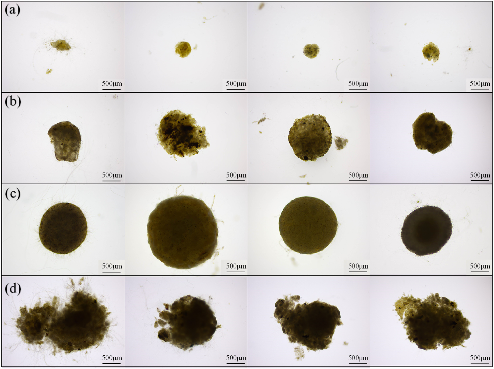
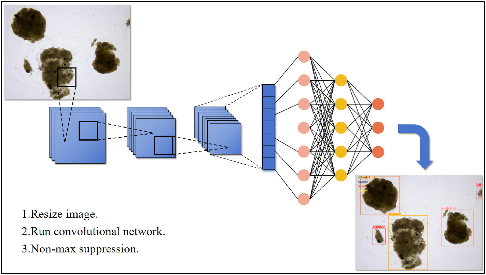
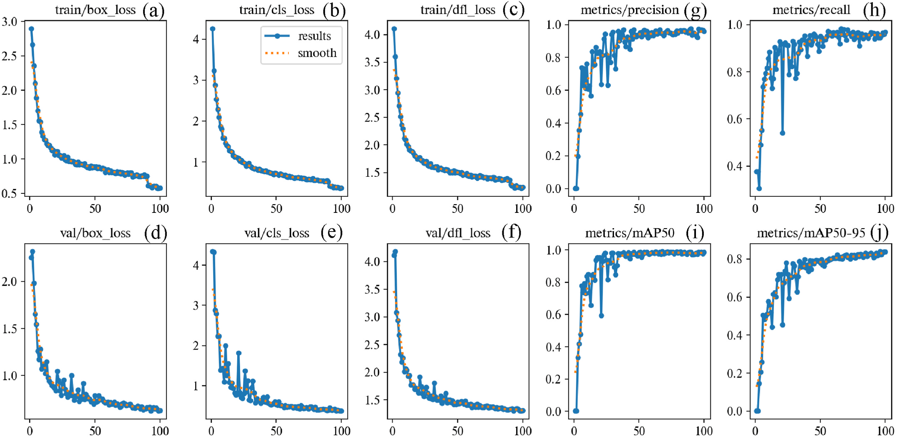
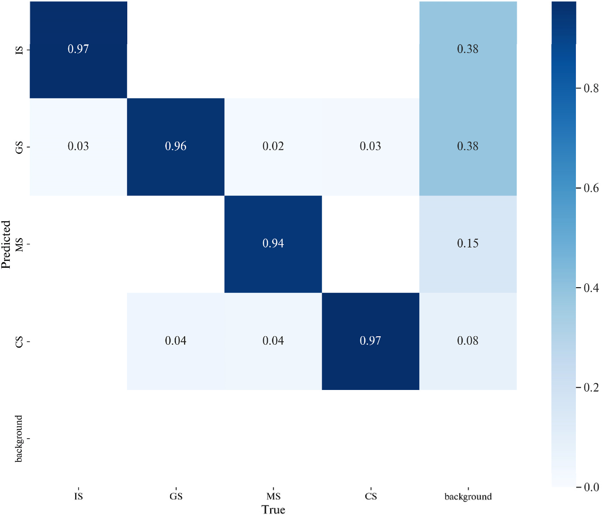
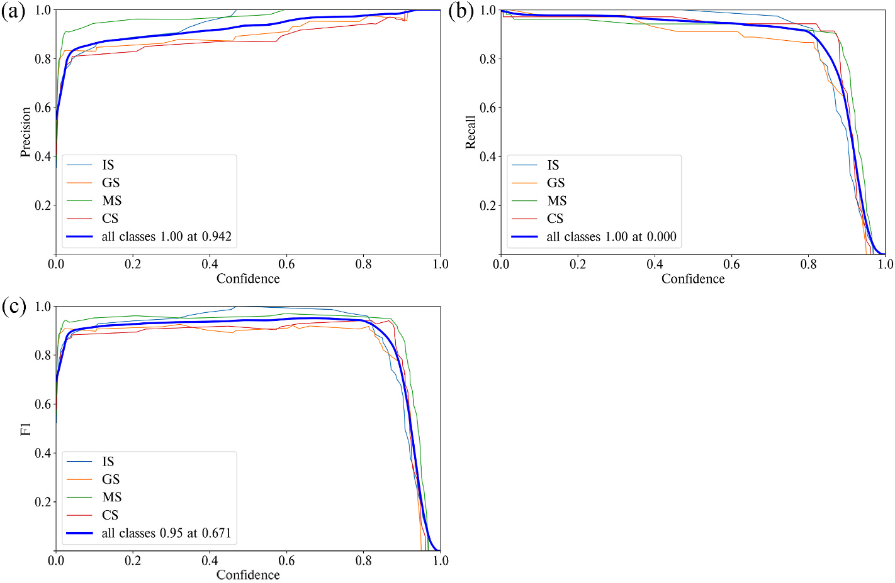
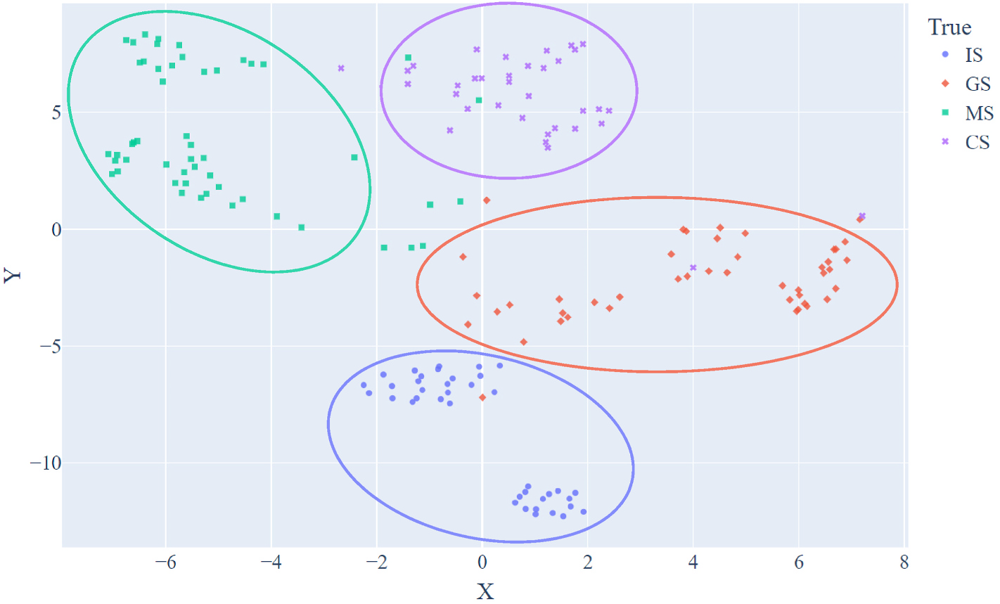
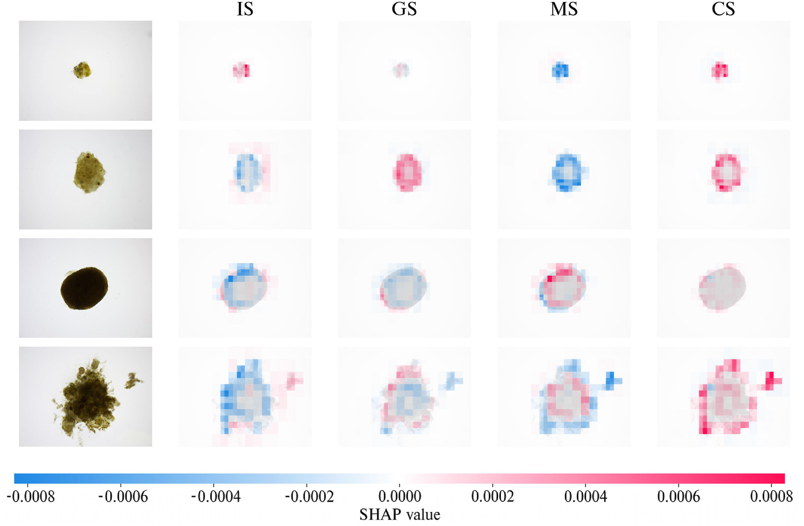
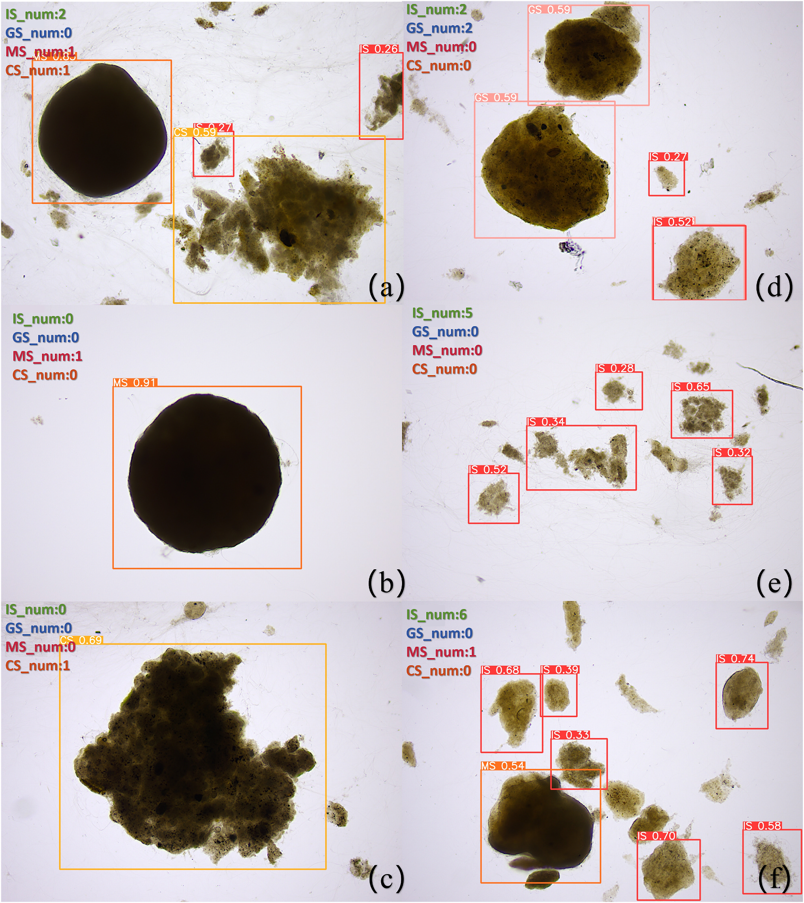
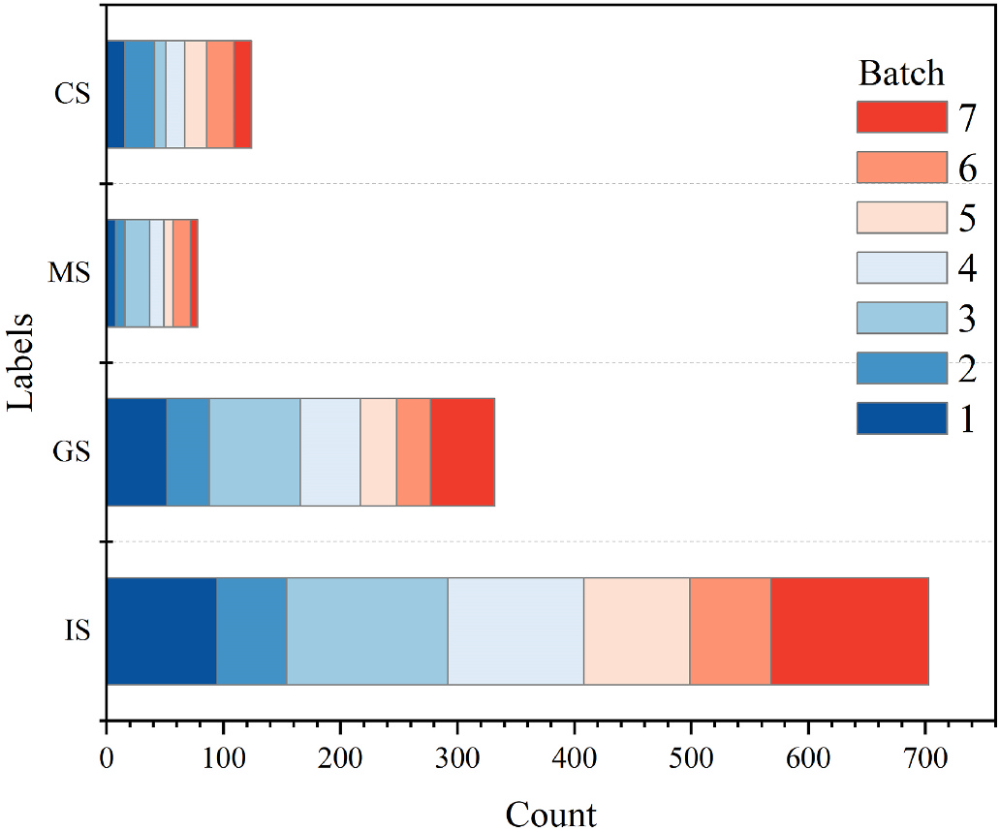

# Recognizing the state of aerobic granular sludge over its life-cycle in a continuous-flow membrane bioreactor with an artificial intelligence approach

## Abstract

- Hệ thống màng sinh học bùn hạt hiếu khí dòng liên tục (AGS-MBR) là công nghệ xử lý nước thải bền vững và hiệu quả cao.
  - Bùn hạt hiếu khí (AGS) có dạng hình cầu hoặc hình elip, hình thành do vi sinh vật tự kết tụ trong điều kiện hiếu khí.
  - Bùn trải qua 4 giai đoạn chu kỳ sống liên tiếp: khởi tạo (initial), sinh trưởng (growth), trưởng thành (mature), và phân cắt (cleaved).
  - Việc nhận dạng và phân loại chính xác các giai đoạn này quyết định sự ổn định của hệ thống vận hành.
  - Các phương pháp giám sát thủ công trước đây tốn nhiều nhân công và dễ xảy ra sai sót chủ quan.
- Nghiên cứu ứng dụng trí tuệ nhân tạo xây dựng mô hình học máy dựa trên thuật toán YOLOv8 để phân loại và giám sát AGS tự động.
  - Tập dữ liệu thực nghiệm gồm 862 ảnh chụp hiển vi được gắn nhãn chính xác.
  - Mô hình đạt độ chính xác trung bình $mAP_{50}$ là $0.985$ tại ngưỡng giao cắt $IoU = 0.5$.
  - Chỉ số $mAP_{50-95}$ đạt $0.837$, xác nhận năng lực phân loại chuẩn xác cao trên tập kiểm tra.
- Phân tích cụm $t\text{-SNE}$ và tính diễn giải SHAP cung cấp bằng chứng định lượng về cơ chế nhận dạng của mô hình.
  - Phương pháp $t\text{-SNE}$ tách biệt rõ ràng các cụm đặc trưng hình thái theo từng giai đoạn sinh trưởng.
  - Phương pháp SHAP chỉ ra mô hình tập trung vào đặc trưng toàn cục của hạt nhỏ và đặc trưng đường viền của hạt lớn.
  - Cơ chế thống kê biến toàn cục hỗ trợ giám sát thời gian thực trạng thái bùn trong quy trình xử lý nước thải liên tục.

## 1 Introduction

- Ưu thế công nghệ của bùn hạt hiếu khí (AGS) kết hợp màng sinh học dòng liên tục (AGS-MBR).
  - Bùn hạt hiếu khí (AGS) có mật độ sinh khối cao và cấu trúc hạt cô đặc, cho phép xử lý đồng thời chất dinh dưỡng và chất hữu cơ trong một bioreactor duy nhất.
  - Quy trình AGS vượt qua bùn hoạt tính truyền thống (CAS) về mặt hiệu quả kinh tế và thể tích công trình.
  - MBR truyền thống kết hợp CAS với lọc màng cho nước sau xử lý chất lượng cao nhưng gặp vấn đề nghiêm trọng về tắc nghẽn màng (membrane fouling) do bông bùn bám dính.
  - Dạng hạt nén chặt của AGS hạn chế đáng kể sự lắng đọng lớp bùn trên bề mặt màng sợi rỗng, giảm hiện tượng tắc nghẽn màng và giảm lượng bùn hoạt tính thải bỏ (WAS).
  - Chuyển đổi phương thức nuôi cấy từ hệ phản ứng gián đoạn theo mẻ (SBR) sang hệ dòng chảy liên tục (continuous-flow) là trọng tâm nghiên cứu ứng dụng thực tế.
- Đặc trưng 4 giai đoạn trong chu kỳ sống của AGS và thách thức từ tính dị thể hình thái.
  - Chu kỳ sống của bùn hạt trong bioreactor trải qua 4 giai đoạn kế tiếp: khởi tạo (initial), sinh trưởng (growth), trưởng thành (mature), và phân cắt (cleaved).
  - Giai đoạn khởi tạo (initial stage): hạt bùn có kích thước rất nhỏ và dạng tiền hạt.
  - Giai đoạn sinh trưởng (growth stage): hạt phát triển nhanh với các đường viền gồ ghề và bề mặt thô ráp.
  - Giai đoạn trưởng thành (mature stage): hạt đạt kích thước ổn định, mật độ hạt cô đặc với bề mặt nhẵn mịn.
  - Giai đoạn phân cắt (cleaved stage): các hạt lão hóa bị rạn nứt cấu trúc, hạt lớn giảm dần và xuất hiện nhiều mảnh vỡ nhỏ.
  - Sự biến động của điều kiện nước thải đầu vào và nhiệt độ dễ làm hạt bùn bị rã thành bông cặn lơ lửng, gây mất ổn định hệ thống MBR.
- Giới hạn của các phương pháp giám sát bùn truyền thống thúc đẩy nhu cầu công nghệ chẩn đoán không xâm lấn.
  - Kỹ thuật lát cắt đông lạnh và đo vi điện cực oxy hòa tan (DO) có tính xâm lấn, phá vỡ vi môi trường bên trong cấu trúc hạt.
  - Kính hiển vi quét đồng tiêu laser (CLSM) đòi hỏi quy trình chuẩn bị mẫu nhuộm phức tạp, tốn thời gian và thiếu tính lặp lại trong môi trường công nghiệp.
  - Nhu cầu thực tế đòi hỏi công cụ chẩn đoán thông minh, không xâm lấn và phân tích trạng thái bùn thời gian thực.
- Ứng dụng trí tuệ nhân tạo và khoảng trống nghiên cứu thị giác máy tính trong nhận dạng hạt bùn.
  - Các nghiên cứu trước đây dùng mạng nơ-ron nhân tạo (ANN) để dự đoán hiệu quả xử lý COD, amoni ($NH_4^+$), tổng nitơ, và tổng phospho từ dữ liệu lịch sử.
  - Chưa có giải pháp AI ứng dụng thị giác máy tính nhận dạng trực tiếp ảnh hiển vi và phân loại chu kỳ sống của hạt AGS trong bioreactor màng.
  - Thuật toán YOLO (You Only Look Once), đặc biệt là kiến trúc YOLOv8, có độ chính xác cao và tốc độ nhận dạng thời gian thực.
- Mục tiêu và lộ trình nghiên cứu của công trình.
  - Xây dựng mô hình YOLOv8 để nhận diện và phân loại tự động 4 giai đoạn vòng đời của hạt AGS trong hệ thống AGS-MBR dòng liên tục.
  - Tối ưu hóa siêu tham số mô hình thông qua việc tinh chỉnh hàm mất mát và phân tích các chỉ số đánh giá trên tập kiểm tra.
  - Áp dụng kỹ thuật giảm chiều $t\text{-SNE}$ để trực quan hóa không gian ngữ nghĩa 2D và kiểm chứng phân cụm hạt bùn.
  - Phân tích cơ chế ra quyết định của mô hình thông qua phương pháp giải thích SHAP.
  - Tích hợp mô-đun đếm và thống kê hạt tự động theo từng giai đoạn hỗ trợ kiểm soát vận hành bioreactor thời gian thực.

## 2 Materials and methods

### 2.1 Description of the used AGS-MBR system

- Mô hình vật lý bioreactor màng với dòng tuần hoàn nội tạo môi trường đa sinh cảnh.
  - Hệ thống sử dụng mô hình MBR tuần hoàn nội (internal circulation MBR) từ nghiên cứu của Dai et al. (2020).
  - Điều kiện thủy lực tuần hoàn nội kết hợp tích lũy sinh khối tạo môi trường phân vùng vi sinh vật đa dạng.
  - Bùn cấy ban đầu thu thập từ bể lắng đợt hai của Nhà máy xử lý nước thải Đảo Sinh học tại quận Hải Châu, Quảng Châu, Trung Quốc.
  - Nồng độ chất rắn lơ lửng hỗn hợp ban đầu ($MLSS$) duy trì ở mức khoảng $3000\text{ mg/L}$.
- Các thông số vận hành thủy lực và cấp khí kiểm soát quá trình tạo hạt bùn.
  - Thời gian lưu nước thủy lực ($HRT$) duy trì trong khoảng $8.0\text{--}10.0\text{ h}$.
  - Tốc độ cấp khí dao động từ $4.8\text{--}7.2\text{ m}^3\text{/h}$ nhằm đảm bảo cung cấp đầy đủ oxy hòa tan ($DO$).
- Thành phần dinh dưỡng và hóa chất của nước thải nhân tạo cấp vào bioreactor.
  - Nguồn cacbon hữu cơ: $CH_3COONa$ nồng độ $769.20\text{ mg/L}$, tương ứng nồng độ $COD = 600\text{ mg/L}$.
  - Nguồn nitơ: $NH_4Cl$ nồng độ $152.67\text{ mg/L}$, tương ứng $NH_4^+\text{-N} = 40\text{ mg/L}$.
  - Nguồn phospho: $KH_2PO_4$ nồng độ $26.36\text{ mg/L}$, tương ứng tổng phospho $TP = 6\text{ mg/L}$.
  - Khoáng vi lượng và chất đệm gồm: $CaCl_2$ ($35.00\text{ mg/L}$), $FeSO_4$ ($0.85\text{--}0.95\text{ mg/L}$), $MgSO_4$ ($20.25\text{ mg/L}$), và $NaHCO_3$ ($267.00\text{ mg/L}$).

### 2.2 Data collection and feature classification

- Quy trình thu thập mẫu bùn hiển vi trong 100 ngày vận hành hệ thống.
  - Mẫu bùn được lấy định kỳ mỗi ngày tại các vị trí và thời điểm cố định trong suốt 100 ngày.
  - Sử dụng kính hiển vi quang học trường sáng Leica DM500 ở độ phóng đại $40\times$.
  - Ảnh hiển vi được chụp bằng máy ảnh kỹ thuật số gắn kèm và cân chỉnh độ sâu trường ảnh để bảo đảm độ sắc nét.
  - Tập dữ liệu tổng hợp gồm 862 ảnh chụp từ nghiên cứu này kết hợp công trình của Dai et al. (2020).
- Hệ thống tiêu chí phân loại 4 giai đoạn chu kỳ sống của bùn hạt hiếu khí.
  - Giai đoạn khởi tạo (IS - initial stage): bùn dạng tiền hạt kích thước bé.
  - Giai đoạn sinh trưởng (GS - growth stage): hạt tăng nhanh kích thước với bề mặt gồ ghề.
  - Giai đoạn trưởng thành (MS - maturity stage): cấu trúc hạt nén đặc và bề mặt nhẵn mịn.
  - Giai đoạn phân cắt (CS - cleavage stage): hạt lão hóa nứt vỡ thành các mảnh nhỏ.
- Mẫu bùn hiển vi được phân loại theo hình thái học và kích thước thành 4 giai đoạn chu kỳ sống.
  - **Hình 1.** Hình thái bùn hạt hiếu khí qua 4 giai đoạn chu kỳ sống
    - 
    - **Hình này chứng minh điều gì**
      - Quá trình biến đổi hình thái từ bông bùn nhỏ, phát triển gờ ráp, tạo hạt cô đặc đến nứt vỡ.
    - **Từ đâu mà thấy được**
      - Bốn khung ảnh hiển vi độ phóng đại $40\times$ thể hiện cấu trúc hạt:
      - (a) Giai đoạn khởi tạo, (b) Giai đoạn sinh trưởng, (c) Giai đoạn trưởng thành, (d) Giai đoạn phân cắt.
- Phương pháp gán nhãn dữ liệu đối tượng và phân chia tập huấn luyện.
  - Sử dụng phần mềm LabelImg v1.8.6 để gán tọa độ khung bao và tâm đối tượng theo định dạng TXT của YOLO.
  - Khi một ảnh hiển vi chứa nhiều hạt bùn, mỗi hạt được khoanh vùng và phân loại độc lập theo từng giai đoạn.
  - Tập dữ liệu được phân chia theo tỷ lệ $80:20$ gồm 690 ảnh huấn luyện và 172 ảnh kiểm tra.
  - Cài đặt hạt giống ngẫu nhiên cố định để bảo đảm tính tái lập của kết quả phân chia dữ liệu.

### 2.3 Machine learning model

- Khung làm việc YOLOv8 xử lý ảnh qua ba bước chuẩn hóa, tích chập và lọc kết quả.
  - **Hình 2.** Khung làm việc nhận dạng mục tiêu bằng thuật toán YOLO
    - 
    - **Hình này chứng minh điều gì**
      - Quy trình xử lý ba bước từ ảnh hiển vi đầu vào đến hộp bao định danh giai đoạn bùn.
    - **Từ đâu mà thấy được**
      - Luồng sơ đồ khối đọc từ trái sang phải:
      - (1) Chuẩn hóa kích thước ảnh về $640 \times 640$, (2) Mạng nơ-ron tích chập trích xuất đặc trưng, (3) Lọc kết quả bằng ngưỡng tin cậy.
- Kiến trúc mạng nơ-ron trích xuất đặc trưng và cơ chế tách rời đầu phát hiện.
  - Xương sống (backbone) dựa trên Darknet-53 kết hợp các khối dư (residual block) và kết nối nhảy (skip connections) để thu nhận đặc trưng đa tỉ lệ.
  - Cổ mạng (neck) tích hợp mạng đường dẫn hai chiều (PANet) giúp truyền thông tin chi tiết từ tầng thấp lên tầng cao.
  - Đầu phát hiện (head) áp dụng cấu trúc decoupled head để tách biệt hoàn toàn nhánh phân loại lớp và nhánh dự đoán vị trí hộp bao.
  - Thuật toán dự đoán trực tiếp tọa độ tâm hạt bùn theo cơ chế không cần khung neo (anchor-free).
  - Tích hợp mô-đun chú ý SimAM (Simple Attention Mechanism) để tính trọng số chú ý 3D mà không làm phát sinh tham số mạng.
- Chiến lược huấn luyện mô hình và tối ưu hóa siêu tham số.
  - Toàn bộ ảnh được chuẩn hóa về độ phân giải $640 \times 640$ pixel trước khi đưa vào mạng.
  - Huấn luyện khởi tạo từ đầu (training from scratch) với 100 epoch và kích thước batch gồm 16 ảnh.
  - Tốc độ học ban đầu thiết lập ở mức $0.01$ và suy giảm dần theo thuật toán lan truyền ngược.
  - Áp dụng chiến lược dừng sớm (early stopping) để ngăn chặn hiện tượng quá khớp (overfitting).
  - Tắt kỹ thuật tăng cường dữ liệu Mosaic trong 10 epoch cuối cùng để nâng cao độ chính xác định vị.
  - Sử dụng thuật toán triệt tiêu phi cực đại mềm (Soft-NMS) để lọc các hộp bao trùng lặp tại giai đoạn dự đoán.
- Nền tảng phần cứng và môi trường tính toán thực nghiệm.
  - Hệ thống GPU đám mây Featurize trang bị card đồ họa NVIDIA RTX 3060 với bộ nhớ 12 GB VRAM.
  - Bộ vi xử lý gồm 6 nhân Intel Xeon E5-2680 v4, bộ nhớ trong 28 GB RAM và dung lượng ổ cứng 50 GB.
  - Môi trường phần mềm xây dựng trên nền Python v3.10.12 và thư viện học sâu PyTorch v2.0.1.

### 2.4 Model evaluation

- Hệ thống chỉ tiêu định lượng đánh giá hiệu năng mô hình trên tập kiểm tra.
  - Ma trận nhầm lẫn (confusion matrix) gồm lưới $5 \times 5$ tính cả lớp nền (background class) để trực quan hóa tương quan giữa giá trị thực tế và giá trị dự đoán.
  - Độ chính xác (Precision) đo lường tỷ lệ các dự đoán mẫu dương tính là chính xác.
  - Độ thu hồi (Recall) phản ánh tỷ lệ phát hiện thành công các mẫu dương tính từ tập dữ liệu thực tế.
  - Điểm $F1\text{-score}$ dao động trong khoảng từ $0$ đến $1$, là trung bình điều hòa dung hòa giữa Precision và Recall.
  - Quy trình đánh giá được hiện thực hóa bằng thư viện scikit-learn trong môi trường Python 3.10.12.
- Hàm mất mát phân loại Cross Entropy Loss (CE Loss) định lượng sai lệch phân phối xác suất.
  - Công thức tính hàm mất mát phân loại đa lớp:
    $$\text{CE Loss} = -\sum_{i=1}^{C} y_i \log(p_i)$$
  - Trong đó $C$ là tổng số lượng phân lớp đối tượng.
  - Ký hiệu $p_i$ là xác suất dự đoán của mô hình cho lớp thứ $i$.
  - Biến nhị phân $y_i = 1$ nếu nhãn thực tế thuộc về lớp $i$, và $y_i = 0$ cho các trường hợp còn lại.
  - Khi xác suất dự đoán tiệm cận $1$, giá trị mất mát tiệm cận $0$; khi xác suất tiệm cận $0$, hàm mất mát tăng vọt.
- Hàm mất mát vị trí Mean Squared Error (MSE) hiệu chỉnh sai lệch tọa độ khung bao.
  - Sai lệch giữa tọa độ tâm $(x, y)$ cùng kích thước $(w, h)$ của khung bao dự đoán và thực tế được tối thiểu hóa qua phương trình:
    $$\text{MSE} = \frac{1}{N}\sum_{i=1}^{N}(y_i - \hat{y}_i)^2$$
  - Trong đó $N$ là tổng số mẫu khung bao cần đánh giá.
  - Đại lượng $y_i$ biểu thị giá trị nhãn thực tế của mẫu thứ $i$.
  - Đại lượng $\hat{y}_i$ biểu thị giá trị tọa độ hoặc kích thước dự đoán tương ứng từ mô hình.

### 2.5 Model interpretability

- Phương pháp giảm chiều $t\text{-SNE}$ trực quan hóa không gian đặc trưng ngữ nghĩa.
  - Kỹ thuật $t\text{-SNE}$ chuyển đổi dữ liệu từ không gian nhiều chiều về không gian 2D mà vẫn bảo toàn cấu trúc lân cận cục bộ.
  - Xác suất tương đồng giữa hai điểm $x_i$ và $x_j$ trong không gian cao chiều được mô hình hóa bằng phân phối Gauss:
    $$p_{j|i} = \frac{\exp(-\|x_i - x_j\|^2 / 2\sigma_i^2)}{\sum_{k \neq i}\exp(-\|x_i - x_k\|^2 / 2\sigma_i^2)}$$
  - Đại lượng $\sigma_i$ là phương sai của $N$ điểm lân cận gần nhất, xác định qua siêu tham số độ phức tạp (perplexity).
  - Tương đồng giữa hai điểm $y_i$ và $y_j$ trong không gian chiếu thấp được chuẩn hóa qua phân phối xác suất:
    $$q_{j|i} = \frac{\exp(-\|y_i - y_j\|^2)}{\sum_{k \neq i}\exp(-\|y_i - y_k\|^2)}$$
  - Hàm mất mát phân kỳ Kullback-Leibler ($KLD$) được tối thiểu hóa bằng thuật toán hạ độ dốc:
    $$C = \sum_{i}\sum_{j} p_{j|i} \log \frac{p_{j|i}}{q_{j|i}}$$
  - Trích xuất đầu ra từ các tầng trung gian của YOLOv8 làm đặc trưng ngữ nghĩa và chiếu giảm chiều bằng thư viện `sklearn.manifold`.
- Phương pháp giải thích đóng góp đặc trưng SHAP dựa trên lý thuyết trò chơi.
  - Phương pháp SHAP (SHapley Additive exPlanations) kết hợp lý thuyết trò chơi với giải thích cục bộ cộng tính để định lượng đóng góp của từng đặc trưng.
  - Hàm dự đoán $f(x)$ được xấp xỉ tuyến tính thông qua biến nhị phân $z$:
    $$f(x) = g(z) = \phi_0 + \sum_{i=1}^{M}\phi_i z_i$$
  - Trong đó $z \in \{0, 1\}^M$, $M$ là số lượng đặc trưng đầu vào, và $\phi_0$ là giá trị cơ sở kỳ vọng.
  - Giá trị Shapley $\phi_i$ của đặc trưng thứ $i$ được tính bằng tổng trọng số đóng góp biên:
    $$\phi_i = \sum_{S \subseteq F \setminus \{i\}} \frac{|S|!(M - |S| - 1)!}{M!} [f_x(S \cup \{i\}) - f_x(S)]$$
  - Ký hiệu $F$ là tập các đặc trưng đầu vào khác không, $S$ là tập con không chứa đặc trưng $i$.
- Quy trình triển khai Deep SHAP trên mạng nơ-ron học sâu.
  - Thuật toán Deep SHAP tính toán đóng góp lan truyền từng tầng từ đầu vào đến đầu ra so với điểm tham chiếu nền (baseline).
  - Cấu hình thực nghiệm thiết lập batch size bằng 50 và số vòng lặp tối ưu hóa là 8000 lần.
  - Sử dụng mặt nạ làm mờ kích thước $64 \times 64\text{ px}$ để che phủ từng vùng cục bộ trên ảnh đầu vào.
  - Bản đồ nhiệt (heatmap) trực quan hóa ảnh hưởng: màu đỏ thể hiện đóng góp dương, màu xanh thể hiện đóng góp âm, cường độ màu càng đậm phản ánh tác động càng lớn.

### 2.6 Prediction and statistics of AGS over its life-cycle

- Kiểm chứng độc lập năng lực tổng quát hóa mô hình trên hệ thống MBR mới.
  - Mô hình đã tối ưu được nạp từ tệp điểm kiểm tra (checkpoint) để thực hiện suy luận trên các ảnh hiển vi mới.
  - Thu thập dữ liệu ảnh từ một hệ thống MBR độc lập khác trong suốt chu kỳ sống của bùn để thẩm định tính tổng quát.
  - Dữ liệu độc lập gồm 7 lô thực nghiệm với hơn 50 ảnh mỗi lô, mang lại tổng cộng 362 điểm dữ liệu hợp lệ.
- Cơ chế lọc trùng lặp và thống kê định lượng phân bố hạt bùn tự động.
  - Thiết lập ngưỡng giao cắt $IoU = 0.7$ để chọn lọc hộp bao tối ưu trong các vùng ứng viên có mức độ chồng lấn cao.
  - Sử dụng biến toàn cục để đếm và lưu trữ số lượng cá thể bùn theo từng phân lớp cho mỗi ảnh đầu vào.
  - Tích lũy số liệu thống kê tự động theo từng mẻ xử lý qua các vòng lặp để theo dõi biến động quần thể hạt.
  - Cung cấp công cụ định lượng hỗ trợ kỹ sư vận hành giám sát trực tiếp trạng thái bùn trong quy trình thực tế.

## 3 Results and discussion

### 3.1 Model training and testing

- Cơ chế theo dõi và tối ưu hóa ba thành phần hàm mất mát trong quá trình huấn luyện.
  - Mất mát hộp bao (box loss) theo dõi mức độ hồi quy của khung phát hiện và sai số định vị so với khung chuẩn.
  - Mất mát phân loại (cls loss) đánh giá độ chính xác gán nhãn các đối tượng bùn hạt theo từng lớp chu kỳ sống.
  - Mất mát học đặc trưng phân phối (dfl loss) kiểm soát tương quan không gian giữa các vùng đặc trưng và phân phối xác suất của tập dữ liệu.
  - Cả ba thành phần mất mát trên tập huấn luyện suy giảm liên tục khi số vòng lặp tăng và hội tụ về một đường tiệm cận duy nhất.
  - Quyết định tắt kỹ thuật tăng cường Mosaic trong 10 epoch cuối giúp các hàm mất mát giảm thêm một bước rõ rệt, chứng minh độ chính xác định vị được cải thiện.
  - Đường cong mất mát trên tập kiểm tra phản ánh mức độ thích ứng ổn định của mô hình và không xuất hiện hiện tượng quá khớp.
- Đường cong huấn luyện và các chỉ số đánh giá hội tụ ổn định sau 100 vòng lặp lặp lại.
  - **Hình 3.** Kết quả các hàm mất mát và chỉ số đánh giá qua 100 vòng lặp huấn luyện
    - 
    - **Hình này chứng minh điều gì**
      - Sự suy giảm của 3 hàm mất mát và sự tăng trưởng vượt bậc của độ chính xác mô hình.
    - **Từ đâu mà thấy được**
      - Mười đồ thị con hiển thị biến thiên qua 100 epoch:
      - (a-c) Box loss, cls loss, dfl loss trên tập huấn luyện giảm sâu;
      - (d-f) Các hàm mất mát trên tập kiểm tra hội tụ mượt mà;
      - (g-j) Precision, recall, $mAP_{50}$ đạt 0.985 và $mAP_{50-95}$ đạt 0.837.
- Hiệu năng định lượng của bộ dò đối tượng qua các chỉ số độ chính xác trung bình.
  - Tỷ lệ giao cắt trên diện tích hợp ($IoU$) đo lường độ chính xác giữa khung dự đoán và khung gán nhãn thực nghiệm.
  - Chỉ số $mAP_{50}$ tính trung bình giá trị AP của toàn bộ các lớp đối tượng tại ngưỡng cố định $IoU = 0.5$.
  - Chỉ số $mAP_{50-95}$ tính trung bình mAP trên dải ngưỡng $IoU$ từ $0.50$ đến $0.95$ với bước nhảy rời rạc $0.05$.
  - Mô hình đạt giá trị $mAP_{50}$ là $0.985$ và $mAP_{50-95}$ đạt $0.837$ trên tập kiểm tra sau 100 vòng lặp.
  - Kết quả $mAP_{50} = 0.985$ vượt qua mức $0.937$ trong nghiên cứu của Kong & Shen (2023) khi áp dụng YOLO nhận dạng vi sinh vật bùn hoạt tính.

### 3.2 Confusion matrix

- Ma trận nhầm lẫn chuẩn hóa định lượng tỷ lệ phân loại chính xác và nhầm lẫn biên giữa các lớp.
  - **Hình 4.** Kết quả chuẩn hóa các lớp đối tượng trong ma trận nhầm lẫn
    - 
    - **Hình này chứng minh điều gì**
      - Đường chéo chính đạt độ chính xác từ 0.94 đến 0.97 cho cả 4 giai đoạn sinh trưởng bùn.
    - **Từ đâu mà thấy được**
      - Lưới ma trận $5 \times 5$ chuẩn hóa theo dòng thực tế:
      - IS đạt 0.97, GS đạt 0.96, MS đạt 0.94, CS đạt 0.97;
      - Ô nhầm lẫn ngoại đường chéo chỉ từ 0.02 đến 0.04 tại ranh giới kích thước hạt.
- Phân tích xác suất nhận dạng chính xác theo từng giai đoạn chu kỳ sống.
  - Lớp khởi tạo (IS) và lớp phân cắt (CS) đạt tỷ lệ phân loại chính xác cao nhất trong tập kiểm tra với giá trị $0.97$.
  - Tỷ lệ nhầm lẫn khoảng $0.03$ giữa IS/CS và GS xảy ra tại các ngưỡng giá trị chuyển tiếp khi kích thước hạt bùn tiệm cận nhau.
  - Lớp sinh trưởng (GS) đạt tỷ lệ nhận dạng đúng $0.96$, với khoảng $0.04$ mẫu bị phân loại nhầm sang CS do bề mặt cả hai nhóm đều có viền thô ráp.
  - Lớp trưởng thành (MS) đạt độ chính xác $0.94$, trong đó $0.02$ mẫu bị gán nhầm sang GS và $0.04$ mẫu bị gán nhầm sang CS do sự tương đồng kích thước hạt trước và sau pha trưởng thành.
- Đánh giá phân bố lỗi dự đoán đối với lớp nền (background).
  - Trong các trường hợp nền bị mô hình nhận diện nhầm thành đối tượng bùn, tỷ lệ phân bố giữa các giai đoạn tương ứng là $0.38$ (IS), $0.38$ (GS), $0.15$ (MS), và $0.08$ (CS).
  - Các hạt có kích thước lớn ở giai đoạn MS và CS chiếm diện tích ảnh hiển vi rộng hơn nên xác suất bị nhầm lẫn từ nền thấp hơn đáng kể.
  - So với môi trường nước tự nhiên trong mô hình YOLOv7 của Liu et al. (2023) vốn chịu nhiễu quang học lớn, quy trình chụp ảnh hiển vi trường sáng chuẩn hóa giúp giảm tối đa nhiễu nền.

### 3.3 Analysis of the model evaluation parameter

- Phân tích tương quan đánh đổi giữa độ chính xác và độ thu hồi xác định ngưỡng vận hành tối ưu.
  - **Hình 5.** Đường cong Precision, Recall và F1-score theo ngưỡng tin cậy
    - 
    - **Hình này chứng minh điều gì**
      - Điểm cân bằng tối ưu đạt F1-score bằng 0.95 tại ngưỡng tin cậy 0.671.
    - **Từ đâu mà thấy được**
      - Ba đồ thị phụ thể hiện biến thiên theo ngưỡng tin cậy:
      - (a) Precision đạt cực đại 1 tại ngưỡng 0.942 cho mọi lớp;
      - (b) Recall của hạt lớn (MS, CS) duy trì cao hơn hạt nhỏ (IS) ở ngưỡng cao;
      - (c) Đỉnh đường cong F1-score đạt cực đại tại hoành độ 0.671.
- Quy luật biến thiên của đường cong Precision theo các dải ngưỡng tin cậy.
  - Khi ngưỡng tin cậy của IS và MS nằm trong khoảng $0.4\text{--}0.6$, độ chính xác tăng nhanh và tiệm cận giá trị $1$.
  - Đối với GS và CS, độ chính xác đạt tiệm cận $1$ ở dải ngưỡng tin cậy cao hơn từ $0.8\text{--}1.0$.
  - Tốc độ tăng trưởng Precision của lớp IS nhanh nhất, phản ánh tỷ lệ phát hiện dương tính giả rất thấp nhờ đặc trưng kích thước tiền hạt tách biệt.
  - Khi thiết lập ngưỡng tin cậy nghiêm ngặt tại $0.942$, tất cả các lớp phân loại đều đồng loạt đạt độ chính xác cực đại bằng $1.0$.
- Phân tích động học đường cong Recall và ảnh hưởng của kích thước hạt bùn.
  - Độ thu hồi tỷ lệ nghịch với ngưỡng tin cậy; khi ngưỡng bằng $0$, Recall trung bình của tất cả các lớp đạt giá trị cao nhất.
  - Ở dải ngưỡng tin cậy cao $0.8\text{--}1.0$, các lớp MS và CS duy trì độ thu hồi cao hơn hẳn so với IS và GS.
  - Hạt bùn ở pha trưởng thành và phân cắt có kích thước lớn và ranh giới sắc nét nên chống chịu tốt trước nhiễu nền và che khuất cục bộ.
  - Độ thu hồi của lớp IS sụt giảm mạnh ở ngưỡng tin cậy cao do các hạt nhỏ dễ bị lẫn vào nền quang học nếu áp dụng tiêu chí chấp nhận quá khắt khe.
- Xác lập ngưỡng tin cậy tối ưu hóa bằng chỉ số F1-score cho ứng dụng thực tế.
  - Ngưỡng tin cậy vận hành tối ưu được xác lập ở mức $0.671$ (tương ứng độ tin cậy $67.1\%$).
  - Giá trị $F1\text{-score}$ trung bình đạt mức đỉnh $0.95$, bảo đảm sự cân bằng hài hòa giữa việc giảm thiểu sai số bỏ sót và sai số nhận nhầm.
  - Ngưỡng $0.671$ được đề xuất làm tham số chuẩn khi nạp ảnh hiển vi mới vào mô hình phục vụ giám sát tự động trong bioreactor.

### 3.4 Cluster analysis

- Phân tích cụm không gian ngữ nghĩa 2D chứng minh tính tách biệt hình thái giữa các giai đoạn.
  - **Hình 6.** Phân tích phân cụm t-SNE cho toàn bộ các lớp đối tượng
    - 
    - **Hình này chứng minh điều gì**
      - 4 giai đoạn sinh trưởng tách thành 4 cụm không gian riêng biệt với độ kết tụ cao.
    - **Từ đâu mà thấy được**
      - Biểu đồ phân tán 2D biểu diễn các điểm đặc trưng ngữ nghĩa:
      - Cụm CS màu đỏ kết tụ chặt chẽ nhất;
      - Cụm GS phân tán rộng và tiếp giáp biên với ba cụm còn lại;
      - Cụm IS và MS tạo các vùng mật độ riêng biệt ít chồng lấn.
- Cơ chế chiếu không gian phi tuyến và tính toàn vẹn của cấu trúc ngữ nghĩa ẩn.
  - Kỹ thuật $t\text{-SNE}$ chuyển đổi không gian đặc trưng đa chiều của mạng sâu về tọa độ hai chiều trực quan.
  - Thuật toán bảo toàn trọn vẹn quan hệ lân cận cục bộ và cấu trúc phân bố xác suất nội tại của tập dữ liệu kiểm tra.
  - Quá trình hạ chiều làm lộ rõ các quy luật phân nhóm tiềm ẩn mà không gian đa chiều ban đầu khó quan sát trực tiếp.
- Đánh giá mức độ kết tụ và tính phân tán không gian của từng phân lớp.
  - Toàn bộ đặc trưng ngữ nghĩa từ tầng ẩn được chiếu xuống hai chiều $t\text{-SNE}$, hình thành bốn cụm độc lập có mức độ liên kết thấp.
  - Cụm phân cắt (CS) thể hiện mức độ kết tụ chặt chẽ nhất, phản ánh tính đồng nhất hình thái cao của các hạt bùn rạn nứt cấu trúc.
  - Cụm sinh trưởng (GS) có mức độ phân tán không gian rộng nhất và tạo các vùng giao thoa biên với cả ba nhóm còn lại.
  - Sự phân tán của GS bắt nguồn từ tính đa dạng hình thái trong quá trình bùn tích lũy sinh khối, thay đổi màu sắc từ sáng sang tối và viền hạt từ ráp sang mịn.
  - Mối liên kết biên của cụm GS lý giải hiện tượng một số mẫu ở các giai đoạn khác bị mô hình nhận diện nhầm thành GS trong ma trận nhầm lẫn.
  - Cụm khởi tạo (IS) và trưởng thành (MS) duy trì ranh giới không gian độc lập, chỉ tiếp giáp nhẹ với các pha sinh trưởng kế cận.
- Ý nghĩa sinh học và kiểm chứng tính hợp lý của bộ tiêu chuẩn phân loại.
  - Mức độ ghép cặp thấp giữa các cụm xác nhận rằng bốn giai đoạn chu kỳ sống của bùn hạt phản ánh các trạng thái sinh học riêng biệt.
  - Động học biến đổi hình thái từ pha khởi tạo đến pha phân hủy diễn ra liên tục nhưng vẫn có ranh giới cấu trúc định lượng rõ ràng.
  - Kết quả phân tích cụm củng cố tính vững chắc của phương pháp chẩn đoán hình thái hạt bùn hiếu khí bằng thị giác máy tính.

### 3.5 SHapley additive exPlanations (SHAP)

- Bản đồ nhiệt SHAP giải thích cơ chế gán trọng số đặc trưng hình thái theo kích thước hạt.
  - **Hình 7.** Phân tích tính diễn giải đặc trưng SHAP cho toàn bộ các lớp
    - 
    - **Hình này chứng minh điều gì**
      - Mô hình chú trọng đặc trưng toàn cục ở hạt nhỏ và đường viền ở hạt lớn.
    - **Từ đâu mà thấy được**
      - Ma trận bản đồ nhiệt Shapley giữa 4 lớp:
      - Màu đỏ thể hiện vùng ảnh hưởng dương, màu xanh thể hiện ảnh hưởng âm;
      - IS và GS chịu chi phối bởi màu sắc toàn thể; MS và CS định hình qua viền ngoài.
- Cơ chế chú ý đối lập giữa đặc trưng toàn cục và đặc trưng đường viền biên.
  - Mô hình ưu tiên thu nhận đặc trưng toàn cục (global features) đối với ảnh hạt nhỏ và đặc trưng đường viền (edge features) đối với ảnh hạt lớn.
  - Các đặc trưng toàn cục của IS và GS như sự chuyển biến màu sắc và viền hạt gồ ghề cung cấp căn cứ phân biệt rõ rệt với pha trưởng thành.
  - Ảnh ở giai đoạn trưởng thành (MS) có màu nâu sẫm hoặc đen với đường biên nhẵn mịn, tạo tác động nghịch đối với xác suất dự đoán IS và GS.
  - Sự tách biệt về trọng số viền biên khẳng định tính đúng đắn khoa học của bộ tiêu chuẩn phân loại hình thái hạt AGS.
- Tương quan sinh học động học giữa giai đoạn phân cắt và chu kỳ khởi tạo mới.
  - Cấu trúc bên trong và các đặc trưng chi tiết của pha phân cắt (CS) tạo ảnh hưởng tương quan trực tiếp đến phân lớp khởi tạo (IS).
  - Các mảnh vỡ sinh khối tách ra từ hạt lão hóa ở giai đoạn CS trở thành mầm tiền hạt cho giai đoạn IS trong chu kỳ kế tiếp.
  - Mô hình học sâu nắm bắt chính xác quy luật sinh thái học tuần hoàn của bùn hạt hiếu khí trong điều kiện dòng chảy liên tục.

### 3.6 Model prediction and statistics

- Ảnh hiển vi mới được nạp vào mô hình để phát hiện và gán nhãn kích thước hạt thực tế.
  - **Hình 8.** Dự đoán đối tượng bùn hạt kích thước lớn và kích thước nhỏ
    - 
    - **Hình này chứng minh điều gì**
      - Hạt lớn (MS, CS) được nhận diện trọn vẹn; hạt nhỏ (IS, GS) chịu ảnh hưởng mật độ cụm.
    - **Từ đâu mà thấy được**
      - 6 khung hình suy luận thực tế:
      - (a-c) Phát hiện chuẩn xác các hạt kích thước lớn có đường biên rõ rệt;
      - (d-f) Phát hiện các cụm hạt nhỏ và hỗn hợp kích thước với khe hở hẹp.
- Quy trình kiểm chứng thực nghiệm bằng tập ảnh theo dõi liên tục trong một tuần.
  - Các mẫu bùn được thu thập hàng ngày từ bể AGS-MBR trong phòng thí nghiệm suốt một tuần vận hành thực tế.
  - Hệ thống chụp ảnh hiển vi được cố định cùng thiết bị và điều kiện chiếu sáng để duy trì tính nhất quán quang học.
  - Ảnh thô chụp từ kính hiển vi được truyền thẳng vào mô hình để kiểm tra năng lực phát hiện trên dữ liệu chưa qua chọn lọc.
- Đặc tính phát hiện và độ trễ tính toán thời gian thực của thuật toán.
  - Hạt bùn kích thước lớn như pha trưởng thành (MS) và phân cắt (CS) có tỷ lệ phát hiện cao và rất hiếm khi bị bỏ sót.
  - Các hạt kích thước bé như pha khởi tạo (IS) và sinh trưởng (GS) dễ bị bỏ sót nếu khoảng cách giữa các hạt quá hẹp hoặc chồng lấp.
  - Khi giữa các hạt duy trì khoảng cách vật lý rõ ràng, độ chính xác định vị và phân loại đạt mức cao nhất.
  - Nền ảnh hiển vi sạch sẽ và tương phản cao giúp tăng độ nhạy nhận dạng mục tiêu.
  - Thời gian tiền xử lý ảnh đạt $2.6\text{--}3.4\text{ ms}$, thời gian suy luận nơ-ron đạt $10.0\text{--}10.4\text{ ms}$, và hậu xử lý thống kê đạt $1.6\text{--}1.8\text{ ms}$.
  - Tổng thời gian xử lý toàn trình mỗi ảnh chỉ mất $14.2\text{--}15.6\text{ ms}$, đáp ứng đầy đủ yêu cầu giám sát tốc độ cao thời gian thực.
- Mô-đun đếm tự động phản ánh số lượng và tỷ lệ thể tích hạt qua 7 lô thực nghiệm.
  - **Hình 9.** Thống kê số lượng hạt bùn theo từng giai đoạn và tổng tích lũy
    - 
    - **Hình này chứng minh điều gì**
      - Giai đoạn IS chiếm số lượng lớn nhất (> 700), trong khi CS chiếm ưu thế thể tích.
    - **Từ đâu mà thấy được**
      - Biểu đồ cột phân bố 4 giai đoạn sinh trưởng qua 7 mẻ đo liên tiếp:
      - Cột màu xanh thể hiện số lượng áp đảo của IS do hạt CS phân rã;
      - Tổng tích lũy 7 mẻ chỉ rõ sự cần thiết phải kiểm soát lực cắt để nuôi dưỡng MS.
- Cơ chế thống kê tích lũy thông qua cấu trúc biến toàn cục.
  - Mô hình tích hợp các biến toàn cục để tự động ghi nhận số lượng từng phân loại xuất hiện trong mỗi khung hình.
  - Thuật toán thống kê gom nhóm dữ liệu theo từng lô đo hàng ngày và tính tổng lũy kế trên toàn bộ 7 lô kiểm chứng.
  - Khả năng xử lý tự động này thay thế hoàn toàn phương pháp đếm hạt thủ công vốn tốn nhiều nhân công và thời gian.
- Phân tích động thái sinh học quần thể hạt bùn trong bể MBR thực nghiệm.
  - Số lượng hạt ở giai đoạn IS cao nhất trong tất cả các lô đo với tổng số tích lũy vượt mốc 700 cá thể, tiếp sau là GS.
  - Số lượng cá thể ở giai đoạn MS và CS ghi nhận mức thấp hơn, phản ánh hệ thống đang trong chu kỳ phân mảnh và tái sinh hạt bùn.
  - Tuy số lượng cá thể IS áp đảo, thể tích chiếm chỗ thực tế của CS lại chiếm ưu thế do kích thước hạt CS lớn hơn nhiều lần.
  - Các hạt CS nứt vỡ giải phóng nhiều mảnh vụn tiền hạt, làm gia tăng nhanh chóng số lượng hạt IS mới.
  - Tỷ lệ hạt trưởng thành (MS) hiện tại còn khiêm tốn, chỉ ra sự cần thiết phải can thiệp kỹ thuật điều khiển sinh học.
  - Khuyến nghị vận hành: người quản lý cần tăng tải trọng hữu cơ và kiểm soát lực cắt thủy lực để kích thích tạo hạt bùn trưởng thành bền vững.
  - Dữ liệu định lượng thời gian thực từ mô hình cung cấp cơ sở tin cậy giúp tối ưu hóa chế độ cấp khí và chu kỳ rửa ngược màng lọc.

## 4 Conclusions

- Tổng kết hiệu năng nhận dạng và phân loại chu kỳ sống bùn hạt của mô hình YOLOv8.
  - Nghiên cứu đã xây dựng thành công giải pháp học máy dựa trên YOLOv8 để nhận diện tự động 4 giai đoạn chu kỳ sống của bùn hạt hiếu khí (AGS).
  - Mô hình đạt độ chính xác trung bình $mAP_{50} = 0.985$ và $mAP_{50-95} = 0.837$, khẳng định độ tin cậy và tính ổn định cao.
  - Phân tích không gian $t\text{-SNE}$ chứng minh sự tách biệt rõ nét của các cụm đặc trưng hình thái qua từng giai đoạn sinh trưởng.
  - Phương pháp diễn giải SHAP làm rõ cơ chế phân loại: tập trung vào đặc trưng toàn cục ở hạt nhỏ và đường viền ở hạt lớn.
- Khả năng giám sát thời gian thực và chức năng thống kê quần thể hạt bùn.
  - Sự kết hợp giữa cơ chế biến toàn cục và mô-đun chú ý SimAM nâng cao tốc độ xử lý với thời gian toàn trình chỉ $14.2\text{--}15.6\text{ ms}$ cho mỗi ảnh.
  - Chức năng đếm hạt tự động theo mẻ phản ánh trực tiếp trạng thái phân bố sinh khối trong bể sinh học MBR dòng liên tục.
- Khuyến nghị ứng dụng thực tiễn và định hướng mở rộng công nghệ.
  - Đối với các hệ thống nuôi cấy gián đoạn theo mẻ (SBR), khuyến nghị tái huấn luyện mô hình trên dữ liệu tương thích và tùy biến cấu trúc mạng.
  - Việc chuyển hóa kết quả chẩn đoán từ AI thành quyết định điều khiển vận hành cần kết hợp linh hoạt với kinh nghiệm thực nghiệm và các biến số công nghệ khác.
  - Nghiên cứu mở ra công cụ hỗ trợ kỹ thuật đáng tin cậy cho công tác quản lý và tối ưu hóa hệ thống xử lý nước thải tiên tiến.

## Data availability

- Tuyên bố tính khả dụng của tập dữ liệu nghiên cứu.
  - Tác giả công bố không sử dụng bộ dữ liệu công khai bổ sung nào ngoài các mẫu thực nghiệm thu thập trực tiếp tại hệ thống MBR.
  - Toàn bộ dữ liệu ảnh hiển vi và nhãn gán đối tượng phục vụ mô hình học máy được tạo lập độc quyền trong nghiên cứu này và công trình trước của nhóm tác giả (Dai et al., 2020).
- Khung tài liệu tham khảo nền tảng về công nghệ sinh học và thị giác máy tính.
  - Các nghiên cứu nền tảng về công nghệ bùn hạt hiếu khí màng (AGS-MBR) và cơ chế giảm nghẽn màng của Campo et al. (2021) cùng Dai et al. (2020).
  - Các công trình học sâu về kiến trúc phát hiện đối tượng thời gian thực YOLOv8, hàm mất mát và cơ chế triệt tiêu phi cực đại Soft-NMS.
  - Các phương pháp giải thích mô hình toán học bao gồm phân tích giảm chiều không gian $t\text{-SNE}$ và lý thuyết trò chơi SHAP.
