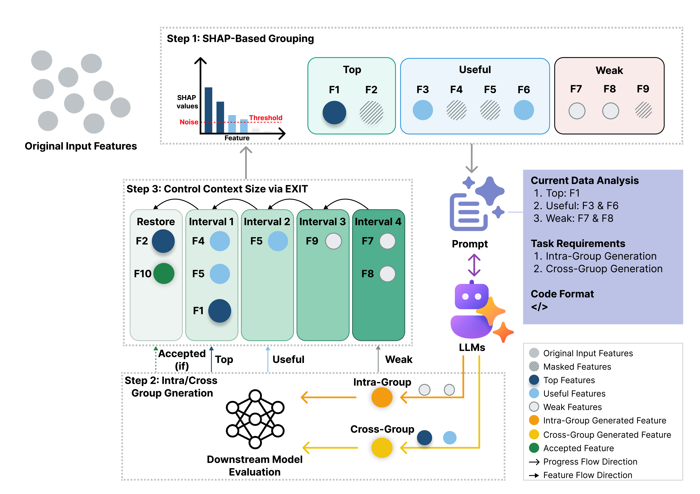
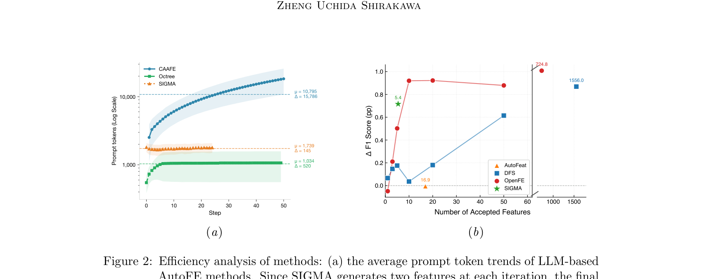
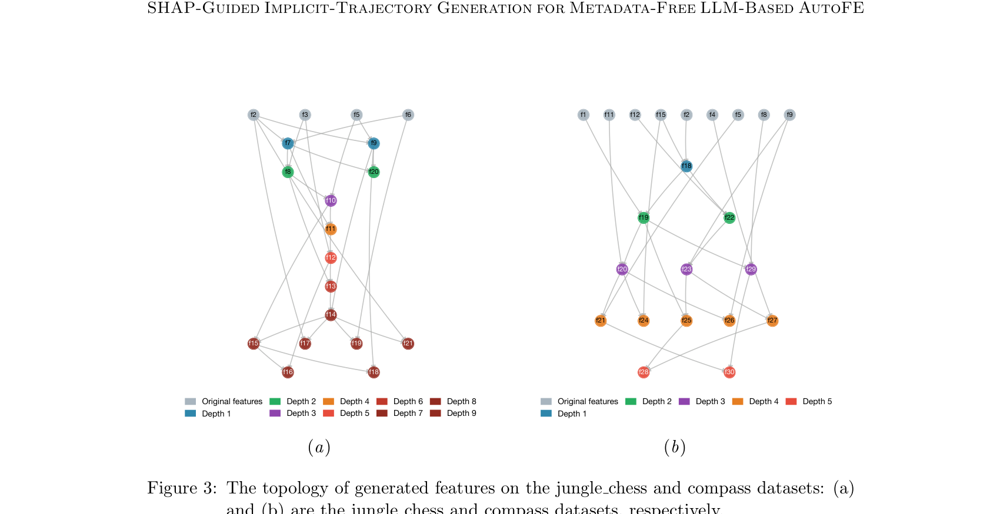
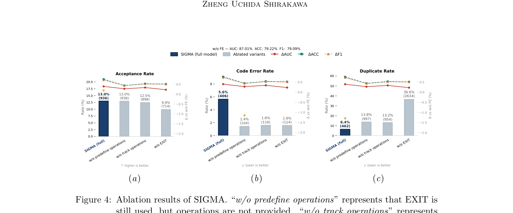

# SIGMA: SHAP-Guided Implicit-Trajectory Generation for Metadata-Free LLM-Based AutoFE

## Abstract

* **Ứng dụng của Large Language Models (LLMs) trong Automated Feature Engineering (AutoFE - Kỹ thuật tạo đặc trưng tự động)**:
  * Các nghiên cứu gần đây khai thác LLM để nâng cao hiệu quả của AutoFE thông qua việc sử dụng mô tả ngữ nghĩa (semantic descriptions) và kỹ thuật nhắc dựa trên quỹ đạo (trajectory-based prompting).
* **Hai thách thức cốt lõi hạn chế khả năng ứng dụng và mở rộng quy mô trong tối ưu hóa dài hạn (long-horizon optimization)**:
  * *Thiếu siêu dữ liệu ngữ nghĩa*: Siêu dữ liệu ngữ nghĩa (semantic metadata) không có sẵn trong nhiều bối cảnh thực tế.
  * *Hạn chế của việc tích lũy quỹ đạo và cửa sổ ngữ cảnh (context window)*: Tích lũy quỹ đạo làm tăng nguy cơ vượt quá giới hạn cửa sổ ngữ cảnh; ngược lại, nếu thiếu thông tin quỹ đạo, quá trình sinh đặc trưng trở nên bất ổn định, dễ rơi vào cực trị địa phương (local optima) và gây ra tỷ lệ trùng lặp đặc trưng sinh ra cao (high duplicate rate).
* **Khung tối ưu hóa SIGMA (SHAP-enhanced Implicit-trajectory Generation for Metadata-free AutoFE)**:
  * Đề xuất khung tối ưu hóa với ngữ cảnh không đổi (scalable constant-context optimization framework) giải quyết đồng thời hai thách thức trên mà không cần siêu dữ liệu.
  * *Tín hiệu nhận biết tác vụ bằng giá trị SHAP (SHAP values)*: SIGMA khai thác các giá trị SHAP để cung cấp tín hiệu nhận biết tác vụ (task-aware signals), định hướng quá trình sinh đặc trưng theo nhóm (group feature generation) thay cho thông tin ngữ nghĩa.
  * *Cơ chế quỹ đạo ngầm định qua đặc trưng bộc lộ EXIT (EXposed-feature Implicit Trajectory)*: Sử dụng các đặc trưng được phơi bày trực tiếp trong prompt (exposed features) để đại diện ngầm định cho quỹ đạo mà không cần lưu trữ toàn bộ lịch sử các bước trước.
* **Kết quả thực nghiệm**:
  * *Hiệu năng và độ dài ngữ cảnh*: SIGMA đạt hiệu năng tương đương với các mô hình cơ sở LLM tiên tiến nhất (SOTA - state-of-the-art) trong khi duy trì độ dài prompt gần như không đổi.
  * *Khả năng kiểm soát trùng lặp*: Cơ chế EXIT giảm đáng kể tỷ lệ trùng lặp của các đặc trưng được tạo ra từ $37.2\%$ xuống còn $6.8\%$.
  * *Hiệu quả sử dụng đặc trưng*: Đạt hiệu năng ngang ngửa SOTA truyền thống chỉ với trung bình $5.4$ đặc trưng, thể hiện mức tăng đáng kể về hiệu quả khai thác và sử dụng đặc trưng.
* **Keywords (Từ khóa)**: Automated Feature Engineering, LLM, Tabular Machine Learning, AutoML.

## 1. Introduction

- **Tự động hóa Kỹ thuật Đặc trưng (Automated Feature Engineering - AutoFE)** (Hutter et al., 2019) là thành phần then chốt trong Học máy Tự động (AutoML) (Ravishankar and Battineni, 2025):
  - Mục tiêu hàng đầu của AutoFE là tạo ra các đặc trưng mới nhằm nâng cao năng lực biểu diễn (representational power) của tập đặc trưng ban đầu, qua đó cải thiện hiệu suất và độ vững chắc (robustness) của AutoML.
  - AutoFE được ứng dụng rộng rãi trong nhiều lĩnh vực thực tế như tài chính và y tế (Hollmann et al., 2023; Lucas et al., 2020; Waring et al., 2020).

- **Hạn chế của các phương pháp AutoFE truyền thống**:
  - Chủ yếu tiếp cận theo khung mở rộng-thu giảm (expansion-reduction framework), khám phá không gian tổ hợp rộng lớn của các phép biến đổi đặc trưng được định nghĩa trước (predefined feature transformations) (Zhang et al., 2023; Hollmann et al., 2023).
  - Mặc dù mang lại hiệu năng cao khi có đủ ngân sách tìm kiếm, không gian tìm kiếm thủ công rất phức tạp để thiết kế và giới hạn phạm vi khám phá, dễ dẫn đến kết quả dưới mức tối ưu (sub-optimal) (Abhyankar et al., 2025).
  - Rất khó để diễn giải số lượng lớn các đặc trưng được sinh ra từ các phương pháp này.

- **Tiềm năng và rào cản của AutoFE dựa trên Mô hình Ngôn ngữ Lớn (LLMs)**:
  - Năng lực suy luận mạnh mẽ (Wei et al., 2022) và khả năng học trong ngữ cảnh (In-Context Learning - ICL) (Dong et al., 2024) của LLMs (Chang et al., 2024) mở ra hướng nghiên cứu tận dụng LLMs để nâng cao AutoFE thông qua tối ưu hóa tuần tự (sequential optimization).
  - Bằng việc cung cấp mô tả ngữ nghĩa (về đặc trưng và tác vụ) cùng thông tin thống kê (Fathollahzadeh et al., 2025), LLMs có thể sinh các đặc trưng có khả năng giải thích tốt dựa trên tri thức miền (domain knowledge) (Li et al., 2026; Han et al., 2024), đầy triển vọng cho Tác nhân Khoa học Dữ liệu (Data Science Agent - DS Agent) (Guo et al., 2024; Chen et al., 2025).
  - *Rào cản thiếu siêu dữ liệu (Metadata-free challenge)*: Giả định luôn có sẵn thông tin ngữ nghĩa làm giới hạn tính ứng dụng thực tế (Nam et al., 2024), đặc biệt trong các bộ dữ liệu y tế bảo vệ quyền riêng tư (privacy-preserving medical datasets) hoặc nhật ký cảm biến (sensor logs) nơi thông tin ngữ nghĩa không có sẵn hoặc không đáng tin cậy.
  - *Bùng nổ ngữ cảnh và thiên kiến trong quỹ đạo tối ưu (Context explosion & Trajectory bias)*: Sự mở rộng liên tục của quỹ đạo tối ưu hóa dùng cho ICL làm tăng nguy cơ vượt quá giới hạn độ dài ngữ cảnh (context length constraints) và gây thiên kiến vào các cặp đặc trưng-phép toán thành công trước đó; ngược lại, nếu loại bỏ hoàn toàn thông tin quỹ đạo, LLMs lại có xu hướng sinh ra các đặc trưng trùng lặp (duplicate generation).

- **Khung tối ưu hóa SIGMA (SHAP-enhanced Implicit-trajectory Generation for Metadata-free AutoFE)**:
  - SIGMA là khung tối ưu hóa ngữ cảnh cố định, có khả năng mở rộng (scalable constant-context optimization framework) dành cho AutoFE dựa trên LLM không cần siêu dữ liệu (metadata-free).
  - **Hình 1.** Tổng quan kiến trúc hệ thống SIGMA
    - 
    - **Hình này chứng minh điều gì**
      - Kiến trúc tích hợp SHAP-based feature grouping và chiến lược tối ưu implicit trajectory EXIT để duy trì context cố định
    - **Từ đâu mà thấy được**
      - Sơ đồ quy trình từ dữ liệu bảng ban đầu -> tính SHAP -> phân nhóm đặc trưng -> sinh đặc trưng nội/liên nhóm -> EXIT filter -> mô hình XGBoost
  - Tận dụng giá trị SHAP (SHapley Additive exPlanations) (Ponce-Bobadilla et al., 2024) để cung cấp tín hiệu nhận biết tác vụ (task-aware signals) phục vụ việc sinh đặc trưng theo nhóm mà không cần mô tả ngữ nghĩa.
  - Các đặc trưng đầu vào được phân thành 3 nhóm dựa trên giá trị SHAP: nhóm hàng đầu (top), nhóm hữu ích (useful), và nhóm yếu (weak), phục vụ sinh đặc trưng nội nhóm (intra-group) và liên nhóm (cross-group).
  - Giới thiệu cơ chế Quỹ đạo Ngầm ẩn Đặc trưng Lộ diện (EXposed-feature Implicit Trajectory - EXIT): khai thác thiên kiến ngữ cảnh mạnh của LLM đối với thông tin đầu vào và tính hiệu quả của các nhiễu loạn prompt nhỏ (minor prompt perturbations) để tăng cường tính đa dạng sinh đặc trưng.
  - EXIT sử dụng tập đặc trưng nhìn thấy được (visible feature set) làm đại diện (proxy) cho lịch sử tối ưu hóa, phản ánh quỹ đạo một cách ngầm ẩn thông qua thành phần đặc trưng thay vì liệt kê tường minh bằng token trong prompt, giúp loại bỏ chi phí mở rộng quỹ đạo.

- **Ba đóng góp chính của bài báo**:
  1. Đề xuất SIGMA: Khung AutoFE dựa trên LLM không cần siêu dữ liệu, thay thế mô tả ngữ nghĩa bằng tín hiệu tầm quan trọng SHAP và đưa ra chiến lược sinh theo nhóm để khám phá đặc trưng có cấu trúc.
  2. Đề xuất EXIT: Cho phép tối ưu hóa chân trời dài (long-horizon optimization) hiệu quả mà không cần đưa quỹ đạo tường minh vào prompt, giảm tỷ lệ sinh đặc trưng trùng lặp từ 37.2% xuống 6.8%.
  3. Đánh giá thực nghiệm toàn diện: SIGMA đạt hiệu năng tương đương với các phương pháp cơ sở dựa trên LLM hiện tại, đồng thời duy trì khả năng cạnh tranh với AutoFE truyền thống nhờ hiệu suất sử dụng đặc trưng cao (efficient feature utilization).

## 2. Related Work

### Traditional AutoFE Methods

- Các phương pháp kỹ nghệ đặc trưng tự động truyền thống (Traditional AutoFE - Automated Feature Engineering) chủ yếu vận hành dựa trên khung làm việc mở rộng - thu gọn (expansion-reduction framework).
  - Quy trình cốt lõi gồm hai giai đoạn: sinh ra không gian các đặc trưng ứng viên (candidate feature generation) và tiến hành chọn lọc đặc trưng (feature selection) để giữ lại tập đặc trưng tối ưu nhất.
- Deep Feature Synthesis (DFS) (Kanter và Veeramachaneni, 2015) khai thác các đường dẫn quan hệ (relational paths) và các phép toán nguyên thủy toán học (mathematical primitives) nhằm tự động tạo các đặc trưng liên bảng (cross-table features):
  - Sau giai đoạn mở rộng đặc trưng liên bảng, DFS thực hiện chọn lọc những đặc trưng đạt hiệu năng dự báo tốt nhất.
  - Ưu điểm: Tự động hóa quá trình trích xuất đặc trưng có cấu trúc quan hệ phức tạp giữa nhiều bảng mà không cần thiết kế thủ công.
  - Hạn chế: Dễ dẫn đến bùng nổ số lượng đặc trưng khi cơ sở dữ liệu có nhiều quan hệ lồng nhau; phụ thuộc vào lược đồ quan hệ định sẵn.
- ExploreKit (Katz và cộng sự, 2016) đề xuất khung làm việc sinh các đặc trưng ứng viên bằng cách kết hợp tất cả các đặc trưng gốc (combining all original features):
  - Tiến hành đánh giá và chọn lọc đặc trưng thông qua một bộ phân loại xếp hạng (ranking classifier).
  - Ưu điểm: Khám phá có hệ thống không gian tương tác giữa các đặc trưng ban đầu bằng mô hình học máy để xếp hạng.
  - Hạn chế: Chi phí tính toán và bộ nhớ tăng nhanh theo hàm số mũ khi số lượng đặc trưng gốc tăng lên.
- AutoFeat (Horn và cộng sự, 2019) tích hợp các phép biến đổi đặc trưng phi tuyến tính (non-linear feature transformations) và sử dụng mô hình tuyến tính có chuẩn hóa $L_1$ ($L_1$-regularized linear model) để chọn lọc đặc trưng:
  - Nâng cao hiệu quả năng lực dự báo của các mô hình tuyến tính trong khi vẫn bảo toàn tính diễn giải (interpretability).
  - Ưu điểm: Cung cấp các đặc trưng phi tuyến toán học rõ ràng, giữ trọn tính minh bạch và khả năng giải thích của mô hình tuyến tính.
  - Hạn chế: Phạm vi biến đổi bị giới hạn trong các hàm phi tuyến tiền định; chưa nắm bắt toàn diện các tương tác phi tuyến bậc cao phức tạp giữa nhiều thuộc tính.
- Tính toán tiến hóa (Evolutionary Computation) (Bäck và Schwefel, 1996) và lập trình di truyền (Genetic Programming) (Espejo và cộng sự, 2009) được ứng dụng rộng rãi trong AutoFE truyền thống:
  - TPOT (Olson và Moore, 2016) ứng dụng lập trình di truyền để phối hợp các bộ chọn đặc trưng (feature selectors), bộ biến đổi (transformers) và bộ phân loại (classifiers):
    - Mục tiêu tối ưu hóa là cực đại hóa độ chính xác dự báo (predictive accuracy) của toàn bộ pipeline học máy.
    - Ưu điểm: Tự động tìm kiếm cấu trúc pipeline trích xuất đặc trưng và mô hình hóa tối ưu mà không cần giả định trước.
    - Hạn chế: Không gian tìm kiếm rộng lớn dẫn đến chi phí tính toán cực kỳ tốn kém và thời gian chạy lâu.
- AutoGluon (Erickson và cộng sự, 2020) xử lý các tương tác đặc trưng theo cách tiềm ẩn (implicitly):
  - Kiến trúc tích hợp cơ chế suy luận kiểu dữ liệu thông minh theo phân cấp (hierarchical intelligent type inference) cùng cấu trúc xếp chồng mô hình đa tầng (multi-stage model stacking architecture).
  - Ưu điểm: Hiệu năng thực nghiệm mạnh mẽ, tự động hóa toàn diện quy trình xử lý dữ liệu bảng mà không đòi hỏi tạo đặc trưng tường minh phức tạp.
  - Hạn chế: Thiếu các đặc trưng tương tác tường minh dẫn đến giảm tính minh bạch và khó khăn trong việc phân tích căn nguyên dữ liệu.
- OpenFE (Zhang và cộng sự, 2023) đề xuất chiến lược cắt tỉa hai giai đoạn (two-stage pruning strategy):
  - Nhận diện và sàng lọc hiệu quả các đặc trưng ứng viên chất lượng cao (high-quality candidate features) từ không gian ứng viên khổng lồ.
  - Ưu điểm: Tối ưu hóa đáng kể tốc độ và khả năng mở rộng (scalability) so với các giải pháp mở rộng - thu gọn truyền thống.
  - Hạn chế: Vẫn dựa trên các toán tử biến đổi được định nghĩa trước, không tận dụng được tri thức ngữ nghĩa của miền ứng dụng.

### LLM-based AutoFE Methods

- Các mô hình ngôn ngữ lớn (LLMs) xây dựng trên kiến trúc Transformer (Vaswani và cộng sự, 2017) sở hữu năng lực học theo ngữ cảnh (In-Context Learning - ICL) và khả năng suy luận mạnh mẽ (Guo và cộng sự, 2025), phù hợp với việc ứng dụng tri thức miền (domain knowledge).
- CAAFE (Hollmann và cộng sự, 2023) là phương pháp đầu tiên đề xuất tận dụng tri thức ngữ nghĩa tiên nghiệm (prior semantic knowledge) của LLM:
  - Tạo ra các đặc trưng có khả năng diễn giải (interpretable features) dựa trên các mô tả bằng văn bản (textual descriptions) của bảng dữ liệu và thuộc tính.
  - Ưu điểm: Tận dụng hiểu biết ngữ nghĩa sâu rộng của LLM để sinh ra các đặc trưng có ý nghĩa thực tế cao và kèm giải thích rõ ràng.
  - Hạn chế: Phụ thuộc tuyệt đối vào sự tồn tại của mô tả văn bản (metadata); mất hiệu lực khi dữ liệu bị ẩn danh hoặc thiếu thông tin ngữ cảnh.
- FeatLLM (Han và cộng sự, 2024) khai thác LLM để sinh các quy tắc (rules) chuyển đổi đặc trưng thành các chuỗi nhị phân (binary sequences):
  - Quá trình chuyển đổi dựa trên mô tả đặc trưng và các mẫu dữ liệu thực tế (feature descriptions and samples), giúp tăng cường hiệu quả học trên dữ liệu bảng trong kịch bản ít mẫu (few-shot tabular learning).
  - Ưu điểm: Thúc đẩy độ chính xác phân loại trong các bài toán dữ liệu bảng ít mẫu nhờ biểu diễn nhị phân dựa trên quy tắc ngữ nghĩa.
  - Hạn chế: Vẫn phụ thuộc vào mô tả đặc trưng; việc nhị phân hóa có thể làm thất thoát các sắc thái thông tin liên tục.
- Tích hợp LLM với các thuật toán tối ưu hóa:
  - LLM-FE (Abhyankar và cộng sự, 2025) kết hợp kỹ nghệ đặc trưng dựa trên LLM với tính toán tiến hóa (evolutionary computation):
    - LLM đóng vai trò hỗ trợ sinh và biến đổi đặc trưng trong quá trình tìm kiếm tiến hóa.
    - Ưu điểm: Kết hợp sự linh hoạt về mặt ngữ nghĩa của LLM với khả năng tìm kiếm tối ưu toàn cục của giải thuật tiến hóa.
    - Hạn chế: Tiêu tốn chi phí gọi mô hình lớn qua các thế hệ tiến hóa lặp đi lặp lại.
- Thách thức thực tế và giải pháp biểu diễn cây (Tree Expression):
  - Trong các bài toán thực tế, mô tả đặc trưng và thông tin tác vụ thường khó thu thập do các rào cản bảo mật và quyền riêng tư (privacy and security issues), đồng thời việc mở rộng đặc trưng làm gia tăng đột biến độ dài prompt (prompt length).
  - OCTree (Nam và cộng sự, 2024) đề xuất chỉ sử dụng biểu thức cây của các đặc trưng (tree expression of features) để sinh ra các đặc trưng mới, không cần dựa vào mô tả ngữ nghĩa.
  - Ưu điểm: Khắc phục sự phụ thuộc vào văn bản mô tả nhạy cảm và giảm thiểu độ dài ngữ cảnh đưa vào prompt.
  - Hạn chế: Bỏ qua lợi thế tri thức ngữ nghĩa của LLM, chỉ khai thác cú pháp cây biểu thức toán học/logic.
- Các quan ngại và định hướng khắc phục trong LLM-based AutoFE:
  - Khả năng ghi nhớ dữ liệu của LLM (LLMs' memory of datasets) (Zhang và cộng sự, 2024): Đặt ra lo ngại về tính khái quát thực sự khi LLM có thể đã nhìn thấy các bộ dữ liệu tiêu chuẩn trong quá trình tiền huấn luyện.
  - Thiên kiến ưu tiên các phép toán đơn giản (preference for generating simple operations) (Küken và cộng sự, 2024): LLM có xu hướng ưa chuộng tạo ra các phép toán cơ bản thay vì các phép biến đổi phức tạp cần thiết.
  - Li và cộng sự (2026) đề xuất giải pháp phân tách quy trình đề xuất phép toán biến đổi (transformation operation proposal) khỏi quy trình chọn lọc đặc trưng (selection processes) nhằm nâng cao độ tin cậy và hiệu năng.

## 3. Methodology

- SIGMA bao gồm ba bước xử lý chính:
  - (1) Phân nhóm đặc trưng dựa trên SHAP (SHAP-based Feature Grouping).
  - (2) Sinh đặc trưng nội nhóm và liên nhóm (Intra-Group and Cross-Group Generation).
  - (3) Áp dụng EXIT để kiểm soát kích thước ngữ cảnh (Applying EXIT to control context size).
- Quy trình tổng thể của SIGMA được hình thức hóa chi tiết trong Algorithm 1.

### Algorithm 1: SIGMA Workflow

- **Yêu cầu đầu vào (Require)**:
  - Các tập phân chia dữ liệu: $(\mathcal{D}_{tr}, \mathcal{D}_{va}, \mathcal{D}_{te})$ tương ứng với tập huấn luyện (training split), tập kiểm định (validation split) và tập kiểm thử (test split).
  - Mô hình ngôn ngữ lớn (Large Language Model - LLM): $\mathcal{L}$.
  - Bộ phân loại hạ nguồn (downstream classifier): $\mathcal{C}$.
  - Số bước tối đa (max steps): $T$.
  - Mức độ nhiễu (noise level): $\eta$.
  - Ngưỡng kiên nhẫn (patience): $P$.
- **Khởi tạo trạng thái ban đầu**:
  - Trích xuất ma trận đặc trưng từ các tập dữ liệu: $(X_{tr}, X_{va}, X_{te}) \leftarrow \text{Extract}(D_{tr}, D_{va}, D_{te})$.
  - Đánh giá hiệu năng ban đầu của bộ phân loại: $s^* \leftarrow \text{Eval}(\mathcal{C}, X_{tr}, X_{va})$.
  - Khởi tạo tập hợp các mặt nạ che đặc trưng (mask set): $B \leftarrow \emptyset$.
  - Khởi tạo tập hợp các thao tác bị cấm (failed operations history): $H_{op} \leftarrow \emptyset$.
  - Khởi tạo bộ đếm số bước thất bại liên tiếp: $k_{fail} \leftarrow 0$.
- **Vòng lặp tối ưu hóa đặc trưng** ($\text{for } t \leftarrow 1 \text{ to } T \text{ do}$):
  - Phân nhóm đặc trưng bằng SHAP với mức nhiễu $\eta$:
    $$(G_{top}, G_{use}, G_{weak}) \leftarrow \text{SHAP-based feature grouping}(\mathcal{C}, X_{tr}, \eta)$$
  - Kiểm tra điều kiện giải phóng mặt nạ theo ngưỡng kiên nhẫn:
    - Nếu $k_{fail} \ge P$: giải phóng toàn bộ mặt nạ che và thiết lập lại bộ đếm thất bại:
      $$B \leftarrow \emptyset, \quad k_{fail} \leftarrow 0$$
    - Ngược lại ($k_{fail} < P$): loại bỏ các mặt nạ đã hết hạn khỏi tập $B$ (`Remove expired masks from B`).
  - Lọc không gian đặc trưng khả dụng: loại bỏ toàn bộ các đặc trưng đang bị che trong $B$ khỏi ba nhóm $(G_{top}, G_{use}, G_{weak})$.
  - Xây dựng prompt cho LLM:
    $$P_t \leftarrow \text{BuildPrompt}(G, H_{op}, s^*)$$
    trong đó $G = \{G_{top}, G_{use}, G_{weak}\}$.
  - Sinh ứng viên đặc trưng nội nhóm và liên nhóm:
    $$\Phi_t \leftarrow \text{Intra/cross-group generations with } \mathcal{L}(P_t), (X_{tr}, X_{va}, X_{te})$$
  - Đánh giá các ứng viên đặc trưng ($\phi \in \Phi_t$):
    - Khởi tạo tập ứng viên đạt hiệu quả cải thiện: $A \leftarrow \emptyset$.
    - Đo lường hiệu năng của từng ứng viên trên tập kiểm định:
      $$s_\phi \leftarrow \text{Eval}\left(\mathcal{C}, \text{Concat}[X_{tr}, \phi(X_{tr})], \text{Concat}[X_{va}, \phi(X_{va})]\right)$$
    - Cập nhật ứng viên cải thiện vào tập $A$: nếu $s_\phi > s^*$, gán $A \leftarrow A \cup \{(\phi, s_\phi)\}$.
  - Cập nhật không gian đặc trưng và lịch sử thao tác:
    - Trường hợp có ứng viên thành công ($A \ne \emptyset$):
      - Lựa chọn biến đổi đặc trưng tối ưu: $(\phi^*, s^*) \leftarrow \arg\max_{(\phi, s_\phi) \in A} s_\phi$.
      - Nối đặc trưng mới được chấp nhận vào dữ liệu: $X \leftarrow \text{Concat}[X, \phi^*(X)]$ với mọi $X \in \{X_{tr}, X_{va}, X_{te}\}$.
      - Áp dụng mặt nạ che lên các đặc trưng nguồn đã dùng và đặt lại bộ đếm thất bại:
        $$B \leftarrow B \cup \text{Mask}(\text{ExtractSourceFeatures}(\phi^*)), \quad k_{fail} \leftarrow 0$$
    - Trường hợp không có ứng viên thành công ($A = \emptyset$):
      - Bổ sung các thao tác thất bại vào tập cấm: $H_{op} \leftarrow H_{op} \cup \text{ExtractOperations}(\Phi_t)$.
      - Tăng bộ đếm thất bại liên tiếp: $k_{fail} \leftarrow k_{fail} + 1$.
- **Kết quả đầu ra**:
  - Trả về tập các đặc trưng đã được tăng cường: $(X_{tr}, X_{va}, X_{te})$.

### 3.1. Feature Groups

- Các đặc trưng ban đầu được chia thành các nhóm dựa trên giá trị SHAP (SHAP values) tương ứng của chúng:
  - Thay vì áp dụng tỷ lệ chia cố định (ví dụ $33\%$ số đặc trưng cho mỗi nhóm), phương pháp đưa vào một ngưỡng động (threshold) thông qua việc bổ sung một đặc trưng nhiễu (noise feature).
  - Một cột nhiễu Gaussian (Gaussian noise column) được thêm vào tập đặc trưng ban đầu trước khi tính toán giá trị SHAP cho toàn bộ các đặc trưng cùng cột nhiễu.
  - Chuẩn hóa min-max (min-max normalization) được áp dụng tại giai đoạn này để đưa các đặc trưng về cùng thang đo, giúp chúng có thể so sánh trực tiếp với đặc trưng nhiễu.
- Giá trị SHAP của cột nhiễu đóng vai trò là ngưỡng phân chia đặc trưng thành ba nhóm riêng biệt:
  - **Nhóm top ($G_{top}$)**:
    - Bao gồm các đặc trưng có giá trị SHAP xếp hạng trong top $10\%$ cao nhất (yêu cầu tối thiểu ít nhất 2 đặc trưng).
    - Đây là những đặc trưng quan trọng nhất đối với kết quả dự đoán của mô hình.
  - **Nhóm yếu (weak group - $G_{weak}$)**:
    - Bao gồm toàn bộ các đặc trưng có giá trị SHAP thấp hơn ngưỡng của đặc trưng nhiễu.
  - **Nhóm hữu ích (useful group - $G_{use}$)**:
    - Bao gồm các đặc trưng còn lại (nằm giữa ngưỡng của đặc trưng nhiễu và top $10\%$).
- Động lực và lợi ích của việc phân nhóm dựa trên ngưỡng nhiễu Gaussian:
  - Giúp điều chỉnh sự chú ý (attention) của LLM đối với không gian đặc trưng hiện tại theo đặc thù của từng tập dữ liệu:
    - Nếu sử dụng tỷ lệ phân chia cố định, LLM sẽ phân bổ mức độ chú ý cố định cho mỗi nhóm trên tất cả các tập dữ liệu.
    - Tuy nhiên, mỗi tập dữ liệu đều mang các đặc tính nội tại riêng biệt; ví dụ trong một số trường hợp, phần lớn các đặc trưng có độ quan trọng thấp hơn nhiễu, trong khi ở các trường hợp khác, toàn bộ các đặc trưng đều quan trọng hơn nhiễu.
    - Nhóm nào chứa càng nhiều đặc trưng thì LLM sẽ càng dành nhiều sự chú ý cho nhóm đó.
  - Việc đưa đặc trưng nhiễu vào định hướng LLM sinh các đặc trưng mới phù hợp với các đặc tính nội tại (intrinsic characteristics) của tập dữ liệu đích.
  - Chiến lược phân nhóm là điều kiện tiên quyết và mang lại lợi ích trực tiếp cho chiến lược EXIT.

### 3.2. Intra-Group and Cross-Group Generation

- Prompt của LLM được xây dựng dựa trên các nhóm đặc trưng đã phân loại nhằm sinh ra các đặc trưng mới:
  - Cấu trúc prompt chi tiết tuân theo mẫu được cung cấp tại Appendix A.
  - Thay vì chỉ sinh duy nhất 1 đặc trưng ở mỗi bước, hệ thống yêu cầu LLM đồng thời tạo ra:
    - 1 đặc trưng nội nhóm (intra-group feature).
    - 1 đặc trưng liên nhóm (cross-group feature).
- Bản chất và mục tiêu của việc sinh đặc trưng nội nhóm (intra-group generation):
  - Tập trung vào phép biến đổi đặc trưng sâu (deep feature transformation) hoặc tương tác đa đặc trưng (multi-feature interaction) nhằm phát hiện các mẫu tiềm ẩn (hidden patterns) giữa các đặc trưng trong cùng một nhóm.
  - Mục đích chính là củng cố và cải thiện các tín hiệu vốn đã có sức ảnh hưởng mạnh (already influential signals).
- Bản chất và mục tiêu của việc sinh đặc trưng liên nhóm (cross-group generation):
  - Tập trung vào việc xây dựng tính hiệp đồng (synergy building) bằng cách bắc cầu liên kết giữa các đặc trưng có tầm quan trọng cao với các tín hiệu yếu hơn.
  - Mục đích chính là cải thiện và nâng cao chất lượng của các tín hiệu yếu (weak signals).
- Cơ chế đánh giá và chấp nhận đặc trưng:
  - Cả hai đặc trưng sinh ra đều được đưa vào đánh giá độc lập bởi mô hình phân loại hạ nguồn.
  - Chỉ đặc trưng mang lại sự cải thiện tích cực lớn nhất (most positive improvement) và vượt qua ngưỡng điểm hiện tại ($s_\phi > s^*$) mới được chấp nhận bổ sung vào tập dữ liệu.

### 3.3. EXposed-feature Implicit Trajectory (EXIT)

- Nguyên lý và động lực đề xuất EXIT (EXposed-feature Implicit Trajectory):
  - Khi lược bỏ quỹ đạo tìm kiếm tường minh (explicit trajectory) trong prompt, LLM có xu hướng rất cao tạo ra các đặc trưng bị trùng lặp (duplicated features).
  - EXIT được xây dựng dựa trên nguyên lý: thông tin được truyền tải không chỉ qua sự hiện diện của các tín hiệu tường minh, mà còn thông qua sự lược bỏ có tính chiến lược (strategic omission) của chúng.
- Cơ chế che giấu đặc trưng lộ diện (Masking exposed features):
  - Tại mỗi bước, toàn bộ các đặc trưng được chọn $f_{sel}$ dùng để sinh đặc trưng mới đều được theo dõi và che giấu (masked) khỏi prompt trong một số bước kế tiếp.
  - Khoảng thời gian che giấu (masking intervals) được phân tầng dựa trên độ quan trọng và chức năng của từng nhóm đặc trưng:
    - Nhóm `top`: do mang nhiều thông tin hơn và có khả năng hưởng lợi cao hơn từ các tương tác tiếp theo, nhóm này được gán khoảng thời gian che giấu ngắn nhất là 20 bước ($20$ steps).
    - Nhóm `useful`: có khoảng thời gian che giấu là 21 bước ($21$ steps).
    - Nhóm `weak`: có khoảng thời gian che giấu dài nhất là 22 bước ($22$ steps).
- Cơ chế đặt lại và giải phóng đặc trưng khi bế tắc (Reset mechanism):
  - Để ngăn LLM bị mắc kẹt trong các cực trị địa phương (local optima), EXIT kích hoạt thiết lập lại không gian đặc trưng bị che khi không có bất kỳ đặc trưng nào được chấp nhận trong $P = 5$ bước liên tiếp (ngưỡng kiên nhẫn $P = 5$).
  - Khi cơ chế này được kích hoạt, toàn bộ các đặc trưng đang bị đóng băng (frozen features) sẽ được khôi phục trạng thái khả dụng hoàn toàn ($B \leftarrow \emptyset$, $k_{fail} \leftarrow 0$).
- Cơ chế theo dõi và kiểm soát thao tác biến đổi (Operation tracking & restriction):
  - Hệ thống ghi nhận các thao tác biến đổi đã thực hiện và tạm thời ngăn LLM sử dụng 2 thao tác có tần suất xuất hiện cao nhất (two most frequent operations) trong prompt, nhằm phá vỡ thói quen liên tục chọn cùng các thao tác cố định của LLM trên một tập dữ liệu.
  - Cơ chế cấm chỉ áp dụng có chọn lọc: chỉ các thao tác gắn liền với các lượt sinh thất bại (failed generations) mới bị theo dõi và tạm thời cấm đưa vào prompt.
  - Thao tác hiệu quả được duy trì: nếu một thao tác liên tục cải thiện hiệu năng mô hình, thao tác đó được xác định là phù hợp với tập dữ liệu và được giữ lại để tiếp tục sử dụng (rewarded accordingly).
- Bản chất tối ưu hóa của quỹ đạo ngầm định:
  - Thông tin quỹ đạo tìm kiếm được đóng gói ngầm định (implicitly encapsulated) bên trong tập hợp các đặc trưng được để lộ (exposed features), thay vì phải duy trì một bản ghi lịch sử tối ưu hóa tường minh tiêu tốn nhiều token ngữ cảnh (explicit, token-heavy record).

## 4. Experiments and Results

### 4.1. Experimental Setup

- **Tập dữ liệu thực nghiệm (Datasets)**:
  - Sử dụng $16$ bộ dữ liệu phân loại dạng bảng công khai (public tabular classification datasets) được kế thừa từ các nghiên cứu trước đây (Hollmann et al., 2023; Nam et al., 2024).
  - Toàn bộ các tập dữ liệu đều được thu thập từ hai nguồn chuẩn là OpenML (Feurer et al., 2021) và Kaggle (Banachewicz and Massaron, 2022).
  - Giới hạn kích thước mẫu: Mỗi bộ dữ liệu được giới hạn tối đa $50,000$ mẫu (samples) nhằm kiểm soát chi phí tính toán.
  - Phân chia dữ liệu (Data split): Dữ liệu được phân chia thành tập huấn luyện (training set) và tập kiểm tra (test set) theo tỷ lệ $8:2$ ($80\%$ huấn luyện, $20\%$ kiểm tra).
  - Lặp lại thực nghiệm: Quá trình phân chia dữ liệu được thực hiện $3$ lần độc lập với các seed ngẫu nhiên khác nhau (random seeds) nhằm tăng cường độ tin cậy và độ vững chắc của kết quả.

- **Thang đo đánh giá (Evaluation Metrics)**:
  - Áp dụng F1-score làm thang đo đánh giá chính (primary evaluation metric).
  - Chỉ số này cung cấp một đánh giá cân bằng và toàn diện về hiệu năng mô hình (balanced assessment of model performance), đặc biệt thích hợp với dữ liệu phân loại thực tế có thể bị mất cân bằng lớp.

- **Các phương pháp cơ sở đối chuẩn (Baselines)**:
  - Mô hình hạ nguồn (Downstream model): Lựa chọn XGBoost (Chen and Guestrin, 2016) làm mô hình học máy hạ nguồn thống nhất để đánh giá chất lượng của tập đặc trưng sinh ra.
  - Các phương pháp cơ sở dựa trên mô hình ngôn ngữ lớn (LLM-based baselines):
    - CAAFE (Hollmann et al., 2023): Phương pháp tiếp cận dựa trên ngữ nghĩa (semantic-based approach), tận dụng các bản mô tả văn bản chi tiết về đặc trưng để chỉ dẫn sinh đặc trưng.
    - OCTree (Nam et al., 2024): Phương pháp tiếp cận phi ngữ nghĩa (non-semantic generation), sử dụng các biểu thức cấu trúc cây của không gian đặc trưng (tree-structured expressions of feature space) làm thông tin quỹ đạo (trajectory information).
  - Các phương pháp cơ sở AutoFE truyền thống (Traditional AutoFE baselines):
    - So sánh với ba phương pháp đại diện tiêu biểu gồm DFS (Deep Feature Synthesis), OpenFE, và AutoFeat.
    - Các phương pháp truyền thống này hoạt động dựa trên các quy tắc biến đổi định trước (predefined transformation rules) và thực hiện sinh đặc trưng thông qua tìm kiếm vét cạn (exhaustive search) trên không gian toán tử.

- **Giao thức thực nghiệm (Experimental Protocol)**:
  - Loại bỏ thông tin ngữ nghĩa (Metadata-free setting): Đối với SIGMA và các phương pháp kỹ thuật đặc trưng truyền thống, toàn bộ thông tin ngữ nghĩa được loại bỏ bằng cách ẩn tên đặc trưng (masking feature names) và mã hóa các giá trị (encoding values), đảm bảo tất cả các phương pháp vận hành hoàn toàn không có quyền truy cập vào mô tả ngữ nghĩa.
  - Không gian toán tử chia sẻ (Shared operation space): Nhằm loại bỏ các khác biệt bắt nguồn từ định nghĩa phép biến đổi giữa các phương pháp, một không gian toán tử chung được thiết lập thống nhất bao gồm:
    - Các phép toán số học cơ bản (basic arithmetic operations): phép cộng (`addition`), phép trừ (`subtraction`), phép nhân (`multiplication`), và phép chia (`division`).
    - Các phép biến đổi đơn nguyên phổ biến (common unary transformations): logarit tự nhiên (`logarithm`), căn bậc hai (`square root`), và giá trị tuyệt đối (`absolute value`).
    - Tương tác đặc trưng đơn giản (simple feature interactions): tỷ số giữa các đặc trưng (`ratios`).
  - Giao thức cho các baseline dựa trên LLM:
    - Tuân theo cấu hình cài đặt gốc từ tác giả của từng phương pháp.
    - Để hạn chế biến động hiệu năng gây ra bởi tham số nhiệt độ (temperature parameter) và các chiến lược lấy mẫu (sampling strategies), mỗi phương pháp AutoFE dựa trên LLM được lặp lại $3$ lần độc lập.
    - Ngân sách sinh đặc trưng (Generation budget): Được cố định ở mức $50$ đặc trưng (50 features), tính theo tổng số đặc trưng được sinh ra (generated features) chứ không phải số đặc trưng được chấp nhận (accepted features).
  - Đánh giá sự đánh đổi giữa hiệu năng dự đoán và ngân sách đặc trưng:
    - Trong thực tế, việc tạo ra số lượng lớn đặc trưng sẽ gây khó khăn cho việc diễn giải mô hình và đòi hỏi chi phí bảo trì hệ thống rất lớn (huge maintenance costs).
    - Do đó, hiệu quả sử dụng đặc trưng (feature-efficiency) của SIGMA được đối chiếu trực tiếp với AutoFE truyền thống bằng cách khảo sát biến thiên theo ngân sách đặc trưng $K$ (varying feature budget $K$).

- **Chi tiết triển khai kỹ thuật (Implementation Details)**:
  - Triển khai và suy luận LLM: Nhằm đáp ứng mục tiêu ứng dụng thực tế, các LLM được triển khai thông qua thư viện vLLM (Kwon et al., 2023) để đảm bảo tốc độ suy luận hiệu quả và khả năng mở rộng cao (scalable inference).
  - Mô hình nền tảng mặc định và khảo sát mở rộng:
    - Mô hình xương sống mặc định (Default backbone): `Qwen3-4B-Instruct` (cụ thể là `Qwen3-4B-Instruct-2507`, mô hình dày cỡ nhỏ - small dense model) được sử dụng cho toàn bộ các so sánh chính.
    - Các mô hình khảo sát mở rộng: Nghiên cứu cũng đánh giá khả năng tổng quát hóa trên các mô hình khác bao gồm `Qwen3-Coder-Next` (tổng $80\text{ tỷ}$ tham số, kích hoạt $3\text{ tỷ}$ tham số theo cấu trúc MoE) và `Llama3.1-70B` (mô hình dày cỡ lớn - large dense model).
  - Tối ưu hóa mô hình hạ nguồn: Sử dụng phiên bản hỗ trợ GPU của XGBoost (Mitchell and Frank, 2017) nhằm triệt tiêu điểm nghẽn hiệu năng tính toán trên CPU (CPU bottleneck).
  - Cấu hình chi tiết của các baseline (theo Phụ lục B):
    - `AutoFeat`: Sử dụng thư viện Python chính thức với số bước sinh đặc trưng `feateng_steps = 2` và số lần chạy chọn lọc đặc trưng `featsel_runs = 3`.
    - `DFS`: Sử dụng thư viện Python chính thức với các primitive chuyển đổi `trans_primitives = ['add_numeric', 'subtract_numeric', 'multiply_numeric', 'divide_numeric', 'natural_logarithm', 'square_root', 'absolute']` và độ sâu tối đa `max_depth = 2`.
    - `OpenFE`: Sử dụng thư viện Python chính thức với các tham số mặc định (default parameters).
    - `CAAFE`: Sử dụng bản cài đặt Python chính thức kết hợp với XGBoost để bảo đảm so sánh công bằng.
    - `OCTree`: Sử dụng mã nguồn Python chính thức được cung cấp bởi tác giả.

### 4.2. Comparison with Existing LLM-Based Methods

- **So sánh hiệu năng F1-score của các phương pháp AutoFE dựa trên LLM (Bảng 1)**:
  - Thử nghiệm sử dụng mô hình nền tảng Qwen3-4B-Instruct-2507 trên 16 bộ dữ liệu phân loại dạng bảng (tabular classification datasets).
  - SIGMA đạt hiệu năng cạnh tranh trực tiếp với CAAFE (phương pháp khai thác mô tả ngữ nghĩa chi tiết): điểm F1 trung bình đạt $79.80 \pm 0.23$ so với $79.78 \pm 0.18$ của CAAFE.
  - Kết quả này chứng minh rằng các phương pháp AutoFE dựa trên LLM hoàn toàn có thể sinh các đặc trưng hiệu quả cao mà không cần phụ thuộc vào mô tả ngữ nghĩa (metadata-free).
  - So với OCTree (phương pháp cùng không sử dụng siêu dữ liệu), SIGMA vượt trội một cách nhất quán trên phần lớn các bộ dữ liệu (F1 trung bình $79.80$ so với $79.02 \pm 0.31$ của OCTree).
  - Thứ hạng trung bình (Avg Rank): SIGMA đạt thứ hạng cao nhất trong toàn bộ các phương pháp so sánh với $2.06$, vượt trội hơn CAAFE ($2.31$), Baseline không dùng AutoFE ($2.75$) và OCTree ($2.81$).

- **Phân tích hiệu quả sử dụng token prompt trong quá trình tối ưu hóa**:
  - Cả hai khung AutoFE dựa trên LLM trước đó đều bộc lộ xu hướng gia tăng liên tục độ dài prompt qua các bước tối ưu hóa liên tiếp.
  - CAAFE không thiết lập giới hạn trên cho lịch sử quỹ đạo, dẫn đến sự bùng nổ độ dài ngữ cảnh vượt quá 15,000 token (đạt đỉnh tới 15,786 token), làm hạn chế chân trời tối ưu hóa do chi phí tính toán tăng vọt.
  - OCTree áp dụng giới hạn quỹ đạo bằng cách chỉ lưu lại 7 đặc trưng có hiệu năng tốt nhất (top-7 performing features), giúp giữ mức tiêu thụ token thấp ($\approx 1,034$ token).
  - Tuy nhiên, việc giới hạn của OCTree khiến quá trình tối ưu hóa dễ bị mắc kẹt tại cực trị địa phương (local optima) khi LLM không thể sinh ra đặc trưng tốt hơn top-7; việc thiếu sự tiến hóa của prompt buộc hệ thống chỉ dựa vào lấy mẫu ngẫu nhiên (stochastic sampling) để thoát bế tắc, dẫn đến hiệu năng tổng thể dưới mức trung bình.
  - Ngược lại, SIGMA duy trì độ dài ngữ cảnh gần như không đổi trong suốt các bước lặp, thể hiện qua độ biến thiên token đỉnh - đáy nhỏ nhất (dao động trong khoảng 520 đến 1,739 token), cho phép tinh chỉnh lặp lại bền vững trên chân trời dài hạn (long-horizon optimization) mà không gặp hiện tượng bùng nổ chi phí.
  - Do SIGMA sinh 2 đặc trưng ở mỗi bước lặp, ngân sách 50 đặc trưng hoàn thành chỉ sau 25 bước lặp (Step 25) thay vì 50 bước như các phương pháp khác.
  - **Hình 2.** Phân tích hiệu quả sử dụng token và đặc trưng của các phương pháp
    - 
    - **Hình này chứng minh điều gì**
      - SIGMA duy trì độ dài prompt token gần như không đổi qua các bước lặp so với sự bùng nổ ngữ cảnh của CAAFE và OCTree
    - **Từ đâu mà thấy được**
      - Đồ thị (a): trục hoành là bước lặp (Step 0-50, SIGMA 25 bước), trục tung là Prompt tokens (thang log), CAAFE tăng vọt đến >15k token, OCTree ~1k token, SIGMA ổn định hằng số
  - Cơ chế EXIT (EXposed-feature Implicit Trajectory) thay thế chiến lược bị động (phụ thuộc vào khả năng tự thân của LLM) bằng sự định hướng chủ động: EXIT chủ động điều chỉnh các đặc trưng bộc lộ (exposed features) trong prompt nhằm giảm xác suất đồng xuất hiện của các đặc trưng trùng lặp, ngăn ngừa rơi vào cực trị địa phương.

- **Kết luận tổng thể về so sánh với các phương pháp LLM-based**:
  - Khung AutoFE dựa trên LLM vẫn đạt được hiệu năng vượt trội ngay cả khi hoàn toàn vắng mặt thông tin ngữ nghĩa.
  - Bằng cách cung cấp quỹ đạo ngầm định thông qua các đặc trưng bộc lộ, EXIT giúp SIGMA duy trì độ dài ngữ cảnh ổn định trong suốt chu trình lặp, mở ra khả năng tối ưu hóa dài hạn trên quy mô lớn.

### 4.3. Comparison with Traditional AutoFE

- **Sự đánh đổi giữa số lượng đặc trưng và mức tăng hiệu năng (Hình 2(b)):**
  - Trong khi DFS và OpenFE cho phép kiểm soát tường minh số lượng đặc trưng được chấp nhận $K$, SIGMA và AutoFeat không hỗ trợ trực tiếp kiểm soát ngân sách đặc trưng (feature budget).
  - Do đó, trên đồ thị đánh đổi, SIGMA và AutoFeat được biểu diễn dưới dạng một điểm đơn lẻ, tương ứng với số lượng đặc trưng trung bình được tạo ra trên toàn bộ các tập dữ liệu.
  - Khi giữ lại toàn bộ đặc trưng sinh ra, DFS sinh trung bình $724.8$ đặc trưng và OpenFE sinh trung bình $1556$ đặc trưng trên mỗi tập dữ liệu.
  - Mặc dù đem lại mức tăng hiệu năng đáng kể, các phương pháp truyền thống thường đưa vào nhiều đặc trưng gây nhiễu (noisy features), khiến cơ chế tác động cốt lõi của chúng gần như không thể diễn giải được (uninterpretable).
  - Dưới các thiết lập có ràng buộc ngân sách, OpenFE vẫn duy trì năng lực sinh đặc trưng mạnh mẽ (do là phương pháp AutoFE truyền thống mạnh nhất hiện nay), trong khi hiệu năng của DFS chịu sự biến động rất lớn.

- **Hiệu quả sử dụng đặc trưng vượt trội của SIGMA:**
  - So với các phương pháp truyền thống, SIGMA đạt mức cải thiện hiệu năng gần $0.8\%$ F1-score với số lượng đặc trưng được chấp nhận trung bình chỉ là $5.4$ đặc trưng.
  - Điều này chứng minh SIGMA có khả năng tìm ra các đặc trưng triển vọng nhất ngay cả trong điều kiện bị ràng buộc ngân sách chặt chẽ, đồng thời cung cấp khả năng diễn giải rõ ràng cho các đặc trưng được sinh ra.

- **So sánh hiệu năng F1-score dưới cùng ngân sách đặc trưng $K = 20$ (Bảng 2):**
  - Dưới ngân sách đặc trưng cố định $K = 20$, SIGMA đạt kết quả F1-score rất cạnh tranh ($79.80\% \pm 0.23\%$, thứ hạng trung bình 2.69), chỉ chênh lệch tối thiểu $0.2\%$ so với OpenFE ($80.01\%$, thứ hạng trung bình 2.19).
  - Cả SIGMA và OpenFE đều vượt trội hơn hẳn so với baseline không dùng AutoFE ($79.09\%$, hạng 3.31), AutoFeat ($79.08\%$, hạng 3.44) và DFS ($79.27\%$, hạng 3.38).
  - Đáng chú ý, SIGMA đạt được kết quả này chỉ với xấp xỉ $5$ đặc trưng được chấp nhận (chính xác là trung bình $5.4$ đặc trưng), ít hơn rất nhiều so với toàn bộ ngân sách $K = 20$, cho thấy mức độ khai thác hiệu quả dung lượng đặc trưng vượt bậc.
  - Lợi thế về hiệu quả đặc trưng cao giúp SIGMA trở thành một giải pháp thay thế mang tính thực tiễn cao trong các môi trường triển khai bị hạn chế tài nguyên tính toán và lưu trữ.

- **Cấu trúc tô-pô đặc trưng sâu làm tiền đề cho nghiên cứu trường hợp (Case Study):**
  - Mặc dù phân tích định tính chi tiết về các đặc trưng này thuộc về Mục 4.4, sự vượt trội về mặt hiệu năng của SIGMA trên các tập dữ liệu như `jungle chess` ($92.62\%$ so với $90.41\%$ của OpenFE và $86.89\%$ của baseline) và `compass` ($77.97\%$ so với $77.27\%$ của OpenFE và $75.07\%$ của baseline) gắn liền với cấu trúc tô-pô đặc trưng phức tạp được minh họa trong Hình 3.
  - **Hình 3.** Cấu trúc tô-pô của các đặc trưng được sinh ra trên tập jungle chess và compass
    - 
    - **Hình này chứng minh điều gì**
      - SIGMA có khả năng sinh ra các đặc trưng lồng nhau với cấu trúc tô-pô sâu (độ sâu lên đến 9)
    - **Từ đâu mà thấy được**
      - Cây biểu thức biểu diễn đặc trưng (a) jungle chess với độ sâu 9 tầng phép toán và (b) compass

### 4.4. Case Study

- Hiệu năng vượt trội và đáng chú ý trên hai bộ dữ liệu jungle chess và compass:
  - Khi xem xét kết quả thực nghiệm, mức cải thiện hiệu năng trên các bộ dữ liệu jungle chess và compass đặc biệt ấn tượng và đáng ghi nhận.
  - Phân tích chuyên sâu về cấu trúc của các đặc trưng được sinh ra nhằm làm sáng tỏ nguyên nhân cốt lõi dẫn đến bước nhảy vọt về hiệu năng này.
- Phân tích cấu trúc tô-pô (topology structure) cây đặc trưng sâu nhiều tầng (Hình 3):
  - Thay vì sinh các đặc trưng hoàn toàn độc lập từ không gian đặc trưng nguyên bản, SIGMA thực hiện tái sử dụng đệ quy (recursively reuses) các đặc trưng đã được kiến tạo trước đó và kết hợp chúng từng bước (step by step).
  - Quá trình kết hợp đệ quy này tạo nên một cấu trúc cây đặc trưng sâu với độ sâu đạt đến $9$ tầng ($\text{depth} = 9$), như được minh họa trong Hình 3(a) trên tập dữ liệu jungle chess.
  - Khả năng tạo ra các đặc trưng có cấu trúc phân tầng sâu bậc $9$ này là điều vượt ngoài tầm với của các phương pháp AutoFE truyền thống (vốn chỉ dừng lại ở các phép biến đổi nông và tổ hợp đặc trưng phẳng).
  - Hình mẫu tương tự cũng được ghi nhận trên bộ dữ liệu compass (Hình 3(b)), khẳng định tính nhất quán của cơ chế tái sử dụng đặc trưng.
  - Các kết quả trên nhấn mạnh rằng SIGMA có khả năng xây dựng đặc trưng có cấu trúc và có khả năng tái sử dụng cao (structured and reusable feature construction), thay vì chỉ dựa vào việc sinh các đặc trưng nông hoặc rời rạc (shallow or independent feature generation).
- Phân tích bóc tách thành phần (Ablation study) và vai trò của chiến lược EXIT trong việc kiểm soát trùng lặp đặc trưng:
  - **Hình 4.** Kết quả nghiên cứu bóc tách thành phần (Ablation study) của SIGMA
    - 
    - **Hình này chứng minh điều gì**
      - EXIT giúp giảm tỷ lệ trùng lặp đặc trưng xuống 30% và tăng tỷ lệ chấp nhận đặc trưng
    - **Từ đâu mà thấy được**
      - Biểu đồ (a) Acceptance Rate, (b) Code Error Rate, (c) Duplicate Rate giữa SIGMA full, w/o predefine, w/o track, w/o EXIT
  - Các chỉ số định lượng ghi nhận từ Hình 4:
    - Tỷ lệ chấp nhận đặc trưng (Acceptance Rate) (Hình 4(a)): SIGMA đầy đủ đạt $13.0\%$ ($936$ đặc trưng), biến thể không tiền định nghĩa phép toán đạt $13.0\%$ ($936$ đặc trưng), biến thể không theo dõi phép toán đạt $12.5\%$ ($898$ đặc trưng), trong khi biến thể không có EXIT chỉ đạt $9.9\%$ ($714$ đặc trưng).
    - Tỷ lệ lỗi mã nguồn (Code Error Rate) (Hình 4(b)): SIGMA đầy đủ ghi nhận tỷ lệ lỗi $5.6\%$ ($406$ lỗi), so với $1.4\%$ ($104$ lỗi) khi không tiền định nghĩa phép toán, $1.6\%$ ($116$ lỗi) khi không theo dõi phép toán, và $1.6\%$ ($114$ lỗi) khi không có EXIT.
    - Tỷ lệ trùng lặp đặc trưng (Duplicate Rate) (Hình 4(c)): Khi không sử dụng EXIT, tỷ lệ trùng lặp đặc trưng lên tới $36.6\%$ ($2634$ đặc trưng); khi kích hoạt EXIT trong SIGMA đầy đủ, tỷ lệ trùng lặp giảm mạnh xuống chỉ còn $6.4\%$ ($462$ đặc trưng), tương ứng mức giảm $30\%$ tỷ lệ trùng lặp và tiết kiệm đáng kể ngân sách sinh đặc trưng.

### 4.5. Ablation Study

- Nghiên cứu cắt bỏ (ablation study) được tiến hành nhằm đánh giá tính hiệu quả của các chiến lược EXIT được đề xuất, cũng như tác động của việc tiền định nghĩa (predefining operations) và theo dõi các phép toán (tracking operations):
  - Bốn biến thể thực nghiệm được so sánh: SIGMA đầy đủ (full SIGMA), SIGMA không có tiền định nghĩa phép toán (SIGMA without predefining operations), SIGMA không theo dõi top-$2$ phép toán xuất hiện thường xuyên nhất (SIGMA without tracking the top-2 most frequent operations), và SIGMA không có chiến lược EXIT (SIGMA without EXIT strategies).
- Đánh giá hiệu quả của chiến lược EXIT đối với tỷ lệ chấp nhận (acceptance rate) và tỷ lệ trùng lặp (duplicate rate):
  - Khi không có chiến lược EXIT (SIGMA without EXIT), $36.6\%$ số đặc trưng sinh ra bị trùng lặp (duplicate rate), đồng nghĩa với việc gần $40\%$ cơ hội tạo đặc trưng bị lãng phí, khiến tỷ lệ chấp nhận đặc trưng bị kéo giảm xuống chỉ còn $9.9\%$.
  - Biến thể SIGMA hoàn chỉnh giải quyết triệt để vấn đề này theo đúng thiết kế: chiến lược EXIT giúp giảm $30\%$ tỷ lệ trùng lặp (duplicate rate giảm xuống còn $6.4\%$), qua đó nâng tỷ lệ chấp nhận đặc trưng lên $13.0\%$.
- Các biến thể cắt bỏ phép toán bộc lộ thiên vị kinh nghiệm cố hữu (inherent heuristic bias) của LLM trong xu hướng lựa chọn phép toán:
  - Khi không tiền định nghĩa các phép toán, LLM vẫn sinh ra $14.1\%$ đặc trưng dư thừa (redundant features), kết quả này tương đương với kịch bản top-$2$ phép toán thường xuyên nhất không được theo dõi lẫn không bị hạn chế.
  - LLM có xu hướng ưu tiên các cặp phép toán - đặc trưng (operation-feature pairings) cụ thể dựa trên đánh giá ban đầu, thay vì tích cực khám phá không gian rộng lớn các phương án thay thế.
  - Hệ quả là tiến trình tối ưu hóa bị giới hạn trong các phép toán ưa thích này, dẫn đến độ đa dạng sinh đặc trưng thấp; hiện tượng này càng trở nên nghiêm trọng khi việc sinh đặc trưng được chấp nhận gặp khó khăn.
  - Việc cập nhật không gian đặc trưng (khi các đặc trưng mới được chấp nhận) sẽ buộc LLM phải tư duy tìm kiếm các phép toán mới; do đó, cơ chế theo dõi (tracking) và cấm (forbidding) các phép toán xuất hiện quá nhiều đóng vai trò thiết yếu giúp nâng cao hiệu năng.
- Tồn tại sự đánh đổi (trade-off) giữa tỷ lệ lỗi mã (code error rate) và tỷ lệ trùng lặp (duplicate rate):
  - Việc cưỡng chế LLM phải sử dụng các phép toán ít thường xuyên hơn (infrequent operations) dẫn đến tỷ lệ lỗi sinh mã cao hơn: tỷ lệ lỗi mã của SIGMA đạt $5.6\%$, cao hơn $4\%$ so với các biến thể cắt bỏ khác (khoảng $1.4\%$).
  - Khi liên tục tiếp xúc với các cặp đặc trưng tương tự, LLM có xu hướng chọn các phép toán quen thuộc, an toàn cho việc sinh mã nhưng lại gây bùng nổ tỷ lệ trùng lặp.
- Phân tích tác động của các mô hình LLM nền tảng đối với hiệu năng của SIGMA:
  - Ba mô hình LLM tiêu biểu được khảo sát bao gồm: Qwen3-4B-Instruct (mô hình dày cỡ nhỏ - small dense), Qwen3-Coder-Next (tổng $80\text{ tỷ}$ tham số, kích hoạt $3\text{ tỷ}$ tham số, kiến trúc MoE), và Llama-3.1-70B (mô hình dày cỡ lớn - large dense).
  - Bảng 3 trình bày chi tiết hiệu năng của SIGMA khi sử dụng các LLM khác nhau theo kích thước tập dữ liệu:

| Dataset Size | Mean F1: Qwen3-4B | Mean F1: Qwen3-Coder | Mean F1: Llama-70B | Mean Rank: Qwen3-4B | Mean Rank: Qwen3-Coder | Mean Rank: Llama-70B | vs Qwen3-4B: Qwen3-Coder | vs Qwen3-4B: Llama-70B |
| :--- | :---: | :---: | :---: | :---: | :---: | :---: | :---: | :---: |
| Small ($\le 2000$) | **71.95%** | 71.34% | 71.27% | **1.60** | 2.2 | 2.2 | -0.61% | -0.67% |
| Large ($> 2000$) | 83.37% | **83.51%** | 83.30% | 2.36 | **1.73** | 1.91 | +0.14% | -0.07% |
| All | **79.80%** | 79.71% | 79.54% | 2.12 | **1.88** | 2.00 | -0.10% | -0.26% |

  - *Ghi chú Table 3*: Llama-70B đại diện cho Llama-3.1-70B; kết quả tốt nhất được in đậm.
  - Phân tích hiện tượng quá khớp (overfitting) trên tập dữ liệu nhỏ:
    - Mặc dù các mô hình mạnh hơn có xu hướng đạt thứ hạng trung bình (mean rank) tốt hơn trên toàn bộ các tập dữ liệu (trong đó Qwen3-Coder-Next đạt thứ hạng tốt nhất là $1.88$ nhờ năng lực chuyên biệt cho tác vụ lập trình), hiệu năng trung bình (mean F1-score) không phải lúc nào cũng cải thiện tương ứng.
    - Hiện tượng này chủ yếu bắt nguồn từ các tập dữ liệu nhỏ ($\le 2000$ mẫu), nơi hiệu năng thể hiện phương sai cao hơn (higher variance): trong quá trình tối ưu hóa tuần tự (sequential optimization), các LLM mạnh hơn có khả năng tạo ra các đặc trưng tối ưu cục bộ trên tập xác thực (validation set), gây ra overfitting trên tập dữ liệu nhỏ.
    - Trái lại, trên các tập dữ liệu lớn ($> 2000$ mẫu), các mô hình quy mô lớn hơn liên tục cải thiện hiệu năng (Qwen3-Coder-Next đạt F1-score $83.51\%$, vượt Qwen3-4B $+0.14\%$).
    - Hiện tượng overfitting trên tập dữ liệu nhỏ này cũng từng được phát hiện trong lĩnh vực Tối ưu hóa Siêu tham số (Hyperparameter Optimization - HPO) (Schneider et al., 2025), cho thấy cần tiếp tục nghiên cứu các chiến lược giảm thiểu trong tương lai.

## 5. Conclusion

* **Tóm tắt đóng góp chính của khung tối ưu hóa SIGMA (Main Contributions)**:
  * *Đề xuất khung tối ưu hóa*: Bài báo đề xuất SIGMA, một khung tối ưu hóa với độ dài ngữ cảnh không đổi (scalable constant-context optimization framework) mới lạ và có khả năng mở rộng quy mô cho kỹ thuật tạo đặc trưng tự động dựa trên mô hình ngôn ngữ lớn mà không cần siêu dữ liệu ngữ nghĩa (metadata-free LLM-based AutoFE).
  * *Định hướng tác vụ bằng giá trị SHAP*: Thay vì phụ thuộc vào thông tin ngữ nghĩa (semantic information), SIGMA khai thác các giá trị SHAP (SHAP values) để định hướng quá trình sinh đặc trưng nhận biết tác vụ (task-aware generation), đồng thời giới thiệu chiến lược sinh đặc trưng theo nhóm (grouped generation strategy) nhằm khám phá không gian đặc trưng có cấu trúc (structured feature exploration).
  * *Kiểm soát quỹ đạo ngầm định với EXIT*: Để kích hoạt khả năng tối ưu hóa chu kỳ dài (long-horizon optimization) với tỷ lệ sinh đặc trưng trùng lặp thấp (low duplicate generation rate), SIGMA giới thiệu cơ chế EXIT nhằm sử dụng các đặc trưng được phơi bày trực tiếp trong prompt (exposed features), theo dõi và định hướng quỹ đạo tối ưu theo phương thức ngầm định (implicit way).
  * *Kết quả thực nghiệm vượt trội*: Thực nghiệm chứng minh SIGMA đạt hiệu năng tương đương với các mô hình cơ sở dựa trên LLM hiện tại (LLM-based baselines) trong khi duy trì độ dài ngữ cảnh gần như không đổi (nearly constant context), đồng thời giữ vững tính cạnh tranh với các phương pháp AutoFE truyền thống (traditional AutoFE) nhờ hiệu quả khai thác và sử dụng đặc trưng cao (efficient feature utilization).
* **Các hạn chế còn tồn tại (Limitations)**:
  * *Ràng buộc thao tác còn yếu*: Các ràng buộc thao tác/phép biến đổi (operation restrictions) hiện tại vẫn còn lỏng lẻo, dẫn đến tỷ lệ trùng lặp đặc trưng sinh ra (duplicate rate) vẫn ở mức xấp xỉ $7\%$ (nearly $7\%$).
  * *Giới hạn phạm vi bài toán*: SIGMA hiện chỉ tập trung chuyên biệt vào bài toán phân loại trên dữ liệu bảng (tabular classification task); bài toán hồi quy (regression task) cũng như các thiết lập mở rộng khác vẫn chưa được xử lý và cần được xem xét.
  * *Nguy cơ quá khớp (Overfitting)*: Tồn tại hiện tượng quá khớp với tập kiểm định (validation set), được phản ánh qua sự suy giảm hiệu năng (performance degradation) trên tập kiểm thử (đặc biệt là nguy cơ quá khớp trên các tập dữ liệu có kích thước rất nhỏ).
* **Hướng phát triển trong tương lai (Future Work)**:
  * *Mở rộng tập dữ liệu và bài toán*: Tập trung tích hợp và đánh giá trên các tập dữ liệu đa dạng hơn, mở rộng hỗ trợ cho bài toán hồi quy (regression task) cũng như các miền dữ liệu đa phương thức.
  * *Nâng cao phương pháp lựa chọn thao tác*: Giải quyết triệt để vấn đề quá khớp (overfitting) và cải thiện hơn nữa hiệu năng thông qua việc tiếp cận cơ chế lựa chọn phép toán/thao tác (operation selection approach) mạnh mẽ hơn.
* **Tính sẵn có của mã nguồn (Code Availability)**:
  * Mã nguồn của SIGMA được công khai tại kho lưu trữ: `https://github.com/shiralab/SIGMA/`.

## Appendix A. Prompt Examples

- Khung mẫu prompt tổng thể (Listing 1: Overall Prompt Template) được thiết kế để chỉ dẫn mô hình ngôn ngữ lớn (LLM) thực hiện kỹ thuật đặc trưng hóa tự động (AutoFE):
  - Vai trò hệ thống (System role): Thiết lập LLM đóng vai trò là một chuyên gia khoa học dữ liệu (data science expert) với nhiệm vụ tối ưu hóa phân phối đặc trưng (optimizing feature distribution) nhằm cải thiện hiệu năng của mô hình phân loại `<CLS_MODEL>` trên bài toán phân loại `<N>` lớp (`<N>-class classification problem`).
  - Phân tích dữ liệu hiện tại (Current Data Analysis):
    - Tổ chức đặc trưng (Feature Organization): Chứa phần mô tả phân nhóm/gom nhóm đặc trưng (`<GROUPINGDESCRIPTION>`).
    - Định dạng đặc trưng (Format): Định rõ định dạng biểu diễn đặc trưng (`<FEATURE_FORMAT>`) cùng các khối thông tin đặc trưng chi tiết (`<FEATURE_BLOCKS>`).
  - Nhiệm vụ cần thực hiện (Your Task):
    - Yêu cầu sinh mã nguồn bắt buộc (Code Generation - Required): Chỉ dẫn LLM sinh ra đúng 2 hàm Python riêng biệt (`TWO separate Python functions`), mỗi hàm tạo ra đúng 1 đặc trưng mới duy nhất (`ONE new feature`).
    - Thông tin phép toán (`<OPERATIONS_INFO>`): Cung cấp thông tin và ràng buộc về các phép biến đổi toán học/thao tác đặc trưng được áp dụng.
    - Cấu trúc đặc tả từng hàm:
      - Hàm 1 (`Function 1: <FUNCTION_1_TITLE>`): Quy định mục đích cụ thể (`<FUNCTION_1_PURPOSE>`) và các yêu cầu triển khai (`<FUNCTION_1_REQUIREMENTS>`).
      - Hàm 2 (`Function 2: <FUNCTION_2_TITLE>`): Quy định mục đích cụ thể (`<FUNCTION_2_PURPOSE>`) và các yêu cầu triển khai (`<FUNCTION_2_REQUIREMENTS>`).

## Appendix B. Implementation Details

* **Cấu hình chi tiết của các phương pháp Baseline truyền thống (Traditional Baseline Configurations)**:
  * **AutoFeat**:
    * Sử dụng thư viện Python chính thức (`official python library`).
    * Số bước tạo đặc trưng (feature engineering steps): `feateng_steps = 2`.
    * Số lượt chạy lựa chọn đặc trưng (feature selection runs): `featsel_runs = 3`.
  * **DFS (Deep Feature Synthesis)**:
    * Sử dụng thư viện Python chính thức (`official python library`).
    * Độ sâu tối đa của cây biến đổi đặc trưng: `max_depth = 2`.
    * Danh sách các hàm nguyên thủy biến đổi đặc trưng (`trans_primitives`): bao gồm các phép toán `add numeric` (cộng số học), `subtract numeric` (trừ số học), `multiply numeric` (nhân số học), `divide numeric` (chia số học), `natural logarithm` (logarit tự nhiên), `square root` (căn bậc hai), và `absolute` (giá trị tuyệt đối).
  * **OpenFE**:
    * Sử dụng thư viện Python chính thức (`official python library`).
    * Thiết lập theo các tham số mặc định (`default parameters`), bao gồm số luồng xử lý song song `n_jobs = 4` và chế độ theo dõi `verbose = False`.
* **Cấu hình chi tiết của các phương pháp Baseline dựa trên LLM (LLM-based Baseline Configurations)**:
  * **CAAFE**:
    * Sử dụng bản triển khai Python chính thức (`official Python implementation`).
    * Kết hợp với mô hình dự báo hạ nguồn XGBoost nhằm đảm bảo tính so sánh công bằng (`for fair comparison`).
  * **OCTree**:
    * Sử dụng mã nguồn Python chính thức (`official python code`).
* **Môi trường phần cứng, hạ tầng tính toán và thư viện thực thi (Hardware and Software Environment)**:
  * **Hạ tầng triển khai LLM**: Triển khai các mô hình ngôn ngữ lớn thông qua framework vLLM (Kwon et al., 2023) để hỗ trợ quá trình suy luận đạt hiệu năng cao và mở rộng quy mô dễ dàng (efficient and scalable inference).
  * **Tăng tốc mô hình hạ nguồn**: Sử dụng phiên bản GPU của XGBoost (Mitchell & Frank, 2017) cho mô hình dự báo nhằm loại bỏ hoàn toàn nút thắt cổ chai về mặt tính toán của CPU (eliminate the CPU bottleneck).
  * **Tính nhất quán của thực nghiệm**: Toàn bộ các mô hình baseline đều sử dụng bản triển khai chính thức cùng cấu hình chuẩn hóa để đảm bảo độ tin cậy và tính công bằng trong đánh giá so sánh.

## Appendix C. Additional Comparison Results of Different Metrics

* **Tổng quan về so sánh mở rộng trên các thước đo hiệu năng khác nhau (Additional Comparison Metrics)**:
  * Bên cạnh chỉ số Macro-F1 được sử dụng làm thước đo chính trong các thử nghiệm phần thân bài, Bảng 4 (Table 4) và Bảng 5 (Table 5) cung cấp kết quả so sánh tổng thể toàn diện trên hai chỉ số bổ sung: Accuracy (ACC - độ chính xác) và AUC-ROC (Area Under the Receiver Operating Characteristic Curve - diện tích dưới đường cong ROC đặc trưng hoạt động của bộ thu).
  * Các thử nghiệm so sánh được tiến hành trên hai nhóm phương pháp đối sánh:
    * Nhóm các phương pháp tạo đặc trưng tự động dựa trên LLM (LLM-based AutoFE): Baseline (không dùng AutoFE), CAAFE, OCTree, và SIGMA (Table 4).
    * Nhóm các phương pháp AutoFE truyền thống (traditional AutoFE) dưới cùng mức ngân sách đặc trưng (feature budget) là $20$: Baseline (không dùng AutoFE), AutoFeat, DFS, OpenFE, và SIGMA (Table 5).

* **So sánh tổng thể giữa các phương pháp AutoFE dựa trên LLM (Table 4: Overall accuracy (ACC) and AUC-ROC comparison of LLM-based AutoFE)**:
  * *Bảng tổng hợp kết quả thực nghiệm*:
    | Metric | Baseline (w.o. AutoFE) | CAAFE | OCTree | SIGMA |
    | :--- | :---: | :---: | :---: | :---: |
    | **Average ACC** | $79.22$ | $79.91 \pm 0.18$ | $79.10 \pm 0.14$ | $\mathbf{79.98 \pm 0.24}$ |
    | **Avg ACC Rank** | $2.50$ | $2.38$ | $3.12$ | $\mathbf{2.00}$ |
    | **Average AUC** | $87.01$ | $\mathbf{87.43 \pm 0.12}$ | $86.77 \pm 0.10$ | $87.41 \pm 0.04$ |
    | **Avg AUC Rank** | $2.44$ | $2.12$ | $3.38$ | $\mathbf{2.00}$ |
  * *Độ chính xác trung bình (Average ACC) và thứ hạng (Avg ACC Rank)*:
    * SIGMA thiết lập độ chính xác trung bình cao nhất ($79.98 \pm 0.24$), vượt qua CAAFE ($79.91 \pm 0.18$), Baseline ($79.22$), và OCTree ($79.10 \pm 0.14$).
    * SIGMA đạt thứ hạng trung bình tốt nhất về ACC ($\text{Avg ACC Rank} = 2.00$), dẫn đầu tuyệt đối so với CAAFE ($2.38$), Baseline ($2.50$), và OCTree ($3.12$).
  * *Chỉ số AUC-ROC trung bình (Average AUC) và thứ hạng (Avg AUC Rank)*:
    * SIGMA đạt AUC trung bình $87.41 \pm 0.04$, bám sát CAAFE ($87.43 \pm 0.12$) với mức chênh lệch không đáng kể ($0.02\%$), đồng thời vượt xa Baseline ($87.01$) và OCTree ($86.77 \pm 0.10$).
    * Độ lệch chuẩn của SIGMA trên AUC đạt mức thấp ấn tượng ($\pm 0.04$, nhỏ hơn 3 lần so với $\pm 0.12$ của CAAFE), khẳng định độ ổn định vượt trội của phương pháp qua các lần sinh đặc trưng.
    * Về thứ hạng trung bình AUC, SIGMA vươn lên vị trí dẫn đầu toàn diện với $\text{Avg AUC Rank} = 2.00$ (vượt qua CAAFE với $2.12$, Baseline với $2.44$, và OCTree với $3.38$).
  * *Phân tích ưu thế của SIGMA trước các mô hình LLM-based*:
    * OCTree bộc lộ hạn chế khi hiệu năng giảm sút so với Baseline trên cả hai thước đo ($79.10$ so với $79.22$ ở ACC; $86.77$ so với $87.01$ ở AUC), xếp hạng trung bình kém nhất trong nhóm ($3.12$ cho ACC và $3.38$ cho AUC).
    * SIGMA vượt qua hạn chế không có siêu dữ liệu ngữ nghĩa (metadata-free), đạt vị trí số 1 về thứ hạng tổng thể trên cả Accuracy lẫn AUC-ROC mà không cần thông tin mô tả ngữ nghĩa vốn là yêu cầu bắt buộc của CAAFE.

* **So sánh với các phương pháp AutoFE truyền thống dưới ngân sách 20 đặc trưng (Table 5: Overall accuracy (ACC) and AUC-ROC comparison of traditional methods under a feature budget of 20)**:
  * *Bảng tổng hợp kết quả thực nghiệm*:
    | Dataset / Metric | Baseline (w.o. AutoFE) | AutoFeat | DFS | OpenFE | SIGMA |
    | :--- | :---: | :---: | :---: | :---: | :---: |
    | **Average ACC** | $79.22$ | $79.36$ | $79.39$ | $\mathbf{80.18}$ | $79.98 \pm 0.24$ |
    | **Avg ACC Rank** | $3.38$ | $3.06$ | $3.44$ | $\mathbf{2.38}$ | $2.69$ |
    | **Average AUC** | $87.01$ | $87.30$ | $87.09$ | $\mathbf{87.60}$ | $87.41 \pm 0.04$ |
    | **Avg AUC Rank** | $3.38$ | $2.81$ | $3.44$ | $\mathbf{2.50}$ | $2.81$ |
  * *Độ chính xác trung bình (Average ACC) và thứ hạng*:
    * SIGMA đạt $79.98 \pm 0.24$, vượt trội so với Baseline ($79.22$), AutoFeat ($79.36$), và DFS ($79.39$).
    * Thứ hạng trung bình theo ACC của SIGMA đạt $2.69$, giữ vị trí thứ 2 trong tất cả các phương pháp, xếp trên AutoFeat ($3.06$), Baseline ($3.38$), DFS ($3.44$), và chỉ đứng sau OpenFE ($80.18$, hạng $2.38$).
  * *Chỉ số AUC-ROC trung bình (Average AUC) và thứ hạng*:
    * SIGMA đạt $87.41 \pm 0.04$, vượt Baseline ($87.01$), DFS ($87.09$), và AutoFeat ($87.30$).
    * Về thứ hạng trung bình AUC, SIGMA đạt $2.81$, đồng hạng 2 cùng AutoFeat ($2.81$), vượt trội so với Baseline ($3.38$) và DFS ($3.44$).
  * *Hiệu quả sử dụng đặc trưng vượt trội của SIGMA so với AutoFE truyền thống*:
    * Các phương pháp truyền thống (AutoFeat, DFS, OpenFE) bắt buộc phải sử dụng đủ ngân sách tối đa $20$ đặc trưng được chọn lọc thủ công hoặc tìm kiếm toàn diện (`feature budget of 20`).
    * Ngược lại, SIGMA đạt hiệu năng cạnh tranh tương đương và áp sát OpenFE trong khi vượt qua AutoFeat và DFS, dù chỉ cần sinh ra trung bình $5.4$ đặc trưng mới và hoàn toàn không phụ thuộc vào siêu dữ liệu ngữ nghĩa.

* **Ghi nhận các bộ dữ liệu có hiệu năng vượt trội**:
  * Qua các chỉ số đánh giá (kết hợp quan sát từ các phân tích thực nghiệm trên 16 bộ dữ liệu chuẩn), SIGMA thể hiện sự vượt trội vượt bậc trên nhiều bộ dữ liệu đại diện:
    * *credit-g*: Đạt bước nhảy vọt hiệu năng rõ rệt, vượt toàn bộ các phương pháp truyền thống (OpenFE, DFS, AutoFeat) và các phương pháp LLM-based khác.
    * *compass*: Thiết lập mức cải thiện ấn tượng nhất, vượt trội hoàn toàn so với mô hình cơ sở và các phương pháp AutoFE truyền thống cũng như CAAFE.
    * *jungle chess*: Thể hiện năng lực khai phá đặc trưng tương tác phi tuyến tính phức tạp khi vượt qua OpenFE và bỏ xa các phương pháp còn lại.
    * *eucalyptus* và *electricity*: Đạt điểm số bứt phá mạnh mẽ so với Baseline và các đối thủ cạnh tranh chính, củng cố tính hiệu quả của cơ chế tạo đặc trưng dựa trên SHAP và quỹ đạo ẩn EXIT.

## Appendix D. Impact of LLMs on different datasets

- **Tác động của các mô hình LLM nền tảng (LLM Backbones)**:
  - Bảng 6 (Table 6) thực nghiệm so sánh tác động của các mô hình ngôn ngữ lớn (LLM) nền tảng khác nhau lên hiệu năng của SIGMA qua 16 bộ dữ liệu dạng bảng.
  - Các ký hiệu đặc tả tập dữ liệu gồm: $C$ là số lượng lớp (number of classes), $F$ là số lượng đặc trưng (number of features), và $N$ là số lượng mẫu (number of samples).
  - Ba mô hình LLM nền tảng được đánh giá: **Llama3.1-70B**, **Qwen3-4B** (Qwen3-4B-Instruct), và **Qwen3-Coder-Next**.
- **So sánh hiệu năng tổng thể**:
  - **Điểm F1 trung bình (Average F1-score)**:
    - Qwen3-4B đạt điểm cao nhất với $79.80 \pm 0.23$.
    - Qwen3-Coder-Next đạt $79.71 \pm 0.14$.
    - Llama3.1-70B đạt $79.54 \pm 0.08$.
  - **Thứ hạng trung bình (Avg Rank)**:
    - Qwen3-Coder-Next đạt thứ hạng tổng thể tốt nhất với $1.88$.
    - Llama3.1-70B đạt thứ hạng trung bình $2.00$.
    - Qwen3-4B đạt thứ hạng trung bình $2.12$.
- **Chi tiết kết quả F1-score trên từng bộ dữ liệu (Table 6: Impact of LLMs on each dataset of F1-score)**:
  - *eucalyptus* ($C = 5, F = 19, N = 736$): Llama3.1-70B đạt $65.15 \pm 2.35$; Qwen3-4B đạt $66.39 \pm 2.29$; Qwen3-Coder-Next đạt $65.43 \pm 2.45$.
  - *diabetes* ($C = 2, F = 8, N = 768$): Llama3.1-70B đạt $73.50 \pm 3.72$; Qwen3-4B đạt $74.82 \pm 3.16$; Qwen3-Coder-Next đạt $73.97 \pm 3.92$.
  - *credit-g* ($C = 2, F = 20, N = 1,000$): Llama3.1-70B đạt $73.33 \pm 2.70$; Qwen3-4B đạt $74.84 \pm 2.19$; Qwen3-Coder-Next đạt $73.84 \pm 2.00$.
  - *pc1* ($C = 2, F = 21, N = 1,109$): Llama3.1-70B đạt $92.70 \pm 1.04$; Qwen3-4B đạt $92.22 \pm 1.06$; Qwen3-Coder-Next đạt $92.32 \pm 1.06$.
  - *cmc* ($C = 3, F = 9, N = 1,473$): Llama3.1-70B đạt $51.66 \pm 2.65$; Qwen3-4B đạt $51.46 \pm 2.50$; Qwen3-Coder-Next đạt $51.14 \pm 3.16$.
  - *wine* ($C = 2, F = 11, N = 2,554$): Llama3.1-70B đạt $79.76 \pm 1.36$; Qwen3-4B đạt $79.13 \pm 0.89$; Qwen3-Coder-Next đạt $79.31 \pm 1.24$.
  - *MagicTelescope* ($C = 2, F = 10, N = 13,376$): Llama3.1-70B đạt $86.72 \pm 0.30$; Qwen3-4B đạt $86.58 \pm 0.46$; Qwen3-Coder-Next đạt $86.38 \pm 0.52$.
  - *house 16H* ($C = 2, F = 16, N = 13,488$): Llama3.1-70B đạt $87.94 \pm 0.50$; Qwen3-4B đạt $87.71 \pm 0.36$; Qwen3-Coder-Next đạt $87.77 \pm 0.54$.
  - *compass* ($C = 2, F = 17, N = 16,644$): Llama3.1-70B đạt $77.01 \pm 1.29$; Qwen3-4B đạt $77.97 \pm 1.00$; Qwen3-Coder-Next đạt $77.46 \pm 0.92$.
  - *electricity* ($C = 2, F = 8, N = 38,474$): Llama3.1-70B đạt $90.87 \pm 0.25$; Qwen3-4B đạt $90.77 \pm 0.31$; Qwen3-Coder-Next đạt $91.33 \pm 0.34$.
  - *jungle chess* ($C = 3, F = 6, N = 44,819$): Llama3.1-70B đạt $91.17 \pm 3.06$; Qwen3-4B đạt $92.62 \pm 2.12$; Qwen3-Coder-Next đạt $93.45 \pm 2.59$.
  - *airlines* ($C = 2, F = 7, N = 50,000$): Llama3.1-70B đạt $63.39 \pm 0.68$; Qwen3-4B đạt $63.31 \pm 0.53$; Qwen3-Coder-Next đạt $63.44 \pm 0.63$.
  - *covertype* ($C = 2, F = 54, N = 50,000$): Llama3.1-70B đạt $88.44 \pm 0.41$; Qwen3-4B đạt $88.29 \pm 0.43$; Qwen3-Coder-Next đạt $88.34 \pm 0.51$.
  - *jannis* ($C = 2, F = 54, N = 50,000$): Llama3.1-70B đạt $78.63 \pm 0.56$; Qwen3-4B đạt $78.84 \pm 0.26$; Qwen3-Coder-Next đạt $78.76 \pm 0.57$.
  - *MiniBooNE* ($C = 2, F = 50, N = 50,000$): Llama3.1-70B đạt $93.88 \pm 0.48$; Qwen3-4B đạt $93.92 \pm 0.49$; Qwen3-Coder-Next đạt $93.94 \pm 0.53$.
  - *road-safety* ($C = 2, F = 32, N = 50,000$): Llama3.1-70B đạt $78.54 \pm 0.77$; Qwen3-4B đạt $77.94 \pm 0.46$; Qwen3-Coder-Next đạt $78.40 \pm 0.73$.

| Dataset | $C$ | $F$ | $N$ | Llama3.1-70B | Qwen3-4B | Qwen3-Coder-Next |
| :--- | :--- | :--- | :--- | :--- | :--- | :--- |
| eucalyptus | 5 | 19 | 736 | $65.15 \pm 2.35$ | $66.39 \pm 2.29$ | $65.43 \pm 2.45$ |
| diabetes | 2 | 8 | 768 | $73.50 \pm 3.72$ | $74.82 \pm 3.16$ | $73.97 \pm 3.92$ |
| credit-g | 2 | 20 | 1,000 | $73.33 \pm 2.70$ | $74.84 \pm 2.19$ | $73.84 \pm 2.00$ |
| pc1 | 2 | 21 | 1,109 | $92.70 \pm 1.04$ | $92.22 \pm 1.06$ | $92.32 \pm 1.06$ |
| cmc | 3 | 9 | 1,473 | $51.66 \pm 2.65$ | $51.46 \pm 2.50$ | $51.14 \pm 3.16$ |
| wine | 2 | 11 | 2,554 | $79.76 \pm 1.36$ | $79.13 \pm 0.89$ | $79.31 \pm 1.24$ |
| MagicTelescope | 2 | 10 | 13,376 | $86.72 \pm 0.30$ | $86.58 \pm 0.46$ | $86.38 \pm 0.52$ |
| house 16H | 2 | 16 | 13,488 | $87.94 \pm 0.50$ | $87.71 \pm 0.36$ | $87.77 \pm 0.54$ |
| compass | 2 | 17 | 16,644 | $77.01 \pm 1.29$ | $77.97 \pm 1.00$ | $77.46 \pm 0.92$ |
| electricity | 2 | 8 | 38,474 | $90.87 \pm 0.25$ | $90.77 \pm 0.31$ | $91.33 \pm 0.34$ |
| jungle chess | 3 | 6 | 44,819 | $91.17 \pm 3.06$ | $92.62 \pm 2.12$ | $93.45 \pm 2.59$ |
| airlines | 2 | 7 | 50,000 | $63.39 \pm 0.68$ | $63.31 \pm 0.53$ | $63.44 \pm 0.63$ |
| covertype | 2 | 54 | 50,000 | $88.44 \pm 0.41$ | $88.29 \pm 0.43$ | $88.34 \pm 0.51$ |
| jannis | 2 | 54 | 50,000 | $78.63 \pm 0.56$ | $78.84 \pm 0.26$ | $78.76 \pm 0.57$ |
| MiniBooNE | 2 | 50 | 50,000 | $93.88 \pm 0.48$ | $93.92 \pm 0.49$ | $93.94 \pm 0.53$ |
| road-safety | 2 | 32 | 50,000 | $78.54 \pm 0.77$ | $77.94 \pm 0.46$ | $78.40 \pm 0.73$ |
| **Average** | - | - | - | $79.54 \pm 0.08$ | $79.80 \pm 0.23$ | $79.71 \pm 0.14$ |
| **Avg Rank** | - | - | - | 2.00 | 2.12 | 1.88 |
