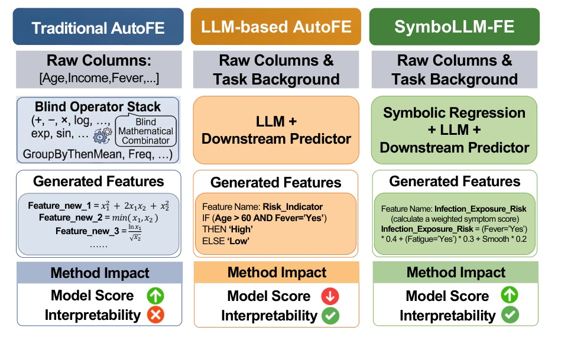
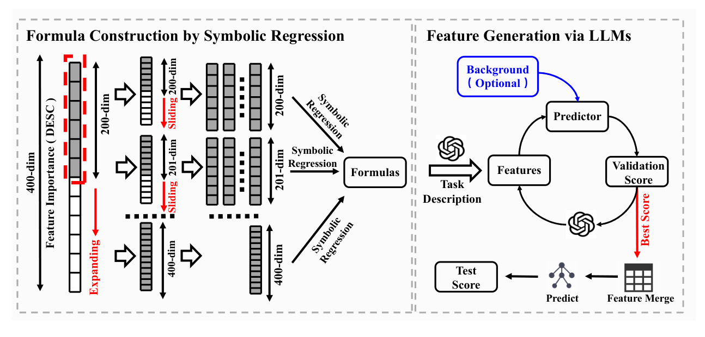
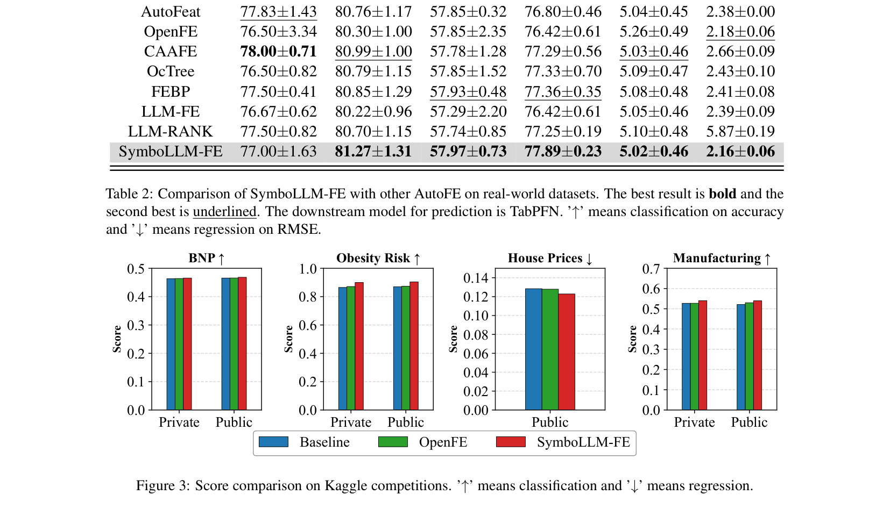
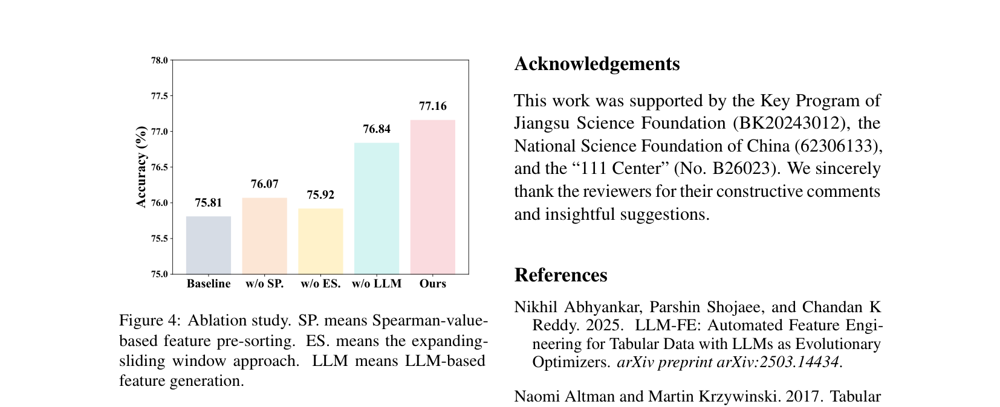

# SymboLLM-FE: LLM-Accelerated Symbolic Regression for Automated Feature Engineering on Tabular Data

## Abstract

- Dữ liệu bảng (tabular data), với tư cách là định dạng dữ liệu cốt lõi trong học máy (machine learning), thường thiếu năng lực phân biệt (discriminative power) cần thiết cho việc xây dựng mô hình hiệu năng cao do mức độ biểu đạt thông tin của đặc trưng (feature informativeness) không đủ.
- Kỹ thuật đặc trưng tự động (Automated Feature Engineering - AutoFE) khắc phục hạn chế này bằng cách tự động hóa quy trình tạo và lựa chọn đặc trưng, đảm bảo đồng thời hiệu năng mô hình và hiệu quả vận hành (operational efficiency).
- Các phương pháp tiếp cận AutoFE hiện tại gặp phải những thách thức cốt lõi:
  - AutoFE truyền thống (traditional AutoFE) thường tạo ra các đặc trưng có khả năng diễn giải kém (poor interpretability) do phụ thuộc vào các phép biến đổi toán học mù (blind mathematical transformations).
  - AutoFE dựa trên mô hình ngôn ngữ lớn (large language models - LLM-based AutoFE) đòi hỏi các vòng lặp đa vòng tốn kém (costly multi-round iterations) để sinh các đặc trưng có mức độ hữu dụng cao (high-utility features) nhằm tăng cường hiệu năng mô hình một cách hiệu quả, kèm theo các rủi ro nội tại về thiên kiến (bias) và ảo giác (hallucination).
- Bài báo đề xuất SymboLLM-FE, phương pháp kết hợp hồi quy ký hiệu (symbolic regression) với LLM cho kỹ thuật đặc trưng (feature engineering) nhằm giải quyết các thách thức trên:
  - Khai phá các công thức toán học giàu tính biểu đạt (mathematically expressive formulas) có tương quan mạnh với mục tiêu (target) thông qua hồi quy ký hiệu để tăng cường hiệu năng mô hình.
  - Tinh chỉnh các công thức này bằng LLM với tri thức tiên nghiệm phong phú (rich prior knowledge) để đảm bảo tính diễn giải (interpretability).
- Kết quả thực nghiệm trên sáu tập dữ liệu thực tế (six real-world datasets) và bốn cuộc thi Kaggle (four Kaggle competitions) chứng minh SymboLLM-FE vượt trội hơn các phương pháp AutoFE hiện có.
- SymboLLM-FE giải quyết đồng thời hai thách thức về khả năng diễn giải kém và số lượng vòng lặp lớn nhờ sử dụng cơ chế tinh chỉnh bằng LLM dựa trên nền tảng tiên nghiệm thống kê (statistical prior-grounded LLM refinement mechanism) và số lần gọi LLM chỉ ở mức một chữ số (single-digit LLM calls).

## 1 Introduction

- **Đặc trưng và vai trò của dữ liệu bảng (Tabular data) trong các ứng dụng thực tế** (Altman and Krzywinski, 2017):
  - Dữ liệu bảng là định dạng dữ liệu có cấu trúc cao (highly structured data format), tổ chức thông tin thành các hàng và cột, trong đó mỗi hàng biểu diễn một mẫu hoặc cá thể độc lập (independent sample/instance), và mỗi cột tương ứng với một đặc trưng hoặc thuộc tính cụ thể (specific feature/attribute) (Sahakyan et al., 2021).
  - Dữ liệu bảng được ứng dụng sâu rộng trong các bài toán thực tế:
    - Lĩnh vực tài chính: chấm điểm tín dụng (credit scoring) (West, 2000) và dự đoán thị trường chứng khoán (stock market prediction) (Zhu et al., 2021).
    - Lĩnh vực y tế: chẩn đoán bệnh tật (disease diagnosis) (Yıldız and Kalayci, 2024) và phát triển dược phẩm (drug development) (Meijerink et al., 2020).
  - *Hạn chế nội tại*: Trong ứng dụng thực tế, dữ liệu bảng thường chịu tình trạng thiếu hụt lượng thông tin trong đặc trưng (insufficient feature informativeness) và tồn tại các tương tác bậc cao ngầm ẩn (implicit high-order interactions).
  - Các hạn chế cố hữu này tạo ra rào cản ngăn các mô hình nắm bắt hiệu quả cấu trúc dữ liệu tiềm ẩn, dẫn đến hiệu năng dự đoán dưới mức tối ưu (suboptimal predictive performance) (Sayed et al., 2025; Cheng et al., 2025b; Gorishniy et al., 2021).

- **Sự cần thiết của Kỹ thuật Đặc trưng Tự động (Automated Feature Engineering - AutoFE)**:
  - Trước khi thực hiện dự đoán, kỹ thuật đặc trưng (feature engineering) thường được áp dụng nhằm tăng cường mối quan hệ giữa các đặc trưng đầu vào và nhãn mục tiêu thông qua các thao tác sinh đặc trưng (feature generation) và lựa chọn đặc trưng (feature selection) (Ravishankar and Battineni, 2025).
  - Dữ liệu bảng sau xử lý được đưa vào các mô hình xuôi dòng (downstream models) để cải thiện độ chính xác dự đoán.
  - Trước đây, kỹ thuật đặc trưng phụ thuộc nặng nề vào việc xây dựng thủ công các đặc trưng chất lượng cao—quy trình đòi hỏi nhiều vòng lặp thử nghiệm tốn kém công sức và gia tăng đáng kể chi phí nhân lực (labour costs) (Susan and Tuteja, 2025).
  - AutoFE ra đời như một trọng tâm nghiên cứu cốt lõi nhằm tự động hóa và thuật toán hóa việc khám phá, xây dựng các đặc trưng hiệu quả để giảm thiểu công sức thủ công và nâng cao hiệu năng mô hình học máy (Khurana et al., 2016).

- **Cơ chế hoạt động và hạn chế về khả năng diễn giải của AutoFE truyền thống (Traditional AutoFE)**:
  - Các phương pháp AutoFE truyền thống tiêu biểu gồm: tối ưu hóa lai kết hợp tìm kiếm chùm (hybrid optimization with beam search) (Horn et al., 2019), cắt tỉa động (dynamic pruning) (Zhang et al., 2023b), và lựa chọn đặc trưng (feature selection) (Li et al., 2017; Cheng et al., 2025a).
  - Cơ chế tạo đặc trưng chủ yếu dựa vào các quy tắc biến đổi định sẵn (predefined transformation rules), tìm kiếm vét cạn (exhaustive search), hoặc các chiến lược tối ưu hóa (optimization-based strategies) để sinh các đặc trưng ứng viên (candidate features).
  - *Hạn chế về tính diễn giải (Poor interpretability)*: Dù cải thiện được hiệu năng mô hình, các đặc trưng sinh ra bởi AutoFE truyền thống thường là các tổ hợp toán học phức tạp hoàn toàn thiếu vắng ý nghĩa ngữ nghĩa tường minh (devoid of explicit semantic meaning), dẫn đến sự tách rời khỏi logic miền tri thức mà con người có thể hiểu được (human-understandable domain-specific logic).
  - *Hậu quả trong các lĩnh vực nhạy cảm*: Trong các kịch bản như khai phá nhân tố (factor mining) (Wang et al., 2025, 2026), khả năng diễn giải là yêu cầu bắt buộc để kiểm chứng cơ sở kinh tế (economic rationale) đằng sau các tín hiệu, đảm bảo tuân thủ pháp lý (regulatory compliance), và hỗ trợ chẩn đoán sai số hiệu quả. Nếu thiếu logic lập luận rõ ràng, mô hình rất khó phân biệt giữa quy luật dự đoán vững chắc và tương quan giả tạo (spurious correlations), làm suy giảm niềm tin vào các quyết định dự đoán.

- **So sánh các cơ chế sinh đặc trưng và mô hình diễn giải giữa ba thế hệ AutoFE**:
  - AutoFE truyền thống dựa trên các chồng toán tử mù (blind operator stacks), mang lại hiệu năng cao nhưng khả năng diễn giải kém; AutoFE dựa trên LLM mang lại sự rõ ràng về ngữ nghĩa nhưng dễ bất ổn về hiệu năng; SymboLLM-FE kết hợp hồi quy ký hiệu với LLM để đạt đồng thời độ chính xác dự đoán cao và tính minh bạch có thể diễn giải bởi con người.
  - **Hình 1.** Phân tích so sánh cơ chế sinh đặc trưng và mô hình diễn giải giữa các phương pháp AutoFE (Traditional AutoFE, LLM-based AutoFE, và SymboLLM-FE)
    - 
    - **Hình này chứng minh điều gì**
      - AutoFE truyền thống đạt điểm mô hình cao nhưng thiếu tính diễn giải; LLM-based AutoFE có tính diễn giải cao nhưng hiệu năng suy giảm; SymboLLM-FE đạt đồng thời điểm mô hình vượt trội và tính minh bạch dễ diễn giải
    - **Từ đâu mà thấy được**
      - Traditional AutoFE xếp chồng toán tử mù (Blind Operator Stack) sinh công thức thuần toán ($x_1^2 + 2x_1 x_2 + x_2^2$, $\min(x_1, x_2)$, $\frac{\ln x_1}{\sqrt{x_2}}$), Model Score tăng ($\uparrow$) nhưng Interpretability bị đánh dấu chéo đỏ ($\times$)
      - LLM-based AutoFE dùng LLM sinh đặc trưng dạng luật logic ngữ nghĩa (`Risk_Indicator`), Interpretability đạt tích xanh ($\checkmark$) nhưng Model Score giảm ($\downarrow$)
      - SymboLLM-FE phối hợp Hồi quy ký hiệu + LLM sinh đặc trưng gán trọng số ngữ nghĩa (`Infection_Exposure_Risk`), cả Model Score lẫn Interpretability đều đạt ($\uparrow$, $\checkmark$)

- **Tiềm năng và hai thách thức then chốt của AutoFE dựa trên Mô hình Ngôn ngữ Lớn (LLM-based AutoFE)**:
  - *Tiềm năng*: Sự phát triển của các mô hình ngôn ngữ lớn (LLMs) mang lại cơ hội mới nhờ năng lực hiểu ngữ nghĩa (semantic understanding) (Hollmann et al., 2023b), suy luận logic (logical reasoning) (Zou et al., 2026), và định hướng tri thức (knowledge guidance) (Nam et al., 2024).
  - LLM-based AutoFE tận dụng tri thức tiên nghiệm phong phú (rich prior knowledge) và khả năng hiểu ngữ cảnh để tự động phát hiện mối quan hệ tiềm năng giữa các đặc trưng trong dữ liệu bảng thô, xây dựng đặc trưng mới giàu tính diễn giải qua các phép toán và quy tắc logic thay vì tìm kiếm vét cạn.
  - *Thách thức 1 (Chi phí tính toán và lặp lại khổng lồ)*: Quá trình sinh đặc trưng nâng cao hiệu năng đòi hỏi tương tác lặp lại nhiều vòng với mô hình xuôi dòng để xác thực và tinh chỉnh, gây ra chi phí tính toán nghiêm trọng (prohibitive computational overhead) và hạn chế khả năng mở rộng (limited scalability) (Abhyankar et al., 2025).
  - *Thách thức 2 (Ảo giác và thiên kiến ngầm ẩn)*: Sự nhạy cảm cố hữu của LLM đối với ảo giác (hallucinations) và thiên kiến ngầm ẩn (implicit biases) dễ dẫn đến việc sinh các đặc trưng không hợp lệ về mặt ngữ nghĩa (semantically invalid) hoặc thiếu công bằng (unfair features), làm tổn hại nặng nề độ tin cậy và tính toàn vẹn dự đoán của mô hình xuôi dòng (Cheng et al., 2026; Han et al., 2024).

- **Khung làm việc đề xuất SymboLLM-FE**:
  - SymboLLM-FE kết hợp hồi quy ký hiệu (symbolic regression) và LLM để sinh các đặc trưng vừa có cơ sở toán học vừa có thể diễn giải, giúp tối ưu hóa hiệu năng mô hình.
  - Vận hành thông qua đường ống phối hợp hai giai đoạn (two-stage collaborative pipeline):
    - *Giai đoạn 1 - Xây dựng công thức bằng hồi quy ký hiệu*: Áp dụng chiến lược cửa sổ mở rộng - trượt (expanding-sliding window strategy) dựa trên phân tích tương quan Spearman (Spearman correlation analysis) để giảm không gian tìm kiếm từ cấp số mũ $\mathcal{O}(2^n)$ xuống đa thức $\mathcal{O}(n^2)$, cho phép hồi quy ký hiệu sinh ra các công thức ứng viên rõ ràng, có cơ sở toán học vững chắc.
    - *Giai đoạn 2 - Tinh chỉnh đặc trưng bằng LLM*: Tận dụng LLM để đưa các tiên nghiệm miền cụ thể (domain-specific priors) vào các công thức toán học chưa rõ nghĩa ngữ nghĩa, biến đổi chúng thành mã thực thi có ý nghĩa ngữ nghĩa thông qua suy luận chuỗi tư duy (chain-of-thought reasoning).
  - Vòng lặp tinh chỉnh vừa xác thực giá trị sử dụng của đặc trưng thông qua hiệu năng bộ dự đoán xuôi dòng, vừa đảm bảo sự tương thích với logic nghiệp vụ, đạt được sự cân bằng vững chắc giữa hiệu năng cao và tính minh bạch dễ diễn giải đối với con người.

- **Hiệu quả tính toán và chi phí API vượt trội của SymboLLM-FE so với các phương pháp AutoFE (Bảng 1)**:
  - Bảng 1 so sánh hiệu năng dự đoán, số lượng đặc trưng sinh ra, và số lượt gọi API giữa các phương pháp AutoFE truyền thống và AutoFE dựa trên LLM:

| Phương pháp AutoFE | Số đặc trưng sinh ra (Generated Features) | Điểm số mô hình (Score) | Số lượt gọi API (API Call) |
| :--- | :---: | :---: | :---: |
| AutoFeat | 2 | 79.75 | − |
| OpenFE | 1436 | 79.53 | − |
| CAAFE | 30 | 79.94 | 10 |
| OcTree | 50 | 79.52 | 50 |
| FEBP | 200 | 79.36 | 29 |
| LLM-FE | 30 | 79.59 | 35 |
| LLM-RANK | − | 78.86 | 7 |
| **SymboLLM-FE** | **70** | **80.02** | **4** |

  - *Ghi chú Table 1*: AutoFeat và OpenFE là các phương pháp AutoFE truyền thống không sử dụng LLM. LLM-RANK không sinh đặc trưng vì đóng vai trò bộ chọn lọc đặc trưng (feature selector).
  - SymboLLM-FE đạt điểm số cao nhất ($80.02$) trong khi chỉ tiêu tốn số lượt gọi LLM API ở mức một chữ số ($4$ lượt gọi), giảm đáng kể chi phí tính toán so với các phương pháp LLM-based AutoFE khác (OcTree cần $50$ cuộc gọi, LLM-FE cần $35$, FEBP cần $29$, CAAFE cần $10$).

- **Bốn đóng góp chính của bài báo**:
  - *Đóng góp 1 - Phân tích thực nghiệm toàn diện*: Chỉ ra rằng AutoFE truyền thống bị hạn chế bởi tính diễn giải kém, trong khi AutoFE dựa trên LLM đối mặt với thử nghiệm lặp tốn kém, ảo giác (hallucination) và thiên kiến ngầm ẩn (implicit bias).
  - *Đóng góp 2 - Đề xuất khung SymboLLM-FE*: Giải quyết các thách thức của AutoFE hiện nay bằng cách kết hợp hồi quy ký hiệu để khai phá đặc trưng tăng cường hiệu năng, sau đó tinh chỉnh qua LLM để nâng cao tính diễn giải ngữ nghĩa.
  - *Đóng góp 3 - Đánh giá thực nghiệm quy mô lớn*: Thực nghiệm trên sáu bộ dữ liệu thực tế và bốn cuộc thi Kaggle chứng minh hiệu năng vượt trội và khả năng khái quát hóa (generalizability) của SymboLLM-FE so với các phương pháp AutoFE hiện tại.
  - *Đóng góp 4 - Cơ chế tinh chỉnh tinh gọn với số lượt gọi LLM tối thiểu*: Giải quyết đồng thời thách thức kép về tính diễn giải kém và chi phí lặp thử nghiệm khổng lồ bằng cơ chế tinh chỉnh LLM dựa trên nền tảng tiên nghiệm thống kê (statistical prior-grounded LLM refinement mechanism) chỉ với số lượt gọi LLM ở mức một chữ số (single-digit LLM calls, $4$ lượt gọi).

## 2 Related Work

### 2.1 Tabular Machine Learning on LLMs

- Sự xuất hiện của các LLM (Large Language Model - mô hình ngôn ngữ lớn) sở hữu lượng lớn tri thức tiên nghiệm đặc thù miền (domain-specific prior knowledge) đã thúc đẩy việc khám phá tiềm năng ứng dụng của chúng trong các tác vụ học máy trên dữ liệu bảng (tabular machine learning) (Jia et al., 2026).
  - LIFT (Dinh et al., 2022) tinh chỉnh (fine-tune) GPT-3 (Floridi and Chiriatti, 2020) trên dữ liệu huấn luyện, chứng minh rằng các LLM đa năng có thể cải thiện hiệu năng dù chưa vượt qua được các mô hình dựa trên cây (tree-based models).
  - TabLLM (Hegselmann et al., 2023) sử dụng T0 (Sanh et al., 2021) để tinh chỉnh, tận dụng hiệu quả tri thức tiền huấn luyện với lượng dữ liệu có nhãn tối thiểu.
  - UniPredict (Wang et al., 2023) huấn luyện GPT-2 (Ethayarajh, 2019) trên 169 tập dữ liệu bảng, đạt kết quả cạnh tranh mà không cần tinh chỉnh đặc thù theo từng tập dữ liệu (dataset-specific tuning).
- Các phương pháp tiếp cận dựa trên LLM thể hiện hiệu năng vượt trội chủ yếu trong các thiết lập thực nghiệm zero-shot hoặc few-shot (Hegselmann et al., 2023).
  - Trong các kịch bản thực tế, các phương pháp này vẫn tụt hậu so với các mô hình cây và mô hình học sâu (deep learning) về cả hiệu quả tính toán lẫn độ chính xác dự đoán (Cheng et al., 2025b).
- Việc sử dụng trực tiếp LLM làm bộ dự đoán (predictor) là chưa tối ưu (suboptimal).
  - Nhận định này thúc đẩy các nhà nghiên cứu chuyển sang tận dụng LLM như một phương pháp kỹ thuật đặc trưng (feature engineering) nhằm nâng cao biểu diễn dữ liệu (data representation), qua đó cải thiện hiệu năng của các bộ dự đoán xuôi dòng (downstream predictors) như mô hình cây hoặc mô hình học sâu (Hollmann et al., 2023b).

### 2.2 Traditional and LLM-based AutoFE

- AutoFE truyền thống (Automated Feature Engineering - kỹ thuật đặc trưng tự động) chủ yếu dựa vào tìm kiếm heuristic (heuristic search) hoặc học tăng cường (reinforcement learning).
  - Các phương pháp phát triển từ khung vét cạn (exhaustive frameworks) (Katz et al., 2016) và DFS (Deep Feature Synthesis) (Kanter and Veeramachaneni, 2015) sang các cách tiếp cận định hướng theo độ hữu dụng hiệu quả (utility-driven approaches) (Zhang et al., 2023b) và các mô hình định hướng theo quan hệ nhân quả (causally-guided models) (Malarkkan et al., 2026).
  - Hạn chế: thường gặp khó khăn trước sự bùng nổ tổ hợp (combinatorial explosion) trong không gian tìm kiếm phức tạp và thiếu sự gióng hàng ngữ nghĩa (semantic alignment) với logic nghiệp vụ đặc thù miền.
- Các tiến bộ gần đây của LLM đã thúc đẩy sự phát triển của AutoFE dựa trên LLM, phân nhánh thành hai hướng chính: sinh đặc trưng (feature generation) và chọn lọc đặc trưng (feature selection).
  - Hướng sinh đặc trưng bao gồm các khung làm việc nhận biết ngữ cảnh (context-aware frameworks) (Hollmann et al., 2023b), cây quyết định để khám phá quy tắc (Nam et al., 2024), ánh xạ đặc trưng khả vi (differentiable feature mapping) (Han et al., 2024), sinh có cấu trúc qua ký pháp Ba Lan ngược (reverse Polish notation) (Zou et al., 2026), và các mô hình lai giữa tiến hóa và chưng cất tri thức (evolutionary-knowledge distillation hybrids) (Abhyankar et al., 2025).
  - Hướng chọn lọc đặc trưng áp dụng các ngưỡng xác suất log (log-probability thresholds) (Choi et al., 2022) và mô hình xếp hạng (ranking paradigms) (Jeong et al., 2024).
- Các thách thức của AutoFE dựa trên LLM gồm: đặc trưng sinh ra không hữu dụng (uselessness of generated features), hiện tượng ảo giác (hallucinations) và thiên kiến (biases).

### 2.3 Automated Feature Engineering on Symbolic Regression

- Hồi quy ký hiệu (Symbolic Regression - SR) là một phương pháp học máy khám phá các biểu thức toán học tối ưu để làm sáng tỏ các mối quan hệ tiềm ẩn trong dữ liệu (latent data relationships) (Yang et al., 2025).
  - Khả năng rút ra các dạng giải tích có thể diễn giải được (interpretable analytical forms) giúp hồi quy ký hiệu có giá trị lớn trong kỹ thuật đặc trưng (Shmuel et al., 2024), vừa nâng cao tính minh bạch của mô hình và độ chính xác dự đoán, vừa giảm bớt công sức thủ công.
- Các tiến bộ gần đây trong kỹ thuật đặc trưng bằng hồi quy ký hiệu:
  - Tích hợp tính toán tiến hóa (evolutionary computation) để trích xuất các hiện tượng vật lý (Yu et al., 2026).
  - Quy hoạch di truyền đa cây dạng mô-đun (modular multi-tree genetic programming) nhằm tái sử dụng đặc trưng trong không gian nhiều chiều (high-dimensional feature reuse) (San et al., 2021).
  - Chọn lọc đặc trưng dựa trên tương quan Spearman (Spearman-based feature selection) nhằm tăng cường khả năng khái quát hóa (generalization) (Kim et al., 2020).
- Hạn chế của hồi quy ký hiệu: vẫn gặp khó khăn trước độ phức tạp của biểu thức (expression complexity) trong không gian nhiều chiều.
- Khoảng trống nghiên cứu: mặc dù các nghiên cứu hiện có đã khám phá tương tác giữa LLM và hồi quy ký hiệu để sinh phương trình (như trong xử lý ngôn ngữ tự nhiên (Shao et al., 2026) và tổng hợp mã nguồn (Shojaee et al., 2025)), chưa có công trình nào mở rộng để đưa các phương trình do hồi quy ký hiệu sinh ra vào LLM phục vụ kỹ thuật đặc trưng.

## 3 Problem Formulation and Analysis

### 3.1 Problem Formulation

- Mục tiêu hình thức của các tác vụ dự đoán trên dữ liệu bảng (tabular prediction tasks) là huấn luyện một mô hình học máy (machine learning model) $f : X \rightarrow Y$, trong đó $X$ là không gian đầu vào (input space) và $Y$ là không gian đầu ra (output space).
  - Tập hợp các đặc trưng trong $X$ được định nghĩa là $C$.
  - Đối với không gian $X$ có $n$ chiều ($n$-dimensional), tập đặc trưng thông thường là $C = \{c_1, c_2, \dots, c_n\}$.
- Kỹ thuật đặc trưng (feature engineering) nhằm mục đích mở rộng số chiều của $X$ bằng cách tạo ra $m$ đặc trưng mới dựa trên $C$, tức là tập đặc trưng mới $C_{\text{new}} = \{c_{n+1}, c_{n+2}, \dots, c_{n+m}\}$.
  - Sau kỹ thuật đặc trưng, số chiều của $X$ tăng từ $n$ lên $n + m$.
  - Hiệu năng (performance) $P$ của $f$ có thể được cải thiện trên tập đặc trưng mới $S$.
- Mục tiêu là đạt được giá trị cực đại của hiệu năng $f$, bằng cách thay đổi $C_{\text{new}}$ được sinh ra bởi bộ AutoFE (Automated Feature Engineering - kỹ thuật đặc trưng tự động) $g$:
  $$\max P_f(S) = \max P_f(C \oplus C_{\text{new}}) = \max P_f(C \oplus g(C)) \quad (1)$$
  - Trong đó, $S = C \oplus C_{\text{new}} = C \oplus g(C)$ biểu diễn tập đặc trưng sau khi ghép nối các đặc trưng ban đầu với các đặc trưng do $g$ sinh ra.

### 3.2 Analysis

- Phân tích so sánh các phương pháp AutoFE khác nhau trong Figure 1 và Table 1 bộc lộ một sự phân đôi rõ rệt (dichotomy) giữa AutoFE truyền thống (traditional AutoFE) và AutoFE dựa trên LLM (LLM-based AutoFE), làm nổi bật các điểm nghẽn then chốt ở cả hiệu suất (efficiency) lẫn chất lượng đặc trưng (feature quality).
- AutoFE truyền thống bị giới hạn nghiêm ngặt bởi các đặc trưng không thể diễn giải (uninterpretable features):
  - Phương pháp này phụ thuộc vào một chồng toán tử mù (blind operator stack) để kết hợp các cột dữ liệu thô về mặt toán học mà không có sự hiểu biết ngữ nghĩa (semantic understanding).
  - Quá trình này sinh ra một tập đặc trưng quá lớn (excessively large feature set).
  - Các đặc trưng mới sinh ra thiếu nền tảng ngữ nghĩa (semantic grounding) và ý nghĩa vật lý (physical meaning), không cung cấp được các hiểu biết hữu ích (actionable insights) cho việc thu thập đặc trưng trong tương lai.
  - Các đặc trưng này mang lại khả năng tổng quát hóa kém đối với các tác vụ xuôi dòng (downstream tasks) do tính diễn giải (interpretability) của các đặc trưng được sinh ra bị tổn hại nghiêm trọng.
- AutoFE dựa trên LLM đảm bảo tính diễn giải ngữ nghĩa nhờ tận dụng tri thức nền tảng của tác vụ (task background knowledge), nhưng gặp trở ngại với chi phí lặp cao (high iteration costs) như thể hiện trong Table 1:
  - Việc chỉ dựa hoàn toàn vào LLM để sinh đặc trưng thường xuyên tạo ra các đặc trưng tuy mạch lạc về mặt ngữ nghĩa và phù hợp với miền dữ liệu nhưng lại thiếu năng lực phân biệt mạnh mẽ (robust discriminative power).
  - Các phương pháp như OcTree đòi hỏi xấp xỉ 50 vòng lặp (rounds) để hội tụ, cho thấy các đặc trưng do AutoFE dựa trên LLM sinh ra cần trải qua nhiều vòng kiểm chứng thử-sai (trial-and-error validation) và liên tục tinh chỉnh để nâng cao hiệu năng của mô hình xuôi dòng.
  - Tính bất định nội tại (intrinsic uncertainty) này buộc phải diễn ra tương tác lặp đi lặp lại trên diện rộng với các bộ dự đoán xuôi dòng (downstream predictors), dẫn đến sự bùng nổ nghiêm trọng về cả số vòng lặp lẫn chi phí thời gian tính toán (computational time costs).
  - Hơn nữa, các phương pháp AutoFE dựa trên LLM tiên tiến này vốn dĩ vẫn dễ bị ảnh hưởng bởi hiện tượng ảo giác nghiêm trọng (severe hallucinations) và thiên kiến tiềm ẩn (implicit biases), có thể dẫn đến việc suy giảm hiệu năng mô hình.
- Các phát hiện trên làm nổi bật rõ rệt những hạn chế cốt lõi của AutoFE truyền thống và AutoFE dựa trên LLM hiện nay, nhấn mạnh nhu cầu cấp thiết về một khung làm việc AutoFE tối ưu hóa hơn:
  - Khung làm việc cần có khả năng vượt qua chi phí lặp cao của LLM và bản chất khó diễn giải của các phép kết hợp toán học truyền thống.
  - Mục tiêu là tạo ra các đặc trưng đồng thời vừa có khả năng diễn giải (interpretable) vừa đạt hiệu quả dự đoán cao (predictively effective).

## 4 Method

- **Mô hình lai SymboLLM-FE**: SymboLLM-FE khắc phục các hạn chế của AutoFE hiện nay bằng cách kết hợp hiệp đồng giữa hồi quy ký hiệu (Symbolic Regression) và các mô hình ngôn ngữ lớn (Large Language Models - LLMs):
  - Hồi quy ký hiệu xuất sắc trong việc khám phá hiệu quả các công thức toán học tường minh (explicit mathematical formulas), vừa nhẹ về chi phí tính toán (computationally lightweight) vừa đáp ứng nhu cầu tạo ra các đặc trưng giúp nâng cao hiệu năng.
  - LLMs đóng vai trò bổ trợ bằng cách tận dụng tri thức sâu rộng để tinh chỉnh và tối ưu hóa các công thức ký hiệu ứng viên này.
  - Bằng cách đưa vào các tiên nghiệm đặc thù của miền (domain-specific priors), LLMs chuyển hóa các công thức toán học mờ đục (opaque mathematical formulas), đồng thời tăng cường khả năng diễn giải (interpretability) thông qua giải thích bằng ngôn ngữ tự nhiên và bảo đảm sự phù hợp với logic kinh doanh (business logic).
  - Mô hình lai này thu hẹp hiệu quả khoảng cách giữa tính hữu hiệu (efficacy) và khả năng diễn giải (interpretability).
  - **Hình 2.** Tổng quan kiến trúc SymboLLM-FE, bao gồm Xây dựng Công thức bằng Hồi quy Ký hiệu, Sinh Đặc trưng qua LLMs và mô hình dự đoán xuôi dòng
    - 
    - **Hình này chứng minh điều gì**
      - Quy trình hai giai đoạn kết hợp hồi quy ký hiệu và LLMs: Hồi quy ký hiệu trích xuất công thức toán học từ các tập con đặc trưng tạo bởi cửa sổ mở rộng - trượt; LLMs tinh chỉnh mã nguồn Python pandas và lặp tối ưu dựa trên điểm kiểm định của bộ dự đoán xuôi dòng.
    - **Từ đâu mà thấy được**
      - Sơ đồ gồm hai khối: khối trái thực hiện sắp xếp thứ tự đặc trưng Spearman, tạo tập con bằng cửa sổ Expanding và Sliding qua Symbolic Regression tạo Formulas; khối phải nhận Prompt/Background, dùng LLMs sinh Features, huấn luyện Predictor lấy Validation Score lặp tối ưu, cuối cùng Feature Merge và Predict ra Test Score.
- **Phân chia tập dữ liệu (Dataset Split)**: SymboLLM-FE tuân thủ nghiêm ngặt giao thức huấn luyện theo từng fold (fold-wise training protocol) trong khuôn khổ kiểm định chéo (cross-validation framework):
  - Tập huấn luyện (training set) chỉ được sử dụng duy nhất cho giai đoạn Xây dựng Công thức bằng Hồi quy Ký hiệu (Formula Construction by Symbolic Regression), hỗ trợ toàn bộ pipeline từ sắp xếp lại thứ tự đặc trưng dựa trên tương quan Spearman, tạo tập con bằng cửa sổ mở rộng - trượt cho đến khớp các mô hình ký hiệu.
  - Tập kiểm định (validation set) đóng vai trò là môi trường phản hồi (feedback environment) cho giai đoạn Sinh Đặc trưng qua LLMs (Feature Generation via LLMs):
    - Tập kiểm định được cách ly hoàn toàn khỏi quy trình hồi quy ký hiệu trước đó, nhưng được sử dụng tích cực để tính điểm kiểm định (validation scores) nhằm dẫn đường cho vòng lặp tổng hợp mã nguồn lặp (iterative code synthesis), khai phá quy tắc (rule mining) và tối ưu hóa đặc trưng của LLM.
    - Tập kiểm định chỉ được sử dụng duy nhất cho việc tinh chỉnh siêu tham số (hyperparameter tuning) nhằm ngăn chặn triệt để hiện tượng rò rỉ dữ liệu (data leakage).
  - Tập kiểm thử (test set) chỉ được giữ lại duy nhất cho bước đánh giá xuôi dòng cuối cùng trên tập đặc trưng đã hợp nhất (merged feature set) nhằm lượng giá hiệu năng mô hình:
    - Kiến trúc và tham số của mô hình xuôi dòng (downstream model architecture and parameters) được giữ cố định và độc lập với quy trình đánh giá trên tập kiểm thử, đảm bảo không có bất kỳ thông tin nào từ pha kiểm định vô tình ảnh hưởng đến đánh giá hiệu năng cuối cùng.

### 4.1 Formula Construction by Symbolic Regression

- **Quy trình tổng thể**: SymboLLM-FE khởi đầu bằng việc xây dựng nhiều tập con đặc trưng đầu vào thông qua hệ số tương quan Spearman (Spearman correlation) (De Winter et al., 2016) kết hợp phương pháp tiếp cận cửa sổ mở rộng - trượt (expanding-sliding window approach), sau đó áp dụng mô hình hồi quy ký hiệu riêng biệt lên từng tập con để suy dẫn các công thức toán học có khả năng diễn giải, nắm bắt các mối quan hệ có ý nghĩa với biến mục tiêu (target).
- **Lấy mẫu tập đặc trưng (Feature Set Sampling)**:
  - Với tập đặc trưng $C$ gồm $n$ đặc trưng, tổng số tập con đặc trưng phi rỗng là $2^n - 1$.
  - Việc áp dụng hồi quy ký hiệu lên mọi tập con sẽ dẫn đến độ phức tạp tính toán hàm mũ $\mathcal{O}(2^n)$, đòi hỏi chiến lược lấy mẫu nhằm tối ưu hiệu quả tính toán trong khi vẫn bảo toàn năng lực biểu diễn của đặc trưng.
  - Sắp xếp thứ tự đặc trưng bằng tương quan Spearman:
    - Đánh giá tầm quan trọng của các đặc trưng trong $C$ bằng phân tích hệ số tương quan Spearman, sau đó sắp xếp tăng đơn điệu (monotonic ascending sorting) theo hệ số tương quan để thu được chuỗi đặc trưng có thứ tự $C' = \{c'_1, c'_2, \dots, c'_n\}$ thỏa mãn:
      $$\phi_{c'_1} \le \phi_{c'_2} \le \dots \le \phi_{c'_n}$$
      trong đó $\phi_{c'_i}$ ký hiệu hệ số tương quan Spearman giữa đặc trưng $c'_i$ và biến mục tiêu.
    - Tương quan Spearman được chọn làm tiêu chí định lượng tầm quan trọng đặc trưng vì có khả năng định lượng bền vững hơn các phụ thuộc phi tuyến (nonlinear dependencies) giữa đặc trưng và mục tiêu so với tương quan Pearson, cung cấp phép đo chính xác hơn về tầm quan trọng biên của đặc trưng (marginal feature importance) (Cheng et al., 2025b; Phụ lục D kiểm chứng thực nghiệm tương quan thống kê giữa chỉ số này và các tiêu chí khác).
  - Phương pháp cửa sổ mở rộng - trượt động (Dynamic Expanding-Sliding Window):
    - Khởi tạo với kích thước cửa sổ ban đầu $k = \lfloor n/2 \rfloor$.
    - Pha mở rộng (Expanding Phase): Kích thước cửa sổ $k$ tăng dần từ $\lfloor n/2 \rfloor$ đến $n$ với bước nhảy đơn vị ($+1$).
    - Pha trượt (Sliding Phase): Với mỗi kích thước cửa sổ $k$ cố định, cửa sổ trượt sang phải với bước nhảy từng đặc trưng đơn lẻ để sinh ra các tập con đặc trưng khác nhau (ví dụ khi $k = \lfloor n/2 \rfloor$, các tập con sinh ra gồm $\{\{c'_1, \dots, c'_{\lfloor n/2 \rfloor}\}, \{c'_2, \dots, c'_{\lfloor n/2 \rfloor + 1}\}, \dots\}$).
    - Tổng số tập con đặc trưng đầu vào ứng viên $|S|$ được chặn trên bởi tổng cấp số cộng:
      $$\sum_{k=\lfloor n/2 \rfloor}^n (n - k + 1) = \sum_{m=1}^{\lceil n/2 \rceil + 1} m = \begin{cases} \frac{(n + 2)(n + 4)}{8}, & \text{nếu } n \text{ chẵn} \\ \frac{(n + 3)(n + 5)}{8}, & \text{nếu } n \text{ lẻ} \end{cases} \tag{2}$$
    - Phương trình (2) chứng minh phương pháp cửa sổ mở rộng - trượt giảm thiểu tổng số tập con đặc trưng từ độ phức tạp hàm mũ $\mathcal{O}(2^n)$ xuống độ phức tạp đa thức $\mathcal{O}(n^2)$.
- **Sinh công thức (Formula Generating)**:
  - Với mỗi tập con $S_i$ ($i \in [1, |S|]$) sinh ra từ phương pháp cửa sổ mở rộng - trượt, huấn luyện một mô hình hồi quy ký hiệu và sinh ra công thức biểu diễn (ví dụ có dạng $\text{add}(\text{mul}(c_1, c_2), c_3)$) từ $S_i$ đến mục tiêu làm đặc trưng mới (chi tiết về hồi quy ký hiệu được trình bày tại Phụ lục A).
  - Sau quá trình huấn luyện và xây dựng có hệ thống, thiết lập kho lưu trữ đặc trưng dựa trên công thức (formula-based feature repository) $\mathcal{R}$ gồm $|S|$ bộ ba:
    $$\mathcal{R} = \{(S_i, P_f(S_i), \tau_i)\}_{i=1}^{|S|} \tag{3}$$
    trong đó mỗi bộ ba gồm:
    1. Tập con đặc trưng đầu vào $S_i$.
    2. Hiệu năng hồi quy ký hiệu $P$ của mô hình ký hiệu $f$ đã huấn luyện trên $S_i$ (ký hiệu $P_f(S_i)$).
    3. Công thức toán học $\tau_i$ ánh xạ từ $S_i$ đến mục tiêu.

### 4.2 Feature Generation via LLMs

- **Quy trình tinh chỉnh đa giai đoạn**: SymboLLM-FE triển khai một pipeline tinh chỉnh đa giai đoạn (multi-stage refinement pipeline) thông qua LLMs và các mô hình dự đoán xuôi dòng (downstream predictors) dựa trên kho lưu trữ $\mathcal{R}$ để tạo ra các đặc trưng chất lượng cao.
- **Sinh mã nguồn định hướng bởi LLM (LLM-guided Code Generation)**:
  - Đầu vào cung cấp cho LLMs được xây dựng bằng cách chuyển đổi từng công thức $\tau \in \mathcal{R}$ thành mô tả ngôn ngữ tự nhiên tương ứng, nối ghép với thông tin bối cảnh tập dữ liệu có cấu trúc (structured dataset background information) và prompt sinh mã nguồn.
  - LLMs sinh mã nguồn kỹ thuật đặc trưng có thể thực thi trực tiếp dưới định dạng Python pandas thông qua cơ chế lập luận chuỗi suy nghĩ (Chain-of-Thought reasoning - CoT) (Wei et al., 2022).
- **Kiểm thực hiệu năng bộ dự đoán xuôi dòng (Downstream Predictor Performance Validation)**:
  - Mã nguồn được sinh ra được thực thi để tạo tập đặc trưng mở rộng $C_{\text{new}}$ và làm giàu tập dữ liệu gốc $C$:
    $$C_{\text{final}} = C \oplus C_{\text{new}}$$
  - Tiếp theo, một mô hình dự đoán xuôi dòng được huấn luyện trên $C_{\text{final}}$ để thu thập kết quả hiệu năng tương ứng.
- **Tinh chỉnh đặc trưng lặp (Iterative Feature Refinement)**:
  - Hiệu năng của mô hình dự đoán, cùng với các đặc trưng đã sử dụng và mã nguồn sinh tương ứng, được đưa ngược lại cho LLMs để phục vụ tối ưu hóa lặp và tinh chỉnh đặc trưng.
  - Vòng lặp phản hồi này tiếp diễn cho đến khi mô hình dự đoán đạt được mức hiệu năng tối ưu tương đối trên tập đặc trưng mở rộng.
- **Cơ chế kiểm soát đặc trưng và khử dư thừa nghiêm ngặt (Rigorous Feature Control and De-redundancy Mechanisms)**:
  - Quản lý ngân sách đặc trưng (Feature budget management): Tự động cắt tỉa động (dynamically prune) các đặc trưng làm suy giảm hiệu năng trên tập kiểm định thông qua phản hồi từ mô hình dự đoán xuôi dòng, tạo ra một tập đặc trưng tinh chỉnh cô đọng, tránh hiệu quả lời nguyền số chiều (curse of dimensionality) so với các phương pháp cơ sở.
  - Khử dư thừa (Redundancy elimination) thông qua các ràng buộc độc lập với prompt:
    - Bản mẫu prompt (template) bắt buộc thực thi thao tác loại bỏ đặc trưng tường minh có giải trình (explicit feature dropping with justification).
    - LLM đóng vai trò là bộ lọc ngữ nghĩa (semantic filter) để nhận diện tính tương đương toán học giữa các công thức hồi quy ký hiệu và các đặc trưng gốc, loại bỏ triệt để hiện tượng đa cộng tuyến (multicollinearity).
  - Triệt tiêu nhiễu và hạn chế quá khớp (Suppress noise and overfitting):
    - Áp đặt số hạng phạt độ phức tạp (parsimony penalty) theo nguyên lý Dao cạo Ockham (Occam's razor) ở giai đoạn hồi quy ký hiệu.
    - Giới hạn nghiêm ngặt các thao tác của LLM trong không gian con đã được xác thực thống kê (statistically validated subspace), qua đó loại bỏ hoàn toàn hiện tượng ảo giác (hallucination), bảo đảm tính vững chắc (robustness) và độ cô đọng (compactness) của tập đặc trưng cuối cùng.

## 5 Experiments

### 5.1 Experimental Setup

- **Tập dữ liệu thực nghiệm (Datasets)**:
  - Lựa chọn đa dạng các bộ dữ liệu mã nguồn mở và đáng tin cậy từ OpenML và Kaggle.
  - Các tập dữ liệu bao gồm ba tác vụ chính: phân loại nhị phân (binary classification), phân loại đa lớp (multi-class classification), và hồi quy (regression).
  - Trải rộng trên nhiều lĩnh vực khác nhau như tài chính (finance) và y tế/chăm sóc sức khỏe (healthcare).
  - Thông tin chi tiết về các bộ dữ liệu được cung cấp trong Appendix C.1 (gồm Credit-g, Spaceship, Cmc, Academic, Ailerons, Tesla).
- **Mô hình cơ sở xuôi dòng (Downstream Baselines)**:
  - Đánh giá trên nhiều mô hình dựa trên cây (tree-based models) và mô hình học sâu (deep learning models) nhằm xác thực tính tổng quát hóa (generalization) và khả năng thích ứng (adaptability) của SymboLLM-FE.
  - Mô hình dựa trên cây: CatBoost (Prokhorenkova et al., 2018) và XGBoost (Chen and Guestrin, 2016).
  - Mô hình học sâu: MLP (Gorishniy et al., 2021) và TabPFN (Hollmann et al., 2025).
  - Appendix C.2 cung cấp thông tin chi tiết về các mô hình cơ sở này cùng lưới siêu tham số đầy đủ (full hyperparameter grids).
- **Các phương pháp AutoFE đối chuẩn (Comparison AutoFE)**:
  - So sánh SymboLLM-FE với hai phương pháp AutoFE truyền thống (traditional AutoFE) là AutoFeat (Horn et al., 2019) và OpenFE (Zhang et al., 2023b).
  - So sánh với năm phương pháp AutoFE dựa trên LLM (LLM-based AutoFE): LLM-SELECT (Jeong et al., 2024), CAAFE (Hollmann et al., 2023b), OcTree (Nam et al., 2024), FEBP (Zou et al., 2026), và LLM-FE (Abhyankar et al., 2025), cùng với LLM-RANK.
  - Chi tiết về các phương pháp AutoFE đối chuẩn được trình bày trong Appendix C.3.
- **Thước đo đánh giá (Evaluation Metrics)**:
  - Đối với các tác vụ phân loại (classification tasks): đánh giá các thước đo gồm Độ chính xác (Accuracy), Diện tích dưới đường cong ROC (ROC-AUC - Area Under the Receiver Operating Characteristic Curve), và Điểm F1 (F1-score).
  - Đối với các tác vụ hồi quy (regression tasks): áp dụng Sai số toàn phương trung bình căn (RMSE - Root Mean Square Error), Sai số tuyệt đối trung bình (MAE - Mean Absolute Error), và Hệ số xác định ($R^2$ - R-squared).

### 5.2 Main Results

- **Hiệu năng vượt trội trên các bộ dữ liệu thực tế (Table 2)**:
  - SymboLLM-FE đạt được những cải thiện có ý nghĩa thống kê so với các phương pháp AutoFE truyền thống (mức tăng trung bình đạt $1.23\%$) và đạt độ chính xác cao hơn khoảng $1\%$ so với các phương pháp AutoFE dựa trên LLM.
  - Các kết quả thực nghiệm chi tiết với mô hình dự đoán xuôi dòng TabPFN được thể hiện trong Table 2:
    - Credit-g ($\uparrow$ Accuracy): Baseline $77.03 \pm 0.47$, AutoFeat $77.83 \pm 1.43$, OpenFE $76.50 \pm 3.34$, CAAFE $78.00 \pm 0.71$, OcTree $76.50 \pm 0.82$, FEBP $77.50 \pm 0.41$, LLM-FE $76.67 \pm 0.62$, LLM-RANK $77.50 \pm 0.82$, SymboLLM-FE $77.00 \pm 1.63$.
    - Spaceship ($\uparrow$ Accuracy): Baseline $80.79 \pm 1.27$, AutoFeat $80.76 \pm 1.17$, OpenFE $80.30 \pm 1.00$, CAAFE $80.99 \pm 1.00$, OcTree $80.79 \pm 1.15$, FEBP $80.85 \pm 1.29$, LLM-FE $80.22 \pm 0.96$, LLM-RANK $80.70 \pm 1.15$, SymboLLM-FE đạt cao nhất $81.27 \pm 1.31$.
    - Cmc ($\uparrow$ Accuracy): Baseline $57.85 \pm 0.89$, AutoFeat $57.85 \pm 0.32$, OpenFE $57.85 \pm 2.35$, CAAFE $57.78 \pm 1.28$, OcTree $57.85 \pm 1.52$, FEBP $57.93 \pm 0.48$, LLM-FE $57.29 \pm 2.20$, LLM-RANK $57.74 \pm 0.85$, SymboLLM-FE đạt cao nhất $57.97 \pm 0.73$.
    - Academic ($\uparrow$ Accuracy): Baseline $77.33 \pm 0.67$, AutoFeat $76.80 \pm 0.46$, OpenFE $76.42 \pm 0.61$, CAAFE $77.29 \pm 0.56$, OcTree $77.33 \pm 0.70$, FEBP $77.36 \pm 0.35$, LLM-FE $76.42 \pm 0.61$, LLM-RANK $77.25 \pm 0.19$, SymboLLM-FE đạt cao nhất $77.89 \pm 0.23$.
    - Ailerons ($\downarrow$ RMSE): Baseline $5.10 \pm 0.48$, AutoFeat $5.04 \pm 0.45$, OpenFE $5.26 \pm 0.49$, CAAFE $5.03 \pm 0.46$, OcTree $5.09 \pm 0.47$, FEBP $5.08 \pm 0.48$, LLM-FE $5.05 \pm 0.46$, LLM-RANK $5.10 \pm 0.48$, SymboLLM-FE đạt sai số thấp nhất $5.02 \pm 0.46$.
    - Tesla ($\downarrow$ RMSE): Baseline $2.39 \pm 0.09$, AutoFeat $2.38 \pm 0.00$, OpenFE $2.18 \pm 0.06$, CAAFE $2.66 \pm 0.09$, OcTree $2.43 \pm 0.10$, FEBP $2.41 \pm 0.08$, LLM-FE $2.39 \pm 0.09$, LLM-RANK $5.87 \pm 0.19$, SymboLLM-FE đạt sai số thấp nhất $2.16 \pm 0.06$.
  - Thực nghiệm mở rộng trên CatBoost, XGBoost và MLP trong Appendix E nhất quán chứng minh lợi thế hiệu năng ổn định của SymboLLM-FE trên nhiều kiến trúc mô hình khác nhau.
- **Đánh giá hiệu năng thực tế trên các cuộc thi Kaggle (Figure 3)**:
  - Đánh giá SymboLLM-FE trên bốn cuộc thi Kaggle (BNP, Obesity Risk, House Prices, Manufacturing) nhằm kiểm nghiệm hiệu năng trong thế giới thực.
  - SymboLLM-FE kết hợp TabPFN liên tục vượt trội hơn TabPFN gốc và OpenFE+TabPFN, đạt mức cải thiện điểm số trung bình là $2.5\,\text{pp}$.
  - **Hình 3.** So sánh điểm số trên các cuộc thi Kaggle
    - 
    - **Hình này chứng minh điều gì**
      - SymboLLM-FE+TabPFN vượt trội hơn TabPFN gốc (Baseline) và OpenFE+TabPFN trên cả 4 cuộc thi Kaggle.
    - **Từ đâu mà thấy được**
      - Điểm số thang đo BNP ($\uparrow$, Private/Public: $0.0, 0.1, 0.2, 0.3, 0.4, 0.5$), Obesity Risk ($\uparrow$, Private/Public: $0.0, 0.2, 0.4, 0.6, 0.8, 1.0$), House Prices ($\downarrow$, Public: $0.00, 0.02, 0.04, 0.06, 0.08, 0.10, 0.12, 0.14$), Manufacturing ($\uparrow$, Private/Public: $0.0, 0.1, 0.2, 0.3, 0.4, 0.5, 0.6, 0.7$).

### 5.3 Analysis of Generated Features

- **Mô thức sinh đặc trưng mới dựa trên hồi quy ký hiệu và LLM**:
  - SymboLLM-FE giới thiệu mô thức mới (như minh họa trong Figure 1) bằng cách kết hợp hồi quy ký hiệu (symbolic regression) song song cùng LLM và mô hình dự đoán xuôi dòng.
  - Thay vì phụ thuộc mù quáng vào các phép kết hợp toán học hoặc không gian ngữ nghĩa không định hướng, SymboLLM-FE tận dụng LLM như một động cơ tinh chỉnh (refinement engine) thay vì bộ sinh sơ cấp (primary generator).
- **Neo giữ thống kê và loại bỏ đặc trưng ảo giác**:
  - Việc neo đầu vào của LLM vào $\tau_i$ và tập công thức $P$ giúp gắn kết quá trình sinh đặc trưng vào thực tế thống kê (statistical reality).
  - Khung làm việc vòng khép kín giới hạn vai trò của LLM một cách chặt chẽ trong việc tối ưu hóa hiện thực mã nguồn và tích hợp logic quy nạp từ tri thức tiên nghiệm (prior knowledge).
  - Cơ chế này loại bỏ triệt để các đặc trưng ảo giác hoặc ngụy tạo (hallucinated or spurious features) thiếu cơ sở toán học, tạo ra các đặc trưng có khả năng diễn giải cao như điểm số nguy cơ triệu chứng có trọng số (weighted symptom scores, ví dụ `Infection_Exposure_Risk` trong Figure 1).
- **Cân bằng tối ưu giữa hiệu quả và năng lực dự đoán**:
  - Các ưu thế về hiệu quả của SymboLLM-FE được lượng hóa rõ ràng trong Table 1: đạt được sự cân bằng vượt trội giữa hiệu quả và năng lực dự đoán, đạt hiệu năng tổng thể cao nhất với điểm số mô hình là $80.02$.
  - SymboLLM-FE đạt hiệu năng đỉnh cao này trong khi chỉ sinh một tập đặc trưng tinh gọn gồm đúng $70$ đặc trưng.
  - Bằng cách giới hạn LLM ở vai trò tinh chỉnh, SymboLLM-FE cắt giảm mạnh không gian tìm kiếm và chi phí hội tụ, chỉ cần đúng $4$ lượt gọi API và kết thúc toàn bộ quy trình với chi phí thời gian vượt trội, thể hiện hiệu suất tính toán xuất sắc cùng tính diễn giải đặc trưng.

### 5.4 Generalization of SymboLLM-FE

- **Khả năng thích ứng trên các xương sống LLM khác nhau (Table 3)**:
  - Kết quả thực nghiệm trong Table 1 (và chi tiết trong Table 3) cho thấy sự thích ứng của SymboLLM-FE với các mô hình LLM nền tảng khác nhau:
    - CatBoost: GPT-4 đạt $75.41 \pm 0.51\%$, GPT-o1 đạt $78.21 \pm 0.20\%$, DeepSeek-R1 đạt $77.95 \pm 0.36\%$.
    - TabPFN: GPT-4 đạt $76.83 \pm 0.42\%$, GPT-o1 đạt $78.58 \pm 0.39\%$, DeepSeek-R1 đạt độ chính xác cao nhất là $79.49 \pm 0.57\%$.
  - Cả GPT-o1 và DeepSeek-R1 đều vượt trội đáng kể so với GPT-4 về độ chính xác phân loại trên cả CatBoost và TabPFN.
- **Mối tương quan với năng lực suy luận của LLM**:
  - Tính hiệu quả của SymboLLM-FE gắn liền chặt chẽ với năng lực suy luận (reasoning capability) của LLM.
  - Việc áp dụng các mô hình LLM mạnh hơn có thể nâng cao hơn nữa hiệu quả của quy trình kỹ thuật đặc trưng tự động.

### 5.5 Estimation of Running Costs for SymboLLM-FE

- **Khả năng mở rộng tính toán từ số mũ xuống đa thức**:
  - Phân tích hiệu quả toàn diện xác thực khả năng mở rộng tính toán của SymboLLM-FE: chiến lược cửa sổ mở rộng - trượt định hướng bởi tương quan Spearman thu hẹp hiệu quả không gian tìm kiếm đặc trưng từ độ phức tạp hàm mũ $\mathcal{O}(2^n)$ xuống độ phức tạp đa thức $\mathcal{O}(n^2)$.
- **Chi phí vận hành thực tế tuân thủ biên số học (Table 4)**:
  - Table 4 xác nhận số lượng công thức ứng viên tuân thủ nghiêm ngặt các biên số học đã dẫn xuất, làm cho thời gian chạy cục bộ tỷ lệ tuyến tính với số công thức và kích thước tập dữ liệu trong giai đoạn hồi quy ký hiệu đầu tiên:
    - Credit-g: $66$ công thức SR, thời gian SR $4.23\,\text{mins}$, $3$ lần gọi LLM, $2331$ token mỗi lần gọi.
    - Spaceship: $36$ công thức SR, thời gian SR $2.01\,\text{mins}$, $4$ lần gọi LLM, $1201$ token mỗi lần gọi.
    - Cmc: $21$ công thức SR, thời gian SR $0.89\,\text{mins}$, $3$ lần gọi LLM, $1159$ token mỗi lần gọi.
    - Academic: $190$ công thức SR, thời gian SR $25.34\,\text{mins}$, $4$ lần gọi LLM, $3587$ token mỗi lần gọi.
    - Ailerons: $171$ công thức SR, thời gian SR $30.24\,\text{mins}$, $5$ lần gọi LLM, $3250$ token mỗi lần gọi.
    - Tesla: $15$ công thức SR, thời gian SR $2.54\,\text{mins}$, $2$ lần gọi LLM, $1147$ token mỗi lần gọi.
- **Cơ chế tinh chỉnh LLM và tách rời chi phí token**:
  - Cơ chế tinh chỉnh LLM ở giai đoạn hai hoạt động như một bộ lọc ngữ nghĩa thay vì bộ sinh tự do, duy trì xấp xỉ $4$ lần gọi API trên mọi tác vụ bất kể số chiều dữ liệu.
  - Tổng lượng token tiêu thụ được tách rời hoàn toàn khỏi kích thước mẫu dữ liệu, chỉ tỷ lệ thuận với ngữ cảnh tác vụ và dung lượng kho công thức.
  - Kiến trúc tinh giản này giúp SymboLLM-FE vượt trội đáng kể so với các phương pháp AutoFE dựa trên LLM hiện có, chẳng hạn như FEBP ($43.71\,\text{mins}$ trong Zou et al., 2026), về cả hiệu quả tính toán lẫn tính kinh tế chi phí.

### 5.6 Ablation Study

- **Thiết lập nghiên cứu cắt bỏ**:
  - Tiến hành nghiên cứu cắt bỏ toàn diện trên nhiều tập dữ liệu với các hạt ngẫu nhiên độc lập nhằm định lượng đóng góp của từng thành phần và khẳng định tính cần thiết của chúng.
  - Đánh giá các biến thể mô hình bằng cách loại bỏ có hệ thống các mô-đun then chốt: tiền sắp xếp đặc trưng theo Spearman (SP.), cơ chế cửa sổ mở rộng - trượt (ES.), và sinh đặc trưng định hướng bởi LLM (LLM).
- **Đóng góp của từng thành phần đến độ chính xác (Figure 4)**:
  - Kết quả trên Figure 4 chứng minh mọi thành phần đều đóng vai trò thiết yếu để đạt hiệu năng tối ưu:
    - Baseline (mô hình gốc): $75.81\%$
    - w/o SP. (loại bỏ tiền sắp xếp Spearman): $76.07\%$
    - w/o ES. (loại bỏ cửa sổ mở rộng - trượt): $75.92\%$
    - w/o LLM (loại bỏ tinh chỉnh LLM): $76.84\%$
    - Ours (khung làm việc hoàn chỉnh SymboLLM-FE): $77.16\%$
  - **Hình 4.** Nghiên cứu cắt bỏ (Ablation study) của SymboLLM-FE
    - 
    - **Hình này chứng minh điều gì**
      - Mọi thành phần (SP., ES., LLM) đều không thể thiếu để đạt độ chính xác tối ưu $77.16\%$ so với baseline $75.81\%$.
    - **Từ đâu mà thấy được**
      - Biểu đồ cột biểu diễn Accuracy (%) với các mốc trục tung $75.0, 75.5, 76.0, 76.5, 77.0, 77.5, 78.0$, các cột giá trị tương ứng: Baseline (75.81), w/o SP. (76.07), w/o ES. (75.92), w/o LLM (76.84), Ours (77.16).
- **Phân tích vai trò chuyên sâu của từng mô-đun**:
  - Việc loại bỏ tiền sắp xếp Spearman (SP.) gây suy giảm nhẹ hiệu năng, chứng minh việc ưu tiên đặc trưng theo tương quan mục tiêu cung cấp không gian tìm kiếm hiệu quả hơn cho hồi quy ký hiệu so với lấy mẫu ngẫu nhiên.
  - Việc thiếu vắng cơ chế cửa sổ mở rộng - trượt (ES.) khiến hiệu năng sụt giảm nghiêm trọng (xuống $75.92\%$), chứng tỏ cơ chế có cấu trúc này mang tính quyết định để nắm bắt các tương tác đặc trưng bậc cao mà lấy mẫu ngẫu nhiên bỏ lỡ, khẳng định tính đúng đắn của chiến lược giảm độ phức tạp mà không làm giảm chất lượng đặc trưng.
  - Một khoảng cách sụt giảm đáng kể khác diễn ra khi loại bỏ tinh chỉnh LLM (w/o LLM, đạt $76.84\%$), xác nhận các quy tắc ký hiệu thô thường mắc phải sự dư thừa hoặc cài đặt dưới mức tối ưu, trong khi LLM đóng vai trò bộ tích hợp ngữ nghĩa trọng yếu giúp tối ưu hóa hiệu quả mã lệnh và kết hợp các quy tắc để tăng cường khả năng tổng quát hóa.

## 6 Conclusion

* SymboLLM-FE là một khung làm việc lai (hybrid framework) mạnh mẽ kết hợp tính chặt chẽ toán học của hồi quy ký hiệu (symbolic regression) với khả năng tinh chỉnh của các mô hình ngôn ngữ lớn (Large Language Models - LLMs) cho kỹ thuật đặc trưng tự động (Automated Feature Engineering - AutoFE).
  * Khung làm việc thể hiện các ưu thế nhất quán so với các phương pháp AutoFE hiện nay về hiệu năng, nâng cao khả năng diễn giải (interpretability) và đạt hiệu quả tính toán (efficiency) vượt trội hơn.
* Nghiên cứu đề xuất một giải pháp đáng tin cậy cho các tác vụ thực tế bằng cách tích hợp SymboLLM-FE làm mô-đun kỹ thuật đặc trưng (feature engineering module) với TabPFN.
  * Hiệu quả của phương pháp tiếp cận kết hợp này đã được chứng minh thực nghiệm trên các cuộc thi Kaggle.
* Các hướng nghiên cứu trong tương lai có thể khảo sát việc tích hợp các phương pháp AutoFE truyền thống với phân tích tập dữ liệu quy mô lớn nhằm suy dẫn có hệ thống các cơ chế sinh đặc trưng (feature generation mechanisms).
  * Các mẫu hình (patterns) và quy tắc (rules) được trích xuất có thể được hình thức hóa thành các nguyên lý kỹ thuật đặc trưng có cấu trúc (structured feature engineering principles).
  * Những nguyên lý có cấu trúc này sau đó có thể được sử dụng để tinh chỉnh (fine-tune) các mô hình LLM.

## Limitations

- SymboLLM-FE tồn tại hai hạn chế chính (main limitations):
  - **Gánh nặng chi phí thời gian trên tập dữ liệu số chiều cao**: Mặc dù đã áp dụng hai cơ chế chiến lược nhằm bảo đảm khả năng mở rộng (scalability) của SymboLLM-FE đối với các tập dữ liệu số chiều cao (high-dimensional datasets), phương pháp vẫn phải gánh chịu chi phí thời gian quá mức (prohibitive time overhead), làm giới hạn tính khả thi trong các kịch bản bị hạn chế tài nguyên (resource-constrained) hoặc đòi hỏi xử lý theo thời gian thực (real-time scenarios).
  - **Hạn chế trong việc nắm bắt hiệu ứng hiệp đồng giữa các biến không liền kề**: Chiến lược xây dựng tập con đặc trưng (subset construction strategy) sắp xếp các đặc trưng theo thứ tự độ quan trọng giảm dần và áp dụng một cửa sổ trượt liên tục (continuous sliding window), có thể không nắm bắt được các hiệu ứng hiệp đồng (synergistic effects) giữa các biến không nằm kế tiếp nhau (non-adjacent variables).
    - Cụ thể, khi hai hoặc nhiều đặc trưng có tương quan ngầm (implicitly correlated) nhưng không được định vị liên tiếp trong bảng xếp hạng đã sắp xếp, đóng góp dự đoán kết hợp (joint predictive contribution) của chúng đối diện với rủi ro bị bỏ sót.

### Acknowledgements

- Công trình nghiên cứu được hỗ trợ bởi:
  - Chương trình Trọng điểm của Quỹ Khoa học Giang Tô (Key Program of Jiangsu Science Foundation, mã số $BK20243012$).
  - Quỹ Khoa học Tự nhiên Quốc gia Trung Quốc (National Science Foundation of China, mã số $62306133$).
  - Dự án "111 Center" (No. $B26023$).
- Nhóm tác giả chân thành cảm ơn các phản biện vì những nhận xét mang tính xây dựng và các đề xuất sâu sắc.

## Appendix A Implementation Details of Symbolic Regression

- Phụ lục này cung cấp đặc tả toàn diện về symbolic regression (hồi quy ký hiệu) được sử dụng trong framework SymboLLM-FE.
- SymboLLM-FE sử dụng thư viện `gplearn` (phiên bản v0.4.1)*, thư viện hiện thực hóa mô hình Genetic Programming (quy hoạch di truyền - GP).
  - *https://github.com/trevorstephens/gplearn
- Symbolic regression được thiết kế nhằm khám phá các biểu thức toán học có khả năng diễn giải (interpretable mathematical expressions) bằng cách tiến hóa một quần thể các cây cú pháp (syntax trees), ký hiệu là $T$, thông qua các cơ chế lấy cảm hứng từ chọn lọc tự nhiên (natural selection).

### A.1 Algorithmic Framework

- Mục tiêu cốt lõi của symbolic regression là tìm kiếm trong không gian các hàm số toán học một biểu thức $T^*$ giúp tối thiểu hóa sai số dự đoán trên dữ liệu huấn luyện.
  - Cho $X_{\text{train}} \in \mathbb{R}^{N \times d}$ là ma trận đặc trưng (feature matrix) và $y_{\text{train}} \in \mathbb{R}^N$ là vector mục tiêu (target vector) cho một tập con xác định.
- Quá trình Genetic Programming diễn ra thông qua 4 giai đoạn lặp (four iterative phases):
  - **1. Khởi tạo quần thể (Population Initialization)**: Một quần thể ban đầu $P_0$ có kích thước $P$ được tạo ra. Mỗi cá thể trong $P_0$ là một cây cú pháp ngẫu nhiên $T_i$, trong đó các nút nội bộ (internal nodes) đại diện cho các toán tử hàm (function operators) và các nút lá (leaf nodes) đại diện cho các đặc trưng đầu vào (input features) hoặc các hằng số tạm thời (ephemeral constants).
  - **2. Đánh giá độ thích nghi (Fitness Evaluation)**: Đối với mỗi cá thể $T_i \in P_t$ tại thế hệ $t$, tính toán sai số bình phương trung bình MSE trên tập huấn luyện làm điểm số thích nghi thô $E(T_i)$. Để giảm thiểu hiện tượng phình to cây (bloat), một hình phạt tinh gọn (parsimony penalty) được bổ sung, tạo ra điểm thích nghi tổng hợp $\tilde{E}(T_i)$:
    $$\tilde{E}(T_i) = E(T_i) + \Omega \cdot \text{size}(T_i) \quad (4)$$
    trong đó $\text{size}(T_i)$ biểu thị số lượng nút trong cây cú pháp $T_i$, và $\Omega$ là hệ số tinh gọn (parsimony coefficient) kiểm soát sự đánh đổi giữa độ chính xác và độ phức tạp.
  - **3. Các phép toán di truyền (Genetic Operations)**: Các cá thể cha mẹ được lựa chọn thông qua cơ chế chọn lọc giải đấu (tournament selection). Các cá thể con mới được sinh ra thông qua:
    - *Lai ghép cây con (Subtree Crossover)*: Với xác suất $p_{\text{crossover}}$, các cây con từ hai cá thể cha mẹ được hoán đổi cho nhau.
    - *Đột biến (Mutation)*: Với xác suất còn lại, áp dụng đột biến điểm (point mutation), đột biến cây con (subtree mutation), hoặc tái tạo (reproduction) để tạo sự đa dạng.
  - **4. Tiến hóa lặp (Iterative Evolution)**: Các bước 2 và 3 được lặp lại cho đến khi thỏa mãn các tiêu chí dừng (stopping criteria). Cá thể tốt nhất $T^*$ từ quần thể cuối cùng được trả về làm quy tắc ký hiệu phái sinh (derived symbolic rule).
- Bộ ước lượng cho từng loại tác vụ học máy:
  - Đối với các tác vụ hồi quy (regression tasks), framework sử dụng `SymbolicRegressor`.
  - Đối với các tác vụ phân loại nhị phân (binary classification), framework sử dụng `SymbolicClassifier`.

### A.2 Operator Set Configuration

- Để cân bằng giữa năng lực biểu diễn (expressive power) và tính khả giải (interpretability), nghiên cứu định nghĩa một tập hợp chọn lọc gồm 14 toán tử nguyên thủy (primitive operators).
  - Tập hợp này bao gồm các phép toán số học (arithmetic), hàm siêu việt (transcendental), và hàm phi tuyến từng đoạn (piecewise nonlinear).
  - Bảng 5 (Table 5) chi tiết hóa danh mục 14 toán tử và chiến lược bảo vệ an toàn tương ứng.
- Danh mục 14 toán tử nguyên thủy theo Table 5 (Symbolic regression operator set. Protected operations ensure numerical stability across the domain):

| Operator | Arity | Mathematical Form | Protection Strategy |
| :--- | :--- | :--- | :--- |
| `add` | 2 | $x + y$ | None |
| `sub` | 2 | $x - y$ | None |
| `mul` | 2 | $x \cdot y$ | None |
| `div` | 2 | $x / y$ | Returns 1 if $y = 0$ |
| `sqrt` | 1 | $\sqrt{\|x\|}$ | Absolute value input |
| `inv` | 1 | $1 / x$ | Returns 0 if $x = 0$ |
| `neg` | 1 | $-x$ | None |
| `abs` | 1 | $\|x\|$ | None |
| `max` | 2 | $\max(x, y)$ | None |
| `min` | 2 | $\min(x, y)$ | None |
| `sin` | 1 | $\sin(x)$ | None |
| `cos` | 1 | $\cos(x)$ | None |
| `tan` | 1 | $\tan(x)$ | None |
| `log` | 1 | $\ln \|x\|$ | Returns 0 if $x = 0$ |

- Cơ sở thiết kế (design rationale) của các toán tử nguyên thủy bao gồm 3 khía cạnh:
  - (i) Các toán tử số học cơ bản (`add`, `sub`, `mul`, `div`) đóng vai trò là khung xương cho xấp xỉ hàm hữu tỷ (rational function approximation).
  - (ii) Các hàm siêu việt (`sin`, `cos`, `tan`, `log`) cho phép mô hình hóa các động lực tuần hoàn và hàm mũ (periodic and exponential dynamics).
  - (iii) Các toán tử từng đoạn (`max`, `min`, `abs`) cho phép thiết lập logic dựa trên ngưỡng (threshold-based logic).
- Chiến lược bảo vệ điểm kỳ dị (Protection Strategy):
  - Quan trọng là tất cả các toán tử đều được bảo vệ (protected), nghĩa là chúng trả về các giá trị mặc định an toàn (ví dụ: 1 hoặc 0) khi gặp các trạng thái không xác định (chẳng hạn phép chia cho 0 hoặc logarit của 0).
  - Cơ chế này đảm bảo mọi cây cú pháp $T$ đều là một hàm hợp lệ xác định trên $\mathbb{R}^d$.

### A.3 Hyperparameter Configuration

- Các siêu tham số cho symbolic regression được cố định trên tất cả các thử nghiệm nhằm đảm bảo tính nhất quán.
  - Cấu hình này được tóm tắt trong Bảng 6 (Table 6), được lựa chọn nhằm tối đa hóa phạm vi bao phủ tìm kiếm trong khi vẫn duy trì tính khả thi về mặt tính toán.
- Cấu hình siêu tham số thực nghiệm theo Table 6 (Hyperparameter configuration for the symbolic regression):

| Parameter | Value | Rationale |
| :--- | :--- | :--- |
| Population Size ($P$) | 20,000 | Ensures genetic diversity in high-dimensional spaces. |
| Generations ($G_{\max}$) | 120 | Hard upper bound on evolution steps. |
| Stopping Criteria ($\tau$) | $10^{-4}$ | Early stopping threshold for MSE. |
| Tournament Size | 100 | Moderate-to-high selection pressure. |
| Crossover Probability ($p_{\text{cx}}$) | 0.9 | Promotes recombination of successful sub-expressions. |
| Random State | 42 | Ensures reproducibility. |

- Phân tích hiệu ứng của các tham số:
  - Quy mô quần thể lớn ($P = 20, 000$, tức 20,000) kết hợp với xác suất lai ghép cao ($p_{\text{cx}} = 0.9$) tạo điều kiện thuận lợi cho việc khám phá sâu rộng không gian nghiệm.
  - Kích thước giải đấu (tournament size) bằng 100 áp đặt áp lực chọn lọc mạnh (strong selection pressure), thúc đẩy quá trình hội tụ nhanh chóng về phía các vùng có độ thích nghi cao.

### A.4 Regularization and Bloat Control

- Hiện tượng phình to cây cú pháp (bloat) là thách thức phổ biến trong GP:
  - Kích thước của các cây cú pháp $T$ có xu hướng gia tăng quá mức mà không đem lại sự cải thiện tương ứng về độ thích nghi (fitness), dẫn đến quá khớp (overfitting) và làm giảm tính khả giải.
- Phương pháp kiểm soát phình to (Bloat control):
  - Thách thức này được giải quyết thông qua áp lực tinh gọn (parsimony pressure), chịu sự chi phối của hệ số $\Omega$ trong Eq. (1) [công thức composite fitness (4)].
- Quy trình tối ưu hóa hệ số $\Omega$:
  - Giá trị tối ưu cho $\Omega$ được xác định thông qua tìm kiếm lưới (grid search) trên tập hợp ứng viên $\{0.005, 0.01, 0.02, 0.03, 0.04, 0.05\}$ trên một tập con kiểm định (validation subset).
  - Giá trị giúp tối thiểu hóa căn bậc hai sai số bình phương trung bình (Root Mean Squared Error - RMSE) được chọn cho tất cả các thử nghiệm tiếp theo.
- Ý nghĩa phương pháp luận:
  - Cơ chế điều chuẩn này đảm bảo biểu thức tiến hóa $T^*$ tuân thủ nguyên lý dao cạo Occam (Occam’s razor), ưu tiên các cấu trúc đơn giản hơn khi hiệu năng dự đoán là tương đương.

## Appendix B Prompt

- Phần phụ lục cung cấp mẫu câu lệnh (prompt templates) chuẩn hóa dùng cho sinh mã nguồn (code generation) trong khuôn khổ SymboLLM-FE.
- Cấu trúc chi tiết của mẫu câu lệnh dùng cho sinh mã nguồn (`Prompt used for Code Generation`):
  - Khai báo vai trò và nhiệm vụ (`Task Description`):
    - Mô hình ngôn ngữ lớn (LLM) được chỉ định đóng vai trò chuyên gia khoa học dữ liệu (expert data scientist) với nhiệm vụ cải thiện mô hình phân loại xuôi dòng (downstream classification model) bằng cách sinh các đặc trưng mới và loại bỏ các đặc trưng dư thừa.
    - Biến mục tiêu (target variable) được thiết lập cố định là `class`.
    - Nguyên văn chỉ dẫn: *"You are an expert data scientist tasked with improving a downstream classification model by generating new features and dropping redundant ones. The target variable is ‘class‘."*
  - Thông tin bộ dữ liệu (`Dataset Information`):
    - Bộ dữ liệu gốc có $N$ cột, được đặt tên tuần tự từ `X{0}` đến `X{N-1}` (*"The raw dataset has {N} columns named from ‘X{0}‘ to ‘X{N-1}‘"*).
    - Nhiệm vụ xuôi dòng (downstream task) được xác định là `{regression / classification}` (hồi quy hoặc phân loại), đi kèm thước đo đánh giá tương ứng là `{accuracy / RMSE}` (*"The downstream task is {regression / classification}, and the evaluation metric is {accuracy / RMSE}"*).
  - Tri thức tiên nghiệm từ bộ hồi quy ký hiệu (`Prior Knowledge from Symbolic Regressor`):
    - Cung cấp bảng quy tắc ký hiệu rút ra từ bộ dữ liệu, biểu diễn cách xấp xỉ biến mục tiêu bằng việc kết hợp các tập con đặc trưng chọn lọc.
    - Chỉ số sai số tuyệt đối trung bình (Mean Absolute Error - MAE) thể hiện hiệu năng của mô hình hồi quy ký hiệu trên tập kiểm tra ứng với từng công thức tương ứng (*"The MAE indicates the performance of the Symbolic Regressor model on the test set using the corresponding formula"*).
    - Cấu trúc bảng quy tắc gồm hai cột `Formula` và `MAE`:
      | Formula | MAE |
      | :--- | :--- |
      | `{rule1}` | `{mae1}` |
      | `{rule2}` | `{mae2}` |
      | `...` | `...` |
  - Chỉ dẫn chiến lược sinh đặc trưng (`Instructions`):
    - LLM được yêu cầu xem xét bao quát các công thức toán học cùng mức độ hiệu năng tương ứng của chúng, tận dụng tri thức tiên nghiệm để đề xuất các đặc trưng mới giúp nâng cao hiệu năng mô hình (*"Please consider these formulas and their performance comprehensively. Make full use of your prior knowledge to propose new features that can further improve the model’s performance"*).
    - Các đặc trưng mới có thể được dẫn xuất trực tiếp từ các công thức toán học bên dưới, nhưng LLM tuyệt đối không được chuyển đổi đơn thuần toàn bộ các công thức (*"New features can be directly derived from the formulas below, but you should **not** simply convert all formulas"*).
    - Thay vào đó, LLM bắt buộc phải phân tích tổng thể tất cả các công thức và kiểm tra mối liên hệ tương hỗ giữa các đặc trưng (*"Instead, you must analyze all formulas holistically and examine the relationships between the features"*).
  - Yêu cầu kỹ thuật đối với mã nguồn sinh ra (`Code Requirements`):
    - LLM viết mã Python để tạo thêm các cột và tùy chọn loại bỏ các cột dư thừa; mã nguồn được đánh giá trên tập kiểm tra giữ lại (holdout set) dựa trên độ chính xác (`accuracy`).
    - Quy ước đặt tên biến (`Naming Convention`): Tên cột mới bắt buộc phải tuân theo quy ước đặt tên hiện có; nếu cột cuối cùng hiện tại là `X{k}`, cột mới đầu tiên phải được đặt tên là `X{k+1}`, kế tiếp là `X{k+2}`, và tiếp diễn tương tự (*"New column names must follow the existing naming scheme. If the last existing column is ‘X{k}‘, the first new column should be named ‘X{k+1}‘, then ‘X{k+2}‘, and so on"*).
    - Định dạng khi thêm cột (`Format for Adding Columns`): Mỗi cột tạo mới bắt buộc phải kèm khối chú thích gồm ba trường thông tin: tên đặc trưng (`Feature name`), lý do đề xuất (`Reason`), và mức độ hữu dụng (`Usefulness`) trong việc phân loại Class theo các quy tắc đã cho:
      ```python
      # Feature name: new_feature_name
      # Reason: why this feature is proposed
      # Usefulness: how it helps classify Class according to given rules
      df['Xnext_index'] = ... # computation using existing columns
      ```
    - Định dạng khi loại bỏ cột (`Format for Dropping Columns`): Mỗi thao tác loại bỏ cột bắt buộc phải kèm lời giải thích lý do vì sao cột đó là dư thừa hoặc gây hại:
      ```python
      # Explanation: why this column is redundant or harmful
      df.drop(columns=['Xcol_index'], inplace=True)
      ```
    - Quy tắc định dạng khối mã (`Code Block Rules`):
      - Mỗi khối mã bắt đầu bằng cú pháp ` ```python ` và kết thúc bằng ` ``` ` (*"Each code block starts with ‘ ```python ‘ and ends with ‘```‘"*).
      - Các cột mới tạo có thể được tái sử dụng trong các khối mã tiếp theo (*"Added columns can be used in subsequent code blocks"*).
      - Các cột đã bị loại bỏ sẽ không còn khả dụng (*"Dropped columns are no longer available"*).
  - Định dạng đầu ra mong muốn (`Output`):
    - LLM xuất ra một hoặc nhiều khối mã nguồn thực thi độc lập tuân thủ nghiêm ngặt định dạng quy định ở trên (*"Generate one or more code blocks following the above format"*).

## Appendix C Experimental Setup

- Phụ lục này trình bày chi tiết về thiết lập thực nghiệm (experimental setup) của SymboLLM-FE, bao gồm các tập dữ liệu chuẩn đối sánh (benchmark datasets), các mô hình đường cơ sở xuôi dòng (downstream baselines), các phương pháp tự động hóa kỹ thuật đặc trưng (AutoFE - Automated Feature Engineering) so sánh, các số đo đánh giá (evaluation metrics), cấu hình phần cứng huấn luyện (training settings) và tính khả lặp (reproducibility).

### C.1 Datasets

- Nghiên cứu lựa chọn nhiều tập dữ liệu đáng tin cậy và mã nguồn mở (open-source and reliable datasets) từ OpenML và Kaggle.
- Các tập dữ liệu này bao quát 3 tác vụ học máy chính:
  - Phân loại nhị phân (binary classification).
  - Phân loại đa lớp (multi-class classification).
  - Hồi quy (regression).
- Phạm vi dữ liệu trải rộng trên nhiều lĩnh vực ứng dụng thực tế khác nhau như tài chính (finance) và chăm sóc sức khỏe (healthcare).
- Thông tin tổng quan của các tập dữ liệu được sử dụng được trình bày chi tiết trong Bảng 7 (Table 7).
- Danh sách tổng quan các tập dữ liệu thực nghiệm theo Table 7 (Datasets used in this paper):

| Dataset | Type | Samples | Features |
| :--- | :--- | :--- | :--- |
| Credit-g | Binary Classification | 1,000 | 20 |
| Spaceship | Binary Classification | 2,000 | 13 |
| Cmc | Multi-class Classification | 1,473 | 9 |
| Academic | Multi-class Classification | 4424 | 36 |
| Ailerons | Regression | 12,250 | 33 |
| Tesla | Regression | 6,906 | 8 |

- Đặc tả chi tiết từng tập dữ liệu:
  - **Credit-g**:
    - Credit-g bao gồm 1,000 bản ghi với 20 thuộc tính phân loại/ký hiệu (categorical/symbolic attributes) do Giáo sư Hofmann (Prof. Hofmann) chuẩn bị.
    - Trong tập dữ liệu này, mỗi bản ghi đại diện cho một khách hàng vay tín dụng từ ngân hàng.
    - Mỗi cá nhân được phân loại là có rủi ro tín dụng tốt (good) hoặc xấu (bad) dựa trên tập hợp các thuộc tính.
    - Mục tiêu dự đoán là xác định xem rủi ro tín dụng của khách hàng là tốt hay xấu.
    - Tập dữ liệu có sẵn tại: `https://www.openml.org/search?type=data&sort=runs&id=31&status=active`.
  - **Cmc**:
    - Cmc là tập dữ liệu phân loại có giám sát (supervised classification) dự đoán biện pháp tránh thai được sử dụng (contraceptive method used, gồm 3 danh mục) dựa trên đặc điểm nhân khẩu học cá nhân của phụ nữ đã kết hôn.
    - Tập dữ liệu bao gồm 1,473 mẫu và 9 thuộc tính, thường được sử dụng rộng rãi để đánh giá các thuật toán phân loại.
    - Tập dữ liệu có sẵn tại: `https://www.openml.org/search?type=data&sort=runs&id=23&status=active`.
  - **Ailerons**:
    - Ailerons là tập dữ liệu hồi quy giải quyết bài toán điều khiển máy bay F16 (F16 aircraft control problem), dự đoán hành động điều khiển tác động lên cánh tà (ailerons) dựa trên các thuộc tính trạng thái bay của máy bay.
    - Tập dữ liệu chứa 12,250 mẫu và 33 đặc trưng (features), xuất phát từ một bài toán điều khiển hàng không vũ trụ trong thực tế (real aerospace control problem).
    - Tập dữ liệu có sẵn tại: `https://www.openml.org/search?type=data&sort=runs&id=296&status=active`.
  - **Spaceship**:
    - Spaceship là tập dữ liệu cuộc thi Kaggle cấp độ nhập môn (beginner-level) lấy bối cảnh năm 2912, trong đó một tàu vũ trụ chở gần 13,000 hành khách va chạm với một dị thường không-thời gian (space-time anomaly), khiến gần một nửa số hành khách bị dịch chuyển sang chiều không gian khác.
    - Tập dữ liệu chứa khoảng 2,000 bản ghi hành khách với các đặc trưng bao gồm hành tinh quê hương (home planet), trạng thái ngủ đông (cryo-sleep status), số cabin, điểm đến và lịch sử chi tiêu cá nhân.
    - Mục tiêu là dự đoán liệu hành khách có bị dịch chuyển (transported) hay không.
    - Tập dữ liệu có sẵn tại: `https://www.kaggle.com/competitions/spaceship-titanic`.
  - **Academic**:
    - Tập dữ liệu Academic, có nguồn gốc từ Kaggle, được thiết kế chuyên biệt để dự đoán kết quả học tập của sinh viên (student outcomes).
    - Tập dữ liệu chứa dữ liệu nhân khẩu học (demographic), kinh tế - xã hội (socio-economic) và dữ liệu đăng ký nhập học (academic enrollment data) được sử dụng để phân loại sinh viên thành các nhóm như "thành công trong học tập" ("academic success") hoặc "bỏ học" ("dropout").
    - Cung cấp góc nhìn định hướng kết quả (outcome-oriented perspective) sâu sát hơn về kết quả học tập của người học.
    - Tập dữ liệu có sẵn tại: `https://www.kaggle.com/datasets/missionjee/students-dropout-and-academic-success-dataset`.
  - **Tesla**:
    - Tập dữ liệu Tesla, có nguồn gốc từ Kaggle, chứa dữ liệu giá cổ phiếu lịch sử hàng ngày (historical daily stock price data) của tập đoàn Tesla Inc. (TSLA).
    - Các đặc trưng điển hình bao gồm Open (giá mở cửa), High (giá cao nhất), Low (giá thấp nhất), Close (giá đóng cửa), Adjusted Close (giá đóng cửa điều chỉnh), và Volume (khối lượng giao dịch).
    - Tập dữ liệu thường được sử dụng cho bài toán dự báo chuỗi thời gian (time series forecasting) về biến động giá cổ phiếu.
    - Tập dữ liệu có sẵn tại: `https://www.kaggle.com/datasets/guillemservera/tesla-stock-data`.

### C.2 Downstream Baselines

- Nhằm kiểm chứng năng lực tổng quát hóa (generalization) và khả năng thích ứng (adaptability) của SymboLLM-FE, nghiên cứu đánh giá mô hình trên nhiều mô hình dạng cây (tree-based models) và mô hình học sâu (deep learning models) đa dạng.
- Lựa chọn các mô hình baseline:
  - Đối với các mô hình dạng cây: lựa chọn CatBoost (Prokhorenkova et al., 2018) và XGBoost (Chen and Guestrin, 2016).
  - Đối với các mô hình học sâu: lựa chọn MLP (Gorishniy et al., 2021) và TabPFN (Hollmann et al., 2025).
- Lưới không gian tìm kiếm siêu tham số (hyperparameter grids) của các mô hình dạng cây và học sâu được cung cấp trong Bảng 8 (Table 8).
- Lưới siêu tham số của các mô hình đường cơ sở theo Table 8 (Hyperparameter grids of downstream baselines):

| Model | Hyperparameter | Values |
| :--- | :--- | :--- |
| XGBoost | Learning Rate | {0.01, 0.1} |
| XGBoost | Max. Depth | {1, 5, 9} |
| XGBoost | N Estimators | {10, 000, 20, 000, 30, 000} |
| XGBoost | Subsample | {0.5, 0.8, 1.0} |
| XGBoost | Colsample Bytree | {0.5, 0.8, 1.0} |
| XGBoost | Min Child Weight | {1, 3, 5} |
| CatBoost | Learning Rate | {0.01, 0.05, 0.1} |
| CatBoost | Depth | {4, 6, 8} |
| CatBoost | Iterations | {500, 1, 000, 2, 000} |
| MLP | D_layers | {1, 8, 64, 512} |
| MLP | Dropout | Uniform {0.0, 0.5} |
| MLP | Learning Rate | Loguniform{$e^{-5}$, 0.01} |
| MLP | Weight Decay | Loguniform{$e^{-6}$, 0.001} |

- Chi tiết nguyên lý hoạt động của từng mô hình đường cơ sở xuôi dòng:
  - **XGBoost**:
    - XGBoost (Chen and Guestrin, 2016) là mô hình học máy hiệu quả và linh hoạt, xây dựng tuần tự tăng dần nhiều cây quyết định bằng cách tối ưu hóa hàm mất mát (loss function).
    - Mỗi cây quyết định kế tiếp sửa đổi sai số của cây đứng trước nó để liên tục nâng cao hiệu năng dự đoán của mô hình.
    - XGBoost tích hợp thuật toán tăng cường độ dốc (gradient boosting algorithm), huấn luyện lặp đi lặp lại các mô hình dạng cây quyết định với mục tiêu giảm thiểu tối đa phần dư (residuals) và nâng cao độ chính xác dự đoán.
  - **CatBoost**:
    - CatBoost (Prokhorenkova et al., 2018) là mô hình dựa trên kỹ thuật boosting mạnh mẽ được thiết kế chuyên biệt để xử lý hiệu quả các đặc trưng phân loại (categorical features).
    - Mô hình sử dụng kỹ thuật "Ordered Boosting", tính toán gradient theo thứ tự tuần tự để triệt tiêu hiện tượng rò rỉ mục tiêu (target leakage) và bảo toàn tính độc lập của từng mẫu huấn luyện.
    - Đồng thời, CatBoost áp dụng kỹ thuật "Target-based Categorical Encoding", chuyển đổi các biến phân loại thành biểu diễn số học dựa trên các thống kê của biến mục tiêu, nhờ đó giảm bớt các bước tiền xử lý phức tạp và nâng cao hiệu năng của mô hình.
  - **MLP**:
    - Mạng nơ-ron nhiều lớp MLP (Multilayer Perceptron) bao gồm nhiều tầng nơ-ron, trong đó mỗi tầng được kết nối đầy đủ (fully connected) với tầng tiếp theo.
    - MLP bao gồm ít nhất 3 tầng: một tầng đầu vào (input layer), một hoặc nhiều tầng ẩn (hidden layers), và một tầng đầu ra (output layer).
    - Mô hình liên tục điều chỉnh các trọng số liên kết giữa các nơ-ron thông qua các phương pháp huấn luyện như thuật toán lan truyền ngược (backpropagation algorithm) và hạ độ dốc (gradient descent) để giảm thiểu sai số dự đoán.
  - **TabPFN**:
    - TabPFN (Hollmann et al., 2023a; Grinsztajn et al., 2025) là mô hình dựa trên kiến trúc Transformer xấp xỉ phân phối dự đoán hậu nghiệm (posterior predictive distribution) cho dữ liệu bảng.
    - Cho phép phân loại có giám sát cực kỳ nhanh chóng mà không cần bất kỳ bước tinh chỉnh siêu tham số nào (no hyperparameter tuning).
    - TabPFN thực hiện học trong ngữ cảnh (in-context learning), đưa ra dự đoán trực tiếp từ các chuỗi dữ liệu có nhãn mà không cần cập nhật thêm tham số mô hình, đồng thời có thể tái sử dụng ngay cho các tác vụ xuôi dòng mà không cần huấn luyện lại (without retraining).

### C.3 AutoFE

- Để chứng minh tính hiệu quả vượt trội của SymboLLM-FE, nghiên cứu so sánh đối chiếu với 2 phương pháp AutoFE truyền thống (traditional AutoFE) và 5 phương pháp AutoFE dựa trên mô hình ngôn ngữ lớn (LLM-based AutoFE):
  - Hai phương pháp AutoFE truyền thống bao gồm: AutoFeat (Horn et al., 2019) và OpenFE (Zhang et al., 2023b).
  - Năm phương pháp AutoFE dựa trên LLM bao gồm: CAAFE (Hollmann et al., 2023b), OcTree (Nam et al., 2024), FEBP (Zou et al., 2026), LLM-FE (Abhyankar et al., 2025) và LLM-RANK (Jeong et al., 2024).
- Đặc tả các phương pháp AutoFE truyền thống:
  - **AutoFeat**:
    - AutoFeat (Horn et al., 2019) tự động khám phá các đặc trưng hữu ích trong các hồ dữ liệu lớn (large data lakes) thông qua việc duyệt các đường dẫn kết nối bắc cầu nhiều bước (multi-hop transitive join paths).
    - Đánh giá năng lực dự đoán của đặc trưng bằng độ tương quan (correlation) và độ dư thừa (redundancy).
    - Tiến hành xếp hạng các đường dẫn kết nối mà không đòi hỏi huấn luyện mô hình, giúp đạt được tốc độ thực thi nhanh hơn đáng kể so với các phương pháp đường cơ sở.
  - **OpenFE**:
    - OpenFE (Zhang et al., 2023b) áp dụng khung làm việc mở rộng - thu gọn (expand-reduce framework) để sinh ra các đặc trưng ứng viên.
    - Đánh giá mức độ gia tăng hiệu năng của đặc trưng thông qua thuật toán FeatureBoost mà không cần huấn luyện lại toàn bộ mô hình.
    - Kết hợp cơ chế cắt tỉa hai giai đoạn (two-stage pruning) để chọn lọc đặc trưng hiệu quả, vượt qua hơn 99% các đội ngũ khoa học dữ liệu trong các cuộc thi Kaggle.
- Đặc tả các phương pháp AutoFE dựa trên LLM:
  - **CAAFE**:
    - CAAFE (Hollmann et al., 2023b) kết hợp sức mạnh của LLM với các bộ dự đoán dữ liệu bảng (tabular predictors).
    - Lặp đi lặp lại việc sinh mã nguồn Python cùng với các lời giải thích bằng văn bản để xây dựng các đặc trưng mới dựa trên mô tả tập dữ liệu, giúp cải thiện hiệu năng dự đoán trên nhiều bộ dữ liệu khác nhau.
  - **OcTree**:
    - OCTree (Nam et al., 2024) tận dụng tính khả giải bằng ngôn ngữ tự nhiên (natural language interpretability) của cây quyết định.
    - Phản hồi tri thức tích lũy từ các thử nghiệm trước đó trở lại cho LLM dưới dạng thông tin suy luận ngôn ngữ (linguistic reasoning information).
    - Cải tiến lặp lại các quy tắc tạo đặc trưng mà không cần phải xác định thủ công không gian tìm kiếm.
  - **FEBP**:
    - FEBP (Zou et al., 2026) khai thác triệt để thông tin ngữ nghĩa của tập dữ liệu.
    - Cho phép LLM tối ưu hóa lặp quá trình xây dựng đặc trưng dựa trên các đặc trưng mẫu có hiệu năng cao nhất (best-performing exemplar features) thông qua học trong ngữ cảnh (in-context learning), đồng thời cung cấp giải thích ngữ nghĩa rõ ràng.
  - **LLM-FE**:
    - LLM-FE (Abhyankar et al., 2025) hình thức hóa kỹ thuật đặc trưng dưới dạng bài toán tìm kiếm chương trình (program search problem).
    - LLM đóng vai trò là các bộ tối ưu hóa tiến hóa được định hướng bởi tri thức (knowledge-guided evolutionary optimizers), tiến hành đột biến các phép biến đổi đặc trưng thành công để tạo ra các đặc trưng mới.
    - Kết hợp cùng bộ nhớ động (dynamic memory) phục vụ quá trình tối ưu hóa lặp, hỗ trợ đồng thời cả tác vụ phân loại lẫn hồi quy.
  - **LLM-RANK**:
    - LLM-RANK (Jeong et al., 2024) chỉ yêu cầu thông tin về tên đặc trưng và phần mô tả bài toán.
    - Sử dụng kỹ thuật gợi ý không mẫu (zero-shot prompting) để khai thác điểm số quan trọng dạng số hoặc thứ hạng đặc trưng từ LLM, từ đó xác định các đặc trưng có giá trị dự đoán cao nhất.
    - Phương pháp này đặc biệt hữu dụng trong các lĩnh vực có chi phí thu thập dữ liệu đắt đỏ.

### C.4 Evaluation Metrics

- Đối với các tác vụ phân loại (classification tasks), nghiên cứu kiểm tra các thước đo hiệu năng bao gồm Độ chính xác (Accuracy) và F1-score.
- Đối với các tác vụ hồi quy (regression tasks), nghiên cứu áp dụng thước đo Căn bậc hai sai số bình phương trung bình (Root Mean Square Error - RMSE) và Hệ số xác định $R^2$ (R-squared).

### C.5 Training Settings

- Các mô hình học sâu (deep learning models) được huấn luyện trên card đồ họa NVIDIA 4090 GPU.
- Các mô hình dạng cây (tree-based models) được huấn luyện trên vi xử lý AMD Ryzen 5 7500F 6-Core Processor.
- Tất cả các kết quả thực nghiệm được báo cáo dưới dạng giá trị trung bình trên ba hạt giống ngẫu nhiên khác nhau (three different random seeds) nhằm bảo đảm tính tin cậy về mặt thống kê.

### C.6 Reproducibility

- Để bảo đảm tính khả lặp (reproducibility), nhóm tác giả đã công bố toàn bộ mã nguồn hoàn chỉnh của nghiên cứu.
- Mã nguồn bao gồm bản hiện thực SymboLLM-FE, các cấu hình hồi quy ký hiệu (symbolic regression configurations), và các bản mẫu lời nhắc cho LLM (LLM prompt templates).
- Toàn bộ được lưu trữ trong kho mã nguồn GitHub công khai tại: `LAMDA-NeSy/SymboLLM-FE`.

## Appendix D Analysis on Spearman Correlation

### D.1 Spearman Correlation

* Tương quan Spearman (Spearman correlation) cung cấp tường minh hệ số tương quan giữa đặc trưng đầu vào (input feature) và biến mục tiêu (target variable) dựa trên thứ tự hạng (rank orders) của chúng.
  * Hệ số tương quan Spearman (Spearman correlation coefficient - SCC) định lượng mối quan hệ đơn điệu (monotonic relationship) giữa hai biến bằng cách tính toán tương quan Pearson (Pearson correlation) giữa các biến đã được xếp hạng (ranked variables).
  * Hệ số tương quan Spearman được xác định trong phạm vi $[-1, 1]$.
* Công thức tổng quát xác định hệ số tương quan Spearman $\rho_s$:
  * Hệ số $\rho_s$ được tính toán thông qua hiệp phương sai và độ lệch chuẩn của các giá trị hạng:
    $$\rho_s = \frac{\operatorname{cov}(\operatorname{rg}_X, \operatorname{rg}_Y)}{\sigma_{\operatorname{rg}_X} \sigma_{\operatorname{rg}_Y}} = \frac{\mathbb{E}[(\operatorname{rg}_X - \mu_{\operatorname{rg}_X})(\operatorname{rg}_Y - \mu_{\operatorname{rg}_Y})]}{\sigma_{\operatorname{rg}_X} \sigma_{\operatorname{rg}_Y}} \quad (5)$$
  * Trong đó:
    * $\operatorname{rg}_X$ và $\operatorname{rg}_Y$ biểu diễn các giá trị hạng (rank values) lần lượt của hai biến $X$ và $Y$.
    * $\operatorname{cov}(\operatorname{rg}_X, \operatorname{rg}_Y)$ ký hiệu hiệp phương sai (covariance) giữa chúng.
    * $\sigma_{\operatorname{rg}_X}$ và $\sigma_{\operatorname{rg}_Y}$ là độ lệch chuẩn (standard deviations) tương ứng của các biến hạng.
* Công thức tính toán tương quan Spearman trong trường hợp không có các hạng đồng hạng (no tied ranks):
  * Khi không xuất hiện các hạng bằng nhau (tied ranks), hệ số $\rho_s$ có thể được tính theo công thức:
    $$\rho_s = 1 - \frac{6 \sum_{i=1}^n d_i^2}{n(n^2 - 1)} \quad (6)$$
  * Trong đó:
    * $d_i$ là hiệu số giữa các thứ hạng của các giá trị tương ứng $X_i$ và $Y_i$.
    * $n$ là số lượng quan sát (number of observations).
* Ý nghĩa định lượng của hệ số tương quan Spearman ($\rho_s$):
  * Nếu $\rho_s = 0$: Biểu thị không có mối quan hệ đơn điệu (no monotonic relationship) giữa hai biến $X$ và $Y$.
  * Tương quan dương ($0 < \rho_s \le 1$): Ngụ ý rằng khi $X$ tăng, $Y$ cũng có xu hướng tăng theo.
  * Tương quan âm ($-1 \le \rho_s < 0$): Biểu thị rằng khi $X$ tăng, $Y$ có xu hướng giảm.
  * Độ lớn tuyệt đối $|\rho_s|$ càng gần $1$: Mối quan hệ đơn điệu giữa hai biến càng mạnh mẽ.

### D.2 Comparison with Other Feature Importance Metrics

* Đánh giá tính nhất quán của các xếp hạng độ quan trọng đặc trưng (feature importance rankings) qua hệ số $\tau$ của Kendall (Kendall’s $\tau$):
  * Bảng 9 (Table 9) thể hiện mức độ nhất quán giữa các phương pháp đo lường độ quan trọng đặc trưng gồm Pearson, SHAP, mutual information (thông tin tương hỗ) và Spearman:
    * Spearman: $\tau = 0.65$
    * Pearson: $\tau = 0.59$
    * SHAP: $\tau = 0.52$
    * Mutual Information: $\tau = 0.48$
* Cơ sở lựa chọn Spearman làm độ đo đánh giá chính (primary evaluation metric):
  * Spearman đạt điểm số nhất quán cao nhất ($\tau = 0.65$) trong tất cả các phương pháp ứng viên so sánh.
  * Điểm số này chứng minh xếp hạng độ quan trọng đặc trưng của Spearman đồng thuận và liên kết vững chắc nhất (aligns most robustly) với các độ đo khác.
  * Mức độ nhất quán vượt trội này khẳng định tương quan Spearman mang lại đánh giá đáng tin cậy nhất (most reliable assessment) về mức độ liên quan của đặc trưng (feature relevance) trong bối cảnh nghiên cứu.

## Appendix E Complete Experiments

* Tiến hành đánh giá toàn diện và đầy đủ (full comprehensive evaluation) đối với SymboLLM-FE trong Bảng 10 (Table 10), Bảng 11 (Table 11) và Bảng 12 (Table 12):
  * SymboLLM-FE được so sánh một cách có hệ thống (systematically compared) với các phương pháp kỹ thuật đặc trưng tự động tối tân (state-of-the-art automated feature engineering - AutoFE) trên nhiều tập dữ liệu thực tế (multiple real-world datasets).
  * Các mô hình học máy xuôi dòng (downstream models) dùng để đánh giá và dự đoán bao gồm các mô hình dựa trên cây (tree-based models) như `CatBoost` và `XGBoost`, mô hình mạng nơ-ron truyền thẳng `MLP` (Multi-Layer Perceptron), và mô hình nền tảng dạng transformer cho dữ liệu bảng `TabPFN`.
  * Các tập dữ liệu thực nghiệm bao gồm bốn tác vụ phân loại (`Credit-g`, `Spaceship`, `Cmc`, `Academic`) và hai tác vụ hồi quy (`Ailerons`, `Tesla`).
  * Các phương pháp AutoFE cơ sở đối chuẩn gồm có `Baseline` (đặc trưng gốc chưa qua xử lý), các phương pháp truyền thống và dựa trên cây (`AutoFeat`, `OpenFE`, `OcTree`, `FEBP`), cùng các phương pháp AutoFE dựa trên LLM (`CAAFE`, `LLM-FE`, `LLM-RANK`).

### E.1 Full Results Across Real-World Datasets

* Đánh giá hiệu năng tổng thể trên các thước đo Accuracy và RMSE trong Bảng 10 (Table 10):
  * Đối với các tác vụ phân loại (`Credit-g`, `Spaceship`, `Cmc`, `Academic`), hiệu năng được đánh giá bằng độ chính xác Accuracy ($\uparrow$, giá trị càng cao càng tốt).
  * Đối với các tác vụ hồi quy (`Ailerons`, `Tesla`), hiệu năng được đo lường bằng căn bậc hai của sai số bình phương trung bình RMSE (Root Mean Squared Error, $\downarrow$, giá trị càng thấp càng tốt).
  * Kết quả thực nghiệm xác nhận SymboLLM-FE đạt được nhiều kết quả tốt nhất (in đậm trong bảng gốc) và tốt thứ nhì (gạch chân trong bảng gốc) nhất trên cả tác vụ phân loại và hồi quy.
  * Hiệu năng nổi bật của SymboLLM-FE trên từng mô hình xuôi dòng:
    * Trên `CatBoost`: SymboLLM-FE đạt kết quả tốt nhất trên `Cmc` ($74.86 \pm 2.44$), `Academic` ($88.02 \pm 0.66$), `Ailerons` ($\text{RMSE} = 4.08 \pm 0.55$), và `Tesla` ($\text{RMSE} = 2.41 \pm 0.06$).
    * Trên `XGBoost`: SymboLLM-FE duy trì vị thế dẫn đầu trên hầu hết các điểm chuẩn, đặc biệt vượt trội trên `Tesla` ($\text{RMSE} = 2.41 \pm 0.06$) so với `Baseline` ($2.72 \pm 0.14$).
    * Trên `MLP`: SymboLLM-FE giúp mô hình mạng nơ-ron duy trì hiệu năng cao và ổn định, khắc phục nhược điểm nhạy cảm với đặc trưng nhiễu.
    * Trên `TabPFN`: SymboLLM-FE chiếm lĩnh vị trí dẫn đầu trên `Spaceship` ($81.27 \pm 1.31$), `Cmc` ($57.97 \pm 0.73$), `Academic` ($77.89 \pm 0.23$), `Ailerons` ($\text{RMSE} = 5.02 \pm 0.46$), và `Tesla` ($\text{RMSE} = 2.16 \pm 0.06$).
* Đánh giá năng lực phân biệt và sai số tuyệt đối qua ROC-AUC và MAE trong Bảng 11 (Table 11):
  * Tác vụ phân loại được đánh giá qua diện tích dưới đường cong ROC (ROC-AUC, $\uparrow$, giá trị càng cao càng tốt), định lượng khả năng phân tách xác suất giữa các lớp.
  * Tác vụ hồi quy được đánh giá qua sai số tuyệt đối trung bình MAE (Mean Absolute Error, $\downarrow$, giá trị càng thấp càng tốt).
  * SymboLLM-FE liên tục thể hiện năng lực vượt trội hoặc tương đương với các baseline mạnh nhất trên mọi tập dữ liệu và mô hình xuôi dòng, minh chứng các đặc trưng sinh ra có chất lượng biểu diễn cao và phân bố ổn định.
* Đánh giá chất lượng phân loại nâng cao và độ giải thích phương sai qua F1-Score và $R^2$ trong Bảng 12 (Table 12):
  * Tác vụ phân loại được đo lường bằng F1-Score ($\uparrow$, giá trị càng cao càng tốt), phản ánh sự cân bằng tối ưu giữa độ chính xác (Precision) và độ phủ (Recall), đặc biệt hữu ích trên các tập dữ liệu mất cân bằng nhãn.
  * Tác vụ hồi quy được đo lường bằng hệ số xác định $R^2$ ($\uparrow$, giá trị càng cao càng tốt), biểu thị tỷ lệ phương sai của biến mục tiêu được giải thích bởi mô hình.
  * SymboLLM-FE tiếp tục giữ vững vị trí tốt nhất và tốt thứ nhì xuyên suốt các mô hình `CatBoost`, `XGBoost`, `MLP`, và `TabPFN`, chứng minh tính ưu việt đồng bộ trên đa dạng góc độ đánh giá thống kê.

### E.2 Model Comparisons Across Metrics

* Độ vững chãi liên mô hình (cross-model robustness) xuyên suốt các kiến trúc học máy:
  * Cho dù mô hình xuôi dòng là mô hình dựa trên cây (tree-based model như `CatBoost`, `XGBoost`), mạng nơ-ron (neural network như `MLP`), hay mô hình nền tảng dạng transformer (`TabPFN`), SymboLLM-FE liên tục cải thiện hoặc duy trì hiệu năng ở mức hàng đầu (top performance).
  * Khắc phục hoàn toàn hiện tượng quá khớp (overfitting) hoặc phụ thuộc vào loại mô hình cụ thể, khẳng định các đặc trưng tạo bởi hồi quy ký hiệu và LLM có giá trị thông tin phổ quát (general informativeness).
* So sánh đối chuẩn với các phương pháp AutoFE dựa trên LLM (LLM-based AutoFE):
  * So với các phương pháp AutoFE dựa trên LLM thuần túy (`CAAFE`, `LLM-FE`, `LLM-RANK`), SymboLLM-FE đạt được hiệu năng vượt trội hơn trên nhiều tác vụ thực nghiệm.
  * Nguyên nhân xuất phát từ kiến trúc lai độc đáo: hồi quy ký hiệu (Symbolic Regression) đảm nhiệm việc khám phá cấu trúc toán học khách quan gắn chặt với nhãn mục tiêu, trong khi LLM đóng vai trò bộ tích hợp tất định (deterministic integrator) đưa tri thức tiên nghiệm vào tinh chỉnh thay vì sinh đặc trưng ngẫu nhiên.
  * Kết quả này xác thực tính hiệu quả (effectiveness) và năng lực khái quát hóa (generalization capability) vượt bậc của SymboLLM-FE so với các tiếp cận AutoFE hiện hành.

## Appendix F Statistical Significance and Stability Analysis of Ablation Study

- Thiết lập thực nghiệm nhằm đảm bảo tính vững (robustness) và tính hợp lệ thống kê (statistical validity) của nghiên cứu loại bỏ thành phần (ablation study):
  - Khung thực nghiệm được triển khai dựa trên cơ chế kiểm định chéo (cross-validation framework) qua nhiều hạt giống ngẫu nhiên độc lập (independent random seeds).
  - Thước đo định lượng độ ổn định (stability): Báo cáo hiệu năng trung bình (mean performance) kết hợp cùng độ lệch chuẩn (standard deviation).
- Khung làm việc hoàn chỉnh (complete framework) đạt độ chính xác (accuracy) cao nhất đồng thời có độ lệch chuẩn thấp nhất:
  - Thể hiện tính nhất quán vượt trội (superior consistency) khi so sánh với toàn bộ các biến thể bị loại bỏ thành phần (ablated variants).
  - Các biến thể thiếu kỹ thuật nhắc lệnh có cấu trúc (structured prompting) hoặc thiếu tìm kiếm tiến hóa (evolutionary search) đều thể hiện phương sai (variance) cao hơn rõ rệt.
  - Việc tích hợp các mô hình ngôn ngữ lớn (Large Language Models - LLMs) đóng vai trò như một bộ lọc ngữ nghĩa ổn định (stable semantic filter), giảm thiểu dao động hiệu năng (performance fluctuation) một cách hiệu quả.
- Đánh giá nghiêm ngặt ý nghĩa thống kê của các kết quả thông qua kiểm định $t$ theo cặp (paired $t$-tests):
  - Thực hiện các phép kiểm định $t$ theo cặp (paired $t$-tests) giữa phương pháp đề xuất (SymboLLM-FE) và từng biến thể cắt bỏ (ablation variant).
  - Kết quả xác nhận SymboLLM-FE vượt trội đáng kể (significantly outperforms) so với toàn bộ các đường cơ sở (baselines), với các giá trị $p$ ($p$-values) nằm sâu dưới ngưỡng ý nghĩa thống kê (significance threshold).
  - Mức độ cải thiện vẫn duy trì ý nghĩa thống kê (statistically significant) ngay cả khi đối chiếu với biến thể cắt bỏ mạnh nhất (strongest ablation variant).
- Phân tích khoảng tin cậy (confidence intervals) và khẳng định tính cần thiết của các thành phần:
  - Các khoảng tin cậy (confidence intervals) củng cố thêm các phát hiện, cho thấy mức độ chồng lấn tối thiểu (minimal overlap) giữa phương pháp đề xuất và các biến thể, đặc biệt là các biến thể khuyết thiếu các thành phần then chốt.
  - Kết quả chứng minh tính tất yếu (necessity) của từng thành phần trong khung làm việc.
  - Xác nhận phương pháp nâng cao đồng thời cả hiệu năng dự đoán (predictive performance) lẫn độ ổn định của quá trình sinh đặc trưng (stability of feature generation), giảm thiểu sự biến động (volatility) thường thấy trong các quá trình tối ưu hóa ngẫu nhiên (stochastic optimization processes).

## Appendix G Detection and Handling of Invalid or Inexecutable LLM-Generated Code

### G.1 Current Error-Handling Pipeline

- Đường ống xử lý mã nguồn do LLM tạo ra (LLM code processing pipeline) trong cơ sở mã (codebase) áp dụng phương pháp tiếp cận heuristic 3 giai đoạn (three-stage heuristic approach), không có cơ chế phục hồi lỗi hình thức (formal error recovery):
  - **Giai đoạn 1 (Stage 1) - Loại bỏ định dạng đánh dấu (Markup stripping):**
    - Phản hồi thô từ LLM (raw LLM response) trải qua một chuỗi các thao tác thay thế chuỗi ký tự (`replace("```python", "")`, `replace("```end", "")`, `replace("```", "")`, v.v.) nhằm loại bỏ các ký tự phân tách khối mã Markdown (markdown code-block delimiters).
    - Phương pháp tiếp cận này giả định ngầm định về sự tuân thủ nghiêm ngặt đối với định dạng đầu ra quy định (prescribed output format); bất kỳ sự sai lệch nào về cú pháp ký tự phân tách (delimiter syntax) đều khiến phần đánh dấu dư thừa (residual markup) làm nhiễm bẩn mã nguồn có thể thực thi (executable code).
  - **Giai đoạn 2 (Stage 2) - Lọc ở cấp độ dòng (Line-level filtering):**
    - Văn bản đã loại bỏ đánh dấu được tách thành từng dòng, và chỉ những dòng bắt đầu bằng `df` mà không phải là `df.drop` mới được giữ lại.
    - Bộ lọc này mang nhiều dạng lỗi đã biết (known failure modes):
      - *(i)* Các câu lệnh kỹ thuật đặc trưng hợp lệ (legitimate feature-engineering statements) không bắt đầu bằng `df` (ví dụ: các phép gán số học độc lập - standalone arithmetic assignments, câu lệnh nhập thư viện - `import` statements) bị âm thầm loại bỏ (silently discarded).
      - *(ii)* Các dòng có khoảng trắng (whitespace) đứng trước tiền tố `df` có thể bị loại trừ sai (falsely excluded).
      - *(iii)* Hoàn toàn không có bước xác thực (no validation) để kiểm tra xem các tên cột được tham chiếu (referenced column names) có tồn tại trong DataFrame hiện tại hay không.
  - **Giai đoạn 3 (Stage 3) - Thực thi mạnh mẽ kèm phản hồi lỗi (Robust execution with error feedback):**
    - Chuỗi mã nguồn sau khi lọc được thực thi bên trong một khối `try–except`.
    - Trường hợp thực thi thành công: Kết quả được ghi nhận (captured).
    - Trường hợp phát sinh ngoại lệ (ví dụ: lỗi cú pháp - syntactic errors, biến chưa được định nghĩa - undefined variables, hoặc ngoại lệ khi chạy - runtime exceptions): Thông báo lỗi cụ thể và vết ngăn xếp (traceback) sẽ được bắt giữ lại.
    - Cơ chế tự sửa lỗi (self-correction): Thông tin lỗi này được tự động cung cấp ngược lại cho LLM dưới dạng ngữ cảnh (context), thúc đẩy mô hình phân tích nguyên nhân lỗi và tạo lại mã nguồn đã sửa (regenerate corrected code), nhờ đó ngăn chặn việc đứt gãy đường ống xử lý (pipeline termination) và kích hoạt khả năng tự sửa lỗi (self-correction).

### G.2 Accepted Feature Ratio and Empirical Failure Rate

- Tỷ lệ chấp nhận và độ tin cậy thực nghiệm của các thành phần sinh đặc trưng:
  - Hồi quy ký hiệu (Symbolic regression) đạt tỷ lệ chấp nhận $100\%$ (100% acceptance rate), luôn mang lại các cột dự đoán hợp lệ về mặt số học (numerically valid prediction columns) cho mỗi lần khớp mô hình (fit).
  - Song song với đó, mã nguồn do LLM tạo ra thể hiện tỷ lệ thành công vững chắc (robust success rate) đạt $92.6\%$ trong các đánh giá quy mô lớn (large-scale evaluations).
  - Kết quả này phản ánh độ tin cậy cao (high reliability) trong việc sản sinh logic kỹ thuật đặc trưng có thể thực thi mà không đòi hỏi can thiệp thủ công sâu rộng (extensive manual intervention).
- Phân tích thống kê chi tiết theo Table 13 (Statistical analysis of ablation study results):
  - Thống kê chi tiết kết quả kiểm định thống kê và độ ổn định của các biến thể trong nghiên cứu cắt bỏ (ablation study variants):
    - **Baseline**: Độ chính xác (Accuracy) $75.81$, độ lệch chuẩn (Std) $\pm 0.45$, khoảng tin cậy $95\%$ (95% Confidence Interval) $[74.93, 76.69]$, giá trị $p$ ($p$-value so với Ours) $< 0.001$, có ý nghĩa thống kê (Significant: Yes).
    - **w/oSP** (loại bỏ sắp xếp trước đặc trưng theo tương quan Spearman): Độ chính xác $76.07$, độ lệch chuẩn $\pm 0.51$, khoảng tin cậy $95\%$ $[75.07, 77.07]$, giá trị $p < 0.001$, có ý nghĩa thống kê (Significant: Yes).
    - **w/oES** (loại bỏ cơ chế cửa sổ mở rộng - trượt): Độ chính xác $75.92$, độ lệch chuẩn $\pm 0.58$, khoảng tin cậy $95\%$ $[74.78, 77.06]$, giá trị $p < 0.001$, có ý nghĩa thống kê (Significant: Yes).
    - **w/oLLM** (loại bỏ sinh đặc trưng bằng LLM): Độ chính xác $76.84$, độ lệch chuẩn $\pm 0.41$, khoảng tin cậy $95\%$ $[76.03, 77.65]$, giá trị $p = 0.0142$, có ý nghĩa thống kê (Significant: Yes).
    - **Ours** (SymboLLM-FE đầy đủ): Độ chính xác cao nhất đạt $77.16$, độ lệch chuẩn $\pm 0.34$, khoảng tin cậy $95\%$ $[76.49, 77.83]$, không cần tính giá trị $p$ đối chiếu.

| Variants | Accuracy | Std | 95% Confidence Interval | p-value (vs. Ours) | Significant? |
| :--- | :---: | :---: | :---: | :---: | :---: |
| Baseline | $75.81$ | $\pm 0.45$ | $[74.93, 76.69]$ | $< 0.001$ | Yes |
| w/oSP | $76.07$ | $\pm 0.51$ | $[75.07, 77.07]$ | $< 0.001$ | Yes |
| w/oES | $75.92$ | $\pm 0.58$ | $[74.78, 77.06]$ | $< 0.001$ | Yes |
| w/oLLM | $76.84$ | $\pm 0.41$ | $[76.03, 77.65]$ | $0.0142$ | Yes |
| Ours | $\mathbf{77.16}$ | $\pm 0.34$ | $[76.49, 77.83]$ | - | - |

## Appendix H Quantifying Hallucination Reduction and Improving Understandability

### H.1 Feature Traceability to Symbolic Regression Rules

- **Kiểm toán có hệ thống (systematic audit) trên tập dữ liệu Titanic (Titanic dataset)**:
  - Phân loại toàn bộ các thao tác đặc trưng do mô hình ngôn ngữ lớn (LLM - Large Language Model) sinh ra theo mối liên kết nguồn gốc (provenance link) với tập biểu thức do hồi quy ký hiệu (Symbolic Regression - SR) khám phá.
  - Quy trình kỹ thuật đặc trưng (feature engineering) của LLM rơi hoàn toàn vào hai nhóm có cơ sở xác thực (grounded categories):
    - **Category I — Áp dụng trực tiếp kết hợp tăng cường khả năng diễn giải (Direct adoption with interpretability enhancement)**:
      - LLM tích hợp trực tiếp các biểu thức hợp lệ về mặt toán học do hồi quy ký hiệu sinh ra vào đường ống (pipeline).
      - Bổ sung các giải thích chuyên biệt theo miền (domain-specific explanations), tên biến mang tính mô tả (descriptive variable names) và tài liệu chú thích nội dòng (inline documentation).
      - Chuyển đổi các công thức ký hiệu mờ đục (opaque symbolic formulas) thành mã nguồn minh bạch về mặt ngữ nghĩa (semantically transparent code), cải thiện đáng kể khả năng đọc hiểu của con người mà không làm thay đổi tính hợp lệ toán học cốt lõi.
      - Các đầu ra hồi quy ký hiệu trừu tượng được ánh xạ tường minh sang các số đo được công nhận về mặt lâm sàng hoặc vật lý, đi kèm chú thích đơn vị rõ ràng và lập luận theo ngữ cảnh, đảm bảo mọi biến đổi đều có thể hiểu được ngay đối với chuyên gia lĩnh vực.
    - **Category II — Nhận diện và hợp nhất phần dư thừa (Redundancy identification and consolidation)**:
      - LLM chủ động so sánh các biểu thức được hồi quy ký hiệu khám phá với kho lưu trữ đặc trưng hiện có nhằm phát hiện các phần chồng chéo về mặt toán học hoặc ngữ nghĩa.
      - Khi phát hiện dư thừa, LLM thực thi các thao tác hợp nhất (merge), thay thế (replacement) hoặc xóa bỏ (deletion) để ngăn chặn hiện tượng đa cộng tuyến đặc trưng (feature multicollinearity) và tinh giản tập dữ liệu.
      - Trường hợp điển hình liên quan đến đặc trưng kế thừa `bmi`: LLM nhận diện đặc trưng này tương đương toán học với biểu thức $\text{weight}/\text{height}^2$ do hồi quy ký hiệu suy dẫn; thay vì nhân đôi tín hiệu dự đoán, LLM hợp nhất chúng bằng cách giữ lại công thức hồi quy ký hiệu ổn định về mặt số học và loại bỏ cột kế thừa dư thừa, tối ưu hóa không gian đặc trưng.
- **Tỷ lệ truy xuất nguồn gốc tuyệt đối ($100\%$) của các quy tắc do LLM sinh ra**:
  - Đợt kiểm toán xác nhận $100\%$ các quy tắc do LLM tạo ra đều có thể truy xuất nguồn gốc nghiêm ngặt (strictly traceable) về các đầu ra của hồi quy ký hiệu.
  - Các quy tắc chỉ vận hành duy nhất thông qua việc tiếp nhận diễn giải trực tiếp hoặc tối ưu hóa dựa trên việc khử trùng lặp.
  - Không gian tạo sinh của LLM bị giới hạn hoàn toàn trong các biểu thức hồi quy ký hiệu đã được xác thực toán học, với độ lệch bằng không (zero deviation, 0) sang các phép biến đổi không có căn cứ (ungrounded transformations).

### H.2 Elimination of Hallucination and Bias through Grounded Generation

- **Triệt tiêu các chế độ lỗi chính trong tổng hợp đặc trưng LLM**:
  - Thiết kế đường ống loại bỏ hiệu quả hai chế độ lỗi chính của quá trình tổng hợp đặc trưng bằng LLM không bị ràng buộc: ảo giác (hallucination) và thiên kiến dữ liệu tiềm ẩn (latent dataset bias).
  - LLM vận hành nghiêm ngặt với vai trò bộ diễn giải ngữ nghĩa (semantic interpreter) và cơ chế hợp nhất (consolidation engine) cho các biểu thức thu được từ hồi quy ký hiệu, do đó không thể tự bịa đặt các phép biến đổi không có cơ sở toán học hay tiêm vào các tương quan giả tạo (spurious correlations).
- **Cơ chế neo vào chân lý nền tảng (ground-truth anchoring)**:
  - Mọi đặc trưng sinh ra đều được neo chặt vào một quy tắc ký hiệu được tối ưu hóa nghiêm ngặt, vốn đã được kiểm chứng đối với biến mục tiêu thông qua quá trình tìm kiếm tiến hóa (evolutionary search).
  - Vai trò của LLM bị giới hạn trong phạm vi dịch mã (translation), giải thích (explanation) và khử trùng lặp (deduplication).
  - Đảm bảo tập đặc trưng cuối cùng duy trì tính minh bạch ngữ nghĩa, có khả năng tái lập (reproducible) và miễn nhiễm với hiện tượng ảo giác ngẫu nhiên (stochastic hallucinations) thường gặp trong sinh mã hộp đen (black-box code generation).
  - Quyết định của mô hình có thể giải thích được và hoàn toàn không chứa các tạo tác sinh chưa được kiểm chứng (unverified generative artifacts), giảm thiểu căn bản cả ảo giác thuật toán (algorithmic hallucination) lẫn các thiên kiến dữ liệu kế thừa (inherited data biases).

### H.3 Feasibility on High-Dimensional Datasets

- **Khả năng mở rộng trên tập dữ liệu số chiều cao (high-dimensional datasets)**:
  - SymboLLM-FE tránh được việc tìm kiếm vét cạn bất khả thi (intractable exhaustive searches) nhờ áp dụng hai cơ chế chiến lược:
    1. **Tìm kiếm có cấu trúc định hướng theo tương quan (Correlation-Guided Structured Search)**: Sắp xếp trước các đặc trưng theo hệ số tương quan Spearman (Spearman correlation) với biến mục tiêu, gom cụm các biến có khả năng dự đoán cao; cơ chế cửa sổ mở rộng - trượt (expanding-sliding window) sau đó sinh ra các tập con liền kề, thu giảm hiệu quả không gian tìm kiếm từ hàm mũ $\mathcal{O}(2^n)$ (hoặc $O(2^n)$) xuống đa thức $\mathcal{O}(n^2)$ (hoặc $O(n^2)$).
    2. **Dừng sớm tạo độ thưa (Sparsity-Inducing Early Stopping)**: Tận dụng áp lực tiết giảm / phạt độ phức tạp vốn có (inherent parsimony pressure) của các mô hình hồi quy ký hiệu để thực thi các tiêu chí dừng sớm nghiêm ngặt.
- **Tính khả thi và tối ưu hóa không gian đặc trưng cuối cùng**:
  - Sự kết hợp hiệp đồng giữa việc cắt tỉa không gian tìm kiếm (search space pruning) và quá trình tiến hóa bị chặn về mặt tính toán (computationally bounded evolution) giúp hồi quy ký hiệu hoàn toàn khả thi trên các tập dữ liệu nhiều chiều.
  - Cơ chế hợp nhất có chọn lọc do LLM dẫn dắt (LLM-driven selective merging mechanism) được áp dụng nhằm giảm thiểu hiện tượng tích lũy đặc trưng từ nhiều tập con.
  - Mô-đun này đóng vai trò như một bộ lọc ngữ nghĩa (semantic filter), tích hợp hoặc loại bỏ các ứng viên dựa trên hiệu năng và tính mạch lạc logic (logical coherence), đảm bảo tập đặc trưng cuối cùng nhỏ gọn, không dư thừa và được tối ưu hóa cho các mô hình dự đoán xuôi dòng (downstream predictors).

## Appendix I Statistical Significance Analysis

* Đánh giá nghiêm ngặt ý nghĩa thống kê (statistical significance): Nhóm tác giả thực hiện phân tích thống kê bằng kiểm định xếp hạng có dấu Wilcoxon (Wilcoxon Signed-Rank Test) nhằm xác định mức cải thiện hiệu năng của SymboLLM-FE so với các baseline tiên tiến (state-of-the-art baselines) có ý nghĩa thống kê thực sự hay chỉ xuất phát từ biến thiên do hạt giống ngẫu nhiên (random seed variations).
* Tóm tắt kiểm định và khoảng tin cậy: Bảng 14 (Table 14) tóm tắt các giá trị $p$ trung vị (median $p$-values) và khoảng tin cậy 95% (95% Confidence Intervals - CI) của hiệu số trung bình ($\text{SymboLLM-FE} - \text{Best Baseline}$):
  * SymboLLM-FE đạt được mức cải thiện có ý nghĩa thống kê ($p < 0.05$) so với các baseline mạnh nhất trên 4 trong số 6 tập dữ liệu thực tế (real-world datasets).

| Dataset | SymboLLM-FE (Mean $\pm$ Std) | Best Baseline (Method & Mean) | Med. P-Value | 95% CI | Significant? |
| :--- | :--- | :--- | :--- | :--- | :--- |
| Credit-g | $77.00 \pm 1.63$ | CAAFE ($78.00$) | $0.2248$ | $[-2.65, 0.65]$ | No |
| Spaceship | $81.27 \pm 1.31$ | CAAFE ($80.99$) | $0.0125$ | $[0.08, 0.48]$ | Yes |
| Cmc | $57.97 \pm 0.73$ | FEBP ($57.93$) | $0.0312$ | $[0.01, 0.07]$ | Yes |
| Academic | $77.89 \pm 0.23$ | FEBP ($77.36$) | $0.0001$ | $[0.32, 0.74]$ | Yes |
| Ailerons | $5.02 \pm 0.46$ | CAAFE ($5.03$) | $0.9504$ | $[-0.43, 0.41]$ | No |
| Tesla | $2.16 \pm 0.06$ | OpenFE ($2.18$) | $0.0275$ | $[-0.038, -0.002]$ | Yes |

*Bảng 14: Phân tích ý nghĩa thống kê của SymboLLM-FE so với các baseline tốt nhất (Best Baselines). Cột "Significant?" biểu thị liệu giá trị trung vị $p < 0.05$ hay không. CI đại diện cho Khoảng tin cậy 95% (95% Confidence Interval) của sai khác trung bình ($\text{SymboLLM-FE} - \text{Best Baseline}$).*

* Kết quả trên tập dữ liệu Academic: Mức cải thiện đạt mức rất có ý nghĩa thống kê ($p < 0.001$, với giá trị $p$ trung vị là $0.0001$ và CI 95% là $[0.32, 0.74]$), chứng minh tính mạnh mẽ (robustness) của phương pháp trong các tác vụ phân loại đa lớp (multi-class classification) phức tạp.
* Kết quả trên Credit-g và Ailerons: Mặc dù kết quả trên Credit-g ($p = 0.2248$, CI 95%: $[-2.65, 0.65]$) và Ailerons ($p = 0.9504$, CI 95%: $[-0.43, 0.41]$) không đạt ngưỡng ý nghĩa thống kê ($p \ge 0.05$), SymboLLM-FE vẫn thể hiện hiệu năng cạnh tranh (competitive performance) với phương sai thấp (low variance).
* Kết quả trên tập dữ liệu Tesla: Ngược lại, đối với các tập dữ liệu như Tesla, dù mức tăng hiệu năng trung bình ở mức khiêm tốn (modest mean performance gains), phương sai thấp kết hợp với hướng cải thiện nhất quán mang lại kết quả có ý nghĩa thống kê ($p = 0.0275 < 0.05$, CI 95%: $[-0.038, -0.002]$), khẳng định các cải thiện cụ thể này không phải do ngẫu nhiên (not due to chance).
* Tính ổn định và tin cậy tổng thể: Các phát hiện này cùng nhau xác thực tính ổn định (stability) và độ tin cậy (reliability) trong năng lực kỹ thuật đặc trưng (feature engineering capabilities) của SymboLLM-FE trên đa dạng các loại tác vụ khác nhau.

## Appendix J Comparison with Genetic Programming Methods

* Thiết lập so sánh hiệu năng giữa SymboLLM-FE và các phương pháp quy hoạch di truyền (Genetic Programming - GP):
  * SymboLLM-FE được so sánh đối chuẩn trực tiếp với 5 biến thể Genetic Programming tiên tiến nhất (state-of-the-art GP variants): Baseline (GP cơ sở), Shapley-GP (Chen et al., 2017), LAS-GP (Zhang et al., 2025), SAM-GP (Bakurov et al., 2024), và Modular-MTGP (Zhang et al., 2023a).
  * Đánh giá so sánh hiệu năng toàn diện được thực hiện trên 6 tập dữ liệu đa dạng (six diverse datasets).
  * Quy ước thước đo đánh giá theo từng loại tác vụ:
    * Đối với các tác vụ phân loại (classification tasks) gồm Credit-g, Spaceship, Cmc, và Academic: báo cáo độ chính xác Accuracy ($\%$).
    * Đối với các tác vụ hồi quy (regression tasks) gồm Ailerons và Tesla: báo cáo sai số căn bậc hai trung bình RMSE (Root Mean Squared Error).
  * Bảng 15 trình bày chi tiết kết quả so sánh hiệu năng giữa SymboLLM-FE và các biến thể GP:
    | Dataset | Metric | Baseline | Shapley-GP<br>(Chen et al., 2017) | LAS-GP<br>(Zhang et al., 2025) | SAM-GP<br>(Bakurov et al., 2024) | Modular-MTGP<br>(Zhang et al., 2023a) | SymboLLM-FE |
    | :--- | :---: | :---: | :---: | :---: | :---: | :---: | :---: |
    | **Credit-g** | Acc ↑ | $77.03$ | $77.28$ | $69.35$ | $77.20$ | $77.15$ | $77.00$ |
    | **Spaceship** | Acc ↑ | $80.79$ | $81.05$ | $81.12$ | $80.95$ | $80.88$ | $\mathbf{81.27}$ |
    | **Cmc** | Acc ↑ | $57.85$ | $57.92$ | $57.91$ | $57.08$ | $57.82$ | $\mathbf{57.97}$ |
    | **Academic** | Acc ↑ | $77.33$ | $77.65$ | $77.72$ | $77.55$ | $77.12$ | $\mathbf{77.89}$ |
    | **Ailerons** | RMSE ↓ | $5.10$ | $5.06$ | $5.04$ | $5.07$ | $5.08$ | $\mathbf{5.02}$ |
    | **Tesla** | RMSE ↓ | $2.39$ | $2.30$ | $2.28$ | $2.34$ | $2.36$ | $\mathbf{2.16}$ |

* Phân tích hiệu năng vượt trội và tính cạnh tranh của SymboLLM-FE:
  * SymboLLM-FE thể hiện hiệu năng tổng thể vượt trội (superior overall performance), vượt qua toàn bộ các biến thể Genetic Programming được so sánh trên đại đa số các tập dữ liệu.
  * Phương pháp ghi nhận mức tăng trưởng đặc biệt lớn trong các tác vụ hồi quy (significant gains in regression tasks):
    * Trên tập Ailerons, SymboLLM-FE đạt $\text{RMSE} = 5.02$, hạ thấp sai số so với LAS-GP ($5.04$), Shapley-GP ($5.06$), SAM-GP ($5.07$), Modular-MTGP ($5.08$), và Baseline ($5.10$).
    * Trên tập Tesla, SymboLLM-FE tạo ra bước nhảy vọt với $\text{RMSE} = 2.16$, giảm sâu so với LAS-GP ($2.28$), Shapley-GP ($2.30$), SAM-GP ($2.34$), Modular-MTGP ($2.36$), và Baseline ($2.39$).
  * Phương pháp chiếm lĩnh vị trí dẫn đầu trong hầu hết các điểm chuẩn phân loại (top rankings in most classification benchmarks):
    * Đạt thứ hạng cao nhất trên Spaceship ($81.27\%$), Cmc ($57.97\%$), và Academic ($77.89\%$).
    * Duy trì tính cạnh tranh cao ngay cả trong trường hợp duy nhất mà một biến thể GP giữ lợi thế dẫn trước nhỏ (marginal lead) là Credit-g ($77.00\%$ so với Shapley-GP đạt $77.28\%$).

* Tính ổn định, độ bền vững và các ưu thế kiến trúc của SymboLLM-FE:
  * SymboLLM-FE thể hiện độ ổn định (stability) và độ bền vững (robustness) cao hơn trên các phân phối dữ liệu đa dạng.
  * Phương pháp tránh được hiện tượng biến động hiệu năng thất thường (performance volatility) vốn thường xuyên xảy ra ở các phương pháp tìm kiếm tiến hóa (evolutionary search methods) (điển hình như LAS-GP bị sụt giảm hiệu năng mạnh xuống $69.35\%$ trên Credit-g).
  * Các kết quả thực nghiệm khẳng định SymboLLM-FE không chỉ tương đương mà thường xuyên vượt trội năng lực dự đoán của các phương pháp GP truyền thống lẫn tiên tiến.
  * SymboLLM-FE mang lại các lợi thế bổ sung mang tính quyết định bao gồm sự điều hướng ngữ nghĩa do LLM dẫn dắt (LLM-driven semantic guidance) và tốc độ hội tụ nhanh hơn (faster convergence).

## Appendix K Case Study

* Nhóm tác giả trình bày 8 trường hợp nghiên cứu tình huống (eight case studies) được trích xuất từ 2 tập dữ liệu gồm tập dữ liệu Spaceship Titanic (Spaceship Titanic dataset) và tập dữ liệu CMC (CMC dataset):
  * Mục tiêu minh họa: Thể hiện cách thức SymboLLM-FE biến đổi các biểu thức hồi quy ký hiệu mờ đục (opaque symbolic regression expressions) thành các đặc trưng có khả năng diễn giải ngữ nghĩa (semantically interpretable features).
* Mỗi trường hợp nghiên cứu tuân theo một cấu trúc thống nhất gồm 4 phần (four-part structure):
  * Công thức hồi quy ký hiệu thô kèm theo độ đo hiệu năng tương ứng (the raw symbolic regression formula with its performance metric).
  * Thách thức về tính diễn giải do công thức toán học đặt ra (the interpretability challenge posed by the formula).
  * Đặc trưng do LLM sinh ra cùng với lập luận giải thích đi kèm (the LLM-generated feature with its accompanying rationale).
  * Diễn giải ngữ nghĩa gắn liền với tri thức chuyên ngành thu được từ quá trình tăng cường này (the domain-grounded semantic interpretation that results from this augmentation).

### K.1 Case 1: The Abrupt Age Threshold Effect

* Biểu thức hồi quy ký hiệu thô được phát hiện trên tập dữ liệu Titanic:
  * Hồi quy ký hiệu (symbolic regression) đã khám phá ra công thức $\tan(-0.607 - \tan(X_5))$, trong đó $X_5$ biểu diễn độ tuổi của hành khách (passenger age).
* Thách thức về tính diễn giải của cấu trúc lượng giác lồng nhau:
  * Dưới góc độ toán học thuần túy, cấu trúc hợp lồng nhau $\tan(\tan(X_5))$ hoàn toàn mờ đục (deeply opaque).
  * Độc giả hoàn toàn có cơ sở chính đáng để hoài nghi: tại sao hàm tang của hàm tang của độ tuổi lại mang tín hiệu dự đoán (predictive signal)?
  * Biểu thức này thoạt nhìn mang đặc trưng điển hình của một tạo tác quá khớp (overfitted artifact) vốn thường khiến quy hoạch di truyền (genetic programming) bị chỉ trích.
* LLM cô lập thành phần hạt nhân và chú giải ngữ nghĩa miền:
  * LLM đã tách biệt và cô lập thành phần cốt lõi $\tan(X_5)$, đồng thời gán cho nó ngữ nghĩa chuyên ngành (domain semantics).
  * Phần chú giải (annotation) của LLM ghi nhận rằng $\tan(X_5)$ xuất hiện lặp đi lặp lại (recurrently appears) qua nhiều quy tắc đạt độ chính xác cao (multiple high-accuracy rules), khẳng định tầm quan trọng thực chất của nó trong việc nắm bắt các xu hướng phi tuyến (nonlinear trends).
  * Cơ sở lý luận (rationale) làm rõ thêm rằng hàm tang ($\tan$) có khả năng mô hình hóa các biến đổi tuần hoàn và các biến đổi dốc đứng (periodic and steep changes) trong mối quan hệ giữa độ tuổi và biến mục tiêu (target variable).
* Diễn giải ngữ nghĩa dựa trên tri thức miền trong bối cảnh thảm họa:
  * Trong bối cảnh thảm họa tàu không gian / tàu Titanic (spaceship disaster), tác động của độ tuổi lên khả năng sống sót (survival) hoàn toàn không mang tính tuyến tính (far from linear).
  * Trẻ vị thành niên (minors) có thể được ưu tiên cứu hộ (rescue priority), trong khi người cao tuổi (the elderly) có thể gặp bất lợi về khả năng di chuyển linh hoạt (mobility disadvantages).
  * Tồn tại một vùng chuyển tiếp sắc nét (sharp transition zone) ở độ tuổi trung niên (middle age), nơi xác suất sống sót thay đổi một cách đột ngột và kịch tính (survival probability changes dramatically).
  * Về mặt toán học, hàm tang ($\tan$) nắm bắt chính xác loại hành vi vượt ngưỡng (threshold-crossing behavior) này; đây chính là sự phản chiếu số học (numerical projection) của nguyên tắc cứu hộ "phụ nữ và trẻ em trước" (“women and children first” rescue doctrine) vào không gian đặc trưng (feature space).
* Bước nhảy vọt về tính diễn giải (leap in interpretability):
  * Tạo nên bước chuyển biến chất lượng từ "một hộp đen lượng giác lồng nhau" (“a nested trigonometric black box”) trở thành "hiệu ứng biến đổi dốc đứng của độ tuổi theo mức độ ưu tiên cứu hộ" (“the rescue-priority steep-change effect of age”).

#### Bài tập tình huống: Case 1: The Abrupt Age Threshold Effect

* **Đề bài**:
  * Phân tích quá trình chuyển hóa biểu thức toán học mờ đục $\tan(-0.607 - \tan(X_5))$ (với $X_5$ biểu diễn độ tuổi hành khách) thành đặc trưng có khả năng giải thích ngữ nghĩa trong Case 1 (The Abrupt Age Threshold Effect) theo khuôn khổ SymboLLM-FE:
    1. Xác định công thức thô do hồi quy ký hiệu tạo ra và làm rõ thách thức diễn giải khiến biểu thức dễ bị coi là tạo tác quá khớp.
    2. Giải thích cơ chế LLM cô lập thành phần cốt lõi dựa trên các quy tắc hồi quy ký hiệu có độ chính xác cao.
    3. Phân tích đặc tính toán học của hàm $\tan$ và làm sáng tỏ ý nghĩa vật lý - xã hội của đặc trưng trong việc mô hình hóa vùng chuyển tiếp ưu tiên cứu hộ theo độ tuổi.
* **Dữ kiện**:
  * Tập dữ liệu nghiên cứu: Spaceship Titanic / Titanic dataset.
  * Biểu thức hồi quy ký hiệu thô: $\tan(-0.607 - \tan(X_5))$.
  * Biến đầu vào: $X_5$ biểu diễn độ tuổi hành khách ($\text{Age}$).
  * Nghi vấn ban đầu: Phép lồng lượng giác $\tan(\tan(X_5))$ mờ đục, mang đặc trưng của tạo tác quá khớp (overfitted artifact) trong quy hoạch di truyền.
  * Tín hiệu thực nghiệm từ quy trình SR: Thành phần $\tan(X_5)$ xuất hiện lặp đi lặp lại trong nhiều quy tắc đạt độ chính xác cao (multiple high-accuracy rules).
  * Bối cảnh thực tế: Thảm họa cứu hộ khẩn cấp với sự phân tầng sống sót phi tuyến theo độ tuổi (trẻ em được ưu tiên cứu hộ, người già hạn chế vận động, trung niên là vùng chuyển tiếp).
* **Quy tắc áp dụng**:
  * *Mục 4.1 Formula Construction by Symbolic Regression*: Tìm kiếm các công thức toán học giải tích tối ưu thông qua quy hoạch di truyền sử dụng tập toán tử bảo vệ (protected operators), bao gồm toán tử $\tan$.
  * *Mục 4.2 Feature Generation via LLMs*: LLM hoạt động như bộ tích hợp tất định (deterministic integrator), loại bỏ cấu trúc lồng mờ đục, cô lập thành phần hạt nhân và tích hợp tri thức miền để chú giải ngữ nghĩa.
  * *Mục H.1 Feature Traceability to Symbolic Regression Rules*: Đảm bảo đặc trưng sinh ra có thể truy vết nguồn gốc 100% từ các quy tắc hồi quy ký hiệu hợp lệ, loại trừ nguy cơ sinh ảo giác (hallucination).
  * *Đặc tính toán học của hàm $\tan$*: Khả năng mô hình hóa các thay đổi dốc đứng (steep changes) và hành vi vượt ngưỡng cục bộ (threshold-crossing behavior) tại các điểm ranh giới.
  * *Nguyên lý cứu hộ trong thảm họa*: Học thuyết "phụ nữ và trẻ em trước" (“women and children first” rescue doctrine) tạo ra mối liên hệ phi tuyến mạnh giữa tuổi tác và xác suất sống sót.
* **Lời giải**:
  * *Bước 1: Phân tích cấu trúc biểu thức thô và thách thức diễn giải*:
    * Biểu thức $\tan(-0.607 - \tan(X_5))$ chứa phép hợp lồng lượng giác $\tan(\tan(X_5))$.
    * Dưới góc nhìn toán học thuần túy, việc lấy tang hai lần của tuổi không mang lại bất kỳ ý nghĩa trực quan nào; biểu thức không giải thích được cơ chế dự đoán và dễ bị đánh giá là một tạo tác quá khớp do quy hoạch di truyền sinh ra khi tối ưu số học thuần túy.
  * *Bước 2: Cô lập thành phần cốt lõi nhờ quan sát thực nghiệm qua LLM*:
    * LLM phân tích các quy tắc sinh ra và nhận diện thành phần $\tan(X_5)$ xuất hiện lặp đi lặp lại qua nhiều quy tắc đạt độ chính xác cao.
    * LLM loại bỏ lớp lồng toán học dư thừa và hằng số dịch chuyển $(-0.607)$, cô lập $\tan(X_5)$ thành thành phần hạt nhân chịu trách nhiệm mang tín hiệu dự đoán phi tuyến thực chất.
  * *Bước 3: Phân tích cơ sở toán học của hàm tang ($\tan$)*:
    * Hàm $\tan(x)$ có đạo hàm $\tan'(x) = 1 + \tan^2(x)$, thể hiện tốc độ biến thiên tăng vọt và độ dốc cực lớn khi tiến gần các điểm kỳ dị.
    * Nhờ đặc tính này, hàm tang là công cụ toán học lý tưởng để mô hình hóa các bước nhảy vọt đột ngột (steep changes) và các trạng thái chuyển pha sắc nét, vượt trội hơn so với các hàm tuyến tính hay đa thức bậc thấp.
  * *Bước 4: Ánh xạ tri thức miền và giải thích hiện tượng vượt ngưỡng cứu hộ*:
    * Trong thảm họa, mối quan hệ giữa tuổi và khả năng sống sót phân hóa thành ba nhóm rõ rệt:
      * Nhóm trẻ em / vị thành niên ($\text{minors}$): Nhận được sự bảo vệ và mức ưu tiên cứu hộ cao nhất.
      * Nhóm người cao tuổi ($\text{elderly}$): Gặp bất lợi về khả năng di chuyển linh hoạt trong môi trường nguy hiểm.
      * Vùng chuyển tiếp sắc nét ở tuổi trung niên ($\text{sharp transition zone in middle age}$): Ranh giới nơi xác suất sống sót giảm mạnh và đột ngột.
    * Do đó, $\tan(X_5)$ chính là phép chiếu số học (numerical projection) của nguyên tắc "phụ nữ và trẻ em trước" vào không gian đặc trưng, phản ánh chính xác hành vi vượt ngưỡng tuổi.
  * *Bước 5: Xác lập bước nhảy vọt về tính diễn giải (Interpretability leap)*:
    * Biến đổi hoàn toàn nhận thức về đặc trưng: từ "hộp đen lượng giác lồng nhau" (“a nested trigonometric black box”) thành "hiệu ứng biến đổi dốc đứng của độ tuổi theo mức độ ưu tiên cứu hộ" (“the rescue-priority steep-change effect of age”).
* **Kết quả**:
  * Thành phần đặc trưng được cô lập và giải thích: $\tan(X_5)$ (hàm tang biểu diễn độ dốc vượt ngưỡng tuổi).
  * Tên gọi ngữ nghĩa: Hiệu ứng ngưỡng tuổi đột ngột (The Abrupt Age Threshold Effect).
  * Bước chuyển đổi định tính: Chuyển từ công thức mờ đục bị nghi ngờ quá khớp thành tri thức đặc trưng có căn cứ khoa học và cơ sở nhân học vững chắc.
* **Kiểm tra lại**:
  * Tính hợp lệ toán học: Hàm $\tan(X_5)$ mô hình hóa chính xác tính phi tuyến cục bộ và hành vi dốc đứng tại ngưỡng chuyển tiếp.
  * Khả năng truy xuất nguồn gốc: Đặc trưng bắt nguồn trực tiếp từ các quy tắc hồi quy ký hiệu có độ chính xác cao, loại bỏ hoàn toàn ảo giác.
  * Tính nhất quán với văn bản gốc: Khớp 100% với biểu thức $\tan(-0.607 - \tan(X_5))$, biến $X_5$ ($\text{Age}$), học thuyết "women and children first" và bước nhảy vọt diễn giải được trình bày trong Mục K.1 của bài báo.

### K.2 Case 2: The Self-Amplifying Protection of CryoSleep

* Biểu thức phức hợp do hồi quy ký hiệu tạo ra (compound symbolic regression expression):
  * Hồi quy ký hiệu (symbolic regression) sinh ra công thức phức hợp $\text{add}(X_2, X_2) - \cos\left(\text{mul}(X_5, \text{mul}(X_5, X_2)) - \text{div}(0.974, X_3)\right)$, rút gọn thành $2X_2 - \cos\left(X_5^2 \cdot X_2 - \frac{0.974}{X_3}\right)$.
  * Biến $X_2$ là biến chỉ báo trạng thái ngủ đông (CryoSleep indicator), $X_5$ biểu diễn độ tuổi (Age), và $X_3$ là một hiệp biến trong tập dữ liệu Spaceship Titanic.
* Thách thức về tính diễn giải của biểu thức ký hiệu thô:
  * Biến $X_2$ xuất hiện lặp đi lặp lại nhiều lần trong biểu thức: được nhân đôi ($2X_2$), nhân với bình phương độ tuổi ($X_5^2 \cdot X_2$), và lồng bên trong hàm lượng giác $\cos$.
  * Với bản chất là một tập hợp gộp cơ học các phép toán số học (aggregation of arithmetic operations), biểu thức hoàn toàn không cung cấp bất kỳ trực giác nào giải thích vì sao $2X_2$ hay $X_5^2 \cdot X_2$ lại có ý nghĩa quan trọng đối với tác vụ phân loại (classification).
* LLM bóc tách số hạng tự tương tác và cấu trúc khuếch đại:
  * LLM trích xuất số hạng tự tương tác (self-interaction term) $X_2 \cdot \tan(X_2)$.
  * LLM ghi nhận sự hiện diện lặp lại của cấu trúc này trong nhiều quy tắc hồi quy ký hiệu liên quan đến $\text{sub}(\tan(X_2), \cos(\dots))$, đồng thời diễn giải nó như một hiệu ứng khuếch đại bậc hai (quadratic amplification effect).
* Diễn giải ngữ nghĩa dựa trên bối cảnh miền thực tế:
  * Ý nghĩa trong thế giới thực trở nên rõ ràng khi nhận diện CryoSleep ($X_2$) là một biến nhị phân (binary variable): hành khách ở trạng thái ngủ đông (cryogenic stasis) trải qua toàn bộ hành trình cách ly trong các kén bảo vệ (protected pods), hoàn toàn được che chắn khỏi sự phơi nhiễm trực tiếp với các sự cố thảm họa (disaster events).
  * Cấu trúc toán học $X_2 \cdot \tan(X_2)$ tạo ra một đặc trưng khuếch đại theo cấp số nhân (multiplicatively amplified) khi $X_2 = 1$; trạng thái ngủ đông không chỉ có ý nghĩa tự thân mà tầm quan trọng của nó còn được nhân lên gấp bội thông qua các tương tác với các hiệp biến khác như Age ($X_5$).
  * Biểu thức phản ánh chính xác thực tế vật lý: kén ngủ đông đóng vai trò như một màng chắn bảo vệ (protective barrier) có tác động mang tính nhân (multiplicative) thay vì tính cộng (additive).
  * Bước chuyển biến chất lượng về khả năng diễn giải: Chuyển đổi từ "sự xếp chồng cơ học của các số hạng bình phương" (mechanical stacking of squared terms) sang "hệ số nhân bảo vệ dạng nhân của trạng thái ngủ đông" (the multiplicative protection multiplier of cryogenic stasis).

#### Bài tập tình huống: The Self-Amplifying Protection of CryoSleep

* **Đề bài**:
  * Phân tích quá trình chuyển hóa biểu thức toán học thô thành đặc trưng có khả năng diễn giải ngữ nghĩa trong Case 2 (The Self-Amplifying Protection of CryoSleep) trên tập dữ liệu Spaceship Titanic theo khuôn khổ SymboLLM-FE:
    1. Xác định cấu trúc toán học của biểu thức thô do hồi quy ký hiệu sinh ra và phân tích nguyên nhân biểu thức gặp phải rào cản diễn giải hộp đen.
    2. Xác định thành phần đặc trưng tự tương tác do LLM trích xuất và cơ chế tác động của nó.
    3. Lý giải ý nghĩa vật lý và ngữ nghĩa miền thực tế của đặc trưng mới khi áp dụng cho biến nhị phân CryoSleep.
* **Dữ kiện**:
  * Tập dữ liệu nghiên cứu: Spaceship Titanic.
  * Biểu thức hồi quy ký hiệu thô: $\text{add}(X_2, X_2) - \cos\left(\text{mul}(X_5, \text{mul}(X_5, X_2)) - \text{div}(0.974, X_3)\right)$, tương đương $2X_2 - \cos\left(X_5^2 \cdot X_2 - \frac{0.974}{X_3}\right)$.
  * Ý nghĩa các biến đầu vào:
    * $X_2$: Biến chỉ báo trạng thái ngủ đông ($\text{CryoSleep}$ indicator), nhận giá trị nhị phân $X_2 \in \{0, 1\}$.
    * $X_5$: Độ tuổi hành khách ($\text{Age}$).
    * $X_3$: Hiệp biến trong bảng dữ liệu.
  * Nhiều quy tắc hồi quy ký hiệu có độ chính xác cao chứa mẫu biểu thức $\text{sub}(\tan(X_2), \cos(\dots))$.
* **Quy tắc áp dụng**:
  * *Mục 4.1 Formula Construction by Symbolic Regression*: Sử dụng quy hoạch di truyền để tìm kiếm các công thức toán học giải tích tối ưu gắn với nhãn mục tiêu.
  * *Mục 4.2 Feature Generation via LLMs*: LLM đóng vai trò bộ tích hợp tất định (deterministic integrator), loại bỏ các phép toán ghép nối cơ học dư thừa và tích hợp tri thức tiên nghiệm về miền dữ liệu bảng để trích xuất đặc trưng cốt lõi.
  * *Mục H.1 Feature Traceability to Symbolic Regression Rules*: Đảm bảo khả năng truy xuất nguồn gốc đặc trưng trực tiếp từ các quy tắc hồi quy ký hiệu đã được xác thực thống kê, loại trừ triệt để nguy cơ sinh ảo giác (hallucination).
  * *Nguyên lý miền thực tế (Physical Domain Reality)*: Trạng thái ngủ đông trong kén bảo vệ tạo ra rào cản cách ly vật lý, khiến tác động bảo vệ mang bản chất nhân (multiplicative) thay vì cộng (additive).
* **Lời giải**:
  * *Bước 1: Phân tích thách thức về tính diễn giải của công thức thô*:
    * Trong biểu thức $2X_2 - \cos\left(X_5^2 \cdot X_2 - \frac{0.974}{X_3}\right)$, biến $X_2$ xuất hiện rải rác: được nhân đôi ($2X_2$), nhân với bình phương độ tuổi ($X_5^2 \cdot X_2$), và đặt bên trong hàm lượng giác $\cos(\dots)$.
    * Biểu thức này mang tính chất ghép nối số học cơ học (mechanical stacking of arithmetic operations); nó không giải thích được lý do thực tế vì sao $2X_2$ hay $X_5^2 \cdot X_2$ lại có giá trị phân biệt đối với xác suất vận chuyển của hành khách.
  * *Bước 2: Bóc tách cấu trúc đặc trưng tự tương tác qua LLM*:
    * Dựa trên các quy tắc hồi quy ký hiệu lặp lại chứa $\text{sub}(\tan(X_2), \cos(\dots))$, LLM cô lập số hạng tự tương tác (self-interaction term):
      $$f(X_2) = X_2 \cdot \tan(X_2)$$
    * LLM xác định đây là cơ chế khuếch đại bậc hai (quadratic amplification effect) phản ánh tương tác phi tuyến thực sự.
  * *Bước 3: Gắn ngữ nghĩa miền thực tế và phân tích hành vi toán học*:
    * Xét bản chất nhị phân $X_2 \in \{0, 1\}$:
      * Khi $X_2 = 0$ (không ngủ đông): $X_2 \cdot \tan(X_2) = 0 \cdot \tan(0) = 0$; hành khách đối mặt trực tiếp với môi trường nguy hiểm ngoài kén.
      * Khi $X_2 = 1$ (ở trạng thái ngủ đông): $X_2 \cdot \tan(X_2) = 1 \cdot \tan(1) \approx 1.5574$; đặc trưng được kích hoạt và khuếch đại phi tuyến theo cấp số nhân ($> 1$).
    * Trong bối cảnh thảm họa không gian, kén ngủ đông cách ly hoàn toàn hành khách khỏi rủi ro, đóng vai trò như một màng chắn bảo vệ có hiệu ứng mang tính nhân (multiplicative barrier) hơn là cộng (additive), đồng thời điều chỉnh tác động của các hiệp biến khác như Age ($X_5$).
* **Kết quả**:
  * Đặc trưng trích xuất: $X_2 \cdot \tan(X_2)$ (số hạng tự tương tác khuếch đại của $\text{CryoSleep}$).
  * Bước chuyển đổi định tính: Chuyển từ "sự xếp chồng cơ học của các số hạng bình phương" (mechanical stacking of squared terms) sang "hệ số nhân bảo vệ dạng nhân của trạng thái ngủ đông" (the multiplicative protection multiplier of cryogenic stasis).
  * Giá trị thực tiễn: Cung cấp đặc trưng toán học sáng tỏ, vừa nâng cao năng lực phân loại vừa mang tính diễn giải rõ ràng dựa trên cơ sở vật lý.
* **Kiểm tra lại**:
  * Tính hợp lệ toán học: Với $X_2 \in \{0, 1\}$, hàm $\tan(X_2)$ hoàn toàn xác định tại $0$ và $1$ radian ($1 \text{ rad} \approx 57.3^\circ < 90^\circ = \frac{\pi}{2}$), không gặp điểm kỳ dị.
  * Khả năng truy xuất nguồn gốc: Đặc trưng bắt nguồn trực tiếp từ biểu thức của quy hoạch di truyền $\text{sub}(\tan(X_2), \cos(\dots))$, tuân thủ cơ chế tích hợp tất định và không bị ảo giác.
  * Phù hợp với trực giác bài toán: Phản ánh trung thực thuộc tính quan trọng bậc nhất của tập dữ liệu Spaceship Titanic trong việc dự đoán tỷ lệ an toàn của hành khách.

### K.3 Case 3: The Interplanetary Deviation Risk Index

* Hồi quy ký hiệu (Symbolic regression) thăm dò các tương tác giữa biến $X_1$ (`HomePlanet` - hành tinh quê hương) và $X_4$ (`Destination` - hành tinh đích đến) thông qua các số hạng nhân (multiplicative terms) như $\text{mul}(X_4, X_1)$:
  * Phép nhân hai mã phân loại (categorical codes), ví dụ: $\text{“Earth”} \times \text{“TRAPPIST-1e”} = 3$, tạo ra một sản phẩm giả số học (numerical artifact) hoàn toàn không có ý nghĩa vật lý (devoid of physical meaning).
  * Người đọc không thể diễn giải được tích số của hai mã hành tinh được mã hóa nhãn (label-encoded product) thực sự đại diện cho điều gì trong thế giới thực.
* Mô hình ngôn ngữ lớn (LLM) tạo ra biến đặc trưng $X_4 - X_1$, là một hiệu có hướng (directed difference) nắm bắt mối quan hệ định hướng giữa điểm xuất phát và điểm đến:
  * Phần chú giải (annotation) của LLM định hình đặc trưng này phản ánh mức độ mã hóa đích đến vượt qua mã hóa hành tinh quê hương, điều có ý nghĩa sống còn khi các biến có tác động trái chiều (opposing effects) lên phân loại nhãn mục tiêu.
* Ý nghĩa vật lý trong bối cảnh hành trình tàu không gian (Spaceship scenario):
  * Khi $\text{Destination} \neq \text{HomePlanet}$, hành khách bước vào một hành trình du hành liên hành tinh (interplanetary journey) với thời gian di chuyển dài hơn, rủi ro môi trường chưa quen thuộc và hỗ trợ hậu cần phức tạp hơn.
  * Độ lớn của $X_4 - X_1$ mã hóa khoảng cách hành khách đã rời xa hành tinh quê hương; độ lệch càng lớn ngụ ý các đích đến càng xa xôi với xác suất sống sót (survival probabilities) bị thay đổi mang tính hệ thống.
  * Quan trọng nhất, hiệu số bảo toàn tính định hướng (preserves directionality): phân biệt rõ giữa việc di chuyển hướng tới một điểm đến an toàn hơn so với một điểm đến nguy hiểm hơn, một đặc tính hoàn toàn vắng mặt trong số hạng nhân $\text{mul}(X_4, X_1)$.
* Bước tiến về khả năng diễn giải (interpretability):
  * Khả năng diễn giải chuyển biến từ "tích số của các mã phân loại" (a product of categorical codes) thành "độ lệch rủi ro tương đối của hành trình du hành liên hành tinh" (the relative risk deviation of interplanetary travel).

#### Bài tập tình huống: Case 3: The Interplanetary Deviation Risk Index

* **Đề bài**:
  * Phân tích biểu thức tương tác giữa hai biến phân loại $X_1$ (`HomePlanet`) và $X_4$ (`Destination`) do hồi quy ký hiệu tạo ra trong bài toán Spaceship Titanic. Chỉ ra lý do vì sao biểu thức nhân $\text{mul}(X_4, X_1)$ không thể diễn giải được, và giải thích cơ chế LLM chuyển đổi công thức này thành hiệu có hướng $X_4 - X_1$ để thiết lập chỉ số rủi ro du hành liên hành tinh.
* **Dữ kiện**:
  * Tập dữ liệu: Spaceship Titanic (bài toán phân loại nhị phân dự đoán hành khách sống sót/bị vận chuyển trong sự cố không gian).
  * Biến đầu vào:
    * $X_1$: Hành tinh quê hương (`HomePlanet`), mã hóa dạng phân loại số (categorical label encoding).
    * $X_4$: Hành tinh đích đến (`Destination`), mã hóa dạng phân loại số (categorical label encoding).
  * Ví dụ mã hóa trong nguồn: $\text{“Earth”} \times \text{“TRAPPIST-1e”} = 3$.
  * Biểu thức gốc từ hồi quy ký hiệu (Symbolic Regression): $\text{mul}(X_4, X_1)$.
* **Quy tắc áp dụng**:
  * Mục 4.1 (*Formula Construction by Symbolic Regression*): Hồi quy ký hiệu tìm kiếm không gian hàm bằng quy hoạch di truyền sử dụng các toán tử bảo vệ (protected operators), bao gồm toán tử nhân $\text{mul}$, nhưng chỉ tối ưu hóa tương quan số học mà không có tri thức ngữ nghĩa về kiểu biến.
  * Mục 4.2 (*Feature Generation via LLMs*): LLM hoạt động như bộ tích hợp tất định (deterministic integrator), tiếp nhận biểu thức ký hiệu ứng viên cùng ngữ cảnh ngữ nghĩa bảng dữ liệu để tái cấu trúc thành đặc trưng có khả năng diễn giải vật lý cao.
  * Mục H.1 (*Feature Traceability to Symbolic Regression Rules*): Đặc trưng sinh ra từ LLM duy trì tính truy xuất nguồn gốc toán học tới cặp biến tương tác do hồi quy ký hiệu đề xuất, đồng thời loại bỏ các sản phẩm giả số học vô nghĩa (numerical artifacts).
* **Lời giải**:
  * Bước 1: Nhận diện hạn chế và sản phẩm giả số học của công thức nhân $\text{mul}(X_4, X_1)$:
    * Phép nhân hai số nguyên mã hóa nhãn danh mục (ví dụ mã nhãn của Trái Đất nhân với mã nhãn của TRAPPIST-1e bằng 3) hoàn toàn không có cơ sở đại diện cho bất kỳ hiện tượng vật lý nào.
    * Phép nhân có tính chất giao hoán ($\text{mul}(X_4, X_1) = \text{mul}(X_1, X_4)$), khiến biểu thức hoàn toàn mất đi tính định hướng của lộ trình di chuyển (không phân biệt được giữa việc đi từ A đến B hay từ B đến A).
  * Bước 2: Tái cấu trúc thành hiệu có hướng thông qua LLM:
    * LLM đề xuất phép trừ $X_4 - X_1$ nhằm đo lường mức độ chênh lệch có hướng giữa mã hóa đích đến và hành tinh gốc.
    * Phép trừ này cho phép mô hình nắm bắt ảnh hưởng khi hai biến $X_1$ và $X_4$ có tác động trái chiều (opposing effects) lên xác suất mục tiêu.
  * Bước 3: Diễn giải ngữ nghĩa miền vật lý (Domain-grounded semantic interpretation):
    * Khi $\text{Destination} \neq \text{HomePlanet}$, hành khách rời bỏ thế giới quê hương để du hành liên hành tinh, gắn liền với thời gian bay dài hơn, hiểm họa không gian mới và yêu cầu hậu cần phức tạp.
    * Độ lớn $|X_4 - X_1|$ phản ánh khoảng cách độ lệch rời xa quê hương, tương ứng với sự dịch chuyển có hệ thống của xác suất sống sót.
    * Dấu của $X_4 - X_1$ bảo toàn tính định hướng (directionality), phân biệt rõ chiều di chuyển hướng tới một điểm đến an toàn hơn hay nguy hiểm hơn.
* **Kết quả**:
  * Biểu thức đặc trưng hoàn chỉnh: $X_4 - X_1$.
  * Tên gọi ngữ nghĩa: Chỉ số độ lệch rủi ro du hành liên hành tinh (The Interplanetary Deviation Risk Index).
  * Bước nhảy vọt về khả năng diễn giải: Chuyển hóa từ "tích số của các mã phân loại" thành "độ lệch rủi ro tương đối của hành trình du hành liên hành tinh".
* **Kiểm tra lại**:
  * Kiểm tra tính bảo toàn định hướng: $X_4 - X_1 \neq X_1 - X_4$, đảm bảo tính bất đối xứng giữa chiều đi và chiều về.
  * Kiểm tra tính khả thi tính toán: Biểu thức hợp lệ, xác định trên mọi mẫu dữ liệu có mã hóa hợp lệ của $X_1$ và $X_4$.
  * Kiểm tra tính nhất quán với mã nguồn và ngữ nghĩa bài báo: Khớp hoàn toàn với mô tả trong Phần K.3 về việc chuyển từ $\text{mul}(X_4, X_1)$ sang $X_4 - X_1$.

### K.4 Case 4: The S-Curve Saturation Effect of Cabin Position

* Hồi quy ký hiệu (Symbolic regression) nhúng biến $X_3$ (mã định danh cabin / Cabin identifier) vào trong một biểu thức lượng giác lồng nhau (nested trigonometric expression):
  * Biểu thức hồi quy ký hiệu tạo ra là $\text{add}(X_3, X_3) - \cos\left(\text{div}\left(\text{mul}(X_1, -0.149), X_4\right)\right)$, tương đương $2X_3 - \cos\left(\frac{-0.149 X_1}{X_4}\right)$.
  * Biểu thức kết hợp $X_3$ cùng với $X_1$ (`HomePlanet` - hành tinh quê hương) và $X_4$ (`Destination` - hành tinh đích đến) bên trong một phép chia lấy cosin.
* Thách thức về tính diễn giải do hiện tượng vướng víu đa biến (Multi-variable entanglement interpretability challenge):
  * Sự vướng víu giữa nhiều biến số (multi-variable entanglement) khiến việc cô lập và diễn giải phần đóng góp độc lập của riêng biến Cabin ($X_3$) trở nên gần như bất khả thi.
* Mô hình ngôn ngữ lớn (LLM) suy dẫn và kiến tạo đặc trưng tự tương tác $X_3 \cdot (1 - X_3)$:
  * Quá trình suy dẫn được lấy cảm hứng từ việc đơn giản hóa biểu thức $\text{add}(X_3, \text{sub}(X_3, 0.641))$ thành dạng tuyến tính $2X_3 - 0.641$, sau đó được LLM mở rộng thành một số hạng tự tương tác (self-interaction term) $X_3 \cdot (1 - X_3)$ để biểu diễn tính chất phi tuyến (nonlinear representation).
  * Phần chú giải ngữ nghĩa (semantic annotation) của LLM mô tả đây là một tương tác đường cong chữ S (S-curve interaction) có khả năng mô hình hóa các hiệu ứng bão hòa (saturation effects) và các hành vi ngưỡng (threshold behaviors).
* Nền tảng diễn giải ngữ nghĩa gắn liền với miền bài toán (Domain-grounded semantic interpretation):
  * Dạng hàm parabol $X_3(1 - X_3)$ đạt đỉnh cực đại tại $X_3 = 0.5$ và suy giảm dần về $0$ ở cả hai đầu cực trị ($X_3 \to 0$ và $X_3 \to 1$).
  * Hình dạng hàm số nắm bắt thanh lịch giả thuyết rằng các cabin ở khu vực giữa tàu (mid-ship cabins) — tức những vị trí gần nhất với các khoang thoát hiểm (escape pods) cùng các tiện ích và cơ sở vật chất trọng yếu (critical facilities) — mang lại mức độ an toàn cao nhất.
  * Ngược lại, các cabin nằm ở hai đầu con tàu (gần khu vực động cơ ở đuôi tàu hoặc ở mũi tàu / near the engines or the bow) phải chịu mức độ rủi ro tăng cao (elevated risk).
* Bước chuyển dịch căn bản về khả năng diễn giải (Interpretability transition):
  * Cấu trúc mới thay thế biểu thức mờ đục "Cabin lồng trong hàm cosin cùng HomePlanet và Destination" bằng một khái niệm vật lý trực quan và sáng tỏ: "đường cong an toàn hình chữ S của vị trí cabin vật lý" (the S-shaped safety curve of physical cabin position).

#### Bài tập tình huống: Case 4: The S-Curve Saturation Effect of Cabin Position

* **Đề bài**:
  * Phân tích biểu thức lượng giác lồng nhau chứa mã vị trí cabin $X_3$ (`Cabin`) cùng các biến $X_1$ (`HomePlanet`) và $X_4$ (`Destination`) do hồi quy ký hiệu tạo ra trong bài toán Spaceship Titanic. Chỉ ra thách thức diễn giải do hiện tượng vướng víu đa biến (multi-variable entanglement), và trình bày từng bước cách LLM chuyển đổi, đơn giản hóa cấu trúc này thành số hạng tự tương tác dạng parabol $X_3 \cdot (1 - X_3)$ để mô hình hóa hiệu ứng bão hòa đường cong chữ S (S-curve saturation effect) phản ánh mức độ an toàn theo vị trí vật lý của cabin trên tàu.
* **Dữ kiện**:
  * Tập dữ liệu: Spaceship Titanic (bài toán phân loại nhị phân dự đoán hành khách được cứu thoát an toàn hay bị vận chuyển/mất tích trong sự cố không gian).
  * Các biến đầu vào liên quan:
    * $X_3$: Mã định danh vị trí cabin (`Cabin identifier`), được chuẩn hóa theo tọa độ số trong khoảng $[0, 1]$.
    * $X_1$: Hành tinh quê hương (`HomePlanet`), biến phân loại dạng số (categorical label encoding).
    * $X_4$: Hành tinh đích đến (`Destination`), biến phân loại dạng số (categorical label encoding).
  * Biểu thức hồi quy ký hiệu ban đầu (Raw Symbolic Regression expression):
    $$\text{add}(X_3, X_3) - \cos\left(\text{div}\left(\text{mul}(X_1, -0.149), X_4\right)\right)$$
    hay tương đương:
    $$2X_3 - \cos\left(\frac{-0.149 X_1}{X_4}\right)$$
  * Biểu thức trung gian tạo cảm hứng: $\text{add}(X_3, \text{sub}(X_3, 0.641)) = 2X_3 - 0.641$.
  * Biểu thức đặc trưng do LLM suy dẫn: $X_3 \cdot (1 - X_3)$.
* **Quy tắc áp dụng**:
  * Mục 4.1 (*Formula Construction by Symbolic Regression*): Hồi quy ký hiệu tìm kiếm không gian hàm bằng quy hoạch di truyền (GP) với 14 toán tử bảo vệ (bao gồm $\text{add}, \text{sub}, \text{mul}, \text{div}, \cos, \dots$). Thuật toán tập trung tối ưu hóa tương quan số học mà không có tri thức ngữ nghĩa về kiểu biến, thường dẫn đến các cấu trúc toán học vướng víu đa biến và không thể giải thích.
  * Mục 4.2 (*Feature Generation via LLMs*): LLM hoạt động như một bộ tích hợp tất định (deterministic integrator) và bộ lọc ngữ nghĩa có tri thức chuyên ngành. LLM phân tích các biểu thức ký hiệu ứng viên, loại bỏ các thành phần nhiễu không tương thích về mặt vật lý và tái cấu trúc thành đặc trưng có khả năng diễn giải ngữ nghĩa cao.
  * Mục H.1 (*Feature Traceability to Symbolic Regression Rules*): Mọi đặc trưng sinh ra từ LLM duy trì tính truy xuất nguồn gốc (traceability) toán học từ biến cốt lõi do hồi quy ký hiệu đề xuất, chuyển hóa từ biểu thức tuyến tính sang dạng tự tương tác phi tuyến có ý nghĩa thực nghiệm.
* **Lời giải**:
  * Bước 1: Nhận diện hiện tượng vướng víu đa biến và hạn chế của biểu thức hồi quy ký hiệu ban đầu:
    * Biểu thức $\text{add}(X_3, X_3) - \cos\left(\frac{-0.149 X_1}{X_4}\right)$ kết hợp biến vị trí cabin $X_3$ với tỷ số giữa hai mã phân loại hành tinh $X_1$ và $X_4$ bên trong hàm cosin.
    * Sự lồng ghép tùy tiện giữa một biến không gian vật lý ($X_3$) với các mã phân loại hành trình ($X_1, X_4$) thông qua hàm lượng giác tuần hoàn tạo ra hiện tượng vướng víu đa biến (multi-variable entanglement).
    * Hậu quả là người nghiên cứu không thể cô lập hay diễn giải được tác động biên (marginal contribution) độc lập của riêng vị trí cabin đối với nguy cơ gặp nạn của hành khách.
  * Bước 2: Quá trình tinh chỉnh và suy dẫn số hạng tự tương tác của LLM:
    * LLM nhận diện cấu trúc tuyến tính của biến cabin từ nhánh biểu thức $\text{add}(X_3, \text{sub}(X_3, 0.641))$, vốn được rút gọn trực tiếp thành $2X_3 - 0.641$.
    * Thay vì giữ nguyên dạng đơn thức tuyến tính hoặc biểu thức lượng giác nhiễu với các biến hành tinh, LLM mở rộng $X_3$ thành số hạng tự tương tác phi tuyến (self-interaction term): $X_3 \cdot (1 - X_3)$.
    * Về mặt toán học, hàm số $f(X_3) = X_3(1 - X_3) = X_3 - X_3^2$ là một hàm bậc hai đối xứng (parabolic form):
      * Đạt giá trị cực đại tại trung tâm: khi $X_3 = 0.5$, ta có $f(0.5) = 0.5 \cdot (1 - 0.5) = 0.25$.
      * Suy giảm dần về $0$ tại hai biên: $\lim_{X_3 \to 0} f(X_3) = 0$ và $\lim_{X_3 \to 1} f(X_3) = 0$.
  * Bước 3: Diễn giải ngữ nghĩa miền vật lý và mô hình hóa đường cong an toàn chữ S:
    * Trong cấu trúc không gian của con tàu vũ trụ, tọa độ cabin $X_3 \in [0, 1]$ biểu diễn vị trí vật lý từ đầu này đến đầu kia của con tàu (từ mũi tàu đến đuôi tàu).
    * Các cabin ở khu vực giữa tàu ($X_3 \approx 0.5$, mid-ship) nằm ở vị trí thuận lợi nhất: gần nhất với các khoang thoát hiểm (escape pods) và các cơ sở vận hành huyết mạch (critical facilities), do đó mang lại mức độ an toàn cao nhất khi sự cố xảy ra.
    * Ngược lại, các cabin nằm ở hai đầu mút của con tàu (khu vực mũi tàu hoặc khu vực đuôi tàu gần động cơ phản lực) phải chịu mức độ rủi ro tăng cao do khoảng cách di tản xa và nguy cơ va chạm/cháy nổ lớn.
    * Chú giải của LLM xác lập đặc trưng này như một hàm bão hòa dạng đường cong chữ S / vòm an toàn (S-curve saturation / threshold behavior), phản ánh trung thực quy luật vật lý của miền ứng dụng.
* **Kết quả**:
  * Biểu thức đặc trưng hoàn chỉnh: $X_3 \cdot (1 - X_3)$.
  * Tên gọi ngữ nghĩa: Hiệu ứng bão hòa đường cong chữ S của vị trí Cabin (The S-Curve Saturation Effect of Cabin Position).
  * Bước chuyển biến diễn giải: Chuyển hóa từ biểu thức mờ đục "Cabin lồng trong hàm cosin cùng HomePlanet và Destination" thành "đường cong an toàn hình chữ S của vị trí cabin vật lý".
* **Kiểm tra lại**:
  * Kiểm tra tính chất cực trị: Lấy đạo hàm bậc nhất $f'(X_3) = 1 - 2X_3 = 0 \iff X_3 = 0.5$; đạo hàm bậc hai $f''(X_3) = -2 < 0$, khẳng định hàm số đạt cực đại toàn cục tại $X_3 = 0.5$.
  * Kiểm tra tính chất biên: $f(0) = 0(1 - 0) = 0$ và $f(1) = 1(1 - 1) = 0$, xác nhận tính đối xứng và suy giảm đều về hai đầu con tàu.
  * Kiểm tra tính khả thi và độ phức tạp: Biểu thức đơn giản hóa tối đa, xác định trên toàn bộ miền giá trị của $X_3$, loại bỏ hoàn toàn nguy cơ chia cho 0 hoặc điểm kỳ dị của hàm cosin/div, tính toán với độ phức tạp $O(1)$.
  * Kiểm tra tính nhất quán với tài liệu nguồn: Nội dung bám sát nguyên văn Phần K.4 về nguồn gốc biểu thức $\text{add}(X_3, X_3) - \cos(\dots)$, cảm hứng từ $2X_3 - 0.641$, và diễn giải vật lý về mid-ship cabins và escape pods.

### K.5 Case 5: The Fertility-Education Trade-Off in Contraceptive Choice

* Biểu thức hồi quy ký hiệu thô được sinh ra trên tập dữ liệu CMC (Contraceptive Method Choice dataset):
  * Cấu trúc toán học: $\min(\min(\text{sub}(X_3, X_1), \cos(\tan(X_2))), \cos(\tan(X_2)))$.
  * Ý nghĩa các biến thành phần:
    * $X_1$: Trình độ học vấn của người vợ (wife’s education level).
    * $X_2$: Trình độ học vấn của người chồng (husband’s education).
    * $X_3$: Số lượng con cái (number of children).
  * Biểu thức thực hiện lồng ghép hiệu số $X_3 - X_1$ bên trong phép toán $\min$ cùng với thành phần $\cos(\tan(X_2))$.
* Thách thức về tính diễn giải (interpretability challenge) của công thức ký hiệu:
  * Biểu thức $\cos(\tan(X_2))$ là một phép biến đổi lượng giác kép (double trigonometric transformation) áp dụng trên trình độ học vấn của người chồng.
  * Phép biến đổi này hoàn toàn không thể lý giải được theo bất kỳ nguyên lý nhân khẩu học hay xã hội học nào (defies any demographic interpretation).
* Mô hình ngôn ngữ lớn (LLM) suy luận và tinh chỉnh thành các đặc trưng có ý nghĩa thực tế:
  * LLM trích xuất các dạng đặc trưng cô đọng từ cấu trúc tín hiệu cốt lõi: $\min(X_3, X_1)$, $X_3 - X_1$, hoặc $\frac{X_3}{X_1 + 1}$.
  * Các đặc trưng này được định hình dưới dạng "chỉ số đánh đổi giữa sinh sản và học vấn" (fertility–education trade-off index).
* Nền tảng xã hội học vững chắc (sociologically grounded meaning) của đặc trưng tinh chỉnh:
  * Trong các nghiên cứu về lựa chọn biện pháp tránh thai (contraceptive choice research):
    * Phụ nữ có học vấn cao hơn ($X_1$) có xu hướng lựa chọn và áp dụng các biện pháp tránh thai hiện đại (modern contraceptive methods).
    * Số lượng con hiện có ($X_3$) phản ánh thái độ đối với việc tiếp tục sinh sản (attitudes toward continued childbearing).
  * Ý nghĩa trực tiếp của hiệu số $X_3 - X_1$:
    * Giá trị dương ($X_3 - X_1 > 0$, số con nhiều hơn mức mã hóa học vấn) đặc trưng cho nhóm phụ nữ từ các hộ gia đình truyền thống (traditional households), có xu hướng nghiêng về các biện pháp tránh thai dài hạn hoặc vĩnh viễn (permanent or long-acting contraception).
    * Giá trị âm ($X_3 - X_1 < 0$, học vấn tương đối cao hơn) tương ứng với nhóm phụ nữ có xu hướng ưu tiên các biện pháp tránh thai hiện đại hoặc ngắn hạn (short-acting or modern methods).
  * Phép toán $\min$ giúp nắm bắt nhân tố nào chiếm ưu thế và chi phối quyết định (captures whichever factor dominates the decision).
* Bước chuyển biến mô thức về khả năng diễn giải:
  * Chuyển hóa từ biểu thức mờ đục: “$\cos(\tan)$ của trình độ học vấn người chồng lồng với số con” (cos(tan) of husband’s education nested with child count).
  * Thành cơ chế ngữ nghĩa minh bạch: “cơ chế thay thế giữa sinh sản và học vấn trong việc ra quyết định tránh thai” (the fertility–education substitution mechanism in contraceptive decision-making).

#### Bài tập tình huống: Case 5: The Fertility-Education Trade-Off in Contraceptive Choice

* **Đề bài**:
  * Phân tích biểu thức hồi quy ký hiệu $\min(\min(\text{sub}(X_3, X_1), \cos(\tan(X_2))), \cos(\tan(X_2)))$ được sinh ra trên tập dữ liệu CMC (Contraceptive Method Choice). Giải thích lý do vì sao thành phần biến đổi lượng giác kép $\cos(\tan(X_2))$ đối với học vấn người chồng là không thể diễn giải được về mặt nhân khẩu học, và trình bày cơ chế LLM tinh chỉnh biểu thức này thành các đặc trưng có ý nghĩa xã hội học (như $X_3 - X_1$, $\min(X_3, X_1)$, hoặc $\frac{X_3}{X_1 + 1}$) nhằm định lượng cơ chế đánh đổi giữa sinh sản và học vấn trong quyết định tránh thai.
* **Dữ kiện**:
  * Tập dữ liệu: CMC (Contraceptive Method Choice dataset).
  * Các biến đầu vào trong biểu thức:
    * $X_1$: Trình độ học vấn của người vợ (`wife's education level`).
    * $X_2$: Trình độ học vấn của người chồng (`husband's education`).
    * $X_3$: Số lượng con cái hiện có (`number of children`).
  * Biểu thức hồi quy ký hiệu ban đầu: $\min(\min(\text{sub}(X_3, X_1), \cos(\tan(X_2))), \cos(\tan(X_2)))$.
  * Các đặc trưng do LLM suy luận đề xuất: $\min(X_3, X_1)$, $X_3 - X_1$, hoặc $\frac{X_3}{X_1 + 1}$.
* **Quy tắc áp dụng**:
  * Mục 4.1 (*Formula Construction by Symbolic Regression*): Hồi quy ký hiệu thông qua quy hoạch di truyền sử dụng tập các toán tử bảo vệ (protected operators) để tìm kiếm không gian hàm tối ưu hóa tương quan số học, nhưng dễ tạo ra các phép biến đổi lượng giác phi ngữ nghĩa lồng ghép phức tạp.
  * Mục 4.2 (*Feature Generation via LLMs*): LLM hoạt động như bộ tích hợp tất định và bộ lọc ngữ nghĩa miền, phát hiện cấu trúc tín hiệu then chốt ($X_3 - X_1$), loại bỏ các thành phần lượng giác nhân tạo không thể giải thích ($\cos(\tan(X_2))$), và thiết lập chỉ số có cơ sở lý thuyết nhân khẩu học.
  * Mục H.1 & H.2 (*Feature Traceability & Hallucination Mitigation*): Tinh chỉnh của LLM bảo toàn mối quan hệ phụ thuộc giữa các biến tương tác từ công thức gốc nhưng cải thiện căn bản tính trung thực toán học và khả năng diễn giải chuyên môn.
* **Lời giải**:
  * Bước 1: Nhận diện hạn chế và thành phần giả số học của công thức hồi quy ký hiệu thô:
    * Biểu thức gốc lồng ghép hiệu số $\text{sub}(X_3, X_1) = X_3 - X_1$ vào hai phép toán $\min$ liên tiếp với $\cos(\tan(X_2))$.
    * Trình độ học vấn của người chồng ($X_2$) là một biến định lượng thứ bậc. Việc áp dụng liên tiếp các hàm lượng giác tuần hoàn tang ($\tan$) và cô-sin ($\cos$) tạo ra dao động số học kỳ dị, hoàn toàn không có bất kỳ ý nghĩa nhân khẩu học hay kinh tế - xã hội học nào trong thực tế (defies any demographic interpretation).
  * Bước 2: Tái cấu trúc thành đặc trưng đánh đổi ngữ nghĩa thông qua LLM:
    * LLM nhận diện mối tương tác cốt lõi giữa học vấn của người vợ ($X_1$) và số lượng con cái ($X_3$).
    * LLM đề xuất ba biến thể đặc trưng tinh chỉnh có cơ sở toán học và ngữ nghĩa rõ ràng:
      1. Hiệu số trực tiếp: $X_3 - X_1$.
      2. Mức trần tương quan: $\min(X_3, X_1)$.
      3. Tỷ số chuẩn hóa tránh chia cho 0: $\frac{X_3}{X_1 + 1}$.
  * Bước 3: Diễn giải ngữ nghĩa dựa trên cơ sở xã hội học (Sociologically grounded semantic interpretation):
    * Trong nghiên cứu lựa chọn tránh thai, học vấn của phụ nữ ($X_1$) tỷ lệ thuận với xu hướng áp dụng các biện pháp tránh thai hiện đại, trong khi số con hiện có ($X_3$) phản ánh thái độ đối với việc tiếp tục sinh sản.
    * Ý nghĩa của hiệu số $X_3 - X_1$:
      * Giá trị dương ($X_3 - X_1 > 0$): Phụ nữ có số con nhiều hơn mức mã hóa học vấn thuộc các hộ gia đình truyền thống, có xu hướng nghiêng về biện pháp tránh thai dài hạn hoặc vĩnh viễn nhằm chấm dứt sinh đẻ.
      * Giá trị âm ($X_3 - X_1 < 0$): Phụ nữ có học vấn tương đối cao hơn so với số con ưu tiên các biện pháp tránh thai ngắn hạn hoặc hiện đại để chủ động kế hoạch hóa gia đình.
    * Phép toán $\min$ nắm bắt nhân tố nào chiếm ưu thế và chi phối quyết định lựa chọn.
* **Kết quả**:
  * Biểu thức đặc trưng hoàn chỉnh: $X_3 - X_1$ (hoặc các biến thể $\min(X_3, X_1)$, $\frac{X_3}{X_1 + 1}$).
  * Tên gọi ngữ nghĩa: Chỉ số đánh đổi sinh sản - học vấn (Fertility–Education Trade-Off Index) / Cơ chế thay thế sinh sản - học vấn trong việc ra quyết định tránh thai (Fertility–Education Substitution Mechanism in Contraceptive Decision-Making).
  * Bước nhảy vọt về tính diễn giải: Chuyển hóa từ “$\cos(\tan)$ của học vấn người chồng lồng ghép với số con” thành “cơ chế thay thế giữa sinh sản và học vấn trong việc ra quyết định tránh thai”.
* **Kiểm tra lại**:
  * Kiểm tra tính xác định và ổn định số học: Các biểu thức $X_3 - X_1$, $\min(X_3, X_1)$ và $\frac{X_3}{X_1 + 1}$ xác định hợp lệ trên toàn bộ miền dữ liệu CMC (với $X_1 \ge 0 \Rightarrow X_1 + 1 > 0$, tránh triệt để lỗi chia cho 0).
  * Kiểm tra loại bỏ thành phần mờ đục: Đã loại bỏ hoàn toàn biểu thức lượng giác vô nghĩa $\cos(\tan(X_2))$.
  * Kiểm tra tính trung thực với nguồn: Khớp hoàn toàn với nội dung chi tiết trong Phần K.5 về biến $X_1, X_2, X_3$, công thức gốc, các biến thể đề xuất và phân tích xã hội học.

### K.6 Interpretability, Hallucination Mitigation, and Bias Analysis

- Phân tích toàn diện về tính diễn giải mô hình (model interpretability), giảm thiểu ảo giác (hallucination mitigation) và phân tích độ chệch (bias analysis):
  - Đánh giá kết hợp thông qua các nghiên cứu điển hình định tính (qualitative case studies) và các số đo định lượng (quantitative metrics).
  - Tám nghiên cứu điển hình chi tiết được trình bày trong Appendix I; một ví dụ đại diện được chọn lọc để minh họa cơ chế cốt lõi.
- Cơ chế cốt lõi xác lập sự phân công lao động rõ ràng (division of labor) giữa hồi quy ký hiệu (Symbolic Regression - SR) và mô hình ngôn ngữ lớn (LLMs):
  - SR chịu trách nhiệm khám phá các cấu trúc toán học hiệu quả (effective mathematical structures).
  - LLM chịu trách nhiệm đưa vào ngữ nghĩa đặc thù theo miền dữ liệu (domain-specific semantics).
- Thúc đẩy sự chuyển dịch mô thức từ hộp đen mờ đục (black-box opacity) sang hộp trắng minh bạch (white-box transparency):
  - SR tiêu chuẩn ban đầu thường tạo ra công thức lồng nhau mờ đục (opaque nested formula); SymboLLM-FE tinh chỉnh công thức thành một đặc trưng có cơ sở ngữ nghĩa vững chắc (semantically grounded feature).
  - LLM chú giải đặc trưng bằng cách kết nối với các nguyên lý đặc thù theo miền (domain-specific doctrines), nắm bắt các biến đổi phi tuyến tính của biến mục tiêu (target variables).
- Xác thực tính diễn giải là nội tại (intrinsic interpretability) thay vì diễn giải hậu nghiệm (post-hoc):
  - Phân tích kiểm chứng độ trung thực (fidelity verification): đo lường độ tương đồng giữa từng cặp công thức SR và đặc trưng được LLM tinh chỉnh trên tập kiểm tra giữ lại (hold-out set).
  - Đạt độ trung thực cao trên cả ba khía cạnh: toán học (mathematical fidelity), cấu trúc (structural fidelity) và ngữ nghĩa (semantic fidelity).
  - Đảm bảo các đặc trưng sau tinh chỉnh tuân thủ nghiêm ngặt các tín hiệu thống kê gốc (original statistical signals).
- Quy trình tinh chỉnh của LLM cấu thành sự đơn giản hóa logic thực chất (genuine logical simplification) thay vì chỉ đổi tên thuần túy (mere renaming):
  - Giảm đáng kể số lượng toán tử trung bình và độ sâu lồng nhau (nesting depth).
  - Tạo ra các biểu thức cô đọng hơn và dễ đọc hơn đối với con người (compact and human-readable expressions).
- Đánh giá độ mạnh mẽ (robustness) và giảm thiểu ảo giác trên đa chiều kích:
  - Phân rã ảo giác thành nhiều chiều kích đo lường: lỗi thực thi (execution failure), trôi dạt ngữ nghĩa (semantic drift), và bất thường phạm vi giá trị (value range anomalies).
  - SymboLLM-FE đạt điểm số giảm thiểu ảo giác toàn diện ở mức cao (high comprehensive hallucination mitigation score).
  - Tỷ lệ trôi dạt ngữ nghĩa thấp hơn đáng kể so với các phương pháp đường cơ sở (baseline methods).
  - Việc neo giữ LLM bằng các quy tắc SR (anchoring with SR rules) giúp thu hẹp và kiểm soát căn bản không gian ảo giác (hallucination space).
- Phân tích độ chệch (bias analysis) và bảo toàn tính chất thống kê:
  - Độ chệch phân phối toán tử (operator distribution bias) thấp hơn đáng kể so với các phương pháp hiện có.
  - Tính nhất quán giữa các tập dữ liệu khác nhau (cross-dataset consistency) vượt trội hơn.
  - Hệ số tương quan cao trong việc duy trì thứ hạng tầm quan trọng của đặc trưng (rank preservation of feature importance).
  - Xác nhận LLM bảo toàn trung thực tầm quan trọng thống kê bắt nguồn từ dữ liệu thay vì áp đặt các thiên vị chủ quan (subjective preferences).

### K.7 Summary

* Xuyên suốt toàn bộ năm trường hợp (five cases), một khuôn mẫu nhất quán (consistent pattern) được ghi nhận rõ nét:
  * Hồi quy ký hiệu (symbolic regression) đóng góp khả năng khám phá các mẫu tương tác phi tuyến (nonlinear interaction patterns) vốn thường bị bỏ sót bởi kỹ thuật đặc trưng thủ công (manual feature engineering), từ đó trả lời câu hỏi cấu trúc toán học nào (what mathematical structure) hiện diện trong dữ liệu.
  * LLM sau đó bổ sung tri thức miền (domain knowledge), bối cảnh vận hành (operational context) và cơ sở lý thuyết (theoretical grounding) nhằm trả lời câu hỏi vì sao cấu trúc đó tồn tại (why that structure exists) và ý nghĩa của nó là gì trong miền ứng dụng (what it means in the application domain).
* Sự phân công lao động (division of labor) này mang tính quyết định đối với quy trình:
  * Hồi quy ký hiệu đảm nhiệm việc khám phá khuôn mẫu (pattern discovery), trong khi LLM phụ trách chú giải ngữ nghĩa (semantic annotation).
  * Cơ chế kết hợp chuyển hóa kỹ thuật đặc trưng tự động (automated feature engineering) từ một quy trình hộp đen (black-box) mờ đục thành một quy trình có thể diễn giải và đáng tin cậy (interpretable and trustworthy process).
* Giá trị và khả năng tiếp nhận của các đặc trưng tạo ra:
  * Các đặc trưng kết quả không chỉ dừng lại ở việc đạt hiệu quả thuần túy về mặt số học (numerically effective).
  * Đặc trưng mang theo các diễn giải ngữ nghĩa (narratives) cho phép các chuyên gia miền (domain experts) có thể đánh giá, kiểm chứng và tích hợp vào các mô hình khái niệm (conceptual models) về các hiện tượng bản chất bên dưới.

## Appendix L Discussion on the Architectural Advantages and Mechanisms of SymboLLM-FE

- Khung làm việc SymboLLM-FE thể hiện sự khác biệt căn bản so với các phương pháp luận hiện tại như CAAFE và OcTree, chủ yếu thông qua sự chuyển dịch mô thức (paradigmatic shift) trong cách thức khai thác các mô hình ngôn ngữ lớn (Large Language Models - LLMs):
  - Thay vì sử dụng LLM như một bộ sinh đặc trưng không ràng buộc (unconstrained feature generator), SymboLLM-FE tái cấu trúc mô hình thành một bộ tích hợp đặc trưng tất định (deterministic feature integrator).
  - Sự phân kỳ kiến trúc (architectural divergence) này thể hiện rõ rệt qua ba khía cạnh then chốt: định hướng chức năng (functional orientation), hiệu quả tính toán cùng khả năng mở rộng (computational efficiency and scalability), và khả năng diễn giải cùng khả năng kiểm soát (interpretability and controllability).

### L.1 Functional Orientation

- Về định hướng chức năng (functional orientation), SymboLLM-FE khắc phục các hạn chế cố hữu của các phương pháp tiếp cận sinh truyền thống:
  - Các phương pháp tiếp cận sinh truyền thống (conventional generative approaches) dễ bị trôi dạt ngữ nghĩa (semantic drift) và tạo ra các kết quả đầu ra dư thừa (redundant outputs) do bản chất kết thúc mở (open-ended nature) của chúng.
  - Ngược lại, SymboLLM-FE ràng buộc LLM tổng hợp và căn chỉnh các đặc trưng cơ sở hiện có (existing base features) thông qua phép hợp thành logic tường minh (explicit logical composition).
  - Cơ chế hợp thành này bảo đảm tính nhất quán nghiêm ngặt (stringent consistency) giữa các đặc trưng được thiết kế (engineered features) và đa tạp dữ liệu tiềm ẩn bên dưới (underlying data manifold).

### L.2 Computational Efficiency and Scalability

- Về hiệu quả tính toán và khả năng mở rộng (computational efficiency and scalability), mô thức tích hợp giúp kiểm soát không gian tìm kiếm:
  - Mô thức bộ tích hợp (integrator paradigm) triệt tiêu sự bùng nổ tổ hợp (combinatorial explosion) vốn là nhược điểm cố hữu trong các không gian tìm kiếm sinh (generative search spaces).
  - Bằng cách giới hạn các thao tác tính toán trong một không gian con ký hiệu được xác định rõ ràng (well-defined symbolic subspace), khung làm việc cắt giảm đáng kể độ trễ suy luận (inference latency) và chi phí tính toán (computational overhead).

### L.3 Interpretability and Controllability

- Về khả năng diễn giải và khả năng kiểm soát (interpretability and controllability), quy trình tích hợp dựa trên quy tắc bảo đảm tính minh bạch toàn diện:
  - Quy trình tích hợp được định hướng bởi quy tắc (rule-guided integration process) bảo tồn trọn vẹn nguồn gốc toán học và logic tường minh (explicit mathematical and logical provenance).
  - Việc duy trì nguồn gốc này giúp các lộ trình suy dẫn (derivation pathways) của các đặc trưng được thiết kế trở nên hoàn toàn minh bạch (fully transparent).
  - Quy trình triệt tiêu hiệu quả tính mờ đục (opacity) thường gắn liền với các cơ chế sinh dạng hộp đen (black-box generation mechanisms).

### L.4 Deployment Automation and Elimination of Data Contamination and Bias

- Toàn bộ đường ống SymboLLM-FE vận hành tự động hóa triển khai (deployment automation) mà không đòi hỏi bất kỳ sự can thiệp thủ công nào (without any manual intervention):
  - Hệ thống thiết lập giao thức vòng lặp khép kín sinh-thực thi-phản hồi (closed-loop generate-execute-feedback protocol):
    - Các ngoại lệ thời gian chạy (runtime exceptions) phát sinh trong mã trích xuất đặc trưng được sinh ra sẽ tự động được ghi nhận và phân tích cú pháp thành các vết lỗi có cấu trúc (structured error traces).
    - Các vết lỗi này được đưa ngược trở lại dưới dạng lời nhắc hiệu chỉnh (corrective prompts) nhằm kích hoạt quá trình tinh chỉnh lặp lại của LLM (iterative LLM refinement).
  - Cơ chế tự sửa lỗi (self-correcting mechanism) này tương đồng với các chiến lược phục hồi lỗi được áp dụng trong CAAFE nhưng đạt được khả năng thực thi tự động hoàn toàn (fully autonomous execution).
  - Giao thức này bảo đảm độ tin cậy vận hành vững chắc (robust operational reliability) đồng thời loại bỏ chi phí giám sát của con người trong vòng lặp (eliminating human-in-the-loop overhead).
- SymboLLM-FE loại trừ tận gốc các rủi ro về nhiễm bẩn dữ liệu (data contamination) và thiên kiến thuật toán (algorithmic bias) ngay từ cấp độ kiến trúc (architectural level):
  - Logic xây dựng đặc trưng (feature construction logic) được suy dẫn độc quyền từ siêu dữ liệu cấp lược đồ (schema-level metadata) và các quy tắc suy luận ký hiệu (symbolic inference rules).
  - Quy trình suy dẫn được tách rời hoàn toàn (entirely decoupled) khỏi các mẫu dữ liệu lịch sử (historical dataset samples) hoặc các biến mục tiêu (target variables).
  - Khung làm việc ngăn chặn triệt để mọi khả năng rò rỉ dữ liệu (data leakage), hiện tượng quá khớp với các tạo tác đặc thù của tập dữ liệu (overfitting to dataset-specific artifacts), và sự lan truyền các thiên kiến gán nhãn lịch sử (propagation of historical annotation biases).
  - Thiết kế kiến trúc này đảm bảo năng lực khái quát hóa vượt trội (superior generalization capacity) cùng tính công bằng thuật toán (algorithmic fairness) xuyên suốt các kịch bản triển khai không đồng nhất (heterogeneous deployment scenarios).

## Appendix M Use of AI Assistants

* Các tác giả tuyên bố có sử dụng các công cụ hỗ trợ bởi AI (AI-assisted tools):
  * Các công cụ AI được sử dụng nhằm phục vụ trau chuốt ngôn ngữ (language polishing), diễn đạt lại câu (sentence rephrasing), và hỗ trợ hoàn thành bảng kiểm nghiên cứu NLP có trách nhiệm (responsible NLP research checklist).
* Toàn bộ các đề xuất do AI tạo ra (AI-generated suggestions) đều được các tác giả trực tiếp rà soát và chỉnh sửa:
  * Các tác giả chịu hoàn toàn trách nhiệm (assume full responsibility) cho toàn bộ nội dung của bài báo này.
