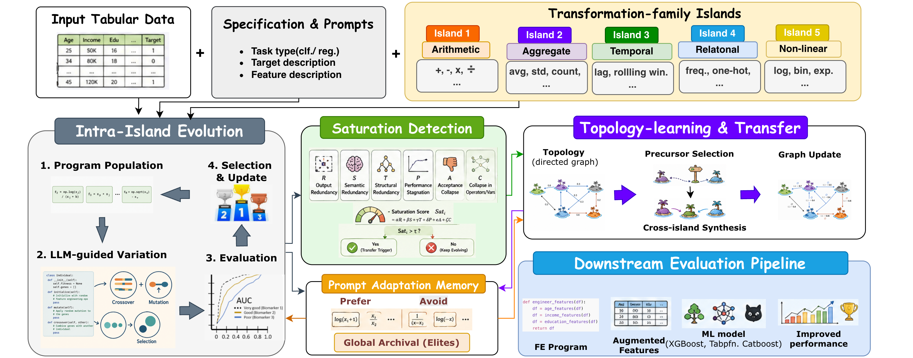
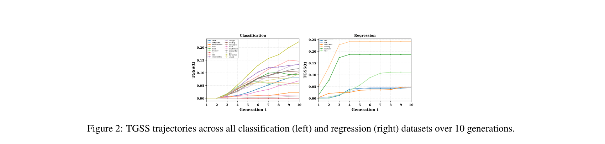
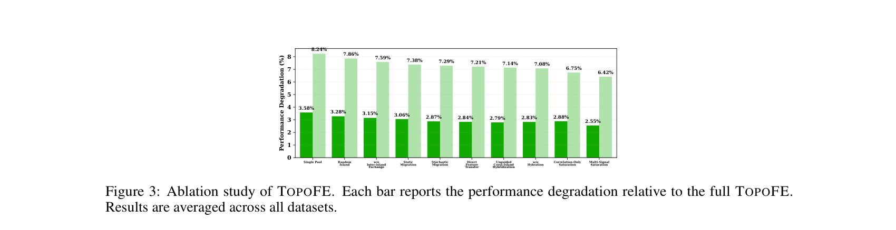

# TopoFE: Topology-Aware LLM-Guided Automated Feature Engineering

## Abstract

- **Bản chất và thách thức của Automatic Feature Engineering (AutoFE - Kỹ thuật tạo đặc trưng tự động) cho dữ liệu dạng bảng (tabular data)**:
  - AutoFE đòi hỏi việc khám phá các phép biến đổi hữu ích (informative transformations) từ một không gian chương trình (program space) không đồng nhất và có độ phức tạp tổ hợp cực lớn (combinatorially large and heterogeneous).
- **Ba giới hạn cốt lõi của các phương pháp AutoFE hiện nay**:
  - *Phương pháp cổ điển (classical methods)*: Phụ thuộc vào các thư viện toán tử cố định (fixed operator libraries) với khả năng biểu đạt hạn chế (limited expressivity).
  - *Phương pháp dựa trên LLM (LLM-based methods)*: Sinh các đề xuất (proposals) từ các prompt tĩnh (static prompts) mà không lưu giữ kinh nghiệm tìm kiếm trước đó (prior search experience).
  - *Phương pháp tiến hóa (evolutionary methods)*: Sử dụng các chính sách di cư cố định (fixed migration policies), bỏ qua tính hữu dụng chuyển giao liên họ (cross-family transfer utility) đặc thù của từng tác vụ.
- **Đề xuất khung làm việc TOPOFE (Topology-guided Feature Engineering)**:
  - TOPOFE mô hình hóa AutoFE dưới dạng tìm kiếm chương trình tiến hóa đa đảo có cấu trúc đồ thị (graph-structured multi-island evolutionary program search).
- **Cơ chế khám phá cục bộ cấp đảo (island-level exploration)**:
  - Không gian biến đổi được phân hoạch thành các họ nhất quán về mặt ngữ nghĩa (semantically coherent families), trong đó mỗi họ được khám phá bởi một đảo chuyên trách thông qua đột biến (mutation) và lai ghép (crossover) được dẫn dắt bởi LLM (LLM-guided).
  - Mỗi đảo duy trì một bộ nhớ thích ứng prompt (Prompt Adaptation Memory) nhằm tích lũy phản hồi chấp nhận/loại bỏ (accept/reject feedback) để định hướng các đề xuất tương lai tiến vào các vùng hiệu quả của không gian tìm kiếm mà không cần cập nhật tham số mô hình (without parameter updates).
- **Cơ chế điều phối thăm dò toàn cục qua đồ thị tô-pô động (directed topology graph)**:
  - TOPOFE học động một đồ thị tô-pô có hướng (directed topology graph) với trọng số cạnh mã hóa độ hữu dụng chuyển giao thực nghiệm (empirical transfer utility) giữa các họ biến đổi.
  - Quá trình chuyển giao liên đảo (cross-island transfer) được kích hoạt bởi cơ chế phát hiện bão hòa thích ứng (adaptive saturation detection) và thực hiện qua quá trình tổng hợp lai do LLM làm trung gian (LLM-mediated hybrid synthesis).
  - Cơ chế này cho phép phát hiện các chương trình đặc trưng có tính kết hợp tổ hợp (compositional feature programs) mà quá trình tìm kiếm cục bộ cô lập không thể tạo ra được.
- **Kết quả thực nghiệm và tính chất của đặc trưng tìm được**:
  - Thực nghiệm trên $29$ bộ dữ liệu dạng bảng (tabular datasets) chứng minh TOPOFE vượt trội nhất quán so với phần lớn các phương pháp AutoFE tiên tiến nhất (state-of-the-art / SOTA) trên cả tác vụ phân loại (classification) và hồi quy (regression).
  - TOPOFE tạo ra các tập đặc trưng có độ dư thừa thấp hơn (lower redundancy) và độ bao phủ biểu diễn cao hơn (higher representational coverage).
  - Đồ thị tô-pô học được phản ánh cấu trúc chuyển giao đặc thù tác vụ có ý nghĩa và tương quan thuận với hiệu năng hạ nguồn (downstream gains).
  - Các chương trình đặc trưng phát hiện được chuyển giao tin cậy qua nhiều bộ dự đoán hạ nguồn (downstream predictors) và các mô hình nền tảng LLM (LLM backbones) đa dạng, khẳng định sự cải thiện bắt nguồn từ cơ chế tìm kiếm có cấu trúc và điều phối thích ứng của TOPOFE thay vì năng lực sinh đặc thù của backbone.

## 1 Introduction

- **Bản chất và vị trí trọng yếu của Feature Engineering (FE - Kỹ thuật đặc trưng) trong pipeline học máy dạng bảng (tabular machine learning)**:
  - Feature engineering là quá trình biến đổi các biến thô (raw variables) thành các biểu diễn có khả năng dự đoán (predictive representations) nhằm bộc lộ cấu trúc tiềm ẩn (latent structure) của bài toán học máy [Dong and Liu, 2018].
  - FE là một trong những giai đoạn mang tính quyết định nhất nhưng lại ít có tính nguyên lý nhất (least principled) trong toàn bộ quy trình tabular ML pipeline.
  - Trong môi trường dữ liệu dạng bảng (tabular settings), nơi dữ liệu mang tính dị thể (heterogeneous), giàu ngữ nghĩa (semantically rich) và thường chứa đựng cấu trúc đặc thù theo miền (domain-specific structure), chất lượng của các feature được tạo ra thường quyết định hiệu năng mô hình nhiều hơn cả việc lựa chọn kiến trúc (architectural choices) hay tinh chỉnh siêu tham số (hyperparameter tuning) [Zhang et al., 2023a, Hollmann et al., 2023a].

- **Nhu cầu về tri thức ngữ nghĩa và giới hạn căn bản của các hệ thống AutoFE truyền thống (early AutoFE systems)**:
  - Việc xây dựng các đặc trưng có giá trị cao đòi hỏi nhiều hơn là việc liệt kê cú pháp đơn thuần (syntactic enumeration): các ví dụ điển hình như tỷ lệ rủi ro có ý nghĩa lâm sàng (clinically meaningful risk ratio), chỉ số biến động tài chính (financial volatility indicator), hoặc đặc trưng tần suất hành vi (behavioral frequency feature) đều đòi hỏi sự thấu hiểu sâu sắc về ý nghĩa biến số, cách các biến tương tác nhân quả (causally interact), và các phép biến đổi nào là hợp lệ về mặt ngữ nghĩa (semantically admissible).
  - Tri thức ngữ nghĩa (semantic knowledge) này nằm ngoài khả năng mã hóa của các thư viện toán tử cố định (fixed operator libraries).
  - Các hệ thống tạo đặc trưng tự động ban đầu (early automated feature engineering - AutoFE) đóng khung bài toán thành việc tìm kiếm trên một ngữ pháp biến đổi tiền định (predefined transformation grammar) [Olson and Moore, 2016, Horn et al., 2019, Zhang et al., 2023a].
  - Dù khả thi về mặt tính toán (tractable), công thức này bị giới hạn căn bản bởi năng lực biểu đạt của thư viện toán tử: các đặc trưng đòi hỏi suy luận ngữ nghĩa liên biến (cross-variable semantic reasoning) nằm ngoài không gian có thể tiếp cận được (reachable space) ngay từ khâu thiết kế.

- **Bước chuyển dịch mô thức từ LLM và khiếm khuyết cấu trúc của các phương pháp AutoFE dựa trên LLM hiện có**:
  - Sự xuất hiện của các mô hình ngôn ngữ lớn (LLMs - Large Language Models), nhờ được tiền huấn luyện trên các kho ngữ liệu khổng lồ (massive corpora) về văn bản khoa học, toán học và chuyên ngành, mang lại năng lực suy đoán (hypothesize) các phép biến đổi có ý nghĩa từ tên cột (column names), mô tả bài toán (task descriptions) và tri thức nền tảng (background knowledge).
  - Năng lực này chuyển dịch căn bản mô thức nghiên cứu từ lựa chọn toán tử cố định (fixed operator selection) sang tổng hợp chương trình đặc trưng kết thúc mở (open-ended feature program synthesis) [Hollmann et al., 2023a, Han et al., 2024].
  - Tuy nhiên, các phương pháp dựa trên LLM hiện tại mắc phải một khiếm khuyết cấu trúc nghiêm trọng: các đề xuất (proposals) được sinh ra từ các prompt tĩnh (static prompts) và không lưu giữ bộ nhớ về các đánh giá trước đó (no memory of prior evaluations), dẫn đến việc sinh lặp lại đề xuất (repeated proposals), không thích ứng được với các mẫu hình đặc thù của tập dữ liệu (dataset-specific patterns), và thiếu cơ chế tổng hợp các đặc trưng đòi hỏi toán tử từ nhiều họ biến đổi đồng thời (multiple transformation families simultaneously).

- **Hạn chế của tìm kiếm tiến hóa kết hợp LLM và hiện tượng khóa chéo họ (Cross-Family Lock-in)**:
  - Các nỗ lực gần đây kết hợp LLM với tìm kiếm tiến hóa (evolutionary search) nhằm giảm bớt hạn chế trên bằng cách duy trì vùng đệm kinh nghiệm (experience buffer) chứa các chương trình đạt điểm cao làm ví dụ mẫu trong ngữ cảnh (in-context demonstrations) [Abhyankar et al., 2025, Gong et al., 2025].
  - Tuy vậy, các phương pháp này vẫn vận hành trên một quần thể đơn nhất không phân hóa (single undifferentiated population).
  - Không gian chương trình đặc trưng không hề đồng nhất (not homogeneous), mà cấu thành từ các họ biến đổi (transformation families) khác biệt về chất:
    - Tương tác số học (arithmetic interactions)
    - Tổng hợp thống kê (statistical aggregates)
    - Động học thời gian (temporal dynamics)
    - Mã hóa quan hệ (relational encodings)
    - Ánh xạ phi tuyến đơn biến (nonlinear univariate maps)
    - Mỗi họ mã hóa một thiên kiến quy nạp (inductive bias) khác nhau về cách thức tín hiệu dự đoán phát sinh.
  - Tìm kiếm quần thể đơn nhất bỏ qua cấu trúc này: khi một vài chương trình thành công từ một họ chiếm ưu thế làm bão hòa experience buffer, các đề xuất tiếp theo của LLM dần dần bị giam cầm (progressively confined) vào họ đó.
  - Hậu quả là các họ trực giao (orthogonal families) không được khám phá đầy đủ, và các kết hợp chéo họ (cross-family compositions) – vốn thường mang lại các đặc trưng có tính biểu đạt và bổ trợ mạnh nhất – trở nên không thể tiếp cận được về mặt cấu trúc (structurally unreachable).
  - Hiện tượng khóa chéo họ (cross-family lock-in) là phương thức thất bại trung tâm (central failure mode) của các phương pháp LLM-tiến hóa hiện hành, và chưa có nghiên cứu nào cung cấp cơ chế có nguyên lý để phát hiện hoặc khắc phục lỗi này.

- **Ba giới hạn dai dẳng mang tính liên đới trong y văn hiện tại (L1 - L3)**:
  - **(L1) Động học tìm kiếm đồng nhất (Homogeneous search dynamics)**: Tiến hóa quần thể đơn nhất bị suy thoái/thu hẹp vào một tập con hẹp các kiểu biến đổi, thiên lệch về các motif đạt hiệu năng cao ban đầu và mù quáng trước cấu trúc đa phương thức (multi-modal structure) của không gian chương trình.
  - **(L2) Truy vấn LLM không trạng thái (Stateless LLM querying)**: Quá trình sinh đặc trưng thiếu bộ nhớ bền vững (persistent memory) về lịch sử khám phá trước đó, cản trở sự thích ứng tích lũy (cumulative adaptation) theo các mẫu hình của từng tập dữ liệu cụ thể.
  - **(L3) Cấu trúc chuyển giao cứng nhắc (Rigid transfer structure)**: Khi sử dụng nhiều quần thể (multiple populations/islands), cơ chế di cư (migration) diễn ra theo chu kỳ cố định hoặc ngẫu nhiên, hoàn toàn không nhận biết được thời điểm chuyển giao có lợi và họ nguồn nào bổ trợ tốt nhất cho một đảo đích đang bị đình trệ (stagnating target island).

- **Khung phương pháp TOPOFE và ba nguyên lý trụ cột**:
  - TOPOFE mô hình hóa AutoFE thành bài toán tìm kiếm chương trình lấy cảm hứng từ tiến hóa đa đảo có cấu trúc đồ thị (graph-structured multi-island evolution).
  - **Nguyên lý 1 - Phân rã thiên kiến quy nạp (Inductive bias decomposition)**: Không gian chương trình được phân hoạch thành các họ biến đổi (transformation families) khác nhau; mỗi họ được gán cho một đảo chuyên biệt (dedicated island) nhằm tiến hóa các chương trình chuyên biệt dưới các prior của họ đó, bảo toàn tính đa dạng giữa các kiểu biến đổi ngay từ thiết kế.
  - **Nguyên lý 2 - Học tô-pô thích ứng (Adaptive topology learning)**: Thay vì sử dụng lịch trình di cư cố định hoặc heuristic, TOPOFE duy trì một đồ thị có hướng có trọng số (directed weighted graph) trên các đảo, trong đó trọng số cạnh được cập nhật trực tuyến (online) từ mức cải thiện chuyển giao chéo họ quan sát được thực tế, qua đó học một mô hình định hướng dữ liệu (data-driven model) về tính bổ trợ liên họ (inter-family complementarity).
  - **Nguyên lý 3 - Chuyển giao ngữ nghĩa qua tổng hợp LLM (Semantic transfer via LLM synthesis)**: Việc chuyển giao tri thức liên đảo không thực hiện bằng việc sao chép chương trình nguyên bản (copying programs), mà thông qua tổng hợp lai do LLM điều phối (LLM-mediated hybrid synthesis), trong đó các chương trình từ đảo nguồn và đảo đích được cùng đưa vào ngữ cảnh để LLM sinh ra một chương trình mới về mặt cấu tạo (compositionally novel program) kế thừa các yếu tố cấu trúc từ cả hai họ.

- **Cơ chế điều phối tìm kiếm và bộ nhớ thích ứng của TOPOFE**:
  - **Tiêu chí bão hòa (Saturation criterion)**: Chuyển giao chéo họ được kích hoạt bởi tiêu chí bão hòa dựa trên ước lượng cửa sổ trượt (sliding-window estimate) về mức cải thiện biên (marginal improvement) của từng đảo nhằm phát hiện chính xác thời điểm tìm kiếm cục bộ đã thực sự cạn kiệt vùng hiệu quả.
  - Cơ chế này tách biệt việc chuyển giao khỏi số lượt sinh theo thời gian (wall-clock generation count), đảm bảo ngân sách đánh giá (evaluation budget) được chuyển hướng sang khám phá chéo họ đúng vào thời điểm có giá trị nhất.
  - **Bộ nhớ thích ứng Prompt (Prompt Adaptation Memory)**: Duy trì lịch sử chấp nhận/bác bỏ (accept/reject history) cho từng đảo kèm theo bản tóm tắt ngắn gọn bằng ngôn ngữ tự nhiên về các mẫu hình biến đổi ưa chuộng và cần tránh, được đưa vào mỗi lần gọi LLM.
  - Cơ chế bộ nhớ này cho phép thích ứng tích lũy theo từng tập dữ liệu cụ thể trong suốt quá trình tìm kiếm mà không yêu cầu cập nhật tham số mô hình (without parameter update).

- **Tóm tắt bốn đóng góp chính của nghiên cứu (Key Contributions)**:
  - **(i) Định thức nhận biết tô-pô (Topology-aware formulation)**: Mô hình hóa AutoFE dưới dạng tìm kiếm chương trình đa đảo cấu trúc đồ thị, phân hoạch không gian đặc trưng thành các đảo chuyên môn hóa theo họ và thay thế cơ chế di cư heuristic bằng đồ thị tô-pô có hướng được học với trọng số cạnh mã hóa độ hữu dụng chuyển giao chéo họ (cross-family transfer utility) quan sát được thực nghiệm, cập nhật trực tuyến qua quy tắc kiểu bandit (bandit-style rule).
  - **(ii) Chuyển giao thích ứng kích hoạt theo độ bão hòa (Saturation-triggered adaptive transfer)**: Đề xuất tiêu chí bão hòa dựa trên độ hữu dụng để kích hoạt chuyển giao liên đảo khi tìm kiếm cục bộ cạn kiệt, kết hợp cùng Prompt Adaptation Memory tích lũy mẫu chương trình được chấp nhận và loại bỏ nhằm thích ứng tích lũy đặc thù theo tập dữ liệu mà không cần cập nhật tham số.
  - **(iii) Khung đánh giá có nguyên lý (Principled evaluation framework)**: Giới thiệu $3$ thước đo được thiết kế chuyên biệt:
    - Tương quan đầu ra theo cặp trung bình (Mean Pairwise Output Correlation) và Hạng hiệu dụng (Effective Rank): Cùng nhau định tính và định lượng độ dư thừa đặc trưng (feature redundancy) và độ bao phủ không gian con biểu diễn (subspace coverage).
    - Điểm chuyên biệt hóa đồ thị tô-pô (Topology Graph Specialisation Score): Định lượng mức độ mà đồ thị tô-pô tiếp thu tri thức chuyển giao chéo họ đặc thù cho từng tác vụ trong suốt quá trình tìm kiếm.
  - **(iv) Kiểm chứng thực nghiệm toàn diện (Empirical validation)**: Trên $29$ tập dữ liệu, chứng minh TOPOFE vượt trội nhất quán so với đa số các baseline AutoFE cổ điển và dựa trên LLM, sản sinh các tập đặc trưng có độ dư thừa thấp hơn và độ bao phủ cao hơn, đồng thời duy trì hiệu năng ổn định trên nhiều mô hình dự đoán hạ nguồn (downstream predictors) và các LLM backbone có năng lực khác nhau.

## 2 Preliminary

### 2.1 Feature Engineering (FE)
- **Định nghĩa tập dữ liệu bảng và siêu dữ liệu cấu trúc**: Tập dữ liệu dạng bảng (tabular dataset) được biểu diễn dưới dạng $\mathcal{D} = \{(\mathbf{x}_i, y_i)\}_{i=1}^N$ gồm $N$ thực thể (instances), vector đặc trưng $d$-chiều $\mathbf{x}_i \in \mathcal{X} \subseteq \mathbb{R}^d$ và biến mục tiêu $y_i \in \mathcal{Y}$.
  - Mỗi tập dữ liệu đi kèm với siêu dữ liệu có cấu trúc (structured metadata) $\mathcal{M} = \{\mathcal{M}_{\text{task}}, \mathcal{M}_{\text{feat}}\}$, mã hóa loại tác vụ (task type) và các mô tả ngữ nghĩa cho từng đặc trưng (per-feature semantic descriptors).
- **Mô hình hạ nguồn tối ưu thông qua tối thiểu hóa rủi ro thực nghiệm**: Với một phép biến đổi đặc trưng (feature transformation) $\mathcal{T} : \mathcal{X} \to \tilde{\mathcal{X}}$, gọi $\mathcal{F}$ là lớp các mô hình dự đoán hạ nguồn (downstream predictive models) và $\mathcal{L}$ là hàm mất mát (loss function) tương ứng với tác vụ, mô hình hạ nguồn tối ưu $f^*_{\mathcal{T}}$ trên tập phân chia huấn luyện $\{\mathbf{X}_{\text{tr}}, \mathbf{y}_{\text{tr}}\}$ được xác định bằng tối thiểu hóa rủi ro thực nghiệm (empirical risk minimization - ERM):
  $$f^*_{\mathcal{T}} = \arg \min_{f \in \mathcal{F}} \mathcal{L}(f(\mathcal{T}(\mathbf{X}_{\text{tr}})), \mathbf{y}_{\text{tr}}) \tag{1}$$
- **Mục tiêu của kỹ thuật đặc trưng (Feature Engineering Objective)**: Mục tiêu của FE là tìm phép biến đổi tối ưu $\mathcal{T}^*$ nhằm cực đại hóa hiệu năng khái quát hóa (generalization performance) trên tập dữ liệu kiểm định giữ lại (held-out data):
  $$\mathcal{T}^* = \arg \max_{\mathcal{T}} \mathbb{E}\left[\text{Perf}(f^*_{\mathcal{T}}, \mathcal{T}(\mathbf{X}_{\text{val}}), \mathbf{y}_{\text{val}})\right] \tag{2}$$
  trong đó $\text{Perf}$ là thước đo hiệu năng phù hợp với tác vụ (ví dụ: accuracy).
- **Bản chất tối ưu hóa hai cấp (Bilevel Optimization) và thách thức tìm kiếm**:
  - Quá trình này cấu thành một bài toán tối ưu hóa hai cấp: bài toán cấp trong (inner problem) tối ưu hóa trọng số mô hình dưới một phép biến đổi cố định, trong khi bài toán cấp ngoài (outer problem) tìm kiếm chính phép biến đổi đó.
  - Mục tiêu cấp ngoài không khả vi (non-differentiable) đối với $\mathcal{T}$ và mỗi lượt đánh giá đều đòi hỏi phải huấn luyện lại mô hình $f$ từ đầu (re-fitting from scratch).
  - Do đó, các chiến lược tìm kiếm hiệu quả về số lượng mẫu (sample-efficient search strategies) đóng vai trò then chốt.

### 2.2 AutoFE as LLM-guided Program Search
- **Hiện thực hóa không gian biến đổi thành không gian chương trình đặc trưng khả thi**: Không gian biến đổi $\mathcal{T}$ được cụ thể hóa thành không gian các chương trình đặc trưng có thể thực thi (executable feature programs) trên một thư viện toán tử có định kiểu hữu hạn (finite typed operator library) $\mathcal{O} = \{o_q\}_{q=1}^Q$.
  - Mỗi toán tử $o_q$ có số lượng toán hạng (arity) và chữ ký kiểu (type signature) được chỉ định cụ thể (ví dụ: $+$, $-$, $\times$, $\div$, $\log$, $\exp$).
- **Định nghĩa không gian chương trình đặc trưng $\mathcal{P}$**: Một chương trình đặc trưng $p \in \mathcal{P}$ là một hàm bất kỳ $p : \mathcal{X} \to \mathbb{R}$ được tạo thành bằng cách hợp thành (composing) các toán tử từ $\mathcal{O}$ với độ sâu bị chặn $L_{\max}$:
  $$\mathcal{P} := \left\{ p \mid p = o^{(L)} \circ \dots \circ o^{(1)}, \; o^{(\ell)} \in \mathcal{O}, \; L \le L_{\max} \right\} \tag{3}$$
  - Mỗi chương trình $p \in \mathcal{P}$ được biểu diễn dưới dạng một hàm Python có thể thực thi (executable Python function).
- **Ma trận thiết kế biến đổi và mô hình hạ nguồn tương ứng**: Một tập hợp đặc trưng $S \subseteq \mathcal{P}$ cảm sinh một ma trận thiết kế biến đổi (transformed design matrix):
  $$\mathcal{T}_S(\mathbf{X}) = [p(\mathbf{X})]_{p \in S} \in \mathbb{R}^{N \times |S|} \tag{4}$$
  trong đó mỗi cột tương ứng với đầu ra của một chương trình đặc trưng.
  - Mô hình hạ nguồn tối ưu tương ứng $f^*_S$ là:
    $$f^*_S = \arg \min_{f \in \mathcal{F}} \mathcal{L}(f(\mathcal{T}_S(\mathbf{X}_{\text{tr}})), \mathbf{y}_{\text{tr}})$$
- **Công thức hóa AutoFE thành bài toán tìm kiếm chương trình tổ hợp (Combinatorial Program Search)**:
  $$S^* = \arg \max_{S \subseteq \mathcal{P}} \mathbb{E}\left[\text{Perf}(f^*_S, \mathcal{T}_S(\mathbf{X}_{\text{val}}), \mathbf{y}_{\text{val}})\right] \tag{5}$$
- **Độ phức tạp và tính bất khả thi khi duyệt vét cạn**:
  - Không gian tìm kiếm không thể duyệt vét cạn (intractable by enumeration) vì kích thước $|\mathcal{P}|$ tăng trưởng theo cấp siêu hàm mũ (super-exponentially) theo độ sâu $L_{\max}$.
  - Mục tiêu không khả vi (non-differentiable) đối với cấu trúc rời rạc của chương trình.
  - Mỗi lượt đánh giá gánh chịu chi phí tính toán $\mathcal{O}(k_{\text{cv}} \cdot C_{\text{fit}}(N, |S|))$ dưới quy trình kiểm định chéo $k_{\text{cv}}$-fold ($k_{\text{cv}}$-fold cross-validation), với $C_{\text{fit}}(N, |S|)$ biểu diễn chi phí huấn luyện trên $N$ mẫu dữ liệu và $|S|$ đặc trưng được tạo ra.
- **Tín hiệu độ thích nghi (Fitness Signal)**: Tín hiệu đánh giá độ thích nghi $\hat{\Phi}(S)$ được ước lượng thông qua kiểm định chéo $k_{\text{cv}}$-fold:
  $$\hat{\Phi}(S) = \frac{1}{k_{\text{cv}}} \sum_{k=1}^{k_{\text{cv}}} \text{Perf}\left(f^*_{S,k}, \mathcal{T}_S(\mathbf{X}_{\text{val}}^k), \mathbf{y}_{\text{val}}^k\right) \tag{6}$$
  trong đó $f^*_{S,k}$ được huấn luyện trên fold huấn luyện thứ $k$ và đánh giá trên fold kiểm định giữ lại tương ứng $\mathbf{X}_{\text{val}}^k, \mathbf{y}_{\text{val}}^k$.
- **Vai trò của siêu dữ liệu $\mathcal{M}$ đối với tổng hợp có LLM định hướng**:
  - Siêu dữ liệu $\mathcal{M}$ giới hạn không gian $\mathcal{P}$ trong phạm vi các chương trình hợp lệ về mặt ngữ nghĩa (semantically valid programs).
  - Cung cấp tiên nghiệm ngôn ngữ tự nhiên (natural-language prior) được khai thác trực tiếp bởi quá trình tổng hợp có LLM định hướng (LLM-guided synthesis).

## 3 TOPOFE

- **Thách thức tìm kiếm chương trình tổ hợp (Combinatorial Program Search)**:
  - Dựa trên các tiền đề được thiết lập tại § 2.2, không gian tìm kiếm chương trình tổ hợp $\mathcal{P}$ là bất khả thi đối với các phương pháp duyệt vét cạn (enumeration) và không thể tiếp cận bằng các phương pháp dựa trên đạo hàm/gradient (gradient-based methods).
  - Quá trình này đòi hỏi một cơ chế đề xuất được dẫn đường bởi mô hình ngôn ngữ lớn (LLM-guided proposal mechanism) thỏa mãn đồng thời ba điều kiện cốt lõi:
    1. *Sinh chương trình hợp lệ và có ý nghĩa ngữ nghĩa*: Khả năng tạo ra các chương trình biến đổi hợp lệ về mặt cú pháp và có ý nghĩa về mặt ngữ nghĩa trên không gian toán tử không đồng nhất (heterogeneous operator space) mà không cần vét cạn toàn bộ không gian.
    2. *Khai thác tri thức miền đặc thù*: Tận dụng tri thức miền trong siêu dữ liệu $\mathcal{M}$ (task-specific domain knowledge) để tạo thiên kiến tìm kiếm hướng tới các biến đổi khả thi và đầy triển vọng (promising and admissible transformations).
    3. *Hỗ trợ đa dạng chế độ đề xuất qua giao diện thống nhất*: Cung cấp một giao diện hợp nhất hỗ trợ nhiều chế độ đề xuất khác nhau, cho phép song hành giữa việc khai thác sâu (exploitation) các chương trình chất lượng cao đã biết và thăm dò mở rộng (exploration) các vùng không gian chưa được khám phá trong $\mathcal{P}$.
- **Kiến trúc tổng thể TOPOFE (Topology-Aware Program Optimization for Feature Engineering)**:
  - TOPOFE tổ chức quy trình tìm kiếm chương trình cho AutoFE dưới sự dẫn dắt của LLM thông qua ba thành phần phối hợp chặt chẽ:
    1. *Phân rã đa đảo (Multi-island decomposition)* (§3.1): Phân chia không gian chương trình $\mathcal{P}$ thành $M$ họ biến đổi mạch lạc về ngữ nghĩa (semantically coherent transformation families), mỗi họ được khám phá bởi một đảo chuyên trách nhằm ngăn chặn hiện tượng hội tụ sớm vào một họ duy nhất (premature convergence).
    2. *Bộ nhớ thích ứng Prompt (Prompt Adaptation Memory)* (§3.2): Duy trì trạng thái tìm kiếm cục bộ cho từng đảo để liên tục điều chỉnh các prompt đề xuất của LLM dựa trên lịch sử chấp nhận/từ chối (accept/reject history) đã tích lũy mà không cần cập nhật bất kỳ trọng số tham số nào.
    3. *Cơ chế chuyển giao liên đảo nhận biết cấu trúc liên kết (Topology-aware cross-island transfer)* (§3.3): Điều phối luồng tri thức giữa các đảo thông qua một đồ thị có hướng được học (learned directed graph), kích hoạt quá trình tổng hợp lai (hybrid synthesis) từ các họ bổ trợ khi tìm kiếm cục bộ chạm ngưỡng bão hòa.
  - Sự kết hợp của ba thành phần này thiết lập trạng thái cân bằng giữa khai thác chuyên sâu trong từng họ biến đổi và thăm dò có cấu trúc trên toàn bộ không gian biến đổi; toàn bộ quy trình được khái quát trong Hình 1 và tóm tắt chi tiết trong Thuật toán 1 (Algorithm 1).
  - **Hình 1.** Tổng quan kiến trúc hệ thống TOPOFE (Overview of TOPOFE).
    - 
    - **Hình này chứng minh điều gì**
      - TOPOFE phân rã không gian AutoFE thành các đảo họ biến đổi, kết hợp tiến hóa cục bộ dẫn dắt bởi LLM, phát hiện bão hòa thích ứng, tổng hợp liên đảo dựa trên cấu trúc liên kết và chọn lọc lưu trữ để nâng cao hiệu năng dự đoán tabular.
    - **Từ đâu mà thấy được**
      - Sơ đồ tương tác liên hoàn: Dữ liệu bảng + Prompts phân chia vào 5 đảo (Arithmetic, Aggregate, Temporal, Relational, Non-linear); vòng lặp Intra-Island Evolution (Population, LLM Variation, Eval, Selection); khối Saturation Detection với điểm $Sat_i$; khối Prompt Adaptation Memory (Prefer/Avoid, Global Archival); và khối Topology-learning & Transfer kết nối đường ống Downstream Evaluation (XGBoost, TabPFN, CatBoost).

### 3.1 Intra-island Evolution

#### 3.1.1 Multi-island Decomposition

- Không gian chương trình đặc trưng $\mathcal{P}$ (feature program space) mang tính không đồng nhất (heterogeneous):
  - Các chương trình tự nhiên gom cụm thành các vùng mạch lạc về ngữ nghĩa tùy theo lớp toán tử được sử dụng, trong đó mỗi vùng mã hóa một thiên kiến quy nạp (inductive bias) riêng biệt về cách xây dựng tín hiệu dự đoán từ các đặc trưng thô.
- **Định nghĩa 1 (Họ biến đổi - Transformation Family)**: Họ biến đổi $\mathcal{P}_i \subseteq \mathcal{P}$ là tập con mạch lạc về mặt ngữ nghĩa gồm các chương trình đặc trưng cùng chia sẻ thiên kiến quy nạp về cách kiến tạo tín hiệu dự đoán từ đặc trưng thô, tức các chương trình áp dụng cùng một lớp phép toán nguyên thủy (primitive operations).
- Hệ thống xem xét 5 họ biến đổi kinh điển (canonical transformation families):
  - Tương tác số học (arithmetic interactions) $\mathcal{P}_1$: tích, tỉ số và hiệu (products, ratios, differences).
  - Tổng hợp thống kê (statistical aggregates) $\mathcal{P}_2$: trung bình theo nhóm, độ lệch chuẩn, số đếm và trung vị (group-level means, standard deviations, counts, medians).
  - Đặc trưng thời gian (temporal features) $\mathcal{P}_3$: độ trễ (lags), cửa sổ trượt (rolling windows) và trung bình động lũy thừa (exponential moving averages).
  - Mã hóa quan hệ (relational encodings) $\mathcal{P}_4$: đếm tần suất (frequency counts), mã hóa mục tiêu (target encodings) và biến đổi dựa trên thứ hạng (rank-based transforms).
  - Ánh xạ đơn biến phi tuyến (nonlinear univariate maps) $\mathcal{P}_5$: biến đổi logarit, hàm mũ, chia khoảng (binned) và đa thức (polynomial transformations).
- Các họ biến đổi tạo nên một phủ xấp xỉ (approximate cover) cho không gian tìm kiếm:
  - Các họ biến đổi có thể chồng lấn (tổng quát là $\mathcal{P}_i \cap \mathcal{P}_j \neq \emptyset$), song mỗi họ đại diện cho một vùng cấu trúc riêng biệt của $\mathcal{P}$.
  - Phân vùng có khả năng mở rộng cho các họ biến đổi bổ sung khi cần thiết.
  - Hợp các họ tạo thành một phủ xấp xỉ $\mathcal{P} \approx \bigcup_{i=1}^M \mathcal{P}_i$, phân rã không gian tìm kiếm nguyên khối thành $M$ không gian con được định kiểu ngữ nghĩa (semantically typed subspaces), cho phép áp dụng tìm kiếm chuyên biệt hóa.
- Quần thể tiến hóa đơn lẻ gặp hiện tượng bão hòa và kẹt vùng cục bộ:
  - Trong một quần thể tiến hóa đơn lẻ, các chương trình đạt điểm cao từ một họ thống trị sẽ nhanh chóng làm bão hòa bộ đệm trải nghiệm (experience buffer).
  - Sự bão hòa này giam hãm các đề xuất tiếp theo của LLM vào vùng lân cận của họ thống trị đó, khiến các họ trực giao (orthogonal families) vĩnh viễn không được khám phá.
  - TOPOFE giải quyết thách thức này thông qua phân rã đa đảo có cấu trúc (structured multi-island decomposition), phân bổ một phân quần thể chuyên biệt cho từng $\mathcal{P}_i$, giúp bảo toàn thiên kiến quy nạp riêng của từng họ và ngăn chặn việc một họ đơn lẻ độc chiếm ngân sách tìm kiếm.
- **Định nghĩa 2 (Đảo - Island)**: Đảo thứ $i$ tại thế hệ $t$ là một bộ bốn (tuple) $I_i^{(t)} = (\Pi_i^{(t)}, \mathcal{A}_i, \mathcal{H}_i^{(t)}, \rho_i^{(t)})$:
  - $\Pi_i^{(t)} \subset \mathcal{P}_i$: quần thể hiện tại gồm tối đa $n_{\max}$ chương trình đặc trưng, được xếp hạng theo độ thích nghi $\hat{\Phi}$ (fitness).
  - $\mathcal{A}_i \subset \mathcal{P}_i$: kho lưu trữ dài hạn (long-term archive) lưu giữ các chương trình tinh hoa (elite programs) do đảo $i$ phát hiện.
  - $\mathcal{H}_i^{(t)}$: lịch sử chấp nhận/từ chối (accept/reject history) dùng để điều chỉnh prompt đột biến.
  - $\rho_i^{(t)} \in \mathbb{R}^s$: vector bộ nhớ prompt (prompt-memory vector) mã hóa tín hiệu cô đọng dạng "ưu tiên/tránh" ("prefer/avoid") suy xuất từ $\mathcal{H}_i^{(t)}$.
- Bốn thành phần cùng duy trì toàn bộ trạng thái tìm kiếm của đảo:
  - $\Pi_i^{(t)}$ dẫn dắt quá trình tìm kiếm cục bộ (local search).
  - $\mathcal{A}_i^{(t)}$ tích lũy các phát hiện tốt nhất và đóng vai trò làm tập mẫu minh họa ngữ cảnh (in-context demonstration pool) cho các đề xuất của LLM.
  - $\mathcal{H}_i^{(t)}$ cung cấp tín hiệu thô cho việc thích ứng prompt (prompt adaptation).
  - $\rho_i^{(t)}$ chuyển hóa tín hiệu đó thành chỉ dẫn bằng ngôn ngữ tự nhiên được đưa vào mọi lệnh gọi LLM.

#### 3.1.2 LLM-guided Intra-island Evolution (Specialized Exploration)

- Tiến hóa độc lập trong từng đảo tại mỗi thế hệ $t$:
  - Đảo $i$ tiến hóa quần thể độc lập thông qua 2 toán tử có LLM định hướng (LLM-guided operators), cả hai đều phụ thuộc vào ngữ cảnh siêu dữ liệu $\mathcal{M}$ (metadata context) của đảo và vector bộ nhớ prompt $\rho_i^{(t)}$.
- Hai toán tử tiến hóa định hướng bởi LLM:
  - **Đột biến (Mutation)**: Lấy mẫu một chương trình cha đơn lẻ $p \sim \Pi_i^{(t)}$ với xác suất tỉ lệ thuận với độ thích nghi $\hat{\Phi}(p)$ và prompt LLM sinh ra chương trình biến đổi $p' \in \mathcal{P}_i$ cải thiện so với $p$ đồng thời tuân thủ các tín hiệu mã hóa trong $\rho_i^{(t)}$.
  - **Lai ghép (Crossover)**: Lấy mẫu hai chương trình cha $(p_a, p_b) \sim \Pi_i^{(t)}$ và đưa vào làm mẫu minh họa trong ngữ cảnh (in-context demonstrations); LLM sau đó được prompt để tổng hợp một chương trình con $p' \in \mathcal{P}_i$ kết hợp các yếu tố cấu thành từ cả hai cha mẹ.
- Quy trình kiểm định và đánh giá độ thích nghi thống nhất (unified validation and fitness pipeline):
  - Mỗi ứng viên $p'$ được kiểm tra tính hợp lệ cú pháp (syntactic validity) và tính chấp nhận được về ngữ nghĩa (semantic admissibility) dưới ngữ cảnh $\mathcal{M}$.
  - Ứng viên sau đó được đánh giá qua oracle $\hat{\Phi}$.
  - Quần thể $\Pi_i^{(t+1)}$ giữ lại top-$n_{\max}$ chương trình có độ thích nghi cao nhất.
  - Kho lưu trữ $\mathcal{A}_i^{(t)}$ và vector bộ nhớ $\rho_i^{(t)}$ được cập nhật theo các quy tắc xác định trong §3.2.

#### 3.1.3 Global Objective

- Mục tiêu toàn cục tập hợp tập đặc trưng cuối cùng bằng cách gom các chương trình tinh hoa từ tất cả các đảo:
  $$S^* = \arg \max_{S \subseteq \bigcup_i \mathcal{A}_i} \hat{\Phi}(S), \quad \text{s.t. } |S| \le d'_{\max}, \quad \sum_{i=1}^K |\Pi_i^{(t)}| \le B \quad (7)$$
  trong đó $B$ là ngân sách đánh giá tổng cộng (total evaluation budget).
- Yêu cầu tín hiệu dự đoán không dư thừa (non-redundant predictive signal):
  - Mỗi chương trình được giữ lại trong tập nghiệm $S^*$ đều phải đóng góp tín hiệu dự đoán không dư thừa:
    $$\hat{\Phi}(\{p\} \mid S^* \setminus \{p\}) > 0 \quad \forall p \in S^*$$

### 3.2 Prompt Adaptation Memory

* **Nhu cầu thích ứng trực tuyến (online adaptation) của cơ chế đề xuất:**
  * Mặc dù tri thức tiền huấn luyện (pretrained knowledge) của mô hình ngôn ngữ lớn (LLM) cung cấp một tiên nghiệm (prior) mạnh mẽ cho các chương trình đặc trưng (feature programs), việc tìm kiếm hiệu quả đòi hỏi cơ chế đề xuất phải thích ứng trực tuyến với không gian tìm kiếm (landscape) đang biến chuyển của từng đảo (island).
  * Nếu không có sự thích ứng, LLM sẽ liên tục đề xuất các chương trình ở những vùng không gian đã được xác định là không hiệu quả, gây lãng phí ngân sách đánh giá (evaluation budget).
* **Định nghĩa Prompt Adaptation Memory (PAM) (Bộ nhớ thích ứng Prompt):**
  * PAM là một cơ chế nhẹ (lightweight) riêng cho từng đảo, liên tục định hình phân phối đề xuất (proposal distribution) của LLM từ kinh nghiệm tìm kiếm tích lũy mà không cần cập nhật bất kỳ tham số nào (without any parameter update).
  * PAM hoạt động thông qua ba quy tắc cập nhật phối hợp được áp dụng sau mỗi thế hệ (generation): cập nhật bộ nhớ prompt (prompt-memory update), cập nhật kho lưu trữ tinh hoa (elite archive update), và điều kiện hóa đề xuất (proposal conditioning).

#### 3.2.1 Prompt-memory Update

* **Phân loại tín hiệu ưu tiên và cần tránh từ cửa sổ lịch sử trượt:**
  * Ký hiệu $\mathcal{H}_i^+(t)$ và $\mathcal{H}_i^-(t)$ lần lượt là tập con các chương trình được chấp nhận (accepted) và bị từ chối (rejected) trong cửa sổ lịch sử trượt (sliding history window) $[t - W, t]$.
  * Các loại toán tử (operator types) tập trung nhiều trong các chương trình được chấp nhận sẽ được củng cố làm tín hiệu ưu tiên (*prefer signals*).
  * Các loại toán tử tập trung nhiều trong các chương trình bị từ chối sẽ được gắn cờ làm tín hiệu cần tránh (*avoid signals*).
* **Quy tắc cập nhật bộ nhớ prompt:**
  $$\rho_i^{(t+1)} = \text{Summarize}\left(\mathcal{H}_i^+(t), \mathcal{H}_i^-(t), \rho_i^{(t)}\right) \tag{8}$$
  * Trong đó, $\text{Summarize}(\cdot)$ là một lệnh gọi LLM để tạo ra một chuỗi ngôn ngữ tự nhiên cô đọng (ví dụ: *"prefer ratio features with lagged denominators, avoid log transforms of sparse columns"*).
  * Chuỗi ngôn ngữ tự nhiên này được thêm vào đầu (prepended) tất cả các prompt tiếp theo cho đảo $i$.

#### 3.2.2 Elite Archive Update

* **Cập nhật và cắt tỉa kho lưu trữ tinh hoa (Elite Archive Update):**
  * Sau mỗi thế hệ, kho lưu trữ $\mathcal{A}_i^{(t)}$ hợp nhất các chương trình mới được chấp nhận, xếp hạng lại theo $\hat{\Phi}$, và cắt tỉa về dung lượng tối đa $|\mathcal{A}|_{\max}$:
    $$\mathcal{A}_i^{(t+1)} = \text{TopK}\left(\mathcal{A}_i^{(t)} \cup \{p : a_t = 1\}, |\mathcal{A}|_{\max}, \hat{\Phi}\right) \tag{9}$$
* **Kiểm soát tính mới về cấu trúc (structural novelty):**
  * Các ứng viên có khoảng cách chỉnh sửa cây chuẩn hóa (normalized tree-edit distance) tới bất kỳ thành viên hiện có nào trong kho lưu trữ thấp hơn ngưỡng $\delta_{\min}$ sẽ bị loại bỏ trước khi chèn vào, nhằm đảm bảo tính mới về mặt cấu trúc.
* **Vai trò kép của kho lưu trữ:**
  * Kho lưu trữ vừa đóng vai trò là tập hợp mẫu minh họa theo ngữ cảnh (in-context demonstration pool) cho các đề xuất nội đảo (intra-island proposals).
  * Vừa đóng vai trò là nguồn ứng viên cho quá trình tổng hợp liên đảo (cross-island synthesis).

#### 3.2.3 Proposal Conditioning

* **Cơ chế điều kiện hóa ba thành phần (Three-way Proposal Conditioning):**
  * Mọi lệnh gọi LLM cho đảo $i$ tại thế hệ $t$ đều được điều kiện hóa theo:
    $$\text{Context}_i^{(t)} = \left(M, \rho_i^{(t)}, \text{Sample}\left(\mathcal{A}_i^{(t)}, n\right)\right) \tag{10}$$
  * Trong đó, $M$ neo giữ đề xuất vào tri thức miền (domain knowledge).
  * $\rho_i^{(t)}$ định hướng đề xuất bằng các sở thích tìm kiếm tích lũy (accumulated search preferences).
  * $\text{Sample}\left(\mathcal{A}_i^{(t)}, n\right)$ minh họa đề xuất bằng $m$ chương trình đạt điểm cao nhất được phát hiện cho đến nay.
* **Khép kín vòng lặp phản hồi (Feedback loop):**
  * Cơ chế điều kiện hóa ba thành phần này khép kín vòng lặp phản hồi đã giới thiệu: lịch sử định hình bộ nhớ, bộ nhớ định hướng các đề xuất, và các đề xuất được chấp nhận làm giàu thêm cho kho lưu trữ.

### 3.3 Topology-Aware Cross-Island Transfer

* Phân rã đa đảo (multi-island decomposition) ngăn ngừa sự bão hòa nội bộ họ biến đổi (within-family saturation), nhưng không thể tự mình khám phá các đặc trưng đòi hỏi sự kết hợp đồng thời các toán tử từ nhiều họ khác nhau:
  * Ví dụ đặc trưng $\frac{\text{rolling\_mean}(\text{sales}, 7)}{\text{lag}(\text{sales}, 3)}$ kết hợp toán tử chuỗi thời gian ($\mathcal{P}_3$) với toán tử số học ($\mathcal{P}_1$); không một họ đơn lẻ nào có thể tự sinh ra đặc trưng này.
  * Cơ chế chuyển giao tri thức xuyên đảo nhận biết topo (topology-aware cross-island transfer) được đề xuất nhằm phát hiện có hệ thống các tổ hợp liên họ (cross-family compositions) như vậy, xoay quanh ba câu hỏi cốt lõi: khi nào chuyển giao (phát hiện bão hòa), chuyển giao tới đâu / nhận từ đâu (lựa chọn đảo tiền thân), và chuyển giao cái gì (tổng hợp lai chéo đảo).
* Định nghĩa đồ thị topo (Definition 3 - Topology Graph):
  * Đồ thị topo $G(t) = (V, E, W(t))$ là một đồ thị có hướng có trọng số (directed weighted graph).
  * $V$ là tập hợp các đảo ($|V| = M$, tương ứng với $M$ họ biến đổi).
  * $E$ là tập hợp các cạnh chuyển giao có hướng giữa các đảo.
  * Trọng số $w_{j \to i}^{(t)} \in W(t)$ mã hóa độ hữu dụng quan sát được từ thực nghiệm (empirically observed utility) khi chuyển giao tri thức từ đảo $j$ sang đảo $i$ tính đến thế hệ $t$.
* Khởi tạo và cập nhật trọng số cạnh đồ thị topo:
  * Trọng số cạnh được khởi tạo đồng đều:
    $$w_{j \to i}^{(0)} = \frac{1}{M - 1} \quad \forall j \neq i$$
  * Trọng số được cập nhật trực tuyến (online update) sau mỗi sự kiện chuyển giao thông qua trung bình động hàm mũ (exponential moving average - EMA):
    $$w_{j \to i}^{(t+1)} = (1 - \alpha) w_{j \to i}^{(t)} + \alpha \Delta_{\text{cross}}^{(j \to i)}(t)$$
    trong đó $\alpha \in (0, 1)$ là hệ số suy giảm (decay coefficient), và $\Delta_{\text{cross}}^{(j \to i)}(t)$ là mức tăng độ thích nghi quan sát được (observed fitness gain) từ quá trình chuyển giao.
  * Cơ chế cập nhật này biến $G(t)$ thành một mô hình định hướng dữ liệu (data-driven model) liên tục tinh chỉnh sự bổ trợ xuyên họ (cross-family complementarity) trong suốt quá trình tìm kiếm.

#### 3.3.1 When to Transfer: Saturation Detection

* Một đảo được coi là bão hòa (saturated) khi đã cạn kiệt thông tin hữu ích có thể trích xuất dưới họ biến đổi hiện tại, khiến cho việc tìm kiếm cục bộ tiếp theo chỉ đem lại hiệu suất suy giảm dần (diminishing returns).
* Tiêu chuẩn phát hiện bão hòa hình thức (formal saturation criterion):
  * Đảo $i$ bị coi là bão hòa tại thế hệ $t$ nếu mức cải thiện biên kỳ vọng (expected marginal improvement) từ các đề xuất nội đảo rơi xuống dưới ngưỡng $\varepsilon > 0$ trong một cửa sổ trượt gồm $W$ thế hệ liên tiếp:
    $$\frac{1}{W} \sum_{\tau = t - W + 1}^{t} \Delta_i(\tau) \le \varepsilon$$
  * Đại lượng cải thiện biên thế hệ được định nghĩa bởi:
    $$\Delta_i(\tau) = \mathbb{E}[U_i^{\max}(\tau + 1) - U_i^{\max}(\tau)]$$
    trong đó $U_i^{\max}(\tau) = \max_{p \in \Pi_i^{(\tau)}} \hat{\Phi}(p)$ là điểm thích nghi tối đa của quần thể $\Pi_i^{(\tau)}$ tại thế hệ $\tau$.
* Cơ chế phát hiện bão hòa tách rời hoàn toàn quá trình chuyển giao khỏi các lịch trình cố định (fixed schedules), chỉ kích hoạt giao tiếp xuyên đảo khi tìm kiếm cục bộ thực sự rơi vào trạng thái đình trệ (stagnation).

#### 3.3.2 Where to Transfer: Precursor Selection

* Khi đảo $i$ rơi vào trạng thái bão hòa, TOPOFE chọn một đảo tiền thân (precursor island / donor) $j^*$ có tri thức giàu tiềm năng nhất để giải tỏa bế tắc cho đảo $i$:
  $$j^* = \arg\max_{j \neq i} w_{j \to i}^{(t)}$$
  trường hợp hòa điểm (ties) được giải quyết ngẫu nhiên.
* Định tuyến chuyển giao thích ứng:
  * Theo thời gian tiến hóa, đồ thị $G(t)$ xác định các tuyến chuyển giao có độ hữu dụng cao bền vững (persistently high-utility transfer pathways, chẳng hạn: chuỗi thời gian $\to$ số học / temporal $\to$ arithmetic).
  * Việc nhận biết tuyến chuyển giao tối ưu giúp tập trung ngân sách tìm kiếm vào các tổ hợp liên họ mang lại năng suất cao nhất thay vì phân tán tài nguyên ngẫu nhiên.

#### 3.3.3 What to Transfer: Cross-Island Synthesis

* Khi đã xác định được đảo bão hòa $i$ và đảo tiền thân $j^*$, cơ chế tổng hợp chéo đảo (cross-island synthesis) tạo ra các chương trình lai ghép (hybrid programs) trong không gian hợp thành chung:
  $$\mathcal{P}_{i \leftarrow j^*} \subseteq \mathcal{P}_i \cup (\mathcal{P}_i \circ \mathcal{P}_{j^*})$$
  trong đó ký hiệu $\circ$ đại diện cho phép hợp thành ở cấp độ toán tử (operator-level composition).
* Cơ chế kích hoạt LLM (LLM prompting mechanism):
  * LLM nhận đầu vào gồm top-$m$ chương trình từ $\Pi_i^{(t)}$ đóng vai trò ngữ cảnh mục tiêu (target context).
  * top-$m$ chương trình từ $\Pi_{j^*}^{(t)}$ đóng vai trò ngữ cảnh nguồn / tài trợ (donor context).
  * Siêu dữ liệu tác vụ $\mathcal{M}$ (task metadata) mô tả đặc tính bộ dữ liệu và mục tiêu bài toán.
  * LLM sinh ra các chương trình mới tích hợp các thành phần cấu trúc từ $\mathcal{P}_{j^*}$ trong khi vẫn duy trì sự tương thích chặt chẽ với thiên kiến quy nạp (inductive bias) của $\mathcal{P}_i$.
* Bản chất của tổng hợp lai có LLM điều phối (LLM-mediated hybrid synthesis):
  * Khác biệt căn bản so với sao chép chương trình trực tiếp (direct program copying), phương pháp này tạo ra các chương trình nằm ngoài phạm vi có thể tiếp cận được của tìm kiếm nội đảo đơn lẻ.
* Vòng phản hồi cập nhật:
  * Các ứng viên được chấp nhận sẽ được bổ sung vào quần thể $\Pi_i^{(t)}$ và kho lưu trữ tinh hoa $\mathcal{A}_i^{(t)}$.
  * Mức cải thiện độ thích nghi thực tế quan sát được $\Delta_{\text{cross}}^{(j^* \to i)}(t)$ lập tức được dùng để cập nhật trọng số cạnh $w_{j^* \to i}^{(t)}$ theo công thức EMA (Phương trình 11).
  * Vòng phản hồi đảm bảo các quyết định định tuyến chuyển giao trong các thế hệ tiếp theo luôn phản ánh chính xác độ hữu dụng thực nghiệm của từng tuyến liên lạc.

#### 3.3.4 Unified Objective

* Mục tiêu tối ưu hóa hợp nhất của TOPOFE đồng thời cân bằng giữa hiệu năng dự đoán (predictive performance), tính bổ trợ đặc trưng (feature complementarity), độ ổn định (stability), và hiệu quả chi phí tính toán (computational efficiency):
  * Gọi $\mathcal{A} = \bigcup_{i=1}^M \mathcal{A}_i$ là kho lưu trữ ứng viên gộp (pooled candidate archive) thu thập từ tất cả $M$ kho lưu trữ tinh hoa của các đảo.
  * Tập đặc trưng kỹ thuật hóa cuối cùng $S^* \subseteq \mathcal{A}$ được tuyển chọn thông qua cơ chế chọn lọc nhận biết độ dư thừa (redundancy-aware selection) dưới ràng buộc lực lượng $|S^*| \le d'_{\max}$.
* Hàm mục tiêu toàn cục (Global Optimization Objective):
  $$\max_{\{\Pi_i\}, G, S^* \subseteq \mathcal{A}} \mathbb{E}[\text{Perf}(f_{S^*}^*, T_{S^*}(X_{\text{val}}), y_{\text{val}})] - \lambda_1 \text{Redundancy}(S^*) + \lambda_2 \text{Stability}(S^*) - \lambda_3 \text{Cost}(B)$$
  $$\text{s.t.} \quad |S^*| \le d'_{\max}$$
* Diễn giải các thành phần trong hàm mục tiêu:
  * **Hiệu năng dự đoán ($\text{Perf}$)**: Đánh giá khả năng tổng quát hóa hạ nguồn của mô hình dự đoán $f_{S^*}^*$ được huấn luyện trên tập đặc trưng đã biến đổi $T_{S^*}(X_{\text{val}})$.
  * **Hình phạt dư thừa ($\text{Redundancy}(S)$)**: Ngăn chặn các chương trình đặc trưng có tương quan quá cao:
    $$\text{Redundancy}(S) = \frac{1}{|S|(|S| - 1)} \sum_{p \neq p' \in S} |\text{Corr}(p(X), p'(X))|$$
    trong đó $\text{Corr}(\cdot, \cdot)$ biểu thị hệ số tương quan hạng Spearman (Spearman rank correlation) tính trên đầu ra của đặc trưng. Công thức loại trừ tự tương quan và chỉ phạt độ dư thừa theo từng cặp giữa các chương trình đặc trưng phân biệt.
  * **Độ ổn định ($\text{Stability}(S)$)**: Đo lường nghịch đảo phương sai của ước lượng độ thích nghi $\hat{\Phi}(S)$ qua các fold kiểm định chéo (cross-validation folds), khuyến khích các tập đặc trưng duy trì hiệu năng nhất quán trên các phân vùng huấn luyện - kiểm định khác nhau.
  * **Chi phí tính toán ($\text{Cost}(B)$)**: Đại diện cho tổng ngân sách đánh giá oracle tiêu thụ trong suốt quá trình tìm kiếm.
  * **Hệ số điều hòa $\lambda_1, \lambda_2, \lambda_3 \ge 0$**: Kiểm soát sự đánh đổi đa mục tiêu giữa độ chính xác dự đoán, tính đa dạng đặc trưng, độ vững chắc và hiệu quả tài nguyên.
* Cơ chế chọn lọc đặc trưng tham lam sau tìm kiếm (Post-Search Greedy Feature Selection):
  * Sau khi kết thúc quá trình tìm kiếm, tập đặc trưng cuối cùng $S^*$ được kiến tạo bằng cách duyệt tham lam các chương trình điểm cao từ $\mathcal{A}$ theo thứ tự giảm dần của hiệu năng kiểm định.
  * Bất kỳ ứng viên nào có độ tương quan tuyệt đối với một đặc trưng đã được chọn vượt quá ngưỡng định trước $\tau_{\text{red}}$ đều bị loại bỏ, bảo đảm tính bổ trợ tối đa trong tập $S^*$.
* Quy trình thuật toán tổng thể TOPOFE (Algorithm 1 Details):
  * **Đầu vào (Input)**: Bộ dữ liệu $\mathcal{D}$, không gian tác vụ và siêu dữ liệu $\mathcal{M}$, $M$ họ biến đổi $\{\mathcal{P}_i\}_{i=1}^M$, ngân sách đánh giá $B$, kích thước cửa sổ trượt $W$, ngưỡng bão hòa $\varepsilon$, hệ số suy giảm $\alpha$, giới hạn đặc trưng $d'_{\max}$, ngưỡng tương quan $\tau_{\text{red}}$.
  * **Khởi tạo (Initialization)**:
    * Với mỗi đảo $i = 1, \dots, M$: khởi tạo quần thể hạt giống $\Pi_i^{(0)} \leftarrow \text{LLM-Seed}(\mathcal{P}_i, \mathcal{M})$; kho lưu trữ tinh hoa $\mathcal{A}_i^{(0)} \leftarrow \emptyset$; bộ nhớ thích nghi prompt $\rho_i^{(0)} \leftarrow \emptyset$.
    * Khởi tạo ma trận trọng số đồ thị topo $G^{(0)}$ với $w_{j \to i}^{(0)} = \frac{1}{M - 1}$ với mọi $j \neq i$.
    * Đặt chỉ số thế hệ $t \leftarrow 0$, số lượng đánh giá đã dùng $b \leftarrow 0$.
  * **Vòng lặp tiến hóa và chuyển giao (while $b < B$)**:
    1. *Tiến hóa nội đảo song song (Parallel Intra-island Evolution)*:
       * Với mỗi đảo $i = 1, \dots, M$ đồng thời thực hiện:
         * Đề xuất ứng viên thông qua đột biến hoặc lai ghép: $p' \leftarrow \text{LLM-Mutate/Crossover}(\mathcal{A}_i^{(t)}, \mathcal{M}, \rho_i^{(t)})$.
         * Đánh giá độ thích nghi $\hat{\Phi}(p')$; cập nhật ngân sách $b \leftarrow b + 1$.
         * Cập nhật quần thể $\Pi_i^{(t+1)}$, kho lưu trữ $\mathcal{A}_i^{(t+1)}$, lịch sử $\mathcal{H}_i^{(t+1)}$ và bộ nhớ prompt $\rho_i^{(t+1)}$.
    2. *Phát hiện bão hòa và chuyển giao nhận biết topo (Topology-Aware Transfer)*:
       * Với mỗi đảo $i = 1, \dots, M$:
         * Kiểm tra điều kiện bão hòa $\text{Saturated}(i, W, \varepsilon)$ theo cửa sổ trượt $W$ và ngưỡng $\varepsilon$.
         * Nếu đảo $i$ bão hòa:
           * Chọn đảo tiền thân $j^* \leftarrow \arg\max_{j \neq i} w_{j \to i}^{(t)}$.
           * Tổng hợp chương trình lai ghép liên đảo: $p' \leftarrow \text{LLM-HybridSynth}(\mathcal{A}_i^{(t)}, \mathcal{A}_{j^*}^{(t)}, \mathcal{M})$.
           * Đánh giá $\hat{\Phi}(p')$; cập nhật ngân sách $b \leftarrow b + 1$.
           * Bổ sung ứng viên hợp lệ vào $\Pi_i^{(t+1)}$ và $\mathcal{A}_i^{(t+1)}$.
           * Cập nhật trọng số thích ứng của tuyến chuyển giao: $w_{j^* \to i}^{(t+1)} \leftarrow (1 - \alpha) w_{j^* \to i}^{(t)} + \alpha \Delta_{\text{cross}}^{(j^* \to i)}(t)$.
    3. Tăng biến đếm thế hệ $t \leftarrow t + 1$.
  * **Lựa chọn tập đặc trưng đầu ra (Output Selection)**:
    * Trả về $S^* \leftarrow \text{GreedySelect}\left(\bigcup_{i=1}^M \mathcal{A}_i^{(t)}, d'_{\max}, \tau_{\text{red}}\right)$.
* Hiệu quả mẫu và hội tụ (Sample Efficiency & Convergence):
  * Việc chỉ kích hoạt chuyển giao khi phát hiện bão hòa giúp tập trung các đánh giá oracle vào các vùng có độ hữu dụng cao trong không gian $\mathcal{P}$, giảm mạnh số thế hệ $T$ cần thiết để hội tụ so với tìm kiếm đơn quần thể thông thường.
  * TOPOFE đạt độ phức tạp tiệm cận tương đương với phương pháp đơn quần thể nhưng vượt trội về thời gian thực thi nhờ tính song song tự nhiên giữa các đảo và tăng tốc hội tụ nhờ khám phá liên họ có cấu trúc topo dẫn đường.

### 3.4 Computational Complexity

* **Chi phí tính toán tiệm cận và so sánh với baseline đơn quần thể (Asymptotic Complexity & Baseline Comparison):**
  * Phương pháp tìm kiếm đặc trưng tiến hóa đơn quần thể tiêu chuẩn (standard single-population evolutionary feature search) đánh giá $n$ ứng viên (candidates) trong mỗi thế hệ (generation), với chi phí đánh giá mỗi ứng viên là $C_{\text{eval}}$, dẫn đến tổng chi phí tính toán qua $T$ thế hệ là $\mathcal{O}(T \cdot n \cdot C_{\text{eval}})$.
  * TOPOFE phân bổ $n$ ứng viên trên $M$ quần thể đảo (islands) với ràng buộc bảo toàn tổng số lượng ứng viên $\sum_{i=1}^M n_i = n$.
  * Chi phí tính toán trên mỗi thế hệ của TOPOFE được xác định bởi:
    $$\mathcal{O}\left(\sum_{i=1}^M n_i \cdot C_{\text{eval}} + |E_t| \cdot C_{\text{transfer}}\right) \tag{16}$$
    trong đó:
    * $|E_t|$ là số lượng cạnh chuyển giao đang hoạt động (number of active transfer edges) tại thế hệ $t$.
    * $C_{\text{transfer}}$ là chi phí cho một lệnh gọi tổng hợp lai ghép đơn lẻ (single hybrid synthesis call).
    * $C_{\text{eval}}$ là chi phí tính toán khi đánh giá độ thích nghi qua oracle $\hat{\Phi}$ trên mô hình học máy hạ nguồn.
  * Dưới giả định phân bổ cân bằng (balanced allocation, $n_i \approx n/M$), chi phí mỗi thế hệ rút gọn về:
    $$\mathcal{O}\left(n \cdot C_{\text{eval}} + |E_t| \cdot C_{\text{transfer}}\right)$$
    khớp hoàn toàn với độ phức tạp của baseline đơn quần thể ngoại trừ phần phụ phí chuyển giao (transfer overhead) $|E_t| \cdot C_{\text{transfer}}$.

* **Phân tích phụ phí chuyển giao và chi phí gọi API LLM (Transfer Overhead & LLM API Calls):**
  * Quá trình chuyển giao liên đảo không bị áp đặt theo lịch trình định kỳ cố định mà chỉ được kích hoạt khi phát hiện bão hòa thích ứng (saturation-triggered transfer).
  * Do đó, trong thực nghiệm, số lượng cạnh chuyển giao tích cực $|E_t|$ luôn duy trì ở mức rất nhỏ ($|E_t| \ll M$), khiến phụ phí chuyển giao $|E_t| \cdot C_{\text{transfer}}$ trở nên không đáng kể (negligible).
  * Chi phí gọi API mô hình ngôn ngữ lớn (LLM API cost) được phân định thành hai luồng rõ ràng:
    * *Đề xuất nội đảo (Intra-island proposals)*: Mỗi thế hệ phát sinh $n$ lượt gọi LLM cho các toán tử đột biến hoặc lai ghép ($\text{LLM-Mutate/Crossover}(\mathcal{A}_i^{(t)}, \mathcal{M}, \rho_i^{(t)})$).
    * *Tổng hợp lai liên đảo (Cross-island hybrid synthesis)*: Chỉ phát sinh $|E_t|$ lượt gọi $\text{LLM-HybridSynth}(\mathcal{A}_i^{(t)}, \mathcal{A}_{j^*}^{(t)}, \mathcal{M})$ khi có đảo thỏa mãn điều kiện bão hòa $\text{Saturated}(i, W, \varepsilon)$.

* **Tính song song hóa và giảm thời gian thực tế (Parallelism & Wall-clock Time):**
  * Các quá trình đánh giá ứng viên trên các đảo diễn ra hoàn toàn độc lập với nhau (mutually independent).
  * Toàn bộ $M$ đảo có thể thực thi song song đồng thời (parallel execution), giúp giảm thời gian đồng hồ thực tế (wall-clock time) trên mỗi thế hệ từ $\mathcal{O}(n \cdot C_{\text{eval}})$ xuống còn:
    $$\mathcal{O}\left(\max_i n_i \cdot C_{\text{eval}}\right)$$
  * Dưới phân vùng cân bằng ($n_i \approx n/M$), thời gian thực thi thực tế mỗi thế hệ giảm xuống $\mathcal{O}\left(\frac{n}{M} \cdot C_{\text{eval}}\right)$, mang lại mức tăng tốc xấp xỉ $k$ lần (approximate $k$-fold speedup, với $k \approx M$).

* **Cấu trúc thực thi hoàn chỉnh của Thuật toán TOPOFE (Algorithm 1: TOPOFE):**
  * **Đầu vào (Input)**:
    * Bộ dữ liệu dạng bảng $\mathcal{D}$.
    * Số lượng quần thể đảo $M$.
    * Phân hoạch ngữ nghĩa của không gian chương trình thành $M$ họ biến đổi $\{\mathcal{P}_i\}_{i=1}^M$.
    * Tổng ngân sách đánh giá (evaluation budget) $B$.
    * Kích thước cửa sổ trượt (sliding window size) $W$ dùng để phát hiện bão hòa.
    * Ngưỡng cải thiện bão hòa $\varepsilon$.
    * Hệ số suy giảm (decay coefficient) $\alpha$ trong cập nhật trọng số đồ thị tô-pô.
  * **Đầu ra (Output)**: Tập đặc trưng tối ưu được chọn $\mathcal{S}^*$.
  * **Quy trình thực thi chi tiết**:
    1. *Khởi tạo (Initialization - Dòng 1–3)*:
       * Với mỗi đảo $i = 1, \dots, M$: khởi tạo quần thể hạt giống $\Pi_i^{(0)} \leftarrow \text{LLM-Seed}(\mathcal{P}_i, \mathcal{M})$; thiết lập kho lưu trữ tinh hoa rỗng $\mathcal{A}_i^{(0)} \leftarrow \emptyset$; thiết lập bộ nhớ prompt rỗng $\rho_i^{(0)} \leftarrow \emptyset$.
       * Khởi tạo đồ thị tô-pô có hướng $\mathcal{G}^{(0)}$ với trọng số phân phối đều: $w_{j \to i}^{(0)} = \frac{1}{M - 1}$ với mọi $j \neq i$.
       * Khởi tạo chỉ số thế hệ $t \leftarrow 0$ và số lượt đánh giá đã dùng $b \leftarrow 0$.
    2. *Vòng lặp tiến hóa và chuyển giao có ràng buộc ngân sách (Dòng 4–13, `while b < B`)*:
       * *Tiến hóa nội đảo song song (Parallel intra-island evolution)*:
         * Với mỗi đảo $i = 1, \dots, M$ đồng thời thực hiện song song:
           * Sinh ứng viên mới: $p' \leftarrow \text{LLM-Mutate/Crossover}(\mathcal{A}_i^{(t)}, \mathcal{M}, \rho_i^{(t)})$.
           * Đánh giá độ thích nghi: tính $\hat{\Phi}(p')$ và tăng biến đếm ngân sách $b \leftarrow b + 1$.
           * Cập nhật trạng thái đảo: cập nhật quần thể $\Pi_i^{(t+1)}$, kho lưu trữ tinh hoa $\mathcal{A}_i^{(t+1)}$, lịch sử chấp nhận/từ chối $\mathcal{H}_i^{(t+1)}$, và bộ nhớ thích ứng prompt $\rho_i^{(t+1)}$ thông qua các Phương trình (8) và (9).
       * *Phát hiện bão hòa và chuyển giao liên đảo (Saturation detection & cross-island transfer)*:
         * Với mỗi đảo $i = 1, \dots, M$:
           * Kiểm tra điều kiện bão hòa: $\text{Saturated}(i, W, \varepsilon)$.
           * Nếu thỏa mãn bão hòa:
             * Chọn đảo tiền thân có độ hữu dụng cao nhất: $j^* \leftarrow \arg\max_{j \neq i} w_{j \to i}^{(t)}$.
             * Tổng hợp ứng viên lai ghép liên đảo: $p' \leftarrow \text{LLM-HybridSynth}(\mathcal{A}_i^{(t)}, \mathcal{A}_{j^*}^{(t)}, \mathcal{M})$.
             * Đánh giá ứng viên lai: tính $\hat{\Phi}(p')$ và tăng biến đếm ngân sách $b \leftarrow b + 1$.
             * Cập nhật $\Pi_i^{(t+1)}$ và $\mathcal{A}_i^{(t+1)}$ với ứng viên được chấp nhận.
             * Cập nhật trực tuyến trọng số cạnh chuyển giao trên đồ thị tô-pô bằng trung bình động hàm mũ (EMA):
               $$w_{j^* \to i}^{(t+1)} \leftarrow (1 - \alpha) w_{j^* \to i}^{(t)} + \alpha \Delta_{\text{cross}}^{(j^* \to i)}(t)$$
       * Tăng bước thế hệ: $t \leftarrow t + 1$.
    3. *Lựa chọn đặc trưng hậu tìm kiếm (Post-search feature selection - Dòng 14)*:
       * Tuyển chọn tập đặc trưng cuối cùng thông qua thuật toán chọn tham lam từ hợp kho tinh hoa của tất cả các đảo:
         $$\mathcal{S}^* \leftarrow \text{GreedySelect}\left(\bigcup_{i=1}^M \mathcal{A}_i^{(t)}, d_{\max}'\right)$$
         với ràng buộc số lượng đặc trưng tối đa $d_{\max}'$.

* **Hiệu quả mẫu và tốc độ hội tụ (Sample Efficiency & Convergence Speed):**
  * Cơ chế chuyển giao kích hoạt theo điểm bão hòa (saturation-triggered transfer) tập trung các lượt đánh giá oracle đắt đỏ vào các vùng có độ hữu dụng cao (high-utility regions) trong không gian chương trình $\mathcal{P}$, thay vì dàn trải ngân sách ngẫu nhiên hoặc tiếp tục khai thác các vùng đã bão hòa.
  * Nhờ đó, số lượng thế hệ $T$ cần thiết để hội tụ giảm đáng kể so với phương pháp tìm kiếm đơn quần thể thông thường.
  * TOPOFE đạt được độ phức tạp tiệm cận tương đương với baseline, đồng thời tối ưu hóa song song hai khía cạnh:
    * *Thời gian thực tế (wall-clock efficiency)*: Được rút ngắn đáng kể nhờ khả năng thực thi song song tự nhiên giữa các đảo.
    * *Tốc độ hội tụ (convergence speed)*: Được gia tốc mạnh mẽ nhờ cơ chế thăm dò liên họ có nguyên lý (principled cross-family exploration) được dẫn dắt bởi đồ thị tô-pô động.

## 4 Experiments

- **Mục tiêu thực nghiệm và các câu hỏi nghiên cứu cốt lõi**: Quá trình đánh giá thực nghiệm của TOPOFE được thiết kế nhằm giải quyết $6$ câu hỏi nghiên cứu (Research Questions - RQ):
  - **$\text{RQ1}$ (Hiệu năng tổng thể)**: Liệu TOPOFE có vượt trội hơn các phương pháp kỹ thuật đặc trưng tự động (Automated Feature Engineering - AutoFE) tiên tiến nhất (State-of-the-art - SOTA) trên các tác vụ học máy dạng bảng và đặc tính dữ liệu đa dạng không (§5.1).
  - **$\text{RQ2}$ (Tính vững chắc trước mô hình nền tảng)**: Hiệu năng của TOPOFE có bền vững (robust) trước các lựa chọn mô hình ngôn ngữ lớn nền tảng (LLM backbone) với các mức năng lực khác nhau không (§5.2).
  - **$\text{RQ3}$ (Khả năng chuyển giao của chương trình đặc trưng)**: Các chương trình đặc trưng (feature programs) do TOPOFE khám phá có khả năng chuyển giao (transferable) qua các bộ dự đoán hạ nguồn (downstream predictors) có kiến trúc khác biệt ngoài mô hình đánh giá tại thời điểm tìm kiếm hay không (§5.3).
  - **$\text{RQ4}$ (Độ đa dạng và tính bổ trợ của đặc trưng)**: Liệu TOPOFE có tạo ra các tập đặc trưng đa dạng hơn, độ dư thừa thấp (low-redundancy) và có tính bổ trợ thông tin (informationally complementary) tốt hơn các phương pháp cạnh tranh không (§5.4).
  - **$\text{RQ5}$ (Tri thức cấu trúc tô-pô thích ứng)**: Đồ thị cấu trúc tô-pô thích ứng (adaptive topology graph) có học được tri thức đặc thù theo tác vụ (task-specific knowledge) có ý nghĩa về độ hữu dụng chuyển giao liên họ (cross-family transfer utility) trong quá trình tìm kiếm không (§5.5).
  - **$\text{RQ6}$ (Đóng góp của từng thành phần)**: Từng thành phần riêng lẻ cấu thành TOPOFE đóng góp như thế nào vào hiệu năng tổng thể của toàn bộ hệ thống (§5.6).

### Datasets

- **Quy mô và nguồn gốc tập dữ liệu chuẩn đối chuẩn (benchmark datasets)**: TOPOFE được đánh giá trên $29$ tập dữ liệu bảng công khai, bao gồm $19$ tác vụ phân loại (classification tasks) và $10$ tác vụ hồi quy (regression tasks).
  - Dữ liệu được thu thập từ ba nguồn chuẩn: Kho lưu trữ học máy UCI (UCI Machine Learning Repository), Kaggle, và OpenML, tuân thủ đúng giao thức lựa chọn tập dữ liệu từ các công trình trước.
- **Phạm vi đa dạng và đặc tính kỹ thuật của benchmark**:
  - Quy mô số lượng mẫu quan sát: $n_{\text{inst}} \in [315, 581012]$.
  - Chiều không gian đặc trưng ban đầu: $n_{\text{feat}} \in [4, 279]$.
  - Đa dạng kiểu dữ liệu không đồng nhất (heterogeneous feature types): bao gồm biến số (numerical), biến phân loại (categorical), và biến thời gian (temporal).
  - Thống kê chi tiết từng tập dữ liệu được ghi nhận toàn diện trong Bảng 1 và Bảng 2 của công trình.
- **Siêu dữ liệu có cấu trúc ($\mathcal{M}$)**: Mỗi tập dữ liệu được cung cấp siêu dữ liệu cấu trúc $\mathcal{M}$ gồm:
  - Bản mô tả mục tiêu cấp tác vụ (task-level descriptions).
  - Chú giải ngữ nghĩa chi tiết cho từng đặc trưng (per-feature semantic annotations), được dùng làm điều kiện ngữ cảnh dẫn đường cho quá trình sinh chương trình của LLM.
- **Giao thức phân chia dữ liệu và tính lặp lại thực nghiệm**:
  - Dữ liệu được phân chia cố định theo tỷ lệ $80/20$ giữa tập huấn luyện (train split) và tập kiểm thử (test split).
  - Tập huấn luyện ($80\%$) được sử dụng độc quyền cho quá trình tìm kiếm đặc trưng, kiểm định chéo (cross-validation), và huấn luyện tham số mô hình (model fitting).
  - Tập kiểm thử ($20\%$) được giữ lại độc lập (held out) hoàn toàn cho việc đánh giá khách quan cuối cùng (final unbiased evaluation).
  - Mọi thực nghiệm đều được lặp lại qua $5$ lượt chạy độc lập với các hạt giống ngẫu nhiên (random seeds) và phép phân chia dữ liệu khác nhau; kết quả báo cáo dưới dạng giá trị trung bình kèm độ lệch chuẩn ($\text{mean} \pm \text{standard deviation}$).

### Baselines

- **Các phương pháp đối chuẩn (baselines) tiên tiến**: TOPOFE được so sánh toàn diện với $6$ phương pháp AutoFE tiên tiến nhất (SOTA AutoFE methods), phân bổ trên $3$ nhóm chính:
  - **Nhóm phương pháp cổ điển (Classical methods)**: OpenFE và AutoFeat.
  - **Nhóm phương pháp dựa trên LLM (LLM-based methods)**: CAAFE, FeatLLM, và OCTree.
  - **Nhóm tìm kiếm tiến hóa dẫn đường bởi LLM (LLM-guided evolutionary search)**: LLM-FE — phương pháp đối chuẩn cơ sở có mối liên hệ gần gũi nhất khi cùng chia sẻ kiến trúc tiến hóa đa quần thể (multi-population evolutionary architecture).
- **Kiểm soát điều kiện thực nghiệm đối chuẩn**: Tất cả các phương pháp dựa trên LLM đều sử dụng cùng mô hình nền tảng (backbone model) và cùng thiết lập tham số sinh như TOPOFE nhằm đảm bảo môi trường so sánh có đối chứng nghiêm ngặt và công bằng.

### Evaluation Protocol

- **Thước đo đánh giá hiệu năng (Performance metrics)**:
  - Tác vụ phân loại: đo lường bằng độ chính xác (Accuracy $\uparrow$, càng cao càng tốt).
  - Tác vụ hồi quy: đo lường bằng sai số bình phương trung bình căn (Root Mean Square Error - $\text{RMSE} \downarrow$, càng thấp càng tốt).
- **Quy trình đánh giá đặc trưng hai giai đoạn (Two-stage feature evaluation procedure)**:
  - **Giai đoạn 1 (Xây dựng biểu diễn tăng cường)**: Đối với mỗi tập đặc trưng ứng viên $S$, thực thi từng chương trình biến đổi $p \in S$ trên tập dữ liệu huấn luyện để hình thành không gian biểu diễn tăng cường $T_S(X_{\text{tr}})$.
  - **Giai đoạn 2 (Đánh giá tín hiệu độ phù hợp)**: Huấn luyện một mô hình dự đoán hạ nguồn $f^*_S$ trên tập dữ liệu huấn luyện đã tăng cường, sau đó ước lượng tín hiệu độ phù hợp (fitness signal) $\hat{\Phi}(S)$ trên tập kiểm định độc lập thông qua kiểm định chéo phân tầng 5 lần ($5$-fold stratified cross-validation) theo Phương trình (6).
- **Bộ dự đoán hạ nguồn mặc định**: XGBoost được chọn làm bộ dự đoán hạ nguồn mặc định cho tất cả các phương pháp với cùng giao thức huấn luyện/kiểm định, cùng ngân sách đánh giá (evaluation budgets), và cùng cấu hình mô hình để đảm bảo tính so sánh tương quan chuẩn mực.

### Implementation Details

- **Mô hình ngôn ngữ nền tảng và tham số lấy mẫu**:
  - Ba mô hình nền tảng được triển khai cho tất cả các phương pháp dựa trên LLM: Qwen3-8B, Qwen2.5-Coder, và GPT-4o-mini.
  - Nhiệt độ lấy mẫu (sampling temperature) được thiết lập cố định ở mức $\tau = 0.8$ cho mọi lượt gọi sinh mã của LLM (trừ khi có ghi chú riêng).
- **Cấu hình các đảo chuyên hóa (Family-specialised islands)**:
  - Khởi tạo $M = 5$ đảo chuyên hóa tương ứng với $5$ họ toán tử biến đổi kinh điển (§3.1): tương tác số học (arithmetic interactions - $\mathcal{P}_1$), tập hợp thống kê (statistical aggregates - $\mathcal{P}_2$), đặc trưng chuỗi thời gian (temporal features - $\mathcal{P}_3$), mã hóa quan hệ (relational encodings - $\mathcal{P}_4$), và ánh xạ phi tuyến đơn biến (nonlinear univariate maps - $\mathcal{P}_5$).
  - Tại mỗi thế hệ, mỗi lượt gọi LLM sinh ra $b = 3$ chương trình đặc trưng ứng viên dưới dạng hàm Python có thể thực thi độc lập.
- **Cấu trúc khung câu lệnh (Prompt structure)**: Mỗi câu lệnh nhắc LLM bao gồm $4$ thành phần chuẩn tắc:
  - Siêu dữ liệu cấp tác vụ $\mathcal{M}_{\text{task}}$: tóm tắt mục tiêu dự đoán và biến đích cần dự báo.
  - Siêu dữ liệu cấp đặc trưng $\mathcal{M}_{\text{feat}}$: tên đặc trưng, kiểu giá trị, và mô tả ngữ nghĩa cô đọng trong một câu, kèm theo các giá trị phân loại tiêu biểu cho các biến hạng mục.
  - Mẫu minh họa trong ngữ cảnh (in-context demonstrations): trích xuất trực tiếp từ kho lưu trữ tinh hoa của đảo $\mathcal{A}_i^{(t)}$, đóng vai trò mẫu chương trình chất lượng cao làm tiền đề cho quá trình đột biến (mutation), lai ghép (crossover), hoặc tổng hợp lai ghép (hybrid synthesis).
  - Quy cách định dạng đầu ra nghiêm ngặt: ràng buộc sinh hàm biến đổi đặc trưng bằng Python hợp lệ cú pháp.
  - Ngữ cảnh bổ trợ: Bổ sung một lượng nhỏ các mẫu quan sát huấn luyện đã được tuần tự hóa kèm nhãn thực tế làm ngữ cảnh tác vụ cho LLM.
- **Quy trình thẩm định chương trình có hệ thống (Systematic validation)**:
  - Mọi chương trình được sinh ra đều phải trải qua kiểm tra cú pháp (syntax checking), xác thực tính nhất quán về kiểu dữ liệu (type consistency verification), bộ lọc an toàn số học (numerical-safety filtering, như chống chia cho 0 và ngăn tràn số), cùng kiểm tra tính tương thích siêu dữ liệu trước khi đưa vào bước đánh giá độ phù hợp.
- **Tham số bộ nhớ tăng cường theo prompt (Prompt-Augmented Memory - PAM)**:
  - Độ dài cửa sổ lịch sử trượt (sliding history window): $W = 5$ thế hệ.
  - Chuỗi bộ nhớ prompt được cập nhật sau mỗi thế hệ qua một lượt gọi LLM tóm tắt, có điều kiện hóa dựa trên lịch sử thành công $\mathcal{H}_i^+(t)$ và lịch sử thất bại $\mathcal{H}_i^-(t)$.
- **Tham số kho lưu trữ tinh hoa (Elite archive)**:
  - Sức chứa tối đa: $|\mathcal{A}|_{\max} = 20$ chương trình cho mỗi đảo.
  - Đảm bảo tính mới về mặt cấu trúc (structural novelty): áp dụng ngưỡng khoảng cách chỉnh sửa cây chuẩn hóa (normalized tree-edit distance threshold) tối thiểu $\delta_{\min} = 0.1$.
- **Tham số đồ thị cấu trúc tô-pô (Topology graph)**:
  - Hệ số suy giảm trung bình động lũy thừa (exponential moving average decay coefficient): $\alpha = 0.3$.
  - Ngưỡng phát hiện bão hòa (saturation threshold): $\varepsilon = 0.01$ trên cửa sổ trượt gồm $W = 5$ thế hệ liên tiếp.
- **Hệ số hàm mục tiêu thống nhất (Unified objective, Eq. 15)**:
  - Hệ số phạt độ dư thừa: $\lambda_1 = 0.3$.
  - Trọng số độ ổn định: $\lambda_2 = 0.1$.
  - Trọng số chi phí tính toán: $\lambda_3 = 0.1$.
- **Hợp nhất tập đặc trưng cuối cùng (Final feature assembly)**:
  - Sau khi kết thúc quá trình tìm kiếm, các chương trình tinh hoa từ toàn bộ kho lưu trữ của các đảo được gộp chung.
  - Thực hiện thuật toán chọn lọc tham lam theo thứ hạng điểm kiểm định (greedy validation-score-ranked selection) để chọn tối đa $5$ chương trình không dư thừa.
  - Loại bỏ các chương trình ứng viên có hệ số tương quan Spearman tuyệt đối (absolute Spearman correlation) vượt ngưỡng $\tau_{\text{red}} = 0.9$ so với bất kỳ đặc trưng nào đã được chọn trước đó.

## 5 Results and Analysis

### 5.1 Main Results

- **Giao thức đánh giá thống nhất (Unified evaluation protocol)**: Bảng 1 (Table 1) và Bảng 2 (Table 2) lần lượt báo cáo độ chính xác phân loại (`classification accuracy`, $\uparrow$) và căn bậc hai sai số toàn phương trung bình hồi quy (`regression RMSE`, $\downarrow$) trên tất cả các tập dữ liệu và phương pháp theo một giao thức chuẩn hóa thống nhất.
  - Tất cả các phương pháp đều được kết hợp với cùng một bộ học cơ sở XGBoost (`XGBoost learner`).
  - Tất cả các phương pháp tiếp cận dựa trên mô hình ngôn ngữ lớn (`LLM-based approaches`) đều sử dụng chung một backbone đại diện duy nhất là Qwen3-8B.
  - Kết quả thực nghiệm được ghi nhận dưới dạng giá trị trung bình kèm độ lệch chuẩn ($\text{mean} \pm \text{std}$) qua $5$ lần phân chia dữ liệu ngẫu nhiên ($5\text{ splits}$).
  - Cột cơ sở (`Base`) thể hiện hiệu năng của mô hình XGBoost khi không sử dụng bất kỳ phương pháp kỹ nghệ đặc trưng tự động nào (`w/o FE`).
  - Nhóm các phương pháp so sánh đối chuẩn bao gồm:
    - *AutoFE cổ điển (`Classical AutoFE`)*: AutoFeat và OpenFE.
    - *AutoFE dựa trên LLM (`LLM-based FE`)*: CAAFE, FeatLLM và OCTree.
    - *AutoFE kết hợp LLM và giải thuật tiến hóa (`LLM+Evolutionary FE`)*: LLMFE.
    - *Phương pháp đề xuất*: TOPOFE.

#### Classification

- **Hiệu năng tổng thể vượt trội của TOPOFE trên bài toán phân loại (Overall classification performance)**: TOPOFE đạt hiệu năng tốt nhất trên $15/19$ tập dữ liệu thực nghiệm, đồng thời duy trì phương sai ổn định, có tính cạnh tranh cao và thường xuyên thấp hơn giữa các lần chạy.
  - Kết quả này chứng minh khả năng đạt trạng thái cân bằng thuận lợi giữa hiệu năng dự báo (`predictive performance`) và độ ổn định của quá trình tìm kiếm (`search stability`).
- **Mức cải thiện mở rộng một cách có hệ thống theo độ phức tạp của tập dữ liệu (Gains scale systematically with dataset complexity)**:
  - *Tập dữ liệu ít chiều, gần bão hòa (`near-saturated, low-dimensional datasets`)*: Trên các tập dữ liệu như `adult` ($n_{\text{inst}} = 48842, n_{\text{feat}} = 14$) và `tic-tac-toe` ($n_{\text{inst}} = 958, n_{\text{feat}} = 9$):
    - Các phương pháp cổ điển vẫn giữ được tính cạnh tranh cao: OpenFE đạt $0.9267 \pm 0.0013$ trên `adult` và dẫn đầu trên `tic-tac-toe` với $0.9999 \pm 0.0001$.
    - Biên độ vượt trội của TOPOFE ở mức cận biên/nhỏ: trên `adult` đạt $0.9268 \pm 0.0025$ (vượt nhẹ so với AutoFeat $0.9265 \pm 0.0011$ và Base $0.8611 \pm 0.0165$); trên `tic-tac-toe` xếp thứ hai với $0.9993 \pm 0.0220$.
    - Điều này xác nhận rằng việc tìm kiếm cấu trúc đa họ (`structured multi-family search`) không gây ra chi phí phụ trội (`overhead`) không cần thiết khi quá trình liệt kê đơn thuần (`enumeration`) đã đủ để bao quát không gian giải pháp.
  - *Tập dữ liệu độ phức tạp trung bình đòi hỏi tương tác hợp thành (`medium-complexity datasets requiring compositional interactions`)*:
    - Mức tăng hiệu năng trở nên đáng kể trên các tập dữ liệu yêu cầu các phép kết hợp tương tác phức tạp như `heart` ($n_{\text{inst}} = 918, n_{\text{feat}} = 11$), `balance-scale` ($n_{\text{inst}} = 625, n_{\text{feat}} = 4$), `credit-g` ($n_{\text{inst}} = 1000, n_{\text{feat}} = 20$), và `eucalyptus` ($n_{\text{inst}} = 736, n_{\text{feat}} = 19$).
    - TOPOFE vượt trội đáng kể so với phương pháp tốt thứ hai nhờ cơ chế chuyển giao liên họ được kích hoạt theo độ bão hòa (`saturation-triggered cross-family transfer`), giúp phát hiện ra các đặc trưng tương tác mà không một ngữ pháp đơn họ (`single-family grammar`) nào có thể tự trích xuất được:
      - Trên `heart`: TOPOFE đạt $0.9346 \pm 0.0015$ (tốt nhất), vượt xa OpenFE ($0.9199 \pm 0.0043$), AutoFeat ($0.8923 \pm 0.0012$), Base ($0.8696 \pm 0.0190$).
      - Trên `balance-scale`: TOPOFE đạt $0.9465 \pm 0.0046$ (tốt nhất), vượt trội so với AutoFeat ($0.8848 \pm 0.0079$), LLMFE ($0.8780 \pm 0.0093$), OpenFE ($0.8560 \pm 0.0036$), Base ($0.8320 \pm 0.0233$).
      - Trên `credit-g`: TOPOFE đạt $0.7878 \pm 0.0066$ (tốt nhất), vượt OpenFE ($0.7725 \pm 0.0221$), AutoFeat ($0.7629 \pm 0.0019$), Base ($0.7000 \pm 0.0237$).
      - Trên `eucalyptus`: TOPOFE đạt $0.6990 \pm 0.0094$ (tốt nhất), vượt OpenFE ($0.6766 \pm 0.0180$), AutoFeat ($0.6643 \pm 0.0213$), Base ($0.6724 \pm 0.0151$).
  - *Tập dữ liệu quy mô lớn (`large-scale datasets`)*:
    - Trên `diabetes` ($n_{\text{inst}} = 253680, n_{\text{feat}} = 21$): TOPOFE đạt hiệu năng cao nhất với độ chính xác $0.8524 \pm 0.0021$, trong khi phương pháp LLM-FE sụp đổ (`collapses`) xuống $0.8298 \pm 0.0054$ (thậm chí suy giảm sâu dưới mức Base $0.8491 \pm 0.0068$).
    - Trên `covtype` ($n_{\text{inst}} = 581012, n_{\text{feat}} = 54$): TOPOFE đạt độ chính xác dẫn đầu với $0.8774 \pm 0.0038$, vượt LLMFE ($0.8773 \pm 0.0087$), OpenFE ($0.8684 \pm 0.0006$), Base ($0.8652 \pm 0.0120$).
- **Khoảng cách hiệu năng với LLM-FE và các lợi thế kiến trúc mang tính quyết định (LLM-FE performance gap and decisive architectural advantages)**:
  - Khoảng cách giữa LLM-FE và TOPOFE lớn nhất trên các tập dữ liệu đòi hỏi các phép kết hợp tương tác liên họ (`cross-family compositions`) như `balance-scale`, `heart`, và `cmc` ($n_{\text{inst}} = 1473, n_{\text{feat}} = 9$: TOPOFE đạt $0.5577 \pm 0.0078$ so với LLMFE $0.5170 \pm 0.0194$, OpenFE $0.5301 \pm 0.0112$, Base $0.5051 \pm 0.0075$).
  - Hiện tượng này cô lập và chứng minh rõ nét ba ưu thế kiến trúc cốt lõi của TOPOFE:
    - *Chuyên biệt hóa họ dị thể (`heterogeneous family specialization`)*: Duy trì bản sắc và tính đa dạng tìm kiếm giữa các nhóm toán tử độc lập.
    - *Tô pô chuyển giao học được (`learned transfer topology`)*: Điều phối luồng trao đổi đặc trưng giữa các họ một cách thích ứng dựa trên phản hồi hiệu năng.
    - *Bộ nhớ thích ứng prompt (`adaptive prompt memory`)*: Bảo tồn và khai thác kinh nghiệm tối ưu hóa riêng biệt cho từng nhánh tìm kiếm.
- **Chi tiết kết quả thực nghiệm phân loại trên toàn bộ 19 tập dữ liệu (Bảng 1 - Table 1)**:
  - *15 tập dữ liệu TOPOFE đạt vị trí dẫn đầu (Best)*:
    - `adult`: TOPOFE ($0.9268 \pm 0.0025$) > OpenFE ($0.9267 \pm 0.0013$) > AutoFeat ($0.9265 \pm 0.0011$) > CAAFE ($0.8784 \pm 0.0052$) > LLMFE ($0.8708 \pm 0.0011$) > FeatLLM ($0.8671 \pm 0.0298$) > OCTree ($0.8668 \pm 0.0104$) > Base ($0.8611 \pm 0.0165$).
    - `balance-scale`: TOPOFE ($0.9465 \pm 0.0046$) > AutoFeat ($0.8848 \pm 0.0079$) > LLMFE ($0.8780 \pm 0.0093$) > OpenFE ($0.8560 \pm 0.0036$) > Base ($0.8320 \pm 0.0233$) = CAAFE ($0.8320 \pm 0.0054$) > FeatLLM ($0.8252 \pm 0.0315$) > OCTree ($0.7822 \pm 0.0241$).
    - `bank` ($n_{\text{inst}} = 45211, n_{\text{feat}} = 16$): TOPOFE ($0.9333 \pm 0.0182$) > OpenFE ($0.9297 \pm 0.0015$) > FeatLLM ($0.9097 \pm 0.0030$) > CAAFE ($0.9091 \pm 0.0031$) > LLMFE ($0.9054 \pm 0.0075$) > AutoFeat ($0.9020 \pm 0.0019$) > Base ($0.8991 \pm 0.0118$) > OCTree ($0.8985 \pm 0.0228$).
    - `breast-w` ($n_{\text{inst}} = 699, n_{\text{feat}} = 9$): TOPOFE ($0.9942 \pm 0.0014$) > FeatLLM ($0.9913 \pm 0.0252$) > OpenFE ($0.9906 \pm 0.0005$) > AutoFeat ($0.9728 \pm 0.0054$) > LLMFE ($0.9607 \pm 0.0036$) > OCTree ($0.9597 \pm 0.0130$) > Base ($0.9500 \pm 0.0096$) > CAAFE ($0.9429 \pm 0.0043$).
    - `car` ($n_{\text{inst}} = 1728, n_{\text{feat}} = 6$): TOPOFE ($0.9971 \pm 0.0051$) > OpenFE ($0.9913 \pm 0.0062$) > AutoFeat ($0.9872 \pm 0.0030$) > CAAFE ($0.9819 \pm 0.0080$) > OCTree ($0.9783 \pm 0.0164$) > LLMFE ($0.9734 \pm 0.0095$) > Base ($0.9671 \pm 0.0027$) > FeatLLM ($0.8150 \pm 0.0087$).
    - `diabetes`: TOPOFE ($0.8524 \pm 0.0021$) > FeatLLM ($0.8497 \pm 0.0040$) > Base ($0.8491 \pm 0.0068$) = CAAFE ($0.8491 \pm 0.0096$) > OpenFE ($0.8483 \pm 0.0005$) > OCTree ($0.8305 \pm 0.0069$) > LLMFE ($0.8298 \pm 0.0054$) > AutoFeat ($0.8012 \pm 0.0143$).
    - `cmc`: TOPOFE ($0.5577 \pm 0.0078$) > OpenFE ($0.5301 \pm 0.0112$) > AutoFeat ($0.5261 \pm 0.0108$) > LLMFE ($0.5170 \pm 0.0194$) > OCTree ($0.5111 \pm 0.0334$) > Base ($0.5051 \pm 0.0075$) = CAAFE ($0.5051 \pm 0.0115$) > FeatLLM ($0.4800 \pm 0.0020$).
    - `communities` ($n_{\text{inst}} = 1994, n_{\text{feat}} = 103$): TOPOFE ($0.7053 \pm 0.0043$) > CAAFE ($0.6992 \pm 0.0079$) > AutoFeat ($0.6991 \pm 0.0075$) > LLMFE ($0.6947 \pm 0.0105$) > Base ($0.6943 \pm 0.0239$) > OpenFE ($0.6936 \pm 0.0041$) > OCTree ($0.6917 \pm 0.0110$) > FeatLLM ($0.5938 \pm 0.0013$).
    - `covtype`: TOPOFE ($0.8774 \pm 0.0038$) > LLMFE ($0.8773 \pm 0.0087$) > OpenFE ($0.8684 \pm 0.0006$) > AutoFeat ($0.8668 \pm 0.0153$) > Base ($0.8652 \pm 0.0120$) = CAAFE ($0.8652 \pm 0.0076$) > FeatLLM ($0.8585 \pm 0.0081$) > OCTree ($0.8332 \pm 0.0115$).
    - `credit-g`: TOPOFE ($0.7878 \pm 0.0066$) > OpenFE ($0.7725 \pm 0.0221$) > AutoFeat ($0.7629 \pm 0.0019$) > LLMFE ($0.7500 \pm 0.0147$) > OCTree ($0.7373 \pm 0.0020$) > FeatLLM ($0.7124 \pm 0.0076$) > Base ($0.7000 \pm 0.0237$) = CAAFE ($0.7000 \pm 0.0107$).
    - `eucalyptus`: TOPOFE ($0.6990 \pm 0.0094$) > OpenFE ($0.6766 \pm 0.0180$) > Base ($0.6724 \pm 0.0151$) > AutoFeat ($0.6643 \pm 0.0213$) > LLMFE ($0.6514 \pm 0.0080$) > OCTree ($0.6416 \pm 0.0267$) > CAAFE ($0.6284 \pm 0.0093$) > FeatLLM ($0.6191 \pm 0.0062$).
    - `heart`: TOPOFE ($0.9346 \pm 0.0015$) > OpenFE ($0.9199 \pm 0.0043$) > AutoFeat ($0.8923 \pm 0.0012$) > FeatLLM ($0.8789 \pm 0.0160$) > Base ($0.8696 \pm 0.0190$) = CAAFE ($0.8696 \pm 0.0093$) > LLMFE ($0.8352 \pm 0.0163$) > OCTree ($0.8217 \pm 0.0093$).
    - `jungle-chess` ($n_{\text{inst}} = 44819, n_{\text{feat}} = 6$): TOPOFE ($0.8858 \pm 0.0104$) > OpenFE ($0.8707 \pm 0.0020$) > LLMFE ($0.8693 \pm 0.0146$) > Base ($0.8636 \pm 0.0019$) = CAAFE ($0.8636 \pm 0.0088$) > AutoFeat ($0.8446 \pm 0.0202$) > OCTree ($0.7796 \pm 0.0096$) > FeatLLM ($0.5915 \pm 0.0252$).
    - `myocardial` ($n_{\text{inst}} = 686, n_{\text{feat}} = 92$): TOPOFE ($0.7878 \pm 0.0066$) > LLMFE ($0.7847 \pm 0.0036$) > OCTree ($0.7827 \pm 0.0175$) > FeatLLM ($0.7824 \pm 0.0056$) > CAAFE ($0.7536 \pm 0.0114$) > Base ($0.7246 \pm 0.0087$) > AutoFeat ($0.7232 \pm 0.0138$) > OpenFE ($0.7217 \pm 0.0350$).
    - `vehicle` ($n_{\text{inst}} = 846, n_{\text{feat}} = 18$): TOPOFE ($0.7781 \pm 0.0073$) > CAAFE ($0.7647 \pm 0.0085$) > Base ($0.7617 \pm 0.0019$) > LLMFE ($0.7574 \pm 0.0033$) > OpenFE ($0.7541 \pm 0.0067$) > FeatLLM ($0.7519 \pm 0.0106$) > OCTree ($0.7416 \pm 0.0018$) > AutoFeat ($0.7342 \pm 0.0143$).
  - *4 tập dữ liệu ngoại lệ (TOPOFE xếp thứ hai hoặc thấp hơn)*:
    - `arrhythmia` ($n_{\text{inst}} = 452, n_{\text{feat}} = 279$): OpenFE dẫn đầu ($0.7344 \pm 0.0362$); TOPOFE xếp thứ hai ($0.7144 \pm 0.0203$); CAAFE ($0.7143 \pm 0.0127$); Base ($0.7053 \pm 0.0186$); AutoFeat ($0.6702 \pm 0.0371$); LLMFE ($0.6566 \pm 0.0129$); FeatLLM ($0.6561 \pm 0.0296$); OCTree ($0.6560 \pm 0.0335$).
    - `blood` ($n_{\text{inst}} = 748, n_{\text{feat}} = 4$): FeatLLM đạt cao nhất ($0.7749 \pm 0.0051$); CAAFE xếp thứ hai ($0.7733 \pm 0.0100$); TOPOFE đạt $0.7440 \pm 0.0129$; OCTree ($0.7246 \pm 0.0312$); LLMFE ($0.7208 \pm 0.0209$); OpenFE ($0.6924 \pm 0.0167$); AutoFeat ($0.6805 \pm 0.0056$); Base ($0.6733 \pm 0.0018$).
    - `pc1` ($n_{\text{inst}} = 1109, n_{\text{feat}} = 21$): FeatLLM dẫn đầu ($0.9605 \pm 0.0295$); TOPOFE xếp thứ hai ($0.9456 \pm 0.0066$, duy trì độ lệch chuẩn nhỏ hơn khoảng 4.5 lần so với FeatLLM); CAAFE ($0.9414 \pm 0.0101$); OpenFE ($0.9367 \pm 0.0254$); AutoFeat ($0.9313 \pm 0.0153$); LLMFE ($0.9312 \pm 0.0102$); OCTree ($0.9302 \pm 0.0186$); Base ($0.9214 \pm 0.0135$).
    - `tic-tac-toe` ($n_{\text{inst}} = 958, n_{\text{feat}} = 9$): OpenFE dẫn đầu ($0.9999 \pm 0.0001$); TOPOFE xếp thứ hai sát nút ($0.9993 \pm 0.0220$); AutoFeat ($0.9923 \pm 0.0012$); Base ($0.9896 \pm 0.0022$); CAAFE ($0.9896 \pm 0.0134$); LLMFE ($0.9896 \pm 0.0138$); OCTree ($0.9886 \pm 0.0058$); FeatLLM ($0.6582 \pm 0.0080$).

| Dataset | $n_{\text{inst}}$ | $n_{\text{feat}}$ | Base | AutoFeat | OpenFE | CAAFE | FeatLLM | OCTree | LLMFE | TOPOFE |
| :--- | :--- | :--- | :--- | :--- | :--- | :--- | :--- | :--- | :--- | :--- |
| adult | $48842$ | $14$ | $0.8611 \pm 0.0165$ | $0.9265 \pm 0.0011$ | $\underline{0.9267 \pm 0.0013}$ | $0.8784 \pm 0.0052$ | $0.8671 \pm 0.0298$ | $0.8668 \pm 0.0104$ | $0.8708 \pm 0.0011$ | $\mathbf{0.9268 \pm 0.0025}$ |
| arrhythmia | $452$ | $279$ | $0.7053 \pm 0.0186$ | $0.6702 \pm 0.0371$ | $\mathbf{0.7344 \pm 0.0362}$ | $0.7143 \pm 0.0127$ | $0.6561 \pm 0.0296$ | $0.6560 \pm 0.0335$ | $0.6566 \pm 0.0129$ | $\underline{0.7144 \pm 0.0203}$ |
| balance-scale | $625$ | $4$ | $0.8320 \pm 0.0233$ | $\underline{0.8848 \pm 0.0079}$ | $0.8560 \pm 0.0036$ | $0.8320 \pm 0.0054$ | $0.8252 \pm 0.0315$ | $0.7822 \pm 0.0241$ | $0.8780 \pm 0.0093$ | $\mathbf{0.9465 \pm 0.0046}$ |
| bank | $45211$ | $16$ | $0.8991 \pm 0.0118$ | $0.9020 \pm 0.0019$ | $\underline{0.9297 \pm 0.0015}$ | $0.9091 \pm 0.0031$ | $0.9097 \pm 0.0030$ | $0.8985 \pm 0.0228$ | $0.9054 \pm 0.0075$ | $\mathbf{0.9333 \pm 0.0182}$ |
| breast-w | $699$ | $9$ | $0.9500 \pm 0.0096$ | $0.9728 \pm 0.0054$ | $0.9906 \pm 0.0005$ | $0.9429 \pm 0.0043$ | $\underline{0.9913 \pm 0.0252}$ | $0.9597 \pm 0.0130$ | $0.9607 \pm 0.0036$ | $\mathbf{0.9942 \pm 0.0014}$ |
| blood | $748$ | $4$ | $0.6733 \pm 0.0018$ | $0.6805 \pm 0.0056$ | $0.6924 \pm 0.0167$ | $\underline{0.7733 \pm 0.0100}$ | $\mathbf{0.7749 \pm 0.0051}$ | $0.7246 \pm 0.0312$ | $0.7208 \pm 0.0209$ | $0.7440 \pm 0.0129$ |
| car | $1728$ | $6$ | $0.9671 \pm 0.0027$ | $0.9872 \pm 0.0030$ | $\underline{0.9913 \pm 0.0062}$ | $0.9819 \pm 0.0080$ | $0.8150 \pm 0.0087$ | $0.9783 \pm 0.0164$ | $0.9734 \pm 0.0095$ | $\mathbf{0.9971 \pm 0.0051}$ |
| diabetes | $253680$ | $21$ | $0.8491 \pm 0.0068$ | $0.8012 \pm 0.0143$ | $0.8483 \pm 0.0005$ | $0.8491 \pm 0.0096$ | $\underline{0.8497 \pm 0.0040}$ | $0.8305 \pm 0.0069$ | $0.8298 \pm 0.0054$ | $\mathbf{0.8524 \pm 0.0021}$ |
| cmc | $1473$ | $9$ | $0.5051 \pm 0.0075$ | $0.5261 \pm 0.0108$ | $\underline{0.5301 \pm 0.0112}$ | $0.5051 \pm 0.0115$ | $0.4800 \pm 0.0020$ | $0.5111 \pm 0.0334$ | $0.5170 \pm 0.0194$ | $\mathbf{0.5577 \pm 0.0078}$ |
| communities | $1994$ | $103$ | $0.6943 \pm 0.0239$ | $0.6991 \pm 0.0075$ | $0.6936 \pm 0.0041$ | $\underline{0.6992 \pm 0.0079}$ | $0.5938 \pm 0.0013$ | $0.6917 \pm 0.0110$ | $0.6947 \pm 0.0105$ | $\mathbf{0.7053 \pm 0.0043}$ |
| covtype | $581012$ | $54$ | $0.8652 \pm 0.0120$ | $0.8668 \pm 0.0153$ | $0.8684 \pm 0.0006$ | $0.8652 \pm 0.0076$ | $0.8585 \pm 0.0081$ | $0.8332 \pm 0.0115$ | $\underline{0.8773 \pm 0.0087}$ | $\mathbf{0.8774 \pm 0.0038}$ |
| credit-g | $1000$ | $20$ | $0.7000 \pm 0.0237$ | $0.7629 \pm 0.0019$ | $\underline{0.7725 \pm 0.0221}$ | $0.7000 \pm 0.0107$ | $0.7124 \pm 0.0076$ | $0.7373 \pm 0.0020$ | $0.7500 \pm 0.0147$ | $\mathbf{0.7878 \pm 0.0066}$ |
| eucalyptus | $736$ | $19$ | $0.6724 \pm 0.0151$ | $0.6643 \pm 0.0213$ | $\underline{0.6766 \pm 0.0180}$ | $0.6284 \pm 0.0093$ | $0.6191 \pm 0.0062$ | $0.6416 \pm 0.0267$ | $0.6514 \pm 0.0080$ | $\mathbf{0.6990 \pm 0.0094}$ |
| heart | $918$ | $11$ | $0.8696 \pm 0.0190$ | $0.8923 \pm 0.0012$ | $\underline{0.9199 \pm 0.0043}$ | $0.8696 \pm 0.0093$ | $0.8789 \pm 0.0160$ | $0.8217 \pm 0.0093$ | $0.8352 \pm 0.0163$ | $\mathbf{0.9346 \pm 0.0015}$ |
| jungle-chess | $44819$ | $6$ | $0.8636 \pm 0.0019$ | $0.8446 \pm 0.0202$ | $\underline{0.8707 \pm 0.0020}$ | $0.8636 \pm 0.0088$ | $0.5915 \pm 0.0252$ | $0.7796 \pm 0.0096$ | $0.8693 \pm 0.0146$ | $\mathbf{0.8858 \pm 0.0104}$ |
| myocardial | $686$ | $92$ | $0.7246 \pm 0.0087$ | $0.7232 \pm 0.0138$ | $0.7217 \pm 0.0350$ | $0.7536 \pm 0.0114$ | $0.7824 \pm 0.0056$ | $0.7827 \pm 0.0175$ | $\underline{0.7847 \pm 0.0036}$ | $\mathbf{0.7878 \pm 0.0066}$ |
| pc1 | $1109$ | $21$ | $0.9214 \pm 0.0135$ | $0.9313 \pm 0.0153$ | $0.9367 \pm 0.0254$ | $0.9414 \pm 0.0101$ | $\mathbf{0.9605 \pm 0.0295}$ | $0.9302 \pm 0.0186$ | $0.9312 \pm 0.0102$ | $\underline{0.9456 \pm 0.0066}$ |
| tic-tac-toe | $958$ | $9$ | $0.9896 \pm 0.0022$ | $0.9923 \pm 0.0012$ | $\mathbf{0.9999 \pm 0.0001}$ | $0.9896 \pm 0.0134$ | $0.6582 \pm 0.0080$ | $0.9886 \pm 0.0058$ | $0.9896 \pm 0.0138$ | $\underline{0.9993 \pm 0.0220}$ |
| vehicle | $846$ | $18$ | $0.7617 \pm 0.0019$ | $0.7342 \pm 0.0143$ | $0.7541 \pm 0.0067$ | $\underline{0.7647 \pm 0.0085}$ | $0.7519 \pm 0.0106$ | $0.7416 \pm 0.0018$ | $0.7574 \pm 0.0033$ | $\mathbf{0.7781 \pm 0.0073}$ |

#### Regression

- **Hiệu năng tổng thể vượt trội của TOPOFE trên bài toán hồi quy (Overall regression performance)**: TOPOFE đạt sai số RMSE thấp nhất trên $9/10$ tập dữ liệu hồi quy được khảo sát (Bảng 2 - Table 2).
  - FeatLLM và CAAFE không có mặt trong phép so sánh do được thiết kế riêng biệt cho các tác vụ phân loại (`classification tasks only`).
- **Mức độ giảm thiểu RMSE tỷ lệ thuận với độ phong phú của tương tác biến chéo (Improvements scaling consistently with cross-variable interaction richness)**:
  - *Mức giảm lớn nhất trên các tập dữ liệu phụ thuộc mạnh vào tương tác đa biến (`interaction-driven datasets`)*:
    - Trên tập `bike` ($n_{\text{inst}} = 17389, n_{\text{feat}} = 12$): TOPOFE giảm $28.7\%$ RMSE so với OCTree (TOPOFE đạt $3.0210 \pm 0.0202$ so với OCTree $4.2336 \pm 0.1273$, OpenFE $4.0471 \pm 0.0576$, Base $4.3494 \pm 0.0745$).
    - Trên tập `airfoil_self_noise` ($n_{\text{inst}} = 1503, n_{\text{feat}} = 6$): TOPOFE giảm $15.7\%$ RMSE so với LLM-FE (TOPOFE đạt $1.3000 \pm 0.0123$ so với LLMFE $1.5415 \pm 0.0162$, OpenFE $1.6143 \pm 0.0232$, Base $1.6701 \pm 0.0514$).
  - *Biên độ thu hẹp trên các tập dữ liệu mà một họ biến đổi đơn lẻ đã đáp ứng đủ (`single transformation family suffices`)*:
    - Trên tập `cpu` ($n_{\text{inst}} = 8192, n_{\text{feat}} = 10$): TOPOFE đạt $2.4719 \pm 0.0351$ so với OpenFE $2.4807 \pm 0.0904$, LLMFE $2.9035 \pm 0.1042$, Base $3.0352 \pm 0.1953$.
    - Trên tập `forest-fires` ($n_{\text{inst}} = 517, n_{\text{feat}} = 13$): TOPOFE đạt $0.1611 \pm 0.0221$ so với AutoFeat $0.1651 \pm 0.0152$, LLMFE $0.1676 \pm 0.0162$, Base $0.1751 \pm 0.1939$.
- **Sự mở rộng khoảng cách của LLM-FE do sụp đổ quần thể đơn (LLM-FE widening gap and single-population collapse)**:
  - Khoảng cách hiệu năng của LLM-FE so với TOPOFE ngày càng mở rộng khi độ phức tạp của dữ liệu tăng lên.
  - Hiện tượng này hoàn toàn nhất quán với việc thiết kế quần thể đơn (`single-population design`) của LLM-FE bị sụp đổ/hội tụ sớm vào một họ biến đổi chiếm ưu thế (`collapsing onto a dominant transformation family`), đánh mất tính đa dạng cần thiết để khám phá các cấu trúc biểu diễn mới.
- **Tính ổn định thống kê và triệt tiêu phương sai của LLM (Statistical stability and variance reduction)**:
  - Xét trên cả hai loại tác vụ phân loại và hồi quy, độ lệch chuẩn (`standard deviation`) thấp hơn một cách nhất quán của TOPOFE chứng minh rằng:
    - Bộ nhớ Thích ứng Prompt trên từng đảo (`per-island Prompt Adaptation Memory`).
    - Kết hợp cùng cơ chế tổng hợp đặc trưng ràng buộc theo lược đồ (`schema-constrained synthesis`).
    - Đã cùng nhau hạn chế và giảm thiểu hiệu quả tính bất ổn định cố hữu trong quá trình sinh tự do của LLM (`instability inherent in unconstrained LLM generation`).
- **Chi tiết kết quả thực nghiệm hồi quy trên toàn bộ 10 tập dữ liệu (Bảng 2 - Table 2, đo bằng RMSE $\downarrow$)**:
  - *Tập `airfoil_self_noise`*: TOPOFE ($1.3000 \pm 0.0123$) < LLMFE ($1.5415 \pm 0.0162$) < OpenFE ($1.6143 \pm 0.0232$) < AutoFeat ($1.6265 \pm 0.1701$) < Base ($1.6701 \pm 0.0514$) = OCTree ($1.6701 \pm 0.0763$).
  - *Tập `bike`*: TOPOFE ($3.0210 \pm 0.0202$) < OpenFE ($4.0471 \pm 0.0576$) < OCTree ($4.2336 \pm 0.1273$) < Base ($4.3494 \pm 0.0745$) = LLMFE ($4.3494 \pm 0.2363$) < AutoFeat ($4.4713 \pm 0.1830$).
  - *Tập `cpu`*: TOPOFE ($2.4719 \pm 0.0351$) < OpenFE ($2.4807 \pm 0.0904$) < LLMFE ($2.9035 \pm 0.1042$) < OCTree ($3.0087 \pm 0.1007$) < Base ($3.0352 \pm 0.1953$) < AutoFeat ($3.0670 \pm 0.1306$).
  - *Tập `crab` ($n_{\text{inst}} = 3893, n_{\text{feat}} = 8$)*: TOPOFE ($2.2585 \pm 0.0512$) < LLMFE ($2.3489 \pm 0.1800$) < AutoFeat ($2.4073 \pm 0.0741$) < OCTree ($2.4222 \pm 0.0254$) < Base ($2.4700 \pm 0.1039$) < OpenFE ($2.4807 \pm 0.1341$).
  - *Tập `diamond` ($n_{\text{inst}} = 53940, n_{\text{feat}} = 9$)*: TOPOFE ($5.4711 \pm 0.2299$) < AutoFeat ($5.5654 \pm 0.1203$) < LLMFE ($5.6901 \pm 0.2363$) < Base ($5.8112 \pm 0.0522$) < OCTree ($5.8208 \pm 0.0609$) < OpenFE ($5.9627 \pm 0.0573$).
  - *Tập `forest-fires` ($n_{\text{inst}} = 517, n_{\text{feat}} = 13$)*: TOPOFE ($0.1611 \pm 0.0221$) < AutoFeat ($0.1651 \pm 0.0152$) < LLMFE ($0.1676 \pm 0.0162$) < OCTree ($0.1740 \pm 0.1956$) < Base ($0.1751 \pm 0.1939$) < OpenFE ($0.2121 \pm 0.1313$).
  - *Tập `housing` ($n_{\text{inst}} = 20640, n_{\text{feat}} = 9$)*: TOPOFE ($4.6714 \pm 0.1723$) < OCTree ($4.8148 \pm 0.1256$) < Base ($4.8168 \pm 0.2270$) < OpenFE ($4.8213 \pm 0.1457$) < LLMFE ($4.8597 \pm 0.2111$) < AutoFeat ($5.1293 \pm 0.1553$).
  - *Tập `insurance` ($n_{\text{inst}} = 1338, n_{\text{feat}} = 7$, tập duy nhất OpenFE dẫn đầu)*: OpenFE ($4.8053 \pm 0.2061$) < TOPOFE ($4.8843 \pm 0.1802$) < OCTree ($4.9810 \pm 0.2513$) < LLMFE ($5.0812 \pm 0.3133$) < AutoFeat ($5.1103 \pm 0.1670$) < Base ($5.2817 \pm 0.2510$).
  - *Tập `plasma` ($n_{\text{inst}} = 315, n_{\text{feat}} = 13$)*: TOPOFE ($2.1950 \pm 0.0451$) < OpenFE ($2.2409 \pm 0.1554$) < AutoFeat ($2.2840 \pm 0.1397$) < LLMFE ($2.2835 \pm 0.2358$) < Base ($2.3577 \pm 0.0455$) < OCTree ($2.3677 \pm 0.1007$).
  - *Tập `wine` ($n_{\text{inst}} = 2554, n_{\text{feat}} = 11$)*: TOPOFE ($0.5936 \pm 0.0098$) < OpenFE ($0.6557 \pm 0.0455$) < LLMFE ($0.6619 \pm 0.0719$) < AutoFeat ($0.6847 \pm 0.0252$) < Base ($0.6911 \pm 0.0684$) = OCTree ($0.6911 \pm 0.0822$).

| Dataset | $n_{\text{inst}}$ | $n_{\text{feat}}$ | Base | AutoFeat | OpenFE | OCTree | LLMFE | TOPOFE |
| :--- | :--- | :--- | :--- | :--- | :--- | :--- | :--- | :--- |
| airfoil_self_noise | $1503$ | $6$ | $1.6701 \pm 0.0514$ | $1.6265 \pm 0.1701$ | $1.6143 \pm 0.0232$ | $1.6701 \pm 0.0763$ | $\underline{1.5415 \pm 0.0162}$ | $\mathbf{1.3000 \pm 0.0123}$ |
| bike | $17389$ | $12$ | $4.3494 \pm 0.0745$ | $4.4713 \pm 0.1830$ | $\underline{4.0471 \pm 0.0576}$ | $4.2336 \pm 0.1273$ | $4.3494 \pm 0.2363$ | $\mathbf{3.0210 \pm 0.0202}$ |
| cpu | $8192$ | $10$ | $3.0352 \pm 0.1953$ | $3.0670 \pm 0.1306$ | $\underline{2.4807 \pm 0.0904}$ | $3.0087 \pm 0.1007$ | $2.9035 \pm 0.1042$ | $\mathbf{2.4719 \pm 0.0351}$ |
| crab | $3893$ | $8$ | $2.4700 \pm 0.1039$ | $2.4073 \pm 0.0741$ | $2.4807 \pm 0.1341$ | $2.4222 \pm 0.0254$ | $\underline{2.3489 \pm 0.1800}$ | $\mathbf{2.2585 \pm 0.0512}$ |
| diamond | $53940$ | $9$ | $5.8112 \pm 0.0522$ | $\underline{5.5654 \pm 0.1203}$ | $5.9627 \pm 0.0573$ | $5.8208 \pm 0.0609$ | $5.6901 \pm 0.2363$ | $\mathbf{5.4711 \pm 0.2299}$ |
| forest-fires | $517$ | $13$ | $0.1751 \pm 0.1939$ | $\underline{0.1651 \pm 0.0152}$ | $0.2121 \pm 0.1313$ | $0.1740 \pm 0.1956$ | $0.1676 \pm 0.0162$ | $\mathbf{0.1611 \pm 0.0221}$ |
| housing | $20640$ | $9$ | $4.8168 \pm 0.2270$ | $5.1293 \pm 0.1553$ | $4.8213 \pm 0.1457$ | $\underline{4.8148 \pm 0.1256}$ | $4.8597 \pm 0.2111$ | $\mathbf{4.6714 \pm 0.1723}$ |
| insurance | $1338$ | $7$ | $5.2817 \pm 0.2510$ | $5.1103 \pm 0.1670$ | $\mathbf{4.8053 \pm 0.2061}$ | $4.9810 \pm 0.2513$ | $5.0812 \pm 0.3133$ | $\underline{4.8843 \pm 0.1802}$ |
| plasma | $315$ | $13$ | $2.3577 \pm 0.0455$ | $2.2840 \pm 0.1397$ | $\underline{2.2409 \pm 0.1554}$ | $2.3677 \pm 0.1007$ | $2.2835 \pm 0.2358$ | $\mathbf{2.1950 \pm 0.0451}$ |
| wine | $2554$ | $11$ | $0.6911 \pm 0.0684$ | $0.6847 \pm 0.0252$ | $\underline{0.6557 \pm 0.0455}$ | $0.6911 \pm 0.0822$ | $0.6619 \pm 0.0719$ | $\mathbf{0.5936 \pm 0.0098}$ |

### 5.2 Generalizability

- **Mục tiêu đánh giá tính tổng quát hóa (Generalizability)**: Đánh giá xem hiệu quả của TOPOFE có bị phụ thuộc vào một mô hình ngôn ngữ lớn nền tảng (LLM backbone) cụ thể hay không.
- **Cấu hình thực nghiệm đối chuẩn 3 LLM backbone**: TOPOFE được khởi tạo trên 3 mô hình trải rộng trên dải năng lực đại diện (representative capability range), trong đó toàn bộ các thành phần hệ thống khác đều được giữ nguyên không đổi:
  - **Qwen2.5-Coder-7B** ([Hui et al., 2024]): Mô hình mã nguồn mở chuyên biệt hóa về mã nguồn (code-specialised open-source model).
  - **Qwen3-8B** ([Yang et al., 2025a]): Mô hình mã nguồn mở đa năng (general-purpose open-source model).
  - **GPT-4o-mini** ([Hurst et al., 2024]): Mô hình thương mại/độc quyền (proprietary model) có năng lực mạnh hơn.
- **Kết quả hiệu năng trung bình trên các tập dữ liệu (Bảng 3)**: Hiệu năng trung bình của TOPOFE trên tất cả các tập dữ liệu phân loại và hồi quy dưới 3 LLM backbone được tổng hợp như sau:

| Task | QwenCode-7B | Qwen3-8B | GPT-4o-mini |
| :--- | :---: | :---: | :---: |
| Classification ($\text{Accuracy} \uparrow$) | $0.8371$ | $0.8403$ | $0.8468$ |
| Regression ($\text{RMSE} \downarrow$) | $2.6790$ | $2.6928$ | $2.6342$ |

- **Phát hiện 1 — Tính nhất quán cao giữa các backbone nhờ cơ chế kiến trúc**: TOPOFE đạt hiệu năng vững chắc và nhất quán trên cả 3 backbone đối với cả hai dạng tác vụ (phân loại và hồi quy).
  - Sự biến thiên hiệu năng nhỏ giữa các backbone (dù khác biệt lớn về năng lực và phương pháp huấn luyện) khẳng định rằng các mức tăng hiệu năng cốt lõi của TOPOFE được thúc đẩy chủ yếu bởi các cơ chế kiến trúc của hệ thống, chỉ bị ảnh hưởng nhẹ bởi năng lực sinh (generative capability) của LLM.
  - Khung làm việc tiến hóa (evolutionary framework) bù đắp hiệu quả cho chất lượng đề xuất ban đầu kém hơn của mô hình nhỏ thông qua cơ chế chọn lọc lặp có hướng dẫn bởi độ thích nghi (iterative fitness-guided selection).
- **Phát hiện 2 — Cải thiện đơn điệu theo năng lực mô hình và tối ưu hóa ngân sách đánh giá**: Độ chính xác phân loại ($\text{Accuracy}$) tăng đơn điệu theo năng lực của backbone ($0.8371 \rightarrow 0.8403 \rightarrow 0.8468$).
  - Kết quả này nhất quán với việc các mô hình mạnh hơn sinh ra nhiều chương trình tuân thủ lược đồ (schema-compliant programs) hơn ngay từ lần thử đầu tiên.
  - Việc sinh mã chuẩn xác từ lần đầu giúp giảm thiểu lãng phí ngân sách đánh giá (wasted evaluation budget) do phải hủy bỏ hoặc sửa các chương trình lỗi cú pháp.
- **Kết luận về tính độc lập với mô hình nền tảng (Backbone-agnostic)**: Các kết quả khẳng định TOPOFE có tính độc lập với backbone (backbone-agnostic) trên phương diện thực tiễn rõ rệt, có khả năng triển khai linh hoạt trên các ràng buộc tài nguyên đa dạng mà không cần chỉnh sửa kiến trúc.

### 5.3 Feature Transferability

- **Mục tiêu và thiết lập đánh giá tính khả chuyển đặc trưng (Feature Transferability)**:
  - Một đặc tính sống còn của phương pháp kỹ nghệ đặc trưng (feature engineering) là các phép biến đổi được phát hiện phải mã hóa cấu trúc nội tại của tập dữ liệu (dataset-intrinsic structure), thay vì trở thành các dị vật phụ thuộc vào mô hình được dùng ở pha tìm kiếm (search-time model artifacts).
  - Quy trình thực nghiệm: Cố định toàn bộ các chương trình đặc trưng được tiến hóa thông qua XGBoost, sau đó áp dụng trực tiếp ma trận đặc trưng mở rộng (augmented feature matrix)—hoàn toàn không tái tạo (regenerating), không chọn lọc lại (reselecting) hay sửa đổi—sang các mô hình đích gồm CatBoost, MLP và TabPFN, với Qwen2.5-Coder-7B đóng vai trò mô hình nền tảng (backbone).
- **Kết quả chuyển giao sang CatBoost và tính bất biến thuật toán**:
  - CatBoost đạt điểm số $0.849$ ($+1.43\%$) và $\text{RMSE} = 2.624$ ($-2.05\%$) theo Bảng 4 (Table 4).
  - Kết quả này khẳng định các đặc trưng của TOPOFE chuyển giao trơn tru mà không bị suy giảm hiệu năng (transfer without degradation) giữa các biến thể gradient boosting có cơ chế thuật toán cốt lõi hoàn toàn khác nhau, chứng minh các đặc trưng không bị quá khớp (overfit) vào thuật toán tìm điểm chia (split-finding algorithm) của XGBoost.
- **Phân tích hiệu năng trên mô hình nơ-ron MLP và yêu cầu phân phối**:
  - MLP thể hiện hiệu năng dưới mức kỳ vọng (underperforms), tuy nhiên sự sụt giảm này xuất phát từ độ nhạy cố hữu đã được chứng minh của các thuật toán tối ưu hóa mạng nơ-ron đối với các phân phối đặc trưng lệch chưa chuẩn hóa (unnormalized skewed feature distributions) chứ không phải do sự thất bại của tính khả chuyển.
  - Việc áp dụng chuẩn hóa tiêu chuẩn (standard normalization) được kỳ vọng sẽ thu hẹp đáng kể khoảng cách hiệu năng này.
- **Hiện tượng siêu chuyển giao (Super-transfer) trên TabPFN**:
  - TabPFN đạt hiệu năng cao nhất trên cả hai tác vụ, thậm chí vượt qua mô hình tham chiếu tìm kiếm XGBoost oracle thêm $4.30\%$ và $3.29\%$.
  - Hiện tượng siêu chuyển giao (super-transfer) này chứng minh rằng các chương trình đặc trưng của TOPOFE mã hóa cấu trúc dữ liệu phong phú hơn mức một mô hình đại diện (surrogate model) đơn lẻ có thể khai thác trọn vẹn.
  - Cơ chế chú ý được meta-học (meta-learned attention mechanism) của TabPFN đặc biệt tương thích để khai thác các biểu diễn trực giao (orthogonal representations)—bao gồm số học (arithmetic), thời gian (temporal), dựa trên thứ hạng (rank-based) và tổng hợp (aggregation)—được sản sinh từ các đảo chuyên biệt theo họ (family-specialized islands) của TOPOFE.
- **Tính khái quát và khả năng thích ứng của biểu diễn đặc trưng**:
  - Tính khả chuyển là một thuộc tính ổn định, độc lập với tác vụ (task-agnostic) của các chương trình đặc trưng TOPOFE.
  - Biên độ cải thiện tỷ lệ thuận với năng lực của từng mô hình dự đoán trong việc khai thác các biểu diễn có cấu trúc và độ dư thừa thấp (structured low-redundancy representations).

### 5.4 Feature Diversity

* **Mục tiêu và hệ thống độ đo đa dạng hình học bổ trợ (geometrically complementary diversity metrics)**:
  * Đánh giá chất lượng cấu trúc (structural quality) và độ phong phú thông tin (informational richness) của các tập đặc trưng kỹ thuật do từng phương pháp tạo ra thông qua hai độ đo bổ trợ hình học: MPOC và EffRank.
* **Mean Pairwise Output Correlation (MPOC) — Đo lường độ dư thừa cục bộ theo cặp (local pairwise redundancy)**:
  * MPOC được định nghĩa là giá trị tuyệt đối trung bình của hệ số tương quan hạng Spearman (Spearman rank correlation) giữa tất cả các cặp vector đầu ra trong tập đặc trưng kỹ thuật được chấp nhận $\Phi$:
    $$\text{MPOC}(\Phi) = \frac{2}{|\Phi|(|\Phi| - 1)} \sum_{i < j} |\rho_{\text{sp}}(\phi_i(X), \phi_j(X))|$$
    trong đó $\rho_{\text{sp}}$ ký hiệu hệ số tương quan hạng Spearman đánh giá trên tập huấn luyện (training set).
  * Ý nghĩa hình học: Giá trị MPOC càng thấp ($\downarrow$) biểu thị các đặc trưng được chấp nhận chứa ít thông tin dư thừa hơn, với các vector đầu ra trải rộng trên một không gian con lớn hơn của $\mathbb{R}^n$ thay vì sụp đổ (collapsing) thành một khối tương quan hạng thấp (low-rank correlated block).
* **Effective Rank (EffRank) — Đo lường độ bao phủ chiều toàn cục (global dimensional coverage)**:
  * EffRank đo lường độ bao phủ chiều toàn cục dựa trên phổ giá trị suy biến chuẩn hóa (normalized singular-value spectrum) của ma trận đặc trưng kỹ thuật:
    $$\text{EffRank}(\Phi) = \exp \left( - \sum_{k=1}^r \tilde{\sigma}_k \log \tilde{\sigma}_k \right), \quad \text{với } \tilde{\sigma}_k = \frac{\sigma_k}{\sum_{j=1}^r \sigma_j}$$
    trong đó $\{\sigma_k\}_{k=1}^r$ là các giá trị suy biến (singular values).
  * Chuẩn hóa: Báo cáo EffRank được chuẩn hóa theo kích thước tập đặc trưng $|\Phi|$ để đảm bảo tính so sánh công bằng giữa các phương pháp có số lượng đặc trưng được chấp nhận khác nhau.
  * Ý nghĩa hình học: Giá trị EffRank càng cao ($\uparrow$) biểu thị độ bao phủ rộng hơn của các hướng đặc trưng độc lập (independent feature directions).
* **Kết quả thực nghiệm về độ đa dạng đặc trưng (Table 5)**:
  * Bảng 5 so sánh MPOC và Effective Rank trung bình trên tất cả các tập dữ liệu phân loại (classification) và hồi quy (regression) giữa các phương pháp:

| Method | Classification: MPOC $\downarrow$ | Classification: EffRank $\uparrow$ | Regression: MPOC $\downarrow$ | Regression: EffRank $\uparrow$ |
| :--- | :---: | :---: | :---: | :---: |
| OpenFE | 0.421 | 0.480 | 0.378 | 0.448 |
| AutoFeat | 0.513 | 0.330 | 0.486 | 0.309 |
| FeatLLM | 0.581 | 0.394 | 0.462 | 0.389 |
| CAAFE | 0.479 | 0.567 | 0.382 | 0.412 |
| LLMFE | 0.309 | 0.699 | 0.320 | 0.631 |
| TOPOFE | **0.261** | **0.832** | **0.232** | **0.680** |

* **Tính tối ưu đồng thời (joint optimality) của TOPOFE**:
  * TOPOFE đạt MPOC thấp nhất ($0.261$ trên classification, $0.232$ trên regression) và EffRank cao nhất ($0.832$ trên classification, $0.680$ trên regression) trên cả hai bài toán phân loại và hồi quy.
  * Thiết lập tính tối ưu đồng thời trong việc vừa triệt tiêu độ dư thừa (redundancy suppression) vừa tối đa hóa độ bao phủ không gian con (subspace coverage) mà không phương pháp cạnh tranh nào đạt được.
* **Phân tích cơ chế của các chế độ thất bại (mechanistically distinct failure modes) ở các phương pháp đối chuẩn**:
  * **AutoFeat**: Đạt MPOC cao nhất và EffRank thấp nhất do quá trình liệt kê đa thức (polynomial enumeration) sinh ra các đặc trưng có tương quan đơn điệu mạnh mẽ, làm phổ giá trị suy biến sụp đổ vào một vài hướng chi phối.
  * **FeatLLM**: Chịu mức MPOC cao và EffRank thấp do hiện tượng gom cụm theo chủ đề (thematic clustering) của các đề xuất LLM phi trạng thái (stateless LLM proposals) — tuy mạch lạc về mặt ngữ nghĩa nhưng lại dư thừa về mặt thông tin.
  * **CAAFE và OpenFE**: Nằm ở chế độ trung gian (intermediate regime), nơi cơ chế phản hồi lặp (iterative feedback) và feature boosting phần nào triệt tiêu được dư thừa nhưng vẫn bị giới hạn trong một ngữ pháp toán tử đơn lẻ (single operator grammar), ngăn cản đạt EffRank cao.
  * **LLM-FE**: Có cải thiện đáng kể nhưng bị giới hạn bởi các đảo đồng nhất, bất khả tri về ngữ pháp (homogeneous, grammar-agnostic islands), khiến ma trận đặc trưng bị cô đọng trong một không gian con toán tử đơn nhất không phân hóa.
* **Cơ chế kiến trúc tạo nên ưu thế vượt trội của TOPOFE**:
  * **Bộ lọc dư thừa rõ ràng trong quá trình tìm kiếm (explicit within-search redundancy filter)**: Ngăn chặn các cụm tương quan tích lũy, trực tiếp kéo giảm MPOC.
  * **Lược đồ họ không đồng nhất kết hợp tổng hợp lai chéo họ (heterogeneous family schema & cross-family hybrid synthesis)**: Nhập khẩu các mẫu cấu trúc trực giao (structurally orthogonal templates) từ các đảo tiền thân vào ngữ pháp mục tiêu, trực tiếp gia tăng EffRank.
  * Sự kết hợp của hai cơ chế bổ trợ này tạo nên dấu ấn hình học (geometric signature) minh chứng cho tính ưu việt về mặt kiến trúc của TOPOFE.

### 5.5 Topology Graph Specialization

- **Định nghĩa và mục tiêu của chỉ số TGSS (Topology Graph Specialization Score - Điểm chuyên biệt hóa đồ thị tô-pô)**:
  - Nhằm đánh giá định lượng liệu đồ thị tô-pô (topology graph) của TOPOFE có tích lũy được tri thức đặc thù theo tác vụ (task-specific knowledge) về tính hữu dụng chuyển giao liên họ (cross-family transfer utility) trong tiến trình tìm kiếm hay không.
  - Ma trận trọng số chuyển giao tại thế hệ $t$ được ký hiệu là $W^{(t)} \in \mathbb{R}^{M \times M}$, trong đó mỗi phần tử ngoài đường chéo (off-diagonal entry) $w_{j \to i}^{(t)} \in [-1, 1]$ mã hóa tính hữu dụng đã học (learned utility) của đảo $j$ với vai trò tiền thân (precursor) cho đảo bão hòa $i$ (saturated island $i$) và được cập nhật theo Eq. 11.
  - TGSS được định nghĩa là phương sai thực nghiệm (empirical variance) của các trọng số chuyển giao ngoài đường chéo:
    $$\text{TGSS}(t) = \frac{1}{M(M - 1)} \sum_{\substack{j,i=1 \\ j \neq i}}^M \left( w_{j \to i}^{(t)} - \bar{w}^{(t)} \right)^2 \quad (19)$$
  - Trọng số ngoài đường chéo trung bình (mean off-diagonal weight) được tính theo công thức:
    $$\bar{w}^{(t)} = \frac{1}{M(M - 1)} \sum_{\substack{j,i=1 \\ j \neq i}}^M w_{j \to i}^{(t)} \quad (20)$$

- **Bản chất định lượng và vai trò xác thực của chỉ số TGSS đối với cơ chế chuyển giao thích ứng**:
  - TGSS định lượng độ phân kỳ cấu trúc (structural divergence) của ma trận trọng số so với trạng thái khởi tạo đều (uniform initialization): $\text{TGSS}(0) = 0$ khi tất cả trọng số bằng nhau và tăng dần khi đồ thị hình thành các thiên hướng phân hóa (differentiated preferences) trên các cặp đảo.
  - Giá trị TGSS cao chứng minh đồ thị tô-pô đã xác định được các hướng chuyển giao đạt năng suất cao (strongly productive) và các hướng kém hiệu quả (strongly unproductive) đặc thù cho tác vụ, từ đó tập trung định tuyến chuyển giao (transfer routing) tương ứng.
  - Giá trị TGSS xấp xỉ 0 (near-zero TGSS) phản ánh mọi cặp đảo đều đem lại tính hữu dụng chuyển giao gần như tương đương nhau và đồ thị duy trì sát với tiên nghiệm không mang thông tin (uninformative prior).
  - TGSS đo lường trực tiếp liệu cơ chế tô-pô thích ứng (adaptive topology mechanism) có thực sự thu nạp tri thức đặc thù tác vụ hay không, tạo ra sự phân biệt căn bản giữa TOPOFE với các phương pháp chuyển giao cố định (fixed) hoặc ngẫu nhiên (random transfer).

- **Phân tích quỹ đạo tiến hóa của TGSS qua 10 thế hệ thực nghiệm (Hình 2)**:
  - Toàn bộ các tập dữ liệu classification và regression đều bắt đầu tại $\text{TGSS}(0) = 0$ và tăng trưởng đơn điệu (increase monotonically) qua 10 thế hệ ($t = 1 \dots 10$), khẳng định đồ thị tô-pô liên tục chuyên biệt hóa rời xa tiên nghiệm đều ban đầu khi các sự kiện chuyển giao tích lũy.
  - Xu hướng tăng đơn điệu này là điều kiện tiên quyết bắt buộc (necessary precondition) để cơ chế định tuyến thích ứng đem lại lợi thế vượt trội so với việc chọn ngẫu nhiên đảo tiền thân (random precursor selection).
  - **Hình 2.** Quỹ đạo TGSS trên toàn bộ các tập dữ liệu classification (trái) và regression (phải) qua 10 thế hệ (Figure 2: TGSS trajectories across all classification (left) and regression (right) datasets over 10 generations).
    - 
    - **Hình này chứng minh điều gì**
      - Đồ thị tô-pô liên tục chuyên biệt hóa rời xa phân phối đều ban đầu theo hướng đơn điệu tăng khi tích lũy các sự kiện chuyển giao, đồng thời mức độ chuyên biệt hóa mang tính phụ thuộc chặt chẽ vào tập dữ liệu và bản chất tác vụ.
    - **Từ đâu mà thấy được**
      - Trục hoành biểu diễn thế hệ $t$ (1 đến 10), trục tung biểu diễn $\text{TGSS}(t)$; toàn bộ đường cong bắt đầu tại $0.00$; nhóm Regression (phải) đi ngang sau thế hệ 3–4, còn Classification (trái) tiếp tục dốc lên đến thế hệ 10; biên độ hội tụ phân tán rộng từ sát $0.00$ (`blood`, `tic-tac-toe`) tới đỉnh $0.22$ (`vehicle`) và $0.24$ (`forest-fires`).

- **Ba quy luật cốt lõi (three patterns) rút ra từ phân tích liên kết toàn diện trên 29 tập dữ liệu**:
  - *Quy luật 1: Phương sai liên tập dữ liệu đáng kể khi hội tụ (Substantial inter-dataset variance at convergence)*:
    - Giá trị TGSS khi hội tụ trải rộng trong dải $[0.00, 0.22]$ đối với classification và $[0.04, 0.24]$ đối với regression, xác nhận mức độ cấu trúc hữu dụng liên họ có thể học được là thuộc tính phụ thuộc thực chất vào từng tập dữ liệu (genuinely dataset-dependent) thay vì là đặc tính thuật toán cố định (fixed algorithmic property).
    - Kết quả này chứng minh tính đúng đắn trong thiết kế thích ứng của TOPOFE: một cấu trúc tô-pô cố định (fixed topology) sẽ dưới mức tối ưu (suboptimal) cho mọi tập dữ liệu, trong khi đồ thị học được sẽ tự thích nghi linh hoạt theo cấu trúc hữu dụng liên họ riêng biệt của từng bài toán.
  - *Quy luật 2: TGSS là chỉ báo dự đoán thực tiễn (predictive indicator) cho mức độ hữu ích của chuyển giao liên họ*:
    - Các tập dữ liệu duy trì TGSS xấp xỉ 0 xuyên suốt quá trình chạy, tiêu biểu là `tic-tac-toe` và `blood` (classification), chính xác là những bài toán mà ưu thế hiệu năng của TOPOFE so với các baseline đơn họ (single-family baselines) ở mức nhỏ nhất.
    - Mối tương quan này xác lập TGSS như một chỉ báo dự đoán hữu ích trong thực tiễn để nhận biết thời điểm chuyển giao liên họ đem lại lợi ích rõ rệt.
    - Ngược lại, các tập như `vehicle` (classification, $\text{TGSS} \approx 0.22$) và `forest-fires` (regression, $\text{TGSS} \approx 0.24$) đạt mức chuyên biệt hóa cao nhất; hoàn toàn tương thích với các tương tác đặc trưng không đồng nhất (heterogeneous feature interactions) trải rộng qua nhiều họ toán tử (operator families), sản sinh tính hữu dụng phân hóa sâu sắc giữa các cặp đảo.
  - *Quy luật 3: Sự bất đối xứng trong động lực học đạt điểm bình nguyên (plateau asymmetry) giữa regression và classification*:
    - Các tập dữ liệu regression thể hiện hành vi chững lại sớm hơn (faster early plateau behavior), với phần lớn đường cong bắt đầu đi ngang sau thế hệ 3–4, trong khi các đường cong classification duy trì đà tăng trưởng liên tục qua thế hệ 10.
    - Sự bất đối xứng này phản ánh tín hiệu độ thích nghi (fitness signals) của bài toán hồi quy mượt mà và ổn định hơn (smoother and more stable), giúp quy tắc cập nhật kiểu bandit (bandit-style update rule) đạt được các ước lượng trọng số tin cậy chỉ sau ít lượt thử nghiệm chuyển giao (fewer transfer trials).
    - Trái lại, các tác vụ classification sở hữu không gian địa hình hữu dụng nhiễu hơn (noisier utility landscapes), đòi hỏi lấy mẫu chuyển giao kéo dài (sustained transfer sampling) để phân giải rõ các khác biệt hữu dụng liên họ; quan sát này gợi mở định hướng lập lịch ngân sách chuyển giao đặc thù theo loại tác vụ (task-type-specific transfer budget scheduling) trong các nghiên cứu tương lai.

### 5.6 Ablation Study

- **Thiết kế nghiên cứu cắt bỏ (ablation study setup) nhằm định lượng đóng góp kiến trúc**:
  - Nhằm định lượng đóng góp riêng lẻ của từng thành phần kiến trúc trong TOPOFE, nghiên cứu cắt bỏ có hệ thống được thực hiện bằng cách loại bỏ hoặc điều chỉnh lũy tiến các cơ chế then chốt trong khi cố định toàn bộ các thành phần còn lại.
  - Đánh giá $10$ biến thể được phân bổ vào $4$ nhóm tương ứng với các quyết định kiến trúc trọng yếu:
    - **Phân rã quần thể đảo (Island decomposition)**:
      - *(i) Single Pool*: loại bỏ phân rã đảo và cơ chế di cư (migration), rút gọn TOPOFE về tìm kiếm đơn quần thể (single-population search).
      - *(ii) Random Island*: phân chia quần thể thành các đảo ngẫu nhiên nhưng không gán theo họ phép biến đổi đặc trưng (without family-aware assignment).
    - **Chiến lược di cư (Migration strategy)**:
      - *(iii) w/o Inter-island Exchange*: duy trì phân rã theo họ nhưng vô hiệu hóa hoàn toàn việc trao đổi / di cư liên đảo (cross-island migration).
      - *(iv) Static Migration*: thay thế cơ chế chuyển giao kích hoạt khi bão hòa (saturation-triggered transfer) bằng di cư theo chu kỳ cố định (fixed-interval migration).
      - *(v) Stochastic Migration*: lựa chọn các đảo tiền thân (precursor islands) ngẫu nhiên đồng đều (uniformly at random).
    - **Cơ chế chuyển giao (Transfer mechanism)**:
      - *(vi) Direct Transfer (Direct Feature Transfer)*: sao chép trực tiếp các chương trình từ đảo tiền thân mà không thực hiện tổng hợp lai ghép (without hybrid synthesis).
      - *(vii) Unguided Hybridisation (Unguided Cross-Island Hybridization)*: cho phép tổng hợp lai ghép với các đảo tiền thân chọn ngẫu nhiên, vô hiệu hóa sự dẫn đường của cấu trúc tô-pô (disabling topology guidance).
      - *(viii) w/o Hybridisation (w/o Hybridization)*: bảo toàn việc chọn đảo tiền thân có dẫn đường tô-pô nhưng loại bỏ bước tổng hợp qua trung gian LLM (removes LLM-mediated synthesis).
    - **Phát hiện điểm bão hòa (Saturation detection)**:
      - *(ix) Correlation-Only (Correlation-Only Saturation)*: thay thế tiêu chuẩn bão hòa phức hợp bằng một tín hiệu tương quan đầu ra đơn lẻ (single output-correlation signal).
      - *(x) Multi-signal Saturation*: khôi phục đầy đủ cơ chế phát hiện bão hòa thích ứng đa tín hiệu (full multi-signal adaptive saturation detection) mà không có các thành phần toàn hệ thống khác.

- **Mức độ suy giảm hiệu năng (performance degradation) của các biến thể thực nghiệm (Hình 3)**:
  - **Hình 3.** Nghiên cứu cắt bỏ thành phần (Ablation study) của TOPOFE
    - 
    - **Hình này chứng minh điều gì**
      - Mức độ suy giảm hiệu năng tương đối (%) của $10$ biến thể so với TOPOFE toàn phần trên cả hai loại tác vụ (phân loại và hồi quy), khẳng định tính thiết yếu của từng thành phần kiến trúc.
    - **Từ đâu mà thấy được**
      - Biểu đồ cột thể hiện mức suy giảm hiệu năng trung bình trên toàn bộ tập dữ liệu cho hai loại tác vụ (cột xanh đậm và xanh nhạt): `Single Pool` chịu mức suy giảm nặng nhất ($3.58\%$ và $8.24\%$), kế tiếp là `Random Island` ($3.28\%$ và $7.86\%$), trong khi `Multi-Signal Saturation` có mức suy giảm thấp nhất ($2.55\%$ và $6.42\%$).
  - Số liệu suy giảm chi tiết trên từng biến thể qua hai nhóm tác vụ:
    - `Single Pool`: suy giảm $3.58\%$ và $8.24\%$.
    - `Random Island`: suy giảm $3.28\%$ và $7.86\%$.
    - `w/o Inter-island Exchange`: suy giảm $3.15\%$ và $7.59\%$.
    - `Static Migration`: suy giảm $3.06\%$ và $7.38\%$.
    - `Stochastic Migration`: suy giảm $2.87\%$ và $7.29\%$.
    - `Direct Feature Transfer`: suy giảm $2.84\%$ và $7.21\%$.
    - `Unguided Cross-Island Hybridization`: suy giảm $2.79\%$ và $7.14\%$.
    - `w/o Hybridization`: suy giảm $2.83\%$ và $7.08\%$.
    - `Correlation-Only Saturation`: suy giảm $2.88\%$ và $6.75\%$.
    - `Multi-Signal Saturation`: suy giảm $2.55\%$ và $6.42\%$.

- **Phân tích cơ chế và đóng góp của phân rã quần thể đảo (Island decomposition)**:
  - Mức sụt giảm hiệu năng lớn nhất xảy ra ở biến thể `Single Pool` ($3.58\%$ và $8.24\%$), xác nhận rằng tìm kiếm đơn quần thể phi cấu trúc (unstructured single-population search) là điểm nghẽn chính: khi không có phân rã đảo, không gian tìm kiếm nhanh chóng sụp đổ về các mẫu biến đổi áp đảo (dominant transformation patterns), dẫn đến hiện tượng hội tụ sớm (premature convergence) và triệt tiêu độ đa dạng.
  - Mức cải thiện khi chuyển từ `Random Island` ($3.28\% / 7.86\%$) sang `w/o Inter-island Exchange` ($3.15\% / 7.59\%$) chứng minh rằng việc phân rã nhận thức theo họ biến đổi (family-aware decomposition) đóng góp cấu trúc quy nạp có ý nghĩa vượt trội so với phân vùng ngẫu nhiên đơn thuần: nâng cao hiệu suất tối ưu hóa cục bộ nhờ điều kiện hóa các đề xuất của LLM trên một ngữ cảnh toán tử đồng nhất (homogeneous operator context).

- **Phân tích cơ chế và vai trò của chiến lược di cư (Migration strategy)**:
  - Hiệu quả chuyển giao liên đảo phụ thuộc mang tính quyết định vào cả thời điểm kích hoạt chuyển giao (timing) lẫn chất lượng của đảo tiền thân (precursor quality).
  - Biến thể `Static Migration` làm lãng phí ngân sách chuyển giao do kích hoạt di cư ngay cả khi tiến trình tìm kiếm cục bộ vẫn đang hoạt động hiệu quả và sinh lời (productive).
  - Biến thể `Stochastic Migration` suy giảm hiệu năng nghiêm trọng hơn ($2.87\% / 7.29\%$) do đưa vào các phép biến đổi không liên quan về mặt cấu trúc (structurally unrelated transformations), làm xáo trộn và phá vỡ các quần thể đã thích nghi tối ưu cục bộ (locally adapted populations).

- **Phân tích vai trò của cơ chế chuyển giao và tổng hợp lai ghép (Transfer mechanism & Hybrid synthesis)**:
  - Các thử nghiệm cắt bỏ cơ chế chuyển giao xác nhận tính tất yếu của quá trình tổng hợp kết hợp (compositional synthesis): biến thể `Direct Transfer` chỉ đem lại lợi ích hạn chế ($2.84\% / 7.21\%$) do các chương trình sao chép vẫn bị giới hạn trong thiên vị quy nạp của họ gốc (source family's inductive bias).
  - Quá trình tổng hợp qua trung gian LLM (LLM-mediated synthesis) giải quyết triệt để rào cản này bằng cách kiến tạo các chương trình liên họ (spanning multiple families) vốn không thể tiếp cận nếu chỉ dựa vào tìm kiếm nội bộ trong đảo (intra-island search alone).
  - Biến thể `Unguided Hybridization` vẫn ở mức dưới tối ưu ($2.79\% / 7.14\%$) dù có kích hoạt tổng hợp lai ghép, chứng minh rằng sự dẫn đường của cấu trúc tô-pô (topology guidance) và tổng hợp lai ghép có mối quan hệ đồng vận (synergistic): cơ chế chọn đảo tiền thân qua học hỏi đảm bảo quá trình lai ghép nhắm trúng các cặp họ bổ trợ lẫn nhau (complementary family pairs), tối đa hóa khả năng đưa vào các cấu trúc dự đoán không dư thừa (non-redundant predictive structure).

- **Phân tích vai trò của cơ chế phát hiện điểm bão hòa thích ứng (Saturation detection)**:
  - Các thử nghiệm bóc tách xác nhận cơ chế phát hiện đình trệ đa tín hiệu (multi-signal stagnation detection) là thành phần thiết yếu.
  - Biến thể `Correlation-Only Saturation` suy giảm hiệu năng đáng kể ($2.88\% / 6.75\%$) do chỉ riêng tương quan đầu ra (output correlation) không thể phân biệt giữa đình trệ thực sự (genuine stagnation) và sự dư thừa thoáng qua (transient redundancy): một đảo có thể bị đình trệ về mặt hiệu năng nhưng vẫn duy trì tương quan thấp, hoặc có thể thể hiện tương quan cao do vài đề xuất trùng lặp cá biệt trong khi toàn cục vẫn đang sinh lời tốt.
  - Tiêu chuẩn phức hợp đa tín hiệu (multi-signal composite criterion) phân biệt chính xác hai trạng thái trên, chỉ kích hoạt chuyển giao liên đảo khi tiến trình tìm kiếm cục bộ thực sự cạn kiệt (genuinely exhausted) trên toàn bộ các phương diện về độ đa dạng và hiệu năng.

## 6 Related Work

### 6.1 Automatic Feature Engineering

- **Ba hình thái tiến hóa của kỹ thuật tạo đặc trưng tự động (Automated Feature Engineering - AutoFE)**: Lĩnh vực AutoFE đã phát triển qua ba mô hình tiếp cận chính gồm các phương pháp dựa trên tìm kiếm (search-based methods), các phương pháp định hướng bằng mô hình ngôn ngữ lớn (LLM-guided methods), và các phương pháp tiến hóa kết hợp LLM (LLM-evolutionary methods).
  - **Phương pháp dựa trên tìm kiếm (Search-based methods)**: Xem việc xây dựng đặc trưng như một bài toán tối ưu hóa tổ hợp (combinatorial optimization problem).
    - Sử dụng quy hoạch di truyền (genetic programming) [Olson and Moore, 2016], tìm kiếm vét cạn (exhaustive search) [Horn et al., 2019], và tìm kiếm tham lam (greedy search) [Zhang et al., 2023a].
    - Hạn chế: Tốn kém tài nguyên tính toán (computationally expensive) và không phân biệt miền dữ liệu (domain-agnostic) do thiếu định hướng ngữ nghĩa (semantic guidance).
  - **Phương pháp định hướng bằng LLM (LLM-guided methods)**: Tận dụng các mô hình ngôn ngữ tiền huấn luyện (pretrained LMs) để đề xuất các đặc trưng [Han et al., 2024, Ko et al., 2025, Nam et al., 2024] từ mô tả nhiệm vụ và siêu dữ liệu của tập dữ liệu (dataset metadata) [Hollmann et al., 2023a].
    - Các mở rộng gần đây áp dụng suy luận Cây-suy-nghĩ (Tree-of-Thought reasoning) [Zhang et al., 2025], các khung đa tác tử (multi-agent frameworks) [Ouyang et al., 2025], và các tác tử dựa trên ReAct (ReAct-based agents) [Burghardt et al., 2026] nhằm dẫn dắt quá trình khám phá đặc trưng.
    - Hạn chế: Phụ thuộc vào kỹ thuật gợi ý (prompting), dẫn đến việc lặp lại các đề xuất (repeated proposals), thiếu sự thích ứng đặc thù theo tập dữ liệu (no dataset-specific adaptation), và không có sự kết hợp xuyên họ biến đổi (no cross-family composition).
  - **Phương pháp tiến hóa kết hợp LLM (LLM-evolutionary methods)**: Kết hợp khả năng sinh đặc trưng của LLM với tìm kiếm tiến hóa (evolutionary search) [Abhyankar et al., 2025, Gong et al., 2025, Batista, 2025].
    - Ưu điểm và hạn chế: Dù cải thiện so với kỹ thuật gợi ý tĩnh (static prompting), các phương pháp này vận hành trên một quần thể đơn lẻ (single population) mà không có sự phân rã cấu trúc của không gian chương trình (structural decomposition of the program space); điều này ngăn cản quá trình lai ghép xuyên họ (precluding cross-family hybridization) và khiến tìm kiếm dễ bị hội tụ sớm (premature convergence) cục bộ trong một họ biến đổi vượt trội (dominant transformation family).
- **Giải pháp của TOPOFE**: Giải quyết trực tiếp các hạn chế trên thông qua phân rã đa đảo (multi-island decomposition), bộ nhớ thích ứng prompt (prompt adaptation memory), và chuyển giao xuyên họ dựa trên tô-pô (topology-guided cross-family transfer).

### 6.2 LLMs for Tabular Data Learning

- **Hai hình thái tiến bộ chính trong học dữ liệu bảng (Tabular Data Learning)**: Các nghiên cứu gần đây hội tụ về mô hình nền tảng cho dữ liệu bảng (tabular foundation models) và các phương pháp dữ liệu bảng dựa trên LLM (LLM-based tabular methods).
  - **Mô hình nền tảng cho dữ liệu bảng (Tabular foundation models)**: Hướng tới khả năng chuyển giao xuyên bảng (cross-table transferability) thông qua tiền huấn luyện quy mô lớn (large-scale pretraining).
    - Xấp xỉ suy luận Bayes (Bayesian inference approximation) thông qua Mạng khớp dữ liệu tiên nghiệm (Prior-Data Fitted Networks - PFNs) [Hollmann et al., 2023b, 2025].
    - Mở rộng quy mô ở cấp độ kiến trúc (architecture-level scaling) phục vụ học theo ngữ cảnh (in-context learning) [Gardner et al., 2024, Arazi et al., 2026, Qu et al., 2025].
    - Suy luận tăng cường truy xuất (retrieval-augmented inference) mà không cần tinh chỉnh đặc thù theo nhiệm vụ (without task-specific fine-tuning) [Ma et al., 2025].
  - **Phương pháp dữ liệu bảng dựa trên LLM (LLM-based tabular methods)**: Tái mục đích (repurpose) các mô hình ngôn ngữ tiền huấn luyện cho nhiều tác vụ:
    - Dự đoán ít mẫu (few-shot prediction) [Hegselmann et al., 2023, Dinh et al., 2022].
    - Khái quát hóa ngữ nghĩa (semantic generalization) thông qua siêu dữ liệu dạng văn bản (textual metadata) [Ye et al., 2024a, Kim et al., 2024, Yan et al.].
    - Các tác vụ bổ trợ (auxiliary tasks) gồm tăng cường dữ liệu (data augmentation) [Zhang et al., 2023b, Borisov et al.], làm sạch dữ liệu (data cleaning) [Bendinelli et al.], và sinh đặc trưng (feature generation) [Hollmann et al., 2023a].
- **Khoảng trống nghiên cứu và mục tiêu của TOPOFE**: Bất chấp các tiến bộ trên, các phương pháp hiện tại phần lớn dựa vào sự thích ứng theo từng nhiệm vụ (per-task adaptation) và thiếu cơ chế tìm kiếm có nguyên tắc (principled search mechanisms) trên không gian đặc trưng; TOPOFE được thiết kế chuyên biệt để cung cấp cơ chế này.

### 6.3 LLM-guided Evolutionary Search

- **Tích hợp LLM làm toán tử tiến hóa (Evolutionary Operators)**: Một khối lượng nghiên cứu ngày càng gia tăng ứng dụng LLM làm toán tử tiến hóa trên nhiều lĩnh vực:
  - Tối ưu hóa prompt (prompt optimization) [Guo et al., 2023, Fernando et al., Suzgun et al., 2026, Agrawal et al.].
  - Khám phá chương trình và thuật toán (program and algorithm discovery) [Šurina et al., Assumpção et al., 2025, Novikov et al., 2025, Sharma, Lange et al., 2025].
  - Khám phá khoa học (scientific discovery) [Shojaee et al., Yang et al., 2025b, Chen et al., 2026, Abhyankar et al., 2026].
- **Động lực học quần thể (Population Dynamics) trong các hệ thống hiện có**: Các hệ thống khác nhau chủ yếu ở phương thức quản lý quần thể:
  - Sử dụng MAP-Elites [Novikov et al., 2025].
  - Tiến hóa dựa trên đảo (island-based evolution) [Assumpção et al., 2025].
  - Tối ưu hóa đường biên Pareto (Pareto frontier optimization) [Agrawal et al.].
  - Chọn lọc thúc đẩy bởi độ đa dạng (diversity-driven selection) [Sharma].
  - Các khung nâng cao kết hợp đồng tiến hóa (co-evolution) và phản tư siêu cấp (meta-reflection) [Liu et al., Ye et al., 2024b], hoặc tiến hóa tác tử lặp (iterative agent evolution) [Yuan et al., 2025, Shang et al.].
- **Hạn chế của các phương pháp hiện hữu và vai trò của TOPOFE**: Mặc dù hiệu quả, các phương pháp hiện tại vẫn xem không gian tìm kiếm là đồng nhất về mặt cấu trúc (structurally uniform) và không tích hợp phân rã ngữ nghĩa (semantic decomposition), điều kiện hóa đề xuất thích ứng với nhiệm vụ (task-adaptive proposal conditioning), hay chuyển giao kích hoạt khi bão hòa (saturation-triggered transfer) — tất cả những yếu tố này đều đóng vai trò cốt lõi trong TOPOFE.

## 7 Conclusion

- **Định vị và mô hình hóa của framework TOPOFE**: TOPOFE là một khung làm việc (framework) kỹ thuật đặc trưng tự động có LLM hướng dẫn (LLM-guided automated feature engineering - AutoFE), mô hình hóa không gian tìm kiếm dưới dạng tiến hóa đa quần đảo có cấu trúc đồ thị (graph-structured multi-island evolution) trên các họ biến đổi dị thể (heterogeneous transformation families).
  - Giải quyết ba hạn chế nền tảng của các phương pháp AutoFE hiện hữu:
    - Động lực học tìm kiếm thuần nhất (homogeneous search dynamics).
    - Truy vấn LLM không trạng thái (stateless LLM querying).
    - Tô-pô di cư cứng nhắc (rigid migration topology).
- **Ba cơ chế kiến trúc thành phần**:
  - **Quần đảo chuyên biệt hóa theo họ (family-specialised islands)**: Bảo tồn tính đa dạng biến đổi (transformation diversity) ngay từ thiết kế cấu trúc (by construction).
  - **Đồ thị tô-pô có hướng học được (learned directed topology graph)**: Điều hướng quá trình chuyển giao liên họ (cross-family transfer) tập trung vào các cặp quần đảo mang lại hiệu quả thực nghiệm cao (empirically productive island pairs).
  - **Tổng hợp lai qua LLM kích hoạt bởi bão hòa (saturation-triggered LLM-mediated hybrid synthesis)**: Hiện thực hóa việc chuyển giao dưới dạng sinh chương trình hợp thành (compositional program generation) chính xác tại thời điểm quá trình tìm kiếm cục bộ (local search) bị cạn kiệt.
- **Hiệu năng thực nghiệm trên các bộ dữ liệu đối chuẩn**:
  - TOPOFE nhất quán vượt trội hơn toàn bộ các phương pháp cơ sở (baselines) trên 19 bộ dữ liệu chuẩn phân loại (classification benchmarks) và 10 bộ dữ liệu chuẩn hồi quy (regression benchmarks).
  - Mức cải thiện lớn nhất được ghi nhận trên các tập dữ liệu đòi hỏi tương tác đặc trưng liên họ (cross-family feature interactions).
- **Chứng minh cơ chế hoạt động qua ba số đo chuyên dụng**:
  - $\text{MPOC}$ và $\text{EffRank}$ chứng minh tập đặc trưng do TOPOFE tạo ra có độ dư thừa thấp hơn (lower redundancy) và độ bao phủ cao hơn (higher coverage) so với tất cả các phương pháp cạnh tranh.
  - $\text{TGSS}$ xác nhận đồ thị tô-pô tiếp thu tri thức chuyển giao đặc thù cho tác vụ (task-specific transfer knowledge) một cách đáng tin cậy.
  - Mức độ chuyên biệt hóa trong $\text{TGSS}$ tương quan trực tiếp với mức tăng hiệu năng so với các baseline đơn họ (single-family baselines).
- **Tính ổn định và khả năng khái quát hóa kiến trúc**:
  - Các chương trình đặc trưng (feature programs) chuyển giao đáng tin cậy giữa các mô hình dự đoán có kiến trúc khác biệt (architecturally distinct predictors).
  - Hiệu năng duy trì tính ổn định qua các mô hình xương sống LLM (LLM backbones) có năng lực khác nhau, khẳng định mức tăng hiệu năng bắt nguồn từ cơ chế kiến trúc chứ không phụ thuộc vào một mô hình cụ thể.
- **Ý nghĩa cốt lõi và hướng nghiên cứu tương lai**:
  - Kết quả xác lập luận điểm nền tảng: Tính bổ trợ liên họ (inter-family complementarity) là một đại lượng có thể học và khai thác được (learnable and exploitable quantity) mà các phương pháp AutoFE trước đây hoàn toàn bỏ ngỏ.
  - Mở ra ba hướng phát triển triển vọng:
    - Khởi tạo lược đồ họ tự động (automated family schema induction).
    - Lập lịch chuyển giao đặc thù theo loại tác vụ (task-type-specific transfer scheduling).
    - Mở rộng sang các bài toán dữ liệu bảng đa phương thức (multi-modal tabular settings).

## Appendix A Comparison with LLM-based Baseline

- Phân tích đối chiếu toàn diện giữa TOPOFE và các phương pháp kỹ nghệ đặc trưng dựa trên mô hình ngôn ngữ lớn (LLM-based Feature Engineering) tiền nhiệm dọc theo 7 chiều kích kiến trúc cốt lõi.
  - Các phương pháp đường cơ sở (baselines) được so sánh bao gồm: CAAFE, FeatLLM, OCTree và LLM-FE.
  - Bảng tổng hợp đối chiếu 7 chiều kích kỹ thuật giữa TOPOFE và các baseline:
    | Chiều kích kiến trúc | CAAFE | FeatLLM | OCTree | LLM-FE | TOPOFE |
    | :--- | :--- | :--- | :--- | :--- | :--- |
    | **Chiến lược khám phá (Exploration Strategy)** | Khám phá tham lam, tuần tự quỹ đạo đơn | Nhiều truy vấn song song độc lập, không tương tác | Tối ưu hóa lặp tuần tự từng luật trên quỹ đạo đơn | Tiến hóa quần thể đơn chia thành các bộ đệm đảo (island buffers) | Tiến hóa đa đảo chuyên biệt theo họ toán tử, phối hợp chéo liên đảo khi bão hòa |
    | **Không gian tìm kiếm (Search Space)** | Biểu thức mã không ràng buộc (thực tế co cụm về số học đơn giản) | Thu hẹp chủ đích vào luật ngưỡng và luật thuộc lớp theo từng lớp | Luật ngôn ngữ tự nhiên không định nghĩa trước không gian toán tử | Toàn bộ chương trình biến đổi trên một ngữ pháp phẳng đơn lẻ | Phân vùng thành các không gian con có kiểu ngữ nghĩa; tổng hợp lai chéo họ |
    | **Quản lý bộ nhớ (Memory Management)** | Chỉ nhớ đặc trưng được chấp thuận và lỗi thực thi gần nhất | Phi trạng thái hoàn toàn (stateless, không lưu vết giữa các lần thử) | Lưu toàn bộ quỹ đạo lịch sử, điểm số và lập luận cây quyết định | Bộ đệm lưu trữ các chương trình điểm cao (chỉ lưu winner) | Bộ nhớ kép: Elite Archive (mẫu ưu tú) + Prompt Adaptation Memory (tín hiệu prefer/avoid) |
    | **Quản lý cá thể ưu tú (Elite Management)** | Không có archive tường minh (tập đặc trưng hiện tại là elite) | Không lưu giữ elite (ensemble trung bình tất cả lượt thử) | Chỉ giữ duy nhất luật tốt nhất cho mỗi đặc trưng | Elite buffer gom cụm theo điểm số, khử trùng lặp theo chữ ký hiệu năng | Elite archive có chặn kích thước từng đảo, khử trùng lặp theo cấu trúc cú pháp |
    | **Tín hiệu phản hồi cho LLM (Feedback Signal)** | Thay đổi hiệu năng vô hướng kèm thông báo lỗi thực thi | Không phản hồi lặp (chỉ có prompt few-shot tĩnh) | Điểm kiểm định kèm suy luận cây quyết định tóm tắt dữ liệu | Điểm kiểm định kèm chương trình điểm cao làm mẫu ngữ cảnh | Fitness score kèm mẫu ưu tú và tín hiệu prefer/avoid tóm tắt trải nghiệm tìm kiếm |
    | **Mục tiêu tối ưu hóa (Optimization Objective)** | Tối đa hóa hiệu năng phân loại trên tập kiểm định | Cực tiểu hóa hàm mất mát của mô hình đơn giản trên luật nhị phân | Cực tiểu hóa mất mát kiểm định độc lập cho từng luật | Tối đa hóa điểm kiểm định của chương trình tốt nhất tìm được | Hàm mục tiêu đa thành phần: hiệu năng, phạt tương quan dư thừa, độ ổn định fold, chi phí |
    | **Tính song song & Hiệu quả (Parallelism & Efficiency)** | Tuần tự nghiêm ngặt (inherently sequential) | Song song hiển nhiên (trivially parallel) | Tuần tự nghiêm ngặt (inherently sequential) | Song song về mặt nguyên lý | Song song theo thiết kế đa đảo; chi phí điều phối không đáng kể qua bão hòa |

### (i) Chiến lược khám phá (Exploration Strategy)

- Các phương pháp đường cơ sở khám phá theo quỹ đạo đơn độc lập hoặc hoán đổi lẫn nhau mà không có sự chuyên biệt hóa:
  - CAAFE áp dụng chiến lược tham lam và tuần tự: đề xuất từng đặc trưng ứng viên (candidate feature) đơn lẻ tại mỗi bước, chấp nhận hoặc loại bỏ dựa trên hiệu năng kiểm định (validation performance), và lặp lại trong một số lượng vòng lặp cố định.
  - FeatLLM thực thi nhiều truy vấn LLM độc lập song song, tuy nhiên các lượt thử nghiệm (trials) hoàn toàn cô lập và không bao giờ tương tác hay trao đổi thông tin với nhau.
  - OCTree tuân theo quy trình tối ưu hóa lặp trên một quỹ đạo đơn (single-trajectory iterative optimization), tinh chỉnh từng luật một trước khi chuyển sang xử lý đặc trưng tiếp theo.
  - LLM-FE thực hiện tìm kiếm tiến hóa (evolutionary search) trên một quần thể đơn lẻ được phân chia thành các bộ đệm đảo (island buffers), trong đó toán tử đột biến (mutation) và lai ghép (crossover) chỉ được hiện thực hóa ngầm định thông qua việc tạo sinh có điều kiện bằng câu nhắc (prompt-conditioned generation).
- TOPOFE duy trì các quỹ đạo tìm kiếm phân hóa theo thiên kiến quy nạp (inductive bias) và được điều phối chủ động:
  - Hệ thống tiến hóa song song nhiều đảo chuyên biệt hóa theo từng họ đặc trưng/toán tử (family-specialized islands), mỗi đảo sở hữu các toán tử đột biến và lai ghép tường minh do LLM dẫn dắt.
  - Tích hợp cơ chế khám phá liên đảo được kích hoạt theo ngưỡng bão hòa (saturation-triggered cross-island exploration) khi tiến trình nội đảo chậm lại.
  - Điểm khác biệt cốt lõi (essential delta): Mọi baseline đều đi theo một lộ trình duy nhất (CAAFE, OCTree), các lộ trình độc lập không tương tác (FeatLLM), hoặc các lộ trình hoán đổi tương đương (LLM-FE); trong khi đó ở TOPOFE, mỗi đảo nhận thức rõ loại đặc trưng chuyên biệt mà nó đang tìm kiếm và học được cách mượn thông tin/vật liệu từ các đảo khác một cách chiến lược.

### (ii) Không gian tìm kiếm (Search Space)

- Không gian tìm kiếm của các phương pháp cơ sở bị giới hạn hoặc suy thoái trong thực tế:
  - CAAFE cho phép các biểu thức mã không ràng buộc (unconstrained code expressions) trên lý thuyết, nhưng trong thực tế không gian này nhanh chóng suy thoái thành các tổ hợp số học đơn giản (simple arithmetic combinations).
  - FeatLLM chủ động thu hẹp không gian tìm kiếm vào các luật ngưỡng (threshold rules) và luật thuộc về lớp (membership rules) phân theo từng lớp (per-class) trên các đặc trưng riêng lẻ (individual features).
  - OCTree tìm kiếm trên các luật diễn đạt bằng ngôn ngữ tự nhiên (natural-language rules) và sau đó mới chuyển đổi thành mã thực thi, hoàn toàn không có một không gian toán tử được định nghĩa trước (no pre-defined operator space).
  - LLM-FE tìm kiếm trong không gian của toàn bộ các chương trình biến đổi đặc trưng hoàn chỉnh, nhưng chỉ dựa trên một ngữ pháp phẳng đơn lẻ không phân hóa (one undifferentiated grammar).
- TOPOFE thiết lập cấu trúc không gian chương trình có định kiểu ngữ nghĩa và hỗ trợ tổng hợp lai:
  - TOPOFE tìm kiếm toàn bộ các chương trình biến đổi đặc trưng nhưng phân vùng không gian thành các không gian con có kiểu ngữ nghĩa rõ ràng (semantically typed subspaces).
  - Mở rộng phạm vi tiếp cận đến các không gian kết hợp liên họ (joint compositional spaces between families) thông qua cơ chế tổng hợp lai (hybrid synthesis).
  - Điểm khác biệt cốt lõi: TOPOFE là phương pháp duy nhất phân rã không gian chương trình thành các không gian con có định kiểu và xem việc kết hợp chéo giữa các họ toán tử là mục tiêu được kích hoạt tường minh và có chủ đích; trái lại LLM-FE có độ biểu đạt thô tương đương nhưng dùng ngữ pháp phẳng, FeatLLM tự giới hạn vào luật đơn giản, còn CAAFE không bị ràng buộc trên lý thuyết nhưng lại nghèo nàn trong thực tế.

### (iii) Quản lý bộ nhớ (Memory Management)

- Sự thiếu hụt hoặc phi đối xứng trong cơ chế lưu vết lịch sử tìm kiếm ở các baseline:
  - CAAFE chỉ ghi nhớ tập đặc trưng đã được chấp nhận và lỗi thực thi gần nhất; các đặc trưng bị từ chối hoàn toàn không để lại dấu vết, dẫn đến hiện tượng LLM lặp lại các ý tưởng thất bại gần như trùng lặp (near-duplicates of failed ideas).
  - FeatLLM hoàn toàn phi trạng thái (fully stateless); mỗi lượt thử nghiệm là một lệnh gọi LLM độc lập và không tồn tại bộ nhớ liên kết giữa các lượt.
  - OCTree lưu giữ toàn bộ quỹ đạo tối ưu hóa lịch sử gồm các luật trước đó, điểm số tương ứng và lập luận đi kèm, rồi gửi lại toàn bộ khối lượng thông tin này cho LLM trong mỗi lượt gọi prompt.
  - LLM-FE duy trì một bộ đệm chứa các chương trình đạt điểm cao, nhưng chỉ lưu trữ duy nhất các ứng viên chiến thắng (stores winners only).
- TOPOFE thiết kế kiến trúc bộ nhớ kép (dual memory) cân bằng giữa mẫu thành công và bài học thất bại:
  - Kho lưu trữ ưu tú (Elite Archive): bảo tồn các chương trình mẫu mực (exemplar programs) có chất lượng cao nhất để tái sử dụng.
  - Bộ nhớ thích ứng câu nhắc (Prompt Adaptation Memory - PAM): tóm tắt cả lịch sử các ý tưởng được chấp thuận lẫn các ý tưởng bị từ chối của từng đảo thành một tín hiệu ngôn ngữ tự nhiên cô đọng "nên ưu tiên / nên tránh" (compact "prefer/avoid" signal), liên tục được cập nhật trong suốt quá trình tìm kiếm.
  - Lợi thế kỹ thuật: Ngăn ngừa việc lãng phí tài nguyên tính toán vào các biến thể của những ý tưởng đã thất bại, đồng thời chủ động định hướng LLM tập trung vào các hướng biến đổi tiềm năng.

### (iv) Quản lý cá thể ưu tú (Elite Management)

- Hạn chế về tính đa dạng và cơ chế lưu trữ cá thể ưu tú trong các baseline:
  - CAAFE không có kho lưu trữ tường minh: tập hợp đặc trưng hiện đang được chấp nhận đóng vai trò mặc định là tập ưu tú.
  - FeatLLM hoàn toàn không lưu giữ cá thể ưu tú; mô hình kết hợp cuối cùng chỉ đơn thuần tính trung bình đầu ra của tất cả các lượt thử nghiệm.
  - OCTree chỉ giữ lại duy nhất một luật đạt điểm cao nhất cho mỗi đặc trưng, hoàn toàn không duy trì một quần thể ứng viên đằng sau.
  - LLM-FE duy trì bộ đệm cá thể ưu tú gom cụm theo điểm số (score-clustered elite buffer) để lấy mẫu minh họa trong ngữ cảnh (in-context demonstrations), và khử trùng lặp chương trình dựa trên chữ ký hiệu năng (performance signature).
- TOPOFE áp đặt tính mới về cấu trúc và duy trì đa dạng cú pháp cho kho ưu tú:
  - TOPOFE duy trì một kho lưu trữ ưu tú có giới hạn kích thước theo từng đảo (bounded per-island elite archive), trong đó bắt buộc áp đặt tiêu chí tính mới về cấu trúc (structural novelty): các ứng viên có độ tương đồng cú pháp quá lớn với các thành viên hiện có sẽ bị loại bỏ.
  - Kho lưu trữ ưu tú thực hiện vai trò kép (dual role): vừa làm tập mẫu minh họa trong ngữ cảnh (in-context demonstration pool), vừa làm nguồn vật liệu hiến tặng (donor material) cho toán tử lai ghép chéo giữa các đảo (cross-island hybridization).
  - Tầm quan trọng của việc khử trùng lặp theo cấu trúc: Giữ cho kho lưu trữ luôn đa dạng cả về mặt hành vi lẫn cú pháp, ngăn ngừa tình trạng các cá thể cha mẹ dư thừa sinh ra các thế hệ con cháu trùng lặp và kém hiệu quả.

### (v) Tín hiệu phản hồi thông tin cho LLM (Feedback Signal to the LLM)

- Các hình thức phản hồi hiệu năng và dữ liệu của các baseline:
  - CAAFE phản hồi một giá trị vô hướng biểu thị mức độ thay đổi hiệu năng kèm theo các thông báo lỗi thực thi (nếu có).
  - FeatLLM không cung cấp bất kỳ phản hồi lặp nào (no iterative feedback); LLM chỉ quan sát các ví dụ few-shot cố định.
  - OCTree phản hồi điểm kiểm định kết hợp với lập luận suy diễn từ cây quyết định (decision-tree reasoning) bằng ngôn ngữ tự nhiên, qua đó cung cấp cho LLM tri thức về cấu trúc của tập dữ liệu.
  - LLM-FE phản hồi điểm kiểm định cùng các chương trình đạt điểm cao làm mẫu minh họa trực tiếp trong ngữ cảnh câu nhắc.
- Điểm khác biệt bản chất giữa TOPOFE và OCTree trong nhóm "phản hồi phong phú" (rich feedback):
  - TOPOFE cung cấp phản hồi tích hợp gồm: điểm thích nghi (fitness score), các chương trình mẫu mực ưu tú (elite exemplars), và tín hiệu ưu tiên đúc kết từ bộ nhớ câu nhắc (distilled preference signal from prompt memory).
  - Tính trực giao của thông tin phản hồi: Cây quyết định của OCTree tóm tắt cấu trúc dữ liệu (summarizes the data), trong khi bộ nhớ câu nhắc của TOPOFE tóm tắt kinh nghiệm tìm kiếm (summarizes the search experience).
  - TOPOFE chủ động định hướng phân phối đề xuất của LLM bằng một bản đúc kết tích lũy rõ ràng về việc những vùng nào trong không gian tìm kiếm là hiệu quả và vùng nào là ngõ cụt ("dead regions").

### (vi) Mục tiêu tối ưu hóa đa thành phần (Optimization Objective)

- Các baseline chỉ tập trung vào một chỉ số hiệu năng duy nhất:
  - CAAFE tối đa hóa hiệu năng phân loại trên tập kiểm định downstream.
  - FeatLLM cực tiểu hóa hàm mất mát của một mô hình đơn giản được khớp trên các đặc trưng luật nhị phân.
  - OCTree cực tiểu hóa mất mát kiểm định cho từng luật một cách hoàn toàn độc lập.
  - LLM-FE tối đa hóa điểm kiểm định của chương trình tốt nhất tìm được.
- TOPOFE thiết lập hàm mục tiêu chất lượng đặc trưng đa tiêu chí (multi-criteria property):
  - TOPOFE là phương pháp duy nhất tối ưu hóa một hàm mục tiêu tường minh đa thành phần kết hợp:
    1. Hiệu năng dự đoán mô hình hạ nguồn (downstream predictive performance).
    2. Thành phần phạt độ dư thừa (redundancy penalty) dựa trên hệ số tương quan từng cặp giữa các đặc trưng (pairwise feature correlations).
    3. Thành phần độ ổn định (stability term) tưởng thưởng sự nhất quán của đặc trưng qua các fold kiểm định (validation folds).
    4. Thành phần chi phí tính toán (computational cost term).
  - Hệ quả kỹ thuật: Việc chuẩn hóa chất lượng đặc trưng thành bài toán đa tiêu chí giúp TOPOFE vượt trội độc tôn cả về chỉ số giảm độ dư thừa lẫn độ bao phủ không gian con (subspace-coverage metrics), thay vì chỉ theo đuổi độ chính xác dự đoán thuần túy.

### (vii) Khả năng song song hóa và hiệu quả tính toán (Parallelism and Efficiency)

- Khả năng mở rộng và mức độ phụ thuộc tính toán giữa các phương pháp:
  - CAAFE và OCTree có bản chất tuần tự nghiêm ngặt (inherently sequential): mỗi vòng lặp phụ thuộc hoàn toàn vào kết quả của vòng lặp liền trước, không thể tận dụng tính toán phân tán.
  - FeatLLM có các lượt thử nghiệm độc lập nên có thể chạy song song một cách hiển nhiên (trivially parallel).
  - LLM-FE có thể song song hóa các đảo về mặt nguyên lý.
- Thiết kế song song hóa tự nhiên và chi phí điều phối tối thiểu của TOPOFE:
  - TOPOFE được thiết kế song song ngay từ cấu trúc cốt lõi (parallel by design): việc đánh giá và sinh đặc trưng trên các đảo diễn ra hoàn toàn độc lập với nhau.
  - Thời gian thực thi theo đồng hồ thực (wall-clock time) trên mỗi thế hệ được quyết định bởi đảo chạy chậm nhất, thay vì tăng tuyến tính theo tổng số lượng ứng viên được đánh giá.
  - Cơ chế trao đổi vật liệu di truyền liên đảo chỉ được kích hoạt khi bão hòa (saturation-triggered transfer) thay vì diễn ra liên tục, giúp chi phí điều phối (coordination overhead) ở mức không đáng kể.

## Appendix B Prompt Design

* **Mục đích tài liệu hóa của Phụ lục B**: Phụ lục này tài liệu hóa chi tiết toàn bộ các câu lệnh nhắc (prompts) của khung làm việc TOPOFE, được tổ chức và chuẩn hóa theo từng chức năng trong quy trình tiến hóa đặc trưng.
    * Hệ thống prompt được thiết kế theo kiến trúc mô-đun phân tầng: các thành phần ngữ cảnh chung (`Generation Context`) và quy tắc thực thi (`Generation Rules`) được dùng chung làm tiền tố cho toàn bộ các thao tác sinh mã khởi tạo, đột biến, lai ghép và lai ghép chéo giữa các đảo.

### B.1 Feature-Understanding Call

* **Mục tiêu của cuộc gọi thấu hiểu đặc trưng (`Feature-Understanding Call`)**: Phân tích sơ bộ ngữ cảnh bài toán và đặc trưng của tập dữ liệu trước khi thực hiện sinh mã chương trình kỹ thuật đặc trưng.
* **Định nghĩa vai trò (`<Role>`)**: Thiết lập vai trò cho mô hình ngôn ngữ lớn:
    * `"You are an scientist working on feature engineering program generation."` (Bạn là một nhà khoa học nghiên cứu về sinh chương trình kỹ thuật đặc trưng).
* **Nhiệm vụ trọng tâm (`<Task>`)**:
    * Mô hình phải thấu hiểu các đặc trưng của tập dữ liệu và bài toán học máy trước tiên.
    * Suy luận tường minh về mối quan hệ giữa các đặc trưng đầu vào và biến mục tiêu dự đoán (`prediction target`).
    * Giả định toàn bộ các đặc trưng đầu vào đều có thể sử dụng được (`usable`), nghiêm cấm loại trừ hoặc hạ thấp độ ưu tiên của bất kỳ cột dữ liệu nào.
    * Tham số biến mục tiêu: `Target: {task_description}`.
    * Tham số danh sách cột: `Columns: {comma-separated columns}`.
* **Cấu trúc đầu ra chuẩn hóa (`<Output>`)**: Yêu cầu trả về các gạch đầu dòng súc tích gồm 3 nội dung bắt buộc:
    * 1) Các mối quan hệ tiềm năng giữa đặc trưng và biến mục tiêu: chiều hướng tác động (direction), tính phi tuyến (nonlinearity), các ngưỡng giá trị (thresholds), và tác động đơn điệu (monotonic effects) khi hợp lý.
    * 2) Các tương tác, tỷ lệ, hoặc phép tổng hợp gom nhóm (`interactions/ratios/aggregations`) tiềm năng giữa các đặc trưng có khả năng cải thiện độ chính xác dự đoán mục tiêu.
    * 3) Ý tưởng biến đổi cụ thể (`concrete transformation ideas`) cho từng nhóm đặc trưng chính: dữ liệu số (numeric), dữ liệu phân loại (categorical), và dữ liệu hỗn hợp (mixed).

### B.2 Generation Context

* **Bản chất của ngữ cảnh sinh mã (`Generation Context`)**: Thành phần ngữ cảnh chia sẻ dùng chung (`{prompt_context}`), luôn được gắn vào trước (prepended) các prompt khởi tạo (`initialization`), đột biến (`mutation`), lai ghép (`crossover`), và lai ghép chéo giữa các đảo (`hybrid`).
* **Mục tiêu tổng quát (`<Objective>`)**:
    * Sứ mệnh cốt lõi (Primary mission): `"extract, transform, and select variables from raw data by generating feature engineering Python codes based on the analysis, making machine learning models more accurate and efficient."` (Trích xuất, biến đổi và chọn lọc các biến từ dữ liệu thô bằng cách sinh mã Python kỹ thuật đặc trưng dựa trên phân tích, giúp mô hình học máy chính xác và hiệu quả hơn).
    * Mục tiêu sinh mã song hành (Generation objective): Tạo ra các đặc trưng kỹ thuật nắm bắt đồng thời cả hai dạng quan hệ:
        * Mối quan hệ giữa đặc trưng với biến mục tiêu (`feature-to-target relationships`).
        * Mối quan hệ giữa các đặc trưng với nhau có liên quan đến việc dự đoán biến mục tiêu (`feature-to-feature relationships relevant to target prediction`).
    * Ràng buộc tín hiệu: Nghiêm cấm tạo ra các phép biến đổi tùy tiện không gắn liền với tín hiệu hữu ích cho bài toán dự đoán mục tiêu.
    * Quy ước tài liệu hóa mã nguồn: Bắt buộc mở đầu bằng một chuỗi tài liệu (docstring) ngắn gọn đúng một câu mô tả ý đồ biến đổi (`transformation intent`).

### B.3 Generation Rules

* **Định nghĩa vai trò chuyên gia (`<Role>`)**:
    * `"You are a data scientist with expert knowledge about the provided dataset. Your role is to identify and engineer informative features to solve the <Task> effectively."` (Bạn là một nhà khoa học dữ liệu sở hữu tri thức chuyên gia về tập dữ liệu được cung cấp, có vai trò xác định và thiết kế các đặc trưng giàu thông tin nhằm giải quyết `<Task>` hiệu quả).
* **Các chỉ dẫn thực thi nghiêm ngặt (`<Instructions>`)**:
    * Chỉ trả về các dòng mã lệnh Python thuần túy (`Return Python code lines only`).
    * Đảm bảo mã nguồn hoàn toàn có thể thực thi được (`executable`).
    * Viết phần thân (BODY) của hàm có chữ ký: `generated_feature(df)`.
    * Tuyệt đối không sử dụng các biến giữ chỗ hoặc tên chưa được định nghĩa (chẳng hạn như `member1`, `feature1`, `x`, `y`).
    * Tuyệt đối không tạo các khung dữ liệu mẫu/giả lập (`toy/sample dataframes`); chỉ thao tác trực tiếp trên khung dữ liệu `df` được cung cấp.
    * Tránh cung cấp bất kỳ văn bản giải thích nào ngoài khối mã lệnh.
    * Sử dụng các lời gọi toán tử hợp lệ với các đối số là Series của dataframe.
* **Tham số ràng buộc toán tử theo họ**:
    * Danh mục toán tử hợp lệ cho họ đặc trưng: `Allowed operators for this family: {family_guide}`.
    * Tên họ đặc trưng hiện tại: `Current family: {family_name}`.

### B.4 Initialization Prompt

* **Chức năng của câu lệnh khởi tạo (`Initialization Prompt`)**: Gieo mầm (seeds) cho mỗi đảo tiến hóa một chương trình đường cơ sở mạnh mẽ (strong baseline program) thuộc họ đặc trưng tương ứng.
* **Cấu trúc mẫu câu lệnh khởi tạo**:
    * Ghép nối tiền tố ngữ cảnh và quy tắc: `{prompt_context}{generation_rules}`.
    * Lệnh yêu cầu sinh mã:
      ```text
      Produce ONE initial '{family_name}' feature program.
      Use at least two source columns, or an axis=1 aggregation across many columns.
      Ground it in the analysis notes; make it a strong, self-contained baseline for this family.
      ```
* **Các ràng buộc kỹ thuật của chương trình khởi tạo**:
    * Chỉ sinh duy nhất MỘT chương trình đặc trưng thuộc họ `{family_name}`.
    * Phải sử dụng tối thiểu hai cột nguồn, hoặc áp dụng một phép tổng hợp dọc theo trục `axis=1` trên nhiều cột dữ liệu.
    * Phải bám sát các ghi chú phân tích từ bước thấu hiểu đặc trưng; đảm bảo chương trình là một đường cơ sở mạnh mẽ, độc lập và tự khép kín (`self-contained baseline`).

### B.5 Mutation Prompt

* **Chức năng của câu lệnh đột biến (`Mutation Prompt`)**: Biến đổi một chương trình cha đơn lẻ thuộc cùng một đảo dưới sự điều hướng của tín hiệu bộ nhớ tăng cường PAM (Prompt-Augmented Memory).
* **Cấu trúc mẫu câu lệnh đột biến**:
    * Ghép nối tiền tố: `{prompt_context}{generation_rules}`.
    * Định danh họ đặc trưng: `Family: {family_name}`.
    * Mã nguồn của chương trình cha: `Parent program: {parent.code}`.
    * Mẫu cấu trúc được khuyến khích (vừa được thưởng gần đây): `Preferred patterns (recently rewarded): {prefer}`.
    * Mẫu cấu trúc cần tránh (bị loại bỏ hoặc dư thừa gần đây): `Avoid patterns (recently rejected/redundant): {avoid}`.
    * Chỉ thị đột biến cấu trúc:
      ```text
      Mutate the parent into a distinct, stronger '{family_name}' feature.
      Change its structure meaningfully: swap an operator, add a stabilizing transform,
      or bring in another column so the output is not merely a rescaled version of the parent.
      ```
* **Cơ chế nạp dữ liệu điều hướng từ bộ nhớ PAM**:
    * Hai trường `{prefer}` và `{avoid}` được trích xuất trực tiếp từ vector bộ nhớ câu lệnh $\rho_i^{(t)}$ của đảo thứ $i$ tại thế hệ $t$.
    * Cung cấp chỉ dẫn định hướng rõ ràng (explicit directional guidance) được rút ra từ lịch sử chấp nhận/từ chối tích lũy của đảo theo Công thức (8) ($Eq.\ 8$).
    * Buộc phép đột biến phải thay đổi cấu trúc cốt lõi (hoán đổi toán tử, thêm biến đổi ổn định hóa, hoặc bổ sung cột nguồn), ngăn chặn việc sinh ra các phiên bản chỉ co giãn tỷ lệ (rescaled version) tầm thường từ chương trình cha.

### B.6 Crossover Prompt

* **Chức năng của câu lệnh lai ghép (`Crossover Prompt`)**: Tổng hợp một chương trình con từ hai chương trình cha thuộc cùng một đảo tiến hóa.
* **Cấu trúc mẫu câu lệnh lai ghép**:
    * Ghép nối tiền tố: `{prompt_context}{generation_rules}`.
    * Định danh họ đặc trưng: `Family: {family_name}`.
    * Mã nguồn chương trình cha A: `Parent A: {p1.code}`.
    * Mã nguồn chương trình cha B: `Parent B: {p2.code}`.
    * Chỉ thị lai ghép cấu trúc:
      ```text
      Combine the most useful structural idea from each parent into one new '{family_name}' feature.
      Do not concatenate them verbatim; synthesize a coherent signal that improves on both and stays low-redundancy.
      ```
* **Yêu cầu đối với chương trình lai ghép**:
    * Kết hợp ý tưởng cấu trúc hữu ích nhất từ mỗi chương trình cha thành duy nhất một đặc trưng mới thuộc họ `{family_name}`.
    * Nghiêm cấm nối ghép mã nguồn nguyên văn (`verbatim concatenation`).
    * Bắt buộc phải tổng hợp thành một tín hiệu mạch lạc, vượt trội hơn cả hai chương trình cha ban đầu và duy trì mức độ dư thừa thấp (`low-redundancy`).

### B.7 Cross-Island Hybrid Synthesis Prompt

* **Chức năng và điều kiện kích hoạt**:
    * Được kích hoạt tự động khi cơ chế phát hiện bão hòa (saturation detection) ghi nhận một đảo tiến hóa bị đình trệ.
    * Thực hiện sinh các chương trình đặc trưng trong không gian hợp thành chung $\mathcal{P}_i \circ \mathcal{P}_j$ giữa đảo mục tiêu $i$ và đảo hiến tặng $j$.
* **Cấu trúc mẫu câu lệnh lai ghép đảo**:
    * Ghép nối tiền tố: `{prompt_context}{generation_rules}`.
    * Định danh hai họ đảo: `TARGET FAMILY: {target.family_name}` và `DONOR FAMILY: {donor.family_name}`.
    * Mã nguồn chương trình cha mục tiêu: `Target parent (stay in this family’s style): {p_t.code}` (yêu cầu duy trì phong cách của họ mục tiêu).
    * Mã nguồn chương trình cha hiến tặng: `Donor parent (borrow ONE idea from a different family): {p_d.code}` (vay mượn MỘT ý tưởng từ họ đặc trưng khác).
    * Chỉ thị tổng hợp lai đảo:
      ```text
      The target island has stagnated. Import a single useful structural idea from the donor -
      an operator, a normalization, or a grouping strategy, and re-express it as a '{target.family_name}' feature.
      Do not copy either parent. The result must be robust, non-trivial, and structurally novel
      relative to the target island’s existing features.
      ```
* **Các nguyên tắc tái biểu đạt cấu trúc**:
    * Nhập khẩu duy nhất một ý tưởng cấu trúc từ chương trình hiến tặng (chẳng hạn: một toán tử biến đổi, một kỹ thuật chuẩn hóa, hoặc một chiến lược gom nhóm).
    * Tái biểu đạt ý tưởng đó theo phong cách và cú pháp của họ đặc trưng mục tiêu (`{target.family_name}`).
    * Tuyệt đối không sao chép nguyên trạng từ bất kỳ chương trình cha nào.
    * Chương trình sinh ra phải đảm bảo tính bền vững (robust), phi tầm thường (non-trivial) và mới lạ về mặt cấu trúc (structurally novel) so với toàn bộ các đặc trưng hiện có của đảo mục tiêu.
