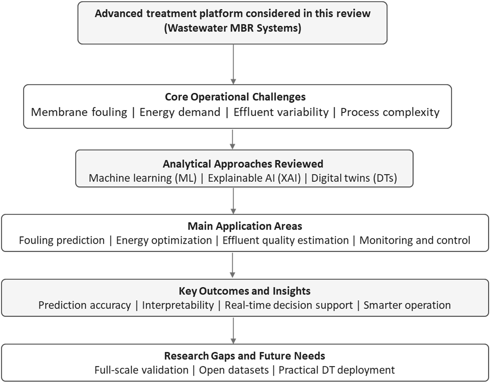
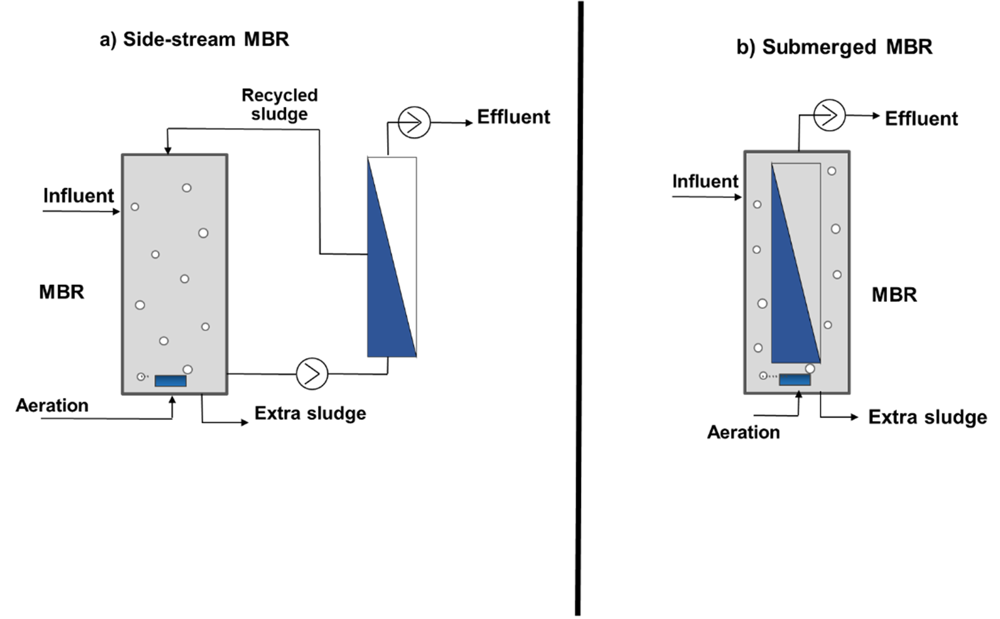
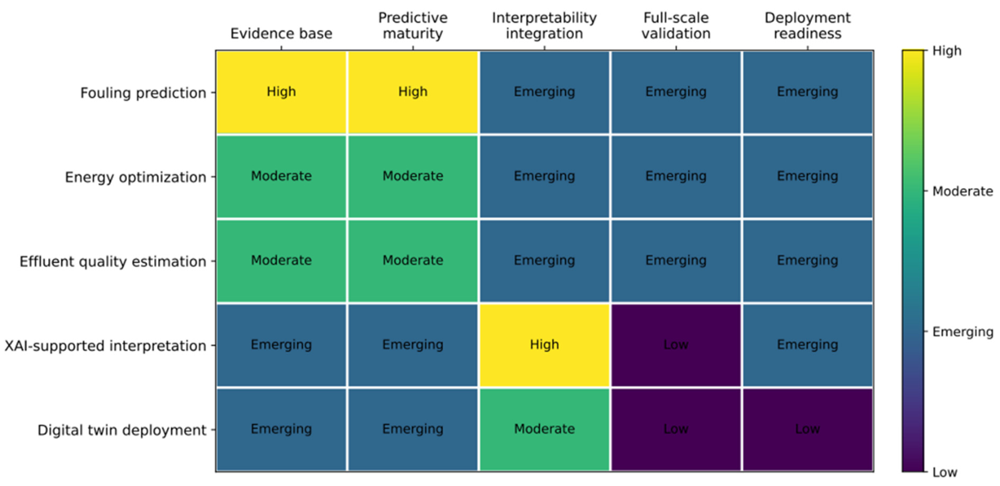

# Wastewater Membrane Bioreactors: A Comprehensive Review of Explainable Artificial Intelligence and Digital Twin Applications

## Abstract

- **Vai trò công nghệ của MBR trong xử lý nước thải**: Hệ thống bể phản ứng sinh học màng trong xử lý nước thải (wastewater membrane bioreactors - MBR) đã trở thành công nghệ xử lý nâng cao (advanced treatment technology) quan trọng nhờ khả năng tạo ra nước đầu ra chất lượng cao (high-quality effluent) phù hợp cho xả thải và tái sử dụng nước (water reuse).
  - **Các rào cản vận hành chính hạn chế tính bền vững**: Việc mở rộng ứng dụng trên quy mô lớn và bền vững hơn của MBR vẫn bị cản trở bởi hiện tượng nghẹt màng (membrane fouling), nhu cầu năng lượng cao (elevated energy demand), cùng độ phức tạp vận hành của các quá trình kết hợp giữa xử lý sinh học và phân tách bằng màng lọc (coupled biological and membrane separation processes).

- **Phạm vi và mục tiêu của bài tổng quan**: Tổng quan đánh giá một cách có phê phán (critically evaluates) sự gia tăng ứng dụng của học máy (machine learning - ML), trí tuệ nhân tạo có thể giải thích (explainable artificial intelligence - XAI), và bản sao số (digital twin - DT) trong hệ thống MBR.
  - **Các lĩnh vực ứng dụng được đánh giá**: Các nghiên cứu công bố về dự đoán nghẹt màng (fouling prediction), tối ưu hóa năng lượng (energy optimization), ước tính chất lượng nước đầu ra (effluent quality estimation), và hỗ trợ vận hành thông minh (intelligent operational support).
  - **Trọng tâm phân tích kỹ thuật**: Chú trọng trực tiếp vào hiệu năng mô hình (model performance), các hạn chế của tập dữ liệu (dataset limitations), và khả năng tổng quát hóa (generalizability).

- **Tiềm năng ứng dụng của các mô hình ML**: Các mô hình ML thể hiện tiềm năng mạnh mẽ trong việc dự đoán các chỉ số hiệu năng vận hành chính của MBR.
  - **Các kiến trúc ML nổi bật**: Phương pháp học kết hợp (ensemble methods), máy vector hỗ trợ (support vector machines - SVM), và các hướng tiếp cận học sâu (deep learning).
  - **Các thông số hiệu năng MBR dự đoán**: Áp suất xuyên màng (transmembrane pressure - TMP), thông lượng thấm (permeate flux), trở lực nghẹt màng (fouling resistance), và các biến chất lượng nước đầu ra được lựa chọn (selected effluent-quality variables).

- **Vai trò tăng cường tính minh bạch của các phương pháp XAI**: Các phương pháp XAI như SHAP, LIME, và Anchors ngày càng được áp dụng để cải thiện độ minh bạch của mô hình (model transparency) và làm sáng tỏ các yếu tố chi phối (dominant factors) kiểm soát hiệu năng quá trình.

- **Khung tích hợp Digital Twin (DT) cho nền tảng thời gian thực**: Khung cấu trúc DT mở rộng tiềm năng dự đoán bằng cách tích hợp hiểu biết cơ chế (mechanistic understanding), dữ liệu cảm biến trực tuyến (online sensor data), dự đoán dựa trên dữ liệu (data-driven prediction), và hỗ trợ ra quyết định có thể diễn giải được (interpretable decision support) trong các nền tảng vận hành thời gian thực (real-time operational platforms).

- **Các rào cản kỹ thuật cản trở triển khai thực tế**:
  - Số lượng nghiên cứu ở quy mô đầy đủ thực tế (full-scale studies) còn hạn chế.
  - Sự khan hiếm các bộ dữ liệu mở và chuẩn hóa (openly accessible and standardized datasets).
  - Sự thiếu hụt xem xét về độ không chắc chắn (uncertainty) và hiện tượng trôi dạt mô hình (model drift).
  - Mức độ trưởng thành còn ở giai đoạn ban đầu của việc triển khai DT trong các nhà máy đang vận hành (early-stage maturity of DT deployment in operational plants).

- **Kết luận bằng chứng và định hướng nghiên cứu tương lai**: Việc tích hợp ML, XAI, và DT có thể cải thiện đáng kể độ tin cậy (reliability), khả năng diễn giải (interpretability), và hiệu quả vận hành (operational efficiency) của các hệ thống MBR.
  - **Trọng tâm nghiên cứu tiếp theo**:
    - Thẩm định trên quy mô thực tế (full-scale validation).
    - Xây dựng các tập dữ liệu chuẩn đối sánh (benchmark datasets).
    - Mô hình hóa có nhận biết độ không chắc chắn (uncertainty-aware modeling).
    - Các chiến lược triển khai thực tiễn phục vụ quản lý MBR thông minh có thể giải thích được (interpretable intelligent MBR management).

- **Từ khóa công trình (Keywords)**: Membrane bioreactor; explainable artificial intelligence; digital twin; membrane fouling; SHAP; energy optimization; machine learning; wastewater treatment.

## 1. Introduction
- **Bối cảnh phát triển và vai trò của công nghệ màng lọc sinh học (MBR - Membrane Bioreactor)**:
  - Tình trạng khan hiếm nước toàn cầu và quy chuẩn xả thải ngày càng khắt khe đã đưa MBR từ ứng dụng nghiên cứu thích hợp thành giải pháp xử lý nước thải phổ biến trên mọi châu lục có người sinh sống.
  - Công nghệ MBR kết hợp xử lý sinh học bằng bùn hoạt tính (activated sludge) với quá trình lọc màng theo áp suất (pressure-driven membrane filtration).
  - Cấu hình màng siêu lọc (ultrafiltration) dạng sợi rỗng (hollow-fiber) hoặc tấm phẳng (flat-sheet) được ngâm ngập trực tiếp bên trong bể phản ứng sinh học (bioreactor).
  - Chất lượng nước sau lọc (permeate): dòng permeate thu được có chất lượng cao, đồng đều, sạch mầm bệnh (pathogen-free) và giảm thiểu dinh dưỡng (nutrient-reduced).
  - Permeate đáp ứng tiêu chuẩn tái sử dụng trực tiếp không dùng để uống (direct non-potable reuse) cho tưới tiêu nông nghiệp, nước công nghệ công nghiệp và xả thải môi trường.
- **Quy mô triển khai và thị trường ứng dụng công nghiệp**:
  - Ưu thế cạnh tranh: Sự kết hợp giữa diện tích mặt bằng nhỏ gọn (compact footprint), vận hành linh hoạt và chất lượng nước sau lọc cao đã thúc đẩy việc ứng dụng thương mại rộng rãi.
  - Dải quy mô công suất: Hệ thống MBR vận hành ở các quy mô từ các trạm phân tán nhỏ $10\text{ m}^3/\text{ngày}$ ($10\text{ m}^3/\text{day}$) đến các công trình đô thị lớn xử lý trên $100,000\text{ m}^3/\text{ngày}$ ($100.000\text{ m}^3/\text{day}$).
  - Mức độ thâm nhập toàn cầu: Kể từ các công trình thương mại đầu tiên đầu những năm $1990$, hiện có hơn $5000$ nhà máy xử lý nước thải trên toàn thế giới ứng dụng MBR cho đô thị, công nghiệp và tái sử dụng nước.
  - Các lĩnh vực công nghiệp ứng dụng: Bao gồm chế biến thực phẩm và đồ uống (food and beverage processing), sản xuất dược phẩm (pharmaceutical manufacturing), sản xuất dệt nhuộm (textile and dye production) và xử lý nước thải hóa dầu (petrochemical wastewater treatment).
  - Thách thức hỗn hợp bùn lỏng: Mỗi ngành mang thành phần hỗn hợp bùn lỏng (mixed-liquor composition) và đặc thù nghẹt màng (fouling) riêng biệt mà công nghệ xử lý truyền thống không thể giải quyết trong cùng một diện tích mặt bằng quy trình.
  - Tác động của chính sách quản lý: Các tiêu chuẩn xả thải cho nitơ, phốt pho và các chất ô nhiễm mới nổi (emerging contaminants) ngày càng khắt khe, cùng yêu cầu tái sử dụng nước mở rộng, khiến MBR trở thành lựa chọn khả thi duy nhất về mặt kỹ thuật tại nhiều thị trường.
- **Hai rào cản cấu trúc cố hữu của công nghệ MBR (Structural Liabilities)**:
  - **Hiện tượng nghẹt màng (Membrane fouling)**:
    - Bản chất: Sự tích tụ tăng dần của chất bẩn hữu cơ (organic foulants), hạt keo (colloidal particles) và các chất polymer ngoại bào của vi sinh vật (EPS - microbial extracellular polymeric substances) lên bề mặt màng và bên trong cấu trúc lỗ rỗng.
    - Hệ quả kỹ thuật: Làm suy giảm thông lượng thấm qua màng (permeate flux), gia tăng áp suất qua màng ($TMP$ - transmembrane pressure), kích hoạt các chu kỳ rửa hóa chất (chemical cleaning) và dẫn đến thay thế màng sớm.
    - Tác động kinh tế: Là yếu tố chi phối chính chi phí vòng đời (dominant lifecycle cost driver) của các công trình MBR.
    - Tính chất động thái: Cơ chế chi phối nghẹt màng phức tạp, phi tuyến và rất nhạy cảm với thành phần hỗn hợp bùn lỏng, tuổi bùn (sludge age), lịch sử thông lượng vận hành và điều kiện thủy lực; những thay đổi nhỏ ở đặc tính nước thải đầu vào có thể làm biến đổi hành vi nghẹt màng ngay trong một ngày vận hành đơn lẻ.
  - **Tiêu hao năng lượng (Energy demand)**:
    - Suất tiêu hao năng lượng riêng: Quá trình sục khí cho chuyển hóa oxy sinh học và làm sạch màng (membrane scouring), kết hợp với bơm hút permeate, tiêu tốn $0.4$–$1.5\text{ kWh/m}^3$ nước xử lý.
    - So sánh với quy trình truyền thống: Mức tiêu thụ này xấp xỉ gấp đôi nhu cầu năng lượng đặc thù của quy trình bùn hoạt tính truyền thống (conventional activated sludge).
    - Tỷ trọng sục khí màng: Riêng quá trình sục khí làm sạch màng chiếm $60$–$75\%$ tổng lượng năng lượng tiêu thụ của hệ thống.
    - Hạn chế môi trường và chi phí: Gánh nặng năng lượng ở quy mô lớn phát sinh chi phí vận hành đáng kể và gia tăng dấu chân carbon (carbon footprint), làm giảm giá trị môi trường của các ứng dụng tái sử dụng nước.
- **Ưu thế và ứng dụng của học máy (Machine Learning - ML)**:
  - Năng lực cốt lõi: Thuật toán ML học các mối quan hệ phi tuyến phức tạp giữa các biến vận hành và kết quả quy trình trực tiếp từ dữ liệu lịch sử.
  - Không đòi hỏi tham số hóa cơ chế: Khắc phục hạn chế của các mô hình dựa trên nguyên lý vật lý (physics-based models) vốn đòi hỏi xác định đầy đủ các tham số cơ chế phức tạp trong điều kiện vận hành thực tế.
  - Các thuật toán đã triển khai: Bao gồm máy vector hỗ trợ (Support Vector Machines - SVM), rừng ngẫu nhiên (Random Forests - RF), các khung tăng cường độ dốc (gradient-boosting frameworks) và mạng hồi quy sâu (deep recurrent networks).
  - Độ chính xác dự đoán: Cho thấy độ chính xác dự đoán cao hơn rõ rệt so với mô hình hồi quy tuyến tính (linear regression) và mô hình cơ chế đơn giản hóa trên nhiều quy mô và nhiều loại nước thải khác nhau.
- **Rào cản hộp đen và yêu cầu về Trí tuệ nhân tạo có thể giải thích (Explainable Artificial Intelligence - XAI)**:
  - Thách thức hộp đen: Tính mờ đục (opacity) của các dự đoán mô hình hộp đen (black-box) là rào cản then chốt khi triển khai ML trong môi trường xử lý nước có kiểm soát theo quy định.
  - Yêu cầu từ các bên liên quan: Người vận hành, kỹ sư quy trình và cơ quan quản lý đòi hỏi bằng chứng chứng minh các khuyến nghị của mô hình có ý nghĩa vật lý, nhất quán với tri thức chuyên ngành và không đưa ra kết quả sai lệch nghiêm trọng trong điều kiện bất thường.
  - Vai trò của công cụ XAI: Các phương pháp như LIME và phương pháp phân bổ thuộc tính dựa trên gradient (gradient-based attribution methods) phân rã dự đoán của mô hình thành các đóng góp đặc trưng (feature contributions) có thể định lượng được.
  - Giá trị vận hành và pháp lý: Giúp kỹ sư thẩm vấn hành vi mô hình, xác thực dự đoán theo tri thức chuyên ngành, xây dựng niềm tin của người vận hành và đáp ứng kỳ vọng pháp lý đối với việc ra quyết định tự động trong các công trình cơ sở hạ tầng trọng yếu.
- **Khung tích hợp Bản sao số (Digital Twin - DT)**:
  - Định nghĩa Digital Twin: Bản sao ảo liên kết hai chiều (bidirectionally coupled virtual replica), được cập nhật liên tục của hệ thống vật lý, kết hợp các mô hình quy trình độ tin cậy cao với dữ liệu cảm biến thời gian thực và các hiệu chỉnh dựa trên dữ liệu.
  - Năng lực vận hành: Cho phép mô phỏng dự đoán (predictive simulation), kiểm thử kịch bản (scenario testing) và tối ưu hóa mà không cần tiến hành thực nghiệm vật lý trên hệ thống thực.
  - Kiến trúc DT hoàn chỉnh cho MBR: Tích hợp các mô hình bùn hoạt tính (Activated Sludge Models - ASM), các mô hình con lọc màng, mô hình ML dự đoán nghẹt màng, mô-đun giải thích XAI và động cơ tối ưu hóa năng lượng thành một nền tảng thống nhất cung cấp cho người vận hành đồng thời khuyến nghị vận hành và lập luận minh bạch đằng sau khuyến nghị.
- **Chuỗi liên kết tương hỗ ba tầng (ML $\rightarrow$ XAI $\rightarrow$ DT) và luận điểm phân tích trung tâm**:
  - Khoảng trống tổng quan: Chưa có bài tổng quan nào khảo sát đầy đủ sự giao thoa của ML, XAI và DT như một khung phân tích tích hợp cho hệ thống MBR; các nghiên cứu trước chỉ tiếp cận riêng rẽ ML hoặc khảo sát DT mà thiếu vắng tính minh bạch của XAI.
  - Chuỗi logic tuần tự ba tầng:
    - Tầng động cơ dự đoán (ML): Cung cấp động cơ dự báo các mối quan hệ phi tuyến từ dữ liệu vận hành để ước tính nghẹt màng, nhu cầu năng lượng và chất lượng nước đầu ra với độ chính xác cao hơn mô hình tiền định trong điều kiện biến động thực tế.
    - Tầng diễn giải (XAI): Phân rã từng dự đoán ML thành các đóng góp đặc trưng có xếp hạng giúp kỹ sư và cơ quan quản lý kiểm toán được mô hình; không có XAI thì ML không thể triển khai an toàn trong hạ tầng được kiểm soát.
    - Tầng tích hợp vận hành (DT): Kết hợp dự đoán ML, giải thích XAI và mô hình quy trình cơ chế trong bản sao ảo cập nhật liên tục để mô phỏng và thử nghiệm kịch bản; không có DT thì XAI chỉ dừng lại ở các giải thích hồi tố (post-hoc explanations) mà thiếu tích hợp vận hành vòng lặp kín (closed-loop).
  - Tính phụ thuộc điều kiện: Chỉ khi kết hợp cả ba mô hình mới tạo nên hệ thống có năng lực điều khiển MBR tự động đáng tin cậy, diễn giải được và khả thi triển khai trong thực tế; đây là luận điểm phân tích cốt lõi định hình phạm vi tổng hợp của bài báo.
  - Bốn mục tiêu nghiên cứu trọng tâm: (1) Đánh giá hiệu năng mô hình ML, hạn chế của tập dữ liệu và khả năng tổng quát hóa trên dự đoán nghẹt màng, tối ưu hóa năng lượng và ước tính chất lượng nước đầu ra; (2) Đánh giá các khung diễn giải XAI và vai trò thực tế trong xây dựng quyết định tin cậy, dễ tiếp cận cho người vận hành; (3) Định hình các kiến trúc DT mới nổi, mức độ trưởng thành triển khai và yêu cầu tích hợp XAI trong nền tảng DT vận hành; (4) Nhận diện các khoảng trống nghiên cứu then chốt cần giải quyết để tích hợp XAI-DT ở quy mô vận hành thực tế.
  - **Hình 1.** Sơ đồ khung khái niệm nghiên cứu MBR kết hợp ML, XAI và DT
    - 
    - **Hình này chứng minh điều gì**
      - Thể hiện sự liên kết từ các thách thức vận hành cốt lõi, ba hướng tiếp cận phân tích (ML, XAI, DT), các lĩnh vực ứng dụng chính, kết quả mang lại và các khoảng trống nghiên cứu cần giải quyết.
    - **Từ đâu mà thấy được**
      - Sơ đồ đọc theo chiều dọc từ trên xuống dưới qua 6 tầng khối: nền tảng MBR $\rightarrow$ thách thức vận hành cốt lõi $\rightarrow$ phương pháp phân tích (ML, XAI, DT) $\rightarrow$ lĩnh vực ứng dụng $\rightarrow$ kết quả chính $\rightarrow$ khoảng trống nghiên cứu (full-scale validation, open datasets, practical DT deployment).
- **Phạm vi thuật ngữ và các phát hiện nghiên cứu cốt lõi**:
  - Ý nghĩa thuật ngữ "comprehensive": Thuật ngữ "comprehensive" trong tiêu đề bài báo phản ánh độ bao quát của các mô hình phân tích được khảo sát (ML, XAI và DT) trong cùng một khung phân tích duy nhất, không ngụ ý rằng lĩnh vực này đã đạt đến mức độ trưởng thành ở quy mô vận hành thực tế.
  - Phát hiện trung tâm của bài tổng quan: Sự khan hiếm của các triển khai DT ở quy mô đầy đủ (full-scale) và mức độ tích hợp XAI còn hạn chế là những phát hiện trọng tâm được ghi nhận xuyên suốt bài báo, định hình chương trình nghị sự nghiên cứu được nêu rõ tại Mục 7.

## 2. Methodology

### Literature Search and Study Selection
- **Tìm kiếm y văn có trọng tâm (focused literature search)**: Quá trình tìm kiếm tài liệu được thực hiện trên $3$ cơ sở dữ liệu khoa học chính:
  - Scopus.
  - Web of Science.
  - PubMed.
- **Khung thời gian tra cứu (search period)**: Giai đoạn tra cứu bao phủ từ tháng $1$ năm $2010$ đến tháng $12$ năm $2025$ (January 2010 đến December 2025).
  - Giới hạn dưới năm $2010$ được xác định do trùng khớp với thời kỳ tăng trưởng mạnh mẽ của cả việc ứng dụng thương mại công nghệ MBR (membrane bioreactor) lẫn triển khai học máy (ML - machine learning) trong lĩnh vực kỹ thuật môi trường (environmental engineering).
- **Chiến lược từ khóa và toán tử Boolean (search syntax)**: Sử dụng các từ khóa văn bản tự do (free-text keywords) kết hợp toán tử Boolean:
  - Cú pháp truy vấn cụ thể: `(“membrane bioreactor” OR “MBR”) AND (“machine learning” OR “artificial neural network” OR “deep learning” OR “LSTM” OR “random forest” OR “support vector machine” OR “explainable AI” OR “XAI” OR “SHAP” OR “LIME” OR “digital twin”)`.
- **Phạm vi nguồn tài liệu (source eligibility)**: Giới hạn tìm kiếm trong các bài báo tạp chí đã qua bình duyệt (peer-reviewed journal articles) xuất bản bằng tiếng Anh.
  - Danh mục tài liệu tham khảo (reference lists) của các bài báo thu thập được kiểm tra thủ công (manually checked) nhằm phát hiện và bổ sung thêm các nguồn liên quan.
- **Tiêu chí loại trừ (exclusion criteria)**: Các công trình bị loại khỏi cơ sở dữ liệu nghiên cứu nếu:
  - Thiếu các chỉ số định lượng về hiệu suất (quantitative performance metrics).
  - Chỉ tập trung thuần túy vào quy trình chế tạo vật liệu màng (membrane material fabrication).
- **Phân loại tổng quan và quy trình đánh giá (review nature and protocol)**: Nghiên cứu được thực hiện dưới hình thức tổng quan tường thuật (narrative review) tập trung vào các xu hướng trí tuệ nhân tạo (AI) trong các hệ thống MBR.
  - Nghiên cứu không phải là tổng quan hệ thống (systematic review) hay phân tích gộp (meta-analysis).
  - Sơ đồ dòng quy trình PRISMA (PRISMA flow diagram) theo đó không được thiết lập.
- **Tiêu chí giữ lại công trình (retention criteria)**: Các nghiên cứu tạo nên cơ sở bằng chứng (evidence base) khi đáp ứng đủ các yêu cầu:
  - Đề cập đến các ứng dụng ML, trí tuệ nhân tạo có thể giải thích (XAI - explainable artificial intelligence), hoặc bản sao số (DT - digital twin) trong hệ sinh thái MBR.
  - Báo cáo các mô hình hóa nguyên bản hoặc kết quả thực nghiệm nguyên bản (original modelling or empirical results).
- **Dữ liệu cấp nghiên cứu trong phụ lục (study-level data in Supplementary Material)**: Toàn bộ dữ liệu của các nghiên cứu sơ cấp (primary studies) được tổng hợp chi tiết tại Bảng bổ sung S1 (Supplementary Table S1).
  - Các thông tin được cung cấp bao gồm: biến mục tiêu (target variable), đơn vị đo (unit), khoảng giá trị báo cáo (reported value range), chỉ số đánh giá hiệu suất (performance metric), và phương pháp xác thực ngoại kiểm (external validation approach).

## 3. Machine Learning for Membrane Fouling Prediction

### 3.1. Fouling Mechanisms and Modelling Context

- **Bản chất đa quy mô, đa cơ chế của hiện tượng nghẹt màng (membrane fouling)**: Hiện tượng nghẹt màng trong $\text{MBR}$ (membrane bioreactors - bể phản ứng sinh học màng) là một hiện tượng đa quy mô, đa cơ chế (multi-scale, multi-mechanism phenomenon), trong đó tổng trở lực lọc được phân tách theo khung mô hình các trở lực nối tiếp (resistance-in-series framework) thành ba thành phần đóng góp:
  - Sự hình thành lớp bánh lọc thuận nghịch (reversible cake layer formation): có thể loại bỏ bằng biện pháp thư giãn / ngừng hút (relaxation) hoặc rửa ngược (backwashing).
  - Nghẹt lỗ màng bất thuận nghịch (irreversible pore blocking): đòi hỏi phải làm sạch bằng hóa chất (chemical cleaning).
  - Nghẹt màng do hấp phụ (adsorptive fouling): xảy ra bên trong cấu trúc nền màng (membrane matrix).
  - Tỷ trọng đóng góp của từng cơ chế phụ thuộc vào thành phần hỗn dịch bùn lỏng (mixed-liquor composition) và thông lượng vận hành (operating flux) tương đối so với ngưỡng thông lượng tới hạn (critical flux threshold).
- **Thành phần $\text{EPS}$ và động học tích tụ nghẹt màng theo ngưỡng thông lượng tới hạn**: Các hợp chất polyme ngoại bào ($\text{EPS}$ - extracellular polymeric substances) đóng vai trò chất gây nghẹt chính với các thành phần cốt lõi gồm:
  - Các sản phẩm vi sinh vật hòa tan ($\text{SMP}$ - soluble microbial products).
  - $\text{EPS}$ liên kết (bound $\text{EPS}$).
  - Các polyme sinh học dạng keo (colloidal biopolymers).
  - Dưới ngưỡng thông lượng tới hạn (below critical flux): sự tích tụ nghẹt màng diễn ra từ từ và phần lớn có tính chất thuận nghịch.
  - Vượt quá ngưỡng thông lượng tới hạn (above critical flux): xảy ra hiện tượng nghẹt màng nhanh chóng và bất thuận nghịch, làm rút ngắn mạnh chu kỳ làm sạch (cleaning intervals) và tuổi thọ màng (membrane lifetime).
- **Các thông số vận hành chi phối động học nghẹt màng và sự đánh đổi đa mục tiêu**: Động học nghẹt màng chịu sự chi phối của các thông số vận hành then chốt:
  - Nồng độ chất rắn lơ lửng trong bùn lỏng ($\text{MLSS}$ - mixed liquor suspended solids): quyết định khối lượng vật chất sẵn có hình thành lớp bánh lọc và ảnh hưởng đến độ nhớt của hỗn dịch bùn lỏng.
  - Thời gian lưu bùn ($\text{SRT}$ - solids retention time): kiểm soát quá trình sản sinh $\text{EPS}$ thông qua tác động lên tốc độ sinh trưởng của sinh khối và tính sẵn có của cơ chất.
  - Thời gian lưu thủy lực ($\text{HRT}$ - hydraulic retention time): ảnh hưởng đến độ pha loãng và thời gian lưu của các vật chất gây nghẹt dạng keo.
  - Nồng độ oxy hòa tan ($\text{DO}$ - dissolved oxygen): chi phối sự cân bằng giữa các con đường chuyển hóa hiếu khí (aerobic) và thiếu khí (anoxic), từ đó định hình thành phần $\text{EPS}$.
  - Cường độ sục khí màng (membrane aeration intensity): cung cấp ứng suất cắt (shear stress) cần thiết nhằm hạn chế sự phát triển của lớp bánh trên bề mặt màng ngập nước.
  - Tương tác phi tuyến và đối kháng (non-linear and antagonistic interactions): việc tăng $\text{MLSS}$ giúp cải thiện hiệu suất xử lý sinh học nhưng lại đẩy nhanh tốc độ nghẹt màng; việc tăng sục khí giúp giảm nghẹt màng nhưng làm tăng tiêu thụ năng lượng, tạo ra các đánh đổi đa mục tiêu (multi-objective trade-offs) khó mô tả đầy đủ bằng các mô hình cơ chế đơn giản.
- **Cơ sở cơ chế cho việc lựa chọn đặc trưng trong mô hình học máy ($\text{ML}$)**: Các thông số vận hành gồm $\text{MLSS}$, $\text{SRT}$, $\text{HRT}$, $\text{DO}$ và cường độ sục khí tạo thành tập đặc trưng ứng viên chính (primary candidate feature set) cho các mô hình $\text{ML}$ dự đoán nghẹt màng $\text{MBR}$:
  - Việc lựa chọn các thông số này làm đầu vào mô hình bắt nguồn từ hiểu biết sâu sắc về cơ chế vận hành thay vì quy ước mang tính kinh nghiệm (empirical convention).
  - Sự gắn kết giữa tri thức quy trình (process knowledge) và kỹ thuật đặc trưng (feature engineering) là điểm tựa then chốt cho các phương pháp mô hình hóa lai (hybrid modelling approaches).
- **Giới hạn của các mô hình cơ chế và động lực thúc đẩy mô hình học máy**: Các mô hình cơ chế, bao gồm họ mô hình $\text{ASM}$ (Activated Sludge Models) và chuẩn đối sánh $\text{BSM-MBR}$ (Benchmark Simulation Model for MBRs), đã thúc đẩy hiểu biết về động học sinh học và sự ghép nối với hiệu suất màng, nhưng độ chính xác dự đoán trong điều kiện tải động bị hạn chế:
  - Khó khăn trong việc định lượng đặc tính các phân đoạn $\text{EPS}$ của bùn lỏng theo thời gian thực (real-time).
  - Độ nhạy cảm cao của các tham số mô hình đối với nhiệt độ và tiền sử bùn (sludge history).
  - Chi phí tính toán cao (high computational cost) khi chạy mô phỏng cơ chế ở các thang thời gian vận hành.
  - Sự phức tạp gia tăng ở các cấu hình màng sinh học thẩm thấu ($\text{OMBR}$ - Osmotic $\text{MBR}$): việc ghép nối bể phản ứng sinh học với màng thẩm thấu thuận ($\text{FO}$ - forward osmosis) qua động lực thẩm thấu làm phát sinh động học phân cực nồng độ (concentration polarization dynamics), tạo động lực mạnh mẽ cho việc áp dụng các cách tiếp cận hướng dữ liệu (data-driven approaches) và $\text{ML}$.
- **Sơ đồ cấu hình hệ thống $\text{MBR}$ và chuỗi luồng dữ liệu cảm biến hiện trường**: Thiết lập tham chiếu vận hành thực tế cho các thông số công nghệ và luồng dữ liệu trực tuyến của cả hai cấu hình $\text{MBR}$ ngập nước (submerged) và dòng nhánh (side-stream):
  - **Hình 2.** Sơ đồ cấu hình hệ thống MBR ngập nước và dòng nhánh
    - 
    - **Hình này chứng minh điều gì**
      - Thể hiện các đơn vị vận hành cốt lõi, hệ thống sục khí làm sạch màng và các điểm thu thập dữ liệu cảm biến trực tuyến (DO, TMP, lưu lượng, nhiệt độ).
    - **Từ đâu mà thấy được**
      - Sơ đồ chi tiết gồm bể sục khí, mô-đun màng ngập nước, bơm hút dòng thấm, các đầu đo cảm biến SCADA và đường tuần hoàn bùn.
  - Các đơn vị vận hành cốt lõi: bể phản ứng sinh học sục khí chứa hỗn dịch bùn hoạt tính lỏng; mô-đun màng siêu lọc sợi rỗng (hollow-fiber) hoặc tấm phẳng (flat-sheet) ngập nước vận hành dưới áp suất thấm âm; bơm hút dòng thấm và cửa xả nước sau xử lý (effluent outlet); đường tuần hoàn bùn duy trì nồng độ $\text{MLSS}$ mục tiêu; và cửa xả bùn dư kiểm soát $\text{SRT}$.
  - Hệ thống sục khí và làm sạch: hệ thống sục khí màng bọt thô (coarse-bubble membrane aeration) cung cấp ứng suất cắt để kiểm soát nghẹt màng, cùng các chu trình rửa ngược (backwash) và làm sạch hóa học tại chỗ ($\text{CIP}$ - chemical cleaning / cleaning-in-place).
  - Các điểm đo cảm biến trực tuyến (online sensor measurement points): đầu đo oxy hòa tan ($\text{DO}$) trong bể sinh học, bộ chuyển đổi áp suất qua màng ($\text{TMP}$ - transmembrane pressure transducers) trên đường dòng thấm, đồng hồ đo lưu lượng dòng vào (influent) và dòng thấm (permeate), cảm biến độ đục trực tuyến và đầu đo nhiệt độ.
  - Chuỗi luồng dữ liệu (data pathway): tín hiệu thu thập từ các cảm biến hiện trường đi qua hệ thống điều khiển giám sát và thu thập dữ liệu ($\text{SCADA}$ - Supervisory Control and Data Acquisition), sau đó chuyển tiếp đến tầng phân tích dự đoán $\text{ML}$ và tầng bản sao số ($\text{Digital Twin}$), thiết lập ngữ cảnh vật lý và dữ liệu phục vụ các công trình mô hình hóa.

### 3.2. Shallow and Kernel-Based ML Models

- **Tiêu chuẩn lựa chọn nghiên cứu và giới hạn so sánh đối chuẩn (benchmarking)**: Các công trình tổng quan trong phần này đáp ứng đầy đủ tiêu chí lựa chọn tại mục "Literature Search and Study Selection", gồm báo cáo tối thiểu một chỉ số hiệu suất định lượng và áp dụng phương pháp luận ML nguyên bản trên dữ liệu vận hành hoặc thực nghiệm MBR:
  - So sánh đối chuẩn trực tiếp giữa các nghiên cứu bị giới hạn bởi tính dị thể (heterogeneity) về biến mục tiêu (target variables), quy mô tập dữ liệu (dataset sizes) và điều kiện vận hành (operating conditions).
  - Các chỉ số hiệu suất cần được diễn giải trong phạm vi từng nghiên cứu cụ thể thay vì xem là bảng xếp hạng tuyệt đối (absolute rankings).

- **Mô hình mạng nơ-ron nhân tạo (ANN) trong dự đoán tắc nghẽn màng (fouling prediction)**: ANN là một trong những kiến trúc ML đầu tiên được áp dụng có hệ thống vào việc dự đoán hiện tượng nghẽn màng trong MBR:
  - Mirbagheri và cộng sự so sánh mạng perceptron đa tầng (Multilayer Perceptron - MLP) và mạng hàm cơ sở xuyên tâm (Radial Basis Function - RBF) để dự đoán áp suất xuyên màng (Transmembrane Pressure - TMP) và độ thấm (permeability) trong hệ MBR đặt ngập quy mô pilot (pilot-scale submerged MBR) [23]:
    - Các biến đầu vào gồm thời gian, $\text{TSS}$, $\text{COD}$, $\text{SRT}$ và $\text{MLSS}$ thu thập qua đợt vận hành thử nghiệm kéo dài $60\text{ ngày}$.
    - Cả hai kiến trúc đều cho kết quả dự đoán thỏa đáng; trong đó mạng RBF cho thấy tốc độ hội tụ nhanh hơn và giảm độ nhạy đối với các điều kiện trọng số ban đầu (initial weight conditions), hỗ trợ triển khai mô hình trực tuyến (online model deployment).
    - Nghiên cứu nhấn mạnh tầm quan trọng của việc lựa chọn biến đầu vào và đảm bảo tính đa dạng của dữ liệu huấn luyện đối với khả năng tổng quát hóa ngoài giai đoạn huấn luyện.
  - Schmitt và cộng sự phát triển mô hình ANN lan truyền ngược (backpropagation ANN) để dự đoán nghẽn màng trong hệ MBR thiếu khí - hiếu khí (anoxic-aerobic MBR) xử lý nước thải sinh hoạt [25]:
    - Mô hình đạt hệ số xác định $R^2 = 0.850$ trên tập dữ liệu kiểm tra độc lập (held-out test data).
    - Mức hiệu suất này phản ánh tính biến thiên cố hữu trong vận hành quy mô pilot và thách thức khi mô hình hóa động học tắc nghẽn bằng số lượng biến đầu vào hạn chế.

- **Phương pháp dựa trên hàm hạt nhân (kernel-based methods) và đối chuẩn các mô hình nông**: Các phương pháp kernel ánh xạ dữ liệu đầu vào lên không gian đặc trưng nhiều chiều hơn để học các ranh giới quyết định phi tuyến tính mà không cần kiến trúc học sâu, đạt hiệu suất cạnh tranh cao:
  - Hamedi và cộng sự thực hiện nghiên cứu đối chuẩn so sánh ANN-MLP, ANN kết hợp tối ưu hóa bầy đàn hạt (ANN-PSO), lập trình biểu thức gen (Gene Expression Programming - GEP) và máy vector hỗ trợ bình phương tối thiểu (Least-Squares Support Vector Machine - LSSVM) để dự đoán trở lực tắc nghẽn (fouling resistance) trong hệ MBR phòng thí nghiệm [42]:
    - LSSVM đạt hiệu suất cao nhất với $R^2 = 0.990$ và $\text{MSE} = 0.0002$, cao hơn đáng kể so với tất cả các biến thể ANN.
    - Phân tích độ nhạy (sensitivity analysis) chỉ ra thông lượng dòng thấm (permeate flux) và TMP là các biến đầu vào chi phối, hoàn toàn phù hợp với khung lý thuyết trở lực nối tiếp (resistance-in-series framework).
    - Kết quả chứng minh phân tích tầm quan trọng của đặc trưng trong ML có khả năng tái hiện thứ bậc các biến có ý nghĩa về mặt cơ chế vật lý.
  - Giwa và cộng sự áp dụng mô hình ANN cho hệ submerged MBR xử lý hỗn hợp nước thải công nghiệp và đô thị tại UAE [43]:
    - Các đặc tính của nước cấp (độ dẫn điện, $\text{pH}$, chất rắn lơ lửng) đóng vai trò là các biến dự đoán quan trọng đối với các thông số chất lượng nước đầu ra gồm $\text{COD}$, $\text{BOD}$ và độ đục (turbidity).
    - Hiệu suất của ANN phụ thuộc mang tính quyết định vào độ đa dạng của dữ liệu huấn luyện qua nhiều điều kiện tải khác nhau.
  - Nguyen và cộng sự áp dụng hồi quy cây quyết định (decision tree regression), hồi quy vector hỗ trợ (Support Vector Regression - SVR) và hồi quy tuyến tính (linear regression) để dự đoán TMP trong hệ MBR xử lý nước thải sinh hoạt [44]:
    - Hồi quy cây quyết định đạt $R^2 = 0.99$.
    - Kết quả này cần được đánh giá thận trọng do tập dữ liệu có kích thước nhỏ và chỉ thu thập tại một cơ sở duy nhất; giá trị $R^2$ cao nhiều khả năng phản ánh hiện tượng khớp vào cấu trúc nhiễu đặc thù của tập dữ liệu thay vì tạo ra mô hình fouling có khả năng khái quát hóa.

- **Thống kê xu hướng ứng dụng ML và khoảng trống nghiên cứu thực tiễn**: Khảo sát tổng hợp của Queiroz và cộng sự phân tích $57$ nghiên cứu ML về dự đoán hiệu suất MBR [45]:
  - Các mô hình ANN được ứng dụng trong $88\%$ các trường hợp nghiên cứu.
  - Báo cáo xác định khoảng trống nghiên cứu then chốt: chưa có nghiên cứu nào ứng dụng ML để dự đoán tuổi thọ màng (membrane lifespan) hoặc thời điểm thay thế màng (membrane replacement timing).
  - Khoảng trống nghiên cứu này có liên hệ trực tiếp đến hiệu quả kinh tế vận hành của các nhà máy xử lý nước.

- **Tổng kết từ các nghiên cứu khảo sát và vai trò của mô hình lai ML - cơ chế**: Các nghiên cứu tổng quan đã đánh giá có hệ thống thực trạng mô hình hóa ML trong lĩnh vực MBR:
  - Schmitt và Do tổng quan các hướng tiếp cận ML mô hình hóa tắc nghẽn màng MBR trên hơn $30$ nghiên cứu [24]:
    - Tính sẵn có và tính đại diện của dữ liệu là các rào cản chính hạn chế khả năng tổng quát hóa của mô hình.
    - Đề xuất các chiến dịch quan trắc liên tục dài hạn (long-duration continuous monitoring campaigns) là yêu cầu tối thiểu về tập dữ liệu để phát triển mô hình đáng tin cậy.
  - Shi và cộng sự đánh giá các ứng dụng ML trên phạm vi rộng hơn của các quá trình lọc màng [38]:
    - Các mô hình lai ML - cơ chế (hybrid ML–mechanistic models) — sử dụng các phương trình cơ chế để tính toán các đặc trưng đầu vào phái sinh (derived input features) trước khi đưa vào dự đoán ML — đạt hiệu suất cao hơn một cách nhất quán so với các phương pháp tiếp cận thuần túy hộp đen (black-box) trong các thử nghiệm kiểm định chéo (cross-validation).
    - Lợi thế của mô hình lai thể hiện rõ nét khi ngoại suy ra ngoài phạm vi vận hành của dữ liệu huấn luyện.

### 3.3. Ensemble Methods and Deep Learning

- **Định nghĩa và hiệu suất tổng thể của phương pháp tập hợp (Ensemble Methods)**:
  - Các phương pháp tập hợp kết hợp dự đoán từ nhiều mô hình học cơ sở (base learners) nhằm giảm phương sai (variance) và cải thiện khả năng tổng quát hóa (generalization).
  - Nhóm thuật toán này mang lại hiệu suất tổng thể mạnh nhất trong y văn học máy (machine learning - ML) ứng dụng cho màng phản ứng sinh học (membrane bioreactor - MBR).
- **Thuật toán Rừng ngẫu nhiên (Random Forest - RF) trong dự đoán tắc nghẽn màng**:
  - RF tổng hợp dự đoán từ một tập hợp các cây quyết định (decision trees) được huấn luyện độc lập, trong đó mỗi cây được xây dựng trên một tập con ngẫu nhiên của dữ liệu huấn luyện và các đặc trưng đầu vào (input features) [21].
  - RF đặc biệt thích hợp cho bài toán dự đoán tắc nghẽn màng (fouling prediction) trong MBR nhờ các ưu thế:
    - Xử lý hiệu quả các kiểu biến hỗn hợp (mixed variable types).
    - Có độ chống chịu tốt trước các giá trị ngoại lai (resilient to outliers) trong dữ liệu vận hành quy trình.
    - Cung cấp sẵn ước tính độ quan trọng đặc trưng (built-in feature importance estimates) mà không đòi hỏi thêm bước trí tuệ nhân tạo có thể giải thích (explainable artificial intelligence - XAI) riêng biệt.
  - Các giới hạn kỹ thuật của RF:
    - Mức độ chiếm dụng bộ nhớ (memory footprint) tỷ lệ thuận với quy mô tập hợp (ensemble size), gây hạn chế khi triển khai trên phần cứng nhúng (embedded hardware) hoặc phần cứng biên (edge hardware) trong các hệ thống điều khiển MBR thời gian thực.
    - Bảng xếp hạng độ quan trọng đặc trưng từ RF mang tính toàn cục (global) và có thể che khuất các phi tuyến tính cục bộ (local non-linearities).
    - Phương pháp quy gán dựa trên SHAP (SHAP-based attribution) được khuyến nghị sử dụng đồng thời với RF khi cần tính minh bạch và khả năng giải thích (interpretability).
- **Ứng dụng học máy trong hệ thống màng phản ứng sinh học thẩm thấu (Osmotic MBR - OMBR)**:
  - Viet và Jang ứng dụng nhiều kiến trúc mô hình dựa trên trí tuệ nhân tạo (AI-based models) để dự đoán hiệu suất của hệ thống OMBR xử lý nước thải đô thị [22].
  - Các thông số đầu vào của mô hình gồm các chỉ tiêu chất lượng nước cấp: $\text{pH}$, độ dẫn điện (conductivity), $\text{NH}_4\text{-N}$, tổng nitơ (total nitrogen - $\text{TN}$), và tổng carbon hữu cơ (total organic carbon - $\text{TOC}$).
  - Các mô hình đạt hiệu suất cao nhất ghi nhận hệ số xác định $R^2 = 0.92\text{--}0.98$ cho dự đoán lưu lượng dòng thấm nước (water flux) và trở lực tắc nghẽn (fouling resistance).
  - Mô hình dựa trên dữ liệu nắm bắt động học lực động thẩm thấu (osmotic driving force dynamics) phức tạp chi phối hiệu suất OMBR.
  - Phương pháp giải quyết các bậc tự do bổ sung (additional degrees of freedom) của OMBR, tính toán tác động cô đặc và pha loãng dung dịch (concentration and dilution effects), đồng thời mô tả hiện tượng thông lượng muối chảy ngược (reverse salt flux) mà không cần tham số hóa cơ chế tường minh (mechanistic parameterization) của các phương trình vận chuyển thẩm thấu thuận (forward osmosis - $\text{FO}$).
- **Thẩm định mô hình học máy quy mô thực tế đầy đủ của Kovacs và cộng sự**:
  - Kovacs và cộng sự thực hiện công trình thẩm định ML quy mô thực tế (full-scale) đầy đủ nhất được công bố trong lĩnh vực MBR, so sánh các mô hình RF, mạng nơ-ron nhân tạo (artificial neural networks - ANN), và mạng bộ nhớ ngắn-dài (long short-term memory - LSTM) trên bộ dữ liệu gồm hơn $80{,}000$ mẫu thu thập từ một nhà máy xử lý nước thải đô thị [26].
  - Hiệu suất của mô hình RF:
    - Đạt $R^2 = 0.927\text{--}0.996$ và sai số căn bậc hai trung bình bình phương $\text{RMSE} = 0.264\text{--}0.904\,\text{kPa}$ trên các giai đoạn khác nhau của chu kỳ lọc MBR.
    - Các giai đoạn chu kỳ lọc gồm: tắc nghẽn ban đầu (initial fouling), vận hành ổn định (stable operation), nén chặt giai đoạn muộn (late-stage compaction), và phục hồi sau rửa màng (post-cleaning recovery).
  - So sánh RF với ANN và LSTM:
    - ANN và LSTM ghi nhận giá trị $\text{RMSE}$ tổng thể cao hơn so với RF.
    - Tuy nhiên, LSTM thể hiện thế mạnh rõ nét trong giai đoạn tắc nghẽn muộn có cấu trúc thời gian (temporally structured late-stage fouling period), nơi lịch sử diễn tiến của lưu lượng và áp suất xuyên màng ($\text{TMP}$) cung cấp thông tin dự đoán quan trọng cho quỹ đạo tắc nghẽn hiện tại.
  - Đóng góp khoa học: Đây là nghiên cứu đầu tiên xác thực thành công dự đoán $\text{TMP}$ bằng ML ở quy mô đô thị hoàn chỉnh với mức độ chính xác cao này.
- **Ranh giới giữa xác thực dữ liệu lịch sử và triển khai vận hành vòng kín (Closed-loop Operational Deployment)**:
  - Việc thẩm định mô hình trên dữ liệu SCADA lịch sử không đồng nghĩa với khả năng triển khai vận hành theo chu trình kín (closed-loop).
  - Xác thực lịch sử chỉ khẳng định mô hình có khả năng tái hiện các quy luật đã xảy ra tại một cơ sở duy nhất; không khẳng định mô hình duy trì độ tin cậy dưới các điều kiện thực tế như trôi dạt cảm biến (sensor drift), nhiễu đo lường (measurement noise), độ trễ dữ liệu (data latency), hoặc sự cố hỏng hóc thiết bị (equipment failures).
  - Triển khai vận hành thực tế đòi hỏi phải hoàn thành thử nghiệm vòng kín bổ sung trong điều kiện vận hành trực tiếp (live conditions) trước khi áp dụng đầu ra mô hình vào quy trình ra quyết định điều khiển.
- **Giới hạn tổng quát hóa liên cơ sở (Cross-site Generalizability)**:
  - Tập dữ liệu từ nghiên cứu của Kovacs và cộng sự xuất phát từ một nhà máy đô thị đơn lẻ, vận hành với một cấu hình màng, chế độ bùn và thành phần nước thải đầu vào cục bộ nhất định.
  - Biến thiên vận hành do dao động nhiệt độ theo mùa, sự kiện xả thải công nghiệp và hiện tượng lão hóa màng chưa được phân tích riêng biệt.
  - Khả năng chuyển giao và tổng quát hóa của các mô hình này sang các cơ sở MBR khác cần được tiếp tục thiết lập qua xác thực chéo đa cơ sở (cross-site validation).
- **Cơ chế thời gian của mạng LSTM và tiềm năng của Gradient Boosting trong mô hình hóa tắc nghẽn**:
  - Sự xuất hiện của mạng LSTM có ý nghĩa thiết yếu đối với mô hình hóa tắc nghẽn MBR vì diễn tiến của $\text{TMP}$ có bản chất phụ thuộc thời gian (inherently time-dependent) [20].
  - Trạng thái tắc nghẽn hiện tại phản ánh lịch sử tích lũy của các biến động lưu lượng (flux excursions), chu kỳ sục khí (aeration cycles), và trạng thái bùn (sludge condition) qua nhiều giờ và nhiều ngày trước đó.
  - Các tế bào bộ nhớ có cổng (gated memory cells) của LSTM cho phép lưu giữ có chọn lọc các phụ thuộc thời gian tầm xa (long-range temporal dependencies), đáp ứng đặc thù vật lý của quá trình tích tụ tắc nghẽn.
  - Các khung thuật toán tăng cường độ dốc (gradient boosting frameworks) như XGBoost và LightGBM đã chứng minh hiệu quả cao trong các bài toán dự đoán chất lượng nước rộng hơn; việc mở rộng các mô hình này cho dự đoán tắc nghẽn MBR thông qua kỹ thuật tạo đặc trưng thời gian (temporal feature engineering) phù hợp là bước phát triển tiếp theo hợp lý.
- **Kiến trúc Transformer trong dự báo chuỗi thời gian tắc nghẽn màng**:
  - Kiến trúc Transformer sử dụng cơ chế tự chú ý (self-attention mechanisms) để nắm bắt các phụ thuộc toàn cục (global dependencies) trên các chuỗi dữ liệu đầu vào [46].
  - Transformer đã thể hiện hiệu suất tiên tiến nhất (state-of-the-art) trong dự báo chuỗi thời gian môi trường (environmental time-series forecasting).
  - Đây là hướng tiếp cận tiên phong (frontier application) cho bài toán dự đoán tắc nghẽn MBR nhưng hiện chưa được đánh giá có hệ thống trong các công trình bình duyệt (peer-reviewed studies).
- **Tính khả thi thực tiễn và gánh nặng tính toán của mô hình học sâu trong hệ thống MBR**:
  - Mạng LSTM đòi hỏi dung lượng dữ liệu huấn luyện lớn hơn đáng kể so với các mô hình nông (shallow models), thường cần từ hàng nghìn đến hàng chục nghìn bước thời gian (thousands to tens of thousands of time steps) để học các phụ thuộc thời gian có ý nghĩa mà không gặp hiện tượng quá khớp (overfitting).
  - Quá trình huấn luyện và suy luận của LSTM đòi hỏi tài nguyên tính toán cao hơn RF hoặc máy vector hỗ trợ (support vector machines - SVM), gây khó khăn cho việc cài đặt trực tiếp trên các bộ điều khiển công nghiệp nhúng (embedded industrial controllers) thường dùng trong các trạm MBR.
  - Kiến trúc Transformer tạo ra gánh nặng dữ liệu và chi phí tính toán còn cao hơn so với LSTM.
  - Các kỹ thuật nén mô hình (model compression techniques) gồm cắt tỉa (pruning), lượng tử hóa (quantization), và chưng cất tri thức (knowledge distillation) cung cấp giải pháp cho triển khai gọn nhẹ (lightweight deployment), nhưng chưa được khảo sát trong môi trường MBR.
  - Các nghiên cứu học sâu trong tương lai cần báo cáo rõ ràng các ràng buộc phần cứng và dữ liệu này để người thực hành có cơ sở đánh giá mức độ sẵn sàng triển khai (deployment readiness).

### 3.4. Dataset Limitations, Overfitting Risk, and Cross-Site Generalization

- **Tính dị thể của tập dữ liệu và rủi ro quá khớp (Dataset heterogeneity and overfitting risk)**: Đánh giá phản biện các chỉ số hiệu suất tổng hợp tại Bảng 1 phải tính đến tính dị thể đáng kể về đặc tính tập dữ liệu giữa các nghiên cứu đã công bố:
  - Đa số các công trình chỉ huấn luyện và kiểm định mô hình trên tập dữ liệu từ một cơ sở duy nhất (single-facility datasets) với quy mô từ vài trăm đến vài nghìn mẫu.
  - Duy nhất Kovacs và cộng sự [26] báo cáo tập dữ liệu quy mô lớn gồm hơn $80{,}000$ mẫu vận hành thu thập từ một nhà máy đô thị quy mô thực tế (full municipal-scale plant).
  - Các giá trị $R^2$ rất cao được báo cáo — bao gồm $R^2 = 0.990$ đối với mô hình LSSVM [42] và $R^2 = 0.92\text{--}0.98$ đối với các mô hình dự đoán trong hệ bể phản ứng sinh học màng thẩm thấu (Osmotic Membrane Bioreactor - OMBR) [22] — cần phải được diễn giải một cách thận trọng.
  - Khi một mô hình được huấn luyện và kiểm tra trên dữ liệu từ một chiến dịch vận hành đơn lẻ, đồng nhất (single, homogeneous operating campaign), chỉ số $R^2$ cao có thể chỉ phản ánh năng lực tái hiện cấu trúc nhiễu đặc thù (specific noise structure) và độ tự tương quan thời gian (temporal autocorrelation) của chính tập dữ liệu đó, thay vì là một biểu diễn thực sự có khả năng tổng quát hóa về động học nghẽn màng (fouling dynamics).
  - Nguy cơ quá khớp (overfitting risk) này càng bị gia tăng do sự thiếu vắng gần như tuyệt đối của kiểm định ngoại bộ (external validation) trên dữ liệu thu thập từ một chu kỳ vận hành tách biệt hoặc từ một nhà máy độc lập.
  - Phần lớn các nghiên cứu được xem xét đều dựa vào phương pháp phân chia dữ liệu huấn luyện - kiểm tra ngẫu nhiên (random train–test splits); phương pháp này không bảo toàn được thứ tự thời gian nên không thể phát hiện hiện tượng rò rỉ dữ liệu theo thời gian (temporal data leakage).
  - Các khuyến nghị phương pháp luận cho nghiên cứu trong tương lai:
    - Báo cáo kết quả kiểm định chéo $k$ lần kết hợp phân khối theo chuỗi thời gian ($k$-fold cross-validation with temporal blocking).
    - Trình bày các đường cong học tập (learning curves) dưới dạng hàm số của quy mô tập dữ liệu huấn luyện.
    - Thực hiện kiểm định chéo giữa các cơ sở (cross-site validation) trên tối thiểu một cơ sở độc lập tại những nơi có tính khả thi kỹ thuật.

- **Tổng hợp hiệu suất thực nghiệm các mô hình ML (dữ liệu Bảng 1)**: Tổng hợp các chỉ số hiệu suất thực nghiệm của các thuật toán ML trong dự đoán tắc nghẽn MBR và TMP qua các nghiên cứu đã rà soát:
  - **Mô hình ANN (MLP + RBF)** [23]:
    - Biến mục tiêu (Target Variable): Áp suất xuyên màng và độ thấm (TMP/permeability).
    - Quy mô vận hành (Scale): Quy mô pilot (Pilot).
    - Hệ số xác định tốt nhất (Best $R^2$): Thỏa đáng (Satisfactory).
    - Quy mô tập dữ liệu xấp xỉ (Approx. Dataset Size): Không báo cáo (N/R); chiến dịch vận hành thử nghiệm kéo dài $60\text{ ngày}$ (60-day campaign).
    - Kiểm định ngoại bộ (External Validation): Không có (phân chia ngẫu nhiên train–test split).
    - Chỉ số sai số (RMSE/MSE): Không báo cáo (N/R).
  - **Mô hình ANN (lan truyền ngược - backpropagation)** [25]:
    - Biến mục tiêu (Target Variable): TMP trong hệ thiếu khí - hiếu khí (TMP, AO-MBR).
    - Quy mô vận hành (Scale): Quy mô pilot (Pilot).
    - Hệ số xác định tốt nhất (Best $R^2$): $0.850$.
    - Quy mô tập dữ liệu xấp xỉ (Approx. Dataset Size): Không báo cáo (N/R); quy mô pilot (pilot-scale).
    - Kiểm định ngoại bộ (External Validation): Không có (phân chia ngẫu nhiên train–test split).
    - Chỉ số sai số (RMSE/MSE): Không báo cáo (N/R).
  - **Mô hình LSSVM (tốt nhất - best)** [42]:
    - Biến mục tiêu (Target Variable): Trở lực tắc nghẽn màng (Fouling resistance).
    - Quy mô vận hành (Scale): Phòng thí nghiệm (Lab).
    - Hệ số xác định tốt nhất (Best $R^2$): $0.990$.
    - Quy mô tập dữ liệu xấp xỉ (Approx. Dataset Size): Không báo cáo (N/R); quy mô phòng thí nghiệm (lab-scale).
    - Kiểm định ngoại bộ (External Validation): Không có (phân chia ngẫu nhiên train–test split).
    - Chỉ số sai số (RMSE/MSE): $\text{MSE} = 0.0002$.
  - **Mô hình ANN-MLP** [42]:
    - Biến mục tiêu (Target Variable): Trở lực tắc nghẽn màng (Fouling resistance).
    - Quy mô vận hành (Scale): Phòng thí nghiệm (Lab).
    - Hệ số xác định tốt nhất (Best $R^2$): Thấp hơn LSSVM (Lower than LSSVM).
    - Quy mô tập dữ liệu xấp xỉ (Approx. Dataset Size): Không báo cáo (N/R); quy mô phòng thí nghiệm (lab-scale).
    - Kiểm định ngoại bộ (External Validation): Không có (phân chia ngẫu nhiên train–test split).
    - Chỉ số sai số (RMSE/MSE): Lớn hơn LSSVM ($>\text{LSSVM}$).
  - **Các mô hình AI cho hệ OMBR** [22]:
    - Biến mục tiêu (Target Variable): Thông lượng nước và tắc nghẽn màng (Water flux + fouling).
    - Quy mô vận hành (Scale): Phòng thí nghiệm (Lab).
    - Hệ số xác định tốt nhất (Best $R^2$): $0.92\text{--}0.98$.
    - Quy mô tập dữ liệu xấp xỉ (Approx. Dataset Size): Không báo cáo (N/R); hệ OMBR phòng thí nghiệm (lab OMBR).
    - Kiểm định ngoại bộ (External Validation): Không có (phân chia ngẫu nhiên train–test split).
    - Chỉ số sai số (RMSE/MSE): Có báo cáo trong nghiên cứu gốc (Reported).
  - **Mô hình Rừng ngẫu nhiên (Random Forest - RF, tốt nhất)** [26]:
    - Biến mục tiêu (Target Variable): TMP tại nhà máy xử lý nước thải quy mô thực tế (TMP, full-scale WWTP).
    - Quy mô vận hành (Scale): Quy mô đầy đủ (Full-scale).
    - Hệ số xác định tốt nhất (Best $R^2$): $0.927\text{--}0.996$.
    - Quy mô tập dữ liệu xấp xỉ (Approx. Dataset Size): $> 80{,}000$ mẫu (samples).
    - Kiểm định ngoại bộ (External Validation): Không có (chỉ đánh giá trên một nhà máy đơn lẻ - single plant).
    - Chỉ số sai số (RMSE/MSE): $\text{RMSE} = 0.264\text{--}0.904\text{ kPa}$.
  - **Mô hình LSTM** [26]:
    - Biến mục tiêu (Target Variable): TMP tại nhà máy xử lý nước thải quy mô thực tế (TMP, full-scale WWTP).
    - Quy mô vận hành (Scale): Quy mô đầy đủ (Full-scale).
    - Hệ số xác định tốt nhất (Best $R^2$): Thấp hơn RF (không báo cáo giá trị cụ thể - Lower than RF, no exact value reported).
    - Quy mô tập dữ liệu xấp xỉ (Approx. Dataset Size): $> 80{,}000$ mẫu (samples).
    - Kiểm định ngoại bộ (External Validation): Không có (chỉ đánh giá trên một nhà máy đơn lẻ - single plant).
    - Chỉ số sai số (RMSE/MSE): Cao hơn RF (Higher than RF).
  - **Mô hình ANN** [26]:
    - Biến mục tiêu (Target Variable): TMP tại nhà máy xử lý nước thải quy mô thực tế (TMP, full-scale WWTP).
    - Quy mô vận hành (Scale): Quy mô đầy đủ (Full-scale).
    - Hệ số xác định tốt nhất (Best $R^2$): Thấp hơn RF (không báo cáo giá trị cụ thể - Lower than RF, no exact value reported).
    - Quy mô tập dữ liệu xấp xỉ (Approx. Dataset Size): $> 80{,}000$ mẫu (samples).
    - Kiểm định ngoại bộ (External Validation): Không có (chỉ đánh giá trên một nhà máy đơn lẻ - single plant).
    - Chỉ số sai số (RMSE/MSE): Cao hơn RF (Higher than RF).

- **Khả năng tổng quát hóa liên cơ sở (cross-site generalization) và hiện tượng dịch chuyển tập dữ liệu (dataset shift)**: Năng lực của một mô hình được huấn luyện tại một cơ sở MBR duy trì độ chính xác dự đoán khi áp dụng sang cơ sở thứ hai rất hiếm khi được đánh giá trong y văn hiện có:
  - Khái niệm tổng quát hóa liên cơ sở (cross-site generalization) chỉ khả năng mô hình thích ứng khi chuyển sang cơ sở mới có hình học module màng (membrane module geometry), thành phần nước thải đầu vào (influent composition), hoặc chế độ vận hành (operating regime) khác biệt.
  - Hiện tượng dịch chuyển tập dữ liệu (dataset shift) là cơ chế cốt lõi dẫn đến sự suy giảm hiệu suất dự đoán khi chuyển đổi liên cơ sở.
  - Các nguyên nhân chính thúc đẩy hiện tượng dataset shift gồm:
    - Sự khác biệt về thành phần hệ vi sinh vật trong bùn hoạt tính (sludge microbiology).
    - Tính chất hóa học cục bộ của dòng nước thải (local wastewater chemistry).
    - Các quy luật biến thiên theo mùa do khí hậu chi phối (climate-driven seasonal patterns).
  - Các giải pháp kỹ thuật khả thi hướng tới các mô hình ML có khả năng tổng quát hóa cho MBR:
    - Học chuyển giao (Transfer learning): mô hình được tiền huấn luyện (pre-trained) trên một cơ sở nguồn giàu dữ liệu (data-rich source facility), sau đó được tinh chỉnh (fine-tuned) bằng một lượng dữ liệu hạn chế từ nhà máy mục tiêu (target plant).
    - Thích ứng miền (Domain adaptation): phương pháp giảm thiểu trực tiếp sự sai lệch về phân phối xác suất (distributional discrepancy) giữa không gian đặc trưng nguồn và đích.
  - Cả hai hướng tiếp cận transfer learning và domain adaptation đều đã ghi nhận thành công trong các bối cảnh kỹ thuật môi trường liên quan [17, 47] và là định hướng phương pháp luận ưu tiên hàng đầu cho các nghiên cứu MBR ML trong tương lai.

- **Rào cản triển khai thực tế trong vận hành MBR được điều tiết và động lực phát triển AI có thể giải thích (Explainable AI - XAI)**: Các giới hạn về dữ liệu và rào cản tổng quát hóa ảnh hưởng trực tiếp đến việc ứng dụng ML trong vận hành MBR chịu sự kiểm soát của quy chuẩn pháp lý (regulated MBR operations):
  - Kỹ sư vận hành và cơ quan quản lý không chỉ đòi hỏi các dự đoán đạt độ chính xác cao mà còn yêu cầu cơ sở giải trình minh bạch, có thể kiểm toán được (transparent, auditable justification) cho mọi khuyến nghị do mô hình đưa ra.
  - Đòi hỏi này thúc đẩy việc ứng dụng các phương pháp trí tuệ nhân tạo có thể giải thích (Explainable Artificial Intelligence - XAI).
  - Khung đánh giá mức độ rủi ro sai lệch (bias risk level) đối với các mô hình ML áp dụng trong dự đoán tắc nghẽn MBR được xây dựng dựa trên tiêu chí của Reviewer 2 và các hướng dẫn công bố về tiêu chuẩn kiểm định ML trong kỹ thuật môi trường [28, 48]:
    - Mức rủi ro Cao (High): không báo cáo kiểm định ngoại bộ trên cơ sở độc lập và tập dữ liệu nghiên cứu có quy mô dưới $500$ mẫu ($< 500$ mẫu).
    - Mức rủi ro Trung bình (Moderate): tập dữ liệu có quy mô lớn nhưng quy trình kiểm định chỉ giới hạn nội bộ trong một cơ sở đơn lẻ.
    - Mức rủi ro Thấp (Low): sử dụng tối thiểu hai tập dữ liệu kiểm tra độc lập thu thập từ các nhà máy đang vận hành thực tế ($\ge 2$ tập kiểm tra).

- **So sánh phản biện các thuật toán ML chủ đạo (dữ liệu Bảng 2)**: Đánh giá chi tiết ưu điểm then chốt, hạn chế chính, hệ số $R^2$ tốt nhất và phân loại mức độ rủi ro sai lệch trong dự đoán nghẽn màng MBR và TMP dựa trên dữ liệu đã xác thực từ các tài liệu gốc:
  - **Mô hình ANN (MLP + RBF)** [23]:
    - Phân loại (Category): ANN nông (Shallow ANN).
    - Ưu điểm then chốt (Key Strength): Tốc độ hội tụ nhanh; xử lý tốt các mối quan hệ phi tuyến giữa đầu vào và đầu ra.
    - Hạn chế chính (Key Limitation): Không báo cáo định lượng giá trị $R^2$; khả năng tổng quát hóa chưa được kiểm định.
    - Giá trị $R^2$ tốt nhất: Không báo cáo (Not reported).
    - Mức độ rủi ro sai lệch (Bias Risk): CAO (HIGH) — theo tiêu chí không có kiểm định ngoại bộ và dữ liệu $< 500$ mẫu.
  - **Mô hình ANN (lan truyền ngược - backpropagation)** [24]:
    - Phân loại (Category): ANN nông (Shallow ANN).
    - Ưu điểm then chốt (Key Strength): Kiến trúc mạng đã được thiết lập vững chắc; mang tính thực tiễn cao cho ứng dụng quy mô pilot.
    - Hạn chế chính (Key Limitation): Chỉ đạt $R^2 = 0.850$; độ chính xác ở mức vừa phải; không có định lượng độ không đảm bảo đo (no uncertainty quantification).
    - Giá trị $R^2$ tốt nhất: $0.850$.
    - Mức độ rủi ro sai lệch (Bias Risk): CAO (HIGH) — theo tiêu chí không có kiểm định ngoại bộ và dữ liệu $< 500$ mẫu.
  - **Mô hình LSSVM** [42]:
    - Phân loại (Category): Dựa trên hàm hạt nhân (Kernel-based).
    - Ưu điểm then chốt (Key Strength): Đạt $R^2$ cao nhất trong điều kiện phòng thí nghiệm ($0.99$); vận hành bền vững trên các tập dữ liệu nhỏ; tích hợp sẵn tính năng phân tích độ nhạy.
    - Hạn chế chính (Key Limitation): Không thể mở rộng quy mô cho các tập dữ liệu lớn; thiếu năng lực mô hình hóa chuỗi thời gian.
    - Giá trị $R^2$ tốt nhất: $0.990$.
    - Mức độ rủi ro sai lệch (Bias Risk): CAO (HIGH) — chỉ huấn luyện trên dữ liệu phòng thí nghiệm; quy mô dữ liệu không được báo cáo nhưng phù hợp với mức $< 500$ mẫu của chiến dịch phòng thí nghiệm.
  - **Các mô hình AI cho hệ OMBR** [22]:
    - Phân loại (Category): Đa dạng (Various).
    - Ưu điểm then chốt (Key Strength): Nắm bắt được động học lực dẫn động thẩm thấu; $R^2 = 0.92\text{--}0.98$.
    - Hạn chế chính (Key Limitation): Tập dữ liệu phòng thí nghiệm quy mô nhỏ; chỉ thực hiện trên một cơ sở đơn lẻ; không có kiểm định ngoại bộ.
    - Giá trị $R^2$ tốt nhất: $0.92\text{--}0.98$.
    - Mức độ rủi ro sai lệch (Bias Risk): CAO (HIGH) — theo tiêu chí không có kiểm định ngoại bộ và dữ liệu $< 500$ mẫu.
  - **Rừng ngẫu nhiên (Random Forest - RF)** [26]:
    - Phân loại (Category): Học kết hợp (Ensemble).
    - Ưu điểm then chốt (Key Strength): Đạt độ chính xác tốt nhất ở quy mô thực tế; khả năng chống chịu tốt trước các điểm dị biệt (resilient to outliers); tích hợp sẵn đánh giá tầm quan trọng đặc trưng; xử lý tốt nhiều kiểu dữ liệu hỗn hợp.
    - Hạn chế chính (Key Limitation): Đòi hỏi dung lượng bộ nhớ lớn; chỉ cung cấp tầm quan trọng đặc trưng ở quy mô toàn cục (global feature importance only); kiểm định giới hạn trên một nhà máy đơn lẻ.
    - Giá trị $R^2$ tốt nhất: $0.927\text{--}0.996$.
    - Mức độ rủi ro sai lệch (Bias Risk): TRUNG BÌNH (MODERATE) — dữ liệu thu thập từ một nhà máy đô thị hoặc công nghiệp đơn lẻ; chưa thực hiện kiểm định chéo liên cơ sở.
  - **Mô hình LSTM** [26]:
    - Phân loại (Category): Học sâu / Mạng nơ-ron hồi quy (Deep learning - RNN).
    - Ưu điểm then chốt (Key Strength): Nắm bắt các phụ thuộc thời gian tầm xa của quá trình tắc nghẽn màng; phù hợp cho chuỗi thời gian TMP.
    - Hạn chế chính (Key Limitation): Yêu cầu tập dữ liệu lớn; nhu cầu tính toán cao; độ chính xác thấp hơn RF trong cùng nghiên cứu so sánh.
    - Giá trị $R^2$ tốt nhất: Thấp hơn RF (Lower than RF).
    - Mức độ rủi ro sai lệch (Bias Risk): TRUNG BÌNH (MODERATE) — chỉ kiểm định trên một nhà máy đơn lẻ; chưa thực hiện kiểm định chéo liên cơ sở.
  - **Mô hình CatBoost kết hợp XAI** [49]:
    - Phân loại (Category): Tăng cường độ dốc (Gradient boosting).
    - Ưu điểm then chốt (Key Strength): Hiệu suất tốt ở quy mô thực tế; kết hợp XAI giúp xác định các nhân tố chi phối quá trình nghẽn màng (tỷ lệ $\text{F/M}$, nồng độ $\text{MLSS}$).
    - Hạn chế chính (Key Limitation): Đạt giá trị $R^2$ vừa phải ($0.8374$) trên dữ liệu công nghiệp nhiều nhiễu; chỉ áp dụng trên một nhà máy chế biến thực phẩm đơn lẻ.
    - Giá trị $R^2$ tốt nhất: $0.8374$.
    - Mức độ rủi ro sai lệch (Bias Risk): TRUNG BÌNH (MODERATE) — chỉ kiểm định trên một nhà máy công nghiệp đơn lẻ; chưa thực hiện kiểm định chéo liên cơ sở.
  - **Mô hình MBR-Net (Deep Learning tùy biến)** [50]:
    - Phân loại (Category): Học sâu (Deep learning).
    - Ưu điểm then chốt (Key Strength): Dự đoán thời gian thực tích hợp với IoT; $R^2 > 0.87$ trên hai tập kiểm tra độc lập; có khả năng dự báo trước một ngày (one-day-ahead forecasting).
    - Hạn chế chính (Key Limitation): Bị giới hạn bởi tính sẵn có của dữ liệu; chỉ mới kiểm định trên một loại hình cơ sở duy nhất.
    - Giá trị $R^2$ tốt nhất: $> 0.87$.
    - Mức độ rủi ro sai lệch (Bias Risk): THẤP (LOW) — MBR-Net được kiểm định trên hai tập kiểm tra độc lập từ cùng một nhà máy quy mô thực tế; khả năng tổng quát hóa liên cơ sở vẫn chưa được chứng minh.

## 4. Explainable Artificial Intelligence in MBR Applications

### 4.1. The Explainability Imperative in Regulated Water Systems

- **Thách thức triển khai ML trong môi trường xử lý nước được quản lý (regulated water treatment environments)**: Việc áp dụng ML (Machine Learning) trong các môi trường xử lý nước chịu sự quản lý quy chuẩn đối mặt với thách thức không xuất hiện trong phần lớn các ứng dụng ML thương mại:
  - Các nhà vận hành (operators) và cơ quan quản lý (regulators) đòi hỏi không chỉ các dự đoán chính xác (accurate predictions) mà còn cần sự biện minh có thể diễn giải được (interpretable justification) cho những khuyến nghị do mô hình đưa ra.
  - Trong bối cảnh sản xuất công nghiệp (manufacturing setting), một hệ thống ML hộp đen (black-box ML system) mang lại hiệu quả giảm chi phí có thể được phê duyệt triển khai chỉ thuần túy dựa trên cơ sở hiệu năng vận hành (performance grounds).
  - Trong các đơn vị cấp thoát nước (water utilities), tiêu chuẩn đặt ra khắt khe hơn: một hệ thống ML đưa ra khuyến nghị giảm sục khí màng (membrane aeration) phải chứng minh được khuyến nghị đó hợp lý về mặt vật lý (physically sound), không gây tắc nghẽn màng không thể phục hồi (irreversible fouling) dưới các điều kiện vận hành hiện thời, và không dẫn đến các vi phạm giấy phép xả thải (permit violations).
  - Toàn bộ các điều kiện này phải có khả năng kiểm chứng và xác minh trong khung thời gian của một ca vận hành (operating shift) [29, 51].
  - Việc tiếp nhận trong thực tế các khuyến nghị ML trong môi trường xử lý nước được quản lý phụ thuộc không chỉ vào hiệu năng dự đoán (predictive performance) mà còn vào niềm tin của người vận hành (operator trust), tính hợp lý kỹ thuật (engineering plausibility), và năng lực lập hồ sơ chứng minh cơ sở lý luận của quyết định (document decision rationale).
- **Tranh luận giữa mô hình tự thân diễn giải (inherently interpretable models) và giải thích hậu nghiệm (post-hoc explanations)**:
  - Phân tích được trích dẫn rộng rãi của Rudin [51] chỉ ra rằng trong các lĩnh vực ra quyết định tuần tự có tính rủi ro cao (high-stakes sequential decision-making domains), các mô hình tự thân diễn giải cần được ưu tiên hơn các phương pháp giải thích hậu nghiệm cho mô hình hộp đen bất cứ khi nào hàm ánh xạ có độ phức tạp đủ lớn.
  - Bản chất động lực học tắc nghẽn màng MBR (MBR fouling dynamics) mang tính phi tuyến (non-linear), đa biến (multi-variable), và phụ thuộc theo thời gian (temporally dependent), nhìn chung vượt quá năng lực biểu diễn (representational capacity) của các mô hình tự thân diễn giải (như hồi quy logistic - logistic regression, cây quyết định - decision trees) trong việc đạt độ chính xác dự đoán đáp ứng yêu cầu vận hành thực tế.
  - Các phương pháp giải thích XAI hậu nghiệm (post-hoc Explainable Artificial Intelligence) áp dụng trên các mô hình hộp đen đạt hiệu năng cao trở thành lựa chọn thực dụng (pragmatic choice) cho lĩnh vực này [48].
- **Vai trò kết nối khoảng cách của các phương pháp XAI (Explainable Artificial Intelligence)**:
  - Các phương pháp XAI giải quyết khoảng cách này bằng cách cung cấp các diễn giải dưới định dạng cho phép chuyên gia lĩnh vực (domain experts) có thể đánh giá, đối chiếu xác thực với kiến thức quy trình (process knowledge), và thực thi hành động can thiệp [29].
  - XAI tạo điều kiện tích hợp năng lực dự đoán của mô hình hộp đen với khả năng diễn giải (interpretability) bắt buộc nhằm phục vụ việc triển khai thực tế trong môi trường chịu sự quản lý pháp lý (regulated deployment) [29].

### 4.2. SHAP: Dominant XAI Framework in MBR Studies

- **Vị thế thống trị của khung XAI SHAP trong các nghiên cứu MBR**: SHAP (SHapley Additive exPlanations) [52] dựa trên nền tảng lý thuyết trò chơi hợp tác (cooperative game theory), là khung XAI chiếm ưu thế lớn nhất trong các nghiên cứu về màng phản ứng sinh học (MBR - membrane bioreactor).
  - Trong số các ấn phẩm tích hợp XAI được xác định trong bài tổng quan, SHAP là phương pháp được áp dụng với tần suất cao nhất với khoảng cách chênh lệch đáng kể so với các phương pháp khác.
- **Cơ chế tính toán giá trị đóng góp đặc trưng**: SHAP gán cho từng đặc trưng một giá trị đóng góp tương ứng với đóng góp biên kỳ vọng (expected marginal contribution) tính trên tất cả các tập hợp con đặc trưng khả dĩ.
  - Ba đặc tính toán học then chốt phục vụ các ứng dụng kỹ thuật:
    - Độ chính xác cục bộ (local accuracy): Tổng các giá trị SHAP của tất cả các đặc trưng bằng đúng giá trị đầu ra dự đoán của mô hình.
    - Tính nhất quán (consistency): Một đặc trưng có hiệu ứng biên lớn hơn trên mọi tập con sẽ luôn nhận giá trị SHAP lớn hơn hoặc bằng.
    - Tính khuyết thiếu (missingness): Các đặc trưng vắng mặt trong mô hình nhận giá trị đóng góp bằng $0$.
- **Khả năng giải thích đa cấp độ của SHAP**: Các đặc tính toán học này giúp giá trị SHAP có thể diễn giải trực tiếp dưới dạng mức độ đóng góp ở cấp độ đặc trưng cho từng dự đoán cụ thể, hỗ trợ cả giải thích cục bộ (local explanation / theo từng dự đoán) lẫn giải thích toàn cục (global explanation / trên toàn bộ tập dữ liệu) [53].
- **Các biến vận hành chi phối mức độ ảnh hưởng trong mô hình MBR**: Trong số ít nghiên cứu MBR đã ứng dụng SHAP hoặc các phương pháp gán thuộc tính đặc trưng (feature-attribution methods), các thông số vận hành như $\text{MLSS}$, $\text{SRT}$, $\text{HRT}$ và cường độ sục khí (aeration intensity) thường xuyên nằm trong nhóm các biến dự đoán có ảnh hưởng lớn nhất.
  - Thứ hạng tương đối của các biến này không cố định mà biến thiên phụ thuộc vào tập dữ liệu, cấu hình nhà máy xử lý và mục tiêu mô hình hóa cụ thể.
- **Ứng dụng XAI trên hệ thống MBR quy mô công nghiệp của Liang et al. [49]**: Nghiên cứu quy mô thực tế (full-scale) áp dụng mô hình CatBoost kết hợp XAI cho hệ thống MBR xử lý nước thải ngành chế biến thực phẩm.
  - Hiệu suất mô hình CatBoost đạt hệ số xác định $R^2 = 0.8374$.
  - Phân tích XAI xác định tỷ lệ thức ăn trên vi sinh vật ($F/M$ - food-to-microorganism ratio) và $\text{MLSS}$ là hai yếu tố dự đoán tắc nghẽn màng (fouling predictors) có ảnh hưởng lớn nhất.
  - Kết quả nhận diện đặc trưng hoàn toàn phù hợp với hiểu biết cơ chế lý hóa sinh (mechanistic understanding).
  - Nghiên cứu chứng minh học máy tích hợp XAI có khả năng cung cấp hướng dẫn vận hành có thể hành động được (actionable guidance) cho các nhà máy MBR quy mô thực tế, vượt ra ngoài phạm vi thử nghiệm trong phòng thí nghiệm hoặc quy mô pilot kiểm soát chặt chẽ.
- **Kịch bản thực tế giả định minh họa quá trình chuyển hóa đầu ra SHAP thành quyết định vận hành**: Tình huống vận hành tại một nhà máy MBR đô thị (các giá trị số mang tính minh họa, không trích xuất từ tập dữ liệu công bố cụ thể nhưng phù hợp với dải vận hành và cấu trúc đầu ra SHAP từ Liang et al. và Kovacs et al.).
  - Mô hình Random Forest đưa ra dự báo sẽ xảy ra hiện tượng vượt áp suất xuyên màng ($\text{TMP}$ exceedance) trong vòng $4\,\text{h}$.
  - Phân tích SHAP cục bộ phân rã cảnh báo thành $4$ giá trị đóng góp đặc trưng cụ thể:
    - $\text{MLSS} = +2.1\,\text{kPa}$: Nồng độ bùn hoạt tính hỗn hợp (mixed liquor concentration) tiệm cận giới hạn vận hành trên, đóng vai trò là yếu tố kích hoạt rủi ro chính (dominant risk driver).
    - $\text{HRT} = +1.4\,\text{kPa}$: Thời gian lưu nước ngắn làm gia tăng tải trọng hữu cơ cấp lên bề mặt màng lọc.
    - Cường độ sục khí (Aeration intensity) $= -0.8\,\text{kPa}$: Tốc độ sục khí xáo trộn và thổi rửa hiện tại đang góp phần giảm nhẹ một phần nguy cơ tắc nghẽn màng.
    - Lưu lượng nước cấp (Feed flow rate) $= +0.6\,\text{kPa}$: Lưu lượng dòng vào tăng cao gây nén ép lớp bánh lọc (cake layer).
  - Tổng các giá trị SHAP bằng đúng giá trị sai lệch đầu ra của mô hình ($+2.1 + 1.4 - 0.8 + 0.6 = +3.3\,\text{kPa}$), kiểm chứng đặc tính độ chính xác cục bộ (local accuracy).
  - Hành động can thiệp của người vận hành: Nhận diện trực tiếp $\text{MLSS}$ là tác nhân rủi ro hàng đầu trong khi mức sục khí chỉ mang lại sự bảo vệ cục bộ tạm thời, từ đó đưa ra quyết định tăng cường độ sục khí thổi rửa màng và chuẩn bị kích hoạt chu kỳ thư giãn màng (relaxation cycle).
  - Giá trị thực tiễn trong quản lý vận hành: Lời giải thích dựa trên chính các thông số quy trình được giám sát thường nhật, không đòi hỏi kiến thức chuyên gia về học máy để đưa ra quyết định can thiệp.
  - XAI cung cấp giá trị cốt lõi khi chỉ ra cụ thể điều kiện quy trình nào đang thúc đẩy rủi ro và biên độ tác động định lượng là bao nhiêu [17,25,42].
- **Xác thực biểu diễn vật lý và phát hiện bất thường mô hình qua phân tích SHAP**: Tính nhất quán giữa giải thích SHAP và nguyên lý quy trình không chỉ xác nhận lại hiểu biết sẵn có mà còn cung cấp bằng chứng định lượng chứng minh mô hình học máy đã học được biểu diễn mang ý nghĩa vật lý về động học tắc nghẽn, tránh các tương quan ngẫu nhiên hoặc giả tạo (spurious correlations).
  - Khi thứ hạng SHAP toàn cục phân kỳ khỏi kỳ vọng cơ chế thực nghiệm (ví dụ nhãn thời gian SCADA timestamp xuất hiện với mức độ quan trọng cao), đây là chỉ báo cảnh báo sớm về lỗi quá khớp (overfitting) hoặc rò rỉ dữ liệu (data leakage), cho phép phát hiện và hiệu chỉnh mô hình trước khi triển khai vận hành thực tế [17,53].
- **Vai trò của giá trị SHAP cục bộ trong giải thích theo sự kiện và củng cố niềm tin vận hành**: Giá trị SHAP cục bộ tính toán cho từng dự đoán riêng lẻ hỗ trợ giải thích theo từng sự kiện (per-event explanation) ở cấp độ tác nghiệp.
  - Khi mô hình dự báo nguy cơ vượt ngưỡng $\text{TMP}$ sắp diễn ra, các giá trị SHAP tương ứng phân tách chính xác điều kiện vận hành cụ thể nào chi phối dự đoán tại bước thời gian đó (ví dụ: $\text{MLSS}$ tăng cao đóng góp giá trị SHAP dương, $\text{HRT}$ giảm đóng góp giá trị SHAP dương, và mức độ sục khí phù hợp đóng góp giá trị SHAP âm có tính chất ổn định hóa).
  - Độ lớn định lượng của các đóng góp cho phép người vận hành đánh giá mức độ tương thích giữa dự báo mô hình và hiện trạng vận hành thực tế.
  - Việc thiếu vắng các giải thích cục bộ rõ ràng sẽ làm giảm mức độ sẵn sàng tin tưởng và tuân theo khuyến nghị từ mô hình của người vận hành, đặc biệt trong các tình huống nhạy cảm về an toàn hệ thống hoặc quy chuẩn xả thải [29].
- **Nền tảng giám sát MBR dựa trên dữ liệu từ Newhart et al. [17]**: Nghiên cứu thiết lập khung giám sát dựa trên dữ liệu cho quản lý vận hành MBR.
  - Các mô hình học máy được huấn luyện trên chuỗi dữ liệu cảm biến SCADA thông thường có khả năng phát hiện sớm các rối loạn quy trình (process upsets) và độ lệch vận hành trước khi xuất hiện sự suy giảm hiệu suất có thể đo lường được trên hệ thống.
  - Cung cấp cơ sở khoa học nền tảng cho việc tích hợp hệ thống giám sát dựa trên ML vào cơ sở hạ tầng điều khiển MBR, đồng thời chỉ ra các biến cảm biến chứa đựng nhiều thông tin hữu ích nhất cho bài toán ước lượng trạng thái (state estimation).
- **Khôi phục hiểu biết cơ chế trong hệ thống ghép nối phức tạp qua nghiên cứu của Viet và Jang [22]**: Nghiên cứu áp dụng các mô hình dự đoán dựa trên AI cho hệ thống màng phản ứng sinh học thẩm thấu (OMBR - osmotic membrane bioreactor).
  - Độ chính xác dự đoán của mô hình đạt hệ số xác định $R^2 = 0.92\text{--}0.98$.
  - Phân tích tầm quan trọng đặc trưng xác định nồng độ dung dịch rút (draw solution concentration), $\text{pH}$ của nước cấp (feed water $\text{pH}$) và độ dẫn điện (conductivity) là các thông số chi phối chính đến lưu lượng dòng thấm nước (water flux) và trở lực tắc nghẽn (fouling resistance).
  - Thứ hạng biến trích xuất từ mô hình ML hoàn toàn nhất quán với các nguyên lý lực dẫn thẩm thấu (osmotic-driving-force principles), chứng minh học máy có khả năng khôi phục hiểu biết cơ chế chuẩn xác ngay cả trong các hệ thống ghép nối đa trường phức tạp.
- **Động học biến thiên giá trị SHAP theo chu kỳ lọc màng**: Phân tích tiến trình biến thiên của giá trị SHAP qua từng giai đoạn của một chu kỳ lọc MBR mang lại những hiểu biết vận hành mà các bảng xếp hạng độ quan trọng đặc trưng tĩnh (static feature importance rankings) không thể phản ánh được.
  - Khi hiện tượng tắc nghẽn màng tích tụ theo chu kỳ lọc:
    - Mức độ gán thuộc tính SHAP cho điểm đặt dòng thấm (flux setpoint) và $\text{MLSS}$ có xu hướng tăng đơn điệu (increase monotonically), phản ánh sự gia tăng liên tục của trở lực lớp bánh lọc (cake resistance).
    - Đóng góp SHAP của sục khí màng (membrane aeration) có thể chững lại (plateau) hoặc giảm dần, phản ánh giai đoạn lớp bánh lọc chuyển hóa từ dạng cặn lỏng lẻo dễ bị bóc tách bởi lực cắt (loose, shear-removable deposit) sang lớp gel bị nén chặt (compacted gel layer) - trạng thái mà hiệu quả thổi rửa của dòng khí bị suy giảm rõ rệt.
  - Việc theo dõi trực tiếp các đồ thị SHAP theo thời gian thực (temporal SHAP profiles) cung cấp chỉ báo cảnh báo sớm về bước chuyển tiếp từ mức độ tắc nghẽn có thể kiểm soát sang tắc nghẽn nghiêm trọng (critical fouling), cho phép can thiệp chủ động trước khi $\text{TMP}$ đạt đến ngưỡng rửa màng (cleaning thresholds) [17,53].

### 4.3. LIME, Partial Dependence Plots, and Gradient-Based Methods

- **Phương pháp LIME (Local Interpretable Model-agnostic Explanations)**: LIME tạo ra các mô hình đại diện tuyến tính cục bộ (locally linear surrogate models) xung quanh từng dự đoán đơn lẻ bằng cách làm nhiễu (perturbing) các đặc trưng đầu vào và quan sát tác động đối với đầu ra của mô hình [27].
  - **Quy trình xây dựng mô hình đại diện cục bộ**: Đối với mỗi dự đoán cần giải thích, LIME lấy mẫu trong một vùng lân cận (neighborhood) xung quanh điểm dữ liệu đầu vào, gán trọng số cho các mẫu dựa trên khoảng cách (proximity) đến đầu vào gốc, và khớp một mô hình giải thích đơn giản (thường là hồi quy tuyến tính - linear regression hoặc cây quyết định nông - shallow decision tree) với các đầu ra được lấy mẫu.
  - **Giải thích hành vi mô hình hộp đen**: Các hệ số của mô hình đại diện cục bộ này đóng vai trò giải thích hành vi cục bộ của mô hình hộp đen (black-box model).
  - **Hiệu quả tính toán (computational efficiency)**: Lời giải thích có thể được tạo ra trong vài mili giây, phù hợp để tích hợp vào các bảng điều khiển vận hành thời gian thực (real-time operational dashboards) nơi độ trễ giải thích (explanation latency) là một yếu tố ràng buộc kỹ thuật.
  - **Hạn chế về tính thiếu nhất quán (inconsistency)**: Các giải thích cho các đầu vào tương tự nhau có thể biến thiên đáng kể do tác động của quá trình lấy mẫu ngẫu nhiên (random sampling), đồng thời việc lựa chọn bán kính vùng lân cận (neighborhood radius) ảnh hưởng trực tiếp đến độ ổn định của lời giải thích.
  - **Hiện trạng ứng dụng và khoảng trống nghiên cứu trong MBR**: Ứng dụng LIME chuyên biệt cho các mô hình tắc nghẽn màng (fouling) và kiểm soát quy trình MBR là một lĩnh vực mới nổi với số lượng nghiên cứu được bình duyệt (peer-reviewed) còn hạn chế; việc so sánh có hệ thống về hiệu năng giữa LIME và SHAP trong bối cảnh MBR là một khoảng trống cần nghiên cứu trong tương lai.

- **Biểu đồ phụ thuộc một phần (PDP) và đường kỳ vọng điều kiện cá thể (ICE)**: Biểu đồ PDP (Partial Dependence Plots) và đường cong ICE (Individual Conditional Expectation) cung cấp khả năng trực quan hóa toàn cục (global visualization) về mối quan hệ cận biên (marginal relationship) giữa từng đặc trưng đầu vào riêng lẻ và các dự đoán của mô hình [48].
  - **Đặc tính của biểu đồ PDP**: PDP biểu diễn đầu ra kỳ vọng của mô hình dưới dạng hàm số của một đặc trưng mục tiêu, được tính cận biên hóa (marginalized) trên toàn bộ phân phối của tất cả các đặc trưng còn lại.
  - **Đặc tính phân tách của đường cong ICE**: Đường cong ICE phân rã mối quan hệ này bằng cách hiển thị quan hệ phản ứng cho từng mẫu dữ liệu riêng biệt, làm sáng tỏ tính không đồng nhất (heterogeneity) trong hiệu ứng đặc trưng vốn bị che khuất trong giá trị trung bình của PDP.
  - **Phân tích ngưỡng nồng độ MLSS trong hệ MBR**: Phân tích PDP đối với nồng độ chất rắn lơ lửng trong bùn lỏng (MLSS concentration) trong các ứng dụng MBR phát hiện quy luật ngưỡng phi tuyến (non-linear threshold pattern):
    - Tốc độ tắc nghẽn màng (fouling rates) duy trì tương đối ổn định khi nồng độ MLSS dưới mức $10\text{--}12\ \text{g/L}$.
    - Tốc độ tắc nghẽn gia tăng dốc đứng khi MLSS vượt quá ngưỡng $10\text{--}12\ \text{g/L}$, phù hợp với hiện tượng chuyển pha quan sát được từ thực nghiệm từ động học huyền phù loãng (dilute suspension dynamics) sang hành vi bùn nhớt phi-Newton (viscous, non-Newtonian sludge behavior) trên ngưỡng nồng độ này.
  - **Biến thiên ngưỡng động học theo ICE**: Phân tích ICE chỉ ra thêm rằng ngưỡng nồng độ này dịch chuyển phụ thuộc vào nhiệt độ (temperature) và thời gian lưu bùn (SRT / Solids Retention Time):
    - Phản ánh các biến thiên theo mùa và theo điều kiện vận hành của khả năng lọc bùn (sludge filterability).
    - Làm phức tạp hóa việc áp dụng chiến lược điều khiển theo điểm đặt cố định (fixed-setpoint control) [48].

- **Các phương pháp quy gán dựa trên gradient (Gradient-based attribution methods)**: Được phát triển ban đầu cho học sâu (deep learning) trong thị giác máy tính và xử lý ngôn ngữ tự nhiên, các phương pháp này định lượng độ nhạy của đầu ra mô hình đối với các biến động đầu vào thông qua việc lấy vi phân giải tích (analytically differentiating) đồ thị tính toán (computational graph) [28,54].
  - **Các biến thể gradient trong giám sát hệ thống nước**: Các phương pháp gồm vanilla gradients, gradients tích hợp (integrated gradients - tính trung bình gradient dọc theo đường dẫn từ đường cơ sở tham chiếu baseline đến đầu vào thực tế), và guided backpropagation đã được ứng dụng cho các kiến trúc mạng nơ-ron chuỗi thời gian như LSTM và mô hình lai tích chập - tuần hoàn (convolutional-recurrent hybrids).
  - **Xác định bước thời gian nhạy cảm đối với dự đoán TMP trong MBR**: Đối với bài toán dự đoán áp suất xuyên màng (TMP / Transmembrane Pressure) bằng mô hình LSTM, bản đồ quy gán gradient (gradient attribution maps) định vị các bước thời gian mang lượng thông tin dự đoán cao nhất cho trạng thái TMP hiện tại:
    - Khoảng thời gian đóng góp thông tin cao nhất thường tương ứng với giai đoạn $2\text{--}8\ \text{h}$ ngay trước cửa sổ dự đoán (prediction window).
    - Cung cấp hiểu biết về thang thời gian đặc trưng (characteristic timescales) của quá trình hình thành và nén chặt lớp bánh bùn (cake layer formation and consolidation), phục vụ công tác lập lịch bảo trì màng [28].
  - **Tiềm năng nghiên cứu**: Ứng dụng các phương pháp quy gán gradient trong các mô hình học sâu chuyên biệt cho MBR đại diện cho một hướng nghiên cứu tiên phong với tiềm năng ứng dụng thực tế đáng kể.

- **Đặc tính và ứng dụng của các phương pháp XAI trong MBR và xử lý nước (Bảng 3)**: Bảng 3 tổng kết 5 phương pháp XAI chủ đạo được nhận diện trong các y văn nghiên cứu MBR và xử lý nước liên quan, so sánh chi tiết theo phạm vi giải thích, tính tương thích mô hình, chi phí tính toán và phạm vi ứng dụng [17,27,28,48,53,54,55]:
  - **SHAP**:
    - Phạm vi giải thích (Explanation Scope): Cục bộ và toàn cục (Local + Global).
    - Khả năng tương thích mô hình (Model Compatibility): Bất khả tri mô hình (Model-agnostic).
    - Chi phí tính toán (Comp. Cost): Trung bình đến cao (Medium–High).
    - Ứng dụng trong MBR và xử lý nước: Dự đoán tắc nghẽn màng (fouling prediction), tối ưu hóa năng lượng (energy optimization), dự đoán chất lượng nước đầu ra (effluent quality) [17,53].
  - **LIME**:
    - Phạm vi giải thích (Explanation Scope): Cục bộ (Local).
    - Khả năng tương thích mô hình (Model Compatibility): Bất khả tri mô hình (Model-agnostic).
    - Chi phí tính toán (Comp. Cost): Thấp đến trung bình (Low–Medium).
    - Ứng dụng trong MBR và xử lý nước: Phát hiện bất thường (anomaly detection), phân loại chất lượng nước (water quality classification) [27,55].
  - **PDP/ICE**:
    - Phạm vi giải thích (Explanation Scope): Toàn cục (Global).
    - Khả năng tương thích mô hình (Model Compatibility): Bất khả tri mô hình (Model-agnostic).
    - Chi phí tính toán (Comp. Cost): Thấp (Low).
    - Ứng dụng trong MBR và xử lý nước: Xác định ngưỡng đặc trưng (feature threshold identification), phân tích đường cong vận hành (operating curve analysis) [48].
  - **Integrated Gradients**:
    - Phạm vi giải thích (Explanation Scope): Cục bộ theo thời gian (Local (temporal)).
    - Khả năng tương thích mô hình (Model Compatibility): Mạng nơ-ron (Neural networks).
    - Chi phí tính toán (Comp. Cost): Thấp (Low).
    - Ứng dụng trong MBR và xử lý nước: Dự báo tắc nghẽn màng bằng mô hình LSTM (LSTM fouling forecasting), quy gán thuộc tính thời gian (temporal attribution) [28,54].
  - **ANCHORS**:
    - Phạm vi giải thích (Explanation Scope): Cục bộ dựa trên tập luật (Local (rule-based)).
    - Khả năng tương thích mô hình (Model Compatibility): Bất khả tri mô hình (Model-agnostic).
    - Chi phí tính toán (Comp. Cost): Cao (High).
    - Ứng dụng trong MBR và xử lý nước: Nghiên cứu khái niệm: trích xuất quy tắc vận hành (Conceptual: operational rule extraction) [27].

- **Mối liên hệ giữa khả năng giải thích của XAI và bài toán tối ưu hóa năng lượng trong MBR**: Trong khi các phương pháp XAI giải quyết rào cản về tính minh bạch để thúc đẩy triển khai ML, bài toán vận hành song hành cấp thiết trong các hệ thống MBR là hiệu quả sử dụng năng lượng:
  - **Chi phí năng lượng sục khí**: Năng lượng sục khí dùng cho mục đích thổi rửa bề mặt màng (membrane scouring) và xử lý sinh học (biological treatment) chiếm tỷ trọng tiêu hao năng lượng chi phối lớn nhất trong hệ thống MBR.
  - **Vai trò của mô hình hóa ML**: Hoạt động tối ưu hóa quá trình sục khí phụ thuộc vào các mối quan hệ phi tuyến phức tạp trong quy trình mà các mô hình ML có khả năng nắm bắt thích hợp.
  - **Mục tiêu nghiên cứu chuyển tiếp**: Cần kiểm chứng cơ sở bằng chứng cho bài toán tối ưu hóa năng lượng điều khiển bằng ML và thiết lập các điểm chuẩn (benchmarks) rõ ràng làm thước đo cho các tiến bộ công nghệ tiếp theo.

## 5. ML-Driven Energy Optimization in MBR Systems

### 5.1. Energy Consumption Structure and Optimization Targets

- **Cơ cấu chi phí vận hành và tính áp đảo của năng lượng sục khí**: Chi phí năng lượng là khoản mục chi phí vận hành (operational expenditure - OPEX) chủ yếu trong hệ thống bể phản ứng sinh học màng (membrane bioreactor - MBR), chỉ xếp sau chi phí thay thế màng (membrane replacement); trong đó, sục khí (aeration) là thành phần tiêu thụ năng lượng chiếm tỷ trọng lớn nhất [56].
  - **Mức tiêu thụ năng lượng sục khí hỗn hợp**: Verrecht et al. [56] xác lập thông qua mô hình hóa cơ chế (mechanistic modelling) đối chuẩn với hai nhà máy quy mô đầy đủ (full-scale plants) rằng tổng năng lượng sục khí làm sạch màng (membrane scouring aeration) kết hợp với sục khí xử lý sinh học (biological treatment aeration) tiêu tốn $0.4\text{--}0.8\text{ kWh/m}^3$.
  - **Tổng mức tiêu thụ năng lượng riêng (SEC) thực nghiệm**: Khảo sát thực nghiệm diện rộng của Krzeminski et al. [15] xác nhận tổng mức tiêu thụ năng lượng riêng (specific energy consumption - SEC) của các hệ thống MBR thường nằm trong khoảng $0.8\text{--}1.1\text{ kWh/m}^3$.
  - **Các nhân tố chi phối sự phân bố SEC**: Sự phân bố mức tiêu thụ năng lượng trong dải $0.8\text{--}1.1\text{ kWh/m}^3$ chủ yếu chịu sự chi phối từ chiến lược điều khiển sục khí (aeration control strategy), điểm đặt thông lượng màng (membrane flux setpoint), và khả năng lắng của bùn (sludge settleability) [15].
  - **Sự biến thiên theo cấu hình MBR và yêu cầu chuẩn hóa đối chuẩn**: Germain et al. [57] chứng minh nhu cầu năng lượng riêng dao động đáng kể giữa các cấu hình MBR khác nhau; việc so sánh đối chuẩn (benchmarking) giữa các nhà máy đòi hỏi phải chuẩn hóa cẩn trọng theo nồng độ dòng vào (influent strength) và mục tiêu xử lý (treatment objectives).

- **Hạn chế cố hữu của các chiến lược điều khiển sục khí truyền thống**: Các hệ thống MBR truyền thống áp dụng phương pháp điều khiển luồng khí cố định hoặc điều khiển phản hồi nồng độ oxy hòa tan (dissolved oxygen - DO), cả hai đều dẫn đến hiện tượng lãng phí năng lượng có hệ thống:
  - **Hệ điều khiển điểm đặt lưu lượng khí cố định (fixed air flow rate setpoints)**: Được xác định trong quá trình chạy thử nghiệm nghiệm thu (commissioning trials), điểm đặt cố định kém hiệu quả về năng lượng do duy trì tốc độ sục khí xáo trộn màng ở mức tối đa bất kể điều kiện bám bẩn (fouling) thực tế; điều này dẫn đến tình trạng sục khí quá mức có hệ thống (systematic over-aeration) trong các giai đoạn màng sạch ngay sau khi rửa ngược (backwashing) hoặc rửa hóa chất (chemical cleaning).
  - **Hệ điều khiển phản hồi DO (DO-feedback control)**: Cải thiện hiệu suất sục khí cho cụm xử lý sinh học nhưng không trực tiếp điều khiển quá trình sục khí làm sạch màng, khiến thành phần năng lượng sục khí chiếm ưu thế lớn nhất vẫn bị duy trì ở trạng thái điều khiển vòng hở (open-loop control) [36].

- **Thách thức vật lý trong việc xác định tốc độ sục khí xáo trộn tối ưu**: Tốc độ sục khí xáo trộn tối ưu không phải là một thông số tĩnh mà biến thiên liên tục theo nhiều yếu tố động học [58]:
  - **Các thông số phụ thuộc**: Tốc độ sục khí tối ưu phụ thuộc vào trạng thái bám bẩn hiện thời (độ dày và khả năng nén của lớp bánh lọc - cake layer thickness and compressibility), độ nhớt bùn lỏng (mixed-liquor viscosity), điểm đặt thông lượng (flux setpoint), và độ tuổi của màng (membrane age).
  - **Khoảng trống đo lường của thiết bị SCADA tiêu chuẩn**: Không có biến số nào trong số các thông số trạng thái nêu trên có thể đo trực tiếp theo thời gian thực bằng hệ thống giám sát điều khiển và thu thập dữ liệu (supervisory control and data acquisition - SCADA) tiêu chuẩn [58].

- **Mục tiêu ứng dụng tối ưu hóa sục khí bằng Machine Learning (ML)**: Khoảng trống đo lường của thiết bị công nghiệp tạo ra trường hợp ứng dụng tự nhiên cho các kỹ thuật tối ưu hóa dựa trên ML [17, 38]:
  - **Chức năng mô hình dự đoán**: Mô hình ML nhận luồng dữ liệu cảm biến SCADA đầu vào để dự đoán tốc độ sục khí làm sạch màng tối thiểu cần thiết nhằm duy trì áp suất xuyên màng (transmembrane pressure - $\text{TMP}$) dưới ngưỡng bám bẩn tới hạn (critical fouling threshold) ứng với điều kiện vận hành hiện tại.
  - **Cơ chế điều khiển động**: Mô hình cho phép điều chỉnh sục khí động (dynamic aeration adjustment), cắt giảm tiêu thụ năng lượng trong các điều kiện thuận lợi và tự động tăng sục khí khi nguy cơ bám bẩn gia tăng.
  - **Khả năng ánh xạ phi tuyến đa biến**: Hành động điều khiển này đòi hỏi năng lực thiết lập ánh xạ phi tuyến, đa biến (non-linear, multi-variable mapping) vốn là thế mạnh đặc trưng của các cấu trúc thuật toán ML [17, 38].

### 5.2. Confirmed Energy Reduction Evidence and Research Gap

- **Phân định bản chất giữa điều khiển cơ chế và điều khiển dựa trên dữ liệu ML**: Cần phân biệt rõ hai tiếp cận điều khiển tiết kiệm năng lượng khác biệt về bản chất trong y văn MBR để tránh thổi phồng mức độ hoàn thiện của công nghệ tối ưu hóa năng lượng bằng ML:
  - **Điều khiển cơ chế dựa trên mô hình bùn hoạt tính (ASM-based mechanistic control)**: Sử dụng các mô hình quá trình sinh học như $\text{ASM1}$ hoặc $\text{ASM2d}$ kết hợp với vòng điều khiển phản hồi tỉ lệ - tích phân (proportional-integral - PI).
  - **Điều khiển theo hướng dữ liệu dựa trên ML (ML-based data-driven control)**: Ứng dụng các thuật toán huấn luyện học máy để dự báo và tối thiểu hóa nhu cầu năng lượng tiêu thụ.
  - **Hai phân loại kết quả tiết kiệm năng lượng trong y văn**:
    - Nhóm 1: Mức tiết kiệm năng lượng đã được kiểm chứng (validated energy savings), đo lường trực tiếp tại các nhà máy đang vận hành ở quy mô đầy đủ thông qua chiến lược điều khiển cơ chế hoặc điều khiển phản hồi.
    - Nhóm 2: Mức tiết kiệm dự phóng (projected savings), được báo cáo trong các nghiên cứu mô phỏng hoặc thử nghiệm điều khiển quy mô pilot, nơi thuật toán điều khiển và các điều kiện biên có sự biến thiên lớn giữa các công bố và mức tiết kiệm không phải lúc nào cũng quy được trực tiếp cho ML.
    - Tiêu chí đánh giá khách quan: Phân loại ranh giới này là điều kiện then chốt để đánh giá đúng những thành tựu mà ML đã chứng minh được trong quản lý năng lượng MBR so với những mục tiêu còn cần kiểm chứng ở quy mô vận hành thực tế.

- **Bằng chứng kiểm chứng cắt giảm năng lượng từ Sun et al. [59]**:
  - **Quy mô và phương pháp triển khai**: Sun et al. [59] thực hiện mô phỏng mô hình bùn hoạt tính (activated sludge model - $\text{ASM}$) kết hợp điều khiển phản hồi $\text{PI}$ cho hệ thống sục khí tại một cơ sở MBR quy mô đầy đủ.
  - **Cơ chế vận hành**: Phương pháp điều khiển dựa trên mô hình sử dụng các dự báo của $\text{ASM}$ về nhu cầu oxy để điều chỉnh động các điểm đặt sục khí xử lý sinh học.
  - **Kết quả cắt giảm năng lượng đo đạc**: Đạt mức giảm $20\%$ nhu cầu năng lượng sục khí, hạ tổng mức tiêu thụ năng lượng riêng ($\text{SEC}$) xuống $0.45\text{ kWh/m}^3$, so với đường cơ sở quy mô pilot là $0.73\text{ kWh/m}^3$ do Verrecht et al. [14] thiết lập.
  - **Giới hạn quy kết thuật toán**: Mặc dù kết quả xác nhận điều khiển sục khí động dựa trên mô hình mang lại hiệu quả tiết kiệm năng lượng thực tế ở quy mô đầy đủ, thuật toán được sử dụng là điều khiển $\text{PI}$ dựa trên $\text{ASM}$ chứ không phải một phương pháp ML độc lập; do đó, mức giảm $20\%$ năng lượng sục khí đóng vai trò mốc đối chuẩn đã kiểm chứng (validated benchmark) cho phương pháp điều khiển dựa trên mô hình chứ không phải kết quả riêng biệt của ML.

- **Thực trạng nghiên cứu tối ưu hóa năng lượng MBR bằng ML và khoảng trống y văn**:
  - **Sự hạn chế của các nghiên cứu ML chuyên dụng**: Các công trình nghiên cứu chuyên sâu về tối ưu hóa năng lượng bằng ML nhắm trực tiếp vào nhu cầu sục khí MBR hiện vẫn còn rất ít trong y văn.
  - **Nguồn gốc dải tiết kiệm $15\%\text{--}25\%$ thường dẫn chiếu**: Dải giá trị tiết kiệm năng lượng sục khí thường được trích dẫn trong y văn MBR mở rộng (dao động từ xấp xỉ $15\%$ đến hơn $25\%$) chủ yếu bắt nguồn từ các nghiên cứu mô phỏng, phân tích tối ưu hóa thiết kế và thử nghiệm điều khiển quy mô pilot; trong đó thuật toán điều khiển khác nhau giữa các bài báo và mức tiết kiệm không phải lúc nào cũng do ML mang lại một cách riêng biệt.
  - **Thiếu hụt bằng chứng quy mô đầy đủ có bình duyệt**: Chưa có nghiên cứu bình duyệt (peer-reviewed) quy mô đầy đủ nào chứng minh được mức tiết kiệm năng lượng định lượng xuất phát trực tiếp từ một thuật toán điều khiển ML được triển khai vận hành thực tế tại nhà máy MBR.
  - **Định hướng nghiên cứu ưu tiên hàng đầu**: Việc phát triển, kiểm chứng vòng kín (closed-loop validation) và trình diễn ở quy mô đầy đủ hệ thống điều khiển sục khí động bằng ML sử dụng dữ liệu SCADA thời gian thực đi kèm quy trình hạch toán năng lượng chặt chẽ (rigorous energy accounting) là ưu tiên nghiên cứu mở có tác động trực tiếp và quan trọng nhất trong lĩnh vực tối ưu hóa năng lượng.

- **Các mốc đối chuẩn năng lượng đã xác nhận và bằng chứng tối ưu hóa (dữ liệu Bảng 4)**: Bảng 4 tổng hợp các mốc đối chuẩn tiêu thụ năng lượng riêng đã được kiểm chứng và bằng chứng tối ưu hóa từ các nghiên cứu nền tảng được xác định trong bài đánh giá [14, 15, 56, 59].
  - **Mô hình năng lượng cơ chế quy mô đầy đủ [56]**: Verrecht et al. [56] sử dụng mô hình năng lượng cơ chế (mechanistic energy model) trên quy mô đầy đủ, đạt độ kiểm chứng mô hình trong phạm vi sai số $20\%$ đối với tất cả các thông số nhà máy, ghi nhận mức tiêu thụ năng lượng sục khí $0.4\text{--}0.8\text{ kWh/m}^3$.
  - **Mô phỏng BSM-MBR tối ưu hóa kịch bản ASM [14]**: Verrecht et al. [14] sử dụng mô phỏng mô hình chuẩn BSM-MBR kết hợp tối ưu hóa kịch bản $\text{ASM}$, giảm năng lượng tiêu thụ thông qua tinh chỉnh thời gian lưu bùn (solids retention time - $\text{SRT}$) và tỷ lệ tuần hoàn bùn (recirculation tuning), thiết lập mốc cơ sở quy mô pilot là $0.73\text{ kWh/m}^3$.
  - **Khảo sát thực nghiệm đa nhà máy quy mô đầy đủ [15]**: Krzeminski et al. [15] tiến hành khảo sát thực nghiệm (empirical survey) trên nhiều nhà máy quy mô đầy đủ nhằm đối chuẩn trên các hệ thống MBR đa dạng, xác định dải tiêu thụ năng lượng riêng điển hình là $0.8\text{--}1.1\text{ kWh/m}^3$.
  - **Điều khiển phản hồi ASM + PI quy mô đầy đủ [59]**: Sun et al. [59] áp dụng điều khiển phản hồi $\text{ASM} + \text{PI}$ ở quy mô đầy đủ, vận hành điều khiển sục khí động giúp giảm $20\%$ nhu cầu máy thổi khí, đạt tổng năng lượng tiêu thụ $0.45\text{ kWh/m}^3$ (tương ứng giảm $-20\%$ năng lượng sục khí).

| Quy mô (Scale) | Phương pháp (Method) | Phát hiện chính (Key Finding) | Chỉ số năng lượng đã xác nhận (Confirmed Energy Metric) | Tài liệu trích dẫn (Reference) |
| :--- | :--- | :--- | :--- | :--- |
| Quy mô đầy đủ (Full-scale) | Mô hình năng lượng cơ chế (Mechanistic energy model) | Mô hình được kiểm chứng trong phạm vi $20\%$ của tất cả các thông số nhà máy | Năng lượng sục khí: $0.4\text{--}0.8\text{ kWh/m}^3$ | Verrecht et al. [56] |
| Mô phỏng BSM-MBR (BSM-MBR simulation) | Tối ưu hóa kịch bản ASM (ASM scenario optimization) | Năng lượng giảm nhờ tinh chỉnh SRT/tuần hoàn bùn | Mốc cơ sở pilot: $0.73\text{ kWh/m}^3$ | Verrecht et al. [14] |
| Đa nhà máy quy mô đầy đủ (Multiple full-scale) | Khảo sát thực nghiệm (Empirical survey) | Đối chuẩn trên nhiều nhà máy MBR đa dạng | Dải giá trị điển hình: $0.8\text{--}1.1\text{ kWh/m}^3$ | Krzeminski et al. [15] |
| Quy mô đầy đủ (Full-scale) | Điều khiển phản hồi ASM + PI (ASM + PI feedback control) | Điều khiển sục khí động giảm $20\%$ nhu cầu máy thổi khí | Tổng năng lượng: $0.45\text{ kWh/m}^3$ (giảm $-20\%$ sục khí) | Sun et al. [59] |

- **Yêu cầu khung tích hợp Digital Twin cho bài toán bám bẩn và tối ưu hóa năng lượng**: Việc giải quyết đồng thời hai thách thức dự đoán bám bẩn màng và tối ưu hóa năng lượng ở quy mô vận hành đòi hỏi một khung làm việc hợp nhất:
  - **Ba trụ cột tích hợp**: Kết hợp chặt chẽ giữa khả năng dự báo của ML, tính minh bạch của trí tuệ nhân tạo có thể giải thích (explainable artificial intelligence - XAI), và hiểu biết cơ chế của quá trình thành một công cụ vận hành được cập nhật liên tục.
  - **Lớp tích hợp Digital Twin (DT)**: Công nghệ bản sao kỹ thuật số (digital twin - DT) cung cấp chính xác lớp tích hợp này, đóng vai trò nền tảng điều khiển và mô phỏng được khảo sát trong phần tiếp theo của nghiên cứu.

## 6. Digital Twin Frameworks for MBR Systems

### 6.1. Architecture, Components, and Maturity Tiers

- **Nguồn gốc khái niệm và ba thành phần cốt lõi của Digital Twin (DT - bản sao số) công nghiệp**: Khái niệm DT lần đầu tiên được định hình chính thức trong lĩnh vực sản xuất bởi Grieves [30] và sau đó được phát triển mở rộng trên nhiều lĩnh vực công nghiệp khác nhau, bao gồm hàng không vũ trụ (aerospace), cơ sở hạ tầng năng lượng (energy infrastructure) và sản xuất thông minh (smart manufacturing) [32]:
  - Fuller và cộng sự xác định ba thành phần thiết yếu dùng chung trong các triển khai DT công nghiệp [31]:
    - Thực thể vật lý (physical entity) với hệ thống cảm biến đo đạc (instrumented sensing) và cơ cấu chấp hành (actuation).
    - Thực thể ảo (virtual entity) mô hình hóa hệ thống vật lý trên các thang thời gian tương ứng (relevant timescales).
    - Lớp kết nối dữ liệu (data connection layer) cho phép đồng bộ hóa trạng thái liên tục (continuous state synchronization) giữa miền vật lý và miền ảo.
  - Yêu cầu đa độ trung thực (multi-fidelity) của thực thể ảo:
    - Kết hợp các mô hình dựa trên quy luật vật lý độ chính xác cao (high-accuracy physics-based models) cho các trạng thái hệ thống biến đổi chậm (slowly varying system states) với các mô hình hướng dữ liệu tốc độ nhanh hơn (faster data-driven models) cho các biến vận hành động (dynamic operational variables).
    - Sự cân bằng này duy trì đồng thời tính khả thi về mặt tính toán (computational feasibility) và độ chính xác dự đoán (predictive accuracy) [33].

- **Kiến trúc ba tầng của khung DT áp dụng cho hệ thống MBR (Membrane Bioreactor)**: Khung DT cho MBR được cấu trúc thành ba tầng tích hợp nhằm quản lý quy trình [37]:
  - Tầng thứ nhất là nhà máy vật lý (physical plant):
    - Mạng lưới SCADA (Supervisory Control and Data Acquisition).
    - Cảm biến trực tuyến (online sensors), bao gồm cảm biến oxy hòa tan ($\text{DO}$ - dissolved oxygen), độ đục (turbidity), cảm biến biến đổi áp suất (pressure transducers) và lưu lượng kế (flow meters).
    - Cơ cấu chấp hành (actuators), bao gồm máy thổi khí (blowers), máy bơm (pumps) và van (valves).
  - Tầng thứ hai là mô hình ảo phân cấp (hierarchical virtual model):
    - Tích hợp các phân mô hình cơ chế mô hình bùn hoạt tính ASM (Activated Sludge Models mechanistic sub-models) [34, 35].
    - Các mô hình tắc nghẽn màng trở lực nối tiếp (resistance-in-series fouling models) [36].
    - Các bộ dự đoán động học áp suất xuyên màng ($\text{TMP}$ - Transmembrane Pressure) dựa trên $\text{ML}$ (Machine Learning) được huấn luyện trên dữ liệu vận hành [22, 26].
    - Các module phân bổ đặc trưng dựa trên $\text{SHAP}$ (SHAP-based feature attribution modules) [53].
    - Các phân mô hình cân bằng năng lượng (energy balance sub-models) [14, 56].
  - Tầng thứ ba là đường ống dữ liệu thời gian thực (real-time data pipeline):
    - Tiềm năng lưu trữ trên nền tảng đám mây (cloud-hosted).
    - Đồng bộ hóa các giá trị đo cảm biến vào mô hình ảo và phản hồi kết quả đầu ra của mô hình về hệ thống điều khiển (control system) [37].
  - Ứng dụng vòng đời và mục tiêu tích hợp giá trị cao theo Wang và cộng sự:
    - Tổng quan các ứng dụng DT trên toàn bộ chu kỳ vòng đời xử lý nước thải (entire wastewater treatment lifecycle).
    - Xác định quản lý tắc nghẽn màng MBR và tối ưu hóa sục khí (aeration optimization) là các mục tiêu tích hợp mang lại giá trị cao nhất.
    - Chứng minh các phương pháp tiếp cận DT có thể mang lại mức tiết kiệm năng lượng cho toàn nhà máy (plant-wide energy savings) và cải thiện chất lượng nước đầu ra (effluent quality improvements) thông qua tối ưu hóa phối hợp các quy trình con sinh học, lọc và châm hóa chất (biological, filtration, and chemical dosing subprocesses).

- **Phân tầng ba bậc năng lực (three capability tiers) của Digital Twin trong MBR**: Triển khai DT trong MBR được phân tầng theo ba bậc năng lực, phản ánh độ sâu tích hợp ngày càng tăng và năng lực ra quyết định tự chủ (autonomous decision-making):
  - **Bậc I - Mô tả (Tier I: Descriptive)**:
    - Giám sát và trực quan hóa trạng thái nhà máy theo thời gian thực thông qua bảng điều khiển cảm biến (sensor dashboards), hệ thống quản lý cảnh báo (alarm management systems) và phân tích xu hướng lịch sử (historical trend analysis).
    - Các năng lực Tier I đã sẵn sàng về mặt thương mại và được triển khai tại nhiều cơ sở MBR quy mô đầy đủ (full-scale MBR installations) [5, 15].
  - **Xu hướng tăng trưởng nghiên cứu DT trong ngành nước**:
    - Khảo sát tổng quan đối với $147$ nghiên cứu kéo dài từ năm $2015$ đến tháng $5$ năm $2025$ xác định số lượng công bố về DT trong ngành nước đã tăng từ $1$ công bố vào năm $2015$ lên $41$ công bố vào năm $2024$ [60].
    - Trong số $147$ nghiên cứu nói trên, có $41$ nghiên cứu giải quyết bài toán xử lý nước thải (wastewater treatment).
    - Sự gia tăng này khẳng định công nghệ DT đang dịch chuyển từ các đề xuất mang tính khái niệm (conceptual proposals) sang các khung triển khai có cấu trúc (structured implementation frameworks).
  - **Nền tảng kiến trúc tham chiếu cho Tier I/II**:
    - Rodríguez-Alonso và cộng sự chứng minh nền tảng DT thực tế dựa trên vi dịch vụ (microservices-based DT platform) cho toàn bộ nhà máy xử lý nước thải [61].
    - Công trình cung cấp tài liệu tham chiếu triển khai cụ thể cho Tier I/II thông qua kiến trúc điện toán biên (edge computing architecture) [61].
  - **Bậc II - Dự đoán (Tier II: Predictive)**:
    - Dự báo các trạng thái tương lai của nhà máy thông qua các mô hình $\text{ML}$ đã huấn luyện, bao gồm quỹ đạo $\text{TMP}$ (TMP trajectory), chất lượng nước đầu ra (effluent quality) và nhu cầu năng lượng (energy demand) trước khoảng thời gian từ $12\text{--}72\text{ h}$.
    - Khả năng dự báo cho phép đưa ra các quyết định vận hành chủ động (proactive) thay vì phản ứng bị động (reactive).
    - Năng lực này đã được chứng minh trong các nghiên cứu mô phỏng $\text{BSM-MBR}$ (Benchmark Simulation Model for MBR) [24, 36] và được kiểm chứng độc lập trên dữ liệu thực tế quy mô đầy đủ [26].
  - **Bậc III - Kê đơn và chỉ định quyết định (Tier III: Prescriptive)**:
    - Tự chủ tạo lập, đánh giá và thực thi các quyết định vận hành (autonomously generate, evaluate, and implement operational decisions).
    - Các quyết định bao gồm điều chỉnh điểm đặt sục khí (aeration setpoint adjustments), kiểm soát thông lượng (flux control) và tối ưu hóa lịch trình làm sạch màng (cleaning schedule optimization).
    - Quá trình mô phỏng vòng kín (closed-loop simulation) đánh giá trước các hệ quả dự đoán trước khi tiến hành bất kỳ hành động vật lý nào vào hệ thống.
    - Hiện trạng thực nghiệm và ranh giới nghiên cứu chính (primary frontier): Chưa có bất kỳ triển khai MBR quy mô đầy đủ nào của Tier III có tích hợp $\text{XAI}$ được ghi nhận trong y văn, đại diện cho ranh giới tiên phong hàng đầu của lĩnh vực [33, 37].

### 6.2. XAI Integration in Digital Twin Decision Architecture

- **Tích hợp mô-đun XAI làm tầng hỗ trợ quyết định và minh bạch trong kiến trúc Digital Twin MBR**: Việc tích hợp các mô-đun trí tuệ nhân tạo có thể giải thích (Explainable Artificial Intelligence - XAI) làm tầng hỗ trợ ra quyết định và tăng cường tính minh bạch nằm giữa động cơ dự đoán (prediction engine) và các hành động kiểm soát hoặc con người ở hạ nguồn (downstream human or control actions) đại diện cho bước tiến kiến trúc trọng yếu của các bản sao kỹ thuật số (Digital Twin - DT) MBR có độ trưởng thành cao:
  - Cải thiện tính diễn giải (interpretability), độ tin cậy (trust) và khả năng ứng dụng trong vận hành thực tế (operational usability) [62, 63].
  - Định dạng hiển thị giải thích cho người vận hành:
    - Định dạng trực quan dễ hiểu: biểu đồ thác nước SHAP (SHAP waterfall chart) hoặc biểu đồ thanh xếp hạng đóng góp cục bộ (local ranked bar plot).
    - Định dạng văn bản tóm tắt định hướng người dùng (user-oriented summary text).
  - Mục đích thực tiễn: Cho phép người vận hành đánh giá tính hợp lý của dự đoán (prediction plausibility) dựa trên trạng thái quy trình hiện tại trước khi quyết định hành động [64].

- **Ba chức năng vận hành cốt lõi của tầng XAI trong kiến trúc điều khiển MBR hỗ trợ Digital Twin**:
  - Cung cấp dấu vết kiểm toán cận thời gian thực (near-real-time audit trail): Ghi nhật ký bối cảnh giải thích đi kèm các khuyến nghị do mô hình đưa ra, nâng cao tính truy xuất nguồn gốc (traceability), trách nhiệm giải trình (accountability) và hỗ trợ rà soát sau sự việc (post hoc review) trong kiểm toán nội bộ, đánh giá tuân thủ và thanh tra quy chuẩn pháp lý [65].
  - Kích hoạt quyền ghi đè có cơ sở của người vận hành (informed operator override):
    - Thay vì chấp nhận hoặc từ chối thụ động khuyến nghị từ ML, người vận hành sử dụng phân bổ đóng góp SHAP (SHAP attribution) để xác định chính xác biến số cụ thể nào đang dẫn dắt dự đoán.
    - Đánh giá các biến dẫn dắt phản ánh trạng thái quy trình thực tế hay là sai số đo lường (measurement artefact), thiết lập sự giám sát có hiểu biết của con người thay vì từ chối mù quáng [17, 66].
  - Cảnh báo trôi dạt khái niệm có thể diễn giải (interpretable warning signals of concept drift): Những biến đổi rõ rệt trong quy luật giải thích, như sự thay đổi trong phân bố xếp hạng SHAP (marked changes in SHAP ranking distributions), cảnh báo hiện tượng trôi dạt khái niệm hoặc vận hành ngoài phạm vi quen thuộc của mô hình (outside the model's familiar regime), từ đó kích hoạt con người rà soát trước khi tiếp tục điều khiển tự động [48, 67].

- **Luồng dữ liệu và quyết định năm giai đoạn trong Digital Twin MBR Cấp độ II/III tích hợp XAI**: Cấu trúc luồng xử lý khép kín bảo đảm XAI được nhúng về mặt cấu trúc vào luồng quyết định (decision pipeline) thay vì hoạt động như một mô-đun hậu nghiệm tùy chọn (optional post-hoc module):
  - Giai đoạn 1 (Thu nhận và tiền xử lý dữ liệu cảm biến): Các luồng dữ liệu cảm biến thô gồm oxy hòa tan (dissolved oxygen - $\text{DO}$), áp suất xuyên màng (transmembrane pressure - $\text{TMP}$), thông lượng nước thấm (permeate flux), độ đục (turbidity), nhiệt độ (temperature) và lưu lượng sục khí màng (membrane aeration flow rate) được truyền từ nhà máy vật lý qua hệ thống $\text{SCADA}$ theo chu kỳ $1\text{ phút}$ ($1\text{-minute intervals}$) về tầng dữ liệu DT; tại đây dữ liệu được kiểm tra chất lượng, điền khuyết bằng phương pháp nội suy (gap-filled by interpolation) và lưu trữ trong cơ sở dữ liệu chuỗi thời gian (time-series database).
  - Giai đoạn 2 (Động cơ dự đoán ML): Động cơ dự đoán ML đã huấn luyện — như mô hình Random Forest hoặc Long Short-Term Memory ($\text{LSTM}$) cho dự báo $\text{TMP}$, và Gradient Boosting cho ước tính chất lượng nước đầu ra (effluent quality) — tạo ra dự báo trước từ $12\text{ đến }72\text{ h}$ ($12\text{ to }72\text{ h ahead}$) dựa trên lịch sử cảm biến hiện tại và gần đây.
  - Giai đoạn 3 (Mô-đun giải thích SHAP theo thời gian thực): Tính toán giá trị gán đóng góp cho từng đặc trưng (per-feature attribution values) cho mỗi dự đoán theo thời gian thực (real time), tạo biểu đồ đóng góp có xếp hạng (ranked contribution plot) xác định biến quy trình nào đang chi phối dự báo hiện tại và biên độ chi phối cụ thể.
  - Giai đoạn 4 (Bảng điều khiển trực quan cho người vận hành): Dự đoán và giải thích SHAP được trình bày đồng thời trên bảng điều khiển trực quan (interpretable operator dashboard), hỗ trợ con người rà soát có cơ sở trước khi thực thi bất kỳ hành động điều khiển nào.
  - Giai đoạn 5 (Tầng điều khiển và lưu vết kiểm toán): Khuyến nghị được chấp thuận chuyển sang tầng điều khiển (control layer) để điều chỉnh điểm đặt sục khí (aeration setpoints), mục tiêu thông lượng (flux targets) hoặc lịch làm sạch màng (cleaning schedules) theo yêu cầu; đồng thời dự đoán cùng giải thích tự động lưu vào dấu vết kiểm toán (audit trail) phục vụ truy xuất quy chuẩn pháp lý và rà soát sau sự kiện.

- **Tính diễn giải là yêu cầu thiết kế nền tảng cho Digital Twin công nghiệp đáng tin cậy**:
  - Tao và cộng sự [32] cùng Barricelli và cộng sự [33] xác định tính diễn giải (interpretability) là yêu cầu thiết kế cơ bản cho DT công nghiệp đáng tin cậy.
  - Những khuyến nghị mô hình không được giải thích trong điều kiện quy trình mới lạ, dù chính xác về mặt định lượng, vẫn bị những người vận hành thận trọng ghi đè một cách có hệ thống (systematically overridden by conservative operators), làm triệt tiêu giá trị vận hành của DT.
  - Tích hợp XAI vào kiến trúc DT là yêu cầu chức năng thiết yếu để xây dựng niềm tin của người vận hành, điều kiện tiên quyết để chuyển từ vận hành khuyến nghị Cấp độ II (Tier II advisory) sang vận hành kê toa Cấp độ III (Tier III prescriptive).
  - Sự kết hợp giữa dự đoán ML, tính minh bạch XAI và kiểm tra tính nhất quán bằng mô hình cơ chế (mechanistic model consistency checking) trong một kiến trúc DT thống nhất cấu thành khung làm việc hoàn chỉnh nhất cho vận hành MBR thông minh ở trình độ công nghệ hiện nay [37].

- **Đặc tính năng lực và triển khai của ba cấp độ trưởng thành Digital Twin (Bảng 5)**: Hệ thống phân loại gồm Cấp độ I (Mô tả), Cấp độ II (Dự đoán) và Cấp độ III (Kê toa) phản ánh sự gia tăng về độ phức tạp và yêu cầu dữ liệu [5, 15, 24, 26, 33, 36, 37]:
  - Bảng 5. Các cấp độ trưởng thành của Digital Twin cho hệ thống MBR cùng đặc tính năng lực và triển khai:
    - Cấp độ I — Mô tả (Tier I — Descriptive): Năng lực giám sát thời gian thực, bảng điều khiển trực quan, quản lý cảnh báo (real-time monitoring, dashboards, alarm management); yêu cầu dữ liệu $\text{SCADA}$ và cảm biến trực tuyến (online sensors); độ phức tạp triển khai Thấp (Low); tình trạng đã triển khai thương mại tại các công trình thực tế (commercially deployed) [5, 15].
    - Cấp độ II — Dự đoán (Tier II — Predictive): Năng lực dự báo $\text{TMP}$, dự đoán chất lượng nước đầu ra, phát hiện sự cố trước từ $12\text{ đến }72\text{ h}$ ($12\text{–}72\text{ h ahead}$); yêu cầu dữ liệu $\text{SCADA}$, phân tích phòng thí nghiệm (lab analytics) và mô hình ML đã huấn luyện (trained ML); độ phức tạp triển khai Trung bình (Medium); tình trạng đã xác thực trong mô phỏng và dữ liệu quy mô thực (validated in simulation and full-scale data) [24, 26, 36].
    - Cấp độ III — Kê toa (Tier III — Prescriptive): Năng lực tối ưu hóa tự động vòng kín (closed-loop autonomous optimization), thử nghiệm kịch bản giả định "what-if" (what-if scenario testing), biện minh quyết định bằng XAI (XAI decision justification); yêu cầu dữ liệu DT đầy đủ, cơ cấu chấp hành (actuators), XAI và xác thực an toàn (safety validation); độ phức tạp triển khai Cao (High); tình trạng chưa ghi nhận triển khai ở quy mô đầy đủ trong tài liệu MBR (no full-scale MBR deployment documented) [33, 37].

- **Tình trạng bằng chứng thực nghiệm của ba cấp độ trưởng thành Digital Twin**:
  - Cấp độ I đã triển khai thương mại ở quy mô đầy đủ tại các công trình đô thị và công nghiệp trên toàn thế giới [5, 15], đại diện cho công nghệ vận hành đã được kiểm chứng (validated operational technology).
  - Cấp độ II được chứng minh qua mô phỏng $\text{BSM-MBR}$ [36] và xác thực trên bộ dữ liệu $\text{SCADA}$ quy mô đầy đủ (Kovacs và cộng sự, $2022$ [26]), nhưng chưa vận hành liên tục như một hệ thống khuyến nghị vòng kín trong nhà máy chính thức (commissioned plant); tình trạng bằng chứng dừng ở mức xác thực từ mô phỏng đến dữ liệu quy mô thực (simulation-to-full-scale data validation).
  - Cấp độ III dừng ở giai đoạn đề xuất khái niệm và kiến trúc: Chưa có triển khai MBR quy mô thực tế nào kết hợp kiểm soát kê toa Tier III và biện minh quyết định XAI được ghi nhận trong y văn bình duyệt tính đến tháng $12\text{ năm }2025$.
  - Bước chuyển dịch từ Tier II sang Tier III đại diện cho ranh giới công nghệ chính của lĩnh vực, gắn liền trực tiếp với các khoảng trống nghiên cứu tại Mục 7.

- **Bản đồ nhiệt tổng hợp định tính mức độ trưởng thành nghiên cứu các ứng dụng MBR thông minh**:
  - Tiêu chí đánh giá gồm $3$ yếu tố: khối lượng bằng chứng bình duyệt hiện có, khả năng xác thực vận hành ở quy mô thực tế, và mức độ ghi nhận triển khai trong các công trình xử lý nước đã vận hành chính thức.
  - Bốn mức đánh giá định tính: Cao (`High` - nền tảng bằng chứng đáng kể từ nhiều nghiên cứu độc lập với kết quả nhất quán), Trung bình (`Moderate` - nền tảng bằng chứng đang hình thành có xác thực pilot hoặc quy mô thực), Mới nổi (`Emerging` - lĩnh vực được thừa nhận nhưng bằng chứng giới hạn ở đề xuất khái niệm, mô phỏng hoặc quy mô phòng thí nghiệm), và Thấp (`Low` - không ghi nhận bằng chứng bình duyệt trong tìm kiếm có cấu trúc).

- **Phân hóa mức độ trưởng thành giữa năng lực dự đoán thuật toán và độ sẵn sàng triển khai thực tế trong hệ thống MBR**:
  - **Hình 3.** Bản đồ nhiệt mức độ trưởng thành nghiên cứu MBR thông minh
    - 
    - **Hình này chứng minh điều gì**
      - Thể hiện sự chênh lệch lớn giữa năng lực dự đoán thuật toán và độ sẵn sàng ứng dụng thực tế trên các mảng nghiệp vụ MBR.
    - **Từ đâu mà thấy được**
      - Trục hoành (5 chiều triển khai): Evidence base, Predictive maturity, Interpretability integration, Full-scale validation, Deployment readiness.
      - Trục tung (5 lĩnh vực ứng dụng): Fouling prediction, Energy optimization, Effluent quality estimation, XAI-supported interpretation, Digital twin deployment.
      - Thang màu 4 mức: High (vàng), Moderate (xanh lục), Emerging (xanh lam), Low (tím); Fouling prediction đạt High ở 2 cột đầu, trong khi Digital twin deployment có 2 ô Low và 1 ô Moderate.
      - Lưu ý: hình ghi ô Interpretability integration của Digital twin deployment là Moderate, văn bản ghi Emerging hoặc Low trên cả 5 chiều.

- **Ba quy luật phân bố mức độ trưởng thành phản ánh các khoảng trống công nghệ then chốt**:
  - Dự đoán bám bẩn (fouling prediction) sở hữu nền tảng bằng chứng và độ trưởng thành dự đoán cao nhất (đều xếp hạng `High`), phản ánh khối lượng nghiên cứu ML dồi dào; tuy nhiên tích hợp khả năng giải thích, xác thực quy mô thực và độ sẵn sàng triển khai đều ở mức `Emerging`, cho thấy năng lực dự đoán vượt xa ứng dụng thực tế.
  - Diễn giải hỗ trợ bởi XAI (XAI-supported interpretation) đạt mức `High` ở chiều tích hợp khả năng giải thích, nhưng xác thực quy mô thực ở mức `Low` và độ sẵn sàng triển khai ở mức `Emerging`, khẳng định XAI trong MBR chủ yếu vẫn là nghiên cứu học thuật.
  - Triển khai Digital Twin (digital twin deployment) có mức trưởng thành tổng thể thấp nhất với các đánh giá `Emerging` hoặc `Low` trên tất cả $5$ chiều (hình ghi chiều Interpretability integration đạt `Moderate`), phản ánh sự vắng bóng của các triển khai vận hành quy mô thực trong y văn bình duyệt.
  - Mỗi ô có mức độ trưởng thành thấp ánh xạ trực tiếp đến một hoặc nhiều khoảng trống trong số $9$ khoảng trống nghiên cứu tại Mục 7, định hình lộ trình trực quan cho việc ưu tiên nguồn lực đầu tư nghiên cứu.

## 7. Research Gaps and Future Directions

- **Khung phân loại 9 khoảng trống nghiên cứu có mối liên kết tương hỗ (nine interconnected research gaps)**: Bài tổng quan chỉ ra $9$ khoảng trống nghiên cứu liên kết với nhau cần phải được giải quyết trước khi việc tích hợp XAI (Explainable Artificial Intelligence - Trí tuệ nhân tạo có thể giải thích) và DT (Digital Twin - Bản sao số) có thể đạt được triển khai vận hành ở quy mô lớn trong các cơ sở MBR (Membrane Bioreactor - Bể phản ứng sinh học màng):
  - Phân nhóm nguồn gốc các khoảng trống nghiên cứu:
    - Năm khoảng trống đầu tiên ($5$ khoảng trống: Gap 1 đến Gap 5) được xác định trong bài tổng quan gốc.
    - Bốn khoảng trống bổ sung ($4$ khoảng trống: Gap 6 đến Gap 9) được xác định nhằm phản hồi các ý kiến đóng góp của phản biện.

- **Khoảng trống 1 (Gap 1) - Sự khan hiếm các tập dữ liệu chuẩn đối sánh (scarcity of benchmark datasets) và thách thức tổng quát hóa liên cơ sở (cross-site generalization)**:
  - Bản chất nền tảng của khoảng trống dữ liệu: Đây là khoảng trống nghiên cứu đầu tiên và mang tính cốt lõi nhất đối với lĩnh vực MBR ML.
  - Hạn chế của các nghiên cứu hiện tại về phạm vi thu thập dữ liệu:
    - Phần lớn các nghiên cứu được đánh giá tiến hành huấn luyện và thẩm định mô hình trên các tập dữ liệu từ một cơ sở đơn lẻ (single-facility datasets).
    - Thời gian thu thập dữ liệu điển hình chỉ kéo dài từ vài tuần đến vài tháng, ngăn cản việc đánh giá năng lực tổng quát hóa liên cơ sở (cross-site generalization).
  - Hiện tượng suy giảm hiệu năng do dịch chuyển phân phối tập dữ liệu (dataset shift):
    - Khi các mô hình huấn luyện tại một trạm MBR được áp dụng cho cơ sở thứ hai có cấu hình mô-đun màng khác biệt, thành phần nước thải đầu vào khác biệt, hoặc chế độ vận hành khác biệt, hiệu năng dự đoán thường bị suy giảm rõ rệt.
    - Sự suy giảm này là hệ quả của hiện tượng dịch chuyển tập dữ liệu (dataset shift) đã được ghi nhận trong y văn kỹ thuật môi trường ứng dụng ML nói chung.
    - Mối quan hệ thống kê giữa các đặc trưng đầu vào (input features) và kết quả nghẹt màng (fouling outcomes) có sự sai khác giữa các nhà máy theo những phương diện mà dữ liệu huấn luyện tại một cơ sở đơn lẻ không thể nắm bắt được.
  - Các nguồn căn chính dẫn đến dịch chuyển tập dữ liệu (primary sources of dataset shift):
    - Sự khác biệt về hình học mô-đun màng (membrane module geometry) giữa cấu hình sợi rỗng (hollow-fiber) và cấu hình tấm phẳng (flat-sheet).
    - Hệ vi sinh vật trong bùn hoạt tính (sludge microbiology) được định hình bởi thành phần nước thải cục bộ và nhiệt độ môi trường.
    - Cửa sổ thông số vận hành cụ thể về thời gian lưu bùn $\text{SRT}$ (solids retention time) và thời gian lưu thủy lực $\text{HRT}$ (hydraulic retention time) được duy trì tại từng cơ sở.
    - Các sự kiện xả thải chất thải thương mại công nghiệp (industrial trade waste discharge events), tạo ra những nhiễu động nhanh và biên độ lớn không được ghi nhận trong dữ liệu huấn luyện định kỳ.
  - Tình trạng thiếu hụt dữ liệu chuẩn đối sánh trong cộng đồng ML ngành nước thải:
    - Cộng đồng ML nước thải hiện thiếu vắng các tập dữ liệu chuẩn đối sánh chuẩn hóa (standardized benchmark datasets) tương đương với các bộ dữ liệu từng thúc đẩy tiến bộ nhanh chóng và có hệ thống trong thị giác máy tính (computer vision), xử lý ngôn ngữ tự nhiên (NLP - natural language processing), và hệ gen học (genomics) trong thập kỷ qua.
    - Yêu cầu cấp thiết: Phát triển các tập dữ liệu vận hành MBR đa cơ sở (multi-facility MBR operational datasets) có thể truy cập mở, bao hàm đa dạng quy mô, cấu hình mô-đun, loại nước thải, và các vùng khí hậu khác nhau nhằm đánh giá nghiêm ngặt và cải thiện khả năng tổng quát hóa của mô hình ML [17, 24, 47].
  - Vai trò và giới hạn của nền tảng mô phỏng BSM-MBR [36, 50]:
    - Nền tảng BSM-MBR (Benchmark Simulation Model for MBR) cung cấp một chuẩn đối sánh dựa trên mô phỏng có giá trị.
    - Dữ liệu mô phỏng có giá trị cho công tác đối sánh, nhưng không thể tái tạo trọn vẹn các điều kiện phi dừng (non-stationary), nhiều nhiễu (noisy), và các ràng buộc vận hành (operationally constrained conditions) của dữ liệu nhà máy thực tế.
  - Phương pháp luận giải quyết thách thức tổng quát hóa mô hình:
    - Học chuyển giao (Transfer learning): Mô hình được huấn luyện trước trên một cơ sở nguồn dồi dào dữ liệu (data-rich source facility) và được tinh chỉnh (fine-tuned) bằng một lượng nhỏ dữ liệu từ nhà máy mục tiêu (target plant).
    - Thích ứng miền (Domain adaptation): Giảm thiểu một cách tường minh sự sai lệch phân phối (distributional discrepancy) giữa không gian đặc trưng nguồn và không gian đặc trưng mục tiêu.
    - Cả hai hướng tiếp cận đều đã chứng minh thành công trong các ứng dụng kỹ thuật môi trường và quan trắc chất lượng nước liên quan [17, 47].
    - Cần ưu tiên các phương pháp này trong các nghiên cứu MBR đa cơ sở tương lai, lý tưởng nhất là sử dụng các tập dữ liệu chuẩn đối sánh truy cập mở làm nền tảng thử nghiệm chung (shared testbed).

- **Khoảng trống 2 (Gap 2) - Sự thiếu vắng gần như hoàn toàn của định lượng độ không chắc chắn (uncertainty quantification) trong các dự đoán ML MBR**:
  - Thực trạng trong y văn MBR ML:
    - Rất ít nghiên cứu được đánh giá công bố các khoảng dự đoán (prediction intervals) hoặc biên độ tin cậy (confidence bounds) song hành cùng các ước tính điểm (point estimates).
    - Y văn hiện tại chủ yếu chỉ cung cấp các dự đoán điểm mang tính tất định (deterministic point predictions).
  - Tính khả thi hành động của độ không chắc chắn trong vận hành:
    - Độ không chắc chắn là thông tin có thể trực tiếp chuyển hóa thành hành động can thiệp trong bối cảnh vận hành thực tế.
    - Sự khác biệt về phản ứng điều khiển: Một hệ thống điều khiển đối mặt với dự báo áp suất xuyên màng $\text{TMP}$ (transmembrane pressure) có độ không chắc chắn $\pm 2\text{ kPa}$ sẽ đưa ra hành động hoàn toàn khác so với khi đối mặt với độ không chắc chắn $\pm 12\text{ kPa}$.
  - Đánh giá các phương pháp luận định lượng độ không chắc chắn:
    - Mạng nơ-ron Bayes (Bayesian neural networks): Duy trì các phân phối xác suất trên trọng số mạng thay vì ước tính điểm, cung cấp định lượng độ không chắc chắn có nguyên lý (principled uncertainty quantification) nhưng đòi hỏi chi phí tính toán rất lớn (computationally demanding).
    - Phương pháp dự đoán chuẩn hình (Conformal prediction methods): Cung cấp các đảm bảo độ bao phủ không phụ thuộc phân phối (distribution-free coverage guarantees) dưới các giả định về tính khả hoán (exchangeability assumptions), tạo ra giải pháp thay thế hiệu quả về mặt tính toán và ngày càng được ứng dụng nhiều trong các bài toán kỹ thuật đòi hỏi an toàn nghiêm ngặt (safety-critical engineering applications) [28, 48].
    - Cả hai hướng tiếp cận trên đều chưa từng được đánh giá một cách có hệ thống trong bối cảnh ML ứng dụng cho MBR.
  - Yêu cầu bắt buộc đối với vận hành Digital Twin kê đơn Bậc III (Tier III prescriptive DT):
    - Đối với vận hành DT Bậc III (nơi các quyết định điều khiển được thực thi trực tiếp trên hệ thống), các biên độ không chắc chắn được hiệu chuẩn tự động (automatically calibrated uncertainty bounds) không chỉ dừng ở mức đáng mong muốn mà là yêu cầu thiết yếu về mặt vận hành để đảm bảo kiểm soát tự chủ an toàn (safe autonomous control).

- **Khoảng trống 3 (Gap 3) - Thiếu hụt các triển khai Digital Twin quy mô thực tế tích hợp XAI (full-scale DT deployments with integrated XAI)**:
  - Hiện trạng các nghiên cứu DT trong y văn:
    - Toàn bộ các công bố tập trung vào DT được xác định trong bài tổng quan đều chỉ mô tả các khung làm việc dựa trên mô phỏng hoặc ở quy mô phòng thí nghiệm (laboratory-scale).
    - Chưa có công trình nào ghi nhận việc triển khai trọn vẹn DT Bậc II (Tier II) hoặc Bậc III (Tier III) ở quy mô đô thị thực tế (full municipal scale) kết hợp việc sinh giải thích XAI đồng thời (contemporaneous XAI explanation generation) và tích hợp với người vận hành (operator integration).
  - Yêu cầu hạ tầng đa chiều cho triển khai quy mô lớn:
    - Yêu cầu kỹ thuật (Technical requirements): Hiệu chuẩn cảm biến (sensor calibration), độ tin cậy của đường ống dữ liệu (data pipeline reliability), hạ tầng tính toán (computational infrastructure), và an ninh mạng (cybersecurity).
    - Yêu cầu tổ chức (Organizational requirements): Đào tạo người vận hành (operator training), quản lý sự thay đổi (change management), và các khung trách nhiệm pháp lý theo hợp đồng (contractual liability frameworks) đối với kiểm soát tự động.
    - Các yếu tố tổ chức này chưa được ghi chép đầy đủ trong tài liệu học thuật [33, 37].
  - Nhu cầu thiết lập mô hình hợp tác có cấu trúc (Structured collaboration):
    - Cần sự hợp tác chặt chẽ giữa các đơn vị cấp thoát nước (water utilities), nhà cung cấp công nghệ (technology providers), và các nhóm nghiên cứu học thuật tương tự mô hình thẩm định ML quy mô thực tế của Kovacs et al. [26].
    - Sự hợp tác này là điều kiện cốt lõi để tạo lập cơ sở bằng chứng triển khai (deployment evidence base), làm nền tảng hỗ trợ cho việc chấp thuận từ cơ quan quản lý và áp dụng thương mại.

- **Khoảng trống 4 (Gap 4) - Đặc tính hóa động học dòng nước thải vào (dynamic influent characterization)**:
  - Hạn chế của thiết bị đo SCADA truyền thống:
    - Thiết bị đo $\text{SCADA}$ (Supervisory Control and Data Acquisition) tiêu chuẩn chỉ đo lường các thông số chất lượng nước thải gộp: $\text{COD}$ (Chemical Oxygen Demand - nhu cầu oxy hóa học), $\text{BOD}$ (Biochemical Oxygen Demand - nhu cầu oxy sinh hóa), $\text{TSS}$ (Total Suspended Solids - tổng chất rắn lơ lửng), độ đục (turbidity), $\text{DO}$ (Dissolved Oxygen - oxy hòa tan), $\text{pH}$, và độ dẫn điện (conductivity).
    - Các chỉ số này chỉ cung cấp đặc tính hóa ở mức độ tổng hợp (aggregate characterization) đối với hỗn hợp bùn lỏng (mixed liquor) đi vào hệ thống sinh học.
  - Các nguồn gây nhiễu động dòng vào không được phản ánh chính xác:
    - Các sự kiện xả thải chất thải thương mại công nghiệp, hiện tượng nước mưa thâm nhập (stormwater infiltration) trong các đợt mưa, và sự biến thiên theo chu kỳ ngày đêm (diurnal variation) của thành phần nước thải sinh hoạt đều tạo ra những thay đổi nhanh với biên độ lớn trong đặc tính dòng vào.
    - Các biến động này khó được nắm bắt bởi các mẫu gộp hàng ngày (daily composite samples) hoặc các cảm biến trực tuyến có tốc độ phản hồi chậm [3, 22].
    - Những nhiễu động chưa được đặc tính hóa này là nguồn nguyên nhân hàng đầu dẫn đến các sự kiện nghẹt màng MBR vốn rất khó dự đoán nếu chỉ dựa trên các mảng cảm biến tiêu chuẩn.
  - Giải pháp nâng cấp lớp cảm biến trong kiến trúc DT:
    - Tích hợp các cảm biến quang phổ trực tuyến tần số cao (high-frequency online spectroscopic sensors) như quang phổ tử ngoại - khả kiến ($\text{UV-Vis}$) và quang phổ huỳnh quang (fluorescence spectrophotometry).
    - Ứng dụng kỹ thuật chụp cắt lớp quang học cố kết (OCT - optical coherence tomography) mới xuất hiện để đặc tính hóa lớp bánh bùn (cake layer) theo thời gian thực.
    - Áp dụng các công cụ sinh học phân tử (molecular tools) phục vụ nhận diện hồ sơ cấu trúc quần thể vi sinh vật (microbial community fingerprinting).
    - Việc đưa các công nghệ này vào lớp cảm biến của DT sẽ nâng cao đáng kể năng lực đặc tính hóa động học dòng vào và phạm vi bao phủ dự đoán của mô hình ML trước các sự kiện nhiễu động gây hậu quả nghiêm trọng (high-consequence disturbance events).

- **Khoảng trống 5 (Gap 5) - Chiều kích pháp lý và quản lý quy chuẩn của việc ứng dụng XAI (regulatory dimension of XAI adoption)**:
  - Khoảng cách giữa lý thuyết học thuật và thực tiễn pháp lý:
    - Lập luận lý thuyết về vai trò của XAI như một công cụ xây dựng niềm tin pháp lý (regulatory trust) trong quản trị hệ thống nước dựa trên ML đã được phát triển sâu sắc trong y văn [29, 51].
    - Tuy nhiên, chưa có bất kỳ nghiên cứu công bố nào ghi nhận bằng thực nghiệm một trường hợp mà các giải thích SHAP hoặc đầu ra XAI tương đương tác động trực tiếp đến một điều kiện cấp phép (permit condition), kết quả thanh tra quy chuẩn (regulatory inspection outcome), sửa đổi giấy phép vận hành (operational license amendment), hay một hành động pháp lý chính thức nào trong ngành nước.
  - Mắt xích còn thiếu giữa năng lực kỹ thuật và khung cấp phép: Đây là điểm gián đoạn nghiêm trọng giữa năng lực kỹ thuật được minh chứng trong nghiên cứu học thuật và các cấu trúc cấp phép quản lý kiểm soát sự vận hành của các hệ thống nước thực tế.
  - Điều kiện tiên quyết để chuyển giao công nghệ sang vận hành thương mại:
    - Cần sự chủ động tương tác giữa cộng đồng kỹ thuật ngành nước và các cơ quan quản lý môi trường (environmental regulators).
    - Thiết lập các tiêu chuẩn bằng chứng được đồng thuận (agreed-upon evidence standards) phục vụ thẩm định XAI.
    - Xác định các trường hợp sử dụng được chấp nhận (acceptable use cases) đối với kiểm soát tự động dựa trên ML.
    - Xây dựng các yêu cầu lưu vết kiểm toán (audit-trail requirements) nhằm hỗ trợ quá trình chuyển dịch từ thử nghiệm nghiên cứu sang triển khai vận hành đã được cấp phép.

- **Khoảng trống 6 (Gap 6) - Chi phí kinh tế trong phát triển và tái huấn luyện mô hình ML (economic cost of ML model development and retraining)**:
  - Gánh nặng chi phí tài nguyên: Việc phát triển một mô hình ML cấp độ sản xuất (production-grade ML model) cho nhà máy MBR đòi hỏi đầu tư hạ tầng dữ liệu, chuyên môn kỹ thuật công nghệ, và tài nguyên tính toán.
  - Tính chất định kỳ của chi phí tái huấn luyện: Chi phí tái huấn luyện phát sinh lặp lại mỗi khi đặc tính dòng nước thải biến động, các mô-đun màng được thay thế, hoặc cấu hình nhà máy thay đổi.
  - Sự thiếu vắng dữ liệu chi phí trong y văn:
    - Các khoản chi phí này hiếm khi được báo cáo trong các công bố học thuật.
    - Chưa có nghiên cứu bình duyệt nào công bố một phân tích chi phí - lợi ích đầy đủ (full cost–benefit analysis) cho một hệ thống ML được triển khai trong nhà máy MBR; sự thiếu hụt dữ liệu này tự nó đã là một phát hiện quan trọng.
  - Cấu trúc chi phí triển khai thực tế cho hệ thống dự đoán nghẹt màng bằng ML tại nhà máy MBR quy mô vừa:
    - Chi phí phát triển ban đầu (Initial development costs): Bao gồm kiểm toán cảm biến và hạ tầng dữ liệu (thường đòi hỏi vài tháng dọn dẹp dữ liệu lịch sử SCADA), phát triển mô hình và kiểm định chéo (cross-validation), cùng tài liệu quy chuẩn để xin phê duyệt thay đổi quy trình.
    - Chi phí vận hành thường xuyên (Ongoing costs): Bao gồm tái huấn luyện mô hình định kỳ, phần cứng tính toán biên (edge computing hardware), an ninh công nghệ thông tin (IT security), và đào tạo người vận hành.
  - Khuyến nghị đối với nghiên cứu và thực hành kỹ thuật:
    - Các nghiên cứu tương lai cần báo cáo tổng chi phí phát triển (total development cost), chi phí thẩm định (validation cost), và chi phí bảo trì hàng năm (annual maintenance cost) bên cạnh các chỉ số hiệu năng kỹ thuật của mô hình.
    - Khi thiếu các dữ liệu này, các đơn vị cấp thoát nước không thể đánh giá liệu việc kiểm soát dựa trên ML có hợp lý về mặt kinh tế so với các phương án đơn giản hơn như bộ điều khiển $\text{PID}$ (Proportional–Integral–Derivative) hay không.
    - Cho đến khi có đầy đủ dữ liệu kinh tế, các kỹ sư thực hành nên thực hiện các đánh giá tính khả thi theo từng địa điểm cụ thể (site-specific feasibility assessments) trước khi cam kết triển khai hệ thống kiểm soát bằng ML.

- **Khoảng trống 7 (Gap 7) - Yêu cầu về nguồn nhân lực (human capital requirements) trong vận hành hệ thống DT và XAI**:
  - Yêu cầu về năng lực chuyên môn: Một bản sao số Bậc II hoặc Bậc III vận hành hiệu quả đòi hỏi đội ngũ nhân sự sở hữu năng lực chuyên sâu kết hợp giữa kỹ thuật dữ liệu (data engineering), vận hành học máy (ML operations - MLOps), và kiểm soát quy trình công nghệ (process control).
  - Tình trạng thiếu hụt kỹ năng tại các đơn vị cấp thoát nước: Phần lớn các đơn vị cấp thoát nước không có sẵn bộ kỹ năng chuyên môn nội bộ này (lack this skill set in-house).
  - Bản chất khoảng cách triển khai: Khoảng cách giữa các thử nghiệm ở cấp độ nghiên cứu (research-grade demonstrations) và việc ứng dụng thực tiễn tại nhà máy không chỉ đơn thuần là khoảng trống công nghệ, mà phần lớn là khoảng trống về lực lượng lao động (workforce gap).
  - Khuyến nghị nghiên cứu: Các nghiên cứu cần công bố rõ ràng và tường minh các yêu cầu về biên chế nhân sự và chương trình đào tạo (staffing and training requirements) đối với các khung làm việc DT được đề xuất.

- **Khoảng trống 8 (Gap 8) - Hạn chế trong so sánh đối sánh giữa điều khiển bằng ML với các giải pháp phi ML truyền thống đã thiết lập (established non-ML alternatives)**:
  - Vị thế của các giải pháp điều khiển truyền thống: Các bộ điều khiển $\text{PID}$ (Proportional–Integral–Derivative) và bộ điều khiển logic mờ (fuzzy logic controllers) là các công nghệ đã được hiểu rõ, chi phí thấp, và đã được vận hành rộng rãi tại hầu hết các cơ sở MBR.
  - Thiếu sót trong đối chuẩn thực nghiệm: Rất ít nghiên cứu được đánh giá thực hiện đối sánh các mô hình ML với các đường cơ sở truyền thống này dưới những điều kiện vận hành tương đương.
  - Hệ quả thiếu định lượng lợi ích gia tăng: Nếu không có các so sánh trực tiếp, lợi ích gia tăng (incremental benefit) của ML so với các phương pháp điều khiển quy ước không thể lượng hóa một cách xác thực.
  - Yêu cầu bắt buộc trong nghiên cứu tương lai: Các nghiên cứu tương lai cần phải đưa $\text{PID}$ và logic mờ vào làm các đường cơ sở đối sánh bắt buộc (mandatory baselines) khi đưa ra tuyên bố về sự cải thiện hiệu năng.

- **Khoảng trống 9 (Gap 9) - Dấu chân carbon và năng lượng từ tính toán mô hình ML (carbon and energy footprint of ML model computation)**:
  - Mức tiêu thụ điện năng lớn của mô hình học sâu:
    - Quá trình huấn luyện các mô hình học sâu như mạng bộ nhớ ngắn-dài $\text{LSTM}$ (Long Short-Term Memory) hoặc Transformer trên các tập dữ liệu $\text{SCADA}$ quy mô lớn tiêu tốn một lượng điện năng đáng kể.
    - Quá trình suy luận (inference) trên các phần cứng biên (edge hardware) tiếp tục tạo ra nhu cầu năng lượng bổ sung liên tục trong suốt vòng đời vận hành.
  - Xung đột với mục tiêu môi trường của công nghệ MBR: Đối với các hệ thống MBR được triển khai với mục tiêu cốt lõi là giảm thiểu tác động môi trường, dấu chân tiêu thụ năng lượng tính toán này là một vấn đề quan ngại chính đáng.
  - Khuyến nghị minh bạch hóa thông số năng lượng: Các nghiên cứu tương lai cần báo cáo mức tiêu thụ năng lượng huấn luyện (training energy consumption) và năng lượng suy luận trên mỗi lượt dự đoán (inference energy per prediction) song hành cùng các thước đo hiệu năng mô hình.

## 8. Conclusions

- **Tổng kết cơ sở bằng chứng về ML, XAI và Digital Twin trong MBR**: Bài tổng quan đã tổng hợp bằng chứng từ các nguồn tài liệu bình duyệt về ứng dụng học máy (ML - Machine Learning), trí tuệ nhân tạo có thể giải thích (XAI - Explainable Artificial Intelligence), và bản sao số (DT - Digital Twin) trong xử lý nước thải bằng bể phản ứng sinh học màng (MBR - Membrane Bioreactor), giải quyết $4$ mục tiêu đánh giá cốt lõi đã đặt ra ở Phần 1:
  - Khái quát hóa tiến trình phát triển và các rào cản kỹ thuật của ML trong dự đoán tắc nghẽn màng.
  - Đánh giá vai trò minh bạch hóa và giải thích quyết định của các kỹ thuật XAI.
  - Phân tích hiệu quả và tiềm năng tối ưu hóa năng lượng sục khí bằng mô hình hóa và ML.
  - Làm rõ cấu trúc tích hợp, cấp độ trưởng thành và tiềm năng của hệ thống Digital Twin.

- **Sự trưởng thành của các mô hình ML dự đoán tắc nghẽn màng và áp suất qua màng TMP (Transmembrane Pressure)**:
  - **Mức độ chính xác của các kiến trúc ML**: Các phương pháp học kết hợp (ensemble methods, đặc biệt là Random Forest - RF) và các tiếp cận dựa trên kernel (kernel-based approaches, tiêu biểu là Least Squares Support Vector Machine - LSSVM) đạt hệ số xác định $R^2 = 0.85\text{--}0.99$ trên các hệ thống quy mô phòng thí nghiệm (laboratory), bán công nghiệp (pilot) và quy mô đầy đủ (full-scale).
  - **Hiệu năng so sánh với ANN**: Các mô hình ensemble và kernel-based liên tục đạt hiệu năng cao hơn (consistently outperforming) các cấu trúc mạng nơ-ron nhân tạo tiêu chuẩn (standard ANN architectures).
  - **Kiểm chứng quy mô đầy đủ bằng dữ liệu lịch sử**: Kết quả kiểm chứng RF ở quy mô đầy đủ trên hơn $80{,}000$ mẫu vận hành ($R^2 = 0.927\text{--}0.996$, sai số căn quân phương $\text{RMSE} = 0.264\text{--}0.904\text{ kPa}$) đại diện cho một kết quả kiểm chứng lịch sử (historical validation) mạnh mẽ.
  - **Giới hạn giữa kiểm chứng dữ liệu lưu trữ và triển khai vận hành thực tế**: Kiểm chứng lịch sử trên dữ liệu SCADA lưu trữ (archived SCADA data) không tương đương với kiểm chứng triển khai vận hành thực tế (operational deployment validation).
  - **Thách thức điều kiện trực tiếp (live conditions)**: Hiệu năng vòng kín (closed-loop performance) dưới các điều kiện vận hành trực tiếp — bao gồm hiện tượng trôi dạt cảm biến (sensor drift), nhiễu tín hiệu (noise), và độ trễ dữ liệu (data latency) — hiện vẫn chưa được chứng minh trên thực tế.
  - **Điều kiện tiên quyết trước khi triển khai**: Việc kiểm chứng đặc thù theo từng địa điểm (site-specific validation) và thiết lập các cơ chế bảo đảm quản trị (governance safeguards) vẫn là những điều kiện tiên quyết bắt buộc trước khi đưa mô hình vào các hệ thống giám sát MBR vận hành thực tế.

- **Vai trò chi phối của phân tích SHAP trong việc xác định các biến dự đoán và cơ chế tắc nghẽn**:
  - **Các biến dự đoán chiếm ưu thế (dominant predictors)**: Các phân tích dựa trên SHAP (SHapley Additive exPlanations) trong các nghiên cứu MBR thường xuyên xác định nồng độ chất rắn lơ lửng trong bùn lỏng MLSS (Mixed Liquor Suspended Solids), thời gian lưu bùn SRT (Solids Retention Time), thời gian lưu thủy lực HRT (Hydraulic Retention Time), và cường độ sục khí (aeration intensity) là các biến dự đoán chi phối.
  - **Tính tương thích cơ chế và khả năng ứng dụng thực tế**: Các phát hiện từ SHAP đồng thời xác thực hiểu biết cơ chế (mechanistic understanding) và cung cấp cho người vận hành bằng chứng có thể hành động được (operator-actionable evidence) về những biến số quan trọng nhất đối với việc kiểm soát tắc nghẽn màng [17, 25, 42].
  - **Cơ sở lý thuyết và thực tiễn của SHAP**: Sự chiếm ưu thế của SHAP trong các công bố tích hợp XAI phản ánh cả nền tảng lý thuyết bắt nguồn từ lý thuyết trò chơi hợp tác (cooperative game theory) lẫn khả năng ứng dụng thực tế cho việc diễn giải kỹ thuật (engineering interpretation).

- **Hiệu quả tối ưu hóa năng lượng sục khí và khoảng trống nghiên cứu chuyên biệt cho ML**:
  - **Mốc chuẩn kiểm chứng từ các tiếp cận dựa trên mô hình và điều khiển hồi tiếp**: Các phương pháp tiếp cận dựa trên mô hình (model-based) và điều khiển hồi tiếp (feedback-control) đã xác nhận khả năng cắt giảm tới $20\%$ nhu cầu năng lượng sục khí tại các công trình MBR quy mô đầy đủ [59], thiết lập một mốc chuẩn đã được kiểm chứng (validated benchmark) cho việc kiểm soát dựa trên mô hình (model-informed control).
  - **Khoảng trống nghiên cứu then chốt về tối ưu hóa năng lượng bằng ML**: Các nghiên cứu minh chứng dành riêng cho việc tối ưu hóa năng lượng chuyên biệt bằng ML (dedicated ML-specific energy optimization demonstrations) vẫn còn hạn chế.
  - **Ý nghĩa đối với hiệu quả vận hành**: Sự thiếu hụt các thử nghiệm ML chuyên biệt này đại diện cho khoảng trống nghiên cứu có tác động trực tiếp và tức thì nhất (most immediately impactful research gap) đối với hiệu quả năng lượng vận hành thực tế.

- **Kiến trúc Digital Twin đa tầng và yêu cầu tích hợp XAI**:
  - **Cấu trúc tích hợp mô hình cơ chế và ML**: Các khung bản sao số (Digital Twin frameworks) tích hợp các mô hình thành phần cơ chế ASM (mechanistic Activated Sludge Models sub-models) với các hiệu chỉnh từ ML (ML corrections) cung cấp nền tảng kiến trúc cho quản lý MBR Cấp độ II dự đoán (Tier II predictive) và Cấp độ III chỉ định (Tier III prescriptive).
  - **Bắt buộc chức năng của mô-đun XAI**: Việc nhúng các mô-đun minh bạch quyết định XAI (XAI decision-transparency modules) trong kiến trúc DT là một yêu cầu chức năng bắt buộc (functional requirement), không đơn thuần là một tính năng mong muốn (not merely a desirable feature), nhằm tạo dựng niềm tin của người vận hành (operator trust) — yếu tố cần thiết cho việc điều khiển chỉ định tự chủ (autonomous prescriptive control).
  - **Ranh giới công nghệ hiện tại**: Cho đến nay chưa có bất kỳ triển khai MBR Cấp độ III nào ở quy mô đầy đủ tích hợp XAI được ghi nhận trong y văn, đánh dấu đây là ranh giới nghiên cứu hàng đầu (primary frontier) của lĩnh vực.

- **Chín khoảng trống nghiên cứu then chốt cần điều tra có hệ thống (nine critical research gaps)**:
  - **Bộ dữ liệu chuẩn đối sánh đa cơ sở (standardized multi-facility benchmark datasets)**: Xây dựng các tập dữ liệu chuẩn đối sánh được chuẩn hóa thu thập từ nhiều nhà máy xử lý khác nhau.
  - **Định lượng độ không đảm bảo đã hiệu chuẩn (calibrated uncertainty quantification)**: Ước tính độ không đảm bảo đã được hiệu chuẩn trong các dự đoán ML phục vụ vận hành thực tế.
  - **Bằng chứng triển khai Digital Twin quy mô đầy đủ (full-scale DT deployment evidence)**: Thu thập và chứng minh các bằng chứng triển khai DT trong điều kiện vận hành nhà máy thực tế.
  - **Tích hợp động công nghệ xác định đặc tính nước thải đầu vào (dynamic integration of influent characterization technology)**: Ứng dụng các công nghệ cảm biến và phân tích động đối với thành phần và lưu lượng dòng vào.
  - **Đánh giá thực nghiệm XAI theo khung quy chuẩn pháp lý (empirical evaluation of XAI within regulatory acceptance frameworks)**: Kiểm chứng thực nghiệm năng lực giải trình của XAI đáp ứng các yêu cầu chấp thuận pháp lý và giấy phép xả thải.
  - **Báo cáo minh bạch chi phí phát triển và tái huấn luyện mô hình (transparent reporting of ML model development and retraining costs)**: Minh bạch hóa các khoản chi phí liên quan đến việc thu thập dữ liệu, huấn luyện ban đầu, và duy trì tái huấn luyện định kỳ mô hình ML.
  - **Xây dựng năng lực nhân lực vận hành tại các đơn vị cấp thoát nước (workforce capacity building for DT and XAI operations at water utilities)**: Đào tạo kỹ năng chuyên môn cho đội ngũ kỹ sư và công nhân vận hành để tiếp nhận và sử dụng hệ thống DT và XAI.
  - **Đối sánh có hệ thống với các mốc cơ sở điều khiển truyền thống (systematic benchmarking of ML-based control against PID and fuzzy logic baselines)**: Thực hiện đánh giá đối chuẩn bài bản giữa các thuật toán điều khiển dựa trên ML với các bộ điều khiển PID (Proportional-Integral-Derivative) và logic mờ (fuzzy logic).
  - **Báo cáo dấu chân năng lượng tính toán của các mô hình học sâu (reporting of computational energy footprints for deep learning models)**: Minh bạch mức tiêu thụ năng lượng phục vụ tính toán và huấn luyện của các mô hình Deep Learning triển khai trong các hệ thống xử lý môi trường.

- **Lộ trình tương lai: Sự hội tụ hướng tới vận hành MBR thông minh và đáng tin cậy**:
  - **Lộ trình ngắn hạn triển vọng nhất (most promising near-term pathway)**: Sự hội tụ giữa dự đoán ML có thể giải thích (interpretable ML prediction), tính minh bạch từ XAI (XAI transparency), và mô phỏng bản sao số theo thời gian thực (real-time digital twin simulation) đại diện cho con đường ngắn hạn triển vọng nhất để đạt được vận hành MBR thông minh và đáng tin cậy.
  - **Yêu cầu đầu tư đồng bộ và liên tục**: Hiện thực hóa tầm nhìn này đòi hỏi sự đầu tư bền bỉ, có phối hợp vào:
    - Cơ sở hạ tầng dữ liệu mở (open data infrastructure).
    - Quy trình đường ống mô hình nhận biết độ không đảm bảo (uncertainty-aware model pipelines).
    - Quan hệ đối tác triển khai quy mô đầy đủ (full-scale deployment partnerships).
    - Sự tham gia gắn kết với các khuôn khổ pháp lý và quy chuẩn (engagement with regulatory frameworks).
  - **Hợp tác liên ngành bắt buộc**: Các đóng góp thiết yếu này phải đến từ hành động phối hợp chặt chẽ giữa $3$ cộng đồng: kỹ thuật xử lý nước (water engineering), khoa học dữ liệu (data science), và quản trị nguồn nước (water governance).

- **Thông tin bổ trợ và tuyên bố liên quan (Supplementary Materials & Statements)**:
  - **Tài liệu bổ trợ (Supplementary Materials)**: Bảng S1 (Table S1) cung cấp dữ liệu trích xuất cấp nghiên cứu (study-level data extraction) cho các công trình ML, XAI, và DT trên hệ thống MBR đã được tổng quan.
  - **Tài trợ (Funding)**: Nghiên cứu không nhận nguồn tài trợ từ bên ngoài.
  - **Tuyên bố về tính khả dụng của dữ liệu (Data Availability Statement)**: Không có dữ liệu mới nào được tạo ra hoặc phân tích trong nghiên cứu này.
  - **Xung đột lợi ích (Conflicts of Interest)**: Tác giả tuyên bố không có xung đột lợi ích.
