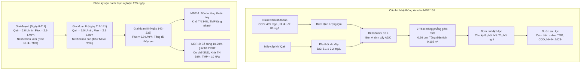
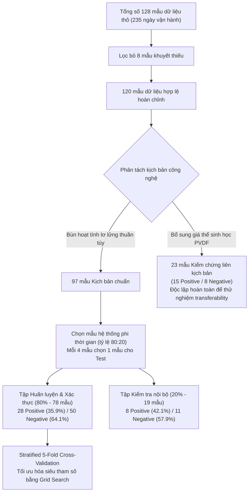

### 2. Vật liệu và phương pháp - Phần 1: Thiết kế thực nghiệm và Khung mô hình hóa

#### 2.1 Thiết kế và vận hành hệ thống MBR thực nghiệm

##### 2.1.1 Cấu tạo và thông số kỹ thuật của lò phản ứng MBR
- **Quy mô và cấu hình hệ phản ứng**:
  - Hệ thống gồm hai lò phản ứng sinh học màng (MBR-1 và MBR-2) vận hành song song.
  - Mỗi lò phản ứng có dung tích làm việc hữu dụng $10\ \text{L}$, thiết kế dạng hình hộp chữ nhật hở nắp.
  - Toàn bộ chu kỳ thực nghiệm kéo dài liên tục $235\ \text{ngày}$ trong điều kiện nhiệt độ phòng ($22 \pm 3^\circ\text{C}$).
  - Bùn vi sinh cấy ban đầu lấy từ bể hiếu khí của nhà máy xử lý nước thải đô thị theo quy trình $A^2/O$ tại Incheon, Hàn Quốc.
- **Module màng gốm phẳng Silicon Carbide (SiC)**:
  - Cụm màng gồm hai tấm màng phẳng gốm SiC đặt chìm trực tiếp trong buồng phản ứng.
  - Kích thước lỗ màng danh định đạt $0.1\ \mu\text{m}$ (thông số màng siêu lọc) với kích thước lỗ đo đạc thực tế $0.56\ \mu\text{m}$.
  - Diện tích bề mặt lọc hữu dụng của mỗi tấm đạt $0.07\ \text{m}^2$ đến $0.0825\ \text{m}^2$, tạo tổng diện tích lọc $0.165\ \text{m}^2$ cho mỗi bể.
  - Vật liệu gốm SiC sở hữu tính ưa nước cao, độ bền cơ học vượt trội và khả năng kháng hóa chất trong dải pH rộng từ $1$ đến $14$.
- **Cơ cấu sục khí đáy và kiểm soát bám bẩn**:
  - Đĩa phân phối khí đặt tại đáy lò phản ứng ngay dưới cụm màng phẳng SiC.
  - Máy thổi khí cấp khí liên tục nhằm duy trì nồng độ oxy hòa tan ($DO$) trung bình ở mức $5.1 \pm 2.2\ \text{mg}\cdot\text{L}^{-1}$.
  - Dòng bọt khí nổi lên tạo ứng suất cắt bề mặt (shear stress). Tác động này liên tục quét sạch các bông bùn bám trên bề mặt màng.
- **Hệ thống cấp nước và hút dịch lọc**:
  - Bơm nhu động cấp nước xám nhân tạo liên tục vào đáy lò.
  - Bơm nhu động rút dịch lọc qua màng vận hành theo chu kỳ timer. Lưu lượng hút thiết kế đạt $0.06\ \text{L}\cdot\text{min}^{-1}$.
  - Chu kỳ vận hành cài đặt $8\ \text{phút}$ hút dịch lọc kết hợp $2\ \text{phút}$ ngừng hút (relaxation) để phục hồi áp suất màng.

##### 2.1.2 Các giai đoạn vận hành và bổ sung giá thể sinh học
- **Thành phần và đặc tính nước xám nhân tạo (Synthetic Greywater)**:
  - Nước xám mô phỏng nước thải tắm giặt gia đình pha chế hàng ngày bằng nước máy sinh hoạt theo công thức của Ongena et al. (2023).
  - Hóa chất thương mại gồm xà phòng tắm, dầu gội đầu, sữa tắm và chất tẩy rửa gia dụng Hàn Quốc.
  - Nhu cầu oxy hóa học ($COD$) và tổng nitơ ($TN$) còn thiếu được bổ sung bằng natri axetat ($CH_3COONa$) và amoni clorua ($NH_4Cl$).
  - Nồng độ các thông số ô nhiễm chính trong nước xám đầu vào:
    - Nồng độ $COD_{in} = 405 \pm 70\ \text{mg}\cdot\text{L}^{-1}$.
    - Nồng độ amoni $NH_4^+-N_{in} = 20 \pm 3\ \text{mg}\cdot\text{L}^{-1}$.
    - Nồng độ tổng nitơ $TN_{in} = 21 \pm 5\ \text{mg}\cdot\text{L}^{-1}$.
    - Tỷ lệ dinh dưỡng $COD : TN \approx 19.3 : 1$, phản ánh đặc trưng nước xám sinh hoạt giàu hợp chất hữu cơ nhưng nghèo vi chất.
- **Giai đoạn I: Vận hành hiếu khí thông lượng thấp (Ngày 0 - Ngày 111)**:
  - Điều kiện vận hành: Thông lượng thẩm thấu thực $J = 2.9\ \text{L}\cdot(\text{m}^2\cdot\text{h})^{-1}$, lưu lượng cấp khí $Q_{air} = 2.0\ \text{L}\cdot\text{min}^{-1}$, lưu lượng dòng vào $Q_{in} \approx 11.7\ \text{mL}\cdot\text{min}^{-1}$ ($0.70\ \text{L}\cdot\text{h}^{-1}$).
  - Cả hai lò phản ứng MBR-1 và MBR-2 đều chỉ vận hành với bùn hoạt tính lơ lửng, không bổ sung giá thể.
  - Hiệu suất xử lý: Quá trình Nitrification diễn ra không đầy đủ do hạn chế oxy cấp. Nồng độ $NH_4^+-N$ nước ra cao ở mức $14 \pm 5\ \text{mg}\cdot\text{L}^{-1}$ (hiệu suất khử chỉ đạt $28\%$). Nồng độ nitrat $NO_3^--N$ sau lọc gần như bằng không.
  - Tỷ lệ sinh khối $MLSS/MLVSS$ ổn định ở mức $0.92 \pm 0.07$, chứng tỏ bùn sinh học chứa tỷ lệ hữu cơ cao và thích nghi tốt.
- **Giai đoạn II: Tăng cường sục khí kích hoạt Nitrification (Ngày 112 - Ngày 141)**:
  - Thay đổi vận hành: Tăng lưu lượng cấp khí lên gấp ba lần đạt $Q_{air} = 6.0\ \text{L}\cdot\text{min}^{-1}$ nhằm cung cấp đủ dưỡng khí cho vi khuẩn nitrat hóa. Giữ nguyên thông lượng nước $J = 2.9\ \text{L}\cdot(\text{m}^2\cdot\text{h})^{-1}$.
  - Hiệu suất xử lý: Quá trình Nitrification được kích hoạt mạnh mẽ. Hiệu suất khử $NH_4^+-N$ tăng vọt lên $95 \pm 1\%$ với nồng độ amoni nước ra giảm xuống $0.9 \pm 0.2\ \text{mg}\cdot\text{L}^{-1}$.
  - Nồng độ nitrat $[NO_3^--N]_{eff}$ tăng cao vượt trội, chứng minh vi khuẩn oxy hóa amoni (AOB) và vi khuẩn oxy hóa nitrit (NOB) chuyển hóa hoàn toàn amoni thành nitrat.
- **Giai đoạn III: Thử nghiệm tải cao và bổ sung giá thể vi sinh PVDF (Ngày 142 - Ngày 235)**:
  - Tăng tải thủy lực: Tăng thông lượng lọc lên $J = 6.9\ \text{L}\cdot(\text{m}^2\cdot\text{h})^{-1}$ và lưu lượng vào lên $Q_{in} \approx 20.6\ \text{mL}\cdot\text{min}^{-1}$ ($1.24\ \text{L}\cdot\text{h}^{-1}$) nhằm kiểm tra độ bền thủy lực.
  - Bổ sung giá thể sinh học: Lò MBR-1 giữ nguyên bùn lơ lửng đối chứng. Lò MBR-2 được bổ sung giá thể bọt xốp Polyvinylidene Fluoride (PVDF) với tỷ lệ thể tích $10\%$ đến $20\%$. Tỷ lệ này giúp hạn chế mài mòn màng và tiết kiệm năng lượng khuấy trộn.
  - Cơ chế đồng thời Nitrat hóa và Khử nitrat (SND): Giá thể PVDF hình thành màng sinh học bám dính (biofilm). Vùng ngoài màng sinh học diễn ra quá trình oxy hóa amoni hiếu khí. Lớp lõi sâu bên trong giá thể hình thành môi trường thiếu khí (anoxic), kích thích vi khuẩn khử nitrat hóa chuyển hóa nitrat thành khí nitơ ($N_2$).
  - Động học sinh khối và bám bẩn màng trong Giai đoạn III:
    - Hiệu suất khử tổng nitơ: Lò MBR-2 đạt $TN$ khử $58 \pm 21\%$, cao hơn rõ rệt so với lò MBR-1 chỉ đạt $34 \pm 15\%$.
    - Nồng độ sinh khối: MBR-2 duy trì $MLSS = 2832 \pm 831\ \text{mg}\cdot\text{L}^{-1}$ và $MLVSS = 2655 \pm 806\ \text{mg}\cdot\text{L}^{-1}$. Lò MBR-1 đạt $MLSS = 2439 \pm 648\ \text{mg}\cdot\text{L}^{-1}$ và $MLVSS = 2191 \pm 543\ \text{mg}\cdot\text{L}^{-1}$.
    - Giảm thiểu tắc nghẽn màng: MBR-2 duy trì áp suất xuyên màng $TMP < 10\ \text{kPa}$ trong suốt giai đoạn tải cao nhờ giá thể hấp phụ chất ngoại bào ($EPS$) và cọ xát làm sạch màng.

---

#### 2.2 Khung mô hình hóa dữ liệu (Data-driven modelling framework)

##### 2.2.1 Phân loại nhị phân đánh giá quá trình Nitrification
- **Quy tắc phân loại nhị phân toán học**:
  - Trạng thái Nitrification Đầy đủ (Sufficient Nitrification, Nhãn $1$ / Dương tính / Positive):
    $$[NO_3^--N] > [NO_2^--N] + [NH_4^+-N]$$
  - Trạng thái Nitrification Không đầy đủ (Insufficient Nitrification, Nhãn $0$ / Âm tính / Negative):
    $$[NO_3^--N] \le [NO_2^--N] + [NH_4^+-N]$$
- **Cơ sở hóa sinh và động học chuyển hóa nitơ**:
  - Quá trình oxy hóa amoni sinh học diễn ra qua hai phản ứng liên tiếp của vi khuẩn tự dưỡng:
    $$NH_4^+ + 1.5 O_2 \xrightarrow{\text{AOB}} NO_2^- + H_2O + 2 H^+$$
    $$NO_2^- + 0.5 O_2 \xrightarrow{\text{NOB}} NO_3^-$$
  - Trong điều kiện cấp đủ oxy hòa tan, tốc độ chuyển hóa của vi khuẩn NOB nhanh hơn hoặc tương đương vi khuẩn AOB. Toàn bộ lượng amoni chuyển hóa nhanh chóng thành nitrat bền vững.
  - Ngưỡng định lượng $[NO_3^--N] > [NO_2^--N] + [NH_4^+-N]$ biểu thị hơn $50\%$ lượng nitơ vô cơ hòa tan trong nước thải đã chuyển hóa hoàn toàn sang dạng oxy hóa cao nhất ($NO_3^-$).
- **Ý nghĩa kỹ thuật môi trường và an toàn tái sử dụng nước**:
  - Khi hệ thống đạt trạng thái Nhãn $1$, nước sau lọc an toàn cho mục đích tái sử dụng phi sinh hoạt (xả bồn cầu, tưới cây cảnh quan, rửa sàn). Nước không phát sinh mùi khai amoniac và không gây độc tế bào.
  - Khi hệ thống rơi vào trạng thái Nhãn $0$, amoni chưa chuyển hóa hoặc nitrit trung gian tích tụ lớn. Tình trạng này làm suy giảm chất lượng nước sau lọc, gây tiêu hao lượng lớn chất khử trùng clo và gia tăng rủi ro phát thải khí nhà kính $N_2O$.
  - Mô hình máy học phân loại nhị phân cung cấp tín hiệu cảnh báo sớm tức thời cho bộ điều khiển tự động nhằm bù lượng oxy kịp thời.

##### 2.2.2 Lựa chọn định tính các biến đầu vào khả thi
- **Danh mục dữ liệu thu thập thô ban đầu**:
  - Nhóm 1 - Thông số thủy lực: Thời gian lưu nước ($HRT$), thời gian lưu bùn ($SRT$).
  - Nhóm 2 - Yếu tố vận hành: Áp suất xuyên màng ($TMP$), lưu lượng khí cấp ($Q_{air}$), lưu lượng dòng vào ($Q_{in}$), lưu lượng dịch lọc ($Q_{eff}$), thông lượng thô, thông lượng thực, tỷ lệ hồi phục thông lượng.
  - Nhóm 3 - Chất lượng nước và sinh khối: $COD$, $TN$, $NH_4^+-N$, $NO_3^--N$, $NO_2^--N$ (đo trong dòng vào, dòng ra và bùn lơ lửng), chất rắn lơ lửng ($TSS$), $DO$, $MLSS$, $MLVSS$.
- **Ba nguyên tắc sàng lọc định tính cho triển khai thực tế**:
  1. *Khả năng đo đạc trực tiếp (Direct Measurability)*: Chỉ chọn các thông số thu nhận trực tiếp từ thiết bị đo. Loại bỏ các biến tính toán gián tiếp ngoại tuyến ($SRT$, hiệu suất khử chất ô nhiễm).
  2. *Tương thích cảm biến online thương mại (Commercial Sensor Compatibility)*: Chọn các đại lượng có đầu dò công nghiệp bền bỉ, thời gian đáp ứng ngắn và chi phí đầu tư hợp lý. Không dùng đầu dò cắm trực tiếp trong bùn lơ lửng.
  3. *Mức độ gắn kết vận hành màng (Operational Relevance)*: Ưu tiên các thông số thể hiện biến động áp suất và thủy lực học của hệ MBR.
- **Sáu biến đặc trưng đầu vào được chọn chính thức**:
  - 3 thông số vận hành hệ thống:
    1. Lưu lượng cấp khí $Q_{air}\ (\text{L}\cdot\text{min}^{-1})$: Thu nhận qua đồng hồ đo lưu lượng khí nén online.
    2. Lưu lượng nước đầu vào $Q_{in}\ (\text{mL}\cdot\text{min}^{-1}\ \text{hoặc}\ \text{L}\cdot\text{h}^{-1})$: Giám sát tức thời từ bơm cấp định lượng.
    3. Áp suất xuyên màng $TMP\ (\text{kPa})$: Đo qua cảm biến áp suất đặt trên đường ống thu nước sau màng SiC.
  - 3 thông số chất lượng nước dịch lọc sau màng:
    4. Nồng độ $COD_{eff}\ (\text{mg}\cdot\text{L}^{-1})$: Đo bằng cảm biến quang phổ hấp thụ tử ngoại ($UV_{254}$) online trên dòng lọc trong suốt.
    5. Nồng độ nitrat $[NO_3^--N]_{eff}\ (\text{mg}\cdot\text{L}^{-1})$: Đo bằng đầu dò chọn lọc ion quang học online sau màng.
    6. Nồng độ amoni $[NH_4^+-N]_{eff}\ (\text{mg}\cdot\text{L}^{-1})$: Đo bằng cảm biến điện cực ion chọn lọc ($ISE$) gắn tại đường xả nước sau màng.
- **Cơ sở kỹ thuật loại bỏ các thông số không phù hợp**:
  - *Loại bỏ biến oxy hòa tan ($DO$)*: Tỷ lệ mất dữ liệu thực tế vượt $50\%$ do đầu dò quang học đặt trong bể bùn bị màng nhầy sinh học bao phủ gây trôi dạt tín hiệu. Lưu lượng khí $Q_{air}$ được giữ lại làm biến đại diện vật lý tin cậy cho mức cung cấp oxy.
  - *Loại bỏ biến tổng nitơ ($TN$)*: Cảm biến $TN$ online thương mại có chi phí thiết bị rất đắt ($>15.000\ \text{USD}$), yêu cầu bảo trì phức tạp và đòi hỏi thời gian phản ứng hóa học $30 - 60\ \text{phút}$. Độ trễ này không đáp ứng điều khiển phản hồi thời gian thực trong các hệ thống xử lý nước xám phân tán.
  - *Loại bỏ các thông số nước thô đầu vào (Influent Water Quality)*: Nước xám đầu vào chứa nhiều cặn thô, dầu mỡ và chất hoạt động bề mặt phức tạp làm hỏng cảm biến (hòa tan bề mặt điện cực tham chiếu $Ag/AgCl$). Nước sau lọc qua màng SiC $0.1\ \mu\text{m}$ không còn hạt lơ lửng, tạo điều kiện lý tưởng cho cảm biến online hoạt động ổn định lâu dài.
  - *Loại bỏ nitrit sau lọc ($NO_2^--N$)*: Nồng độ $NO_2^--N$ trong hệ MBR rất thấp và không ổn định, đầu dò đo đạc cho tín hiệu nhiễu lớn.
  - *Loại bỏ lưu lượng dịch lọc ($Q_{eff}$)*: Hệ màng gốm có tỷ lệ phục hồi thông lượng vượt $97\%$. Đại lượng $Q_{eff}$ tương quan tuyến tính chặt chẽ với $Q_{in}$, gây hiện tượng đa cộng tuyến (multicollinearity).

| Tên biến đặc trưng | Ký hiệu | Đơn vị đo | Loại biến | Phương thức đo đạc thực tế | Lý do lựa chọn vào mô hình |
| :--- | :--- | :--- | :--- | :--- | :--- |
| Lưu lượng cấp khí | $Q_{air}$ | $\text{L}\cdot\text{min}^{-1}$ | Vận hành | Đồng hồ đo khí online | Đại diện vật lý cho nguồn cấp dưỡng khí thay thế cảm biến DO bị lỗi |
| Lưu lượng dòng vào | $Q_{in}$ | $\text{L}\cdot\text{h}^{-1}$ | Vận hành | Tín hiệu bơm cấp online | Phản ánh tải trọng thủy lực và thời gian lưu nước tức thời |
| Áp suất xuyên màng | $TMP$ | $\text{kPa}$ | Vận hành | Cảm biến áp suất dịch lọc | Đo lường mức độ bám bẩn bề mặt màng và độ bền truyền khối |
| Nồng độ COD sau màng | $COD_{eff}$ | $\text{mg}\cdot\text{L}^{-1}$ | Chất lượng nước | Đầu dò quang học $UV_{254}$ | Phản ánh mức độ khoáng hóa chất hữu cơ carbon trong buồng phản ứng |
| Nồng độ $NO_3^--N$ sau màng | $[NO_3^--N]_{eff}$ | $\text{mg}\cdot\text{L}^{-1}$ | Chất lượng nước | Cảm biến điện cực ion/quang | Đo lường sản phẩm chuyển hóa cuối cùng của chuỗi Nitrification |
| Nồng độ $NH_4^+-N$ sau màng | $[NH_4^+-N]_{eff}$ | $\text{mg}\cdot\text{L}^{-1}$ | Chất lượng nước | Đầu dò ISE online | Đo lường nồng độ cơ chất amoni dư thừa chưa được vi khuẩn oxy hóa |

##### 2.2.3 Tiền xử lý dữ liệu và lọc sạch nhiễu
- **Quy trình loại bỏ dữ liệu khuyết thiếu**:
  - Tổng số bản ghi đo đạc hàng ngày thu thập trong $235\ \text{ngày}$ từ hai lò MBR là $128\ \text{mẫu}$.
  - Phát hiện và loại bỏ $8\ \text{mẫu}$ bị mất mát giá trị do gián đoạn cảm biến hoặc sự cố mất điện.
  - Tập dữ liệu sạch thu được gồm $120\ \text{mẫu}$ hoàn chỉnh phục vụ toàn bộ quy trình mô hình hóa.
- **Chiến lược giữ nguyên các giá trị đột biến (Outliers Retention)**:
  - Các hệ thống xử lý nước xám phân tán tại chỗ luôn chịu biến động bất thường về lưu lượng xả và nồng độ chất giặt tẩy.
  - Các giá trị đột biến đo được không phát sinh từ lỗi cảm biến mà phản ánh đúng biến động tải trọng thực tế của nước xám.
  - Nghiên cứu cố tình giữ nguyên các giá trị đột biến này trong tập dữ liệu nhằm đánh giá chính xác độ ổn định và khả năng chịu tải của các thuật toán máy học.
- **Quy chuẩn hóa đặc trưng (Standardization / Z-score Normalization)**:
  - Các biến đầu vào có sự chênh lệch lớn về thang đo số học (ví dụ $TMP$ biến thiên từ $1$ đến $25\ \text{kPa}$, trong khi $Q_{air}$ nằm trong khoảng $2$ đến $6\ \text{L}\cdot\text{min}^{-1}$, và $COD_{eff}$ dao động từ $10$ đến $80\ \text{mg}\cdot\text{L}^{-1}$).
  - Áp dụng kỹ thuật Z-score chuẩn hóa tất cả các biến đầu vào liên tục theo công thức:
    $$z = \frac{x - \mu}{\sigma}$$
  - Trong đó $x$ là giá trị thực tế, $\mu$ là giá trị trung bình mẫu, và $\sigma$ là độ lệch chuẩn của biến tương ứng.
  - Phép biến đổi đưa phân phối của từng đặc trưng về dạng có giá trị trung bình bằng $0$ và phương sai bằng $1$, giúp thuật toán tối ưu hội tụ nhanh và triệt tiêu sai số thiên vị trọng số.

##### 2.2.4 Chiến lược phân chia tập dữ liệu huấn luyện và kiểm chứng
- **Phân tách hai kịch bản công nghệ độc lập**:
  - *Tập dữ liệu kịch bản chuẩn (Standard Scenario - Bùn hoạt tính lơ lửng)*: Gồm $97\ \text{mẫu}$ thu thập từ các giai đoạn không bổ sung giá thể sinh học. Tập dữ liệu này dùng để huấn luyện, tinh chỉnh siêu tham số và kiểm tra nội bộ mô hình.
  - *Tập dữ liệu kiểm chứng liên kịch bản (Cross-Scenario Test Set - Bổ sung giá thể PVDF)*: Gồm $23\ \text{mẫu}$ thu thập từ lò MBR-2 trong Giai đoạn III. Tập này được giữ độc lập tuyệt đối, không tham gia vào quá trình huấn luyện nhằm kiểm tra năng lực thích ứng của mô hình khi hệ thống thay đổi bản chất công nghệ.
- **Phương pháp lấy mẫu hệ thống khắc phục trôi dạt dữ liệu theo thời gian**:
  - Chế độ vận hành của hệ thống thay đổi theo mốc thời gian: Lưu lượng khí $Q_{air}$ đổi từ $2.0$ lên $6.0\ \text{L}\cdot\text{min}^{-1}$ tại ngày 111; lưu lượng nước $Q_{in}$ đổi từ $11.7$ lên $20.6\ \text{mL}\cdot\text{min}^{-1}$ tại ngày 149.
  - Phân chia dữ liệu tuần tự theo thời gian (chronological split) sẽ gây mất cân bằng nghiêm trọng giữa tập huấn luyện và kiểm tra.
  - Áp dụng phương pháp chọn mẫu hệ thống phi thời gian: Cứ mỗi $4\ \text{điểm}$ dữ liệu liên tiếp, lấy $1\ \text{điểm}$ đưa vào tập kiểm tra ($20\%$), và $3\ \text{điểm}$ còn lại đưa vào tập huấn luyện ($80\%$). Kỹ thuật này đảm bảo cả hai tập dữ liệu đều bao phủ đầy đủ các vùng vận hành động học.
- **Cơ cấu phân bổ nhãn trong kịch bản chuẩn**:
  - *Tập huấn luyện và tối ưu (Training/Validation Set - 80%)*: Gồm $78\ \text{mẫu}$, trong đó có $28\ \text{mẫu}$ Dương tính ($35.9\%$) và $50\ \text{mẫu}$ Âm tính ($64.1\%$).
  - *Tập kiểm tra kịch bản chuẩn (Test Set - 20%)*: Gồm $19\ \text{mẫu}$, trong đó có $8\ \text{mẫu}$ Dương tính ($42.1\%$) và $11\ \text{mẫu}$ Âm tính ($57.9\%$).
- **Kỹ thuật kiểm chứng chéo phân tầng (Stratified 5-Fold Cross-Validation)**:
  - Quá trình tinh chỉnh siêu tham số thực hiện trên $78\ \text{mẫu}$ của tập huấn luyện bằng thư viện `Scikit-Learn` (`StratifiedKFold`).
  - Dữ liệu được chia thành $5\ \text{phần}$ con (folds). Mỗi fold đều duy trì tỷ lệ nhãn Dương : Âm xấp xỉ tỷ lệ gốc ($~36\% : 64\%$). Kỹ thuật phân tầng ngăn ngừa hiện tượng một fold bất kỳ bị lệch nhãn gây sai lệch kết quả đánh giá.
- **Đặc trưng tập kiểm chứng liên kịch bản (Cross-Scenario Test Set)**:
  - Tập kiểm chứng gồm $23\ \text{mẫu}$ độc lập có phân phối nhãn đảo ngược: $15\ \text{mẫu}$ Dương tính ($65.2\%$) và $8\ \text{mẫu}$ Âm tính ($34.8\%$).
  - Tỷ lệ nhãn dương áp đảo phản ánh hiệu quả cải thiện Nitrification vượt bậc từ giá thể PVDF.
  - Sử dụng tập dữ liệu này giúp đánh giá năng lực chuyển giao mô hình (model transferability) sang điều kiện vận hành chưa từng học.

---

#### 2.3 Bài toán tính toán mẫu: Phân loại nhãn trạng thái và Phân bổ dữ liệu thực nghiệm

##### 2.3.1 Bài toán (Problem)
Xác định nhãn phân loại nhị phân trạng thái Nitrification cho hai mẫu nước sau lọc thu được từ hệ thống Aerobic MBR và tính toán cơ cấu phân bổ số lượng mẫu dữ liệu cho các phân tập huấn luyện, kiểm tra nội bộ và kiểm chứng liên kịch bản.

##### 2.3.2 Dữ liệu cho trước (Given)
- **Mẫu dữ liệu A (Giai đoạn II, Ngày 125)**:
  - $Q_{air} = 6.0\ \text{L}\cdot\text{min}^{-1}$, $Q_{in} = 0.70\ \text{L}\cdot\text{h}^{-1}$, $TMP = 4.2\ \text{kPa}$.
  - $COD_{eff} = 22.0\ \text{mg}\cdot\text{L}^{-1}$, $[NO_3^--N] = 16.5\ \text{mg}\cdot\text{L}^{-1}$, $[NO_2^--N] = 0.3\ \text{mg}\cdot\text{L}^{-1}$, $[NH_4^+-N] = 0.8\ \text{mg}\cdot\text{L}^{-1}$.
- **Mẫu dữ liệu B (Giai đoạn I, Ngày 45)**:
  - $Q_{air} = 2.0\ \text{L}\cdot\text{min}^{-1}$, $Q_{in} = 0.70\ \text{L}\cdot\text{h}^{-1}$, $TMP = 2.1\ \text{kPa}$.
  - $COD_{eff} = 48.0\ \text{mg}\cdot\text{L}^{-1}$, $[NO_3^--N] = 2.1\ \text{mg}\cdot\text{L}^{-1}$, $[NO_2^--N] = 1.2\ \text{mg}\cdot\text{L}^{-1}$, $[NH_4^+-N] = 13.5\ \text{mg}\cdot\text{L}^{-1}$.
- **Tập số liệu thống kê tổng thể**:
  - Tổng số bản ghi thô: $N_{raw} = 128\ \text{mẫu}$.
  - Số bản ghi lỗi mất tín hiệu: $N_{err} = 8\ \text{mẫu}$.
  - Số mẫu giai đoạn bổ sung giá thể PVDF (Giai đoạn III, MBR-2): $N_{cross} = 23\ \text{mẫu}$.
  - Tỷ lệ phân chia tập kịch bản chuẩn: Huấn luyện $80\%$, Kiểm tra $20\%$.

##### 2.3.3 Công thức áp dụng (Formulas)
- Phương trình gán nhãn nhị phân trạng thái Nitrification $y \in \{0, 1\}$:
  $$y = \begin{cases} 1\ (\text{Sufficient / Dương tính}), & \text{nếu } [NO_3^--N] > [NO_2^--N] + [NH_4^+-N] \\ 0\ (\text{Insufficient / Âm tính}), & \text{nếu } [NO_3^--N] \le [NO_2^--N] + [NH_4^+-N] \end{cases}$$
- Xác định số mẫu hợp lệ $N_{valid}$ và số mẫu kịch bản chuẩn $N_{std}$:
  $$N_{valid} = N_{raw} - N_{err}$$
  $$N_{std} = N_{valid} - N_{cross}$$
- Xác định số mẫu tập kiểm tra nội bộ $N_{test}$ và tập huấn luyện $N_{train}$:
  $$N_{test} = \text{round}(N_{std} \times 0.20)$$
  $$N_{train} = N_{std} - N_{test}$$

##### 2.3.4 Các bước tính toán chi tiết (Steps)
- **Bước 1: Phân loại nhãn cho Mẫu A**:
  - Tính tổng nồng độ nitơ dạng khử và trung gian:
    $$\Sigma_{\text{red}} = [NO_2^--N] + [NH_4^+-N] = 0.3 + 0.8 = 1.1\ \text{mg}\cdot\text{L}^{-1}$$
  - So sánh nồng độ nitrat với tổng trên:
    $$[NO_3^--N] = 16.5\ \text{mg}\cdot\text{L}^{-1} > 1.1\ \text{mg}\cdot\text{L}^{-1}$$
  - Kết luận: Mẫu A thỏa mãn điều kiện Nitrat hóa Đầy đủ $\implies y_A = 1$ (Nhãn Positive).
- **Bước 2: Phân loại nhãn cho Mẫu B**:
  - Tính tổng nồng độ nitơ dạng khử và trung gian:
    $$\Sigma_{\text{red}} = [NO_2^--N] + [NH_4^+-N] = 1.2 + 13.5 = 14.7\ \text{mg}\cdot\text{L}^{-1}$$
  - So sánh nồng độ nitrat với tổng trên:
    $$[NO_3^--N] = 2.1\ \text{mg}\cdot\text{L}^{-1} \le 14.7\ \text{mg}\cdot\text{L}^{-1}$$
  - Kết luận: Mẫu B rơi vào trạng thái Nitrat hóa Không đầy đủ $\implies y_B = 0$ (Nhãn Negative).
- **Bước 3: Tính toán số lượng mẫu dữ liệu phân tập**:
  - Tổng số mẫu hợp lệ sau tiền xử lý:
    $$N_{valid} = 128 - 8 = 120\ \text{mẫu}$$
  - Số lượng mẫu kịch bản chuẩn không giá thể:
    $$N_{std} = 120 - 23 = 97\ \text{mẫu}$$
  - Số lượng mẫu của tập kiểm tra nội bộ kịch bản chuẩn:
    $$N_{test} = 19\ \text{mẫu}\quad (\text{chiếm } 19/97 \approx 19.59\% \approx 20\%)$$
  - Số lượng mẫu của tập huấn luyện và tối ưu nội bộ:
    $$N_{train} = 97 - 19 = 78\ \text{mẫu}\quad (\text{chiếm } 78/97 \approx 80.41\% \approx 80\%)$$

##### 2.3.5 Kết quả (Result)
- Nhãn phân loại: Mẫu A gán nhãn $1$ (Sufficient Nitrification); Mẫu B gán nhãn $0$ (Insufficient Nitrification).
- Phân bổ cấu trúc dữ liệu:
  - Tập huấn luyện/xác thực nội bộ: $78\ \text{mẫu}$ ($28\ \text{dương}, 50\ \text{âm}$).
  - Tập kiểm tra nội bộ: $19\ \text{mẫu}$ ($8\ \text{dương}, 11\ \text{âm}$).
  - Tập kiểm chứng liên kịch bản độc lập: $23\ \text{mẫu}$ ($15\ \text{dương}, 8\ \text{âm}$).
  - Tổng cộng toàn bộ dữ liệu hợp lệ: $120\ \text{mẫu}$.
