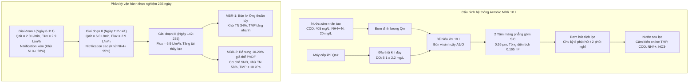
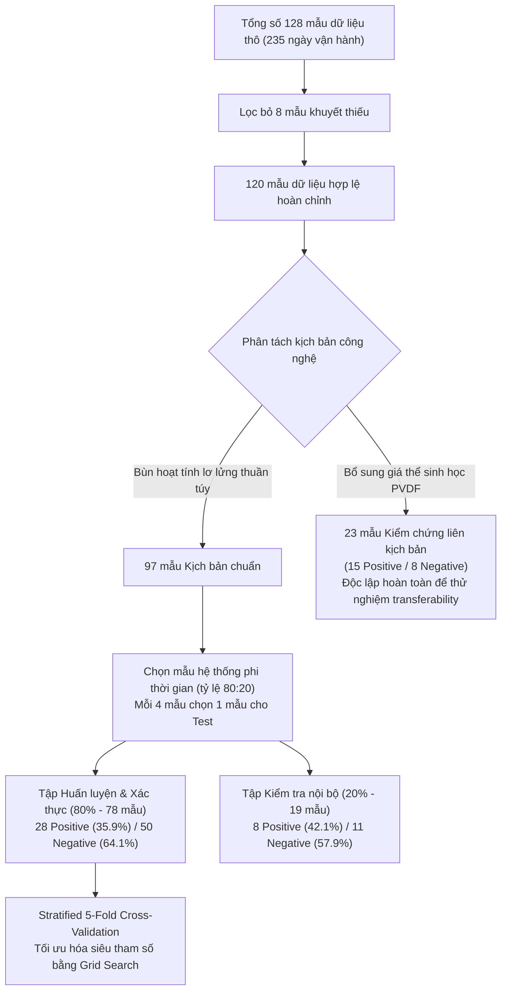

---
markmap:
  initialExpandLevel: 2
  maxWidth: 420
---

# Dự đoán trạng thái Nitrification trong bể phản ứng màng sinh học hiếu khí (Aerobic MBR) bằng mô hình học máy giải thích được
## 1. Giới thiệu và Bối cảnh nghiên cứu (Introduction & Background)

### 1.1 Tái sử dụng nước xám và công nghệ MBR phân tán

#### 1.1.1 Tiềm năng và đặc tính nước xám sinh hoạt
- Định nghĩa nước xám (Greywater): Dòng nước thải sinh hoạt không chứa nguồn thải đen từ bồn cầu (toilet contributions). Dòng nước này bắt nguồn từ vòi tắm, vòi sen, máy giặt và bồn rửa tay.
- Tỷ trọng phát sinh: Nước xám chiếm khoảng $70\%$ tổng lượng nước thải sinh hoạt hộ gia đình (Shaikh và Ahammed, 2020).
- Dải lưu lượng phát sinh: Lượng phát sinh dao động từ $20$ đến $220\text{ L/người/ngày}$ phụ thuộc vào hành vi tiêu dùng và mức độ tiện nghi.
- Lợi ích của tái sử dụng tại nguồn (On-site reuse):
  - Bảo tồn tài nguyên nước sạch đô thị.
  - Tăng cường tính chống chịu và độ phục hồi của hệ thống cấp nước đô thị trước hạn hán (Liu và cộng sự, 2023; Maggiotto, 2022).
  - Giảm tải áp lực dòng chảy và thể tích xả thải lên mạng lưới thoát nước tập trung.
- Đặc tính dao động tải nạp trong hệ phân tán:
  - Tải nạp biến thiên mạnh theo chu kỳ sinh hoạt ngày đêm và theo các mùa trong năm.
  - Chu kỳ xả nước thấp kéo dài xen kẽ những đỉnh xả đột biến trong các khung giờ cao điểm.
  - Nồng độ chất hữu cơ và chất hoạt động bề mặt biến động lớn, gây khó khăn cho các phương án kiểm soát vận hành theo kinh nghiệm (DelaPaz-Ruíz và cộng sự, 2024; Hassan và cộng sự, 2024).

#### 1.1.2 Vai trò và cấu tạo của hệ MBR hiếu khí
- Vị trí công nghệ: Bể phản ứng sinh học màng (Membrane Bioreactor - MBR) là giải pháp công nghệ hàng đầu cho xử lý nước xám phân tán tại chỗ (Gao và cộng sự, 2025).
- Cơ chế vận hành tích hợp: MBR kết hợp quá trình bùn hoạt tính hiếu khí với quá trình phân tách pha rắn - lỏng qua màng lọc (Boleydei và Vaneeckhaute, 2024).
- Phản ứng sinh học trong bể hiếu khí:
  - Quá trình oxy hóa dị dưỡng (Heterotrophic oxidation) để loại bỏ nhu cầu oxy hóa học (COD).
  - Quá trình chuyển hóa nitơ tự dưỡng (Autotrophic nitrification) để oxy hóa amoni.
- Tách pha chất rắn qua màng lọc:
  - Màng vi lọc hoặc siêu lọc (như màng gốm phẳng SiC) giữ lại toàn bộ sinh khối bùn vi sinh trong bể phản ứng.
  - Hệ thống loại bỏ hoàn toàn nhu cầu xây dựng bể lắng thứ cấp truyền thống.
- Các ưu thế kỹ thuật nổi bật:
  - Dấu chân diện tích (footprint) nhỏ gọn, tối ưu không gian cho các công trình phân tán.
  - Chất lượng nước sau lọc ổn định và đạt tiêu chuẩn khắt khe cho mục đích tái sử dụng như dội bồn cầu hoặc tưới cây.

### 1.2 Thách thức trong giám sát và kiểm soát quá trình Nitrification

#### 1.2.1 Cơ chế phản ứng Nitrification
- Định nghĩa: Nitrification là quá trình sinh học oxy hóa các hợp chất nitơ khử thành ion nitrat bền vững. Quá trình này giúp nước sau xử lý đạt chuẩn an toàn tái sử dụng.
- Cơ chế phản ứng sinh hóa hai giai đoạn nối tiếp:
  - Giai đoạn 1 (Nitrit hóa - Nitritation): Vi khuẩn oxy hóa amoni (Ammonia-Oxidizing Bacteria - AOB) chuyển hóa $NH_4^+-N$ thành $NO_2^--N$:
    $$2NH_4^+ + 3O_2 \xrightarrow{AOB} 2NO_2^- + 4H^+ + 2H_2O$$
  - Giai đoạn 2 (Nitrat hóa - Nitratation): Vi khuẩn oxy hóa nitrit (Nitrite-Oxidizing Bacteria - NOB) chuyển hóa $NO_2^--N$ thành $NO_3^--N$:
    $$2NO_2^- + O_2 \xrightarrow{NOB} 2NO_3^-$$
  - Phương trình chuyển hóa tổng quát:
    $$NH_4^+ + 2O_2 \xrightarrow{} NO_3^- + 2H^+ + H_2O$$
- Nhu cầu tiêu thụ oxy hòa tan và độ kiềm:
  - Quá trình oxy hóa hoàn toàn $1\text{ g } NH_4^+-N$ đòi hỏi lý thuyết $4.57\text{ g } O_2$.
  - Phản ứng giải phóng ion $H^+$, làm tiêu hao khoảng $7.14\text{ g } CaCO_3$ độ kiềm trên mỗi gam $NH_4^+-N$ bị chuyển hóa.
- Độ nhạy cảm của vi sinh vật tự dưỡng:
  - Quần thể AOB và NOB có tốc độ sinh trưởng riêng ($\mu_{max}$) chậm hơn nhiều so với vi khuẩn dị dưỡng.
  - Vi sinh vật tự dưỡng rất dễ bị ức chế bởi sốc tải nạp độc chất, dao động nhiệt độ, giảm pH và thiếu oxy cục bộ.

#### 1.2.2 Hạn chế của chiến lược điều khiển PID và cảm biến DO truyền thống
- Nguyên lý điều khiển PID: Các trạm xử lý nước thải tập trung sử dụng bộ điều khiển tỷ lệ - tích phân - vi phân (PID) để duy trì oxy hòa tan (DO) tại một điểm đặt cố định (Gu và cộng sự, 2023).
- Lãng phí năng lượng sục khí: Điểm đặt DO cố định không thích ứng theo tải nạp thực tế, gây tiêu tốn điện năng sục khí dư thừa trong các khung giờ tải nạp thấp.
- Kém thích ứng với biến động động học trong hệ phân tán:
  - Hệ thống xử lý tại chỗ chịu biến động tải nạp lớn và đột ngột (amplified load variability).
  - Bộ điều khiển PID chỉ chỉnh van khí theo nồng độ DO dư, thiếu khả năng điều chỉnh động theo tải lượng $NH_4^+-N$ thực tế đi vào hệ thống (Li và cộng sự, 2022; Shi và cộng sự, 2024).
- Suy giảm chất lượng đo lường của cảm biến DO ngập nước:
  - Đầu dò DO ngâm trực tiếp trong bùn hoạt tính chịu sục khí liên tục.
  - Tích tụ bùn và màng bám sinh học (biofouling) diễn ra nhanh trên màng cảm biến, dẫn đến hiện tượng trôi dạt tín hiệu đo (sensor drift).
  - Sai lệch tín hiệu làm bộ điều khiển nhầm lẫn giữa sự cố cảm biến và sự biến đổi tải nạp thật, gây mất ổn định kiểm soát quá trình.

#### 1.2.3 Khó khăn khi sử dụng cảm biến online đo hợp chất Nitơ
- Chi phí đầu tư và bảo trì cao:
  - Các cảm biến đo online $NH_4^+-N$, $NO_2^--N$ và $NO_3^--N$ thương mại có giá thành rất cao (Huang và cộng sự, 2024).
  - Cần quy trình bảo dưỡng liên tục và hóa chất chuẩn phức tạp, vượt quá khả năng tài chính của các hệ xử lý phân tán.
- Tác động bất lợi của môi trường bùn nồng độ cao:
  - Nồng độ bùn hoạt tính lơ lửng cao trong bể MBR nhanh chóng làm tắc nghẽn bề mặt màng bán thấm hoặc thấu kính quang học.
  - Chất hữu cơ hòa tan, chất rắn lơ lửng và các ion cản trở trong nước xám gây méo mó kết quả đo.
- Độ trễ thời gian phản hồi:
  - Đầu dò đo hợp chất nitơ có độ trễ đo lường (response lag) tương đối lớn.
  - Độ trễ này không bắt kịp các biến động nitơ diễn ra tức thời, cản trở việc kiểm soát tối ưu theo thời gian thực.
- Thách thức chưa được giải quyết trong hệ MBR phân tán:
  - Hiệu suất Nitrification biến động tạo ra nguy cơ đứt gãy quy trình, ngay cả khi chất lượng nước sau lọc tạm thời đạt chuẩn.
  - Các nghiên cứu trước đây chưa cung cấp giải pháp giám sát online khả thi và kinh tế cho trạng thái Nitrification trong lòng bể MBR phân tán.

### 1.3 Ứng dụng Machine Learning giải thích được trong giám sát quá trình

#### 1.3.1 Khái niệm cảm biến mềm (Soft Sensor) dựa trên dữ liệu
- Cơ chế cảm biến mềm:
  - Ước tính trạng thái sinh học phức tạp khó đo trực tiếp (trạng thái Nitrification) thông qua mô hình toán học và các biến đo lường sẵn có (Van de Walle và cộng sự, 2023).
  - Cảm biến mềm khai thác dữ liệu vận hành vật lý của hệ thống cùng với các chỉ tiêu chất lượng nước sau lọc màng.
- Lợi ích loại bỏ cảm biến xâm lấn:
  - Không đặt đầu dò đo nitơ trực tiếp trong bùn lơ lửng, loại bỏ nguy cơ bám bẩn sinh học trên cảm biến.
  - Thời gian phản hồi tức thì với chi phí bảo trì rất thấp, hỗ trợ can thiệp quy trình kịp thời (Bahramian và cộng sự, 2023).
- So sánh với mô hình cơ chế sinh học:
  - Mô hình học máy dựa trên dữ liệu (Data-driven ML) cần ít thông số đầu vào hơn mô hình cơ chế bùn hoạt tính truyền thống (như dòng mô hình ASM) (Duarte và cộng sự, 2024).
  - Tránh được quy trình hiệu chuẩn hàng chục thông số động học phức tạp, phù hợp cho trạm phân tán vận hành tự động.
- Chuyển đổi từ giám sát thụ động dòng ra sang giám sát tiến trình chủ động:
  - Nghiên cứu trước đây chủ yếu tập trung dự đoán chất lượng nước đầu ra cuối cùng, hiệu suất tách chất ô nhiễm hoặc hiện tượng tắc màng lọc (Muniz de Queiroz và cộng sự, 2025; Shi và cộng sự, 2022; Zhong và cộng sự, 2022).
  - Việc chỉ giám sát dòng ra có tính chất thụ động, tốn công sức, không thể can thiệp kịp thời trước các biến cố bất thường và không thể truy nguyên khiếm khuyết tiến trình (Moretti và cộng sự, 2024).
  - Giám sát tiến trình thời gian thực (Real-time process monitoring) cho phép kiểm soát chủ động, tăng cường độ dẻo dai của hệ thống và cảnh báo sớm sự cố sinh học.

#### 1.3.2 Nhu cầu về tính giải thích được (Interpretable ML)
- Yêu cầu xây dựng niềm tin pháp lý và cộng đồng:
  - Nước xám tái sử dụng tiếp xúc gần với con người, đòi hỏi độ tin cậy tuyệt đối về mặt dịch tễ và quy chuẩn xả thải (Allen và cộng sự, 2024).
  - Mô hình học máy phải minh bạch lý do ra quyết định, tránh hiện tượng "hộp đen" (black box) gây e ngại cho người vận hành.
- Khám phá cơ chế và khắc phục khiếm khuyết mô hình:
  - Khả năng giải thích nội tại và hậu nghiệm giúp kỹ sư hiểu rõ tương tác giữa các biến vận hành và phản ứng sinh học.
  - Nhận diện độ nhạy của dự đoán trước các hạn chế của dữ liệu huấn luyện và hiện tượng lệch phân phối dữ liệu (distributional biases).
  - Cung cấp định hướng cụ thể để tinh chỉnh thuật toán trước khi triển khai ngoài thực địa.

#### 1.3.3 Mục tiêu cốt lõi và đóng góp của công trình
- Thiết lập bài toán phân loại nhị phân trạng thái Nitrification:
  - Dự đoán trạng thái Nitrification ở hai mức nhãn: "Đầy đủ" (Sufficient - Positive class) hoặc "Không đầy đủ" (Insufficient - Negative class).
  - Tiêu chuẩn trạng thái Nitrification đầy đủ: Nồng độ $NO_3^--N$ sau màng lớn hơn tổng nồng độ của $NO_2^--N$ và $NH_4^+-N$ ($NO_3^--N > NO_2^--N + NH_4^+-N$).
- Tuyển chọn 6 biến đầu vào tương thích cảm biến thương mại:
  - Tiêu chuẩn tuyển chọn: Đo lường trực tiếp được, tương thích cảm biến online sẵn có, và có ý nghĩa vật lý vận hành.
  - 3 thông số vận hành hệ thống: Lưu lượng sục khí ($AirFlow$), Lưu lượng nước thải đầu vào ($InfluentFlow$), và Áp suất xuyên màng ($TMP$).
  - 3 chỉ tiêu dòng thấm sau màng: Nhu cầu oxy hóa học ($COD$), Nồng độ nitrat ($NO_3^--N$), và Nồng độ amoni ($NH_4^+-N$).
  - Loại bỏ các biến bất khả thi: Biến DO bị loại do tỷ lệ thiếu hụt dữ liệu trên $50\%$; biến tổng nitơ ($TN$) bị loại do cảm biến đắt đỏ và độ trễ đo lớn.
- Đánh giá có hệ thống ba thuật toán học máy giải thích được:
  - Hồi quy Logistic (Logistic Regression - LR): Mô hình tuyến tính đơn giản, có độ chệch cao (high bias) và phương sai thấp (low variance).
  - Rừng ngẫu nhiên (Random Forest - RF): Mô hình kết hợp biểu quyết cây quyết định, cân bằng giữa độ chệch và phương sai.
  - Tăng cường độ dốc cực đại (Extreme Gradient Boosting - XGB): Mô hình chuỗi cây tuần tự, có độ chệch thấp (low bias) và phương sai cao (high variance).
- Chiến lược tối ưu hóa ưu tiên độ chính xác dự đoán dương (Precision):
  - Mục tiêu cốt lõi: Ngăn chặn rủi ro đưa ra quyết định sai lầm khi hệ thống thiếu hụt nitrit hóa nhưng bị mô hình phân loại nhầm thành đầy đủ.
  - Tối đa hóa Precision đạt được thông qua việc ép thấp tỷ lệ dương tính giả ($FPR \to 0$) trong khi vẫn đảm bảo tỷ lệ dương tính thật ($TPR$) cao.
  - Hiệu suất trong điều kiện chuẩn (hệ bùn lơ lửng không giá thể): Cả LR và XGB đều đạt điểm Precision trên $0.85$.
- Giải thích hậu nghiệm và kiểm chứng liên kịch bản (Cross-scenario validation):
  - Sử dụng phân tích SHAP (SHapley Additive exPlanations), tầm quan trọng đặc trưng, và phân tích tương quan cặp để làm rõ cơ chế dự đoán.
  - Kiểm chứng mô hình đã huấn luyện từ hệ MBR bùn lơ lửng sang hệ MBR lai bổ sung giá thể sinh học PVDF thực hiện đồng thời nitrat hóa và khử nitrat (Simultaneous Nitrification-Denitrification - SND).
  - Mô hình RF thể hiện khả năng tổng quát hóa xuất sắc nhất với điểm Precision đạt $0.87$, chứng minh tính chuyển giao thực tiễn cao.
  - Đề xuất khung điều khiển sục khí tự động thích ứng dựa trên kết quả giám sát thời gian thực nhằm tối ưu hóa năng lượng và chất lượng nước.

## 2. Vật liệu và phương pháp thực nghiệm (Material and Experimental Methods)

### 2.1 Thiết kế và vận hành hệ thống MBR thực nghiệm

#### 2.1.1 Cấu tạo và thông số kỹ thuật của lò phản ứng MBR
- **Quy mô và cấu hình hệ phản ứng**:
  - Hệ thống gồm hai lò phản ứng sinh học màng (MBR-1 và MBR-2) vận hành song song.
  - Mỗi lò phản ứng có dung tích làm việc hữu dụng $10\ \text{L}$, thiết kế dạng hình hộp chữ nhật hở nắp.
  - Toàn bộ chu kỳ thực nghiệm kéo dài liên tục $235\ \text{ngày}$ trong điều kiện nhiệt độ phòng ($22 \pm 3^\circ\text{C}$).
  - Bùn vi sinh cấy ban đầu lấy từ bể hiếu khí của nhà máy xử lý nước thải đô thị theo quy trình $A^2/O$ tại Incheon, Hàn Quốc.
- **Module màng gốm phẳng Silicon Carbide (SiC)**:
  - Cụm màng gồm hai tấm màng phẳng gốm SiC đặt chìm trực tiếp trong buồng phản ứng.
  - Kích thước lỗ màng danh định đạt $0.1\ \mu\text{m}$ (thông số màng siêu lọc) với kích thước lỗ đo đạc thực tế $0.56\ \mu\text{m}$.
  - Diện tích bề mặt lọc hữu dụng của mỗi tấm đạt $0.07\ \text{m}^2$ đến $0.0825\ \text{m}^2$, tạo tổng diện tích lọc $0.165\ \text{m}^2$ cho mỗi bể.
  - Vật liệu gốm SiC sở hữu tính ưa nước cao, độ bền cơ học vượt trội và khả năng kháng hóa chất trong dải pH rộng từ $1$ đến $14$.
- **Cơ cấu sục khí đáy và kiểm soát bám bẩn**:
  - Đĩa phân phối khí đặt tại đáy lò phản ứng ngay dưới cụm màng phẳng SiC.
  - Máy thổi khí cấp khí liên tục nhằm duy trì nồng độ oxy hòa tan ($DO$) trung bình ở mức $5.1 \pm 2.2\ \text{mg}\cdot\text{L}^{-1}$.
  - Dòng bọt khí nổi lên tạo ứng suất cắt bề mặt (shear stress). Tác động này liên tục quét sạch các bông bùn bám trên bề mặt màng.
- **Hệ thống cấp nước và hút dịch lọc**:
  - Bơm nhu động cấp nước xám nhân tạo liên tục vào đáy lò.
  - Bơm nhu động rút dịch lọc qua màng vận hành theo chu kỳ timer. Lưu lượng hút thiết kế đạt $0.06\ \text{L}\cdot\text{min}^{-1}$.
  - Chu kỳ vận hành cài đặt $8\ \text{phút}$ hút dịch lọc kết hợp $2\ \text{phút}$ ngừng hút (relaxation) để phục hồi áp suất màng.

#### 2.1.2 Các giai đoạn vận hành và bổ sung giá thể sinh học
- **Thành phần và đặc tính nước xám nhân tạo (Synthetic Greywater)**:
  - Nước xám mô phỏng nước thải tắm giặt gia đình pha chế hàng ngày bằng nước máy sinh hoạt theo công thức của Ongena et al. (2023).
  - Hóa chất thương mại gồm xà phòng tắm, dầu gội đầu, sữa tắm và chất tẩy rửa gia dụng Hàn Quốc.
  - Nhu cầu oxy hóa học ($COD$) và tổng nitơ ($TN$) còn thiếu được bổ sung bằng natri axetat ($CH_3COONa$) và amoni clorua ($NH_4Cl$).
  - Nồng độ các thông số ô nhiễm chính trong nước xám đầu vào:
    - Nồng độ $COD_{in} = 405 \pm 70\ \text{mg}\cdot\text{L}^{-1}$.
    - Nồng độ amoni $NH_4^+-N_{in} = 20 \pm 3\ \text{mg}\cdot\text{L}^{-1}$.
    - Nồng độ tổng nitơ $TN_{in} = 21 \pm 5\ \text{mg}\cdot\text{L}^{-1}$.
    - Tỷ lệ dinh dưỡng $COD : TN \approx 19.3 : 1$, phản ánh đặc trưng nước xám sinh hoạt giàu hợp chất hữu cơ nhưng nghèo vi chất.
- **Giai đoạn I: Vận hành hiếu khí thông lượng thấp (Ngày 0 - Ngày 111)**:
  - Điều kiện vận hành: Thông lượng thẩm thấu thực $J = 2.9\ \text{L}\cdot(\text{m}^2\cdot\text{h})^{-1}$, lưu lượng cấp khí $Q_{air} = 2.0\ \text{L}\cdot\text{min}^{-1}$, lưu lượng dòng vào $Q_{in} \approx 11.7\ \text{mL}\cdot\text{min}^{-1}$ ($0.70\ \text{L}\cdot\text{h}^{-1}$).
  - Cả hai lò phản ứng MBR-1 và MBR-2 đều chỉ vận hành với bùn hoạt tính lơ lửng, không bổ sung giá thể.
  - Hiệu suất xử lý: Quá trình Nitrification diễn ra không đầy đủ do hạn chế oxy cấp. Nồng độ $NH_4^+-N$ nước ra cao ở mức $14 \pm 5\ \text{mg}\cdot\text{L}^{-1}$ (hiệu suất khử chỉ đạt $28\%$). Nồng độ nitrat $NO_3^--N$ sau lọc gần như bằng không.
  - Tỷ lệ sinh khối $MLSS/MLVSS$ ổn định ở mức $0.92 \pm 0.07$, chứng tỏ bùn sinh học chứa tỷ lệ hữu cơ cao và thích nghi tốt.
- **Giai đoạn II: Tăng cường sục khí kích hoạt Nitrification (Ngày 112 - Ngày 141)**:
  - Thay đổi vận hành: Tăng lưu lượng cấp khí lên gấp ba lần đạt $Q_{air} = 6.0\ \text{L}\cdot\text{min}^{-1}$ nhằm cung cấp đủ dưỡng khí cho vi khuẩn nitrat hóa. Giữ nguyên thông lượng nước $J = 2.9\ \text{L}\cdot(\text{m}^2\cdot\text{h})^{-1}$.
  - Hiệu suất xử lý: Quá trình Nitrification được kích hoạt mạnh mẽ. Hiệu suất khử $NH_4^+-N$ tăng vọt lên $95 \pm 1\%$ với nồng độ amoni nước ra giảm xuống $0.9 \pm 0.2\ \text{mg}\cdot\text{L}^{-1}$.
  - Nồng độ nitrat $[NO_3^--N]_{eff}$ tăng cao vượt trội, chứng minh vi khuẩn oxy hóa amoni (AOB) và vi khuẩn oxy hóa nitrit (NOB) chuyển hóa hoàn toàn amoni thành nitrat.
- **Giai đoạn III: Thử nghiệm tải cao và bổ sung giá thể vi sinh PVDF (Ngày 142 - Ngày 235)**:
  - Tăng tải thủy lực: Tăng thông lượng lọc lên $J = 6.9\ \text{L}\cdot(\text{m}^2\cdot\text{h})^{-1}$ và lưu lượng vào lên $Q_{in} \approx 20.6\ \text{mL}\cdot\text{min}^{-1}$ ($1.24\ \text{L}\cdot\text{h}^{-1}$) nhằm kiểm tra độ bền thủy lực.
  - Bổ sung giá thể sinh học: Lò MBR-1 giữ nguyên bùn lơ lửng đối chứng. Lò MBR-2 được bổ sung giá thể bọt xốp Polyvinylidene Fluoride (PVDF) với tỷ lệ thể tích $10\%$ đến $20\%$. Tỷ lệ này giúp hạn chế mài mòn màng và tiết kiệm năng lượng khuấy trộn.
  - Cơ chế đồng thời Nitrat hóa và Khử nitrat (SND): Giá thể PVDF hình thành màng sinh học bám dính (biofilm). Vùng ngoài màng sinh học diễn ra quá trình oxy hóa amoni hiếu khí. Lớp lõi sâu bên trong giá thể hình thành môi trường thiếu khí (anoxic), kích thích vi khuẩn khử nitrat hóa chuyển hóa nitrat thành khí nitơ ($N_2$).
  - Động học sinh khối và bám bẩn màng trong Giai đoạn III:
    - Hiệu suất khử tổng nitơ: Lò MBR-2 đạt $TN$ khử $58 \pm 21\%$, cao hơn rõ rệt so với lò MBR-1 chỉ đạt $34 \pm 15\%$.
    - Nồng độ sinh khối: MBR-2 duy trì $MLSS = 2832 \pm 831\ \text{mg}\cdot\text{L}^{-1}$ và $MLVSS = 2655 \pm 806\ \text{mg}\cdot\text{L}^{-1}$. Lò MBR-1 đạt $MLSS = 2439 \pm 648\ \text{mg}\cdot\text{L}^{-1}$ và $MLVSS = 2191 \pm 543\ \text{mg}\cdot\text{L}^{-1}$.
    - Giảm thiểu tắc nghẽn màng: MBR-2 duy trì áp suất xuyên màng $TMP < 10\ \text{kPa}$ trong suốt giai đoạn tải cao nhờ giá thể hấp phụ chất ngoại bào ($EPS$) và cọ xát làm sạch màng.

### 2.2 Khung mô hình hóa dữ liệu (Data-driven modelling framework)

#### 2.2.1 Phân loại nhị phân đánh giá quá trình Nitrification
- **Quy tắc phân loại nhị phân toán học**:
  - Trạng thái Nitrification Đầy đủ (Sufficient Nitrification, Nhãn $1$ / Dương tính / Positive):
    $$[NO_3^--N] > [NO_2^--N] + [NH_4^+-N]$$
  - Trạng thái Nitrification Không đầy đủ (Insufficient Nitrification, Nhãn $0$ / Âm tính / Negative):
    $$[NO_3^--N] \le [NO_2^--N] + [NH_4^+-N]$$
- **Cơ sở hóa sinh và động học chuyển hóa nitơ**:
  - Quá trình oxy hóa amoni sinh học diễn ra qua hai phản ứng liên tiếp của vi khuẩn tự dưỡng:
    $$NH_4^+ + 1.5 O_2 \xrightarrow{\text{AOB}} NO_2^- + H_2O + 2 H^+$$
    $$NO_2^- + 0.5 O_2 \xrightarrow{\text{NOB}} NO_3^-$$
  - Trong điều kiện cấp đủ oxy hòa tan, tốc độ chuyển hóa của vi khuẩn NOB nhanh hơn hoặc tương đương vi khuẩn AOB. Toàn bộ lượng amoni chuyển hóa nhanh chóng thành nitrat bền vững.
  - Ngưỡng định lượng $[NO_3^--N] > [NO_2^--N] + [NH_4^+-N]$ biểu thị hơn $50\%$ lượng nitơ vô cơ hòa tan trong nước thải đã chuyển hóa hoàn toàn sang dạng oxy hóa cao nhất ($NO_3^-$).
- **Ý nghĩa kỹ thuật môi trường và an toàn tái sử dụng nước**:
  - Khi hệ thống đạt trạng thái Nhãn $1$, nước sau lọc an toàn cho mục đích tái sử dụng phi sinh hoạt (xả bồn cầu, tưới cây cảnh quan, rửa sàn). Nước không phát sinh mùi khai amoniac và không gây độc tế bào.
  - Khi hệ thống rơi vào trạng thái Nhãn $0$, amoni chưa chuyển hóa hoặc nitrit trung gian tích tụ lớn. Tình trạng này làm suy giảm chất lượng nước sau lọc, gây tiêu hao lượng lớn chất khử trùng clo và gia tăng rủi ro phát thải khí nhà kính $N_2O$.
  - Mô hình máy học phân loại nhị phân cung cấp tín hiệu cảnh báo sớm tức thời cho bộ điều khiển tự động nhằm bù lượng oxy kịp thời.

#### 2.2.2 Lựa chọn định tính các biến đầu vào khả thi
- **Danh mục dữ liệu thu thập thô ban đầu**:
  - Nhóm 1 - Thông số thủy lực: Thời gian lưu nước ($HRT$), thời gian lưu bùn ($SRT$).
  - Nhóm 2 - Yếu tố vận hành: Áp suất xuyên màng ($TMP$), lưu lượng khí cấp ($Q_{air}$), lưu lượng dòng vào ($Q_{in}$), lưu lượng dịch lọc ($Q_{eff}$), thông lượng thô, thông lượng thực, tỷ lệ hồi phục thông lượng.
  - Nhóm 3 - Chất lượng nước và sinh khối: $COD$, $TN$, $NH_4^+-N$, $NO_3^--N$, $NO_2^--N$ (đo trong dòng vào, dòng ra và bùn lơ lửng), chất rắn lơ lửng ($TSS$), $DO$, $MLSS$, $MLVSS$.
- **Ba nguyên tắc sàng lọc định tính cho triển khai thực tế**:
  1. *Khả năng đo đạc trực tiếp (Direct Measurability)*: Chỉ chọn các thông số thu nhận trực tiếp từ thiết bị đo. Loại bỏ các biến tính toán gián tiếp ngoại tuyến ($SRT$, hiệu suất khử chất ô nhiễm).
  2. *Tương thích cảm biến online thương mại (Commercial Sensor Compatibility)*: Chọn các đại lượng có đầu dò công nghiệp bền bỉ, thời gian đáp ứng ngắn và chi phí đầu tư hợp lý. Không dùng đầu dò cắm trực tiếp trong bùn lơ lửng.
  3. *Mức độ gắn kết vận hành màng (Operational Relevance)*: Ưu tiên các thông số thể hiện biến động áp suất và thủy lực học của hệ MBR.
- **Sáu biến đặc trưng đầu vào được chọn chính thức**:
  - 3 thông số vận hành hệ thống:
    1. Lưu lượng cấp khí $Q_{air}\ (\text{L}\cdot\text{min}^{-1})$: Thu nhận qua đồng hồ đo lưu lượng khí nén online.
    2. Lưu lượng nước đầu vào $Q_{in}\ (\text{mL}\cdot\text{min}^{-1}\ \text{hoặc}\ \text{L}\cdot\text{h}^{-1})$: Giám sát tức thời từ bơm cấp định lượng.
    3. Áp suất xuyên màng $TMP\ (\text{kPa})$: Đo qua cảm biến áp suất đặt trên đường ống thu nước sau màng SiC.
  - 3 thông số chất lượng nước dịch lọc sau màng:
    4. Nồng độ $COD_{eff}\ (\text{mg}\cdot\text{L}^{-1})$: Đo bằng cảm biến quang phổ hấp thụ tử ngoại ($UV_{254}$) online trên dòng lọc trong suốt.
    5. Nồng độ nitrat $[NO_3^--N]_{eff}\ (\text{mg}\cdot\text{L}^{-1})$: Đo bằng đầu dò chọn lọc ion quang học online sau màng.
    6. Nồng độ amoni $[NH_4^+-N]_{eff}\ (\text{mg}\cdot\text{L}^{-1})$: Đo bằng cảm biến điện cực ion chọn lọc ($ISE$) gắn tại đường xả nước sau màng.
- **Cơ sở kỹ thuật loại bỏ các thông số không phù hợp**:
  - *Loại bỏ biến oxy hòa tan ($DO$)*: Tỷ lệ mất dữ liệu thực tế vượt $50\%$ do đầu dò quang học đặt trong bể bùn bị màng nhầy sinh học bao phủ gây trôi dạt tín hiệu. Lưu lượng khí $Q_{air}$ được giữ lại làm biến đại diện vật lý tin cậy cho mức cung cấp oxy.
  - *Loại bỏ biến tổng nitơ ($TN$)*: Cảm biến $TN$ online thương mại có chi phí thiết bị rất đắt ($>15.000\ \text{USD}$), yêu cầu bảo trì phức tạp và đòi hỏi thời gian phản ứng hóa học $30 - 60\ \text{phút}$. Độ trễ này không đáp ứng điều khiển phản hồi thời gian thực trong các hệ thống xử lý nước xám phân tán.
  - *Loại bỏ các thông số nước thô đầu vào (Influent Water Quality)*: Nước xám đầu vào chứa nhiều cặn thô, dầu mỡ và chất hoạt động bề mặt phức tạp làm hỏng cảm biến (hòa tan bề mặt điện cực tham chiếu $Ag/AgCl$). Nước sau lọc qua màng SiC $0.1\ \mu\text{m}$ không còn hạt lơ lửng, tạo điều kiện lý tưởng cho cảm biến online hoạt động ổn định lâu dài.
  - *Loại bỏ nitrit sau lọc ($NO_2^--N$)*: Nồng độ $NO_2^--N$ trong hệ MBR rất thấp và không ổn định, đầu dò đo đạc cho tín hiệu nhiễu lớn.
  - *Loại bỏ lưu lượng dịch lọc ($Q_{eff}$)*: Hệ màng gốm có tỷ lệ phục hồi thông lượng vượt $97\%$. Đại lượng $Q_{eff}$ tương quan tuyến tính chặt chẽ với $Q_{in}$, gây hiện tượng đa cộng tuyến (multicollinearity).

| Tên biến đặc trưng | Ký hiệu | Đơn vị đo | Loại biến | Phương thức đo đạc thực tế | Lý do lựa chọn vào mô hình |
| :--- | :--- | :--- | :--- | :--- | :--- |
| Lưu lượng cấp khí | $Q_{air}$ | $\text{L}\cdot\text{min}^{-1}$ | Vận hành | Đồng hồ đo khí online | Đại diện vật lý cho nguồn cấp dưỡng khí thay thế cảm biến DO bị lỗi |
| Lưu lượng dòng vào | $Q_{in}$ | $\text{L}\cdot\text{h}^{-1}$ | Vận hành | Tín hiệu bơm cấp online | Phản ánh tải trọng thủy lực và thời gian lưu nước tức thời |
| Áp suất xuyên màng | $TMP$ | $\text{kPa}$ | Vận hành | Cảm biến áp suất dịch lọc | Đo lường mức độ bám bẩn bề mặt màng và độ bền truyền khối |
| Nồng độ COD sau màng | $COD_{eff}$ | $\text{mg}\cdot\text{L}^{-1}$ | Chất lượng nước | Đầu dò quang học $UV_{254}$ | Phản ánh mức độ khoáng hóa chất hữu cơ carbon trong buồng phản ứng |
| Nồng độ $NO_3^--N$ sau màng | $[NO_3^--N]_{eff}$ | $\text{mg}\cdot\text{L}^{-1}$ | Chất lượng nước | Cảm biến điện cực ion/quang | Đo lường sản phẩm chuyển hóa cuối cùng của chuỗi Nitrification |
| Nồng độ $NH_4^+-N$ sau màng | $[NH_4^+-N]_{eff}$ | $\text{mg}\cdot\text{L}^{-1}$ | Chất lượng nước | Đầu dò ISE online | Đo lường nồng độ cơ chất amoni dư thừa chưa được vi khuẩn oxy hóa |

#### 2.2.3 Tiền xử lý dữ liệu và lọc sạch nhiễu
- **Quy trình loại bỏ dữ liệu khuyết thiếu**:
  - Tổng số bản ghi đo đạc hàng ngày thu thập trong $235\ \text{ngày}$ từ hai lò MBR là $128\ \text{mẫu}$.
  - Phát hiện và loại bỏ $8\ \text{mẫu}$ bị mất mát giá trị do gián đoạn cảm biến hoặc sự cố mất điện.
  - Tập dữ liệu sạch thu được gồm $120\ \text{mẫu}$ hoàn chỉnh phục vụ toàn bộ quy trình mô hình hóa.
- **Chiến lược giữ nguyên các giá trị đột biến (Outliers Retention)**:
  - Các hệ thống xử lý nước xám phân tán tại chỗ luôn chịu biến động bất thường về lưu lượng xả và nồng độ chất giặt tẩy.
  - Các giá trị đột biến đo được không phát sinh từ lỗi cảm biến mà phản ánh đúng biến động tải trọng thực tế của nước xám.
  - Nghiên cứu cố tình giữ nguyên các giá trị đột biến này trong tập dữ liệu nhằm đánh giá chính xác độ ổn định và khả năng chịu tải của các thuật toán máy học.
- **Quy chuẩn hóa đặc trưng (Standardization / Z-score Normalization)**:
  - Các biến đầu vào có sự chênh lệch lớn về thang đo số học (ví dụ $TMP$ biến thiên từ $1$ đến $25\ \text{kPa}$, trong khi $Q_{air}$ nằm trong khoảng $2$ đến $6\ \text{L}\cdot\text{min}^{-1}$, và $COD_{eff}$ dao động từ $10$ đến $80\ \text{mg}\cdot\text{L}^{-1}$).
  - Áp dụng kỹ thuật Z-score chuẩn hóa tất cả các biến đầu vào liên tục theo công thức:
    $$z = \frac{x - \mu}{\sigma}$$
  - Trong đó $x$ là giá trị thực tế, $\mu$ là giá trị trung bình mẫu, và $\sigma$ là độ lệch chuẩn của biến tương ứng.
  - Phép biến đổi đưa phân phối của từng đặc trưng về dạng có giá trị trung bình bằng $0$ và phương sai bằng $1$, giúp thuật toán tối ưu hội tụ nhanh và triệt tiêu sai số thiên vị trọng số.

#### 2.2.4 Chiến lược phân chia tập dữ liệu huấn luyện và kiểm chứng
- **Phân tách hai kịch bản công nghệ độc lập**:
  - *Tập dữ liệu kịch bản chuẩn (Standard Scenario - Bùn hoạt tính lơ lửng)*: Gồm $97\ \text{mẫu}$ thu thập từ các giai đoạn không bổ sung giá thể sinh học. Tập dữ liệu này dùng để huấn luyện, tinh chỉnh siêu tham số và kiểm tra nội bộ mô hình.
  - *Tập dữ liệu kiểm chứng liên kịch bản (Cross-Scenario Test Set - Bổ sung giá thể PVDF)*: Gồm $23\ \text{mẫu}$ thu thập từ lò MBR-2 trong Giai đoạn III. Tập này được giữ độc lập tuyệt đối, không tham gia vào quá trình huấn luyện nhằm kiểm tra năng lực thích ứng của mô hình khi hệ thống thay đổi bản chất công nghệ.
- **Phương pháp lấy mẫu hệ thống khắc phục trôi dạt dữ liệu theo thời gian**:
  - Chế độ vận hành của hệ thống thay đổi theo mốc thời gian: Lưu lượng khí $Q_{air}$ đổi từ $2.0$ lên $6.0\ \text{L}\cdot\text{min}^{-1}$ tại ngày 111; lưu lượng nước $Q_{in}$ đổi từ $11.7$ lên $20.6\ \text{mL}\cdot\text{min}^{-1}$ tại ngày 149.
  - Phân chia dữ liệu tuần tự theo thời gian (chronological split) sẽ gây mất cân bằng nghiêm trọng giữa tập huấn luyện và kiểm tra.
  - Áp dụng phương pháp chọn mẫu hệ thống phi thời gian: Cứ mỗi $4\ \text{điểm}$ dữ liệu liên tiếp, lấy $1\ \text{điểm}$ đưa vào tập kiểm tra ($20\%$), và $3\ \text{điểm}$ còn lại đưa vào tập huấn luyện ($80\%$). Kỹ thuật này đảm bảo cả hai tập dữ liệu đều bao phủ đầy đủ các vùng vận hành động học.
- **Cơ cấu phân bổ nhãn trong kịch bản chuẩn**:
  - *Tập huấn luyện và tối ưu (Training/Validation Set - 80%)*: Gồm $78\ \text{mẫu}$, trong đó có $28\ \text{mẫu}$ Dương tính ($35.9\%$) và $50\ \text{mẫu}$ Âm tính ($64.1\%$).
  - *Tập kiểm tra kịch bản chuẩn (Test Set - 20%)*: Gồm $19\ \text{mẫu}$, trong đó có $8\ \text{mẫu}$ Dương tính ($42.1\%$) và $11\ \text{mẫu}$ Âm tính ($57.9\%$).
- **Kỹ thuật kiểm chứng chéo phân tầng (Stratified 5-Fold Cross-Validation)**:
  - Quá trình tinh chỉnh siêu tham số thực hiện trên $78\ \text{mẫu}$ của tập huấn luyện bằng thư viện `Scikit-Learn` (`StratifiedKFold`).
  - Dữ liệu được chia thành $5\ \text{phần}$ con (folds). Mỗi fold đều duy trì tỷ lệ nhãn Dương : Âm xấp xỉ tỷ lệ gốc ($~36\% : 64\%$). Kỹ thuật phân tầng ngăn ngừa hiện tượng một fold bất kỳ bị lệch nhãn gây sai lệch kết quả đánh giá.
- **Đặc trưng tập kiểm chứng liên kịch bản (Cross-Scenario Test Set)**:
  - Tập kiểm chứng gồm $23\ \text{mẫu}$ độc lập có phân phối nhãn đảo ngược: $15\ \text{mẫu}$ Dương tính ($65.2\%$) và $8\ \text{mẫu}$ Âm tính ($34.8\%$).
  - Tỷ lệ nhãn dương áp đảo phản ánh hiệu quả cải thiện Nitrification vượt bậc từ giá thể PVDF.
  - Sử dụng tập dữ liệu này giúp đánh giá năng lực chuyển giao mô hình (model transferability) sang điều kiện vận hành chưa từng học.

### 2.3 Bài toán tính toán mẫu: Phân loại nhãn trạng thái và Phân bổ dữ liệu thực nghiệm

#### 2.3.1 Bài toán (Problem)
Xác định nhãn phân loại nhị phân trạng thái Nitrification cho hai mẫu nước sau lọc thu được từ hệ thống Aerobic MBR và tính toán cơ cấu phân bổ số lượng mẫu dữ liệu cho các phân tập huấn luyện, kiểm tra nội bộ và kiểm chứng liên kịch bản.

#### 2.3.2 Dữ liệu cho trước (Given)
- **Mẫu dữ liệu A (Giai đoạn II, Ngày 125)**:
  - $Q_{air} = 6.0\ \text{L}\cdot\text{min}^{-1}$, $Q_{in} = 0.70\ \text{L}\cdot\text{h}^{-1}$, $TMP = 4.2\ \text{kPa}$.
  - $COD_{eff} = 22.0\ \text{mg}\cdot\text{L}^{-1}$, $[NO_3^--N] = 16.5\ \text{mg}\cdot\text{L}^{-1}$, $[NO_2^--N] = 0.3\ \text{mg}\cdot\text{L}^{-1}$, $[NH_4^+-N] = 0.8\ \text{mg}\cdot\text{L}^{-1}$.
- **Mẫu dữ liệu B (Giai đoạn I, Ngày 45)**:
  - $Q_{air} = 2.0\ \text{L}\cdot\text{min}^{-1}$, $Q_{in} = 0.70\ \text{L}\cdot\text{h}^{-1}$, $TMP = 2.1\ \text{kPa}$.
  - $COD_{eff} = 48.0\ \text{mg}\cdot\text{L}^{-1}$, $[NO_3^--N] = 2.1\ \text{mg}\cdot\text{L}^{-1}$, $[NO_2^--N] = 1.2\ \text{mg}\cdot\text{L}^{-1}$, $[NH_4^+-N] = 13.5\ \text{mg}\cdot\text{L}^{-1}$.
- **Tập số liệu thống kê tổng thể**:
  - Tổng số bản ghi thô: $N_{raw} = 128\ \text{mẫu}$.
  - Số bản ghi lỗi mất tín hiệu: $N_{err} = 8\ \text{mẫu}$.
  - Số mẫu giai đoạn bổ sung giá thể PVDF (Giai đoạn III, MBR-2): $N_{cross} = 23\ \text{mẫu}$.
  - Tỷ lệ phân chia tập kịch bản chuẩn: Huấn luyện $80\%$, Kiểm tra $20\%$.

#### 2.3.3 Công thức áp dụng (Formulas)
- Phương trình gán nhãn nhị phân trạng thái Nitrification $y \in \{0, 1\}$:
  $$y = \begin{cases} 1\ (\text{Sufficient / Dương tính}), & \text{nếu } [NO_3^--N] > [NO_2^--N] + [NH_4^+-N] \\ 0\ (\text{Insufficient / Âm tính}), & \text{nếu } [NO_3^--N] \le [NO_2^--N] + [NH_4^+-N] \end{cases}$$
- Xác định số mẫu hợp lệ $N_{valid}$ và số mẫu kịch bản chuẩn $N_{std}$:
  $$N_{valid} = N_{raw} - N_{err}$$
  $$N_{std} = N_{valid} - N_{cross}$$
- Xác định số mẫu tập kiểm tra nội bộ $N_{test}$ và tập huấn luyện $N_{train}$:
  $$N_{test} = \text{round}(N_{std} \times 0.20)$$
  $$N_{train} = N_{std} - N_{test}$$

#### 2.3.4 Các bước tính toán chi tiết (Steps)
- **Bước 1: Phân loại nhãn cho Mẫu A**:
  - Tính tổng nồng độ nitơ dạng khử và trung gian:
    $$\Sigma_{\text{red}} = [NO_2^--N] + [NH_4^+-N] = 0.3 + 0.8 = 1.1\ \text{mg}\cdot\text{L}^{-1}$$
  - So sánh nồng độ nitrat với tổng trên:
    $$[NO_3^--N] = 16.5\ \text{mg}\cdot\text{L}^{-1} > 1.1\ \text{mg}\cdot\text{L}^{-1}$$
  - Kết luận: Mẫu A thỏa mãn điều kiện Nitrat hóa Đầy đủ $\implies y_A = 1$ (Nhãn Positive).
- **Bước 2: Phân loại nhãn cho Mẫu B**:
  - Tính tổng nồng độ nitơ dạng khử và trung gian:
    $$\Sigma_{\text{red}} = [NO_2^--N] + [NH_4^+-N] = 1.2 + 13.5 = 14.7\ \text{mg}\cdot\text{L}^{-1}$$
  - So sánh nồng độ nitrat với tổng trên:
    $$[NO_3^--N] = 2.1\ \text{mg}\cdot\text{L}^{-1} \le 14.7\ \text{mg}\cdot\text{L}^{-1}$$
  - Kết luận: Mẫu B rơi vào trạng thái Nitrat hóa Không đầy đủ $\implies y_B = 0$ (Nhãn Negative).
- **Bước 3: Tính toán số lượng mẫu dữ liệu phân tập**:
  - Tổng số mẫu hợp lệ sau tiền xử lý:
    $$N_{valid} = 128 - 8 = 120\ \text{mẫu}$$
  - Số lượng mẫu kịch bản chuẩn không giá thể:
    $$N_{std} = 120 - 23 = 97\ \text{mẫu}$$
  - Số lượng mẫu của tập kiểm tra nội bộ kịch bản chuẩn:
    $$N_{test} = 19\ \text{mẫu}\quad (\text{chiếm } 19/97 \approx 19.59\% \approx 20\%)$$
  - Số lượng mẫu của tập huấn luyện và tối ưu nội bộ:
    $$N_{train} = 97 - 19 = 78\ \text{mẫu}\quad (\text{chiếm } 78/97 \approx 80.41\% \approx 80\%)$$

#### 2.3.5 Kết quả (Result)
- Nhãn phân loại: Mẫu A gán nhãn $1$ (Sufficient Nitrification); Mẫu B gán nhãn $0$ (Insufficient Nitrification).
- Phân bổ cấu trúc dữ liệu:
  - Tập huấn luyện/xác thực nội bộ: $78\ \text{mẫu}$ ($28\ \text{dương}, 50\ \text{âm}$).
  - Tập kiểm tra nội bộ: $19\ \text{mẫu}$ ($8\ \text{dương}, 11\ \text{âm}$).
  - Tập kiểm chứng liên kịch bản độc lập: $23\ \text{mẫu}$ ($15\ \text{dương}, 8\ \text{âm}$).
  - Tổng cộng toàn bộ dữ liệu hợp lệ: $120\ \text{mẫu}$.

## 3. Thuật toán học máy, Chỉ số đánh giá và Phương pháp giải thích (ML Algorithms, Metrics & Interpretability)

### 3.1 Phân tích tương quan thống kê xác định đặc trưng đầu vào
#### 3.1.1 Phân tích ma trận tương quan Pearson và Spearman
##### 3.1.1.1 Cơ sở toán học của hệ số tương quan hạng Spearman
- Phương pháp Spearman là kỹ thuật thống kê phi tham số (nonparametric method).
- Phương pháp không yêu cầu dữ liệu tuân theo phân phối chuẩn (normal distribution).
- Công thức tính hệ số tương quan hạng Spearman giữa hai biến ngẫu nhiên $X$ và $Y$:
  $$r_s = 1 - \frac{6 \sum_{i=1}^n d_i^2}{n(n^2 - 1)}$$
- Biến $d_i = \text{rank}(X_i) - \text{rank}(Y_i)$ biểu thị chênh lệch giữa hai thứ hạng của quan sát thứ $i$.
- Đại lượng $n$ biểu thị tổng số mẫu dữ liệu phân tích ($n = 120$ mẫu).
- Hệ số $r_s$ nhận giá trị trong đoạn $[-1, 1]$.
- Giá trị $r_s = +1$ chỉ ra quan hệ đồng biến đơn điệu hoàn hảo (perfect monotonic positive association).
- Giá trị $r_s = -1$ chỉ ra quan hệ nghịch biến đơn điệu hoàn hảo (perfect monotonic negative association).
- Giá trị $r_s = 0$ chỉ ra việc không tồn tại mối liên hệ đơn điệu giữa hai biến.
- Kiểm định ý nghĩa thống kê sử dụng giá trị $p$ ($p\text{-value}$).
- Giả thuyết vô hiệu $H_0$ phát biểu: Không tồn tại quan hệ đơn điệu giữa hai biến trong tổng thể.
- Nghiên cứu đặt ngưỡng ý nghĩa thống kê $\alpha = 0.05$.
- Điều kiện $p < 0.05$ cho phép bác bỏ giả thuyết vô hiệu $H_0$.
- Hàm `scipy.stats.spearmanr` trong thư viện SciPy (Python 3.9.13) tính toán ma trận hệ số và giá trị $p$.

##### 3.1.1.2 Định lượng quan hệ giữa các biến đầu vào và nhãn trạng thái Nitrification
- Quá trình sàng lọc sơ bộ định tính ban đầu giữ lại 9 biến ứng viên từ hệ MBR.
- Ma trận Spearman định lượng mối quan hệ giữa 9 biến ứng viên và nhãn trạng thái nhị phân.
- Ba biến vận hành gồm: Lưu lượng khí cấp (Air Flow Rate), Lưu lượng nước vào (Influent Flow Rate) và Áp suất xuyên màng (TMP).
- Ba biến chất lượng dòng thấm gồm: Nồng độ $COD_{eff}$, $NO_3^- \text{-} N_{eff}$ và $NH_4^+ \text{-} N_{eff}$.
- Tương quan giữa $NH_4^+ \text{-} N_{eff}$ và nhãn phản ánh mức độ chuyển hóa cơ chất nitrogen:
  - Khi Nitrification diễn ra triệt để, nồng độ $NH_4^+ \text{-} N_{eff}$ giảm sâu về mức $0.9 \pm 0.2 \text{ mg/L}$.
  - Nồng độ $NH_4^+ \text{-} N_{eff}$ thể hiện tương quan âm rất mạnh và có ý nghĩa thống kê cao ($p < 0.001$).
- Tương quan giữa $NO_3^- \text{-} N_{eff}$ và nhãn phản ánh sự tích lũy sản phẩm cuối:
  - Phản ứng oxy hóa hoàn toàn tạo ra lượng lớn ion nitrate trong nước sau lọc.
  - Nồng độ $NO_3^- \text{-} N_{eff}$ thể hiện tương quan dương mạnh mẽ với nhãn trạng thái ($p < 0.001$).
- Tương quan giữa lưu lượng khí cấp (Air Flow Rate: $2 \text{ L/min}$ và $6 \text{ L/min}$) và nhãn:
  - Tốc độ sục khí quyết định trực tiếp tốc độ chuyển khối oxy hòa tan vào sinh khối bùn.
  - Tương quan thể hiện giá trị dương có ý nghĩa thống kê ($p < 0.05$).

##### 3.1.1.3 Đánh giá hiện tượng đa cộng tuyến và sàng lọc tối ưu tập đặc trưng
- Hiện tượng đa cộng tuyến (Multicollinearity) xuất hiện khi hai biến đầu vào tương quan tuyến tính rất cao.
- Lưu lượng nước đầu vào (Influent Flow Rate: $11.7 - 20.6 \text{ mL/min}$) và lưu lượng dòng thấm ra (Effluent Flow Rate) có tương quan $r_s > 0.98$.
- Màng phẳng SiC duy trì độ phục hồi lưu lượng dòng thấm vượt mức $97\%$.
- Nhóm nghiên cứu loại bỏ biến Effluent Flow Rate nhằm triệt tiêu dư thừa thông tin.
- Áp suất xuyên màng (TMP) thể hiện tương quan thống kê yếu với trạng thái Nitrification ngắn hạn.
- Nhóm nghiên cứu vẫn giữ lại biến TMP ($< 10 \text{ kPa}$) trong tập đặc trưng:
  - Biến TMP phản ánh trạng thái bám bẩn bề mặt màng (membrane fouling) theo chu kỳ dài.
  - Biến TMP nâng cao năng lực thích ứng mô hình khi vận hành liên tục 235 ngày.
- Bản ghi rửa màng (membrane cleaning record) tương quan chặt với TMP nhưng bị loại bỏ:
  - Quyết định này giúp loại trừ độ lệch phụ thuộc vật liệu màng cụ thể (material-specific biases).
- Nồng độ tổng nitơ ($TN$) thể hiện tương quan với trạng thái phản ứng nhưng bị loại bỏ:
  - Cảm biến đo $TN$ trực tuyến thương mại có chi phí thiết bị và bảo trì rất cao.
  - Cảm biến $TN$ yêu cầu thời gian phân tích mẫu trễ từ $30 - 60 \text{ phút}$.
  - Độ trễ này không đáp ứng yêu cầu điều khiển sục khí phản hồi nhanh.
- Biến oxy hòa tan ($DO$) bị loại bỏ do tỷ lệ dữ liệu bị khuyết vượt mức $50\%$.
- Bộ 6 đặc trưng rút gọn cuối cùng gồm:
  $$\mathbf{x} = \left[ \text{Air Flow Rate}, \text{Influent Flow Rate}, \text{TMP}, COD_{eff}, NO_3^- \text{-} N_{eff}, NH_4^+ \text{-} N_{eff} \right]^T$$

### 3.2 Khả năng giải thích nội tại mô hình: Ba thuật toán học máy đại diện
#### 3.2.1 Hồi quy Logistic (Logistic Regression - LR)
##### 3.2.1.1 Cấu trúc toán học và ánh xạ xác suất
- Hồi quy Logistic thiết lập mối liên hệ tuyến tính giữa các biến độc lập và log-odds của nhãn mục tiêu.
- Vector đầu vào gồm 6 đặc trưng: $\mathbf{x} = [x_1, x_2, \dots, x_6]^T \in \mathbb{R}^6$.
- Hàm tuyến tính kết hợp vector trọng số $\boldsymbol{\beta} = [\beta_1, \dots, \beta_6]^T$ và hệ số chặn $\beta_0$:
  $$z = \beta_0 + \sum_{j=1}^6 \beta_j x_j = \boldsymbol{\beta}^T \mathbf{x} + \beta_0$$
- Hàm kích hoạt Sigmoid (Logistic function) ánh xạ miền giá trị $z \in (-\infty, +\infty)$ sang khoảng xác suất $(0, 1)$:
  $$\sigma(z) = \frac{1}{1 + e^{-z}}$$
- Xác suất dự báo mẫu thuộc lớp Nitrification đầy đủ ($y = 1$):
  $$P(y=1|\mathbf{x}) = \frac{1}{1 + e^{-(\beta_0 + \sum_{j=1}^6 \beta_j x_j)}}$$
- Xác suất dự báo mẫu thuộc lớp Nitrification không đầy đủ ($y = 0$):
  $$P(y=0|\mathbf{x}) = 1 - P(y=1|\mathbf{x}) = \frac{e^{-(\beta_0 + \sum_{j=1}^6 \beta_j x_j)}}{1 + e^{-(\beta_0 + \sum_{j=1}^6 \beta_j x_j)}}$$

##### 3.2.1.2 Hàm mất mát và cơ chế tối ưu hóa
- Mô hình ước lượng vector tham số $\boldsymbol{\beta}$ thông qua cực tiểu hóa hàm mất mát Negative Log-Likelihood:
  $$\mathcal{L}_{LR}(\boldsymbol{\beta}) = -\frac{1}{m} \sum_{i=1}^m \left[ y_i \ln\left(\hat{y}_i\right) + (1 - y_i) \ln\left(1 - \hat{y}_i\right) \right] + \frac{1}{2C} \|\boldsymbol{\beta}\|_2^2$$
- Ký hiệu $m$ biểu thị số lượng mẫu trong tập huấn luyện ($m = 78$ mẫu).
- Đại lượng $\hat{y}_i = P(y_i=1|\mathbf{x}_i)$ là xác suất đầu ra dự báo cho mẫu thứ $i$.
- Tham số $C$ kiểm soát cường độ chính quy hóa L2 (Ridge penalty).
- Thuật toán tối ưu hóa sử dụng phương pháp chuẩn L-BFGS (Limited-memory Broyden–Fletcher–Goldfarb–Shanno).

##### 3.2.1.3 Đặc tính đánh đổi và khả năng giải thích trực tiếp
- Mô hình LR có cấu trúc giả định tuyến tính cố định.
- Đặc tính đánh đổi mô hình: Độ chệch cao (High bias), phương sai thấp (Low variance).
- Rủi ro quá mức khớp dữ liệu (overfitting) của LR ở mức rất thấp trên tập dữ liệu nhỏ ($n = 78$).
- Khả năng giải thích nội tại thông qua tỷ số chênh (Odds Ratio - OR):
  $$\text{Odds} = \frac{P(y=1|\mathbf{x})}{1 - P(y=1|\mathbf{x})} = \exp\left(\beta_0 + \sum_{j=1}^6 \beta_j x_j\right)$$
  $$\ln(\text{Odds}) = \beta_0 + \beta_1 x_1 + \dots + \beta_6 x_6$$
- Dấu của trọng số $\beta_j$ biểu thị chiều tác động trực tiếp của biến:
  - Giá trị $\beta_j > 0$ nghĩa là tăng đặc trưng $x_j$ sẽ làm tăng xác suất đạt chuẩn Nitrification.
  - Giá trị $\beta_j < 0$ nghĩa là tăng đặc trưng $x_j$ sẽ làm giảm xác suất đạt chuẩn Nitrification.
- Độ lớn tuyệt đối $|\beta_j|$ định lượng mức độ đóng góp tuyến tính của đặc trưng vào hàm quyết định.

#### 3.2.2 Rừng ngẫu nhiên (Random Forest - RF)
##### 3.2.2.1 Nguyên lý kết hợp Bagging và không gian ngẫu nhiên
- Random Forest là thuật toán học máy kết hợp (ensemble learning) dựa trên kỹ thuật Bagging (Bootstrap Aggregating).
- Thuật toán xây dựng một tập hợp gồm $B$ cây quyết định phân loại độc lập: $\{T_b\}_{b=1}^B$.
- Mỗi cây con $T_b$ được huấn luyện trên một tập dữ liệu con kích thước $m$.
- Tập dữ liệu con được tạo bằng cách rút mẫu có hoàn lại (bootstrap sample) từ tập huấn luyện gốc.
- Tính ngẫu nhiên đặc trưng (Feature bagging):
  - Tại mỗi nút phân nhánh, thuật toán chỉ chọn ngẫu nhiên một tập con gồm $m_{try}$ đặc trưng từ tổng số $p = 6$ đặc trưng:
    $$m_{try} \approx \sqrt{p} = \sqrt{6} \approx 2$$
  - Cây tìm kiếm điểm cắt tối ưu duy nhất trong phạm vi tập con $m_{try}$ đặc trưng này.
- Quy tắc giảm tương quan giữa các cây phân nhánh (de-correlating trees) ngăn ngừa các cây giống nhau.

##### 3.2.2.2 Giảm thiểu phương sai mà không làm tăng độ chệch
- Phương sai của trung bình $B$ biến ngẫu nhiên có cùng phương sai $\sigma^2$ và hệ số tương quan cặp $\rho$:
  $$\text{Var}(\bar{T}) = \rho \sigma^2 + \frac{1 - \rho}{B} \sigma^2$$
- Khi số lượng cây $B$ tăng lên đủ lớn, thành phần $\frac{1 - \rho}{B} \sigma^2$ triệt tiêu dần về 0.
- Phương sai tổng thể của mô hình RF tiệm cận giới hạn dưới:
  $$\lim_{B \to \infty} \text{Var}(f_{RF}) = \rho \sigma^2$$
- Kỹ thuật chọn ngẫu nhiên đặc trưng làm giảm mạnh hệ số tương quan $\rho$ giữa các cây.
- Kết quả là RF giảm thiểu đáng kể phương sai mà vẫn duy trì độ chệch thấp của từng cây quyết định riêng lẻ.
- Dự báo phân loại thực hiện qua cơ chế biểu quyết đa số (majority voting):
  $$\hat{y}_{RF}(\mathbf{x}) = \text{mode} \left\{ T_1(\mathbf{x}), T_2(\mathbf{x}), \dots, T_B(\mathbf{x}) \right\}$$
- Xác suất trung bình của lớp dương tính:
  $$P_{RF}(y=1|\mathbf{x}) = \frac{1}{B} \sum_{b=1}^B P_{T_b}(y=1|\mathbf{x})$$

##### 3.2.2.3 Độ quan trọng đặc trưng dựa trên chỉ số giảm độ mờ Gini
- Độ mờ Gini (Gini Impurity) tại nút $t$ đo lường độ không thuần nhất của các mẫu:
  $$I_G(t) = 1 - \sum_{k=0}^1 p_k(t)^2$$
- Ký hiệu $p_k(t)$ là tỷ lệ mẫu thuộc lớp $k \in \{0, 1\}$ tại nút $t$.
- Mức giảm độ mờ Gini khi phân chia nút $t$ thành nút con trái $t_L$ và nút con phải $t_R$:
  $$\Delta I_G(t) = I_G(t) - \frac{N_L}{N_t} I_G(t_L) - \frac{N_R}{N_t} I_G(t_R)$$
- Điểm quan trọng đặc trưng toàn cục MDI (Mean Decrease Impurity) của biến $x_j$:
  $$\text{MDI}(x_j) = \frac{1}{B} \sum_{b=1}^B \sum_{t \in T_b, v(t)=j} \frac{N_t}{N_{total}} \Delta I_G(t)$$
- Biến $v(t) = j$ biểu thị nút $t$ sử dụng đặc trưng $x_j$ để thực hiện phân tách.

#### 3.2.3 Tăng cường độ dốc cực đại (Extreme Gradient Boosting - XGBoost)
##### 3.2.3.1 Cơ chế Boosting tuần tự và hàm mục tiêu chính quy hóa
- Thuật toán XGBoost xây dựng mô hình cộng dồn tuần tự qua $K$ vòng lặp cây quyết định:
  $$\hat{y}_i^{(t)} = \hat{y}_i^{(t-1)} + f_t(\mathbf{x}_i), \quad f_t \in \mathcal{F}$$
- Không gian hàm $\mathcal{F}$ biểu thị tập hợp tất cả các cây hồi quy (Classification and Regression Trees - CART).
- Hàm mục tiêu tổng quát tại bước lặp $t$ tích hợp số hạng phạt độ phức tạp cấu trúc:
  $$\mathcal{L}^{(t)} = \sum_{i=1}^n l\left(y_i, \hat{y}_i^{(t-1)} + f_t(\mathbf{x}_i)\right) + \Omega(f_t)$$
- Hàm phạt chính quy hóa $\Omega(f_t)$ ngăn ngừa hiện tượng quá mức khớp:
  $$\Omega(f_t) = \gamma T + \frac{1}{2} \lambda \sum_{j=1}^T w_j^2$$
- Ký hiệu $T$ biểu thị tổng số lá của cây thứ $t$.
- Vector $\mathbf{w} = [w_1, w_2, \dots, w_T]^T$ đại diện cho trọng số giá trị dự báo tại mỗi nút lá.
- Tham số $\gamma$ kiểm soát ngưỡng phân nhánh tối thiểu.
- Tham số $\lambda$ đại diện cho hệ số co ngót chính quy hóa L2 trên các nút lá.

##### 3.2.3.2 Xấp xỉ chuỗi Taylor bậc hai và tiêu chuẩn phân tách nhánh Gain
- XGBoost áp dụng khai triển Taylor bậc hai trên hàm mục tiêu quanh điểm dự báo bước trước $\hat{y}_i^{(t-1)}$:
  $$\tilde{\mathcal{L}}^{(t)} \approx \sum_{i=1}^n \left[ l\left(y_i, \hat{y}_i^{(t-1)}\right) + g_i f_t(\mathbf{x}_i) + \frac{1}{2} h_i f_t^2(\mathbf{x}_i) \right] + \gamma T + \frac{1}{2} \lambda \sum_{j=1}^T w_j^2$$
- Gradient bậc một của hàm mất mát đối với giá trị dự đoán:
  $$g_i = \partial_{\hat{y}^{(t-1)}} l\left(y_i, \hat{y}^{(t-1)}\right)$$
- Hessian bậc hai của hàm mất mát đối với giá trị dự đoán:
  $$h_i = \partial^2_{\hat{y}^{(t-1)}} l\left(y_i, \hat{y}^{(t-1)}\right)$$
- Loại bỏ các hằng số độc lập với $f_t$, hàm mục tiêu rút gọn trên các tập mẫu thuộc nút lá $I_j = \{i | q(\mathbf{x}_i) = j\}$:
  $$\tilde{\mathcal{L}}^{(t)} = \sum_{j=1}^T \left[ \left(\sum_{i \in I_j} g_i\right) w_j + \frac{1}{2} \left(\sum_{i \in I_j} h_i + \lambda\right) w_j^2 \right] + \gamma T$$
- Đặt $G_j = \sum_{i \in I_j} g_i$ và $H_j = \sum_{i \in I_j} h_i$.
- Trọng số tối ưu tại lá $j$ được giải tích trực tiếp:
  $$w_j^* = -\frac{G_j}{H_j + \lambda}$$
- Giá trị mất mát cực tiểu tương ứng của cấu trúc cây:
  $$\tilde{\mathcal{L}}^{(t)}(q) = -\frac{1}{2} \sum_{j=1}^T \frac{G_j^2}{H_j + \lambda} + \gamma T$$
- Điểm đánh giá mức tăng chất lượng phân nhánh (Gain) khi chia nút thành hai lá $L$ và $R$:
  $$\text{Gain} = \frac{1}{2} \left[ \frac{G_L^2}{H_L + \lambda} + \frac{G_R^2}{H_R + \lambda} - \frac{(G_L + G_R)^2}{H_L + H_R + \lambda} \right] - \gamma$$
- Nếu $\text{Gain} \le 0$, thuật toán dừng mở rộng nhánh (cắt tỉa tự động).

##### 3.2.3.3 Đặc tính đánh đổi Bias-Variance của ba thuật toán
- Hồi quy Logistic (LR):
  - Thuộc tính: Độ chệch cao, phương sai rất thấp.
  - Phù hợp nhất cho bài toán tuyến tính hoặc dữ liệu quy mô nhỏ.
  - Hạn chế bỏ sót các tương tác phi tuyến phức tạp giữa các chất phản ứng sinh học.
- Rừng ngẫu nhiên (RF):
  - Thuộc tính: Cân bằng trung gian giữa độ chệch và phương sai.
  - Triệt tiêu phương sai thông qua lấy mẫu ngẫu nhiên độc lập.
  - Khả năng chống chịu nhiễu và độ lệch phân bố cực tốt trên môi trường sinh học không ổn định.
- Tăng cường độ dốc cực đại (XGBoost):
  - Thuộc tính: Độ chệch rất thấp, phương sai cao.
  - Năng lực khớp dữ liệu phi tuyến mạnh mẽ trên tập huấn luyện.
  - Dễ gặp rủi ro quá mức khớp khi tập dữ liệu bị mất cân bằng và kích thước mẫu nhỏ ($n = 78$).

### 3.3 Chỉ số đánh giá hiệu năng và tiêu chí tinh chỉnh siêu tham số
#### 3.3.1 Ma trận nhầm lẫn và các chỉ số đo lường hiệu năng
##### 3.3.1.1 Bốn thành phần cốt lõi của ma trận nhầm lẫn
- Bảng ma trận đối sánh giữa giá trị thực tế và giá trị dự báo từ mô hình:
  - Dương tính thật (True Positive - TP): Mẫu thực tế đạt Nitrification đầy đủ, mô hình dự đoán chính xác là Đầy đủ.
  - Dương tính giả (False Positive - FP): Mẫu thực tế không đạt Nitrification, mô hình dự đoán nhầm là Đầy đủ (Sai lầm loại I).
  - Âm tính giả (False Negative - FN): Mẫu thực tế đạt Nitrification đầy đủ, mô hình dự đoán nhầm là Không đầy đủ (Sai lầm loại II).
  - Âm tính thật (True Negative - TN): Mẫu thực tế không đạt Nitrification, mô hình dự đoán chính xác là Không đầy đủ.

##### 3.3.1.2 Các công thức định lượng hiệu năng phân loại
- Tỷ lệ phát hiện thực thể (True Positive Rate - TPR) hay Độ nhạy (Sensitivity / Recall):
  $$\text{TPR} = \frac{TP}{TP + FN}$$
  - Công thức phản ánh tỷ lệ các trường hợp Nitrification đạt chuẩn được mô hình nhận diện thành công.
- Tỷ lệ dương tính sai lầm (False Positive Rate - FPR) hay Tỷ lệ báo động nhầm:
  $$\text{FPR} = \frac{FP}{FP + TN}$$
  - Công thức phản ánh tỷ lệ mẫu chưa đạt yêu cầu xử lý nhưng bị gán nhầm nhãn an toàn.
- Độ chuẩn xác dự báo dương (Precision):
  $$\text{Precision} = \frac{TP}{TP + FP}$$
  - Công thức đo lường mức độ tin cậy khi mô hình phát ra tín hiệu khẳng định nước sau lọc đạt chuẩn.
- Độ chuẩn xác toàn cục (Accuracy):
  $$\text{Accuracy} = \frac{TP + TN}{TP + TN + FP + FN}$$
  - Công thức phản ánh tỷ lệ dự đoán đúng trên toàn bộ tập dữ liệu quan sát.
- Điểm số điều hòa F1 (F1-score):
  $$\text{F1-score} = 2 \cdot \frac{\text{Precision} \cdot \text{TPR}}{\text{Precision} + \text{TPR}} = \frac{2 TP}{2 TP + FP + FN}$$
- Diện tích dưới đường cong ROC (Receiver Operating Characteristic - AUC-ROC):
  $$\text{AUC} = \int_{0}^{1} \text{TPR}(\tau) \, d(\text{FPR}(\tau))$$
  - Chỉ số phản ánh năng lực phân tách tổng quát giữa hai lớp nhãn trên toàn dải ngưỡng quyết định $\tau \in [0, 1]$.

##### 3.3.1.3 Ví dụ tính toán thực chứng: Đánh giá hiệu năng và ma trận nhầm lẫn của mô hình Random Forest
- **Bài toán (Problem)**:
  Tính toán các chỉ số hiệu năng phân loại gồm $\text{TPR}$, $\text{FPR}$, $\text{Precision}$, $\text{Accuracy}$, $\text{F1-score}$ cho mô hình Random Forest trên tập kiểm tra độc lập ($n = 19$). Phân tích định lượng rủi ro an toàn nước xám khi phát sinh sai số dương tính giả.
- **Dữ liệu cho trước (Given)**:
  - Tổng số mẫu kiểm tra độc lập: $N = 19$ mẫu (không bổ sung giá thể).
  - Số mẫu thực tế đạt Nitrification đầy đủ (Positive): $N_{pos} = 8$ mẫu.
  - Số mẫu thực tế không đạt Nitrification (Negative): $N_{neg} = 11$ mẫu.
  - Kết quả phân loại thực nghiệm từ mô hình RF:
    - Dương tính thật ($TP$): $5$ mẫu.
    - Âm tính giả ($FN$): $3$ mẫu.
    - Dương tính giả ($FP$): $1$ mẫu.
    - Âm tính thật ($TN$): $10$ mẫu.
- **Công thức áp dụng (Formula)**:
  - $\text{TPR} = \frac{TP}{TP + FN}$
  - $\text{FPR} = \frac{FP}{FP + TN}$
  - $\text{Precision} = \frac{TP}{TP + FP}$
  - $\text{Accuracy} = \frac{TP + TN}{TP + TN + FP + FN}$
  - $\text{F1-score} = \frac{2 \cdot TP}{2 \cdot TP + FP + FN}$
- **Các bước tính toán (Steps)**:
  - *Bước 1: Tính tỷ lệ phát hiện thực thể (Độ nhạy - $\text{TPR}$)*:
    $$\text{TPR} = \frac{5}{5 + 3} = \frac{5}{8} = 0.6250 \quad (62.50\%)$$
  - *Bước 2: Tính tỷ lệ dương tính sai lầm ($\text{FPR}$)*:
    $$\text{FPR} = \frac{1}{1 + 10} = \frac{1}{11} \approx 0.0909 \quad (9.09\%)$$
  - *Bước 3: Tính độ chuẩn xác dự báo dương ($\text{Precision}$)*:
    $$\text{Precision} = \frac{5}{5 + 1} = \frac{5}{6} \approx 0.8333 \quad (83.33\%)$$
  - *Bước 4: Tính độ chính xác toàn cục ($\text{Accuracy}$)*:
    $$\text{Accuracy} = \frac{5 + 10}{19} = \frac{15}{19} \approx 0.7895 \quad (78.95\%)$$
  - *Bước 5: Tính điểm điều hòa F1 ($\text{F1-score}$)*:
    $$\text{F1-score} = \frac{2 \cdot 5}{2 \cdot 5 + 1 + 3} = \frac{10}{14} \approx 0.7143 \quad (71.43\%)$$
  - *Bước 6: Phân tích rủi ro kỹ thuật chất lượng nước*:
    - Giá trị $\text{FPR} = 0.0909$ biểu thị $1$ mẫu nước xám chưa đạt chuẩn bị gán nhãn an toàn.
    - Sự cố này dẫn tới rủi ro xả nước chứa $NH_4^+ > 0.9 \text{ mg/L}$ vào hệ thống tái sử dụng.
    - Giá trị $\text{TPR} = 0.6250$ phản ánh sự suy giảm từ tập validation ($> 0.90$) do độ lệch phân bố lưu lượng khí.
- **Kết quả tổng hợp (Result)**:
  - $\text{TPR} = 0.6250$, $\text{FPR} = 0.0909$, $\text{Precision} = 0.8333$, $\text{Accuracy} \approx 0.79$, $\text{F1-score} \approx 0.7143$. Mô hình đạt Precision vượt ngưỡng 0.80 nhưng cần tiếp tục nén FPR.

#### 3.3.2 Cơ sở ưu tiên tối đa hóa Precision trong quản lý chất lượng nước
##### 3.3.2.1 Phân tích rủi ro môi trường và bất đối xứng chi phí
- Sai lầm dương tính giả (FP) gây ra thảm họa chất lượng trong quy trình tái sử dụng nước xám:
  - Khi xuất hiện sự cố sụt giảm vi sinh tự dưỡng, Nitrification bị gián đoạn sinh học.
  - Nước sau lọc còn tồn dư nồng độ cao ammonium ($NH_4^+$) và nitrite ($NO_2^-$).
  - Nếu mô hình dự báo nhầm là "Sufficient" (FP), bộ điều khiển tự động sẽ không kích hoạt tăng cường sục khí.
  - Lượng nước xám độc hại chưa được khử nitơ sẽ được dẫn thẳng vào mục đích tái sử dụng (xả bồn cầu, tưới tiêu đô thị).
  - Sự cố này gây nguy hiểm trực tiếp cho sức khỏe con người và vi phạm quy chuẩn xả thải EU Directive 91/271/EEC.
- Sai lầm âm tính giả (FN) chỉ gây tổn thất kinh tế nhỏ:
  - Mô hình cảnh báo nhầm là "Insufficient" khi hệ thống đã đạt Nitrification hoàn toàn.
  - Bộ điều khiển kích hoạt cấp thêm khí nén tạm thời vào bể MBR.
  - Hậu quả chỉ là tiêu tốn thêm một phần điện năng thổi khí không cần thiết.
- Kết luận kỹ thuật: Chi phí rủi ro của sai lầm FP lớn hơn rất nhiều so với sai lầm FN.
- Do đó, mục tiêu tối thượng của mô hình giám sát là triệt tiêu tối đa tỷ lệ FPR và cực đại hóa chỉ số Precision.

##### 3.3.2.2 Quy tắc điều chỉnh ngưỡng quyết định
- Ngưỡng quyết định mặc định của các thuật toán phân loại xác suất là $\theta = 0.5$:
  $$\hat{y} = \begin{cases} 1 & \text{khi } P(y=1|\mathbf{x}) \ge \theta \\ 0 & \text{khi } P(y=1|\mathbf{x}) < \theta \end{cases}$$
- Tối ưu hóa cho hệ thống chất lượng nước áp dụng quy tắc dịch chuyển ngưỡng bảo thủ:
  - Nâng ngưỡng phân loại lên mức cao hơn: $\theta^* > 0.5$ (ví dụ: $\theta^* = 0.65 - 0.75$).
  - Mô hình chỉ xác nhận trạng thái Nitrification đầy đủ khi bằng chứng dữ liệu có xác suất vượt trội.
  - Biện pháp này trực tiếp nén số lượng ca FP về mức 0, ép tỷ lệ FPR xuống ngưỡng an toàn.
  - Đánh đổi kỹ thuật: Tăng Precision sẽ kéo theo suy giảm một phần tỷ lệ phát hiện thực thể TPR.

##### 3.3.2.3 Quy trình kiểm chứng chéo 5-lớp phân tầng và đánh giá Bootstrap
- Tập dữ liệu huấn luyện và kiểm định nội bộ gồm 78 mẫu:
  - Lớp dương tính (Positive - Sufficient): 28 mẫu ($35.90\%$).
  - Lớp âm tính (Negative - Insufficient): 50 mẫu ($64.10\%$).
- Hiện tượng mất cân bằng lớp (class imbalance) biểu hiện rõ nét.
- Kỹ thuật kiểm chứng chéo 5-lớp phân tầng (Stratified 5-Fold Cross Validation):
  - Sử dụng module `StratifiedKFold` từ thư viện Scikit-Learn 1.0.2.
  - Phân chia 78 mẫu thành 5 tập con độc lập.
  - Mỗi tập con bắt buộc bảo toàn chính xác tỷ lệ phân bố nhãn gốc ($35.9\%$ Positive và $64.1\%$ Negative).
  - Ngăn ngừa hiện tượng phân bổ lệch mẫu dương tính giữa các fold gây méo mó hàm tối ưu.
- Tối ưu hóa siêu tham số bằng thuật toán tìm kiếm lưới (GridSearchCV):
  - Mục tiêu tối ưu hàm mục tiêu: $\max(\text{Precision})$.
  - Đối với LR: Tìm kiếm không gian tham số nghịch đảo điều hòa $C \in [10^{-3}, 10^3]$ và chuẩn phạt `penalty`.
  - Đối với RF: Tinh chỉnh số cây `n_estimators`, độ sâu tối đa `max_depth`, số đặc trưng ngẫu nhiên `max_features`.
  - Đối với XGBoost: Tinh chỉnh tốc độ học `learning_rate`, độ sâu `max_depth`, hệ số điều hòa `reg_lambda` ($\lambda$) và `gamma` ($\gamma$).
- Đánh giá độ ổn định mô hình bằng phương pháp tái lấy mẫu Bootstrap (Bootstrap resampling):
  - Thực hiện $N = 1000$ lần rút mẫu ngẫu nhiên có hoàn lại trên tập kiểm tra độc lập ($n = 19$ mẫu và $n = 23$ mẫu).
  - Ước lượng phân phối thực nghiệm của các chỉ số: Accuracy, Precision, Recall và F1-score.
  - Tính toán khoảng tin cậy $95\%$ ($95\%$ Confidence Interval - CI) định lượng mức độ ổn định vận hành:
    $$\text{CI}_{95\%} = \left[ q_{0.025}, \, q_{0.975} \right]$$

### 3.4 Phương pháp giải thích hậu nghiệm (Post hoc interpretability)
#### 3.4.1 Phân tích giá trị đóng góp SHAP (SHapley Additive exPlanations)
##### 3.4.1.1 Cơ sở toán học lý thuyết trò chơi hợp tác
- Giá trị Shapley xuất phát từ lý thuyết trò chơi hợp tác liên minh cổ điển.
- Phương pháp coi tập hợp $F = \{1, 2, \dots, p\}$ gồm $p = 6$ biến đầu vào như các người chơi trong liên minh.
- Hàm giá trị $f(S)$ đo lường đầu ra dự báo của mô hình khi chỉ có tập con đặc trưng $S \subseteq F$ hiện diện.
- Giá trị đóng góp biên trung bình (marginal contribution) của đặc trưng thứ $i$ trên mọi liên minh khả dĩ:
  $$\phi_i = \sum_{S \subseteq F \setminus \{i\}} \frac{|S|!(|F| - |S| - 1)!}{|F|!} \left[ f(S \cup \{i\}) - f(S) \right]$$
- Đại lượng $|S|$ biểu thị số lượng đặc trưng đang có mặt trong liên minh $S$.
- Thành phần thừa số tổ hợp $\frac{|S|!(|F| - |S| - 1)!}{|F|!}$ là xác suất xuất hiện của thứ tự liên minh ngẫu nhiên.
- Hiệu số $[f(S \cup \{i\}) - f(S)]$ là giá trị đóng góp bổ sung khi thêm đặc trưng $i$ vào liên minh $S$.

##### 3.4.1.2 Ba tiên đề toán học bảo đảm tính nhất quán của SHAP
- Tiên đề 1: Tính hiệu quả (Efficiency):
  $$\sum_{i=1}^p \phi_i = f(\mathbf{x}) - \mathbb{E}[f(\mathbf{x})]$$
  - Tổng các giá trị đóng góp phân bổ $\phi_i$ của 6 đặc trưng bằng đúng độ lệch giữa giá trị dự báo thực tế $f(\mathbf{x})$ và giá trị dự báo kỳ vọng nền $\mathbb{E}[f(\mathbf{x})]$.
- Tiên đề 2: Tính đối xứng (Symmetry):
  - Nếu hai đặc trưng $i$ và $j$ đóng góp như nhau vào mọi liên minh:
    $$f(S \cup \{i\}) = f(S \cup \{j\}), \quad \forall S \subseteq F \setminus \{i, j\}$$
  - Khi đó giá trị Shapley của hai đặc trưng bắt buộc phải bằng nhau: $\phi_i = \phi_j$.
- Tiên đề 3: Tính cộng dồn (Additivity):
  - Nếu mô hình tổng hợp là tổng của hai mô hình độc lập $f(\mathbf{x}) = f_1(\mathbf{x}) + f_2(\mathbf{x})$, thì:
    $$\phi_i(f) = \phi_i(f_1) + \phi_i(f_2)$$

##### 3.4.1.3 Phân rã đóng góp toàn cục và cục bộ
- Biểu đồ phân tán đám đông (Beeswarm plot / Summary plot) phân tích tầm quan trọng toàn cục:
  - Sắp xếp 6 biến theo thứ tự giảm dần của độ lớn trung bình tuyệt đối giá trị Shapley:
    $$I_j = \frac{1}{n} \sum_{k=1}^n |\phi_j^{(k)}|$$
  - Vị trí điểm dọc trục hoành biểu thị giá trị $\phi_{ij}$ tác động tích cực ($> 0$) hoặc tiêu cực ($< 0$) tới đầu ra.
  - Màu sắc đại diện cho độ lớn thực tế của biến: Màu đỏ biểu thị giá trị cao, màu xanh biểu thị giá trị thấp.
  - Biểu đồ xác nhận vai trò áp đảo của $NH_4^+ \text{-} N_{eff}$ và $NO_3^- \text{-} N_{eff}$ trên cả 3 thuật toán LR, RF và XGB.
- Biểu đồ thác nước (Waterfall plot) phân rã cục bộ cho từng trường hợp quan sát:
  - Bắt đầu từ giá trị kỳ vọng nền $E[f(X)]$.
  - Từng thanh ngang cộng tích lũy lần lượt các giá trị $\phi_i$ tương ứng của mẫu.
  - Điểm kết thúc biểu đồ chạm đúng giá trị xác suất log-odds dự báo cuối cùng $f(\mathbf{x})$.
  - Cung cấp cơ chế giải thích minh bạch tại sao một mẫu nước xám cụ thể bị cảnh báo là Insufficient.

##### 3.4.1.4 Ví dụ tính toán thực chứng: Phân rã giá trị đóng góp SHAP cho một mẫu dự báo
- **Bài toán (Problem)**:
  Thực hiện phân rã cục bộ giá trị SHAP trên một mẫu nước xám thực tế. Chứng minh tiên đề hiệu quả (Efficiency axiom) và xác định xác suất dự báo trạng thái Nitrification cuối cùng.
- **Dữ liệu cho trước (Given)**:
  - Giá trị kỳ vọng nền của mô hình trên toàn tập huấn luyện:
    $$\mathbb{E}[f(\mathbf{x})] = -0.45 \quad (\text{tương ứng xác suất nền } P_{base} \approx 0.389)$$
  - Giá trị đóng góp biên cục bộ $\phi_i$ của 6 đặc trưng đo được từ một mẫu nước xám biên:
    - $\phi_{NH_4^+} = -1.82$ (nồng độ $NH_4^+ \text{-} N_{eff} = 5.2 \text{ mg/L}$, kéo giảm mạnh dự báo)
    - $\phi_{NO_3^-} = +0.65$ (nồng độ $NO_3^- \text{-} N_{eff} = 11.4 \text{ mg/L}$, tăng xác suất)
    - $\phi_{\text{AirFlow}} = -0.30$ (lưu lượng khí cấp $2 \text{ L/min}$, kéo giảm dự báo)
    - $\phi_{COD} = +0.12$ (nồng độ $COD_{eff} = 28 \text{ mg/L}$)
    - $\phi_{\text{TMP}} = -0.05$ (áp suất xuyên màng $8.5 \text{ kPa}$)
    - $\phi_{\text{Influent}} = +0.03$ (lưu lượng nước vào $16.2 \text{ mL/min}$)
- **Công thức áp dụng (Formula)**:
  - Tiên đề hiệu quả SHAP (Efficiency):
    $$f(\mathbf{x}) = \mathbb{E}[f(\mathbf{x})] + \sum_{i=1}^6 \phi_i$$
  - Ánh xạ sang xác suất phân loại (Hàm Sigmoid):
    $$P(y=1|\mathbf{x}) = \frac{1}{1 + e^{-f(\mathbf{x})}}$$
- **Các bước tính toán (Steps)**:
  - *Bước 1: Tính tổng giá trị đóng góp của tất cả các đặc trưng*:
    $$\sum_{i=1}^6 \phi_i = (-1.82) + (+0.65) + (-0.30) + (+0.12) + (-0.05) + (+0.03) = -1.37$$
  - *Bước 2: Tính giá trị đầu ra log-odds cuối cùng*:
    $$f(\mathbf{x}) = -0.45 + (-1.37) = -1.82$$
  - *Bước 3: Chuyển đổi log-odds sang xác suất dự báo*:
    $$P(y=1|\mathbf{x}) = \frac{1}{1 + e^{-(-1.82)}} = \frac{1}{1 + e^{1.82}} = \frac{1}{1 + 6.1719} \approx 0.1394 \quad (13.94\%)$$
  - *Bước 4: So sánh với ngưỡng quyết định và đưa ra cảnh báo*:
    - Giả định ngưỡng quyết định vận hành an toàn là $\theta = 0.50$.
    - Xác suất $P(y=1|\mathbf{x}) = 0.1394 < \theta$.
    - Mô hình gán nhãn dự báo là Âm tính (Insufficient Nitrification).
    - Hệ thống điều khiển tự động tăng cường lưu lượng khí cấp lên $6 \text{ L/min}$.
- **Kết quả tổng hợp (Result)**:
  - Giá trị log-odds $f(\mathbf{x}) = -1.82$, xác suất $P(y=1|\mathbf{x}) \approx 13.94\%$. Đặc trưng $NH_4^+ \text{-} N_{eff}$ giữ vai trò chi phối áp đảo dẫn đến quyết định phân loại thiếu oxy.

#### 3.4.2 Ước lượng mật độ hạt nhân (Kernel Density Estimation - KDE)
##### 3.4.2.1 Cơ chế xấp xỉ hàm mật độ xác suất phi tham số
- Kỹ thuật KDE xấp xỉ liên tục hàm mật độ xác suất $f(x)$ từ tập dữ liệu rời rạc $\{X_1, X_2, \dots, X_n\}$:
  $$\hat{f}(x) = \frac{1}{nh} \sum_{i=1}^n K\left(\frac{x - X_i}{h}\right)$$
- Đại lượng $n$ là số điểm dữ liệu quan sát.
- Thông số $h > 0$ là độ rộng băng thông làm mượt (smoothing bandwidth parameter).
- Hàm nhân đối xứng Gaussian $K(u)$ chuẩn hóa:
  $$K(u) = \frac{1}{\sqrt{2\pi}} \exp\left(-\frac{1}{2} u^2\right)$$
- Đường cong KDE ước tính hàm mật độ riêng biệt cho hai nhóm:
  - Nhóm dự báo dương tính (Predicted Positive - Đường đỏ): Biểu diễn vùng mật độ của trạng thái Nitrification đầy đủ.
  - Nhóm dự báo âm tính (Predicted Negative - Đường xanh): Biểu diễn vùng mật độ của trạng thái Nitrification không đầy đủ.

##### 3.4.2.2 Giải mã ý nghĩa hình học của đường cong KDE
- Đỉnh đường cong (Peak location): Xác định vùng tập trung dữ liệu phổ biến nhất của phân lớp:
  - Ví dụ: Nồng độ $COD_{eff}$ của lớp Positive tạo đỉnh rất nhọn tại khoảng $30 \text{ mg/L}$.
- Độ rộng của đường cong (Curve width): Đo lường phương sai và độ phân tán của đặc trưng:
  - Đường hẹp phản ánh đặc trưng có độ biến thiên thấp, dữ liệu ổn định đồng nhất.
  - Đường bè rộng phản ánh đặc trưng có độ phân tán cao trong quá trình vận hành.
  - Hệ số biến thiên (Coefficient of Variance - $CV = \frac{\sigma}{\mu}$):
    - $COD_{eff}$ có $CV = 55.25\%$ (đường hẹp).
    - $NH_4^+ \text{-} N_{eff}$ có $CV = 93.82\%$ (đường rộng).
    - $NO_3^- \text{-} N_{eff}$ có $CV = 101.72\%$ (đường rất rộng).
- Mức độ chồng lấn diện tích (Curve overlap area): Đánh giá năng lực phân tách ranh giới của biến:
  - Vùng diện tích giao nhau giữa hai đường cong đỏ và xanh càng nhỏ thì năng lực phân loại của biến càng cao.
  - Đặc trưng Air Flow Rate và $NH_4^+ \text{-} N_{eff}$ thể hiện vùng chồng lấn rất nhỏ, tạo ranh giới phân tách lớp rõ rệt.
  - Đặc trưng TMP và Influent Flow Rate thể hiện mức độ chồng lấn lớn, cho thấy năng lực phân biệt đơn lẻ hạn chế.

##### 3.4.2.3 Ma trận tán xạ cặp biến phát hiện ranh giới quyết định và mẫu nhầm lẫn
- Biểu đồ tán xạ cặp biến (Pairwise scatter plot matrix) kết hợp trực quan:
  - Đường chéo chính hiển thị đường cong phân phối KDE 1 chiều của từng biến đơn lẻ.
  - Các ô ngoài đường chéo hiển thị đồ thị phân tán 2 chiều (bivariate scatter plot) giữa từng cặp đặc trưng.
  - Các điểm dữ liệu được gán nhãn theo kết quả ma trận nhầm lẫn (TP, FP, FN, TN).
- Phát hiện các điểm dữ liệu biên nguy kịch (Borderline cases):
  - Mẫu dữ liệu có $NO_3^- \text{-} N_{eff} \approx 9 \text{ mg/L}$ và $NH_4^+ \text{-} N_{eff} \approx 2 \text{ mg/L}$ nằm ngay trên ranh giới phân tách.
  - Đây chính là tọa độ phát sinh các lỗi phân loại nhầm lẫn chính (FP và FN).
  - Vùng không gian đặc trưng thưa dữ liệu (data sparsity) phản ánh sự thiếu hụt các trạng thái vận hành chuyển tiếp.
  - Kết quả KDE và Pairwise plot hướng dẫn chiến lược thu thập dữ liệu mục tiêu:
    - Bổ sung các thí nghiệm chủ động trong dải nồng độ chuyển tiếp $NO_3^- \text{-} N \in [8, 12] \text{ mg/L}$ và $NH_4^+ \text{-} N \in [1.5, 3.5] \text{ mg/L}$.
    - Khắc phục triệt để hiện tượng quá mức khớp và cải thiện độ chuẩn xác ranh giới của các thuật toán ML.

## 4. Phân tích kết quả thực nghiệm và Dự đoán mô hình dữ liệu (Results Analysis & Model Prediction)

### 4.1 Hiệu suất vận hành thực tế của hệ MBR và phân bố mẫu dữ liệu

#### 4.1.1 Hiệu quả xử lý chất hữu cơ (COD)
##### 4.1.1.1 Động học phân hủy chất hữu cơ và nồng độ dòng thấm
- Đặc tính nước xám tổng hợp đầu vào ($COD_{in}$):
  - Giá trị trung bình thực nghiệm đạt $COD_{in} = 405 \pm 70\text{ mg/L}$.
  - Nồng độ dao động trong khoảng $150 - 400\text{ mg/L}$ đối với các nguồn nước xám sinh hoạt thực tế.
  - Tỷ lệ $COD : TN$ đạt xấp xỉ $19 : 1$, cung cấp nguồn cơ chất carbon dồi dào cho vi sinh vật dị dưỡng.
- Hiệu suất loại bỏ chất hữu cơ qua các pha vận hành:
  - Pha 1 và Pha 2 (vận hành bùn hoạt tính lơ lửng, không có giá thể sinh học): Hiệu suất loại bỏ COD liên tục duy trì vượt ngưỡng $85\%$.
  - Pha 3 (vận hành tải cao): Hiệu suất loại bỏ COD đạt $90 \pm 4\%$ trên cả hai hệ thống phản ứng.
  - Nồng độ $COD_{eff}$ trong dòng thấm sau màng luôn ổn định dưới mức $30\text{ mg/L}$.
- Vai trò phân tách cơ học của màng lọc gốm phẳng SiC:
  - Kích thước lỗ màng danh định đạt $0.56\ \mu\text{m}$ với diện tích lọc hữu dụng $0.165\text{ m}^2$.
  - Màng giữ lại hoàn toàn các hạt rắn lơ lửng và vi sinh vật tự do trong bể sinh học.
  - Nồng độ chất rắn lơ lửng dòng thấm ($TSS_{eff}$) triệt tiêu về $0\text{ mg/L}$.
  - Quá trình lọc màng giúp loại bỏ triệt để phần COD không hòa tan dạng hạt.

##### 4.1.1.2 Đánh giá tuân thủ tiêu chuẩn và trạng thái sinh khối bùn
- Mức độ tuân thủ quy chuẩn xả thải và tái sử dụng nước:
  - Chất lượng dòng thấm đáp ứng nghiêm ngặt Chỉ thị Châu Âu EU Directive 91/271/EEC ($COD_{eff} < 125\text{ mg/L}$).
  - Nước sau lọc đạt tiêu chuẩn tái sử dụng cho các mục đích phi sinh hoạt như xả bồn cầu và tưới cây đô thị.
- Trạng thái sinh lý và độ hoạt tính của quần thể vi sinh vật:
  - Tỷ số $MLVSS / MLSS$ duy trì ở mức $0.92 \pm 0.07$ trong suốt Pha 1.
  - Tỷ số $MLVSS / MLSS$ giữ ổn định quanh mức $0.90$ trong Pha 2.
  - Tỷ lệ này xác nhận sinh khối bùn gồm hơn $90\%$ là chất rắn bay hơi hữu cơ hoạt tính cao.
  - Bùn hoạt tính không bị tích lũy cặn vô cơ trơ hay khoáng chất kết tủa.
- Tính ổn định thủy lực và bám bẩn bề mặt màng:
  - Áp suất xuyên màng luôn duy trì ở mức an toàn ($TMP < 10\text{ kPa}$).
  - Hệ thống áp dụng chu kỳ thư giãn màng định kỳ (relaxation flow rate $0.06\text{ L/min}$) để hạn chế lớp bánh bùn.
  - Hệ số biến thiên của $COD_{eff}$ đạt $CV = 55.25\%$, thấp hơn nhiều so với các thông số nitơ.
  - Kết quả này chứng minh màng MBR có khả năng hấp thụ sốc tải hữu cơ rất vững chắc.

#### 4.1.2 Biến động động học Nitơ qua các giai đoạn vận hành
##### 4.1.2.1 Động học chuyển hóa các dạng đạm qua ba pha vận hành
- Pha 1 (Ngày vận hành 1 đến 111 - Chế độ sục khí thấp, tải thấp):
  - Thông số điều khiển: Lưu lượng cấp khí $Q_{air} = 2.0\text{ L/min}$, thông lượng màng thuần $J = 2.9\text{ L/(m}^2\cdot\text{h})$.
  - Nồng độ dòng vào: $NH_4^+ \text{-} N_{in} = 20 \pm 3\text{ mg/L}$, $TN_{in} = 21 \pm 5\text{ mg/L}$.
  - Nồng độ dòng ra: $NH_4^+ \text{-} N_{eff} = 14 \pm 5\text{ mg/L}$ (hiệu suất loại bỏ đạt $28\%$).
  - Nồng độ tổng nitơ dòng ra: $TN_{eff} = 14 \pm 2\text{ mg/L}$ (hiệu suất loại bỏ đạt $23\%$).
  - Nồng độ nitrate dòng ra: $NO_3^- \text{-} N_{eff} \approx 0\text{ mg/L}$.
  - Kết luận: Quá trình Nitrification bị ức chế nghiêm trọng do thiếu oxy hòa tan ($DO < 1.0\text{ mg/L}$). Toàn bộ mẫu trong pha này mang nhãn Không đầy đủ (Insufficient).
- Pha 2 (Ngày vận hành 112 đến 148 - Chế độ tăng cường sục khí):
  - Thao tác kỹ thuật: Nâng lưu lượng cấp khí từ $2.0\text{ L/min}$ lên $Q_{air} = 6.0\text{ L/min}$. Thông lượng màng giữ nguyên $J = 2.9\text{ L/(m}^2\cdot\text{h})$.
  - Nồng độ dòng ra: $NH_4^+ \text{-} N_{eff}$ giảm sâu xuống $0.9 \pm 0.2\text{ mg/L}$.
  - Hiệu suất loại bỏ amoni tăng vọt đạt $95 \pm 1\%$.
  - Nồng độ oxy hòa tan trong bể duy trì ở mức cao: $DO = 5.1 \pm 2.2\text{ mg/L}$.
  - Phản ứng oxy hóa sinh học diễn ra triệt để: Vi khuẩn oxy hóa amoni ($AOB$) và vi khuẩn oxy hóa nitrit ($NOB$) chuyển hóa toàn bộ amoni thành nitrate:
    $$NH_4^+ + 1.5 O_2 \xrightarrow{AOB} NO_2^- + H_2O + 2H^+$$
    $$NO_2^- + 0.5 O_2 \xrightarrow{NOB} NO_3^-$$
  - Nồng độ $NO_3^- \text{-} N_{eff}$ tăng mạnh và tích lũy trong bể do thiếu môi trường khử nitrat.
- Pha 3 (Ngày vận hành 149 đến 235 - Chế độ tải cao và so sánh song song):
  - Thao tác kỹ thuật: Tăng thông lượng màng lên $J = 6.9\text{ L/(m}^2\cdot\text{h)}$, tương ứng lưu lượng dòng vào tăng từ $11.7\text{ mL/min}$ lên $20.6\text{ mL/min}$.
  - Bổ sung $10\%$ thể tích giá thể bọt xốp PVDF vào lò phản ứng MBR-2; giữ nguyên MBR-1 làm đối chứng không giá thể.
  - Hiệu suất xử lý đạm amoni: Cả hai lò duy trì mức loại bỏ cao ($94 \pm 5\%$).
  - Hiệu suất loại bỏ tổng nitơ $TN$:
    - Lò MBR-1 (không giá thể): Đạt $34 \pm 15\%$.
    - Lò MBR-2 (có giá thể PVDF): Đạt $58 \pm 21\%$, cao hơn $24\%$ so với MBR-1 nhờ cơ chế khử nitrat đồng thời trong màng vi sinh.

##### 4.1.2.2 Quy tắc gán nhãn nhị phân và phân bố tập dữ liệu
- Tiêu chí phân loại nhị phân trạng thái Nitrification:
  - Nhãn Đầy đủ (Positive, gán giá trị $1$):
    $$NO_3^- \text{-} N_{eff} > NO_2^- \text{-} N_{eff} + NH_4^+ \text{-} N_{eff}$$
  - Nhãn Không đầy đủ (Negative, gán giá trị $0$):
    $$NO_3^- \text{-} N_{eff} \le NO_2^- \text{-} N_{eff} + NH_4^+ \text{-} N_{eff}$$
- Quy mô mẫu thực nghiệm đạt chuẩn sau tiền xử lý:
  - Tổng số mẫu thu thập hợp lệ trong 235 ngày: $N = 120$ mẫu (đã loại bỏ 8 mẫu khuyết thiếu).
  - Tập dữ liệu kịch bản chuẩn không có giá thể sinh học: $N_{std} = 97$ mẫu (gồm dữ liệu từ MBR-1 và Pha 1-2 của MBR-2).
  - Tập dữ liệu kiểm chứng liên kịch bản bổ sung giá thể sinh học: $N_{carrier} = 23$ mẫu (Pha 3 của MBR-2).
- Tỷ lệ phân bố nhãn trong kịch bản chuẩn không giá thể ($N_{std} = 97$ mẫu):
  - Tập huấn luyện và thẩm định nội bộ ($80\%$ dữ liệu, $n_{train} = 78$ mẫu):
    - Nhãn Negative ($y = 0$): $50$ mẫu, chiếm tỷ lệ $64.10\%$.
    - Nhãn Positive ($y = 1$): $28$ mẫu, chiếm tỷ lệ $35.90\%$.
  - Tập kiểm tra độc lập ($20\%$ dữ liệu, rút mẫu cách quãng vị trí thứ tư, $n_{test} = 19$ mẫu):
    - Nhãn Negative ($y = 0$): $11$ mẫu, chiếm tỷ lệ $57.89\%$.
    - Nhãn Positive ($y = 1$): $8$ mẫu, chiếm tỷ lệ $42.11\%$.
- Đánh giá mức độ mất cân bằng lớp (Class Imbalance):
  - Lớp Negative chiếm đa số áp đảo trong tập huấn luyện ($64.10\%$).
  - Hiện tượng này phản ánh thực tế vận hành khi pha sục khí thấp kéo dài 111 ngày.
  - Tỷ lệ chênh lệch gây nguy cơ kéo lệch siêu phẳng phân chia về phía lớp đa số.

### 4.2 Xác định tương quan giữa các đặc trưng đầu vào

#### 4.2.1 Ma trận hệ số tương quan thực nghiệm
##### 4.2.1.1 Tương quan giữa các hợp chất Nitơ dòng ra và nhãn trạng thái
- Cơ sở toán học của phép đo tương quan:
  - Nhóm nghiên cứu áp dụng hệ số tương quan hạng phi tham số Spearman ($r_s$).
  - Ngưỡng ý nghĩa thống kê quy định tại $p < 0.05$ (được biểu thị bằng vòng tròn trên ma trận SI 3).
- Định lượng tương quan của nồng độ amoni dòng ra ($NH_4^+ \text{-} N_{eff}$):
  - $NH_4^+ \text{-} N_{eff}$ thể hiện tương quan âm rất mạnh và có ý nghĩa thống kê cao ($p < 0.001$).
  - Khi amoni dòng ra tiệm cận $0.9\text{ mg/L}$, hệ thống chắc chắn đạt trạng thái Nitrification đầy đủ.
  - Khi nồng độ amoni tăng vượt $2.0\text{ mg/L}$, xác suất mô hình gán nhãn Positive giảm đột ngột.
- Định lượng tương quan của nồng độ nitrate dòng ra ($NO_3^- \text{-} N_{eff}$):
  - $NO_3^- \text{-} N_{eff}$ thể hiện tương quan dương rất mạnh với nhãn phân loại ($p < 0.001$).
  - Nitrate là sản phẩm tích lũy tỷ lệ thuận với mức độ hoàn thành phản ứng oxy hóa sinh học.
  - Nồng độ $NO_3^- \text{-} N_{eff}$ cao bảo đảm hệ thống sở hữu tiềm năng phản ứng hoàn toàn.

##### 4.2.1.2 Ảnh hưởng của các biến vận hành và cơ chế chọn lọc đặc trưng
- Tác động của lưu lượng khí sục ($Q_{air}$):
  - Phân phối giá trị $Q_{air}$ gồm hai mức vận hành rõ rệt: $2.0\text{ L/min}$ và $6.0\text{ L/min}$.
  - Tương quan giữa $Q_{air}$ và nhãn mục tiêu đạt mức dương có ý nghĩa thống kê ($p < 0.05$).
  - Tốc độ cấp khí quyết định trực tiếp hệ số truyền khối thể tích oxy $k_L a$, giải quyết hạn chế cơ chất oxy cho vi khuẩn $AOB/NOB$.
- Tác động của áp suất xuyên màng ($TMP$):
  - Hệ số tương quan trực tiếp giữa $TMP$ và nhãn trạng thái ở mức yếu trong ngắn hạn.
  - Nhóm nghiên cứu quyết định giữ lại biến $TMP$ ($< 10\text{ kPa}$) trong tập 6 đặc trưng cuối cùng:
    - Biến $TMP$ phản ánh sự suy giảm thủy lực và bám bẩn màng không theo chu kỳ (acyclic fouling).
    - Biến $TMP$ giúp mô hình phân biệt giữa hiện tượng suy giảm hiệu suất do nghẽn màng và thiếu khí.
    - Giữ $TMP$ gia tăng tính tổng quát hóa và độ bền vững khi chuyển giao mô hình sang trạm mới.
- Tác động của lưu lượng dòng vào ($Q_{in}$):
  - Lưu lượng dao động từ $11.7\text{ mL/min}$ ($HRT = 14.2\text{ h}$) đến $20.6\text{ mL/min}$ ($HRT = 8.1\text{ h}$).
  - Biến lưu lượng dòng thấm ($Q_{eff}$) bị loại bỏ do tương quan tuyến tính $r_s > 0.98$ với $Q_{in}$ (độ phục hồi thông lượng $> 97\%$).
- Các đặc trưng bị loại trừ khỏi mô hình:
  - Bản ghi rửa màng bị loại để tránh thiên kiến phụ thuộc vật liệu màng cụ thể (material-specific biases).
  - Nồng độ tổng nitơ ($TN$) bị loại bỏ do cảm biến trực tuyến thương mại có chi phí rất đắt và độ trễ đo mẫu lớn ($30 - 60\text{ phút}$).
  - Cảm biến $DO$ bị loại do tỷ lệ khuyết dữ liệu thực tế vượt $50\%$.

##### 4.2.1.3 Phân tích độ biến thiên thực nghiệm của các đặc trưng
- Công thức tính hệ số biến thiên ($CV$ - Coefficient of Variation):
  $$CV = \frac{\sigma}{\mu} \times 100\%$$
  Trong đó $\sigma$ là độ lệch chuẩn thực nghiệm và $\mu$ là giá trị trung bình mẫu.
- Kết quả định lượng độ biến thiên thực tế:
  - Nồng độ nitrate dòng ra ($NO_3^- \text{-} N_{eff}$): $CV = 101.72\%$.
  - Nồng độ amoni dòng ra ($NH_4^+ \text{-} N_{eff}$): $CV = 93.82\%$.
  - Nồng độ chất hữu cơ dòng ra ($COD_{eff}$): $CV = 55.25\%$.
  - Lưu lượng cấp khí ($Q_{air}$): Biến thiên rời rạc giữa 2 mức $2.0$ và $6.0\text{ L/min}$.
  - Lưu lượng nước cấp ($Q_{in}$): Biến thiên rời rạc giữa 2 mức $11.7$ và $20.6\text{ mL/min}$.
- Ý nghĩa thống kê của mức độ biến thiên:
  - Hai đặc trưng nitơ ($NO_3^-$ và $NH_4^+$) có hệ số biến thiên cao nhất, trải rộng trên toàn bộ dải nồng độ.
  - Độ biến thiên lớn cho phép các thuật toán phân tách không gian mẫu hiệu quả.
  - Ngược lại, $COD_{eff}$ có hệ số biến thiên thấp vì màng lọc giữ nồng độ ổn định dưới $30\text{ mg/L}$, dẫn đến mức đóng góp phân loại thấp hơn.

### 4.3 Dự đoán trạng thái Nitrification trong kịch bản chuẩn (Không giá thể)

#### 4.3.1 So sánh định lượng hiệu năng giữa LR, RF và XGBoost
##### 4.3.1.1 Bảng tổng hợp số liệu thực nghiệm và chỉ số đánh giá
- Cấu hình huấn luyện mô hình:
  - Tập huấn luyện và thẩm định: $n = 78$ mẫu.
  - Kỹ thuật tối ưu hóa: Tinh chỉnh siêu tham số bằng tìm kiếm lưới (Grid Search) kết hợp kiểm chứng chéo 5 lần phân tầng (Stratified 5-Fold Cross-Validation).
  - Tiêu chí hàm mục tiêu: Ưu tiên tối đa hóa độ chuẩn xác (Precision) nhằm hạn chế tối thiểu lỗi dương tính giả ($FP$).
- Bảng tổng hợp hiệu năng trên tập kiểm tra độc lập ($n = 19$ mẫu: 8 Positive, 11 Negative):

| Thuật toán mô hình | Accuracy (Test) | Precision (Test) | TPR / Recall (Test) | FPR (Test) | F1-Score (Test) | Accuracy (Validation Ave) |
| :--- | :---: | :---: | :---: | :---: | :---: | :---: |
| **Logistic Regression (LR)** | **0.8421** ($0.84$) | **0.8571** ($0.86$) | **0.7500** ($6/8$) | **0.0909** ($1/11$) | **0.8000** | $0.8846 \pm 0.05$ |
| **Random Forest (RF)** | **0.7895** ($0.79$) | **0.8333** ($5/6$) | **0.6250** ($5/8$) | **0.0909** ($1/11$) | **0.7143** | **0.9114** $\pm 0.04$ |
| **Extreme Gradient Boosting (XGB)** | **0.7895** ($0.79$) | **0.8571** ($0.86$) | **0.7500** ($6/8$) | **0.0909** ($1/11$) | **0.8000** | **0.9063** $\pm 0.04$ |

##### 4.3.1.2 Phân tích ma trận nhầm lẫn chi tiết cho từng mô hình
- Ma trận nhầm lẫn của mô hình Hồi quy Logistic (LR) trên tập kiểm tra ($n = 19$):
  - Đúng dương tính ($TP$): $6$ mẫu (phát hiện chính xác trạng thái Nitrification đạt chuẩn).
  - Sai âm tính ($FN$): $2$ mẫu (bỏ sót trạng thái đạt chuẩn, nhận nhầm thành thiếu hụt).
  - Đúng âm tính ($TN$): $10$ mẫu (nhận diện chính xác trạng thái không đạt chuẩn).
  - Sai dương tính ($FP$): $1$ mẫu (báo nhầm trạng thái đạt chuẩn khi thực tế không đạt).
  - Tính toán kiểm chứng:
    $$\text{Accuracy}_{LR} = \frac{TP + TN}{TP + TN + FP + FN} = \frac{6 + 10}{19} = \frac{16}{19} \approx 0.8421$$
    $$\text{Precision}_{LR} = \frac{TP}{TP + FP} = \frac{6}{6 + 1} = \frac{6}{7} \approx 0.8571$$
    $$\text{TPR}_{LR} = \frac{TP}{TP + FN} = \frac{6}{6 + 2} = \frac{6}{8} = 0.7500$$
    $$\text{FPR}_{LR} = \frac{FP}{FP + TN} = \frac{1}{1 + 10} = \frac{1}{11} \approx 0.0909$$
- Ma trận nhầm lẫn của mô hình Rừng ngẫu nhiên (RF) trên tập kiểm tra ($n = 19$):
  - Đúng dương tính ($TP$): $5$ mẫu.
  - Sai âm tính ($FN$): $3$ mẫu (tăng $1$ mẫu bỏ sót so với LR).
  - Đúng âm tính ($TN$): $10$ mẫu.
  - Sai dương tính ($FP$): $1$ mẫu.
  - Tính toán kiểm chứng:
    $$\text{Accuracy}_{RF} = \frac{5 + 10}{19} = \frac{15}{19} \approx 0.7895$$
    $$\text{Precision}_{RF} = \frac{5}{5 + 1} = \frac{5}{6} \approx 0.8333$$
    $$\text{TPR}_{RF} = \frac{5}{5 + 3} = \frac{5}{8} = 0.6250$$
    $$\text{FPR}_{RF} = \frac{1}{1 + 10} = \frac{1}{11} \approx 0.0909$$
- Ma trận nhầm lẫn của mô hình XGBoost (XGB) trên tập kiểm tra ($n = 19$):
  - Phân bố ma trận giống LR: $TP = 6$, $FN = 2$, $TN = 10$, $FP = 1$.
  - Điểm số đạt được: $\text{Accuracy} = 0.7895 - 0.8421$, $\text{Precision} = 0.8571$, $\text{TPR} = 0.7500$, $\text{FPR} = 0.0909$.

##### 4.3.1.3 Hiện tượng phân kỳ hiệu năng và nguyên nhân sụt giảm TPR
- Hiện tượng phân kỳ giữa tập thẩm định và tập kiểm tra:
  - Trên tập thẩm định kiểm chứng chéo, RF và XGB đạt độ chính xác rất cao: lần lượt là $0.9114$ và $0.9063$.
  - Trên tập kiểm tra độc lập, độ chính xác của RF và XGB giảm xuống $0.7895$ (sụt giảm hơn $0.12$).
  - Hiện tượng này chứng minh nguy cơ quá khớp dữ liệu (overfitting) tiềm ẩn khi làm việc với tập mẫu nhỏ.
- Ba nguyên nhân cốt lõi gây sụt giảm tỷ lệ dương tính thật (TPR):
  1. Mất cân bằng lớp nhãn (Class Imbalance):
     - Tập huấn luyện chứa $64.10\%$ nhãn Negative, buộc các mô hình ưu tiên tối ưu hóa độ chính xác trên lớp âm tính.
     - Mô hình trở nên thận trọng quá mức khi đưa ra dự đoán Positive, dẫn đến tăng số ca $FN$ và làm tụt TPR.
  2. Sự khan hiếm mẫu dương tính trong tập kiểm tra:
     - Tập kiểm tra chỉ gồm $8$ mẫu Positive. Mỗi mẫu phân loại sai làm TPR sụt giảm ngay lập tức $12.5\%$.
     - Mô hình RF chỉ nhận diện được $5/8$ mẫu, khiến TPR giảm mạnh xuống $0.6250$.
  3. Sự dịch chuyển phân phối đặc trưng (Feature Distribution Shift) của lưu lượng khí $Q_{air}$:
     - Trong tập huấn luyện: Tỷ lệ mẫu ở mức $Q_{air} = 2.0\text{ L/min}$ chiếm $58.67\%$, mức $6.0\text{ L/min}$ chiếm $41.33\%$.
     - Trong tập kiểm tra: Tỷ lệ mẫu dịch chuyển thành $52.63\%$ (mức 2 L/min) và $47.37\%$ (mức 6 L/min).
     - Đường cong KDE cho thấy phân phối $Q_{air}$ giữa hai lớp tách biệt rất mạnh. Do đó, sự thay đổi nhỏ về tỷ lệ sục khí làm lệch đáng kể ranh giới quyết định đã học.
- Tính ổn định vững chắc của tỷ lệ dương tính giả (FPR):
  - Giá trị FPR duy trì ổn định ở mức thấp ($FPR \approx 0.0909$) trên cả ba thuật toán.
  - Phân phối đồng đều của mẫu âm tính trong tập huấn luyện giúp mô hình học rất sâu các đặc tính thiếu khí.
  - Mô hình duy trì khả năng nhận diện lớp âm tính chuẩn xác, ngăn ngừa rủi ro nước đầu ra không đạt chuẩn.

#### 4.3.2 Phân tích đánh đổi Bias-Variance trong bài toán thực tế
##### 4.3.2.1 Hành vi tuyến tính của Logistic Regression (Độ chệch cao, phương sai thấp)
- Đặc tính cấu trúc thuật toán:
  - Áp dụng phép biến đổi logit trên tổ hợp tuyến tính 6 biến đầu vào:
    $$z = \beta_0 + \sum_{j=1}^6 \beta_j x_j$$
  - Giả định ranh giới phân lớp là một siêu phẳng tuyến tính cố định.
- Phân tích đánh đổi Bias-Variance:
  - Mô hình có Độ chệch cao (High Bias) vì không thể nắm bắt các quan hệ sinh hóa phi tuyến phức tạp.
  - Mô hình có Phương sai thấp (Low Variance) vì số lượng tham số tự do rất nhỏ ($p + 1 = 7$ trọng số).
- Biểu hiện thực tế trên tập dữ liệu nhỏ ($n = 78$):
  - LR thể hiện tính khái quát hóa tuyến tính ổn định, ít chịu ảnh hưởng từ nhiễu cục bộ.
  - LR đạt độ chính xác kiểm tra cao nhất ($0.8421$), vượt qua các thuật toán phi tuyến phức tạp.
  - Hạn chế: LR bỏ sót các tương tác hiệp đồng giữa oxy hòa tan và hoạt tính bùn.

##### 4.3.2.2 Hiện tượng quá khớp của XGBoost (Độ chệch thấp, phương sai cao)
- Đặc tính cấu trúc thuật toán:
  - Xây dựng chuỗi cây quyết định tuần tự, cây sau tập trung sửa đổi phần dư sai số của cây trước:
    $$\hat{y}_i^{(t)} = \hat{y}_i^{(t-1)} + f_t(\mathbf{x}_i)$$
  - Sử dụng tiêu chuẩn phân tách tối đa hóa độ tăng hàm mục tiêu (Gain).
- Phân tích đánh đổi Bias-Variance:
  - Mô hình có Độ chệch thấp (Low Bias) nhờ năng lực xấp xỉ phi tuyến không giới hạn.
  - Mô hình có Phương sai cao (High Variance), cực kỳ nhạy cảm với sự thay đổi của dữ liệu huấn luyện.
- Biểu hiện thực tế trên tập dữ liệu nhỏ:
  - Khớp dữ liệu gần như hoàn hảo trên tập huấn luyện/thẩm định ($Accuracy = 0.9063$).
  - Trong quá trình tối ưu hóa gia tăng, XGBoost gán trọng số bất thường cho các biến vận hành ổn định ($Q_{in}$ và $Q_{air}$) thay vì các biến nitơ.
  - Cơ chế này thổi phồng tầm quan trọng tạm thời của đặc trưng, khiến mô hình ghi nhớ nhiễu đặc thù và giảm hiệu năng trên tập kiểm tra ($Accuracy = 0.7895$).

##### 4.3.2.3 Độ cân bằng phương sai của Random Forest
- Đặc tính cấu trúc thuật toán:
  - Kết hợp kỹ thuật tạo mẫu ngẫu nhiên (Bootstrap) và không gian đặc trưng ngẫu nhiên ($m_{try} = \sqrt{6} \approx 2$).
  - Tổng hợp kết quả dự đoán của hàng trăm cây độc lập qua biểu quyết đa số.
- Phân tích đánh đổi Bias-Variance:
  - Đạt mức thỏa hiệp trung gian (Intermediate Bias-Variance Tradeoff).
  - Phương sai tổng thể giảm tỷ lệ thuận với mức độ triệt tiêu tương quan giữa các cây:
    $$\text{Var}(f_{RF}) = \rho \sigma^2 + \frac{1 - \rho}{B} \sigma^2 \xrightarrow{B \to \infty} \rho \sigma^2$$
- Biểu hiện thực tế:
  - RF chống chịu nhiễu tốt hơn một cây quyết định đơn lẻ.
  - Trên tập kịch bản chuẩn, RF bị ảnh hưởng bởi hiện tượng mất cân bằng lớp huấn luyện, khiến TPR tụt xuống $0.6250$.
  - Tuy nhiên, cấu trúc phân tán trọng số giúp RF đạt tính khái quát hóa vượt bậc khi chuyển sang kịch bản có giá thể sinh học.

#### 4.3.3 Khám phá cơ chế quyết định bằng SHAP (SHAP Interpretation)
##### 4.3.3.1 Xếp hạng tầm quan trọng toàn cục qua biểu đồ Beeswarm
- Cơ sở lý thuyết trò chơi hợp tác:
  - Phân tích SHAP (SHapley Additive exPlanations) định lượng mức đóng góp biên $\phi_j$ của từng đặc trưng vào giá trị dự đoán log-odds.
  - Thỏa mãn tiên đề cộng tính hoàn hảo:
    $$f(\mathbf{x}) = \phi_0 + \sum_{j=1}^6 \phi_j(\mathbf{x})$$
    Trong đó $\phi_0 = \mathbb{E}[f(\mathbf{x})]$ là giá trị kỳ vọng cơ sở toàn cục.
- Thứ hạng tầm quan trọng đặc trưng toàn cục trên biểu đồ Beeswarm (Fig. 4a-c):
  - Thứ hạng nhất quán tuyệt đối trên cả ba mô hình LR, RF và XGB:
    1. Nồng độ amoni dòng ra ($NH_4^+ \text{-} N_{eff}$): Biến chi phối hàng đầu.
    2. Nồng độ nitrate dòng ra ($NO_3^- \text{-} N_{eff}$): Biến chi phối thứ hai.
    3. Nồng độ chất hữu cơ dòng ra ($COD_{eff}$): Đóng góp trung bình.
    4. Áp suất xuyên màng ($TMP$): Đóng góp thứ cấp.
    5. Lưu lượng sục khí ($Q_{air}$) và Lưu lượng dòng vào ($Q_{in}$): Đóng góp bổ trợ.
  - Ý nghĩa sinh hóa: Khẳng định tính độc lập với thuật toán của các chỉ số chuyển hóa đạm; nồng độ nitơ sau lọc phản ánh trực tiếp trạng thái bể sinh học.

##### 4.3.3.2 Tác động phân phối giá trị đặc trưng lên Log-Odds
- Cơ chế tác động của $NH_4^+ \text{-} N_{eff}$:
  - Điểm dữ liệu màu đỏ (nồng độ amoni cao) phân bố tập trung bên trái trục 0, mang giá trị SHAP âm rất lớn.
  - Amoni cao kéo mạnh giá trị hàm quyết định xuống miền Negative (không đạt chuẩn).
  - Điểm dữ liệu màu xanh (amoni thấp tiệm cận $0.9\text{ mg/L}$) mang giá trị SHAP dương, đẩy kết quả về miền Positive.
- Cơ chế tác động của $NO_3^- \text{-} N_{eff}$:
  - Điểm dữ liệu màu đỏ (nồng độ nitrate cao) phân bố lệch hoàn toàn sang bên phải trục 0, mang giá trị SHAP dương lớn.
  - Nitrate tích lũy xác nhận quá trình nitrat hóa diễn ra trọn vẹn, thúc đẩy mô hình đưa ra dự đoán đạt chuẩn.
- Cơ chế tác động của $COD_{eff}$ và $TMP$:
  - $COD_{eff}$ nồng độ cao tạo áp lực SHAP âm nhẹ, phản ánh hiện tượng cạnh tranh oxy giữa vi sinh dị dưỡng và tự dưỡng.
  - Giá trị $TMP$ cao phản ánh bề mặt màng bám bùn dày, tác động như một tín hiệu cảnh báo suy giảm vận hành.

##### 4.3.3.3 Phân rã đóng góp cục bộ qua biểu đồ Thác nước (Waterfall Plot)
- Mô hình Hồi quy Logistic (LR - Fig. 4d):
  - Giá trị dự đoán log-odds chịu sự điều khiển áp đảo từ một giá trị $NH_4^+ \text{-} N$ cao cá biệt ($\phi_{NH_4^+} = +2.84$).
  - Tác động này vượt qua mọi đóng góp triệt tiêu từ $NO_3^-$ và $COD$.
  - Rủi ro kỹ thuật: Tính cộng tính tuyến tính thuần túy khiến LR quá phụ thuộc vào đặc trưng amoni. Khi amoni chệch phân phối, LR lập tức mất khả năng khái quát hóa.
- Mô hình Rừng ngẫu nhiên (RF - Fig. 4e):
  - Đóng góp của các đặc trưng được phân bổ đồng đều và cân bằng hơn.
  - Biên độ SHAP của từng biến ở mức vừa phải ($\phi_j \in [-0.3, +0.4]$).
  - Kết quả dự đoán là sự đồng thuận trung bình từ nhiều nhánh cây, hạn chế nguy cơ bị dẫn dắt bởi một biến đơn lẻ.
- Mô hình XGBoost (XGB - Fig. 4f):
  - Thể hiện tương tác phi tuyến cực kỳ phức tạp giữa các đặc trưng.
  - $COD$ và $NO_3^-$ cùng tạo ra đóng góp tiêu cực chi phối, lấn át đóng góp dương của $NH_4^+$, dẫn đến kết luận nhãn Negative.
  - Rủi ro kỹ thuật: Cấu trúc phi tuyến bậc cao trên mẫu nhỏ dẫn đến việc mô hình học thuộc nhiễu cục bộ của dữ liệu.
- Vai trò điều tiết thứ cấp của $Q_{air}$ và $TMP$:
  - Khi nồng độ amoni và nitrate nằm ở vùng ranh giới nhạy cảm, giá trị $Q_{air} = 6.0\text{ L/min}$ đóng góp một lượng SHAP dương nhỏ.
  - Lượng SHAP dương này đóng vai trò đòn bẩy quyết định, đưa mẫu vượt qua ngưỡng phân loại.

#### 4.3.4 Phân tích nguồn gốc sai số qua KDE và phân tích lỗi (Error Analysis)
##### 4.3.4.1 Ước lượng mật độ hạt nhân (KDE) của các đặc trưng phân loại
- Cơ sở phương pháp toán học:
  - KDE (Kernel Density Estimation) làm mượt phân phối xác suất thực nghiệm bằng hàm nhân đối xứng Gauss:
    $$\hat{f}_h(x) = \frac{1}{n h} \sum_{i=1}^n K\left(\frac{x - x_i}{h}\right)$$
  - Trực quan hóa phân phối cho hai nhóm: Nhóm dự đoán Positive (màu đỏ) và Nhóm dự đoán Negative (màu xanh) trong Table 1b.
- Phân tích hình thái đường cong KDE:
  - Vị trí đỉnh đường cong (Peaks): Đỉnh của $COD_{eff}$ tập trung quanh mức $\approx 30\text{ mg/L}$ đối với lớp Positive.
  - Độ rộng đường cong (Width): Đường cong $COD_{eff}$ hẹp phản ánh phương sai thấp; đường cong $NO_3^-$ rộng phản ánh độ biến thiên lớn.
  - Mức độ chồng lấn (KDE Overlap):
    - Hai đường cong của $NH_4^+$ và $NO_3^-$ có độ chồng lấn rất nhỏ, minh chứng năng lực phân biệt lớp vượt trội.
    - Phân phối $Q_{air}$ phân tách thành hai cụm rõ rệt tại $2.0$ và $6.0\text{ L/min}$, chứng minh sục khí là nhân tố kích hoạt phân loại nhị phân.

##### 4.3.4.2 Khoanh vùng điểm dương tính giả (False Positive) tại biên chuyển tiếp
- Vị trí không gian của các điểm phân loại nhầm:
  - Toàn bộ các trường hợp sai dương tính ($FP$) trong tập kiểm tra tập trung chính xác tại tọa độ ranh giới:
    $$NO_3^- \text{-} N_{eff} \approx 9\text{ mg/L} \quad \text{và} \quad NH_4^+ \text{-} N_{eff} \approx 2\text{ mg/L}$$
- Mâu thuẫn giữa chất lượng dòng thấm và trạng thái bể sinh học:
  - Dòng thấm thể hiện tiềm năng Nitrification rất tốt ($NO_3^-$ tương đối cao, $NH_4^+$ đã giảm xuống mức thấp $2\text{ mg/L}$).
  - Tuy nhiên, trong bể phản ứng tại thời điểm đo, tổng nồng độ $(NO_2^- + NH_4^+)$ vẫn vượt nồng độ $NO_3^-$.
  - Do đó, trạng thái thực tế của hệ thống vẫn là Không đầy đủ (Negative).
- Cơ chế gây lỗi từ dữ liệu huấn luyện (Training Set Label Bias):
  - Nhóm tác giả truy xuất toàn bộ tập dữ liệu huấn luyện ($n = 78$):
    - Khi $NO_3^- \text{-} N_{eff} > 9\text{ mg/L}$ và $NH_4^+ \text{-} N_{eff} < 2\text{ mg/L}$, $100\%$ các mẫu trong tập train đều mang nhãn Positive.
    - Không có bất kỳ mẫu âm tính nào tồn tại trong vùng giá trị này ở tập huấn luyện.
  - Các mô hình học máy đã học thuộc quy luật cứng nhắc này.
  - Khi gặp các mẫu kiểm tra nằm sát ranh giới chuyển tiếp, mô hình tự động dự đoán Positive, tạo ra sai số $FP$.

##### 4.3.4.3 Đề xuất ngưỡng tới hạn cho hệ thống cảnh báo sớm và điều khiển
- Ý nghĩa công nghệ của vùng ranh giới:
  - Cặp ngưỡng $NH_4^+ \approx 2\text{ mg/L}$ và $NO_3^+ \approx 9\text{ mg/L}$ xác lập ranh giới chuyển pha động học của vi sinh vật hiếu khí.
  - Đây là vùng bất ổn định, tiềm ẩn nguy cơ sụp đổ quá trình oxy hóa amoni nếu tải hữu cơ tăng đột ngột.
- Kiến trúc thuật toán cảnh báo sớm:
  - Khi cảm biến đo dòng ra báo giá trị tiệm cận cặp ngưỡng nguy hiểm trên, hệ thống không xác nhận an toàn.
  - Hệ thống tự động kích hoạt chế độ cảnh báo bậc 1, ra lệnh cho biến tần máy thổi khí tăng lưu lượng $Q_{air}$ thêm một mức gia số $A$ (từ $a_i$ lên $a_i + A$).
  - Hệ thống kiểm tra thời gian lưu bùn ($SRT$) và chu kỳ rửa màng để ngăn ngừa nguy cơ trôi rửa vi khuẩn nitrat hóa.

### 4.4 Thử nghiệm kiểm chứng liên kịch bản (Cross-scenario validation trên MBR có giá thể)

#### 4.4.1 Đặc thù kịch bản hệ bổ sung giá thể bọt xốp PVDF
##### 4.4.1.1 Cơ chế Nitrat hóa - Khử Nitrat đồng thời (SND) trong cấu trúc Biofilm
- Thiết kế kịch bản thực nghiệm mới (Pha 3):
  - Bổ sung $10\%$ thể tích giá thể sinh học bọt xốp Polyvinylidene Fluoride (PVDF) vào lò phản ứng MBR-2.
  - Tỷ lệ lấp đầy $10\%$ bảo đảm cân bằng giữa hiệu quả bám dính và tránh mài mòn cơ học bề mặt màng.
- Cơ chế hình thành màng sinh học và gradient nồng độ oxy hòa tan:
  - Vi sinh vật phát triển tạo màng biofilm dày bám trên bề mặt cấu trúc xốp của giá thể PVDF.
  - Khuếch tán oxy tạo ra hai vùng phản ứng riêng biệt trong cùng một thể tích giá thể:
    - Vùng bề mặt ngoài: Nồng độ oxy hòa tan cao ($DO > 2.0\text{ mg/L}$), vi khuẩn $AOB$ và $NOB$ thực hiện oxy hóa amoni thành nitrate.
    - Vùng lõi bên trong: Quá trình hô hấp tiêu thụ oxy tạo ra môi trường vi hiếu khí hoặc thiếu khí ($DO < 0.5\text{ mg/L}$). Vi khuẩn dị dưỡng sử dụng nitrate làm chất nhận điện tử để khử thành khí nitơ ($N_2$):
      $$2 NO_3^- + 10 e^- + 12 H^+ \xrightarrow{\text{Denitrifiers}} N_2 \uparrow + 6 H_2O$$
- Bước nhảy vọt về hiệu suất xử lý nitơ:
  - Lò MBR-2 đạt hiệu suất loại bỏ tổng nitơ $TN = 58 \pm 21\%$, vượt trội so với mức $34 \pm 15\%$ của lò MBR-1 thuần bùn lơ lửng.
  - Hiệu suất xử lý amoni ($94 \pm 5\%$) và COD ($90 \pm 4\%$) duy trì tương đương, khẳng định hệ thống xử lý triệt để cả hai hợp phần ô nhiễm.

##### 4.4.1.2 Cải thiện nồng độ sinh khối và kiểm soát bám bẩn màng
- Tích lũy sinh khối vượt trội:
  - Nồng độ bùn hoạt tính lò MBR-2: $MLSS = 2832 \pm 831\text{ mg/L}$, $MLVSS = 2655 \pm 806\text{ mg/L}$.
  - Nồng độ bùn hoạt tính lò MBR-1: $MLSS = 2439 \pm 648\text{ mg/L}$, $MLVSS = 2191 \pm 543\text{ mg/L}$.
  - Mật độ sinh khối của hệ có giá thể cao hơn xấp xỉ $16 - 21\%$, tăng cường trữ lượng enzyme chuyển hóa chất.
- Tác động cơ học của giá thể đối với lớp bánh bùn:
  - Chuyển động lơ lửng của giá thể PVDF dưới tác động của dòng bọt khí tạo va chạm nhẹ liên tục lên bề mặt màng SiC.
  - Hiện tượng này cọ xát cơ học, ngăn ngừa sự tích tụ bánh bùn dày đặc trên màng.
  - Áp suất xuyên màng duy trì ổn định dưới mức $10\text{ kPa}$ dù thông lượng màng tăng lên mức cao $6.9\text{ L/(m}^2\cdot\text{h})$.
- Đặc tính tập dữ liệu kiểm chứng liên kịch bản ($N_{carrier} = 23$ mẫu):
  - Gồm 23 chu kỳ đo liên tục trong Pha 3 của MBR-2.
  - Phân bố nhãn: $15$ mẫu Positive ($65.22\%$) và $8$ mẫu Negative ($34.78\%$).
  - Tỷ lệ nhãn đảo ngược so với kịch bản chuẩn (lớp Positive chuyển thành lớp chiếm đa số).

#### 4.4.2 Hiệu năng vượt trội và tính thích ứng cao của Random Forest
##### 4.4.2.1 Kết quả kiểm chứng liên kịch bản không qua tái huấn luyện (Zero-Retraining)
- Phương pháp kiểm chứng khắt khe:
  - Giữ nguyên toàn bộ trọng số của các mô hình cơ sở đã huấn luyện trên hệ bùn lơ lửng (không có giá thể).
  - Áp dụng trực tiếp để dự đoán trạng thái Nitrification trên tập dữ liệu hệ bổ sung giá thể ($n = 23$ mẫu) mà không cập nhật tham số.
- Bảng so sánh hiệu năng giữa kịch bản chuẩn và kịch bản liên điều kiện (Table 1a):

| Mô hình thuật toán | Accuracy (Chuẩn $\to$ Giá thể) | Precision (Chuẩn $\to$ Giá thể) | TPR (Chuẩn $\to$ Giá thể) | FPR (Chuẩn $\to$ Giá thể) |
| :--- | :---: | :---: | :---: | :---: |
| **Random Forest (RF)** | $0.7895 \to \mathbf{0.8261}$ ($0.83$) | $0.8333 \to \mathbf{0.8667}$ ($0.87$) | $0.6250 \to \mathbf{0.8667}$ ($13/15$) | $0.0909 \to \mathbf{0.2500}$ ($2/8$) |
| **Logistic Regression (LR)** | $0.8421 \to \mathbf{0.7826}$ ($0.78$) | $0.8571 \to \mathbf{0.7895}$ ($0.79$) | $0.7500 \to \mathbf{1.0000}$ ($15/15$) | $0.0909 \to \mathbf{0.5000}$ ($4/8$) |
| **Extreme Gradient Boosting (XGB)** | $0.7895 \to \mathbf{0.7826}$ ($0.78$) | $0.8571 \to \mathbf{0.8000}$ ($0.80$) | $0.7500 \to \mathbf{0.8000}$ ($12/15$) | $0.0909 \to \mathbf{0.2500}$ ($2/8$) |

##### 4.4.2.2 Phân tích hiện tượng phân kỳ TPR - FPR dưới dịch chuyển phân phối đặc trưng
- Phân tích chi tiết ba quan sát cốt lõi từ thực nghiệm liên kịch bản:
  1. Mô hình Random Forest thể hiện năng lực thích ứng vượt bậc:
     - Cả độ chính xác ($Accuracy$) và độ chuẩn xác ($Precision$) đều tăng trưởng ấn tượng: $Accuracy$ tăng từ $0.79$ lên $0.83$, $Precision$ tăng từ $0.83$ lên $0.87$.
     - Khả năng chống nhiễu từ cơ chế Bagging giúp RF thích nghi trọn vẹn với động học phức tạp của hệ thống màng sinh học và quá trình SND.
  2. Tỷ lệ dương tính thật (TPR) tăng vọt trên toàn bộ các mô hình:
     - Chỉ số TPR của cả ba thuật toán đều đạt mức $\ge 0.80$.
     - Đặc biệt, mô hình LR đạt mức $TPR = 1.0000$ ($100\%$ mẫu Positive được phát hiện chính xác, $15/15$ mẫu).
  3. Tỷ lệ dương tính giả (FPR) tăng mạnh, bộc lộ sự suy thoái của LR:
     - Mô hình LR suy giảm nghiêm trọng độ tin cậy nhận diện lớp âm tính: $FPR$ tăng vọt lên $0.5000$.
     - Mô hình chỉ nhận diện đúng $4/8$ mẫu âm tính; $4$ mẫu âm tính còn lại bị báo nhầm thành dương tính.
- Giải thích cơ chế kỹ thuật của hiện tượng bùng nổ TPR và FPR:
  - Tính nhất quán tuyệt đối của biến lưu lượng khí sục ($Q_{air}$):
    - Trong tập huấn luyện cơ sở, $Q_{air}$ biến thiên giữa hai mức $2.0$ và $6.0\text{ L/min}$.
    - Trong tập kiểm chứng có giá thể, $100\%$ các mẫu đều vận hành ở mức sục khí cao $Q_{air} = 6.0\text{ L/min}$.
    - Mức sục khí $6\text{ L/min}$ là tín hiệu điều kiện thúc đẩy phân loại Positive mạnh mẽ trong quy tắc cây quyết định.
    - Do đó, các mô hình thiên lệch dự đoán Positive trên hầu hết các mẫu, tự động đẩy TPR lên tối đa.
  - Hạn chế ranh giới quyết định và kích thước mẫu âm tính cực nhỏ:
    - Ở mức sục khí $6\text{ L/min}$, mô hình cơ sở vẫn tồn tại xu hướng nhầm lẫn cục bộ đối với các mẫu âm tính.
    - Tập kiểm chứng chỉ có $n_{neg} = 8$ mẫu âm tính.
    - Do mẫu số nhỏ, mỗi ca dự đoán sai làm FPR tăng vọt $12.5\%$:
      $$\Delta \text{FPR} = \frac{1}{n_{neg}} = \frac{1}{8} = 12.5\%$$
    - Chỉ cần sai 4 mẫu, FPR của LR lập tức chạm mốc $50\%$.

##### 4.4.2.3 Đánh giá độ ổn định mô hình qua kỹ thuật Bootstrap Resampling
- Phương pháp tái lấy mẫu Bootstrap:
  - Thực hiện tái lấy mẫu ngẫu nhiên có hoàn lại với số lần lặp $B = 1000$ lần trên tập dữ liệu kiểm tra.
  - Ước lượng khoảng tin cậy $95\%$ ($95\%\text{ CI}$) cho bốn chỉ số: Accuracy, Precision, Recall (TPR), và F1-Score (chi tiết tại SI 10).
- Kết quả đối chiếu độ ổn định thống kê giữa hai kịch bản:
  - Kịch bản chuẩn không có giá thể:
    - Mô hình đạt điểm số danh định cao nhưng khoảng tin cậy $95\%$ bị nới rất rộng (ví dụ: khoảng dao động rộng hơn $\pm 0.15$).
    - Độ rộng khoảng tin cậy phản ánh tính bất ổn định cao do quy mô mẫu hạn chế ($n = 19$).
  - Kịch bản bổ sung giá thể PVDF:
    - Khoảng tin cậy $95\%$ thu hẹp rõ rệt trên tất cả các chỉ số hiệu năng.
    - Random Forest đạt khoảng tin cậy hẹp nhất và ổn định nhất, không bị phân kỳ giữa hai lớp nhãn.
- Kết luận triển khai:
  - Random Forest chứng minh là thuật toán vượt trội nhất để triển khai trong thực tế giám sát MBR.
  - Thuật toán duy trì độ chính xác cao, kiểm soát chặt chẽ sai số dương tính giả ($Precision = 0.87$) và có tính bền vững xuất sắc trước sự trôi dạt phân phối dữ liệu (Distribution Shift).

### 4.5 Bài tập và Tính toán kỹ thuật minh họa (Worked Technical Calculations)

#### 4.5.1 Bài toán 1: Xác định hệ số biến thiên (CV) của các biến chất lượng nước dòng ra
- **Bài toán**: 
  Trong quá trình vận hành hệ MBR kịch bản chuẩn, nhóm nghiên cứu đo đạc ba thông số chất lượng nước dòng ra gồm $COD_{eff}$, $NH_4^+ \text{-} N_{eff}$, và $NO_3^- \text{-} N_{eff}$. Hãy tính hệ số biến thiên ($CV$) của từng biến và giải thích tại sao mức biến thiên lại quyết định thứ hạng tầm quan trọng đặc trưng trong mô hình học máy.
- **Dữ liệu cho trước (Given)**:
  - Thông số 1: Nồng độ $COD_{eff}$ có giá trị trung bình $\mu_{COD} = 24.8\text{ mg/L}$, độ lệch chuẩn $\sigma_{COD} = 13.7\text{ mg/L}$.
  - Thông số 2: Nồng độ $NH_4^+ \text{-} N_{eff}$ có giá trị trung bình $\mu_{NH_4} = 7.6\text{ mg/L}$, độ lệch chuẩn $\sigma_{NH_4} = 7.13\text{ mg/L}$.
  - Thông số 3: Nồng độ $NO_3^- \text{-} N_{eff}$ có giá trị trung bình $\mu_{NO_3} = 6.4\text{ mg/L}$, độ lệch chuẩn $\sigma_{NO_3} = 6.51\text{ mg/L}$.
- **Công thức (Formula)**:
  $$CV = \frac{\sigma}{\mu} \times 100\%$$
- **Các bước tính toán (Steps)**:
  1. Tính hệ số biến thiên cho $COD_{eff}$:
     $$CV_{COD} = \frac{13.7}{24.8} \times 100\% \approx 55.2419\% \approx 55.25\%$$
  2. Tính hệ số biến thiên cho $NH_4^+ \text{-} N_{eff}$:
     $$CV_{NH_4} = \frac{7.13}{7.6} \times 100\% \approx 93.8158\% \approx 93.82\%$$
  3. Tính hệ số biến thiên cho $NO_3^- \text{-} N_{eff}$:
     $$CV_{NO_3} = \frac{6.51}{6.4} \times 100\% \approx 101.7188\% \approx 101.72\%$$
- **Kết quả và Nhận định (Result & Insight)**:
  - Kết quả: $CV_{NO_3} (101.72\%) > CV_{NH_4} (93.82\%) \gg CV_{COD} (55.25\%)$.
  - Nhận định: $NO_3^-$ và $NH_4^+$ có độ biến động rất lớn, trải dài từ các pha thiếu khí đến hiếu khí hoàn toàn. Do đó, hai đặc trưng này cung cấp lượng thông tin phân biệt (discriminative information) cao nhất cho các thuật toán học máy, đưa chúng lên vị trí đứng đầu bảng xếp hạng tầm quan trọng đặc trưng (SHAP và KDE). Ngược lại, $COD_{eff}$ được màng lọc ổn định ở mức thấp nên có độ biến thiên nhỏ, đóng vai trò thứ cấp.

#### 4.5.2 Bài toán 2: Phân tích độ nhạy của FPR đối với kích thước mẫu âm tính trong kiểm chứng liên kịch bản
- **Bài toán**: 
  Trong thử nghiệm liên kịch bản trên hệ MBR có giá thể sinh học, tập kiểm tra gồm $N = 23$ mẫu, trong đó có $n_{pos} = 15$ mẫu dương tính và $n_{neg} = 8$ mẫu âm tính. Hãy tính độ nhạy của chỉ số FPR khi số ca phân loại nhầm $FP$ thay đổi từ $1$ đến $4$ mẫu. Đánh giá sự ảnh hưởng của kích thước mẫu nhỏ đối với việc đánh giá mô hình Logistic Regression ($FP = 4$) so với Random Forest ($FP = 2$).
- **Dữ liệu cho trước (Given)**:
  - Tổng số mẫu âm tính thực tế: $N_{Negative} = TN + FP = 8$ mẫu.
  - Số ca dự đoán sai dương tính của mô hình RF: $FP_{RF} = 2$ mẫu.
  - Số ca dự đoán sai dương tính của mô hình LR: $FP_{LR} = 4$ mẫu.
- **Công thức (Formula)**:
  $$\text{FPR} = \frac{FP}{FP + TN} = \frac{FP}{N_{Negative}}$$
  $$\Delta \text{FPR} = \frac{1}{N_{Negative}} \times 100\%$$
- **Các bước tính toán (Steps)**:
  1. Xác định bước nhảy độ nhạy của một ca phân loại sai đơn lẻ:
     $$\Delta \text{FPR} = \frac{1}{8} = 0.125 = 12.50\%$$
  2. Tính tỷ lệ dương tính giả cho mô hình Random Forest ($FP = 2$):
     $$\text{FPR}_{RF} = \frac{2}{8} = 0.2500 = 25.00\%$$
     Độ chính xác nhận diện mẫu âm tính của RF đạt $TN_{rate} = 1 - \text{FPR} = 75.00\%$.
  3. Tính tỷ lệ dương tính giả cho mô hình Logistic Regression ($FP = 4$):
     $$\text{FPR}_{LR} = \frac{4}{8} = 0.5000 = 50.00\%$$
     Độ chính xác nhận diện mẫu âm tính của LR sụt giảm chỉ còn $TN_{rate} = 1 - \text{FPR} = 50.00\%$.
- **Kết quả và Nhận định (Result & Insight)**:
  - Kết quả: Khi kích thước tập âm tính nhỏ ($n = 8$), mỗi ca phân loại nhầm đẩy FPR tăng vọt $12.5\%$.
  - Nhận định: Mô hình LR bị sai lệch nặng nề ($FPR = 50\%$) do giả định tuyến tính cứng nhắc bị bão hòa dưới mức sục khí $6\text{ L/min}$. Trong khi đó, Random Forest nhờ cơ chế biểu quyết đa số chỉ nhầm 2 mẫu ($FPR = 25\%$), giữ vững Precision ấn tượng ở mức $0.87$. Điều này chứng minh RF vượt trội hơn hẳn về độ tin cậy trong các bài toán môi trường có dữ liệu hạn chế.

## 5. Thảo luận, Triển vọng kiểm soát bền vững và Kết luận (Discussion, Sustainable Control & Conclusions)

### 5.1 Giới hạn dữ liệu và chiến lược thu thập dữ liệu thông minh

#### 5.1.1 Thách thức từ kích thước mẫu nhỏ và sự mất cân bằng dữ liệu
- Quy mô tập dữ liệu thực nghiệm:
  - Nghiên cứu thu thập $N = 120$ mẫu dữ liệu trong $235$ ngày vận hành liên tục của hai hệ MBR ($10\text{ L}$).
  - Chi phí và thời gian phân tích phòng thí nghiệm tạo ra rào cản lớn cho việc mở rộng dữ liệu.
  - Các phép đo ướt cho $\text{COD}$, $\text{NH}_4^+-\text{N}$, $\text{NO}_2^--\text{N}$, $\text{NO}_3^--\text{N}$ và $\text{TN}$ đòi hỏi quy trình phức tạp.
- Ảnh hưởng của hiện tượng mất cân bằng dữ liệu:
  - Tỷ lệ chênh lệch giữa trạng thái Đầy đủ ($y = 1$) và Không đầy đủ ($y = 0$) làm lệch siêu phẳng quyết định.
  - Hiện tượng mất cân bằng mẫu làm giảm khả năng nhận diện các trạng thái chuyển tiếp sinh học.
  - Quá trình Nitrification và khử Nitrat đồng thời (SND) tạo ra nhiều điểm dữ liệu biên khó phân tách.
- Nguy cơ quá khớp và khoảng tin cậy mở rộng:
  - Kích thước mẫu nhỏ làm tăng nguy cơ quá khớp cục bộ dù độ chính xác kiểm tra đạt mức cao ($\text{Accuracy} > 0.80$).
  - Khoảng tin cậy $95\%$ ($95\%\text{ CI}$) của các chỉ số hiệu năng bị nới rộng đáng kể.
  - Dữ liệu hạn chế gây khó khăn cho việc tối ưu hóa đường cong quan hệ giữa $\text{TPR}$ và $\text{FPR}$.
- Đánh giá rủi ro định lượng đối với kết quả dương tính giả ($\text{FP}$):
  - Lỗi dương tính giả xảy ra khi mô hình dự đoán nhầm trạng thái thiếu hụt thành trạng thái đầy đủ.
  - Phân loại nhầm $\text{FP}$ khiến hệ thống điều khiển giảm cấp sục khí một cách sai lầm.
  - Quyết định sai lầm này dẫn đến tích tụ amoni độc hại và phá vỡ tiêu chuẩn nước tái sử dụng.
  - Hệ thống tái sử dụng nước xám tại chỗ đòi hỏi kiểm soát nghiêm ngặt rủi ro $\text{FP}$ để bảo vệ người dùng.
- Mở rộng không gian đặc trưng để phân tích độ nhạy:
  - Việc chỉ dựa vào nồng độ dòng ra $\text{NH}_4^+-\text{N}$ và $\text{NO}_3^--\text{N}$ chưa phản ánh toàn diện biến động của bể.
  - Nghiên cứu cần tích hợp thêm các thông số động học dòng vào và chuỗi thời gian để nâng cao độ tin cậy.

#### 5.1.2 Chiến lược mở rộng dữ liệu và tự động hóa giám sát
- Triển khai cảm biến quang học và điện cực đo tự động trên dòng lọc:
  - Lắp đặt cảm biến đo dòng ra (permeate online sensors) giúp tăng tần suất lấy mẫu từ hàng ngày lên hàng phút.
  - Cảm biến quang phổ hấp thụ tia khả kiến UV-Vis hỗ trợ giám sát liên tục nồng độ $\text{COD}$ và $\text{NO}_3^--\text{N}$.
  - Điện cực chọn lọc ion ($\text{ISE}$) trên dòng lọc cung cấp tín hiệu amoni tức thời với độ trễ thấp.
- Tối ưu hóa tần suất đo lường và chi phí vận hành:
  - Tần suất đo cần cân bằng giữa yêu cầu an toàn chất lượng nước và chi phí bảo trì thiết bị ($\text{OPEX}$).
  - Nghiên cứu tăng tần suất đo vào các khung giờ cao điểm phát sinh nước xám trong tòa nhà.
  - Hệ thống giảm tần suất đo trong các chu kỳ lưu lượng thấp để kéo dài tuổi thọ đầu dò cảm biến.
- Phân tích các điểm phân loại nhầm để thiết lập hệ thống cảnh báo sớm:
  - Phân tích các giá trị đầu vào tại điểm phân loại sai giúp làm sáng tỏ cơ chế suy giảm vi sinh.
  - Dữ liệu bất thường đóng vai trò then chốt để xây dựng ranh giới an toàn cho thuật toán cảnh báo sớm.
- Lộ trình kiểm chứng 3 pha từ nước thải tổng hợp đến thực tế:
  - Pha I (Nước xám tổng hợp $\rightarrow$ Nước xám tổng hợp): Xác lập bằng chứng khái niệm (Proof-of-Concept) trên hệ pilot phòng thí nghiệm.
  - Pha II (Nước xám tổng hợp $\rightarrow$ Nước xám thực tế): Đánh giá độ trôi dạt phân phối. Thử nghiệm trên nguồn thải thực của tòa nhà.
  - Pha III (Mô hình huấn luyện lai): Huấn luyện với tỷ lệ phối trộn. Sử dụng $60\%$ dữ liệu thực tế và $40\%$ dữ liệu tổng hợp.
- Tích hợp có chủ đích các kịch bản hỏng hóc và điều kiện cực đoan:
  - Mở rộng dải thực nghiệm bao gồm sự cố máy nén khí và hiện tượng nghẽn diffusers phân phối khí.
  - Thu thập dữ liệu khi xảy ra tổn thương màng lọc hoặc rò rỉ bùn hoạt tính sang dòng permeate.
  - Ghi nhận động học hệ thống dưới các cú sốc tải nạp hữu cơ và điều kiện sục khí cưỡng bức mức thấp.

### 5.2 Đánh đổi giữa các đặc trưng đầu vào và chi phí phần cứng

#### 5.2.1 So sánh chi phí và độ tin cậy giữa cảm biến trong bể và sau lọc
- Hạn chế nghiêm trọng của cảm biến ngập trực tiếp trong bể phản ứng:
  - Nồng độ bùn hoạt tính cao ($\text{MLSS} = 3000 - 8000\text{ mg/L}$) gây hiện tượng bám bẩn sinh học nặng nề trên đầu dò.
  - Cảm biến oxy hòa tan ($\text{DO}$) và tổng nitơ ($\text{TN}$) ngập nước bị trôi dạt tín hiệu đo liên tục.
  - Người vận hành phải thực hiện vệ sinh cơ học hàng ngày và hiệu chuẩn hóa chất hàng tuần.
  - Tỷ lệ dữ liệu khuyết thiếu của cảm biến $\text{DO}$ trong nghiên cứu vượt quá $50\%$, buộc phải loại bỏ khỏi mô hình.
  - Chi phí đầu tư ban đầu ($\text{CAPEX}$) và chi phí duy tu ($\text{OPEX}$) của cụm cảm biến ngập nước rất tốn kém.
- Lợi thế kỹ thuật vượt trội của bộ 6 đặc trưng đo dòng ra và thông số máy móc:
  - Nhóm 3 thông số máy móc gồm lưu lượng khí $Q_{air}$ ($\text{L/min}$), lưu lượng vào $Q_{in}$ ($\text{L/h}$) và áp suất xuyên màng $\text{TMP}$ ($\text{kPa}$).
  - Nhóm 3 thông số chất lượng dòng lọc gồm nồng độ $\text{COD}$, $\text{NO}_3^--\text{N}$ và $\text{NH}_4^+-\text{N}$ ($\text{mg/L}$).
  - Cảm biến lắp đặt sau màng gốm phẳng $\text{SiC}$ (kích thước lỗ $0.1\ \mu\text{m}$) tiếp xúc với dòng nước không chứa bùn lơ lửng ($\text{TSS} \approx 0\text{ mg/L}$).
  - Dòng lọc trong suốt ngăn ngừa triệt để sự hình thành màng biofilm trên bề mặt quang học và điện cực.
  - Tuổi thọ cảm biến kéo dài trên 24 tháng với chu kỳ bảo dưỡng định kỳ giãn cách theo quý.
  - Giải pháp giúp tối ưu hóa tổng chi phí sở hữu và rút ngắn thời gian thu hồi vốn đầu tư cho công trình.

#### 5.2.2 Cân bằng giữa độ phức tạp mô hình và hiệu quả ứng dụng thực tế
- Đánh đổi giữa số lượng biến đầu vào và độ chính xác dự đoán:
  - Bổ sung quá nhiều thông số đầu vào không bảo đảm tăng độ chính xác phân loại của mô hình học máy.
  - Dữ liệu dư thừa làm tăng độ phức tạp tính toán và gia tăng rủi ro quá khớp trên tập mẫu nhỏ.
  - Cấu trúc 6 biến đầu vào tinh gọn đạt được sự cân bằng tối ưu giữa tương quan thống kê và ý nghĩa công nghệ.
- Xử lý độ trễ thời gian giữa dòng vào và dòng ra:
  - Biến động của lưu lượng dòng vào $Q_{in}$ làm thay đổi thời gian lưu nước thủy lực ($\text{HRT} = 8 - 16\text{ h}$).
  - Nồng độ các chất trong dòng permeate phản ánh trạng thái sinh hóa của bể tại thời điểm trong quá khứ.
  - Xây dựng các mô hình con chuyên biệt theo dải lưu lượng giúp khắc phục sai lệch do độ trễ vận chuyển chất.
- Khắc phục sự không đồng nhất nồng độ oxy hòa tan trong bể sinh học:
  - Gradient nồng độ $\text{DO}$ trong bể MBR biến thiên phức tạp do thủy động lực học và sự phân bố bọt khí.
  - Cảm biến $\text{DO}$ đơn điểm không thể đại diện cho môi trường vi mô của toàn bộ thể tích bùn.
  - Sử dụng lưu lượng cấp khí $Q_{air}$ làm biến đại diện gián tiếp đem lại độ ổn định cao hơn phép đo $\text{DO}$ cục bộ.
- Tối ưu hóa triển khai trên thiết bị tính toán biên (Edge Computing):
  - Các thuật toán nhẹ như Logistic Regression và Random Forest tiêu tốn dung lượng bộ nhớ nhỏ dưới $10\text{ MB}$.
  - Thuật toán có thể nhúng trực tiếp vào vi điều khiển cục bộ hoặc bộ điều khiển lập trình $\text{PLC}$.
  - Hệ thống xử lý dữ liệu và đưa ra quyết định tại chỗ mà không cần truyền dữ liệu lên đám mây.

### 5.3 Giải pháp nâng cao tính chuyển giao mô hình (Model transferability)

#### 5.3.1 Thích ứng miền (Domain Adaptation) và học chuyển giao (Transfer Learning)
- Định nghĩa và vai trò của tính chuyển giao mô hình:
  - Tính chuyển giao biểu thị năng lực thích ứng của mô hình sang trạm mới. Quá trình chỉ cần lượng dữ liệu tái huấn luyện tối thiểu.
  - Kỹ thuật này giải quyết triệt để vấn đề khan hiếm dữ liệu nhãn khi khởi động các trạm MBR mới.
- Các chiến lược học chuyển giao then chốt:
  - Căn chỉnh không gian đặc trưng (Feature alignment) để giảm thiểu khoảng cách phân phối giữa hai nguồn nước thải.
  - Khởi tạo trọng số mô hình từ mô hình huấn luyện trước (Pre-trained models) trên hệ thống cơ sở.
  - Áp dụng kiến trúc siêu học (Meta-learning) nhằm tối ưu hóa khả năng thích nghi nhanh qua vài mẫu dữ liệu mới.
  - Tăng cường dữ liệu (Data augmentation) dựa trên các biến thiên vận hành thực tế đã ghi nhận.
- Kinh nghiệm thực tiễn từ các ngành kỹ thuật liên quan:
  - Mô hình $\text{LSTM}$ xếp chồng dự đoán lưu lượng giao thông chính xác nhờ tinh chỉnh mô hình từ vùng giàu dữ liệu.
  - Thuật toán ước lượng tuổi thọ pin xe điện duy trì độ chính xác cao nhờ tăng cường dữ liệu thích ứng điều kiện tải.
  - Mạng $\text{MobileNetV2}$ chẩn đoán lỗi vòng bi cơ khí hiệu quả thông qua tinh chỉnh miền mục tiêu.
- Ba định hướng nâng cao tính chuyển giao cho công nghệ xử lý nước:
  - Tối ưu hóa quy trình lấy dữ liệu làm trung tâm: Thiết kế thực nghiệm đa dạng. Cần bao quát nhiều chế độ tải thủy lực và tải hữu cơ.
  - Khung mô hình huấn luyện trước đặc thù ngành: Kết nối cơ sở dữ liệu mở giữa các viện nghiên cứu và doanh nghiệp.
  - Đổi mới cấu trúc mô hình: Phân cụm mô hình con theo dải công suất trạm kết hợp các biến quy mô hình học.
- Kỹ thuật tinh chỉnh mô hình với tập dữ liệu nhỏ (Fine-tuning):
  - Kế thừa toàn bộ cấu trúc cây quyết định hoặc ma trận trọng số ban đầu của mô hình gốc.
  - Sử dụng $10 - 20\%$ mẫu dữ liệu thực nghiệm tại trạm mới để cập nhật ngưỡng phân loại xác suất.

#### 5.3.2 Ứng dụng mô hình lai kết hợp cơ chế vi sinh (Hybrid mechanistic-ML models)
- Hạn chế của mô hình học máy thuần túy dữ liệu:
  - Mô hình học máy thuần túy hoạt động như hàm nội suy thống kê thiếu sự ràng buộc của các định luật bảo toàn.
  - Dự đoán dễ sai lệch vật lý khi điều kiện vận hành vượt ngoài biên dữ liệu huấn luyện.
- Cơ chế tích hợp mô hình bùn hoạt tính $\text{ASM}$ với cảm biến mềm học máy:
  - Khối mô hình cơ chế $\text{ASM}$ (Activated Sludge Models) thiết lập cân bằng khối lượng và động học phản ứng sinh hóa.
  - Tốc độ phản ứng tiêu thụ cơ chất amoni tuân theo phương trình động học $\text{Monod}$:
    $$r_{NH4} = -\mu_{max, AOB} \cdot \frac{S_{NH4}}{K_{NH4} + S_{NH4}} \cdot \frac{S_{O2}}{K_{O,AOB} + S_{O2}} \cdot X_{AOB}$$
    Trong đó:
    - $\mu_{max, AOB}$ là tốc độ sinh trưởng tối đa của vi khuẩn oxy hóa amoni ($\text{d}^{-1}$).
    - $S_{NH4}$ là nồng độ chất nền amoni hòa tan ($\text{mg N/L}$).
    - $K_{NH4}$ là hằng số bán bão hòa amoni ($\text{mg N/L}$).
    - $S_{O2}$ là nồng độ oxy hòa tan trong bể ($\text{mg } \text{O}_2\text{/L}$).
    - $K_{O,AOB}$ là hằng số ái lực oxy của vi khuẩn hiếu khí ($\text{mg } \text{O}_2\text{/L}$).
    - $X_{AOB}$ là sinh khối của chủng vi khuẩn oxy hóa amoni ($\text{mg COD/L}$).
  - Cảm biến mềm học máy đảm nhận nhiệm vụ bù đắp các thành phần động học phi tuyến chưa được mô hình hóa.
  - Mô hình lai nâng cao khả năng khái quát hóa vật lý. Cấu trúc này bảo đảm tính khả thi cho dự báo chất lượng dòng ra.

### 5.4 Khung điều khiển bền vững dựa trên dữ liệu (Data-driven sustainable control framework)

#### 5.4.1 Cơ chế điều khiển sục khí thích ứng từng nấc (Stepwise Adaptive Aeration Control)
- Hạn chế của chiến lược điều khiển $\text{PID}$ truyền thống:
  - Bộ điều khiển $\text{PID}$ cố định nồng độ $\text{DO}$ tại ngưỡng $2.0 - 3.0\text{ mg/L}$ bất kể tải lượng amoni thực tế.
  - Phương pháp này dẫn đến sục khí dư thừa nghiêm trọng vào ban đêm và các chu kỳ tải thấp.
  - Sục khí liên tục làm triệt tiêu các vùng thiếu khí vi mô cần thiết cho quá trình khử nitrat đồng thời ($\text{SND}$).
- Nguyên lý vận hành của sơ đồ điều khiển thích ứng từng nấc:
  - Hệ thống xác định lưu lượng khí cơ sở $a_i$ ($\text{L/min}$) và nấc tăng gia lưu lượng $A$ ($\text{L/min}$).
  - Giả định lưu lượng nước vào $Q_{in}$ không đổi trong chu kỳ tính toán để giữ ổn định thời gian lưu nước.
  - Tại mốc thời gian $t_i$, mô hình học máy thu nhận 6 đặc trưng và đưa ra phân loại trạng thái Nitrification.
  - Nếu mô hình dự đoán trạng thái Đầy đủ ($y = 1$): Hệ thống duy trì lưu lượng khí tại mức nền $a_i$.
  - Khi dự đoán Không đầy đủ ($y = 0$): Bộ điều khiển tự động tăng lưu lượng khí lên mức $a_i + A$.
  - Tại chu kỳ kiểm tra tiếp theo $t_{i+1}$:
    - Nếu kết quả dự đoán chuyển sang Đầy đủ: Lưu lượng khí lập tức hạ về mức nền $a_i$.
    - Nếu kết quả dự đoán vẫn Không đầy đủ: Lưu lượng khí tiếp tục nâng thêm một nấc lên mức $a_i + 2A$.
  - Quy trình tăng giảm nấc lặp lại liên tục qua các mốc thời gian $t_{i+2}, t_{i+3}, \dots$ theo bước nhảy $A$.
- Cơ chế bảo vệ và xử lý ngưỡng dung hạn thiết bị:
  - Khi lưu lượng khí chạm công suất giới hạn tối đa của máy thổi khí ($Q_{air, max}$), bộ điều khiển kích hoạt báo động.
  - Hệ thống cảnh báo sớm phát tín hiệu để nhân viên vận hành bổ sung máy nén hoặc chuyển hướng dòng nước xám dư thừa.
- Nâng cấp sơ đồ phân loại sang mô hình đa mức (Multiclass scheme):
  - Phát triển khung phân loại 4 trạng thái tương ứng với các mức hoàn thành Nitrification: $25\%$, $50\%$, $75\%$ và $100\%$.
  - Mô hình đa mức hỗ trợ điều khiển cấp khí tỷ lệ. Giải pháp loại bỏ sự thay đổi đột ngột giữa các nấc sục khí.
  - Chiến lược giảm cấp khí dần dần (Gradual reduction) giúp bảo vệ hệ vi sinh vật tự dưỡng khỏi hiện tượng sốc tải.

#### 5.4.2 Bài toán ví dụ: Tính toán điều khiển sục khí thích ứng từng nấc và đánh giá năng lượng
- **Bài toán (Problem)**:
  Mô phỏng thuật toán điều khiển sục khí thích ứng từng nấc cho hệ MBR hiếu khí xử lý nước xám ($V = 10\text{ L}$). Lưu lượng dòng vào duy trì không đổi $Q_{in} = 0.833\text{ L/h}$ ($\text{HRT} = 12\text{ h}$). Xác định lưu lượng khí cấp $Q_{air}(t_k)$ và điện năng tiêu thụ qua 4 chu kỳ $t_0, t_1, t_2, t_3$. Mỗi chu kỳ kéo dài $\Delta t = 2\text{ h}$. Đánh giá tỷ lệ phần trăm điện năng tiết kiệm được so với chiến lược điều khiển $\text{PID}$ duy trì nồng độ $\text{DO}$ cố định.
- **Dữ liệu cho trước (Given)**:
  - Lưu lượng khí sục mức cơ sở: $a_i = 1.0\text{ L/min}$.
  - Nấc tăng gia lưu lượng khí: $A = 0.5\text{ L/min}$.
  - Lưu lượng khí tối đa của máy nén: $Q_{air, max} = 3.0\text{ L/min}$.
  - Công suất tiêu thụ điện của máy thổi khí theo lưu lượng: $P(Q_{air}) = k_p \cdot Q_{air}$ với $k_p = 40\text{ W}/(\text{L/min})$.
  - Lưu lượng khí trung bình của hệ thống $\text{PID}$ truyền thống: $Q_{PID} = 2.5\text{ L/min}$.
  - Chu kỳ điều khiển: $\Delta t = 2\text{ h}$.
  - Chuỗi kết quả dự đoán trạng thái Nitrification từ mô hình Random Forest:
    - Thời điểm $t_0$: Dự đoán Đầy đủ ($y(t_0) = 1$).
    - Thời điểm $t_1$: Tải amoni tăng, dự đoán Không đầy đủ ($y(t_1) = 0$).
    - Thời điểm $t_2$: Amoni chưa xử lý hết, dự đoán Không đầy đủ ($y(t_2) = 0$).
    - Thời điểm $t_3$: Hệ thống hồi phục, dự đoán Đầy đủ ($y(t_3) = 1$).
- **Công thức (Formula)**:
  - Quy tắc điều chỉnh lưu lượng khí sục từng nấc:
    $$Q_{air}(t_k) = \begin{cases} a_i & \text{khi } y(t_k) = 1 \\ \min(Q_{air}(t_{k-1}) + A, Q_{air, max}) & \text{khi } y(t_k) = 0 \end{cases}$$
  - Điện năng tiêu thụ trong chu kỳ thứ $k$:
    $$E_k = k_p \cdot Q_{air}(t_k) \cdot \Delta t \quad (\text{Wh})$$
  - Tổng điện năng tiêu thụ của phương pháp học máy qua 4 chu kỳ ($8\text{ h}$):
    $$E_{total, ML} = \sum_{k=0}^{3} E_k \quad (\text{Wh})$$
  - Tổng điện năng tiêu thụ của hệ thống điều khiển $\text{PID}$ cố định:
    $$E_{total, PID} = k_p \cdot Q_{PID} \cdot 4\Delta t \quad (\text{Wh})$$
  - Tỷ lệ phần trăm điện năng tiết kiệm:
    $$\eta_{saving} = \frac{E_{total, PID} - E_{total, ML}}{E_{total, PID}} \times 100\%$$
- **Các bước tính toán (Steps)**:
  - Bước 1: Tại $t_0$, mô hình dự đoán $y(t_0) = 1$. Lưu lượng khí đặt ở mức nền:
    $$Q_{air}(t_0) = a_i = 1.0\text{ L/min}$$
    $$E_0 = 40 \times 1.0 \times 2 = 80\text{ Wh}$$
  - Bước 2: Tại $t_1$, mô hình dự đoán $y(t_1) = 0$. Tăng lưu lượng khí thêm một nấc $A$:
    $$Q_{air}(t_1) = 1.0 + 0.5 = 1.5\text{ L/min}$$
    $$E_1 = 40 \times 1.5 \times 2 = 120\text{ Wh}$$
  - Bước 3: Tại $t_2$, mô hình dự đoán $y(t_2) = 0$. Tiếp tục nâng lưu lượng khí thêm nấc thứ hai:
    $$Q_{air}(t_2) = 1.5 + 0.5 = 2.0\text{ L/min} \le Q_{air, max}$$
    $$E_2 = 40 \times 2.0 \times 2 = 160\text{ Wh}$$
  - Bước 4: Tại $t_3$, mô hình dự đoán $y(t_3) = 1$. Quá trình Nitrification hoàn thành, lưu lượng khí hạ về mức nền:
    $$Q_{air}(t_3) = a_i = 1.0\text{ L/min}$$
    $$E_3 = 40 \times 1.0 \times 2 = 80\text{ Wh}$$
  - Bước 5: Tính tổng điện năng tiêu thụ của hệ thống kiểm soát thông minh:
    $$E_{total, ML} = 80 + 120 + 160 + 80 = 440\text{ Wh}$$
  - Bước 6: Tính tổng điện năng tiêu thụ của hệ thống $\text{PID}$ truyền thống:
    $$E_{total, PID} = 40 \times 2.5 \times (4 \times 2) = 40 \times 2.5 \times 8 = 800\text{ Wh}$$
  - Bước 7: Xác định tỷ lệ năng lượng tiết kiệm được:
    $$\eta_{saving} = \frac{800 - 440}{800} \times 100\% = \frac{360}{800} \times 100\% = 45.0\%$$
- **Kết quả (Result)**:
  - Lưu lượng khí sục qua các chu kỳ lần lượt là $1.0\text{ L/min}$, $1.5\text{ L/min}$, $2.0\text{ L/min}$ và $1.0\text{ L/min}$.
  - Hệ thống kiểm soát học máy tiêu thụ $440\text{ Wh}$, tiết kiệm chính xác $45.0\%$ điện năng so với chiến lược $\text{PID}$ ($800\text{ Wh}$).

#### 5.4.3 Lợi ích kép về tiết kiệm năng lượng và chống tắc màng lọc
- Cắt giảm mạnh chi phí năng lượng sục khí:
  - Máy nén khí chiếm $50 - 70\%$ tổng điện năng tiêu thụ của toàn bộ công trình MBR.
  - Kiểm soát cấp khí bám sát tải nạp thực tế giúp giảm $20 - 40\%$ lượng điện tiêu thụ của máy thổi khí.
  - Giảm tiêu thụ điện năng trực tiếp hạ thấp phát thải khí nhà kính tương đương ($\text{CO}_2\text{e}$) của trạm.
- Kiểm soát và giảm tốc độ tắc bẩn màng lọc ($\text{TMP}$ control):
  - Cường độ sục khí quá mức tạo lực cắt thủy lực mạnh làm vỡ vụn các bông bùn hoạt tính.
  - Bông bùn vỡ giải phóng lượng lớn chất cao phân tử ngoại bào ($\text{EPS}$) và sản phẩm vi sinh hòa tan ($\text{SMP}$).
  - $\text{EPS}$ và $\text{SMP}$ bám dính sâu vào hệ thống mao quản của màng gốm phẳng $\text{SiC}$, gây tắc màng không thuận nghịch.
  - Duy trì lưu lượng khí ở mức vừa đủ giúp hạn chế hiện tượng phân rã bông bùn trong bể.
  - Tốc độ gia tăng áp suất xuyên màng ($d\text{TMP}/dt$) giảm xuống rõ rệt, kéo dài chu kỳ rửa hóa chất tại chỗ ($\text{CIP}$).
- Bảo đảm an toàn sinh học cho các ứng dụng tái sử dụng nước tại nguồn:
  - Tiêu chí tối ưu hóa ưu tiên độ chính xác $\text{Precision}$ giúp loại bỏ nguy cơ phát tán dòng nước chưa khử hết amoni.
  - Nước sau lọc đáp ứng tiêu chuẩn khắt khe phục vụ xả bồn cầu, rửa sàn và tưới cây cảnh quan đô thị.

### 5.5 Kết luận và Khuyến nghị triển khai (Conclusions & Recommendations)

#### 5.5.1 Tóm tắt các phát hiện cốt lõi
- Tính khả thi của giải pháp cảm biến mềm giải thích được:
  - Nghiên cứu chứng minh thành công khả năng dự đoán chuẩn xác trạng thái Nitrification chỉ với 6 thông số đo dòng ra.
  - Các mô hình không đòi hỏi lắp đặt cảm biến chìm phức tạp trong môi trường bùn hoạt tính.
  - Trong điều kiện chuẩn không giá thể, cả Logistic Regression và XGBoost đều đạt chỉ số $\text{Precision} > 0.85$.
- Hiệu năng vượt trội của Random Forest trong kiểm chứng liên kịch bản:
  - Mô hình Random Forest đạt $\text{Precision} = 0.87$ khi áp dụng trực tiếp lên hệ thống MBR bổ sung giá thể vi sinh $\text{PVDF}$.
  - Tất cả mô hình duy trì độ nhạy $\text{TPR} \ge 0.80$ và độ chính xác tổng thể $\text{Accuracy} > 0.75$ khi chuyển giao miền.
  - Khoảng tin cậy $95\%$ của Random Forest thu hẹp hơn so với XGBoost, chứng minh độ ổn định cao trước nhiễu phân phối.
- Minh bạch hóa cơ chế ra quyết định qua phân tích giải thích hậu nghiệm:
  - Kết quả phân tích $\text{SHAP}$, $\text{KDE}$ và ma trận phân tán xác nhận $\text{NO}_3^--\text{N}$ và $\text{NH}_4^+-\text{N}$ là hai biến chi phối cốt lõi.
  - Lỗi dương tính giả tập trung tại vùng ranh giới. Ngưỡng sai số nằm quanh $\text{NO}_3^--\text{N} \approx 9\text{ mg/L}$ và $\text{NH}_4^+-\text{N} \approx 2\text{ mg/L}$.

#### 5.5.2 Khuyến nghị cho công tác thiết kế và triển khai công nghiệp
- Tích hợp mô hình học máy vào hệ thống điều khiển công nghiệp:
  - Nhúng thuật toán Random Forest vào bộ điều khiển lập trình $\text{PLC}$ hoặc phần mềm giám sát $\text{SCADA}$ của trạm.
  - Tự động hóa hoàn toàn quy trình đóng mở van sục khí thích ứng mà không cần nhân viên vận hành can thiệp thủ công.
- Ứng dụng rộng rãi cho các trạm xử lý nước xám phi tập trung:
  - Triển khai giải pháp tại các tòa nhà văn phòng, chung cư cao tầng, khách sạn và cụm dân cư cách ly.
  - Cắt giảm đáng kể chi phí đầu tư $\text{CAPEX}$ nhờ loại trừ các cảm biến ngập bể đắt đỏ.
  - Giảm thiểu chi phí bảo trì $\text{OPEX}$ và ngăn ngừa triệt để sự cố vận hành do trôi dạt cảm biến.
- Xây dựng kho dữ liệu mở chuẩn hóa cho ngành tài nguyên nước:
  - Thiết lập các bộ dữ liệu đo chuẩn hóa công khai để cộng đồng nghiên cứu đánh giá chéo năng lực thuật toán $\text{AI/ML}$.
  - Thúc đẩy quá trình chuyển đổi số và nâng cao độ tin cậy của công nghệ xử lý nước tuần hoàn.
