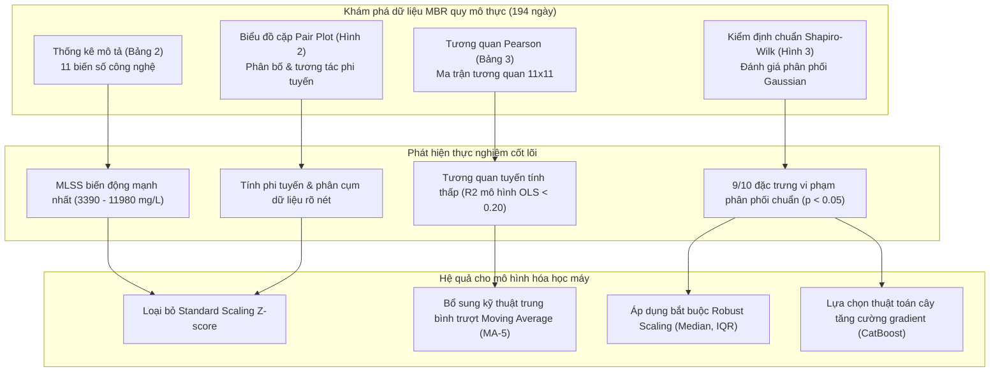

## 3.1. Phân phối dữ liệu và Phân tích tương quan (Data Distribution & Correlation Analysis)

---

### 3.1.1 Thống kê mô tả các thông số vận hành MBR (Descriptive Statistics of Operational Parameters)

#### 3.1.1.1 Bảng tổng hợp thống kê mô tả 11 thông số quá trình MBR (Bảng 2)
- **Tập dữ liệu vận hành quy mô thực**:
  - Dữ liệu thu thập liên tục trong $194\ \text{ngày}$ tại trạm xử lý nước thải chế biến thực phẩm.
  - Mỗi mẫu đại diện cho một ngày vận hành thực tế ($N = 194$).
  - Bảng số liệu bao gồm đầy đủ giá trị xu hướng tập trung và độ phân tán.

| Thông số (Features) | Đơn vị (Unit) | Số mẫu ($N$) | Trung bình (Mean) | Độ lệch chuẩn (Std) | Tối thiểu (Min) | Phân vị 25% ($Q_1$) | Trung vị ($Q_2$) | Phân vị 75% ($Q_3$) | Tối đa (Max) |
| :--- | :--- | :---: | :---: | :---: | :---: | :---: | :---: | :---: | :---: |
| **F/M** | $\text{kg COD}/(\text{kg MLSS}\cdot\text{d})$ | 194 | 0.012 | 0.004 | 0.003 | 0.009 | 0.011 | 0.014 | 0.024 |
| **SV30** | $\%$ | 194 | 95.8 | 8.9 | 30.0 | 96.0 | 98.0 | 99.0 | 99.0 |
| **SVI** | $\text{mL}\cdot\text{g}^{-1}$ | 194 | 125.1 | 18.9 | 82.6 | 112.5 | 122.4 | 135.0 | 182.7 |
| **MLSS** | $\text{mg}\cdot\text{L}^{-1}$ | 194 | 7813 | 1361 | 3390 | 7080 | 7900 | 8628 | 11,980 |
| **DO** | $\text{mg}\cdot\text{L}^{-1}$ | 194 | 5.43 | 0.79 | 3.62 | 4.90 | 5.30 | 5.98 | 7.55 |
| **pH** | $-$ | 194 | 8.11 | 0.40 | 5.02 | 7.85 | 7.98 | 8.45 | 8.97 |
| **Temp** | $^\circ\text{C}$ | 194 | 26.4 | 4.5 | 13.0 | 25.0 | 28.3 | 29.7 | 31.6 |
| **Flux** | $\text{LMH}$ | 194 | 2.65 | 0.52 | 0.60 | 2.45 | 2.73 | 2.92 | 3.87 |
| **COD RM** | $\%$ | 194 | 64.7 | 16.9 | 18.7 | 56.4 | 70.8 | 76.6 | 87.6 |
| **TMP** | $\text{kPa}$ | 194 | 51.0 | 6.8 | 37.08 | 46.3 | 50.5 | 55.0 | 69.0 |
| **Spec. Flux** | $\text{LMH}\cdot\text{kPa}^{-1}$ | 194 | 0.053 | 0.013 | 0.012 | 0.046 | 0.055 | 0.062 | 0.099 |

#### 3.1.1.2 Phân tích xu hướng tập trung và độ phân tán của các biến sinh học và hóa lý
- **Nồng độ bùn hoạt tính lơ lửng ($MLSS$)**:
  - Biến số thể hiện độ biến động tuyệt đối cao nhất trong toàn bộ hệ thống.
  - Giá trị trung bình đạt $7813\ \text{mg}\cdot\text{L}^{-1}$ với độ lệch chuẩn $1361\ \text{mg}\cdot\text{L}^{-1}$.
  - Biên độ dao động trải rộng từ $3390\ \text{mg}\cdot\text{L}^{-1}$ đến $11,980\ \text{mg}\cdot\text{L}^{-1}$.
  - Nguyên nhân xuất phát từ sự biến thiên của nước thải đầu vào và chu kỳ xả bùn.
  - Sự dao động này thay đổi độ nhớt của bùn và ảnh hưởng trực tiếp đến tốc độ nghẹt màng.
- **Tỷ lệ thức ăn trên vi sinh vật ($F/M\ \text{ratio}$)**:
  - Thông số duy trì mức độ biến động tương đối thấp trong suốt đợt quan trắc.
  - Giá trị trung bình đạt $0.012\ \text{kg COD}/(\text{kg MLSS}\cdot\text{d})$ và độ lệch chuẩn đạt $0.004$.
  - Khoảng giá trị biến thiên từ $0.003$ đến $0.024\ \text{kg COD}/(\text{kg MLSS}\cdot\text{d})$.
  - Các phân vị $Q_1$, trung vị và $Q_3$ lần lượt là $0.009$, $0.011$ và $0.014$.
  - Mức $F/M$ thấp chứng minh hệ vi sinh vật vận hành trong pha hô hấp nội bào ổn định.
- **Đặc tính lắng của bùn sinh học ($SV_{30}$ và $SVI$)**:
  - Chỉ số $SV_{30}$ đạt giá trị trung bình $95.8\%$ và độ lệch chuẩn $8.9\%$.
  - Trung vị đạt $98.0\%$ và phân vị $Q_3$ đạt $99.0\%$. Mật độ bùn trong bể rất đậm đặc.
  - Chỉ số $SVI$ dao động từ $82.6\ \text{mL}\cdot\text{g}^{-1}$ đến $182.7\ \text{mL}\cdot\text{g}^{-1}$.
  - Giá trị trung bình của $SVI$ đạt $125.1\ \text{mL}\cdot\text{g}^{-1}$ với độ lệch chuẩn $18.9\ \text{mL}\cdot\text{g}^{-1}$.
  - Các phân vị $Q_1$, trung vị và $Q_3$ của $SVI$ lần lượt là $112.5$, $122.4$ và $135.0\ \text{mL}\cdot\text{g}^{-1}$.
  - Dữ liệu phản ánh độ lắng bùn ở mức trung bình và có thời điểm xuất hiện bùn khó lắng.
- **Hiệu suất loại bỏ nhu cầu oxy hóa học ($COD\ RM$)**:
  - Nước thải trước và sau xử lý được lọc qua giấy lọc cellulose $0.45\ \mu\text{m}$.
  - Nồng độ $COD$ được đo quang phổ theo phương pháp chuẩn APHA bằng thiết bị DR1010 HACH.
  - Công thức tính toán hiệu suất:
    $$\text{COD RM} = \frac{\text{COD}_{in} - \text{COD}_{out}}{\text{COD}_{in}} \times 100\%$$
  - Giá trị trung bình đạt $64.7\%$ với độ lệch chuẩn $16.9\%$.
  - Dải giá trị biến động rất rộng từ $18.7\%$ đến $87.6\%$.
  - Trung vị đạt $70.8\%$ trong khi $50\%$ dữ liệu lõi nằm từ $56.4\%$ đến $76.6\%$.
  - Điều này phản ánh tính chất không đồng nhất của nước thải chế biến thực phẩm công nghiệp.

#### 3.1.1.3 Phân tích môi trường vận hành vật lý và điều kiện thủy lực
- **Nồng độ oxy hòa tan ($DO$)**:
  - Nồng độ $DO$ trung bình đạt $5.43\ \text{mg}\cdot\text{L}^{-1}$ với độ lệch chuẩn $0.79\ \text{mg}\cdot\text{L}^{-1}$.
  - Dải giá trị dao động từ $3.62\ \text{mg}\cdot\text{L}^{-1}$ đến $7.55\ \text{mg}\cdot\text{L}^{-1}$.
  - Các phân vị $Q_1$, trung vị và $Q_3$ lần lượt đạt $4.90$, $5.30$ và $5.98\ \text{mg}\cdot\text{L}^{-1}$.
  - Dải biến thiên hẹp chứng tỏ hệ thống sục khí duy trì môi trường oxy hóa rất đồng đều.
  - Môi trường giàu dưỡng khí giúp vi khuẩn dị dưỡng và nitrat hóa chuyển hóa hiệu quả.
- **Độ kiềm và chỉ số $pH$ môi trường**:
  - Giá trị $pH$ trung bình đạt $8.11$ với độ lệch chuẩn nhỏ $0.40$.
  - Dải ghi nhận mở rộng từ $5.02$ đến $8.97$.
  - Các mức phân vị $Q_1$, trung vị và $Q_3$ lần lượt là $7.85$, $7.98$ và $8.45$.
  - Hệ thống duy trì môi trường kiềm nhẹ ổn định cho phản ứng sinh học.
  - Giá trị cực tiểu $5.02$ phản ánh sự cố tích tụ axit hữu cơ cục bộ trong thời gian ngắn.
- **Biến thiên nhiệt độ vận hành ($Temp$)**:
  - Nhiệt độ nước thải dao động từ $13.0^\circ\text{C}$ đến $31.6^\circ\text{C}$.
  - Giá trị trung bình đạt $26.4^\circ\text{C}$ cùng độ lệch chuẩn $4.5^\circ\text{C}$.
  - Các phân vị $Q_1$, trung vị và $Q_3$ lần lượt là $25.0^\circ\text{C}$, $28.3^\circ\text{C}$ và $29.7^\circ\text{C}$.
  - Biên độ nhiệt độ lớn phản ánh biến động khí hậu theo mùa ngoài thực địa.
  - Nhiệt độ thay đổi ảnh hưởng đồng thời đến hoạt tính enzyme vi sinh và độ nhớt động học của nước.

#### 3.1.1.4 Phân tích các thông số động học bám bẩn và mục tiêu lọc màng
- **Áp suất xuyên màng ($TMP$) - Biến đích truyền thống**:
  - Giá trị trung bình đạt $51.0\ \text{kPa}$ với độ lệch chuẩn $6.8\ \text{kPa}$.
  - Dải giá trị thực nghiệm biến thiên từ $37.08\ \text{kPa}$ đến $69.0\ \text{kPa}$.
  - Phân vị $Q_1$, trung vị và $Q_3$ lần lượt đạt $46.3\ \text{kPa}$, $50.5\ \text{kPa}$ và $55.0\ \text{kPa}$.
  - Hệ thống màng sợi rỗng chìm chịu mức độ nghẹt màng trung bình trong toàn chu kỳ.
  - Áp suất vận hành không vượt ngưỡng quy định tẩy rửa hóa học ($60\ \text{kPa}$ hoặc tăng $30\%$).
- **Lưu lượng dòng qua màng ($Flux$)**:
  - Lưu lượng trung bình đạt $2.65\ \text{LMH}$ với độ lệch chuẩn $0.52\ \text{LMH}$.
  - Giá trị quan trắc nhỏ nhất là $0.60\ \text{LMH}$ và lớn nhất là $3.87\ \text{LMH}$.
  - Các giá trị phân vị $Q_1$, trung vị và $Q_3$ tương ứng là $2.45$, $2.73$ và $2.92\ \text{LMH}$.
  - Sự dao động này phản ánh việc điều chỉnh công suất hút theo nhu cầu xử lý thực tế.
- **Độ thấm riêng của màng ($Specific\ Flux$) - Biến đích chuẩn hóa tối ưu**:
  - Đại lượng thể hiện tính thấm thủy lực thực tế sau khi đã chuẩn hóa theo áp suất động lực:
    $$\text{Specific Flux} = \frac{\text{Flux}}{\text{TMP}} = \frac{J}{\text{TMP}}$$
  - Giá trị trung bình đạt $0.053\ \text{LMH}\cdot\text{kPa}^{-1}$ với độ lệch chuẩn $0.013\ \text{LMH}\cdot\text{kPa}^{-1}$.
  - Dải phân bố trải dài từ $0.012$ đến $0.099\ \text{LMH}\cdot\text{kPa}^{-1}$.
  - Các phân vị $Q_1$, trung vị và $Q_3$ đạt $0.046$, $0.055$ và $0.062\ \text{LMH}\cdot\text{kPa}^{-1}$.
  - Hiệu quả lọc thủy lực duy trì tương đối ổn định giữa các giai đoạn tải nạp khác nhau.

---

### 3.1.2 Phân tích biểu đồ cặp và đồ thị phân tán đa biến (Pair Plot & Scatter Plot Analysis)

#### 3.1.2.1 Cấu trúc ma trận biểu đồ cặp (Pair Plot Matrix - Hình 2)
- **Cấu hình trực quan hóa quan hệ đa biến**:
  - Ma trận gồm 11 hàng và 11 cột hiển thị tất cả các cặp biến số vận hành.
  - Phía dưới đường chéo chính chứa các đồ thị phân tán hai biến (Bivariate Scatter Plots).
  - Mỗi đồ thị phân tán tích hợp một đường xu hướng hồi quy tuyến tính và khoảng tin cậy $95\%$.
  - Đường chéo chính hiển thị biểu đồ tần số (Histograms) mô tả phân phối đơn biến.
- **Đặc trưng phân bố đơn biến trên đường chéo**:
  - Đại lượng $SV_{30}$ lệch trái nghiêm trọng và tập trung thành khối tại mức $98\% - 99\%$.
  - Đại lượng $COD\ RM$ có dạng lệch trái với mật độ lớn tại vùng hiệu suất cao.
  - Biến $Temp$ thể hiện phân bố hai đỉnh rõ rệt do chuyển giao mùa hè và mùa lạnh.
  - Biến $pH$ xuất hiện điểm dị biệt đơn lẻ kéo dài về phía giá trị axit ($pH = 5.02$).
  - Các biến còn lại phân bố trải rộng và lệch đáng kể so với đường cong chuẩn đối xứng.

#### 3.1.2.2 Tương tác phi tuyến giữa các biến sinh học và bám bẩn màng
- **Mối quan hệ thủy lực giữa $TMP$ và nồng độ oxy hòa tan ($DO$)**:
  - Đồ thị phân tán thể hiện xu hướng tương quan nghịch giữa $TMP$ và nồng độ $DO$.
  - Nồng độ oxy hòa tan cao đi kèm với các giá trị $TMP$ thấp hơn trên thực địa.
  - Cơ chế sục khí mạnh tạo bọt khí lớn gây ứng suất cắt bề mặt màng (shear stress).
  - Dòng bọt khí cuốn trôi bông bùn bám dính và giảm mật độ màng sinh học yếm khí.
- **Tương tác giữa áp suất màng ($TMP$) và sinh khối bùn ($MLSS$)**:
  - Đồ thị ghi nhận mối liên kết lỏng lẻo và có xu hướng phân cụm dữ liệu.
  - Nồng độ $MLSS$ tăng cao làm tăng hàm lượng hạt lơ lửng tiếp xúc bề mặt lọc.
  - Tuy nhiên sục khí duy trì lực cắt giúp hạn chế tốc độ lắng cặn của bông bùn.
  - Do đó $MLSS$ đơn lẻ không kiểm soát áp suất $TMP$ theo một hàm tuyến tính duy nhất.
- **Quan hệ nghịch đảo giữa áp suất $TMP$ và độ thấm riêng $Spec.\ Flux$**:
  - Đồ thị phân tán xác nhận xu hướng nghịch biến dốc và rất rõ ràng giữa hai đại lượng.
  - Khi lớp cặn bẩn tích tụ dày lên, trở lực thủy lực tổng cộng gia tăng.
  - Áp suất $TMP$ tăng cao trong khi độ thấm $Spec.\ Flux$ sụt giảm liên tục.
  - Hiện tượng này phù hợp hoàn toàn với định luật lọc màng thực nghiệm Darcy.
- **Quan hệ giữa độ thấm riêng $Spec.\ Flux$ và hiệu suất $COD\ RM$**:
  - Đồ thị biểu diễn tương quan thuận mức độ vừa giữa $Spec.\ Flux$ và $COD\ RM$.
  - Hiệu suất loại bỏ chất hữu cơ cao hạn chế hàm lượng phân tử keo hòa tan ($SMP, EPS$).
  - Sự suy giảm các chất ô nhiễm nhớt giúp hạn chế hiện tượng bít tắc lỗ màng siêu nhỏ.
- **Mối quan hệ giữa nồng độ $MLSS$ và chỉ số thể tích bùn $SVI$**:
  - Dữ liệu thể hiện quan hệ nghịch biến phi tuyến dạng hyperbol rất rõ rệt.
  - Nồng độ bùn $MLSS$ càng lớn thì giá trị $SVI$ tính toán càng có xu hướng giảm.
  - Đây là quy luật vật lý khi bùn đậm đặc bị cản trở lắng trong ống đong hình trụ.

#### 3.1.2.3 Động học cụm dữ liệu và hiện tượng phân tách trạng thái vận hành
- **Xuất hiện các cụm mật độ dữ liệu cục bộ (Data Clustering)**:
  - Các điểm dữ liệu không phân bố đều mà co cụm tại các vùng vận hành đặc thù.
  - Nhóm điểm nhiệt độ cao ($28 - 31^\circ\text{C}$) tách biệt với nhóm nhiệt độ thấp ($13 - 20^\circ\text{C}$).
  - Nhóm $DO$ thấp tương ứng với các chu kỳ tải nạp chất hữu cơ đậm đặc.
- **Hiện tượng phương sai thay đổi (Heteroskedasticity)**:
  - Độ phân tán của $TMP$ và $Spec.\ Flux$ mở rộng khi các biến sinh học thay đổi mạnh.
  - Khoảng tin cậy $95\%$ loe rộng ở hai đầu biên của đồ thị phân tán.
  - Hiện tượng này chứng minh dữ liệu môi trường thực tế chứa nhiều cấu trúc phi tuyến phức tạp.
  - Các mô hình hồi quy tham số đơn giản không thể biểu diễn chính xác các quan hệ này.

---

### 3.1.3 Phân tích tương quan tuyến tính Pearson (Pearson Correlation Analysis)

#### 3.1.3.1 Ma trận tương quan tuyến tính toàn diện 11 thông số (Bảng 3)
- **Công thức xác định hệ số tương quan mẫu Pearson ($r$)**:
  $$r_{xy} = \frac{\sum_{i=1}^n (x_i - \bar{x})(y_i - \bar{y})}{\sqrt{\sum_{i=1}^n (x_i - \bar{x})^2} \sqrt{\sum_{i=1}^n (y_i - \bar{y})^2}}$$
- **Bảng ma trận hệ số tương quan Pearson đối xứng ($11 \times 11$)**:

| Đại lượng | F/M | SV30 | SVI | MLSS | DO | pH | Temp | Flux | COD RM | TMP | Spec. Flux |
| :--- | :---: | :---: | :---: | :---: | :---: | :---: | :---: | :---: | :---: | :---: | :---: |
| **F/M** | 1.00 | 0.09 | 0.01 | 0.03 | -0.28 | -0.13 | 0.11 | 0.45 | 0.46 | -0.30 | 0.52 |
| **SV30** | 0.09 | 1.00 | 0.08 | 0.54 | -0.31 | -0.27 | -0.04 | 0.15 | 0.23 | -0.14 | 0.20 |
| **SVI** | 0.01 | 0.08 | 1.00 | -0.77 | 0.01 | 0.25 | 0.26 | -0.22 | -0.21 | 0.34 | -0.34 |
| **MLSS** | 0.03 | 0.54 | -0.77 | 1.00 | -0.19 | -0.38 | -0.25 | 0.26 | 0.32 | -0.36 | 0.39 |
| **DO** | -0.28 | -0.31 | 0.01 | -0.19 | 1.00 | -0.06 | -0.70 | -0.33 | -0.10 | 0.20 | -0.36 |
| **pH** | -0.13 | -0.27 | 0.25 | -0.38 | -0.06 | 1.00 | 0.42 | 0.22 | -0.54 | 0.42 | -0.05 |
| **Temp** | 0.11 | -0.04 | 0.26 | -0.25 | -0.70 | 0.42 | 1.00 | 0.25 | -0.18 | 0.07 | 0.16 |
| **Flux** | 0.45 | 0.15 | -0.22 | 0.26 | -0.33 | 0.22 | 0.25 | 1.00 | -0.13 | -0.18 | 0.85 |
| **COD RM** | 0.46 | 0.23 | -0.21 | 0.32 | -0.10 | -0.54 | -0.18 | -0.13 | 1.00 | -0.41 | 0.11 |
| **TMP** | -0.30 | -0.14 | 0.34 | -0.36 | 0.20 | 0.42 | 0.07 | -0.18 | -0.41 | 1.00 | -0.65 |
| **Spec. Flux** | 0.52 | 0.20 | -0.34 | 0.39 | -0.36 | -0.05 | 0.16 | 0.85 | 0.11 | -0.65 | 1.00 |

#### 3.1.3.2 Phân tích tương quan đối với Áp suất xuyên màng ($TMP$)
- **Tương quan dương nổi bật nhất với chỉ số $pH$ ($r = 0.42$)**:
  - Độ kiềm $pH$ gia tăng thúc đẩy kết tủa các hợp chất vô cơ lên màng lọc.
  - Hiện tượng đóng cặn canxi cacbonat và muối vô cơ làm tắc nghẽn khe hở màng.
  - Ngoài ra môi trường kiềm thay đổi điện tích bề mặt bông bùn và phóng thích polymer nhầy.
- **Tương quan âm mạnh mẽ với độ thấm riêng $Spec.\ Flux$ ($r = -0.65$)**:
  - Hệ số tương quan âm lớn xác nhận quan hệ nghịch đảo giữa độ nghẹt và tính thấm.
  - Áp suất $TMP$ tăng là chỉ dấu trực tiếp của việc suy giảm lưu lượng lọc chuẩn hóa.
- **Tương quan âm vừa với hiệu suất $COD\ RM$ ($r = -0.41$)**:
  - Quá trình phân hủy sinh học hiệu quả giúp tiêu thụ triệt để cơ chất hữu cơ.
  - Lượng tiền chất gây bám bẩn tích tụ trên bề mặt màng giảm đi đáng kể.
- **Tương quan âm vừa với nồng độ bùn sinh khối $MLSS$ ($r = -0.36$)**:
  - Tại trạm xử lý này nồng độ bùn cao giúp hấp phụ chất hòa tan vào bông bùn lớn.
  - Bùn hạt phát triển hạn chế sự phân tán của các chất hữu cơ hòa tan vào lỗ màng.
- **Tương quan dương với chỉ số thể tích bùn $SVI$ ($r = 0.34$)**:
  - Giá trị $SVI$ cao phản ánh bùn khó lắng và cấu trúc bông bùn rời rạc xốp mềm.
  - Các mảng bùn xốp dễ bị hút bám và nén chặt thành bánh cặn dày làm tăng $TMP$.
- **Tương quan với nồng độ oxy hòa tan $DO$ ($r = 0.20$)**:
  - Hệ số Pearson toàn cục dương nhẹ do biến $DO$ bị tương quan nghịch mạnh với $Temp$ ($r = -0.70$).
  - Khi nhiệt độ thấp vào mùa đông, $DO$ hòa tan tăng cao nhưng độ nhớt của nước cũng tăng làm $TMP$ tăng.

#### 3.1.3.3 Phân tích tương quan đối với Lưu lượng riêng ($Specific\ Flux$)
- **Tương quan thuận rất mạnh với lưu lượng thô $Flux$ ($r = 0.85$)**:
  - Lưu lượng $Flux$ là biến số nằm trên tử số của công thức xác định độ thấm riêng.
  - Khi màng vận hành ổn định, gia tăng lưu lượng sẽ phản ánh trực tiếp tính thấm cao.
- **Tương quan thuận mạnh nhất trong các biến vận hành với $F/M$ ($r = 0.52$)**:
  - Tỷ lệ dinh dưỡng tối ưu thúc đẩy vi sinh vật tăng sinh hoạt tính trao đổi chất.
  - Vi sinh vật sinh trưởng khỏe mạnh cải thiện khả năng kết cụm của bùn hoạt tính.
  - Hiện tượng này giảm thiểu việc phóng thích chất keo hòa tan gây tắc màng.
- **Tương quan thuận vừa với nồng độ bùn $MLSS$ ($r = 0.39$)**:
  - Nồng độ sinh khối dồi dào cung cấp diện tích bề mặt lớn hấp phụ chất ô nhiễm.
  - Bùn hấp phụ các chất hoạt động bề mặt trước khi chúng tiếp xúc với sợi màng.
- **Tương quan nghịch với nồng độ oxy hòa tan $DO$ ($r = -0.36$)**:
  - Nồng độ $DO$ cao thường xuất hiện ở giai đoạn nhiệt độ thấp làm nước bị tăng độ nhớt.
  - Hơn nữa mức sục khí quá dư thừa có thể phá vỡ bông bùn thành các mảnh mịn li ti.
- **Tương quan nghịch với chỉ số lắng bùn $SVI$ ($r = -0.34$)**:
  - Bùn có độ lắng kém cản trở dòng thấm thủy lực qua màng sợi rỗng.

#### 3.1.3.4 Nguyên nhân khiến hệ số tương quan tuyến tính tổng thể ở mức thấp
- **Động học bám bẩn phi tuyến tính phức tạp (Nonlinear Fouling Dynamics)**:
  - Hiện tượng nghẹt màng trải qua nhiều giai đoạn nối tiếp nhau trong thực tế.
  - Quá trình bắt đầu từ hấp phụ phân tử, bít tắc lỗ rỗng, đến hình thành lớp bánh cặn.
  - Các cơ chế vật lý và hóa sinh này không biến thiên tuyến tính theo bậc một.
- **Tương tác đa biến và hiện tượng cộng tuyến phức tạp (Multicollinearity)**:
  - Giữa các thông số vận hành tồn tại tương quan nội tại rất mạnh:
    - Nhiệt độ và oxy hòa tan: $r = -0.70$.
    - Nồng độ $MLSS$ và chỉ số $SVI$: $r = -0.77$.
    - Chỉ số $pH$ và hiệu suất $COD\ RM$: $r = -0.54$.
  - Mối liên kết chéo này làm che khuất tác động độc lập của từng biến lên màng lọc.
- **Hiệu ứng trễ thời gian trong phản ứng sinh học (Biological Time-Lag Effect)**:
  - Bám bẩn màng là kết quả tích lũy sinh khối và màng sinh học qua nhiều ngày.
  - Dữ liệu đo lường tức thời tại một thời điểm không phản ánh toàn bộ lịch sử vận hành.
- **Sự thất bại của các mô hình hồi quy tuyến tính cổ điển**:
  - Hệ số tương quan thấp giải thích vì sao các mô hình Linear, Ridge, Lasso đạt $R^2 < 0.20$.
  - Kết quả này đòi hỏi ứng dụng các mô hình phi tuyến tính hiện đại như CatBoost và XGBoost.
  - Đồng thời hệ thống cần các kỹ thuật biến đổi dữ liệu như trung bình trượt Moving Average.

---

### 3.1.4 Kiểm định phân phối chuẩn Shapiro-Wilk (Normality Check Analysis)

#### 3.1.4.1 Cơ sở lý thuyết và tiêu chuẩn kiểm định Shapiro-Wilk
- **Mục đích đánh giá phân phối**:
  - Đánh giá mức độ tuân thủ phân phối chuẩn Gaussian của các biến số thực nghiệm.
  - Xác lập căn cứ lựa chọn giải pháp chuẩn hóa dữ liệu cho mô hình máy học.
- **Cặp giả thuyết thống kê**:
  - Giả thuyết vô hiệu ($H_0$): Dữ liệu quan trắc tuân theo phân phối chuẩn.
  - Giả thuyết đối nghịch ($H_1$): Dữ liệu quan trắc sai lệch khỏi phân phối chuẩn.
- **Thống kê kiểm định $W$**:
  $$W = \frac{\left( \sum_{i=1}^n a_i x_{(i)} \right)^2}{\sum_{i=1}^n (x_i - \bar{x})^2}$$
  - Trong đó $x_{(i)}$ là giá trị quan sát thứ $i$ sau khi sắp xếp theo thứ tự tăng dần.
  - Hệ số $a_i$ được tính toán từ kỳ vọng và ma trận hiệp phương sai của mẫu chuẩn.
  - Giá trị $W$ nằm trong khoảng từ $0$ đến $1$. Giá trị gần $1$ chỉ ra phân phối càng chuẩn.
- **Ngưỡng quyết định mức ý nghĩa thống kê**:
  - Ngưỡng xác suất bác bỏ được thiết lập tại $\alpha = 0.05$.
  - Nếu giá trị $p > 0.05$: Không đủ cơ sở bác bỏ $H_0$, dữ liệu đạt chuẩn (Normality: True).
  - Nếu giá trị $p < 0.05$: Bác bỏ $H_0$, dữ liệu không tuân theo phân phối chuẩn (Normality: False).

#### 3.1.4.2 Kết quả chi tiết kiểm định phân phối chuẩn 11 thông số (Hình 3)
- **Thống kê giá trị p-value và kết luận kiểm định cho từng biến số**:
  - Đồ thị Q-Q Plot và kiểm định Shapiro-Wilk xác định chính xác tính chất phân phối.

| Thông số | Giá trị xác suất ($p\text{-value}$) | Mức ý nghĩa $\alpha = 0.05$ | Kết luận chuẩn hóa (Normality) | Đánh giá phân phối thực nghiệm |
| :--- | :---: | :---: | :---: | :--- |
| **F/M** | **0.0518** | $p > 0.05$ | **True** (Đạt chuẩn) | Biến duy nhất tuân theo quy luật phân phối chuẩn |
| **SV30** | **0.0000** | $p < 0.05$ | **False** (Phi chuẩn) | Lệch trái cực đoan, nén bùn đạt ngưỡng bão hòa |
| **SVI** | **0.0002** | $p < 0.05$ | **False** (Phi chuẩn) | Lệch phải nhẹ, đuôi phân bố kéo dài ở vùng bùn xốp |
| **MLSS** | **0.0116** | $p < 0.05$ | **False** (Phi chuẩn) | Phân bố bất đối xứng do biến động tải nạp sinh khối |
| **DO** | **0.0003** | $p < 0.05$ | **False** (Phi chuẩn) | Tập trung hẹp quanh trung vị, lệch nhẹ ở phân vị cao |
| **pH** | **0.0000** | $p < 0.05$ | **False** (Phi chuẩn) | Đỉnh nhọn tại vùng kiềm nhẹ, tồn tại ngoại lai axit |
| **Temp** | **0.0000** | $p < 0.05$ | **False** (Phi chuẩn) | Cấu trúc phân phối hai đỉnh rõ rệt theo mùa |
| **Flux** | **0.0000** | $p < 0.05$ | **False** (Phi chuẩn) | Biến động từng đợt theo nhu cầu điều tiết lưu lượng |
| **COD RM** | **0.0000** | $p < 0.05$ | **False** (Phi chuẩn) | Lệch trái do đa số các ngày đạt hiệu suất xử lý cao |
| **TMP** | **0.0266** | $p < 0.05$ | **False** (Phi chuẩn) | Đuôi phân bố dài ở vùng áp suất nghẹt màng cao |
| **Spec. Flux** | **0.0003** | $p < 0.05$ | **False** (Phi chuẩn) | Phân bố không đều do suy giảm tính thấm từng đợt |

- **Kết luận tổng quát về tính phi chuẩn**:
  - Tỷ lệ $F/M$ là đại lượng duy nhất có phân phối chuẩn với $p = 0.0518$.
  - Toàn bộ 10 đặc trưng còn lại ($90.9\%$) đều sở hữu giá trị $p < 0.05$.
  - Hiện tượng này phản ánh bản chất ngẫu nhiên phức tạp của các trạm xử lý quy mô thực.

#### 3.1.4.3 Phân tích đồ thị phân vị xác suất chuẩn (Q-Q Plot - Hình 3)
- **Hình thái độ lệch trên biểu đồ Q-Q Plot**:
  - Trục hoành biểu diễn phân vị lý thuyết chuẩn (Theoretical Quantiles).
  - Trục tung biểu diễn phân vị quan sát thực tế (Ordered Values).
  - Đường thẳng chéo biểu diễn phân phối chuẩn lý tưởng.
- **Phân tích hình thái các biến điển hình**:
  - Đối với $F/M$: Các điểm dữ liệu bám sát đường thẳng tham chiếu từ phân vị $-2$ đến $+2$.
  - Đối với $SV_{30}$: Đồ thị nằm ngang phẳng lì tại mốc $98\% - 99\%$ ở phía trên và đứt gãy cắm dốc xuống ở phía dưới.
  - Đối với $pH$: Dữ liệu uốn cong mạnh ở vùng đuôi trái với giá trị ngoại lai $pH = 5.02$.
  - Đối với $Temp$: Đường phân vị uốn khúc hình chữ S phản ánh tính chất hai đỉnh của dữ liệu hai mùa.
  - Đối với $TMP$ và $Spec.\ Flux$: Các điểm lệch khỏi đường thẳng ở cả hai đuôi phân vị cao và thấp.

#### 3.1.4.4 Tác động kỹ thuật đến chiến lược tiền xử lý và lựa chọn mô hình máy học
- **Bác bỏ phương pháp Standard Scaling**:
  - Phép biến đổi $Z\text{-score} = (x - \mu)/\sigma$ dựa trên kỳ vọng và độ lệch chuẩn.
  - Cả hai tham số này bị bóp méo nghiêm trọng bởi dữ liệu lệch và các điểm ngoại lai.
  - Khi áp dụng Standard Scaling, trọng số mô hình sẽ bị thiên lệch về các điểm dị biệt.
- **Khẳng định tính ưu việt của Robust Scaling**:
  - Phương pháp chuẩn hóa bền vững sử dụng trung vị ($Q_2$) và khoảng tứ phân vị ($IQR$):
    $$x_{\text{scaled}} = \frac{x - \text{Median}(x)}{\text{IQR}} = \frac{x - Q_2}{Q_3 - Q_1}$$
  - Phép biến đổi này triệt tiêu ảnh hưởng tiêu cực của ngoại lai và giữ nguyên phân bố gốc.
- **Lựa chọn kiến trúc thuật toán phi tham số**:
  - Dữ liệu phi chuẩn làm suy giảm hiệu năng của các mô hình giả định phân phối chuẩn phần dư.
  - Các thuật toán học máy dựa trên cây quyết định như CatBoost và XGBoost không cần giả định phân phối chuẩn.
  - Cấu trúc cây phân nhánh dựa trên thứ tự giá trị giúp mô hình miễn nhiễm với phân phối lệch.
