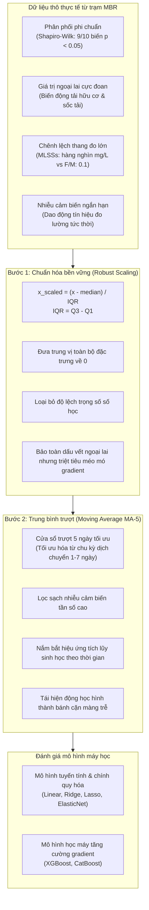

## 3.2 - 3.3. Ứng dụng kỹ thuật đặc trưng và Đánh giá hiệu năng mô hình (Model Performance Evaluation)

### 3.2 Ứng dụng Robust Scaling và Moving Average trong tiền xử lý dữ liệu

#### 3.2.1 Ứng dụng Robust Scaling kiểm soát giá trị ngoại lai và cân bằng thang đo
- **Đặc trưng phân phối của dữ liệu thô tại trạm MBR quy mô thực (Hình 4a)**:
  - Dữ liệu vận hành thực tế phản ánh tính chất phi chuẩn nghiêm trọng trên hầu hết các biến số.
  - Phân bố dữ liệu thể hiện độ biến động rất lớn giữa các nhóm thông số công nghệ.
  - Một số biến sở hữu độ lớn số học vượt trội hoàn toàn so với các biến còn lại. Điển hình là thông số bùn hoạt tính lơ lửng ($MLSSs$) dao động từ $2000\ \text{mg}\cdot\text{L}^{-1}$ đến hơn $8000\ \text{mg}\cdot\text{L}^{-1}$.
  - Ngược lại, tỷ lệ thức ăn trên vi sinh vật ($F/M\ \text{ratio}$) chỉ nằm trong phạm vi hẹp từ $0.05$ đến $0.25\ \text{kgCOD}\cdot(\text{kgMLSS}\cdot\text{d})^{-1}$.
  - Nồng độ oxy hòa tan ($DO$) và chỉ số thể tích bùn ($SVI$) cũng sở hữu thang đo hoàn toàn khác biệt.
  - Chênh lệch thang đo này làm các thuật toán học máy gán trọng số sai lệch cho biến có giá trị tuyệt đối lớn.
  - Sự hiện diện của các giá trị ngoại lai cực đoan (extreme outliers) tạo đuôi phân phối dài (heavy-tailed distributions). Tình trạng này làm lệch đường biên phân tách của mô hình.

- **Cơ chế toán học của phương pháp Robust Scaling**:
  - Chuẩn hóa thông thường (Standard Scaling) sử dụng trung bình mẫu ($\mu$) và độ lệch chuẩn ($\sigma$). Cả hai đại lượng này cực kỳ nhạy cảm với giá trị ngoại lai.
  - Robust Scaling sử dụng hai đại lượng thống kê phi tham số có tính kháng ngoại lai mạnh: trung vị ($\text{median}$) và khoảng tứ phân vị ($IQR$):
    $$x_{\text{scaled}} = \frac{x - \text{median}(x)}{IQR(x)} = \frac{x - Q_2}{Q_3 - Q_1}$$
  - Trong đó:
    - $Q_1$ là phân vị thứ 25 (điểm cắt dưới của $50\%$ dữ liệu tập trung).
    - $Q_3$ là phân vị thứ 75 (điểm cắt trên của $50\%$ dữ liệu tập trung).
    - $IQR = Q_3 - Q_1$ là khoảng tứ phân vị, đại diện cho độ phân tán cốt lõi của dữ liệu.
    - $Q_2 = \text{median}(x)$ là giá trị trung vị của tập dữ liệu.
  - Phép biến đổi đưa trung vị của tất cả các biến về mức $0$ và chuẩn hóa thang đo theo độ rộng $IQR$.

- **Phân phối của dữ liệu sau khi chuẩn hóa bền vững (Hình 4b)**:
  - Tất cả các đặc trưng đầu vào chuyển đổi về cùng một dải giá trị tương đồng.
  - Trung vị của mọi biến số căn chỉnh tập trung quanh mức $0$.
  - Khoảng phân tán của các biến trở nên đồng nhất, triệt tiêu ưu thế số học giả tạo của $MLSSs$.
  - Thuật toán không thể ưu tiên một biến chỉ vì biên độ số đo của biến đó lớn hơn.
  - Các giá trị ngoại lai thực tế không bị cắt gọt nhân tạo như phương pháp Min-Max Scaling.
  - Giá trị ngoại lai vẫn xuất hiện bên ngoài dải $IQR$, giúp mô hình nhận diện các đợt sốc tải sinh học.
  - Tác động làm lệch hướng gradient của các giá trị ngoại lai giảm xuống mức tối thiểu.

- **Lợi ích đối với quá trình huấn luyện mô hình học máy**:
  - Tăng tốc độ hội tụ của các thuật toán tối ưu hóa dựa trên gradient descent.
  - Giúp việc tính toán khoảng cách và phân chia nhánh cây không bị chi phối bởi các biến quy mô lớn.
  - Bảo toàn cấu trúc tương đối giữa các điểm dữ liệu trong không gian đa chiều.
  - Nâng cao tính ổn định tổng quát (generalizability) khi suy luận trên dữ liệu ngoài tập huấn luyện.
  - Giúp thuật toán đánh giá độ quan trọng của đặc trưng dựa trên quan hệ vật lý thực, loại bỏ ảnh hưởng của thang đo số học.

---

#### 3.2.2 Ứng dụng Moving Average nắm bắt động học tích lũy và khử nhiễu cảm biến
- **Bản chất động học tích lũy của hiện tượng nghẹt màng (Membrane Fouling Dynamics)**:
  - Hiện tượng nghẹt màng trong hệ thống MBR diễn tiến tích lũy dần theo thời gian vận hành.
  - Quá trình này bắt nguồn từ sự tích tụ liên tục của các điều kiện vận hành và hoạt tính vi sinh vật.
  - Nghẹt màng không xảy ra tức thời từ các tác động đơn lẻ tại một thời điểm đo duy nhất.
  - Lớp bánh cặn (cake layer) và chất polyme ngoại bào ($EPS$) bám dính đòi hỏi chu kỳ tích tụ nhiều ngày.
  - Mô hình dự báo cần phản ánh tác động trễ mang tính lịch sử của các thông số công nghệ lên trạng thái màng hiện tại.

- **Khử nhiễu ngẫu nhiên và làm mịn chuỗi thời gian vận hành**:
  - Dữ liệu chất lượng nước và vận hành tại trạm xử lý nước thải quy mô thực luôn chứa nhiễu đo lường.
  - Cảm biến online ghi nhận nhiều dao động ngắn hạn do bọt khí cọ xát, dòng chảy xoáy và độ trễ phản hồi.
  - Kỹ thuật trung bình trượt (Moving Average - MA) tính toán giá trị trung bình trên một cửa sổ thời gian trượt.
  - Công thức tính trung bình trượt với độ dài cửa sổ $k$ ngày tại thời điểm $t$:
    $$x_{\text{MA-}k}(t) = \frac{1}{k} \sum_{i=0}^{k-1} x(t - i)$$
  - Phép biến đổi triệt tiêu hiệu quả các xung nhiễu tần số cao (high-frequency noise).
  - Xu thế biến thiên dài hạn của hệ thống sinh học được bộc lộ rõ ràng và ổn định.

- **Quy trình tối ưu hóa độ dài cửa sổ trượt (Optimal Window Selection)**:
  - Nhóm tác giả thực hiện đánh giá thực nghiệm có hệ thống đối với từng đặc trưng đầu vào.
  - Các chu kỳ dịch chuyển thời gian (day-shifting periods) được khảo sát chi tiết trong phạm vi 1 tuần ($1$ đến $7\ \text{ngày}$).
  - Hiệu năng dự báo của mô hình được định lượng qua hệ số xác định ($R^2$) và sai số căn bậc hai trung bình bình phương ($RMSE$).
  - Kết quả thực nghiệm xác nhận cửa sổ trượt $5\ \text{ngày}$ (MA-5) đạt điểm cân bằng tối ưu nhất:
    - Cửa sổ ngắn hơn ($1 - 3\ \text{ngày}$) chưa lọc sạch nhiễu cảm biến và chưa bắt kịp độ trễ hình thành bánh bùn.
    - Cửa sổ dài hơn ($6 - 7\ \text{ngày}$) làm mất đi các biến động đặc trưng của vi sinh vật và giảm tính nhạy cảnh báo.
  - Cửa sổ MA-5 phản ánh chính xác chu kỳ biến đổi sinh lý vi sinh và thời gian tích tụ bám bẩn thủy lực.
  - Dữ liệu tiền xử lý MA-5 được áp dụng trực tiếp cho các mô hình học máy tăng cường gradient (Gradient Boosting).

---

### 3.3 Đánh giá hiệu năng mô hình dự báo hiện tượng nghẹt màng

#### 3.3.1 Đánh giá hiệu năng mô hình trên tập dữ liệu thô (Raw Data)
- **Thiết kế thực nghiệm 4 kịch bản (Case I đến Case IV)**:
  - Bài toán so sánh 4 kịch bản dữ liệu nhằm làm rõ hai câu hỏi cốt lõi:
    - *Lựa chọn biến mục tiêu*: Dự báo áp suất xuyên màng trực tiếp ($TMP$) hay dự báo tính thấm riêng qua màng ($Specific\ Flux$)?
    - *Vai trò của chất lượng phân hủy sinh học*: Bổ sung hiệu suất khử COD ($COD\ RM$) có nâng cao độ chính xác dự báo không?
  - Sáu mô hình được đối chuẩn trên cùng tập dữ liệu gồm 4 mô hình thống kê tuyến tính và 2 mô hình học máy tăng cường:
    - Mô hình thống kê tuyến tính: Hồi quy tuyến tính (Linear Regression), Hồi quy Ridge (L2 penalty), Hồi quy Lasso (L1 penalty), và Mạng đàn hồi (Elastic Net).
    - Mô hình học máy phi tuyến: XGBoost (eXtreme Gradient Boosting) và CatBoost (Categorical Boosting).

- **Case I: Dự báo TMP từ các thông số vận hành cơ bản (không có COD RM)**:
  - *Tập biến đầu vào*: $F/M\ \text{ratio}$, $SV_{30}$, $SVI$, $MLSSs$, $DO$, $pH$, Nhiệt độ bể ($Temp.$).
  - *Biến mục tiêu*: Áp suất xuyên màng ($TMP$, đơn vị $\text{kPa}$).
  - *Kết quả định lượng (Bảng 4)*:

| Mô hình | $R^2$ | MAE | MAPE | MSE | RMSE |
| :--- | :---: | :---: | :---: | :---: | :---: |
| **Linear** | 0.3439 | 4.9834 | 0.1008 (10.08%) | 35.6655 | 5.9721 |
| **Ridge** | 0.3168 | 5.1590 | 0.1037 (10.37%) | 37.1352 | 6.0939 |
| **Lasso** | 0.3396 | 5.0665 | 0.1021 (10.21%) | 35.8953 | 5.9913 |
| **ElasticNet** | 0.3292 | 5.1052 | 0.1028 (10.28%) | 36.4606 | 6.0383 |
| **XGBoost** | 0.6769 | 3.0784 | 0.0602 (6.02%) | 17.5643 | 4.1910 |
| **CatBoost** | **0.7088** | **2.9686** | **0.0591 (5.91%)** | **15.8281** | **3.9785** |

  - *Phân tích chuyên sâu*:
    - Tất cả các mô hình thống kê tuyến tính đều thất bại với hệ số $R^2 < 0.35$ và $RMSE \approx 6.0\ \text{kPa}$.
    - Giả định quan hệ tuyến tính hoàn toàn không phù hợp với cơ chế nghẹt màng trong thực tế.
    - Hai mô hình Boosting vượt trội rõ rệt. CatBoost dẫn đầu với $R^2 = 0.7088$, giảm sai số $RMSE$ xuống $3.9785\ \text{kPa}$.
    - CatBoost giảm sai số $MAE$ xuống $2.9686\ \text{kPa}$, vượt xa mô hình Linear ($MAE = 4.9834\ \text{kPa}$).

- **Case II: Dự báo TMP có bổ sung thông số hiệu suất khử COD (có COD RM)**:
  - *Tập biến đầu vào*: $F/M\ \text{ratio}$, $SV_{30}$, $SVI$, $MLSSs$, $DO$, $pH$, $Temp.$, kết hợp $COD\ RM$.
  - *Biến mục tiêu*: Áp suất xuyên màng ($TMP$, đơn vị $\text{kPa}$).
  - *Kết quả định lượng (Bảng 5)*:

| Mô hình | $R^2$ | MAE | MAPE | MSE | RMSE |
| :--- | :---: | :---: | :---: | :---: | :---: |
| **Linear** | 0.3439 | 4.9834 | 0.1008 (10.08%) | 35.6655 | 5.9721 |
| **Ridge** | 0.3457 | 5.0564 | 0.1016 (10.16%) | 35.5654 | 5.9637 |
| **Lasso** | 0.3769 | 4.9247 | 0.0992 (9.92%) | 33.8710 | 5.8199 |
| **ElasticNet** | 0.3563 | 5.0050 | 0.1007 (10.07%) | 34.9865 | 5.9149 |
| **XGBoost** | 0.6922 | 3.1245 | 0.0610 (6.10%) | 16.7314 | 4.0904 |
| **CatBoost** | **0.7059** | **3.1014** | **0.0626 (6.26%)** | **15.9842** | **3.9980** |

  - *Phân tích chuyên sâu*:
    - Bổ sung $COD\ RM$ giúp cải thiện nhẹ hiệu năng của các mô hình tuyến tính (Lasso tăng $R^2$ từ $0.3396$ lên $0.3769$).
    - XGBoost tăng nhẹ $R^2$ từ $0.6769$ lên $0.6922$.
    - CatBoost duy trì hiệu năng cao nhất ($R^2 = 0.7059$), nhưng $RMSE$ không cải thiện đáng kể ($3.9785$ so với $3.9980\ \text{kPa}$).
    - Nguyên nhân: Giá trị $TMP$ tức thời chịu ảnh hưởng rất mạnh từ chu kỳ bơm hút và biến động lưu lượng rút nước cục bộ. Một mình $TMP$ không cô lập được trở lực thực do lớp cặn sinh học gây ra.

- **Case III: Dự báo Specific Flux từ các thông số vận hành cơ bản (không có COD RM)**:
  - *Tập biến đầu vào*: $F/M\ \text{ratio}$, $SV_{30}$, $SVI$, $MLSSs$, $DO$, $pH$, $Temp.$.
  - *Biến mục tiêu*: Lưu lượng riêng qua màng ($Specific\ Flux$, đơn vị $\text{m}^3\cdot(\text{m}^2\cdot\text{d}\cdot\text{bar})^{-1}$ hoặc $\text{L}\cdot(\text{m}^2\cdot\text{h}\cdot\text{bar})^{-1}$).
  - *Kết quả định lượng (Bảng 6)*:

| Mô hình | $R^2$ | MAE | MAPE | MSE | RMSE |
| :--- | :---: | :---: | :---: | :---: | :---: |
| **Linear** | 0.6117 | 0.0068 | 0.1521 (15.21%) | 0.0001 | 0.0083 |
| **Ridge** | 0.3951 | 0.0084 | 0.1770 (17.70%) | 0.0001 | 0.0104 |
| **Lasso** | 0.2497 | 0.0094 | 0.1980 (19.80%) | 0.0001 | 0.0116 |
| **ElasticNet** | 0.3070 | 0.0090 | 0.1858 (18.58%) | 0.0001 | 0.0111 |
| **XGBoost** | 0.5797 | 0.0063 | 0.1347 (13.47%) | 0.0001 | 0.0087 |
| **CatBoost** | **0.7317** | **0.0058** | **0.1237 (12.37%)** | **0.0000** | **0.0069** |

  - *Phân tích chuyên sâu*:
    - Chuyển mục tiêu sang $Specific\ Flux$ làm tăng vọt chất lượng dự báo của mô hình Linear lên $R^2 = 0.6117$. Điều này chứng minh $Specific\ Flux$ có tính tương quan nội tại chặt chẽ hơn với trạng thái bùn.
    - Tuy nhiên, các kỹ thuật chính quy hóa (Ridge, Lasso, ElasticNet) bị suy giảm nặng nề ($R^2$ chỉ đạt $0.2497 - 0.3951$). Nguyên nhân do hàm phạt số học làm triệt tiêu hệ số của các biến có tương quan chéo phức tạp.
    - CatBoost thể hiện sức mạnh vượt trội với $R^2 = 0.7317$, $MAE = 0.0058$ và $RMSE = 0.0069$, vượt xa XGBoost ($R^2 = 0.5797$).

- **Case IV: Dự báo Specific Flux có bổ sung thông số hiệu suất khử COD (có COD RM)**:
  - *Tập biến đầu vào*: $F/M\ \text{ratio}$, $SV_{30}$, $SVI$, $MLSSs$, $DO$, $pH$, $Temp.$, kết hợp $COD\ RM$.
  - *Biến mục tiêu*: Lưu lượng riêng qua màng ($Specific\ Flux$).
  - *Kết quả định lượng (Bảng 7)*:

| Mô hình | $R^2$ | MAE | MAPE | MSE | RMSE |
| :--- | :---: | :---: | :---: | :---: | :---: |
| **Linear** | 0.6200 | 0.0068 | 0.1500 (15.00%) | 0.0001 | 0.0082 |
| **Ridge** | 0.4349 | 0.0079 | 0.1685 (16.85%) | 0.0001 | 0.0100 |
| **Lasso** | 0.2513 | 0.0094 | 0.1976 (19.76%) | 0.0001 | 0.0115 |
| **ElasticNet** | 0.3070 | 0.0090 | 0.1858 (18.58%) | 0.0001 | 0.0111 |
| **XGBoost** | 0.6555 | 0.0059 | 0.1304 (13.04%) | 0.0001 | 0.0078 |
| **CatBoost** | **0.7710** | **0.0054** | **0.1149 (11.49%)** | **0.0000** | **0.0064** |

  - *Phân tích chuyên sâu*:
    - Bổ sung $COD\ RM$ tạo ra bước nhảy vọt toàn diện trên hầu hết các mô hình.
    - CatBoost xác lập đỉnh cao mới trên dữ liệu thô với $R^2 = 0.7710$, $RMSE = 0.0064$, $MAE = 0.0054$ và sai số phần trăm $MAPE$ giảm xuống $11.49\%$.
    - XGBoost tăng mạnh từ $R^2 = 0.5797$ lên $0.6555$ (tăng $+0.0758$).
    - $COD\ RM$ đại diện cho khả năng chuyển hóa cơ chất của vi sinh vật. Tỷ lệ COD chưa khử phản ánh trực tiếp lượng chất hữu cơ hòa tan dư thừa. Các phân tử hữu cơ này kết hợp với $EPS$ tạo lớp gel bịt kín lỗ rỗng màng.
    - Khung mô hình đạt độ chuẩn xác rất cao ($R^2 > 0.77$) chỉ với 8 biến vận hành cơ bản. Kết quả này vượt trội so với các nghiên cứu trước đây đòi hỏi hệ thống cảm biến chuyên sâu tốn kém.

---

#### 3.3.2 Cải thiện hiệu năng vượt bậc qua Robust Scaling và Moving Average
- **Kịch bản thực nghiệm tối ưu hóa**:
  - Nhóm tác giả áp dụng quy trình tiền xử lý hai cấp độ lên kịch bản tối ưu nhất là Case IV ($Specific\ Flux$ với đầy đủ 8 thông số đầu vào).
  - Cấp độ 1: Áp dụng độc lập kỹ thuật Robust Scaling nhằm triệt tiêu ảnh hưởng ngoại lai.
  - Cấp độ 2: Kết hợp đồng thời Robust Scaling và kỹ thuật trung bình trượt 5 ngày (MA-5).

- **Cấp độ 1 - Đánh giá tác động độc lập của Robust Scaling (Bảng 8)**:

| Mô hình | $R^2$ | MAE | MAPE | MSE | RMSE |
| :--- | :---: | :---: | :---: | :---: | :---: |
| **Linear** | 0.6344 | 0.0066 | 0.1477 (14.77%) | 0.0001 | 0.0081 |
| **Ridge** | 0.6356 | 0.0066 | 0.1478 (14.78%) | 0.0001 | 0.0081 |
| **Lasso** | -0.0048 | 0.0112 | 0.2392 (23.92%) | 0.0002 | 0.0134 |
| **ElasticNet** | 0.2953 | 0.0095 | 0.2077 (20.77%) | 0.0001 | 0.0112 |
| **XGBoost** | 0.6555 | 0.0059 | 0.1304 (13.04%) | 0.0001 | 0.0078 |
| **CatBoost** | **0.7969** | **0.0050** | **0.1074 (10.74%)** | **0.0000** | **0.0060** |

  - *Phân tích cơ chế biến đổi*:
    - **Sự phục hồi ngoạn mục của hồi quy Ridge**: $R^2$ tăng vọt từ $0.4349$ lên $0.6356$, bắt kịp Linear Regression. Nguyên nhân do Robust Scaling đưa tất cả các biến về cùng độ biến thiên $IQR$. Trọng số phạt $L_2$ không còn bóp nghẹt các biến có phương sai nhỏ.
    - **Sự sụp đổ hoàn toàn của hồi quy Lasso**: $R^2$ rơi xuống mức âm ($-0.0048$). Khi thang đo co hẹp quanh trung vị, mức phạt tuyệt đối $L_1$ mặc định triệt tiêu toàn bộ hệ số góc về $0$. Lasso thoái hóa thành một đường thẳng nằm ngang dự báo giá trị trung bình đơn thuần.
    - **Tính bất biến của thuật toán cây XGBoost**: Hiệu năng XGBoost giữ nguyên tuyệt đối ($R^2 = 0.6555$, $RMSE = 0.0078$). Cấu trúc phân chia nhánh cây chỉ dựa trên thứ tự xếp hạng (rank order) của dữ liệu. Do đó, các phép co giãn đơn điệu không làm thay đổi điểm cắt ngưỡng (split points).
    - **Bước nhảy chất lượng của CatBoost**: $R^2$ tăng mạnh từ $0.7710$ lên $0.7969$, $RMSE$ giảm từ $0.0064$ xuống $0.0060$. CatBoost tính toán lượng tử hóa các đặc trưng đối xứng tốt hơn khi dữ liệu tập trung quanh trung vị.

- **Cấp độ 2 - Tác động kết hợp Robust Scaling và Moving Average 5 ngày (MA-5) (Bảng 9)**:

| Mô hình | $R^2$ | MAE | MAPE | MSE | RMSE |
| :--- | :---: | :---: | :---: | :---: | :---: |
| **Linear** | 0.6623 | 0.0065 | 0.1445 (14.45%) | 0.0001 | 0.0078 |
| **Ridge** | 0.6617 | 0.0065 | 0.1460 (14.60%) | 0.0001 | 0.0078 |
| **Lasso** | -0.0048 | 0.0112 | 0.2392 (23.92%) | 0.0002 | 0.0134 |
| **ElasticNet** | 0.3145 | 0.0093 | 0.2022 (20.22%) | 0.0001 | 0.0110 |
| **XGBoost** | 0.7404 | 0.0055 | 0.1168 (11.68%) | 0.0000 | 0.0068 |
| **CatBoost** | **0.8374** | **0.0042** | **0.0863 (8.63%)** | **0.0000** | **0.0054** |

  - *Phân tích bước nhảy hiệu năng đỉnh cao*:
    - **CatBoost xác lập kỷ lục dự báo**: $R^2$ cán mốc **0.8374**, vượt xa mọi cấu hình trước đó. $RMSE$ giảm xuống mức tối thiểu $0.0054$, $MAE$ giảm xuống $0.0042$, và $MAPE$ đạt $8.63\%$ (mức sai số dưới $10\%$ khẳng định độ tin cậy tuyệt đối trong ứng dụng công nghiệp).
    - **Định lượng mức độ cải thiện của CatBoost**:
      - Tăng trưởng $R^2$: Tăng từ $0.7317$ (Case III thô) lên $0.8374$, tương đương mức tăng trưởng tương đối hơn $+14.4\%$. So với Case IV thô ($R^2 = 0.7710$), $R^2$ tăng ròng $+0.0664$.
      - Cắt giảm sai số tuyệt đối $MAE$: Giảm từ $0.0058$ xuống $0.0042$, tương đương mức cắt giảm sai số ấn tượng **27.6%** (giảm $22.2\%$ so với Case IV thô).
      - Cắt giảm sai số phần trăm $MAPE$: Giảm từ $11.49\%$ xuống $8.63\%$, tương đương giảm thiểu $24.9\%$ mức độ lệch dự báo trung bình.
    - **Sự bứt phá mạnh mẽ của XGBoost**: Nhờ tác dụng làm mịn và khử nhiễu của MA-5, $R^2$ của XGBoost tăng vọt từ $0.6555$ lên $0.7404$ (tăng $+0.0849$), $RMSE$ giảm từ $0.0078$ xuống $0.0068$.
    - **Mô hình Linear và Ridge**: Tiếp tục tăng nhẹ lên $R^2 \approx 0.662$, chứng minh việc khử nhiễu chuỗi thời gian giúp ổn định không gian đặc trưng ngay cả với các hàm xấp xỉ tuyến tính.

---

#### 3.3.3 Phân tích so sánh chuyên sâu giữa các thuật toán và ý nghĩa thực tế
- **So sánh đối đầu toàn diện giữa CatBoost và XGBoost**:
  - Trong mọi trường hợp thử nghiệm, CatBoost luôn vượt trội XGBoost một cách nhất quán.
  - Trên tập dữ liệu thô (Case IV), khoảng cách $R^2$ giữa CatBoost ($0.7710$) và XGBoost ($0.6555$) là $0.1155$ điểm.
  - Trên tập dữ liệu sau tiền xử lý tối ưu, CatBoost ($R^2 = 0.8374$) dẫn trước XGBoost ($R^2 = 0.7404$) tới $0.0970$ điểm.
  - *Lý do thuật toán giúp CatBoost chiếm ưu thế*:
    - **Cấu trúc cây quyết định đối xứng (Oblivious Trees)**: CatBoost xây dựng các cây có tiêu chí phân chia giống nhau tại cùng một độ sâu. Cấu trúc này hoạt động như một cơ chế chính quy hóa tự nhiên, ngăn ngừa hiện tượng quá khớp (overfitting) trên chuỗi dữ liệu vận hành công nghiệp.
    - **Kỹ thuật Ordered Boosting**: Thuật toán tính toán gradient dựa trên tập mẫu ngẫu nhiên trước đó. Cơ chế này loại bỏ hoàn toàn hiện tượng rò rỉ thông tin mục tiêu (target leakage) và độ lệch dự báo (prediction shift) vốn rất dễ xảy ra trong chuỗi thời gian thực tế.
    - Ngược lại, XGBoost xây dựng cây bất đối xứng bằng thuật toán tìm kiếm tham lam (greedy search), dễ bị bẫy vào các cực tiểu cục bộ và nhạy cảm với các mẫu dị biệt trong chuỗi quan sát.

- **Nguyên nhân cốt lõi khiến các mô hình thống kê tuyến tính thất bại**:
  - Bản chất của động học nghẹt màng trong hệ MBR chứa đựng các mối quan hệ phi tuyến tính cao độ.
  - Hiện tượng tắc nghẽn màng xuất hiện ngưỡng tới hạn (critical flux threshold). Khi vượt quá ngưỡng tải, điện trở lọc tăng vọt phi mã thay vì tăng theo tỷ lệ tuyến tính.
  - Sự kết hợp giữa các thông số công nghệ tạo ra các tương tác đa biến phức tạp (ví dụ: tác động đồng thời của $pH$ thấp và $MLSS$ cao làm tăng tiết chất nhờn sinh học).
  - Các hàm hồi quy tuyến tính không thể mô hình hóa được các bề mặt phản ứng cong và các điểm gãy đột biến này.

- **Đánh giá thống kê trong bối cảnh chuỗi thời gian công nghiệp thực tế**:
  - Dữ liệu nghiên cứu được thu thập liên tục trong $194\ \text{ngày}$ vận hành thực tế tại một trạm MBR quy mô thực đơn lẻ.
  - Các phép kiểm định thống kê cổ điển như Student t-test hay khoảng tin cậy mở rộng đòi hỏi giả định các mẫu quan sát phải độc lập và có cùng phân phối ($i.i.d.$).
  - Dữ liệu chuỗi thời gian thực tế vi phạm hoàn toàn giả định này do mang tính tự tương quan thời gian mạnh mẽ (strong temporal autocorrelation).
  - Việc chia tập ngẫu nhiên (random splitting) hay hoán vị độc lập để lấy giá trị p-value sẽ tạo ra hiện tượng rò rỉ dữ liệu thời gian nghiêm trọng và đưa ra kết luận thiếu khoa học.
  - Do đó, nhóm nghiên cứu tập trung đánh giá hiệu năng dựa trên tính ổn định bền bỉ qua các chu kỳ, khả năng tổng quát hóa trên dữ liệu tương lai và mức độ minh bạch của cơ chế giải thích ($XAI$).
  - Thành công của mô hình CatBoost tích hợp Robust Scaling và MA-5 khẳng định tính ứng dụng vượt trội, cung cấp công cụ cảnh báo sớm chuẩn xác cho các kỹ sư vận hành trạm xử lý nước thải.
