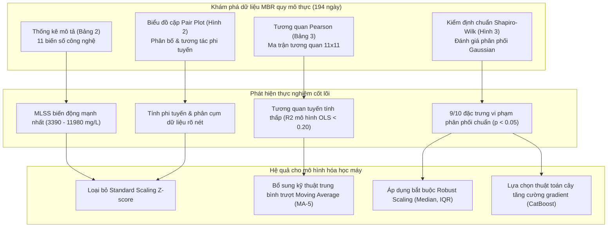
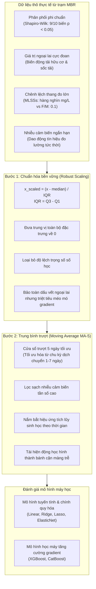

---
markmap:
  initialExpandLevel: 2
  maxWidth: 420
---

# Khung Dự Đoán Tắc Nghẽn Màng Trong MBR Quy Mô Thực Tế: Tích Hợp Kỹ Thuật Đặc Trưng và XAI

## 1. Giới thiệu tổng quan (Introduction)

### 1.1 Tổng quan công nghệ MBR và ưu thế xử lý nước thải

#### 1.1.1 Nguyên lý tích hợp màng sinh học
- Công nghệ màng sinh học (Membrane Bioreactor - MBR) kết hợp xử lý sinh học bùn hoạt tính với công nghệ lọc màng.
- Hệ thống MBR thay thế hoàn toàn bể lắng thứ cấp truyền thống trong các quy trình xử lý nước thải.
- Quá trình phân tách pha rắn và pha lỏng diễn ra trực tiếp qua các lỗ màng lọc bán thấm.
- Công nghệ này áp dụng phổ biến trong xử lý nước thải đô thị và các cơ sở công nghiệp.

#### 1.1.2 Các ưu thế kỹ thuật vượt trội
- MBR giảm thiểu đáng kể diện tích chiếm dụng mặt bằng (compact footprint) so với quy trình bùn hoạt tính truyền thống.
- Hệ thống tạo ra lượng bùn thải dư thấp hơn nhờ duy trì thời gian lưu giữ bùn (SRT) kéo dài.
- Nước sau xử lý có độ trong suốt cao và loại bỏ triệt để vi sinh vật gây bệnh (pathogens).
- Công nghệ loại bỏ hiệu quả các hợp chất ô nhiễm khó phân hủy và vi chất ô nhiễm (micropollutants).
- Nước sau lọc đáp ứng các tiêu chuẩn khắt khe cho mục đích tái sử dụng trực tiếp.

### 1.2 Thách thức cốt lõi: Hiện tượng nghẹt màng (Membrane Fouling) và cơ chế hình thành

#### 1.2.1 Bản chất vật lý và hóa sinh của nghẹt màng
- Nghẹt màng (Membrane Fouling) hình thành do sự tích tụ chất rắn, chất keo và chất hữu cơ hòa tan.
- Các tạp chất bám dính lên bề mặt màng hoặc lắng đọng bên trong các mao quản màng.
- Cơ chế nghẹt màng bao gồm hình thành lớp bánh cặn (cake layer), nghẽn lỗ màng (pore blocking) và phát triển màng sinh học (biofilm).
- Quá trình nghẹt làm suy giảm độ thấm thủy lực và làm gia tăng áp suất xuyên màng (TMP).

#### 1.2.2 Tác động vận hành và kinh tế
- Mức tăng TMP làm tăng điện năng tiêu thụ của hệ thống bơm màng và máy thổi khí sục khí.
- Người vận hành phải thực hiện làm sạch hóa chất tại chỗ (Cleaning-in-Place - CIP) thường xuyên hơn.
- Hóa chất làm sạch ăn mòn dần vật liệu màng, làm giảm tuổi thọ của cụm màng lọc.
- Chi phí bảo trì, tiêu thụ điện năng và thay thế màng chiếm tỷ trọng lớn trong ngân sách vận hành.

#### 1.2.3 Các yếu tố ảnh hưởng đa biến
- Đặc tính nước thải đầu vào chi phối quá trình tạo cặn, bao gồm COD, nhiệt độ và nồng độ chất dinh dưỡng.
- Thông số vận hành bao gồm lưu lượng lọc qua màng (flux $J$), tốc độ sục khí và chu kỳ bơm hút.
- Vận hành ở mức flux quá cao làm tăng nhanh tốc độ nghẹt màng và phát sinh rủi ro sự cố.
- Đặc tính bùn sinh học gồm nồng độ chất rắn lơ lửng (MLSS), các chất polyme ngoại bào (EPS) và sản phẩm vi sinh hòa tan (SMP).

### 1.3 Hạn chế của các mô hình cơ chế và thực nghiệm quy mô phòng thí nghiệm

#### 1.3.1 Khoảng cách giữa phòng thí nghiệm và hệ thống quy mô thực
- Nghiên cứu quy mô phòng thí nghiệm (lab-scale) sử dụng dòng vào nhân tạo với thành phần đồng nhất và lưu lượng cố định.
- Hệ thống MBR quy mô thực (Full-Scale MBR) phải đối mặt với dòng chảy biến đổi liên tục và tải lượng bất định.
- Dữ liệu thu thập từ trạm thực tế chứa nhiều giá trị dị biệt, xung nhiễu tín hiệu và khoảng trống mất dữ liệu.
- Các mô hình thực nghiệm trong phòng thí nghiệm thường mất tính chuẩn xác khi áp dụng vào trạm xử lý công nghiệp.

#### 1.3.2 Rào cản của mô hình cơ chế truyền thống
- Mô hình cơ chế (Mechanistic Models) xây dựng dựa trên động lực học chất lưu, truyền khối và định luật Darcy.
- Công thức Darcy mô tả trở lực màng:
  $$J = \frac{\Delta \text{TMP}}{\mu \cdot R_t}$$
- Trong đó $\mu$ là độ nhớt động học, $R_t$ là tổng trở lực lọc gồm màng lọc và lớp bánh cặn.
- Mô hình cơ chế đòi hỏi nhiều giả định lý tưởng hóa cấu trúc màng và các đặc tính vi mô của bùn.
- Việc đo đạc các tham số vi mô như điện tích bề mặt hạt keo hoặc độ nén bánh cặn rất khó thực hiện tại hiện trường.
- Các phương trình vi phân phi tuyến phức tạp gặp khó khăn khi phản ánh biến động sinh học đột ngột.

### 1.4 Tiềm năng và rào cản của Trí tuệ nhân tạo (AI) / Học máy (Machine Learning) truyền thống

#### 1.4.1 Tiềm năng của các thuật toán học máy
- Mô hình học máy (Machine Learning - ML) mô phỏng chính xác các quan hệ phi tuyến phức tạp giữa nhiều thông số đầu vào.
- Thuật toán học máy có khả năng trích xuất các quy luật ẩn sâu trong các chuỗi dữ liệu lớn.
- Các thuật toán phổ biến gồm mạng nơ-ron nhân tạo (ANN), máy học vectơ hỗ trợ (SVM), Random Forest và học sâu.
- Mô hình dữ liệu cung cấp khả năng dự báo trước sự cố suy giảm lưu lượng lọc.

#### 1.4.2 Rào cản mô hình hộp đen (Black-box) và thiếu khả năng diễn giải
- Thuật toán học máy truyền thống hoạt động như một hệ thống hộp đen (black-box).
- Kỹ sư trạm xử lý không hiểu được căn cứ logic mà mô hình sử dụng để đưa ra cảnh báo.
- Sự thiếu minh bạch làm giảm độ tin cậy và cản trở việc triển khai AI vào kiểm soát thực tế.

#### 1.4.3 Thách thức về chất lượng dữ liệu và tính phụ thuộc thời gian
- Thiết bị cảm biến hiện trường chịu tác động của môi trường bẩn, gây sai lệch và trôi số đo.
- Các biến đầu vào có thang đo và đơn vị khác biệt lớn, dễ gây sai lệch trọng số mô hình.
- Nghẹt màng có tính chất tích lũy theo thời gian (time-dependent cumulative nature).
- Đa số mô hình truyền thống chỉ dùng dữ liệu điểm tức thời, bỏ qua tác động tích lũy từ lịch sử vận hành.
- Thông số mục tiêu truyền thống thường dùng riêng biệt TMP hoặc flux $J$, không phản ánh đầy đủ khi cả hai cùng biến thiên.

### 1.5 Mục tiêu và cấu trúc nghiên cứu: Tích hợp Kỹ thuật đặc trưng và XAI trên MBR quy mô thực

#### 1.5.1 Mục tiêu nghiên cứu cốt lõi
- Xây dựng khung phân tích và dự báo nghẹt màng ứng dụng cho trạm MBR quy mô thực (Full-Scale MBR).
- Đối tượng kiểm chứng là hệ thống MBR xử lý nước thải chế biến thực phẩm vận hành thực tế.
- Khung nghiên cứu tích hợp kỹ thuật đặc trưng dựa trên AI (AI-Driven Feature Engineering) và AI có thể giải thích (XAI).
- Bộ dữ liệu thực nghiệm bao gồm chuỗi thời gian liên tục kéo dài hơn 6 tháng.

#### 1.5.2 Kỹ thuật đặc trưng thích ứng dữ liệu hiện trường
- Đề xuất biến mục tiêu là độ thông lượng riêng (Specific Flux, $J_s$):
  $$J_s = \frac{J}{\text{TMP}}$$
- Đại lượng $J_s$ tương đương với độ thấm thủy lực của màng, phản ánh đồng thời biến động của cả $J$ và TMP.
- Bổ sung biến hiệu suất khử COD ($\text{Eff}_{\text{COD}}$) để phản ánh trực tiếp hoạt tính phân hủy sinh học:
  $$\text{Eff}_{\text{COD}} = \frac{\text{COD}_{\text{in}} - \text{COD}_{\text{eff}}}{\text{COD}_{\text{in}}} \times 100\%$$
- Áp dụng kỹ thuật trung bình động (Moving Average) cho các chuỗi dữ liệu:
  $$\overline{X}_t = \frac{1}{k} \sum_{i=0}^{k-1} X_{t-i}$$
- Phương pháp trung bình động giúp làm phẳng xung nhiễu cảm biến và giữ lại xu hướng tích lũy thời gian của màng bẩn.

#### 1.5.3 Hiệu năng mô hình và cơ chế giải thích XAI
- Thuật toán CatBoost đạt độ chính xác dự báo cao nhất trong các mô hình kiểm nghiệm ($R^2 = 0.8374$).
- CatBoost vượt trội hoàn toàn so với các mô hình thống kê truyền thống và các giải thuật học máy khác.
- Phương pháp XAI sử dụng giá trị SHAP để phân tích độ nhạy biến số.
- Kết quả xác định tỷ lệ F/M và nồng độ MLSS là hai biến chi phối mạnh nhất.
- Khung mô hình cung cấp các giải thích định lượng minh bạch cho người vận hành trạm.

#### 1.5.4 Giá trị ứng dụng thực tiễn và định hướng tích hợp
- Khung dự báo hỗ trợ kỹ sư vận hành điều chỉnh kịp thời các thông số sục khí và chu kỳ hút lọc.
- Mô hình cho phép lập kế hoạch làm sạch màng chủ động trước khi màng rơi vào trạng thái tắc nghẽn nghiêm trọng.
- AI kết hợp với mạng lưới cảm biến hiện có để tạo thành hệ thống cảnh báo lai (hybrid decision support system).
- Dữ liệu dự báo AI có thể điều chỉnh tham số đầu vào cho các mô phỏng vật lý, tăng cường hiệu quả quản lý trạm.

## 2.1. Quy trình MBR và Thu thập Dữ liệu (MBR Process and Data Collection)

### 2.1.1. Cấu hình Kỹ thuật và Quy trình Xử lý Nước thải Thực phẩm

#### 2.1.1.1. Sơ đồ chuỗi công nghệ và ranh giới mô hình hóa
- Vị trí địa lý và quy mô: Hệ thống xử lý nước thải chế biến thực phẩm quy mô thực địa (Full-Scale MBR) vận hành tại Bắc Kinh, Trung Quốc.
- Chuỗi quy trình đơn vị: Dây chuyền xử lý nước thải gồm bể lắng, bể song chắn rác, bể điều hòa, hai bể vi hiếu khí nối tiếp, bể phản ứng sinh học màng (MBR) và bể chứa nước sau xử lý.
- Vị trí quan trắc và thu thập dữ liệu: Dữ liệu vận hành và chất lượng nước được ghi nhận tại dòng vào, dòng ra và trực tiếp trong ngăn màng MBR.
- Ranh giới mô hình hóa AI: Khung phân tích AI chỉ sử dụng dữ liệu vận hành từ hệ thống MBR. Nghiên cứu lược bỏ mô hình hóa chi tiết cho các bể tiền xử lý để bảo đảm sự tập trung vào cơ chế tắc nghẽn màng.
- Bản chất dữ liệu thực địa: Toàn bộ dữ liệu thu thập trực tiếp từ chu kỳ vận hành thường nhật trong điều kiện sản xuất thực tế. Bộ dữ liệu không bắt nguồn từ môi trường phòng thí nghiệm hay các kịch bản nhân tạo.

#### 2.1.1.2. Thông số kỹ thuật module màng sợi rỗng chìm
- Công suất xử lý thiết kế: Hệ thống MBR đạt công suất thiết kế $150\text{ m}^3/\text{ngày}$, đáp ứng yêu cầu xử lý của nhà máy chế biến thực phẩm.
- Lưu lượng nạp thực tế: Lưu lượng nạp trung bình vào hệ thống màng duy trì ở mức $114\text{ m}^3/\text{ngày}$.
- Thời gian lưu nước thủy lực (HRT): Giá trị HRT trung bình của bể MBR xấp xỉ $0.75\text{ ngày}$ ($\approx 18\text{ giờ}$).
- Cấu tạo vật liệu màng lọc: Màng sợi rỗng ngập nước (submerged hollow fiber) chế tạo từ vật liệu Polyethylene tích hợp.
- Kích thước lỗ màng: Đường kính lỗ màng danh định nhỏ hơn $0.4\ \mu\text{m}$ ($< 0.4\ \mu\text{m}$), giữ lại toàn bộ bùn hoạt tính trong bể sinh học.
- Kích thước hình học sợi màng: Đường kính trong của sợi màng đạt $0.41\text{ mm}$. Đường kính ngoài của sợi màng đạt $0.65\text{ mm}$.
- Giới hạn cơ học: Độ giãn dài cực đại trước khi nứt đứt sợi (elongation rate) nhỏ hơn $17\%$.
- Diện tích lọc hữu hiệu: Mỗi cụm màng có diện tích bề mặt lọc danh định là $200.7\text{ m}^2$. Hệ thống vận hành đồng thời $9\text{ cụm màng}$, tạo tổng diện tích màng hoạt động đạt $1806.3\text{ m}^2$.
- Cấu phần phụ trợ: Module màng tích hợp hệ thống đường ống thu nước sau lọc, dàn sục khí xáo trộn đáy và bơm tuần hoàn bùn.

#### 2.1.1.3. Chế độ vận hành thủy lực và kiểm soát làm sạch màng
- Chu kỳ hút lọc gián đoạn: Bơm hút dịch lọc hoạt động theo chu kỳ ngắt quãng gồm $10\text{ phút chạy}$ (on) và $5\text{ phút nghỉ}$ (off). Chế độ ngắt quãng này giải phóng áp lực hút và giảm thiểu mật độ bám dính của bánh bùn.
- Ngưỡng kiểm soát rửa màng: Quy trình làm sạch màng được kích hoạt khi áp suất xuyên màng TMP tăng trên $30\%$ so với đường nền hoặc khi vượt ngưỡng an toàn $60\text{ kPa}$.
- Trạng thái rửa hóa chất thực tế: Trong suốt $194\text{ ngày}$ giám sát, hệ thống không thực hiện các quy trình rửa hóa chất như rửa ngược tăng cường hóa chất (CEB) hay làm sạch tại chỗ (CIP).
- Nguyên nhân không rửa hóa chất: Giá trị TMP thực tế không chạm ngưỡng kích hoạt $60\text{ kPa}$.
- Ảnh hưởng đến mô hình hóa: Khung mô hình học máy loại bỏ các biến số liên quan đến can thiệp hóa chất ra khỏi tập đặc trưng đầu vào.

### 2.1.2. Tập Dữ liệu Thực địa 194 Ngày và Thiết bị Quan trắc

#### 2.1.2.1. Đặc điểm dữ liệu vận hành thực địa
- Thời lượng quan trắc: Tập dữ liệu thực địa ghi nhận liên tục trong $194\text{ ngày}$ vận hành thực tế.
- Điều kiện dao động thực tế: Số liệu phản ánh sự biến đổi tự nhiên của thành phần nước thải công nghiệp và nhiệt độ môi trường.
- Tính ứng dụng: Bộ dữ liệu bảo đảm tính tương thích thực tiễn cho việc phát triển mô hình dự báo tắc nghẽn trong các trạm xử lý quy mô lớn.

#### 2.1.2.2. Danh mục thiết bị đo kiểm và phương pháp phân tích chuẩn
- Phân tích nồng độ COD: Mẫu bùn lỏng lọc qua màng mixed cellulose $0.45\ \mu\text{m}$ (Advantec, Tokyo, Nhật Bản) trước khi đo. Quy trình đo tuân thủ Hướng dẫn Tiêu chuẩn APHA.
- Thiết bị quang phổ COD: Nồng độ COD dòng vào và dòng ra đo bằng máy so màu DR1010 (HACH, Loveland, CO, Hoa Kỳ).
- Đo pH và Nhiệt độ: Đo lường bằng điện cực đa năng cầm tay Multi 3630 (WTW, Munich, Đức) kèm mạng phối hợp tín hiệu.
- Đo Oxy hòa tan (DO): Nồng độ DO trong bể màng đo bằng máy đo đa chỉ tiêu cầm tay PHB-4 (Zsynet, Thượng Hải, Trung Quốc).
- Đo nồng độ bùn MLSS: Nồng độ chất rắn lơ lửng xác định bằng phương pháp khối lượng sấy khô (gravimetric method).
- Giám sát TMP và Lưu lượng: Áp suất xuyên màng TMP và lưu lượng dòng thấm đo liên tục bằng cảm biến áp suất và lưu lượng kế chuyên dụng gắn trên đường ống thu nước.
- Đo đạc chỉ số bùn: Các chỉ số SV30, SVI, tỷ lệ F/M và thông lượng màng Flux phân tích theo tiêu chuẩn ngành nước thải.

#### 2.1.2.3. Quy trình đồng bộ hóa và xử lý tần suất dữ liệu
- Phân loại tần suất lấy mẫu: Các biến thủ công gồm F/M, SV30, SVI, MLSS và COD được phân tích với tần suất $1\text{ lần/ngày}$.
- Đồng bộ biến cảm biến liên tục: Các biến trực tuyến gồm DO, pH, Nhiệt độ, TMP và Lưu lượng được lấy trung bình ngày (daily average).
- Khắc phục giới hạn tần suất: Việc tính giá trị trung bình ngày làm giảm nhiễu tần số cao nhưng có thể làm mờ biến động ngắn hạn. Nghiên cứu sử dụng biến đổi trung bình trượt (Moving Average) tại bước tiền xử lý để bảo toàn thông tin chuỗi thời gian.
- Hướng phát triển tương lai: Thu thập dữ liệu tần số cao trong tương lai sẽ giúp trực quan hóa sâu hơn các pha dao động tắc nghẽn trong ngày.

### 2.1.3. Các Thông số Vận hành và Đặc tính Sinh học Giám sát

#### 2.1.3.1. Các thông số vận hành lý - hóa liên tục
- Nồng độ oxy hòa tan (DO): Nồng độ DO duy trì ở mức trung bình $5.43\text{ mg/L}$, cung cấp đủ dưỡng khí cho vi sinh vật hiếu khí phân giải cơ chất.
- Độ pH môi trường phản ứng: Giá trị pH ổn định giúp duy trì hoạt tính sinh học của màng tế bào và cấu trúc bông bùn.
- Nhiệt độ nước thải (Temp): Nhiệt độ thay đổi theo điều kiện tự nhiên, chi phối độ nhớt động học của nước thải và tốc độ trao đổi chất của vi sinh vật.

#### 2.1.3.2. Đặc tính sinh khối bùn hoạt tính và khả năng lắng
- Dải nồng độ bùn hoạt tính (MLSS): Nồng độ MLSS trong bể duy trì dao động ổn định trong khoảng $5000\text{ mg/L}$ đến $9000\text{ mg/L}$.
- Kiểm soát tuổi bùn (SRT): Trạm xử lý không thực hiện xả bùn có chủ đích (no intentional sludge wasting) trong 194 ngày giám sát.
- Hệ quả đối với biến số SRT: Nồng độ bùn tự cân bằng động, vì vậy thông số SRT không được kiểm soát hay lưu trữ tường minh.
- Thể tích bùn lắng sau 30 phút (SV30): Tỷ lệ thể tích bùn lắng biểu thị dung tích bông bùn chiếm chỗ sau 30 phút lắng tĩnh trong ống đong.
- Chỉ số thể tích bùn (SVI): Thể tích chiếm chỗ của $1\text{ gam}$ bùn khô sau 30 phút lắng tĩnh, phản ánh nguy cơ trương nở bùn và khả năng tạo màng bánh.

#### 2.1.3.3. Tải trọng dinh dưỡng và tương tác sinh học - màng lọc
- Tỷ lệ thức ăn trên vi sinh vật (F/M): Chỉ số đánh giá tải lượng chất nền hữu cơ phân bổ trên một đơn vị khối lượng bùn hoạt tính mỗi ngày.
- Cơ chế gây tắc nghẽn màng: Sự mất cân bằng F/M kích thích vi khuẩn bài tiết chất polyme ngoại bào (EPS) và sản phẩm vi sinh vật hòa tan (SMP). EPS và SMP bám chặt vào bề mặt màng gây suy giảm độ thấm nghiêm trọng.
- Tương tác sinh khối và lực cắt: Nồng độ bùn cao làm gia tăng độ nhớt bùn, đòi hỏi sục khí liên tục để duy trì lực cắt dòng chảy bề mặt màng.

### 2.1.4. Thiết lập Kịch bản Mô hình hóa và Cơ sở Toán học

#### 2.1.4.1. Định nghĩa toán học của biến mục tiêu và biến phái sinh
- Áp suất xuyên màng ($\text{TMP}$): Chênh lệch áp suất thủy lực qua hai phía màng lọc ($\Delta P$), biểu thị bằng đơn vị kilopascal ($\text{kPa}$).
- Thông lượng riêng (Specific Flux - $\text{Spec. Flux}$): Tỷ số giữa thông lượng thấm qua màng và áp suất xuyên màng:
  $$\text{Spec. Flux} = \frac{J}{\Delta P} = \frac{\text{Flux}}{\text{TMP}}$$
  Trong đó:
  - $J$ hay $\text{Flux}$: Thông lượng dòng thấm qua bề mặt màng hữu hiệu ($\text{L}/(\text{m}^2\cdot\text{h})$ hoặc $\text{LMH}$).
  - $\Delta P$ hay $\text{TMP}$: Áp suất xuyên màng thực tế ($\text{kPa}$).
- Hiệu suất loại bỏ COD ($\text{COD RM}$): Tỷ lệ phần trăm loại bỏ nhu cầu oxy hóa học qua hệ thống MBR:
  $$\text{COD RM} = \frac{\text{COD}_{\text{in}} - \text{COD}_{\text{eff}}}{\text{COD}_{\text{in}}} \times 100\%$$
  Trong đó:
  - $\text{COD}_{\text{in}}$: Nồng độ COD của dòng nạp vào bể MBR ($\text{mg/L}$).
  - $\text{COD}_{\text{eff}}$: Nồng độ COD của dòng nước thấm qua màng sau xử lý ($\text{mg/L}$).

#### 2.1.4.2. Cơ chế suy giảm tính thấm và quan hệ nghịch đảo giữa TMP và Specific Flux
- Bản chất vật lý của Specific Flux: Specific Flux đại diện trực tiếp cho độ thấm màng (membrane permeability), là chỉ số định lượng cốt lõi của mức độ tắc nghẽn màng (fouling severity).
- Biến động trong vận hành thực tế: Dù vận hành ở chế độ kiểm soát thông lượng danh định, cả Flux và TMP vẫn biến thiên đồng thời do dao động tải trọng và nhiệt độ.
- Cơ chế quan hệ nghịch đảo: Khi cặn bẩn tích tụ trên bề mặt và trong mao quản màng, lực cản dòng chảy tăng lên. Để duy trì thông lượng, giá trị TMP phải tăng, dẫn đến sự sụt giảm tức thời của Specific Flux:
  $$\text{Tắc nghẽn màng} \uparrow \implies \Delta P\ (\text{TMP}) \uparrow \implies \text{Spec. Flux} \downarrow$$
- Lợi ích của Specific Flux trong mô hình hóa: Specific Flux phản ánh đồng thời cả áp suất và lưu lượng, tạo thành biến mục tiêu có tính đại diện và ổn định hơn TMP đơn lẻ.

#### 2.1.4.3. Cấu trúc 4 kịch bản mô hình hóa (Case I đến Case IV)
- Tiêu chí thiết lập kịch bản: Phân loại dựa trên việc bổ sung biến hiệu suất xử lý sinh học $\text{COD RM}$ và việc chọn lựa biến mục tiêu dự báo ($\text{TMP}$ hoặc $\text{Spec. Flux}$).
- Kịch bản I (Case I):
  - Tập đặc trưng đầu vào (7 biến): F/M, SV30, SVI, MLSS, DO, pH, Nhiệt độ (Temp).
  - Biến mục tiêu: Áp suất xuyên màng ($\text{TMP}$).
  - Mục tiêu: Dự báo áp suất màng thuần túy dựa trên các thông số vận hành lý - hóa và đặc tính bùn cơ bản.
- Kịch bản II (Case II):
  - Tập đặc trưng đầu vào (8 biến): F/M, SV30, SVI, MLSS, DO, pH, Nhiệt độ (Temp), Hiệu suất loại bỏ COD ($\text{COD RM}$).
  - Biến mục tiêu: Áp suất xuyên màng ($\text{TMP}$).
  - Mục tiêu: Khảo sát ảnh hưởng của hiệu suất xử lý hữu cơ $\text{COD RM}$ đối với độ chính xác dự báo TMP.
- Kịch bản III (Case III):
  - Tập đặc trưng đầu vào (7 biến): F/M, SV30, SVI, MLSS, DO, pH, Nhiệt độ (Temp).
  - Biến mục tiêu: Thông lượng riêng ($\text{Spec. Flux}$).
  - Mục tiêu: Dự báo độ thấm màng từ các thông số vận hành cơ bản mà không cần dữ liệu hiệu suất loại bỏ chất hữu cơ.
- Kịch bản IV (Case IV):
  - Tập đặc trưng đầu vào (8 biến): F/M, SV30, SVI, MLSS, DO, pH, Nhiệt độ (Temp), Hiệu suất loại bỏ COD ($\text{COD RM}$).
  - Biến mục tiêu: Thông lượng riêng ($\text{Spec. Flux}$).
  - Mục tiêu: Thiết lập mô hình hoàn chỉnh nhất để dự báo độ thấm màng kết hợp toàn diện thông số vận hành và hiệu suất xử lý sinh học.
- Bảng đối chiếu các kịch bản mô hình hóa (Table 1):
| Kịch bản | Tập đặc trưng đầu vào (Factors) | Biến mục tiêu (Target) | Ý nghĩa mô hình |
| :--- | :--- | :--- | :--- |
| **Case I** | F/M, SV30, SVI, MLSS, DO, pH, Temp | TMP | Mô hình cơ sở dự báo áp lực xuyên màng |
| **Case II** | F/M, SV30, SVI, MLSS, DO, pH, Temp, COD RM | TMP | Mô hình nâng cao dự báo TMP kết hợp hiệu suất COD |
| **Case III** | F/M, SV30, SVI, MLSS, DO, pH, Temp | Spec. Flux | Mô hình cơ sở dự báo độ thấm màng |
| **Case IV** | F/M, SV30, SVI, MLSS, DO, pH, Temp, COD RM | Spec. Flux | Mô hình toàn diện dự báo độ thấm màng kết hợp hiệu suất COD |

## 2.2 - 2.3. Khám phá dữ liệu (EDA) và Kỹ thuật đặc trưng (Feature Engineering)

### 2.2 Khám phá dữ liệu (Exploratory Data Analysis - EDA)

#### 2.2.1 Mục tiêu và quy trình phân tích thăm dò
- Phân tích khám phá dữ liệu (EDA) cung cấp cái nhìn toàn diện về cấu trúc dữ liệu vận hành hệ thống MBR.
- Phương pháp kiểm tra hình dạng phân phối, mối liên kết tiềm ẩn và các dạng mẫu cơ bản trong tập dữ liệu.
- Quy trình tích hợp thống kê mô tả, kỹ thuật trực quan hóa, ma trận tương quan và kiểm định phân phối chuẩn.
- Dữ liệu thu thập gồm 194 mẫu đo liên tục trong hơn 6 tháng từ trạm MBR quy mô thực (Full-Scale MBR).
- Bước EDA xác lập cơ sở dữ liệu sạch và định hướng cấu trúc mô hình học máy trước khi huấn luyện.

#### 2.2.2 Thống kê mô tả các thông số vận hành (Operational Feature Statistics)
- Quy mô mẫu kiểm định đạt $N = 194$ quan sát độc lập cho tất cả thông số đầu vào và biến mục tiêu.
- Thống kê mô tả tính toán các chỉ số: giá trị trung bình (Mean), độ lệch chuẩn (Std), giá trị nhỏ nhất (Min), phân vị 25% ($Q_1$), trung vị 50% ($Q_2$), phân vị 75% ($Q_3$) và giá trị lớn nhất (Max).
- Nồng độ chất rắn lơ lửng trong bùn hoạt tính (MLSS) thể hiện mức biến động biên độ lớn nhất trong hệ thống:
  - Giá trị trung bình đạt $7813\text{ mg/L}$, độ lệch chuẩn đạt $1361\text{ mg/L}$.
  - Khoảng giá trị dao động rộng từ cực tiểu $3390\text{ mg/L}$ đến cực đại $11{,}980\text{ mg/L}$.
  - Các phân vị tương ứng gồm $Q_1 = 7080\text{ mg/L}$, trung vị $Q_2 = 7900\text{ mg/L}$, và $Q_3 = 8628\text{ mg/L}$.
  - Sự dao động mạnh của MLSS phản ánh biến động nồng độ cơ chất dòng vào và hoạt tính sinh khối vi sinh vật.
- Thể tích bùn sau 30 phút lắng ($\text{SV}_{30}$):
  - Giá trị trung bình đạt $95.8\%$, độ lệch chuẩn $8.9\%$, biên độ biến thiên từ $30.0\%$ đến $99.0\%$.
  - Các giá trị phân vị gồm $Q_1 = 96.0\%$, trung vị $Q_2 = 98.0\%$, $Q_3 = 99.0\%$.
  - Chỉ số $\text{SV}_{30}$ tập trung cao ở vùng trên $95\%$, phản ánh mật độ bùn đậm đặc trong bể màng.
- Chỉ số thể tích bùn (Sludge Volume Index - SVI):
  - Công thức tính toán chuẩn:
    $$\text{SVI} = \frac{\text{SV}_{30} \times 1000}{\text{MLSS}} \quad (\text{mL/g})$$
  - Giá trị trung bình đạt $125.1\text{ mL/g}$, độ lệch chuẩn $18.9\text{ mL/g}$.
  - Khoảng phân bố ghi nhận từ cực tiểu $82.6\text{ mL/g}$ đến cực đại $182.7\text{ mL/g}$.
  - Các ngưỡng tứ phân vị gồm $Q_1 = 112.5\text{ mL/g}$, trung vị $Q_2 = 122.4\text{ mL/g}$, $Q_3 = 135.0\text{ mL/g}$.
  - Mức phân tán SVI phản ánh đặc tính lắng biến đổi vừa phải của hỗn hợp bùn sinh học tại hiện trường.
- Nồng độ oxy hòa tan (DO):
  - Giá trị trung bình đạt $5.43\text{ mg/L}$, độ lệch chuẩn $0.79\text{ mg/L}$, dao động từ $3.62\text{ mg/L}$ đến $7.55\text{ mg/L}$.
  - Các mốc phân vị gồm $Q_1 = 4.90\text{ mg/L}$, trung vị $Q_2 = 5.30\text{ mg/L}$, $Q_3 = 5.98\text{ mg/L}$.
  - Dải giá trị hẹp chứng minh hệ thống kiểm soát sục khí ổn định, cung cấp đủ oxy cho quá trình hiếu khí.
- Độ pH trong bể màng:
  - Giá trị trung bình đạt $8.11$, độ lệch chuẩn $0.40$ (hoặc $0.39$), biên độ ghi nhận từ $5.02$ đến $8.97$.
  - Các phân vị xác định gồm $Q_1 = 7.85$, trung vị $Q_2 = 7.98$, $Q_3 = 8.45$.
  - Môi trường kiềm nhẹ chiếm ưu thế, duy trì điều kiện tối ưu cho hệ vi sinh và bảo vệ màng lọc.
- Nhiệt độ nước thải (Temp):
  - Giá trị trung bình đạt $26.4^\circ\text{C}$, độ lệch chuẩn $4.5^\circ\text{C}$, dải đo từ $13.0^\circ\text{C}$ đến $31.6^\circ\text{C}$.
  - Các ngưỡng phân vị gồm $Q_1 = 25.0^\circ\text{C}$, trung vị $Q_2 = 28.3^\circ\text{C}$, $Q_3 = 29.7^\circ\text{C}$.
  - Dao động nhiệt độ theo mùa ảnh hưởng trực tiếp đến độ nhớt động học của nước và hoạt tính phân giải sinh học.
- Tỷ lệ tải trọng hữu cơ trên sinh khối (Food-to-Microorganism ratio - F/M):
  - Đơn vị tính toán: $\text{kgCOD}/(\text{kgMLSS}\cdot\text{d})$.
  - Giá trị trung bình đạt $0.012$, độ lệch chuẩn $0.004$, dải biến thiên từ $0.003$ đến $0.024$.
  - Các phân vị thực nghiệm gồm $Q_1 = 0.009$, trung vị $Q_2 = 0.011$, $Q_3 = 0.014$.
  - Mức biến thiên tương đối thấp chứng tỏ tải trọng hữu cơ nạp vào trạm xử lý giữ được sự ổn định.
- Hiệu suất loại bỏ COD ($\text{COD RM}$):
  - Giá trị trung bình đạt $64.7\%$, độ lệch chuẩn $16.9\%$, biên độ phân bố từ $18.7\%$ đến $87.6\%$.
  - Các phân vị gồm $Q_1 = 56.4\%$, trung vị $Q_2 = 70.8\%$, $Q_3 = 76.6\%$.
  - Hiệu suất loại bỏ dao động tùy thuộc thành phần hữu cơ nước thải chế biến thực phẩm theo từng mẻ sản xuất.
- Thông lượng lọc (Flux):
  - Đơn vị đo lường: $\text{LMH} = \text{L}/(\text{m}^2\cdot\text{h})$.
  - Giá trị trung bình đạt $2.65\text{ LMH}$, độ lệch chuẩn $0.52\text{ LMH}$, dao động từ $0.60\text{ LMH}$ đến $3.87\text{ LMH}$.
  - Các mức phân vị ghi nhận $Q_1 = 2.45\text{ LMH}$, trung vị $Q_2 = 2.73\text{ LMH}$, $Q_3 = 2.92\text{ LMH}$.
- Áp suất xuyên màng (Transmembrane Pressure - TMP):
  - Giá trị trung bình đạt $51.0\text{ kPa}$, độ lệch chuẩn $6.8\text{ kPa}$, dải biến thiên từ $37.0\text{ kPa}$ (hoặc $37.08\text{ kPa}$) đến $69.0\text{ kPa}$.
  - Các ngưỡng phân vị gồm $Q_1 = 46.3\text{ kPa}$, trung vị $Q_2 = 50.5\text{ kPa}$, $Q_3 = 55.0\text{ kPa}$.
  - Mức TMP phản ánh hệ thống màng đang chịu nghẹt ở mức độ trung bình với sự gia tăng trở lực định kỳ.
- Thông lượng lọc riêng (Specific Flux - Spec. Flux):
  - Công thức xác định:
    $$\text{Spec. Flux} = \frac{\text{Flux}}{\text{TMP}} \quad (\text{LMH/kPa})$$
  - Giá trị trung bình đạt $0.053\text{ LMH/kPa}$, độ lệch chuẩn $0.013\text{ LMH/kPa}$, dải đo từ $0.012$ đến $0.099\text{ LMH/kPa}$.
  - Các mức phân vị gồm $Q_1 = 0.046\text{ LMH/kPa}$, trung vị $Q_2 = 0.055\text{ LMH/kPa}$, $Q_3 = 0.062\text{ LMH/kPa}$.
  - Đại lượng thể hiện độ thấm thủy lực chuẩn hóa, duy trì tính ổn định giữa các chu kỳ vận hành khác nhau.

#### 2.2.3 Biểu đồ phân tán và đồ thị cặp (Scatter Plot và Pair Plot)
- Đồ thị cặp (Pair Plot) được khởi tạo bằng thư viện Seaborn (phiên bản 0.13.2) chạy trên nền tảng Python (phiên bản 3.13.1).
- Biểu đồ tích hợp các đường hồi quy tuyến tính và khoảng tin cậy (Confidence Intervals) $95\%$ để đánh giá xu thế dữ liệu.
- Phân tích tương quan cặp cung cấp trực quan hóa hai chiều về liên kết giữa các biến quá trình và chỉ số nghẹt màng.
- Quan sát thực nghiệm phát hiện tương quan nghịch rõ rệt giữa TMP và nồng độ DO:
  - Nồng độ DO cao đi kèm với giá trị TMP thấp hơn.
  - Tác dụng sục khí cường độ mạnh tạo lực cắt bọt khí giúp cuốn trôi các chất bám bẩn trên bề mặt màng.
  - Sục khí đầy đủ hạn chế sự tích lũy màng vi sinh vật (biofilm) và làm chậm tốc độ tắc nghẽn mao quản màng.
- Tương quan thuận yếu xuất hiện giữa TMP và nồng độ MLSS:
  - Sinh khối MLSS tăng cao làm tăng mật độ cặn bám, thúc đẩy quá trình nén lớp bánh cặn (cake layer) trên sợi màng.
- Mối liên hệ nghịch rất mạnh thể hiện rõ giữa TMP và Spec. Flux:
  - Khi hiện tượng nghẹt màng gia tăng, TMP tăng dần và thông lượng lọc riêng Spec. Flux suy giảm nhanh chóng.
  - Đồ thị xác nhận tính chất cơ học trực tiếp của sự suy giảm tính thấm qua màng lọc.
- Thông lượng riêng Spec. Flux biểu hiện tương quan thuận mức độ vừa với hiệu suất khử COD (COD RM):
  - Hiệu quả loại bỏ chất hữu cơ cao làm giảm các tiền chất gây nghẹt như polyme ngoại bào (EPS) hòa tan.
  - Nhờ đó, nước qua màng ít gây tắc nghẽn mao quản, duy trì thông lượng lọc riêng ở mức cao.
- Tương quan giữa Spec. Flux và MLSS biểu hiện rất mờ nhạt:
  - Sự thay đổi đơn lẻ của nồng độ MLSS không trực tiếp quyết định khả năng thấm của màng trong điều kiện khảo sát.
- Phân tích phụ thuộc nội bộ giữa các biến đặc trưng phát hiện tương quan nghịch chặt chẽ giữa MLSS và SVI ($r = -0.77$):
  - Khi nồng độ MLSS tăng cao, thể tích bùn lắng tương đối bị nén chặt, làm giảm chỉ số SVI danh định.
- Tương quan nghịch mạnh giữa nhiệt độ (Temp) và nồng độ DO ($r = -0.70$):
  - Hiện tượng này tuân thủ định luật vật lý về độ hòa tan của khí oxy suy giảm khi nhiệt độ chất lỏng gia tăng.
- Đồ thị phân tán đơn lẻ (Scatter Plot) giúp sàng lọc các điểm dị biệt (outliers) cực đoan gây nhiễu cho mô hình học máy.

#### 2.2.4 Phân tích ma trận hệ số tương quan Pearson
- Hệ số tương quan Pearson ($r$) định lượng mức độ liên kết tuyến tính giữa từng biến đặc trưng và biến mục tiêu.
- Công thức toán học tính hệ số tương quan tuyến tính mẫu:
  $$r_{xy} = \frac{\sum_{i=1}^{n} (x_i - \bar{x})(y_i - \bar{y})}{\sqrt{\sum_{i=1}^{n} (x_i - \bar{x})^2 \cdot \sum_{i=1}^{n} (y_i - \bar{y})^2}}$$
- Trong đó $\bar{x}$ và $\bar{y}$ là giá trị trung bình mẫu của biến đặc trưng $x$ và biến mục tiêu $y$.
- Ma trận tương quan toàn diện giữa 11 thông số vận hành và chỉ số màng lọc:
  - F/M: tương quan với SV30 ($0.09$), SVI ($0.01$), MLSS ($0.03$), DO ($-0.28$), pH ($-0.13$), Temp ($0.11$), Flux ($0.45$), COD RM ($0.46$), TMP ($-0.30$), Spec. Flux ($0.52$).
  - SV30: tương quan với SVI ($0.08$), MLSS ($0.54$), DO ($-0.31$), pH ($-0.27$), Temp ($-0.04$), Flux ($0.15$), COD RM ($0.23$), TMP ($-0.14$), Spec. Flux ($0.20$).
  - SVI: tương quan với MLSS ($-0.77$), DO ($0.01$), pH ($0.25$), Temp ($0.26$), Flux ($-0.22$), COD RM ($-0.21$), TMP ($0.34$), Spec. Flux ($-0.34$).
  - MLSS: tương quan với DO ($-0.19$), pH ($-0.38$), Temp ($-0.25$), Flux ($0.26$), COD RM ($0.32$), TMP ($-0.36$), Spec. Flux ($0.39$).
  - DO: tương quan với pH ($-0.06$), Temp ($-0.70$), Flux ($-0.33$), COD RM ($-0.10$), TMP ($0.20$), Spec. Flux ($-0.36$).
  - pH: tương quan với Temp ($0.42$), Flux ($0.22$), COD RM ($-0.54$), TMP ($0.42$), Spec. Flux ($-0.05$).
  - Temp: tương quan với Flux ($0.25$), COD RM ($-0.18$), TMP ($0.07$), Spec. Flux ($0.16$).
  - Flux: tương quan với COD RM ($-0.13$), TMP ($-0.18$), Spec. Flux ($0.85$).
  - COD RM: tương quan với TMP ($-0.41$), Spec. Flux ($0.11$).
  - TMP: tương quan nghịch mạnh nhất với Spec. Flux ($r = -0.65$).
- Đánh giá tương quan với áp suất xuyên màng TMP:
  - TMP có tương quan thuận mạnh nhất với độ pH ($r = 0.42$).
  - Cơ chế vi sinh và hóa lý: pH tăng kiềm hóa làm biến đổi điện tích bề mặt tế bào vi khuẩn và giảm độ tan của muối khoáng vô cơ, đẩy mạnh hiện tượng đóng cặn vô cơ (inorganic scaling).
  - TMP có tương quan nghịch với COD RM ($r = -0.41$) và MLSS ($r = -0.36$).
  - Khả năng xử lý chất hữu cơ cao và mật độ sinh khối ổn định giúp hạn chế tích tụ các tác nhân hòa tan gây nghẹt màng.
- Đánh giá tương quan với thông lượng riêng Spec. Flux:
  - Spec. Flux có tương quan thuận cao nhất với tỷ lệ tải trọng F/M ($r = 0.52$).
  - Điều kiện F/M tối ưu kích thích hoạt tính trao đổi chất của vi sinh vật và cải thiện đặc tính keo tụ, giảm tắc nghẽn mao quản màng.
  - Spec. Flux có tương quan thuận mức vừa với nồng độ MLSS ($r = 0.39$), chứng tỏ sinh khối duy trì chức năng lọc ổn định trong khoảng khảo sát.
  - Spec. Flux có tương quan nghịch với DO ($r = -0.36$). Nồng độ DO quá mức có thể kích thích sản sinh màng sinh học bám dính dày đặc trên bề mặt sợi màng.
- Kết quả khẳng định mối quan hệ tương tác đa biến phi tuyến phức tạp trong quy trình MBR, đòi hỏi các mô hình học máy phi tuyến thay vì mô hình tuyến tính đơn giản.

#### 2.2.5 Kiểm định phân phối chuẩn Shapiro-Wilk (Normality Check)
- Mục đích kiểm định: Đánh giá giả định phân phối chuẩn của các biến số trước khi đưa vào các thuật toán thống kê và học máy.
- Thiết lập giả thuyết thống kê:
  - Giả thuyết vô hiệu ($H_0$): Dữ liệu tuân theo phân phối chuẩn.
  - Giả thuyết đối lập ($H_1$): Dữ liệu sai lệch có ý nghĩa thống kê so với phân phối chuẩn.
- Công thức thống kê kiểm định Shapiro-Wilk:
  $$W = \frac{\left( \sum_{i=1}^n a_i x_{(i)} \right)^2}{\sum_{i=1}^n (x_i - \bar{x})^2}$$
  Trong đó $x_{(i)}$ là giá trị quan sát thứ $i$ sau khi sắp xếp theo thứ tự tăng dần, và $a_i$ là các hệ số trọng số từ ma trận hiệp phương sai.
- Giá trị thống kê $W$ biến thiên từ $0$ đến $1$; giá trị càng tiệm cận $1$ thể hiện phân phối dữ liệu càng gần với phân phối chuẩn.
- Ngưỡng mức ý nghĩa thống kê được ấn định tại $\alpha = 0.05$:
  - Nếu $p\text{-value} > 0.05$, không đủ bằng chứng bác bỏ $H_0$, dữ liệu tuân theo phân phối chuẩn.
  - Nếu $p\text{-value} \le 0.05$, bác bỏ $H_0$, xác nhận dữ liệu sai lệch có ý nghĩa khỏi phân phối chuẩn.
- Kết quả kiểm định thực nghiệm đối với toàn bộ các biến số:
  - Tỷ lệ F/M là biến duy nhất tuân theo phân phối chuẩn với $p = 0.0518 > 0.05$.
  - Toàn bộ 10 biến còn lại (SV30, SVI, MLSS, DO, pH, Temp, Flux, COD RM, TMP, Spec. Flux) đều có $p\text{-value} < 0.05$.
  - Bằng chứng thực nghiệm khẳng định hầu hết các thông số vận hành trạm MBR đều có phân phối lệch chuẩn, đuôi dày hoặc đa đỉnh.
- Ý nghĩa phương pháp luận:
  - Các mô hình hồi quy tuyến tính cổ điển (Linear Regression, Ridge, Lasso) dựa trên giả định chuẩn tắc sẽ bị suy giảm hiệu năng nghiêm trọng.
  - Tập dữ liệu đòi hỏi kỹ thuật chuẩn hóa bền vững (Robust Scaling) và các thuật toán học máy phi tham số (như Gradient Boosting Decision Trees).

---

### 2.3 Tiền xử lý dữ liệu và Kỹ thuật đặc trưng (Feature Engineering)

#### 2.3.1 Chuẩn hóa bền vững (Robust Scaling)
- Hạn chế của các phương pháp chuẩn hóa truyền thống trong môi trường công nghiệp:
  - Phương pháp chuẩn hóa cực trị (Min-Max Scaling) nhạy cảm với các điểm cực trị ngoài biên, làm co cụm đa số dữ liệu về khoảng rất hẹp.
  - Phương pháp chuẩn hóa điểm chuẩn (Z-score Standardization) sử dụng giá trị trung bình mẫu ($\mu$) và độ lệch chuẩn ($\sigma$), hai đại lượng bị bóp méo nặng nề bởi giá trị ngoại lai (outliers).
- Nguyên lý của chuẩn hóa bền vững (Robust Scaling):
  - Phương pháp loại bỏ hoàn toàn sự phụ thuộc vào trung bình và độ lệch chuẩn.
  - Thuật toán định tâm dữ liệu xung quanh trung vị ($Q_2$) và co giãn theo khoảng tứ phân vị (Interquartile Range - $\text{IQR}$).
- Công thức toán học thực thi chuẩn hóa bền vững:
  $$x_{\text{scaled}} = \frac{x - \text{Median}}{Q_3 - Q_1} = \frac{x - Q_2}{\text{IQR}}$$
  Trong đó $Q_1$ là phân vị $25\%$, $Q_3$ là phân vị $75\%$, và $\text{IQR} = Q_3 - Q_1$ chứa $50\%$ mật độ dữ liệu trung tâm.
- Vai trò xử lý giá trị ngoại lai cực đoan trong nhà máy MBR thực tế:
  - Cảm biến hiện trường chịu tác động của bám bẩn sinh học, bọt khí và xung điện, thường xuyên tạo ra các gai tín hiệu giả mạo.
  - Robust Scaling duy trì tính nhận diện của các điểm ngoại lai nhưng triệt tiêu sức ảnh hưởng áp đảo của chúng lên hàm mất mát của mô hình.
- Cân bằng thang đo giữa các biến đặc trưng:
  - Trước khi chuẩn hóa, nồng độ MLSS có độ lớn lên tới $11{,}980\text{ mg/L}$, trong khi tỷ lệ F/M chỉ ở mức $0.012\text{ kgCOD}/(\text{kgMLSS}\cdot\text{d})$.
  - Sự chênh lệch biên độ hàng triệu lần khiến các thuật toán tối ưu hóa dễ bị chi phối sai lệch bởi biến có giá trị tuyệt đối lớn.
  - Sau chuẩn hóa, tất cả biến đều quy tụ về thang đo tương đương với trung vị bằng $0$, giúp các thuật toán học máy hội tụ nhanh và ổn định.
- Tác động thực nghiệm lên hiệu năng mô hình (Trường hợp Case IV dự báo Spec. Flux):
  - Mô hình CatBoost với Robust Scaling đạt hệ số xác định $R^2 = 0.7969$, sai số tuyệt đối trung bình $\text{MAE} = 0.0050$, sai số căn bậc hai trung bình $\text{RMSE} = 0.0060$, sai số phần trăm $\text{MAPE} = 0.1074$.
  - Mô hình XGBoost với Robust Scaling đạt $R^2 = 0.6555$, $\text{MAE} = 0.0059$, $\text{RMSE} = 0.0078$, $\text{MAPE} = 0.1304$.
  - Mô hình Linear Regression và Ridge Regression đạt $R^2 \approx 0.635$, cải thiện đáng kể so với việc sử dụng dữ liệu thô.
  - Mô hình Lasso ($R^2 = -0.0048$) và ElasticNet ($R^2 = 0.2953$) kém hiệu quả do áp đặt phạt trọng số quá mức trên tập biến có tương quan phức tạp.

#### 2.3.2 Kỹ thuật trung bình trượt theo thời gian (Moving Average)
- Cơ chế trễ thời gian (Time Delay) trong hệ thống MBR thực tế:
  - Quá trình phân hủy chất ô nhiễm sinh học và sự tích lũy trở lực lọc không diễn ra tức thời.
  - Luôn tồn tại độ trễ động học giữa biến đổi chất lượng dòng vào, hoạt tính sinh khối trong bể và sự suy giảm lưu lượng lọc tại bề mặt màng.
  - Khái niệm độ trễ thời gian áp dụng trong nghiên cứu là một phương pháp kỹ thuật đặc trưng định hướng dữ liệu (Data-Driven Feature Engineering).
  - Phương pháp này nhằm tối ưu hóa sự bắt cặp dữ liệu đầu vào - đầu ra cho quá trình huấn luyện mô hình, không nhằm đại diện trực tiếp cho thời gian lưu thủy lực (HRT) hay độ trễ vật lý thuần túy.
- Cơ chế tích lũy màng sinh học và hình thành bánh cặn:
  - Hiện tượng nghẹt màng tiến triển dần theo thời gian thông qua sự tích lũy lâu dài của điều kiện vận hành và sinh khối vi sinh.
  - Các phép đo điểm đơn lẻ tại một thời điểm không thể phản ánh toàn bộ lịch sử chịu tải của màng lọc.
- Công thức toán học của kỹ thuật trung bình trượt (Moving Average):
  $$\text{MA}_t = \frac{x_{n-t+1} + x_{n-t+2} + \dots + x_n}{t} = \frac{1}{t} \sum_{i=n-t+1}^{n} x_i$$
  Biểu diễn theo cửa sổ trượt quá khứ kích thước $k$ ngày cho quan sát tại thời điểm $t$:
  $$\overline{X}_k(t) = \frac{1}{k} \sum_{j=0}^{k-1} x(t - j)$$
- Chức năng lọc nhiễu và làm mịn tín hiệu tần số cao:
  - Dữ liệu chất lượng nước và thông số vận hành hiện trường thường có dao động ngắn hạn ngẫu nhiên do sai số thiết bị đo.
  - Trung bình trượt loại bỏ các xung nhiễu tần số cao, trích xuất xu thế dài hạn và giữ lại các tín hiệu động học thực chất của hệ thống.
- Quy trình tối ưu hóa kích thước cửa sổ trượt:
  - Nghiên cứu đánh giá có hệ thống các khoảng dịch chuyển thời gian từ 1 ngày đến 7 ngày (trong phạm vi một tuần) cho từng biến đặc trưng đầu vào.
  - Hiệu năng của các mô hình dự báo ($R^2$ và RMSE) được so sánh định lượng qua từng kích thước cửa sổ.
  - Cửa sổ trượt 5 ngày ($\text{MA}_5$) cho kết quả tối ưu nhất trên toàn bộ các chỉ số kiểm định.
- Bằng chứng thực nghiệm vượt trội khi tích hợp $\text{MA}_5$ kết hợp Robust Scaling (Case IV):
  - CatBoost nâng hệ số xác định từ $R^2 = 0.7969$ lên $R^2 = 0.8374$ (cải thiện hơn $10\%$ so với mô hình dữ liệu thô ban đầu).
  - Sai số căn bậc hai trung bình của CatBoost giảm mạnh xuống $\text{RMSE} = 0.0054$, $\text{MAE} = 0.0042$, và $\text{MAPE} = 0.0863$.
  - XGBoost tăng vọt độ chính xác từ $R^2 = 0.6555$ lên $R^2 = 0.7404$, $\text{RMSE} = 0.0068$, $\text{MAE} = 0.0055$, $\text{MAPE} = 0.1168$.
  - Hồi quy tuyến tính Linear Regression đạt $R^2 = 0.6623$ ($\text{RMSE} = 0.0078$), Ridge Regression đạt $R^2 = 0.6617$ ($\text{RMSE} = 0.0078$).
  - ElasticNet tăng nhẹ lên $R^2 = 0.3145$, trong khi Lasso duy trì ở mức $R^2 = -0.0048$.
- Khẳng định giá trị thực tiễn:
  - Tích hợp chuỗi thời gian trượt nắm bắt chính xác tác động lũy tích của lịch sử vận hành lên động lực học nghẹt màng.
  - Đây là nền tảng cốt lõi giúp các mô hình học máy nâng cao độ tin cậy và khả năng dự báo sớm trong các trạm MBR công nghiệp thực tế.

## 2.4 - 2.5. Các mô hình dự đoán và Khung giải thích AI (Models & Explainable AI)

### 2.4. Các mô hình dự đoán hiện tượng tắc màng (Predictive Models for Membrane Fouling)

#### 2.4.1. Các mô hình thống kê tuyến tính (Statistical Regression Models)
- Vai trò của mô hình thống kê: Nghiên cứu dùng các mô hình hồi quy thống kê để nắm bắt các mối quan hệ tuyến tính giữa các đặc trưng đầu vào và thông số mục tiêu.
- Bản chất phương pháp: Các mô hình này thiết lập chuẩn cơ sở (baseline) so sánh trước khi triển khai các thuật toán học máy phi tuyến phức tạp.
- Mô hình Hồi quy tuyến tính đa biến (Multiple Linear Regression):
  - Biểu diễn toán học chuẩn tắc (Phương trình 3):
    $$Y = \beta_0 + \beta_1 X_1 + \beta_2 X_2 + \dots + \beta_p X_p + \epsilon$$
  - Thành phần công thức: $Y$ là biến phụ thuộc mục tiêu ($\text{TMP}$ hoặc $\text{Spec. Flux}$). $X_j$ ($j = 1, \dots, p$) đại diện cho các biến độc lập đầu vào.
  - Hệ số hồi quy: $\beta_0$ là hệ số chặn (intercept). $\beta_j$ biểu thị trọng số đóng góp tuyến tính của biến $X_j$.
  - Thành phần sai số: $\epsilon$ là sai số ngẫu nhiên thỏa mãn phân phối chuẩn với kỳ vọng bằng $0$.
  - Giả định cơ bản: Mô hình giả định mối quan hệ cố định, hoàn toàn tuyến tính giữa các yếu tố vận hành sinh học và tốc độ tắc nghẽn màng.
  - Hạn chế thực tiễn: Hệ thống MBR có tương tác vi sinh và thủy lực rất phức tạp. Mô hình tuyến tính đơn giản không phản ánh được động học tắc nghẽn phi tuyến.
- Mô hình Hồi quy Lasso (Least Absolute Shrinkage and Selection Operator):
  - Khái niệm: Lasso kết hợp mô hình hồi quy tuyến tính với kỹ thuật điều chuẩn (regularization) bằng chuẩn $L_1$.
  - Hàm mục tiêu tối ưu hóa (Phương trình 4):
    $$\min_{\beta} \sum_{i=1}^n \left( y_i - \beta_0 - \sum_{j=1}^p \beta_j x_{ij} \right)^2 + \lambda \sum_{j=1}^p |\beta_j|$$
  - Cơ chế hình phạt chuẩn $L_1$: Thành phần $\lambda \sum_{j=1}^p |\beta_j|$ áp đặt hình phạt tỷ lệ thuận với giá trị tuyệt đối của các hệ số hồi quy.
  - Vai trò siêu tham số $\lambda$: Hệ số $\lambda \ge 0$ kiểm soát cường độ điều chuẩn. Khi $\lambda$ tăng, mô hình co mạnh các trọng số về gần $0$.
  - Khả năng chọn lọc đặc trưng tự động (Feature Selection): Hình phạt $L_1$ có dạng hình học góc nhọn tại các trục tọa độ. Đặc tính này triệt tiêu hoàn toàn một số hệ số $\beta_j$ về đúng bằng $0$.
  - Kiểm soát hiện tượng quá khớp (Overfitting): Việc loại bỏ các biến dư thừa giúp đơn giản hóa mô hình và giảm thiểu nguy cơ học thuộc lòng nhiễu dữ liệu.
  - Hạn chế trên dữ liệu tương quan cao: Khi các thông số MBR có tương quan mạnh, Lasso có xu hướng chọn ngẫu nhiên một biến và triệt tiêu các biến còn lại.
- Mô hình Hồi quy Ridge (Ridge Regression):
  - Khái niệm: Hồi quy Ridge bổ sung thành phần điều chuẩn chuẩn $L_2$ vào hàm tổn thất bình phương tối thiểu thông thường.
  - Hàm mục tiêu tối ưu hóa (Phương trình 5):
    $$\min_{\beta} \sum_{i=1}^n \left( y_i - \beta_0 - \sum_{j=1}^p \beta_j x_{ij} \right)^2 + \lambda \sum_{j=1}^p \beta_j^2$$
  - Cơ chế hình phạt chuẩn $L_2$: Thành phần $\lambda \sum_{j=1}^p \beta_j^2$ xử phạt nặng các hệ số có giá trị biên độ lớn.
  - Ổn định nghiệm bài toán: Hình phạt $L_2$ thu nhỏ đều các hệ số $\beta_j$ nhưng không làm chúng triệt tiêu hoàn toàn về $0$.
  - Xử lý hiện tượng đa cộng tuyến (Multicollinearity): Các biến vận hành trong trạm MBR (như $MLSS$, $SV30$, $SVI$) thường có mức tương quan tuyến tính rất cao.
  - Giảm phương sai dự báo: Hồi quy Ridge tăng độ ổn định số học cho ma trận nghịch đảo nghịch đảo suy biến $(X^T X + \lambda I)^{-1}$. Mô hình giảm độ nhạy trước các biến động ngẫu nhiên trong dữ liệu đo đạc.
- Mô hình Hồi quy Elastic Net (Elastic Net Regression):
  - Khái niệm: Elastic Net tích hợp đồng thời hai kỹ thuật điều chuẩn chuẩn $L_1$ (Lasso) và chuẩn $L_2$ (Ridge).
  - Hàm mục tiêu tối ưu hóa (Phương trình 6):
    $$\min_{\beta} \sum_{i=1}^n \left( y_i - \beta_0 - \sum_{j=1}^p \beta_j x_{ij} \right)^2 + \lambda \left[ \alpha \sum_{j=1}^p |\beta_j| + \frac{1 - \alpha}{2} \sum_{j=1}^p \beta_j^2 \right]$$
  - Ý nghĩa các tham số điều khiển:
    - $\lambda$: Tham số điều chỉnh tổng cường độ điều chuẩn cho toàn bộ mô hình.
    - $\alpha \in [0, 1]$: Tỷ lệ phân bổ trọng số giữa hình phạt $L_1$ và $L_2$.
    - Khi $\alpha = 1$, mô hình trở về dạng Hồi quy Lasso thuần túy.
    - Khi $\alpha = 0$, mô hình trở về dạng Hồi quy Ridge thuần túy.
  - Khắc phục nhược điểm của Lasso: Elastic Net hỗ trợ hiệu ứng nhóm (grouping effect). Khi một nhóm đặc trưng có tương quan chặt chẽ với nhau, mô hình giữ lại toàn bộ nhóm thay vì chỉ giữ ngẫu nhiên một biến.
  - Độ phù hợp dữ liệu: Elastic Net đặc biệt hiệu quả trên các tập dữ liệu có số lượng chiều lớn và tồn tại các liên kết tương quan phức tạp.

#### 2.4.2. Các mô hình học máy tăng cường độ dốc (Gradient Boosting Machine Learning Models)
- Vai trò của mô hình học máy dạng cây: Các thuật toán học máy giải quyết triệt để tính phi tuyến, sự trễ pha thời gian và các tương tác bậc cao trong quá trình tắc màng MBR.
- Mô hình XGBoost (eXtreme Gradient Boosting):
  - Khái niệm: XGBoost là thuật toán tăng cường cây quyết định tối ưu hóa cao. Thuật toán hỗ trợ xử lý song song và tăng tốc tính toán trên quy mô lớn.
  - Hàm mục tiêu tổng quát tại vòng lặp thứ $t$ (Phương trình 7):
    $$\mathcal{L}^{(t)} = \sum_{i=1}^n l\left(y_i, \hat{y}_i^{(t)}\right) + \sum_{k=1}^K \left( \gamma T_k + \frac{1}{2} \lambda \|\omega_k\|^2 \right)$$
  - Thành phần hàm mất mát: $l\left(y_i, \hat{y}_i^{(t)}\right)$ là hàm đo lường độ sai lệch giữa giá trị thực tế $y_i$ và giá trị dự đoán $\hat{y}_i^{(t)}$ ở vòng lặp thứ $t$.
  - Thành phần điều chuẩn cây: Đại lượng $\gamma T_k + \frac{1}{2} \lambda \|\omega_k\|^2$ kiểm soát trực tiếp độ phức tạp của từng cây quyết định thành phần $k$.
  - Ý nghĩa biến số cấu trúc cây: $T_k$ biểu thị tổng số lượng nút lá trên cây thứ $k$. Vector $\omega_k$ đại diện cho trọng số dự đoán tại các nút lá đó.
  - Tham số phạt độ phức tạp:
    - $\gamma$: Ngưỡng phạt tối thiểu trên mỗi nút lá mới tạo ra. Tham số này hỗ trợ quá trình cắt tỉa cành cây (pruning) để ngăn mở rộng cây quá mức.
    - $\lambda$: Hệ số phạt chuẩn $L_2$ trên trọng số các nút lá $\omega$. Tham số này làm mượt các dự báo cực đoan.
  - Tối ưu hóa chuỗi Taylor bậc hai: XGBoost khai triển chuỗi Taylor đến bậc hai cho hàm mất mát. Kỹ thuật này sử dụng cả đạo hàm bậc một (gradient $g_i$) và đạo hàm bậc hai (hessian $h_i$), giúp thuật toán hội tụ nhanh và chính xác hơn.
- Mô hình CatBoost (Category Boosting):
  - Khái niệm: CatBoost là thuật toán học máy tăng cường độ dốc phát triển bởi Yandex. Thuật toán tối ưu hóa vượt trội trên các tập dữ liệu dạng bảng (tabular data).
  - Hàm mục tiêu tổng quát (Phương trình 8):
    $$\mathcal{L}^{(t)} = \sum_{i=1}^n l\left(y_i, \hat{y}_i^{(t)}\right) + \sum_{k=1}^K \left( \gamma T_k + \frac{1}{2} \lambda \|\omega_k\|^2 \right) + R_{\text{ordered}}(D)$$
  - Thành phần điều chuẩn mở rộng $R_{\text{ordered}}(D)$: Đại lượng phạt này hình thành trực tiếp từ nguyên lý tăng cường có thứ tự (Ordered Boosting).
  - Kỹ thuật Ordered Boosting:
    - Cơ chế loại bỏ rò rỉ mục tiêu (Target Leakage): Các thuật toán boosting truyền thống dùng toàn bộ tập dữ liệu để tính gradient cho cây kế tiếp. Cách làm này tạo ra sự thiên lệch thông tin (prediction shift).
    - Nguyên lý thứ tự: CatBoost hoán vị ngẫu nhiên tập dữ liệu. Thuật toán tính toán gradient của mẫu dữ liệu hiện tại chỉ dựa trên các mẫu xuất hiện phía trước nó trong dãy thứ tự.
    - Loại bỏ sai lệch ước lượng gradient (Gradient Estimation Bias): Kỹ thuật này giúp mô hình không bị quá khớp trên dữ liệu huấn luyện, duy trì khả năng tổng quát hóa cao.
  - Cấu trúc cây quyết định đối xứng (Symmetric Trees / Oblivious Trees):
    - Cùng một tiêu chuẩn phân nhánh: CatBoost sử dụng cùng một điều kiện kiểm tra trên tất cả các nút tại cùng một tầng của cây quyết định.
    - Tốc độ suy luận cao: Cấu trúc cân đối cho phép biên dịch cây thành các chỉ mục nhị phân đơn giản, tăng tốc độ tính toán dự báo thời gian thực.
    - Tính kháng quá khớp vượt trội: Cây đối xứng đóng vai trò như một bộ điều chuẩn cấu trúc tự nhiên, ngăn ngừa các nhánh cây quá sâu và dị biệt.

#### 2.4.3. Quy trình làm việc và chiến lược kiểm soát quá khớp (Workflow & Overfitting Control)
- Quy trình học máy 4 giai đoạn khép kín:
  - Giai đoạn nạp dữ liệu đầu vào (Input): Tiếp nhận các đặc trưng vận hành đã qua tiền xử lý, gồm tỷ lệ $F/M$, nồng độ bùn $MLSS$, $DO$, $pH$, $Temp$, $SV30$, $SVI$, $COD\ RM$ và các biến trung bình trượt thời gian.
  - Giai đoạn huấn luyện thuật toán (Training): Tối ưu hóa lặp các cây quyết định, giảm thiểu sai số hồi quy đồng thời áp đặt các mức phạt chống quá khớp.
  - Giai đoạn phát sinh dự báo đầu ra (Output): Xuất dự đoán thông lượng riêng $\text{Spec. Flux} = \frac{\text{Flux}}{\text{TMP}}$, định lượng trực tiếp và tường minh mức độ suy giảm độ thấm của màng.
  - Giai đoạn diễn giải kết quả (Interpretation): Áp dụng giá trị Shapley từ SHAP để định lượng tỷ lệ đóng góp của từng thông số, cung cấp đòn bẩy điều khiển trực tiếp cho kỹ sư vận hành trạm.
- Bốn chiến lược kiểm soát hiện tượng quá khớp (Overfitting Prevention Strategies):
  - Kiểm định chéo 5 phần (5-Fold Cross-Validation):
    - Phân chia dữ liệu: Chia ngẫu nhiên tập huấn luyện thành $5$ phần có kích thước tương đương nhau.
    - Vòng lặp thẩm định: Huấn luyện mô hình trên $4$ phần và đánh giá hiệu năng trên phần còn lại. Lặp lại quá trình $5$ lần để lấy sai số trung bình.
    - Mục đích: Đảm bảo ước lượng khách quan hiệu năng mô hình trên tập dữ liệu nhỏ $194$ mẫu, tránh hiện tượng thiên vị do cách chia tập dữ liệu đơn lẻ.
  - Dừng huấn luyện sớm (Early Stopping):
    - Áp dụng trên CatBoost và XGBoost: Theo dõi liên tục giá trị hàm mất mát (loss) trên tập dữ liệu kiểm định qua từng vòng lặp tăng cường (boosting iteration).
    - Ngưỡng dừng: Tự động ngừng quá trình huấn luyện khi sai số kiểm định không còn cải thiện sau một số chu kỳ quy định trước.
    - Hiệu quả: Ngăn chặn cây thuật toán tiếp tục phân nhánh học thuộc lòng các nhiễu đo lường ngẫu nhiên trong pha huấn luyện cuối.
  - Tinh chỉnh siêu tham số bằng tìm kiếm lưới (Grid Search):
    - Quét không gian tham số: Tự động hóa đánh giá toàn diện các tổ hợp siêu tham số quan trọng gồm độ sâu cây (tree depth), tốc độ học (learning rate) và các hệ số điều chuẩn $\lambda$, $\gamma$.
    - Lựa chọn tối ưu: Chọn cấu hình siêu tham số đạt điểm số kiểm định chéo cao nhất để huấn luyện mô hình hoàn thiện.
  - Giới hạn độ phức tạp cấu trúc mô hình (Model Complexity Control):
    - Giới hạn độ sâu tối đa của cây (Max Tree Depth): Thiết lập trần độ sâu cho các cây quyết định, ngăn việc hình thành các mẫu kết hợp quá chuyên biệt.
    - Ràng buộc trọng số nút lá tối thiểu (Min Child Weight): Đòi hỏi một số lượng mẫu tối thiểu nhất định tại mỗi nút con trước khi thực hiện phân nhánh tiếp theo.

### 2.5. Khung Trí tuệ nhân tạo có thể giải thích (Explainable AI - XAI Framework)

#### 2.5.1. Phân tích độ quan trọng của đặc trưng (Feature Importance Analysis)
- Mục tiêu triển khai XAI: Mở rộng tính minh bạch của các mô hình học máy dạng hộp đen (black box). XAI giúp kỹ sư hiểu rõ cơ chế chi phối sự suy giảm thông lượng riêng và gia tăng áp suất xuyên màng.
- Phương pháp Độ quan trọng tích hợp (Built-in Feature Importance):
  - Cơ chế tính toán nội tại: Phương pháp này dựa trên cấu trúc các cây quyết định đã được huấn luyện trong mô hình tăng cường độ dốc.
  - Tiêu chí đánh giá: Đo lường tổng mức suy giảm độ vẩn đục hoặc mức cải thiện hàm mất mát (loss reduction) khi một biến được chọn để phân chia nút lá trên toàn bộ các cây.
  - Hạn chế: Phương pháp tích hợp thường thiên vị các đặc trưng liên tục có nhiều giá trị phân nhánh hoặc các biến có tương quan cao.
- Phương pháp Độ quan trọng hoán vị (Permutation Feature Importance):
  - Nguyên lý đánh giá độc lập: Phương pháp đo lường tầm quan trọng của đặc trưng trực tiếp trên tập dữ liệu kiểm tra độc lập.
  - Quy trình xáo trộn giá trị: Hoán vị ngẫu nhiên các giá trị của một đặc trưng khảo sát duy nhất, trong khi giữ nguyên giá trị của tất cả các đặc trưng khác.
  - Đo lường mức sụt giảm hiệu năng: So sánh sự thay đổi của chỉ số sai số (mức tăng RMSE hoặc mức giảm $R^2$) trước và sau khi xáo trộn giá trị đặc trưng.
  - Bản chất đánh giá: Nếu việc hoán vị một biến làm sai số mô hình tăng vọt, biến đó giữ vai trò cốt lõi trong khả năng dự báo. Ngược lại, nếu sai số biến đổi không đáng kể, mô hình không phụ thuộc vào biến đó.
- Phân tích thực nghiệm so sánh trên mô hình CatBoost:
  - Vị thế thống trị của biến trung bình trượt $F/M\_MA5$: Biến $F/M\_MA5$ đạt tỷ lệ quan trọng cao nhất ở cả ba thước đo phân tích (Built-in đạt $22.65\%$, Permutation đạt $33.70\%$, SHAP đạt $26.17\%$).
  - Bảng tổng hợp mức đóng góp thực nghiệm của các đặc trưng (Bảng 10):
    - $F/M\_MA5$: Built-in $22.65\%$; Permutation $33.70\%$; SHAP $26.17\%$.
    - $F/M$: Built-in $12.05\%$; Permutation $16.19\%$; SHAP $13.23\%$.
    - $MLSS$: Built-in $9.22\%$; Permutation $12.18\%$; SHAP $10.04\%$.
    - $pH\_MA5$: Built-in $9.16\%$; Permutation $11.03\%$; SHAP $7.19\%$.
    - $DO$: Built-in $4.26\%$; Permutation $0.82\%$; SHAP $7.06\%$.
    - $Temp$: Built-in $5.18\%$; Permutation $3.70\%$; SHAP $6.19\%$.
    - $Temp\_MA5$: Built-in $4.55\%$; Permutation $6.71\%$; SHAP $4.95\%$.
    - $COD\ RM$: Built-in $6.79\%$; Permutation $1.64\%$; SHAP $4.16\%$.
    - $DO\_MA5$: Built-in $2.93\%$; Permutation $1.51\%$; SHAP $3.38\%$.
    - $SV30$: Built-in $2.55\%$; Permutation $1.39\%$; SHAP $3.21\%$.
    - $MLSS\_MA5$: Built-in $3.56\%$; Permutation $2.37\%$; SHAP $3.05\%$.
    - $SV30\_MA5$: Built-in $5.30\%$; Permutation $3.28\%$; SHAP $3.04\%$.
    - $pH$: Built-in $3.92\%$; Permutation $2.06\%$; SHAP $2.96\%$.
    - $SVI$: Built-in $3.40\%$; Permutation $2.16\%$; SHAP $2.83\%$.
    - $SVI\_MA5$: Built-in $4.47\%$; Permutation $1.25\%$; SHAP $2.54\%$.
  - Đối chiếu giữa Built-in và Permutation (Hình 6): Khi loại bỏ thông tin từ $F/M\_MA5$, mô hình CatBoost chịu sự suy giảm hiệu năng nghiêm trọng nhất. Các biến $MLSS$, $pH\_MA5$ và $Temp$ cũng xác nhận tầm ảnh hưởng rõ rệt đến độ ổn định thủy lực màng.

#### 2.5.2. Phương pháp giải thích phụ gia Shapley (Shapley Additive Explanations - SHAP)
- Nền tảng lý thuyết trò chơi hợp tác (Cooperative Game Theory):
  - Nguồn gốc lý thuyết: Kỹ thuật SHAP phát triển từ lý thuyết giá trị Shapley do nhà toán học Lloyd Shapley đề xuất năm 1953.
  - Phân bổ phần thưởng công bằng: Trong bối cảnh học máy, dự đoán của mô hình là tổng tiền thưởng chung của một liên minh. Các đặc trưng đầu vào đóng vai trò là những người chơi hợp tác để tạo nên dự đoán đó.
- Biểu thức toán học chuẩn tắc của giá trị Shapley (Phương trình 9):
  $$\phi_i(f) = \sum_{S \subseteq N \setminus \{i\}} \frac{|S|!(n - |S| - 1)!}{n!} [f_x(S \cup \{i\}) - f_x(S)]$$
  - Ý nghĩa các thành phần công thức:
    - $\phi_i(f)$: Giá trị Shapley biểu thị đóng góp biên trung bình của đặc trưng thứ $i$ vào kết quả đầu ra của mô hình $f$.
    - $N$: Tập hợp chứa toàn bộ $n$ đặc trưng đầu vào của mô hình ($|N| = n$).
    - $S$: Tập con bất kỳ gồm các đặc trưng được chọn, thỏa mãn điều kiện không chứa đặc trưng $i$ ($S \subseteq N \setminus \{i\}$).
    - $|S|$: Số lượng các phần tử hiện diện trong tập con $S$.
    - $f_x(S)$: Giá trị dự đoán của mô hình khi chỉ sử dụng nhóm đặc trưng trong tập $S$.
    - $f_x(S \cup \{i\}) - f_x(S)$: Đóng góp biên (marginal contribution) của đặc trưng $i$ khi tham gia vào tập hợp liên minh $S$.
    - Hệ số tổ hợp $\frac{|S|!(n - |S| - 1)!}{n!}$: Trọng số chuẩn hóa dựa trên xác suất xuất hiện của liên minh $S$ qua tất cả các thứ tự hoán vị có thể có của tập đặc trưng $N$.
- Bốn tiên đề toán học cốt lõi bảo đảm tính công bằng:
  - Tiên đề Hiệu quả và Tính cộng dồn (Efficiency / Additivity): Tổng tất cả các giá trị Shapley $\phi_i$ của các đặc trưng bằng đúng độ chênh lệch giữa dự đoán mô hình $f(x)$ và giá trị dự đoán trung bình toàn cục $\mathbb{E}[f(x)]$:
    $$\sum_{i=1}^n \phi_i = f(x) - \mathbb{E}[f(x)]$$
  - Tiên đề Đối xứng (Symmetry): Nếu hai đặc trưng $i$ và $j$ mang lại mức đóng góp biên hoàn toàn bằng nhau cho mọi liên minh $S$ khả dĩ ($f_x(S \cup \{i\}) = f_x(S \cup \{j\})$ với mọi $S$), giá trị Shapley của hai đặc trưng đó phải bằng nhau ($\phi_i = \phi_j$).
  - Tiên đề Người chơi vô giá trị (Dummy / Null Player): Nếu đặc trưng $i$ không làm thay đổi giá trị dự đoán trên mọi liên minh ($f_x(S \cup \{i\}) = f_x(S)$ với mọi $S$), giá trị Shapley của đặc trưng đó bắt buộc phải bằng $0$ ($\phi_i = 0$).
  - Tiên đề Tính nhất quán (Monotonicity / Consistency): Nếu mô hình thay đổi khiến đóng góp biên của đặc trưng $i$ tăng lên hoặc giữ nguyên đối với mọi liên minh $S$, giá trị Shapley của đặc trưng $i$ không được phép sụt giảm.
- Phân tích biểu đồ tóm tắt SHAP (SHAP Summary Plot - Hình 7):
  - Cách thức hiển thị: Mỗi điểm trên biểu đồ đại diện cho một mẫu quan sát trong bộ dữ liệu kiểm tra.
  - Tọa độ trục hoành: Vị trí của điểm trên trục ngang thể hiện giá trị SHAP ($\phi_i$). Điểm nằm về phía bên phải làm tăng giá trị $\text{Spec. Flux}$, điểm nằm về bên trái kéo giảm giá trị này.
  - Thang dải màu sắc: Thể hiện độ lớn thực tế của đặc trưng (màu đỏ chỉ giá trị đặc trưng cao, màu xanh lam chỉ giá trị đặc trưng thấp).
  - Tác động động học của tỷ lệ $F/M\_MA5$ và $F/M$:
    - Các điểm màu đỏ ($F/M\_MA5$ ở mức cao) phân bố lệch về phía bên phải, đóng góp tích cực vào việc gia tăng thông lượng riêng $\text{Spec. Flux}$.
    - Các điểm màu xanh lam ($F/M\_MA5$ ở mức thấp) dồn mạnh về phía âm bên trái, kéo tụt độ thấm và thúc đẩy hiện tượng tắc màng.
  - Tác động của nồng độ sinh khối $MLSS$:
    - Giá trị $MLSS$ cao (màu đỏ) nằm ở phía dương, duy trì thông lượng ổn định nhờ khả năng xử lý sinh học tốt.
    - Nồng độ bùn quá thấp (màu xanh lam) tương quan với sự suy giảm thông lượng thấm qua màng.
  - Ảnh hưởng của thông số $pH\_MA5$: Các điểm màu xanh lam (độ pH thấp) kéo giá trị dự đoán về phía âm, làm tăng nguy cơ tắc màng nghiêm trọng.
  - Ảnh hưởng của nhiệt độ nước thải ($Temp$): Giá trị nhiệt độ cao hơn hỗ trợ cải thiện và ổn định thông lượng lọc màng.

#### 2.5.3. Ý nghĩa vận hành thực tế và tối ưu hóa hệ thống MBR (Operational Implications for MBR Optimization)
- Chuyển dịch từ giám sát thụ động sang kiểm soát chủ động: Khung mô hình XAI giúp trạm xử lý không chỉ thụ động chờ đợi tín hiệu cảnh báo áp suất $\text{TMP}$ tăng vọt. Vận hành viên có thể can thiệp sớm vào quá trình sinh học trước khi tắc màng diễn ra.
- Xác thực khoa học giữa AI và cơ chế hóa - sinh học:
  - Khung XAI định lượng hai yếu tố chi phối lớn nhất là tỷ lệ $F/M$ và nồng độ $MLSS$ (tổng tỷ lệ đóng góp vượt $25\%$).
  - Kết quả này hoàn toàn nhất quán với các mô hình cơ chế truyền thống, chứng minh rằng $F/M$ và $MLSS$ là các tác nhân gốc rễ chi phối độ nhớt của bùn và tốc độ hình thành lớp bánh bùn (cake layer) trên bề mặt màng.
- Cơ sở khoa học để thiết lập đòn bẩy vận hành trạm MBR:
  - Kiểm soát tỷ lệ $F/M$: Điều chỉnh lưu lượng cơ chất nạp vào ngăn hiếu khí nhằm tránh rơi vào vùng $F/M$ quá thấp gây bài tiết polyme ngoại bào (EPS) và sản phẩm vi sinh vật hòa tan (SMP).
  - Duy trì nồng độ bùn $MLSS$ tối ưu: Quản lý nồng độ bùn trong phạm vi thích hợp ($7000 - 8500\text{ mg/L}$) để cân bằng giữa hiệu suất xử lý nước và lực cản thủy lực màng.
  - Điều chỉnh độ pH và nhiệt độ: Khống chế dải pH trung bình trượt để bảo tồn hoạt tính vi sinh và ngăn cản muối vô cơ kết tủa trên bề mặt màng lọc.
- Tính khả thi kinh tế cho các nhà máy quy mô công nghiệp:
  - Khung dự đoán chỉ sử dụng các thông số đo đạc thường quy sẵn có tại các trạm xử lý nước thải.
  - Không cần lắp đặt các đầu đo trực tuyến đắt tiền và khó bảo trì trong môi trường bùn nồng độ cao. Mô hình giúp giảm thiểu chi phí đầu tư thiết bị quan trắc chuyên dụng.
- Khả năng mở rộng và chuyển giao công nghệ (Scalability):
  - Phương pháp kết hợp biến trung bình trượt thời gian, chuẩn hóa thang đo Robust Scaling và thuật toán CatBoost có thể chuyển giao linh hoạt cho các công nghệ lọc màng khác như màng thẩm thấu ngược (RO) hoặc siêu lọc công nghiệp (UF).
  - Nền tảng XAI mang lại độ tin cậy toán học vững chắc, mở đường cho việc tích hợp mô hình vào các hệ thống điều khiển tự động hóa thích ứng theo thời gian thực.

## 3.1. Phân phối dữ liệu và Phân tích tương quan (Data Distribution & Correlation Analysis)

---

### 3.1.1 Thống kê mô tả các thông số vận hành MBR (Descriptive Statistics of Operational Parameters)

#### 3.1.1.1 Bảng tổng hợp thống kê mô tả 11 thông số quá trình MBR (Bảng 2)
- **Tập dữ liệu vận hành quy mô thực**:
  - Dữ liệu thu thập liên tục trong $194\ \text{ngày}$ tại trạm xử lý nước thải chế biến thực phẩm.
  - Mỗi mẫu đại diện cho một ngày vận hành thực tế ($N = 194$).
  - Bảng số liệu bao gồm đầy đủ giá trị xu hướng tập trung và độ phân tán.

| Thông số (Features) | Đơn vị (Unit) | Số mẫu ($N$) | Trung bình (Mean) | Độ lệch chuẩn (Std) | Tối thiểu (Min) | Phân vị 25% ($Q_1$) | Trung vị ($Q_2$) | Phân vị 75% ($Q_3$) | Tối đa (Max) |
| :--- | :--- | :---: | :---: | :---: | :---: | :---: | :---: | :---: | :---: |
| **F/M** | $\text{kg COD}/(\text{kg MLSS}\cdot\text{d})$ | 194 | 0.012 | 0.004 | 0.003 | 0.009 | 0.011 | 0.014 | 0.024 |
| **SV30** | $\%$ | 194 | 95.8 | 8.9 | 30.0 | 96.0 | 98.0 | 99.0 | 99.0 |
| **SVI** | $\text{mL}\cdot\text{g}^{-1}$ | 194 | 125.1 | 18.9 | 82.6 | 112.5 | 122.4 | 135.0 | 182.7 |
| **MLSS** | $\text{mg}\cdot\text{L}^{-1}$ | 194 | 7813 | 1361 | 3390 | 7080 | 7900 | 8628 | 11,980 |
| **DO** | $\text{mg}\cdot\text{L}^{-1}$ | 194 | 5.43 | 0.79 | 3.62 | 4.90 | 5.30 | 5.98 | 7.55 |
| **pH** | $-$ | 194 | 8.11 | 0.40 | 5.02 | 7.85 | 7.98 | 8.45 | 8.97 |
| **Temp** | $^\circ\text{C}$ | 194 | 26.4 | 4.5 | 13.0 | 25.0 | 28.3 | 29.7 | 31.6 |
| **Flux** | $\text{LMH}$ | 194 | 2.65 | 0.52 | 0.60 | 2.45 | 2.73 | 2.92 | 3.87 |
| **COD RM** | $\%$ | 194 | 64.7 | 16.9 | 18.7 | 56.4 | 70.8 | 76.6 | 87.6 |
| **TMP** | $\text{kPa}$ | 194 | 51.0 | 6.8 | 37.08 | 46.3 | 50.5 | 55.0 | 69.0 |
| **Spec. Flux** | $\text{LMH}\cdot\text{kPa}^{-1}$ | 194 | 0.053 | 0.013 | 0.012 | 0.046 | 0.055 | 0.062 | 0.099 |

#### 3.1.1.2 Phân tích xu hướng tập trung và độ phân tán của các biến sinh học và hóa lý
- **Nồng độ bùn hoạt tính lơ lửng ($MLSS$)**:
  - Biến số thể hiện độ biến động tuyệt đối cao nhất trong toàn bộ hệ thống.
  - Giá trị trung bình đạt $7813\ \text{mg}\cdot\text{L}^{-1}$ với độ lệch chuẩn $1361\ \text{mg}\cdot\text{L}^{-1}$.
  - Biên độ dao động trải rộng từ $3390\ \text{mg}\cdot\text{L}^{-1}$ đến $11,980\ \text{mg}\cdot\text{L}^{-1}$.
  - Nguyên nhân xuất phát từ sự biến thiên của nước thải đầu vào và chu kỳ xả bùn.
  - Sự dao động này thay đổi độ nhớt của bùn và ảnh hưởng trực tiếp đến tốc độ nghẹt màng.
- **Tỷ lệ thức ăn trên vi sinh vật ($F/M\ \text{ratio}$)**:
  - Thông số duy trì mức độ biến động tương đối thấp trong suốt đợt quan trắc.
  - Giá trị trung bình đạt $0.012\ \text{kg COD}/(\text{kg MLSS}\cdot\text{d})$ và độ lệch chuẩn đạt $0.004$.
  - Khoảng giá trị biến thiên từ $0.003$ đến $0.024\ \text{kg COD}/(\text{kg MLSS}\cdot\text{d})$.
  - Các phân vị $Q_1$, trung vị và $Q_3$ lần lượt là $0.009$, $0.011$ và $0.014$.
  - Mức $F/M$ thấp chứng minh hệ vi sinh vật vận hành trong pha hô hấp nội bào ổn định.
- **Đặc tính lắng của bùn sinh học ($SV_{30}$ và $SVI$)**:
  - Chỉ số $SV_{30}$ đạt giá trị trung bình $95.8\%$ và độ lệch chuẩn $8.9\%$.
  - Trung vị đạt $98.0\%$ và phân vị $Q_3$ đạt $99.0\%$. Mật độ bùn trong bể rất đậm đặc.
  - Chỉ số $SVI$ dao động từ $82.6\ \text{mL}\cdot\text{g}^{-1}$ đến $182.7\ \text{mL}\cdot\text{g}^{-1}$.
  - Giá trị trung bình của $SVI$ đạt $125.1\ \text{mL}\cdot\text{g}^{-1}$ với độ lệch chuẩn $18.9\ \text{mL}\cdot\text{g}^{-1}$.
  - Các phân vị $Q_1$, trung vị và $Q_3$ của $SVI$ lần lượt là $112.5$, $122.4$ và $135.0\ \text{mL}\cdot\text{g}^{-1}$.
  - Dữ liệu phản ánh độ lắng bùn ở mức trung bình và có thời điểm xuất hiện bùn khó lắng.
- **Hiệu suất loại bỏ nhu cầu oxy hóa học ($COD\ RM$)**:
  - Nước thải trước và sau xử lý được lọc qua giấy lọc cellulose $0.45\ \mu\text{m}$.
  - Nồng độ $COD$ được đo quang phổ theo phương pháp chuẩn APHA bằng thiết bị DR1010 HACH.
  - Công thức tính toán hiệu suất:
    $$\text{COD RM} = \frac{\text{COD}_{in} - \text{COD}_{out}}{\text{COD}_{in}} \times 100\%$$
  - Giá trị trung bình đạt $64.7\%$ với độ lệch chuẩn $16.9\%$.
  - Dải giá trị biến động rất rộng từ $18.7\%$ đến $87.6\%$.
  - Trung vị đạt $70.8\%$ trong khi $50\%$ dữ liệu lõi nằm từ $56.4\%$ đến $76.6\%$.
  - Điều này phản ánh tính chất không đồng nhất của nước thải chế biến thực phẩm công nghiệp.

#### 3.1.1.3 Phân tích môi trường vận hành vật lý và điều kiện thủy lực
- **Nồng độ oxy hòa tan ($DO$)**:
  - Nồng độ $DO$ trung bình đạt $5.43\ \text{mg}\cdot\text{L}^{-1}$ với độ lệch chuẩn $0.79\ \text{mg}\cdot\text{L}^{-1}$.
  - Dải giá trị dao động từ $3.62\ \text{mg}\cdot\text{L}^{-1}$ đến $7.55\ \text{mg}\cdot\text{L}^{-1}$.
  - Các phân vị $Q_1$, trung vị và $Q_3$ lần lượt đạt $4.90$, $5.30$ và $5.98\ \text{mg}\cdot\text{L}^{-1}$.
  - Dải biến thiên hẹp chứng tỏ hệ thống sục khí duy trì môi trường oxy hóa rất đồng đều.
  - Môi trường giàu dưỡng khí giúp vi khuẩn dị dưỡng và nitrat hóa chuyển hóa hiệu quả.
- **Độ kiềm và chỉ số $pH$ môi trường**:
  - Giá trị $pH$ trung bình đạt $8.11$ với độ lệch chuẩn nhỏ $0.40$.
  - Dải ghi nhận mở rộng từ $5.02$ đến $8.97$.
  - Các mức phân vị $Q_1$, trung vị và $Q_3$ lần lượt là $7.85$, $7.98$ và $8.45$.
  - Hệ thống duy trì môi trường kiềm nhẹ ổn định cho phản ứng sinh học.
  - Giá trị cực tiểu $5.02$ phản ánh sự cố tích tụ axit hữu cơ cục bộ trong thời gian ngắn.
- **Biến thiên nhiệt độ vận hành ($Temp$)**:
  - Nhiệt độ nước thải dao động từ $13.0^\circ\text{C}$ đến $31.6^\circ\text{C}$.
  - Giá trị trung bình đạt $26.4^\circ\text{C}$ cùng độ lệch chuẩn $4.5^\circ\text{C}$.
  - Các phân vị $Q_1$, trung vị và $Q_3$ lần lượt là $25.0^\circ\text{C}$, $28.3^\circ\text{C}$ và $29.7^\circ\text{C}$.
  - Biên độ nhiệt độ lớn phản ánh biến động khí hậu theo mùa ngoài thực địa.
  - Nhiệt độ thay đổi ảnh hưởng đồng thời đến hoạt tính enzyme vi sinh và độ nhớt động học của nước.

#### 3.1.1.4 Phân tích các thông số động học bám bẩn và mục tiêu lọc màng
- **Áp suất xuyên màng ($TMP$) - Biến đích truyền thống**:
  - Giá trị trung bình đạt $51.0\ \text{kPa}$ với độ lệch chuẩn $6.8\ \text{kPa}$.
  - Dải giá trị thực nghiệm biến thiên từ $37.08\ \text{kPa}$ đến $69.0\ \text{kPa}$.
  - Phân vị $Q_1$, trung vị và $Q_3$ lần lượt đạt $46.3\ \text{kPa}$, $50.5\ \text{kPa}$ và $55.0\ \text{kPa}$.
  - Hệ thống màng sợi rỗng chìm chịu mức độ nghẹt màng trung bình trong toàn chu kỳ.
  - Áp suất vận hành không vượt ngưỡng quy định tẩy rửa hóa học ($60\ \text{kPa}$ hoặc tăng $30\%$).
- **Lưu lượng dòng qua màng ($Flux$)**:
  - Lưu lượng trung bình đạt $2.65\ \text{LMH}$ với độ lệch chuẩn $0.52\ \text{LMH}$.
  - Giá trị quan trắc nhỏ nhất là $0.60\ \text{LMH}$ và lớn nhất là $3.87\ \text{LMH}$.
  - Các giá trị phân vị $Q_1$, trung vị và $Q_3$ tương ứng là $2.45$, $2.73$ và $2.92\ \text{LMH}$.
  - Sự dao động này phản ánh việc điều chỉnh công suất hút theo nhu cầu xử lý thực tế.
- **Độ thấm riêng của màng ($Specific\ Flux$) - Biến đích chuẩn hóa tối ưu**:
  - Đại lượng thể hiện tính thấm thủy lực thực tế sau khi đã chuẩn hóa theo áp suất động lực:
    $$\text{Specific Flux} = \frac{\text{Flux}}{\text{TMP}} = \frac{J}{\text{TMP}}$$
  - Giá trị trung bình đạt $0.053\ \text{LMH}\cdot\text{kPa}^{-1}$ với độ lệch chuẩn $0.013\ \text{LMH}\cdot\text{kPa}^{-1}$.
  - Dải phân bố trải dài từ $0.012$ đến $0.099\ \text{LMH}\cdot\text{kPa}^{-1}$.
  - Các phân vị $Q_1$, trung vị và $Q_3$ đạt $0.046$, $0.055$ và $0.062\ \text{LMH}\cdot\text{kPa}^{-1}$.
  - Hiệu quả lọc thủy lực duy trì tương đối ổn định giữa các giai đoạn tải nạp khác nhau.

---

### 3.1.2 Phân tích biểu đồ cặp và đồ thị phân tán đa biến (Pair Plot & Scatter Plot Analysis)

#### 3.1.2.1 Cấu trúc ma trận biểu đồ cặp (Pair Plot Matrix - Hình 2)
- **Cấu hình trực quan hóa quan hệ đa biến**:
  - Ma trận gồm 11 hàng và 11 cột hiển thị tất cả các cặp biến số vận hành.
  - Phía dưới đường chéo chính chứa các đồ thị phân tán hai biến (Bivariate Scatter Plots).
  - Mỗi đồ thị phân tán tích hợp một đường xu hướng hồi quy tuyến tính và khoảng tin cậy $95\%$.
  - Đường chéo chính hiển thị biểu đồ tần số (Histograms) mô tả phân phối đơn biến.
- **Đặc trưng phân bố đơn biến trên đường chéo**:
  - Đại lượng $SV_{30}$ lệch trái nghiêm trọng và tập trung thành khối tại mức $98\% - 99\%$.
  - Đại lượng $COD\ RM$ có dạng lệch trái với mật độ lớn tại vùng hiệu suất cao.
  - Biến $Temp$ thể hiện phân bố hai đỉnh rõ rệt do chuyển giao mùa hè và mùa lạnh.
  - Biến $pH$ xuất hiện điểm dị biệt đơn lẻ kéo dài về phía giá trị axit ($pH = 5.02$).
  - Các biến còn lại phân bố trải rộng và lệch đáng kể so với đường cong chuẩn đối xứng.

#### 3.1.2.2 Tương tác phi tuyến giữa các biến sinh học và bám bẩn màng
- **Mối quan hệ thủy lực giữa $TMP$ và nồng độ oxy hòa tan ($DO$)**:
  - Đồ thị phân tán thể hiện xu hướng tương quan nghịch giữa $TMP$ và nồng độ $DO$.
  - Nồng độ oxy hòa tan cao đi kèm với các giá trị $TMP$ thấp hơn trên thực địa.
  - Cơ chế sục khí mạnh tạo bọt khí lớn gây ứng suất cắt bề mặt màng (shear stress).
  - Dòng bọt khí cuốn trôi bông bùn bám dính và giảm mật độ màng sinh học yếm khí.
- **Tương tác giữa áp suất màng ($TMP$) và sinh khối bùn ($MLSS$)**:
  - Đồ thị ghi nhận mối liên kết lỏng lẻo và có xu hướng phân cụm dữ liệu.
  - Nồng độ $MLSS$ tăng cao làm tăng hàm lượng hạt lơ lửng tiếp xúc bề mặt lọc.
  - Tuy nhiên sục khí duy trì lực cắt giúp hạn chế tốc độ lắng cặn của bông bùn.
  - Do đó $MLSS$ đơn lẻ không kiểm soát áp suất $TMP$ theo một hàm tuyến tính duy nhất.
- **Quan hệ nghịch đảo giữa áp suất $TMP$ và độ thấm riêng $Spec.\ Flux$**:
  - Đồ thị phân tán xác nhận xu hướng nghịch biến dốc và rất rõ ràng giữa hai đại lượng.
  - Khi lớp cặn bẩn tích tụ dày lên, trở lực thủy lực tổng cộng gia tăng.
  - Áp suất $TMP$ tăng cao trong khi độ thấm $Spec.\ Flux$ sụt giảm liên tục.
  - Hiện tượng này phù hợp hoàn toàn với định luật lọc màng thực nghiệm Darcy.
- **Quan hệ giữa độ thấm riêng $Spec.\ Flux$ và hiệu suất $COD\ RM$**:
  - Đồ thị biểu diễn tương quan thuận mức độ vừa giữa $Spec.\ Flux$ và $COD\ RM$.
  - Hiệu suất loại bỏ chất hữu cơ cao hạn chế hàm lượng phân tử keo hòa tan ($SMP, EPS$).
  - Sự suy giảm các chất ô nhiễm nhớt giúp hạn chế hiện tượng bít tắc lỗ màng siêu nhỏ.
- **Mối quan hệ giữa nồng độ $MLSS$ và chỉ số thể tích bùn $SVI$**:
  - Dữ liệu thể hiện quan hệ nghịch biến phi tuyến dạng hyperbol rất rõ rệt.
  - Nồng độ bùn $MLSS$ càng lớn thì giá trị $SVI$ tính toán càng có xu hướng giảm.
  - Đây là quy luật vật lý khi bùn đậm đặc bị cản trở lắng trong ống đong hình trụ.

#### 3.1.2.3 Động học cụm dữ liệu và hiện tượng phân tách trạng thái vận hành
- **Xuất hiện các cụm mật độ dữ liệu cục bộ (Data Clustering)**:
  - Các điểm dữ liệu không phân bố đều mà co cụm tại các vùng vận hành đặc thù.
  - Nhóm điểm nhiệt độ cao ($28 - 31^\circ\text{C}$) tách biệt với nhóm nhiệt độ thấp ($13 - 20^\circ\text{C}$).
  - Nhóm $DO$ thấp tương ứng với các chu kỳ tải nạp chất hữu cơ đậm đặc.
- **Hiện tượng phương sai thay đổi (Heteroskedasticity)**:
  - Độ phân tán của $TMP$ và $Spec.\ Flux$ mở rộng khi các biến sinh học thay đổi mạnh.
  - Khoảng tin cậy $95\%$ loe rộng ở hai đầu biên của đồ thị phân tán.
  - Hiện tượng này chứng minh dữ liệu môi trường thực tế chứa nhiều cấu trúc phi tuyến phức tạp.
  - Các mô hình hồi quy tham số đơn giản không thể biểu diễn chính xác các quan hệ này.

---

### 3.1.3 Phân tích tương quan tuyến tính Pearson (Pearson Correlation Analysis)

#### 3.1.3.1 Ma trận tương quan tuyến tính toàn diện 11 thông số (Bảng 3)
- **Công thức xác định hệ số tương quan mẫu Pearson ($r$)**:
  $$r_{xy} = \frac{\sum_{i=1}^n (x_i - \bar{x})(y_i - \bar{y})}{\sqrt{\sum_{i=1}^n (x_i - \bar{x})^2} \sqrt{\sum_{i=1}^n (y_i - \bar{y})^2}}$$
- **Bảng ma trận hệ số tương quan Pearson đối xứng ($11 \times 11$)**:

| Đại lượng | F/M | SV30 | SVI | MLSS | DO | pH | Temp | Flux | COD RM | TMP | Spec. Flux |
| :--- | :---: | :---: | :---: | :---: | :---: | :---: | :---: | :---: | :---: | :---: | :---: |
| **F/M** | 1.00 | 0.09 | 0.01 | 0.03 | -0.28 | -0.13 | 0.11 | 0.45 | 0.46 | -0.30 | 0.52 |
| **SV30** | 0.09 | 1.00 | 0.08 | 0.54 | -0.31 | -0.27 | -0.04 | 0.15 | 0.23 | -0.14 | 0.20 |
| **SVI** | 0.01 | 0.08 | 1.00 | -0.77 | 0.01 | 0.25 | 0.26 | -0.22 | -0.21 | 0.34 | -0.34 |
| **MLSS** | 0.03 | 0.54 | -0.77 | 1.00 | -0.19 | -0.38 | -0.25 | 0.26 | 0.32 | -0.36 | 0.39 |
| **DO** | -0.28 | -0.31 | 0.01 | -0.19 | 1.00 | -0.06 | -0.70 | -0.33 | -0.10 | 0.20 | -0.36 |
| **pH** | -0.13 | -0.27 | 0.25 | -0.38 | -0.06 | 1.00 | 0.42 | 0.22 | -0.54 | 0.42 | -0.05 |
| **Temp** | 0.11 | -0.04 | 0.26 | -0.25 | -0.70 | 0.42 | 1.00 | 0.25 | -0.18 | 0.07 | 0.16 |
| **Flux** | 0.45 | 0.15 | -0.22 | 0.26 | -0.33 | 0.22 | 0.25 | 1.00 | -0.13 | -0.18 | 0.85 |
| **COD RM** | 0.46 | 0.23 | -0.21 | 0.32 | -0.10 | -0.54 | -0.18 | -0.13 | 1.00 | -0.41 | 0.11 |
| **TMP** | -0.30 | -0.14 | 0.34 | -0.36 | 0.20 | 0.42 | 0.07 | -0.18 | -0.41 | 1.00 | -0.65 |
| **Spec. Flux** | 0.52 | 0.20 | -0.34 | 0.39 | -0.36 | -0.05 | 0.16 | 0.85 | 0.11 | -0.65 | 1.00 |

#### 3.1.3.2 Phân tích tương quan đối với Áp suất xuyên màng ($TMP$)
- **Tương quan dương nổi bật nhất với chỉ số $pH$ ($r = 0.42$)**:
  - Độ kiềm $pH$ gia tăng thúc đẩy kết tủa các hợp chất vô cơ lên màng lọc.
  - Hiện tượng đóng cặn canxi cacbonat và muối vô cơ làm tắc nghẽn khe hở màng.
  - Ngoài ra môi trường kiềm thay đổi điện tích bề mặt bông bùn và phóng thích polymer nhầy.
- **Tương quan âm mạnh mẽ với độ thấm riêng $Spec.\ Flux$ ($r = -0.65$)**:
  - Hệ số tương quan âm lớn xác nhận quan hệ nghịch đảo giữa độ nghẹt và tính thấm.
  - Áp suất $TMP$ tăng là chỉ dấu trực tiếp của việc suy giảm lưu lượng lọc chuẩn hóa.
- **Tương quan âm vừa với hiệu suất $COD\ RM$ ($r = -0.41$)**:
  - Quá trình phân hủy sinh học hiệu quả giúp tiêu thụ triệt để cơ chất hữu cơ.
  - Lượng tiền chất gây bám bẩn tích tụ trên bề mặt màng giảm đi đáng kể.
- **Tương quan âm vừa với nồng độ bùn sinh khối $MLSS$ ($r = -0.36$)**:
  - Tại trạm xử lý này nồng độ bùn cao giúp hấp phụ chất hòa tan vào bông bùn lớn.
  - Bùn hạt phát triển hạn chế sự phân tán của các chất hữu cơ hòa tan vào lỗ màng.
- **Tương quan dương với chỉ số thể tích bùn $SVI$ ($r = 0.34$)**:
  - Giá trị $SVI$ cao phản ánh bùn khó lắng và cấu trúc bông bùn rời rạc xốp mềm.
  - Các mảng bùn xốp dễ bị hút bám và nén chặt thành bánh cặn dày làm tăng $TMP$.
- **Tương quan với nồng độ oxy hòa tan $DO$ ($r = 0.20$)**:
  - Hệ số Pearson toàn cục dương nhẹ do biến $DO$ bị tương quan nghịch mạnh với $Temp$ ($r = -0.70$).
  - Khi nhiệt độ thấp vào mùa đông, $DO$ hòa tan tăng cao nhưng độ nhớt của nước cũng tăng làm $TMP$ tăng.

#### 3.1.3.3 Phân tích tương quan đối với Lưu lượng riêng ($Specific\ Flux$)
- **Tương quan thuận rất mạnh với lưu lượng thô $Flux$ ($r = 0.85$)**:
  - Lưu lượng $Flux$ là biến số nằm trên tử số của công thức xác định độ thấm riêng.
  - Khi màng vận hành ổn định, gia tăng lưu lượng sẽ phản ánh trực tiếp tính thấm cao.
- **Tương quan thuận mạnh nhất trong các biến vận hành với $F/M$ ($r = 0.52$)**:
  - Tỷ lệ dinh dưỡng tối ưu thúc đẩy vi sinh vật tăng sinh hoạt tính trao đổi chất.
  - Vi sinh vật sinh trưởng khỏe mạnh cải thiện khả năng kết cụm của bùn hoạt tính.
  - Hiện tượng này giảm thiểu việc phóng thích chất keo hòa tan gây tắc màng.
- **Tương quan thuận vừa với nồng độ bùn $MLSS$ ($r = 0.39$)**:
  - Nồng độ sinh khối dồi dào cung cấp diện tích bề mặt lớn hấp phụ chất ô nhiễm.
  - Bùn hấp phụ các chất hoạt động bề mặt trước khi chúng tiếp xúc với sợi màng.
- **Tương quan nghịch với nồng độ oxy hòa tan $DO$ ($r = -0.36$)**:
  - Nồng độ $DO$ cao thường xuất hiện ở giai đoạn nhiệt độ thấp làm nước bị tăng độ nhớt.
  - Hơn nữa mức sục khí quá dư thừa có thể phá vỡ bông bùn thành các mảnh mịn li ti.
- **Tương quan nghịch với chỉ số lắng bùn $SVI$ ($r = -0.34$)**:
  - Bùn có độ lắng kém cản trở dòng thấm thủy lực qua màng sợi rỗng.

#### 3.1.3.4 Nguyên nhân khiến hệ số tương quan tuyến tính tổng thể ở mức thấp
- **Động học bám bẩn phi tuyến tính phức tạp (Nonlinear Fouling Dynamics)**:
  - Hiện tượng nghẹt màng trải qua nhiều giai đoạn nối tiếp nhau trong thực tế.
  - Quá trình bắt đầu từ hấp phụ phân tử, bít tắc lỗ rỗng, đến hình thành lớp bánh cặn.
  - Các cơ chế vật lý và hóa sinh này không biến thiên tuyến tính theo bậc một.
- **Tương tác đa biến và hiện tượng cộng tuyến phức tạp (Multicollinearity)**:
  - Giữa các thông số vận hành tồn tại tương quan nội tại rất mạnh:
    - Nhiệt độ và oxy hòa tan: $r = -0.70$.
    - Nồng độ $MLSS$ và chỉ số $SVI$: $r = -0.77$.
    - Chỉ số $pH$ và hiệu suất $COD\ RM$: $r = -0.54$.
  - Mối liên kết chéo này làm che khuất tác động độc lập của từng biến lên màng lọc.
- **Hiệu ứng trễ thời gian trong phản ứng sinh học (Biological Time-Lag Effect)**:
  - Bám bẩn màng là kết quả tích lũy sinh khối và màng sinh học qua nhiều ngày.
  - Dữ liệu đo lường tức thời tại một thời điểm không phản ánh toàn bộ lịch sử vận hành.
- **Sự thất bại của các mô hình hồi quy tuyến tính cổ điển**:
  - Hệ số tương quan thấp giải thích vì sao các mô hình Linear, Ridge, Lasso đạt $R^2 < 0.20$.
  - Kết quả này đòi hỏi ứng dụng các mô hình phi tuyến tính hiện đại như CatBoost và XGBoost.
  - Đồng thời hệ thống cần các kỹ thuật biến đổi dữ liệu như trung bình trượt Moving Average.

---

### 3.1.4 Kiểm định phân phối chuẩn Shapiro-Wilk (Normality Check Analysis)

#### 3.1.4.1 Cơ sở lý thuyết và tiêu chuẩn kiểm định Shapiro-Wilk
- **Mục đích đánh giá phân phối**:
  - Đánh giá mức độ tuân thủ phân phối chuẩn Gaussian của các biến số thực nghiệm.
  - Xác lập căn cứ lựa chọn giải pháp chuẩn hóa dữ liệu cho mô hình máy học.
- **Cặp giả thuyết thống kê**:
  - Giả thuyết vô hiệu ($H_0$): Dữ liệu quan trắc tuân theo phân phối chuẩn.
  - Giả thuyết đối nghịch ($H_1$): Dữ liệu quan trắc sai lệch khỏi phân phối chuẩn.
- **Thống kê kiểm định $W$**:
  $$W = \frac{\left( \sum_{i=1}^n a_i x_{(i)} \right)^2}{\sum_{i=1}^n (x_i - \bar{x})^2}$$
  - Trong đó $x_{(i)}$ là giá trị quan sát thứ $i$ sau khi sắp xếp theo thứ tự tăng dần.
  - Hệ số $a_i$ được tính toán từ kỳ vọng và ma trận hiệp phương sai của mẫu chuẩn.
  - Giá trị $W$ nằm trong khoảng từ $0$ đến $1$. Giá trị gần $1$ chỉ ra phân phối càng chuẩn.
- **Ngưỡng quyết định mức ý nghĩa thống kê**:
  - Ngưỡng xác suất bác bỏ được thiết lập tại $\alpha = 0.05$.
  - Nếu giá trị $p > 0.05$: Không đủ cơ sở bác bỏ $H_0$, dữ liệu đạt chuẩn (Normality: True).
  - Nếu giá trị $p < 0.05$: Bác bỏ $H_0$, dữ liệu không tuân theo phân phối chuẩn (Normality: False).

#### 3.1.4.2 Kết quả chi tiết kiểm định phân phối chuẩn 11 thông số (Hình 3)
- **Thống kê giá trị p-value và kết luận kiểm định cho từng biến số**:
  - Đồ thị Q-Q Plot và kiểm định Shapiro-Wilk xác định chính xác tính chất phân phối.

| Thông số | Giá trị xác suất ($p\text{-value}$) | Mức ý nghĩa $\alpha = 0.05$ | Kết luận chuẩn hóa (Normality) | Đánh giá phân phối thực nghiệm |
| :--- | :---: | :---: | :---: | :--- |
| **F/M** | **0.0518** | $p > 0.05$ | **True** (Đạt chuẩn) | Biến duy nhất tuân theo quy luật phân phối chuẩn |
| **SV30** | **0.0000** | $p < 0.05$ | **False** (Phi chuẩn) | Lệch trái cực đoan, nén bùn đạt ngưỡng bão hòa |
| **SVI** | **0.0002** | $p < 0.05$ | **False** (Phi chuẩn) | Lệch phải nhẹ, đuôi phân bố kéo dài ở vùng bùn xốp |
| **MLSS** | **0.0116** | $p < 0.05$ | **False** (Phi chuẩn) | Phân bố bất đối xứng do biến động tải nạp sinh khối |
| **DO** | **0.0003** | $p < 0.05$ | **False** (Phi chuẩn) | Tập trung hẹp quanh trung vị, lệch nhẹ ở phân vị cao |
| **pH** | **0.0000** | $p < 0.05$ | **False** (Phi chuẩn) | Đỉnh nhọn tại vùng kiềm nhẹ, tồn tại ngoại lai axit |
| **Temp** | **0.0000** | $p < 0.05$ | **False** (Phi chuẩn) | Cấu trúc phân phối hai đỉnh rõ rệt theo mùa |
| **Flux** | **0.0000** | $p < 0.05$ | **False** (Phi chuẩn) | Biến động từng đợt theo nhu cầu điều tiết lưu lượng |
| **COD RM** | **0.0000** | $p < 0.05$ | **False** (Phi chuẩn) | Lệch trái do đa số các ngày đạt hiệu suất xử lý cao |
| **TMP** | **0.0266** | $p < 0.05$ | **False** (Phi chuẩn) | Đuôi phân bố dài ở vùng áp suất nghẹt màng cao |
| **Spec. Flux** | **0.0003** | $p < 0.05$ | **False** (Phi chuẩn) | Phân bố không đều do suy giảm tính thấm từng đợt |

- **Kết luận tổng quát về tính phi chuẩn**:
  - Tỷ lệ $F/M$ là đại lượng duy nhất có phân phối chuẩn với $p = 0.0518$.
  - Toàn bộ 10 đặc trưng còn lại ($90.9\%$) đều sở hữu giá trị $p < 0.05$.
  - Hiện tượng này phản ánh bản chất ngẫu nhiên phức tạp của các trạm xử lý quy mô thực.

#### 3.1.4.3 Phân tích đồ thị phân vị xác suất chuẩn (Q-Q Plot - Hình 3)
- **Hình thái độ lệch trên biểu đồ Q-Q Plot**:
  - Trục hoành biểu diễn phân vị lý thuyết chuẩn (Theoretical Quantiles).
  - Trục tung biểu diễn phân vị quan sát thực tế (Ordered Values).
  - Đường thẳng chéo biểu diễn phân phối chuẩn lý tưởng.
- **Phân tích hình thái các biến điển hình**:
  - Đối với $F/M$: Các điểm dữ liệu bám sát đường thẳng tham chiếu từ phân vị $-2$ đến $+2$.
  - Đối với $SV_{30}$: Đồ thị nằm ngang phẳng lì tại mốc $98\% - 99\%$ ở phía trên và đứt gãy cắm dốc xuống ở phía dưới.
  - Đối với $pH$: Dữ liệu uốn cong mạnh ở vùng đuôi trái với giá trị ngoại lai $pH = 5.02$.
  - Đối với $Temp$: Đường phân vị uốn khúc hình chữ S phản ánh tính chất hai đỉnh của dữ liệu hai mùa.
  - Đối với $TMP$ và $Spec.\ Flux$: Các điểm lệch khỏi đường thẳng ở cả hai đuôi phân vị cao và thấp.

#### 3.1.4.4 Tác động kỹ thuật đến chiến lược tiền xử lý và lựa chọn mô hình máy học
- **Bác bỏ phương pháp Standard Scaling**:
  - Phép biến đổi $Z\text{-score} = (x - \mu)/\sigma$ dựa trên kỳ vọng và độ lệch chuẩn.
  - Cả hai tham số này bị bóp méo nghiêm trọng bởi dữ liệu lệch và các điểm ngoại lai.
  - Khi áp dụng Standard Scaling, trọng số mô hình sẽ bị thiên lệch về các điểm dị biệt.
- **Khẳng định tính ưu việt của Robust Scaling**:
  - Phương pháp chuẩn hóa bền vững sử dụng trung vị ($Q_2$) và khoảng tứ phân vị ($IQR$):
    $$x_{\text{scaled}} = \frac{x - \text{Median}(x)}{\text{IQR}} = \frac{x - Q_2}{Q_3 - Q_1}$$
  - Phép biến đổi này triệt tiêu ảnh hưởng tiêu cực của ngoại lai và giữ nguyên phân bố gốc.
- **Lựa chọn kiến trúc thuật toán phi tham số**:
  - Dữ liệu phi chuẩn làm suy giảm hiệu năng của các mô hình giả định phân phối chuẩn phần dư.
  - Các thuật toán học máy dựa trên cây quyết định như CatBoost và XGBoost không cần giả định phân phối chuẩn.
  - Cấu trúc cây phân nhánh dựa trên thứ tự giá trị giúp mô hình miễn nhiễm với phân phối lệch.

## 3.2 - 3.3. Ứng dụng kỹ thuật đặc trưng và Đánh giá hiệu năng mô hình (Model Performance Evaluation)

### 3.2 Ứng dụng Robust Scaling và Moving Average trong tiền xử lý dữ liệu

#### 3.2.1 Ứng dụng Robust Scaling kiểm soát giá trị ngoại lai và cân bằng thang đo
- **Đặc trưng phân phối của dữ liệu thô tại trạm MBR quy mô thực (Hình 4a)**:
  - Dữ liệu vận hành thực tế phản ánh tính chất phi chuẩn nghiêm trọng trên hầu hết các biến số.
  - Phân bố dữ liệu thể hiện độ biến động rất lớn giữa các nhóm thông số công nghệ.
  - Một số biến sở hữu độ lớn số học vượt trội hoàn toàn so với các biến còn lại. Điển hình là thông số bùn hoạt tính lơ lửng ($MLSSs$) dao động từ $2000\ \text{mg}\cdot\text{L}^{-1}$ đến hơn $8000\ \text{mg}\cdot\text{L}^{-1}$.
  - Ngược lại, tỷ lệ thức ăn trên vi sinh vật ($F/M\ \text{ratio}$) chỉ nằm trong phạm vi hẹp từ $0.05$ đến $0.25\ \text{kgCOD}\cdot(\text{kgMLSS}\cdot\text{d})^{-1}$.
  - Nồng độ oxy hòa tan ($DO$) và chỉ số thể tích bùn ($SVI$) cũng sở hữu thang đo hoàn toàn khác biệt.
  - Chênh lệch thang đo này làm các thuật toán học máy gán trọng số sai lệch cho biến có giá trị tuyệt đối lớn.
  - Sự hiện diện của các giá trị ngoại lai cực đoan (extreme outliers) tạo đuôi phân phối dài (heavy-tailed distributions). Tình trạng này làm lệch đường biên phân tách của mô hình.

- **Cơ chế toán học của phương pháp Robust Scaling**:
  - Chuẩn hóa thông thường (Standard Scaling) sử dụng trung bình mẫu ($\mu$) và độ lệch chuẩn ($\sigma$). Cả hai đại lượng này cực kỳ nhạy cảm với giá trị ngoại lai.
  - Robust Scaling sử dụng hai đại lượng thống kê phi tham số có tính kháng ngoại lai mạnh: trung vị ($\text{median}$) và khoảng tứ phân vị ($IQR$):
    $$x_{\text{scaled}} = \frac{x - \text{median}(x)}{IQR(x)} = \frac{x - Q_2}{Q_3 - Q_1}$$
  - Trong đó:
    - $Q_1$ là phân vị thứ 25 (điểm cắt dưới của $50\%$ dữ liệu tập trung).
    - $Q_3$ là phân vị thứ 75 (điểm cắt trên của $50\%$ dữ liệu tập trung).
    - $IQR = Q_3 - Q_1$ là khoảng tứ phân vị, đại diện cho độ phân tán cốt lõi của dữ liệu.
    - $Q_2 = \text{median}(x)$ là giá trị trung vị của tập dữ liệu.
  - Phép biến đổi đưa trung vị của tất cả các biến về mức $0$ và chuẩn hóa thang đo theo độ rộng $IQR$.

- **Phân phối của dữ liệu sau khi chuẩn hóa bền vững (Hình 4b)**:
  - Tất cả các đặc trưng đầu vào chuyển đổi về cùng một dải giá trị tương đồng.
  - Trung vị của mọi biến số căn chỉnh tập trung quanh mức $0$.
  - Khoảng phân tán của các biến trở nên đồng nhất, triệt tiêu ưu thế số học giả tạo của $MLSSs$.
  - Thuật toán không thể ưu tiên một biến chỉ vì biên độ số đo của biến đó lớn hơn.
  - Các giá trị ngoại lai thực tế không bị cắt gọt nhân tạo như phương pháp Min-Max Scaling.
  - Giá trị ngoại lai vẫn xuất hiện bên ngoài dải $IQR$, giúp mô hình nhận diện các đợt sốc tải sinh học.
  - Tác động làm lệch hướng gradient của các giá trị ngoại lai giảm xuống mức tối thiểu.

- **Lợi ích đối với quá trình huấn luyện mô hình học máy**:
  - Tăng tốc độ hội tụ của các thuật toán tối ưu hóa dựa trên gradient descent.
  - Giúp việc tính toán khoảng cách và phân chia nhánh cây không bị chi phối bởi các biến quy mô lớn.
  - Bảo toàn cấu trúc tương đối giữa các điểm dữ liệu trong không gian đa chiều.
  - Nâng cao tính ổn định tổng quát (generalizability) khi suy luận trên dữ liệu ngoài tập huấn luyện.
  - Giúp thuật toán đánh giá độ quan trọng của đặc trưng dựa trên quan hệ vật lý thực, loại bỏ ảnh hưởng của thang đo số học.

---

#### 3.2.2 Ứng dụng Moving Average nắm bắt động học tích lũy và khử nhiễu cảm biến
- **Bản chất động học tích lũy của hiện tượng nghẹt màng (Membrane Fouling Dynamics)**:
  - Hiện tượng nghẹt màng trong hệ thống MBR diễn tiến tích lũy dần theo thời gian vận hành.
  - Quá trình này bắt nguồn từ sự tích tụ liên tục của các điều kiện vận hành và hoạt tính vi sinh vật.
  - Nghẹt màng không xảy ra tức thời từ các tác động đơn lẻ tại một thời điểm đo duy nhất.
  - Lớp bánh cặn (cake layer) và chất polyme ngoại bào ($EPS$) bám dính đòi hỏi chu kỳ tích tụ nhiều ngày.
  - Mô hình dự báo cần phản ánh tác động trễ mang tính lịch sử của các thông số công nghệ lên trạng thái màng hiện tại.

- **Khử nhiễu ngẫu nhiên và làm mịn chuỗi thời gian vận hành**:
  - Dữ liệu chất lượng nước và vận hành tại trạm xử lý nước thải quy mô thực luôn chứa nhiễu đo lường.
  - Cảm biến online ghi nhận nhiều dao động ngắn hạn do bọt khí cọ xát, dòng chảy xoáy và độ trễ phản hồi.
  - Kỹ thuật trung bình trượt (Moving Average - MA) tính toán giá trị trung bình trên một cửa sổ thời gian trượt.
  - Công thức tính trung bình trượt với độ dài cửa sổ $k$ ngày tại thời điểm $t$:
    $$x_{\text{MA-}k}(t) = \frac{1}{k} \sum_{i=0}^{k-1} x(t - i)$$
  - Phép biến đổi triệt tiêu hiệu quả các xung nhiễu tần số cao (high-frequency noise).
  - Xu thế biến thiên dài hạn của hệ thống sinh học được bộc lộ rõ ràng và ổn định.

- **Quy trình tối ưu hóa độ dài cửa sổ trượt (Optimal Window Selection)**:
  - Nhóm tác giả thực hiện đánh giá thực nghiệm có hệ thống đối với từng đặc trưng đầu vào.
  - Các chu kỳ dịch chuyển thời gian (day-shifting periods) được khảo sát chi tiết trong phạm vi 1 tuần ($1$ đến $7\ \text{ngày}$).
  - Hiệu năng dự báo của mô hình được định lượng qua hệ số xác định ($R^2$) và sai số căn bậc hai trung bình bình phương ($RMSE$).
  - Kết quả thực nghiệm xác nhận cửa sổ trượt $5\ \text{ngày}$ (MA-5) đạt điểm cân bằng tối ưu nhất:
    - Cửa sổ ngắn hơn ($1 - 3\ \text{ngày}$) chưa lọc sạch nhiễu cảm biến và chưa bắt kịp độ trễ hình thành bánh bùn.
    - Cửa sổ dài hơn ($6 - 7\ \text{ngày}$) làm mất đi các biến động đặc trưng của vi sinh vật và giảm tính nhạy cảnh báo.
  - Cửa sổ MA-5 phản ánh chính xác chu kỳ biến đổi sinh lý vi sinh và thời gian tích tụ bám bẩn thủy lực.
  - Dữ liệu tiền xử lý MA-5 được áp dụng trực tiếp cho các mô hình học máy tăng cường gradient (Gradient Boosting).

---

### 3.3 Đánh giá hiệu năng mô hình dự báo hiện tượng nghẹt màng

#### 3.3.1 Đánh giá hiệu năng mô hình trên tập dữ liệu thô (Raw Data)
- **Thiết kế thực nghiệm 4 kịch bản (Case I đến Case IV)**:
  - Bài toán so sánh 4 kịch bản dữ liệu nhằm làm rõ hai câu hỏi cốt lõi:
    - *Lựa chọn biến mục tiêu*: Dự báo áp suất xuyên màng trực tiếp ($TMP$) hay dự báo tính thấm riêng qua màng ($Specific\ Flux$)?
    - *Vai trò của chất lượng phân hủy sinh học*: Bổ sung hiệu suất khử COD ($COD\ RM$) có nâng cao độ chính xác dự báo không?
  - Sáu mô hình được đối chuẩn trên cùng tập dữ liệu gồm 4 mô hình thống kê tuyến tính và 2 mô hình học máy tăng cường:
    - Mô hình thống kê tuyến tính: Hồi quy tuyến tính (Linear Regression), Hồi quy Ridge (L2 penalty), Hồi quy Lasso (L1 penalty), và Mạng đàn hồi (Elastic Net).
    - Mô hình học máy phi tuyến: XGBoost (eXtreme Gradient Boosting) và CatBoost (Categorical Boosting).

- **Case I: Dự báo TMP từ các thông số vận hành cơ bản (không có COD RM)**:
  - *Tập biến đầu vào*: $F/M\ \text{ratio}$, $SV_{30}$, $SVI$, $MLSSs$, $DO$, $pH$, Nhiệt độ bể ($Temp.$).
  - *Biến mục tiêu*: Áp suất xuyên màng ($TMP$, đơn vị $\text{kPa}$).
  - *Kết quả định lượng (Bảng 4)*:

| Mô hình | $R^2$ | MAE | MAPE | MSE | RMSE |
| :--- | :---: | :---: | :---: | :---: | :---: |
| **Linear** | 0.3439 | 4.9834 | 0.1008 (10.08%) | 35.6655 | 5.9721 |
| **Ridge** | 0.3168 | 5.1590 | 0.1037 (10.37%) | 37.1352 | 6.0939 |
| **Lasso** | 0.3396 | 5.0665 | 0.1021 (10.21%) | 35.8953 | 5.9913 |
| **ElasticNet** | 0.3292 | 5.1052 | 0.1028 (10.28%) | 36.4606 | 6.0383 |
| **XGBoost** | 0.6769 | 3.0784 | 0.0602 (6.02%) | 17.5643 | 4.1910 |
| **CatBoost** | **0.7088** | **2.9686** | **0.0591 (5.91%)** | **15.8281** | **3.9785** |

  - *Phân tích chuyên sâu*:
    - Tất cả các mô hình thống kê tuyến tính đều thất bại với hệ số $R^2 < 0.35$ và $RMSE \approx 6.0\ \text{kPa}$.
    - Giả định quan hệ tuyến tính hoàn toàn không phù hợp với cơ chế nghẹt màng trong thực tế.
    - Hai mô hình Boosting vượt trội rõ rệt. CatBoost dẫn đầu với $R^2 = 0.7088$, giảm sai số $RMSE$ xuống $3.9785\ \text{kPa}$.
    - CatBoost giảm sai số $MAE$ xuống $2.9686\ \text{kPa}$, vượt xa mô hình Linear ($MAE = 4.9834\ \text{kPa}$).

- **Case II: Dự báo TMP có bổ sung thông số hiệu suất khử COD (có COD RM)**:
  - *Tập biến đầu vào*: $F/M\ \text{ratio}$, $SV_{30}$, $SVI$, $MLSSs$, $DO$, $pH$, $Temp.$, kết hợp $COD\ RM$.
  - *Biến mục tiêu*: Áp suất xuyên màng ($TMP$, đơn vị $\text{kPa}$).
  - *Kết quả định lượng (Bảng 5)*:

| Mô hình | $R^2$ | MAE | MAPE | MSE | RMSE |
| :--- | :---: | :---: | :---: | :---: | :---: |
| **Linear** | 0.3439 | 4.9834 | 0.1008 (10.08%) | 35.6655 | 5.9721 |
| **Ridge** | 0.3457 | 5.0564 | 0.1016 (10.16%) | 35.5654 | 5.9637 |
| **Lasso** | 0.3769 | 4.9247 | 0.0992 (9.92%) | 33.8710 | 5.8199 |
| **ElasticNet** | 0.3563 | 5.0050 | 0.1007 (10.07%) | 34.9865 | 5.9149 |
| **XGBoost** | 0.6922 | 3.1245 | 0.0610 (6.10%) | 16.7314 | 4.0904 |
| **CatBoost** | **0.7059** | **3.1014** | **0.0626 (6.26%)** | **15.9842** | **3.9980** |

  - *Phân tích chuyên sâu*:
    - Bổ sung $COD\ RM$ giúp cải thiện nhẹ hiệu năng của các mô hình tuyến tính (Lasso tăng $R^2$ từ $0.3396$ lên $0.3769$).
    - XGBoost tăng nhẹ $R^2$ từ $0.6769$ lên $0.6922$.
    - CatBoost duy trì hiệu năng cao nhất ($R^2 = 0.7059$), nhưng $RMSE$ không cải thiện đáng kể ($3.9785$ so với $3.9980\ \text{kPa}$).
    - Nguyên nhân: Giá trị $TMP$ tức thời chịu ảnh hưởng rất mạnh từ chu kỳ bơm hút và biến động lưu lượng rút nước cục bộ. Một mình $TMP$ không cô lập được trở lực thực do lớp cặn sinh học gây ra.

- **Case III: Dự báo Specific Flux từ các thông số vận hành cơ bản (không có COD RM)**:
  - *Tập biến đầu vào*: $F/M\ \text{ratio}$, $SV_{30}$, $SVI$, $MLSSs$, $DO$, $pH$, $Temp.$.
  - *Biến mục tiêu*: Lưu lượng riêng qua màng ($Specific\ Flux$, đơn vị $\text{m}^3\cdot(\text{m}^2\cdot\text{d}\cdot\text{bar})^{-1}$ hoặc $\text{L}\cdot(\text{m}^2\cdot\text{h}\cdot\text{bar})^{-1}$).
  - *Kết quả định lượng (Bảng 6)*:

| Mô hình | $R^2$ | MAE | MAPE | MSE | RMSE |
| :--- | :---: | :---: | :---: | :---: | :---: |
| **Linear** | 0.6117 | 0.0068 | 0.1521 (15.21%) | 0.0001 | 0.0083 |
| **Ridge** | 0.3951 | 0.0084 | 0.1770 (17.70%) | 0.0001 | 0.0104 |
| **Lasso** | 0.2497 | 0.0094 | 0.1980 (19.80%) | 0.0001 | 0.0116 |
| **ElasticNet** | 0.3070 | 0.0090 | 0.1858 (18.58%) | 0.0001 | 0.0111 |
| **XGBoost** | 0.5797 | 0.0063 | 0.1347 (13.47%) | 0.0001 | 0.0087 |
| **CatBoost** | **0.7317** | **0.0058** | **0.1237 (12.37%)** | **0.0000** | **0.0069** |

  - *Phân tích chuyên sâu*:
    - Chuyển mục tiêu sang $Specific\ Flux$ làm tăng vọt chất lượng dự báo của mô hình Linear lên $R^2 = 0.6117$. Điều này chứng minh $Specific\ Flux$ có tính tương quan nội tại chặt chẽ hơn với trạng thái bùn.
    - Tuy nhiên, các kỹ thuật chính quy hóa (Ridge, Lasso, ElasticNet) bị suy giảm nặng nề ($R^2$ chỉ đạt $0.2497 - 0.3951$). Nguyên nhân do hàm phạt số học làm triệt tiêu hệ số của các biến có tương quan chéo phức tạp.
    - CatBoost thể hiện sức mạnh vượt trội với $R^2 = 0.7317$, $MAE = 0.0058$ và $RMSE = 0.0069$, vượt xa XGBoost ($R^2 = 0.5797$).

- **Case IV: Dự báo Specific Flux có bổ sung thông số hiệu suất khử COD (có COD RM)**:
  - *Tập biến đầu vào*: $F/M\ \text{ratio}$, $SV_{30}$, $SVI$, $MLSSs$, $DO$, $pH$, $Temp.$, kết hợp $COD\ RM$.
  - *Biến mục tiêu*: Lưu lượng riêng qua màng ($Specific\ Flux$).
  - *Kết quả định lượng (Bảng 7)*:

| Mô hình | $R^2$ | MAE | MAPE | MSE | RMSE |
| :--- | :---: | :---: | :---: | :---: | :---: |
| **Linear** | 0.6200 | 0.0068 | 0.1500 (15.00%) | 0.0001 | 0.0082 |
| **Ridge** | 0.4349 | 0.0079 | 0.1685 (16.85%) | 0.0001 | 0.0100 |
| **Lasso** | 0.2513 | 0.0094 | 0.1976 (19.76%) | 0.0001 | 0.0115 |
| **ElasticNet** | 0.3070 | 0.0090 | 0.1858 (18.58%) | 0.0001 | 0.0111 |
| **XGBoost** | 0.6555 | 0.0059 | 0.1304 (13.04%) | 0.0001 | 0.0078 |
| **CatBoost** | **0.7710** | **0.0054** | **0.1149 (11.49%)** | **0.0000** | **0.0064** |

  - *Phân tích chuyên sâu*:
    - Bổ sung $COD\ RM$ tạo ra bước nhảy vọt toàn diện trên hầu hết các mô hình.
    - CatBoost xác lập đỉnh cao mới trên dữ liệu thô với $R^2 = 0.7710$, $RMSE = 0.0064$, $MAE = 0.0054$ và sai số phần trăm $MAPE$ giảm xuống $11.49\%$.
    - XGBoost tăng mạnh từ $R^2 = 0.5797$ lên $0.6555$ (tăng $+0.0758$).
    - $COD\ RM$ đại diện cho khả năng chuyển hóa cơ chất của vi sinh vật. Tỷ lệ COD chưa khử phản ánh trực tiếp lượng chất hữu cơ hòa tan dư thừa. Các phân tử hữu cơ này kết hợp với $EPS$ tạo lớp gel bịt kín lỗ rỗng màng.
    - Khung mô hình đạt độ chuẩn xác rất cao ($R^2 > 0.77$) chỉ với 8 biến vận hành cơ bản. Kết quả này vượt trội so với các nghiên cứu trước đây đòi hỏi hệ thống cảm biến chuyên sâu tốn kém.

---

#### 3.3.2 Cải thiện hiệu năng vượt bậc qua Robust Scaling và Moving Average
- **Kịch bản thực nghiệm tối ưu hóa**:
  - Nhóm tác giả áp dụng quy trình tiền xử lý hai cấp độ lên kịch bản tối ưu nhất là Case IV ($Specific\ Flux$ với đầy đủ 8 thông số đầu vào).
  - Cấp độ 1: Áp dụng độc lập kỹ thuật Robust Scaling nhằm triệt tiêu ảnh hưởng ngoại lai.
  - Cấp độ 2: Kết hợp đồng thời Robust Scaling và kỹ thuật trung bình trượt 5 ngày (MA-5).

- **Cấp độ 1 - Đánh giá tác động độc lập của Robust Scaling (Bảng 8)**:

| Mô hình | $R^2$ | MAE | MAPE | MSE | RMSE |
| :--- | :---: | :---: | :---: | :---: | :---: |
| **Linear** | 0.6344 | 0.0066 | 0.1477 (14.77%) | 0.0001 | 0.0081 |
| **Ridge** | 0.6356 | 0.0066 | 0.1478 (14.78%) | 0.0001 | 0.0081 |
| **Lasso** | -0.0048 | 0.0112 | 0.2392 (23.92%) | 0.0002 | 0.0134 |
| **ElasticNet** | 0.2953 | 0.0095 | 0.2077 (20.77%) | 0.0001 | 0.0112 |
| **XGBoost** | 0.6555 | 0.0059 | 0.1304 (13.04%) | 0.0001 | 0.0078 |
| **CatBoost** | **0.7969** | **0.0050** | **0.1074 (10.74%)** | **0.0000** | **0.0060** |

  - *Phân tích cơ chế biến đổi*:
    - **Sự phục hồi ngoạn mục của hồi quy Ridge**: $R^2$ tăng vọt từ $0.4349$ lên $0.6356$, bắt kịp Linear Regression. Nguyên nhân do Robust Scaling đưa tất cả các biến về cùng độ biến thiên $IQR$. Trọng số phạt $L_2$ không còn bóp nghẹt các biến có phương sai nhỏ.
    - **Sự sụp đổ hoàn toàn của hồi quy Lasso**: $R^2$ rơi xuống mức âm ($-0.0048$). Khi thang đo co hẹp quanh trung vị, mức phạt tuyệt đối $L_1$ mặc định triệt tiêu toàn bộ hệ số góc về $0$. Lasso thoái hóa thành một đường thẳng nằm ngang dự báo giá trị trung bình đơn thuần.
    - **Tính bất biến của thuật toán cây XGBoost**: Hiệu năng XGBoost giữ nguyên tuyệt đối ($R^2 = 0.6555$, $RMSE = 0.0078$). Cấu trúc phân chia nhánh cây chỉ dựa trên thứ tự xếp hạng (rank order) của dữ liệu. Do đó, các phép co giãn đơn điệu không làm thay đổi điểm cắt ngưỡng (split points).
    - **Bước nhảy chất lượng của CatBoost**: $R^2$ tăng mạnh từ $0.7710$ lên $0.7969$, $RMSE$ giảm từ $0.0064$ xuống $0.0060$. CatBoost tính toán lượng tử hóa các đặc trưng đối xứng tốt hơn khi dữ liệu tập trung quanh trung vị.

- **Cấp độ 2 - Tác động kết hợp Robust Scaling và Moving Average 5 ngày (MA-5) (Bảng 9)**:

| Mô hình | $R^2$ | MAE | MAPE | MSE | RMSE |
| :--- | :---: | :---: | :---: | :---: | :---: |
| **Linear** | 0.6623 | 0.0065 | 0.1445 (14.45%) | 0.0001 | 0.0078 |
| **Ridge** | 0.6617 | 0.0065 | 0.1460 (14.60%) | 0.0001 | 0.0078 |
| **Lasso** | -0.0048 | 0.0112 | 0.2392 (23.92%) | 0.0002 | 0.0134 |
| **ElasticNet** | 0.3145 | 0.0093 | 0.2022 (20.22%) | 0.0001 | 0.0110 |
| **XGBoost** | 0.7404 | 0.0055 | 0.1168 (11.68%) | 0.0000 | 0.0068 |
| **CatBoost** | **0.8374** | **0.0042** | **0.0863 (8.63%)** | **0.0000** | **0.0054** |

  - *Phân tích bước nhảy hiệu năng đỉnh cao*:
    - **CatBoost xác lập kỷ lục dự báo**: $R^2$ cán mốc **0.8374**, vượt xa mọi cấu hình trước đó. $RMSE$ giảm xuống mức tối thiểu $0.0054$, $MAE$ giảm xuống $0.0042$, và $MAPE$ đạt $8.63\%$ (mức sai số dưới $10\%$ khẳng định độ tin cậy tuyệt đối trong ứng dụng công nghiệp).
    - **Định lượng mức độ cải thiện của CatBoost**:
      - Tăng trưởng $R^2$: Tăng từ $0.7317$ (Case III thô) lên $0.8374$, tương đương mức tăng trưởng tương đối hơn $+14.4\%$. So với Case IV thô ($R^2 = 0.7710$), $R^2$ tăng ròng $+0.0664$.
      - Cắt giảm sai số tuyệt đối $MAE$: Giảm từ $0.0058$ xuống $0.0042$, tương đương mức cắt giảm sai số ấn tượng **27.6%** (giảm $22.2\%$ so với Case IV thô).
      - Cắt giảm sai số phần trăm $MAPE$: Giảm từ $11.49\%$ xuống $8.63\%$, tương đương giảm thiểu $24.9\%$ mức độ lệch dự báo trung bình.
    - **Sự bứt phá mạnh mẽ của XGBoost**: Nhờ tác dụng làm mịn và khử nhiễu của MA-5, $R^2$ của XGBoost tăng vọt từ $0.6555$ lên $0.7404$ (tăng $+0.0849$), $RMSE$ giảm từ $0.0078$ xuống $0.0068$.
    - **Mô hình Linear và Ridge**: Tiếp tục tăng nhẹ lên $R^2 \approx 0.662$, chứng minh việc khử nhiễu chuỗi thời gian giúp ổn định không gian đặc trưng ngay cả với các hàm xấp xỉ tuyến tính.

---

#### 3.3.3 Phân tích so sánh chuyên sâu giữa các thuật toán và ý nghĩa thực tế
- **So sánh đối đầu toàn diện giữa CatBoost và XGBoost**:
  - Trong mọi trường hợp thử nghiệm, CatBoost luôn vượt trội XGBoost một cách nhất quán.
  - Trên tập dữ liệu thô (Case IV), khoảng cách $R^2$ giữa CatBoost ($0.7710$) và XGBoost ($0.6555$) là $0.1155$ điểm.
  - Trên tập dữ liệu sau tiền xử lý tối ưu, CatBoost ($R^2 = 0.8374$) dẫn trước XGBoost ($R^2 = 0.7404$) tới $0.0970$ điểm.
  - *Lý do thuật toán giúp CatBoost chiếm ưu thế*:
    - **Cấu trúc cây quyết định đối xứng (Oblivious Trees)**: CatBoost xây dựng các cây có tiêu chí phân chia giống nhau tại cùng một độ sâu. Cấu trúc này hoạt động như một cơ chế chính quy hóa tự nhiên, ngăn ngừa hiện tượng quá khớp (overfitting) trên chuỗi dữ liệu vận hành công nghiệp.
    - **Kỹ thuật Ordered Boosting**: Thuật toán tính toán gradient dựa trên tập mẫu ngẫu nhiên trước đó. Cơ chế này loại bỏ hoàn toàn hiện tượng rò rỉ thông tin mục tiêu (target leakage) và độ lệch dự báo (prediction shift) vốn rất dễ xảy ra trong chuỗi thời gian thực tế.
    - Ngược lại, XGBoost xây dựng cây bất đối xứng bằng thuật toán tìm kiếm tham lam (greedy search), dễ bị bẫy vào các cực tiểu cục bộ và nhạy cảm với các mẫu dị biệt trong chuỗi quan sát.

- **Nguyên nhân cốt lõi khiến các mô hình thống kê tuyến tính thất bại**:
  - Bản chất của động học nghẹt màng trong hệ MBR chứa đựng các mối quan hệ phi tuyến tính cao độ.
  - Hiện tượng tắc nghẽn màng xuất hiện ngưỡng tới hạn (critical flux threshold). Khi vượt quá ngưỡng tải, điện trở lọc tăng vọt phi mã thay vì tăng theo tỷ lệ tuyến tính.
  - Sự kết hợp giữa các thông số công nghệ tạo ra các tương tác đa biến phức tạp (ví dụ: tác động đồng thời của $pH$ thấp và $MLSS$ cao làm tăng tiết chất nhờn sinh học).
  - Các hàm hồi quy tuyến tính không thể mô hình hóa được các bề mặt phản ứng cong và các điểm gãy đột biến này.

- **Đánh giá thống kê trong bối cảnh chuỗi thời gian công nghiệp thực tế**:
  - Dữ liệu nghiên cứu được thu thập liên tục trong $194\ \text{ngày}$ vận hành thực tế tại một trạm MBR quy mô thực đơn lẻ.
  - Các phép kiểm định thống kê cổ điển như Student t-test hay khoảng tin cậy mở rộng đòi hỏi giả định các mẫu quan sát phải độc lập và có cùng phân phối ($i.i.d.$).
  - Dữ liệu chuỗi thời gian thực tế vi phạm hoàn toàn giả định này do mang tính tự tương quan thời gian mạnh mẽ (strong temporal autocorrelation).
  - Việc chia tập ngẫu nhiên (random splitting) hay hoán vị độc lập để lấy giá trị p-value sẽ tạo ra hiện tượng rò rỉ dữ liệu thời gian nghiêm trọng và đưa ra kết luận thiếu khoa học.
  - Do đó, nhóm nghiên cứu tập trung đánh giá hiệu năng dựa trên tính ổn định bền bỉ qua các chu kỳ, khả năng tổng quát hóa trên dữ liệu tương lai và mức độ minh bạch của cơ chế giải thích ($XAI$).
  - Thành công của mô hình CatBoost tích hợp Robust Scaling và MA-5 khẳng định tính ứng dụng vượt trội, cung cấp công cụ cảnh báo sớm chuẩn xác cho các kỹ sư vận hành trạm xử lý nước thải.

## 3.4 - 3.5. Hiệu năng dự đoán cuối cùng và Phân tích giải thích XAI (Final Prediction & XAI Analysis)

### 3.4 Hiệu năng dự đoán chuỗi thời gian của mô hình CatBoost

#### 3.4.1 Chiến lược phân chia dữ liệu và thiết lập đồ thị chuỗi thời gian (Figure 5)
- Nghiên cứu áp dụng mô hình CatBoost cho kịch bản Case IV. Kịch bản này tích hợp chuẩn hóa Robust Scaling và trung bình động 5 ngày (MA5).
- Tập dữ liệu gồm 194 bản ghi vận hành hàng ngày liên tục của trạm MBR quy mô thực (Full-Scale MBR).
- Nhóm tác giả chia dữ liệu theo thứ tự thời gian để bảo toàn mối quan hệ phụ thuộc thời gian của chuỗi vận hành.
- Tập huấn luyện chiếm 80% dữ liệu ban đầu, tương ứng với 155 bản ghi.
- Tập kiểm tra chiếm 20% dữ liệu cuối cùng, tương ứng với 39 bản ghi chưa từng xuất hiện trong quá trình huấn luyện.
- Hình 5 biểu diễn đồ thị chuỗi thời gian giữa giá trị thực tế và giá trị dự đoán của Specific Flux ($J_s$).
- Đồ thị thể hiện giá trị thực tế bằng đường liền màu xanh lam.
- Đồ thị kết nối các điểm dữ liệu dự đoán bằng đường đứt nét màu đỏ.
- Thiết kế đường nối trực quan giúp người vận hành nhận diện rõ xu hướng tổng thể. Phương pháp này trực quan hơn biểu đồ điểm rời rạc trên chuỗi dữ liệu giới hạn.

#### 3.4.2 Các chỉ số định lượng đánh giá trên tập kiểm tra (Test Set Metrics)
- Mô hình CatBoost đạt hệ số xác định $R^2 = 0.7712$ trên tập kiểm tra độc lập (39 bản ghi cuối).
- Sai số bình phương trung bình gốc đạt mức rất thấp trên tập kiểm tra:
  $$\text{RMSE} = 0.0064$$
- Sai số tuyệt đối trung bình đạt giá trị tối thiểu:
  $$\text{MAE} = 0.0054$$
- Sai số phần trăm tuyệt đối trung bình đạt độ chuẩn xác cao:
  $$\text{MAPE} = 0.11\%$$
- Các chỉ số này đánh giá khách quan năng lực tổng quát hóa của mô hình trên dữ liệu kiểm tra mới hoàn toàn.
- Trước đó, quá trình huấn luyện và tối ưu hóa tổng thể Case IV đạt giá trị $R^2 = 0.8374$.
- Kết quả kiểm chứng khẳng định CatBoost nắm bắt tốt các tương tác phi tuyến phức tạp giữa thông số vận hành và độ nghẹt màng.
- Mô hình duy trì độ chuẩn xác dự báo cao dù kích thước tập dữ liệu chỉ gồm 194 bản ghi hàng ngày.

#### 3.4.3 Khả năng bám bắt biến động động học và giới hạn dữ liệu hiện trường
- Đường dự đoán màu đỏ bám sát biến động của Specific Flux, đặc biệt tại các đỉnh dao động mạnh.
- Khả năng này chứng minh mô hình thích ứng tốt với các điều kiện vận hành động của trạm xử lý.
- Một số sai lệch nhỏ xuất hiện ở các giai đoạn biến thiên đột ngột của dòng thải.
- Việc bổ sung thêm các biến trễ thời gian (lagged features) có thể tinh chỉnh độ chính xác ở các pha dao động nhanh.
- Tập dữ liệu 194 ngày không chứa các sự cố nghẹt nghiêm trọng hoặc chu kỳ rửa hóa chất (CIP) chuyên sâu.
- Dữ liệu phản ánh đúng độ dao động thông thường và tiến trình nghẹt màng vừa phải trong trạm MBR vận hành ổn định.
- Khung mô hình có thể tích hợp trực tiếp dữ liệu sự cố bổ sung để mở rộng khả năng dự báo rủi ro trong tương lai.

### 3.5 Khung giải thích mô hình Trí tuệ nhân tạo (XAI) cho độ nghẹt màng

#### 3.5.1 Phân tích độ quan trọng của đặc trưng (Feature Importance Analysis)
- Nghiên cứu so sánh ba phương pháp đánh giá độ quan trọng: Built-in Importance, Permutation Importance và SHAP.
- Bảng 10 tổng hợp tỷ lệ đóng góp của 15 đặc trưng vận hành và đặc trưng trung bình động:
  - Tỷ lệ F/M trung bình động 5 ngày ($\text{F/M\_MA5}$): Built-in = $22.65\%$, Permutation = $33.70\%$, SHAP = $26.17\%$.
  - Tỷ lệ $\text{F/M}$ tức thời: Built-in = $12.05\%$, Permutation = $16.19\%$, SHAP = $13.23\%$.
  - Nồng độ bùn hoạt tính $\text{MLSS}$: Built-in = $9.22\%$, Permutation = $12.18\%$, SHAP = $10.04\%$ (chính xác $10.03695\%$).
  - Nồng độ bùn hoạt tính trung bình động ($\text{MLSS\_MA5}$): Built-in = $3.56\%$, Permutation = $2.37\%$, SHAP = $3.05\%$.
  - Giá trị pH trung bình động ($\text{pH\_MA5}$): Built-in = $9.16\%$, Permutation = $11.03\%$, SHAP = $7.19\%$.
  - Giá trị $\text{pH}$ tức thời: Built-in = $3.92\%$, Permutation = $2.06\%$, SHAP = $2.96\%$.
  - Nhiệt độ trung bình động ($\text{Temp.\_MA5}$): Built-in = $4.55\%$, Permutation = $6.71\%$, SHAP = $4.95\%$.
  - Nhiệt độ tức thời ($\text{Temp.}$): Built-in = $5.18\%$, Permutation = $3.70\%$, SHAP = $6.19\%$.
  - Hiệu suất khử COD ($\text{COD RM}$): Built-in = $6.79\%$, Permutation = $1.64\%$, SHAP = $4.16\%$.
  - Tỷ số thể tích bùn lắng trung bình động ($\text{SV30\_MA5}$): Built-in = $5.30\%$, Permutation = $3.28\%$, SHAP = $3.04\%$.
  - Chỉ số thể tích bùn trung bình động ($\text{SVI\_MA5}$): Built-in = $4.47\%$, Permutation = $1.25\%$, SHAP = $2.54\%$.
  - Nồng độ oxy hòa tan trung bình động ($\text{DO\_MA5}$): Built-in = $2.93\%$, Permutation = $1.51\%$, SHAP = $3.38\%$.
  - Nồng độ oxy hòa tan tức thời ($\text{DO}$): Built-in = $4.26\%$, Permutation = $0.82\%$, SHAP = $7.06\%$.
  - Tỷ số thể tích bùn lắng tức thời ($\text{SV30}$): Built-in = $2.55\%$, Permutation = $1.39\%$, SHAP = $3.21\%$.
  - Chỉ số thể tích bùn tức thời ($\text{SVI}$): Built-in = $3.40\%$, Permutation = $2.16\%$, SHAP = $2.83\%$.
- Đặc trưng $\text{F/M\_MA5}$ giữ vị trí thống trị tuyệt đối với đóng góp cao nhất trên cả ba tiêu chuẩn đánh giá.
- Phương pháp Permutation Importance (Hình 6) chỉ ra việc hoán vị $\text{F/M\_MA5}$ làm giảm độ chính xác mô hình mạnh nhất.
- Kết quả khẳng định các biến chuyển đổi trung bình động phản ánh tác động tích lũy thời gian tốt hơn các biến tức thời.

#### 3.5.2 Phân tích đóng góp đa chiều SHAP (Multidimensional SHAP Analysis)
- Biểu đồ tóm tắt SHAP (Figure 7) minh họa phân phối giá trị SHAP và chiều tác động của từng đặc trưng lên Specific Flux.
- Màu sắc biểu diễn độ lớn của giá trị đặc trưng: màu đỏ thể hiện giá trị cao, màu xanh lam thể hiện giá trị thấp.
- Giá trị $\text{F/M\_MA5}$ cao (chấm đỏ) đóng góp dương vào dự báo mức độ nghẹt màng, làm suy giảm Specific Flux.
- Giá trị $\text{F/M\_MA5}$ thấp (chấm xanh) tương ứng với trạng thái hạn chế nghẹt màng và duy trì độ thấm thủy lực.
- Tỷ lệ $\text{F/M}$ tức thời và nồng độ $\text{MLSS}$ thể hiện cùng chiều tác động tiêu cực lên độ thông lượng riêng.
- Tổng tỷ lệ đóng góp SHAP của nhóm $\text{F/M}$ và $\text{MLSS}$ đạt $49.44\%$ ($26.17\% + 13.23\% + 10.04\%$), chi phối gần một nửa dự báo.
- Kết quả định lượng của XAI củng cố chặt chẽ các mô hình cơ chế truyền thống về màng lọc sinh học.
- Tải trọng hữu cơ $\text{F/M}$ cao kích thích vi sinh vật tiết chất polyme ngoại bào (EPS) và sản phẩm vi sinh hòa tan (SMP).
- Nồng độ $\text{MLSS}$ cao làm tăng độ nhớt động học của bùn và gia tăng tốc độ bồi tụ lớp bánh cặn (cake layer).
- Phân tích SHAP của $\text{pH\_MA5}$ chỉ ra độ pH thấp làm gia tăng rủi ro nghẹt màng do suy giảm hoạt tính vi sinh và biến đổi màng sinh học.
- Nhiệt độ nước thải cao tương quan thuận với độ ổn định Specific Flux nhờ làm giảm độ nhớt của nước lọc qua mao quản màng.

#### 3.5.3 Ý nghĩa kỹ thuật đối với tối ưu hóa vận hành hệ thống MBR thực tế
- Mô hình CatBoost kết hợp XAI cung cấp công cụ dự báo minh bạch thay thế mô hình hộp đen truyền thống.
- Cán bộ trạm xử lý có thể tối ưu hóa vận hành thực tế dựa trên các khuyến nghị định lượng của XAI:
  - Kiểm soát tỷ lệ F/M thông qua điều tiết lưu lượng nạp nước thải và cân đối tải lượng hữu cơ đầu vào.
  - Điều chỉnh chu kỳ xả bùn dư để duy trì nồng độ MLSS ở ngưỡng an toàn, hạn chế độ dày lớp bánh cặn.
  - Giám sát độ kiềm và bổ sung hóa chất ổn định để giữ pH_MA5 quanh vùng trung tính, bảo vệ bùn hoạt tính.
- Việc tích hợp các biến trung bình động vào hệ thống giám sát SCADA giúp dự báo sớm xu hướng tắc nghẽn ngắn hạn.
- Đơn vị quản lý có thể tối ưu hóa chi phí đầu tư thiết bị đo bằng cách ưu tiên cảm biến online cho F/M, MLSS và pH.
- Mô hình cung cấp cơ sở dữ liệu tin cậy để lập lịch rửa màng chủ động trước khi áp suất xuyên màng TMP tăng vọt.
- Phương pháp tiền xử lý dữ liệu với Robust Scaling và Moving Average giúp mô hình dễ dàng mở rộng sang các trạm MBR khác.

## 4. Kết luận và Định hướng tương lai (Conclusions & Future Perspectives)

### 4.1 Kết luận tổng kết nghiên cứu (Study Conclusions & Core Syntheses)

#### 4.1.1 Hiệu năng của khung tích hợp học máy và tiền xử lý dữ liệu
- Khung làm việc tích hợp kỹ thuật trích xuất đặc trưng với mô hình học máy giải thích được (XAI).
- Nghiên cứu kiểm chứng mô hình trên hệ thống MBR quy mô công nghiệp xử lý nước thải thực phẩm với lưu lượng $200\text{ m}^3/\text{ngày}$.
- Kiểm định Shapiro-Wilk xác nhận 9 trong 10 thông số vận hành lệch khỏi phân phối chuẩn.
- Phương pháp Robust Scaling chuẩn hóa dữ liệu hiệu quả qua công thức $X_{scaled} = \frac{X - \text{median}}{Q_3 - Q_1}$. Phương pháp này triệt tiêu ảnh hưởng của các điểm dị biệt vận hành cực đoan.
- Bộ lọc trung bình trượt 5 ngày (MA-5) làm mịn nhiễu ngẫu nhiên từ cảm biến. Kỹ thuật này mô phỏng thời gian lưu sinh học và phản ánh sự tích tụ của lớp cặn màng.
- Thông số mục tiêu Specific Flux ($J_{spec} = \frac{J}{\text{TMP}}$) thay thế áp suất xuyên màng TMP thô. Chỉ số này phản ánh trực tiếp độ thấm màng và loại bỏ biến động lưu lượng tức thời.
- Việc bổ sung hiệu suất khử COD ($\text{Eff}_{\text{COD}}$) giúp mô hình liên kết chặt chẽ hoạt tính sinh học với tốc độ tắc nghẽn màng.

#### 4.1.2 Ưu thế vượt trội của thuật toán CatBoost
- Thuật toán CatBoost đạt độ chính xác cao nhất với hệ số xác định $R^2 = 0.8374$ trên tập kiểm tra.
- Kỹ thuật tiền xử lý dữ liệu giúp giảm sai số dự báo $27.8\%$ so với mô hình huấn luyện trên dữ liệu thô ($R^2 = 0.7317$).
- CatBoost vượt trội hoàn toàn so với bốn mô hình hồi quy tuyến tính cổ điển gồm Linear Regression, Ridge, Lasso và Elastic Net ($R^2 < 0.20$).
- CatBoost vượt qua mô hình XGBoost ($R^2 = 0.7186$) trên cả bốn trường hợp thử nghiệm.
- Cơ chế Ordered Boosting trong CatBoost ngăn chặn hiện tượng rò rỉ mục tiêu trên chuỗi dữ liệu thời gian thực.
- Cấu trúc cây quyết định đối xứng giúp CatBoost xử lý tốt các mối quan hệ phi tuyến phức tạp trong bể phản ứng màng.

#### 4.1.3 Thấu hiểu cơ chế tắc nghẽn qua kỹ thuật XAI
- Ba kỹ thuật giải thích gồm Built-in Importance, Permutation Importance và SHAP cho kết quả đánh giá thống nhất.
- Tỷ lệ thức ăn trên vi sinh vật trung bình trượt 5 ngày (F/M_MA5) chi phối mạnh nhất đến tốc độ tắc nghẽn màng với đóng góp SHAP đạt $26.17\%$.
- Nồng độ bùn hoạt tính lơ lửng MLSS giữ vị trí quan trọng thứ hai với mức đóng góp SHAP đạt $10.04\%$.
- Tỷ lệ F/M tăng cao kích thích vi khuẩn bài tiết nhiều polymer ngoại bào (EPS) và chất chuyển hóa hòa tan (SMP).
- Nồng độ MLSS cao kết hợp với chất keo sinh học đẩy nhanh quá trình lắng đọng lớp bánh bùn trên bề mặt sợi rỗng.
- Môi trường pH thấp làm suy giảm độ ổn định của bông bùn sinh học và làm tăng lực cản lọc qua màng.

### 4.2 Đóng góp cho vận hành công nghiệp (Industrial Operational Value)

#### 4.2.1 Kết nối giữa lý thuyết học thuật và thực tiễn vận hành
- Nghiên cứu giải quyết bài toán vận hành trên chuỗi dữ liệu 194 ngày liên tục từ nhà máy xử lý nước thải thực phẩm.
- Khung làm việc hoạt động ổn định trong các điều kiện dữ liệu không lý tưởng, chứa nhiều nhiễu và độ trễ sinh học.
- Quy trình chỉ yêu cầu các thông số đo lường cơ bản tại trạm xử lý như lưu lượng, TMP, COD, MLSS, pH, DO và nhiệt độ.
- Nhà máy không cần đầu tư các thiết bị phân tích đắt tiền như máy đo nồng độ EPS, SMP chuyên dụng hay kính hiển vi lực nguyên tử (AFM).
- Mô hình giúp kỹ sư trạm nắm bắt diễn biến tắc màng mà không cần gián đoạn quy trình công nghệ.

#### 4.2.2 Chuyển đổi mô hình bảo trì chủ động
- Phương pháp vận hành truyền thống áp dụng cơ chế bảo trì phản ứng. Trạm chỉ sục rửa khi áp suất TMP vượt ngưỡng cho phép.
- Cơ chế phản ứng làm gia tăng nguy cơ hình thành màng cặn không thể phục hồi (irreversible fouling). Tình trạng này làm giảm tuổi thọ của sợi màng.
- Khung làm việc dự báo sớm mức suy giảm Specific Flux trước nhiều ngày vận hành.
- Người vận hành chủ động kích hoạt chu kỳ rửa ngược hoặc tẩy rửa hóa chất nhẹ tại chỗ (maintenance cleaning).
- Quy trình giúp tối ưu hóa thời gian ngưng máy và kéo dài chu kỳ làm sạch sâu bằng hóa chất mạnh (CIP).

#### 4.2.3 Khả năng hiệp đồng với mô hình động học vật lý
- Mô hình học máy không nhằm thay thế hoàn toàn các mô hình cơ chế truyền thống.
- Khung dự báo bổ trợ dữ liệu thực nghiệm cho các mô phỏng động học màng sinh học (biofilm dynamics simulations).
- Sự kết hợp này bù đắp những thiếu sót của các cảm biến đo lường truyền thống tại nhà máy.
- Hệ thống hỗ trợ ra quyết định cung cấp dữ liệu đầu vào tin cậy để kỹ sư thiết lập kế hoạch vận hành tối ưu.

### 4.3 Các hạn chế của nghiên cứu (Study Limitations)

#### 4.3.1 Giới hạn về quy mô và tính đa dạng của dữ liệu
- Bộ dữ liệu thực nghiệm gồm 194 bản ghi ngày liên tục tại một hệ thống MBR duy nhất.
- Quy mô mẫu hạn chế khả năng tổng quát hóa mô hình cho các cấu hình màng khác như màng tấm phẳng (Flat Sheet) hay màng dạng ống (Tubular).
- Khoảng thời gian theo dõi chưa bao quát toàn bộ chu kỳ thời tiết bốn mùa để đánh giá biến động nhiệt độ dài hạn.
- Nghiên cứu tập trung vào nước thải chế biến thực phẩm nên các thông số động học vi sinh mang tính chất đặc thù ngành.

#### 4.3.2 Thiếu hụt dữ liệu về các biến cố vận hành cực đoan
- Bộ dữ liệu chưa ghi nhận đầy đủ chu kỳ phục hồi độ thấm sau các đợt tẩy rửa hóa chất phục hồi chuyên sâu (CIP).
- Tác động tích tụ của các hợp chất vô cơ khó rửa chưa được đánh giá đầy đủ qua chuỗi ngày thử nghiệm.
- Dữ liệu chưa trải qua các biến cố sốc tải thủy lực lớn hoặc sốc tải chất ô nhiễm hữu cơ bất thường do sự cố nhà máy.
- Mô hình xem hệ sinh thái vi sinh vật ở trạng thái giả định ổn định và chưa đo lường biến động thành phần chủng loài vi khuẩn.

### 4.4 Khả năng mở rộng phương pháp luận (Methodological Scalability & Transferability)

#### 4.4.1 Chuyển giao sang công nghệ lọc màng áp lực RO và FO
- Hiện tượng tắc màng trong hệ thống thẩm thấu ngược (RO) và thẩm thấu thuận (FO) cũng mang tính chất phụ thuộc thời gian.
- Tốc độ suy giảm thông lượng màng RO chịu tác động trực tiếp từ biến động áp suất và dao động lưu lượng cấp.
- Nguyên lý xây dựng thông số động Specific Flux ($J_{spec} = \frac{J}{\text{TMP}}$) và kỹ thuật trung bình trượt có thể áp dụng trực tiếp cho màng RO.
- Kỹ sư cần bổ sung các biến số đặc thù của quy trình như chỉ số bão hòa Langelier (LSI) và nồng độ ion khoáng gây đóng cặn (mineral scaling).
- Quy trình xử lý dữ liệu phân phối lệch và lọc nhiễu vận hành vẫn giữ nguyên giá trị cốt lõi trên các hệ thống FO-RO khử mặn.

#### 4.4.2 Ứng dụng cho các ngành xử lý nước thải công nghiệp khác
- Quy trình tiền xử lý Robust Scaling và MA-5 phù hợp với các nguồn nước thải công nghiệp có tính biến động mạnh.
- Phương pháp luận có thể chuyển giao hiệu quả sang các trạm MBR xử lý nước thải dệt nhuộm, hóa chất, dược phẩm và nước rỉ rác.
- Khung cấu trúc mô hình CatBoost cho phép tái sử dụng quy trình xử lý dữ liệu mà không cần tái cấu trúc từ đầu.
- Doanh nghiệp có thể điều chỉnh lại các trọng số đặc trưng thông qua kỹ thuật huấn luyện tinh chỉnh (fine-tuning).

### 4.5 Định hướng nghiên cứu và ứng dụng tương lai (Future Perspectives & Practical Roadmap)

#### 4.5.1 Tích hợp hệ thống IoT giám sát và điện toán biên
- Tích hợp mô hình dự báo CatBoost trực tiếp vào hệ thống điều khiển giám sát SCADA của nhà máy.
- Triển khai mô hình lên các thiết bị điện toán biên (Edge Computing) để giảm độ trễ xử lý dữ liệu.
- Kết nối dòng dữ liệu trực tuyến từ các cảm biến đo áp suất, lưu lượng, độ đục và COD online với tần suất cao.
- Xây dựng giao diện điều khiển hiển thị biểu đồ đóng góp SHAP thời gian thực cho kỹ sư giám sát trạm.

#### 4.5.2 Phát triển chiến lược điều khiển thích ứng vòng kín
- Ứng dụng dự báo suy giảm Specific Flux để điều khiển thích ứng lưu lượng khí cấp cho hệ thống sục khí màng.
- Giảm cường độ sục khí trong các giai đoạn rủi ro tắc màng thấp nhằm cắt giảm chi phí năng lượng điện tiêu thụ.
- Tăng cường độ bọt khí tức thời khi phát hiện nguy cơ lắng đọng bùn cao để gia tăng lực cắt bề mặt màng.
- Điều chỉnh linh hoạt tốc độ xả bùn dư để kiểm soát nồng độ MLSS và duy trì tỷ lệ F/M tối ưu theo khuyến nghị SHAP ($F/M \le 0.15\text{ kg COD/kg MLSS}\cdot\text{d}$).
- Tự động thay đổi tỷ lệ thời gian giữa chu kỳ hút lọc, chu kỳ nghỉ và chu kỳ rửa ngược dựa trên dự báo tốc độ tắc màng.

#### 4.5.3 Xây dựng cơ sở dữ liệu mở và học chuyển giao đa nhà máy
- Thiết lập các bộ dữ liệu đo đạc mở dài hạn từ nhiều nhà máy MBR với cấu hình sợi rỗng và tấm phẳng khác nhau.
- Áp dụng kỹ thuật học chuyển giao (Transfer Learning) để triển khai nhanh mô hình cho các trạm xử lý mới mà không cần tích lũy dữ liệu nhiều năm.
- Xây dựng các tiêu chuẩn chung về tiền xử lý dữ liệu và đánh giá độ tin cậy của mô hình AI trong ngành kỹ thuật môi trường nước.

### 4.6 Tổng hợp các công trình tham khảo trọng yếu (References & Analytical Synthesis)

#### 4.6.1 Phân loại các trụ cột nghiên cứu tham chiếu
- Nhóm cơ chế tắc nghẽn và mô hình sinh học trong MBR: Meng et al. (2009, 2017), Mannina et al. (2023), Iorhemen et al. (2016), Benyahia et al. (2024), Kim et al. (2011, 2013), Sandoval-García et al. (2025), Du et al. (2020), Al-Asheh et al. (2021).
- Nhóm giám sát chuỗi thời gian và công nghệ màng: Galinha et al. (2011), Fortunato et al. (2018), Paul (2011), Niu et al. (2022), Wang et al. (2023), Dagher et al. (2023).
- Nhóm ứng dụng học máy và trí tuệ nhân tạo dự đoán tắc nghẽn MBR: Niu et al. (2022, 2023), Shi et al. (2021), Frontistis et al. (2023a, 2023b), Abuwatfa et al. (2023), Schmitt et al. (2018), Hazrati et al. (2017), Viet & Jang (2021), Ahmad Yasmin et al. (2017), Li & Tao (2017), Wang et al. (2023), Zhong et al. (2022).
- Nhóm kỹ thuật giải thích mô hình AI (XAI) và phân tích thống kê dữ liệu: Rudin (2019), Savage (2022), Mersha et al. (2024), Zhang et al. (2023), Bourget (2023), Baarimah et al. (2024).
- Nhóm động học lọc, chế độ vận hành và công nghệ RO/FO: Miller et al. (2014), Hong et al. (2019), Yi et al. (2021), Goi & Liang (2025), Lim et al. (2025), Cirillo et al. (2021), Morales et al. (2024), Rahman et al. (2023), Burman & Sinha (2018), APHA (2017).

#### 4.6.2 Danh mục chi tiết 46 tài liệu tham khảo theo định dạng chuẩn
1. Meng, F.; Chae, S.-R.; Drews, A.; Kraume, M.; Shin, H.-S.; Yang, F. Recent advances in membrane bioreactors (MBRs): Membrane fouling and membrane material. *Water Res.* 2009, 43, 1489–1512. https://doi.org/10.1016/j.watres.2008.12.044
2. Shi, Y.; Wang, Z.; Du, X.; Gong, B.; Jegatheesan, V.; Haq, I.U. Recent advances in the prediction of fouling in membrane bioreactors. *Membranes* 2021, 11, 381. https://doi.org/10.3390/membranes11060381
3. Rahman, T.U.; Roy, H.; Islam, M.R.; Tahmid, M.; Fariha, A.; Mazumder, A.; Tasnim, N.; Pervez, M.N.; Cai, Y.; Naddeo, V. The advancement in membrane bioreactor (MBR) technology toward sustainable industrial wastewater management. *Membranes* 2023, 13, 181. https://doi.org/10.3390/membranes13020181
4. Burman, I.; Sinha, A. A review on membrane fouling in membrane bioreactors: Control and mitigation. In *Environmental Contaminants: Measurement, Modelling and Control*; Springer: Singapore, 2018; pp. 281–315. https://doi.org/10.1007/978-981-10-7332-8_13
5. Meng, F.; Zhang, S.; Oh, Y.; Zhou, Z.; Shin, H.-S.; Chae, S.-R. Fouling in membrane bioreactors: An updated review. *Water Res.* 2017, 114, 151–180. https://doi.org/10.1016/j.watres.2017.02.033
6. Kim, M.; Sankararao, B.; Yoo, C. Determination of MBR fouling and chemical cleaning interval using statistical methods applied on dynamic index data. *J. Membr. Sci.* 2011, 375, 345–353. https://doi.org/10.1016/j.memsci.2011.04.004
7. Iorhemen, O.T.; Hamza, R.A.; Tay, J.H. Membrane bioreactor (MBR) technology for wastewater treatment and reclamation: Membrane fouling. *Membranes* 2016, 6, 33. https://doi.org/10.3390/membranes6020033
8. Morales, N.; Mery-Araya, C.; Guerra, P.; Poblete, R.; Chacana-Olivares, J. Mitigation of Membrane Fouling in Membrane Bioreactors Using Granular and Powdered Activated Carbon: An Experimental Study. *Water* 2024, 16, 2556. https://doi.org/10.3390/w16182556
9. Lim, Y.J.; Goh, K.; Nadzri, N.; Wang, R. Thin-film composite (TFC) membranes for sustainable desalination and water reuse: A perspective. *Desalination* 2025, 599, 118451. https://doi.org/10.1016/j.desal.2024.118451
10. Mannina, G.; Ni, B.-J.; Makinia, J.; Harmand, J.; Alliet, M.; Brepols, C.; Ruano, M.V.; Robles, A.; Heran, M.; Gulhan, H. Biological processes modelling for MBR systems: A review of the state-of-the-art focusing on SMP and EPS. *Water Res.* 2023, 242, 120275. https://doi.org/10.1016/j.watres.2023.120275
11. Benyahia, B.; Charfi, A.; Lesage, G.; Heran, M.; Cherki, B.; Harmand, J. Coupling a simple and generic membrane fouling model with biological dynamics: Application to the modeling of an Anaerobic Membrane BioReactor (AnMBR). *Membranes* 2024, 14, 69. https://doi.org/10.3390/membranes14030069
12. Kim, M.; Sankararao, B.; Lee, S.; Yoo, C. Prediction and identification of membrane fouling mechanism in a membrane bioreactor using a combined mechanistic model. *Ind. Eng. Chem. Res.* 2013, 52, 17198–17205. https://doi.org/10.1021/ie4020977
13. Sandoval-García, V.; Ruano, M.; Alliet, M.; Brepols, C.; Comas, J.; Harmand, J.; Heran, M.; Mannina, G.; Rodriguez-Roda, I.; Smets, I. Modeling MBR fouling: A critical review analysis towards establishing a framework for good modeling practices. *Water Res.* 2025, 268, 122611. https://doi.org/10.1016/j.watres.2024.122611
14. Paul, P. Investigation of a MBR membrane fouling model based on time series analysis system identification methods. *Desalination Water Treat.* 2011, 35, 92–100. https://doi.org/10.5004/dwt.2011.3134
15. Galinha, C.; Carvalho, G.; Portugal, C.; Guglielmi, G.; Oliveira, R.; Crespo, J.; Reis, M. Real-time monitoring of membrane bioreactors with 2D-fluorescence data and statistically based models. *Water Sci. Technol.* 2011, 63, 1381–1388. https://doi.org/10.2166/wst.2011.378
16. Fortunato, L.; Pathak, N.; Rehman, Z.U.; Shon, H.; Leiknes, T. Real-time monitoring of membrane fouling development during early stages of activated sludge membrane bioreactor operation. *Process Saf. Environ. Prot.* 2018, 120, 313–320. https://doi.org/10.1016/j.psep.2018.09.014
17. Niu, B.; Yang, L.; Meng, S.; Liang, D.; Liu, H.; Yang, L.; Shen, L.; Zhao, Q. Time-dependent analysis of polysaccharide fouling by Hermia models: Reveal the structure of fouling layer. *Sep. Purif. Technol.* 2022, 302, 122093. https://doi.org/10.1016/j.seppur.2022.122093
18. Wang, Y.; Zheng, X.; Xiao, K.; Xue, J.; Ulbricht, M.; Zhang, Y. How and why does time matter-A comparison of fouling caused by organic substances on membranes over adsorption durations. *Sci. Total Environ.* 2023, 866, 160655. https://doi.org/10.1016/j.scitotenv.2022.160655
19. Ahmad Yasmin, N.S.; Abdul Wahab, N.; Yusuf, Z. Modeling of membrane bioreactor of wastewater treatment using support vector machine. In *Modeling, Design and Simulation of Systems, Proceedings of the 17th Asia Simulation Conference (AsiaSim 2017)*, Melaka, Malaysia, 27–29 August 2017; Proceedings, Part II 17; Springer: Singapore, 2017; pp. 485–495. https://doi.org/10.1007/978-981-10-6502-6_42
20. Niu, C.; Li, X.; Dai, R.; Wang, Z. Artificial intelligence-incorporated membrane fouling prediction for membrane-based processes in the past 20 years: A critical review. *Water Res.* 2022, 216, 118299. https://doi.org/10.1016/j.watres.2022.118299
21. Abuwatfa, W.H.; AlSawaftah, N.; Darwish, N.; Pitt, W.G.; Husseini, G.A. A review on membrane fouling prediction using artificial neural networks (ANNs). *Membranes* 2023, 13, 685. https://doi.org/10.3390/membranes13070685
22. Niu, C.; Li, B.; Wang, Z. Using artificial intelligence-based algorithms to identify critical fouling factors and predict fouling behavior in anaerobic membrane bioreactors. *J. Membr. Sci.* 2023, 687, 122076. https://doi.org/10.1016/j.memsci.2023.122076
23. Frontistis, Z.; Lykogiannis, G.; Sarmpanis, A. Artificial Neural Networks in Membrane Bioreactors: A Comprehensive Review—Overcoming Challenges and Future Perspectives. *Sci* 2023, 5, 31. https://doi.org/10.3390/sci5030031
24. Frontistis, Z.; Lykogiannis, G.; Sarmpanis, A. Machine learning implementation in membrane bioreactor systems: Progress, challenges, and future perspectives: A review. *Environments* 2023, 10, 127. https://doi.org/10.3390/environments10080127
25. Maere, T.; Villez, K.; Marsili-Libelli, S.; Naessens, W.; Nopens, I. Membrane bioreactor fouling behaviour assessment through principal component analysis and fuzzy clustering. *Water Res.* 2012, 46, 6132–6142. https://doi.org/10.1016/j.watres.2012.08.028
26. Wang, Z.; Zeng, J.; Shi, Y.; Ling, G. MBR membrane fouling diagnosis based on improved residual neural network. *J. Environ. Chem. Eng.* 2023, 11, 109742. https://doi.org/10.1016/j.jece.2023.109742
27. Zhong, H.; Yuan, Y.; Luo, L.; Ye, J.; Chen, M.; Zhong, C. Water quality prediction of MBR based on machine learning: A novel dataset contribution analysis method. *J. Water Process Eng.* 2022, 50, 103296. https://doi.org/10.1016/j.jwpe.2022.103296
28. Zhang, S.; Jin, Y.; Chen, W.; Wang, J.; Wang, Y.; Ren, H. Artificial intelligence in wastewater treatment: A data-driven analysis of status and trends. *Chemosphere* 2023, 336, 139163. https://doi.org/10.1016/j.chemosphere.2023.139163
29. Savage, N. Breaking into the black box of artificial intelligence. *Nature* 2022. https://doi.org/10.1038/d41586-022-00858-1
30. Rudin, C. Stop explaining black box machine learning models for high stakes decisions and use interpretable models instead. *Nat. Mach. Intell.* 2019, 1, 206–215. https://doi.org/10.1038/s42256-019-0048-x
31. Mersha, M.; Lam, K.; Wood, J.; AlShami, A.K.; Kalita, J. Explainable artificial intelligence: A survey of needs, techniques, applications, and future direction. *Neurocomputing* 2024, 599, 128111. https://doi.org/10.1016/j.neucom.2024.128111
32. Bourget, G. Statistical analysis of wastewater treatment plant data. *SN Appl. Sci.* 2023, 5, 130. https://doi.org/10.1007/s42452-023-05353-8
33. Baarimah, A.O.; Bazel, M.A.; Alaloul, W.S.; Alazaiza, M.Y.; Al-Zghoul, T.M.; Almuhaya, B.; Khan, A.; Mushtaha, A.W. Artificial intelligence in wastewater treatment: Research trends and future perspectives through bibliometric analysis. *Case Stud. Chem. Environ. Eng.* 2024, 10, 100926. https://doi.org/10.1016/j.cscee.2024.100926
34. Cirillo, A.I.; Tomaiuolo, G.; Guido, S. Membrane fouling phenomena in microfluidic systems: From technical challenges to scientific opportunities. *Micromachines* 2021, 12, 820. https://doi.org/10.3390/mi12070820
35. Dagher, G.; Martin, A.; Galharret, J.M.; Moulin, L.; Croué, J.P.; Teychene, B. Forecasting multicycle hollow fiber ultrafiltration fouling using time series analysis. *J. Water Process Eng.* 2023, 56, 104441. https://doi.org/10.1016/j.jwpe.2023.104441
36. Goi, Y.; Liang, Y. A general modeling framework for FO spiral-wound membrane and its fouling impact on FO-RO desalination system. *Desalination* 2025, 593, 118236. https://doi.org/10.1016/j.desal.2024.118236
37. Hazrati, H.; Moghaddam, A.H.; Rostamizadeh, M. The influence of hydraulic retention time on cake layer specifications in the membrane bioreactor: Experimental and artificial neural network modeling. *J. Environ. Chem. Eng.* 2017, 5, 3005–3013. https://doi.org/10.1016/j.jece.2017.06.002
38. Schmitt, F.; Banu, R.; Yeom, I.-T.; Do, K.-U. Development of artificial neural networks to predict membrane fouling in an anoxic-aerobic membrane bioreactor treating domestic wastewater. *Biochem. Eng. J.* 2018, 133, 47–58. https://doi.org/10.1016/j.bej.2018.01.028
39. Viet, N.D.; Jang, A. Development of artificial intelligence-based models for the prediction of filtration performance and membrane fouling in an osmotic membrane bioreactor. *J. Environ. Chem. Eng.* 2021, 9, 105337. https://doi.org/10.1016/j.jece.2021.105337
40. Li, C.; Tao, Y. Application of support vector machine with simulated annealing algorithm in MBR membrane pollution prediction. In *Proceedings of the 2017 IEEE 15th International Conference on Software Engineering Research, Management and Applications (SERA)*, London, UK, 7–9 June 2017; pp. 211–217. https://doi.org/10.1109/SERA.2017.7965730
41. Miller, D.J.; Kasemset, S.; Paul, D.R.; Freeman, B.D. Comparison of membrane fouling at constant flux and constant transmembrane pressure conditions. *J. Membr. Sci.* 2014, 454, 505–515. https://doi.org/10.1016/j.memsci.2013.12.027
42. Hong, P.-N.; Noguchi, M.; Matsuura, N.; Honda, R. Mechanism of biofouling enhancement in a membrane bioreactor under constant trans-membrane pressure operation. *J. Membr. Sci.* 2019, 592, 117391. https://doi.org/10.1016/j.memsci.2019.117391
43. Yi, X.; Zhang, M.; Song, W.; Wang, X. Effect of Initial Water Flux on the Performance of Anaerobic Membrane Bioreactor: Constant Flux Mode versus Varying Flux Mode. *Membranes* 2021, 11, 203. https://doi.org/10.3390/membranes11030203
44. Du, X.; Shi, Y.; Jegatheesan, V.; Haq, I.U. A review on the mechanism, impacts and control methods of membrane fouling in MBR system. *Membranes* 2020, 10, 24. https://doi.org/10.3390/membranes10020024
45. Al-Asheh, S.; Bagheri, M.; Aidan, A. Membrane bioreactor for wastewater treatment: A review. *Case Stud. Chem. Environ. Eng.* 2021, 4, 100109. https://doi.org/10.1016/j.cscee.2021.100109
46. American Public Health Association (APHA). *Standard Methods for the Examination of Water and Wastewater*, 23rd ed.; APHA: Washington, DC, USA, 2017.
